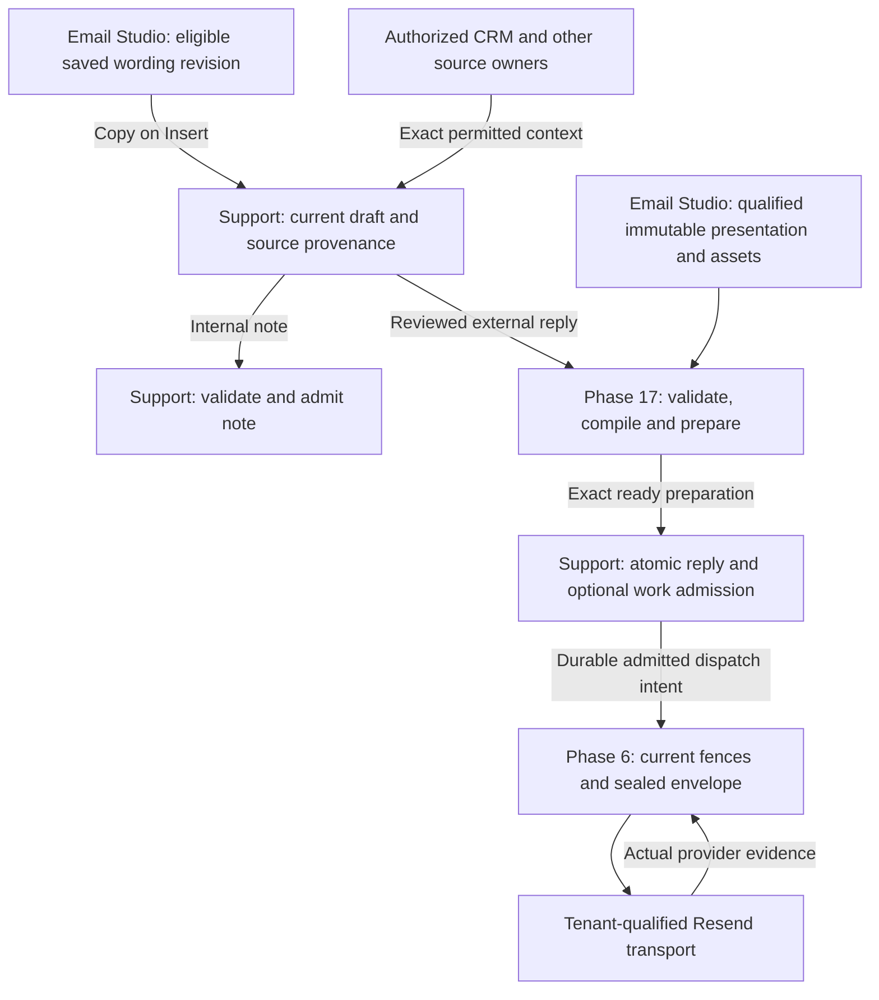

# Email Studio and Support Hub: the ratified integration boundary

**Fully founder-ratified D18 integration record, 11 September 2026.** This addendum makes the already accepted D4/D13/D18 responsibilities explicit, as requested during D18 ratification. It introduces no new product choice, implementation, formal OpenSpec change or external effect. [Full D18 ratification](phase26-d18-adversarial-review.md).

Email Studio is the common structured authoring, reusable-content, publication, presentation and qualified preparation owner. Support Hub owns the current conversation, human draft, note and explicit work/send intent. Phase 6 owns durable external dispatch and communication evidence through the tenant's qualified Resend connection. CRM, giving, documents, identity and care retain their authoritative records and actions.

## One capability, distinct effects

| Staff action or fact               | Authoritative owner                                                              | Exact boundary                                                                                                                                                                                             |
| ---------------------------------- | -------------------------------------------------------------------------------- | ---------------------------------------------------------------------------------------------------------------------------------------------------------------------------------------------------------- |
| Save to My replies                 | Email Studio reusable authoring                                                  | Commit one validated immutable authoring revision for the current tenant-membership custodian. This is not Shared publication, sending or a system-message template.                                       |
| Save Shared draft / Publish        | Same Email Studio owner                                                          | Unpublished edits remain a candidate. Publish changes the reviewed usable revision under standard/protected/tenant-stricter policy. It sends nothing and does not rewrite existing drafts or preparations. |
| Offer to Shared                    | Same owner with existing review/attention capability                             | Freeze the deliberately offered candidate and establish permitted destination asset occurrences. Maintainers gain no access to other My content or the inspiring CRM/conversation.                         |
| Find and preview                   | Email Studio authorized asset projection, consumed in Support                    | Current tenant, person, purpose, language and audience govern search, counts, old revisions, favorites and assets. Support has no synchronized second library.                                             |
| Insert / Replace / Undo            | Support's current draft, consuming an eligible source revision                   | Copy structured wording and provenance with fresh fill-in occurrences. Preserve caret/draft and current purpose. No publication, message admission, CRM write or business action.                          |
| Insert information                 | Actual qualified source-domain context; shared validator/compiler                | Server resolves exact authorized values. Display access is not automatically external disclosure. No first related Party, recipient or assignee inference.                                                 |
| Fill-in answer                     | Current Support draft, using a qualified Email Studio authoring node             | One-use bounded text. Required missing fields block the applicable admission command. No library/CRM write or recursive syntax.                                                                            |
| Language and style                 | Email Studio structured item/variant and existing presentation owners            | Exact authored language revisions and supported semantic content. No live snippet/translation graph, raw HTML authority or new Layout Role.                                                                |
| Reusable file/image                | Actual governed asset owner plus library/destination occurrence                  | Exact revision, purpose, access, readiness and retention. No Shared hotlink to personal custody; actual case/receipt/action artifacts stay with their source owner.                                        |
| Add note                           | Support's authorized note command                                                | Shared structured validation, separate Internal note draft and retained internal-only provenance. No external preparation, P6 envelope, Resend or email-material lifetime.                                 |
| Send reply                         | Support D4 admission plus P17 qualified preparation                              | Exact approved reply/audience/work choice is validated, compiled and durably prepared before atomic local admission. Preparation itself has no dispatch authority.                                         |
| External delivery and its outcome  | P6 communication/dispatch owner; Resend executes transport                       | Seal exact connection, sender/reply identity, bytes, assets, member relationships and idempotency before I/O. Reconcile truthful accepted/delivered/rejected/unknown evidence.                             |
| Automatic new-request confirmation | D13 source producer + separate P17 catalog/publication/preparation contract + P6 | Uses the qualified **Support request received** Email Studio template, source eligibility, one recipient and original utility window. It is not a human saved reply.                                       |
| CRM and actual business action     | The actual CRM/giving/document/care domain                                       | Library activity creates no Party, interaction, last-contact date, refund, receipt or task completion. Actual governed communication contributes only proper P6 evidence.                                  |
| Restriction, expiry and disposal   | Actual source, asset and records owners under D16/D17/P17/P6                     | Known source copies keep restrictions. Draft, admitted content, prepared execution material, Recent copy and authoring assets have distinct lifetimes.                                                     |

## Logical flow for human work

This diagram shows responsibility, not new API names or a claim that these services already ship.

The same source revision appears in the permitted library from Support or CRM. Real recipient context is confined to the authorized draft and preparation; shared Email Studio authoring previews remain synthetic. A maintainer can improve generic wording without seeing the donor data used when someone later inserts it.

## Personal Save is not Shared publication

D18 qualifies a bounded personal authoring revision. An ordinary author can save eligible generic wording for their own use without invoking the tenant's another-reviewer-for-every-publication rule. That rule applies to actual publication, not every human composition or personal saved phrase.

This is not a protected-source bypass. My items cannot admit protected system/artifact/layout sources or recipient-specific protected material stripped of provenance. Shared publishing still uses the owner's current floor and exact candidate review. A general `layout.manage` capability or nullable owner field does not grant personal read, Shared publication or exceptional custody rights.

Human Support replies remain outside the finite system-message catalog. Saved wording is not a whole system-message template; a full answer is still bounded body content. No Personal correspondence or Support reply Layout Role, new Brand Kit, arbitrary template key, provider-hosted rendering authority or second compiler is created.

## Notes reuse authoring without becoming email

Reply and Internal note are independently qualified purposes. They can reuse structured validation and fill-in controls without sharing external send authority. Notes retain their own Support admission, current source access and later D17 content lifecycle. They do not use the external human-reply preparation-material class.

Mode changes preserve separate drafts. External preparation rejects internal-only provenance, including content restored through Replace/Undo. Selecting note wording does not add a note, notify mentioned staff, delegate work or alter status. Those effects require their actual authorized commands.

## Preparation, admission and Resend

Before human Send-and-work admission, P17 supplies the exact ready validated/compiled preparation under the D4-qualified human body and presentation contract. Support atomically admits that exact preparation, reply intent, any explicitly selected work transition, safe history and durable dispatch obligation. There is no database transaction around Resend I/O.

P6 then owns the exact sealed transport request, tenant connection and current send fences. No production path launches the Resend CLI, calls an app-local sender, invokes a mutable provider template alias, changes account on failure or rerenders on retry. Already possible external effects reconcile under D4/P6/ADR0032; a lost response does not authorize a new send. Local Queued is not Delivered.

Native To/Cc group handling requires D2/D4's separately qualified shared-submission/member contract; a Resend batch of independent messages does not prove it. Never send the whole group once per member. Record one canonical communication effect per admitted recipient copy, linked to the shared submission, and keep provider evidence at its actual specificity.

D4's distinct maximum seven-day human-reply preparation-material class is an implementation qualification, not a library-retention period or permission to extend an earlier source/safety/utility/provider deadline. P17 execution material and P6/owner-qualified Recent copy remain separate; neither is a permanent transcript archive.

## D13 automatic confirmation stays separate

The automatic **New request confirmation** has its own qualified source occurrence, closed P17 message meaning, compatible published **Support request received** template, material profile and current sender/return-route proof. The inbox setting preserves Preview/Edit in Email Studio and a return path to the inbox configuration.

Saving a personal phrase, publishing Shared wording or opening Email Studio cannot activate automatic confirmations or replay old requests. D13's single qualified recipient, suppression rules and original fifteen-minute utility window remain unchanged. Ordinary held-mail release cannot renew that window. The template confirms receipt only, not human review, financial completion or a response-time promise.

## Source and data continuity

- The reusable item, revision, variant, audience, asset occurrence and contribution are Email Studio-owned authoring facts. Support stores only its own draft/admitted content and the justified source/provenance references it consumes; it does not synchronize a second editable library.
- An unsent insertion stays draft material with inherited restrictions. After actual reply/note admission, its Support original follows D17. Generic active reusable wording has its own authoring purpose and retention; known case-derived material cannot escape source disposal by being renamed a saved reply.
- Ordinary library edits and Archive do not rewrite safe old drafts. Current audience narrowing and safety restrictions apply to retained revisions, links and new use through the appropriate owner fences. In-flight sends retain truthful evidence.
- Deliberately offered files establish destination-governed custody before broader exposure. Creator departure cannot break valid Shared artifacts, but actual source/asset restrictions continue to propagate.
- Saving, favoriting, offering, publishing and inserting create no communication occurrence or CRM interaction. Actual Send contributes one canonical communication effect per admitted recipient copy, with the shared submission relationship and evidence at its actual specificity; it never creates duplicate CRM history. CRM projections never become library write authority.

## Explicit qualifications and proof trace

These are required applications of the already ratified decision. They are not ten new product choices or evidence that the current P17 implementation already supports them.

| Qualification                                                                             | Accountable owner                                     | Existing decision/proof trace                  |
| ----------------------------------------------------------------------------------------- | ----------------------------------------------------- | ---------------------------------------------- |
| Personal tenant-membership custody, Shared stewardship/audience and separate capabilities | Email Studio authoring + Core identity/authorization  | D18 R02/R03/R13/R17/R20; P19–P24/P29           |
| Nonpublication personal revision and actual Shared publication floor                      | Email Studio authoring/publication                    | D18 R03/R13; P22/P25/P34                       |
| Reply/Internal note source-purpose preservation and separate admission                    | Email Studio validator + Support                      | D18 R04/R11; P03/P13/P41                       |
| One-use required/optional fill-in schema, resolution and validation                       | Email Studio authoring/compiler + current draft owner | D18 R08; P08–P10                               |
| Independent authored languages and current audience over every exposed variant            | Email Studio locale/revision owner                    | D18 R09/R13; P11/P12/P21                       |
| Reusable asset purpose, destination custody, limits and source disposal                   | Actual asset/library/source owners                    | D18 R12/R14/R18; P16–P18/P25/P29/P30           |
| Bounded human body/presentation, exact ready preparation and material lifetime            | P17 preparation + Support D4                          | D4 R03–R10/R14; D18 P15/P22/P36                |
| Separate automatic confirmation catalog/profile/template/material qualification           | D13 producer + P17/P6                                 | D13 R03/R08/R09/R14/R16/R21/R24/R25            |
| Canonical data/dispatch path and source-safe migration                                    | packages/api owners + P6 + identity/database          | D18 R20–R24/R27; P23/P24/P34–P39/P45/P49       |
| Real privacy, owner-action, provider, capacity and accessible-journey proof               | Respective owners, release and product/UX             | D18 P01–P50 with inherited D4/D13 dependencies |

## Governing references and present limits

[ADR0030](https://github.com/Asymmetric-al/core/blob/7abd2c11ffd4ed70c6775c4fd6f51c996e4350dd/docs/adr/0030-canonical-message-document-and-presentation-dependencies.md#L18), [P17 compiler](https://github.com/Asymmetric-al/core/blob/7abd2c11ffd4ed70c6775c4fd6f51c996e4350dd/docs/prds/sitestacker-parity/phase-17-system-messages-template-management.md#L795), [publication](https://github.com/Asymmetric-al/core/blob/7abd2c11ffd4ed70c6775c4fd6f51c996e4350dd/docs/prds/sitestacker-parity/phase-17-system-messages-template-management.md#L810), [Saved Sections](https://github.com/Asymmetric-al/core/blob/7abd2c11ffd4ed70c6775c4fd6f51c996e4350dd/docs/prds/sitestacker-parity/phase-17-system-messages-template-management.md#L930), [capability foundation](https://github.com/Asymmetric-al/core/blob/7abd2c11ffd4ed70c6775c4fd6f51c996e4350dd/docs/prds/sitestacker-parity/phase-17-system-messages-template-management.md#L2473), [P6 A17/A18](https://github.com/Asymmetric-al/core/blob/7abd2c11ffd4ed70c6775c4fd6f51c996e4350dd/docs/prds/sitestacker-parity/phase-06-shared-communication-event-model.md#L175), and [ADR0032](https://github.com/Asymmetric-al/core/blob/7abd2c11ffd4ed70c6775c4fd6f51c996e4350dd/docs/adr/0032-immutable-prepared-message-and-whole-message-recovery.md#L19) supply the shared foundation.

[D4](phase26-d4-adversarial-review.md), [D13](phase26-d13-adversarial-review.md), [D16](phase26-d16-adversarial-review.md), [D17](phase26-d17-adversarial-review.md) and [D18](phase26-d18-adversarial-review.md) supply the ratified specific extensions. The [independent seam audit](phase26-d18-email-studio-seam-review.md) found no unresolved product conflict. Its implementation qualification list and this mapping prevent a future implementation from mistaking a general Saved Section capability for completed personal-library safety.

[Ratification validation](d18-ratification-q19-validation.json) proves documentation preservation and traceability, not deployed compiler, personal privacy, RLS, provider delivery, migration/restore, performance or accessibility. No runtime/schema, formal specification, tickets, external state or messages changed.
