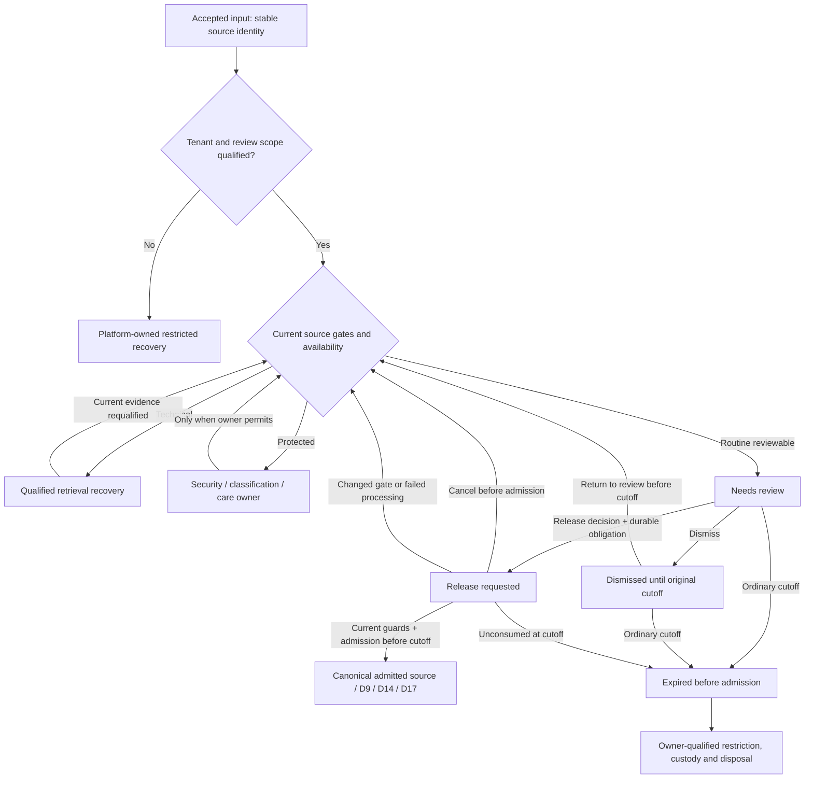

# Intake review: data, lifecycle and owner boundaries

This fully founder-ratified D19 contract, 12 September 2026, supplements [R01–R30 and the complete review](phase26-d19-adversarial-review.md). Names below describe required facts and invariants, not new physical table/API names. The [current-source register](phase26-d19-evidence.md) identifies what already exists and what remains to qualify.

## Authoritative ownership

| Fact or action                                                               | Owner                                                           | Required invariant                                                                                                     |
| ---------------------------------------------------------------------------- | --------------------------------------------------------------- | ---------------------------------------------------------------------------------------------------------------------- |
| Provider receipt, provider account/connection and retrievable provider bytes | Qualified receiving integration and provider                    | Bind tenant from trusted integration/routing evidence; a webhook signature does not identify the human sender.         |
| Accepted logical input and recovery disposition                              | Canonical intake owner                                          | Stable source/connection identity; retained or explicitly recoverable outcome; no surrogate re-ingestion after expiry. |
| Content retrieval/scan availability                                          | Receiving/asset/security owner                                  | Technical completeness and safety are distinct; optional missing files cannot masquerade as clean files.               |
| Safety/classification gates                                                  | Actual security/classification/care domain                      | Routine business review can resolve only its allowed reason class; multiple gate conjunction is preserved.             |
| Reviewer designation and coverage                                            | Support responsibility using existing membership/team authority | Designation does not grant data access; effective qualified coverage is evaluated now.                                 |
| Tenant oversight                                                             | Qualified tenant operations responsibility                      | Health/coverage scope does not imply body access or authority to clear restricted gates.                               |
| One-input review decision                                                    | Intake review owner                                             | Versioned immutable decision receipt, current authorized actor, no persistent routing/trust side effect.               |
| Future routing/sender policy                                                 | Actual routing/security policy owner                            | Separate mutation, scope review and evidence; a rule edit cannot overrule dismissal or security.                       |
| Canonical Support admission                                                  | Support intake/source owner                                     | One authorized admission effect per qualified input occurrence; actual source/custody commit establishes readiness.    |
| CRM Party/relationships/business records                                     | Asym Postgres CRM and actual domain owners                      | No copied CRM, automatic Party creation, consent change or business completion from review.                            |
| Conversation discovery on CRM                                                | D9 source-backed authorized projection                          | Held mail absent from ordinary timeline; actual admitted source appears once under joint authority.                    |
| Human/automatic message preparation and sending                              | Email Studio/Phase17; Phase6/tenant Resend                      | D18 human authoring and D13 automatic confirmation remain distinct; review owns neither delivery nor templates.        |
| Ordinary held payload lifetime                                               | Intake semantic owner with actual records/asset custodians      | Proposed 14-day class; finite published policy, original receipt, earlier owner ceilings and independent preservation. |
| Review/technical/control audit retention                                     | Each evidence owner                                             | Typed minimized facts with actual horizons; not forever merely because no body is present.                             |

## Orthogonal state, not an overloaded ticket status

Keep these axes distinct even if the implementation stores projections together:

1. **Binding:** trustworthy tenant/review scope, or platform-owned unbound/conflict.
2. **Availability:** payload/files available, pending, unavailable, restricted or expired.
3. **Gates:** current source-owned reasons, evidence/policy revision and permitted resolutions.
4. **Review:** pending, release requested, dismissed, or corrected through a later decision.
5. **Admission:** absent, in progress, admitted with exact source receipt, or blocked/failed with recoverable evidence.
6. **Custody/disposal:** live ordinary purpose, restricted required custody, disposal obligations, actual disposed/residual result.

No new Open/Waiting/Resolved conversation state is introduced to model these pre-admission facts. A title, status, team name or existing claim flag does not prove any other axis. An item may be dismissed and still contain protected required bytes; that does not make it ordinary-reviewable forever.

This is a logical ownership flow. Technical/protected/unbound classes have their own qualified finite schedules; the ordinary cutoff arrows do not grant deletion authority over them. An admission result and its downstream communication evidence remain distinct.

## Required stored/control facts

| Record concept                   | Minimum qualified facts                                                                                                                               | Constraints and lifetime                                                                                                                                     |
| -------------------------------- | ----------------------------------------------------------------------------------------------------------------------------------------------------- | ------------------------------------------------------------------------------------------------------------------------------------------------------------ |
| Accepted input                   | Tenant binding when proved; provider connection/source identity; original receipt evidence; platform acceptance; payload generation/frontier          | Provider replay identity and durable admission uniqueness; raw content follows its actual class; platform-null binding never leaks into tenant review.       |
| Review coverage                  | Tenant/inbox, existing member/team references, backup/oversight references, version and trusted actor                                                 | Equal-tenant relations; no email-address identity; dynamic effective eligibility; changes audited.                                                           |
| Gate evidence                    | Source ID/version, closed reason, actual owner, evidence/policy revision, current permitted resolution                                                | Multiple gates conjunctive; sender-provided text is not system evidence; classification details protected.                                                   |
| Review decision                  | Tenant/input, decision sequence, action, reviewed source/version/scope, actual actor profile/membership, trusted decision instant and command receipt | Immutable when durably accepted; subsequent corrections append; corrections append; exact retry returns existing outcome; no generic editable approved flag. |
| Current disposition              | Exact input + current decision sequence, finite processing/error/terminal outcome reference                                                           | One current state through compare-and-set/locking; invalid combinations rejected.                                                                            |
| Admission obligation and receipt | Durable effect identity, exact input occurrence, eligible destination/correlation scope, source cutoff/gates, actual admission linkage/time           | Decision/outbox atomic; admission consumed once; duplicate worker resumes secondary effects without duplicate message.                                       |
| Payload schedule                 | Owner class/version, original qualified receipt, materialized cutoff, current effective policy/earlier restrictions                                   | At equality no positive admission; no touch renewal; unknown receipt uses the separately bounded restricted recovery class, not guessed now.                 |
| Restriction/disposal evidence    | Exact original source/copy frontier, source restriction, actual custody/holds, owner obligations/results                                              | No new surrogate input can evade tombstones; physical deletion separate from ordinary authority end.                                                         |
| Attention/report projections     | Source event/condition, authorized tenant/inbox scope, units, freshness, source-end evidence                                                          | No copied bodies; not authoritative work; current permissions and source eligibility rechecked.                                                              |

Use existing canonical records where they satisfy these invariants. Do not freeze an unnecessary forest of new tables. A decision event stream here is a bounded business history, not a new platform event-sourcing migration. Index current review work by tenant/scope/state/deadline with stable ordering. Constraints should prevent contradictory tenant references, duplicate admission and editable attribution, while owner commands enforce action semantics that cannot be expressed in a simple check.

## Mutation and authorization contract

List and detail commands return safe projections through packages/api. Review commands accept only the caller's selected action/target where permitted, expected source/decision version and logical request identity. Tenant/actor/profile/author/time/approval are resolved by the server. A caller must not replace the source ID, tenant, target, reason revision or profile through a generic update.

For every command, qualify: current authenticated tenant membership; explicit effective review designation; action capability; source/reason/classification; current available payload; source and destination scope; prior state/version; finite policy authority. Deferred positive work rechecks current deciding-actor designation/capability as well as source/destination gates; the service worker's privilege is not the actor's continuing authority. Current eligibility does not mean rewriting historical attribution after someone leaves.

Keep raw intake/review data server-only. Existing RLS-enabled/no-browser-grants posture is valid. Service-role/BYPASSRLS access is not self-authorizing. If an exposed ordinary update is allowed, specify and prove old-row eligibility and new-row validity. PostgreSQL can use USING as the applicable default check when WITH CHECK is omitted; omission alone is not the finding. A same-tenant predicate still does not constrain changing inbox, actor or forbidden state. Protected views, definer functions, search paths, RPC execution grants, storage URLs and owner jobs require the same boundary.

Tenant-aware relationships are structural: review→input, review→route, route→inbox, review→decision/admission, member/team→tenant and any conversation reference must agree. Source identity and original event evidence are not mutable caller fields. Required history must not cascade away with an inbox or staff record. A held input cannot be force-linked to a guessed tenant or current CRM contact to satisfy a database constraint.

## Durable effect and correction sequence

Example: decision sequence 7 requests release; its durable obligation references sequence 7 and source version 12. A repeated network request returns the same command receipt. A worker replay cannot invent another admission. If an authorized cancellation commits sequence 8 before admission, the sequence-7 obligation is no longer positive authority. A new valid release at sequence 9 gets its own decision receipt but still targets the same input's single admission effect. It cannot consume a stale rejected/expired sequence as permission or create a second conversation.

If admission wins first, cancellation reports **Already released**. Review correction history may be appended, but actual admitted work is corrected by its owning commands. If the outcome is unknown, reconcile the admission effect before promising a result. Never free a transient work claim and assume that prevents a duplicate hours later; durable uniqueness and source guards provide that guarantee.

Decision, audit receipt and dispatch obligation commit atomically. When admission requires a separate transaction, its source-to-Support linkage and custody receipt commit atomically once. A transaction failure creates no partial business success. A committed receipt followed by lost response remains reconcilable. Provider fetches, scans and network delivery run outside database transactions and cannot refresh expired authority.

## Temporal and custody examples

All examples assume the ordinary class is qualified and no earlier restriction applies. They illustrate proposed exact boundaries, not existing runtime results.

| Scenario                                                                 | Required result                                                                                                                                                                                                                                                                                                            |
| ------------------------------------------------------------------------ | -------------------------------------------------------------------------------------------------------------------------------------------------------------------------------------------------------------------------------------------------------------------------------------------------------------------------- |
| Qualified provider receipt 12 Sep 2026 02:10 UTC, ordinary 14 days       | Cutoff 26 Sep 2026 02:10 UTC: exactly 1,209,600 seconds. Viewer timezone changes display only.                                                                                                                                                                                                                             |
| Reviewer opens every day; dismisses day 3; returns day 10                | Same original cutoff; no touch/dismiss/reopen renewal.                                                                                                                                                                                                                                                                     |
| Release requested one second before cutoff, admission commits at cutoff  | No admission of expired payload; truthful expired/blocked outcome and no D17 lifetime.                                                                                                                                                                                                                                     |
| Admission/custody commits before cutoff; provider callback arrives later | Existing admitted source retained under D17/actual owners; duplicate callback does not create new content.                                                                                                                                                                                                                 |
| Eligible automatic confirmation considered after an hour held            | D13 utility has ended; release creates no new 15-minute window.                                                                                                                                                                                                                                                            |
| Missing original receipt                                                 | Restricted timing recovery: once-set first trusted platform acceptance, otherwise first explicit legacy recovery registration; 24-hour review, at most14-day normal recovery access, earlier source limits honored. No fabricated receipt, renewed restriction or ordinary admission until original evidence is qualified. |
| Valid policy lengthening before expiry; stale worker has old deadline    | Owner-effective policy governs; stale worker cannot destroy on old projection.                                                                                                                                                                                                                                             |
| Policy lengthening at/after expiry before physical cleanup               | Old bytes remain expired; worker lag is not recoverability.                                                                                                                                                                                                                                                                |
| Hold arrives after logical expiry but before physical disposal           | Preserve only still-existing required bytes in restricted custody under the real owner; ordinary review stays unavailable.                                                                                                                                                                                                 |
| Provider fetch finishes after expiry/redaction                           | Current source/copy fence prevents persistence/rehydration; no new surrogate input or reset timestamp.                                                                                                                                                                                                                     |
| Unknown tenant later bound correctly                                     | Original evidence/lifetime remains; no new receipt or synthetic lifetime on tenant binding.                                                                                                                                                                                                                                |
| Optional attachment unavailable but D1 permits admission                 | Show exact unavailable file fact; no claim that bytes or scan exist; essential requirements still block.                                                                                                                                                                                                                   |

Ordinary expiry removes body/subject/snippet/parsed/raw/header/address/filename/URL and derived content from normal review according to the owner inventory. Minimal typed source/decision/admission/restore facts survive only under their actual qualified horizons. Required independent financial/care/records evidence stays with its real domain. There is no cleanup by deleting a conversation parent or exporting the body into a permanent “audit note.”

The 14-day period does not replace D17's separately ratified ended-work retention policy. Phase26 owns intake schedule meaning; Phase21 supplies no blanket semantic authority. Tenant edits use only published qualified finite variants/bounds. Technical, security/care and unbound recovery need actual owner schedules before activation; those schedules may impose stricter availability and preservation than routine review. Generic missing policy cannot be quietly treated as unlimited storage, permission to destroy, or a fresh ordinary period.

## Current source gaps and migration order

The evidence register pins actual files. Current route-save intentionally changes future routing and resumes other matching pending inputs; its semantics are broader than release. Current retry handles technical retrieval; existing empty-body and fallback-time behavior conflicts with accepted D1/D13/D14 intent. The current admission bridge uses a pre-read rather than a proven unique input-to-admission transaction. Some tenant relationships and actor/audit paths require hardening. These are inspected implementation gaps, not proof of a production exploit.

First qualify owner identities and contracts; add constrained source/decision/effect records and current guards; then retire conflicting old write paths; then activate safe readers, commands, attention and the UI per inbox. Legacy gaps are reconciled under bounded owned exceptions without fabricated reviewer history or new retention anchors. Do not let mixed-version old binaries resume writes after new dismissals/expiry. Preserve all new negative controls through restore/rollback. A worker kill switch stops positive execution, not read restrictions or elapsed content authority.

No SQL migration, formal OpenSpec requirement or runtime feature is implemented by this contract. Its necessary outcomes map to D19 P01–P42 for the later authorized implementation stage.

## Ratification and Email Studio clarification

The founder fully ratified all D19 amendments, definitions, UX/data/evidence, independent corrections and required proof on 12 September 2026. The [Email Studio integration addendum](phase26-d19-email-studio-integration.md) restates the accepted owner seam with no new product choice or implementation claim. Historical proposed/pending/no-Q20 statements above are superseded as to acceptance and advancement only. [Ratification and Q20 validation](d19-ratification-q20-validation.json) preserves the historical evidence separately.
