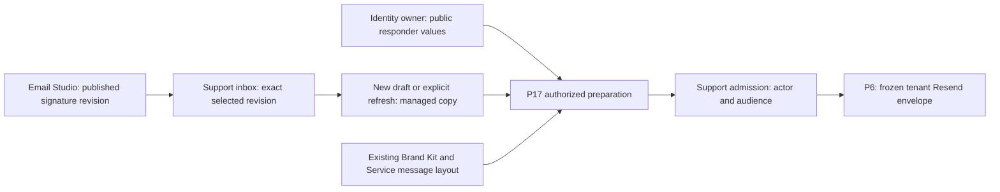

# Signature ownership, copy-in and Email Studio integration

This fully founder-ratified D23 contract, 12 September 2026, accompanies [R01–R28](phase26-d23-adversarial-review.md). It defines logical invariants, not invented physical migrations or proof of existing services. The founder selected A and Tiptap; the full amendments are fully ratified.

## Ownership matrix

| Fact                                                      | Owner                                                                | Authoritative versus derived                                                                                                |
| --------------------------------------------------------- | -------------------------------------------------------------------- | --------------------------------------------------------------------------------------------------------------------------- |
| Authenticated human and active tenant membership          | Core identity/IAM                                                    | Trusted server identity; no email-match authorization.                                                                      |
| Public responder presentation                             | Existing shared identity/profile owner, minimally extended if needed | Tenant-membership-scoped public name/optional qualified title; distinct from legal/full name, login, IAM role or CRM Party. |
| Signature source and authored variants                    | P17 Saved Section authoring, purpose Reply signature                 | One canonical structured source with immutable revisions/publications.                                                      |
| Signature selection for an inbox                          | Support configuration through packages/api                           | Exact published revision and qualified locale-resolution binding with expected revision.                                    |
| Compatible Brand Kit / Service message Role Layout        | P17 presentation owners                                              | Existing complete immutable dependencies, no new per-inbox Role Layout.                                                     |
| Managed signature copy                                    | Support draft, through qualified P17 copy/validation                 | Copy of exact published variant plus provenance; not a live source lookup.                                                  |
| Complete reviewed preparation                             | P17, with Support/identity/owner-authorized facts                    | Immutable complete document, compiled HTML/text, dependencies, source/actor/audience and hashes.                            |
| Actual mail envelope, tenant Resend and delivery evidence | P6 / existing provider adapter                                       | Sealed request and provider evidence; signature strings are not delivery proof.                                             |
| CRM identity, relationship, contact, giving/care work     | Actual existing business domains                                     | No authoritative support-side copies or signature-driven updates.                                                           |
| Library usage/impact, search and caches                   | Owner-qualified projections                                          | Rebuildable and current-access constrained; never write or retention authority.                                             |

P17's canonical Asym message includes Tiptap JSON but is broader than an unvalidated editor tree. Client-provided HTML/plain text, extra extensions and raw profile properties do not satisfy the canonical contract. Actual current code gaps are documented in the [data review](phase26-d23-data-review.md) and [Tiptap review](phase26-d23-tiptap-review.md).

## Why copy-in, not a new layout or live fragment

ADR0030 and P17 define Saved Sections as authoring copies. D23 adds a narrow qualified signature purpose rather than violating that invariant. The inbox consumes a published source revision; the draft receives a managed copy. P17 then compiles that complete document under the already-qualified common presentation.

The arrows do not imply CRM synchronization or a live lookup on delivery retry. Copy source identity, publication revision, selected locale, content hash and effective owner-control revision are provenance. Authorized public-value resolution is a separate preparation fact. Once a complete preparation is admitted, no signature-source/profile/default edit changes its bytes.

## Logical constraints and trusted mutations

Use the actual owning tables/types after inventory. The following invariants are mandatory regardless of physical names:

- Each reusable signature has one immutable tenant/source identity and one code-owned purpose. All locale variants and publications reference that tenant/source. It is shared tenant-custodied content, never personal because owner_agent_id happens to be null.
- Published source structure, publication/variant identities and compiled evidence are immutable. Mutable labels/descriptions cannot smuggle changed content into an existing revision. Editing/restoring creates a new candidate.
- Each inbox has one current versioned selection/posture. An exact compatible publication plus deterministic authored-locale policy resolves at most one full variant. Optional team fallback or no-optional-signature is explicit; unresolved required data is not an empty success.
- Same-tenant composite references bind inbox, source, publication, asset and member endpoints. Use actual endpoint data types consistently; reference strings are not actor identities. Index referencing lookup columns according to real plans rather than assuming FK creation indexes them.
- Creator, editor, reviewer, applier and responder remain distinct trusted actor facts. Caller supplies intended content and expected revisions, not trusted tenant, publisher, audit author or security-control status. Creation and update have different identity semantics; lost/missing update target does not become new content through upsert.
- Current capability/resource checks precede mutation and are rechecked at the atomic effect. An allowed row update cannot alter tenant, purpose, custody, canonical parent or published status arbitrarily. Derive these through the owning command and constrain permissible columns/state combinations.
- Published sources and already admitted communications do not depend on a departing agent row's cascading lifetime. Preserve minimized attribution and necessary source-control evidence under owner retention. Ordinary deletion cannot cascade through shared publication, history or independent CRM records.
- A draft has at most one managed signature occurrence, whose copied structure/provenance and explicit omission state participate in the draft revision. Public values and copied source stay distinct. A raw body match is not occurrence identity.

Review table/column grants, direct REST/collection writes, service clients, maintenance/import paths, exposed views/RPCs, storage paths and restored permissions. Evaluate SELECT plus effective UPDATE USING and WITH CHECK; PostgreSQL may derive a missing check from USING, so audit effective behavior. Prefer invoker behavior where applicable; genuinely needed definer functions have narrow execute grants, fixed safe search path, fully qualified relations and current actor/resource authorization. A service-role client bypassing RLS must enforce the same domain boundary; its trusted tenant context alone does not prove publication authority.

## Public responder values

The minimal extension, if existing fields cannot qualify, belongs to the existing shared identity owner and exact tenant membership. A public display string and optional public role/title are explicitly externally usable under owner policy. They neither establish role authority nor alter legal/auth/CRM names. The current generic profile displayName update also changes full_name, so it cannot be repurposed as this command without correcting its semantics at the owner boundary.

Self maintenance affects only one's authorized public presentation; tenant governance can constrain or maintain it through existing scoped capabilities. “Approved” means currently eligible under those rules, not a mandatory second reviewer. A readonly view or private employee field is not automatically eligible for email disclosure. Header and body contexts have distinct validation; signature body text must not inherit an overrestrictive ASCII/header-only name policy. Team-only/no-name policy remains an explicit valid configuration.

No email address proves the mapping among auth user, profile, membership, Support agent and CRM Party. Changed email, merged Party, shared church address, reassignment or newly invited same-address account cannot take over another responder's identity. If a valid actual actor cannot be established, D1's actor failure applies; the system cannot pretend a human reply came from System merely because team-only text would render.

## Source, binding and draft transitions

| Operation                                    | Required boundary / valid result                                                                                                                            | Forbidden result                                                                                                                                                    |
| -------------------------------------------- | ----------------------------------------------------------------------------------------------------------------------------------------------------------- | ------------------------------------------------------------------------------------------------------------------------------------------------------------------- |
| Create / Duplicate source                    | New stable identity and unpublished candidate; duplicate has provenance                                                                                     | Existing signature mutated by accidental id reuse; auto-published legacy content.                                                                                   |
| Autosave candidate                           | Expected candidate revision, authorized structured content, new revision receipt                                                                            | Stale write wins; unsupported input stripped and saved; optimistic Saved before confirmation.                                                                       |
| Commit / Publish                             | Existing P17 immutable candidate, validation/review, expected publication head                                                                              | Caller sets Published; previous publication destroyed on failure.                                                                                                   |
| Select / apply publication                   | Exact eligible revision, expected inbox binding, current scoped authorizations; atomic replacement/history                                                  | Clear default then set; first-row fallback; private/personal/cross-tenant source bound.                                                                             |
| Apply to selected inboxes                    | Explicit bounded set with expected heads and same current source generation; all or none                                                                    | Hidden entire-tenant update or ambiguous partly applied selection.                                                                                                  |
| Publish and use                              | Distinct publication result then qualified apply result; durable retry reconciliation                                                                       | Unpublished source selected; Applied claimed after only publication; republish to retry apply.                                                                      |
| New draft copy                               | One exact selected variant copied into managed slot                                                                                                         | Mutable live Saved Section node or repeated append per render.                                                                                                      |
| Refresh / hide / restore optional block      | Current draft revision, omission preserved by refresh, retained pinned copy shown by Restore after current checks, visible result and undo before admission | Body/recipients/attachments overwritten; hidden signature silently revealed; unselected newer version substituted; mandatory footer removed; cross-mode disclosure. |
| Prepare / admit                              | Current actual responder/audience/source/identity eligibility; exact full content frozen                                                                    | Assignee as responder; stale revoked value; client HTML overriding canonical JSON.                                                                                  |
| Routine source publication or default change | Existing bindings/copies retain exact pins until deliberate apply/refresh                                                                                   | Silent update of existing drafts/history or re-render of approved send.                                                                                             |
| Routine archive                              | No new selection/copy; effective consumer references explicitly replaced or posture reviewed before atomic archive                                          | Dangling defaults; implicit team or no-signature fallback; archive blocked on parsing a broken body.                                                                |
| Safety restriction                           | Immediate current-use fence under actual owner and repair obligations                                                                                       | Waiting for all inbox managers, treating ordinary Archive as recall, rewriting possibly sent mail.                                                                  |
| Restore                                      | Current eligible new candidate/publication as required; no implicit rebinding                                                                               | Removing safety fence or resurrecting disposed data because a prior version existed.                                                                                |

Source publication is not globally coupled to all inboxes. A new signature can publish unassigned, and a manager can keep an old still-safe selected version. The normal UI offers the new version and deliberate application. Existing P17 Brand Kit/layout dependency graph validation remains independently required for those shared dependencies; a signature source is not used to bypass it.

Archive-in-use is exact: an explicit Replace and archive operation validates its entire current affected binding set and source revision, current source/manager rights and replacement/posture eligibility, then commits those replacements and the archive atomically. A concurrent new binding or permission change conflicts. Bound the set under the owner command contract. For an over-bound complete set, deliberately rebind authorized bounded subsets first while the source remains active, then archive against the complete current remainder; never silently truncate or claim an archive while it remains active. A source author without the necessary affected-inbox rights cannot perform this ordinary transition; they can use the existing configuration handoff. Safety restriction does not require that quorum and preserves current no-use fences even when repair is unavailable. This avoids both silent breakage and a new bespoke approval workflow.

## Editor and rendering contract

Tiptap uses a versioned code-owned profile aligned with the canonical server allow-list. The signature profile is narrower than general Reply/Note profiles. Validate original JSON keys, attrs, shapes, source ids, purpose and budgets before parser normalization, then schema and semantic/output rules. Supported pasted styling can be normalized with a loss notice; unknown saved semantic structure is held read-only for reviewed migration. Content-error callbacks stop writable fallback and autosave of altered content.

The source remains Tiptap JSON; browser HTML, HTML-only signature forms and independent bodyText edits are removed from authoritative writers. Use a shared restricted link/asset profile for signatures without globally expanding the Post editor's HTTP/HTTPS-only policy. P17 maps allowed nodes to email-compatible HTML and genuine plain text; static-renderer/React Email APIs are mechanisms, not policy. Compiling occurs against declared numeric budgets and actual supported Node/dependency versions. The installed 3.22.3/3.23.1 mixture must be reconciled and tested against the qualified stable cohort, not merely hidden behind a ^ range.

## Email Studio and Resend seam

Human replies remain outside the finite system-message catalog. **No new system-message template key is required for signatures.** The reusable published signature source is an Email Studio authoring asset, not a Resend provider template. D13's **Support request received** remains its own real template with eligibility/deduplication; it does not impersonate a responder or satisfy a human-reply target because a public-name token exists.

Signature management, preview, application, source search and per-draft refresh/hide perform no provider call. An actual human reply uses P17's ready exact preparation, Support's atomic current-source/actor/audience admission, then P6's sealed tenant Resend envelope and current delivery evidence. No direct client/backend Support sender, mutable template id/alias, provider-side re-render, global credentials or donor-contact synchronization is introduced. Resend CLI is operational tooling for an explicitly authorized later test/admin action; it is not an app runtime compiler or alternate send path.

The existing raw-body webhook verification and owner/connection/envelope mapping continue unchanged. Signature edits do not reset idempotency keys, restart acknowledgements, change replies, split group envelopes or repair delivery by resending. Possibly submitted work is reconciled with its original exact effect. Provider-rendered/client-downloaded images are not proof of message reading or identity.

## Retention and traceability

Do not keep raw public-name values in an eternal source history to explain a message whose content has expired. Source revisions, controlled publication artifacts, approved draft copies, prepared messages, original admitted content, minimal delivery/security audit and replay fences each follow their actual finite owner lifetime. D16 restrictions/D17 expiry/D22 indexing apply to the original source and known derivatives; a reusable-source reference cannot extend body retention. Search reuses eligible historical admitted text rather than looking up today's public profile or the signature library. Restore cannot serve before current source/permission/retention fences are applied.

Audit source and binding mutations with minimal actual actor, source/target revision, cause, command/result and safe timing. Communication history is created only through actual message admission. Public-name/profile and CRM history remain separate; signatures never update contact timestamps, giving outcomes, reply metrics or coordination. [R01–R28/P01–P44](phase26-d23-adversarial-review.md) are the exact acceptance trace. No deployed database, RLS, renderer, email client or provider proof is claimed by these logical requirements.

## Ratification and Email Studio clarification

The founder fully ratified D23 and every adopted amendment, definition, UX/data/evidence correction and required proof on 12 September 2026. The [Email Studio integration record](phase26-d23-email-studio-integration.md) and [independent seam review](phase26-d23-email-studio-seam-review.md) explicitly preserve the accepted source/copy/publication/application/identity/preparation/delivery boundary. Historical proposed/pending/no-Q24 wording is superseded only as to acceptance and advancement. [Ratification validation](d23-ratification-q24-validation.json) keeps previous evidence unchanged; all 44 implementation proof groups remain required and unexecuted.
