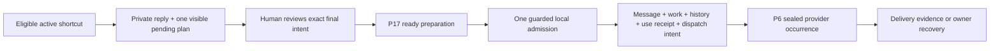

# Reply-and-work shortcuts: ownership, admission and maintenance contract

**D24 C and every adopted amendment fully founder-ratified, 12 September 2026.** This grooming contract implements the meaning of [D24-R01–R30](phase26-d24-adversarial-review.md) at domain boundaries without authorizing runtime/schema implementation. Names below describe required facts and invariants, not frozen table/API/package names. D1–D23 remain fully ratified.

## Authoritative owners

| Fact/capability                                                                                          | Authority and permitted consumer                                                                                                                                                      |
| -------------------------------------------------------------------------------------------------------- | ------------------------------------------------------------------------------------------------------------------------------------------------------------------------------------- |
| Requester/original conversation, participant audience, actual human responder and current Support access | Existing D1/D2/D10 Support + shared identity authorization. A selected shortcut consumes current authorized context.                                                                  |
| CRM Party, relationships, represented organization, owner, giving/care/project facts                     | Respective shared/owning Core domains. Support links and navigates under current permissions; shortcut use never creates identity or mutates these facts.                             |
| Reusable wording, source variants, typed variables/fill-ins, asset occurrences, publication              | P17 Email Studio and ratified D18 shared Reply purpose. One exact eligible source dependency; no Support-owned body duplicate.                                                        |
| Shared rich authoring and safe rendering                                                                 | D23's governed Tiptap purpose profiles and canonical validation/compile path. Tiptap is an editor, not permission or command authority.                                               |
| Public responder presentation and signature                                                              | Existing identity public-presentation owner + D23 inbox signature selection/copy. Shortcut plan cannot override either.                                                               |
| Shortcut configuration, scope, candidate/active revision and archive                                     | Support's narrow human-form preset owner, using current tenant capabilities. Configuration publication does not grant wording publication or execution rights.                        |
| Private body and staged Support choices                                                                  | Existing private Reply draft boundary with one coherent draft revision/history. Stage metadata has no live mutation authority.                                                        |
| Final status, reminder consequences, team/person handling, label membership                              | Existing D3/D4/D6/D7/D8/D10/D21 Support invariants. Shared transaction-capable mutation primitives are qualified before compound activation.                                          |
| Validated and compiled reply preparation                                                                 | P17 ready immutable preparation for the exact reviewed content/audience/locale/signature/assets. It cannot dispatch until claimed by the admitting owner.                             |
| Local message/work effect, use receipt, before/after history and dispatch intent                         | D4's single authorized local admission transaction extended for the closed patch. It is not a configurable workflow run.                                                              |
| Provider envelope, attempts, delivery/suppression/ambiguity and reconciliation                           | P6 and the configured tenant Resend path. Prepared bytes and durable owner occurrence remain authoritative. Resend CLI is operational tooling, not a second runtime or template path. |
| Configurable automation vocabulary/run state                                                             | Phase34. D24's fixed form fields introduce no parallel trigger/condition/action registry or workflow interpreter.                                                                     |
| Future product AI route, egress and suggestions                                                          | ADR0099 foundation consumed by Phase40, not ADR0035's GitHub-session engineering Eve. No AI capability is activated now.                                                              |

## Email Studio seam: explicit and complete

The shortcut form contains an exact published Shared D18 Reply reference and its eligible variant policy. It does not contain separately editable HTML, plain text, a live mutable fragment graph or a second template. Personal My replies require deliberate contribution into the existing shared content process before a shared shortcut can expose them.

**Create/Edit wording in Email Studio** opens the same P17 source editor using the selected Tiptap purpose profile and preserves return context to the Support candidate. P17 validates schema, allowed variables, required fields/fallbacks, language, assets and publication rules. Support cannot publish by accepting an ID or an `active` flag. Publishing source content does not activate the shortcut or update active pins. Support activation separately validates its exact shared source, scope and typed work choices.

At use, D18 copy-in places the exact structured variant and introduced asset occurrences into the actual private Reply document. Subsequent human editing changes that draft, not the reusable source. On Change shortcut/Keep current reply, the new source is not copied and the retained body keeps its true provenance. Source withdrawal/restriction still applies to known copied derivatives; detaching the shortcut cannot launder restricted content.

D23 supplies the managed signature; existing P17 shared frame/Brand Kit/layout applies under its real contract. There is **no new system-message template key**, new per-shortcut Role Layout or signature appended invisibly at send time. Human shortcuts are not D13's Support request received automatic confirmation and cannot enroll a campaign. HTML and real plain text are compiled from one final canonical document. Provider-hosted templates or test-send endpoints are not a substitute for this path.

P17 can prepare the exact final reply before the local Support transaction. Claiming a ready preparation belongs to the transaction admitting the human reply. Orphaned unclaimed preparation follows the existing finite owner cleanup and has no dispatch authority. No general distributed transaction across template editing, content publication, Support activation or Resend I/O is implied.

## Minimal configuration and draft facts

| Record purpose             | Required facts/invariants                                                                                                                                                                                                                                                                           |
| -------------------------- | --------------------------------------------------------------------------------------------------------------------------------------------------------------------------------------------------------------------------------------------------------------------------------------------------- |
| Shortcut identity/custody  | Tenant-scoped stable identity, plain name/guidance, authorized use scope, current configuration custody, lifecycle and optimistic revision. Creator is audit evidence, not permanent sole owner.                                                                                                    |
| Immutable shortcut version | Parent identity, exact eligible shared Reply source/variant policy, closed typed patch, compatibility version, trusted activation evidence. No copied body or arbitrary program. One active head at a time.                                                                                         |
| Editable candidate         | Parent/version lineage, editable permitted fields, completeness/validation results and current expected head. Incomplete safe draft can persist; structural invalidity or unsupported action language cannot activate.                                                                              |
| Private draft plan         | One optional shortcut identity/version, staging mode (inserted/replaced/kept-current), actual source/asset provenance, locally adjusted typed patch, relevant context/revision preconditions and coherent draft-history identity. No resolved donor-fact archive or reusable privilege token.       |
| Admission/use receipt      | Existing durable reply intent + exact config/source provenance, actual staging mode/final patch, trusted actor and admission timestamp, no-op/actual outcome evidence. Unique per durable admission identity, with immutable semantic hash. No second full body or mutable execution status recipe. |
| Projection                 | Authorized health/last-use/counts and contextual plan preview. Derived and replaceable; never publication, access or mutation authority.                                                                                                                                                            |

The final work dimension is Keep current status, Open, Waiting for requester, Waiting on our side or Resolved. Handling uses Keep or an explicit resulting compatible team/person/Me/Shared choice; preserve current team unless deliberately changed. Label additions and removals are disjoint unique stable IDs. No arbitrary ordered action array, toggle, script or conditional DSL is admitted. The same ID cannot be both added and removed. The resulting relationship and actual original-source label contributors are validated; labels are not root-only copied tags.

Keep is omission of a requested mutation, not a captured status/person that can later overwrite concurrent work. Me resolves from the actual current human, not stored creator/assignee identity. Already assigned Me is a deliberate reassignment with concurrency review. Valid manual D6 eligibility is not restricted to automatic routing pools/limits. D7 runtime Keep and D8 review decisions cannot be stored as reusable override actions. Label source eligibility is operation-specific: Add requires an active eligible catalog item, while exact authorized existing memberships of an ordinarily archived label remain removable. Ordinary archive alone does not break that Remove; actual restricted/missing source gates remain.

## State and transaction model

Preview and staging are read/private-draft operations. No label, status, handling, live note or send intent exists solely because Use shortcut was clicked. The app-owned draft command/history boundary synchronizes body changes and plan changes; the Tiptap document does not serialize executable plans. Undo/Redo and mode/context switching follow R08–R10, not text-equality inference.

Before admission, validate the exact full recipient set, authorized sources/fields/assets, signature/public identity, actual human role, shortcut/configuration relevance and all current resulting Support preconditions. Recheck relevant generations for work, assignment, membership, source restrictions and merged-original topology. A routine irrelevant name edit should not invalidate an otherwise unchanged operation; changes to actual authorized meaning must.

One conditional database unit then claims exact ready preparation and records **all** local effects: message intent; status/reminder; handling; label membership across affected original contributors; before/after business history; shortcut use receipt; and durable dispatch/recovery intent. If any required component fails before this commits, none commits. No “continue after error”, unavailable-step skip, stop-on-error flag or compensating saga of local REST calls is acceptable. The future implementation must provide shared in-transaction primitives rather than nest existing independently committing public endpoints.

The four D3 work states preserve their semantics. A courtesy update alone cannot establish Waiting. Waiting on our side requires actual requested input; the shortcut does not create an owner task. No response remains D5's separate end-follow-up review/evidence. Resolve is gated by genuine unfinished Support obligations/required D11 result review, not every linked process. Review-first handling blocks the handling change until its separate review; it need not block otherwise-authorized reply/status/label work if handling is kept. An explicit eligible individual manual assignment can settle D8 A even if automatic release is paused or Shared lacks independent coverage.

After admission, a lost HTTP response reconciles the same durable intent/hash. Changed input with that identity conflicts. New deliberate reply means new intent even when text matches. Provider keys are transport aids, not the durable identity. Queued is truthful local outcome; delivery is separate evidence. A later failure does not reverse or reapply old work. Existing D3/D4/P6 causal recovery can raise current review without hijacking a later worker's state. No transaction includes network send, and no recovery silently changes sender/recipients/body/source or resends a whole group.

## Lifecycle, revisions and archive

| Event                                    | Valid result                                                                                 | Forbidden shortcut                                                    |
| ---------------------------------------- | -------------------------------------------------------------------------------------------- | --------------------------------------------------------------------- |
| Create/duplicate                         | Safe incomplete candidate, inactive.                                                         | Auto-active duplicate or source privilege copied from creator.        |
| Publish wording                          | Exact P17 publication under its actual rules; candidate remains explicit.                    | Content publication implicitly activates Support work.                |
| Activate candidate                       | Revalidate source/scope/targets/schema; immutable revision and conditional active-head move. | Last-write-wins race or direct flag write.                            |
| Edit active                              | New candidate; existing eligible active version remains.                                     | Mutating the revision behind a selected draft.                        |
| Ordinary newer source                    | New wording available; deliberate rebind/review.                                             | Rewriting active pins, copied drafts or sent evidence.                |
| Dependency restriction/incompatibility   | Current checks block affected new use/admission; Needs attention projection.                 | Cached green status grants execution; silent target/content fallback. |
| Routine archive                          | Stop new selection independently of broken dependency validation; retain minimal history.    | Requiring executable content or a fake target to disable.             |
| Existing staged routine-archived version | May continue only under current actual source/actor/intent eligibility.                      | Treat archive as permission revocation or ignore a real restriction.  |
| Safety withdrawal                        | Owner restriction/retention barriers affect known descendants.                               | Detach/change/restore launders restricted copied content.             |
| Restore                                  | Revalidated current candidate and explicit activation.                                       | Blindly reenable obsolete IDs or old bypass runner.                   |
| Owner deletion/retention                 | Finite purges/anonymization and necessary tombstone under actual purpose.                    | Rehydrate expired reply from template/backup/history cache.           |

Publication and activation are not made falsely atomic across owners. A helper may successfully publish then fail activation. The UI records the separate outcomes and reconciles exact resulting IDs before retry. Candidate/active state is authoritative; Needs attention is a derived current diagnosis. Archive/delete controls have their own allowed transitions and must not be held hostage to source/target validation.

## Database, authorization and persistence proof

Use tenant-aware primary/foreign/unique keys for shortcuts, versions, source references, target references, draft plans and receipts as required by actual owner representation. Do not accept cross-tenant same-ID references or source IDs without purpose/audience validation. Required fields/non-nullability, finite lengths/patch dimensions, disjoint label sets, valid lifecycle combinations, active-head integrity and semantic-hash uniqueness need enforceable constraints plus one authoritative mutation boundary. Use suitable indexes for tenant/source/target/FK lookup and actual scoped list/report access. There is no money field or new financial precision model here; giving money remains owned elsewhere.

Trusted current server context derives tenant, human actor/member/profile, author, approver/control status and audit attribution. Client input contains proposed allowed values and expected revisions only. Creation cannot be smuggled through an update upsert; deletion cannot recreate a missing object. An allowed update cannot move a permitted row to another tenant/purpose/custody, swap a published source illegally or turn a private candidate into active work.

Review direct API/collection writers, table/column grants, RLS SELECT/USING/WITH CHECK, all permissive policies, view behavior, RPC execute grants, definer ownership/fixed search path, storage and privileged workers together. PostgreSQL can derive WITH CHECK from USING; inspect actual effective behavior rather than declaring missing explicit syntax a finding. Row policy alone does not protect trusted columns or prevent service-role bypass. Authoritative commands must apply equal boundaries in service/worker paths and recheck all actual current original contributors, not only the visible merged root.

Retain separate minimum records for configuration audit, actual human command history, security incidents and technical traces. No before/after document body copies or PII-bearing template variables go into general logs. Private draft/source/admitted-message/asset retention remain their respective D16/D17/P17 purposes. Restore barriers prevent old code or backups re-exposing withdrawn derivatives. Qualified owner import/export creates remapped inactive destination candidates; no Support transfer dialect, identity creation or activation rights are introduced.

## Reporting is a projection of admission evidence

One shortcut-assisted reply is one locally admitted human reply still retaining one shortcut association and the actual final plan/provenance. Count once per admission identity, including declared already-satisfied directives. Exclude selections, preview, saves, canceled/detached plans, validation failures and provider retries. If the responder keeps earlier wording while changing the plan, record kept-current; do not falsely credit the new wording source. Detachment preserves true copied-content restrictions but removes shortcut-use attribution from the later ordinary reply.

Use the half-open admission timestamp cohort in a visible reporting timezone. Scope before counts, rows, drilldown and export. Merge display grouping does not duplicate original receipts; current status or conversation creation date cannot substitute for admission time. Same-evaluation drilldown/export uses the same authorized receipt cohort. Missing retained evidence produces Unknown/partial, not zero/Never. No new operational labels, cached body archive or agent ranking is required.

## Future AI seam, without premature machinery

The manual feature's typed presets, immutable versions, explicit source provenance, current-context checks and measured admission outcomes are enough preparation now. Do not add embeddings, prompts, vector stores, AI usage columns, cloud Tiptap services, transcript export/mining or unused model adapters.

ADR0099 supplies the later product foundation consumed by Phase40: tenant-owned provider connections/encrypted credential revisions; exact purpose/capability/model/region/data-use/budget binding; classification- and authorization-gated minimum-data **AI Egress Manifest**; immutable invocation evidence; non-authoritative suggestion versions; and human owner acceptance. Restricted/care/security/high-risk data keeps its governing remote-egress prohibition. No silent model/provider/purpose fallback. ADR0035 Eve is an engineering GitHub-session workflow and does not authorize Support customer-data processing.

A future suggestion may propose a currently eligible shortcut/version or draft candidate only after its own research/activation. Read permission does not imply model-processing/egress permission, and D22 search-index exclusion cannot be bypassed by an AI corpus. An egress manifest is not mutation authority. Human acceptance must still invoke the same typed owning command and current permission checks. Prompt injection, false claims, wrong associations, provider retention and evaluation drift require dedicated owner proof before later release. Raw sensitive prompts/output cannot become generic telemetry or cross-tenant training.

## Permanent rollout sequence and actual evidence limit

1. Qualify shared source/publication, typed command descriptors and transaction-capable Support primitives under current governing ADRs; reject the parallel workflow vocabulary.
2. Add compatible constrained data/read contracts and complete scoped qualification; register actual document/patch/query/compile/transaction budgets.
3. Build one coherent private draft plan/history and one compound admission, with normal D4/P6 recovery.
4. Inventory every legacy macro/client/server/import/automation writer. Convert only eligible wording/allowed fields into inactive reviewed candidates; preserve and flag unsupported steps instead of dropping them.
5. Fence old writers before new activation; prove authorization/concurrency/retention/mixed-version/restore/browser/AT/capacity/provider cases and owner runbooks. Roll forward if old code cannot safely understand new records.

Two independent isolated current-source probes produced four synthetic observations of partial/continued/skipped server behavior. They do not prove deployed exposure, this future transaction, live database/RLS, browser interaction or Resend behavior. Those proofs remain explicitly required in [P01–P50](phase26-d24-adversarial-review.md). No runtime, migrations, dependencies, provider state or GitHub state were changed for this grooming record.

## Ratification and Email Studio clarification

The founder fully ratified D24 and every adopted amendment, definition, independent correction, UX/data/owner contract and required proof on 12 September 2026. The [Email Studio integration record](phase26-d24-email-studio-integration.md) and [independent seam review](phase26-d24-email-studio-seam-review.md) make the accepted source/publication/activation/staging/preparation/admission/delivery boundary explicit. Historical proposed/pending/no-Q25 language is superseded only as to acceptance and advancement. [Current ratification validation](d24-ratification-q25-validation.json) preserves historical evidence; all 50 applicable implementation/release proof groups remain required and unexecuted.
