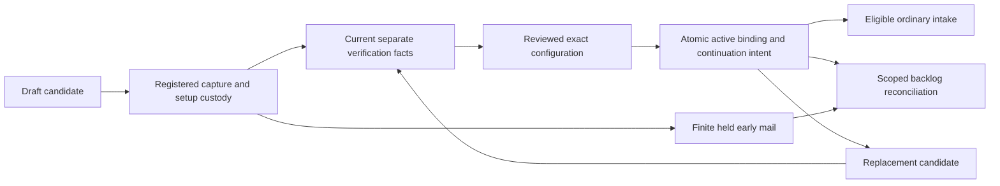

# Support inbox setup: owner, proof and lifecycle contract

**D25 C and every adopted amendment fully founder-ratified, 12 September 2026.** This contract accompanies [D25-R01–R32](phase26-d25-adversarial-review.md) and the [two setup journeys](phase26-d25-setup-ux.md). It records precise grooming semantics and explicit amendments to shared owner seams. Physical names below are conceptual unless they identify inspected current source. No formal specification, migration or runtime implementation is authorized.

## Source-of-truth map

| Fact                                                                                     | Authoritative owner                                                        | Consumer and invariant                                                                                                       |
| ---------------------------------------------------------------------------------------- | -------------------------------------------------------------------------- | ---------------------------------------------------------------------------------------------------------------------------- |
| Tenant/account/environment identity and current actor/capabilities                       | Core identity/authorization and shared connection owner                    | A message header, domain suffix or caller-supplied tenant never selects authority.                                           |
| Resend tenant account, outbound Sending-access credential, provider submissions/evidence | P6/P17 shared `tenant_email_settings` aggregate and protected revisions    | Existing outgoing rules unchanged; receiving does not create another outbound key path.                                      |
| Receiving credential and receiving capability proof                                      | Additional purpose-separated facet under that same shared connection owner | Current provider Full-access key is confined to closed server receiving/proof reads; no false read-only claim.               |
| Signed provider ingress                                                                  | Shared opaque per-connection ingress                                       | Verify raw bytes first; registered receiving events go to P26, outbound evidence to P6; preserve subscription union.         |
| Candidate/active public address to inbox binding and operational activation              | P26 Support configuration owner                                            | Current exact tenant/account/environment/source-scoped binding; activation is not provider acceptance or mailbox identity.   |
| Public-destination access/managed-return proof acceptance and Reply-To revision          | Existing P17 Human reply destination owner                                 | External challenge or explicitly added managed Support proof, never mutual substitution by self-received code.               |
| Receiving source, hydration, setup verification custody and held ordinary input          | Existing intake/source/recovery owners with narrow candidate purpose       | One accepted source, durable disposition and finite lifetime; no normal Support/CRM side effects before qualified admission. |
| Default Sender, real From/Reply-To, signature, reusable wording and preparation          | P17 with D4/D18/D23/D24 purpose contracts                                  | Setup reads/selects qualified owner references; no raw body/header override or implicit global-default change.               |
| CRM Party/relationships, giving, missionary/care records                                 | Their actual Core domains                                                  | No setup/verification-created Party/history/action; read and later mutations require own authority.                          |
| DNS/mailbox forwarding and external copies                                               | Tenant mail administrator/provider, with captured bounded proof in Core    | An Asym state change cannot claim to undo external DNS, synchronize outside replies or delete outside copies.                |
| Health/progress/counts                                                                   | Current authorized projection of those facts                               | Replaceable and scoped; never activation, access or completeness authority.                                                  |

## Three necessary governing amendments

**Receiving credential purpose.** ADR0029/P6 and P17's connection description must distinguish the outgoing-only instantiable key rule from the new P26 receiving purpose. Resend currently exposes only Full access for non-send reads; OAuth does not narrow that. The permanent current-provider design uses a separate inbound key, same exact tenant account, existing managed envelope encryption and current revision/rotation/revocation/purge controls. No Full-access key is accepted as the outgoing credential. Full access still creates a whole-account compromise blast radius at Resend; a local read allowlist reduces app exposure but cannot revoke provider privileges. Security review must test isolation and whole-account incident response.

The read adapter accepts only closed owner operations for exact allowed received-email/raw/attachment retrieval, bounded recovery listing and required registered account/domain/webhook/canary proof. No client-chosen URL, method or arbitrary provider resource ID. Account proof can use exact immutable current provider object evidence already bound to the connection, plus the existing controlled canary where needed; a repair does not always need a new ordinary outbound send. A pending unproved key is restricted to bounded account-proof reads; it cannot retrieve or expose ordinary incoming bodies/files before account mapping succeeds. Positive/wrong-account behavior must be qualified in the actual pinned API. A label, hint or DNS record alone does not prove the key's account.

**Shared ingress.** P17's described event ingress is extended to deliver registered incoming event kinds to P26 after exact shared authentication. Its outbound reducer retains the rule that incoming events create no outgoing lifecycle transition. One endpoint can serve the connection's required event union; this avoids a new endpoint per inbox, provider-plan coupling and duplicate secrets. Independent business owners retain incoming receipt idempotency and outgoing attempt evidence. The shared connection's observed health can affect both facets without collapsing them into one readiness flag.

**Managed Support destination proof.** Extend the existing P17 Human reply destination's exclusive proof shape with a managed Support route variant. P26 produces current tenant/account/environment/domain/public-address/inbox-binding/generation and controlled new-mail/return-path evidence. The same qualified stepped-up reply manager accepts the exact destination revision and accountable monitoring responsibility. P17 owns acceptance and pinned reply identity, not capture/threading/intake health. External-mailbox access challenges still require the same initiating authorized human and their code remains excluded from Support. Merely seeing Asym's own challenge in an inbound queue cannot satisfy that proof.

These amendments introduce no new configurable reply purpose, catalog template, OAuth platform, credential store or CRM owner. They must be traced into the existing system ADR/OpenSpec/P17/P6 artifacts only in a later authorized specification stage; the exploratory ADR records the required changes now without silently editing governing history.

## Break the setup/readiness cycle deliberately

A candidate endpoint can be **registered and capture-capable** while its inbox is **not active for ordinary work**. Narrow setup custody exists before the user changes external forwarding or receiving DNS. The fixed P17/P6 qualification producer can use exact candidate sender/Reply-To/credential state only for its controlled inert proof operation and an approved real sink/control mailbox. This is the existing testing capability extended for managed return-path proof, not an arbitrary sender or production override.

An external person/control mailbox may supply the required new message and reply to the canary. Do not create a new automated platform outbound account to make the loop convenient. Freeze exact proof mode, target, candidate generation, content and expected evidence before I/O. A status poll sends nothing. A timeout after possible submission reconciles the same sealed intent and may remain unknown; it cannot send a replacement just because the screen was reopened.

Keep separate:

1. P17 external-mailbox access challenge — current initiating stepped-up human; nontransferable completion; codes excluded from Support.
2. External provider forwarding confirmation — inspectable only through the exact authorized bounded setup task, inert until deliberate qualified action, no generic trusted-sender bypass.
3. Controlled route/canary evidence — verifies the exact candidate path and expected actual source, not ownership of a human identity.
4. Real early mail — finite current source custody/classification with no setup-token shortcut into normal work.

## Data dimensions and impossible states

| Concept                      | Required fields/constraints in the actual owner model                                                                                                                                                                                                                 |
| ---------------------------- | --------------------------------------------------------------------------------------------------------------------------------------------------------------------------------------------------------------------------------------------------------------------- |
| Candidate setup              | Tenant/account/environment, intended inbox, selected path, public address/receiving target references, safe incomplete fields, expected candidate generation, actual creator/change actors. No direct Active flag or secret body field.                               |
| Current address binding      | Exact receiving authority/public destination and one authorized current inbox, active revision/generation, proof references, lifecycle and predecessor/successor lineage. No uniqueness-error redirect.                                                               |
| Proof attempt/observation    | Exact tenant/principal/purpose/candidate/connection/domain/address generations, issuance/expiry, expected source/evidence shape, outcome and safe immutable evidence reference. Terminal fact corrected by explicit supersession, not rewritten.                      |
| Receiving secret revision    | Purpose-separated protected material under shared managed cryptography, exact scope/account/environment/revision binding and current use/retirement/purge/revocation/restore facts. No raw client export.                                                             |
| Accepted incoming source     | Provider/account/environment receipt identity, original timestamps, current candidate/active-routing basis, classification, hydration state, finite expiry and exactly one recoverable disposition/continuation. No duplicate row solely for webhook secret rotation. |
| Setup traffic classification | Actual constrained expected attempt association, never just subject/from-string matching. No general code/body log or automatic normal Support admission.                                                                                                             |
| Mutation receipt             | Trusted current actor, immutable semantic input identity/hash, expected and actual revisions, authoritative outcome and required durable continuation/audit. Changed input cannot replay under same identity.                                                         |

Use composite tenant/account/environment-aware foreign keys and unique constraints rather than globally existing IDs. One physical receiving authority cannot be claimed by two tenants/environments through separate local records; provider-account isolation and the shared authority registry must agree. A tenant can bind multiple separately qualified public addresses to one inbox. Exact address/domain-default overlaps require the current owning routing contract; setup does not silently create a domain default or capture unrelated addresses. Current source conflicts must resolve explicitly instead of precedence winning by array order.

Keep creation attribution immutable; append actual current change actor rather than overwrite `created_by`. Separate create/update/replace so a missing update target cannot be recreated by upsert. Configure safe delete behavior: no cascade removes accepted source, required proof/history or old sealed effect evidence. No new money representation exists. Enforce nullability/state/purpose consistency and finite input dimensions in database constraints and the single typed mutation boundary, not UI convention.

## Conditional transitions and atomic effects

Lifecycle is not a giant state that encodes every provider condition. Candidate/configuration lifecycle, evidence readiness, actual inbox activation, credential health and source custody remain separate. The visible status is derived from their current meaning. Two administrators use expected revisions; a concurrent proof invalidation, route claim or permission loss defeats stale activation. Save or provider 2xx alone never installs an ordinary active binding.

One local guarded transaction validates final resulting authority, claims the current proof/candidate generation and commits active binding, change history and durable reconciliation/secondary-effect intent. Provider/DNS mutation is outside that transaction and retains its own exact operation identity/uncertainty. Intake admission/release similarly resolves each source only with its correct durable continuation/effect, not by marking a batch resolved before dispatch. No compensation loop over independent writes is the permanent design.

Svix delivery IDs, provider inbound message IDs, RFC Message-IDs, candidate generations and business command identities are distinct. Deduplicate raw-event delivery under verified endpoint/account scope and accepted source under stable provider-account/receipt scope so secret overlap/replay cannot duplicate mail. Preserve multiple pieces of evidence when one raw source reaches an intended multiple-recipient situation without inventing arbitrary recipient-union authority. Thread tokens correlate only within current trusted scope and never override contradictory destination evidence.

## Safe capture and complete acquisition

Tenant scope comes from the registered signed connection, never payload tags or recipient-domain matching. Within scope, qualify actual provider/trusted-hop recipient provenance before automatic routing. Current Resend `received_for` is documented as derived from Received `for` clauses; it is not inherently an SMTP-envelope attestation. Ordered duplicate-preserving raw headers may be required to distinguish provider-added evidence from caller content. A JSON header dictionary cannot prove ordering or multiplicity. Neither SPF/DKIM pass nor a signed webhook proves requester identity or benign content.

Parse/validate the pinned API response: matching provider ID, expected field types/size, actual HTML format and complete attachment pagination. The current successful `{}` response behavior must fail as incomplete; absence of text/HTML can still be legitimate attachment-only input. Do not inline uncontrolled base64 assets or fetch arbitrary URLs. Hydrate raw/attachment signed URLs only from qualified current owner responses under approved hosts/redirect/size/type limits, with current expiry and safe retry/refresh. Provider copies/availability and Asym source retention are distinct.

List/filter pending sources in the database before pagination, with deterministic cursor progress and current eligibility per batch. A failed query, missing page or unknown hydration is incomplete, not zero or completed. Activation/reconnect preserves original received-at, source expiry and D13/D14 timing; verification does not generate targets or reset a backlog's usefulness. Never make a requester resubmit the standard solution to an intake outage.

## Current authorization and least exposure

Support configuration can view safe status without raw incoming bodies; an IT helper can apply public DNS/forwarding instructions without donor/CRM access. Reading a confirmation is a constrained source/purpose operation, not general access to a setup mailbox. P17 acceptance keeps its real step-up and actor restrictions. Active tenant membership and current resource capabilities are rechecked in every server/worker path; cached UI state or prior setup invitation cannot authorize later effects.

Inspect table/column grants, all effective RLS USING/WITH CHECK/SELECT rules, permissive policies, service paths, RPC grants/definer search paths, views and storage. The current inbound route tables revoke browser grants and are service-owned; that is a useful base, not proof their commands are safe. PostgreSQL derives WITH CHECK from USING where applicable; missing explicit syntax alone is not a finding. Allowed updates cannot change tenant, purpose, owner, proof actor or destination beyond the reviewed operation. All old global-key/inferred-tenant/route-upsert/import/fixture entry points must be fenced.

## Maintenance and old-route continuity

Path switch/cancel may invalidate a candidate without undoing outside changes. Captured mail retains current finite custody; canceled targets cannot be reassigned across owners while late mail may arrive. Address replacement creates a new qualified binding, preserves the old working path until reviewed cutover, and retains required old reply routes with an explicit finite dependency-aware transition plan. A blanket fixed grace period cannot prove all old prepared messages/conversations have ended; an unbounded hidden alias is equally wrong.

Inbox pause, incoming failure, outgoing failure and tenant connection disconnect are distinct. One inbox's pause/retirement must not delete a shared provider domain/webhook or disable unrelated tenant receipts/security mail. Complete impact review governs shared deletion/disconnect. Credential compromise applies to actual provider Full-access blast radius; local read isolation does not make its theft harmless. Rotation/reconnect uses current exact account proof and bounded overlap, preserves old source/effect identity and never relabels old receipts into a new tenant/account.

Capture signing secrets at creation/rotation under owner custody rather than making custody depend on later provider availability. Current direct API/CLI documentation describes webhook reads as including the signing secret; scrub those fields before any ordinary status response, log or evidence projection. Earlier contradictory search text was stale and is not current authority. Ambiguous external changes reconcile before retry; retired/purged authority cannot reappear through database restore or old code.

Qualified exact-object reads may recover interrupted creation/rotation under current owner authority with proven intended object/revision and protected recapture. They are not a general secret browser or permission to adopt a different operation's key. If exact correlation is unavailable, preserve incomplete state and prior safe operation instead of blind create/rotate retry.

## Email Studio, CRM, retention and operational proof

Email Studio owns existing content, signature/profile/Reply destination acceptance and preparation. It does not own DNS, receiving, forwarding, credential administration or held-message routing. Setup references qualified content, previews actual public identity and returns to the same source editor where appropriate. Fixed qualification traffic has no tenant-editable template key; D13 Support request received remains a distinct true system message and never acknowledges setup challenges. No new Role Layout, raw HTML authority, Tiptap DNS form or direct provider sender is introduced.

CRM context consumes only actual authorized admitted correspondence and source links. No setup contact, fake donor, mailbox-derived Party authority, financial action or care-state update. Distinct requesters/participants/responders/administrators/represented organizations keep their identity model. Source restriction/redaction/expiry applies to known derivatives before serving; setup/Recent/provider fetch cannot reconstruct purged content. Verification secret retention is shorter and more restricted than reusable configuration evidence; every source keeps its actual finite owning purpose.

P6 shared rate/quota/reputation and provider plan constraints remain tenant-account facts across sending and receiving keys. Register bounded operations and complete resumable processing; do not poll/hydrate whole mailboxes on each setup page load. Observe known evidence, current impact and one owner repair action with safe identifiers. O01–O06 in the main review define concrete triggers and responses, not a new observability platform.

Two independent current-source probes supply seven synthetic observations: four route-precedence cases and three retrieval-helper cases. These are not a live security exploit or proof the proposed pipeline/verification/activation works. P01–P50 requires actual database, provider, source, concurrency, migration, privacy, browser/AT, capacity and staff journey evidence before activation. New governing seam changes must be propagated during later explicitly authorized specification/design, with no silent amendment to earlier ratified artifacts in this grooming turn.

## Ratification and Email Studio clarification

The founder fully ratified D25 and every adopted amendment, definition, independent correction, UX/data/owner contract and required proof on 12 September 2026. The [Email Studio integration](phase26-d25-email-studio-integration.md) and [independent seam review](phase26-d25-email-studio-seam-review.md) make the three accepted shared-owner amendments explicit. Historical proposed/pending/no-Q26 wording is superseded only as to acceptance and advancement. [Current ratification validation](d25-ratification-q26-validation.json) preserves all historical evidence. All 50 implementation/release proof groups remain required and unexecuted.
