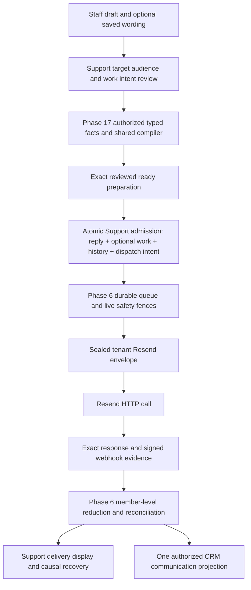

# Phase 26 D4 — The reply, the template and the send

**Fully founder-ratified grooming blueprint, 10 September 2026.** The founder accepted A and the [complete D4 amendments](phase26-d4-adversarial-review.md), including this blueprint and all adjustments. D1–D3 remain ratified. This is the intended product and execution path, not a screenshot of implemented functionality. [Evidence](phase26-d4-evidence.md) records the current gaps and source dates.

## The ordinary staff experience

Maria is handling Sarah's receipt question. The conversation is **Waiting on our side**, and a reminder is set for tomorrow because Finance is checking an authoritative giving record. Maria writes “Our team is checking this and I’ll update you.” Choosing **Send reply** preserves that wait and reminder. Choosing wording from Email Studio does not complete Finance's action or imply a receipt has been reissued.

Maria can also ask Sarah for needed information and explicitly choose **Send and wait for requester**, or send a completed answer with **Send and resolve**. A courtesy reply on an already resolved conversation does not invent a new resolution episode. A genuine new obligation is explicitly opened under D3. These are illustrative task fixtures, not assumptions about ministry frequency.

The intended layout is quiet and follows Core's **base-maia / Base UI / shared `@asym/ui`** system:

```text
Receipt question                         [Waiting on our side ▾]
Sarah — CRM context available within your permissions

… conversation history …

[Reply ▾]  To Sarah · Cc Alex                    [Edit recipients]

Hi Sarah,
Our team is checking this and I’ll update you.
│

[Use template]  [Attach]  [Preview email]       [Send reply] [▾]
                                              After sending
```

This is an information hierarchy, not a literal pixel specification or requirement for that exact control count. On narrow screens, secondary tools can move into an accessible labelled menu. The effective audience and primary action remain visible. Use existing semantic typography/spacing, neutral surfaces and restrained feedback; no competing bright status badges or hover-only information. Accessible names, sufficient contrast, keyboard focus and touch targets matter more than decorative novelty.

The current status is one fact in the header. The adjacent **After sending** selector stages the current draft's work intent:

| Choice in selector                      | Visible primary button      | Effect after successful local admission                                                        |
| --------------------------------------- | --------------------------- | ---------------------------------------------------------------------------------------------- |
| Keep current status, initially selected | Send reply                  | No work mutation; valid reminder survives.                                                     |
| Open                                    | Send and open               | D3 explicit Open; clears deferral, including already-Open cases.                               |
| Waiting for requester                   | Send and wait for requester | D3 requester-wait meaning; wait-side-only changes preserve the reminder.                       |
| Waiting on our side                     | Send and wait on our side   | D3 our-side meaning; wait-side-only changes preserve the reminder.                             |
| Resolved                                | Send and resolve            | Explicit Support completion; cancels reminder; repeated Resolve does not fabricate an episode. |

The selector is a single-select control with the current selection exposed. Choosing an item **does not send**. The named primary button then makes the resulting action unmistakable. This consciously costs one selection step for a nondefault action but avoids a menu that unexpectedly submits mail. It is a product judgment among valid patterns, not a claim that vendors universally use it. It does not become sticky across new drafts. A restored draft keeps its explicit staged choice. Standalone header changes take effect immediately through D3 and are visually/contextually distinct.

Ctrl/Cmd+Enter uses the currently visible primary action through the same guard as clicking. It must not trigger while an IME composition or picker owns the input, on key repeat, or while an admission is already pending. Enter in the body creates text; Enter/Space within the selector chooses without sending. Note mode says **Add note** and has no external-send meaning. Focus returns predictably from pickers. A screen reader receives concise validation/status announcements without rereading the conversation.

## What “use an Email Studio template” means

Staff stay in Support. They open **Use template**, search the permitted reusable reply library, see a small preview and insert content at the current caret/selection. The current slash affordance can expose the same choices to frequent users. A blank draft needs no special ceremony. With existing text, insertion preserves it; **Replace reply** is an explicitly different action with Undo. The reply stays editable.

The picker shows only compatible content the current tenant/staff may use. Full campaigns, protected financial notices, arbitrary old HTML and another tenant's templates are not selectable simply because they exist in `email_templates`. Loading, empty, unavailable and permission-denied states are distinguishable. A library outage does not prevent an otherwise qualified plain reply. It also does not excuse bypassing the shared compiler or connection fences.

| Object                  | Meaning and owner                                                                                                      | What it cannot do                                                                                    |
| ----------------------- | ---------------------------------------------------------------------------------------------------------------------- | ---------------------------------------------------------------------------------------------------- |
| Saved reply wording     | Eligible reusable structured content, copied into a Support draft with source revision/provenance                      | Execute work/CRM actions, send, change recipients/subject/From, rewrite future edits into this draft |
| Shared presentation     | Phase 17's qualified compact Service-message-compatible frame using immutable Brand Kit/Layout dependencies            | Create a new CRM or require a human reply to become a system-message catalog entry                   |
| Human reply             | Support's bounded staff-authored content plus explicit audience/target/work intent                                     | Claim a protected owner action happened because wording says so                                      |
| System-message template | Finite owner/producer notification contract, separately governed                                                       | Act as a generic arbitrary-address human reply API                                                   |
| Prepared message        | Exact validated and compiled material with dependency/identity/recipient/asset pins and restricted execution authority | Update itself from current template/CRM data after approval                                          |
| Resend envelope         | Phase 6's sealed exact transport request and provider key/member relationship                                          | Own content publication, retry with new identity after ambiguity or decide Support work status       |

The existing Phase 17 Service role is a compatibility direction to qualify, not a claim that a ready Support layout ships today. No new Personal correspondence layout enum, separate Support renderer or live saved-fragment graph is needed. An existing whole template must be qualified into the bounded reply structure/presentation; it is not blindly pasted as trusted provider HTML. Reusable wording does not require publishing every individual reply.

Useful precedents are searchable editable template insertion in [Front](https://help.front.com/en/articles/2230), explicit Insert versus Replace in [Freshdesk](https://support.freshdesk.com/support/solutions/articles/37577), and defined variable fallbacks in [Help Scout](https://docs.helpscout.com/article/468-work-with-variables). Their implementation details and limits do not become Asym policy. Front's ability to overwrite a subject on template insertion is deliberately not adopted for ordinary replies because D2's reply target and continuity must remain explicit.

## Personalization and CRM context

The library provides safe typed fields, not a query builder for arbitrary CRM data. The server binds the exact permitted Party/relationship/source context where one exists. Unknown senders can receive an ordinary greeting without a fabricated name or Party. Missing optional names can use an expressly defined neutral greeting; a missing required receipt/action fact blocks that candidate with guidance.

All To/Cc participants see the same group body. A link that is valid only for Sarah cannot become safe for Alex merely because Maria may view Sarah's CRM record. The owner must authorize the exact audience and cardinality; otherwise Maria edits the reply or makes a separately reviewed deliberate message. No silent recipient removal or per-person group fanout. Inserting a field cannot write a value back to CRM. That last restriction consciously rejects a documented [HubSpot personalization behavior](https://knowledge.hubspot.com/conversations/how-do-i-add-personalization-tokens-to-a-template-or-snippet).

The CRM panel exposes only authorized context and owner actions. Opening a permitted giving record preserves the Support return context and draft. Completing a refund, receipt reissue or contact update occurs through the actual owner capability, with its validation/approval/audit; Support can reference the result. The reply text and Resolved label do not prove that action succeeded. Permission changes/relinks/merges revalidate the current context without rewriting historical send identity.

Shared Email Studio authoring previews use synthetic fixtures. The Support review is the only place this draft's authorized real context is used. The ordinary editor and effective presentation constitute routine review; **Preview email** optionally shows the full HTML/plain-text output. There is no required trip to Email Studio or repeated confirmation modal for ordinary safe mail. Material changes, missing data, risky audience changes and stale conversation updates get focused repair/review in context.

## How it runs through Core and Resend



1. **Build and review.** A single canonical structured draft keeps reply target, D2 audience, staged D4 work action, body, attachment references and source provenance. Typing and insertion are local editing actions, not owner mutations. Server-qualified rendering may refresh during ordinary review; stale content is not approved just because the editor is responsive.
2. **Prepare before admitting.** The shared owner resolves permitted facts, validates the document and attachments, compiles HTML/text, and pins exact content/presentation/locale/compiler/identity dependencies. The candidate must be fully ready and match the reviewed digest. A changed material fact requires review; an allowed existing source pin can remain. Staged preparation has no provider authority before admission.
3. **Admit one local operation.** The server derives tenant/actor, checks current authorization and collision revisions, and atomically claims the ready preparation while recording reply intent, the optional D3 work transition, its history/reminder effects and durable dispatch intent. Plain Send has no work mutation. A known invalid combination does not degrade to “send anyway.”
4. **Dispatch through Phase 6.** Its durable worker uses the proved tenant Resend connection, live safety/consent/suppression fences and shared team budget. It seals the exact request bytes, permitted headers, account/credential/member mapping and request idempotency key. It passes prepared HTML/text to Resend. The installed SDK can serialize Reply-To, Cc, threading headers and attachments; the current Core wrapper must be qualified/extended through the shared owner rather than replaced with a new Support SDK wrapper.
5. **Record evidence, recover and project.** Local admission is Queued. A valid provider identity supports submitted/accepted evidence, not proof that a person read the message. Signed events reduce only what they prove. Missing identity or lost-response ambiguity stays Unknown with bounded reconciliation. A fresh adverse result may create D3 Open review without reapplying the old work action. Per-copy CRM projection uses the canonical communication effect exactly once.

An API transaction cannot atomically commit a final external email delivery. Asym can and must atomically commit the local intention and chosen work effects. At most two qualified identical follow-up HTTP calls are allowed by ADR-0032 after the initial call; this is not a generic retry loop. A sealed or possibly submitted request never changes content/key/account or splits members. Resend's [24-hour key window](https://resend.com/docs/dashboard/emails/idempotency-keys) is not the permanent business identity.

Resend's hosted template API accepts published template identifiers/aliases and variables, while explicit HTML/text is a different send form. Using the hosted template form would delegate a second render/publication authority and defeat the exact prepared-content boundary chosen here. Use the [prepared HTML/text send form](https://resend.com/docs/api-reference/emails/send-email). This is a fit decision for Core, not a claim that provider templates are generally bad.

The narrow human-reply preparation-material class has a **seven-day maximum**, with all earlier utility/action/privacy/safety/acceptance/provider-window limits. Existing Phase 17 classes describe other purposes and are not silently reused. The shared material contract/generator must explicitly qualify this extension. Encrypted retry material is separate from the Support conversation, official artifacts and body-free history; its expiry never sets conversation retention or permits week-old automated resends.

## Visible failure and recovery states

| Situation                                         | Staff sees and can do                                                | Invariant                                                                        |
| ------------------------------------------------- | -------------------------------------------------------------------- | -------------------------------------------------------------------------------- |
| Library loading/unavailable                       | Clear picker state; continue typing an ordinary qualified reply      | No sample or cached unauthorized template fallback                               |
| Missing required value/incompatible group content | Inline explanation and direct edit/source action                     | No local reply/work admission until ready                                        |
| New reply or material update while composing      | New information to review; draft retained                            | No stale send or automatic old-status restoration                                |
| Preparing/validating                              | Visible progress; current draft preserved                            | No external I/O and no work transition yet                                       |
| Local admission accepted                          | Queued reply with separate current work status                       | New draft resets to Send reply; old intent retained for reconciliation           |
| Browser response lost                             | Checking send outcome, with stable recoverable draft identity        | Reconcile before creating any new deliberate send                                |
| Provider outcome unknown                          | Persistent Delivery outcome unknown and recovery status              | No ordinary fresh-send retry for that intent                                     |
| Known failed/blocked member                       | Specific delivery issue and authorized repair path                   | No claim all members failed or delivered; no successful-member replay            |
| Fresh actionable delivery problem after Resolve   | Open for review with causal reason and earlier resolution history    | Status does not conceal failed communication or erase history                    |
| Access removed                                    | Protected content/commands stop; permitted minimal recovery guidance | No disclosure through cached draft, preview, signed asset or old command receipt |

No green “delivered to everyone” badge derives from one aggregate response. Do not automatically mark a first-response/service milestone from a queued draft; the eventual service policy uses qualified source evidence. No-response disposition, SLA enforcement, personal Send-status preference, reminder defaults, AI assistance and merge/split remain separate grooming decisions. Nothing in D4 requires a knowledge base, a requester portal or a generic workflow engine.

## Current code versus this blueprint

The current Support handler and workflow registration do not prove a completed outbound Phase 6 path. The current template test endpoint is an admin testing path with direct Resend I/O and a later audit attempt. Mutable Email Studio saves and versions, current macro effects and current webhook scalar status handling also need reconciliation. Some useful primitives exist: the shared editor stack, merge-value escaping/validation, tenant email settings, raw-body signature verification and a durable inbound workflow. Preserve those sound foundations within the owner contract.

The D4 source/SDK probes are bounded evidence. Actual database authorization/atomicity, real To/Cc and mailbox threading, provider member-specific events, attachment custody, accessible staff journeys and rollout recovery remain the review's **P01–P18 activation proof**. This completed blueprint specifies what must be built/proved later; it does not claim it already works in production.
