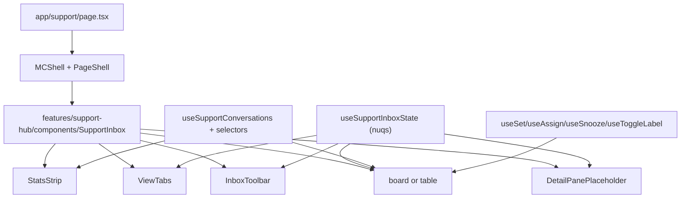

# Support Hub — Phase 3 Inbox Page

> Companion to [`phase-01-discovery.md`](./phase-01-discovery.md),
> [`file-map.md`](./file-map.md),
> [`chatwoot-gray-parity-map.md`](./chatwoot-gray-parity-map.md), and
> [`phase-02-foundation.md`](./phase-02-foundation.md).
>
> Phase 3 turns the static `/support` placeholder into a real Mission
> Control donor-care inbox: stats strip, view tabs, search/filter/layout
> toolbar, board and table surfaces, and a detail-pane extension point for
> Phase 4. No Tiptap composer or full conversation thread yet.

## What landed in this phase

- **Page wiring.** `apps/admin/app/(app)/support/page.tsx` mounts
  `<PageShell>` with a Knowledge Base / New Conversation header action pair
  and renders `<SupportInbox />`. `apps/admin/app/(app)/support/loading.tsx`
  shows the same shell with `<SupportInboxSkeleton />`.
- **Inbox shell** (`features/support-hub/components/SupportInbox.tsx`).
  Reads URL state via `useSupportInboxState()`, threads the same filtered
  conversation source into board and table, and reserves a right pane for
  the Phase 4 detail view.
- **Stats strip** (`components/stats/{StatsStrip,StatCard}.tsx`) — six
  Maia/Zinc tiles: open, mine, unassigned, past-due, average first reply,
  resolved today. Quiet token-driven styling with accent dots, no loud
  color blocks; avg-first-reply uses Geist Mono.
- **View tabs** (`components/tabs/ViewTabs.tsx`) — All / Mine / Unassigned
  / Past Due / Escalated bound to `?view=`. Each tab shows a count derived
  from the same selector pipeline that renders the body.
- **Toolbar** (`components/toolbar/{InboxToolbar,LayoutToggle,StatusFilter,LabelFilter,AssigneeFilter}.tsx`)
  — debounced search, status select, label multi-select, assignee select,
  and a board / table segmented control. Every control is bound to the URL
  through the Phase 2 `nuqs` helper.
- **Board view** (`components/board/{SupportBoardView,BoardColumn,BoardCard,use-board-dnd}.tsx`).
  Four columns over the Chatwoot lifecycle (open / pending / snoozed /
  resolved). Native HTML5 drag-and-drop hook (no new runtime dep) calls
  `useSetSupportConversationStatus` on drop. Cards show donor name, last
  activity, subject, label cluster, assignee/unassigned dot, priority
  badge for urgent/high, and rose accents for past-due / escalated rows.
- **Table view** (`components/table/{SupportTableView,columns,cells,bulk-actions}.tsx`).
  Composes the repo's `DataTableResponsive` (sticky header, sortable +
  hideable columns, row selection, mobile cards, virtualization,
  keyboard navigation, view toggle). Bulk actions are wired to the Phase 2
  mutation hooks (mark resolved, mark pending, snooze 24h, assign to me).
- **Detail placeholder** (`components/detail/DetailPanePlaceholder.tsx`).
  Renders inline as a right rail on desktop ≥ `lg` and as a `Sheet` on
  mobile. The component is the only swap Phase 4 needs.
- **Additive selectors.** `lib/selectors.ts` gains
  `computeAverageFirstResponseMinutes` and `countResolvedSince`; both are
  surfaced in the existing `computeInboxStats` output and the
  `SupportInboxStats` type.
- **Current-agent helper.** `lib/current-agent.ts` resolves the
  Mission Control user to a Support Hub agent id. Today the resolution is
  by email match against the agents collection; the next phase swaps the
  resolver when the real `support_agents` table lands.
- **Selector tests.** `tests/unit/apps/admin/features/support-hub/selectors.test.ts`
  covers the view selectors, the new metrics, and the chained
  `selectConversations` filter pipeline.

## URL contract (verified)

| URL                                                       | Layout | Slice          | Notes                                |
| --------------------------------------------------------- | ------ | -------------- | ------------------------------------ |
| `/support`                                                | board  | all            | Default render                       |
| `/support?layout=board&view=mine`                         | board  | mine           | Required by the Phase 3 prompt       |
| `/support?layout=board&view=unassigned`                   | board  | unassigned     | Required by the Phase 3 prompt       |
| `/support?layout=board&view=past-due`                     | board  | past-due       | Required by the Phase 3 prompt       |
| `/support?layout=board&view=escalated`                    | board  | escalated      | Required by the Phase 3 prompt       |
| `/support?layout=table&view=mine&status=open&assignee=me` | table  | mine + open    | Multi-facet filter                   |
| `/support?layout=table&label=finance,recurring&q=card`    | table  | label + search | Multi-label and free-text composes   |
| `/support?id=conv-failed-receipt`                         | board  | all            | Detail placeholder opens for that id |

The five canonical URLs called out by the prompt all parse via the Phase 2
`useSupportInboxState()` helper. Invalid values fall back to defaults
(`view=all`, `layout=board`, `status=all`).

## Architecture summary

## Visual rules followed

- Maia tokens, Zinc palette only. No new hex colors. No imported donor
  globals.
- Inter for body, Geist Mono for the time-shaped stat (`avg first reply`)
  and waiting-time / relative-time cells.
- `MCShell` and `PageShell` ownership preserved. Forced-light theme
  preserved.
- View tabs and toolbar densities match the existing Mission Control
  navigation chrome.
- Stats tiles inherit the Maia card pattern from
  `apps/admin/app/(app)/contributions/main-body.tsx`.
- Board cards use the same chip / avatar / badge primitives the table
  cells use, so the two layouts feel like one workspace.

## Bulk action wiring

`floatingBarActions` on `<DataTableResponsive>` exposes:

- **Mark resolved** → `useSetSupportConversationStatus({ status: "resolved" })`
- **Mark pending** → `useSetSupportConversationStatus({ status: "pending" })`
- **Snooze 24h** → `useSnoozeSupportConversation({ snoozedUntil: now + 24h })`
- **Assign to me** → `useAssignSupportConversation({ assigneeAgentId: currentAgentId })`

All four delegate to the Phase 2 mutation hooks; each hook already
invalidates `supportHubQueryKeys.root` so the board and table converge on
the next paint without manual refresh.

The board's drop handler dispatches a single
`useSetSupportConversationStatus` per moved card.

## Loading and empty states

- `apps/admin/app/(app)/support/loading.tsx` renders the inbox skeleton inside
  `PageShell`.
- `<SupportInboxEmptyState />` appears when the filter pipeline returns
  zero rows; "Reset filters" calls `resetState()`.
- Each board column shows a quiet "No conversations" line when empty, or
  "Drop to move here" when a card is being dragged.
- The table empty state renders the same Maia-toned card via
  `DataTableResponsive.emptyState`.

## Mobile and scroll behavior

- `MCShell`'s `RouteMainViewTransitionBoundary` already wraps `main` with
  `overflow-auto`; the inbox grid uses `min-h-0` on flex children so the
  table virtualizer can size itself.
- Below `lg`, the right detail rail collapses; selecting a row opens the
  `DetailPanePlaceholder` as a `Sheet`.
- View tabs and toolbar stay reachable via overflow scroll on narrow
  viewports.
- Reduced motion is respected via `useReducedMotion()` on the stat-card
  entrance animation.

## Regression list (verified before opening PR)

- `MCShell`, `PageShell`, theme provider order untouched.
- `apps/admin/app/mc-shell.tsx` "Support Hub" nav still highlights when
  on `/support` (route prefix match unchanged).
- `/support` and the seven URL variants in the table above all render
  with the correct slice + layout.
- Board ↔ table swap does not thrash the layout.
- Mobile breakpoint shows mobile cards in the table view and the `Sheet`
  for the detail placeholder.
- Browser back/forward correctly walks URL state changes — `nuqs` is
  configured to `replace` so back exits the route, not the filter (matches
  the Contributions surface).
- Forced-light: no `dark:` styling slipped into adapted donor patterns.
- Reduced-motion preference: stat-card entrance animation no-ops.
- Keyboard: tab strip, search input, status / label / assignee dropdowns,
  layout toggle, bulk action buttons, and table rows are all reachable
  without a mouse and announce correctly.

## Quality gates run

- `bunx turbo run typecheck --filter=@asym/admin --filter=@asym/database`
  — green.
- `bunx turbo run lint --filter=@asym/admin --filter=@asym/database`
  — green.
- `bun run test:unit` — all existing tests plus six new Phase 3 cases for
  the additive selectors and the chained filter pipeline pass.
- Prettier — clean across all touched files.
- No new runtime dependencies. No file under `apps/donor`,
  `apps/missionary`, `packages/ui`, `packages/database`, `packages/api`,
  `packages/email`, or `supabase/migrations` was modified.

## Continuity for Phase 4

The phase leaves three named extension points:

1. **`<DetailPanePlaceholder />` → real conversation detail.** The URL
   contract (`?id=…`), the desktop right-rail layout, and the mobile
   `Sheet` are wired. Phase 4 only replaces the body of this component.
2. **`useSendSupportReply` and `useAddSupportPrivateNote`** are already in
   place (Phase 2). The Tiptap composer just needs to feed the existing
   `SupportReplyPayload` shape.
3. **`useCurrentSupportAgentId`** is the single resolver for "who is the
   logged-in agent". Replace its email-match heuristic when the real
   `support_agents` membership table lands; everything downstream
   (assign-to-me bulk action, "Mine" view counts, "assignee=me" filter)
   keeps working unchanged.

## Out of scope (carried forward)

- Conversation detail screen / pane content.
- Tiptap reply composer.
- Private notes UI.
- Macros runner UI, command palette, saved-views CRUD UI, reports surface,
  settings surfaces, CRM linkage UI.
- Real Supabase `support_*` tables, real inbound router, real
  `@asym/api/admin/support-hub`.
