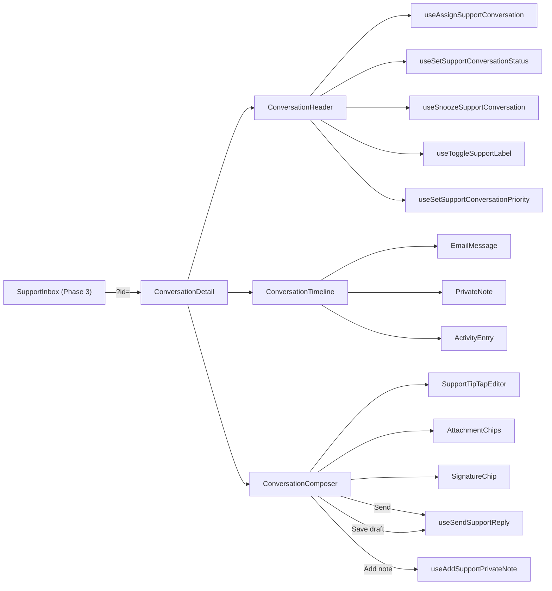

# Support Hub — Phase 4 Conversation Detail & Composer

> Companion to [`phase-01-discovery.md`](./phase-01-discovery.md),
> [`file-map.md`](./file-map.md),
> [`chatwoot-gray-parity-map.md`](./chatwoot-gray-parity-map.md),
> [`phase-02-foundation.md`](./phase-02-foundation.md), and
> [`phase-03-inbox-page.md`](./phase-03-inbox-page.md).
>
> Phase 4 swaps the Phase 3 detail placeholder for a real donor-care
> conversation workspace: header (donor identity / status / SLA / labels /
> assignee), unified timeline (inbound emails, outbound replies, private
> notes, activity log), and a TipTap reply / private-note composer.

## What landed in this phase

- **Detail surface.** `apps/admin/features/support-hub/components/detail/`
  - `ConversationDetail.tsx` — top-level shell. Same prop shape as the
    Phase 3 placeholder (`{ conversationId, onClose, layout }`), so the
    `SupportInbox` swap is one import + one rename. Renders inline as the
    right rail on desktop and as a `Sheet` on mobile.
  - `ConversationDetailEmpty.tsx` — quiet "Pick a conversation" state.
  - `ConversationHeader.tsx` — three-row header: status crumb + close +
    Snooze / Resolve actions; subject + last activity stamp + SLA chip;
    donor identity sidecar + label cluster + assignee / status / priority
    menus.
  - `ConversationContactSidecar.tsx` — donor identity tile that renders
    `SupportContactRef` chips (donor / gift / missionary / church) when
    those CRM-ready hooks are populated.
  - `ConversationStatusMenu.tsx`, `ConversationPriorityMenu.tsx`,
    `ConversationAssigneeMenu.tsx`, `ConversationLabelMenu.tsx`,
    `ConversationSnoozeMenu.tsx`, `ConversationSlaChip.tsx` — small
    menus that wire to the Phase 2 mutation hooks.
  - `ConversationTimeline.tsx` — merges `support_messages` for the
    selected conversation, groups by day, dispatches to
    `EmailMessage` / `PrivateNote` / `ActivityEntry`.
  - `timeline/EmailMessage.tsx` — inbound + outbound email rendering with
    `RichTextViewer`, attachment chips, delivery state badge, and a
    distinct draft tone.
  - `timeline/PrivateNote.tsx` — amber-tinted internal note with a
    "Internal note" pill.
  - `timeline/ActivityEntry.tsx` — single line for `type: "system"` rows
    (status change, escalation, etc.).
  - `timeline/TimelineSeparator.tsx`, `timeline/EmptyTimeline.tsx`,
    `timeline/merge-timeline.ts` (pure helper used by both the component
    and the unit tests).

- **Composer.** `apps/admin/features/support-hub/components/detail/composer/`
  - `SupportTipTapEditor.tsx` — thin support-specific wrapper around
    `EditorRoot` + `EditorContent` + `EditorToolbar` from
    `@asym/ui/components/shadcn/rich-text-editor`. Reply mode uses
    `SUPPORT_REPLY_TOOLS`; note mode uses the smaller `SUPPORT_NOTE_TOOLS`.
    Exposes `beforeToolbar`, `afterToolbar`, `beforeBody`, `footer` slots
    (Phase 5 extension points).
  - `ConversationComposer.tsx` — Reply / Private note tabs, attachment
    chips, signature toggle, action row.
  - `use-conversation-composer.ts` — orchestrator hook that holds local
    Tiptap state per mode, serializes to `SupportReplyPayload`, dispatches
    Phase 2 mutations, and toasts on success / failure with sonner.
  - `serialize-payload.ts` — pure JSON → HTML / text serializer with
    signature handling.
  - `AttachmentChips.tsx` — drop-zone stub that stages
    `SupportAttachmentDraft` items; the real upload pipeline lands in a
    later phase.
  - `SignatureChip.tsx` — toggle that appends the agent signature to the
    serialized payload at send time only (never to the editor doc).
  - `ComposerActions.tsx` — Send / Save draft / Cancel row with primary
    icons and `Cmd+Enter` hint.
  - `QuickActionsSlot.tsx` — pass-through slot for Phase 5 macros / canned
    responses / slash menu launcher.
  - `use-composer-hotkeys.ts` — keyboard surface (`Cmd/Ctrl + Enter`
    fires the active mode's primary action). Phase 5 extends this surface
    with `Cmd+K` palette / `Cmd+/` macro picker.

- **Phase 2 store extension (additive).** `supportStore.inputs.sendReply`
  gains `mode: z.enum(["send", "draft"]).default("send")`. `useSendSupportReply`
  branches on `mode`: drafts get `deliveryState: "draft"` and skip the
  conversation-side timestamp bumps so the inbox does not treat them as
  donor-visible activity. Existing callers (Phase 3 bulk actions) keep
  working unchanged.

- **Page rewire.** `SupportInbox.tsx` renders `<ConversationDetail />`
  instead of the placeholder. The deprecated `DetailPanePlaceholder` export
  in `components/detail/index.ts` aliases to `ConversationDetail` so the
  Phase 1 file map and any external callers still resolve.

- **Tests.** `tests/unit/apps/admin/features/support-hub/`
  - `composer-payload.test.ts` — six cases: round-trip through the Zod
    schema, signature insertion never touches the JSON doc, attachments
    pass through unchanged, HTML escaping prevents script injection, and
    `buildSignatureLine` handles missing titles.
  - `timeline-merge.test.ts` — six cases: every classifier branch
    (email / note / draft / activity), chronological sort, day-of-week
    flag, and that all four kinds coexist in the merged stream.

## Architecture



## Composer contract

```ts
type ComposerMode = "reply" | "note";

interface ConversationComposerHandlers {
  mode: ComposerMode;
  setMode: (mode: ComposerMode) => void;

  value: string; // Tiptap JSON serialized as a string
  setValue: (next: string) => void;

  attachments: SupportAttachmentDraft[];
  addAttachment: (attachment: SupportAttachmentDraft) => void;
  removeAttachment: (index: number) => void;

  appendSignature: boolean;
  setAppendSignature: (append: boolean) => void;

  isPending: boolean;
  isDirty: boolean;

  send: () => Promise<void>;
  saveDraft: () => Promise<void>;
  reset: () => void;

  agent: SupportAssignee | null;
  authorAgentId: string | null;
}
```

Per-mode behavior:

- **Reply → send.** Calls `useSendSupportReply.mutateAsync(... mode:
"send")`. Sonner toast confirms; the Phase 2 collection writer flips the
  conversation's `firstRespondedAt`, `lastMessageAt`,
  `lastMessageDirection`, and unsnoozes if needed.
- **Reply → save draft.** Same hook with `mode: "draft"`. The collection
  writer flips `deliveryState: "draft"` and **skips** the conversation
  timestamp bumps, so a draft does not look like a donor reply in the
  inbox.
- **Private note → send.** Calls
  `useAddSupportPrivateNote.mutateAsync(...)`. The note row carries
  `type: "note"`, `isPrivate: true`, and never reaches the donor.
- **Attachments.** Stub — files are staged locally as
  `SupportAttachmentDraft` items via the file picker. Real upload arrives
  with the inbound router phase.
- **Signature.** Reads the resolved agent (assignee or current user). The
  serializer appends `name / title / email` to `text` and `html` only at
  send time; the Tiptap document never contains the signature so toggling
  the chip cannot garble the editor body.
- **Hotkeys.** `Cmd/Ctrl + Enter` fires the active mode's primary action.
  Phase 5 extends `useComposerHotkeys` for the palette and macro picker.

## Timeline merge contract

`mergeTimeline(messages, { nowIso })` is the pure helper that classifies
every `support_messages` row into a `TimelineEntryKind`:

| `support_messages` shape                           | `TimelineEntryKind` |
| -------------------------------------------------- | ------------------- |
| `type === "system"`                                | `activity`          |
| `type === "note"`                                  | `note`              |
| `type === "email"` and `deliveryState === "draft"` | `draft`             |
| `type === "email"` (any other delivery state)      | `email`             |

The helper sorts ascending by `postedAt` (ties broken by `id`) and tags
the first entry of each day with `isFirstOfDay = true`, so the timeline
component renders a `<TimelineSeparator />` for new days. Day labels are
"Today", "Yesterday", or `MMM d, yyyy`.

## Visual rules followed

- Maia tokens, Zinc palette only. No new hex colors.
- Inter for body, Geist Mono for time stamps inside cards / chips.
- `MCShell` and `PageShell` ownership preserved. Forced-light theme
  preserved. No `dark:*` styling slipped in from any adapted donor pattern.
- Reply card stays neutral; private-note card uses an amber tint so the
  agent never confuses internal collaboration with a donor-visible reply.
- `tiptap.css` from `@asym/ui` is the only editor stylesheet. No second
  editor surface, no overrides.

## Phase 5 extension points

1. **Slash-command target.** `<SupportTipTapEditor />` accepts
   `beforeToolbar`, `afterToolbar`, and `beforeBody` slots that mount React
   nodes inside the editor chrome. Phase 5 will add an
   `extraExtensions?: Extension[]` prop to the upstream `EditorRoot` and
   forward it from here for a slash-command extension. The Phase 4 prop
   surface stays stable.
2. **Mention target.** Same hook — Phase 5 adds an `@`-mention extension
   via the same `extraExtensions` channel.
3. **Quick actions slots.** `<ConversationComposer slots={{
beforeToolbar, afterToolbar, beforeSend }} />` accepts React nodes that
   mount inside the composer chrome (macros launcher, canned-response
   palette, etc.). The existing `<QuickActionsSlot />` wraps `beforeSend`.
4. **Keyboard surface.** `useComposerHotkeys({ onPrimaryAction })` is the
   single place where Cmd/Ctrl + Enter is registered. Phase 5 adds further
   keymaps without rewriting the composer.
5. **Activity event taxonomy.** `support_messages.type === "system"` rows
   render as `<ActivityEntry />`. Phase 5's macro runner produces system
   rows with the same shape, so it just calls the existing
   `supportStore.collections.messages.insert(...)` writer.

## Loading, empty, and failure states

- **No `?id`** → `<ConversationDetailEmpty />`.
- **`?id` set, conversation loading** → header + timeline + composer
  skeleton (`<DetailSkeleton />`).
- **`?id` set, conversation missing** → "Conversation not found" with a
  "Back to inbox" button that calls `setState({ selectedConversationId:
null })`.
- **Mutation failure** → sonner toast with the error message; the composer
  keeps the draft state so nothing is lost.
- **Empty timeline** → `<EmptyTimeline />` ("No messages yet" line).

## Mobile / scroll behavior

- Mobile uses the existing `Sheet` from Phase 3, full screen. Internal
  layout = header at top, timeline scrolling, composer sticky at the
  bottom.
- Desktop right rail keeps the height of the inbox grid; the composer is
  sticky at the bottom of the rail's own scroll container, not the page.
- Reduced motion is respected — no transition on tab switching beyond
  Radix defaults.

## Quality gates run

- `bunx turbo run typecheck --filter=@asym/admin --filter=@asym/database`
  — green.
- `bunx turbo run lint --filter=@asym/admin --filter=@asym/database`
  — green.
- `bun run test:unit` — all existing tests pass plus 12 new Phase 4 cases
  for the composer payload serializer and the timeline merge helper.
- Prettier — clean across all touched files.
- No new runtime dependencies. No file under `apps/donor`,
  `apps/missionary`, `packages/ui`, `packages/database`, `packages/api`,
  `packages/email`, or `supabase/migrations` was modified.

## Continuity for Phase 5+

Three named extension points are wired:

1. `<SupportTipTapEditor />` slots (`beforeToolbar`, `afterToolbar`,
   `beforeBody`) are ready for Phase 5 macros / slash menu / mention
   surfaces.
2. `<ConversationComposer slots={...} />` exposes the same surface at the
   composer chrome level.
3. `useComposerHotkeys` is the single keyboard surface; Phase 5 extends
   it without rewriting the composer.

The `support_messages` collection already accepts the `system` row shape
that the macro runner will produce, so adding macro / canned-response
support in Phase 5 is purely additive. No Phase 1–3 contract is reopened
in this phase; the only additive change is the optional `mode: "draft" |
"send"` field on the existing `sendReply` input.

## Out of scope (carried forward)

- Macros runner UI, canned-response picker, slash commands, `@`-mentions,
  keyboard shortcuts beyond `Cmd/Ctrl + Enter`.
- Real attachment upload pipeline.
- Real signature CRUD UI (uses the agent title for now).
- Reports surface, settings surface, automations builder.
- Real Supabase `support_*` tables, real inbound router,
  `@asym/api/admin/support-hub`.
