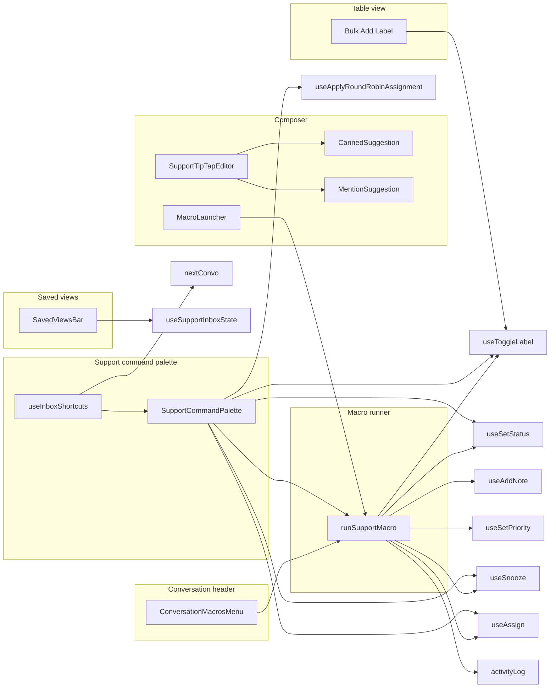

# Support Hub — Phase 5: productivity, internal collaboration, and fast actions

Phases 1–4 are stacked. Phase 5 turns the donor-care inbox into a serious working tool by adding labels CRUD with bulk assignment, saved-view CRUD, a macro runner, slash-based canned responses, `@`-mentions in private notes, round-robin assignment, a support-local command palette, and keyboard shortcuts — all built on the Phase 2 collections + mutations and slotted into the Phase 4 composer / detail surfaces through the documented extension points.

## Decisions locked

- **Slash + mention extensions: Tiptap canonical pattern.** `packages/ui` adds `@tiptap/suggestion` + `@tiptap/extension-mention`; `EditorRoot` exposes a new `extraExtensions?: Extensions` prop forwarded into `useEditor`. The support feature builds two suggestion extensions and feeds them through `SupportTipTapEditor.extraExtensions` mode-aware (canned in reply mode, mention in note mode). All Tiptap symbols cross the package boundary through the rich-text-editor barrel — no app reaches into `@tiptap/*` directly.
- **Command palette: scoped (no window listener).** `useInboxShortcuts({ containerRef })` registers `keydown` on the inbox container ref returned from `<SupportInbox />`. The palette opens with `Cmd/Ctrl + K` only while the inbox tree owns focus. Mission Control's global search dialog is left untouched.
- **Macro runner: pure function + sequential dispatch.** `lib/macro-runner.ts` accepts `SupportMacro + SupportConversation + MacroMutationBag + MacroLookup` and walks the action sequence in order, awaiting each mutation. After every action it writes a `type: "system"` activity row through `lib/activity-log.ts`, which the Phase 4 timeline already renders.
- **Round-robin: pure selector.** `lib/round-robin.ts` picks the agent with the lowest active-conversation count for the inbox (ties broken by agent id alphabetically). Recomputed each call so no persistent cursor is needed; the future server-side scheduler can reuse the same function over the same input shape.
- **Saved views: full CRUD.** `useSaveSupportSavedView` (Phase 2) + new `useDeleteSupportSavedView`. The new `<SavedViewsBar />` rendered above `<ViewTabs />` lists every saved view with rename + delete affordances; selecting a view writes its filter into the URL via `useSupportInboxState().setState(view.filter)`.
- **Labels CRUD + bulk assignment.** New `useSaveSupportLabel` + `useDeleteSupportLabel` mirror the existing macro / canned response writers. UI: `<LabelManagerDialog />` reachable from the `<LabelFilter />` footer. Bulk label assignment lands as an "Add label…" floating-bar action in the table view that opens a label picker and dispatches `useToggleSupportLabel({ mode: "add" })` per selected row.
- **Canned responses: slash insertion + macro insertion.** Tiptap suggestion extension triggered by `/`, filtered against canned `shortCode` + `title`. Inserting replaces the trigger range with the canned `bodyHtml` after a merge-variable pass. Macros that include a `send_canned_response` action also call `applyMergeVariables` and hand the rendered text to `onCannedResponseInsert` so the composer (or any future caller) can decide what to do with it.
- **Merge variables.** Five seeds — `{{donor.name}}`, `{{donor.email}}`, `{{conversation.subject}}`, `{{agent.name}}`, `{{agent.title}}`. `lib/merge-variables.ts` is a pure function. Substitution runs at slash-insertion time AND defensively at serialize time so canned bodies coming through macros never leak raw tokens.
- **`@`-mentions: private notes only.** Mention extension is registered exclusively in note mode. The mention list reads from `useSupportAgents`. Picking a mention inserts a styled chip and writes a `type: "system"` row through `logSupportActivity` (`"Emily mentioned Daniel in a private note."`). The serializer walks `mention` nodes and emits a plain-text `@AgentName` in the `text` payload.
- **Conversation activity entries.** Every Phase 5 mutation (status change via menu, label toggle, assignment change, snooze, macro run, mention, round-robin) writes a `type: "system"` row through `logSupportActivity`. `useAssignSupportConversation`, `useSetSupportConversationStatus`, `useSetSupportConversationPriority`, `useSnoozeSupportConversation`, `useUnsnoozeSupportConversation`, and `useToggleSupportLabel` were extended in place; the contracts stay backwards-compatible.

## Architecture



## Files added

```
apps/admin/features/support-hub/
├── lib/
│   ├── activity-log.ts                       (logSupportActivity)
│   ├── keymap.ts                             (SUPPORT_INBOX_KEYMAP)
│   ├── macro-runner.ts                       (runSupportMacro)
│   ├── merge-variables.ts                    (applyMergeVariables)
│   └── round-robin.ts                        (selectNextRoundRobinAgent)
├── components/
│   ├── command/
│   │   ├── InboxShortcutHints.tsx
│   │   ├── SupportCommandPalette.tsx
│   │   ├── use-inbox-shortcuts.ts
│   │   └── use-support-command-palette.tsx
│   ├── labels/
│   │   ├── LabelForm.tsx
│   │   └── LabelManagerDialog.tsx
│   ├── macros/
│   │   ├── MacroLauncher.tsx
│   │   ├── MacroPreviewLine.tsx
│   │   └── RunMacroPopover.tsx
│   ├── views/
│   │   ├── DeleteSavedViewConfirm.tsx
│   │   ├── SaveViewDialog.tsx
│   │   ├── SavedViewItem.tsx
│   │   └── SavedViewsBar.tsx
│   └── detail/
│       ├── ConversationMacrosMenu.tsx
│       └── composer/extensions/
│           ├── SuggestionList.tsx
│           ├── canned-suggestion.ts
│           ├── mention-suggestion.ts
│           └── use-suggestion-renderer.tsx
```

## Files edited

```
packages/ui/package.json
  + @tiptap/core            ^3.20.1
  + @tiptap/extension-mention ^3.20.1
  + @tiptap/suggestion        ^3.20.1
packages/ui/components/shadcn/rich-text-editor/rich-text-editor.tsx
  + extraExtensions?: Extensions prop forwarded into useEditor
packages/ui/components/shadcn/rich-text-editor/index.ts
  + Re-exports EditorContext / Editor / Range / Extensions /
    Extension / Mark / Node / Suggestion / SuggestionOptions / Mention
    so apps never import @tiptap/* directly.

apps/admin/features/support-hub/stores/support-store.ts
  + Zod inputs: saveLabel / deleteLabel / deleteSavedView / deleteMacro /
                deleteCannedResponse / runMacro / applyRoundRobinAssignment

apps/admin/features/support-hub/hooks/use-support-mutations.ts
  + useSaveSupportLabel
  + useDeleteSupportLabel
  + useDeleteSupportSavedView
  + useDeleteSupportMacro
  + useDeleteSupportCannedResponse
  + useRunSupportMacro
  + useApplyRoundRobinAssignment
  ~ useAssign / useSetStatus / useSetPriority / useSnooze / useUnsnooze /
    useToggleLabel: write a logSupportActivity row after each successful change

apps/admin/features/support-hub/components/SupportInbox.tsx
  + SupportCommandPaletteProvider wraps the inbox tree
  + SupportCommandPalette mounted inside the inbox container
  + useInboxShortcuts wired to inbox container ref
  + Saved views bar rendered above ViewTabs

apps/admin/features/support-hub/components/toolbar/LabelFilter.tsx
  + Footer button that opens LabelManagerDialog

apps/admin/features/support-hub/components/table/bulk-actions.tsx
  + "Add label..." floating bar action backed by a label picker

apps/admin/features/support-hub/components/table/SupportTableView.tsx
  + Renders the bulk-actions overlays alongside the table

apps/admin/features/support-hub/components/detail/ConversationHeader.tsx
  + ConversationMacrosMenu in the header actions

apps/admin/features/support-hub/components/detail/composer/SupportTipTapEditor.tsx
  + extraExtensions?: Extensions prop forwarded to EditorRoot

apps/admin/features/support-hub/components/detail/composer/ConversationComposer.tsx
  + Mode-aware extension wiring (canned in reply, mention in note)
  + Macro launcher mounted in the composer chrome
  + Mention activity log

apps/admin/features/support-hub/components/detail/composer/use-conversation-composer.ts
  + Builds a merge-variable context per conversation/agent and threads it
    through serializeReplyPayload defensively.

apps/admin/features/support-hub/components/detail/composer/serialize-payload.ts
  + Walks mention nodes (emits @Name in text + a span chip in HTML).
  + Optional defensive merge-variable substitution at serialize time.
```

## Macro action contract (Phase 2 schema; runner finally executes it)

```ts
type SupportMacroAction =
  | { kind: "set_status"; status: SupportConversationStatus }
  | { kind: "set_priority"; priority: SupportPriority }
  | { kind: "assign_agent"; agentId: string }
  | { kind: "assign_team"; teamId: string } // skipped — lands with inbox settings
  | { kind: "add_label"; labelId: string }
  | { kind: "remove_label"; labelId: string }
  | { kind: "send_canned_response"; cannedResponseId: string }
  | { kind: "snooze"; hours: number }
  | { kind: "add_private_note"; bodyText: string };
```

`runSupportMacro({ macro, conversation, actorAgent, mutations, lookup, onCannedResponseInsert, stopOnError })` returns `MacroRunResult` with one outcome per action (`status: "ok" | "skipped" | "failed"` + the same one-liner the activity row carries). `send_canned_response` does NOT send a donor reply by itself — it renders the canned body + applies merge variables and hands the result to `onCannedResponseInsert` so the composer or detail can put it into the editor or send it through `useSendSupportReply`. This keeps the runner pure and the donor-facing send agent-controlled.

## Suggestion extensions (Tiptap canonical pattern)

- `CannedResponseSuggestionExtension.configure({ cannedResponses, mergeContext })` — `Extension.create` that adds a Tiptap `Suggestion` plugin. Inserts canned `bodyHtml` after merge-variable substitution.
- `buildMentionExtension({ agents, onMention })` — wraps `@tiptap/extension-mention` and registers an inline mention chip. The `command` callback looks the agent up by id from a local map (typed against `MentionNodeAttrs`) and fires `onMention` so the composer can write a system row.
- `SuggestionList` is a single Maia/Zinc popover used by both extensions. `buildSuggestionRenderer` bridges Tiptap's imperative `render()` API to a React 19 portal mounted on `document.body`. This avoids the `tippy.js` dependency without giving up positioning fidelity.

## Merge variables

```ts
applyMergeVariables(template, {
  donor: { name, email },
  conversation: { subject },
  agent: { name, title },
});
```

- Token format `{{path.field}}`.
- Unknown tokens are preserved verbatim (so the agent spots the typo).
- Null fields render as the empty string.
- Substitution happens at insertion time (so the editor JSON contains the resolved text) and again at serialize-time as a defensive pass for callers that bypass the composer.

## Keyboard map (scoped to the inbox container)

| Key                | Action                                                   |
| ------------------ | -------------------------------------------------------- |
| `Cmd/Ctrl + K`     | Open `SupportCommandPalette`                             |
| `j` / `k`          | Next / previous conversation in the visible list         |
| `r`                | Open detail and switch composer to Reply mode            |
| `n`                | Open detail and switch composer to Internal note mode    |
| `e`                | Resolve current conversation                             |
| `s`                | Snooze current conversation 24h                          |
| `a`                | Open the Assignee menu                                   |
| `l`                | Open the Labels popover                                  |
| `m`                | Open the Macros popover                                  |
| `Cmd/Ctrl + Enter` | Send the active composer mode (already wired in Phase 4) |
| `Esc`              | Close palette / close any open detail menu               |

`useInboxShortcuts` listens on the supplied container ref and short-circuits when the active target is an `<input>`, `<textarea>`, `<select>`, or `[contenteditable]`. The palette open state is held in `useSupportCommandPalette` (a tiny context provider) and toggled by `useInboxShortcuts` via the keymap.

## Command palette

`CommandDialog` (cmdk-backed) with five sections: Navigation (view + layout), Conversation (resolve / pending / snooze / assign / unassign / round-robin), Macros, Saved views, and Quick reply tone. The macro section runs each macro through `useRunSupportMacro` against the active conversation. The saved-view section writes the saved filter into the URL.

## Visual rules followed

- Maia tokens, Zinc palette, Inter / Geist Mono only — no new hex colors.
- `MCShell` and `PageShell` ownership preserved.
- Saved-view bar density matches the existing toolbar (`h-8 rounded-lg`).
- Suggestion popover reuses the same listbox + Kbd hint chips as the global search dialog.
- Forced-light theme preserved.

## Loading, empty, and failure states

- Empty saved views → "No saved views yet" line + "Save filter" button.
- Empty macros / canned responses → "No macros yet" hint with a copy pointer to Phase 6 settings.
- Macro run failure → sonner toast naming the failed step; activity row tagged `failed:`; subsequent actions still run unless `stopOnError` is set.
- Round-robin with no eligible agent → toast + activity row marked failed.
- Mention list with no agents → empty-state inside the popover.

## Quality gates

- `bun run typecheck` (workspace) — passes.
- `bun run lint` (workspace) — passes.
- `bun run test:unit` — 458 tests across 107 files (440 prior + 18 new).
- Prettier — clean across all touched files.
- `tanstack-foundation-guardrails.test.ts` — green; no `@tanstack/db` import added to admin; the new Tiptap deps land in `packages/ui`.

## Phase 6 follow-up list (real backend pieces still needed)

- Real Supabase tables + RLS for `support_labels`, `support_macros`, `support_canned_responses`, `support_saved_views`, `support_messages`.
- Persisted round-robin cursor per inbox (today the rotation is recomputed from live counts).
- Agent presence / availability so round-robin can skip "off" agents.
- Mention notifications (Resend email + Mission Control bell).
- Real merge variables hydrated from CRM lookups (today they pull from the conversation's `externalContact*` fields and the resolved agent).
- Slash insertion for canned responses across automations / macros / business hours / SLA settings UIs (Phase 6).
- Real macro action types not yet covered (`send_transcript`, `assign_team`).
- Macro management UI (today the manager dialog is a placeholder and macros are seeded only).

## Continuity for Phase 6+

- The `extraExtensions` prop on `EditorRoot` is the single forward-compatible surface for any new Tiptap behavior (collaboration cursors, comments, etc.).
- `runSupportMacro` accepts a generic `mutations` bag so the future server-side runner can swap in `@asym/api/admin/support-hub` calls without touching the action contract.
- `selectNextRoundRobinAgent` is a pure function — the server-side scheduler reuses it over the same input shape.
- Every Phase 5 mutation writes a `type: "system"` activity row through the existing collection writer; the future inbound router can produce the same shape from real Resend events.
