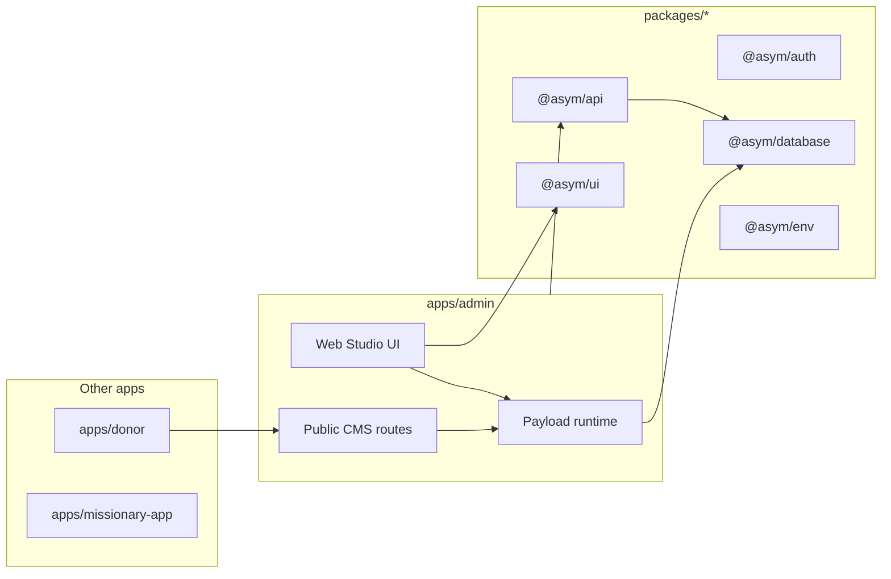
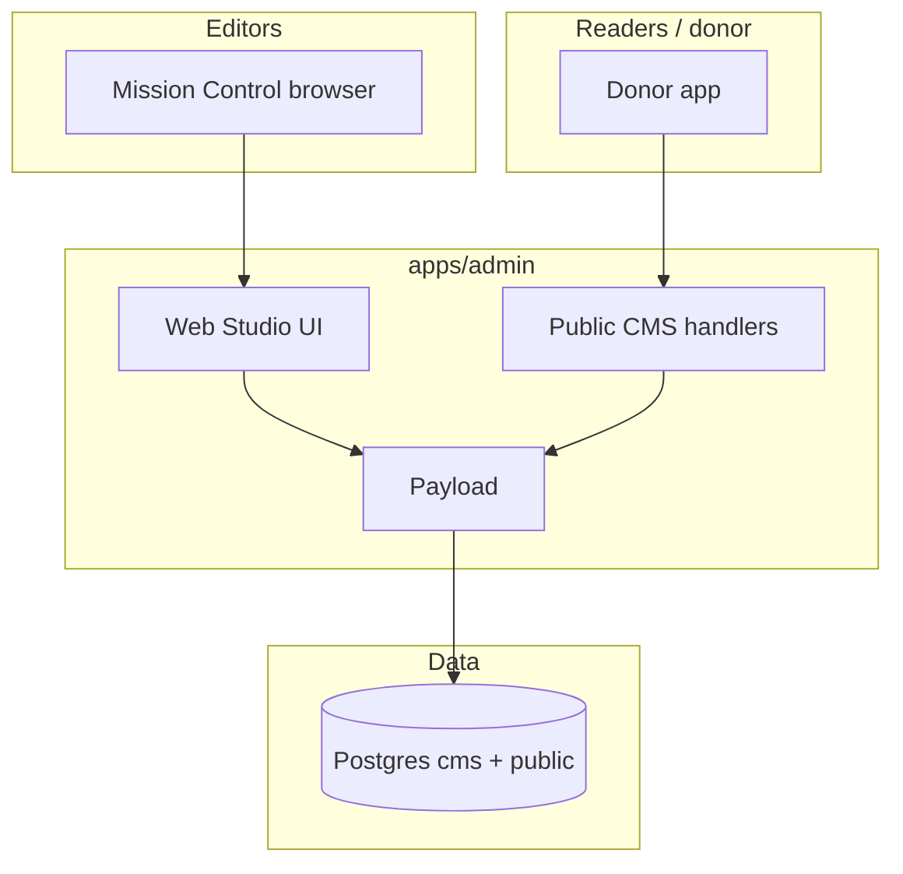
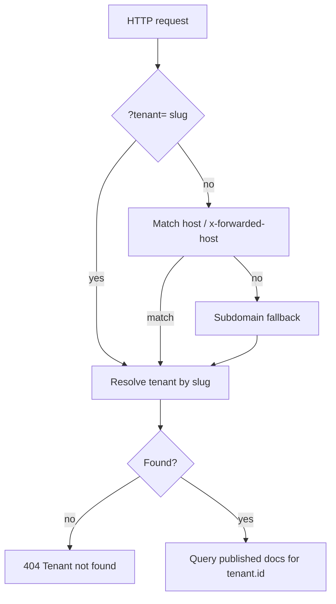
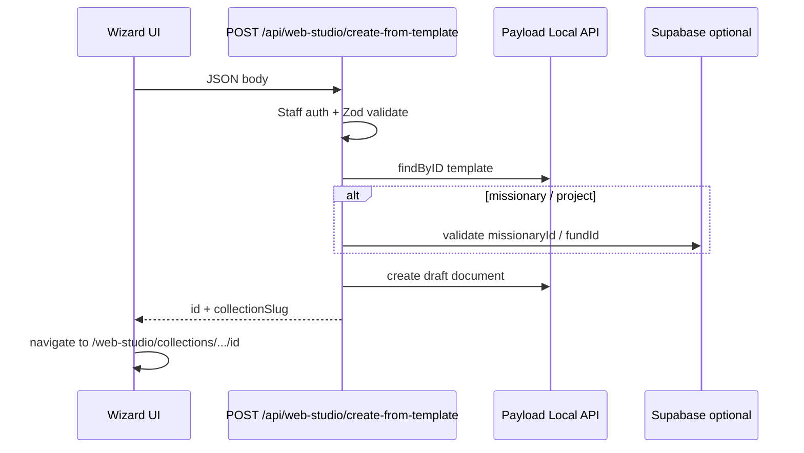

# Web Studio — living specification

**Status:** Living document — update this file when you change Web Studio behavior, routes, collections, or contracts.  
**Canonical for:** product intent, architecture, handoff context, and “what is actually shipped” vs deferred work.  
**Related:** Phase snapshots (`web-studio-phase1.md` … `phase3.md`) are historical; **this doc + the code** override older planning text if they conflict.

---

## 1. Plain-language overview

**Web Studio** is Mission Control’s editorial shell around **Payload CMS**, which still runs entirely inside `apps/admin`. Admins open **`/web-studio`** to manage tenant-scoped content: pages, navigation, profiles, ministry updates, media, and (Phase 3) page templates, missionary giving pages, and fund-backed project pages.

**Why it exists:** keep Payload as the **content runtime** (schema, access, drafts, versions, uploads, Lexical fields) while giving editors a **Mission Control–native** experience for list and default document screens—navigation, tables, chrome, and wizards that match the rest of admin.

**What is custom Mission Control UI:** shared shell (`StudioLayout`, nav rail, top bar), native **list** and **default edit** views for configured collections, template gallery and **create-from-template** wizards (TanStack Form), workspace settings dialogs (`useAsymForm`), and preview affordances in the document chrome.

**What still relies on Payload:** field widgets, document form state, save / save draft / publish, Lexical rich text inside Payload fields, relationship and upload pickers, **nested** document subviews (versions, API JSON, live preview tabs) where not wrapped—those still use Payload’s stock routing/components for stability.

**What remains to be built (confirmed partial / deferred):** deeper native wrappers for every versions/live-preview subview; donor pages that **call** the new public missionary/project helpers (helpers exist, pages may still use mock data); optional API **versioning** for public JSON (today: unversioned contract, additive fields only).

---

## 2. Technical system summary

| Concern                  | Implementation                                                                                                                                    |
| ------------------------ | ------------------------------------------------------------------------------------------------------------------------------------------------- |
| **Runtime**              | Single Payload instance in `apps/admin`; Postgres `cms` schema via `@payloadcms/db-postgres`.                                                     |
| **Admin route**          | `routes.admin: /web-studio` in `apps/admin/payload.config.ts`; Next catch-all `apps/admin/app/(payload)/web-studio/[[...segments]]/page.tsx`.     |
| **Payload REST/GraphQL** | `apps/admin/app/(payload)/api/[...slug]/route.ts`, `.../api/graphql/route.ts` — same origin as admin app.                                         |
| **Public read API**      | `apps/admin/app/api/cms/public/**` — **not** the `(payload)` group; tenant resolution + published-only queries.                                   |
| **Custom views**         | `buildConfig.admin.components.views` for top-level flows; per-collection `admin.components.views` for list/edit overrides.                        |
| **Custom endpoint**      | `POST /api/web-studio/create-from-template` via `config.endpoints` → `apps/admin/src/cms/create-from-template-endpoint.ts`.                       |
| **Access**               | `apps/admin/src/cms/access/*` + tenant hooks on collections; public routes use `overrideAccess: true` with explicit `where` (tenant + published). |
| **Preferences**          | Payload preferences API; keys in `apps/admin/src/cms-ui/web-studio/preferences/keys.ts`.                                                          |

---

## 3. Current shipped scope

Legend: **shipped** | **partial** | **fallback-backed** | **not started** | **deferred**

| Area                                                                                                  | State           | Notes                                                                                                                                           |
| ----------------------------------------------------------------------------------------------------- | --------------- | ----------------------------------------------------------------------------------------------------------------------------------------------- |
| Shell, nav, recent docs, prefs                                                                        | **shipped**     | `apps/admin/src/cms-ui/web-studio/shell/*`                                                                                                      |
| Native list + default edit: `pages`, `navigation`, `missionary-profiles`, `ministry-updates`, `media` | **shipped**     | Env can disable per collection → **fallback-backed**                                                                                            |
| Native list + edit: `page-templates`, `missionary-giving-pages`, `project-pages`                      | **shipped**     | Same flags: `CMS_WEB_STUDIO_NATIVE_*`                                                                                                           |
| Template gallery `/web-studio/templates`                                                              | **shipped**     | Draft templates included in gallery fetch (`draft=true` query)                                                                                  |
| Wizards: standard / give / project / ministry update starter                                          | **shipped**     | `apps/admin/src/cms-ui/web-studio/flows/*`                                                                                                      |
| `create-from-template` endpoint                                                                       | **shipped**     | Staff auth + tenant checks; Supabase validation for missionary/fund                                                                             |
| Staff directory APIs                                                                                  | **shipped**     | Thin routes → `@asym/api/admin/missionary-directory`, `fund-directory` (data boundary)                                                          |
| Public: pages, navigation, updates                                                                    | **shipped**     | Existing contracts                                                                                                                              |
| Public: missionary-pages, project-pages                                                               | **shipped**     | Additive routes                                                                                                                                 |
| Serialized `pages` public JSON                                                                        | **shipped**     | `serializePublishedPageLike` — extra fields, backward compatible                                                                                |
| Nested Payload subviews (versions, live preview UI)                                                   | **partial**     | Stock Payload; links from native chrome                                                                                                         |
| Donor consumption of new public routes                                                                | **partial**     | `fetchPublishedMissionaryGivingPage` / `fetchPublishedProjectPage` in `client.ts`; **Inference:** worker/project pages may not all be wired yet |
| E2E coverage for every Phase 3 click path                                                             | **partial**     | Unit tests extended; full Playwright needs DB + ports (Phase 4 notes)                                                                           |
| TipTap inside Web Studio CMS fields                                                                   | **not started** | Payload editor is Lexical                                                                                                                       |
| TanStack DB in Web Studio                                                                             | **not started** | **Confirmed:** `@tanstack/db` not imported under `cms-ui/web-studio/`; used elsewhere (e.g. contributions live query)                           |

---

## 4. Repo topology and touch points

| Location              | Role                                                                                                    |
| --------------------- | ------------------------------------------------------------------------------------------------------- |
| `apps/admin`          | Payload config, collections, Web Studio UI, public `/api/cms/public/*`, staff `/api/admin/*` re-exports |
| `apps/donor`          | `lib/cms/client.ts` — consumer of public CMS; `CMS_BASE_URL`, forwarded host                            |
| `apps/missionary-app` | No direct Web Studio; may share `@asym/*` packages                                                      |
| `packages/ui`         | shadcn + Maia/Zinc; `useAsymForm`, shared components                                                    |
| `packages/api`        | Business DB logic; `admin/missionary-directory`, `admin/fund-directory`                                 |
| `packages/auth`       | `getAuthContext`, roles for staff routes / CMS users                                                    |
| `packages/database`   | Supabase clients; Payload uses `PAYLOAD_DATABASE_URI` / pool                                            |
| `packages/env`        | `NEXT_PUBLIC_DONOR_URL` etc.                                                                            |

---

## 5. Runtime placement and route map

### Admin (authenticated)

| Path pattern                                | Owner                | Source                                       |
| ------------------------------------------- | -------------------- | -------------------------------------------- |
| `/web-studio`                               | Payload + Next       | `(payload)/web-studio/[[...segments]]`       |
| `/web-studio/collections/:slug`             | Native list or stock | Collection `admin.components.views.list`     |
| `/web-studio/collections/:slug/:id`         | Native edit or stock | `views.edit.default`                         |
| `/web-studio/templates`                     | Custom view          | `payload.config.ts` `admin.components.views` |
| `/web-studio/missionaries`                  | Custom view          | same                                         |
| `/web-studio/pages/give`                    | Custom view          | same                                         |
| `/web-studio/projects/new`                  | Custom view          | same                                         |
| `/web-studio/pages/new-from-template`       | Custom view          | same                                         |
| `/web-studio/ministry-updates/new`          | Custom view          | same                                         |
| `/api/*` (Payload)                          | Payload REST         | `(payload)/api/[...slug]`                    |
| `/api/graphql`                              | Payload              | `(payload)/api/graphql`                      |
| `POST /api/web-studio/create-from-template` | Custom               | `config.endpoints`                           |

### Public (unauthenticated, tenant-scoped)

| Method | Path                                    | Handler                                                  |
| ------ | --------------------------------------- | -------------------------------------------------------- |
| GET    | `/api/cms/public/pages/[...slug]`       | `apps/admin/app/api/cms/public/pages/[...slug]/route.ts` |
| GET    | `/api/cms/public/navigation`            | `navigation/route.ts`                                    |
| GET    | `/api/cms/public/updates`               | `updates/route.ts`                                       |
| GET    | `/api/cms/public/missionary-pages/[id]` | `missionary-pages/[id]/route.ts`                         |
| GET    | `/api/cms/public/project-pages/[slug]`  | `project-pages/[slug]/route.ts`                          |

Tenant order: `resolveTenantFromRequest` — **query `?tenant=` → forwarded host / host → subdomain** (see `apps/admin/src/cms/public/resolve-tenant.ts`).

### Staff Next API (Mission Control auth, not Payload)

| Method | Path                      | Implementation                                                                            |
| ------ | ------------------------- | ----------------------------------------------------------------------------------------- |
| GET    | `/api/admin/missionaries` | `apps/admin/app/api/admin/missionaries/route.ts` → `@asym/api/admin/missionary-directory` |
| GET    | `/api/admin/funds`        | `apps/admin/app/api/admin/funds/route.ts` → `@asym/api/admin/fund-directory`              |

### Feature flags (fallback)

`apps/admin/src/cms-ui/web-studio/feature-flags.ts` — `CMS_WEB_STUDIO_NATIVE_*` per collection; unset = enabled.

---

## 6. UI ownership model

| Responsibility                                                      | Owner                                                         |
| ------------------------------------------------------------------- | ------------------------------------------------------------- |
| Outer layout, studio nav, breadcrumbs, “Mission Control” rhythm     | Mission Control (`StudioLayout`, shell)                       |
| Collection table chrome, filter bar integration, “New” CTA          | Mission Control native list                                   |
| Document header actions row, inspector panel, preview button wiring | Mission Control (`NativeCollectionEditView`)                  |
| Field rendering, validation, dirty state, Lexical                   | Payload                                                       |
| Save / draft / publish / unpublish                                  | Payload controls                                              |
| Versions / API / live preview **tabs**                              | Payload (default)                                             |
| Wizard forms (template flows)                                       | Mission Control + TanStack Form                               |
| Workspace settings dialogs                                          | `useAsymForm` + Zod (`NativeDocumentWorkspaceSettingsDialog`) |
| Preferences persistence                                             | Payload preferences                                           |

---

## 7. Form architecture

| Use case                       | Stack                                                                          |
| ------------------------------ | ------------------------------------------------------------------------------ |
| Main document body             | Payload document context — **no** TanStack Form for the primary Payload fields |
| Template / wizard screens      | `@tanstack/react-form` + Zod in `flows/*.tsx`                                  |
| Workspace / inspector settings | `useAsymForm` from `@asym/ui/components/shadcn/form` (TanStack Form–based API) |
| Simple search in list          | Native controlled inputs + Payload list hooks                                  |

**Why:** Payload owns field semantics and draft lifecycle; TanStack Form is for **isolated** Mission Control UI that must not fight Payload’s form engine.

---

## 8. Rich text / editor architecture (**confirmed**)

| Topic                        | Fact                                                                                           |
| ---------------------------- | ---------------------------------------------------------------------------------------------- |
| Global Payload editor        | `lexicalEditor()` in `apps/admin/payload.config.ts`                                            |
| Package                      | `@payloadcms/richtext-lexical@^3.77.0`                                                         |
| TipTap in Web Studio tree    | **Not used** — no imports under `cms-ui/web-studio/`                                           |
| TipTap in monorepo           | Root `package.json` / skills support **other** surfaces; **not** the Payload admin editor path |
| Rich text in `layout` blocks | Block fields of type `richText` use the same Lexical editor                                    |

**Deferred:** migrating editors (Lexical → TipTap or other) was explicitly out of scope for Web Studio phases.

---

## 9. Content model inventory

| Collection slug           | Purpose                                        | Tenant       | Drafts / versions | Preview (admin)             | Public                         |
| ------------------------- | ---------------------------------------------- | ------------ | ----------------- | --------------------------- | ------------------------------ |
| `pages`                   | Standard site pages + optional `layout` blocks | `tenant` rel | Yes               | `pagesGeneratePreviewURL`   | `GET .../public/pages/*`       |
| `navigation`              | Nav trees                                      | `tenant`     | No                | —                           | `GET .../navigation`           |
| `missionary-profiles`     | CMS-facing profiles                            | `tenant`     | No                | —                           | —                              |
| `ministry-updates`        | Articles                                       | `tenant`     | Yes               | collection config           | `GET .../updates`              |
| `media`                   | Uploads                                        | `tenant`     | No                | —                           | —                              |
| `page-templates`          | Editorial templates                            | `tenant`     | Yes               | —                           | —                              |
| `missionary-giving-pages` | Giving landings; `missionaryId` UUID           | `tenant`     | Yes               | same helper family as pages | `GET .../missionary-pages/:id` |
| `project-pages`           | Fund landings; `fundId` UUID                   | `tenant`     | Yes               | same                        | `GET .../project-pages/:slug`  |
| `tenants`, `cms-users`    | Ops / auth                                     | —            | —                 | —                           | —                              |

**Inference:** public donor rendering of layout blocks vs legacy `content` is app-specific; Payload stores both during rollout (`legacyContentFallback` on pages).

---

## 10. Public API and consumer contract

- **Versioning:** Public JSON is **not** URL-versioned (`/v1/...`); contract evolves by **additive** fields and careful consumer updates. **Document versions** are a Payload CMS feature, not HTTP API versioning.
- **Consumers:** `apps/donor/lib/cms/client.ts` — forward `x-forwarded-host` for tenant resolution on admin origin.
- **Backward compatibility:** `pages` response shape preserved; serializer **adds** fields.

---

## 11. Internal adapter and service map

| Concern                | Path                                                                                                                        |
| ---------------------- | --------------------------------------------------------------------------------------------------------------------------- |
| Preview URL builder    | `apps/admin/src/cms-ui/web-studio/adapters/preview-url.ts`                                                                  |
| Feature flags          | `apps/admin/src/cms-ui/web-studio/feature-flags.ts`                                                                         |
| Collection registry    | `.../collections/config.ts`                                                                                                 |
| List/edit shared       | `.../collections/shared/list-workspace/NativeCollectionListView.tsx`, `.../document-workspace/NativeCollectionEditView.tsx` |
| Template instantiate   | `apps/admin/src/cms/create-from-template-endpoint.ts`                                                                       |
| Public page shape      | `apps/admin/src/cms/public/serialize-published-page.ts`                                                                     |
| Tenant resolution      | `apps/admin/src/cms/public/resolve-tenant.ts`                                                                               |
| Import map postprocess | `scripts/dev/postprocess-payload-importmap.mjs`                                                                             |

---

## 12. Multi-tenant model

**Plain language:** Every editorial document belongs to a **tenant**. Staff see only their tenant; super-admins see more. Public readers never authenticate; the server picks a tenant from host or query and only returns **published** rows for that tenant.

**Technical:** `tenant` relationship on collections; `applyTenantFromContext` hooks; access in `tenant-access.ts`; public handlers call `resolveTenantFromRequest` then `where: { tenant: { equals: tenant.id }, _status: published }` (or equivalent).

**Do not break:** widening `overrideAccess` on public routes; skipping tenant predicate.

---

## 13. Auth model

- **Identity:** Supabase for Mission Control users; Payload `CmsUsers` collection with custom strategies.
- **Web Studio gate:** middleware / proxy in `apps/admin` — staff/admin/super_admin for `/web-studio` (see `apps/admin/proxy.ts` and auth docs).
- **Public routes:** No session; tenant derived from request metadata only.

---

## 14. Preview, live preview, versions

| Topic             | State                                                                                                        |
| ----------------- | ------------------------------------------------------------------------------------------------------------ |
| Preview button    | Native chrome opens donor URLs where `admin.preview` / config supplies `GeneratePreviewURL`                  |
| Live preview      | Payload context (`useLivePreviewContext`) in native edit view; **nested** live preview UI may still be stock |
| Versions          | Payload versions enabled on draft collections; restore flows stock unless wrapped                            |
| Drafts / autosave | Per collection `versions.drafts` in configs                                                                  |

---

## 15. Media, uploads, relationships

Handled inside Payload’s default edit view and field components. **Risk:** replacing `DefaultEditView` body—keep wrappers thin.

---

## 16. Supabase and database integration

| Topic          | Detail                                                                                                                                                                                  |
| -------------- | --------------------------------------------------------------------------------------------------------------------------------------------------------------------------------------- |
| **Env**        | `NEXT_PUBLIC_SUPABASE_URL`, `NEXT_PUBLIC_SUPABASE_ANON_KEY`, `PAYLOAD_SECRET`, `PAYLOAD_DATABASE_URI` (or `SUPABASE_DB_URL`), optional `NEXT_PUBLIC_DONOR_URL`, `CMS_BASE_URL` on donor |
| **Schemas**    | `public.*` = platform data; `cms.*` = Payload tables                                                                                                                                    |
| **Migrations** | SQL via `supabase/migrations/*`; Payload schema via `bun run cms:migrate`                                                                                                               |
| **Pooling**    | Use Supabase pooler guidance for serverless; local dev often direct `127.0.0.1:54322`                                                                                                   |
| **Staff APIs** | `withOperation` in `@asym/api` — service role admin client; **never** bypass `apps/*/app/api` data-boundary (thin re-exports only)                                                      |

---

## 17. Package version inventory (**from `apps/admin/package.json`**)

| Package                        | Version  |
| ------------------------------ | -------- |
| `payload`                      | ^3.77.0  |
| `@payloadcms/next`             | ^3.77.0  |
| `@payloadcms/db-postgres`      | ^3.77.0  |
| `@payloadcms/richtext-lexical` | ^3.77.0  |
| `next`                         | 16.2.1   |
| `react` / `react-dom`          | 19.2.3   |
| `@base-ui/react`               | 1.3.0    |
| `@tanstack/react-form`         | 1.28.6   |
| `@tanstack/react-query`        | ^5.90.21 |
| `@tanstack/react-table`        | ^8.21.3  |
| `@tanstack/db`                 | ^0.5.16  |
| `@supabase/ssr`                | ^0.8.0   |

---

## 18. Tech stack usage map (Web Studio paths)

| Tech                    | Web Studio status                                                                                 |
| ----------------------- | ------------------------------------------------------------------------------------------------- |
| Payload CMS             | **actively used**                                                                                 |
| Lexical (via Payload)   | **actively used** for rich text                                                                   |
| TipTap                  | **not used** in Web Studio / Payload admin fields                                                 |
| TanStack Form           | **actively used** (wizards + `useAsymForm` dialogs)                                               |
| TanStack Query          | **actively used** (e.g. template gallery fetch)                                                   |
| TanStack Table          | **actively used** via Payload list + `@asym/ui` data table patterns                               |
| TanStack DB             | **not used** under `apps/admin/src/cms-ui/web-studio/`; installed in admin for **other** features |
| Base UI                 | **actively used** (per repo rules; primitives)                                                    |
| shadcn / `@asym/ui`     | **actively used**                                                                                 |
| Supabase Auth           | **actively used** for Mission Control session → CMS access                                        |
| Postgres / `cms` schema | **actively used**                                                                                 |

---

## 19. Testing and validation status (Phase 4 snapshot)

**Confirmed run (agent / CI-like):** `cms:importmap`, `lint:admin`, `typecheck:admin`, admin **production build**, `test:unit` (full), `test:unit:cms`, `verify:*` including **data-boundary**, donor + missionary **builds**.

**Gaps:** Full `test:e2e:cms` requires local Postgres + free ports + Playwright webServer; treat as **release gate** in real CI. See `docs/guides/development/web-studio-runbook.md`.

**Confidence:** **Ready with caveats** — static gates green; E2E and hosted migration checks remain environment-dependent.

---

## 20. Known gaps, debt, and risks

- Stock Payload subviews for versions / live preview / API JSON (parity gap vs “all native”).
- Donor pages may not yet consume new public helpers everywhere (**inference** from Phase 3 scope note).
- `missionaryProfile` link on giving pages only when profile `slug` matches missionary UUID (**documented** in Phase 3 doc).
- Public API remains **unversioned** — additive changes only unless a versioning project is approved.
- Payload + DB upgrades: test import map and Lexical after bumps.

---

## 21. Decision log (major)

| Decision                                              | Rationale                                |
| ----------------------------------------------------- | ---------------------------------------- |
| Payload stays in `apps/admin`                         | Single runtime; no second CMS            |
| Custom views vs fork                                  | Upgrade-safe, supported extension points |
| Mission Control shell owns list/default edit          | Product UX; Payload owns fields          |
| TanStack Form only outside Payload document body      | Avoid duplicate form engines             |
| Lexical as editor                                     | Payload 3 default path in this repo      |
| Separate collections for templates / giving / project | Clear access, previews, public routes    |
| `create-from-template` as Payload endpoint            | Same `req`, access control, audit hooks  |
| Thin Next routes for staff DB reads                   | `data-access-boundary.md` compliance     |

---

## 22. Next-step roadmap

**Small:** Extend Playwright `@cms` specs for template URL smoke; wire donor workers page to `fetchPublishedMissionaryGivingPage` where product-ready.

**Medium:** Native wrappers for versions / live preview where Payload exports allow.

**Long:** Public API versioning strategy; editor migration (explicit product decision).

**Risky / wait:** Forking Payload admin; bypassing tenant filters.

---

## 23. Onboarding checklist

1. Read **this doc** + `docs/guides/development/web-studio-runbook.md`.
2. Run `NODE_ENV=test bun run cms:importmap`, `bun run typecheck:admin`, `bun run test:unit:cms`.
3. Open `apps/admin/payload.config.ts` and `apps/admin/src/cms-ui/web-studio/collections/config.ts`.
4. Do **not** break `resolveTenantFromRequest`, public `published-only` queries, or data-boundary thin routes.

---

## 24. Glossary

| Term                 | Meaning                                                         |
| -------------------- | --------------------------------------------------------------- |
| **Web Studio**       | Mission Control native UI + Payload runtime under `/web-studio` |
| **Payload runtime**  | Schema, access, Local API, REST, GraphQL, document forms        |
| **Document view**    | Payload screen for one document (`edit`, `versions`, …)         |
| **Live preview**     | Payload feature: iframe / URL sync with draft data              |
| **Tenant**           | Organization scope for content; FK on documents                 |
| **Public CMS route** | Unauthenticated GET on `apps/admin` used by donor               |
| **Template**         | `page-templates` document with `defaultLayout` + `pageType`     |
| **Published-only**   | Public routes exclude drafts (`_status: published`)             |

---

## Diagrams

### System context

### Tenant resolution (public)

### Create-from-template

