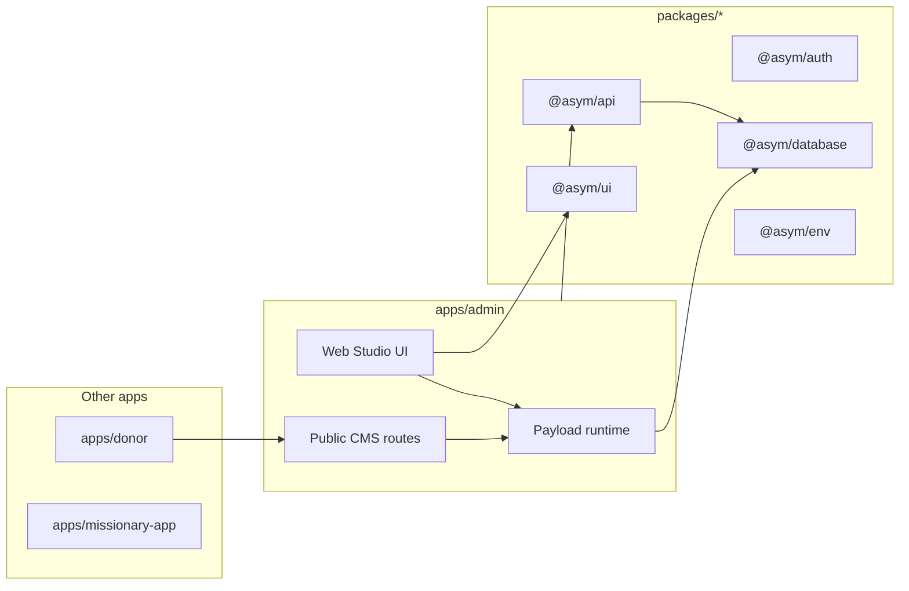
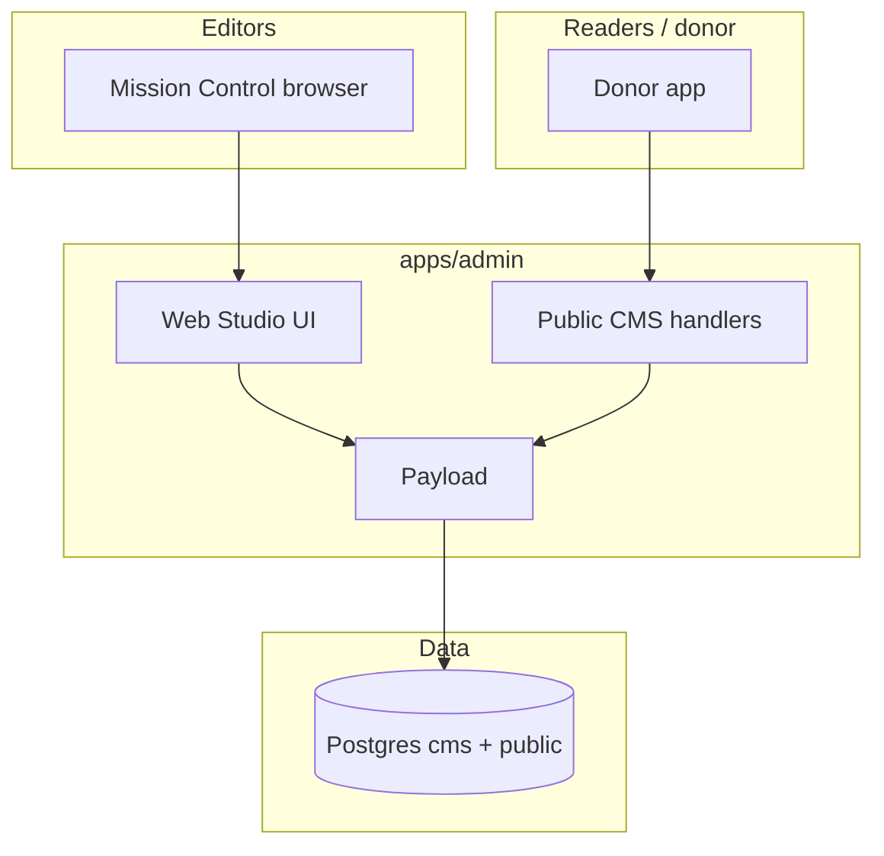
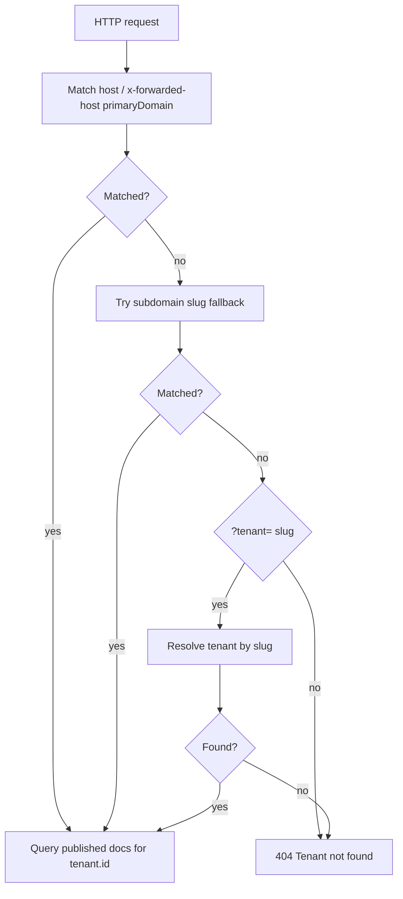
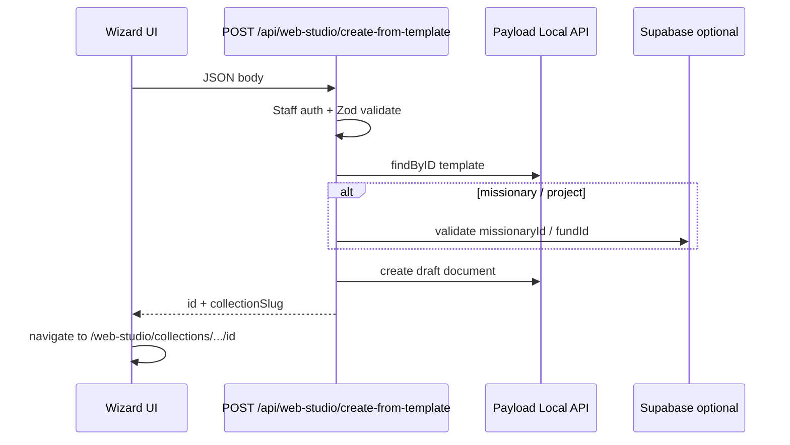

# Web Studio — living specification

**Status:** Living document — update this file when you change Web Studio behavior, routes, collections, or contracts.  
**Canonical for:** product intent, architecture, handoff context, and “what is actually shipped” vs deferred work.  
**Related:** Phase snapshots (`web-studio-phase1.md` … `phase3.md`) are historical; **this doc + the code** override older planning text if they conflict.

---

## 1. Plain-language overview

**Web Studio** is Mission Control’s editorial shell around **Payload CMS**, which still runs entirely inside `apps/admin`. Admins open **`/web-studio`** to manage tenant-scoped content: pages, navigation, profiles, ministry updates, media, and (Phase 3) page templates, missionary giving pages, and fund-backed project pages.

**Why it exists:** keep Payload as the **content runtime** (schema, access, drafts, versions, uploads, Lexical fields) while giving editors a **Mission Control–native** experience for list and default document screens—navigation, tables, chrome, and wizards that match the rest of admin.

**What is custom Mission Control UI:** shared shell (`StudioLayout`, nav rail, top bar), native **list** and **default edit** views for configured collections, template gallery and **create-from-template** wizards (TanStack Form), workspace settings dialogs (`useAsymForm`), and preview affordances in the document chrome.

**What still relies on Payload:** field widgets, document form state, save / save draft / publish, Lexical rich text inside Payload fields, relationship and upload pickers, **nested** document subviews (versions, API JSON, live preview tabs) where not wrapped—those still use Payload’s stock routing/components for stability.

**What remains to be built (confirmed partial / deferred):** deeper native wrappers for every versions/live-preview subview; full donor landing-page use of the new public missionary/project helpers (helpers exist, checkout accepts CMS `missionary_id` / `fund_id` CTA targets); optional API **versioning** for public JSON (today: unversioned contract, additive fields only); Phase 22 D14's release-bound Search/Share compiler, stable public Update permalinks, safe social-card delivery, and one bounded existing-lane **Search & sharing** editor section; Phase 22 D16's D10-routed, source-bounded semantic writing-assistance adapter with explicit suggestion review, CAS Use, exact-English-locale translation, and its check-work warning; D18's current-serving admission plus adverse-first controlled-surface convergence over Phase 5 runtime/cache mechanics; D22's private derived Public Pages operations workspace with source-owned actions; D23's private scope-first Public Page setup/settings projection over source-owned versions; D24's exact-authorized, attribution-preserving Staff-authored Page Revision command inside the sole D1/D4/D5/D2 lane; and D25's derived action evaluation plus one bounded Page-and-locale recovery buffer with reference-safe cleanup.

---

## 2. Technical system summary

| Concern                  | Implementation                                                                                                                                                          |
| ------------------------ | ----------------------------------------------------------------------------------------------------------------------------------------------------------------------- |
| **Runtime**              | Single Payload instance in `apps/admin`; Postgres `cms` schema via `@payloadcms/db-postgres`.                                                                           |
| **Admin route**          | `routes.admin: /web-studio` in `apps/admin/payload.config.ts`; Next catch-all `apps/admin/app/(payload)/web-studio/[[...segments]]/page.tsx`.                           |
| **Admin provider shell** | `apps/admin/app/(payload)/layout.tsx` embeds Payload `RootProvider` inside the existing Mission Control document shell; it does not render another `<html>` / `<body>`. |
| **Payload REST/GraphQL** | `apps/admin/app/(payload)/api/[...slug]/route.ts`, `.../api/graphql/route.ts` — same origin as admin app.                                                               |
| **Public read API**      | `apps/admin/app/api/cms/public/**` — **not** the `(payload)` group; tenant resolution + published-only queries.                                                         |
| **Custom views**         | `buildConfig.admin.components.views` for top-level flows; per-collection `admin.components.views` for list/edit overrides.                                              |
| **Custom endpoint**      | `POST /api/web-studio/create-from-template` via `config.endpoints` → `apps/admin/src/cms/create-from-template-endpoint.ts`.                                             |
| **Access**               | `apps/admin/src/cms/access/*` + tenant hooks on collections; public routes use `overrideAccess: true` with explicit `where` (tenant + published).                       |
| **Preferences**          | Payload preferences API; keys in `apps/admin/src/cms-ui/web-studio/preferences/keys.ts`.                                                                                |

### Payload 4 spike status

Web Studio currently runs on Payload `4.0.0-internal.1f9ae9a` as an explicit
spike dependency. This proves the admin CMS engine can boot, migrate, render
native Web Studio routes, and keep public CMS boundaries intact on the internal
Payload 4 line; it is not yet the final stable dependency contract.

Graduation criteria before treating Payload 4 as the durable baseline:

- replace internal Payload packages with a supported stable channel or an
  explicitly approved pinned internal release;
- keep `bun run cms:migrate`, `bun run cms:migrate:status`, and
  `bun run cms:importmap` on Node.js `24.15.0+`;
- keep `bun run typecheck:admin`, `bun run build:admin`,
  `bun run test:unit:cms`, and CMS Playwright smoke green against Postgres;
- keep donor/missionary apps consuming public CMS APIs rather than importing
  Payload runtime code.

---

## 3. Current shipped scope

Legend: **shipped** | **partial** | **fallback-backed** | **not started** | **deferred**

| Area                                                                                                  | State           | Notes                                                                                                                                       |
| ----------------------------------------------------------------------------------------------------- | --------------- | ------------------------------------------------------------------------------------------------------------------------------------------- |
| Shell, nav, recent docs, prefs                                                                        | **shipped**     | `apps/admin/src/cms-ui/web-studio/shell/*`                                                                                                  |
| Native list + default edit: `pages`, `navigation`, `missionary-profiles`, `ministry-updates`, `media` | **shipped**     | Env can disable per collection → **fallback-backed**                                                                                        |
| Native list + edit: `page-templates`, `missionary-giving-pages`, `project-pages`                      | **shipped**     | Same flags: `CMS_WEB_STUDIO_NATIVE_*`                                                                                                       |
| Template gallery `/web-studio/templates`                                                              | **shipped**     | Draft templates included in gallery fetch (`draft=true` query)                                                                              |
| Wizards: standard / give / project / ministry update starter                                          | **shipped**     | `apps/admin/src/cms-ui/web-studio/flows/*`                                                                                                  |
| `create-from-template` endpoint                                                                       | **shipped**     | Staff auth + tenant checks; Supabase validation for missionary/fund                                                                         |
| Staff directory APIs                                                                                  | **shipped**     | Thin routes → `@asym/api/admin/missionary-directory`, `fund-directory` (data boundary)                                                      |
| Public: pages, navigation, updates                                                                    | **shipped**     | Existing contracts                                                                                                                          |
| Public: missionary-pages, project-pages                                                               | **shipped**     | Additive routes                                                                                                                             |
| Serialized `pages` public JSON                                                                        | **shipped**     | `serializePublishedPageLike` — extra fields, backward compatible                                                                            |
| Nested Payload subviews (versions, live preview UI)                                                   | **partial**     | Stock Payload; links from native chrome                                                                                                     |
| Donor consumption of new public routes                                                                | **partial**     | `fetchPublishedMissionaryGivingPage` / `fetchPublishedProjectPage` in `client.ts`; checkout accepts CMS `missionary_id` / `fund_id` targets |
| E2E coverage for every Phase 3 click path                                                             | **partial**     | Unit tests extended; full Playwright needs DB + ports (Phase 4 notes)                                                                       |
| TipTap inside Web Studio CMS fields                                                                   | **not started** | Payload editor is Lexical                                                                                                                   |
| TanStack DB in Web Studio                                                                             | **not started** | **Confirmed:** `@tanstack/db` not imported under `cms-ui/web-studio/`; used elsewhere (e.g. contributions live query)                       |

---

## 4. Repo topology and touch points

| Location              | Role                                                                                                    |
| --------------------- | ------------------------------------------------------------------------------------------------------- |
| `apps/admin`          | Payload config, collections, Web Studio UI, public `/api/cms/public/*`, staff `/api/admin/*` re-exports |
| `apps/donor`          | `lib/cms/client.ts` — consumer of public CMS; `CMS_BASE_URL`, forwarded host, result classification     |
| `apps/missionary-app` | No direct Web Studio; may share `@asym/*` packages                                                      |
| `packages/lib`        | Public CMS page descriptors, read cache policy, response/result types, and server-side Lexical renderer |
| `packages/ui`         | shadcn (Base UI Maia + Zinc); `useAsymForm`, shared components                                          |
| `packages/api`        | Business DB logic; `admin/missionary-directory`, `admin/fund-directory`                                 |
| `packages/auth`       | `getAuthContext`, roles for staff routes / CMS users                                                    |
| `packages/database`   | Supabase clients; Payload uses `PAYLOAD_DATABASE_URI` / pool                                            |
| `packages/env`        | `NEXT_PUBLIC_DONOR_URL` etc.                                                                            |

---

## 5. Runtime placement and route map

### Admin (authenticated)

| Path pattern                                | Owner                | Source                                       |
| ------------------------------------------- | -------------------- | -------------------------------------------- |
| `/web-studio`                               | Payload + Next       | `(payload)/web-studio/[[...segments]]`       |
| `/web-studio/collections/:slug`             | Native list or stock | Collection `admin.components.views.list`     |
| `/web-studio/collections/:slug/:id`         | Native edit or stock | `views.edit.default`                         |
| `/web-studio/templates`                     | Custom view          | `payload.config.ts` `admin.components.views` |
| `/web-studio/missionaries`                  | Custom view          | same                                         |
| `/web-studio/pages/give`                    | Custom view          | same                                         |
| `/web-studio/projects/new`                  | Custom view          | same                                         |
| `/web-studio/pages/new-from-template`       | Custom view          | same                                         |
| `/web-studio/ministry-updates/new`          | Custom view          | same                                         |
| `/api/*` (Payload)                          | Payload REST         | `(payload)/api/[...slug]`                    |
| `/api/graphql`                              | Payload              | `(payload)/api/graphql`                      |
| `POST /api/web-studio/create-from-template` | Custom               | `config.endpoints`                           |

### Public (unauthenticated, tenant-scoped)

| Method | Path                                    | Handler                                                  |
| ------ | --------------------------------------- | -------------------------------------------------------- |
| GET    | `/api/cms/public/pages/[...slug]`       | `apps/admin/app/api/cms/public/pages/[...slug]/route.ts` |
| GET    | `/api/cms/public/navigation`            | `navigation/route.ts`                                    |
| GET    | `/api/cms/public/updates`               | `updates/route.ts`                                       |
| GET    | `/api/cms/public/missionary-pages/[id]` | `missionary-pages/[id]/route.ts`                         |
| GET    | `/api/cms/public/project-pages/[slug]`  | `project-pages/[slug]/route.ts`                          |

Tenant order: `resolveTenantFromRequest` — **forwarded host / host primary-domain match → subdomain slug fallback → query `?tenant=` only when the host does not resolve a tenant** (see `apps/admin/src/cms/public/resolve-tenant.ts`).

### Staff Next API (Mission Control auth, not Payload)

| Method | Path                      | Implementation                                                                            |
| ------ | ------------------------- | ----------------------------------------------------------------------------------------- |
| GET    | `/api/admin/missionaries` | `apps/admin/app/api/admin/missionaries/route.ts` → `@asym/api/admin/missionary-directory` |
| GET    | `/api/admin/funds`        | `apps/admin/app/api/admin/funds/route.ts` → `@asym/api/admin/fund-directory`              |

### Feature flags (fallback)

`apps/admin/src/cms-ui/web-studio/feature-flags.ts` — `CMS_WEB_STUDIO_NATIVE_*` per collection; unset = enabled.

---

## 6. UI ownership model

| Responsibility                                                      | Owner                                                         |
| ------------------------------------------------------------------- | ------------------------------------------------------------- |
| Outer layout, studio nav, breadcrumbs, “Mission Control” rhythm     | Mission Control (`StudioLayout`, shell)                       |
| Collection table chrome, filter bar integration, “New” CTA          | Mission Control native list                                   |
| Document header actions row, inspector panel, preview button wiring | Mission Control (`NativeCollectionEditView`)                  |
| Payload admin providers, permissions, preferences, locale, portal   | Embedded Payload `RootProvider` in `(payload)/layout.tsx`     |
| Field rendering, validation, dirty state, Lexical                   | Payload                                                       |
| Save / draft / publish / unpublish                                  | Payload controls                                              |
| Versions / API / live preview **tabs**                              | Payload (default)                                             |
| Wizard forms (template flows)                                       | Mission Control + TanStack Form                               |
| Workspace settings dialogs                                          | `useAsymForm` + Zod (`NativeDocumentWorkspaceSettingsDialog`) |
| Preferences persistence                                             | Payload preferences                                           |

---

## 6a. Data ownership boundary

Payload/Web Studio is the durable **content** runtime. It owns page structure, navigation, media, templates, draft / publish / version state, preview URLs, and editor experience.

Payload/Web Studio is **not** the source of truth for giving, CRM, donor care, or email delivery facts:

| Domain                                                                                              | Source of truth                                                                                                          | CMS relationship                                                                 |
| --------------------------------------------------------------------------------------------------- | ------------------------------------------------------------------------------------------------------------------------ | -------------------------------------------------------------------------------- |
| CMS content, media, navigation, templates, preview bytes, and Payload-internal draft/version status | Payload `cms` schema                                                                                                     | Owns and mutates its stored bytes/status; never supplies D2 public release truth |
| Donor relationships, notes, donor detail, reports, CRM workflow records                             | Asym Postgres CRM (package-layer CRM services; Twenty retired — ADR-0001)                                                | May display read-only projections                                                |
| Ministry Project identity/lifecycle and Public Page Subject Bindings                                | CRM operational source for Ministry Projects; Phase 13 for Campaigns/Designations; Phase 22 for exact typed Page binding | References opaque, owner-certified identities only                               |
| Missionary Ministry Assignment identity, memberships, and support binding                           | CRM operational source for Assignment/memberships; Phase 21 for the optional finance-authorized Support Binding          | References the opaque Assignment; never infers people or financial access        |
| Public Ministry serving admission and controlled-surface convergence                                | Phase 22 D18 semantics; Phase 5 runtime/cache execution                                                                  | Payload publication and cache state are inputs/effects, never authority          |
| Page-family semantic catalog and compatible release generations                                     | Phase 22 D20 code-owned catalogs and D2 release manifests                                                                | Payload blocks/preferences are authored input, never catalog authority           |
| Complete-surface adoption coverage and reader-generation transition                                 | Phase 22 D21 Adoption Case, manifest, authority head, and cutover receipt                                                | Payload endpoints/flags/stock UI are migration evidence only                     |
| Public Page operations causes, impacts, actions, and resolution                                     | Applicable current source-owning domains; D22 derives a private operations projection                                    | CMS lists/status and generic tasks are UI evidence, never authority              |
| Public Page setup/settings choices, versions, consequences, and commands                            | Applicable D2-D20/Phase 21 D10 source owners; D23 derives a private setup/settings projection                            | CMS preferences/defaults are UI evidence, never configuration authority          |
| Staff-authored Page content/version bytes and operational revision provenance                       | Payload owns bounded private content/version bytes; D1/D24 owns the coherent working head and attributed successor truth | Native roles/status/restore/publish are editor evidence, never authority         |
| Unreleased editorial actionability and private recovery                                             | D1-D24 owner heads derive actions; Payload may store one bounded Page-and-locale recovery buffer                         | D25 adds no operational status; age and stored bytes grant no authority          |
| Gifts, staged gifts, allocations, payment state, reconciliation, receipt facts                      | Stripe/Supabase giving pipeline                                                                                          | May store CTA copy and validated references only                                 |
| Receipt sends, send logs, delivery events                                                           | Resend/app email services                                                                                                | No direct provider sends from CMS                                                |
| Mobilization stage transitions                                                                      | Deferred mobilization workstream                                                                                         | Read-only/deferred; not a CMS foundation blocker                                 |

Giving CTAs on CMS pages resolve into the donor checkout flow with validated `missionary_id` / `fund_id` references. Missionary giving and project page source-reference fields reject non-UUID values at the collection layer; create-from-template still validates tenant ownership against Supabase before creating those drafts. CMS must not create gifts, mutate giving tables, store payment truth, or write CRM donor-care records.

The current Project Page `fundId` is migration evidence only. Phase 22 D17
requires one operational, immutable-versioned Page Subject Binding to exactly
one owner-certified CRM Ministry Project, Phase 13 Giving Campaign, or
separately public-subject-eligible Phase 13 Designation. Payload references the
opaque Page identity and owns presentation revisions; it does not own or infer
the subject. The subject remains separate from the D7 Page Giving Binding, D6
progress, D1 contributors/display, and every release/lifecycle contract.

D18 likewise does not make Payload publication or caching authoritative. Phase
5 executes runtime/cache mechanics; Phase 22 owns Public Ministry semantics,
current-serving admission, and adverse-first convergence. No controlled public
response may bypass that evaluation, and no cache, deployment, provider result,
or worker becomes a second public authority. See
[ADR-0135](../../adr/0135-release-bound-public-ministry-runtime-composition.md).

D20 does not make the generic Payload block builder or copied templates a Page
family catalog. A D2 release must be family-qualified and pin compatible exact
catalog, renderer, profile, content, locale, brand, and managed-reference
generations; unknown semantic input preserves the last certified release.

D21 does not make Web Studio, Payload `_status`, the current public endpoints,
collection feature flags, or deployment state an adoption switch. Page
preparation may proceed privately and incrementally, but public authority moves
once for the complete Site/verified-host/locale dependency closure through the
separately authorized reader-generation CAS. Before cutover, legacy traffic
remains safety-gated or unavailable; afterward the Phase 5/D18 gateway is the
only reader. A stock-admin fallback may preserve editing access but may never
restore raw Payload publication, the old reader, mock data, or an old cache.
See [ADR-0138](../../adr/0138-complete-public-ministry-surface-authority-cutover.md).

D22 does not make Payload lists or `_status`, the public directory, or generic
Mission Control **Needs attention** and task state operational authority. The
private Public Pages workspace derives permission-filtered cause and impact
rows into exactly three stable views: **To review**, **Needs attention**, and
**All pages**. It owns neither Page health nor resolution. Actions navigate to
or invoke the applicable current source-owning workflow, and an optional shared task may
support same-scope follow-up only; its lifecycle closes no source cause or Page
impact. See
[ADR-0139](../../adr/0139-derived-public-page-operations-with-cause-owned-actions.md).

D23 does not make Payload preferences, collection defaults, the current
`org-settings` JSON, tenant picker, or browser settings UI authoritative. Its
private scope-first projection summarizes exact current source-owner versions
and routes one Change action to one current-authorized owner command. Each
successful amendment appends an immutable owner successor and confirms through
authoritative readback. D23 owns no settings row, generic mutation API, global
save/reset, readiness, release, activation, operations resolution, AI-provider
credential, or per-Page choice. See
[ADR-0140](../../adr/0140-derived-public-page-setup-and-settings.md).

D24 does not make broad tenant staff/admin access, Payload locks, autosave,
version history, `_status`, restore, Publish/Unpublish, REST/GraphQL/Local API,
or the current audit hook authoritative. Those are storage, editor, and
migration seams. One Phase 22 command re-proves the exact Phase 12 staff
Page-content-edit capability and D3/D20 allowlist, records the actor,
predecessor, same-scope content source, semantic comparison, and safe
supersession reason where required, then idempotently CAS-advances D1's sole
working head. Actor-context Payload calls use `overrideAccess: false` and
`overrideLock: false`, but Payload owns only the bounded private content/version
bytes; D4/D5 and D2 remain review and release authority. See
[ADR-0141](../../adr/0141-attribution-preserving-staff-authored-page-revisions.md).

D25 does not make autosave age, Payload status, native restore, a version cap,
stored bytes, or actor history into actionability or retention authority. One
server resolver derives only currently permitted actions from existing owner
heads; each selected command re-proves its facts. Payload may keep one
coalesced, non-semantic Page-and-locale recovery buffer, but only a sealed
immutable semantic version and digest may be referenced by a revision or
candidate. D24's reference-safe reconciler is the sole scratch cleanup owner.
See
[ADR-0142](../../adr/0142-derived-editorial-actionability-and-bounded-recovery.md).

---

## 7. Form architecture

| Use case                       | Stack                                                                                       |
| ------------------------------ | ------------------------------------------------------------------------------------------- |
| Main document body             | Payload document context — **no** TanStack Form for the primary Payload fields              |
| Template / wizard screens      | `@tanstack/react-form` + Zod in `flows/*.tsx`                                               |
| Workspace / inspector settings | `useAsymForm` from `@asym/ui/components/primitives/tanstack-form` (TanStack Form–based API) |
| Simple search in list          | Native controlled inputs + Payload list hooks                                               |

**Why:** Payload owns field semantics and draft lifecycle; TanStack Form is for **isolated** Mission Control UI that must not fight Payload’s form engine.

---

## 8. Rich text / editor architecture (**confirmed**)

| Topic                        | Fact                                                                                           |
| ---------------------------- | ---------------------------------------------------------------------------------------------- |
| Global Payload editor        | `lexicalEditor()` in `apps/admin/payload.config.ts`                                            |
| Package                      | `@payloadcms/richtext-lexical@4.0.0-internal.1f9ae9a`                                          |
| TipTap in Web Studio tree    | **Not used** — no imports under `cms-ui/web-studio/`                                           |
| TipTap in monorepo           | Root `package.json` / skills support **other** surfaces; **not** the Payload admin editor path |
| Rich text in `layout` blocks | Block fields of type `richText` use the same Lexical editor                                    |

**Deferred:** migrating editors (Lexical → TipTap or other) was explicitly out of scope for Web Studio phases.

---

## 9. Content model inventory

| Collection slug           | Purpose                                                | Tenant       | Drafts / versions | Preview (admin)                  | Public                         |
| ------------------------- | ------------------------------------------------------ | ------------ | ----------------- | -------------------------------- | ------------------------------ |
| `pages`                   | Standard site pages + optional `layout` blocks         | `tenant` rel | Yes               | Authenticated Web Studio preview | `GET .../public/pages/*`       |
| `navigation`              | Nav trees                                              | `tenant`     | No                | —                                | `GET .../navigation`           |
| `missionary-profiles`     | CMS-facing profiles; Supabase source UUID is read-only | `tenant`     | No                | —                                | —                              |
| `ministry-updates`        | Articles                                               | `tenant`     | Yes               | Authenticated Web Studio preview | `GET .../updates`              |
| `media`                   | Uploads                                                | `tenant`     | No                | —                                | —                              |
| `page-templates`          | Editorial templates                                    | `tenant`     | Yes               | —                                | —                              |
| `missionary-giving-pages` | Giving landings; `missionaryId` UUID                   | `tenant`     | Yes               | Authenticated Web Studio preview | `GET .../missionary-pages/:id` |
| `project-pages`           | Fund landings; `fundId` UUID                           | `tenant`     | Yes               | Authenticated Web Studio preview | `GET .../project-pages/:slug`  |
| `tenants`, `cms-users`    | Ops / auth                                             | —            | —                 | —                                | —                              |

Media uploads are limited to image MIME types (`avif`, `gif`, `jpeg`, `png`, `webp`), do not allow pasted remote URLs, and keep tenant access controls on upload documents.

Giving source-reference fields (`missionaryId`, `fundId`, `supabaseMissionaryId`) remain content references, not payment/CRM facts. Missionary and fund references validate UUID shape and, when request context is available, validate against the authenticated request's public Supabase tenant UUID. The Payload tenant document id remains the relationship used for CMS writes.

This inventory describes the current prototype, not the D17 target. A UUID-
shaped `fundId`, copied title/description, or successful Payload relationship
lookup cannot establish an exact typed Page subject, a Ministry Project, Giving,
progress, permissions, or release eligibility.

**Inference:** public donor rendering of layout blocks vs legacy `content` is app-specific; Payload stores both during rollout (`legacyContentFallback` on pages).

---

## 10. Public API and consumer contract

- **Versioning:** Public JSON is **not** URL-versioned (`/v1/...`); contract evolves by **additive** fields and careful consumer updates. **Document versions** are a Payload CMS feature, not HTTP API versioning.
- **Consumers:** `apps/donor/lib/cms/client.ts` — forward `x-forwarded-host` for tenant resolution on admin origin, apply public CMS cache tags, and distinguish `found` / `not-found` / `tenant-not-found` / `bad-request` / `unavailable`.
- **Backward compatibility:** `pages` response shape preserved; serializer **adds** fields.
- **Public serialization:** CTA hrefs are sanitized. Missionary/project page CTAs resolve to `/checkout?missionary_id=...` or `/checkout?fund_id=...`; media relationship objects are reduced to public id/alt/url/size fields before leaving the admin API. This is current-state behavior only: the raw URL and original-filename-bearing media seam, global metadata helpers, fictional Update share URL, and inert Share controls do not satisfy D9/D14. The target public serializer emits only the exact release-bound manifest and opaque D9-certified delivery references.

---

## 11. Internal adapter and service map

| Concern                | Path                                                                                                                            |
| ---------------------- | ------------------------------------------------------------------------------------------------------------------------------- |
| Preview URL builder    | `apps/admin/src/cms-ui/web-studio/adapters/preview-url.ts`                                                                      |
| Feature flags          | `apps/admin/src/cms-ui/web-studio/feature-flags.ts`                                                                             |
| Collection registry    | `.../collections/config.ts`                                                                                                     |
| Payload provider shell | `apps/admin/app/(payload)/layout.tsx`                                                                                           |
| List/edit shared       | `.../collections/shared/list-workspace/NativeCollectionListView.tsx`, `.../document-workspace/NativeCollectionEditView.tsx`     |
| Editor state adapter   | `.../collections/shared/document-workspace/editor-state.ts`                                                                     |
| Auth preview model     | `apps/admin/src/cms/preview/authenticated-preview.ts`, `apps/admin/app/(payload)/web-studio/preview/[collection]/[id]/page.tsx` |
| Template instantiate   | `apps/admin/src/cms/create-from-template-endpoint.ts`                                                                           |
| Public page shape      | `apps/admin/src/cms/public/serialize-published-page.ts`                                                                         |
| Tenant resolution      | `apps/admin/src/cms/public/resolve-tenant.ts`                                                                                   |
| Import map postprocess | `scripts/dev/postprocess-payload-importmap.mjs`                                                                                 |

---

## 12. Multi-tenant model

**Plain language:** Every editorial document belongs to a **tenant**. Staff see only their tenant; super-admins see more. Public readers never authenticate; the server picks a tenant from host or query and only returns **published** rows for that tenant.

**Technical:** `tenant` relationship on collections; `applyTenantFromContext` hooks; access in `tenant-access.ts`; public handlers call `resolveTenantFromRequest` then `where: { tenant: { equals: tenant.id }, _status: published }` (or equivalent).

**Do not break:** widening `overrideAccess` on public routes; skipping tenant predicate.

---

## 13. Auth model

- **Identity:** Supabase for Mission Control users; Payload `CmsUsers` collection with custom strategies.
- **Web Studio gate:** middleware / proxy in `apps/admin` — staff/admin/super_admin for `/web-studio` (see `apps/admin/proxy.ts` and auth docs).
- **Public routes:** No session; tenant derived from request metadata only.
- **Tenant identity split:** `CmsUsers.tenantId` is the Payload tenant document id used for CMS relationships and access filters. The Supabase public tenant UUID is carried separately as `publicTenantId` during authenticated requests and is only used when validating giving/CRM references.

---

## 14. Preview, live preview, versions

| Topic             | State                                                                                                                                                      |
| ----------------- | ---------------------------------------------------------------------------------------------------------------------------------------------------------- |
| Preview button    | Native chrome opens `/web-studio/preview/:collection/:id`, which requires an authenticated Web Studio user and reads drafts through Payload access control |
| Public link       | Native inspector exposes donor public URL only as "Open published page" and only when the document is published                                            |
| Live preview      | Payload context (`useLivePreviewContext`) in native edit view; **nested** live preview UI may still be stock                                               |
| Versions          | Payload versions enabled on draft collections; restore flows stock unless wrapped                                                                          |
| Drafts / autosave | Per collection `versions.drafts` in configs                                                                                                                |

The native edit shell now reports loading, dirty, saving, autosave, validation, lock, trash, preview, and publish states without replacing Payload's document form. The authenticated preview route uses `overrideAccess: false`; public routes stay published-only and never receive draft data.

**Preview convergence (Phase 5 Public Website Runtime Contract + Phase 22
D10):** Public Ministry Preview converges on the public runtime's real reader and
renderer. A contributor previews one explicitly selected coherently saved
working revision; a reviewer or named page-scoped `Preview only` grantee
previews one immutable submitted candidate. Every HTML, RSC/data, media,
refresh, and session-continuation request must reauthenticate the non-anonymous
principal and reauthorize the exact current Tenant, Legal Entity, Site, Page,
locale, version/candidate, assignment or grant, authorization epoch, Phase 10
ceiling, D3 renderer generation, and D9 media coverage. Draft Mode and a signed
internal route select the draft read perspective but never grant authority. The
result is private, `no-store`, non-indexable, referrer-suppressed, and
side-effect-dark; copied URLs grant nothing. The authenticated admin-template
preview above remains an **interim, mutable preview** and is not D10-conforming
until it uses this exact-version authorization and public-runtime renderer. No
shareable/bearer non-staff preview token remains a reserved seam. Payload Live
Preview may later improve rendering latency only under this same authorization
contract. See the Phase 5 contract (A10), ADR-0028/ADR-0030, and ADR-0127.

---

## 15. Media, uploads, relationships

Handled inside Payload’s default edit view and field components. **Risk:** replacing `DefaultEditView` body—keep wrappers thin.

---

## 16. Supabase and database integration

| Topic          | Detail                                                                                                                                                                                  |
| -------------- | --------------------------------------------------------------------------------------------------------------------------------------------------------------------------------------- |
| **Env**        | `NEXT_PUBLIC_SUPABASE_URL`, `NEXT_PUBLIC_SUPABASE_ANON_KEY`, `PAYLOAD_SECRET`, `PAYLOAD_DATABASE_URI` (or `SUPABASE_DB_URL`), optional `NEXT_PUBLIC_DONOR_URL`, `CMS_BASE_URL` on donor |
| **Schemas**    | `public.*` = platform data; `cms.*` = Payload tables                                                                                                                                    |
| **Migrations** | SQL via `supabase/migrations/*`; Payload schema via `bun run cms:migrate`                                                                                                               |
| **Pooling**    | Use Supabase pooler guidance for serverless; local dev often direct `127.0.0.1:54322`                                                                                                   |
| **Staff APIs** | `withOperation` in `@asym/api` — service role admin client; **never** bypass `apps/*/app/api` data-boundary (thin re-exports only)                                                      |

---

## 17. Package version inventory (**from `apps/admin/package.json`**)

| Package                           | Version                |
| --------------------------------- | ---------------------- |
| `payload`                         | 4.0.0-internal.1f9ae9a |
| `@payloadcms/next`                | 4.0.0-internal.1f9ae9a |
| `@payloadcms/db-postgres`         | 4.0.0-internal.1f9ae9a |
| `@payloadcms/richtext-lexical`    | 4.0.0-internal.1f9ae9a |
| `@payloadcms/storage-vercel-blob` | 4.0.0-internal.1f9ae9a |
| `next`                            | 16.3.0-preview.9       |
| `react` / `react-dom`             | 19.2.3                 |
| `@base-ui/react`                  | 1.3.0                  |
| `@tanstack/react-form`            | 1.28.6                 |
| `@tanstack/react-query`           | ^5.90.21               |
| `@tanstack/react-table`           | ^8.21.3                |
| `@tanstack/db`                    | ^0.5.16                |
| `@supabase/ssr`                   | ^0.8.0                 |

---

## 18. Tech stack usage map (Web Studio paths)

| Tech                    | Web Studio status                                                                                 |
| ----------------------- | ------------------------------------------------------------------------------------------------- |
| Payload CMS             | **actively used**                                                                                 |
| Lexical (via Payload)   | **actively used** for rich text                                                                   |
| TipTap                  | **not used** in Web Studio / Payload admin fields                                                 |
| TanStack Form           | **actively used** (wizards + `useAsymForm` dialogs)                                               |
| TanStack Query          | **actively used** (e.g. template gallery fetch)                                                   |
| TanStack Table          | **actively used** via Payload list + `@asym/ui` data table patterns                               |
| TanStack DB             | **not used** under `apps/admin/src/cms-ui/web-studio/`; installed in admin for **other** features |
| Base UI                 | **actively used** (per repo rules; primitives)                                                    |
| shadcn / `@asym/ui`     | **actively used**                                                                                 |
| Supabase Auth           | **actively used** for Mission Control session → CMS access                                        |
| Postgres / `cms` schema | **actively used**                                                                                 |

---

## 19. Testing and validation status (Phase 7 snapshot)

**Confirmed run (agent / CI-like):** `lint:admin`, `typecheck:admin`, `test:unit:cms`. Phase evidence records the full gate status for the current run.

**Gaps:** Full `test:e2e:cms` requires local Postgres + free ports + Playwright webServer; treat as **release gate** in real CI. See `docs/guides/development/web-studio-runbook.md`.

**Confidence:** **Ready with caveats** — static gates green; E2E, hosted migration checks, and production Vercel readiness remain environment-dependent.

---

## 20. Known gaps, debt, and risks

- Stock Payload subviews for versions / live preview / API JSON (parity gap vs “all native”).
- Donor pages may not yet consume new public helpers everywhere (**inference** from Phase 3 scope note).
- `missionaryProfile` link on giving pages only when profile `slug` matches missionary UUID (**documented** in Phase 3 doc).
- Public API remains **unversioned** — additive changes only unless a versioning project is approved.
- Payload + DB upgrades: test import map and Lexical after bumps.
- Phase 22 D14 is not implemented. Web Studio still lacks the one collapsed
  optional **Search & sharing** section with generated defaults, bounded locale
  title/description and D9-certified image selection, approximate previews, and
  Reset to generated inside D4/D5's sole review/release lane. Payload SEO fields
  or plugins must not be expanded into a separate SEO studio, canonical/sitemap
  authority, permalink head, or review queue.
- Current global/root metadata, raw/name-derived URLs, generic structured data,
  mutable CMS media/original filenames, fictional Update permalinks, and inert
  Share buttons remain migration evidence. Certification requires one exact
  released URL/body/head/card/sitemap coverage digest across Listed-public,
  Shared-by-link/noindex, and non-public states.
- Phase 22 D16 is not implemented. Payload/Lexical has no authority to call a
  model, select hidden Page context, apply a suggestion, or establish translation
  status. Any future staff affordance must be a thin view over the shared D10
  control plane and D16 semantic working-revision target, with the original
  preserved and no provider logic in the editor.
- Phase 22 D17 is not implemented. The current Project Page wizard's fund-only
  selector, soft `fundId`, copied fund text, and application-level duplicate
  precheck are not subject authority. The target setup asks **What is this page
  about?**, selects one exact eligible typed source through the operational
  command boundary, displays subject/Giving/progress/contributor/reach/review as
  separate facts, and creates Payload's private draft idempotently only after
  operational truth commits. Released subjects cannot be repointed in place.
- Phase 22 D18 is not implemented. The current Payload published read and donor
  fetch cache do not yet prove current-serving admission before every
  Asym-controlled Public Ministry response or adverse-first convergence across
  all controlled variants.
- Phase 22 D19 is not implemented. The current `missionaryId` and single-person
  assumptions are migration evidence, not Ministry Assignment identity,
  participant membership, display/contributor authority, or support access. Web
  Studio may show one quiet **People & access** summary, but the operational
  boundary owns Assignment and membership facts, Phase 21 owns any finance-
  authorized Support Binding write, and Phase 12 alone authorizes each person's
  exact Support Workspace projection. Payload must never store permission
  arrays, copied support data, or raw-table access as page configuration.
- Phase 22 D20 is not implemented. The current seven generic blocks, copied
  templates, free CTA URLs, collection forms, and duplicated serializers do not
  prove either code-owned family catalog, tenant profile compatibility, or an
  exact-generation-pinned D2 release. Unknown or incompatible semantic input
  must fail closed while the last certified public release remains available.
- Phase 22 D21 is not implemented. The current public endpoints, mock
  `/workers`, serializers, Payload publish state, native/stock feature flags,
  and collection rollback controls do not prove complete adoption coverage or
  select reader authority. The target privately prepares immutable successor
  plan/manifest versions, proves a production-shaped side-effect-dark whole-
  surface shadow, and performs one exact-cohort CAS. No page-by-page public
  toggle, old-reader fallback, raw Payload read, or deployment rollback may
  create mixed public authority.
- Phase 22 D22 is not implemented. Current Payload lists and document status,
  the public directory, and generic Mission Control **Needs attention** or task
  records do not prove the private, complete, permission-filtered operations
  projection. The target has exactly **To review**, **Needs attention**, and
  **All pages** views, keeps causes separate from impacts, routes every action
  to its source owner, and treats task lifecycle as non-authoritative.
- Phase 22 D23 is not implemented. Current Payload preferences and collection
  defaults, mutable `org-settings` JSON, tenant-only scope picker, and browser
  forms do not prove one complete-scope, permission-filtered, disposable
  setup/settings projection. The target stores no setting, distinguishes
  organization choice from built-in/safe-fallback/Off/unavailable states, and
  changes one owner version at a time without global Save all or activation.
- Phase 22 D24 is not implemented. Current broad update/delete access, native
  document editing, locks, autosave/version history, `_status`, restore,
  Publish/Unpublish, APIs, audit hooks, and feature flags do not prove an exact
  staff Page-content capability, attributed successor, source/predecessor
  lineage, or working-head CAS. The target uses one ordinary D1 successor and
  the existing D4/D5/D2 lane; it creates no override, parallel staff workflow,
  candidate mutation, or Payload-native release authority.
- Phase 22 D25 is not implemented. The current 300 ms autosave, Payload version
  history and caps, locks, restore, trash, audit hook, and browser state do not
  prove current actionability, recovery safety, or retention. The target stores
  no D25 operational state, derives actions from current owner truth, keeps one
  bounded Page-and-locale recovery buffer, seals deliberate immutable semantic
  versions, and lets only D24's reference-safe reconciler reclaim scratch.
- Phase 22 D26 is not implemented. Current uploads, sanitization, terms,
  Payload roles, autosave, `_status`, native publish, and general legal copy do
  not prove a candidate may be shared. The target puts one calm sentence beside
  the existing final D4/D5 action and atomically records the actual actor's
  constant-size attestation inside that exact immutable candidate. D2 or D11
  may pin it; no checkbox, D26 table, Page Boolean, rights workflow,
  public-render lookup, inheritance, fabricated legacy evidence, or native
  bypass is permitted.

---

## 21. Decision log (major)

| Decision                                              | Rationale                                                                     |
| ----------------------------------------------------- | ----------------------------------------------------------------------------- |
| Payload stays in `apps/admin`                         | Single runtime; no second CMS                                                 |
| Custom views vs fork                                  | Upgrade-safe, supported extension points                                      |
| Mission Control shell owns list/default edit          | Product UX; Payload owns fields                                               |
| TanStack Form only outside Payload document body      | Avoid duplicate form engines                                                  |
| Lexical as editor                                     | Payload rich text path in this repo                                           |
| Separate collections for templates / giving / project | Clear access, previews, public routes                                         |
| `create-from-template` as Payload endpoint            | Same `req`, access control, audit hooks                                       |
| Thin Next routes for staff DB reads                   | `data-access-boundary.md` compliance                                          |
| D20 family catalogs remain code-owned                 | Bounded semantics and renderer compatibility cannot drift through tenant data |
| D21 private preparation plus one cohort cutover       | Incremental staff work without a mixed visitor surface or legacy fallback     |
| D22 private derived operations workspace              | Quiet triage without Page health, duplicate resolution, or task authority     |
| D23 private derived setup/settings workspace          | Easy amendment without a second settings authority or cross-owner save        |
| D24 attributed ordinary staff successor               | Organization editing without erasing contributor work or adding a workflow    |
| D25 derived actionability plus bounded recovery       | Preserve work quietly without a database state machine or destructive restore |
| D26 candidate-bound content-sharing attestation       | One calm final-action confirmation without a rights or consent subsystem      |

---

## 22. Next-step roadmap

**Small:** Extend Playwright `@cms` specs for template URL smoke; wire donor workers page to `fetchPublishedMissionaryGivingPage` where product-ready.

**Medium:** Native wrappers for versions / live preview where Payload exports allow.

**Long:** Public API versioning strategy; editor migration (explicit product decision).

**Risky / wait:** Forking Payload admin; bypassing tenant filters.

---

## 23. Onboarding checklist

1. Read **this doc** + `docs/guides/development/web-studio-runbook.md`.
2. Run `NODE_ENV=test bun run cms:importmap`, `bun run typecheck:admin`, `bun run test:unit:cms`.
3. Open `apps/admin/payload.config.ts` and `apps/admin/src/cms-ui/web-studio/collections/config.ts`.
4. Do **not** break `resolveTenantFromRequest`, public `published-only` queries, or data-boundary thin routes.

---

## 24. Glossary

| Term                 | Meaning                                                         |
| -------------------- | --------------------------------------------------------------- |
| **Web Studio**       | Mission Control native UI + Payload runtime under `/web-studio` |
| **Payload runtime**  | Schema, access, Local API, REST, GraphQL, document forms        |
| **Document view**    | Payload screen for one document (`edit`, `versions`, …)         |
| **Live preview**     | Payload feature: iframe / URL sync with draft data              |
| **Tenant**           | Organization scope for content; FK on documents                 |
| **Public CMS route** | Unauthenticated GET on `apps/admin` used by donor               |
| **Template**         | `page-templates` document with `defaultLayout` + `pageType`     |
| **Published-only**   | Public routes exclude drafts (`_status: published`)             |

---

## Diagrams

### System context

### Tenant resolution (public)

### Create-from-template

