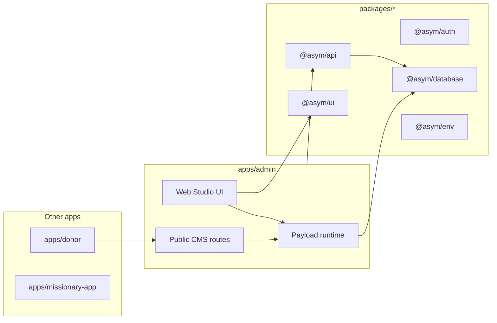
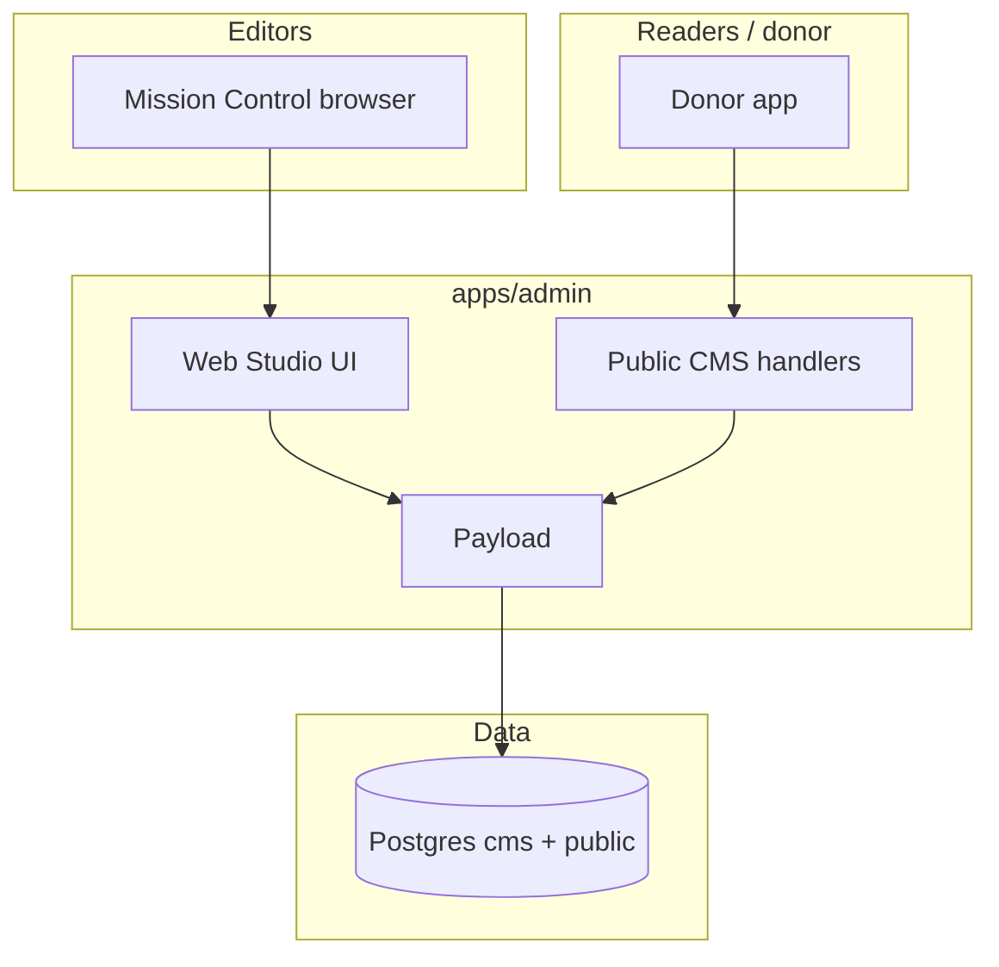
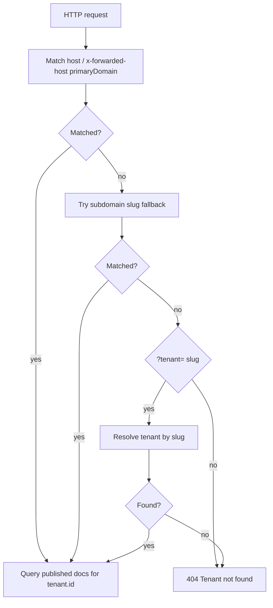
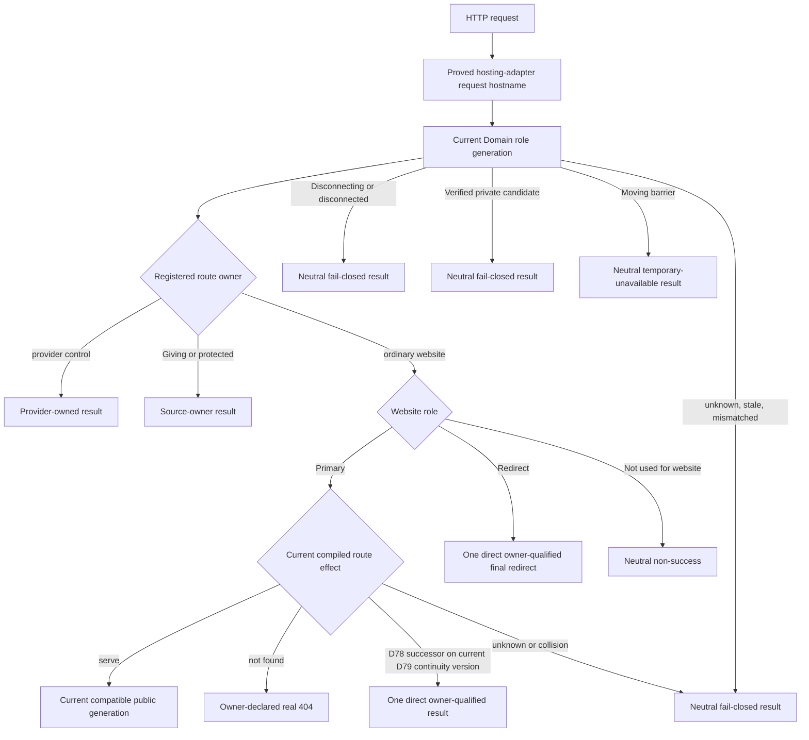
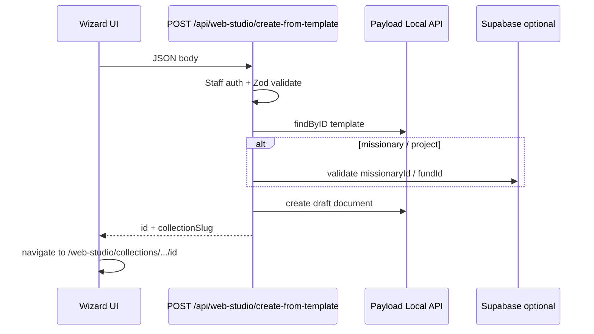

# Web Studio — living specification

**Status:** Living document — update this file when you change Web Studio behavior, routes, collections, or contracts.  
**Canonical for:** product intent, architecture, handoff context, and “what is actually shipped” vs deferred work.  
**Related:** Phase snapshots (`web-studio-phase1.md` … `phase3.md`) are historical; **this doc + the code** override older planning text if they conflict.

---

## 1. Plain-language overview

**Web Studio** is Mission Control’s editorial shell around **Payload CMS**, which still runs entirely inside `apps/admin`. Admins open **`/web-studio`** to manage tenant-scoped content: pages, navigation, profiles, ministry updates, media, and (Phase 3) page templates, missionary giving pages, and fund-backed project pages.

**Why it exists:** keep Payload as the **content runtime** (schema, access, drafts, versions, uploads, Lexical fields) while giving editors a **Mission Control–native** experience for list and default document screens—navigation, tables, chrome, and wizards that match the rest of admin.

**What is custom Mission Control UI:** shared shell (`StudioLayout`, nav rail, top bar), native **list** and **default edit** views for configured collections, template gallery and **create-from-template** wizards (TanStack Form), workspace settings dialogs (`useAsymForm`), and preview affordances in the document chrome.

**What still relies on Payload:** field widgets, document form state, save / save draft / publish, Lexical rich text inside Payload fields, relationship and upload pickers, **nested** document subviews (versions, API JSON, live preview tabs) where not wrapped—those still use Payload’s stock routing/components for stability.

**What remains to be built (confirmed partial / deferred):** deeper native wrappers for every versions/live-preview subview; full donor landing-page use of the new public missionary/project helpers (helpers exist, checkout accepts CMS `missionary_id` / `fund_id` CTA targets); optional API **versioning** for public JSON (today: unversioned contract, additive fields only).

---

## 2. Technical system summary

| Concern                  | Implementation                                                                                                                                                          |
| ------------------------ | ----------------------------------------------------------------------------------------------------------------------------------------------------------------------- |
| **Runtime**              | Single Payload instance in `apps/admin`; Postgres `cms` schema via `@payloadcms/db-postgres`.                                                                           |
| **Admin route**          | `routes.admin: /web-studio` in `apps/admin/payload.config.ts`; Next catch-all `apps/admin/app/(payload)/web-studio/[[...segments]]/page.tsx`.                           |
| **Admin provider shell** | `apps/admin/app/(payload)/layout.tsx` embeds Payload `RootProvider` inside the existing Mission Control document shell; it does not render another `<html>` / `<body>`. |
| **Payload REST/GraphQL** | `apps/admin/app/(payload)/api/[...slug]/route.ts`, `.../api/graphql/route.ts` — same origin as admin app.                                                               |
| **Public read API**      | `apps/admin/app/api/cms/public/**` — **not** the `(payload)` group; tenant resolution + published-only queries.                                                         |
| **Custom views**         | `buildConfig.admin.components.views` for top-level flows; per-collection `admin.components.views` for list/edit overrides.                                              |
| **Custom endpoint**      | `POST /api/web-studio/create-from-template` via `config.endpoints` → `apps/admin/src/cms/create-from-template-endpoint.ts`.                                             |
| **Access**               | `apps/admin/src/cms/access/*` + tenant hooks on collections; public routes use `overrideAccess: true` with explicit `where` (tenant + published).                       |
| **Preferences**          | Payload preferences API; keys in `apps/admin/src/cms-ui/web-studio/preferences/keys.ts`.                                                                                |

### Payload 4 spike status

Web Studio currently runs on Payload `4.0.0-internal.1f9ae9a` as an explicit
spike dependency. This proves the admin CMS engine can boot, migrate, render
native Web Studio routes, and keep public CMS boundaries intact on the internal
Payload 4 line; it is not yet the final stable dependency contract.

Graduation criteria before treating Payload 4 as the durable baseline:

- replace internal Payload packages with a supported stable channel or an
  explicitly approved pinned internal release;
- keep `bun run cms:migrate`, `bun run cms:migrate:status`, and
  `bun run cms:importmap` on Node.js `24.15.0+`;
- keep `bun run typecheck:admin`, `bun run build:admin`,
  `bun run test:unit:cms`, and CMS Playwright smoke green against Postgres;
- keep donor/missionary apps consuming public CMS APIs rather than importing
  Payload runtime code.

---

## 3. Current shipped scope

Legend: **shipped** | **partial** | **fallback-backed** | **not started** | **deferred**

| Area                                                                                                  | State           | Notes                                                                                                                                       |
| ----------------------------------------------------------------------------------------------------- | --------------- | ------------------------------------------------------------------------------------------------------------------------------------------- |
| Shell, nav, recent docs, prefs                                                                        | **shipped**     | `apps/admin/src/cms-ui/web-studio/shell/*`                                                                                                  |
| Native list + default edit: `pages`, `navigation`, `missionary-profiles`, `ministry-updates`, `media` | **shipped**     | Env can disable per collection → **fallback-backed**                                                                                        |
| Native list + edit: `page-templates`, `missionary-giving-pages`, `project-pages`                      | **shipped**     | Same flags: `CMS_WEB_STUDIO_NATIVE_*`                                                                                                       |
| Template gallery `/web-studio/templates`                                                              | **shipped**     | Draft templates included in gallery fetch (`draft=true` query)                                                                              |
| Wizards: standard / give / project / ministry update starter                                          | **shipped**     | `apps/admin/src/cms-ui/web-studio/flows/*`                                                                                                  |
| `create-from-template` endpoint                                                                       | **shipped**     | Staff auth + tenant checks; Supabase validation for missionary/fund                                                                         |
| Staff directory APIs                                                                                  | **shipped**     | Thin routes → `@asym/api/admin/missionary-directory`, `fund-directory` (data boundary)                                                      |
| Public: pages, navigation, updates                                                                    | **shipped**     | Existing contracts                                                                                                                          |
| Public: missionary-pages, project-pages                                                               | **shipped**     | Additive routes                                                                                                                             |
| Serialized `pages` public JSON                                                                        | **shipped**     | `serializePublishedPageLike` — extra fields, backward compatible                                                                            |
| Nested Payload subviews (versions, live preview UI)                                                   | **partial**     | Stock Payload; links from native chrome                                                                                                     |
| Donor consumption of new public routes                                                                | **partial**     | `fetchPublishedMissionaryGivingPage` / `fetchPublishedProjectPage` in `client.ts`; checkout accepts CMS `missionary_id` / `fund_id` targets |
| E2E coverage for every Phase 3 click path                                                             | **partial**     | Unit tests extended; full Playwright needs DB + ports (Phase 4 notes)                                                                       |
| TipTap inside Web Studio CMS fields                                                                   | **not started** | Payload editor is Lexical                                                                                                                   |
| TanStack DB in Web Studio                                                                             | **not started** | **Confirmed:** `@tanstack/db` not imported under `cms-ui/web-studio/`; used elsewhere (e.g. contributions live query)                       |

---

## 4. Repo topology and touch points

| Location              | Role                                                                                                    |
| --------------------- | ------------------------------------------------------------------------------------------------------- |
| `apps/admin`          | Payload config, collections, Web Studio UI, public `/api/cms/public/*`, staff `/api/admin/*` re-exports |
| `apps/donor`          | `lib/cms/client.ts` — consumer of public CMS; `CMS_BASE_URL`, forwarded host, result classification     |
| `apps/missionary-app` | No direct Web Studio; may share `@asym/*` packages                                                      |
| `packages/lib`        | Public CMS page descriptors, read cache policy, response/result types, and server-side Lexical renderer |
| `packages/ui`         | shadcn (Base UI Maia + Zinc); `useAsymForm`, shared components                                          |
| `packages/api`        | Business DB logic; `admin/missionary-directory`, `admin/fund-directory`                                 |
| `packages/auth`       | `getAuthContext`, roles for staff routes / CMS users                                                    |
| `packages/database`   | Supabase clients; Payload uses `PAYLOAD_DATABASE_URI` / pool                                            |
| `packages/env`        | `NEXT_PUBLIC_DONOR_URL` etc.                                                                            |

---

## 5. Runtime placement and route map

### Admin (authenticated)

| Path pattern                                | Owner                | Source                                       |
| ------------------------------------------- | -------------------- | -------------------------------------------- |
| `/web-studio`                               | Payload + Next       | `(payload)/web-studio/[[...segments]]`       |
| `/web-studio/collections/:slug`             | Native list or stock | Collection `admin.components.views.list`     |
| `/web-studio/collections/:slug/:id`         | Native edit or stock | `views.edit.default`                         |
| `/web-studio/templates`                     | Custom view          | `payload.config.ts` `admin.components.views` |
| `/web-studio/missionaries`                  | Custom view          | same                                         |
| `/web-studio/pages/give`                    | Custom view          | same                                         |
| `/web-studio/projects/new`                  | Custom view          | same                                         |
| `/web-studio/pages/new-from-template`       | Custom view          | same                                         |
| `/web-studio/ministry-updates/new`          | Custom view          | same                                         |
| `/api/*` (Payload)                          | Payload REST         | `(payload)/api/[...slug]`                    |
| `/api/graphql`                              | Payload              | `(payload)/api/graphql`                      |
| `POST /api/web-studio/create-from-template` | Custom               | `config.endpoints`                           |

### Public (unauthenticated, tenant-scoped)

| Method | Path                                    | Handler                                                  |
| ------ | --------------------------------------- | -------------------------------------------------------- |
| GET    | `/api/cms/public/pages/[...slug]`       | `apps/admin/app/api/cms/public/pages/[...slug]/route.ts` |
| GET    | `/api/cms/public/navigation`            | `navigation/route.ts`                                    |
| GET    | `/api/cms/public/updates`               | `updates/route.ts`                                       |
| GET    | `/api/cms/public/missionary-pages/[id]` | `missionary-pages/[id]/route.ts`                         |
| GET    | `/api/cms/public/project-pages/[slug]`  | `project-pages/[slug]/route.ts`                          |

Tenant order: `resolveTenantFromRequest` — **forwarded host / host primary-domain match → subdomain slug fallback → query `?tenant=` only when the host does not resolve a tenant** (see `apps/admin/src/cms/public/resolve-tenant.ts`).

### Staff Next API (Mission Control auth, not Payload)

| Method | Path                      | Implementation                                                                            |
| ------ | ------------------------- | ----------------------------------------------------------------------------------------- |
| GET    | `/api/admin/missionaries` | `apps/admin/app/api/admin/missionaries/route.ts` → `@asym/api/admin/missionary-directory` |
| GET    | `/api/admin/funds`        | `apps/admin/app/api/admin/funds/route.ts` → `@asym/api/admin/fund-directory`              |

### Feature flags (fallback)

`apps/admin/src/cms-ui/web-studio/feature-flags.ts` — `CMS_WEB_STUDIO_NATIVE_*` per collection; unset = enabled.

---

## 6. UI ownership model

| Responsibility                                                      | Owner                                                         |
| ------------------------------------------------------------------- | ------------------------------------------------------------- |
| Outer layout, studio nav, breadcrumbs, “Mission Control” rhythm     | Mission Control (`StudioLayout`, shell)                       |
| Collection table chrome, filter bar integration, “New” CTA          | Mission Control native list                                   |
| Document header actions row, inspector panel, preview button wiring | Mission Control (`NativeCollectionEditView`)                  |
| Payload admin providers, permissions, preferences, locale, portal   | Embedded Payload `RootProvider` in `(payload)/layout.tsx`     |
| Field rendering, validation, dirty state, Lexical                   | Payload                                                       |
| Save / draft / publish / unpublish                                  | Payload controls                                              |
| Versions / API / live preview **tabs**                              | Payload (default)                                             |
| Wizard forms (template flows)                                       | Mission Control + TanStack Form                               |
| Workspace settings dialogs                                          | `useAsymForm` + Zod (`NativeDocumentWorkspaceSettingsDialog`) |
| Preferences persistence                                             | Payload preferences                                           |

---

## 6a. Data ownership boundary

Payload/Web Studio is the durable **content** runtime. It owns page structure, navigation, media, templates, draft / publish / version state, preview URLs, and editor experience.

**Phase 24 D59 target (not current runtime):** Web Studio also owns the quiet
draft/version/preview management experience for complete bounded Site Brand
Versions. Brand owns Site identity and semantic appearance inputs only;
Navigation owns menu content, Page/template records own composition, Media owns
qualified renditions, and the applicable public-Site release authority pins an
exact qualified brand version into public output. D59 creates no second serving
head, renderer, approval workflow, or live inheritance graph. The current
repository still has no `cms.sites` collection and still renders global
GiveHope/Asym configuration; those are migration facts, not the target model.

**Phase 24 D60 target (not current runtime):** each exact Site setup/readiness
view may consume one quiet, read-only **Messages** summary from Phase 17. The
healthy state stays collapsed; exceptions are grouped by affected capability
and human-readable locale, preserve `Uses fallback`, distinguish a known
`Needs attention` result from **Status unavailable**, and expose one
authorization-safe action into System Messages. Active verification may say
**Checking** and a known blocker may say **Setup needed** in explanatory copy,
but neither replaces Phase 17's source-owned readiness result. Status tags are
noninteractive and use text/icon in addition to color; in-session changes use
polite status semantics without moving focus or repeatedly announcing
background refreshes. The view contains no email editor, sender/domain setting,
provider action, test send, manual override, or copied readiness logic. It does
not add Messages to core Site activation; an exact capability owner enforces
only its declared dependency.

**Phase 24 D61 target (not current runtime):** the Site workspace owns one
calm **Currencies** card for new donor presentment policy, not payment,
settlement, or accounting configuration. Authorized staff choose one explicit
default and a bounded enabled set; one atomic expected-revision save enforces a
nonempty set and `default ∈ enabled`. Copy explains: **Eligible donors may
start in a suggested currency and can choose another before confirming. The
default is used when no eligible suggestion applies.** Each currency shows a
plain current consequence such as **Available for new gifts**, **One-time only**,
or **Needs payment setup**, with one cause-owned next action. The card states
that changes apply prospectively, never rewrite accepted gifts/recurring terms,
and that existing nonempty carts require explicit recovery if their currency
becomes unavailable.

Staff do not configure countries, device location, exchange rates, Stripe
charge topology, payment-method matrices, payout banks, retained settlement,
QBO/Xero multicurrency, or per-currency Sites here. Desired Site policy remains
operational Postgres truth; current payment qualification is a read-only,
source-labelled payments projection. The CMS stores neither. The ordinary path
shows one quiet explanation such as **Donor pays CAD · Stripe currently settles
in USD · conversion costs may apply**, without a multicurrency wizard or
provider enum. D61 reuses the exact Base Maia/Base UI Site editor and preview;
it creates no separate simulator, dashboard, or primitive.

**Phase 24 D62 target (not current runtime):** qualification is a quiet step
inside that same Currencies card, not another setup product. Choosing
`CAD — Canadian dollar` automatically starts a read-only check and reserves
stable layout space for **Checking CAD availability…** without moving focus.
The row then states one concrete result: **Ready for one-time and recurring
gifts**; **Ready for one-time gifts · Recurring needs setup**; **Payment setup
needed**; **CAD isn’t available for this Site**; or **Couldn’t check right now**.
Do not use a vague **Limited** badge. Status text is programmatically announced
once, is never color-only or styled as an action, and remains readable at
320 CSS pixels, 200% zoom, with long localized names, keyboard/touch, RTL, slow
networks, and reduced motion.

Staff take one explicit **Add CAD** action after a qualified result. A partial
result states that CAD is offered wherever this Site's payment routes qualify
and names what is available now; later route readiness does not create a staff-
maintained mode/method matrix. A new default requires complete coverage across
every current entry that relies on it. An exception exposes one secondary,
cause-owned action—**Finish payment setup** or **Try again**—and returns to the
same card. The ordinary consequence is one sentence, for example **Donors can
use CAD for one-time gifts. Stripe currently settles in USD; conversion costs
may apply.** No Stripe ID, raw requirement, test-charge control, bank/accounting
wizard, provider enum, proof score, checklist, modal sequence, or separate
readiness page appears.

The card edits Site intent only. It consumes a sanitized, source-labelled
Payments projection and never calls Stripe from browser render, selector open,
preview, or donor UI. Save reauthorizes through the existing Phase 12
EffectiveAccess model and atomically compares Site-policy revision plus exact
qualification fingerprints. A race or unavailable proof changes nothing and
returns the updated consequence. Later drift preserves the selected currency
but labels the exact new-gift scope **Paused** with one repair action; it never
silently changes the default or rewrites existing carts, gifts, or recurring
agreements.

**Phase 24 D64 target (not current runtime):** each enabled currency row in the
same Site workspace has one compact **Suggested amounts** summary such as
**One-time: 4 · Monthly: 3** and one **Edit amounts** action. The editor stays in
the Site Giving context: a visible `CAD — Canadian dollar` heading, tabs only
for currently enabled one-time/recurring frequencies, zero to six short amount
rows, and the real shared donor amount component as preview. No amount is
selected automatically. Default currency appears first; other enabled
currencies remain progressively disclosed. Staff switch currency context rather
than relabelling an amount set, and values render in ascending order without a
drag-only reorder control.

Amount fields show one example in the authenticated staff UI locale and reject
ambiguous grouping; the Site/public locale formats the preview only. Show
**One-time** and Phase 16's featured cadence adjacent. Put any remaining enabled
cadences under **Other schedules** instead of rendering an unbounded tab row.

Helper copy says **Choose amounts that make sense for gifts in CAD. Amounts are
not converted from another currency.** Zero values is a deliberate **Custom
amount only** state, not an
error. One explicit **Save amounts** is the review and creates the next
operational Postgres version for new pristine views under expected revision.
Routine edits require no reason, approval queue, CMS publish, Stripe call, or FX
check. Dynamically substitute currency and schedule in quiet action copy, for
example **Saving updates suggestions for new CAD monthly forms. Existing carts
and gifts will not change.** Failure or conflict preserves the staff input and current public version;
one durable inline status says **Amounts saved**, **Someone else updated these
amounts—review before saving**, or **Couldn't save—your changes are still
here**. Preview is local/server-validated and creates no provider object.

The summary states are exact: no saved set is **Needs setup**; a saved zero-
entry set is **Custom amount only**; a nonempty set with no currently admissible
entry is **Needs attention**; and a qualified set with at least one admissible
entry is **Ready**. A currency/cadence qualification pause uses D62/Phase 16's
paused/unavailable state and offers no donor amount entry; **Custom amount only**
never bypasses qualification. Deliberate disable/re-enable shows former values
for explicit reaffirmation, while a transient proof pause preserves the reviewed
set.

This is not a Site × currency × frequency × locale matrix, wizard, spreadsheet,
pricing console, or second CMS document type. D64 stores numeric suggestions
only. Amount-dependent impact, matching, benefit, tax, fee, or “most popular”
copy stays with its separately governed content owner and cannot publish merely
because a number changed. Donors always receive the tenant-branded shared amount
component with current currency/frequency context, a responsive suggestion
group, and **Other amount**; while the exact context remains qualified, no
configured set means the same clean custom-amount flow, never **setup missing**.

**Phase 24 D66 target (not current runtime):** **Site → Languages** uses one
compact responsive list—never a percentage dashboard or Site × locale × content
matrix. Each row shows native name plus canonical code, one honest state
(**Not public**, **Needs attention**, **Ready to publish**, **Publishing**,
**Published**, **Published · changes to review**, D67 **Published · needs
attention**, or **Status unavailable**), a short exception count, and at most the
next two actions. Temporary **Checking**
uses polite status semantics and is not lifecycle truth.

The detail view opens with the generated immutable prefix, for example
`hope.org/lang/fr-ca`, then **Website essentials**. Healthy evidence stays
collapsed; blockers say what a visitor cannot safely do, name the source owner
in human language, and offer one permitted action. **Ordinary content** shows
counts for **Current**, **Out of date**, **No public translation**, and **Could
not be checked**, with one **Manage French (Canada) content** handoff into Payload/Web
Studio. For a complete permitted ordinary-resource population, those four
buckets are evaluated in order and counted once: no current public target is
**No public translation** regardless of private draft; otherwise a public
Independently authored target is **Current**; otherwise legacy/unclassified or
missing/incompatible/unreadable required evidence is **Could not be checked**;
otherwise a public Translated target is **Current** for matching compatible input
or **Out of date** for drift. When authorized, **No public translation** detail
may say **Draft exists** or **Not started**; otherwise it stays generic and never
leaks a hidden draft. Independent detail remains **Independently authored**, never
a claimed source comparison.
It shows no provider field names, message keys, route IDs, generation hashes,
cache tags, or translation-quality percentage. Separately owned Giving,
Messages, account, currency, and payment summaries remain visibly separate and
nonblocking for core locale publication.

Preview uses the real production renderer under exact Site/locale Draft Mode,
staff authentication/authorization, `noindex`, `no-store`, a visible Preview
banner, and Exit action. The workspace contains no second locale editor or
copied readiness logic. When ready, the concise ordinary confirmation says:
**Publish French (Canada)? This makes hope.org/lang/fr-ca public and adds French
(Canada) to this Site's language menu. It does not enable Giving or change
financial settings.** When a complete safe aggregate is available and nonzero,
the confirmation interpolates it—for example: **8 ordinary pages will remain
unavailable in French (Canada) until translated. English equivalents appear
only where an authorized placement provides a labelled link.** If omitted items
exist, it says **Some ordinary pages will remain unavailable in French (Canada)
until translated** and never implies a complete total or reveals hidden content.
Actions are **Keep private** and **Publish French (Canada)**. No reason, typed
phrase, approval queue, or independent reviewer is added. After commit, one
persistent **Publishing French (Canada)… You can leave this page** state
resolves automatically to **French (Canada) is published** with **View site**,
**Copy website address**, and **Manage French (Canada) content**.
Conflict/failure preserves current public truth and staff work and says
**Readiness changed—review the new item** or **Couldn't publish—nothing
changed**.

Missing French ordinary content is omitted from French Navigation/search/
sitemap/alternates. Where a trusted equivalent exists, a source-owned component
or placement may store a typed same-resource alternative relation. The runtime
may resolve and render that authorized relation when its target is present in the
current authorized public generation and not source-revoked;
translation freshness is separate. It never invents the placement, label, or equivalence. The
resulting **Read this story in English** link never renders English inside the
French URL. Public language controls use native names, no flags, exact semantic
links, server-rendered `lang`/`dir`, logical CSS, bidi isolation, script-capable fonts,
and work without JavaScript. Keyboard, screen reader, touch, forced colors,
reduced motion, CJK/RTL, 320px reflow, 400% zoom, and weak-network journeys are
release proof.

Every generated blocker, success, action, and handoff label uses the complete
Site Locale display label (for example, **French (Canada)**), including when
`fr`, `fr-CA`, and `fr-FR` coexist.

**Phase 24 D67 target (not current runtime):** ordinary translation freshness
and source-owned public-use safety are separate. A complete permitted aggregate
may render **French (Canada) · Published · 3 translations to review**, with
localized pluralization; otherwise the row
uses **Published · changes to review** without a misleading count. A partial
source-safety closure takes precedence as **Published · needs attention** with a
permission-safe unavailable count; a universal locale fence uses **Needs
attention**. Current/zero/complete renders only when the projection watermark
covers current source and target heads; lag uses **Checking**, then **Status
unavailable**/**Could not be checked**. The locale detail opens an exception-first
**Changes to review** list and explains that the current French (Canada) versions
are still public. Each item
offers at most **Review changes** and **View public page**.

The existing editor shows a calm **Source changes to review** banner and loads
the complete exact source comparison only when the viewer has comparison-read and
target-review authority. Only then may **Confirm translation is still current**
record an immutable target successor/basis/generation without a copy edit. A
viewer missing either permission sees neither comparison nor Confirm and receives
an existing permission-safe editor/admin handoff, not a task. Source-only,
target-only, and combined/indeterminate races preserve work and name the correct
next review; for example: **This French (Canada) translation changed while you
were reviewing it. Review the latest translation before confirming.** No ordinary
modal, reason, approval, task, timer, or notification is added.

Only a registered safety-governed source publication shows one unselected
source-owned fieldset: **What should happen to existing translations when this
update is published?** Keep says the previous source meaning must still be safe
and translators still see changes to review. Unavailable says access does not
return automatically and requires a newly authorized replacement. The complete
closure is always sealed, but full labels/counts render only when the viewer may
receive every member; otherwise the impact/action is non-enumerating and missing
detail permission never blocks containment. Final actions derive from visible
closure: resource count, named public dependency family, whole locale, or **Publish and apply
the required public-use restriction**.

Receipt-backed progress says **Publishing and applying the public-use
restriction… You can leave this page**; fence-before-head says **Public access is
blocked while Core finishes the update**; unknown says **We're checking the
result. Do not publish again**; only proof of no fence/head effect says
**Couldn't publish—nothing changed**. Core adds no generic risk tier or workflow.
Ordinary out-of-date
content has no visitor badge. A contained public route follows typed source
presentation: concealed 404, gone 410, transient/unknown `no-store` 503, with
bounded `Retry-After` only when the owning source/runtime proves a truthful
interval and no header otherwise; never soft 200, cross-locale recovery,
substitution, reason, or Asym branding. Same-locale home/contact actions require
independent current safety.

**Phase 24 D68 target (not current runtime):** replace **fallback chain** with
one optional Site **Suggested translation sources** ordered subset under
**Site → Languages → Authoring preferences**. Its helper says: **Choose which
Site languages editors see first when they copy or compare translations. This
does not publish, replace, or show another language to visitors.** Empty says
**No sources suggested. Editors can still choose any available source.** One
item has Remove only; several use a semantic ordered list with visible position,
locale-qualified Move up/down/remove, explicit Save/Cancel, and optional
nonessential drag. **Add source** remains available in empty/one/many states
while an unlisted authoring-eligible locale remains and appends to the unsaved
order. Sites with fewer than two authoring-eligible locales show no source-order
control; the second authoring-eligible locale reveals the empty section without
adding a source. Add/remove restores focus deterministically and announces the
change.

The preference is partial, never prepopulated or inferred, and never an
allowlist. When **Copy from…** or **Compare with…** opens, Core filters it through
current exact same-Tenant/Site/resource/viewer eligibility, excludes the target
locale, shows eligible configured items under **Suggested for this Site**, and
shows every remaining eligible item under **Other available sources**. Nothing
is preselected. Full autonym, staff display name, canonical code, `lang`/`dir`,
and bidi isolation distinguish regional/script variants without flags.

For every authorized missing target, a quiet **Start French (Canada)** sheet
keeps **Start blank** available and, when Copy is possible, offers **Copy from…**
as a separate unselected path. Blank success says **French (Canada) draft
started. It is not public.** Choosing Copy opens **Copy into French (Canada)**:
**Choose the version to copy. This creates a new French (Canada) draft. It does
not publish or create a visitor-facing language link.** Explicit **Create French
(Canada) draft** reauthorizes and pins the selected exact source revision through
the Phase 23/D67 owner. Start blank is Independently authored. An existing target
cannot be overwritten; optional Compare is read-only and the pinned D67
Translation Basis remains authoritative. Source bodies/diffs load only after
selection; source/permission races preserve work and create no partial target.

`sites.manage_locales` may atomically save the complete expected-revision order
and audit; it grants no source-content read, target create/edit/review,
Translation Basis, public-alternative, or publication authority. Operational
Postgres, not Payload fallback/user preferences, owns the order. It uses
structurally scoped stable Site Locale IDs and has no public reader, route,
generation,
Navigation/search/sitemap/`hreflang`, cache, Vercel, Giving, currency, or Phase
17 message effect. Missing preference suppresses prioritization and leaves the
ordinary authorized chooser usable. Keyboard, screen-reader, single-pointer,
touch, forced-colors, reduced-motion, 320px/400%, long/CJK/RTL, weak-network,
conflict, and JavaScript-failure proof are activation gates.

Only an authoritative empty candidate result says no Copy source is available.
Ranking failure shows the ordinary unranked authorized chooser; an unknown
candidate query, selected-source fetch failure, and preference-save failure each
show a truthful retry state while preserving the user's selection/order. They
never infer emptiness or success.

V1 never shares an effective chooser result across viewers. An optional private
cache of the base ID-only order binds exact Tenant, Site, and preference revision;
viewer/resource/action eligibility is recomputed on every open. If the Site
Locale owner commits a terminal authoring-ineligible transition, its owning
command canonicalizes the complete preference and clears it at the two-to-one
authoring-eligible-locale boundary without changing historical Bases. D68 does
not create that lifecycle state or command.

**Phase 24 D69 target (not current runtime):** after a staff member chooses
**Copy from…**, each D68-eligible source locale contributes at most two distinct
logical heads: **Latest saved draft** is the exact current server-acknowledged
D12 Working Revision, when ADR-0191-qualified; **Current published version** is
the exact source revision pinned by D1's current favorable public generation,
when it too is ADR-0191-qualified. Each exact head qualifies independently before
enabled-candidate deduplication.
Payload `draft: true`, `_status`, row order, timestamps, schedules, restored
history, browser/debounced/in-flight/conflicted work, and arbitrary versions are
never product authority. Equal compatible copy inputs collapse to one public row
with **The saved draft has no newer copyable changes** only when the public head
also qualifies; an unknown/unqualified public head never hides a qualified
private sibling.

**Copy into French (Canada)** is one full-width-on-mobile Base Maia Sheet with
one unselected **Source version** RadioGroup across all locale sections. Its
description says **Choose the version to copy. Core will create a private French
(Canada) draft. Nothing will be published.** A private row says **Latest saved
draft — Not public · Has unpublished changes** when a current public sibling
exists, or **Latest saved draft — Not public · Never published** for a private-
only source, with localized absolute save time and timezone. A public row says
**Current published version — Published** and explains that visitors currently
receive it. No row is recommended, even when only one exists. Opening focuses
the Sheet title with `tabIndex="-1"`; Tab then enters the first unchecked radio
without selecting it, and closing restores **Copy from…**. The footer keeps
Back/Cancel and disables **Create French
(Canada) draft** until selection; there is no second confirmation. Success
opens the target editor and leaves a persistent exact-source receipt near its
locale/status header. For a private source, a derived read-only target-readiness
message persists: **Based on a private English (United States) draft. Publishing
remains unavailable until this exact saved source revision is the current
published source, or you review this translation against the current published
English version.** Authorized viewers receive the existing D67 compare/review
action; others receive its non-enumerating handoff. This is not a new state,
task, notification, or approval. After creation, the editor performs D12's
ordinary target Active Editor Lease acquisition; a lease race opens D12's
truthful read-only/collaboration state without retrying Copy, deleting the
target, changing its receipt, or transferring a source lease. Loading,
authoritative empty, query/offline failure, stale
private/public head, access loss, target race, and unknown-result reconciliation
use the truthful copy in ADR-0190 and deterministic focus recovery.

A selected private head is frozen/reused as one immutable retention-protected
Copy Source Checkpoint. One trusted resource command reauthorizes exact source
read and target create, checks the selected source-lane head and eligibility,
target absence/head, and the finite copy manifest, and atomically creates
checkpoint if needed, private target Working Revision, Translated provenance,
D67 Basis, audit, and idempotency receipt—or none. An unrelated change confined
to the unselected source lane does not invalidate an exact selection. It never
overwrites an existing target or copies public, schedule, route, safety,
assignment, lease, permission, validation, or provider state. If the owners
cannot prove this atomic boundary, the private row stays off while Start blank
and qualified published Copy remain.

A private checkpoint is not public source truth. Its target cannot first publish
as Translated until D1's current authoritative source publication pins the same
exact source revision represented by the checkpoint under the same compatible
copy-manifest/canonicalization identity, or D67 creates a reviewed successor
Basis against the actual current publication. D69 adds no new workflow/freshness
state. Candidate metadata uses one batched purpose-shaped private `no-store`
projection, no raw version-history grant, eager body/diff, shared/Vercel cache,
public reader/runtime/serving, resolver, route, favorable-generation, Giving,
currency, Stripe, or Phase 17 message effect. The trusted D67 publication command
may inspect a Basis supported only by private checkpoint evidence solely to deny or prove
publication eligibility; that proof is never a public resolver or serving input.
Keyboard,
screen-reader, touch, forced-colors, reduced-motion, 320px/400%, long/CJK/RTL,
weak-network, concurrency, and installed-Payload-pin conformance are activation
gates.

**Phase 24 D70 target (not current runtime):** every private or published D69
head requires one exact-revision **Copy Qualification**. After D12's side-effect-
dark acknowledgement, its source owner asynchronously starts or reuses a pure,
bounded evaluation of the exact source content that emits content-free evidence,
without delaying Save. At most one durable immutable
completed evidence result exists for each complete same-scope revision/digest/
source-contract-digest identity. That digest covers every retained schema/profile/
manifest/canonicalizer/qualifier/block/node/package version and declared limit.
Missing/in-progress/failed work is retryable unknown,
not evidence; Check again idempotently requests the same identity through the
source owner's accepted durable-work mechanism. Pending work coalesces to the
current D12 head, current D1 publication, and revisions referenced by a retained
D69 Copy Source Checkpoint/Basis; superseded
unretained private autosaves do not consume unbounded qualification capacity. A
legacy D1 exact current publication may receive the same attachment only after
retained-reader/digest proof; future D1 publication reuses evidence carried by
the exact D12 revision. Evidence binds the revision/digest and source-side
resource/copy profile, manifest,
canonicalization, qualifier versions, limits, material-effect proof, and
transferred-reference identities. It proves source-input coverage only, never a
future target/actor/action. Evidence failure never blocks ordinary Save. Missing/
unknown/incompatible evidence is not favorable; the picker composes that
evidence with the exact target locale/profile and one batched live scope/
authorization/lifecycle/safety/reference query and never fetches candidate
bodies. After selection, the command
reads the exact body and reruns complete lossless qualification/reference proof
before any D69 write.

Qualification exhaustively handles every present value, node, block, package,
and relationship as copied value, preserved authorized target-compatible stable
reference, owner-defined deterministic target repair, explicit meaning-preserving
safe omission, or never-copy. Unknown, corrupt, ambiguous, over-limit,
executable, lossy, coerced, inferred, fallback-derived, cross-scope, unauthorized,
or silently discarded meaning fails closed. A zero-effect copy uses Start blank.
Being Saved, Published, Payload-valid, previewed, or previously copied proves
nothing by itself.

Source-owned **Details to finish**, **Suggestion**, and **Technical issue**
findings remain visible and non-gating when qualification succeeds. Associated
row copy says **Has details to finish**, **Has suggestions**, or both, plus **You
can still copy this source version. The new French (Canada) draft will be checked
separately.** Partial coverage keeps known classes and says some checks are
unavailable; complete outage says checks are unavailable. The summary binds exact
revision/digest, current compatible rule generation, evaluated watermark,
completeness, and authorized classes; stale/incomplete coverage never looks clear.
It never says Ready,
Passed, No issues, or Ready to publish. Finding load/failure does not delay Copy,
and finding-only changes never stale the selection.

Finding text is an associated description, not the radio's full accessible name;
no link/button/disclosure nests inside the full-row 44-pixel label. Optional lazy
detail and an authorized source-owner/head-accurate handoff sit separately after
selection. ADR-0192/D71 renders an authorized structurally unqualified head only
in the ordinary visible list after the RadioGroup; such a head is never a disabled
radio. The implementation fixes deficient shared Sheet/radio hit targets rather
than forking local controls, uses a full-width mobile Sheet/reachable footer, and
never truncates locale, state, finding, timestamp, or repair copy.

The target structurally validates inside creation and then independently derives
its own exact-locale findings. Source findings, counts, review, approval, Keep-as-
written, schedules, paths, and favorable validation never transfer. The just-
created target is already private; finding outage says **Target checks are
unavailable right now. Your draft is saved and private**, with authorized
bounded **Check again** in the same composed readiness region as—but not
replacing—any D67 blocker/action. The outage neither satisfies nor independently
blocks later D1/D66 publication proof. D70
evidence/findings have no public, cache, Vercel, Giving,
currency, Stripe, message, receipt, or payment authority.

**Phase 24 D71 target (not current runtime):** for the exact authorized viewer,
target, Copy action, and D69 private/public head, one server projection derives
exactly one rebuildable **Copy Source Disposition**: qualified, proved
unavailable, qualification unknown, or not disclosable. Only qualified heads
enter the unselected **Source version** RadioGroup. Immediately after it, one
neutral **Unavailable source versions** section shows authorized proved-
unavailable and unknown heads as ordinary `ul`/`li` content in D68 locale/head
order. It exposes no disabled radio, selectable row, live/static alert, count,
raw error, provider detail, or nondisclosable-head distinction.

Each disclosed row repeats the permitted full locale, **Latest saved draft** or
**Current published version**, private/public state, semantic localized absolute
time plus timezone, one bounded reason family, and at most one independently
authorized cause-owned action. Locale text preserves the accepted `lang`, `dir`,
and bidi-isolation contract; essential text never clamps. Static rows are not
live regions. One initially empty aggregate polite/atomic status announces only
user-triggered recovery results. A newly qualified radio remains unselected;
deterministic focus recovery returns a disappearing action to the persistent
**Source version** heading.

Every Check-again or source-handoff action reauthorizes the exact displayed
revision and proves it remains the applicable current D12/D1 lane head; Core
never silently substitutes a successor. Zero qualified heads omit the RadioGroup
and disabled Create action and make **Start {target locale} blank draft** the
direct primary Sheet-footer action beside Back/Cancel. Candidate and status
members share one authorization/head snapshot and cursor; paging retains a locale
with only authorized status heads. D71 persists nothing, creates no second
resolver/query/workflow/retry store, and stays inside D69's p95 300 ms metadata
budget. Activation tests the Site Locale owner's maximum supported catalog,
including two unavailable/unknown heads for every visible locale.

**Phase 24 D72 target (not current runtime):** every publicly activated,
nonretired Site retains exactly one current **Primary Site Domain**, including
while D7 suspends website serving. It alone may serve favorable Site website
content and supplies the origin for newly generated canonical/internal/
`hreflang`/sitemap/feed/social/share/public-generation output. Private setup may
have no public role; retired Sites retain immutable history without favorable
roles. Public platform/provider hosts and serving aliases are prohibited.

A Site may have zero or more **Redirect Site Domains**. Staff-facing copy says
**Redirects website visits**: the hostname serves no duplicate Site content and
the trusted pre-content/pre-cache host/router projection may redirect only an
owner-qualified ordinary `GET`/`HEAD` in one hop to the final current-primary
destination. It composes D16 root directly, explicitly suppresses source-fragment
inheritance, and preserves only owner-allowlisted query context. D9–D15 Giving,
auth/protected/callback/API/control, and every other source-owned route run first
and keep their independent direct/nonredirect behavior. Vercel whole-domain
redirects, arbitrary targets, chains, fallback homes, and automatic apex/`www`
roles are prohibited.

Operational Domain authority—not Payload Tenant `primaryDomain`, Phase 2
`primary_domain`/`alias_domains[]`, DNS, TLS, Vercel, request headers, or cache—
owns the canonical hostname, complete Site scope, role generation, platform-wide
current occupancy, immutable public history, CAS head, receipt, and provider-
evidence references. D72 uses relational repeated facets and protected
`sites.manage_domains`/`sites.activate_domains` commands with complete grants,
RLS, privileged-path parity, provider work outside transactions, and adverse-
first admission fencing. V1 custom public roles are production-only unless a
single cross-environment claim authority exists; nonproduction uses protected
private preview hosts.

**Site → Domains** is one Base Maia vertical workspace. **Primary website
address** appears first with D7 serving state separately, followed by Redirect
and Not-used-for-website/setup groups. **Not public** is reserved for complete
current owner proof of no favorable Core public route. It uses plain **Needs
DNS**, **Securing domain**, **Ready to activate**, **Redirects website visits**,
and **Needs attention** states, last checked time/timezone, safe Unicode/ASCII
IDN display, bounded owner-known route exceptions, source-labelled optional
`www` guidance, and one authorized next action.

**Phase 24 D73 target (not current runtime):** every exact replacement of an
existing Primary Site Domain requires one initially unselected former-primary
website disposition: **Redirect eligible website visits — recommended** or
**Stop website use on the old domain**. The focused route-addressable Base Maia
review shows stacked Current/New hosts, exact public-origin and existing Redirect
effects, complete authorized finite route/security-owner outcomes, explicitly
incomplete known-placement guidance, then the RadioGroup and **Make {new host}
primary**. It never claims every link moves or that Core can erase search,
archives, external caches, DNS, certificate records, or separately source-owned
routes.

Primary replacement privately prepares compatible D1/D66 public-origin
successors and advances the exact current Domain/public-locale head cohort in
one reauthorized CAS command with receipt/audit/outbox. Candidate redirect/cache
history must be compatible; possible cached inverse behavior blocks, including
apex/`www`. Stable equivalent website routes may use owner-approved `308`; the
mutable former root remains D16 `307`; both are `no-store`, `no-referrer`,
one-hop, and route-aware. Vercel remains transport/evidence: D73 performs no
whole-domain provider redirect, force, detach, DNS change, or deployment-derived
rollback. The former row says **Not used for website** while any independently
owned public route remains.

**Phase 24 D74 target (not current runtime):** after a complete finite owner
manifest proves that one exact Tenant-controlled custom hostname has no current
positive hosting dependency, authorized staff with `sites.disconnect_domains`
see **Not public · Connected for hosting** and **Disconnect from this Site**.
The compact shared AlertDialog names the exact Site/hostname, explains that
registration/DNS/renewal/email/history remain unchanged, warns that DNS still
pointing to Vercel may produce a browser/provider error, and offers only **Keep
connected** and **Disconnect domain**. Unresolved uses show one cause-owned
handoff; unknown evidence blocks without leaking hidden facts.

One short CAS transaction establishes a monotonic Disconnecting barrier and
durable receipt/outbox. Every public/CMS/Giving/auth/cache path acknowledges the
adverse host generation before a sealed worker removes the exact Core-controlled
Vercel routing associations outside the transaction. Only current authenticated
absence permits a second transaction to end the current Site-binding interval
and global occupancy claim. Unknown outcomes retain the fence/claim and show
**Not public · Disconnection needs attention**; success is **Disconnected from
this Site**. Host identity, immutable history, and D9–D15 reservations survive.
D74 never cascades to another host/Site, deletes a Vercel account domain, moves
or forces a provider binding, changes DNS/registration/email, or authorizes
future reuse. See ADR-0195.

**Phase 24 D75 target (not current runtime):** after D74 final release, every
Tenant uses the ordinary Site → Domains **Add domain** path. A private
verification attempt reserves nothing and triggers no provider call. Core shows
one seven-day, server-generated, 256-bit, exact-host TXT challenge under **Verify
domain control**, with Type/Name/Value copy actions, absolute expiry and last-
checked time, bounded automatic checks, one **Check again**, and leave/resume.
Same-Site duplicates resume; cross-Tenant history/availability remains opaque.

Immediately after trusted DNS observation, one reauthorized transaction consumes
the one-use challenge, proves D74 final/no current claim, acquires the sole
platform-wide claim, creates a new private binding generation, and records the
receipt/audit/provider outbox—or changes nothing. Two claimants have one
constraint-enforced winner. Old bindings remain immutable; no former positive
content/brand/locale/role/route/permission/provider/integration/donor/auth/cache/
client state follows. D9–D15 adverse reservations remain and run first.

Only after claim may a sealed worker prepare Vercel hosting without force/move.
Core proof, provider verification/assignment, TLS, DNS routing, Site readiness,
and public role are separate states; D75 success is **Domain verified · Not
public**. Trusted sessions/cookies/context and caches bind the new generation;
launch reusable custom Site hosts register no root-scope service worker. Core
does not promise external browsers/search/DNS/history were erased. See ADR-0196.

**Phase 24 D76 target (not current runtime):** a still-connected exact custom
hostname may move between two Sites in the same Tenant without D74 release,
D75 claim, routine DNS proof, or Vercel mutation. Source **Move to another
Site** and an authorized destination collision open one full-page Base Maia
review. Destination Primary/Redirect/Not-public role is initially unselected;
an active source Primary needs a different eligible replacement; applicable D6/
D73 and every critical route-owner outcome remain explicit.

One durable command acknowledges an adverse **Moving** host generation before
it appends a new immutable target binding and atomically advances the private
host head plus complete source/destination Domain/public heads. Source remains
favorable before the barrier, uncertain cohorts return the neutral no-brand
temporary-unavailable response during transition, and target becomes favorable
only after exact admission readback. The same Tenant occupancy never releases;
content, settings, Giving/auth meaning, DNS, registration, email, Stripe and the
shared donor Vercel project do not move. See ADR-0197.

**Phase 24 D77 target (not current runtime):** the D76 page includes one compact
**Existing web addresses** section backed by a deterministic immutable Domain
Move Route Review. Core keeps one small code-owned critical owner-family
inventory reused by D72–D76; D77 adds no adapter framework. Every applicable
critical owner supplies one complete current outcome. A pure comparison over
complete source/destination effective-host manifests then classifies source-
only, target-only, collision, owner-qualified successor, redirect/history
conflict, and unknown outcomes.

Source-only ordinary addresses compile durable real-not-found effects into the
target binding generation so later destination publication cannot silently
reuse historical meaning. Exact collisions remain blocked until the owning Page
route contract resolves them; path, slug, title, copied content, traffic, or AI
never proves continuity. Staff see only blockers by default, compact qualified/
not-found counts, and explicitly incomplete known placements. Phase 5 consumes
one indexed compiled route effect before content/cache; D77 creates no route
owner, resolver, redirect table, crawler, workflow, wildcard, query carry, or
Vercel rule. See ADR-0198.

**Phase 24 D78 target (not current runtime):** one authorized D77 ordinary
General Page collision may open a Page-owner **Review Page continuity** surface.
Core first proves same Tenant/environment, exact locale, `general_page`, public
audience, exact Publication Reach, compatible safety, and exact current source/
target public generations.
One authorized human then compares both exact production-faithful releases and
answers whether a visitor receives the same public subject, substantive purpose,
and intended task. The initially unselected outcomes are **Use `<target Page>`
for this address** and **Keep this address unavailable**.

The resulting Ordinary Page Successor Qualification is one immutable,
directional, path-specific relation to a stable internal target Page. It is
neither global equivalence, Page merge/copy/sync, target URL, transitive mapping,
nor a purpose taxonomy/similarity/AI result. D78 creates no role, workflow,
redirect store, resolver, Page edit, provider rule, or public effect. D76 may
consume it only while every pinned head remains current. A target Primary may
serve the same path directly; a Redirect Site Domain or different path composes
one direct final clean-`GET`/`HEAD` owner result to the Primary with no source
context carry. Before D76 activation, later target revisions exceed the exact
qualification's safe validity ceiling. ADR-0200 governs post-activation releases.
See ADR-0199.

**Phase 24 D79 target (not current runtime):** D79 resolves that interim
ceiling without adding a Page-purpose CMS. Before cutover, any target release
drift still requires the exact fixed-pair D78 review. After activation, each
relation pins one sparse, opaque **Page Purpose Continuity Version** for the
stable target General Page and exact locale. Audience, Publication Reach,
safety, family, route, binding, publication, and eligibility remain separate
owner facts rather than copied contract fields.

Only a candidate affected effective Page release whose exact meaning-bearing
Page/localized/Reusable Section/shared/global/reference dependency digest
changed adds one initially unselected choice inside the existing D1 Publish
consequence review: **This update keeps what this Page is for** universally
preserves the version for every reviewed current relation; **This update changes
what this Page is for** declares that the candidate cannot publish through this
Page identity and must continue as D80's fresh private Page. D80 leaves the
source continuity head/relations unchanged and the target inherits none.
Draft/autosave/preview and delivery-
only D1 rebuilds with the exact effective digest unchanged do nothing. Pages
that never had D78 predecessors have no D79 state or UX; terminal history stays
inert rather than being deleted.

The Page workspace shows one calm main-column **Historical addresses** panel
after the document-state strip, with truthful state, an exact count only under
existing aggregate authority, and permission-safe detail. D79 adds no purpose
text/taxonomy, diff/hash/AI, second workflow,
capability, runtime resolver, provider rule, or donor interstitial. D1 compiles
one current direct/redirect/not-found effect; public requests never query
continuity rows. See ADR-0200.

**Phase 24 D80-D84 target (not current runtime):** after the explicit D79
**changes** choice, the same consequence review reveals **Move saved changes to
new Page draft**. One sealed, actor-bound, same-Tenant/environment/Site/locale command
uses the exact acknowledged Page-owned candidate and D23's finite transfer
compiler to create a fresh private `general_page`, locale lineage, Page-local
identities, D12 Working Revision, and explicitly reviewed D2 Placement/path
claim. It publishes nothing, advances no source continuity version, transfers no
D78 relation, and leaves the source Page's public release, canonical/historical
routes, generation, Navigation, search/cache, and donor result unchanged.

Reusable Sections materialize locally; unknown/nonseparable shared-owner state
blocks with its existing owner action. Route/history, Navigation, schedule,
publication, continuity, owner, provider, operational, and money authority never
copy. The inline old/new summary uses only title, Parent Page/Top level, and web-
address input and one explicit source outcome. In the same transaction, D81
records one logical protected handoff event with independently scoped Editorial/
Placement checkpoint pins, appends clean source Working successors only for
changed Page-owned axes from the exact D1 public pins, advances those heads, and
fences every old lease in the sealed source pair. Separately managed content
stays unchanged. Exact history records any repairable omission. After fresh
target read/edit and lease proof, success navigates to the target with persistent
Site/domain/locale/**Draft - not live** and repair context; otherwise it shows a
detail-free committed result. D80-D81 adds no generic duplicate, route-history
exception, workflow, purpose classifier, Vercel/Domain/DNS/TLS/Stripe call, or
public runtime lookup. See ADR-0201 and ADR-0202.

ADR-0203/D82 resolves one otherwise-false collision. If the exact sealed source
Placement candidate is the sole current private owner of the reviewed D2
canonical key, D2 may positively prove that the complete equivalence class has
never participated in any activated/public, redirect/canonical/repair, or
protected route effect and has no platform-reserved, specialized source-owned,
scheduled, safety, migration, or Trash-retained owner other than that exact
current private source candidate claim. Unknown history is ineligible. The D2-
owned D82 disposition inside the same D80-D84 transaction then supersedes that
exact source private claim and appends a fresh target Placement
plus claimant-ownership occurrence/version with no committed gap or dual owner;
a stable canonical-key namespace row may retain its identity. The immutable source Revision remains
authorized private History and is never relabelled; later restore cannot reclaim
the target key.

The Parent Page/Web address group shows the complete tenant-branded URL, **From
`<source>`'s saved draft**, and **not live** meaning without another choice,
modal, or action. Editing either field returns to ordinary D2 validation. D82
adds no route-transfer API, suffix, reservation, resolver, redirect, Vercel/
DNS/TLS call, provider/money effect, or public output.

ADR-0204/D83 admits one completely qualified source-owned descendant closure
when cleaning the source ancestor changes derived private paths and their
corresponding breadcrumbs.
D2 preserves every child identity, direct parent, authored segment, sibling
order, every existing immutable History row, Editorial content, Navigation,
permission, schedule, reference, and public fact; it may append only the
qualified cause-labelled derived-output successor required by accepted D2
storage and prepares only exact old/new derived path/breadcrumb/claim outcomes.
High fan-out reuses D2's bounded, resumable sealed plan/impact artifact and one
D33-admitted atomic business transition without a private closure head. The inline review always shows a
permission-safe affected address count and says Pages stay under the source and
the live website/Navigation do not change; exact mappings are proportional
detail and the existing action is the one closure confirmation. Any stale,
inaccessible, protected, independently incompatible, or over-capacity closure
uses its exact ordinary D2 owner action. If that action cleans/releases the
source root claim, D82 adoption ends and the target address becomes an
unreserved ordinary suggestion that may lose fresh validation. No recursive child resave, authoritative partial batch,
subtree transfer, literal-link rewrite, public-delivery/external-provider/money effect, or new
workflow/route engine is added. See ADR-0204.

ADR-0205/D84 settles only the fresh target's initial Page-tree position. The
visible choice is an eligible Parent Page or **Top level**; D2 resolves Top
level from trusted Site context to the existing root placement owner, never
from null/caller input. D2 preserves a tagged start/between/end/only boundary
only when immutable placement-command provenance positively proves staff
selected it; a positively recorded ordinary default appends after the tail.
Missing/unknown provenance and a stale explicit boundary use the existing D2
**Review position** action and commit nothing. Under lock, D2 determines the
qualified D81/D82/D83 effect manifest, derives its post-clean/pre-target final
cohort, then validates the boundary or resolves append-last and creates a fresh
target order representation. No immutable prior revision changes; only sealed
predecessor effects may advance affected heads, and D84 causes no collateral
pre-existing Page parent/order write while preserving the final cohort's
relative order. The read-only **Page tree position** row distinguishes reviewed
First/Last/Only/Between from default Last/Only, uses “at top level” where
applicable, redacts details/cause independently from structural calculation,
and states that Navigation and the live website do not change. Boundary IDs
follow the `material_page_handoff` privacy/retention/tombstone contract. Raw
Payload `orderable`, provider ranks, drag telemetry, and imported order are not
intent or authority. The qualified same-database Payload adapter may persist
the transaction; no native reorder authority, D84 selector/capability/workflow,
public D1/D4 effect, external provider/control-plane call, donor UI, or money
effect is added.

Payload/Web Studio is **not** the source of truth for giving, CRM, donor care, or email delivery facts:

| Domain                                                                                                              | Source of truth                                                           | CMS relationship                                                            |
| ------------------------------------------------------------------------------------------------------------------- | ------------------------------------------------------------------------- | --------------------------------------------------------------------------- |
| CMS source content, media, navigation, templates, preview, draft state, and exact source-revision publication state | Payload `cms` schema                                                      | Owns and mutates source state; never owns the favorable serving head        |
| Favorable Site/locale public generation, admission, and current serving head                                        | Operational Postgres Public Site Generation authority                     | Pins qualified exact CMS source revisions; sole favorable serving authority |
| Donor relationships, notes, donor detail, reports, CRM workflow records                                             | Asym Postgres CRM (package-layer CRM services; Twenty retired — ADR-0001) | May display read-only projections                                           |
| Gifts, staged gifts, allocations, payment state, reconciliation, receipt facts                                      | Stripe/Supabase giving pipeline                                           | May store CTA copy and validated references only                            |
| Receipt sends, send logs, delivery events                                                                           | Resend/app email services                                                 | No direct provider sends from CMS                                           |
| Mobilization stage transitions                                                                                      | Deferred mobilization workstream                                          | Read-only/deferred; not a CMS foundation blocker                            |

Giving CTAs on CMS pages resolve into the donor checkout flow with validated `missionary_id` / `fund_id` references. Missionary giving and project page source-reference fields reject non-UUID values at the collection layer; create-from-template still validates tenant ownership against Supabase before creating those drafts. CMS must not create gifts, mutate giving tables, store payment truth, or write CRM donor-care records.

---

## 7. Form architecture

| Use case                       | Stack                                                                                       |
| ------------------------------ | ------------------------------------------------------------------------------------------- |
| Main document body             | Payload document context — **no** TanStack Form for the primary Payload fields              |
| Template / wizard screens      | `@tanstack/react-form` + Zod in `flows/*.tsx`                                               |
| Workspace / inspector settings | `useAsymForm` from `@asym/ui/components/primitives/tanstack-form` (TanStack Form–based API) |
| Simple search in list          | Native controlled inputs + Payload list hooks                                               |

**Why:** Payload owns field semantics and draft lifecycle; TanStack Form is for **isolated** Mission Control UI that must not fight Payload’s form engine.

---

## 8. Rich text / editor architecture (**confirmed**)

| Topic                        | Fact                                                                                           |
| ---------------------------- | ---------------------------------------------------------------------------------------------- |
| Global Payload editor        | `lexicalEditor()` in `apps/admin/payload.config.ts`                                            |
| Package                      | `@payloadcms/richtext-lexical@4.0.0-internal.1f9ae9a`                                          |
| TipTap in Web Studio tree    | **Not used** — no imports under `cms-ui/web-studio/`                                           |
| TipTap in monorepo           | Root `package.json` / skills support **other** surfaces; **not** the Payload admin editor path |
| Rich text in `layout` blocks | Block fields of type `richText` use the same Lexical editor                                    |

**Deferred:** migrating editors (Lexical → TipTap or other) was explicitly out of scope for Web Studio phases.

---

## 9. Content model inventory

| Collection slug           | Purpose                                                | Tenant       | Drafts / versions | Preview (admin)                  | Public                         |
| ------------------------- | ------------------------------------------------------ | ------------ | ----------------- | -------------------------------- | ------------------------------ |
| `pages`                   | Standard site pages + optional `layout` blocks         | `tenant` rel | Yes               | Authenticated Web Studio preview | `GET .../public/pages/*`       |
| `navigation`              | Nav trees                                              | `tenant`     | No                | —                                | `GET .../navigation`           |
| `missionary-profiles`     | CMS-facing profiles; Supabase source UUID is read-only | `tenant`     | No                | —                                | —                              |
| `ministry-updates`        | Articles                                               | `tenant`     | Yes               | Authenticated Web Studio preview | `GET .../updates`              |
| `media`                   | Uploads                                                | `tenant`     | No                | —                                | —                              |
| `page-templates`          | Editorial templates                                    | `tenant`     | Yes               | —                                | —                              |
| `missionary-giving-pages` | Giving landings; `missionaryId` UUID                   | `tenant`     | Yes               | Authenticated Web Studio preview | `GET .../missionary-pages/:id` |
| `project-pages`           | Fund landings; `fundId` UUID                           | `tenant`     | Yes               | Authenticated Web Studio preview | `GET .../project-pages/:slug`  |
| `tenants`, `cms-users`    | Ops / auth                                             | —            | —                 | —                                | —                              |

Media uploads are limited to image MIME types (`avif`, `gif`, `jpeg`, `png`, `webp`), do not allow pasted remote URLs, and keep tenant access controls on upload documents.

Giving source-reference fields (`missionaryId`, `fundId`, `supabaseMissionaryId`) remain content references, not payment/CRM facts. Missionary and fund references validate UUID shape and, when request context is available, validate against the authenticated request's public Supabase tenant UUID. The Payload tenant document id remains the relationship used for CMS writes.

**Inference:** public donor rendering of layout blocks vs legacy `content` is app-specific; Payload stores both during rollout (`legacyContentFallback` on pages).

---

## 10. Public API and consumer contract

- **Versioning:** Public JSON is **not** URL-versioned (`/v1/...`); contract evolves by **additive** fields and careful consumer updates. **Document versions** are a Payload CMS feature, not HTTP API versioning.
- **Consumers:** `apps/donor/lib/cms/client.ts` — forward `x-forwarded-host` for tenant resolution on admin origin, apply public CMS cache tags, and distinguish `found` / `not-found` / `tenant-not-found` / `bad-request` / `unavailable`.
- **Backward compatibility:** `pages` response shape preserved; serializer **adds** fields.
- **Public serialization:** CTA hrefs are sanitized. Missionary/project page CTAs resolve to `/checkout?missionary_id=...` or `/checkout?fund_id=...`; media relationship objects are reduced to public id/alt/url/size fields before leaving the admin API.

---

## 11. Internal adapter and service map

| Concern                | Path                                                                                                                            |
| ---------------------- | ------------------------------------------------------------------------------------------------------------------------------- |
| Preview URL builder    | `apps/admin/src/cms-ui/web-studio/adapters/preview-url.ts`                                                                      |
| Feature flags          | `apps/admin/src/cms-ui/web-studio/feature-flags.ts`                                                                             |
| Collection registry    | `.../collections/config.ts`                                                                                                     |
| Payload provider shell | `apps/admin/app/(payload)/layout.tsx`                                                                                           |
| List/edit shared       | `.../collections/shared/list-workspace/NativeCollectionListView.tsx`, `.../document-workspace/NativeCollectionEditView.tsx`     |
| Editor state adapter   | `.../collections/shared/document-workspace/editor-state.ts`                                                                     |
| Auth preview model     | `apps/admin/src/cms/preview/authenticated-preview.ts`, `apps/admin/app/(payload)/web-studio/preview/[collection]/[id]/page.tsx` |
| Template instantiate   | `apps/admin/src/cms/create-from-template-endpoint.ts`                                                                           |
| Public page shape      | `apps/admin/src/cms/public/serialize-published-page.ts`                                                                         |
| Tenant resolution      | `apps/admin/src/cms/public/resolve-tenant.ts`                                                                                   |
| Import map postprocess | `scripts/dev/postprocess-payload-importmap.mjs`                                                                                 |

---

## 12. Multi-tenant model

**Plain language:** Every editorial document belongs to a **tenant**. Staff see only their tenant; super-admins see more. Public readers never authenticate; the server picks a tenant from host or query and only returns **published** rows for that tenant.

**Technical:** `tenant` relationship on collections; `applyTenantFromContext` hooks; access in `tenant-access.ts`; public handlers call `resolveTenantFromRequest` then `where: { tenant: { equals: tenant.id }, _status: published }` (or equivalent).

**Do not break:** widening `overrideAccess` on public routes; skipping tenant predicate.

---

## 13. Auth model

- **Identity:** Supabase for Mission Control users; Payload `CmsUsers` collection with custom strategies.
- **Web Studio gate:** middleware / proxy in `apps/admin` — staff/admin/super_admin for `/web-studio` (see `apps/admin/proxy.ts` and auth docs).
- **Public routes:** No session; tenant derived from request metadata only.
- **Tenant identity split:** `CmsUsers.tenantId` is the Payload tenant document id used for CMS relationships and access filters. The Supabase public tenant UUID is carried separately as `publicTenantId` during authenticated requests and is only used when validating giving/CRM references.

---

## 14. Preview, live preview, versions

| Topic             | State                                                                                                                                                      |
| ----------------- | ---------------------------------------------------------------------------------------------------------------------------------------------------------- |
| Preview button    | Native chrome opens `/web-studio/preview/:collection/:id`, which requires an authenticated Web Studio user and reads drafts through Payload access control |
| Public link       | Native inspector exposes donor public URL only as "Open published page" and only when the document is published                                            |
| Live preview      | Payload context (`useLivePreviewContext`) in native edit view; **nested** live preview UI may still be stock                                               |
| Versions          | Payload versions enabled on draft collections; restore flows stock unless wrapped                                                                          |
| Drafts / autosave | Per collection `versions.drafts` in configs                                                                                                                |

The native edit shell now reports loading, dirty, saving, autosave, validation, lock, trash, preview, and publish states without replacing Payload's document form. The authenticated preview route uses `overrideAccess: false`; public routes stay published-only and never receive draft data.

**Preview convergence (Phase 5 (Public Website Runtime Contract)):** preview converges on the public runtime via Next.js Draft Mode — staff preview renders the **real public page** through the shared published-content reader with drafts on, behind a signed-secret route that authenticates the staff user, checks the tenant, enables Draft Mode (so the request is dynamic and drafts are never cached), redirects to a validated internal path, and marks the response `noindex`; it reads with `overrideAccess: false` so a tenant-A staffer cannot preview tenant-B drafts. The authenticated admin-template preview above remains the **interim** path until the Draft Mode public preview is proven. A shareable, expiring non-staff review token and Payload Live Preview remain reserved seams. See `docs/prds/sitestacker-parity/phase-05-public-website-runtime-contract.md` (A10) and ADR-0028/ADR-0030.

Phase 24 D59 requires the same convergence for Site branding: preview one exact
complete Site Brand Version through the production renderer with exact Site and
Tenant authorization, representative synthetic content, and no public cache or
donor data. A detached swatch or custom theme mock is not publication evidence.

---

## 15. Media, uploads, relationships

Handled inside Payload’s default edit view and field components. **Risk:** replacing `DefaultEditView` body—keep wrappers thin.

---

## 16. Supabase and database integration

| Topic          | Detail                                                                                                                                                                                  |
| -------------- | --------------------------------------------------------------------------------------------------------------------------------------------------------------------------------------- |
| **Env**        | `NEXT_PUBLIC_SUPABASE_URL`, `NEXT_PUBLIC_SUPABASE_ANON_KEY`, `PAYLOAD_SECRET`, `PAYLOAD_DATABASE_URI` (or `SUPABASE_DB_URL`), optional `NEXT_PUBLIC_DONOR_URL`, `CMS_BASE_URL` on donor |
| **Schemas**    | `public.*` = platform data; `cms.*` = Payload tables                                                                                                                                    |
| **Migrations** | SQL via `supabase/migrations/*`; Payload schema via `bun run cms:migrate`                                                                                                               |
| **Pooling**    | Use Supabase pooler guidance for serverless; local dev often direct `127.0.0.1:54322`                                                                                                   |
| **Staff APIs** | `withOperation` in `@asym/api` — service role admin client; **never** bypass `apps/*/app/api` data-boundary (thin re-exports only)                                                      |

---

## 17. Package version inventory (**from `apps/admin/package.json`**)

| Package                           | Version                |
| --------------------------------- | ---------------------- |
| `payload`                         | 4.0.0-internal.1f9ae9a |
| `@payloadcms/next`                | 4.0.0-internal.1f9ae9a |
| `@payloadcms/db-postgres`         | 4.0.0-internal.1f9ae9a |
| `@payloadcms/richtext-lexical`    | 4.0.0-internal.1f9ae9a |
| `@payloadcms/storage-vercel-blob` | 4.0.0-internal.1f9ae9a |
| `next`                            | 16.3.0-preview.9       |
| `react` / `react-dom`             | 19.2.3                 |
| `@base-ui/react`                  | 1.3.0                  |
| `@tanstack/react-form`            | 1.28.6                 |
| `@tanstack/react-query`           | ^5.90.21               |
| `@tanstack/react-table`           | ^8.21.3                |
| `@tanstack/db`                    | ^0.5.16                |
| `@supabase/ssr`                   | ^0.8.0                 |

---

## 18. Tech stack usage map (Web Studio paths)

| Tech                    | Web Studio status                                                                                 |
| ----------------------- | ------------------------------------------------------------------------------------------------- |
| Payload CMS             | **actively used**                                                                                 |
| Lexical (via Payload)   | **actively used** for rich text                                                                   |
| TipTap                  | **not used** in Web Studio / Payload admin fields                                                 |
| TanStack Form           | **actively used** (wizards + `useAsymForm` dialogs)                                               |
| TanStack Query          | **actively used** (e.g. template gallery fetch)                                                   |
| TanStack Table          | **actively used** via Payload list + `@asym/ui` data table patterns                               |
| TanStack DB             | **not used** under `apps/admin/src/cms-ui/web-studio/`; installed in admin for **other** features |
| Base UI                 | **actively used** (per repo rules; primitives)                                                    |
| shadcn / `@asym/ui`     | **actively used**                                                                                 |
| Supabase Auth           | **actively used** for Mission Control session → CMS access                                        |
| Postgres / `cms` schema | **actively used**                                                                                 |

---

## 19. Testing and validation status (Phase 7 snapshot)

**Confirmed run (agent / CI-like):** `lint:admin`, `typecheck:admin`, `test:unit:cms`. Phase evidence records the full gate status for the current run.

**Gaps:** Full `test:e2e:cms` requires local Postgres + free ports + Playwright webServer; treat as **release gate** in real CI. See `docs/guides/development/web-studio-runbook.md`.

**Confidence:** **Ready with caveats** — static gates green; E2E, hosted migration checks, and production Vercel readiness remain environment-dependent.

---

## 20. Known gaps, debt, and risks

- Stock Payload subviews for versions / live preview / API JSON (parity gap vs “all native”).
- Donor pages may not yet consume new public helpers everywhere (**inference** from Phase 3 scope note).
- `missionaryProfile` link on giving pages only when profile `slug` matches missionary UUID (**documented** in Phase 3 doc).
- Public API remains **unversioned** — additive changes only unless a versioning project is approved.
- Payload + DB upgrades: test import map and Lexical after bumps.

---

## 21. Decision log (major)

| Decision                                              | Rationale                                |
| ----------------------------------------------------- | ---------------------------------------- |
| Payload stays in `apps/admin`                         | Single runtime; no second CMS            |
| Custom views vs fork                                  | Upgrade-safe, supported extension points |
| Mission Control shell owns list/default edit          | Product UX; Payload owns fields          |
| TanStack Form only outside Payload document body      | Avoid duplicate form engines             |
| Lexical as editor                                     | Payload rich text path in this repo      |
| Separate collections for templates / giving / project | Clear access, previews, public routes    |
| `create-from-template` as Payload endpoint            | Same `req`, access control, audit hooks  |
| Thin Next routes for staff DB reads                   | `data-access-boundary.md` compliance     |

---

## 22. Next-step roadmap

**Small:** Extend Playwright `@cms` specs for template URL smoke; wire donor workers page to `fetchPublishedMissionaryGivingPage` where product-ready.

**Medium:** Native wrappers for versions / live preview where Payload exports allow.

**Long:** Public API versioning strategy; editor migration (explicit product decision).

**Risky / wait:** Forking Payload admin; bypassing tenant filters.

---

## 23. Onboarding checklist

1. Read **this doc** + `docs/guides/development/web-studio-runbook.md`.
2. Run `NODE_ENV=test bun run cms:importmap`, `bun run typecheck:admin`, `bun run test:unit:cms`.
3. Open `apps/admin/payload.config.ts` and `apps/admin/src/cms-ui/web-studio/collections/config.ts`.
4. Do **not** break `resolveTenantFromRequest`, public `published-only` queries, or data-boundary thin routes.

---

## 24. Glossary

| Term                 | Meaning                                                         |
| -------------------- | --------------------------------------------------------------- |
| **Web Studio**       | Mission Control native UI + Payload runtime under `/web-studio` |
| **Payload runtime**  | Schema, access, Local API, REST, GraphQL, document forms        |
| **Document view**    | Payload screen for one document (`edit`, `versions`, …)         |
| **Live preview**     | Payload feature: iframe / URL sync with draft data              |
| **Tenant**           | Organization scope for content; FK on documents                 |
| **Public CMS route** | Unauthenticated GET on `apps/admin` used by donor               |
| **Template**         | `page-templates` document with `defaultLayout` + `pageType`     |
| **Published-only**   | Public routes exclude drafts (`_status: published`)             |

---

## Diagrams

### System context

### Current Tenant resolution (public; migration evidence only)

This diagram describes the shipped Tenant-only resolver. It is not the D72/D73
target: `x-forwarded-host`, Payload `primaryDomain`, slug fallback, and
`?tenant=` cannot become production Site/domain-role authority.

### D72–D79 public-host target

### Create-from-template

