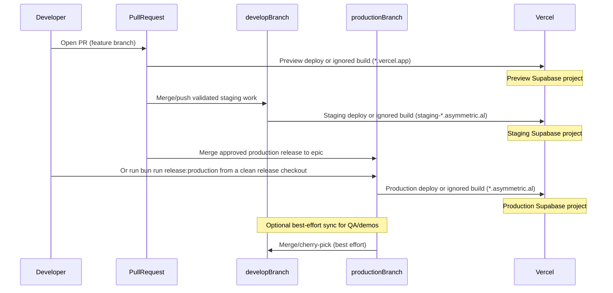

# Environments Operating Guide

## 1. Introduction

This document is the canonical reference for how environments are defined and operated across the Asymmetric.al platform. Production handles real donor data and live Stripe transactions, so strict environment discipline is required for every release and operational action. For companion procedures that are out of scope here, see [docs/ops/rollback-plan.md](./rollback-plan.md) and [docs/ops/deploy-checklist.md](./deploy-checklist.md).

## 2. Four-Environment Matrix

| Property      | Local                                | Preview                  | Staging                                                                                          | Production                             |
| ------------- | ------------------------------------ | ------------------------ | ------------------------------------------------------------------------------------------------ | -------------------------------------- |
| Trigger       | `bun run dev:*`                      | Disabled by default      | Push to `develop`                                                                                | `bun run release:production` to `epic` |
| URL           | `localhost:3000`                     | `*.vercel.app`           | `staging-admin.asymmetric.al`, `staging-donor.asymmetric.al`, `staging-missionary.asymmetric.al` | `*.asymmetric.al`                      |
| Supabase      | `bun run supabase -- start` (Docker) | Shared preview project   | Dedicated staging project                                                                        | Production project                     |
| Stripe        | Test-mode                            | Test-mode                | Test-mode                                                                                        | Live-mode                              |
| Sentry        | Optional (DSN may be unset)          | Optional                 | Configured                                                                                       | Configured                             |
| Safe to break | Yes - fully disposable               | Yes - isolated test data | Mostly - recoverable                                                                             | **No - real donors, real money**       |
| Seed data     | Local seed script                    | Shared test data         | Demo data (periodically refreshed)                                                               | Real data                              |

## 3. Local Development Setup

For full setup details and troubleshooting, use [README.md](../../README.md). The essential local workflow is:

1. Run `bun run setup` (first run creates `.env.local` with placeholders).
2. Fill in required values:
   - `NEXT_PUBLIC_SUPABASE_URL`
   - `NEXT_PUBLIC_SUPABASE_ANON_KEY`
3. Start local Supabase with `bun run supabase -- start` (Docker; config in [supabase/config.toml](../../supabase/config.toml)).
4. Run one app or all apps:
   - `bun run dev:admin`
   - `bun run dev:donor`
   - `bun run dev:missionary`
   - or `bun run dev` to run all three via Turbo

All other `.env.example` entries (Stripe, Sentry, Cloudinary, Email, PDF, etc.) are optional for local development.

## 4. Preview Environment Setup

Preview deploys for `admin`, `donor`, and `missionary` share one Supabase preview project. Keep it isolated to test-only data.

- Shared preview Supabase URL pattern: `https://<preview-project-ref>.supabase.co` (redacted)
- Data policy: all PR preview environments write to this shared preview database; never use production data

### 4.1 Preview env vars (scope: Preview only)

Set the following values in Vercel **Preview** scope for all three projects:

| Variable                             | Value / Source                           | Notes                                       |
| ------------------------------------ | ---------------------------------------- | ------------------------------------------- |
| `NEXT_PUBLIC_SUPABASE_URL`           | Shared preview Supabase URL              | `https://<preview-project-ref>.supabase.co` |
| `NEXT_PUBLIC_SUPABASE_ANON_KEY`      | Shared preview Supabase anon key         | Supabase dashboard                          |
| `SUPABASE_SERVICE_ROLE_KEY`          | Shared preview Supabase service role key | Supabase dashboard (server only)            |
| `STRIPE_SECRET_KEY`                  | `sk_test_...`                            | Stripe test-mode secret key                 |
| `NEXT_PUBLIC_STRIPE_PUBLISHABLE_KEY` | `pk_test_...`                            | Stripe test-mode publishable key            |
| `NEXT_PUBLIC_APP_URL`                | `https://$VERCEL_URL`                    | Uses Vercel system variable                 |
| `NEXT_PUBLIC_SENTRY_DSN`             | Preview Sentry DSN                       | Optional in preview                         |
| `NEXT_PUBLIC_CLOUDINARY_CLOUD_NAME`  | Preview/shared Cloudinary cloud name     | Non-secret identifier                       |

`STRIPE_WEBHOOK_SECRET` is intentionally not set for preview. Preview URLs are ephemeral and do not receive Stripe webhooks; `@asym/env` allows this variable to be omitted when `VERCEL_ENV === "preview"`.

### 4.2 Layered monorepo build controls

The three Core Vercel projects use four build-control layers to contain Build
CPU and on-demand deployment waste without changing runtime behavior or the
production release branch.

1. **Vercel affected-project deployments:** preferred first layer because
   Vercel can skip unchanged monorepo projects before they occupy build slots.
2. **Repo `ignoreCommand`:** source-controlled fallback for docs-only,
   evidence-only, tests-only, OpenSpec-only, and other non-runtime changes.
3. **Root Turbo build commands:** app-scoped Vercel builds execute from the
   monorepo root so Turbo can reuse the workspace graph and remote cache.
4. **Verifier:** `bun run verify:vercel-build-controls` checks live Vercel
   settings, Vercel Remote Cache status, app `vercel.json` controls, `.turbo`
   ignore posture, and the local ignored-build decision matrix.

Vercel affected-project deployments are enabled on the three Core app projects:

| Vercel project | Project ID                         | App root          |
| -------------- | ---------------------------------- | ----------------- |
| `admin`        | `prj_SB9DucsrJOT0wF1v43SWMFsSNdn8` | `apps/admin`      |
| `donor`        | `prj_dZG3XkklLVZyqm85FW5Vvv7ph3kL` | `apps/donor`      |
| `missionary`   | `prj_6tXSJKsdv2JpK70GKkg9HIg5hiYN` | `apps/missionary` |

Verify the Vercel-side gate without printing secrets:

```bash
bun run verify:vercel-affected-projects
```

Run the complete build-control verifier before and after deployment-control
changes:

```bash
bun run verify:vercel-build-controls
```

Enable or repair the setting for all three projects:

```bash
bun run ops:vercel-enable-affected-projects
```

The enable command captures a sanitized `/tmp/asym-vercel-affected-projects-*`
snapshot before mutating Vercel, patches only
`enableAffectedProjectsDeployments: true`, then re-reads the three projects.
This affected-project operation does not change branch gates, build queue
behavior, or prebuilt deployment flow; those controls are adjacent deployment
discipline settings and remain outside this phase.

Each Vercel app also owns its install, build, and ignored-build commands in
`apps/*/vercel.json`:

| Vercel project | `installCommand`                            | `buildCommand`                         | `ignoreCommand`                                                |
| -------------- | ------------------------------------------- | -------------------------------------- | -------------------------------------------------------------- |
| `admin`        | `bun install --cwd ../.. --frozen-lockfile` | `cd ../.. && bun run build:admin`      | `node ../../scripts/vercel/should-ignore-build.mjs admin`      |
| `donor`        | `bun install --cwd ../.. --frozen-lockfile` | `cd ../.. && bun run build:donor`      | `node ../../scripts/vercel/should-ignore-build.mjs donor`      |
| `missionary`   | `bun install --cwd ../.. --frozen-lockfile` | `cd ../.. && bun run build:missionary` | `node ../../scripts/vercel/should-ignore-build.mjs missionary` |

Vercel runs `ignoreCommand` from the app root. The helper returns `0` to skip
the build and `1` to continue the build, matching Vercel's ignored-build
contract. It intentionally fails closed: an unknown app name, first commit,
missing diff, empty diff, or Git diff failure continues the build instead of
skipping it.

Current affected-project scope:

- `apps/admin/**`, `apps/donor/**`, or `apps/missionary/**` builds only the
  matching app.
- Shared runtime/build inputs can still build all three apps, including `packages/**`,
  `tooling/**`, `scripts/vercel/**`, `scripts/resolve-monorepo-root.mjs`,
  `package.json`, lockfiles, `turbo.json`, root TypeScript/build config files,
  and `.vercelignore`.
- Docs, phase evidence, tests, OpenSpec-only text, GitHub workflow-only changes,
  and other non-runtime files should be skipped by Vercel's affected-project
  gate before a build slot is occupied; the ignored-build command remains the
  fallback layer.
- Vercel build queue behavior should be `WAIT_FOR_NAMESPACE_QUEUE` on all three
  projects so bursts serialize at the namespace queue instead of fanning out
  avoidable concurrent builds.
- `.turbo` remains ignored in Git and Vercel upload inputs. Do not commit
  `.turbo/config.json`; Vercel Remote Cache plus `TURBO_TOKEN` / `TURBO_TEAM`
  remains the shared cache path for Vercel and CI.

Local decision checks can import the helper directly:

```bash
node -e "import('./scripts/vercel/should-ignore-build.mjs').then(({resolveBuildDecision}) => console.log(resolveBuildDecision({app: 'admin', changedFiles: ['docs/ops/environments.md']})))"
```

Each app also keeps source-controlled Git deployment branch gates in
`apps/*/vercel.json`:

- `epic`: production deployments
- `develop`: staging deployments
- `main`: explicitly disabled retired history
- all other branches: no Git deployment creation because `"*": false` closes
  the default auto-deploy path

The local release guard blocks accidental direct pushes to `epic`; use
`bun run release:production` for production.

Reserve controls if spend still needs tightening:

- Move to manual release-only deployment with `vercel build` and
  `vercel deploy --prebuilt --prod` after CI passes.
- Treat `vercel promote` as a production-domain promotion workflow, not as the
  first-line Build CPU reducer; current production discipline stays Git-based.
- Track deploy-related usage with `vercel usage` and the Vercel Usage dashboard.

Official references:

- [Vercel monorepos](https://vercel.com/docs/monorepos)
- [Vercel project update API](https://vercel.com/docs/rest-api/reference/endpoints/projects/update-an-existing-project)
- [Vercel Turborepo](https://vercel.com/docs/monorepos/turborepo)
- [Vercel Git configuration](https://vercel.com/docs/project-configuration/git-configuration)
- [Vercel `vercel.json` `ignoreCommand`](https://vercel.com/docs/project-configuration/vercel-json)
- [Vercel CLI](https://vercel.com/docs/cli)
- [Turborepo remote caching](https://turborepo.dev/docs/core-concepts/remote-caching)
- [Turborepo CI setup](https://turborepo.dev/docs/guides/ci-vendors)

## 5. Staging Environment Setup (`develop`)

Staging is branch-bound to `develop` using Vercel Custom Environments and remains isolated from both preview and production infrastructure.

### 5.1 Canonical staging URLs

| App        | Vercel project | Staging URL                                |
| ---------- | -------------- | ------------------------------------------ |
| Admin      | `admin`        | `https://staging-admin.asymmetric.al`      |
| Donor      | `donor`        | `https://staging-donor.asymmetric.al`      |
| Missionary | `missionary`   | `https://staging-missionary.asymmetric.al` |

### 5.2 Staging Supabase project

The canonical staging database is the visible Supabase project in the normal
Asymmetrical Supabase organization. Its dashboard display name should be
`staging`; if the Supabase dashboard still shows `develop`, rename only the
display name and keep the project ref unchanged.

| Environment | Supabase project | Project ref            | Project URL                                | Policy                                |
| ----------- | ---------------- | ---------------------- | ------------------------------------------ | ------------------------------------- |
| Staging     | `staging`        | `pnmlrbgjiqzzsthsoikm` | `https://pnmlrbgjiqzzsthsoikm.supabase.co` | Demo/test data only                   |
| Production  | `epic`           | `btewedpsxwsjczvmegby` | `https://btewedpsxwsjczvmegby.supabase.co` | Real donor/auth/payment-adjacent data |
| Deleted     | Vercel-managed   | `uarazyactrqlxzmeygmr` | `https://uarazyactrqlxzmeygmr.supabase.co` | Exported, verified unused, deleted    |

Do not point staging at the Vercel-managed Supabase project ref
`uarazyactrqlxzmeygmr`. It was created by the Vercel/Supabase integration and
is intentionally retired in favor of the team-owned Supabase project above.

Cleanup state from the 2026-05-15 environment cutover:

- `pnmlrbgjiqzzsthsoikm` received all repo migrations and the staging/demo seed.
- `uarazyactrqlxzmeygmr` was exported, verified absent from active
  production/staging Vercel env pulls, and deleted.
- Completed exports are stored outside the repo at
  `/Users/blake/Documents/asymmetrical/ops-backups/core-supabase-cleanup-2026-05-15T08-05-59-447Z`.
- Remaining Supabase dashboard cleanup: rename display name `develop` to
  `staging`.

Configured staging Auth redirect URLs in the `pnmlrbgjiqzzsthsoikm` Supabase
Auth config:

- `https://staging-admin.asymmetric.al/**`
- `https://staging-donor.asymmetric.al/**`
- `https://staging-missionary.asymmetric.al/**`

Access policy: do not recover or share existing passwords. Inventory
admin-capable Auth users in Supabase and use Supabase invite/reset-password
flows for staging access.

### 5.3 Vercel `staging` custom environment (all 3 projects)

For each Vercel project (`admin`, `donor`, `missionary`):

1. Create custom environment `staging`.
2. Assign branch `develop` to `staging`.
3. Set variables in **staging scope only** (not Preview/Production):

| Variable                             |
| ------------------------------------ |
| `NEXT_PUBLIC_SUPABASE_URL`           |
| `NEXT_PUBLIC_SUPABASE_ANON_KEY`      |
| `SUPABASE_SERVICE_ROLE_KEY`          |
| `STRIPE_SECRET_KEY`                  |
| `NEXT_PUBLIC_STRIPE_PUBLISHABLE_KEY` |
| `STRIPE_WEBHOOK_SECRET`              |
| `NEXT_PUBLIC_APP_URL`                |
| `SENTRY_DSN`                         |
| `NEXT_PUBLIC_SENTRY_DSN`             |
| `SENTRY_AUTH_TOKEN`                  |
| `SENTRY_ORG`                         |
| `SENTRY_PROJECT`                     |
| `SENTRY_RELEASE`                     |
| `RESEND_API_KEY`                     |
| `RESEND_WEBHOOK_SECRET`              |
| `RESEND_ENCRYPTION_KEY`              |
| `CLOUDINARY_CLOUD_NAME`              |
| `CLOUDINARY_API_KEY`                 |
| `CLOUDINARY_API_SECRET`              |
| `NEXT_PUBLIC_CLOUDINARY_CLOUD_NAME`  |

Supabase-specific staging values must resolve to project ref
`pnmlrbgjiqzzsthsoikm`:

| Variable                        | Admin | Donor | Missionary | Notes                                                |
| ------------------------------- | ----- | ----- | ---------- | ---------------------------------------------------- |
| `NEXT_PUBLIC_SUPABASE_URL`      | Yes   | Yes   | Yes        | `https://pnmlrbgjiqzzsthsoikm.supabase.co`           |
| `NEXT_PUBLIC_SUPABASE_ANON_KEY` | Yes   | Yes   | Yes        | Client-safe key from the staging Supabase project    |
| `SUPABASE_SERVICE_ROLE_KEY`     | Yes   | Yes   | Yes        | Server-only key from the staging Supabase project    |
| `SUPABASE_DB_URL`               | Yes   | Yes   | Yes        | Supavisor session-pooler URL for staging Postgres    |
| `PAYLOAD_DATABASE_URI`          | Yes   | No    | No         | Admin CMS database URL; same staging Postgres target |

Trigger staging deploys by pushing to `develop`.

Verify the staging Supabase/Vercel map without printing secrets:

```bash
bun run verify:vercel-env-inventory -- --environments production,staging
```

Expected refs:

- Production remains `btewedpsxwsjczvmegby`.
- Staging is `pnmlrbgjiqzzsthsoikm`.
- No active Vercel environment variable should reference `uarazyactrqlxzmeygmr`.

### 5.4 DNS + domains

Assign these domains to each project's `staging` environment and point DNS CNAME records to Vercel:

- `staging-admin.asymmetric.al` -> `admin`
- `staging-donor.asymmetric.al` -> `donor`
- `staging-missionary.asymmetric.al` -> `missionary`

### 5.5 Stripe webhooks (test mode)

Use Stripe test-mode endpoints per staging app:

| App        | Endpoint URL                                                   |
| ---------- | -------------------------------------------------------------- |
| Admin      | `https://staging-admin.asymmetric.al/api/webhooks/stripe`      |
| Donor      | `https://staging-donor.asymmetric.al/api/webhooks/stripe`      |
| Missionary | `https://staging-missionary.asymmetric.al/api/webhooks/stripe` |

If the staging domain is protected by Vercel Authentication, Stripe cannot
reach the endpoint directly. A protected endpoint returns Vercel `401`
before the Next.js route runs, which Stripe records as a failed delivery.

Preferred protected-staging setup:

1. In the Vercel project for the app, generate a Protection Bypass for
   Automation secret for staging webhook automation.
2. In Stripe test mode, configure the endpoint URL with the bypass query
   parameter:

   ```text
   https://staging-<app>.asymmetric.al/api/webhooks/stripe?x-vercel-protection-bypass=<VERCEL_AUTOMATION_BYPASS_SECRET>
   ```

3. Do not add `x-vercel-set-bypass-cookie` to Stripe webhook URLs; Stripe
   needs a one-request server-to-server bypass, not a browser cookie.
4. Copy the Stripe endpoint signing secret into that app's
   `STRIPE_WEBHOOK_SECRET` in Vercel `staging` scope, then redeploy if either
   the webhook signing secret or the Vercel bypass secret changed.
5. Verify without exposing secrets:

   ```bash
   curl -i -X POST "https://staging-<app>.asymmetric.al/api/webhooks/stripe" \
     -H "content-type: application/json" \
     --data "{}"
   ```

   Without a bypass parameter, protected staging should return Vercel `401`.
   With the bypass parameter and no Stripe signature, the request should reach
   the app and return JSON `400` with `Missing Stripe signature.` A real Stripe
   test event should then return `2xx` and appear as delivered in Stripe
   Workbench.

Alternative: add the staging custom domain as a Vercel Deployment Protection
Exception. This makes the entire staging domain public, so only use it when
that exposure is acceptable.

### 5.6 Staging sync policy and Inngest note

- Staging deploy trigger: push to `develop`.
- Production deploy trigger: `bun run release:production` pushes a verified
  commit to `epic`, the Vercel Production Branch.
- `main` is retired/protected historical history; do not sync, merge, or deploy
  from it for normal work.
- To refresh staging parity ahead of QA/demo cycles, realign or merge from
  `epic` into `develop`; staging should start from production truth.
- Inngest staging is not integrated yet and remains a future placeholder.

## 5.7 Production Vercel requirements

Production deploys are currently branch-bound to `epic` in all three live Vercel
projects. This matches GitHub's current default branch for this repository. Do
not disable `epic` or `develop` in app-level `vercel.json`; `main` and all
other Git branches should remain disabled to avoid accidental deployment
creation.

If the team later migrates Production away from `epic`, change the Vercel
project Production Branch for `admin`, `donor`, and `missionary`, ensure the
new branch contains the current `epic` lineage, update this guide, and only then
adjust app-level deployment branch gates.

Set these Vercel variables in the **Production** scope before deploying:

| Variable                             | Admin                    | Donor                    | Missionary               | Notes                                                                                 |
| ------------------------------------ | ------------------------ | ------------------------ | ------------------------ | ------------------------------------------------------------------------------------- |
| `NEXT_PUBLIC_SUPABASE_URL`           | Yes                      | Yes                      | Yes                      | Production Supabase project URL                                                       |
| `NEXT_PUBLIC_SUPABASE_ANON_KEY`      | Yes                      | Yes                      | Yes                      | Client-safe production key                                                            |
| `SUPABASE_SERVICE_ROLE_KEY`          | Yes                      | Yes                      | Yes                      | Server-only production key                                                            |
| `STRIPE_SECRET_KEY`                  | Yes                      | Yes                      | Yes                      | Stripe key; current deployment uses test-mode `sk_test_...` until go-live             |
| `NEXT_PUBLIC_STRIPE_PUBLISHABLE_KEY` | Yes                      | Yes                      | Yes                      | Stripe publishable key; current deployment uses test-mode `pk_test_...` until go-live |
| `STRIPE_WEBHOOK_SECRET`              | Yes                      | Yes                      | Yes                      | Signing secret for the app-specific production endpoint                               |
| `SENTRY_DSN`                         | Yes                      | Yes                      | Yes                      | Required by protected deployment env validation                                       |
| `NEXT_PUBLIC_SENTRY_DSN`             | Yes                      | Yes                      | Yes                      | Public client DSN when browser reporting is enabled                                   |
| `SENTRY_AUTH_TOKEN`                  | If uploading source maps | If uploading source maps | If uploading source maps | Build-only token; enables Sentry release creation and source map upload               |
| `SENTRY_ORG`                         | Optional                 | Optional                 | Optional                 | Build-time Sentry org override; defaults to `asymmetrical-4w`                         |
| `SENTRY_PROJECT`                     | Optional                 | Optional                 | Optional                 | Build-time Sentry project override; defaults to `javascript-nextjs`                   |
| `SENTRY_RELEASE`                     | Optional                 | Optional                 | Optional                 | Manual release name override; otherwise the Vercel commit SHA is used                 |
| `RESEND_API_KEY`                     | Yes                      | Yes                      | Yes                      | Production Resend API key; use `re_...`                                               |
| `RESEND_WEBHOOK_SECRET`              | Yes                      | Yes                      | Yes                      | Production Resend webhook signing secret                                              |
| `RESEND_ENCRYPTION_KEY`              | Yes                      | Yes                      | Yes                      | At least 32 characters; protects tenant email secrets                                 |
| `NEXT_PUBLIC_APP_URL`                | Yes                      | Yes                      | Yes                      | App canonical origin                                                                  |
| `NEXT_PUBLIC_SITE_URL`               | Yes                      | Yes                      | Yes                      | Same origin as the app unless a split site exists                                     |
| `NEXT_PUBLIC_MAIN_DOMAIN`            | Yes                      | Yes                      | Yes                      | `asymmetric.al`                                                                       |
| `PAYLOAD_SECRET`                     | Yes                      | No                       | No                       | Required by admin Web Studio outside local/test                                       |
| `PAYLOAD_DATABASE_URI`               | Yes                      | No                       | No                       | Prefer Supavisor session pooler for Vercel                                            |
| `PAYLOAD_DATABASE_POOL_MAX`          | Optional                 | No                       | No                       | Optional Payload Postgres pool override; hosted runtime defaults to `2`               |
| `NEXT_PUBLIC_DONOR_URL`              | Yes                      | No                       | No                       | `https://donor.asymmetric.al` for Web Studio previews                                 |
| `DONOR_APP_URL`                      | Yes                      | No                       | No                       | Server-side donor origin for Web Studio previews                                      |

Production Stripe webhook endpoints:

| App        | Endpoint URL                                           |
| ---------- | ------------------------------------------------------ |
| Admin      | `https://admin.asymmetric.al/api/webhooks/stripe`      |
| Donor      | `https://donor.asymmetric.al/api/webhooks/stripe`      |
| Missionary | `https://missionary.asymmetric.al/api/webhooks/stripe` |

Configure each endpoint in the active Stripe mode for at least these events:

- `payment_intent.succeeded`
- `payment_intent.payment_failed`
- `payment_intent.canceled`
- `payment_intent.processing`
- `charge.refunded`

After creating each endpoint, copy its signing secret into that app's
`STRIPE_WEBHOOK_SECRET` in Vercel Production scope, then redeploy.

Production Resend webhook endpoint:

| App   | Endpoint URL                                            |
| ----- | ------------------------------------------------------- |
| Admin | `https://admin.asymmetric.al/api/email/webhooks/resend` |

The Resend webhook secret must come from Resend's webhook configuration for the
endpoint above. Use the guarded manual workflow
`Configure Resend Production Webhook` to create or update the endpoint, mask the
returned `whsec_...` signing secret, and sync that value into all three Vercel
Production projects as `RESEND_WEBHOOK_SECRET`. It requires typing
`configure-resend-production-webhook` and defaults to dry-run.

Local equivalent for inspection only when `RESEND_API_KEY` is available in the
shell:

```bash
bun run configure:resend-production-webhook -- --dry-run
```

Verify production readiness without printing secret values:

```bash
bun run verify:vercel-production -- --commit <sha>
```

The verifier checks each Vercel project for required Production env names,
validates prefix/URL/length requirements for values Vercel exposes through
`vercel env pull` without printing secrets, reports sensitive values that are
present but unreadable by the CLI, confirms the live Vercel Production Branch is
not disabled by the app-level `vercel.json`, confirms a READY Production
deployment for the target commit, and checks `/api/health` on the production
domain. Phase 11 release-health responses include `observability.surface`,
`observability.release`, and Supabase probe latency; the verifier blocks when a
non-`unknown` release-health commit does not match the target commit.

Inventory Vercel environment variable names without values:

```bash
bun run verify:vercel-env-inventory
```

Use this before provider or observability work to confirm which names exist in
Production, Preview, Development, and the `staging` custom environment without
printing secrets.

After the real provider values exist as GitHub repository secrets, sync them to
all three Vercel Production projects with the guarded manual workflow
`Sync Vercel Production Env`. It requires typing `sync-production-env` and
defaults to dry-run. The workflow reads these GitHub secret names:

- `STRIPE_SECRET_KEY`
- `NEXT_PUBLIC_STRIPE_PUBLISHABLE_KEY`
- `ADMIN_STRIPE_WEBHOOK_SECRET`
- `DONOR_STRIPE_WEBHOOK_SECRET`
- `MISSIONARY_STRIPE_WEBHOOK_SECRET`
- `SENTRY_DSN`
- `NEXT_PUBLIC_SENTRY_DSN`
- `SENTRY_AUTH_TOKEN` (targeted only when source map upload is required)
- `RESEND_API_KEY`
- `RESEND_ENCRYPTION_KEY`
- `VERCEL_TOKEN`

`RESEND_WEBHOOK_SECRET` is intentionally not required for the default full sync
because the guarded `Configure Resend Production Webhook` workflow sources that
value directly from Resend and writes it to Vercel Production without storing it
as a GitHub repository secret. `SENTRY_AUTH_TOKEN` is also targeted-only because
runtime Sentry DSNs do not require source map upload. The sync script supports
`--keys RESEND_WEBHOOK_SECRET` and `--keys SENTRY_AUTH_TOKEN` for those handoff
paths.

Local equivalent:

```bash
bun run sync:vercel-production-env -- --dry-run
bun run sync:vercel-production-env
```

For a known-good GitHub secret that already exists, the workflow also supports
targeted backfill with the optional `only_keys` input. Use GitHub secret input
names, not Vercel env names. Targeted sync does not prove Production readiness;
the default full sync and `bun run verify:vercel-production -- --commit <sha>`
remain the release gates.

Example targeted dry-run/write for the existing Resend API key:

```bash
bun run sync:vercel-production-env -- --dry-run --keys RESEND_API_KEY
bun run sync:vercel-production-env -- --keys RESEND_API_KEY
```

Do not hand-enter or invent `RESEND_WEBHOOK_SECRET`. If it is missing, run
`Configure Resend Production Webhook` dry-run first and then write mode after
the dry-run confirms the endpoint action.

If source map upload is required, add a Sentry auth token as a GitHub secret and
sync it without printing the value:

```bash
bun run sync:vercel-production-env -- --dry-run --keys SENTRY_AUTH_TOKEN
bun run sync:vercel-production-env -- --keys SENTRY_AUTH_TOKEN
```

Do not include `SENTRY_AUTH_TOKEN` in evidence output; record only that the name
exists and whether `bun run verify:sentry-release` passed.

## 6. Deploy Flows

Non-local environments are branch-triggered and map to deploy targets as follows:



`develop` may drift from the Production Branch; best-effort sync is performed
before QA/demo cycles. For docs/evidence-only releases, Vercel may record an
ignored build rather than spend build minutes on all three apps.

## 7. Playwright `baseURL` Configuration

E2E tests can target different environments using `PLAYWRIGHT_BASE_URL`, configured in [playwright.config.ts](../../playwright.config.ts). In CI, set `PLAYWRIGHT_BASE_URL` to a preview or staging URL to run tests against deployed infrastructure instead of localhost.

## 8. Credential Rotation Schedule

| Environment | Service            | Frequency                 | How                                                                        |
| ----------- | ------------------ | ------------------------- | -------------------------------------------------------------------------- |
| Preview     | Supabase           | Quarterly                 | Regenerate in Supabase dashboard -> update Vercel env vars (preview scope) |
| Preview     | Stripe             | Quarterly                 | Roll test-mode keys in Stripe dashboard -> update Vercel env vars          |
| Preview     | Sentry             | Quarterly                 | Regenerate DSN -> update Vercel env vars                                   |
| Staging     | All services       | Quarterly                 | Same process, staging scope                                                |
| Production  | Supabase           | Quarterly + on compromise | Same process, production scope. Coordinate with team.                      |
| Production  | Stripe             | Quarterly + on compromise | Rolling live keys causes brief webhook verification downtime               |
| Production  | Sentry, Cloudinary | Quarterly + on compromise | Same process                                                               |
| Production  | Email, PDF         | Quarterly + on compromise | Rotate in respective service dashboards -> update Vercel env vars          |

Every rotation window must cover all six services: Supabase, Stripe, Sentry, Cloudinary, Email, and PDF generation services such as DocRaptor when configured.

## 9. If an Environment Is Compromised

1. **Immediately rotate** all credentials for the affected environment in each service dashboard, following the schedule above.
2. **Update Vercel environment variables** for the affected scope (preview/staging/production) across all three projects: `admin`, `donor`, and `missionary`.
3. **Redeploy** all three apps so new credentials are loaded.
4. **For production compromises**, coordinate with the full team before rotating Stripe live keys (brief webhook downtime expected), and notify affected users if any data was exposed.
5. **Audit access logs** in Supabase, Stripe, and Sentry for the affected incident window.
6. **Document the incident** in a post-mortem.

## 10. Related Documents

See also:

- [docs/ops/rollback-plan.md](./rollback-plan.md) - code and database rollback procedures (T5)
- [docs/ops/deploy-checklist.md](./deploy-checklist.md) - pre-deploy, deploy, and post-deploy smoke tests (T6)
- [docs/ops/scale-observability-reliability.md](./scale-observability-reliability.md) - Phase 11 observability, release-health, and backup/restore runbook
- [README.md](../../README.md) - full local quickstart and monorepo workspace contract
- [supabase/config.toml](../../supabase/config.toml) - local Supabase configuration
