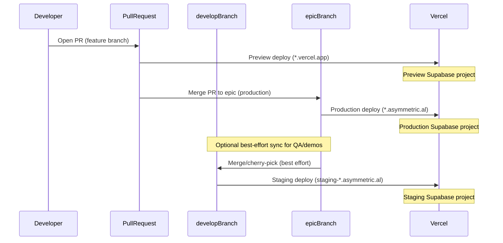

# Environments Operating Guide

## 1. Introduction

This document is the canonical reference for how environments are defined and operated across the Asymmetric.al platform. Production handles real donor data and live Stripe transactions, so strict environment discipline is required for every release and operational action. For companion procedures that are out of scope here, see [docs/ops/rollback-plan.md](./rollback-plan.md) and [docs/ops/deploy-checklist.md](./deploy-checklist.md).

## 2. Four-Environment Matrix

| Property      | Local                                | Preview                  | Staging                                                                                          | Production                       |
| ------------- | ------------------------------------ | ------------------------ | ------------------------------------------------------------------------------------------------ | -------------------------------- |
| Trigger       | `bun run dev:*`                      | PR opened/pushed         | Push to `develop`                                                                                | PR merged to `epic`              |
| URL           | `localhost:3000`                     | `*.vercel.app`           | `staging-admin.asymmetric.al`, `staging-donor.asymmetric.al`, `staging-missionary.asymmetric.al` | `*.asymmetric.al`                |
| Supabase      | `bun run supabase -- start` (Docker) | Shared preview project   | Dedicated staging project                                                                        | Production project               |
| Stripe        | Test-mode                            | Test-mode                | Test-mode                                                                                        | Live-mode                        |
| Sentry        | Optional (DSN may be unset)          | Optional                 | Configured                                                                                       | Configured                       |
| Safe to break | Yes - fully disposable               | Yes - isolated test data | Mostly - recoverable                                                                             | **No - real donors, real money** |
| Seed data     | Local seed script                    | Shared test data         | Demo data (periodically refreshed)                                                               | Real data                        |

## 3. Local Development Setup

For full setup details and troubleshooting, use [README.md](../../README.md). The essential local workflow is:

1. Run `bun run setup` (first run creates `.env.local` with placeholders).
2. Fill in required values:
   - `NEXT_PUBLIC_SUPABASE_URL`
   - `NEXT_PUBLIC_SUPABASE_ANON_KEY`
3. Start local Supabase with `bun run supabase -- start` (Docker; config in [supabase/config.toml](../../supabase/config.toml)).
4. Run one app or all apps:
   - `bun run dev:admin`
   - `bun run dev:donor`
   - `bun run dev:missionary`
   - or `bun run dev` to run all three via Turbo

All other `.env.example` entries (Stripe, Sentry, Cloudinary, Email, PDF, etc.) are optional for local development.

## 4. Preview Environment Setup

Preview deploys for `asym-admin`, `asym-donor`, and `asym-missionary` share one Supabase preview project. Keep it isolated to test-only data.

- Shared preview Supabase URL pattern: `https://<preview-project-ref>.supabase.co` (redacted)
- Data policy: all PR preview environments write to this shared preview database; never use production data

### 4.1 Preview env vars (scope: Preview only)

Set the following values in Vercel **Preview** scope for all three projects:

| Variable                             | Value / Source                           | Notes                                       |
| ------------------------------------ | ---------------------------------------- | ------------------------------------------- |
| `NEXT_PUBLIC_SUPABASE_URL`           | Shared preview Supabase URL              | `https://<preview-project-ref>.supabase.co` |
| `NEXT_PUBLIC_SUPABASE_ANON_KEY`      | Shared preview Supabase anon key         | Supabase dashboard                          |
| `SUPABASE_SERVICE_ROLE_KEY`          | Shared preview Supabase service role key | Supabase dashboard (server only)            |
| `STRIPE_SECRET_KEY`                  | `sk_test_...`                            | Stripe test-mode secret key                 |
| `NEXT_PUBLIC_STRIPE_PUBLISHABLE_KEY` | `pk_test_...`                            | Stripe test-mode publishable key            |
| `NEXT_PUBLIC_APP_URL`                | `https://$VERCEL_URL`                    | Uses Vercel system variable                 |
| `NEXT_PUBLIC_SENTRY_DSN`             | Preview Sentry DSN                       | Optional in preview                         |
| `NEXT_PUBLIC_CLOUDINARY_CLOUD_NAME`  | Preview/shared Cloudinary cloud name     | Non-secret identifier                       |

`STRIPE_WEBHOOK_SECRET` is intentionally not set for preview. Preview URLs are ephemeral and do not receive Stripe webhooks; `@asym/env` allows this variable to be omitted when `VERCEL_ENV === "preview"`.

### 4.2 `turbo-ignore` ignored build step

In each Vercel project (`Settings -> General -> Ignored Build Step`), configure:

| Vercel project    | Ignored Build Step command              |
| ----------------- | --------------------------------------- |
| `asym-admin`      | `npx turbo-ignore @asym/admin`          |
| `asym-donor`      | `npx turbo-ignore @asym/donor`          |
| `asym-missionary` | `npx turbo-ignore @asym/missionary-app` |

This skips preview builds when the PR does not touch files relevant to that app or its workspace dependencies.

## 5. Staging Environment Setup (`develop`)

Staging is branch-bound to `develop` using Vercel Custom Environments and remains isolated from both preview and production infrastructure.

### 5.1 Canonical staging URLs

| App        | Vercel project    | Staging URL                                |
| ---------- | ----------------- | ------------------------------------------ |
| Admin      | `asym-admin`      | `https://staging-admin.asymmetric.al`      |
| Donor      | `asym-donor`      | `https://staging-donor.asymmetric.al`      |
| Missionary | `asym-missionary` | `https://staging-missionary.asymmetric.al` |

### 5.2 Staging Supabase project

Create one dedicated staging Supabase project (recommended name: `asym-staging`) and record:

- `project ref` (used by CLI commands)
- `NEXT_PUBLIC_SUPABASE_URL`
- `NEXT_PUBLIC_SUPABASE_ANON_KEY`
- `SUPABASE_SERVICE_ROLE_KEY`

Apply schema + seed to staging:

```bash
npx supabase db push --project-ref <staging-project-ref>
npx supabase db execute --project-ref <staging-project-ref> --file supabase/seed.sql
```

After applying migrations and seed, verify data writes from staging URLs land in this project only (never production).

### 5.3 Vercel `staging` custom environment (all 3 projects)

For each Vercel project (`asym-admin`, `asym-donor`, `asym-missionary`):

1. Create custom environment `staging`.
2. Assign branch `develop` to `staging`.
3. Set variables in **staging scope only** (not Preview/Production):

| Variable                             |
| ------------------------------------ |
| `NEXT_PUBLIC_SUPABASE_URL`           |
| `NEXT_PUBLIC_SUPABASE_ANON_KEY`      |
| `SUPABASE_SERVICE_ROLE_KEY`          |
| `STRIPE_SECRET_KEY`                  |
| `NEXT_PUBLIC_STRIPE_PUBLISHABLE_KEY` |
| `STRIPE_WEBHOOK_SECRET`              |
| `NEXT_PUBLIC_APP_URL`                |
| `SENTRY_DSN`                         |
| `NEXT_PUBLIC_SENTRY_DSN`             |
| `CLOUDINARY_CLOUD_NAME`              |
| `CLOUDINARY_API_KEY`                 |
| `CLOUDINARY_API_SECRET`              |
| `NEXT_PUBLIC_CLOUDINARY_CLOUD_NAME`  |

Trigger staging deploys by pushing to `develop`.

### 5.4 DNS + domains

Assign these domains to each project's `staging` environment and point DNS CNAME records to Vercel:

- `staging-admin.asymmetric.al` -> `asym-admin`
- `staging-donor.asymmetric.al` -> `asym-donor`
- `staging-missionary.asymmetric.al` -> `asym-missionary`

### 5.5 Stripe webhooks (test mode)

Use Stripe test-mode endpoints per staging app:

| App        | Endpoint URL                                                   |
| ---------- | -------------------------------------------------------------- |
| Admin      | `https://staging-admin.asymmetric.al/api/webhooks/stripe`      |
| Donor      | `https://staging-donor.asymmetric.al/api/webhooks/stripe`      |
| Missionary | `https://staging-missionary.asymmetric.al/api/webhooks/stripe` |

After creating each endpoint, copy its signing secret into that app's `STRIPE_WEBHOOK_SECRET` in Vercel `staging` scope, then redeploy.

### 5.6 Staging sync policy and Inngest note

- Staging deploy trigger: push to `develop`.
- Production deploy trigger: merge to `epic`.
- To refresh staging parity ahead of QA/demo cycles, perform best-effort sync from `epic` into `develop` (merge or cherry-pick).
- Inngest staging is not integrated yet and remains a future placeholder.

## 6. Deploy Flows

Non-local environments are branch-triggered and map to deploy targets as follows:



`develop` may drift from `epic`; best-effort sync is performed before QA/demo cycles. Direct-to-`epic` PRs remain the primary workflow.

## 7. Playwright `baseURL` Configuration

E2E tests can target different environments using `PLAYWRIGHT_BASE_URL`, configured in [playwright.config.ts](../../playwright.config.ts). In CI, set `PLAYWRIGHT_BASE_URL` to a preview or staging URL to run tests against deployed infrastructure instead of localhost.

## 8. Credential Rotation Schedule

| Environment | Service            | Frequency                 | How                                                                        |
| ----------- | ------------------ | ------------------------- | -------------------------------------------------------------------------- |
| Preview     | Supabase           | Quarterly                 | Regenerate in Supabase dashboard -> update Vercel env vars (preview scope) |
| Preview     | Stripe             | Quarterly                 | Roll test-mode keys in Stripe dashboard -> update Vercel env vars          |
| Preview     | Sentry             | Quarterly                 | Regenerate DSN -> update Vercel env vars                                   |
| Staging     | All services       | Quarterly                 | Same process, staging scope                                                |
| Production  | Supabase           | Quarterly + on compromise | Same process, production scope. Coordinate with team.                      |
| Production  | Stripe             | Quarterly + on compromise | Rolling live keys causes brief webhook verification downtime               |
| Production  | Sentry, Cloudinary | Quarterly + on compromise | Same process                                                               |
| Production  | Email, PDF         | Quarterly + on compromise | Rotate in respective service dashboards -> update Vercel env vars          |

Every rotation window must cover all six services: Supabase, Stripe, Sentry, Cloudinary, Email, and PDF.

## 9. If an Environment Is Compromised

1. **Immediately rotate** all credentials for the affected environment in each service dashboard, following the schedule above.
2. **Update Vercel environment variables** for the affected scope (preview/staging/production) across all three projects: `asym-admin`, `asym-donor`, and `asym-missionary`.
3. **Redeploy** all three apps so new credentials are loaded.
4. **For production compromises**, coordinate with the full team before rotating Stripe live keys (brief webhook downtime expected), and notify affected users if any data was exposed.
5. **Audit access logs** in Supabase, Stripe, and Sentry for the affected incident window.
6. **Document the incident** in a post-mortem.

## 10. Related Documents

See also:

- [docs/ops/rollback-plan.md](./rollback-plan.md) - code and database rollback procedures (T5)
- [docs/ops/deploy-checklist.md](./deploy-checklist.md) - pre-deploy, deploy, and post-deploy smoke tests (T6)
- [README.md](../../README.md) - full local quickstart and monorepo workspace contract
- [supabase/config.toml](../../supabase/config.toml) - local Supabase configuration
