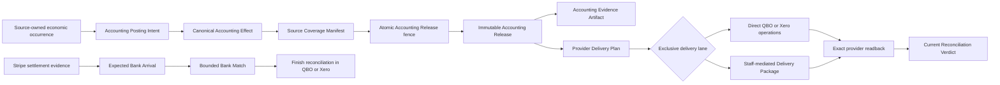

# Phase 20 - Accounting Exports & Reconciliation: Immutable Accounting Releases, Truthful Settlement Evidence, and First-Class QBO/Xero Delivery

## Status

**Implementation-ready specification; not implemented.** This document is the
authoritative Phase 20 product and engineering contract. It authorizes
implementation planning and ticket decomposition, but it does not claim that
the FORWARD runtime described here exists.

**Published specification issue:** [#1036](https://github.com/Asymmetric-al/core/issues/1036)

**Decision authority:** Phase 20 `/grill-with-docs` D1-D20, ratified by Conrad
between 2026-07-25 and 2026-07-27. The ratified decisions, ADR-0043 through
ADR-0061, the source-of-truth ownership matrix, `CONTEXT.md`, and this
specification control over older accounting-export language.

**Confirmed testing seam:** the tenant-, actor-, and Legal-Entity-scoped
**`AccountingOperationsService`** described below. Conrad confirmed this seam
on 2026-07-27 before specification drafting continued. The single
**Accounting Release fence** is the highest-value command seam inside that
service and is the only boundary that may convert disposable readiness into an
immutable Accounting Release.

**Companion contracts:**

- [Phase 20 decision log](./phase-20-accounting-exports-reconciliation-decision-log.md)
- [Phase 20 cross-phase congruency audit](./phase-20-cross-phase-congruency-audit.md)
- [Phase 20 research evidence](./phase-20-accounting-exports-reconciliation-research-evidence.md)
- [OpenSpec change - Accounting Exports & Reconciliation](../../../openspec/changes/add-accounting-exports-reconciliation/proposal.md)
- [ADR-0043 - Immutable Accounting Releases and exclusive delivery lanes](../../adr/0043-immutable-accounting-releases-and-exclusive-delivery-lanes.md)
- [ADR-0044 - Canonical Legal Entity financial boundary](../../adr/0044-canonical-legal-entity-financial-boundary.md)
- [ADR-0045 - Typed Posting Intents and Canonical Accounting Effects](../../adr/0045-typed-posting-intents-and-canonical-accounting-effects.md)
- [ADR-0046 - Bounded provider-native Posting Profiles](../../adr/0046-bounded-provider-native-posting-profiles.md)
- [ADR-0047 - Source-exact many-fund mapping](../../adr/0047-source-exact-many-fund-mapping.md)
- [ADR-0048 - Tenant-owned capability-certified QBO Carrier Plans](../../adr/0048-tenant-owned-capability-certified-qbo-carrier-plans.md)
- [ADR-0049 - Tenant-owned capability-certified Xero Carrier Plans](../../adr/0049-tenant-owned-capability-certified-xero-carrier-plans.md)
- [ADR-0050 - Mode-honest processor settlement evidence](../../adr/0050-mode-honest-processor-settlement-evidence.md)
- [ADR-0051 - Bounded Bank Match with accounting-owned reconciliation](../../adr/0051-bounded-bank-match-with-accounting-owned-reconciliation.md)
- [ADR-0052 - Policy-bounded compensating Accounting Releases](../../adr/0052-policy-bounded-compensating-accounting-releases.md)
- [ADR-0053 - Tenant-controlled Accounting Release cadence](../../adr/0053-tenant-controlled-accounting-release-cadence.md)
- [ADR-0054 - Cause-owned accounting exceptions with shared follow-up](../../adr/0054-cause-owned-accounting-exceptions-with-shared-follow-up.md)
- [ADR-0055 - Destination-pinned provider-native authorization lifecycle](../../adr/0055-destination-pinned-provider-native-authorization-lifecycle.md)
- [ADR-0056 - Workload-shaped certified accounting capacity](../../adr/0056-workload-shaped-certified-accounting-capacity.md)
- [ADR-0057 - Capability-certified Accounting Delivery Packages](../../adr/0057-capability-certified-accounting-delivery-packages.md)
- [ADR-0058 - Source-family Posting Ownership Cutover](../../adr/0058-source-family-posting-ownership-cutover.md)
- [ADR-0059 - Accounting-ready expense handoff](../../adr/0059-accounting-ready-expense-handoff.md)
- [ADR-0060 - Processor-cost attribution policy](../../adr/0060-processor-cost-attribution-policy.md)
- [ADR-0061 - Local-currency-first, proof-gated multicurrency](../../adr/0061-local-currency-first-proof-gated-multicurrency.md)

**Program-order gate:** Phase 20 may build its own inert contract, policy,
mapping, destination, provider-adapter, and evidence foundations before every
source phase is live. A source family cannot create a production Accounting
Posting Intent until its owning phase exposes the exact source-authoritative
contract required here. Phase 20 must never invent a temporary contribution,
deposit, receipt, expense, reimbursement, or Field Account authority to work
around an absent predecessor. Phase 21 D5 support-reallocation work remains
unsupported and structurally dark in this generation, including a
close-covered occurrence. A later separately approved Phase 20 change must
certify the exact source schema, accountant-confirmed semantics, Posting Profile
recipe, and D17 owner before that family may enter accounting.

## Problem Statement

Finance staff must be able to answer two ordinary but difficult questions:

1. Why does the net amount deposited by Stripe differ from gross donor gifts?
2. What exact, balanced records should be delivered to this tenant's existing
   QuickBooks Online or Xero books?

The repository currently has contribution operations, Stripe raw-event
storage, durable workflow patterns, safe CSV helpers, private artifact
precedents, and internal pipeline-consistency reconciliation. It does **not**
have Stripe payout and balance-transaction composition, Legal Entity
financial scope, a provider-neutral accounting effect, immutable Accounting
Releases, a bounded Bank Match, QBO/Xero authorization and delivery,
accounting-delivery packages, or a first-class finance workspace.

A simplistic export would fail quickly:

- gross gifts would not tie to net deposits because fees, refunds, disputes,
  reserves, conversions, and payout modes were collapsed;
- mutable "exported" or "synced" flags would hide partial and ambiguous
  provider outcomes;
- one universal journal shape would not match how missions organizations use
  accounts, classes, locations, products/services, projects, tracking
  categories, and clearing accounts;
- current mappings or defaults could silently reinterpret prior releases;
- retries after a timeout could duplicate financial records;
- cross-tenant, cross-entity, cross-currency, or wrong-destination work could
  contaminate another set of books;
- an expense workflow or bank feed could turn Asym into an incomplete second
  accounting system.

Bookkeepers need a calm, source-labelled workspace that explains what is
ready, what is blocked, what was released, what the provider accepted, what
the bank recorded, and what must still be reconciled in QBO or Xero. Tenants
need flexibility to preserve their existing books without receiving an
arbitrary accounting rules language or a brittle integration.

## Solution

Build one Phase 20 **Accounting doorway** behind
`AccountingOperationsService`.

The permanent flow is:

1. A source domain produces an exact, immutable, tenant- and Legal-Entity-
   scoped economic occurrence.
2. Phase 20 admits it as a typed **Accounting Posting Intent** under a
   versioned, accountant-confirmed semantic accounting policy.
3. A deterministic compiler produces an exactly balanced, provider-neutral
   **Canonical Accounting Effect** plus an exact **Source Coverage Manifest**.
4. A prospective **Posting Profile**, **Designation Mapping Version**, and
   QBO or Xero **Carrier Plan Version** determine representation without
   changing economic meaning.
5. The single atomic **Accounting Release fence** revalidates every authority
   and freezes one immutable **Accounting Release**, one
   **Accounting Evidence Artifact**, and one **Provider Delivery Plan**.
6. The release uses exactly one lane: direct QBO/Xero API delivery or a
   capability-certified staff-mediated **Accounting Delivery Package**.
7. Delivery is tracked per provider operation. Any possible write without
   proof becomes **Outcome unknown**, is quarantined, and is read before retry.
8. Exact provider readback and later drift checks produce a separately
   authoritative **Reconciliation Verdict**. QBO or Xero remains the final
   authority for the books and final bank reconciliation.
9. Stripe settlement evidence separately explains processor balance activity
   and expected bank arrivals. A bounded **Bank Match** links expectations to
   source-labelled posted bank evidence without claiming final reconciliation.
10. Corrections create cause-linked **Compensating Accounting Releases** in a
    tenant-policy-permitted and provider-accepted period. Original releases
    never change.

The ordinary experience is deliberately quiet:

- one Legal Entity is selected invisibly when only one is active;
- local settlement currency is the default;
- the organization absorbs processor cost unless the tenant deliberately
  enables the bounded designation-borne option;
- recommended Posting and Carrier Profiles are selected from the tenant's
  existing books;
- healthy automatic work remains quiet;
- advanced mapping, retained currency, cutover, and capacity controls appear
  only when relevant;
- exceptions state the cause, affected scope, what is still safe, and the next
  action.

## Product Outcomes

1. Finance can tie Stripe gross activity, fees, refunds, disputes, conversion
   evidence, and payout movement to an expected bank arrival without inventing
   settlement membership.
2. Finance can deliver balanced, source-covered accounting records to QBO or
   Xero through one direct or staff-mediated lane.
3. Missions organizations with many funds can map each Designation exactly or
   intentionally group it while retaining gift-level lineage in Asym.
4. Tenants preserve their existing chart, dimensions, and reporting practices
   through bounded provider-native plans rather than a draconian universal
   setup.
5. Every release, artifact, delivery operation, provider record, readback,
   drift verdict, settlement observation, and Bank Match remains separately
   truthful.
6. Ambiguous writes cannot be blindly replayed, and provider outages cannot
   erase or corrupt accounting evidence.
7. Corrections preserve original history and post only through tenant-policy-
   permitted and provider-accepted periods.
8. One-person finance teams see a fast default path; complex tenants receive
   progressively disclosed control.
9. Tenant, Legal Entity, destination, environment, currency, provider, and
   source-family isolation hold at every database, service, cache, job,
   artifact, and adapter boundary.
10. Asym assists accounting handoff and tie-out without becoming the tenant's
    general ledger, bank ledger, AP system, tax engine, or final reconciliation
    authority.

## User Stories

1. **US20-01** — As finance staff, I want one Accounting doorway, so that settlement,
   mapping, release, delivery, and tie-out do not fragment into competing
   products.
2. **US20-02** — As a bookkeeper, I want source, processor, bank, Asym release, and provider
   facts labelled separately, so that agreement is evidence and disagreement
   remains visible.
3. **US20-03** — As a one-entity tenant, I want the sole Legal Entity selected quietly, so
   that correct scope does not add a redundant step.
4. **US20-04** — As a multi-entity tenant administrator, I want prospective proof-gated
   activation, so that each financial root reaches only the correct books.
5. **US20-05** — As an administrator, I want to connect one exact QBO company, so that a
   display name or OAuth user cannot silently choose the destination.
6. **US20-06** — As an administrator, I want to connect one exact Xero organization, so that
   one authorization grant can safely support the intended organization
   connections without mixing them.
7. **US20-07** — As an administrator, I want same-organization reconnect separated from
   destination replacement, so that restoring credentials cannot reroute
   accounting history.
8. **US20-08** — As a security administrator, I want disconnect and compromise to quarantine
   new calls immediately, so that local containment does not depend on remote
   provider cooperation.
9. **US20-09** — As a bookkeeper, I want a guided Posting Profile based on my accounting
   goal, so that I can preserve my existing books without building operation
   graphs.
10. **US20-10** — As a QBO tenant, I want a bounded QBO Carrier Plan using the accounts,
    classes, locations, products/services, customers/projects, or Asym-only
    detail I already use, so that the integration fits my reporting practice.
11. **US20-11** — As a Xero tenant, I want a bounded Xero Carrier Plan using accounts,
    tracking, items, contacts, projects, or Asym-only detail I already use, so
    that the integration fits Xero's real capabilities.
12. **US20-12** — As finance staff, I want the product to disclose what each carrier can and
    cannot show in provider reports, so that partial visibility is never sold
    as complete fund accounting.
13. **US20-13** — As a missions organization with many funds, I want exact and intentional
    grouped Designation mappings, so that setup is manageable without losing
    source lineage.
14. **US20-14** — As a mapper, I want complete coverage and one clear exception workspace, so
    that no Designation silently falls into Other, suspense, or a copied first
    target.
15. **US20-15** — As a bookkeeper, I want inactive, renamed, deleted, wrong-type, or
    wrong-currency provider objects detected before release, so that drift
    cannot misclassify money.
16. **US20-16** — As an accountant, I want each source occurrence expressed as a typed
    Accounting Posting Intent, so that provider adapters cannot invent
    accounting meaning.
17. **US20-17** — As an accountant, I want every Canonical Accounting Effect to balance
    exactly in integer minor units, so that the system cannot hide errors with
    a penny plug.
18. **US20-18** — As an auditor, I want every source amount represented exactly once or
    explicitly excluded, so that a balanced grand total cannot conceal missing
    or duplicated source coverage.
19. **US20-19** — As finance staff, I want a quiet Release Horizon, so that I can see what
    needs attention, what is ready, what will happen automatically, and what
    recently released.
20. **US20-20** — As a tenant administrator, I want to choose automatic release, scheduled
    preparation for review, or wait for staff per bounded intent family, so
    that cadence fits my team without becoming a cron or rules engine.
21. **US20-21** — As authorized finance staff, I want Release now to use the same atomic
    fence as automation, so that convenience cannot bypass policy or safety.
22. **US20-22** — As a reviewer, I want stale reviewed work to shrink or be rejected but
    never silently expand, so that only the exact work I reviewed can release.
23. **US20-23** — As finance staff, I want duplicate or concurrent release commands to
    converge on one immutable result, so that double-clicks and job races do
    not duplicate accounting.
24. **US20-24** — As an auditor, I want every Accounting Release paired with an immutable
    human-inspectable and machine-verifiable evidence artifact, so that API
    delivery never becomes the only proof.
25. **US20-25** — As a QBO tenant, I want first-class direct provider-native delivery with
    operation-level results and exact readback, so that I can use QBO without a
    generic journal-only integration.
26. **US20-26** — As a Xero tenant, I want first-class direct provider-native delivery with
    operation-level results and exact readback, so that I can use Xero without
    pretending every account or bank behavior is writable.
27. **US20-27** — As finance staff, I want an immutable staff-mediated Delivery Package when
    that exact import surface is certified, so that I retain a controlled
    artifact option.
28. **US20-28** — As finance staff, I want a re-download to return identical bytes, so that a
    later download cannot silently represent a different release.
29. **US20-29** — As finance staff, I want download, import, staging, finalization, readback,
    drift, and reconciliation shown separately, so that a file action is never
    mistaken for accounting completion.
30. **US20-30** — As operations staff, I want a possible provider write to become Outcome
    unknown and require exact lookup before retry, so that a timeout cannot
    create duplicates.
31. **US20-31** — As finance staff, I want recovery to resume only operations proved missing
    or failed, so that already accepted siblings remain untouched.
32. **US20-32** — As a bookkeeper, I want later provider edits, deletions, voids, or mapping
    drift detected without rewriting history, so that current disagreement is
    visible.
33. **US20-33** — As finance staff, I want automatic Stripe payouts composed from fully
    paginated provider-attributed balance transactions, so that gross, fees,
    refunds, and disputes explain the payout exactly.
34. **US20-34** — As finance staff, I want manual, Instant, split-secondary, and unsupported
    payout modes labelled as bounded balance-window evidence, so that Asym does
    not invent transaction membership.
35. **US20-35** — As finance staff, I want processor transfer, component coverage, source
    links, settlement verdict, Bank Match, and Accounting Release state kept
    separate, so that one success cannot overwrite another authority.
36. **US20-36** — As finance staff, I want each payout or frozen offline Deposit Group to
    produce one exact Expected Bank Arrival, so that bank tie-out starts from a
    stable amount, currency, account binding, and date window.
37. **US20-37** — As a tenant, I want to use reviewed statement import, an optional certified
    read-only connection, or explicit staff-confirmed bank evidence, so that
    Bank Match remains useful without making a bank feed mandatory.
38. **US20-38** — As finance staff, I want exact deterministic bank matches automated and
    ambiguous candidates routed to review, so that convenience never becomes
    fuzzy financial truth.
39. **US20-39** — As a bookkeeper, I want the UI to say Finish reconciliation in QBO or Xero,
    so that Asym never claims to close the books.
40. **US20-40** — As finance staff, I want refunds, chargebacks, corrections, omissions, and
    provider drift to create cause-linked compensating releases, so that an
    exported period is never reopened in place.
41. **US20-41** — As a tenant accountant, I want a prospective Correction Posting Policy with
    permitted periods, so that staff have bounded flexibility without Asym
    deciding materiality or restatement.
42. **US20-42** — As an accountant, I want source-effective, discovery, accounting-effective,
    and provider-posting dates preserved independently, so that later
    corrections remain explainable.
43. **US20-43** — As finance staff, I want one cause-owned Accounting Exception Case at the
    narrowest root scope, so that one problem does not block unrelated clean
    work.
44. **US20-44** — As a Mission Control user, I want assignment, comments, reminders, and due
    dates to reuse shared tasks, so that follow-up is coordinated without task
    completion becoming financial truth.
45. **US20-45** — As every tenant, I want tenant-fair, provider-native backpressure and
    protected recovery capacity, so that one large tenant cannot starve smaller
    tenants or readback work.
46. **US20-46** — As finance staff, I want capacity status expressed as Ready now, queued,
    waiting for provider, needs tenant action, or outside the certified
    envelope, so that raw quotas do not become false promises.
47. **US20-47** — As an administrator adopting Asym, I want one immutable Posting Ownership
    Cutover at a complete drained source boundary, so that Asym and a prior
    connector cannot dual-post the same occurrence.
48. **US20-48** — As an administrator, I want previous-owner evidence preserved as
    previous-owner evidence, so that Asym never relabels historical provider
    records as its own delivery.
49. **US20-49** — As an administrator, I want optional historical backfill limited to a
    frozen gap proved unposted, so that migration cannot replay a whole
    backlog.
50. **US20-50** — As Phase 21, I want to hand off one immutable
    accounting-ready expense occurrence with its exact source-owned snapshot or
    External Payment Occurrence evidence and coverage, so that Phase 20 can
    account for approved work without owning reports, receipts, approval,
    funding, payment execution, or Field Account truth.
51. **US20-51** — As finance staff, I want organization-paid expense, reimbursement
    obligation, evidence-qualified external reimbursement payment, and
    correction to remain different occurrence types, so that Asym does not
    become an AP ledger.
52. **US20-52** — As finance staff, I want partial and batched reimbursement payments covered
    exactly, so that one-to-many and many-to-one settlement cannot overpay or
    disappear.
53. **US20-53** — As a tenant, I want processing costs absorbed by the organization by
    default, so that gross gift and supported-fund truth stay simple.
54. **US20-54** — As a tenant that deliberately enables it, I want donor fee-cover applied
    first and only the uncovered ordinary charge-linked cost attributed to
    original supported Designations, so that funds receive the approved net
    effect without changing gross gift truth.
55. **US20-55** — As finance staff, I want prohibited, unknown, payout-level, dispute, reserve,
    FX, and otherwise ineligible costs excluded from designation allocation, so
    that the allocator never guesses.
56. **US20-56** — As an ordinary tenant, I want exact Stripe settlement amounts in my QBO home
    or Xero base currency used quietly, so that currency setup does not burden
    the common case.
57. **US20-57** — As a donor-relations user, I want donor presentment amount preserved
    separately from settlement and accounting currency, so that conversion
    never rewrites the gift.
58. **US20-58** — As a tenant retaining a supported foreign settlement currency, I want
    prospective proof across Stripe, the payout bank, and QBO/Xero, so that a
    retained-currency lane is explicit and safe.
59. **US20-59** — As an accountant, I want QBO or Xero to own translation, revaluation, and FX
    accounting, so that Asym does not become an FX subledger.
60. **US20-60** — As an authorized user, I want every command and query scoped server-side by
    tenant, Legal Entity, destination, provider, environment, currency, and
    purpose, so that poison identifiers cannot widen access.
61. **US20-61** — As a security reviewer, I want OAuth grants encrypted, rotated
    monotonically, omitted from jobs/logs/browser payloads, and independently
    quarantinable, so that one credential incident has the smallest blast
    radius.
62. **US20-62** — As finance staff using assistive technology, I want keyboard-complete,
    screen-reader-clear, reflow-safe workflows, so that accounting operations
    do not require mouse precision or visual status interpretation.
63. **US20-63** — As a one-person finance team, I want healthy defaults and exception-first
    progressive disclosure, so that setup and daily work remain fast.
64. **US20-64** — As an external accountant, I want exact source-to-provider evidence and
    current drift visibility, so that I can inspect intent without granting
    Asym authority over final books.
65. **US20-65** — As an operator, I want source-to-release-to-provider correlations, bounded
    recovery, and actionable alerts, so that failures are diagnosable without
    exposing donor or provider secrets.
66. **US20-66** — As a maintainer, I want all Phase 20 writers to use one service and release
    fence, so that no route, worker, adapter, artifact, or import creates an
    alternate accounting authority.

## Implementation Decisions

### 1. One bounded context and one public service

`AccountingOperationsService` is the only Phase 20 application boundary.
Admin UI actions, API handlers, Inngest functions, recovery scans, support
actions, Stripe synchronization, QBO/Xero adapters, bank-evidence intake, and
scheduled cadence all delegate to it.

The service is not one mega-function. It exposes explicit typed commands and
queries over cohesive Phase 20 aggregates. Pure compilers and provider
adapters remain internal implementation details. Routes and jobs receive
identifiers and expected revisions, not trusted financial booleans or
serialized database rows.

The single Accounting Release fence is the one write chokepoint that may
promote current eligible work into immutable accounting intent. Manual,
automatic, scheduled, catch-up, and recovery paths all invoke the same fence.

### 2. Authority hierarchy

When facts disagree, apply this order:

1. Source domains own their immutable economic occurrences, approvals,
   allocation lines, legal donor facts, deposit groups, expense approvals,
   reimbursement payments, and corrections.
2. Stripe owns processor-account balance transactions, fees, refunds,
   disputes, conversions, payout-transfer lifecycle, and provider-attributed
   payout composition.
3. A bank statement, certified read-only connection, or explicit staff
   attestation owns only its source-labelled Bank Evidence Observation.
4. Phase 20 owns typed Posting Intents, Canonical Accounting Effects, coverage,
   immutable Accounting Releases, evidence artifacts, delivery intent,
   provider-operation evidence, derived settlement verdicts, bounded Bank
   Matches, and current Reconciliation Verdicts.
5. QBO or Xero owns provider-native records, accounting periods and locks,
   translation and revaluation, final books, and final bank reconciliation.
6. Shared Mission Control owns human follow-up only.
7. UI projections, caches, search indexes, metrics, provider display names,
   and estimates are disposable.

No authority may rewrite another authority's history.

### 3. Explicit tenant and Legal Entity scope

Every independently authoritative financial root stores one exact tenant and
Legal Entity. Legal Entity scope is subtract-only inside the tenant: it may
narrow records, roles, destinations, bank bindings, mappings, and reports but
can never widen cross-tenant access.

Every release, payout transfer, settlement component, source link, expected
arrival, Bank Match, mapping, policy version, destination, connection,
artifact, package, provider operation, cutover, and expense handoff carries
the exact scope required to reject cross-entity composition.

A one-entity tenant receives an automatic quiet choice in the UI, but storage
and authorization remain explicit. Multi-entity activation is prospective and
proof-gated. Existing work is never repartitioned by changing a default.

An active production Accounting Destination is globally unique by provider,
environment, and stable provider organization identifier. A conflict fails
without revealing another tenant. One production destination cannot be active
for more than one Legal Entity in direct-delivery mode.

Multi-entity activation remains unavailable until every enabled upstream
financial writer, callback router, document or statement authority, expense
handoff, release path, artifact path, and provider operation proves exact Legal
Entity attribution. Proof is capability-specific and prospective; activating a
second entity never retrofits or repartitions earlier work.

### 4. Purpose-separated connection model

The following records are distinct:

- **Settlement Account Binding:** the processor account and execution context
  pinned by accepted source work.
- **Accounting Destination:** the stable external QBO company or Xero
  organization identity and environment.
- **Provider Authorization Grant:** the encrypted provider credential family
  and monotonic token generation.
- **Accounting Destination Connection:** the effective-dated tenant and Legal
  Entity binding from a destination to an authorized grant.
- **Bank-evidence connection:** optional read-only evidence access to one bank
  account binding.

None may be inferred from another, from a provider display name, or from a
mutable tenant/site default.

OAuth attempts are server-owned, short-lived, single-use, actor/session/scope
bound, anti-forgery protected, and consumed atomically. Callback success proves
authorization only. Promotion requires current actor authority and exact QBO
`realmId` or Xero `tenantId` organization proof.

Token rotation is serialized and monotonic. Workers pin an authorization epoch
and may not commit evidence after quarantine or replacement. Same-company
reconnect restores authorization only for the same exact destination.
Destination replacement is an explicit prospective operation. Disconnect
quarantines new calls immediately and removes the narrowest provider access
without deleting historical evidence.

### 5. Typed semantic accounting model

A versioned, tenant-accountant-confirmed **semantic accounting policy**
converts source-authorized facts into:

- one closed Accounting Posting Intent family;
- canonical debit and credit roles;
- accounting date basis;
- semantic dimensions;
- permitted treatment of ordinary fees, refunds, disputes, deposits,
  corrections, and approved expense occurrences.

It does not claim blanket GAAP compliance and does not let Asym decide
materiality, restatement, net-asset releases, tax, payroll, AP, or final
classification. Unknown or unsupported intent families fail closed.

Every Accounting Posting Intent is immutable and references exact source
identity/version, tenant, Legal Entity, source family, purpose, currency, date
basis, economic-event date, resolved accounting date/period, semantic policy
version, posting-owner interval, source-set digest, source
eligibility/exclusion evidence, and correction lineage where applicable.

Every Canonical Accounting Effect:

- contains integer-minor-unit or declared-scale lines in exactly one currency;
- gives every line a stable identifier and ordinal;
- represents each amount as a positive debit or a positive credit, never both;
- has debits equal credits exactly;
- uses closed semantic account and dimension roles;
- uses governed, PII-minimized descriptions;
- has no unexplained suspense, Other, first-target fallback, penny plug, or
  cross-currency residual;
- is reproducible from its pinned policy and source snapshot; and
- has deterministic canonical serialization and a digest that is byte-
  equivalent for identical source facts, policy, builder, and intent.

The Source Coverage Manifest proves every eligible source occurrence and
amount was included once or explicitly excluded with a closed reason.
Balancing alone is never considered coverage proof.

Contribution versus exchange, conditional versus unconditional, donor
restriction versus internal Designation, and natural versus functional
expense are separate semantic concepts. No profile, mapping, carrier, or
provider adapter may collapse one into another.

### 6. Posting Profiles and provider-native recipes

Each Legal Entity and Accounting Destination has one active prospective
Posting Profile bundle. The bundle pins one product-owned,
conformance-tested provider-native recipe and one permitted grain for each
supported source-purpose family:

- online processor settlement;
- offline Deposit Group;
- cleared organization-paid expense;
- genuine unpaid obligation;
- correction or reversal derived from its original recipe; and
- exceptional accountant adjustment.

The bounded grains are gift detail, gift-and-fund detail, and fund summary.
Online processor settlement defaults to fund summary, offline Deposit Groups
to gift detail, and approved expenses to approved-line detail. Staff may
choose another certified grain for a source-purpose family only inside the
current capability and Certified Execution Envelope.

QBO `JournalEntry` or Xero `ManualJournal` is an exceptional
accountant-adjustment recipe only. Neither is a fallback for an unsupported
source purpose, capability, mapping, or provider-native operation.

The common setup is goal-based and starts from how the tenant already tracks
funds. Tenants may select bounded supported outcomes but cannot author
operation graphs, payload templates, formulas, arbitrary journals, or
per-release overrides.

Every grain retains exact gift/source coverage in Asym.

### 7. Source-exact many-fund mapping

A prospective Designation Mapping Version resolves each source-owned
Designation allocation exactly once to a tenant-owned, provider-neutral
Accounting Reporting Target or one policy-authorized evidence-only
disposition.

Assignments may be:

- exact;
- deliberate grouped assignment;
- one named default explicitly selected by the tenant; or
- policy-authorized evidence-only disposition; or
- require review.

Exact and grouped describe representation only. They do not redefine donor
restriction, net-asset class, CRM hierarchy, or accounting policy. Additive
override/group rules, silent Other, first-target copying, overlapping versions,
and live mutable rules are forbidden.

Accounting Reporting Targets are one-level and non-recursive. Draft
suggestions may use CRM attributes, but runtime resolution uses only frozen
assignments.

Every release pins one mapping version and a Mapping Coverage Manifest. The
manifest proves complete, nonduplicated resolution from source Designations to
reporting targets or evidence-only dispositions and then to required typed
provider carriers. It reconciles exactly to Source Coverage and the Canonical
Accounting Effect. Partial provider-object provisioning cannot activate a
partial mapping.

Provider object provisioning is optional and narrowly typed. A timeout after a
possible create becomes Outcome unknown and is resolved by stable identity
lookup; name similarity never proves identity.

### 8. QBO Carrier Plans

A QBO Carrier Plan Version is prospective, immutable, destination-scoped, and
tenant-owned within a bounded semantic-role matrix.

Supported carrier families may include:

- Accounts and subaccounts;
- Classes;
- Locations;
- Products and Services;
- Customers and Projects;
- bounded custom-field positions where certified; and
- Asym-detail/QBO-summary.

Carrier kinds are not interchangeable. Each binding stores a stable QBO object
identifier, expected type, activity, account relationship, currency,
transaction position, and capability evidence. Names are display-only.

Each certified recipe position selects one primary carrier for a semantic
role. Locations remain transaction-wide. Products and Services and
Customer/Project positions are used only for their genuine QBO meanings, not
as generic fund tags. Mixed targets require either a supported line carrier or
complete, disjoint, deterministic transaction partitioning that preserves the
Canonical Accounting Effect and Mapping Coverage Manifest.

A pure provider rename may refresh display metadata without changing identity.
Type, routing, hierarchy, currency, preference, relationship, or activity
changes are semantic drift and require proof-gated confirmation or a
prospective rebind.

The plan declares QBO Reporting Visibility for each semantic role: visible on
income and expense, one side only, transaction-wide, project-specific, split
across reports, or retained only in Asym.

Hard capability or effect-equivalence failures block activation. Honest
reporting limitations may be accepted only through a specific, permissioned,
audited warning that does not waive balance, source coverage, tenant scope,
provider support, or legal requirements.

### 9. Xero Carrier Plans

A Xero Carrier Plan Version has the same authority boundaries and may use:

- Accounts;
- up to the currently provider-supported Tracking Categories and Options;
- Items;
- Contacts;
- separately certified Projects;
- Manual Journals or other provider-native resources only where the source
  recipe and provider constraints permit them; and
- Xero-summary/Asym-detail.

The plan derives a current Xero Tracking Budget and Xero Reporting Visibility.
Provider-reported limits and observed performance are capability evidence, not
hardcoded permanent product truth.

Accounts remain GL classifications and Tracking remains bounded reporting.
Items and Contacts may be used only for their genuine product/service or
counterparty meanings, never as general fund carriers. Projects require a
separately certified recipe and capability. Mixed targets require a supported
line carrier or complete, disjoint, deterministic partitioning.

Manual Journals cannot target Xero system, bank, AP, AR, or other reserved
accounts when Xero forbids them. A clearing-account role is required where the
provider-native recipe needs one. Provider defaults such as date, tax, or cash-
basis presentation are always explicit in the compiled plan rather than
silently accepted.

`ManualJournal` is an exceptional accountant-adjustment recipe, never a
fallback. Baseline operation cannot depend on optional Journals access. A
nontrivial Account or Tracking rename requires **Confirm same meaning** or a
prospective rebind; delete-and-recreate never inherits identity.

### 10. Capability certificates and drift

QBO and Xero each have an independent, time-bounded Capability Certificate for
one exact destination, environment, provider-contract version, scopes,
permissions, preferences, objects, relationships, currency, recipe positions,
limits, and evidence tier.

Certification uses production-shaped sandbox/demo evidence plus safe read-only
production proof where required. It is not inferred from product tier names,
documentation alone, webhook success, or a prior destination.

Certificate expiry or drift blocks only newly admitted work that depends on
the stale capability. Frozen releases retain their original plan and evidence;
they never silently change grain, carriers, lane, or destination.

### 11. Accounting Release lifecycle

A Release Candidate is a disposable current projection. Deterministic
candidate compilation may occur outside the short publication transaction. A
candidate may be reviewed, filtered, and explained but is never sent or
treated as financial truth.

The Accounting Release fence receives a trusted server context and a
candidate/review fingerprint. In one short database transaction it:

1. authorizes the actor and exact scope;
2. reloads exact source occurrences and revisions;
3. verifies the single posting owner;
4. recomputes or verifies exact source, intent, effect, and coverage digests
   against the locked authoritative revisions;
5. resolves current semantic policy, Posting Profile, mapping, Carrier Plan,
   capability, destination, connection, lane, period, currency, and exception
   contracts;
6. validates exact balance, mapping coverage, provider-effect equivalence, and
   execution-envelope admission;
7. verifies expected revisions, cadence occurrence, pause fence, and any
   reviewed selection;
8. creates exactly one immutable Accounting Release, Accounting Evidence
   Artifact record, Provider Delivery Plan, and durable work admission; or
9. returns a typed no-effect result.

Any changed digest yields zero effects. The transaction inserts the complete
release graph and outbox admission atomically and performs no external I/O.
Large compilation, artifact rendering, provider discovery, and network calls
remain outside the fence.

A reviewed set may lose items that became ineligible and must show the exact
delta. It may never acquire unreviewed items. Any material change that affects
meaning, scope, totals, destination, policy, representation, period, lane, or
provider plan requires a new candidate/review.

Accounting Releases are immutable. A changed source fact produces a
successor/correction path, never an edit.

### 12. Cadence and Release Horizon

One prospective Accounting Release Cadence Policy Version is scoped to one
tenant, Legal Entity, Accounting Destination, delivery lane, and Accounting
Posting Intent family. It selects exactly one mode:

- automatic when eligible;
- bounded scheduled preparation for review; or
- wait for staff.

There is no arbitrary cron, tenant-authored readiness rule, or parallel manual
release implementation. Supported schedules are when-ready, weekday, weekly,
or monthly in an explicit IANA timezone. Monthly choices are days 1-28 or the
last calendar day. A repeated daylight-saving local time executes once; a
nonexistent time executes at the first valid instant after the gap. Missed
occurrences coalesce into one current readiness evaluation.

New direct connections begin review-first. Cadence configuration and release
authority are separate capabilities, although one user may hold both.
Destination replacement prospectively retires the old destination's Cadence
Policy without changing frozen releases.

The **Release Horizon** is a rebuildable, permission-filtered view with:

- **Needs attention**;
- **Ready for review**;
- **Scheduled or automatic**; and
- **Recently released**.

`Release now` uses the same fence and cannot bypass blockers. Pause prevents
future fences for the affected scope but does not mutate frozen releases or
provider operations. Resume recomputes current readiness. Cadence Execution
Evidence records occurrence identity, policy, reviewed selection when present,
source digests, exclusions, pause/resume evidence, releases created, and
provider correlations without copying donor PII.

### 13. Evidence-always, exclusive delivery

Every release creates one immutable Accounting Evidence Artifact regardless of
delivery lane. Its minimal release manifest, digests, schema/version identity,
lineage, hold state, and append-only retention/disposal evidence remain
durable. Protected human-readable representations, package payloads, and other
sensitive bytes follow purpose-owned retention, legal holds, and audited staged
disposal. Immutability means retained evidence cannot be rewritten; it does not
mean every protected byte is kept forever. The artifact is evidence of Asym
intent, not proof of provider acceptance.

Each release selects exactly one delivery lane:

- direct provider API; or
- staff-mediated provider import.

The same release cannot use both. Download cannot change the lane. A lane
change requires an explicit successor/recovery decision with positive proof
that duplicate posting cannot result.

### 14. Direct QBO/Xero delivery and readback

The Provider Delivery Plan freezes the exact tenant, Legal Entity, destination,
connection, authorization epoch, environment, posting date, currency, payload
digest, policy/effect, profile/recipe, mapping, Carrier Plan, compiler,
adapter, and provider-contract versions.

The provider-native operation graph must be complete, acyclic, ordered where
required, and nonoverlapping. Each operation receives a durable Asym semantic
identity and payload digest. Provider idempotency keys, QBO `requestid`, and
Xero idempotency facilities supplement but do not replace Asym evidence.

Each operation has separately durable:

- claim and attempt evidence;
- submitted/not-submitted proof;
- provider request correlation;
- provider response classification;
- stable external object identity when known;
- exact readback;
- effect-equivalence verdict;
- webhook/CDC/poll evidence; and
- drift history.

Provider success without complete readback does not prove effect equivalence.
Timeout, connection loss, partial response, stale token, or uncertain
provider behavior after the write boundary becomes Outcome unknown. The
operation is quarantined, queried by exact identity/reference, and retried only
when proved unwritten or definitively failed.

QBO webhook hints are reconciled with bounded CDC/readback. Xero readback and
provider-supported change evidence are reconciled with complete pagination and
bounded polling. Events may be duplicated, delayed, missing, or out of order.

### 15. Staff-mediated Accounting Delivery Packages

An Import Surface Conformance Record is expiring product-owned evidence for one
exact provider, region, subscription capability, importer, template,
serializer, limit set, and recovery contract. It proves file conformance only;
it does not prove tenant policy, staff permission, import, finalization, or
reconciliation.

A package is **Ready to import** only while both its exact-destination
Capability Certificate and Import Surface Conformance Record are current and
not quarantined. Historical bytes remain available to authorized users for
audit and exact re-download after expiry, drift, or quarantine, but the UI
must not present them as safe to import.

One immutable Accounting Delivery Package compiles from one frozen Provider
Delivery Plan and contains one logical package with zero or more ordered
provider-import parts. The package preserves:

- exact bytes, encoding, delimiter, quoting, line endings, header/version, and
  byte digests;
- file ordering and import instructions;
- control totals and cross-part conservation;
- destination, environment, currency, posting date, release, and conformance
  identity;
- spreadsheet formula-injection protection and PII minimization; and
- staff outcome evidence.

The UI is **Review -> Download exact file(s) -> Record what happened**.
Re-download returns identical bytes. Re-import is never presented as retry.
Recovery builds a new bounded package only for work positively proved
unimported and preserves all prior package evidence.

Unsupported Posting Profiles receive no generic CSV, manual-journal
substitute, fabricated bank statement, or lossy fallback.

### 16. Stripe settlement evidence

Stripe payout and balance-transaction ingestion uses signed webhook hints plus
scheduled, cursor-based, fully paginated synchronization. Webhooks trigger
work; they do not prove complete composition.

A Processor Payout Transfer is the provider-owned movement to one exact
settlement destination. Settlement Components preserve each immutable balance
movement's gross amount, fee, net effect, currency, provider classification,
source reference, created/effective/available times, balance type, account,
environment, and raw evidence digest.

One Settlement Evidence Snapshot declares its mode:

- **Payout-attributed evidence** only when Stripe supplies complete component
  membership for a supported completed automatic payout; or
- **Balance-window evidence** for manual, Instant, split-secondary, or any
  mode where exact payout membership is not available.

Payout-attributed ingestion waits for provider completion, paginates to
exhaustion, verifies stable membership and arithmetic, and detects later
changes. Balance-window evidence defines one bounded account, balance type,
currency, and half-open interval and never claims individual payout
membership.

Composition retrieves the payout debit independently from contributing balance
movements and proves Stripe's amount, fee, and net equation without subtracting
an embedded fee twice. Unknown or newly introduced provider types or reporting
categories remain immutable, source-labelled classification exceptions; they
are never dropped, guessed, or posted through suspense.

Settlement Source Links connect provider components to source-owned money
occurrences without transferring ownership. Fuzzy amount/date similarity
cannot become final source coverage. The Processor Settlement Verdict reports
composition completeness, arithmetic conservation, classification, and source
coverage separately from payout, bank, release, and provider-delivery state.

### 17. Expected Bank Arrival and bounded Bank Match

Each supported Processor Payout Transfer or frozen Phase 15 Deposit Group
produces an immutable Expected Bank Arrival with exact:

- tenant and Legal Entity;
- source identity/version;
- bank-account binding;
- amount, currency, direction, and date window;
- settlement or deposit evidence;
- supersession lineage.

Bank Evidence Observations may come from:

- reviewed statement import;
- optional certified read-only connection; or
- explicit authorized staff-confirmed evidence.

Each observation preserves source, provenance, account identity, freshness,
raw-evidence digest or protected artifact, row identity, amount, currency,
direction, posted/pending status, date, supersession, and staff evidence where
applicable. Pending observations cannot confirm a Bank Match.

A Bank Match allocates integer minor units between expectations and posted bank
observations. Allocation sums cannot exceed either side, cross currency/entity/
account bindings, or reuse consumed evidence. Exact one-to-one and
deterministically exact aggregate cases may confirm automatically. Multiple
plausible candidates, modified/removed/reversed bank rows, residuals, or
unsupported evidence route to review.

Staff-confirmed evidence is clearly labelled and never presented as
provider/bank-feed proof. Asym shows tie-out evidence and residuals, then tells
staff to finish reconciliation in QBO or Xero.

### 18. Compensating corrections and posting periods

The closed Correction Cause catalog is:

1. subsequent economic event;
2. source fact correction;
3. accounting policy or mapping correction;
4. delivery duplicate or omission;
5. provider record drift; and
6. potential prior-period error.

`potential_prior_period_error` always requires accountant-owned resolution.

A prospective, accountant-confirmed Correction Posting Policy Version maps
each supported cause to permitted treatments and posting periods. It does not
open or close periods and does not let Asym decide financial-statement
materiality or restatement.

When exactly one treatment and period are permitted, Asym recommends it
quietly. When several are permitted, authorized staff choose only among those
options and record a concise reason when departing from the recommendation.
When none is permitted, delivery remains blocked. A correction uses the active
provider-native recipe and never falls back automatically to a journal.

Every correction preserves:

- source-effective date;
- discovered-at timestamp;
- accounting-effective date; and
- provider-posting date.

The original release, artifact, operation, and provider evidence remain
immutable. A Compensating Accounting Release links the exact causes, originals,
source revisions, policy, period-readiness evidence, and balancing effect.

Provider period acceptance is observed independently. A locked or rejected
period uses the next policy-permitted and provider-accepted treatment or routes
to the tenant accountant. Blind backdating is forbidden.

### 19. Accounting Exception Cases and Mission Control

The product owns a versioned closed Accounting Exception Contract for each
cause, including detector, root scope, block radius, permitted actions,
revalidation, and proof required to clear.

One Accounting Exception Case represents one occurrence at the narrowest root
scope. Its lifecycle is:

- `open`;
- `auto_recovering`, `action_required`, or `waiting_for_evidence`;
- `resolved` or `superseded`.

Events are append-only. Recurrent evidence links to the same active episode
when the contract says it is the same cause. Cause-specific proof alone clears
the case. If the condition returns after authoritative resolution, the product
creates a linked successor case and never reopens the earlier episode.

One case may link to zero or one active shared Mission Control task. Task
assignment, comments, due date, reminders, completion, dismissal, or
suppression cannot resolve, hide, or rewrite the financial case.
Task creation and repair are idempotent and outbox-reconcilable.

Where a cause contract permits it, **Record handled in QuickBooks/Xero**
captures the exact provider reference or staff attestation and attempts exact
readback when available. It never relabels external handling as Asym delivery
or clears the case without the contract's required proof.

The UI may create disposable Exception Clusters only for cases sharing the
same cause, scope, permitted action, and preconditions. Bulk actions freeze the
selection, reauthorize, revalidate every case, and return truthful per-case
results.

### 20. Workload-shaped certified capacity

Capacity uses four separate authorities:

- exact immutable Provider Delivery Plan;
- destination Capability Certificate;
- product-owned versioned Certified Execution Envelope;
- current source-labelled Provider Capacity Observation.

The envelope proves tested combinations of provider, environment,
provider-contract, adapter, recipe, operation count, lines, bytes, batch size,
memory, p95/p99 latency, timeout margin, readback, and recovery budgets.
Documentation values alone are not certification. A shape is certified only
when its recorded budgets pass under production-shaped load.

Admission reports exactly one:

- Ready now;
- Ready, queued;
- Waiting for provider;
- Needs tenant action; or
- Outside certified envelope.

Provider-native queues are scoped by provider and destination, tenant-fair,
restart-safe, backpressure-aware, and reserve capacity for readback,
Outcome-unknown recovery, and critical corrective work. No tenant may buy or
configure queue priority.

A frozen release never changes grain, destination, lane, or economic intent to
fit current capacity. Staff see calibrated ranges and freshness, not exact
completion promises or raw quota dumps.

Noisy-neighbor certification requires a small tenant's ready operation to be
admitted before an unrelated 10,000-item tenant drains, while reserved
readback and recovery capacity remains available.

### 21. Posting Ownership Cutover

Exactly one posting owner applies to each canonical source occurrence under one
tenant, Legal Entity, destination, source account/instrument, intent family,
currency, and half-open source-authoritative interval.

A Posting Ownership Cutover is immutable and source-family-specific. It
defaults to the next complete drained atomic source boundary, never a date-only
cutoff. The Cutover Coverage Manifest classifies each frozen reviewed
occurrence as:

- exact previous-owner evidence;
- bounded/limited previous-owner evidence;
- staff-confirmed previous-owner evidence;
- proved unposted;
- prospective Asym-owned;
- excluded; or
- ambiguous.

Prior records remain attributed to the prior connector or manual workflow.
Asym does not claim universal history or rewrite them as Asym delivery.

Optional historical backfill is off by default and may cover only a closed
population positively proved unposted. Empty queries, name similarity, amount/
date similarity, and staff testimony alone cannot authorize automatic
backfill.

A final bounded pre-activation inspection and a post-activation overlap
monitor detect every overlap visible through the certified inspection
capability. Unobservable external manual or connector activity remains an
explicit limitation because Asym cannot lock a third-party writer. Detected
conflicts quarantine only affected unreleased or corrective work.

Late events follow the source-authoritative ownership interval. Corrections
use the owner and policy applicable to the correction contract rather than
silently replaying the original posting path.

### 22. Accounting-ready expense handoff

Phase 21 owns Expense Claims, receipt evidence, policy checks and decisions,
Approved Expense Snapshots, Reimbursement Obligations, Field Account Funding
Coverage, Field Account effects, and source-owned evidence of External Payment
Occurrences. Tenant payroll, accounts-payable, or authorized manual payment
processes own execution and provider-native status.

Phase 20 accepts only an immutable, PII-minimized Accounting-Ready Expense
Handoff pinned to tenant, Legal Entity, source identity/version, exact approved
line-disposition coverage, currency, posting owner, and evidence digest.
Unapproved, superseded, stale, wrong-scope, or incomplete handoffs fail closed.
That handoff contains only the frozen approved-snapshot lineage and the minimum
approved accounting fields required by the certified occurrence contract.
Phase 20 may retain only the PII-minimized stable identifiers and digests needed
to prove the approved Snapshot's exact governance, decision, and exception
lineage. Expense Program Activation Versions, Expense Policy Cohorts and
Membership Versions, Expense Governance Profile Versions, Expense Governance
Assignments, Expense Governance Resolutions, Expense Approval Route Versions,
Approval Assignment Snapshots, Expense Review Actions, Reviewer Exceptions,
reviewer identities, raw receipts, receipt metadata, OCR output, and internal
review commentary remain Phase 21 truth and never enter ordinary Phase 20
records, jobs, logs, artifacts, or provider payloads. A governed Phase 21 audit
retrieval may prove that approval occurred without copying its configuration,
workflow, or evidence into accounting.

Phase 21 D14 Organization Card Sources, Organization Card Import Profile
Versions, Organization Card Activity File Assets and Import Manifests,
Organization Card Assignment Versions, raw or unresolved Transaction Evidence,
nonbusiness/personal portions, source-adjustment workflow, and import exceptions
remain Phase 21-only. A source-final posted organization-card occurrence may
project the existing **Cleared Organization-Paid Expense** occurrence only when
its exact business coverage is fully represented by one eligible Approved
Expense Snapshot and the D18 handoff preserves that frozen lineage. A pending
row, file upload, import acceptance, card assignment, claimant task, personal
portion, card-liability payment, or issuer settlement cannot create a Posting
Intent or new Phase 20 occurrence family.

Phase 21 D15 Reimbursement Handoff Packages, Reimbursement Delivery Profile
Versions, Reimbursement Execution Claims, Reimbursement Handoff Coverage,
Handoff Attestations, Reimbursement Handoff Operations, provider draft/input
acceptance and readback, and operation ambiguity remain Phase 21-only. They
prove only their exact artifact, release ownership, handoff, or provider
operation and cannot create an External Payment Occurrence, Posting Intent, or
Accounting Release. Within the D15 reimbursement-handoff path, only an
independently eligible Approved Reimbursement Obligation or separately source-
qualified External Payment Occurrence may enter through this Accounting-Ready
Expense Handoff. Other members of the closed launch occurrence catalog below
enter only through their separately certified source-family paths. A staff
Handoff Attestation is not staff payment evidence.

The launch occurrence catalog is closed:

- Cleared Organization-Paid Expense;
- Approved Reimbursement Obligation;
- Evidence-qualified Reimbursement Payment;
- evidence-qualified Expense Advance Issuance Occurrence;
- separately certified Expense Advance Application typed accounting effect
  where applicable;
- Claimant Repayment Occurrence; and
- cause-linked corrections for admitted source families.

The versioned Phase 21 D16 source-discriminator catalog is closed:

| Discriminator                                      | Exact admitted source                                                                                   |
| -------------------------------------------------- | ------------------------------------------------------------------------------------------------------- |
| `phase21_d16.expense_advance_issuance@1`           | Evidence-qualified Expense Advance Issuance Occurrence                                                  |
| `phase21_d16.expense_advance_application_effect@1` | Separately certified Expense Advance Application typed accounting effect                                |
| `phase21_d16.claimant_repayment@1`                 | Claimant Repayment Occurrence                                                                           |
| `phase21_d16.cause_linked_correction@1`            | Cause-linked correction naming one admitted Phase 21 D16 predecessor and its exact predecessor coverage |

The catalog preserves cash claimant return and advance return as distinct typed
occurrences and is unrelated to Phase 20 D16 Accounting Delivery Packages.
Expense Advance and Claimant Repayment Policy
Versions, Expense Advance Authorization Versions, Expense Settlement
Determinations, Repayment Subject Determinations, Claimant Repayment Decisions,
uncertified Claimant Repayment Requirements, Advance Residual Positions, tasks,
raw evidence observations, disputes, Repayment Restitution Reviews, and Field
Account Funding Coverage remain Phase 21-only and fail closed as accounting
sources. A Claimant Repayment Requirement remains accounting-dark unless a
separate accountant-certified policy and source contract recognizes its exact
receivable. Every admitted D16 family independently resolves D17 posting
ownership.

Reimbursement Payment Coverage supports partial, batched, one-to-many, and
many-to-one settlement of an External Payment Occurrence represented by
source-owned evidence. It is homogeneous for tenant, Legal Entity, payee,
disbursement currency, external execution owner, and posting owner. A
reimbursement-only payment is
conserved through exact Reimbursement Payment Coverage plus signed
payment-side residual dispositions. When one atomic payment covers both
compensation and reimbursement, one complete typed payment manifest uses the
External Payment Occurrence's one payment currency and conserves the source
amount through exact Compensation Payment Coverage, Reimbursement Payment
Coverage, and one signed, typed, explicitly resolved residual disposition,
including zero. A covered source component in another currency carries
immutable source/payment amounts and exact conversion evidence; unresolved
residual or FX ambiguity fails closed. Cross-payee batches are grouping
envelopes around separate atomic External Payment Occurrences.

D17 assigns one posting owner to the complete payment. When payroll or accounts
payable already owns accounting for a mixed payment, the D18 handoff may expose
its exact reimbursement slice and evidence for linkage and status but cannot
create a standalone reimbursement-payment Accounting Release. An Asym-owned
mixed-payment release requires one separately certified complete compensation
source contract, accountant-confirmed semantics, and exact D17 posting owner
for the whole payment; otherwise the payment remains accounting-dark in one
exception. A Compensation Handoff Package is not an Accounting-Ready Expense
Handoff and fails closed on the D18 lane. Neither is a Reimbursement Handoff
Package, Delivery Profile Version, Execution Claim, Handoff Coverage, Handoff
Attestation, Handoff Operation, provider draft/input acceptance, or its
readback.

A snapshot-rooted expense or obligation handoff references exactly one
Approved Expense Snapshot. A payment-rooted handoff instead references one
immutable payment-source identity plus the complete covered-obligation and
originating-snapshot reference set; it never invents a primary snapshot. Phase
21 D16 handoffs instead carry exactly one discriminator from the closed `@1`
catalog above and preserve the exact source root and predecessor coverage
required by that independently certified source-family contract.
Failed, returned, reversed, or corrected payments append evidence and new
effects. Staff-attested external payment remains explicitly labelled
**Payment recorded by finance** and is never silently upgraded.

Phase 20 does not store raw receipt images, approve expenses, execute
reimbursements, own AP balances, reconcile card liabilities, or write Field
Account entries. D18 does not extend Bank Match to outbound reimbursement
disbursements. Neither Phase 20 delivery nor Phase 21 approval or Field Account
Funding Coverage proves that payment occurred.

### 22a. Support reallocation stays dark in this generation

Phase 21 owns Support Reallocation Policy versions, Cases, exact source-purpose
coverage, organization Decisions, atomic internal Field Account occurrences,
Exit Disposition Manifests, Charitable Succession Handoffs and Results, and the
typed Support Reallocation Accounting Occurrence.

This Phase 20 launch specification registers no support-reallocation source
schema or posting recipe. A request, policy, Coverage Manifest, reservation,
Decision, open-cycle pair, Exit Disposition Manifest, Charitable Succession
Handoff or Result, provider acknowledgment, payment evidence alone, unknown
result, or close-covered Support Reallocation Accounting Occurrence MUST fail
closed before Posting Intent or Accounting Release creation. An exceptional
JournalEntry, ManualJournal, or staff-mediated artifact cannot bypass that
gate.

A later separately approved Phase 20 change may activate the family only after
it certifies:

- the exact source schema and accountant-confirmed semantics;
- one compatible Posting Profile recipe and D17 posting owner;
- a complete two-sided internal occurrence admitted by one immutable Support
  Cycle Close, or a matching Charitable Succession Result whose qualified
  disposition is one complete balanced occurrence—source debit plus typed
  organization-control/disposition counter-entry—admitted together by one
  governed close; and
- exact Tenant, Legal Entity, currency, source-purpose coverage, Decision,
  occurrence or Result, close, minor-unit conservation, and correction lineage.

Phase 20 alone may then interpret and deliver the qualified occurrence. Phase
21 never writes QBO or Xero **Accounting** directly, and Phase 20 never
rewrites Field Account, accepted purpose, lifecycle, payment, or
charitable-succession truth. A separately certified regional Xero Payroll
draft-input operation under Phase 21 D7 is not accounting delivery and cannot
enter this source family.

### 22b. Compensation provider-draft handoff remains accounting-dark

Phase 21 D7 owns Compensation Handoff Adapter certification, prospective
Compensation Draft Delivery Profile Versions, immutable Provider Draft
Operations, and exact per-unit operation coverage for the separately governed
compensation handoff. Those records may reuse transport, secret, queue,
idempotency, and evidence infrastructure, but they are not a Phase 20 Provider
Delivery Plan or Accounting Delivery Operation.

A Compensation Handoff Package, Delivery Profile Version, Provider Draft
Operation, provider draft/input acceptance, payroll/AP result, provider
readback, or staff confirmation MUST NOT create an Accounting Posting Intent or
Accounting Release by itself. A payroll/AP authorization is not an Accounting
Destination Connection, and a regional Xero Payroll operation does not
authorize Xero Accounting. QBO Bills, Xero Accounting invoices/bills, journals,
or other accounting-native objects remain reachable only through this Phase 20
contract.

Phase 20 remains dark until a separately approved source contract identifies
one evidence-qualified compensation occurrence, accountant-confirmed semantics,
and exact D17 posting owner. Unknown provider-draft coverage remains
quarantined in Phase 21 and cannot be treated as failed, retried through
accounting, or delivered through a second lane.

### 22c. Missionary Support Feed remains accounting-dark

Phase 21 D8 defines finance-safe support activity and separately through-dated,
per-currency Support Balances resource families. Phase 31 may compose and
transport those read-only projections through a governed Missionary Support
Feed, but neither the feed nor an external missionary tool becomes an
accounting source, posting owner, bank-reconciliation authority, or QBO/Xero
destination.

A Subscription Version, Coverage Manifest, projected row, snapshot, cursor,
hint, fetch, acknowledgment, provider application, correction, revocation, or
provider-removal outcome MUST NOT create or alter an Accounting Posting Intent,
Accounting Effect, Accounting Release, Expected Bank Arrival, Bank Match,
Provider Delivery Plan, QBO/Xero operation, payroll result, reimbursement
payment, or external payment fact. A Finance-confirmed Field Account Balance is
not a general-ledger, bank, settlement, or available-cash balance.

Phase 20 accounting evidence may be exposed externally only through its own
separately authorized read projection and field floor. It is never smuggled
into D8 source provenance, and Phase 31 cannot generalize the Phase 20
Stripe/QBO/Xero authorization, credential, posting, readback, drift, recovery,
or reconciliation contracts into a second connector.

### 23. Processor-cost attribution

The default prospective Processor Cost Attribution Policy Version is:
**Our organization absorbs processing costs**.

The optional mode is:
**Supported funds, after donor-covered costs**.

Each Policy Version is scoped to one tenant, Legal Entity, Settlement Account
Binding, source family, and half-open effective interval. It activates only at
the next complete settlement boundary.

Four amounts remain independently authoritative:

- gross gift;
- donor fee-cover amount;
- exact eligible processor cost;
- net processor settlement effect.

In the optional mode, donor fee-cover is applied first. Full fee-cover remains
contribution revenue. Covered cost is the lesser of eligible cost and
associated fee cover; uncovered cost is the nonnegative remainder. Any
fee-cover surplus remains in its established source purpose and never becomes
negative expense.

Only uncovered, ordinary, charge-linked cost whose proved currency basis
matches the frozen original Designation allocation may be allocated across
those Designations, using deterministic integer-minor-unit largest-remainder
allocation with stable tie-breaking. A local-settlement fee cannot be
prorated across foreign-currency source lines.

A Designation Cost Exception Version may keep one Designation's share
organization-borne. It never shifts that share to another supported fund.

Payout-wide charges, disputes, reserves, FX costs, platform/application fees,
tax charges, standalone fees, unknown costs, unrelated account debits, and
costs lacking exact source links are ineligible unless a future ratified
contract adds them. Ineligible or currency-incompatible cost remains
organization-borne through the configured central processor-expense target;
if that role or mapping is absent, the work remains not ready. Refunds and fee
returns create append-only correction evidence.

The Processor Cost Attribution Manifest freezes inputs, policy, eligible and
excluded amounts, allocation weights, residual/tie handling, exceptions, and
complete accounting-effect coverage. QBO/Xero direct and package lanes must
preserve equivalent effects and required dimensions.

### 24. Local-currency-first, proof-gated retained currencies

The ordinary lane uses exact Stripe Balance Transaction `amount`, `fee`, and
`net` in the settlement currency only when it exactly equals:

- the pinned Stripe settlement currency;
- the payout bank-account currency; and
- the QBO home or Xero base currency.

Donor presentment amount/currency, settlement amount/currency, accounting
currency, bank-arrival currency, and provider conversion evidence remain
separate. A current Stripe balance, market rate, staff rate, site reporting
currency, or inferred rate is never accounting evidence.

Provider Conversion Evidence preserves exact provider account/environment,
source occurrence, source and destination currency/amount, raw nullable rate
and documented direction, effective time, source object, and separately
classified costs.

An optional retained foreign settlement lane is prospective and proof-gated
for one exact tenant, Legal Entity, Settlement Account Binding, processor
account/environment/balance type, settlement currency, payout bank,
Accounting Destination, and half-open interval. It requires current proof that
Stripe can retain/pay out the currency, the bank can receive it, and QBO/Xero
can represent the provider-native plan.

Every Effect, Release, Plan, Package, Expected Bank Arrival, Bank Match, and
cost allocation has exactly one currency. QBO/Xero owns translation,
revaluation, and FX accounting. Phase 24 owns donor presentment enablement.

Phase 21 D6 may reference the exact Provider Conversion Evidence or another
D2-qualified provider/bank target allocation basis needed by a
source-family-specific Field Account Currency Activation Version and Support
Currency Allocation Manifest. That manifest remains a Phase 21 admission
artifact, never an Accounting Effect or Phase 20 conversion/allocation. A
retained Stripe path consumes only the exact D20 capabilities it needs;
offline-deposit and direct-credit paths may qualify under Phase 21 D2 without
QBO/Xero readiness. Accounting-delivery drift or outage therefore cannot
rewrite or block an otherwise valid Field Account close, and QBO/Xero remains
the owner of final translation, revaluation, and FX treatment.

### 25. Command and query contract

The service receives a trusted server-resolved context containing:

- principal identity, tenant membership, capabilities, assurance, and
  delegated scope;
- exact tenant, Legal Entity, provider, environment, destination, connection,
  and currency;
- request/correlation identity and current time;
- expected revisions, fences, and semantic idempotency identity.

The principal is either a current human actor or a registered single-tenant
non-human identity/service principal with a current human owner,
least-privilege capabilities, explicit purpose, Legal Entity scope, and a live
owner-capability ceiling. A job, callback, scheduled cadence, synchronization,
or recovery path may not synthesize a human actor or bypass the shared policy
resolver.

Command families:

| Family         | Observable contract                                                                                                    |
| -------------- | ---------------------------------------------------------------------------------------------------------------------- |
| Legal Entity   | Prove and activate multi-entity processing prospectively                                                               |
| Destination    | Begin/complete OAuth, connect, reconnect same organization, replace destination, disconnect, quarantine                |
| Posting setup  | Draft, preview, prove, publish, supersede, and retire semantic policies, Posting Profiles, mappings, and Carrier Plans |
| Settlement     | Ingest/synchronize payout transfers and balance components; rebuild bounded evidence snapshots and verdicts            |
| Bank evidence  | Import/observe/supersede bank evidence; propose, confirm, conflict, or supersede Bank Matches                          |
| Cadence        | Publish cadence policy; evaluate occurrence; pause/resume; release now                                                 |
| Release        | Build candidate; review; invoke atomic Accounting Release fence                                                        |
| Delivery       | Admit direct operations or compile package; claim, submit, reconcile unknown outcomes, read back, verify, detect drift |
| Correction     | Classify cause, evaluate period readiness, create compensating release, escalate                                       |
| Exception      | Revalidate, apply permitted action, attach evidence, link shared follow-up                                             |
| Capacity       | Certify envelope, observe provider capacity, admit/schedule/fence work                                                 |
| Cutover        | Review/freeze coverage, activate ownership, authorize proved gap-only backfill                                         |
| Expense        | Admit approved snapshot handoff and exact occurrence/payment coverage                                                  |
| Processor cost | Publish policy/exception versions and compile frozen attribution manifest                                              |
| Currency       | Prove/activate/end settlement lane and ingest provider conversion evidence                                             |
| Evidence       | Authorize, stream, verify, retain, hold, and dispose artifacts/packages                                                |

Query families:

| Query                      | Observable contract                                                                                                            |
| -------------------------- | ------------------------------------------------------------------------------------------------------------------------------ |
| `getReleaseHorizon`        | Needs attention, Ready for review, Scheduled/automatic, Recently released with freshness                                       |
| `getAccountingRelease`     | Frozen intent/effect/coverage/evidence/delivery plan and separately current operation/readback/drift projections               |
| `listDestinations`         | Exact provider organizations, connection/grant posture, capability freshness, quarantine, replacement timeline                 |
| `getPostingSetup`          | Active/proposed policy, profile, mapping, carrier plan, coverage, visibility, volume/capability impact                         |
| `getSettlement`            | Transfer lifecycle, evidence mode, components, source coverage, verdict, expected arrival                                      |
| `getBankMatch`             | Expectations, observations, allocations, residuals, provenance, next action, QBO/Xero handoff                                  |
| `listAccountingExceptions` | Cause-owned cases, clusters, affected scope, safe work, proof, follow-up, history                                              |
| `getDeliveryPackage`       | Exact logical package/parts, digests, instructions, conformance, download/outcome evidence                                     |
| `getCutover`               | Ownership intervals, manifest dispositions, evidence strengths, activation/backfill posture                                    |
| `getExpenseHandoff`        | Approved source/snapshot or payment identity, closed occurrence type, coverage, release/provider evidence without raw receipts |
| `getCapacity`              | Certified envelope, current observation, admission status, freshness, calibrated timing                                        |
| `getAuditEvidence`         | Permission-filtered immutable source-to-provider lineage and retention/hold state                                              |

Command results use a discriminated result:

- **applied**;
- **exact replay**;
- **stale**;
- **semantic conflict**;
- **blocked**;
- **invalid**;
- **not permitted or not found**; or
- **external outcome unknown**.

Results expose stable closed reason codes, permission-safe explanations, cause
owner, current safe revision where appropriate, and next action. Raw SQL,
provider secrets, provider payload dumps, cross-scope identifiers, or generic
success booleans never cross the boundary.

### 26. Persistence and database invariants

The relational model must enforce, not merely document:

- explicit tenant and Legal Entity on every financial root;
- same-scope composite foreign keys for tenant, entity, destination, provider,
  environment, currency, and source family;
- append-only or successor-only lifecycle for releases, policy/profile/mapping/
  carrier versions, evidence snapshots, package bytes, cutovers, provider
  attempts, readbacks, matches, corrections, and case events;
- nonoverlapping effective intervals and exactly one active prospective version
  where the contract requires one;
- one posting owner per exact source scope and half-open interval;
- exact-once source coverage and mapping coverage;
- balanced Canonical Accounting Effects and one currency per financial graph;
- mutually exclusive delivery lane per release;
- unique semantic command/operation identities and payload digests;
- compare-and-set revisions for mutable drafts/reviews/connections;
- fenced claims, leases, retry eligibility, and stale-worker rejection;
- amount-conserving Bank Match and reimbursement-payment allocations;
- artifact digest/size/content-type/storage-key consistency;
- server-command-only writes and deny-by-default RLS;
- purpose-scoped service-role access rather than broad client mutation.

No database trigger may infer accounting meaning from a mutable default. The
service and database constraints defend the same invariants at different
layers.

### 27. Product information architecture and UX

The Admin product has one **Accounting** doorway:

- **Ready for Accounting** - default Release Horizon;
- **Needs attention** - exception-first work;
- **Releases** - immutable release and delivery history;
- **Settlement & bank** - source-labelled Stripe and Bank Match evidence;
- **Destinations** - QBO/Xero connections and capability posture;
- **Mapping** - provider-neutral targets and exact coverage;
- **Packages** - staff-mediated files and evidence; and
- **Settings** - bounded policies, profiles, currency lanes, cutover, and
  permissions.

These are views over one bounded context, not separate products or lifecycle
authorities.

The common setup flow is:

1. choose QBO or Xero;
2. authorize and select the exact organization;
3. confirm the quiet Legal Entity and currency;
4. answer **How do you already track funds?**;
5. review only unresolved mappings and honest reporting limitations;
6. inspect a production-shaped preview;
7. activate prospectively.

Advanced matrices are behind **Customize how this maps** and never required
for a clean recommended setup. Every preview labels source truth, Asym intent,
provider plan, and provider evidence separately.

Every release review progressively presents:

1. **What happened** - the source money equation and exact coverage;
2. **How it will be recorded** - grouped canonical lines with expandable
   source lineage; and
3. **QuickBooks/Xero preview** - unsent provider-native objects, target
   accounts/dimensions, date, object count, and explicit provider-generated
   effects.

**Sources covered**, **Balanced**, **Ready for accounting**, **Delivered**, and
**Reconciled** remain separate truths. None is inferred from another.

Healthy work is quiet. Status copy uses:

- Ready for accounting;
- Release created;
- Queued for QuickBooks/Xero;
- Sent to provider;
- Provider accepted;
- Readback verified;
- Needs attention;
- Provider record changed;
- Bank evidence matched; and
- Finish reconciliation in QuickBooks/Xero.

Avoid `synced`, `exported`, `reconciled`, `done`, `failed`, or `duplicate`
without the owning authority and proof.

### 28. Security, privacy, and tenant safety

- Every action is authorized server-side against current actor membership,
  capability, assurance, Legal Entity scope, destination, and purpose.
- Read and write APIs use indistinguishable not-found/not-permitted behavior
  where disclosure would leak another scope.
- Provider grants and secrets are envelope-encrypted, key-versioned, rotated,
  never browser-readable, and never placed in job payloads, logs, comments,
  metrics, artifacts, or support exports.
- Jobs carry opaque identifiers, authorization epochs, and semantic operation
  identities; workers reload current authority.
- Raw bank files, provider payloads, source evidence, and accounting artifacts
  use private purpose-scoped storage with integrity verification, retention,
  holds, staged disposal, and audited access.
- Donor PII, care fields, restricted-worker identity, raw receipts, bank account
  numbers, and unrestricted provider data are excluded unless an exact
  destination recipe and permission require the minimum field.
- Export/package cells neutralize spreadsheet formula injection.
- Caches, indexes, queue partitions, rate-limit buckets, artifact keys, and
  observability dimensions include scope and environment.
- Cross-tenant, cross-entity, cross-environment, cross-destination, cross-
  provider, and cross-currency poison identifiers fail closed with zero
  effects.

### 29. Accessibility and staff experience

Critical finance workflows meet WCAG 2.2 AA and repository frontend contracts:

- semantic headings, tables, lists, fieldsets, and native controls;
- keyboard-complete setup, mapping, review, release, exception, package, bank,
  and recovery actions;
- visible focus that is not obscured by sticky UI;
- linked error summaries plus matching inline errors;
- focus restoration after dialogs/drawers and predictable focus after actions;
- state communicated through text and icon, never color alone;
- restrained live-region updates for meaningful state changes;
- 200% zoom and narrow reflow without two-dimensional page scrolling;
- 400% text zoom for essential content where applicable;
- 24 CSS-pixel minimum target size and 44-pixel preferred primary controls;
- forced-colors, reduced-motion, long-locale, and RTL resilience;
- responsive cards or progressive rows when a wide table is not usable;
- no raw provider codes as the only explanation.

The ordinary path is tested with one-person finance teams, bookkeepers, and
external accountants. The setup must let a clean tenant activate the
recommended plan without assistance while still exposing complete evidence
for complex many-fund tenants.

### 30. Failure, recovery, and observability

Closed failure classes include:

- source unavailable, stale, superseded, or incomplete;
- scope/entity/currency/destination mismatch;
- mapping or carrier coverage incomplete;
- capability/certificate/conformance stale;
- posting ownership ambiguous or overlapping;
- period not permitted or provider rejected;
- provider authorization absent, expired, revoked, rotated, or quarantined;
- provider rate-limited, degraded, validation rejected, partial, or Outcome
  unknown;
- webhook/CDC/poll gap or pagination incomplete;
- settlement composition incomplete or arithmetic/source coverage disagrees;
- bank evidence pending, ambiguous, modified, removed, reversed, or overused;
- artifact/package generation, storage, integrity, or disposal failure;
- capacity outside certified envelope;
- source/provider drift after prior verification.

Every failure has one detecting authority, narrow block radius, safe automatic
action, permitted staff action, proof required to clear, and alert threshold.
Unrelated work continues.

Correlation spans:

`source occurrence -> Posting Intent -> Canonical Effect -> coverage -> release
-> artifact/plan/package -> delivery operation -> provider object -> readback
-> drift -> settlement -> Expected Bank Arrival -> Bank Match`.

Metrics include queue age, oldest ready work, throughput, exclusions, claim
contention, retries, ambiguity age, provider quota/headroom, circuit state,
readback lag, drift, settlement completeness, unmatched arrival age, package
outcomes, exception recurrence, and tenant fairness. Metrics and logs use
opaque IDs and coarse amounts only where approved; they never expose secrets
or donor-level PII.

Alerts fire only for actionable threshold breaches. Healthy automation remains
quiet. Runbooks cover authorization loss, provider outage, Outcome unknown,
webhook/CDC gaps, settlement drift, bank-evidence reversal, artifact
corruption, stuck claims, capacity exhaustion, compromised credentials, and
rollback/kill switches.

## Independently Verifiable Acceptance

### AC20-01 - One accounting doorway preserves source authority

- Given a valid source occurrence, every Phase 20 action is reachable through
  `AccountingOperationsService`.
- A route, worker, provider adapter, package generator, or support action cannot
  create or mutate an Accounting Release directly.
- Phase 20 never edits source-owned gift, deposit, expense, reimbursement, or
  Field Account truth.

### AC20-02 - Legal Entity scope is explicit and quiet

- A one-entity tenant completes ordinary setup without choosing a redundant
  entity, while all stored roots carry the exact entity.
- A cross-entity release, package, Bank Match, payout composition, mapping, or
  provider call is rejected with zero effects.
- Active production provider identity is globally unique by provider,
  environment, and stable organization ID without leaking a conflicting
  tenant; one direct-delivery destination cannot serve two Legal Entities.
- Multi-entity activation is prospective and does not repartition history.

### AC20-03 - QBO connection proves exact destination

- OAuth state is single-use, expires, is bound to actor/session/scope, and
  rejects replay or wrong-tenant callback.
- Connection promotion stores exact `realmId`, environment, grant, Legal
  Entity, scopes, and evidence.
- Same-name or same-user companies cannot substitute for the expected realm.

### AC20-04 - Xero connection separates grant and organization

- One valid grant may authorize multiple organization connections without
  sharing tenant/Legal Entity meaning.
- Each connection stores exact Xero `tenantId` and connection evidence.
- Revoking one organization connection does not erase or mis-scope other
  organizations or prior evidence.

### AC20-05 - Reconnect, replacement, and disconnect are truthful

- Same-organization reconnect preserves destination identity and increments
  authorization epoch monotonically.
- Different-organization selection routes to prospective replacement and
  cannot repair the old destination silently.
- Local quarantine blocks new calls immediately while existing artifacts and
  historical readbacks remain accessible to authorized users.

### AC20-06 - Posting setup preserves tenant flexibility

- Guided setup recommends a plan from the tenant's stated existing bookkeeping
  practice and current provider capability.
- Exactly one active Posting Profile bundle exists per Legal Entity and
  destination; successor activation is atomic and prospective.
- An unconfigured source-purpose family creates no accounting work and cannot
  inherit another family's recipe.
- Staff may customize only bounded semantic roles and see exact impact.
- No arbitrary payload, journal, formula, script, precedence engine, or
  per-release profile is accepted.

### AC20-07 - Many-fund mapping is complete and exact

- Every included Designation resolves exactly once to one Reporting Target or
  policy-authorized evidence-only disposition and, where required, one typed
  provider carrier.
- Randomized exact/grouped/default/review combinations preserve source amount
  and never duplicate or omit coverage.
- Runtime resolution uses frozen nonrecursive assignments; partial
  provider-object provisioning cannot activate a partial mapping.
- Inactive, deleted, wrong-type, cross-destination, or wrong-currency carriers
  block only affected work with a clear repair action.

### AC20-08 - QBO Carrier Plan is provider-native and honest

- Certified fixtures cover supported Accounts, Classes, Locations,
  Products/Services, Customers/Projects, and Asym-detail/QBO-summary
  combinations.
- Exact preview and readback preserve the Canonical Accounting Effect.
- Reporting Visibility identifies every role not fully visible in QBO.

### AC20-09 - Xero Carrier Plan respects current provider constraints

- Fixtures cover zero, one, and two active Tracking Categories, current option
  and report-envelope boundaries, and existing tenant-owned category usage.
- Reserved/system/bank account constraints and unsupported combinations block
  the affected recipe.
- Reporting Visibility and Tracking Budget are derived from current evidence,
  not a hardcoded product-tier guess.

### AC20-10 - Canonical effects balance and conserve coverage

- Property tests generate supported source combinations and prove debit equals
  credit in one currency.
- Every source amount is included exactly once or excluded with a valid closed
  reason.
- Identical sources, policy, builder, and intent produce byte-equivalent
  canonical serialization and digest with stable line IDs/ordinals and
  one-sided positive debit/credit amounts.
- Unexplained plugs, cross-currency arithmetic, duplicate coverage, and
  provider-default effects fail before release.

### AC20-11 - The release fence is atomic and idempotent

- Two concurrent commands for the same semantic occurrence create exactly one
  release and return one applied plus one exact-replay result.
- A stale source, policy, profile, mapping, carrier, capability, destination,
  connection, period, cutover, currency, or reviewed selection returns a typed
  no-effect result.
- Reviewed work may shrink with explicit exclusions but never silently expand.
- A database/workflow crash at every boundary converges without a partial
  release or duplicate durable work.

### AC20-12 - Cadence modes share one release implementation

- Automatic, scheduled-for-review, and wait-for-staff occurrences all invoke
  the same release fence.
- The permission-filtered, rebuildable Release Horizon groups current work as
  Needs attention, Ready for review, Scheduled or automatic, or Recently
  released without becoming a separate source of financial truth.
- Pause blocks only future release fences in scope; Resume rebuilds readiness.
- Release now cannot bypass an exception, period, mapping, destination,
  capability, capacity, or ownership blocker.

### AC20-13 - Evidence is immutable, always created, and retention-governed

- Every release has one immutable artifact with verified digest and complete
  source/mapping/effect evidence before external delivery begins.
- Minimal release manifests, digests, schema/version identity, lineage, hold
  state, and disposal evidence remain durable; protected payload bytes obey
  purpose-owned retention and legal holds without being rewritten.
- Direct and staff-mediated lane identities cannot coexist for one release.
- Downloading or viewing evidence cannot mark a release delivered.

### AC20-14 - Direct QBO delivery converges safely

- Provider writes use durable operation identities and current QBO request
  identifiers within documented limits.
- Timeout-after-possible-commit becomes Outcome unknown and performs exact
  lookup/readback before retry.
- Partial batch success preserves successful operations and resumes only
  proved-missing operations.
- Webhook loss/out-of-order delivery is repaired by bounded CDC/readback.

### AC20-15 - Direct Xero delivery converges safely

- Provider writes respect current tenant/app concurrency, minute, daily,
  request-size, and recipe constraints through adaptive observations.
- `Retry-After` and provider rate evidence pause only the affected destination
  queue.
- Ambiguous or partial outcomes use exact identity/readback and never whole-
  release replay.
- Readback proves effect equivalence or opens a narrow exception.

### AC20-16 - Staff-mediated packages are exact and recoverable

- Golden byte fixtures cover every supported provider/import surface,
  encoding, delimiter, quoting, line ending, header, part ordering, and formula-
  injection case.
- Re-download returns the exact original bytes and digest.
- **Ready to import** requires a current exact-destination Capability
  Certificate and Import Surface Conformance Record; expired or quarantined
  historical bytes remain audit/re-download evidence but are not offered as
  safe imports.
- Download, import testimony, staging, finalization, readback, and
  reconciliation remain independent.
- Recovery packages contain only work positively proved unimported.

### AC20-17 - Provider drift remains separately truthful

- External edits, voids, deletions, renamed/inactive mappings, and changed
  preferences produce append-only readback/drift evidence.
- Historical release, artifact, plan, and prior verified verdict remain
  immutable.
- Current Reconciliation Verdict may change without claiming the original
  Asym intent changed.

### AC20-18 - Automatic payout composition is exact

- `payout.reconciliation_completed` or equivalent hints schedule a fully
  paginated composition read.
- A payout cannot become payout-attributed until membership is complete,
  stable, and arithmetic is conserved.
- The payout debit is retrieved separately from contributing movements;
  amount/fee/net conservation prevents double subtraction of embedded fees,
  and unknown provider categories become classification exceptions.
- Duplicate, delayed, and out-of-order payout/balance events converge on one
  source-labelled snapshot.

### AC20-19 - Unsupported payout modes remain mode-honest

- Manual, Instant, split-secondary, and incomplete modes create bounded
  balance-window evidence only.
- No individual balance component is claimed as payout membership without
  provider proof.
- UI, artifact, and API describe exact limitations.

### AC20-20 - Settlement source coverage never rewrites gifts

- Exact provider source IDs may link components to source occurrences.
- Ambiguous or absent links remain exceptions rather than fuzzy final matches.
- Processor settlement verdict, payout state, Bank Match, Accounting Release,
  and provider delivery remain independent under every transition.

### AC20-21 - Expected Bank Arrivals are immutable

- Each supported payout or frozen Deposit Group revision creates one semantic
  arrival identity with exact amount, currency, direction, account binding,
  and date window.
- A changed source produces succession/correction rather than editing the
  expectation in place.
- Stripe `paid` never confirms bank receipt.

### AC20-22 - Bank evidence lanes preserve provenance

- Statement imports reject malformed, oversized, unsupported, formula-
  dangerous, cross-account, and duplicate evidence safely.
- Read-only connection observations retain provider, connection, freshness,
  posted/pending, and supersession evidence.
- Staff-confirmed observations record actor, time, scope, and explanation and
  are never labelled as provider evidence.

### AC20-23 - Bank Match is exact and allocation-safe

- Exact deterministic cases confirm automatically.
- Ambiguous candidates, residuals, pending rows, modified/removed/reversed
  evidence, or reused allocations route to review.
- Property tests prove neither expectation nor observation can be
  overallocated, cross currency/entity/account, or consumed twice.
- The final next action remains reconciliation in QBO/Xero.

### AC20-24 - Corrections append and respect periods

- Every correction creates one source/cause-linked compensating effect and
  never edits an original release.
- The six closed causes remain distinct; potential prior-period error always
  routes to accountant-owned resolution.
- Four independent dates remain queryable and auditable.
- Policy-disallowed or provider-rejected periods cannot be forced by ordinary
  staff.
- Restatement, material-error, and locked-period ambiguity routes to accountant
  escalation.

### AC20-25 - Exception cases clear only on proof

- One root cause creates one active episode at the narrowest scope.
- A cause recurring after authoritative resolution creates a linked successor
  rather than reopening prior evidence.
- Task completion, dismissal, silence, or notification suppression cannot
  resolve it.
- Mission Control task creation/repair is idempotent and outbox-reconcilable.
- Cause-specific revalidation produces resolved/superseded evidence and
  releases only the previously blocked safe radius.
- Bulk actions return truthful per-case outcomes after reauthorization and
  revalidation.

### AC20-26 - Authorization rotation is race-safe

- Concurrent token refresh is serialized and only the latest generation can be
  committed.
- A stale worker cannot write provider evidence after quarantine, reconnect,
  replacement, or disconnect.
- Outage-related provider errors do not trigger reconnect storms or destroy a
  valid grant.

### AC20-27 - Capacity is certified and tenant-fair

- Production-shaped tests cover 100, 1,000, and 10,000 source items and
  representative many-fund graphs within recorded operation, line, byte,
  memory, p95/p99 latency, timeout, readback, and recovery budgets.
- One large tenant cannot starve small tenants, exact readback, unknown-outcome
  recovery, or corrections.
- Work outside the Certified Execution Envelope does not silently change grain,
  lane, destination, or intent.
- Staff see admission state, freshness, and calibrated range.

### AC20-28 - Posting Ownership Cutover prevents dual write

- Ownership intervals are nonoverlapping and exact at complete source
  boundaries.
- Pre/post-activation inspection detects and quarantines every overlap visible
  through the certified capability; unobservable external activity remains an
  explicit limitation.
- Previous-owner records remain externally attributed.
- Date-only/fuzzy cutovers and whole-backlog replay are rejected.

### AC20-29 - Gap-only backfill requires positive proof

- Historical backfill is disabled by default.
- A frozen bounded population with exact proved-unposted disposition is
  required.
- Empty query, inaccessible history, name/amount/date similarity, or staff
  testimony alone cannot authorize automatic posting.
- Late events and corrections resolve deterministically to the applicable
  ownership contract.

### AC20-30 - Expense handoff consumes only approved source truth

- Unapproved, superseded, stale, incomplete, wrong-tenant, wrong-entity,
  wrong-currency, or wrong-owner handoffs create no Posting Intent.
- Raw receipts and source workflow data do not enter ordinary accounting
  records, logs, jobs, or artifacts.
- Program activation, Governance Profiles and Assignments, Approval Routes and
  Assignment Snapshots, Review Actions, reviewer identity, receipt metadata,
  OCR output, and internal review commentary do not cross the handoff boundary;
  only PII-minimized stable identifiers and digests proving exact approved
  governance, decision, and exception lineage may accompany the Snapshot.
- A snapshot-rooted expense or obligation references exactly one immutable
  Approved Expense Snapshot and approved line dispositions.
- A payment-rooted handoff references source-owned evidence for one External
  Payment Occurrence plus every covered obligation and originating
  snapshot version and never invents a primary snapshot.
- A Compensation Handoff Package, Compensation Funding Decision, Compensation
  Draft Delivery Profile Version, Provider Draft Operation, provider
  acceptance/readback, or reservation alone is rejected on the D18 expense lane
  and creates no Posting Intent.
- A Reimbursement Handoff Package, Delivery Profile Version, Execution Claim,
  Handoff Coverage, Handoff Attestation, Handoff Operation, provider
  draft/input acceptance, or readback is rejected as payment and accounting
  authority and creates no Posting Intent.
- For the Phase 21 D15 reimbursement-handoff path, only the independently
  eligible Approved Reimbursement Obligation or separately source-qualified
  External Payment Occurrence may qualify through that path.
- Only evidence-qualified Expense Advance Issuance Occurrence, separately
  certified Expense Advance Application typed accounting effect where
  applicable, Claimant Repayment Occurrence, and cause-linked corrections may
  enter from the Phase 21 D16 family under the closed `@1` discriminator
  catalog. Policies, authorization, operational settlement,
  subject or repayment decisions, uncertified Requirements, residuals, tasks,
  raw observations, disputes, restitution review, and Field Account coverage
  remain rejected.

### AC20-31 - Expense occurrence types stay separate

- Organization-paid expense, Reimbursement Obligation, evidence-qualified
  External Payment Occurrence for reimbursement, evidence-qualified Expense
  Advance Issuance Occurrence, separately certified Expense Advance Application
  typed accounting effect where applicable, Claimant Repayment Occurrence, and
  cause-linked correction compile through closed distinct intent families.
- Cash claimant return and advance return remain distinct typed occurrences;
  neither may be represented as a negative ordinary expense or inferred from
  the other.
- A Claimant Repayment Requirement stays accounting-dark unless a separately
  accountant-certified source contract recognizes the exact receivable, and
  every admitted Phase 21 D16 occurrence resolves its Phase 20 D17 posting owner
  independently.
- Payment coverage supports partial, one-to-many, many-to-one, batched, short,
  failed, returned, and staff-attested cases without overcoverage.
- A reimbursement-only payment conserves exact Reimbursement Payment Coverage
  plus signed residual dispositions. A mixed compensation/reimbursement
  payment uses one payment currency and conserves one complete typed manifest
  across exact Compensation Payment Coverage, Reimbursement Payment Coverage,
  and one signed typed resolved residual, including zero. Different-currency
  source components require exact source/payment amounts and conversion
  evidence; unresolved residual or FX ambiguity fails closed.
- Coverage is homogeneous for tenant, Legal Entity, payee, disbursement
  currency, external execution owner, and posting owner; cross-payee batches contain separate atomic
  occurrences and never enter outbound Bank Match.
- One D17 posting owner governs the complete mixed payment. If payroll/AP owns
  it, D18 may project the reimbursement slice but cannot emit a standalone
  payment release. An Asym-owned mixed payment stays dark until the complete
  compensation source contract and accountant-confirmed posting semantics are
  certified and the exact D17 owner is pinned.
- Approval, Field Account Funding Coverage, accounting delivery, and provider
  acceptance cannot mark a reimbursement paid without external payment
  evidence.
- Handoff Attestation and draft/input readback prove only handoff. Staff
  payment evidence remains **Payment recorded by finance** unless a separately
  certified source supports stronger confirmation.

### AC20-32 - Processor cost defaults to organization absorbed

- The default policy never reduces source gross gift or supported Designation
  allocation.
- Exact provider cost remains separately visible and accounted under the
  configured canonical roles.
- A tenant that never activates the optional mode sees no fund-cost allocation
  controls.

### AC20-33 - Optional designation-borne cost is fee-cover-first

- No, partial, exact, and excess fee-cover cases preserve all four independent
  amounts.
- One-cent, zero-decimal, many-Designation, refund, and fee-return fixtures are
  deterministic.
- Only eligible same-currency ordinary charge-linked cost is allocated across
  original supported Designations sharing that proved currency basis.
- Tax, standalone, payout-wide, dispute, reserve, FX, unknown, and
  source-unlinked cost remains organization-borne; fee-cover surplus remains
  in its established source purpose.
- Designation exceptions keep the prohibited share organization-borne and
  never redistribute it to another fund.

### AC20-34 - Local-currency settlement is the quiet default

- Presentment, conversion, settlement, payout, bank, and accounting currency
  facts remain separate.
- Exact provider amount/fee/net is used only under matching currency/account
  proof.
- Mutable balance, market/staff rate, reporting currency, and inferred rate are
  rejected as accounting evidence.

### AC20-35 - Retained currency is proof-gated

- Activation proves the exact Stripe balance/payout lane, matching bank
  currency, and QBO/Xero destination capability prospectively.
- A capability or bank mismatch blocks future activation without rewriting
  prior releases.
- Cross-currency effects, packages, cost allocation, and Bank Matches are
  impossible.
- Translation/revaluation remains in QBO/Xero.

### AC20-36 - Tenant safety holds across every boundary

- Poison IDs are tested for every command/query, provider callback, job,
  artifact stream, cache, search, and support path.
- Same-scope database constraints and RLS reject cross-tenant/entity/
  destination/environment/currency relationships even under service bugs.
- Secrets and unnecessary PII are absent from browser payloads, logs, metrics,
  queue payloads, filenames, artifacts, and Mission Control tasks.

### AC20-37 - Critical finance journeys are accessible

- Keyboard, screen-reader, focus, error-summary, reflow/zoom, forced-colors,
  reduced-motion, long-locale, RTL, and responsive evidence passes for setup,
  mapping, release, package, Bank Match, exception, and recovery workflows.
- State never relies on color or provider codes alone.
- A one-person finance user completes the clean recommended setup and ordinary
  release without assistance or needless confirmation.

### AC20-38 - Operations recover from infrastructure failure

- Database, workflow, provider, webhook, storage, bank-feed, and readback
  failures at each irreversible boundary converge through idempotent recovery.
- No failure deletes or mutates accepted evidence.
- Alerts are actionable, scoped, and quiet under healthy operation.
- Runbooks and kill switches are exercised in production-shaped tests.

### AC20-39 - Artifact-always continuity survives provider outage

- Evidence artifacts and already-generated packages remain available to
  authorized users during QBO/Xero outages or local provider quarantine.
- Availability for audit or exact re-download does not relabel an expired,
  drifted, or quarantined package as Ready to import.
- An outage never auto-switches lane, destination, provider, or accounting
  representation.
- Recovery resumes only after current authorization, capability, and outcome
  proof.

### AC20-40 - Architecture closure leaves one writer

- Static and runtime closure tests find no alternate accounting-release,
  provider-write, package-regeneration, payout-composition, or Bank Match
  writer.
- Existing CRM/giving reconciliation is not relabelled as financial
  reconciliation.
- Unrelated outbound-payout provider configuration is not reused for Stripe
  settlement.
- QuickBooks Desktop/IIF and speculative connectors remain absent.

## Testing Decisions

**Confirmed primary public seam:** tenant-, actor-, and Legal-Entity-scoped
`AccountingOperationsService`.

Scenario tests submit typed commands and observe public query projections,
immutable artifacts, provider-port calls, and separately truthful outcomes.
Routes, UI actions, Inngest functions, recovery scans, Stripe synchronization,
bank-evidence adapters, QBO/Xero adapters, support actions, and scheduled
cadence must delegate to this service.

The highest financial publication seam is the Accounting Release fence. Tests
drive the real fence against real PostgreSQL/Supabase persistence and assert
either one complete immutable release graph or a typed zero-effect result.

### What makes a good test

- Assert external financial behavior and durable evidence, not private helper
  call order or database-row shape.
- Drive real compilers, reducers, coverage logic, state machines, command
  authorization, and transaction boundaries.
- Use real PostgreSQL/Supabase for RLS, same-scope constraints, uniqueness,
  immutability, CAS, semantic idempotency, transactions, fences, claims,
  leases, allocation conservation, and concurrency.
- Use deterministic fakes only at declared external authority/provider ports:
  source-owner contracts, Stripe, QBO, Xero, optional bank connectivity,
  object storage when bytes are not the test subject, clock, IDs, and durable
  dispatch.
- Use exact golden bytes when an Accounting Evidence Artifact or Delivery
  Package is the behavior under test.
- Never mock an internal package by brittle relative-module replacement.
  Construct the public service with explicit dependencies.
- Provider sandboxes/demo organizations and safe read-only production probes
  are certification evidence, not the deterministic unit-test oracle.
- Test fail-closed branches first: absent capability, stale evidence, wrong
  scope, incomplete coverage, ambiguity, or unknown outcome never widens
  action.

### Test architecture

| Layer                | Required proof                                                                                                                                                     |
| -------------------- | ------------------------------------------------------------------------------------------------------------------------------------------------------------------ |
| Service scenarios    | Every US20 story through public commands and queries                                                                                                               |
| Unit/property        | Intent/effect compilation, balance, source/mapping coverage, carrier resolution, allocation, state transitions, deterministic digests                              |
| Database integration | RLS, composite scope FKs, append-only guards, active-version intervals, one owner/lane, CAS, idempotency, claims/fences, allocation conservation                   |
| Workflow durability  | Inngest test engine for duplicate/lost wakeups, step restart, stale lease/fence, recovery scan, backpressure                                                       |
| Provider contract    | Stripe payout/balance fixtures; QBO/Xero OAuth, payload, readback, webhook/CDC/poll, limits, ambiguity, drift                                                      |
| Artifact/package     | Golden bytes, digests, storage authorization, Range/stream behavior where applicable, retention/hold/disposal                                                      |
| Security/privacy     | IDOR, poison IDs, OAuth CSRF/replay, token race, cache/storage/queue isolation, log/export redaction, formula injection                                            |
| Accessibility/UX     | Setup, mapping, release, exception, package, Bank Match, correction, and recovery journeys                                                                         |
| Performance          | 0, 1, 100, 1k, and 10k source items; 1,200 and 10,000 mappings; certified operation/line/byte/memory/p95/p99/timeout budgets; tenant fairness and recovery reserve |
| Chaos                | Database, Stripe, QBO, Xero, workflow, webhook, bank connection, storage, and readback failures                                                                    |
| Architecture closure | No alternate release/provider/package/settlement/Bank Match writer or generic accounting engine                                                                    |

Performance tests pass only when the exact budgets recorded in the active
Certified Execution Envelope hold. In the noisy-neighbor proof, a small
tenant's ready operation is admitted before an unrelated 10,000-item tenant
drains, and readback/Outcome-unknown recovery reserve remains available.

### Prior art in this repository

- The shared API package is the established home for business/application
  services; application routes are thin adapters.
- The offline contribution application service demonstrates explicit
  dependency injection and route delegation.
- The workflow dispatch ledger and Stripe raw-event processing demonstrate
  durable semantic identities, claims, retries, and recovery scans.
- Inngest workflow tests use the repository's Inngest test engine rather than
  asserting private step internals.
- Contribution designation-set tests demonstrate deterministic integer amount
  and allocation coverage.
- Supabase migration tests demonstrate RLS and structural contract assertions;
  Phase 20 additionally requires real disposable-Postgres behavioral tests for
  its financial invariants.
- CRM report export tests demonstrate safe CSV quoting and formula
  neutralization.
- Private replay/PDF artifact records demonstrate digest, private storage,
  hold, and staged-disposal patterns.
- Contributions and Needs Attention surfaces demonstrate responsive,
  exception-first progressive disclosure using the existing design system.

### Required release-fence scenario grid

- ordinary one-entity/local-currency/org-absorbed release;
- automatic, scheduled-review, wait-for-staff, catch-up, and Release-now
  convergence;
- stale source, policy, mapping, carrier, capability, connection, period,
  currency, cutover, and review fingerprint with zero effects;
- concurrent release/review/pause/destination-replacement/cutover races;
- exact replay versus semantic conflict;
- one, many, and summarized source occurrences with exact coverage;
- zero-decimal and ordinary currencies;
- direct QBO, direct Xero, and staff-mediated lanes;
- outside-envelope admission without representation change;
- open narrow exception while unrelated work releases;
- correction lineage and provider-period rejection;
- posting-owner boundary and proved-unposted backfill;
- expense handoff and reimbursement-payment coverage;
- organization-absorbed and optional fee-cover-first cost attribution;
- retained-currency proof and cross-currency rejection.

### Provider and settlement scenario grid

- fully paginated one-, two-, and many-page automatic payout composition;
- manual, Instant, split-secondary, incomplete, canceled, failed, and reversed
  payout modes;
- refunds, fee returns, disputes, reserves, negative balance, and conversion;
- duplicated, delayed, missing, and out-of-order Stripe events;
- QBO timeout after possible commit, partial batch, duplicate request,
  webhook gap, CDC repair, external edit/void/delete, stale `SyncToken`, and
  realm mismatch;
- Xero timeout after possible commit, partial response, duplicate request,
  rate limit/`Retry-After`, tracking capacity, reserved account, organization
  mismatch, and external edit;
- token-refresh races, revoked grants, outage `invalid_grant`, stale workers,
  same-organization reconnect, destination replacement, and disconnect;
- exact bank statement import, pending-to-posted, duplicate, modified, removed,
  reversed, one-to-many, many-to-one, residual, and ambiguous match;
- package download/import/finalization/readback evidence, uncertain import,
  re-download, and proved-unimported recovery.

### Route and UI proof

- Thin route tests prove authentication, current authorization, origin/CSRF,
  input/result mapping, binary streaming, and delegation.
- Component tests prove permission-filtered states, source labels, progressive
  disclosure, stable reason copy, and next-action behavior.
- Small Playwright journeys cover clean QBO setup/release, clean Xero setup/
  release, many-fund mapping exception, package lane, payout/Bank Match,
  correction, authorization recovery, and retained-currency activation.
- Automated accessibility checks are supplemented by keyboard, screen-reader,
  zoom/reflow, forced-colors, reduced-motion, long-locale, RTL, and responsive
  evidence.

## Out of Scope

- General ledger, chart-of-accounts editor, trial balance, financial
  statements, month/year close, consolidation, audit opinion, or final bank
  reconciliation.
- Net-asset accounting, restriction release, GAAP materiality, restatement,
  tax, payroll, sales tax, VAT/GST determination, cash forecasting, or
  Asym-owned accounts-payable/accounts-receivable subledgers, aging,
  approvals, collections, and payment execution. A provider-native payable or
  receivable representation remains permitted only when an authoritative
  source occurrence and certified Carrier Plan require it.
- QuickBooks Desktop, IIF, Sage, Aplos, NetSuite, generic ERP marketplace,
  generic OAuth platform, generic connector framework, or arbitrary ETL.
- Universal journal-only delivery, arbitrary provider payloads, tenant-authored
  recipes, formulas, scripts, field-mapping DSL, or raw SQL.
- Bidirectional editing of QBO/Xero records or importing provider records as
  gift/expense truth.
- Mandatory bank feed, payment initiation, bank-account credential custody,
  fuzzy auto-match, or Asym-owned bank ledger.
- Raw expense receipts, OCR, expense submission/approval, reimbursement
  execution, corporate-card liability settlement, travel-allowance calculation
  or policy authority, employee advances, payroll, or Field Account mutation.
  Phase 20 may project an otherwise eligible, PII-minimized Approved Expense
  Snapshot containing a certified Phase 21 D18 calculation result, but it never
  receives raw route/GPS or policy/capacity internals and never recalculates the
  amount.
- Commitment, pledge, soft-credit, expected-support, or forecast export as
  cash.
- Cross-entity or cross-currency releases, effects, packages, allocations, or
  Bank Matches.
- Donor presentment-currency activation; Phase 24 owns that surface.
- Automatic provider/destination/lane failover, dual write, whole-backlog
  replay, fuzzy historical adoption, or staff testimony alone as backfill
  proof.
- Mutable `exported`, `synced`, `reconciled`, or shared accounting status.
- Generic workflow, approval, task, case, notification, rules, report, or
  artifact platforms.
- Provider-object provisioning beyond the narrowly certified objects required
  by an active Carrier Plan.

## Further Notes

### REAL repository anchors

The following exist and are implementation precedents, not Phase 20 runtime:

- shared API-package business boundaries and thin application routes;
- Stripe raw-event storage, claims, durable processing, and recovery;
- contribution/staged-gift allocation and internal pipeline reconciliation;
- workflow dispatch ledger, idempotency, and Inngest test patterns;
- Supabase RLS and service-role patterns;
- contribution permission, audit, exception-first, and responsive UI patterns;
- safe CSV quoting/formula neutralization;
- private artifact metadata, checksums, retention, holds, and staged disposal;
- encrypted tenant Resend credential storage as a secret-custody form.

The current tenant Stripe secret path is not the model for provider OAuth
grants. The current CRM/giving reconciliation is not financial reconciliation.
The existing outbound-payout configuration is unrelated to Stripe processor
settlement.

### FORWARD, not live

The following are new Phase 20 work:

- Legal Entity runtime scope and proof-gated multi-entity activation;
- Stripe payout/balance-transaction persistence and settlement composition;
- Posting Intents, semantic policy, Canonical Effects, source coverage,
  Accounting Releases, evidence artifacts, and release fence;
- Posting Profiles, reporting targets, Designation mappings, QBO/Xero Carrier
  Plans, capabilities, and reporting visibility;
- QBO/Xero OAuth grants, destination connections, direct delivery, exact
  readback, drift detection, and reconciliation verdicts;
- staff-mediated Accounting Delivery Packages;
- Expected Bank Arrivals, bank evidence, and bounded Bank Match;
- correction policies and Compensating Accounting Releases;
- cadence, Release Horizon, Accounting Exception Cases, and capacity
  certification;
- Posting Ownership Cutover;
- Accounting-Ready Expense Handoff;
- processor-cost attribution and settlement-currency lanes.

Nothing in this specification claims those elements are already implemented.

### Current provider evidence refreshed for this spec

- Stripe recommends automatic payouts for exact payout association, fully
  paginated Balance Transaction retrieval, and asynchronous processing after
  payout reconciliation evidence is available. Manual and Instant payout
  membership is not equivalent.
- QBO identifies the exact company by `realmId`, recommends request IDs for
  writes, provides bounded batch operations, and recommends asynchronous
  webhook handling plus CDC repair because notifications can be missed or
  arrive out of order.
- Xero requires exact organization `tenantId` on accounting requests, separates
  connections from tokens, rotates authorization through OAuth, exposes
  provider rate headers/`Retry-After`, and limits how Tracking and Manual
  Journal positions may be used.
- Provider limits, tiers, fields, and import surfaces are time-varying evidence.
  Phase 20 certifies exact combinations and does not hardcode documentation
  prose as permanent product truth.

Primary official sources:

- [Stripe reporting and reconciliation](https://docs.stripe.com/plan-integration/get-started/reporting-reconciliation)
- [Stripe payout reconciliation](https://docs.stripe.com/payouts/reconciliation)
- [QBO OAuth 2.0](https://developer.intuit.com/app/developer/qbo/docs/develop/authentication-and-authorization/oauth-2.0)
- [QBO request IDs and field definitions](https://developer.intuit.com/app/developer/qbo/docs/learn/learn-basic-field-definitions)
- [QBO webhook best practices](https://developer.intuit.com/app/developer/qbo/docs/develop/webhooks/best-practices)
- [Xero OAuth 2.0](https://developer.xero.com/documentation/guides/oauth2/overview/)
- [Xero tenants and connections](https://developer.xero.com/documentation/guides/oauth2/tenants)
- [Xero API limits](https://developer.xero.com/documentation/guides/oauth2/limits)
- [Xero Tracking Categories](https://developer.xero.com/documentation/api/accounting/trackingcategories/)
- [Xero Manual Journals](https://developer.xero.com/documentation/api/accounting/manualjournals/)

### Release gates

1. Each enabled intent family's required predecessor source contract is merged
   or supplied through an exact public authority port. An absent unrelated
   source contract keeps only its dependent intent family dark and does not
   block independently complete Phase 20 behavior. Phase 21 expense intake
   remains dormant until its producer exists.
2. One ordinary source occurrence passes source -> intent -> effect -> coverage
   -> release -> evidence through the confirmed service seam and real database.
3. Stale/replayed/concurrent release cases prove exactly one release or zero
   effects.
4. QBO and Xero independently pass OAuth, capability, provider-native plan,
   write, ambiguity, exact readback, drift, limits, and kill-switch
   certification.
5. Every active direct recipe proves provider-effect equivalence and honest
   Reporting Visibility.
6. Every active import surface passes byte, limit, recovery, and operator
   conformance; unsupported surfaces remain dark.
7. Automatic payout and balance-window modes pass full pagination,
   classification, arithmetic, source-coverage, replay, and drift tests.
8. Bank Match passes provenance, exact allocation, ambiguity, reversal, and
   accounting-owned final-reconciliation language.
9. Corrections preserve originals, four dates, policy-permitted periods, and
   provider acceptance.
10. Authorization, capacity, exception, cutover, expense, processor-cost, and
    currency contracts pass their complete acceptance grids.
11. Tenant/entity/destination/provider/environment/currency RLS, IDOR, cache,
    queue, artifact, and support isolation passes.
12. 10,000-item and many-fund load, tenant fairness, rate-limit recovery,
    bounded memory, and query plans pass.
13. WCAG 2.2 AA and representative bookkeeper usability evidence passes.
14. Observability, backup/restore, retention/hold/disposal, outage recovery,
    compromised-credential, and rollback runbooks pass.
15. Closure proof finds one AccountingOperationsService and release-fence
    writer, no alternate financial reconciliation, no dual delivery, and no
    speculative accounting engine.

### Implementation order

1. Freeze closed terminology, reason/cause catalogs, authority ports, and the
   public service/result contracts.
2. Land explicit tenant/Legal Entity scope, server authorization, database
   invariants, append-only audit/evidence primitives, and private artifact
   custody.
3. Build semantic policy, Posting Intent, Canonical Effect, source coverage,
   pure balance/coverage compilers, and the atomic release fence.
4. Build Posting Profiles, Reporting Targets, Designation mappings, QBO/Xero
   Carrier Plans, capability certificates, and production-shaped preview.
5. Build provider grants/destinations/connections, QBO direct adapter, Xero
   direct adapter, readback/drift, and independent connector certification.
6. Build Accounting Evidence Artifacts, staff-mediated packages, and exact
   conformance/recovery.
7. Extend durable Stripe ingestion to payout/balance events, compose
   mode-honest settlement evidence, and create Expected Bank Arrivals.
8. Build bank-evidence lanes and bounded Bank Match.
9. Build correction policies/releases, cadence/Release Horizon, exception
   cases/Mission Control linking, and workload-shaped capacity.
10. Build Posting Ownership Cutover and optional proved gap-only backfill.
11. Activate the Phase 21 expense handoff only after its exact source contract
    exists.
12. Build processor-cost policy and local/retained currency lanes over the
    proven accounting and settlement foundations.
13. Complete cross-cutting UI, accessibility, security, load, chaos,
    observability, retention, runbooks, and architecture closure.

Each slice is a tracer bullet through the public service and real persistence.
Schema-only, UI-only, and adapter-only tickets do not count as completed
product behavior.

### Decision-to-test traceability

The OpenSpec references below point to the
[Phase 20 accounting-operations delta](../../../openspec/changes/add-accounting-exports-reconciliation/specs/accounting-operations/spec.md).
Every numbered user story has at least one independently verifiable acceptance
suite and at least one governing OpenSpec requirement.

| User story | Acceptance suite(s)                         | OpenSpec requirement(s) |
| ---------- | ------------------------------------------- | ----------------------- |
| US20-01    | AC20-01                                     | D1                      |
| US20-02    | AC20-01, AC20-13, AC20-17, AC20-20, AC20-23 | D1                      |
| US20-03    | AC20-02                                     | D3                      |
| US20-04    | AC20-02                                     | D3                      |
| US20-05    | AC20-03                                     | D3, D14                 |
| US20-06    | AC20-04                                     | D3, D14                 |
| US20-07    | AC20-05                                     | D14                     |
| US20-08    | AC20-05, AC20-26                            | D14                     |
| US20-09    | AC20-06                                     | D5                      |
| US20-10    | AC20-08                                     | D7                      |
| US20-11    | AC20-09                                     | D8                      |
| US20-12    | AC20-08, AC20-09                            | D7, D8                  |
| US20-13    | AC20-07                                     | D6                      |
| US20-14    | AC20-07                                     | D6                      |
| US20-15    | AC20-07, AC20-17                            | D6, D7, D8              |
| US20-16    | AC20-10                                     | D4                      |
| US20-17    | AC20-10                                     | D4                      |
| US20-18    | AC20-10                                     | D4                      |
| US20-19    | AC20-12, AC20-37                            | D12                     |
| US20-20    | AC20-12                                     | D12                     |
| US20-21    | AC20-11, AC20-12                            | D12                     |
| US20-22    | AC20-11                                     | D12                     |
| US20-23    | AC20-11                                     | D2, D12                 |
| US20-24    | AC20-13, AC20-39                            | D2                      |
| US20-25    | AC20-14                                     | D2, D7                  |
| US20-26    | AC20-15                                     | D2, D8                  |
| US20-27    | AC20-16, AC20-39                            | D16                     |
| US20-28    | AC20-16                                     | D16                     |
| US20-29    | AC20-16, AC20-17                            | D2, D16                 |
| US20-30    | AC20-14, AC20-15                            | D2                      |
| US20-31    | AC20-14, AC20-15, AC20-39                   | D2                      |
| US20-32    | AC20-17                                     | D2                      |
| US20-33    | AC20-18                                     | D9                      |
| US20-34    | AC20-19                                     | D9                      |
| US20-35    | AC20-20                                     | D9                      |
| US20-36    | AC20-21                                     | D10                     |
| US20-37    | AC20-22                                     | D10                     |
| US20-38    | AC20-23                                     | D10                     |
| US20-39    | AC20-23                                     | D10                     |
| US20-40    | AC20-24                                     | D11                     |
| US20-41    | AC20-24                                     | D11                     |
| US20-42    | AC20-24                                     | D11                     |
| US20-43    | AC20-25                                     | D13                     |
| US20-44    | AC20-25                                     | D13                     |
| US20-45    | AC20-27                                     | D15                     |
| US20-46    | AC20-27                                     | D15                     |
| US20-47    | AC20-28                                     | D17                     |
| US20-48    | AC20-28, AC20-29                            | D17                     |
| US20-49    | AC20-29                                     | D17                     |
| US20-50    | AC20-30                                     | D18                     |
| US20-51    | AC20-31                                     | D18                     |
| US20-52    | AC20-31                                     | D18                     |
| US20-53    | AC20-32                                     | D19                     |
| US20-54    | AC20-33                                     | D19                     |
| US20-55    | AC20-33                                     | D19                     |
| US20-56    | AC20-34                                     | D20                     |
| US20-57    | AC20-34                                     | D20                     |
| US20-58    | AC20-35                                     | D20                     |
| US20-59    | AC20-35                                     | D20                     |
| US20-60    | AC20-36                                     | D3, D14                 |
| US20-61    | AC20-26, AC20-36                            | D14                     |
| US20-62    | AC20-37                                     | D1                      |
| US20-63    | AC20-37                                     | D1, D12                 |
| US20-64    | AC20-13, AC20-17                            | D2                      |
| US20-65    | AC20-38                                     | D1, D13, D15            |
| US20-66    | AC20-40                                     | D1                      |

| Decision | Primary acceptance evidence                                                        |
| -------- | ---------------------------------------------------------------------------------- |
| D1       | AC20-01, AC20-30/31, one accounting doorway and source-owner contract tests        |
| D2       | AC20-11, AC20-13-17, immutable release/artifact, exclusive lane, read-before-retry |
| D3       | AC20-02-05, explicit Legal Entity and destination isolation                        |
| D4       | AC20-10/11, intent/effect/coverage property and fence tests                        |
| D5       | AC20-06, grain/recipe/capacity/usability tests                                     |
| D6       | AC20-07, exact/grouped mapping and complete coverage                               |
| D7       | AC20-08, QBO carrier/effect/readback/reporting visibility                          |
| D8       | AC20-09, Xero carrier/effect/readback/tracking visibility                          |
| D9       | AC20-18-20, payout-attributed versus balance-window settlement                     |
| D10      | AC20-21-23, Expected Bank Arrival/evidence/allocation-safe Bank Match              |
| D11      | AC20-24, append-only compensation and permitted periods                            |
| D12      | AC20-11/12, cadence convergence and release fence                                  |
| D13      | AC20-25, cause-owned case and task-independence tests                              |
| D14      | AC20-03-05/26, grant/connection/rotation/quarantine lifecycle                      |
| D15      | AC20-27, certified workload and tenant fairness                                    |
| D16      | AC20-16, exact package/conformance/outcome/recovery                                |
| D17      | AC20-28/29, half-open owner intervals and proved gap-only backfill                 |
| D18      | AC20-30/31, approved snapshot and payment-coverage conservation                    |
| D19      | AC20-32/33, absorbed default and fee-cover-first manifest                          |
| D20      | AC20-34/35, local default and retained-currency proof                              |

### Anti-overengineering guardrail

Build the smallest complete implementation of the contracts above:

- one bounded context and public service;
- one atomic release fence;
- one provider-neutral accounting effect;
- one exact QBO adapter and one exact Xero adapter;
- one evidence-always release model;
- one exclusive delivery lane per release;
- one source-labelled settlement model;
- one bounded Bank Match;
- one quiet exception-first workspace.

Do not add a general ledger, generic connector marketplace, universal journal
engine, tenant scripting language, generic workflow/case/artifact platform,
automatic failover, speculative provider, or legacy compatibility layer.
Flexibility belongs in bounded prospective policies, profiles, mappings, and
carrier plans, not in unbounded runtime code.

### Definition of done

Phase 20 is complete only when:

- all US20 acceptance scenarios pass through the confirmed public service;
- every release gate has durable evidence;
- source, processor, bank, Asym release, provider record, and final books truth
  remain separate;
- ordinary one-entity/local-currency tenants complete setup and release without
  needless complexity;
- many-fund tenants can express their existing QBO/Xero reporting model with
  complete honest coverage;
- direct and package delivery are independently certified and never dual-write;
- ambiguous outcomes are quarantined and resolved without blind replay;
- corrections, cutover, expense handoff, processor cost, and retained currency
  preserve exact source ownership and append-only evidence;
- tenant fairness, isolation, accessibility, privacy, integrity, and recovery
  hold at certified volume;
- QBO/Xero remains authoritative for final books and bank reconciliation; and
- specifications, ADRs, OpenSpec, roadmap, ownership matrix, and predecessor/
  successor phase contracts remain congruent.

## Dated Phase 21 D11 Field Account integrity boundary (2026-07-30)

Phase 20 may expose immutable, versioned accounting-coverage, delivery,
readback, and drift evidence for a separately labelled Phase 21 operational
comparison. That evidence is not a Field Account integrity predicate, does not
require a live QBO/Xero call inside Support Cycle close publication, and cannot
rewrite a Field Account Occurrence, control-side entry, Support Cycle Integrity
Manifest, Finance-confirmed Field Account Balance, verification verdict, or
Integrity Case.

A tenant may prospectively require review or acknowledgment of already
persisted accounting evidence as an operational policy. That requirement does
not change the Phase 21 integrity verdict, source coverage, or close manifest.
QBO/Xero remains authoritative for accepted provider records, books, period
controls, and final reconciliation.

A Phase 20-owned cause creates or advances the D13 Accounting Exception Case.
A Phase 21-owned cause creates or advances the Field Account Integrity Case.
Both may reference one shared Mission Control follow-up task; assignment,
acknowledgment, snooze, or task completion clears neither financial case.

This clarification adds no Phase 20 posting, delivery, provider, or OpenSpec
scope. It prevents downstream misuse of the approved D1-D20 implementation
contract.

## Dated Phase 21 D15 reimbursement-handoff boundary (2026-07-31)

Phase 21 owns Reimbursement Handoff Package, Delivery Profile Version,
Execution Claim, Handoff Coverage, Handoff Attestation, Handoff Operation,
provider pre-execution draft/input evidence, ambiguity quarantine, and exact
residual-only succession. Package access is non-executing. Handoff does not
prove payment. Provider draft readback proves only the handoff operation.

Phase 20 accepts none of those objects as a source occurrence. For the Phase 21
D15 reimbursement-handoff path, only an independently eligible Approved
Reimbursement Obligation or separately source-qualified External Payment
Occurrence may enter the closed D18 catalog through that path. Phase 20 D17 assigns one posting
owner when the actual source or atomic payment occurrence exists; a prior D15
release cannot assign or infer it.

D15 adds no Phase 20 occurrence family, provider/AP operation, payment rail,
outbound Bank Match, QBO/Xero object, or claimant-repayment source. QBO/Xero
Accounting remains Phase 20-only. At the D15 boundary, claimant repayment
remained accounting-dark pending the separately certified source contract
supplied later by Phase 21 D16.

## Dated Phase 21 D16 advances-and-repayments boundary (2026-07-31)

Phase 21 D16 does not reopen Phase 20 D1-D20. It adds no advance-disbursement,
claimant-return, collections, payroll-deduction, accounts-payable, banking,
outbound Bank Match, or Field Account workflow to Phase 20. The closed D18
source catalog now admits only the evidence-qualified Expense Advance Issuance
Occurrence, separately certified Expense Advance Application typed accounting
effect where applicable, Claimant Repayment Occurrence, and cause-linked
corrections.

A cash claimant return and an advance return remain distinct typed accounting
occurrences. Neither can be inferred from authorization, application readiness,
Field Account capacity, bank evidence, accounting delivery, or provider
reconciliation. Neither can be silently netted against reimbursement,
compensation, another requirement, or a later expense.

Expense Advance Policy Version, Claimant Repayment Policy Version, Expense
Advance Authorization Version, Expense Settlement Determination,
Repayment Subject Determination, Claimant Repayment Decision, uncertified
Claimant Repayment Requirement, Advance Residual Position, tasks, raw evidence
observations, disputes, Repayment Restitution Review, and Field Account Funding
Coverage remain accounting-dark. A Claimant Repayment Requirement may support
receivable recognition only through a separately accountant-certified policy
and source contract and never proves returned cash.

Every admitted D16 occurrence independently resolves the applicable Phase 20
D17 posting owner for its exact source family and interval. It cannot inherit
ownership from a policy, authorization, requirement, Field Account, handoff,
or related occurrence. QBO/Xero remains authoritative for provider records,
books, period controls, and final reconciliation.

## Dated Phase 21 D17 opening-position and operational-cutover boundary (2026-07-31)

Phase 21 owns its Opening Source Package; complete Tenant-, Legal-Entity-, and
ISO-currency-scoped activation cohort; Opening Coverage Manifest; residual
Field Account Opening Position; certified exact-history admission; inert
reference history; Field Account Operational Cutover; and append-only Opening
Position Corrections. Phase 30 may transport and stage those records, but
neither Phase 20 nor Phase 30 may activate, rewrite, or become authoritative
for them.

Those Phase 21 records are accounting-dark. They cannot create an Accounting
Posting Intent, Accounting Effect, Accounting Release, Bank Match, provider
operation, or QBO/Xero object. A residual Opening Position is not a journal
request, and exact Phase 21 history does not prove that corresponding entries
are absent from the existing books.

Only a separately source-qualified economic occurrence with
accountant-confirmed semantics, a compatible Posting Profile, and positive
unposted proof may enter Phase 20 D17's optional gap-only backfill. Phase 20
preserves previous-owner provider evidence and rejects whole-history replay,
absence inferred from incomplete inspection, and any attempt to reproduce the
Field Account balance by posting its residual Opening Position.

The Phase 21 Field Account Operational Cutover and Phase 20 Posting Ownership
Cutover remain independently authoritative even when a tenant intentionally
aligns their half-open boundaries. Neither assigns or proves the other. Phase
20 delivery, readback, drift, and final reconciliation cannot change the Phase
21 opening cohort, coverage disposition, balance, correction, or active
cutover generation. This boundary adds no Phase 20 implementation lane and
does not reopen the approved D1-D20 contract.

## Dated Phase 21 D19 Support Assignment accounting boundary (2026-08-01)

Phase 20 may preserve exact Tenant, Legal Entity, Support Assignment, Field
Account, ISO currency, and source-coverage lineage when an independently
qualified Phase 21 economic occurrence enters an Accounting Release. Support
Assignment identity locates the source; it is not accounting approval, posting
intent, reporting carrier, or provider destination by itself.

Support Assignment Participant Membership, Phase 12 workspace access and grant
inputs, Party/household/team/leader relationships, invitations, source-owned
operational responsibility, notification preferences, communication outcomes,
and `People & access` orchestration remain accounting-dark. D10/D13 expense
roles, D4/external-Engagement-Authority compensation and payee facts, Phase 28
coaching/task assignments, and Phase 12 capabilities stay with those owners. No
change to any of them may create, suppress, reroute, merge, split, correct,
re-export, or deliver an Accounting Release. Only the already certified Phase
21 economic source families and exact coverage contracts may cross the
accounting doorway; QBO/Xero remains authoritative for posted books and final
reconciliation.

## Dated Phase 21 D20 organization-support-cost accounting boundary (2026-08-01)

The external provider, accounts-payable system, or governed tenant source owns
the exact organization-support-cost fact. Phase 21 owns source admission,
economic-root classification, bearing policy, application and carryforward
truth, and only the D1/D11 close-covered Field Account effect. Phase 20 does not
reinterpret those authorities.

Every Phase 21 D20 source observation, economic root, bearing policy,
application, determination, coverage manifest, carryforward, Field Account
Funding Coverage record, closed effect, and **Support Cost Accounting Candidate
Handoff** remains unsupported and accounting-dark in the current Phase 20
generation. None creates a D18 source, Accounting Posting Intent, Canonical
Accounting Effect, Accounting Release, Delivery Package, provider operation,
Expected Bank Arrival, or Bank Match.

Phase 20 D19 remains the exclusive processor-cost attribution and treatment
lane. D20 cannot re-admit or duplicate an exact Stripe or other provider cost,
reuse the Processor Cost Attribution Manifest as a second cost application, or
hide that duplication through a generic expense, JournalEntry, ManualJournal,
or artifact-only fallback.

A later Phase 20 change may admit a D20 economic occurrence only after separate
approval of its exact source schema, accountant-confirmed semantics,
close-covered occurrence contract, compatible Posting Profile recipe, positive
unposted or differential proof, and exact D17 posting owner. Existing provider
posting references retain their original provenance. QBO/Xero remains
authoritative for posted books, period controls, and final reconciliation. This
boundary adds no Phase 20 implementation lane and does not reopen D1-D20.

## Dated Phase 21 D21 noncash-realization accounting boundary (2026-08-01)

Phase 13 owns the original noncash Contribution, legal donor, accepted purpose,
gift date, valuation, receipt, supporter, and fundraising truth. Phase 15 owns
the canonical append-only asset-lot, disposition, proceeds, source-finality,
evidence, and correction projection. Phase 21 D21 owns only the derivative
**Noncash Support Realization Manifest**, its `Realized Support Basis`, and the
resulting D2/D11 close-covered Field Account effect. Phase 14 may own separate
supporter-recognition credit; it does not own asset disposition or proceeds
truth.

The Phase 15 disposition projection, D21 realization manifest, Realized Support
Basis, Field Account effect, cost-treatment selection, and related corrections
are unsupported and accounting-dark in the current Phase 20 generation. None
creates a D18 source, Accounting Posting Intent, Canonical Accounting Effect,
Accounting Release, Accounting Delivery Package, provider operation, Expected
Bank Arrival, or Bank Match. No exceptional JournalEntry, ManualJournal,
expense lane, or artifact-only fallback may bypass this boundary.

A later Phase 20 change may admit noncash-disposition accounting only after it
separately certifies exactly one canonical economic source, its exact source
schema and accountant-confirmed semantics, non-overlapping source coverage,
compatible Posting Profile recipe, positive unposted or differential proof,
and exact D17 posting owner. It must prove that the Phase 15 disposition and the
derivative D21 Field Account effect cannot both be posted for the same economic
coverage. Existing provider or previous-owner evidence retains its provenance.

Brokerage, liquidation, appraisal, valuation, custody, transfer, sale, and
other noncash-disposition costs are outside Phase 20 D19 processor-cost
attribution and outside Phase 21 D20 Organization Support Cost application.
They cannot be relabelled as payment-processing cost or routed through either
manifest. QBO/Xero and the tenant's accountant remain authoritative for asset
derecognition, gain or loss, cash, fees, accounting periods, books, and final
reconciliation. This boundary adds no current Phase 20 posting, artifact, or
adapter lane and does not reopen D1-D20.

## Dated Phase 21 D22 prospective-expense-authorization accounting boundary (2026-08-01)

Phase 21 D22 owns optional posture, requester-authored Prospective Expense
Request Versions, private plan-evidence meaning, submission-time governance and
assignment evidence, human review actions, Organization Authorization
Decisions, compatible capacity reservations, later-claim authorization
coverage, unused-scope declarations, in-flight residuals, and corrections.
Those are prospective operational facts, not incurred expense or accounting
sources.

Every D22 posture, assignment, request, evidence reference, Governance
Resolution, Approval Assignment Snapshot, Review Action, Authorization
Decision, Field Account capacity reservation, Authorization Coverage,
declaration, residual, withdrawal, expiry, successor, and correction remains
unsupported and accounting-dark. Phase 20 rejects it before D18 source
admission and cannot create an Accounting Posting Intent, Canonical Accounting
Effect, Accounting Release, Delivery Package, provider operation, Expected Bank
Arrival, Bank Match, or QBO/Xero object from it. No JournalEntry,
ManualJournal, expense-lane, artifact-only, staff-mediated, or adapter fallback
may bypass that boundary.

Only a later independently qualified D10/D13 Approved Expense Snapshot,
Reimbursement Obligation, source-qualified External Payment Occurrence, or
other already certified economic source may enter its exact Phase 20 lane.
Prospective approval or reservation cannot establish incurrence,
substantiation, policy eligibility, obligation, payment, posting ownership, or
reconciliation. Phase 20 delivery and QBO/Xero readback cannot mutate, release,
expire, consume, or correct D22 authorization or capacity truth.

## Dated Phase 21 D23 expense-effect-recognition accounting boundary (2026-08-01)

Phase 21 D23 owns only operational support-balance inclusion timing. Every
Expense Field Account Effect Recognition Profile, Expense Field Account Effect
Basis, Field Account Funding Coverage or Disposition, Expense Field Account
Effect Coverage, operational Expense Field Account Effect, Support Cycle
inclusion/through date, qualification exception, and correction remains
unsupported and accounting-dark before D18 source admission.

None may create, select, date, modify, release, redeliver, or reconcile an
Accounting Posting Intent, Canonical Accounting Effect, Accounting Release,
Accounting Delivery Package, provider operation, Expected Bank Arrival, Bank
Match, or QBO/Xero object. No JournalEntry, ManualJournal, generic expense,
artifact-only, staff-mediated, or adjacent-source fallback bypasses this
boundary.

An independently certified Approved Expense Snapshot, Reimbursement
Obligation, source-final organization-paid occurrence, External Payment
Occurrence, or cause-linked correction may still qualify through its own
closed D18 discriminator and exact D17 posting owner. It does not inherit D23
mode, profile, effect identity, qualification date, Support Cycle close, or
through date. QBO/Xero bill, payment, home amount, readback, drift, and Bank
Match evidence cannot qualify, modify, or repair D23. This amendment adds no
Phase 20 story, eligible source family, artifact lane, or implementation scope.
D23 Effect Coverage and Phase 20 Source Coverage remain separate purpose
namespaces, and Phase 20 cannot post once from the independent accounting source
and again from the D23 operational effect.

## Dated Phase 21 D24 expense-collaboration accounting boundary (2026-08-02)

Phase 21 D24 owns exact-claim-bounded Expense Collaboration Assignment
Versions, authority-free invitations, accepted helper principals, Evidence
Access Projection Versions, Claimant Confirmations or admitted external
attestations, helper actions, and immutable actor provenance. Every one of
those objects remains unsupported and accounting-dark before D18 source
admission. Collaboration records describe who prepared, contributed evidence,
or mechanically submitted exact frozen claim coverage; they do not replace
Phase 12 authorization or establish incurrence, substantiation, approval,
obligation, payment, Field Account effect, posting, or reconciliation.

Only an independently qualified D10/D13 Approved Expense Snapshot,
Reimbursement Obligation, source-final organization-paid occurrence, External
Payment Occurrence, or cause-linked correction may enter its already certified
Phase 20 lane. Minimum necessary D24 actor provenance may be retained as
non-authoritative lineage on that source, but Phase 20, QBO, and Xero cannot
grant, revoke, expand, satisfy, or rewrite D24 assignment, consent, evidence-
access, or helper authority. This amendment adds no source discriminator,
posting recipe, artifact lane, provider operation, or implementation scope.

## Dated Phase 21 D25 expense-resolution accounting boundary (2026-08-02)

Phase 21 D25 owns only exact Expense Claim Resolution Cause Contract Versions,
Cases, Occurrences, rebuildable Projections, proportional Downstream Impact
Manifests and dispositions, and coordination actions. Every D25 object, task,
message, response, source-owner request, and case-completion proof remains
unsupported and accounting-dark before D18 source admission. None can create,
select, date, modify, release, redeliver, or reconcile an Accounting Posting
Intent, Canonical Accounting Effect, Accounting Release, Delivery Package,
provider operation, Expected Bank Arrival, Bank Match, or QBO/Xero object.

An independently authoritative D10/D13, obligation, payment, organization-paid,
or other certified source correction may still enter its existing closed lane
under the exact D17 posting owner. Phase 20 alone chooses any permitted
Compensating Accounting Release period/treatment and owns delivery, readback,
drift, and Accounting Exception Case truth. D25 may retain only opaque
correlation and observe that result; its **Complete** label, Mission Control
task, communication result, silence, or timeout cannot prove accounting
delivery, provider acceptance, posting, or reconciliation. This amendment adds
no Phase 20 source family, recipe, adapter, artifact lane, or implementation
scope.

## Dated Phase 21 D26 records-export accounting boundary (2026-08-02)

Every Phase 21 Records Schedule Contract or Binding Version, Record Retention
Resolution, successor-impact record, Records Export Package, Coverage Manifest,
package part, download/print event, Tenant External Copy Assertion, Verified
Destination Custody Transfer, hold, offboarding window, and copy-disposition
event is unsupported and accounting-dark before D18 source admission. None can
create, select, date, modify, release, deliver, reverse, reconcile, or clear an
Accounting Posting Intent, Canonical Accounting Effect, Accounting Release,
Accounting Delivery Package, Provider Draft Operation, Expected Bank Arrival,
Bank Match, Accounting Exception Case, or QBO/Xero object.

A D26 package may carry only a currently authorized owner-domain reference or
exact evidence copy from Phase 20. That representation does not become a
provider import lane, accounting artifact, QBO/Xero company backup, readback,
drift, or final-reconciliation result. Exporting, downloading, printing,
storing, transferring, expiring, holding, or disposing a records copy changes
no Phase 20 retention, posting ownership, delivery, provider, or reconciliation
truth. This amendment adds no Phase 20 source, recipe, adapter, artifact lane,
provider operation, story, or implementation scope.

## Dated Phase 21 D28 cumulative-travel-admission accounting boundary (2026-08-02)

Phase 21 D28 owns only Travel Allowance Opening Cumulative State, stable
Capacity Key Contract, opening and prospective-completeness dispositions,
Cumulative Admission and Manifest, first-use fencing, correction, and affected-
scope containment for D18 calculation. Every D28 object remains unsupported and
accounting-dark before D18 source admission. None establishes an expense,
approval, obligation, Field Account effect, reimbursement, payment, payroll/tax
treatment, posting ownership or date, Accounting Release, provider operation,
Bank Match, or reconciliation.

Only a later independently qualified D10/D13 Approved Expense Snapshot may
carry its frozen Travel Allowance Calculation Occurrence through the existing
expense source discriminator and exact D17 posting owner. D28 lineage can
explain that calculation but cannot select a recipe, fabricate historical
claims, or let Phase 20, QBO, or Xero qualify, reset, or repair a cumulative
pool. This amendment adds no Phase 20 source family, recipe, adapter, artifact
lane, provider operation, story, or implementation scope.
