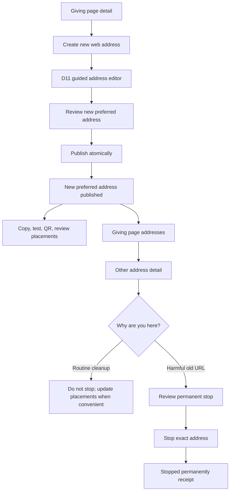

# Phase 24 D12 — Direct Giving Address Continuity Adversarial UX Review

> **Status:** Completed `/grill-with-docs` decision evidence for D12. This is
> not a Phase 24 PRD, OpenSpec change, implementation plan, migration
> authorization, or ticket specification.
>
> **Founder choice:** Option 1. When staff create a new preferred URL for the
> same Site and Giving purpose, older eligible URLs keep opening that same
> Giving page by default.
>
> **Review date:** 2026-08-26

> **Phase 24 D57 origin amendment (2026-08-30):** references below to a fixed
> donor-visible Asym checkout/result/protected-action origin are superseded for
> Tenant-scoped donor journeys. The scanner-resistant protocol remains exact,
> but its frozen code-owned origin is the current verified Tenant Donor Portal
> Host at issuance. No Site host, request header, return value, or donor-visible
> `asymmetric.al` fallback becomes authority.

## Final disposition

**Accept with required amendments.**

Option 1 is the strongest donor and staff experience. Staff can improve a
Giving address without turning every prior email, bookmark, website, or printed
QR code into an urgent repair project. The new address becomes **Preferred for
sharing**; every eligible nonpreferred address is plainly shown as **Other
address · Page opens** and continues serving directly through its own immutable
allocation. Nothing redirects, repoints, falls back, or changes financial
identity.

The unamended answer is incomplete because “keep the old URL working” does not
say what preferred means, how staff understand multiple links, how search and
analytics avoid duplicate confusion, how a harmful old address stops, or how
the system proves that stop without affecting existing gifts. The corrected
decision adds one calm address inventory, a two-step replacement flow, honest
advisory activity, a separately authorized irreversible stop path, durable
receipts, and exact public/runtime safeguards.

No current comparable product documents Core's exact combination of several
direct live Giving URLs, one preferred-sharing head, no Giving redirect, and
irreversible terminal stop. Stripe permits link reactivation; Givebutter keeps
a mutable QR destination while changed URLs break; Blackbaud breaks old custom
links; WordPress redirects; Shopify and Webflow manage redirects. Their UX
patterns are evidence, not product authority. Direct same-meaning continuity is
a deliberate Core product judgment required by D9–D11.

In plain language:

- one link is the obvious one to use now;
- older links keep working without sending donors somewhere else;
- staff are not forced to hunt every old copy immediately;
- Core shows what it knows and admits what it cannot know;
- stopping is exceptional, exact, permanent, and separately reviewed; and
- URLs never own Giving purpose or money identity.

## Evidence labels

- **Repository fact** — accepted ADR/OpenSpec/PRD or a founder-ratified Phase
  24 decision in this grooming record.
- **Current behavior** — code/schema on `develop`; migration evidence, not
  permanent product authority.
- **Proposed evidence** — open, unmerged Phase 22/23 work; informative, not
  governing.
- **External fact** — current official standard, design-system, or vendor
  documentation.
- **Product judgment** — a deliberate Core choice inferred from evidence.
- **Assumption** — a claim that requires representative staff or production
  proof.

## Staff jobs to be done

### Primary job

> When I need a clearer Giving URL, help me create it without breaking links
> already shared, and make it unmistakable which URL I should use from now on.

### Exceptional safety job

> When an older URL itself is unsafe or misleading, help the right person stop
> exactly that URL permanently, understand who may be affected, and prove what
> happened without disturbing gifts or other links.

### Operational assurance job

> When I review Giving links, show their real status, known Core placements,
> and fresh aggregate activity without pretending Core can find every printed,
> forwarded, bookmarked, or externally managed copy.

The product should teach one mental model: **use the preferred link for new
sharing; other Core addresses still open their pages; stop only when continuing
the exact address is itself harmful.**

## Corrected D12 decision — normative language

These clauses replace the provisional D12 wording and MUST flow into the Phase
24 PRD, reconciled ADRs, OpenSpec scenarios, design, implementation tickets,
tests, and release evidence.

### D12-R1 — Direct same-meaning continuity is the default

When a replacement address is successfully issued for the same immutable
public-entry meaning, every prior eligible issued/current address MUST remain
issued/current by default and MUST resolve directly through its own immutable
allocation.

Core MUST NOT emit an HTTP redirect, `Location` header, rewrite, meta refresh,
client navigation, preferred-head traversal, successor lookup, fallback, or
choice page. The browser location remains the address the donor opened. The
donor sees the normal current Giving page, not an “old link” banner.

### D12-R2 — Same meaning is structural, never inferred

Continuity requires the same immutable Tenant, originating environment,
original Site attribution context, locale-route meaning, Giving entry,
Designation/donor task, route kind, and original D10 owner scope. The server
derives those facts from trusted records; caller input cannot assert
`same_meaning=true`.

Matching title, slug, Page, story, campaign label, current content, analytics,
staff claim, AI similarity, amount, cadence, Source Code, current Legal Entity,
Stripe account, Settlement Account Binding, currency, bank, settlement,
receipt issuer, or accounting configuration neither proves nor disproves route
continuity. Those source owners independently revalidate their current facts.

### D12-R3 — Preferred is staff guidance, never route authority

At most one issued/current address is **Preferred for sharing** per exact
Tenant × environment × Site × locale × Giving-entry scope. Preferred status
controls the address Core presents for new staff Copy/Share/QR actions and new
Core-generated Giving links. It MUST NOT participate in resolution of an
already issued literal address, alter historical attribution, mutate a short-
link destination, or select Giving or financial identity.

Changing or clearing preference MUST NOT start, stop, redirect, or reinterpret
any address. If the preferred address becomes unavailable or terminal through
another owner, Core clears the head and shows one repair action; it never
silently chooses an older address. How already-published Core-managed website
placements converge to a new preference is D13, not an implicit D12 side
effect.

### D12-R4 — Replacement creates one address and changes only preference

Issuing replacement B while A is preferred MUST atomically:

- create B as issued/current under D10/D11;
- make B Preferred for sharing in the exact owner scope;
- leave A issued/current and nonpreferred; and
- leave every other address allocation and lifecycle unchanged.

Failure before commit leaves A preferred and creates no B allocation. A lost
response after commit returns B's original durable receipt and cannot allocate
C. Successive replacements may leave A and B working while C is preferred.

### D12-R5 — Every working address validates independently

Each public request resolves the requested address's own allocation to the
immutable Giving entry, then revalidates current host, Site, route, lifecycle,
Phase 10 safety, and Giving-entry presentation eligibility before favorable
page rendering. Legal Entity, Stripe, Settlement Account Binding, currency,
bank, Designation eligibility, and other financial facts are revalidated only
at their owning CTA, checkout-admission, payment, or mutation boundary. Their
failure may disable new Giving through that owner's explicit UX, but it cannot
remap the address or suppress otherwise eligible Site presentation.

A donor opening an earlier working address sees the same current organization,
Giving purpose, and donor task directly at that address. A Core-owned public
Share control MAY offer the preferred address for a new share after the
requested route has already resolved; native browser copying naturally retains
the opened address. Neither behavior changes route authority.

If Giving pages are indexable under a separately approved search policy, the
search owner MAY emit an absolute same-language `rel="canonical"` from an older
working address to the preferred address, self-canonicalize the preferred
address, and list only preferred addresses in sitemaps. This is search metadata,
not navigation or authorization. When no eligible preferred address exists,
the search projection MUST NOT invent one.

### D12-R6 — Serving state and sharing preference stay separate

D12 adds no fifth address lifecycle state. D10's four-state shape remains
authoritative, but its R4/R6 admission wording requires explicit reconciliation
with D7-R17 and this D12 decision:

1. candidate;
2. issued/current — the exact route may resolve and its eligible Site/Giving
   presentation may render;
3. issued/unavailable — a reversible route, host, Site-presentation, or safety
   owner cannot currently serve that address; and
4. issued/terminal.

A Giving, Designation, Stripe, settlement, currency, bank, or other financial-
admission failure alone MUST NOT move an otherwise presentation-eligible
address to issued/unavailable. Its page remains issued/current and renders the
D7 owner-provided state such as **New online gifts are temporarily unavailable
here**, with no enabled new-gift CTA or checkout. The later `/to-prd` package
MUST carry this later D12 clarification of D10-R4/R6 into the governing
PRD/ADR/OpenSpec so address presentation and new-gift admission cannot be
implemented as one state.

**Preferred for sharing**, **Other address**, and **Page opens** are
preference/read-model labels. Valid transitions are candidate B to
issued/current plus preferred A to B; current to unavailable and back for the
same meaning through its owner; current or unavailable to terminal through a
governed terminal owner; and no transition out of terminal.

### D12-R7 — Ordinary address stop is narrow and terminal

**Stop this address** is a Giving-owned transition for exactly one nonpreferred
issued/current or issued/unavailable address. The ordinary action
is eligible only while another issued/current preferred address exists in the
same exact owner scope. It transitions the target to issued/terminal and has no
resume, undo, release, transfer, reuse, or correction-to-current path.

The command accepts one opaque address identity, expected lifecycle head,
expected preferred head, a closed reason code, the conditionally allowed
bounded explanation or opaque evidence identity, and a semantic idempotency
key. Actor, Tenant, environment, Site, locale, Giving entry, owner meaning,
capability, assurance, time, and cause are server-derived; the server resolves
and validates every optional record/reference before commit.

The ordinary command cannot target the preferred or sole current address. Staff
must first create or explicitly select another eligible preferred address. A
separately governed privacy/safety owner may immediately make any unsafe route
unavailable; Site retirement and emergency containment remain their own
contracts and are never delayed by this ordinary UX.

### D12-R8 — Stop atomically closes authoritative address routes

The stop transaction seals one bounded authoritative manifest containing the
exact canonical allocation and every router-equivalent Core address/head whose
authority is stored in the same operational route transaction. Those heads
become adverse atomically or none does. The same transaction records exact
dependent-address identities and durable effect intents; it never claims that
CMS/email placements, QR files, embeds, search, analytics, or other rendered or
materialized references changed atomically.

Those non-authoritative references may continue carrying the now-terminal
literal address, which safely returns D9's neutral `404`, and reconcile through
the outbox or the separately decided D13 owner boundary. An issued
`/s/<token>` remains immutable and MUST NOT repoint: its resolver must observe
the terminal target before any favorable result, or its route head may become
adverse in the same transaction only when that authority is truly co-located.

Query and fragment variants are already covered by the stopped host-and-path
identity. Site-addressed browser, data, and mutation derivatives whose
favorable authority begins with the stopped address observe the same terminal
fence. Shared signed provider callbacks/webhooks, independently addressed
Donor Portal routes and provider reconciliation endpoints are outside the
closure. Two distinct Giving/payment-owned route purposes are also created only
after durable admission:

1. **Admitted-operation provider handoff** may navigate only to the exact
   source-frozen provider target after operation/session proof. It cannot accept
   a caller return target, choose a preferred/stopped address, or create another
   admission.
2. **Admitted-operation result reader** is read-only and structurally
   nonredirectable. It reports only that exact operation under R9 and can never
   create/repeat payment or render a Giving address.

Those routes, callbacks, and reconciliation may complete, reconcile, or show
truth for exactly already-admitted work but MUST reject any attempt to derive a
new Site-public admission, gift, or mutable presentation from the stopped
address. D9's no-Giving-redirect invariant remains intact; the typed provider
handoff is not a successor/fallback route for public Giving intent. A
deliberately different localized address is a separate allocation.

Core does not claim control over external DNS, external shorteners, or
provider-hosted URLs.

### D12-R9 — Stop changes no financial or donor history

Stopping an address creates no checkout, cancellation, refund, re-designation,
transfer, recurring-commitment change, Source Code rewrite, receipt/statement
change, provider mutation, ledger posting, accounting effect, or Donor Portal
change. It neither compares nor changes Legal Entity, Stripe, Settlement
Account Binding, currency, bank, settlement, receipt issuer, or accounting
identity.

A page response transmitted before stop cannot be recalled, but every public
checkout/payment-creation mutation revalidates the exact address head. Work not
durably admitted before terminal commit has zero new provider/contribution
effect. Already admitted durable work and existing gifts/recurring commitments
continue only through their independent owner contracts.

At durable checkout admission, the checkout/payment owner MUST freeze a
separate opaque operation identity and typed result purpose that does not depend
on the Issued Giving Address or Preferred head. Guest protected-result access
MUST treat [ADR-0025: Producer-owned protected actions](../../adr/0025-producer-owned-protected-actions.md)
(the **Protected Actions ADR**) and
[ADR-0037: Scanner-resistant exact-artifact access](../../adr/0037-scanner-safe-exact-artifact-access.md)
(the **Scanner-resistant Access ADR**) as the mandatory transport/security
floor; D12 creates no bearer URL or weaker token transport.

That floor does not silently widen the Protected Actions ADR's accepted exact
Party/contact authority. Before activation, Phase 13/D12 MUST ratify a separate
Tenant-scoped admitted-operation result authority whose subject is the exact
opaque operation/session and whose contract defines issuance, environment/
provider-mode scope, disclosure, expiry, revocation, recovery, and audit. If an
implementation instead claims direct Protected Actions ADR authority, it MUST
prove the exact Party/contact. An anonymous operation cannot invent one.

Phase 13 reconciliation MUST choose and qualify one code-owned allowlisted Asym
first-party operation/result origin per deployment environment and provider
mode (or an equally proved partition). Host/Forwarded headers, Tenant content,
and caller/provider return parameters never select it; production rejects every
staging/test selector, session, cookie, return, and livemode mismatch. D12 does
not assume a host-only cookie can cross from a Tenant custom domain. For
redirect-method payments, after durable admission and before provider handoff,
the browser makes a top-level navigation through that Asym operation doorway.
Its Scanner-resistant Access ADR selector+fragment landing and deliberate same-
origin `POST` establish the host-only result session, then the
provider receives only an inert non-secret operation selector and returns to
the same Asym origin. For nonredirect methods, confirmation navigates to that
same operation doorway after admission. This is an admitted-operation flow,
never a redirect/fallback from an old or preferred Giving address.

The recommended UX is to move the donor to that fixed Asym checkout/result
origin before payment entry, preserve the operation-frozen safe ministry/
Giving context and locale, and let the donor's normal same-origin **Confirm
gift** action bind the admitted result session. That avoids a surprise post-
submit interstitial, duplicate confirmation, forced login, or unexplained
domain hop. If Phase 13 retains a custom-domain checkout, it must instead show
one explicit code-owned **Continue to secure payment** handoff before sensitive
entry/provider redirect, preserve all entered server-owned state, and still use
the deliberate Scanner-resistant Access ADR exchange; security is never
weakened to save a click.

No cross-origin/third-party cookie bootstrap is allowed. Until custom domains,
shared hosts, SameSite behavior, supported provider webviews, blocked/lost
cookies, back/reload, DNS departure, and provider-return URL inspection prove
this exact flow, every address-terminal writer remains blocked. Without the
result session, `GET`/`HEAD` and the inert selector disclose nothing and offer
only the Scanner-resistant Access ADR protected recovery or authenticated Donor
Portal path.

Protected-link reissue is available only when checkout/communication owners
already prove a permitted destination and current contact authority. It never
infers an email/Party, requires account creation, or widens transactional/
marketing consent. A guest without such authority receives only a
nonrevealing operation reference and support-owned recovery path; support must
reauthorize independently and cannot enumerate the operation.

The session cookie contains only a random server-side ID, is `Secure`,
`HttpOnly`, `SameSite=Lax`, host-only because `Domain` is omitted, and bound to
the exact result path/purpose. Server state binds environment, Tenant,
provider mode, operation, selector/verifier versions where used, expiry, and
revocation; the session cannot outlive its authority.

Any protected recovery link uses the fixed trusted code-owned URL on the Tenant
Donor Portal Host frozen at issuance, with a non-secret selector in the HTTP URL
and an independent 256-bit verifier in the fragment;
the server stores only its versioned HMAC/digest. A minimal first-party, third-
party-free landing removes the fragment from browser-visible history and sends
it only through a deliberate same-origin, CSRF-protected `POST`. No verifier may
enter provider return URLs, paths, queries, redirects, logs, traces, analytics,
referrers, communication history, support tools, or storage URLs. `GET`, `HEAD`,
previews, crawlers, scanners, selector-only, and failed-verifier requests are
inert, non-enumerating, and create no session or result disclosure.

Every landing, exchange, error, session, and result response sets the Scanner-
resistant Access ADR's exact headers:

- `Cache-Control: private, no-store, no-transform, max-age=0`;
- `CDN-Cache-Control: no-store`;
- `Vercel-CDN-Cache-Control: no-store`; and
- `Referrer-Policy: no-referrer` plus the strict first-party CSP.

No third party, service worker, stale cache, or optimizer may handle it.
Purpose/rail-owned grant and session expiry/recovery cannot abandon an admitted
operation before its supported finality/reconciliation window.
Expiry, verifier compromise, or session loss never reopens the stopped address,
changes/repeats payment, or grants another operation.

Once independently authorized, the route exposes only the exact operation's
source-proved status: pending, successful, terminally failed, or
`outcome_unknown`/reconciling under ADR-0015, plus an authenticated receipt
handoff only when eligible. **Checking payment status** shows the last checked
time and one refresh/support path; it never says failed, offers **Give again**,
or permits another payment while unresolved. Only source-proved terminal
failure uses **Payment failed**. The read-only result reader offers no retry or
new-payment action. Any retry is a separately authorized payment-owner route/
command outside D12 that must first be ratified by Phase 13 and structurally
prove no duplicate gift/economic effect; until then, retry is omitted.

The truthful result is visible without account creation. Only after a source-
proved successful gift/commitment result may an independently identity-owned,
optional sign-in/account/Donor Portal handoff appear. It is never required to
see confirmation, offers no new-gift action, does not inherit or render the
stopped address/Site page, and revalidates its own Tenant, identity, privacy,
and authorization contract.

After an address stop, that route may show only the exact admitted operation's
truthful state. It cannot render or redirect through the stopped Site address,
create or repeat a gift, choose another Designation/financial owner, or become a
shareable Giving entry. Provider returns, retries, and duplicate or out-of-
order webhooks reconcile idempotently to one durable business effect.

### D12-R10 — Source ownership remains singular

The shared typed route authority owns immutable allocations, route/lifecycle
versions and heads, terminal facts, preferred head integrity, and public
lookup. Giving owns entry meaning, route manifest, admission, replacement, and
ordinary stop. Domain owns current host proof; Site owns presentation and
attribution; locale owns admitted locale route forms; Phase 10 owns public-
safety decisions; public delivery owns Site rendering/caches; the checkout/
payment owner owns each admitted operation, its exact frozen provider handoff,
and protected result reader; Identity/Donor Portal owns any optional post-result
account handoff; financial owners own money effects.

CMS, Next.js, Vercel/CDN, Stripe, QR files, email, search, analytics, browser
state, and UI are projections, effects, or evidence only. None can redirect,
reactivate, stop, repoint, or reinterpret a Giving address.

### D12-R11 — Authorization is explicit and server-derived

Only one explicit capability-gated Tenant-human command may perform an ordinary
address stop. A less-privileged user sees **Request address stop**, which
creates one owner-routed review without changing public behavior. An AI
assistant may explain or prepare the review only within the initiating user's
scope; the authorized human performs the final effect.

A separate capability-gated Tenant-human **Make preferred for sharing** command
may select only one issued/current address in the same exact preference scope.
It accepts an opaque address identity, expected preferred and address heads,
and a semantic idempotency key. The server derives Tenant, environment, Site,
locale, Giving entry, actor, capability, assurance, time, and cause. The
transaction compare-and-sets the preferred head and appends its audit, durable
receipt, and outbox. An identical semantic retry returns that receipt;
cross-scope, unavailable, terminal, stale-head, support, worker/import, or AI-
executed attempts have zero effect. Preference changes never change any address
lifecycle or public resolution.

Every issuance, replacement, preference, and stop receipt uses an opaque
non-enumerable identity and is private, `no-store`. Each read revalidates active
Tenant membership and current capabilities, projects only role-appropriate
fields, applies revocation immediately, and reveals no cross-Tenant existence.
A copied receipt URL is never authorization.

No ambient support role, super-admin label, provider, plugin, import, bulk
action, schedule, timer, traffic rule, worker, or autonomous agent may stop an
address. A separately governed break-glass safety path remains outside D12 and
retains its own evidence and review.

### D12-R12 — Database and RLS make invalid states impossible

The permanent schema MUST enforce:

- globally unique immutable D10 address allocations;
- several issued/current addresses for one exact Giving meaning;
- one compare-and-set lifecycle head per allocation;
- at most one preferred head referencing issued/current within the exact
  Tenant/environment/Site/locale/Giving-entry scope;
- immutable Tenant, environment, Site attribution, locale route, Giving entry,
  Designation/donor task, route kind, canonicalizer, and first-issued scope;
- append-only transitions and terminal monotonicity;
- same-scope composite foreign keys and `ON DELETE RESTRICT`;
- equality-leading public lookup, preferred-head, and bounded/keyset owner-
  inventory indexes; and
- no mutable redirect or destination field on a Giving address.

Anonymous/authenticated Data API roles have no direct mutation grant.
Immutable allocation, transition, receipt, and audit facts expose no direct
update/delete policy. Applicable tables enable and force RLS; mutable heads use
operation-appropriate `USING`/`WITH CHECK`, but only the trusted command may
mutate them. Owner, service-role, `BYPASSRLS`, support, worker/import, view/RPC,
and `SECURITY DEFINER` poison tests repeat every invariant.

### D12-R13 — Replacement, preference, and stop are concurrent and idempotent

The stop transaction compare-and-sets the exact allocation lifecycle,
preference head, and only the Site/host/locale/route/safety generations whose
change would alter the reviewed target, Core-control consequence, or terminal
eligibility, using one documented route-owner lock order. Replacement,
preference change, safety disposition, host rebind, Site retirement, duplicate
stop, and checkout admission produce one declared valid result. Stricter
terminal Site/safety facts win.

D7 Giving pause/resume and financial-owner changes do not participate in the
stop transaction and do not stale or block it; they commute because they own
new-gift admission, not address identity. Checkout admission independently
reads/locks the exact address head together with current D7, Designation, and
financial heads. A terminal address prevents any not-yet-durable new admission;
an admission already durably won continues only under its independent owner
contract. No cross-owner global lock or distributed transaction is permitted.

D7 Site Serving Suspension may suppress Site-owned presentation but MUST NOT
intercept the independently addressed admitted-operation provider-handoff or
result-reader routes. It commutes with already-admitted completion/result. For
any legacy Site-qualified return/result route, the scope's website-offline
reader/writer must first deploy an exact admitted-operation-only carve-out ahead
of the Site gate, or remain behind the same source-proved migration/old-return-
expiry fence as terminal writers. The carve-out exposes no Site content and has
zero new-public-admission authority.

One short transaction with no network call appends terminal transition and
closed reason, creates any supplied validated optional-note record or exact
durable reference, advances lifecycle/head effects, records audit/receipt, and
writes the outbox. Failure to persist that supplied note/reference before
commit changes nothing. Later authorized correction, redaction, hold, or
disposal of the private note never changes terminal enforcement. Same
idempotency key and meaning return the original receipt. Reusing the key for
another address, owner scope, expected head, reason, normalized initial note,
added/removed/swapped evidence reference, or command meaning conflicts with zero
effect. Later note correction, redaction, hold, or disposal is a separate
authorized append-only display-record command, never a replay of Stop. A
concurrent preference change makes an ordinary stop stale and terminalizes
nothing. The standalone preference command uses the same lock order, short
local transaction, semantic idempotency, audit/receipt/outbox, and expected-head
discipline; reusing its key for a different target or meaning conflicts and
changes no head.

### D12-R14 — Failure, caches, and derived effects cannot lie

After terminal commit, every favorable route decision observes the terminal
head before static redirect, cache, CMS, or checkout behavior. A confirmed
terminal address receives D9's neutral no-store `404`; unknown, corrupt,
divergent, timed-out, or outcome-unknown authority receives D10's neutral no-
store `503` with `Retry-After` when known. Reversible owner unavailability
follows that owner's contract.

Cache purge, Core-placement inventory, search/canonical metadata, analytics,
and other declared projections retry through the outbox. Existing QR files,
sent email, printed material, and external copies are not rewritten; their
literal terminal address returns `404` whenever its domain routes through
Core. External/unknown routing is never reported as a Core-controlled public
result. Failure cannot reverse stop, change preference, or let an authoritative
Core reader serve stale positive content. A lost stop response shows **Checking
result** and reads the durable receipt/head; it never guesses **Stopped** or
sends a second semantic command.

### D12-R15 — Staff receive one quiet address inventory

The primary surface lives on the Giving-entry detail under **Giving page
addresses**. It shows one spacious preferred card, then groups **Other
addresses · Pages open**, **Temporarily unavailable in Core**, and **Stopped
permanently in Core**. The ordinary journey does not begin in a global routing
console.

Each current public item shows its complete safely rendered URL to an authorized
address manager, plus Site/locale, plain-text status, first-published date,
authorized aggregate activity/freshness, known Core placement count, and
context-specific actions. Safety-restricted, unavailable, and stopped history
uses the source owner's current safe/redacted display by default. Full host/path
reveal requires a named need-to-know capability and a current retention/use
basis; disposed display data becomes a masked stable reference, never an
inferred reconstruction.

Redaction/disposal never changes the privacy-minimized collision key,
allocation, terminal enforcement, or non-reuse. Inventory, receipts, exports,
search, audit projections, backups/restores, and screen-reader text follow the
same display policy. Preferred appears first; other page-opening addresses sort
newest to oldest; unavailable and stopped are visually separated. Small groups
render as cards; larger inventories use the shared responsive table/card view
with keyset pagination. A role-gated Site-wide inventory may add search/filter/
export, but never bulk stop.

Staff-facing states are exactly:

- **Preferred for sharing · Page opens**;
- **Other address · Page opens**;
- **Temporarily unavailable in Core**; and
- **Stopped permanently in Core**.

For a temporarily unavailable address with fresh Core-routing proof, Core shows
the cause-owned observed unavailable result. With external or unknown routing,
it says **Unavailable in Core · Current public result not controlled by Core**
and offers the domain action. For a stopped address, the observed substatus is
**Core returns Page not found** only with fresh Core-routing proof; otherwise it
uses the same public-control warning. Cards, tables, mobile views, exports, and
screen-reader text preserve these distinctions.

Address status never absorbs Giving or payment readiness. When new gifts are
not currently available, a separate source-owned status such as **New gifts
unavailable** appears with its cause-appropriate explanation and next action.
It does not change **Page opens**, preference, or route identity.

Avoid **active**, **legacy**, **canonical**, **archived**, and **redirected** in
the primary UI because each implies the wrong lifecycle.

### D12-R16 — Replacement is a short, confidence-building journey

The preferred card exposes **Create new web address** as a secondary action.
Before the D11 address editor, Core says:

> Publishing this new address will not stop your current Core address. Emails,
> bookmarks, and QR codes that point directly to it will still open the same
> Giving page after this change. The new address will become Preferred for
> sharing. Nothing redirects, existing gifts or recurring gifts do not change,
> and other safety, availability, and domain controls still apply.

The final review shows the new complete address, the earlier preferred address,
their resulting labels, exact Site/locale/Giving purpose, donor preview, and
financial/history non-effects. This behavior is the default, not another radio
question or checkbox.

After commit, a persistent receipt says **New preferred address published**,
shows **Use this address for new sharing**, and provides **Copy preferred
address**, **Test as donor**, **Download QR**, **View all addresses**, and
**Review places to update**. It also says how many prior addresses continue
opening this page. Cleanup is framed as convenient, not urgent: Core-managed
and external copies are clearly distinguished.

### D12-R17 — Permanent stop is consequence-first, not frightening theater

**Stop this address** is not a primary row button. It lives in a nonpreferred
address's detail under a separated permanent-action section. The first action
is **Review permanent stop**. The dedicated full-page review—not a cramped
popover—shows:

- exact full URL, Site, locale, and public Giving purpose only when the
  authorized stopper also has the current need-to-know display capability;
  otherwise the review uses the source-owned safe/redacted label and opaque
  stable reference without reconstructing disposed text;
- actual Core status: **Other address · Page opens** or **Temporarily
  unavailable in Core**, plus the conditional observed-public-result status,
  authorized cause, and freshness when those details may be disclosed;
- the preferred address whose page remains open;
- a summarized router-equivalent/dependent-link count and an expandable or
  linked, accessible grouped inventory of every known Core placement, showing
  owning surface, placement name, link type, and current status;
- a separate **Known external/provider links · Not controlled by this action**
  group showing the source owner, last-proved status/freshness, and cause-owned
  review action for each inventoried link; unknown/stale proof is labeled and
  an empty inventory never claims no external link exists;
- honest recent activity with freshness when available;
- the neutral Core-controlled Page-not-found donor preview and the current
  domain-control limit;
- irreversibility and external-copy uncertainty; and
- zero effect on gifts, recurring commitments, receipts, and financial history.

The review requires one bounded reason:

- **Privacy or safety concern**;
- **Address wording could mislead donors**;
- **Address was published by mistake**; or
- **Other serious reason** — requires a non-sensitive explanation or an
  authorized safe evidence reference.

The closed reason code and minimum terminal evidence remain immutable under
their route/audit Records Schedule Contract. A private explanation is optional
for the first three reasons and required when **Other serious reason** lacks a
safe evidence reference. It is a separate record owned by Giving's records
owner and bound to a purpose-specific Records Schedule Contract with least-
privilege access, correction, redaction, verified disposal, recovery, and hold
behavior.

That explanation is server-validated plain text only: at most 500 Unicode
scalar values and 2,000 UTF-8 bytes, no HTML, Markdown, embeds, attachments, or
executable links, and no disallowed control/bidirectional-format characters
under the shared text-safety contract. It renders escaped and non-linkified.
Oversize/invalid input is rejected inline, preserved for correction, and never
partially stored. The UI warns against donor or sensitive ministry data;
privacy/safety cases prefer a separately governed safe evidence reference over
narrative. Explanation correction, redaction, or disposal never changes
terminal enforcement. No typed URL, ritual checkbox, generic two-person
approval, or analytics threshold substitutes for authorization and review.

A safe evidence reference accepts only one opaque source-owned evidence ID.
The server resolves its current Tenant/scope, visibility, permitted evidence
class, and reader capability, then stores a same-scope foreign key or immutable
minimum reference snapshot under that owner's contract. Caller URLs, labels,
cross-Tenant IDs, deleted/inaccessible evidence, and reference swapping are
rejected. The stop receipt never exposes the target or its label without the
evidence owner's separate read capability.

On full-page navigation, focus moves to the page heading/main region so the
consequences are read before the controls. The safe action is **Do not stop
this address**. The final warning action, **Stop address permanently**, remains
operable so it is discoverable; submitting without a reason preserves the
review and shows an inline error plus a focused error summary. The command
cannot double-submit. Returning from the known-placement inventory preserves
the entire review; staff may inspect every known placement without being
forced to open each item.

For an unavailable route the review says: **This address is temporarily
unavailable now. Stopping it makes Core's Page-not-found result permanent.**
For either state it says: **While this domain routes through Core, people
opening this address will see Page not found. Core cannot control what this URL
shows while DNS, an external host, or an external shortener routes elsewhere;
the permanent block applies whenever it routes through Core.** It also says
that a person who loaded the page before stop but has not passed Core's durable
checkout-admission boundary may be unable to start a new gift. Already admitted
payment work, completed gifts, recurring commitments, receipts, and financial
history remain independently governed and unchanged. An admitted donor returns
to that operation's separate truthful result page, not the stopped Giving
address.

After commit, a persistent result says **Address stopped permanently** and
separates the recorded terminal fact from the observed public result. It shows
effective time, durable reference, unchanged preferred link, and unresolved
derived work; role-authorized projections add actor, reason, evidence/note, and
placement detail. It repeats that known provider-hosted/external links were not
stopped or mutated and links to their independent owner. With fresh
proof that the domain routes through Core,
it says **Core is returning Page not found now** and offers **Test public
result**. With external or unknown routing it says Core cannot verify/control
the current public response and offers the cause-owned domain action instead.
It offers no Undo, Reactivate, Redirect, or Reuse action.

Every terminal receipt has an opaque nonenumerable identity and is private,
`no-store`. Every read revalidates active Tenant membership and current
capabilities; revocation applies immediately. A basic authorized address viewer
sees only route status, observed-result qualification, preferred survivor, and
non-effects. Actor, reason, evidence/private-note, activity, and placement
details each require their named capability and role-safe projection. Full
host/path text additionally requires the current need-to-know display capability
and retention basis; otherwise the receipt uses the safe/redacted label. A
copied receipt URL never widens access or reveals whether another Tenant's
receipt exists.

### D12-R18 — Attribution and activity inform; they never authorize

At public admission Core freezes the opaque Issued Giving Address identity and
address generation separately from Site, entry method, Source Code,
Designation, and financial facts. Authorized reports may aggregate across the
Giving entry and may show privacy-minimized per-address request, checkout-start,
and completed-gift counts when those facts are source-proved and role-allowed.
They MUST NOT double-count a contribution or rewrite its original address
attribution when preference changes.

The ordinary inventory shows at most a clear time window, last recorded public
request, data freshness, and known Core placements. It says:

> Requests are not unique donors and may include bots, previews, or repeated
> visits. Core cannot discover every printed, forwarded, bookmarked, or
> externally managed copy. No recent activity does not prove this address is
> unused.

Unknown, delayed, unsupported, or unauthorized analytics show **Activity
unavailable**, never zero. Raw query, donor identity, IP, user agent, full
referrer, gift amount, and cross-Tenant history do not appear. Usage never
automatically preserves, stops, redirects, or ranks an address, and the UI never
shows **Safe to stop**.

### D12-R19 — Accessible visual quality is a release gate

The experience uses Core's existing Base UI `base-maia` system and Zinc
semantic tokens: quiet neutral surfaces, one clear primary action, a restrained
accent for Preferred, neutral outlined Page opens, cause-owned unavailable,
and destructive color only on the final Stop action. Status never depends on
color. There is no confetti, glass treatment, novelty motion, or dense routing
dashboard.

URLs use a readable identifier treatment, `translate="no"`, bidirectional
isolation, safe wrapping, and one programmatically associated complete value.
Copy actions announce concise success without replacing the visible value.
Controls meet Core touch-target tokens; body text remains at least 16 CSS
pixels on mobile; layouts reflow at 320 CSS pixels and 200%/400% zoom without
horizontal scrolling. Mobile cards stack actions; destructive action remains
visually separated.

Native semantics and shared Base UI primitives own buttons, menus, status,
dialogs, and tables. Keyboard order matches reading order; focus is visible;
full-page review begins at its heading/main region rather than either action;
async states use polite announcements; errors preserve input; sticky
regions never cover focus; reduced motion is respected. Loading, empty,
permission-request, stale-data, service-unavailable, stale-command, unknown-
outcome, and success states all have one clear next action.

The Scanner-resistant Access ADR's tiny first-party fragment-exchange script is
the intentional no-JS
exception. If JavaScript is unavailable or blocked, the protected landing shows
no operation/result fact and offers one safe authenticated or protected-link
reissue recovery action; it never falls back to a path/query secret or weakens
the transport. The result/recovery journey uses the operation-frozen safe
locale with an approved fallback, supports RTL, screen readers, mobile and low
bandwidth, and explicitly handles supported provider-return webviews, fragment
preservation, blocked/lost cookies, expired sessions, and recovery.

Initial doorway UX budgets are explicit Core product judgments: added Asym
handoff p95 at most 2 seconds and p99 at most 4 seconds under the qualified
mobile/low-bandwidth profile; handoff-specific technical failure below 0.1%;
and no more than a 1 percentage-point absolute abandonment increase versus the
matched prior checkout step with 95% confidence after at least 2,000 eligible
sessions. Before that sample, rollout remains bounded and representative donor
usability must pass. Missing any budget blocks terminal-writer expansion; it
never weakens the Scanner-resistant Access ADR.

### D12-R20 — Migration, reconciliation, and non-goals are explicit

Before D12 writers activate, Core MUST inventory and evidence-classify current
`/give`, `/donate`, `/checkout`, `/missionary/...`, `/s/...`, CMS routes,
redirects, QR/exported links, aliases, locales, and provider links. Backfill
only proved immutable direct-address meaning; quarantine redirects, mutable
destinations, newest-row ambiguity, and inferred sameness. Deploy current/
terminal readers and cache fences before preferred or stop writers; enable
replacement, inventory, and Stop in that order behind scoped kill switches.

The shared admitted-operation result reader/session and Scanner-resistant
Access ADR recovery MUST precede **every** writer that can terminalize an Issued
Giving Address, including D8 Site retirement, D12 ordinary stop, and Phase 10/
safety terminal owners. A per-scope activation fence proves every potentially in-flight pre-
seam admitted operation is in the affected cohort whenever its payment is
unresolved **or any old browser/provider return or confirmation path remains
valid or replayable**. A terminal writer may activate only after each cohort
member has a source-proved exact result identity/session migration, or the
payment is final with truthful durable receipt access **and** every old return
path is source-proved retired/expired beyond its rail/provider maximum replay
window. Ambiguity blocks the terminal writer; Core never infers or backfills an
operation from a public URL. Rollback preserves the result reader/session until
every bound operation and return window satisfies that fence even if new
terminal writers/UI are disabled.

The same inventory classifies every legacy Site-qualified result/return path.
D7 website-offline activation for an affected scope requires the exact
admitted-operation-only carve-out ahead of Site suspension or the same proved
migration/expiry fence. Site Serving Suspension never suppresses the fixed
Asym operation routes and never widens their authority.

D12 adds no redirect, timer, scheduled stop, bulk stop, wildcard/pattern rule,
traffic-based auto-stop, “safe to stop” score, homepage/successor fallback,
public choice page, mutable short link, external crawler, provider mutation,
URL marketplace, alias-graph engine, generic workflow engine, or financial
identity.

Before implementation, the reconciled package MUST narrow Phase 5's CMS
redirect ownership, replace Phase 13's mutable `/s/<token>` behavior, preserve
Phase 22 Page Giving Binding without making Page routes own Giving addresses,
keep Phase 23 automatic `308` continuity ordinary-Page-only, reconcile D10-R11
to operation-appropriate RLS wording, carry D10's later D12 route/presentation-
versus-admission clarification into every governing artifact, refine D9-R7's
route-purpose registry with distinct exact-target admitted-operation provider-
handoff and nonredirectable result-reader routes, preserve Phase 13's optional
account offer only as a separately identity-owned
post-result handoff, and require the checkout/payment owner to provide that
opaque result seam before terminal stop can activate. Merge or explicitly
supersede open PRs #1323/#1340. Rollback may disable new writers/UI but never
removes terminal facts, reactivates stopped addresses, or restores a mutable
Giving redirect.

## Complete staff journey



The wireframes below assume an authorized address manager and non-sensitive
display metadata. When a privacy/safety owner restricts or disposes host/path
text, every surface uses the safe/redacted label and opaque reference required
by D12-R15/R17 instead of revealing or reconstructing the full URL.

### 1. Find the address without hunting through settings

The Giving-entry detail is the primary entry point. Staff see the public
purpose first, then one **Giving page address** card. Site settings may link to
the same manager, but they do not create a second URL system.

```text
Giving page address

Preferred for sharing · Page opens
https://give.hope.org/give/water-project

[Copy link] [Test as donor] [Download QR]

1 other address opens this page
[Manage addresses]                         [Create new web address]
```

The card answers the staff member's first questions without expansion:

- Which link should I use?
- Does it currently work?
- Can I copy or test it now?
- Are there older links I should know about?

No financial configuration, route IDs, canonicalizer versions, or analytics
dashboard competes with the URL.

### 2. Explain replacement before asking for a new name

Selecting **Create new web address** opens a short introduction, not a warning
wall:

> **Create a clearer Giving address**
>
> Publishing this new address will not stop your current Core address. Direct
> emails, bookmarks, and QR codes will still open the same Giving page after
> this change. Your new address will become Preferred for sharing. Existing
> gifts and recurring gifts do not change. Other safety, availability, and
> domain controls still apply.
>
> [Continue] [Cancel]

Staff then enter the D11 guided address editor. No additional “keep old link?”
choice appears; D12 already supplies the safe default.

### 3. Review the exact before-and-after result

```text
Publish a new preferred address?

New address
https://give.hope.org/give/clean-water
Will become: Preferred for sharing

Current address
https://give.hope.org/give/water-project
Will become: Other address · Page opens

Donor result
After this change, both eligible Core addresses open Hope Missions' same
Water Project Giving page directly. There is no redirect. Other current
safety, availability, and domain controls still apply.

Unchanged
Existing gifts, recurring gifts, receipts, Legal Entity, Stripe,
settlement, bank, currency, and accounting history.

[Back]                                      [Publish new address]
```

The review uses a summary-list layout with a full donor preview. **Back** is
easy to reach and receives focus when a dialog implementation is used; the
publish button shows **Publishing…** and prevents duplicate activation while
the request is in flight.

### 4. Confirm success and give useful next actions

```text
New preferred address published

https://give.hope.org/give/clean-water
Use this address for new sharing.

Your previous preferred address still opens the page
https://give.hope.org/give/water-project

Core did not redirect that address or move its Giving meaning.

[Copy preferred address] [Test as donor] [Download QR]
[View all addresses] [Review places to update]
```

This success result is persistent, deep-linkable, and backed by the durable
receipt. A toast may reinforce it but cannot be the only evidence. **Review
places to update** says:

> Update these when convenient. Other Core addresses still open their pages.
> Core knows only about placements it manages; printed and external copies may
> also exist.

Until D13 is decided, the screen does not promise that already-published
Core-managed placements changed automatically.

### 5. Make the inventory understandable at a glance

```text
Giving page addresses
One address is preferred for new sharing. Other addresses can also open this
page.

Preferred for sharing · Page opens
https://give.hope.org/give/clean-water
Published 26 Aug 2026
[Copy] [Test as donor] [Download QR] [More]

Other addresses · Pages open (2)

https://give.hope.org/give/water-project
Published 2 Feb 2025 · Last recorded request 24 Aug 2026
3 known Core placements
[Copy] [Test] [View details]

https://give.hope.org/give/well
Published 9 Jun 2024 · Activity unavailable
0 known Core placements · External copies may still exist
[Copy] [Test] [View details]

Stopped permanently (1)                          [Show]
```

The ordinary screen starts expanded only where the staff member can act.
Stopped history is collapsed but never hidden. Status order and text remain
stable across desktop cards, responsive tables, mobile cards, exports, and
screen readers.

### 6. Keep activity honest

The detail may show:

```text
Address activity
Last recorded public request: 24 Aug 2026, 14:32 ICT
Recorded requests in the last 30 days: 143
Data updated: 7 minutes ago

Requests are not unique donors and may include bots, previews, or repeat visits.
Core cannot find every printed, forwarded, bookmarked, or external copy.
No recent activity does not prove this address is unused.
```

If the user also holds the applicable Giving-reporting permission, an expanded
view may show source-proved checkout-start and completed-gift counts, without
amounts or donor identities. Metrics always name their time window and
freshness. **Activity unavailable** replaces stale, failed, unsupported, or
unauthorized data.

### 7. Keep routine cleanup away from permanent stop

A nonpreferred-address detail first offers ordinary actions: Copy, Test as donor,
Review known placements, and optionally Make preferred for sharing. The
permanent action sits below a visual divider:

```text
Permanent action

Stop this address only if continuing to serve this exact URL could expose
private information, mislead donors, or preserve an address published by
mistake.

If you only want people to use the new address, do not stop this one. Its page
can continue opening.

[Review permanent stop]
```

**Make preferred for sharing** is available only for an eligible issued/current
address. Its short review says that future Core Copy/Share actions will use it
and every other address keeps its donor behavior. It is not styled as
destructive and uses a compare-and-set command.

### 8. Review permanent stop on a dedicated page

```text
Stop this Giving address permanently?

https://give.hope.org/give/water-project
Hope Missions · English · Water Project

While this domain routes through Core, people opening this address, its QR
codes, or linked short addresses will see Page not found. Core will never
serve, redirect, or reuse this address allocation again.

Core cannot control what this URL shows while DNS, an external host, or an
external shortener routes elsewhere. The permanent Core block still applies
whenever the address routes through Core.

Someone who already opened this page but has not passed Core's checkout-
admission boundary may also be unable to start a new gift. Already admitted
payment work is not cancelled and uses its separate checkout-result page.

Preferred address whose page remains open
https://give.hope.org/give/clean-water

Recent Core activity
143 recorded requests in the last 30 days
Last recorded request: 24 Aug 2026, 14:32 ICT

Known in Core
3 placements · 1 generated QR record · 1 immutable short link
[Review known places and links]

Known external/provider links · Not controlled by this action
1 Stripe-hosted link · Last checked 7 minutes ago
[Review in Giving settings]

Core cannot find every printed card, email, bookmark, screenshot,
forwarded message, or external website carrying this link.

This does not change completed gifts, recurring gifts, receipts,
already admitted payment work, or financial history.

Why must this address stop?
( ) Privacy or safety concern
( ) Address wording could mislead donors
( ) Address was published by mistake
( ) Other serious reason
    [Non-sensitive explanation or safe evidence reference]

[Do not stop this address]    [Stop address permanently]
```

The final action remains operable and validates a missing reason on submit with
an inline message and focused error summary. It stays unavailable only while a
fresh authoritative review cannot be loaded, with that cause and next action
explained directly instead of unexplained disabled styling. If the address
became preferred or an authoritative address/lifecycle/Site/host/locale/route/
safety head changed, submission returns to the review with the specific changed
fact and preserves the selected reason. Advisory Core placement or external-
link changes refresh after commit/readback and never block terminality. If the
target is already **Temporarily unavailable in Core**, the review uses that
exact status and explains that stop makes Core's Page-not-found result permanent
whenever the address routes through Core.

### 9. Confirm terminal outcome without offering false recovery

```text
Address stopped permanently

https://give.hope.org/give/water-project
Stopped 26 Aug 2026, 15:12 ICT
Reason: Address wording could mislead donors
Reference: GA-7F42M

Core public result: Page not found
Checked 26 Aug 2026, 15:12 ICT
This Core address cannot be restarted, redirected, or reused.

Preferred address
https://give.hope.org/give/clean-water

[Copy preferred address] [Test public result] [View all addresses]
```

The observed-result lines and **Test public result** appear only with fresh
proof that the domain routes through Core. If routing is external or unknown,
the receipt instead says **Core recorded the permanent block but cannot verify
or control the current public response** and offers **Review domain routing**.

If commit outcome is unknown, the result instead says **We could not yet
confirm whether this address stopped**, warns staff not to repeat the action,
and provides **Check address status**. If a derived cache/search/inventory
effect fails after terminal commit, the receipt says **Stopped · cleanup needs
attention** and links one cause-owned repair; it never suggests the URL still
works.

### 10. Handle different staff permissions cleanly

- A viewer sees status and role-safe activity but no mutation menu.
- An address manager may create replacements, copy/test, and change preference.
- A separately authorized stopper sees **Review permanent stop**.
- Other staff see **Request address stop**, provide the bounded reason, and
  receive a tracked request without changing the URL.
- Support and platform administrators do not gain a hidden restore or transfer
  button.
- An assistant may prepare the review, but the authorized human confirms the
  effect.

No surface shows a disabled admin action with no explanation or leaks a higher
role's hidden data.

## Visual and interaction design direction

### Desired feel

Calm, trustworthy, spacious, and operationally precise. The page should feel
like managing a public promise, not editing DNS or processing a payment. Beauty
comes from hierarchy, typography, alignment, restrained status treatment, and
excellent empty/error states—not decorative effects.

### Hierarchy

1. Giving purpose and Site context.
2. One large preferred-address card.
3. Routine sharing actions.
4. Other page-opening addresses.
5. Advisory placement/activity detail.
6. Stopped history.
7. Permanent action only inside one address detail.

### Component behavior

- Use existing `@asym/ui` Base UI and shared responsive data-table/card
  primitives; no app-local component system.
- Use real links for navigation and buttons for actions. Icon-only Copy/More
  controls have explicit accessible names including enough address context.
- One default primary action per view. Secondary actions remain links or
  secondary buttons; permanent stop alone uses warning treatment. A full-page
  consequential review focuses its heading/main region on navigation, not an
  action.
- Touch targets are at least 44 by 44 CSS pixels. Pointer hover is enhancement,
  never the only discovery path.
- URLs wrap safely without horizontal scrolling and remain copyable as complete
  values. Long host/path text uses `min-width: 0`, bidi isolation, and
  `translate="no"`.
- Loading reserves layout space; empty states explain the first useful action;
  errors name the problem and next step; no blank cards or toast-only outcomes.

### Motion

Use only brief Core-token color/opacity transitions for copy success, disclosure,
and status convergence. Do not animate permanent-stop review, use confetti, or
shift list layout on hover. Honor reduced motion, preserve focus, and keep
keyboard-initiated navigation immediate.

### International and field use

- Dates/times use the staff member's selected locale and Site-relevant timezone,
  while the audit retains exact UTC/IANA evidence.
- URLs remain LTR-isolated inside RTL layouts; nearby prose follows the UI
  language.
- Native-script slugs remain intact; no browser translation changes identifiers.
- Low-bandwidth mode renders last authoritative status with its freshness,
  keeps mutation fail-closed, and preserves the user's review input across
  retry/session renewal.
- Mobile actions stack without sticky controls covering focus or the browser's
  safe area.

## Current behavior, intended behavior, and permanent path

| Concern                  | Current `develop` behavior                                                                                                      | D12 intended behavior                                                                                               | Best permanent path                                                                                                                                                                                                                                      |
| ------------------------ | ------------------------------------------------------------------------------------------------------------------------------- | ------------------------------------------------------------------------------------------------------------------- | -------------------------------------------------------------------------------------------------------------------------------------------------------------------------------------------------------------------------------------------------------- |
| Giving routes            | `apps/donor/next.config.ts` still redirects host-blind `/give` and `/donate` to `/workers`.                                     | Several exact issued addresses may directly render one immutable Giving entry.                                      | One shared typed address reader precedes framework redirect, CMS, cache, and checkout effects.                                                                                                                                                           |
| Checkout identity        | `checkout-designations.ts` builds generic `/checkout` query links; no D12-independent admitted-operation result seam is proved. | Every public admission freezes the exact issued-address identity plus a separately owned operation/result identity. | Issued address maps to opaque Giving entry; query suggestions remain separately validated; the Protected Actions/Scanner-resistant Access transport floor and separately ratified anonymous-operation authority survive only for the admitted operation. |
| Site context             | Current public tenant resolution still exposes `siteId: null`.                                                                  | Every old/new address preserves exact Site attribution and originating environment.                                 | Complete the founder-ratified Site/host model through `/to-prd` before D12 writers.                                                                                                                                                                      |
| Address authority        | No operational Giving-address allocation, lifecycle, preferred-head, or terminal-stop schema exists.                            | Immutable allocations, several current addresses, one preference, terminal monotonicity.                            | Extend D10/D11's shared route authority; do not add CMS redirects or a mutable alias table.                                                                                                                                                              |
| Current CMS lookup       | Public CMS lookup can choose newest-first `limit: 1` among ambiguous rows.                                                      | Public address meaning is constraint-backed and exact.                                                              | Quarantine ambiguity; never infer continuity or preference from newest content.                                                                                                                                                                          |
| Ordinary Page continuity | Open PR #1340 proposes automatic same-Page `308` continuity and **Old links will keep working**.                                | Giving old links work by direct resolution, never redirect.                                                         | Reuse plain-language learning, not the Page redirect model or Payload redirect plugin.                                                                                                                                                                   |
| Page Giving relationship | Open PR #1323 keeps Page route separate from Page Giving Binding.                                                               | A Page may reference Giving, but never own/rename/stop its addresses.                                               | Preserve reference-not-copy; D13 decides convergence of existing managed placements.                                                                                                                                                                     |
| UI primitives            | Core already has Base UI confirmation, status badges, responsive table/card views, and auditable CRM row/detail patterns.       | One coherent Giving-address inventory and dedicated terminal review.                                                | Reuse interaction primitives and Maia/Zinc tokens; domain commands remain Giving/route-owned.                                                                                                                                                            |

Current useful UI evidence includes
`packages/ui/components/shadcn/alert-dialog.tsx`, the shared responsive data-
table/card primitives, `launch-readiness-panel.tsx` server-rechecked
confirmation, and CRM gift-history row/detail/dialog patterns. They demonstrate
Core interaction language only; they do not supply D12 authority or justify a
small modal for a complex irreversible review.

## Adversarial category review

Every category below evaluates the unamended Option 1 independently. Each
concern states the failure and impact, severity/likelihood, evidence, effect on
the answer, and permanent correction with exact D12 clauses.

### 1. Problem validity, necessity, and alternatives

**Material concern exists in the unamended answer.**

| What could go wrong and why it matters                                                                                                                                                                                         | Severity / likelihood | Evidence or reasoning                                                                                                                                                                         | Effect on the answer                                         | Permanent fix and exact language                                                                                                |
| ------------------------------------------------------------------------------------------------------------------------------------------------------------------------------------------------------------------------------ | --------------------- | --------------------------------------------------------------------------------------------------------------------------------------------------------------------------------------------- | ------------------------------------------------------------ | ------------------------------------------------------------------------------------------------------------------------------- |
| Core could solve “rename a URL” while missing the real job: improve future sharing without breaking unknown old copies. Immediate stop is simpler, but printed QR codes, emails, and bookmarks have no trustworthy expiration. | High / High           | **External fact:** Stripe says Payment Link QR codes do not expire; Blackbaud warns changed links break old communications; Givebutter says changed links break while its QR remains mutable. | Confirms Option 1 but narrows it to exact direct continuity. | **D12-R1–R4:** new becomes preferred, old remains independently current, no redirect or mutation.                               |
| “Keep forever” could be chosen even when the old wording itself exposes private or misleading information.                                                                                                                     | Critical / Medium     | **Repository fact:** Phase 10 safety remains current authority; D9/D10 permit terminal source-owner disposition.                                                                              | Adds an exceptional stop path without weakening the default. | **D12-R7, R17, and R18:** ordinary continuity plus separately authorized exact terminal stop; safety owner can act immediately. |

The strongest alternative is immediate stop on every replacement. It gives one
active URL and simpler search/analytics, but forces avoidable donor failure and
manual link replacement. The preferred-plus-direct-continuity model solves the
known root problem with less operational work. It is rejected only when the old
URL itself is unsafe.

### 2. Brittleness

**Material concern exists.**

| What could go wrong and why it matters                                                                                                              | Severity / likelihood | Evidence or reasoning                                                                                  | Effect on the answer                               | Permanent fix and exact language                                                                           |
| --------------------------------------------------------------------------------------------------------------------------------------------------- | --------------------- | ------------------------------------------------------------------------------------------------------ | -------------------------------------------------- | ---------------------------------------------------------------------------------------------------------- |
| A title, slug, “same fund,” current content, AI match, or current Stripe binding is mistaken for sameness; a later edit makes the assumption false. | Critical / High       | **Repository fact:** D1, D10, and D11 separate public-entry identity from display and financial facts. | Changes the continuity predicate, not the default. | **D12-R2:** exact immutable Tenant/environment/Site/locale/Giving-entry/Designation/task/route scope only. |
| The old route internally looks up “current preferred,” creating an invisible redirect/fallback even with a `200`.                                   | Critical / Medium     | **Repository fact:** D9 forbids moving Giving intent by redirect, rewrite, or fallback.                | Requires direct allocation resolution.             | **D12-R1, R3, and R5:** old public lookup never traverses preference; browser stays on requested URL.      |

### 3. Technical debt

**Material concern exists.**

| What could go wrong and why it matters                                                                                                     | Severity / likelihood | Evidence or reasoning                                                                                                                                          | Effect on the answer                       | Permanent fix and exact language                                                                          |
| ------------------------------------------------------------------------------------------------------------------------------------------ | --------------------- | -------------------------------------------------------------------------------------------------------------------------------------------------------------- | ------------------------------------------ | --------------------------------------------------------------------------------------------------------- |
| Giving adds a redirect/alias table, CMS copies URLs, QR destinations mutate, and preferred state becomes another competing route registry. | Critical / High       | **Current behavior:** static redirects, generic checkout, and ambiguous CMS lookup already disagree. **Repository fact:** D10/D11 require one route authority. | Changes the architecture beneath Option 1. | **D12-R3, R10, R12, and R20:** extend one allocation/head model; no redirect target or parallel registry. |
| A generic “URL lifecycle” abstraction forces ordinary Page redirects and Giving direct continuity into one leaky policy.                   | High / High           | **Proposed evidence:** Phase 23 ordinary Pages use `308`; D9 Giving never does.                                                                                | Rejects a universal lifecycle engine.      | **D12-R1 and R20:** shared primitives are allowed; domain ownership and public semantics remain distinct. |

### 4. Edge cases

**Material concern exists.**

| What could go wrong and why it matters                                                                                                                                                                                          | Severity / likelihood | Evidence or reasoning                                                                                                      | Effect on the answer               | Permanent fix and exact language                                                                                               |
| ------------------------------------------------------------------------------------------------------------------------------------------------------------------------------------------------------------------------------- | --------------------- | -------------------------------------------------------------------------------------------------------------------------- | ---------------------------------- | ------------------------------------------------------------------------------------------------------------------------------ |
| A→B→C replacements, no preferred, temporary unavailability, locale aliases, deliberate localized addresses, host leave/return, query variants, short tokens, Site retirement, or a harmful preferred URL behave inconsistently. | Critical / High       | **Repository fact:** D8–D11 already define host, locale, address, and terminal boundaries; D12 adds multiple current rows. | Broadens the state/manifest proof. | **D12-R4–R8 and R13–R14:** one state machine, exact manifests, no implicit fallback, owner-specific adverse results.           |
| An address becomes preferred while its Stop review is open, or Site retirement races the stop.                                                                                                                                  | Critical / Medium     | **Concurrency reasoning:** both actions are valid alone but incompatible under stale heads.                                | Adds a stale-review path.          | **D12-R7 and R13:** compare-and-set every relevant head; preferred change makes ordinary stop stale; stricter retirement wins. |

### 5. Footguns

**Material concern exists.**

| What could go wrong and why it matters                                                                                         | Severity / likelihood | Evidence or reasoning                                                                                                 | Effect on the answer                     | Permanent fix and exact language                                                                                   |
| ------------------------------------------------------------------------------------------------------------------------------ | --------------------- | --------------------------------------------------------------------------------------------------------------------- | ---------------------------------------- | ------------------------------------------------------------------------------------------------------------------ |
| A destructive icon or row action permanently stops the wrong similar URL; staff assume an Undo exists.                         | Critical / Medium     | **External fact:** GOV.UK reserves warning treatment and a second confirmation step for serious irreversible actions. | Requires dedicated consequence review.   | **D12-R17:** exact full-page review, safe action first, specific final label, durable receipt, no Undo.            |
| “0 visits” or “last used months ago” is shown as safe to stop, although external copies are unknowable and analytics may fail. | High / High           | **External fact:** vendor analytics can be delayed/incomplete; Stripe QR persists.                                    | Restricts analytics to advisory context. | **D12-R18:** no **Unused**/**Safe to stop**, explicit freshness and incompleteness, no automatic action.           |
| Routine staff stop the current preferred or only address and remove the obvious sharing path.                                  | High / Medium         | **Repository fact:** D11 preference has no automatic fallback.                                                        | Narrows ordinary Stop eligibility.       | **D12-R7:** old/nonpreferred target plus another current preferred required; safety/offline paths remain separate. |

### 6. Tenant safety

**Material concern exists.**

| What could go wrong and why it matters                                                                                                        | Severity / likelihood | Evidence or reasoning                                                                                                      | Effect on the answer                                    | Permanent fix and exact language                                                                    |
| --------------------------------------------------------------------------------------------------------------------------------------------- | --------------------- | -------------------------------------------------------------------------------------------------------------------------- | ------------------------------------------------------- | --------------------------------------------------------------------------------------------------- |
| A foreign Tenant enumerates address history, traffic, stop reason, placements, or the Giving purpose from an old path or management endpoint. | Critical / Medium     | **Repository fact:** ADR-0028 and D9–D11 require structural non-enumeration.                                               | Restricts every read/projection, not direct continuity. | **D12-R2, R11–R12, R18:** exact scope, trusted actor, role-safe aggregates, no cross-Tenant detail. |
| A transferred domain or environment causes preference or stop to affect the wrong Site.                                                       | Critical / Medium     | **Repository fact:** D8/D10 require fresh host proof while immutable address history remains global for exact origin/path. | Adds owner-generation fencing.                          | **D12-R2, R12–R13:** environment/host/Site scope in FKs, CAS, idempotency, and request validation.  |

### 7. Database, RLS, and authorization safety

**Material concern exists.**

| What could go wrong and why it matters                                                                                            | Severity / likelihood | Evidence or reasoning                                                                                  | Effect on the answer                | Permanent fix and exact language                                                                                                                           |
| --------------------------------------------------------------------------------------------------------------------------------- | --------------------- | ------------------------------------------------------------------------------------------------------ | ----------------------------------- | ---------------------------------------------------------------------------------------------------------------------------------------------------------- |
| Mutable address rows permit terminal→current, preferred→terminal, cross-scope movement, cascade deletion, or two preferred heads. | Critical / Medium     | **Database reasoning:** app checks cannot protect concurrency, owners, or service roles.               | Requires structural representation. | **D12-R12:** append-only transitions, CAS heads, terminal monotonicity, current-only preferred FK, restrictive same-scope FKs/indexes.                     |
| RLS is treated as the only boundary or impossible clause combinations are required on immutable tables.                           | Critical / Medium     | **Supabase/Postgres fact:** policies are operation-specific; privileged roles can bypass ordinary RLS. | Clarifies defense in depth.         | **D12-R11–R12:** revoked direct grants, no update/delete policy on immutable facts, operation-appropriate head policies, trusted command and poison tests. |

### 8. Overengineering

**Material concern exists in an unbounded design.**

| What could go wrong and why it matters                                                                                                                                  | Severity / likelihood | Evidence or reasoning                                                                                             | Effect on the answer               | Permanent fix and exact language                                                                         |
| ----------------------------------------------------------------------------------------------------------------------------------------------------------------------- | --------------------- | ----------------------------------------------------------------------------------------------------------------- | ---------------------------------- | -------------------------------------------------------------------------------------------------------- |
| Core builds link-decay scoring, web crawlers, automatic expiry, undo shadow state, alias graphs, bulk stop, or a generic workflow engine to manage rare old-link cases. | Medium / Medium       | **Product/database reasoning:** exact current/terminal state plus bounded known placements solves the proved job. | Narrows scope; does not weaken UX. | **D12-R19–R20:** indexed direct lookup, paginated inventory, grouped guidance, explicit exclusions.      |
| Every replacement forces a placement-by-placement choice and destructive decision.                                                                                      | High / High           | **Founder choice:** Option 1 already establishes a safe default.                                                  | Rejects unnecessary decisions.     | **D12-R16:** no continuity checkbox; replacement remains the D11 flow plus one plain consequence review. |

### 9. UX/UI and user friction

**Material concern exists.**

| What could go wrong and why it matters                                                                                                                               | Severity / likelihood | Evidence or reasoning                                                                                                                                                                            | Effect on the answer                                               | Permanent fix and exact language                                                                                                                                          |
| -------------------------------------------------------------------------------------------------------------------------------------------------------------------- | --------------------- | ------------------------------------------------------------------------------------------------------------------------------------------------------------------------------------------------ | ------------------------------------------------------------------ | ------------------------------------------------------------------------------------------------------------------------------------------------------------------------- |
| Staff cannot tell which URL to share, mistake “old” for broken, infer that “Page opens” means new gifts are available, or think “preferred” disabled previous links. | High / High           | **External/comparable evidence:** nonprofit tools expose page status and share links; repository D7 separates Site presentation from Giving/financial admission. None proves Core's exact model. | Requires a taught mental model and separate route/Giving statuses. | **D12-R5, R15–R16:** one preferred card, **Other address · Page opens**, separate source-owned **New gifts unavailable**, and persistent before/after review and receipt. |
| A global route table overwhelms ordinary staff; technical terms such as active, alias, canonical, tombstone, and redirect leak into the product.                     | High / High           | **Repository principle:** features incomplete when users must guess; Mission Control should expose role-scoped operational depth.                                                                | Changes information architecture.                                  | **D12-R15 and R19:** Giving-entry-first cards; global inventory secondary; exact plain labels; progressive disclosure.                                                    |
| Stop confirmation becomes a frightening ritual with typed URL, multiple checkboxes, or two-person approval, or becomes too casual in a small dialog.                 | High / Medium         | **External fact:** GOV.UK supports specific warning buttons and confirmation; full check-answer layouts improve consequential review.                                                            | Calibrates friction.                                               | **D12-R17:** dedicated page, one reason, exact impact, safe initial action, specific final button, no ritual.                                                             |

### 10. Source of truth, ownership, and invariants

**Material concern exists.**

| What could go wrong and why it matters                                                                             | Severity / likelihood | Evidence or reasoning                                                                                                | Effect on the answer            | Permanent fix and exact language                                                                                 |
| ------------------------------------------------------------------------------------------------------------------ | --------------------- | -------------------------------------------------------------------------------------------------------------------- | ------------------------------- | ---------------------------------------------------------------------------------------------------------------- |
| Preferred, CMS link, search canonical, analytics, QR file, provider URL, and route head each become authoritative. | Critical / High       | **Repository fact:** ADR-0029 and platform boundaries separate CRM/Giving truth from CMS presentation and providers. | Requires an owner matrix.       | **D12-R3, R10, R18:** route/Giving own state; every other surface is a constrained projection/effect.            |
| Preference rewrites historical address attribution or a contribution is counted once under every active URL.       | Critical / Medium     | **Data integrity reasoning:** several routes may map one entry but each admission has one actual route.              | Adds exact address attribution. | **D12-R18:** freeze opaque address/generation at admission; entry aggregates derive, never duplicate or rewrite. |

### 11. Hidden coupling

**Material concern exists.**

| What could go wrong and why it matters                                                                                                              | Severity / likelihood | Evidence or reasoning                                                                                                | Effect on the answer                 | Permanent fix and exact language                                                                                                               |
| --------------------------------------------------------------------------------------------------------------------------------------------------- | --------------------- | -------------------------------------------------------------------------------------------------------------------- | ------------------------------------ | ---------------------------------------------------------------------------------------------------------------------------------------------- |
| Changing preference silently repoints `/s/<token>`, old QR codes, Page routes, Source Codes, Designations, financial owners, or already-sent email. | Critical / Medium     | **Repository fact:** D10/D11 bind issued destinations and keep owners separate.                                      | Restricts what preference may drive. | **D12-R3, R8–R10, R18:** new sharing projection only; literal/issued destinations remain immutable; D13 decides managed placement convergence. |
| Stop is coupled to campaign archive, Site retirement, Giving pause, or recurring cancellation.                                                      | Critical / Medium     | **Comparable evidence:** vendors often combine page archive and payment access; Core already separates these owners. | Keeps stop narrow.                   | **D12-R6–R10:** exact address terminal transition only; other owners retain their lifecycle/effects.                                           |

### 12. Failure modes

**Material concern exists.**

| What could go wrong and why it matters                                                                                                                                            | Severity / likelihood | Evidence or reasoning                                                                                                                                             | Effect on the answer                                                             | Permanent fix and exact language                                                                                                                                             |
| --------------------------------------------------------------------------------------------------------------------------------------------------------------------------------- | --------------------- | ----------------------------------------------------------------------------------------------------------------------------------------------------------------- | -------------------------------------------------------------------------------- | ---------------------------------------------------------------------------------------------------------------------------------------------------------------------------- |
| Replacement or stop commits, but the response, cache purge, search projection, QR inventory, or placement scan fails. Staff may retry or public runtime may lie.                  | Critical / Medium     | **Distributed-systems reasoning:** local authority and external/derived effects cannot be one transaction.                                                        | Requires receipt/readback and roll-forward effects.                              | **D12-R4, R13–R14:** local atomic state/audit/outbox, semantic retry, unknown-result UI, no compensating reactivation.                                                       |
| Route authority is unavailable. Returning `404` falsely says terminal; returning stale `200` can admit a gift after stop.                                                         | Critical / Medium     | **Repository fact:** D10-R13 distinguishes confirmed terminal from authority uncertainty.                                                                         | Preserves distinct public outcomes.                                              | **D12-R14:** confirmed terminal `404`; unknown/corrupt/timed-out no-store `503`; stale positive cache never wins.                                                            |
| A donor is durably admitted, the address stops, payment completes, and the provider returns to the stopped Site URL. A `404` looks like failure and can provoke a duplicate gift. | Critical / Medium     | **Payment-flow reasoning:** public entry authority and an already-admitted operation have different lifetimes; duplicate/out-of-order provider events are normal. | Adds an independent admitted-operation result seam without reviving the address. | **D12-R8–R10 and AC21:** freeze one opaque integrity-protected operation/result identity at admission; show only its truthful idempotent result and never create a new gift. |

### 13. Lifecycle, temporal correctness, concurrency, and idempotency

**Material concern exists.**

| What could go wrong and why it matters                                                                                                                                                                          | Severity / likelihood | Evidence or reasoning                                                                                                                                                          | Effect on the answer                                                  | Permanent fix and exact language                                                                                                                                                                                                   |
| --------------------------------------------------------------------------------------------------------------------------------------------------------------------------------------------------------------- | --------------------- | ------------------------------------------------------------------------------------------------------------------------------------------------------------------------------ | --------------------------------------------------------------------- | ---------------------------------------------------------------------------------------------------------------------------------------------------------------------------------------------------------------------------------- |
| “Old,” “preferred,” current, unavailable, and terminal are mixed into one status field; a preference change accidentally serves/stops a route.                                                                  | Critical / High       | **Repository fact:** D10 already defines the lifecycle; D11 defines preference.                                                                                                | Keeps two state machines separate.                                    | **D12-R3, R6, R12:** serving state remains D10; labels/preferences are constrained heads/read models only.                                                                                                                         |
| D10's provisional “all admission checks” wording makes a Stripe, Designation, or D7 new-gift failure mark the address unavailable and suppress the Site page, contradicting D7's website-stays-online contract. | Critical / High       | **Repository conflict:** D10-R4/R6 couples presentation and payment admission; D7-R17 and the founder's behavior-neutral Site decision separate them.                          | Requires an explicit D10 reconciliation before implementation.        | **D12-R5–R6, R15, R20:** route/presentation eligibility controls whether the page opens; Giving/financial admission separately controls CTA/checkout and renders its owner-provided unavailable notice.                            |
| Stop races replacement, preference, checkout admission, Site retirement, safety, host rebind, or duplicate delivery; or an implementation needlessly locks/stales Stop on an independent D7/financial change.   | Critical / High       | **Concurrency reasoning:** address-owner races can terminalize the wrong path or admit post-stop, while cross-owner coupling blocks compatible actions and urgent containment. | Adds precise address-owner serialization plus explicit commutativity. | **D12-R9, R13–R14:** address/preference/Site/host/safety CAS and lock order; checkout rechecks/locks the address at admission; D7/financial changes commute and are independently revalidated; semantic retries return one result. |
| A timer or inactivity rule backdates stop or makes it automatic.                                                                                                                                                | High / Medium         | **Product judgment:** external copies have no proved expiry and terminal has no undo.                                                                                          | Rejects scheduled/automatic stop.                                     | **D12-R7, R11, R20:** explicit Tenant-human action only; no timer, bulk, AI, traffic, or schedule.                                                                                                                                 |

### 14. Data integrity risks

**Material concern exists.**

| What could go wrong and why it matters                                                                                                                     | Severity / likelihood | Evidence or reasoning                                                                                                          | Effect on the answer                     | Permanent fix and exact language                                                                                                                                               |
| ---------------------------------------------------------------------------------------------------------------------------------------------------------- | --------------------- | ------------------------------------------------------------------------------------------------------------------------------ | ---------------------------------------- | ------------------------------------------------------------------------------------------------------------------------------------------------------------------------------ |
| Terminal history is updated in place, preferred points to a noncurrent address, authoritative aliases partially stop, or delete cascades reopen the route. | Critical / Medium     | **Database reasoning:** permanent adverse facts and co-located route heads require constraints and one authoritative manifest. | Adds structural and atomic requirements. | **D12-R8, R12–R14:** append-only transition, current-only preference, all-or-none authoritative closure, durable downstream intents, restrictive deletes, forward-only repair. |
| Per-address reports double-count gifts or preference changes rewrite source history.                                                                       | High / Medium         | **Product/data reasoning:** one gift has one actual admission address even when many routes share an entry.                    | Adds immutable attribution.              | **D12-R18:** freeze one address ID/generation; aggregate under entry separately; never rewrite.                                                                                |

### 15. Security and privacy risks

**Material concern exists.**

| What could go wrong and why it matters                                                                                                                     | Severity / likelihood | Evidence or reasoning                                                                                                                                                                                                                                                                                       | Effect on the answer                                                                                                           | Permanent fix and exact language                                                                                                                                                                                                                                     |
| ---------------------------------------------------------------------------------------------------------------------------------------------------------- | --------------------- | ----------------------------------------------------------------------------------------------------------------------------------------------------------------------------------------------------------------------------------------------------------------------------------------------------------- | ------------------------------------------------------------------------------------------------------------------------------ | -------------------------------------------------------------------------------------------------------------------------------------------------------------------------------------------------------------------------------------------------------------------- |
| An old human-readable URL continues exposing a restricted name/location after current safety changes.                                                      | Critical / Medium     | **Repository fact:** Phase 10 treats URL text as public egress and remains current authority.                                                                                                                                                                                                               | Narrows default continuity to current eligibility.                                                                             | **D12-R5, R7, R18:** safety recheck every request; immediate cause-owned unavailability; governed terminal review.                                                                                                                                                   |
| Permanent inventory, receipt, export, backup, or screen-reader text keeps a sensitive stopped URL forever even after its display purpose ends.             | Critical / Medium     | **Repository fact:** D10-R10/R14 and ADR-0038 preserve a privacy-minimized collision identity while allowing display metadata redaction/disposal.                                                                                                                                                           | Separates enforcement from human-readable display retention.                                                                   | **D12-R15, R17 and AC34:** safe/redacted display by default after restriction; full reveal needs current need-to-know capability and retention basis; disposal never releases collision/non-reuse.                                                                   |
| A checkout-result bearer secret travels in a provider URL or reveals status on `GET`, leaking through scanners, logs, referrers, analytics, or forwarding. | Critical / Medium     | **Governing repository fact:** the Protected Actions ADR and Scanner-resistant Access ADR require an inert selector plus independent 256-bit fragment verifier, deliberate same-origin exchange, and inert `GET`/`HEAD` transport; their Party/contact authority does not authorize an anonymous operation. | Rejects the weaker bearer-GET design, reuses the security floor, and adds a separately ratified anonymous-operation authority. | **D12-R9, R20 and AC31:** exact operation/session authority, purpose session for provider return, scanner-resistant recovery, cache/referrer/CSP controls, and scanner/provider-URL/fragment/session/recovery/leak tests.                                            |
| Activity/stop screens expose donor identities, IPs, raw Source Codes, referrers, amounts, sensitive ministry labels, or cross-Tenant usage.                | Critical / Medium     | **Privacy principle:** the decision needs impact evidence, not surveillance.                                                                                                                                                                                                                                | Restricts analytics and audit display.                                                                                         | **D12-R11–R12, R18:** bounded aggregates, role checks, no raw/high-cardinality data, separate retention, non-enumeration.                                                                                                                                            |
| Optional stop notes become a permanent sensitive-data sink.                                                                                                | High / Medium         | **Repository fact:** ADR-0038 separates minimum enforcement evidence from separately retained display data.                                                                                                                                                                                                 | Changes note ownership, not stop.                                                                                              | **D12-R17–R18:** minimum terminal reason/evidence and optional note are separate record families; the note has a named Giving records owner, purpose-specific Records Schedule Contract, least-privilege access, correction/redaction, holds, and verified disposal. |

### 16. Scalability and performance risks

**Material concern exists.**

| What could go wrong and why it matters                                                                                            | Severity / likelihood | Evidence or reasoning                                                                                                                     | Effect on the answer                                       | Permanent fix and exact language                                                                                                     |
| --------------------------------------------------------------------------------------------------------------------------------- | --------------------- | ----------------------------------------------------------------------------------------------------------------------------------------- | ---------------------------------------------------------- | ------------------------------------------------------------------------------------------------------------------------------------ |
| Public request resolution enumerates sibling addresses or computes preferred/history/analytics, degrading with every replacement. | Critical / Medium     | **Database reasoning:** direct route needs one exact indexed head; inventory is a different query.                                        | Constrains request path.                                   | **D12-R1, R3, R12, R19:** O(1)-shape exact lookup plus existing authority joins; no sibling/preference lookup for old literal route. |
| Permanent history and known-placement manifests grow; a dense table becomes unusable on mobile or for a large Tenant.             | High / Medium         | **External/comparable evidence:** Shopify uses search/filter/export for large URL inventories; Core has responsive table/card primitives. | Adds bounded operational views, not a speculative service. | **D12-R15 and R19:** local cards first, keyset pagination and role-gated Site inventory, no hard speculative address cap.            |
| High-cardinality URL/actor labels overload telemetry.                                                                             | High / Medium         | **Observability reasoning:** metrics labels are not business audit.                                                                       | Separates signals from records.                            | **D12-R14 and R18:** bounded dimensions; exact URL/actor remains protected audit/read model, not metric label.                       |

### 17. Operational burden

**Material concern exists.**

| What could go wrong and why it matters                                                                             | Severity / likelihood | Evidence or reasoning                                                                       | Effect on the answer                                         | Permanent fix and exact language                                                                                                   |
| ------------------------------------------------------------------------------------------------------------------ | --------------------- | ------------------------------------------------------------------------------------------- | ------------------------------------------------------------ | ---------------------------------------------------------------------------------------------------------------------------------- |
| Staff maintain spreadsheets of old links, support performs direct SQL, or each old request creates a cleanup task. | High / High           | **Product judgment:** ministries need low-touch self-service, not tribal routing knowledge. | Requires one inventory and grouped guidance.                 | **D12-R15–R20:** durable inventory/receipt, known placements, optional grouped notice, no per-hit task or support override.        |
| Multiple working URLs accumulate until staff cannot understand them.                                               | Medium / High         | **Product judgment:** permanent continuity trades breakage for inventory depth.             | Adds monitoring and better creation recovery, not auto-stop. | **D12-R15, R18–R20:** preferred first, deduplicate via Use existing, monitor depth, research actual burden, never expire silently. |

### 18. Observability and auditability gaps

**Material concern exists.**

| What could go wrong and why it matters                                                                                         | Severity / likelihood | Evidence or reasoning                                                                                                   | Effect on the answer                      | Permanent fix and exact language                                                                                 |
| ------------------------------------------------------------------------------------------------------------------------------ | --------------------- | ----------------------------------------------------------------------------------------------------------------------- | ----------------------------------------- | ---------------------------------------------------------------------------------------------------------------- |
| A stopped path still serves, a preferred head is invalid, or staff cannot establish actor/cause/outcome after a lost response. | Critical / Medium     | **Repository fact:** durable business history differs from logs; zero-tolerance public invariants need signals.         | Adds receipts and P0 monitors.            | **D12-R13–R14, R17 and monitors:** durable exact receipt, readback, terminal/preferred invariants, route probes. |
| Analytics silently lag or report zero, misleading stop review.                                                                 | High / Medium         | **External fact:** provider analytics may be delayed, unavailable, or incomplete; no provider sees all external copies. | Requires freshness and unavailable state. | **D12-R18:** timestamp every aggregate, hide stale as unavailable, no authority or stop recommendation.          |

### 19. Dependency and integration risks

**Material concern exists.**

| What could go wrong and why it matters                                                                                                    | Severity / likelihood | Evidence or reasoning                                                                                                     | Effect on the answer                                                              | Permanent fix and exact language                                                                                                                           |
| ----------------------------------------------------------------------------------------------------------------------------------------- | --------------------- | ------------------------------------------------------------------------------------------------------------------------- | --------------------------------------------------------------------------------- | ---------------------------------------------------------------------------------------------------------------------------------------------------------- |
| Next.js, CMS, CDN, search, `/s/`, QR, email, Stripe, analytics, or an external shortener redirects/repoints or reports a different state. | Critical / High       | **Current/repository fact:** host-blind redirects and Phase 13 mutable tokens conflict; vendors commonly mutate/redirect. | Blocks implementation until reconciliation.                                       | **D12-R8, R10, R14, R20:** Core route authority first; immutable token destinations; projections retry; external systems never own meaning.                |
| Stop review omits a known active provider-hosted link, so staff believe the Core address action stopped every way donors can give.        | High / Medium         | **Integration boundary:** provider links remain provider-owned and D12 performs no provider mutation.                     | Adds an explicit independent-control group without coupling Stop to the provider. | **D12-R8, R17 and AC16/37:** list known provider/external links with owner, proof freshness, and cause-owned action; receipt states they were not stopped. |
| Search duplicate handling is solved with a donor redirect.                                                                                | High / Medium         | **External fact:** Google also supports `rel="canonical"` and preferred sitemap/internal links.                           | Allows search clarity without moving intent.                                      | **D12-R5:** conditional source-owned canonical metadata only; no redirect and no route authority.                                                          |

### 20. Migration, rollout, and upgrade risks

**Material concern exists.**

| What could go wrong and why it matters                                                                                                                                     | Severity / likelihood  | Evidence or reasoning                                                                                                                                                 | Effect on the answer                                                                             | Permanent fix and exact language                                                                                                                                                                                                                                                 |
| -------------------------------------------------------------------------------------------------------------------------------------------------------------------------- | ---------------------- | --------------------------------------------------------------------------------------------------------------------------------------------------------------------- | ------------------------------------------------------------------------------------------------ | -------------------------------------------------------------------------------------------------------------------------------------------------------------------------------------------------------------------------------------------------------------------------------- |
| A mutable redirect/token is backfilled as direct continuity, ambiguous CMS duplicates are joined by title, or “newest” is guessed preferred.                               | Critical / High        | **Current behavior:** generic redirects/checkout and ambiguous lookup exist; D10 forbids inferred destination history.                                                | Requires evidence-classified migration.                                                          | **D12-R20:** backfill proved immutable routes only; quarantine ambiguity; no traffic/title/newest inference.                                                                                                                                                                     |
| New stop writers deploy while old caches/routers ignore terminal state; rollback reactivates a stopped address.                                                            | Critical / High        | **Repository fact:** adverse readers must precede positive writers and terminal facts are forward-only.                                                               | Fixes rollout order.                                                                             | **D12-R14 and R20:** reader/cache fence first; replacement, inventory, stop last; rollback never removes terminal facts.                                                                                                                                                         |
| Old code durably admits a checkout without the independent result seam, then a new terminal writer stops its return address before the provider completes.                 | Critical / Medium-High | **Mixed-version reasoning:** in-flight rails outlive deployments and URL inference cannot prove an operation/result identity.                                         | Adds a per-scope activation fence for every address-terminal owner.                              | **D12-R8–R10, R20 and AC43:** deploy result reader/recovery first; source-prove drain/expiry or exact migration; ambiguity blocks terminal writers; rollback preserves readers until finality.                                                                                   |
| D7 website-offline middleware catches an independently owned or legacy Site-qualified admitted-operation result, so a completed donor sees Site unavailable and may retry. | Critical / Medium-High | **Cross-owner reasoning:** Site Serving Suspension owns presentation; admitted payment result survives independently, and legacy return paths may outlive deployment. | Adds an admitted-operation-only carve-out or migration fence without weakening Site containment. | **D12-R13/R20, D7-R2 and AC28/43:** the frozen Tenant Donor Portal Host bypasses only Site presentation while its proof remains current; legacy paths require exact carve-out or proved migration/return expiry, with no Site content/new admission or platform-domain fallback. |

### 21. Testability, traceability, and proof

**Material concern exists.**

| What could go wrong and why it matters                                                                                                                        | Severity / likelihood | Evidence or reasoning                                                                               | Effect on the answer                      | Permanent fix and exact language                                                                                     |
| ------------------------------------------------------------------------------------------------------------------------------------------------------------- | --------------------- | --------------------------------------------------------------------------------------------------- | ----------------------------------------- | -------------------------------------------------------------------------------------------------------------------- |
| “Same,” “works,” “preferred,” “old,” “stopped,” “activity,” and “unchanged” remain subjective; component snapshots miss public, DB, race, and donor outcomes. | High / High           | **Repository fact:** OpenSpec requires falsifiable scenarios and Core prefers public-seam proof.    | Requires a full outcome matrix.           | Acceptance criteria below trace D12-R1–R20 through glossary, PRD/ADR/OpenSpec, tickets, tests, and release evidence. |
| UX research validates only happy-path comprehension while terminal errors, roles, RTL, mobile, and weak networks remain unproved.                             | High / High           | **Accessibility rule:** automated tests do not prove focus, names, reading order, or understanding. | Adds representative/manual qualification. | **D12-R16–R19:** staff comprehension plus keyboard/screen reader/reflow/latency/session/race tests.                  |

### 22. Other development hazards

**Material concern exists.**

| What could go wrong and why it matters                                                                                            | Severity / likelihood | Evidence or reasoning                                                                                  | Effect on the answer                                      | Permanent fix and exact language                                                                       |
| --------------------------------------------------------------------------------------------------------------------------------- | --------------------- | ------------------------------------------------------------------------------------------------------ | --------------------------------------------------------- | ------------------------------------------------------------------------------------------------------ |
| Direct duplicate content fragments search and analytics; staff mistake `rel="canonical"` for a redirect or financial “canonical.” | Medium / Medium       | **External fact:** Google treats canonical metadata as a search preference signal, not a routing rule. | Adds conditional search language and avoids staff jargon. | **D12-R5, R15, R18:** preferred metadata only under search owner; primary UI never says canonical.     |
| Custom domain leaves Core, so staff believe Stop controls external hosting.                                                       | High / Low-Medium     | **Repository fact:** D9/D10 guarantees apply only while the origin routes through Core.                | Clarifies control boundary.                               | **D12-R8, R14, R17:** review/receipt states Core control limit; current domain proof remains separate. |
| D12 silently decides existing managed website placement updates, then creates surprising Site releases.                           | High / High           | **Repository fact:** CMS/route generations have their own coherent publication owner.                  | Narrows D12 and creates the next founder decision.        | **D12-R3 and R16:** new sharing uses preferred; existing Core-managed placement convergence is D13.    |

## Required acceptance criteria and proof

The later OpenSpec package MUST express equivalent public/domain outcomes and
trace every one to D12-R1–R20. These are not component implementation tests.

### Replacement and direct-serving proof

1. Given preferred A and valid replacement B in the same exact owner scope,
   successful publication atomically yields A issued/current/nonpreferred and B
   issued/current/preferred.
2. Failure before commit leaves A preferred and creates no B allocation,
   binding, receipt, or derived positive effect.
3. Response loss after commit returns B's original semantic receipt and never
   allocates C.
4. A, B, and successive C each resolve directly through their own allocation
   to the same immutable public-entry meaning with no `3xx`, `Location`, meta
   refresh, client navigation, preferred traversal, or hidden rewrite.
5. The browser location remains the exact address opened and the donor sees no
   old-link banner, redirect explanation, or successor choice.
6. A title/presentation edit appears through every eligible current address
   without changing any allocation or preference.
7. A different Tenant, environment, Site attribution, locale-route meaning,
   Giving entry, Designation/donor task, or route kind cannot use D12
   continuity.
8. Matching title, slug, Page, content, analytics, staff claim, AI match, or
   current financial configuration cannot establish continuity.
9. Legal Entity, Stripe, Settlement Account Binding, bank, currency,
   settlement, receipt, and accounting succession do not remap an address;
   every checkout independently validates current owner facts. When route and
   presentation remain eligible but new-gift admission fails, the address stays
   issued/current and preferred, the exact page renders D7's owner-provided
   **New gifts unavailable** notice, and no new-gift CTA/checkout is enabled.
   Owner recovery restores the CTA without an address or preference mutation.
10. Query amount/cadence/currency/Source Code and fragment variants do not form
    another address, change preference, or bypass validation.
11. Preferred change alone is route-response and history neutral for every
    issued literal address.
12. Core's new Copy/Share/QR projection uses preferred; native copying of an old
    browser URL retains the opened address; neither becomes route authority.
13. An existing `/s/<token>` destination never changes; a new preferred
    destination requires a newly issued token and QR.
14. Conditional search metadata emits only same-language eligible preferred
    canonicals under the search owner; no preferred means no invented target;
    metadata has zero request/admission authority.

### Stop and public-response proof

15. Ordinary stop succeeds only for one exact nonpreferred current/unavailable
    address while another eligible preferred address exists in the same scope.
16. A preferred, sole-current, foreign-scope, provider-hosted, wildcard,
    prefix, bulk, scheduled, timer, traffic, AI, or imported stop attempt has
    zero terminal effect and returns the correct role-safe next action. A known
    provider-hosted link remains independently governed; review and receipt
    identify that this action did not stop or mutate it.
17. Stop atomically terminalizes the exact canonical allocation and every
    co-located router-equivalent Core address/head or commits none; the same
    transaction durably records dependent identities and effect intents.
    QR files, CMS/email placements, embeds, search, analytics, and other
    materializations remain non-authoritative and reconcile later without
    claiming atomic rewrite.
18. Every query/fragment variant and Site-addressed `GET`, `HEAD`, RSC/data,
    prefetch, embed, form, API, return, and stale-loaded checkout path whose
    favorable authority begins with the address observes the terminal fence.
    Shared signed provider callbacks/webhooks, Donor Portal routes,
    reconciliation endpoints, and the security-floor-protected, separately
    authorized operation-result route still complete, reconcile, or show only already-admitted work but
    cannot derive a new public admission from the stopped address.
19. A stopped address returns D9's exact neutral no-store `404`; authority
    unknown/corrupt/timed-out returns D10's no-store `503`; neither leaks
    state, owner, reason, preferred URL, or branded content.
20. No redirect, rewrite, successor/homepage/default choice, custom closure
    page, `410`, soft-`200` not-found, new provider handoff, or new admission
    may be derived from the stopped address for work not durably admitted before
    terminal commit. Already-admitted work may continue or reconcile only
    through its independent owner contract and cannot derive fresh Site-public
    authority from the address.
21. A page loaded before stop cannot obtain a new not-yet-admitted public
    checkout afterward. In an admit → stop → provider completion/return →
    duplicate/out-of-order webhook sequence—including lost response followed by
    late success—one opaque operation/result identity yields exactly one gift
    and one truthful pending/success/terminal-failure/**Checking payment
    status**/receipt result only behind the exact purpose session or successful
    Scanner-resistant Access ADR recovery exchange. Outcome-unknown never
    appears failed or offers
    retry/new payment; there is no stopped-address render/redirect/fallback and
    no donor retry caused by an address `404`. Result truth is visible without
    account creation; an optional identity-owned account/Donor Portal handoff
    appears only after source-proved success, reauthorizes independently, and
    provides no new-gift or stopped-Site authority. Existing recurring
    commitments, receipts, refunds, disputes, and ledgers remain independently
    truthful and unchanged.
22. Terminal has no outgoing transition under staff, support, service-role,
    table owner, import, worker, migration, restore, provider, plugin, or AI
    paths.
23. Host departure/return, environment movement, or another-Tenant binding
    never releases or positively serves the stopped address through Core. While
    routing is external/unknown, review and receipt separate Core's terminal
    fact from the unverified public result; after a proved return, public probe
    and request tests show Core's neutral `404` without a new mutation.
24. Site retirement terminalizes the complete Site manifest and remains
    coherent when one address was previously stopped individually.

### Database, authorization, privacy, and concurrency proof

25. Global collision, immutable scope, append-only transition, one lifecycle
    head, terminal monotonicity, current-only preferred, same-scope composite
    FKs, `ON DELETE RESTRICT`, and equality-leading indexes pass database tests.
26. Direct Data API grants, operation-appropriate RLS, `FORCE RLS`, table owner,
    `BYPASSRLS`, service role, support, impersonation, worker/import,
    view/RPC/function, and `SECURITY DEFINER` poison tests cannot change scope,
    preference, or terminality.
27. Caller Tenant/environment/Site/address/actor/capability/reason/preferred/
    expected-head fields cannot widen authority or alter the derived command.
28. Replacement-versus-stop, preference-versus-stop, safety-versus-stop, host-
    rebind-versus-stop, retirement-versus-stop, duplicate-stop, and checkout-
    admission races produce one declared valid outcome; stale commands preserve
    review input and reload current facts. D7 pause/resume and financial-owner
    changes commute with stop in both event orders, create no cross-owner lock,
    and never weaken the address terminal fence. D7 website-offline commutes
    with already-admitted completion/result: fixed Asym operation routes remain
    reachable, while any legacy Site-qualified result has the exact carve-out or
    migration fence and exposes no Site content/new admission. Placement/
    external-link changes are advisory and do not stale Stop; each Core placement owner rechecks the
    exact address head at publish/send, so publish-first leaves a terminal-link
    cleanup item while stop-first emits no positive stopped link.
29. The same stop or preference idempotency key and command meaning return the
    original receipt; changed address, target preference, scope, expected head,
    cause, normalized initial note, added/removed/swapped evidence reference, or
    command meaning conflicts with zero effect. Later note corrections,
    redactions, holds, and disposal use separate authorized append-only
    commands.
30. Allocation/transition/preference head, closed reason, any supplied
    validated optional-note record/reference, actor/time, audit, receipt, and
    outbox are locally atomic; note persistence failure before commit has zero
    terminal effect and no network call occurs under lock. Direct, privileged,
    stale, cross-scope, unavailable, and terminal preference attempts pass
    poison tests with zero head change.
31. Cross-Tenant UI/API/cache/timing/log/telemetry and copied opaque address-
    management receipt URL tests reveal no receipt existence, address history, Giving purpose,
    activity, placement, stop reason, note/evidence, or actor. Checkout-result
    tests prove the Scanner-resistant Access ADR's non-secret selector + 256-bit fragment verifier,
    versioned verifier HMAC, inert/non-enumerating `GET`/`HEAD`/scanner/provider-
    return traffic, deliberate CSRF-protected same-origin `POST`, exact scoped
    host-only HttpOnly session, replay/expiry/revocation/recovery behavior,
    exact cache/referrer/CSP/no-third-party/no-service-worker controls, and zero
    verifier/donor/amount/provider-secret leakage through provider URLs, URL
    derivatives, analytics, communication history, support tools, logs, or
    caches. Lost-session guest tests prove reissue only with existing permitted
    contact authority, no inferred email/account/consent, and a nonrevealing
    independently authorized support path when no destination exists. Custom-
    domain/shared-host/redirect/nonredirect tests prove the top-level fixed Asym
    doorway establishes the host-only session before provider handoff, provider
    returns to that origin with only an inert selector, and no cross-site cookie
    or verifier enters the provider URL. Route-registry tests prove the
    admitted-operation handoff can navigate only to its exact frozen provider
    target, while the result reader rejects every redirect/caller target/new-
    payment attempt; neither is reachable as a stopped-address successor.
    Cross-environment/provider-mode poison tests reject staging/test selectors,
    cookies, sessions, returns, and livemode mismatches in production; Host,
    Forwarded, Tenant, and return parameters never select the allowlisted
    origin.
32. Public admission freezes exactly one opaque address identity/generation;
    per-entry and per-address aggregates do not double-count or rewrite history.
33. Activity unavailable/stale/unsupported/unauthorized never renders zero,
    **Unused**, **Safe to stop**, or an automatic lifecycle recommendation.
34. Stop review and audit exclude donor identity, IP, user agent, raw referrer,
    query, Source Code, gift amount, and sensitive private labels. **Other
    serious reason** requires a safe evidence reference or valid explanation;
    the private explanation enforces 500-scalar/2,000-byte plain-text limits,
    rejects/render-escapes prohibited content, preserves invalid input, commits
    atomically when supplied, and passes separate access, correction,
    redaction, hold, recovery, and verified-disposal tests. Evidence-reference
    poison tests reject caller URLs/labels, cross-Tenant, wrong-class, deleted,
    inaccessible, and swapped IDs; receipt projection reauthorizes the evidence
    owner before revealing any target detail. A privacy/safety stop followed by
    authorized host/path display redaction or verified disposal still returns
    the correct Core-controlled `404` and prevents reuse, while ordinary
    inventory, receipt, export, search, audit, backup/restore, and screen-reader
    projections reveal no disposed value; need-to-know reveal requires current
    capability and retention basis.

### UX, accessibility, migration, and production proof

35. Representative ministry staff accurately explain which URL to share, that
    other addresses labeled **Page opens** resolve directly, that this status
    does not promise new-gift availability, that preference is not a redirect, and
    that URLs do not choose where money goes.
36. Staff can complete the ordinary replacement journey without answering a
    redundant old-link question, finding a routing setting, or understanding
    slug, canonical, alias, tombstone, RLS, or HTTP terminology.
37. For both a working and temporarily unavailable target, staff accurately
    identify the current state, inspect every known Core placement, and predict
    Page-not-found permanence, affected link types, the effect on a loaded but
    not-yet-admitted donor journey, inability to undo/reuse/redirect, preferred
    survivor, external-copy uncertainty, independently controlled known
    provider links, and unchanged admitted work, gifts/recurring history before
    confirming.
38. Viewer, address-manager, stopper, request-only, safety, and assistant roles
    see only their actions and one understandable handoff; hidden capabilities
    do not appear as broken controls. Receipt reads are private/no-store,
    reauthorize active membership and field capabilities on every request, and
    apply revocation immediately.
39. Keyboard and representative screen-reader tests prove headings, groups,
    statuses, authorized complete-URL names/values and required safe/redacted-
    label plus opaque-reference alternatives, menu/dialog behavior, full-page
    heading focus, dialog-safe initial focus, focus restoration, reason radios,
    operable validation, final action, async announcements, stale review,
    focused error summary, receipt, and unknown-outcome recovery.
40. Visual proof covers normal/high contrast, forced colors, color-blind use,
    320 CSS pixels, 200%/400% zoom, text spacing, long hosts/slugs,
    RTL/bidirectional isolation, native script, translated prose, touch,
    reduced motion, no-JS, session expiry, weak network, disconnect, retry, and
    safe-area behavior. Protected-result proof additionally covers operation-
    frozen safe locale/fallback, RTL/screen-reader/mobile/low-bandwidth result
    states, supported provider-return webviews, fragment preservation, blocked/
    lost cookies, session loss/expiry, and a no-JS path that discloses nothing
    and offers only Scanner-resistant Access ADR-compliant authenticated/reissue
    recovery.
41. Empty, one-address, A→B→C, A→B→reselect-A, no-preferred, preferred-became-
    unavailable/head-cleared, many-address, stopped-only-history, stale-
    activity, and service-unavailable states each expose one correct next action
    without layout collapse or a false chronological label. After unavailability,
    a route/host/Site-presentation/safety failure moves the address unavailable;
    it appears only in its cause-owned group, no Preferred badge or fallback
    remains, and one authorized repair action appears. Recovery may restore the
    same address but never auto-restores preference; an actual unavailable
    preferred pointer passes only as a DB poison/incident test.
42. Legacy direct routes, redirects, mutable tokens, aliases, locales, provider
    links, missing history, and newest-row ambiguity backfill or quarantine
    exactly; migration never invents continuity, preference, or stop.
43. Reader-first mixed-version and rollback tests prove no stopped address can
    regain positive behavior and no old redirect/catch-all bypasses terminality.
    Old-code admission → new terminal-writer deployment → delayed provider or
    browser return—including a final payment with a still-replayable old return
    path—is blocked until an exact result identity/session is migrated, or
    payment finality plus durable receipt access and old-return expiry/retirement
    are source-proved. Ambiguity never guesses from a URL. Rollback keeps the
    result reader/session until every bound operation and return window clears
    the fence and never rolls back a terminal fact. Admit → D7 website offline
    → provider completion/return/result passes in both event orders: fixed Asym
    routes remain available, and a legacy Site-qualified path requires the
    proved carve-out or remains behind the scope fence, with no Site content or
    new admission.
44. Production-shaped load publishes cardinality and p50/p95/p99 for exact
    public lookup, replacement, stop, owner inventory, activity aggregation,
    receipt readback, and adverse projection convergence, with bounded metric
    labels and no sibling enumeration on the request path.

## Named production monitors

Thresholds are proposed Core product judgments to validate during staged
traffic, not external industry standards. Zero-tolerance signals protect
domain invariants; product signals prompt research, never auto-stop.

| Signal                                                        |                                                                                                                                                                                                                                                            Threshold | Owner                                       | Required response                                                                                                                                                                                                                                                                                                                                            |
| ------------------------------------------------------------- | -------------------------------------------------------------------------------------------------------------------------------------------------------------------------------------------------------------------------------------------------------------------: | ------------------------------------------- | ------------------------------------------------------------------------------------------------------------------------------------------------------------------------------------------------------------------------------------------------------------------------------------------------------------------------------------------------------------ |
| `older_giving_address_wrong_meaning_positive_total`           |                                                                                                                                                                                                                                                        Any above `0` | Giving + Security                           | P0: stop new admissions for affected scope, quarantine mappings, preserve evidence, restore exact meaning forward.                                                                                                                                                                                                                                           |
| `giving_address_semantic_redirect_total`                      |                                                                                                                                                                                                    Any unapproved `3xx`, `Location`, rewrite, or preferred traversal | Public Route on-call                        | P0: disable positive publishing, remove redirect path, prove direct allocation behavior.                                                                                                                                                                                                                                                                     |
| `terminal_giving_address_positive_response_total`             | Any Core-controlled `2xx`, semantic `3xx`, content, or new admission at the terminal Issued Giving Address or a derivative whose favorable authority begins with it; excludes independently authorized operation-result, Portal, callback, and reconciliation routes | Public Route on-call                        | P0: engage adverse kill switch, purge unsafe projections, fail affected address-derived cohort closed, and prove zero positive behavior without disabling independent admitted-work routes.                                                                                                                                                                  |
| `stopped_giving_address_reactivation_success_total`           |                                                                                                                                                                                                                                                        Any above `0` | Security + Database owner                   | P0: disable writers, preserve DB/audit evidence, repair only forward.                                                                                                                                                                                                                                                                                        |
| `post_stop_new_admission_total`                               |                                                                                                                         Any new admission whose frozen request address ID/generation was terminal before admission; surviving preferred/other addresses are excluded | Giving on-call                              | P0 financial-safety incident: stop affected provider creation and reconcile every attempted effect by exact address identity.                                                                                                                                                                                                                                |
| `admitted_checkout_result_stopped_address_fallback_total`     |                                                                                                                                     Any Core-controlled render, redirect, or provider return for an admitted operation goes through a terminal Issued Giving Address | Checkout/Payments owner                     | P0: pause affected-scope terminal writers, restore the result path, identify/reconcile exact operations, and never roll back terminal facts. Any materially necessary donor communication goes only through its existing source/consent/privacy/communication owner with approved safe copy and idempotent delivery; the metric grants no contact authority. |
| `address_terminal_scope_gate_bypass_total`                    |                       Any address-terminal writer activation or terminal transition without current proof bound to exact environment, provider mode, scope, deployment, pre-seam cohort, result-session migration/finality, and old-return replay-window disposition | Release + Checkout/Payments Security        | P0: disable affected terminal writers, preserve committed terminal facts, restore independent result access, enumerate/reconcile exact affected operations, and repair only forward.                                                                                                                                                                         |
| `site_suspension_admitted_result_intercept_total`             |                                                                                                           Any already-admitted handoff/result is intercepted by Site Serving Suspension, or any legacy Site-qualified path lacks its exact carve-out/migration proof | Site Runtime + Checkout/Payments            | P0: keep Site content offline, restore the admitted-operation-only result carve-out, disable affected-scope website-offline writer expansion, reconcile exact operations, and preserve zero new-admission authority.                                                                                                                                         |
| `admitted_checkout_result_projection_unavailable_age_seconds` |                                                                                                                                                    Any valid admitted operation has no readable truthful result projection for over 5 minutes; page after 15 minutes | Checkout/Payments owner                     | Restore/read back the result owner, show safe recovery, keep affected-scope terminal writers paused, and reconcile without creating or repeating payment.                                                                                                                                                                                                    |
| `admitted_checkout_outcome_unknown_age_seconds`               |                                                                                                       Any ADR-0015 `outcome_unknown` exceeds its exact effective-dated rail/purpose reconciliation SLA; every per-rail threshold must be published before activation | Checkout/Payments + Provider Reconciliation | Keep **Checking payment status** with last checked time and one refresh/support path, prohibit retry/new payment, escalate source readback/reconciliation, and never relabel failure or roll back terminal facts.                                                                                                                                            |
| `checkout_result_doorway_handoff_latency_seconds`             |                                                                                                                                                                             Qualified mobile/low-bandwidth p95 above 2 seconds or p99 above 4 seconds for 15 minutes | Checkout Platform + Performance             | Hold terminal-writer rollout/expansion, diagnose fixed-origin/session/provider handoff, preserve entered state, and never bypass the Scanner-resistant Access ADR.                                                                                                                                                                                           |
| `checkout_result_doorway_failure_rate`                        |                                                                                                                                                                                At least 0.1% across a rolling 2,000 eligible handoffs, or any systemic cohort outage | Checkout Platform on-call                   | Hold terminal-writer rollout, restore the qualified doorway/recovery, reconcile affected operations, and keep result truth nonrevealing until restored.                                                                                                                                                                                                      |
| `checkout_result_doorway_abandonment_delta_pp`                |                                                                                                                     More than 1 percentage-point absolute increase versus the matched prior checkout step with 95% confidence after at least 2,000 eligible sessions | Checkout Product/UX                         | Keep rollout bounded, run cause-segmented usability/performance analysis, improve context/handoff copy without weakening security, and requalify before expansion.                                                                                                                                                                                           |
| `giving_preferred_head_invalid_total`                         |                                                                                                                                                                                                                     Any duplicate or pointer to unavailable/terminal | Route + Giving owner                        | P0: stop replacement/preference writers, clear invalid head by authorized CAS, never auto-select fallback.                                                                                                                                                                                                                                                   |
| `giving_preferred_head_missing_age_seconds`                   |                                                                                                                                                                                    Current addresses exist with no preferred for over 5 minutes; page after 24 hours | Giving Operations                           | Surface one staff repair and investigate failed owner effect; never pick automatically.                                                                                                                                                                                                                                                                      |
| `giving_stop_outcome_unreconciled_age_seconds`                |                                                                                                                                                                                                                                  Any stop unresolved after 5 minutes | Giving Platform                             | Read durable receipt/head, page on-call, prohibit a second semantic command.                                                                                                                                                                                                                                                                                 |
| `giving_stop_adverse_projection_age_seconds`                  |                                                                                                                                                                                                                          p99 above 5 seconds or any above 30 seconds | Public Route Platform                       | Pause ordinary stops, inspect outbox/cache, return `503` on uncertain readers.                                                                                                                                                                                                                                                                               |
| `giving_stop_unauthorized_attempt_total`                      |                                                                                                                                                                                                    Any cross-Tenant attempt or 5 denials per principal in 10 minutes | Security                                    | Re-evaluate session/assignment, preserve minimized evidence, investigate per policy.                                                                                                                                                                                                                                                                         |
| `giving_active_nonpreferred_address_count`                    |                                                                                                                                                                                                                              Above 10 in one exact scope for 30 days | Giving Product/UX                           | Research replacement causes and inventory burden; show grouped guidance, never auto-stop.                                                                                                                                                                                                                                                                    |
| `giving_nonpreferred_address_request_share`                   |                                                        After the current preference is 90 days old: above 20% with at least 100 total entry requests and 20 nonpreferred requests in a rolling 30 days; or at any age above 100 nonpreferred requests/day for 7 days | Tenant Site Operations                      | Send one deduplicated notice to authorized staff to review known placements; do not interrupt donors or terminalize.                                                                                                                                                                                                                                         |
| `giving_address_activity_freshness_seconds`                   |                                                                                                                                                                                                                                          Above 1 hour for 15 minutes | Observability                               | Hide activity as unavailable and show freshness problem; never display zero.                                                                                                                                                                                                                                                                                 |
| `giving_address_attribution_mismatch_total`                   |                                                                                                                                                                                              Any gift whose frozen address disagrees with immutable entry/Site scope | Giving + Data owner                         | Block affected reporting/release, reconcile source event, never rewrite original attribution silently.                                                                                                                                                                                                                                                       |
| `giving_stop_regret_support_cases`                            |                                                                                                                                                                                                                 More than 3 confirmed mistaken-stop cases in 30 days | Giving Product/UX                           | Re-test review/comprehension and role placement; no reactivation or reuse.                                                                                                                                                                                                                                                                                   |
| `giving_address_cross_tenant_detail_leak_total`               |                                                                                                                                                                                                                                                        Any above `0` | Security                                    | P0 isolation response: disable unsafe detail surface and purge affected cache/telemetry.                                                                                                                                                                                                                                                                     |
| `giving_address_inventory_a11y_failure_total`                 |                                                                                                                           Any release failure in status, focus, authorized complete-URL or required safe/redacted-label presentation, reflow, or screen-reader proof | Accessibility owner                         | Block release until manual and automated evidence pass without widening URL visibility.                                                                                                                                                                                                                                                                      |

## Ruthless synthesis — strongest path forward

### Required before D12 is recorded

1. Replace ambiguous “old URL works” with **direct same-meaning continuity**:
   no redirect, rewrite, preferred traversal, or mutable destination.
2. Record **Preferred Giving Address** and **Stopped Giving Address** in the
   glossary so serving state, sharing guidance, and terminality cannot be
   conflated.
3. Bound ordinary Stop to an older nonpreferred address with another eligible
   preferred survivor, while preserving independent safety/retirement owners.
4. Make activity advisory and incomplete by contract; never let zero traffic
   authorize stop.
5. Leave existing Core-managed placement convergence to D13 rather than
   inventing a hidden Site release.

Those amendments are captured here and in the grooming log. D12 is therefore
safe to record as **Accept with required amendments** but remains planning, not
implementation authorization.

### Required in PRD/design

1. Reconcile Phase 5/13, D9-R7, D10-R4/R6/R11, and proposed Phase 22/23 route/
   reference contracts; ordinary Page continuity never governs Giving.
2. Specify immutable direct-address mapping, route/presentation lifecycle,
   current/preferred heads, authoritative terminal closure manifests,
   downstream effect intents, attribution, and singular source ownership.
3. Keep **Page opens** separate from source-owned **New gifts unavailable**;
   define both state matrices, causes, CTA/checkout effects, recovery, copy, and
   proof.
4. Specify issuance/replacement and standalone **Make preferred for sharing**
   capabilities, trusted scope derivation, CAS, semantic idempotency, audit,
   private receipts, races, and poison tests.
5. Specify ordinary Stop authority, reason/note/evidence input, exact
   authoritative closure, downstream advisory effects, D7/financial
   commutativity, D7 Site-suspension admitted-result carve-out/migration fence,
   terminal-writer gate, failure/readback, and forward-only recovery.
6. Define the Protected Actions/Scanner-resistant Access transport floor plus
   the separately ratified anonymous admitted-operation result/session authority
   and recovery seam, one qualified fixed Asym first-party doorway across custom/
   shared hosts, inert provider return, ADR-0015 **Checking payment status**,
   source-proved terminal failure/success, optional account handoff only after
   success, exact cache/privacy/accessibility behavior, and duplicate-event
   proof.
7. Define the per-scope pre-seam cohort, old-return replay window, source-proved
   migration/drain fence, every terminal owner it gates, mixed-version rollout,
   and rollback that preserves result access.
8. Specify every staff state and exact copy from replacement through receipt,
   inventory, role request, permanent review, unknown outcome, and terminal
   record, including safe/redactable URL display and the distinct known
   external/provider-link control group.
9. Apply opaque/private/no-store reauthorization and role-safe field projection
   to every address-management receipt; define the evidence-reference trust
   boundary and copied-URL/revocation tests.
10. Define activity events, permitted aggregates, freshness/retention, and exact
    non-authoritative language.
11. Define minimum immutable terminal reason/evidence separately from the
    bounded private note; name the Giving records owner and purpose-specific
    Records Schedule Contracts, least-privilege access, correction/redaction,
    holds, recovery, and verified disposal.
12. Define conditional search metadata without making search a route owner.
13. Resolve D13 for existing Core-managed placements, then the pending localized-
    address workflow before `/to-prd` freezes the complete URL journey.

### Required implementation order

1. Build/reconcile the founder-ratified Site/host model and shared typed route
   authority.
2. Add immutable allocations/transitions, current/preferred heads,
   constraints/indexes, trusted commands, RLS, audit/receipts, and outbox.
3. Deploy direct current/terminal readers and the adverse cache fence before
   new address writers.
4. Inventory and evidence-classify legacy routes/tokens/placements; quarantine
   ambiguity.
5. Enable replacement/preference plus durable receipts and verify old direct
   serving; these nonterminal actions do not wait on payment-result migration.
6. Enable the accessible entry-first inventory and advisory activity.
7. Deploy and qualify the separately authorized admitted-operation result/
   session and Scanner-resistant Access ADR recovery seam.
8. Per scope, drain or source-prove exact migration of every affected pre-seam
   operation and still-replayable old return path; deploy the exact D7 admitted-
   operation-only carve-out, or keep the affected website-offline writer and
   every address-terminal writer—including Site retirement and safety owners—
   disabled on ambiguity.
9. Enable terminal writers only behind that per-scope fence, with ordinary Stop
   last behind its scoped kill switch; prove authoritative
   route closure, external-hosting truthfulness, and stale-checkout zero effects
   in production shape.
10. Add projection convergence only after D13 and its coherent release contract.

### Monitor, do not prebuild

- Monitor active-old-address depth and continued traffic; do not add expiry,
  auto-stop, scoring, or a crawler.
- Monitor activity freshness and support regret; do not add donor surveillance
  or restore capability.
- Monitor exact lookup/manifest convergence; do not add a route microservice or
  hard cap before evidence.
- Monitor placement convergence after D13; do not let a safe older route become
  an emergency merely because a projection is delayed.

## Repository and external research synthesis

### Repository facts verified on 2026-08-26

- D10-R1 permits an issued address to continue only its original Giving
  meaning, and D10-R4 gives terminal no outgoing transition.
- D10-R6 rechecks the exact address and every current owner before a checkout
  effect; a stale loaded page cannot bypass a terminal fence.
- D10-R8 makes address behavior financially neutral and preserves existing
  gifts/recurring commitments.
- D9-R7 structurally forbids Giving redirects, rewrites, and fallbacks.
- D11-R11 establishes one owner-scoped Preferred Giving Address while leaving
  old behavior to D12.
- Accepted ADR-0015 requires provider outcome-unknown/reconciling to remain
  distinct from failure and suppresses unsafe retries.
- The accepted Protected Actions ADR and Scanner-resistant Access ADR govern
  guest protected-action transport: inert non-secret selector, independent
  256-bit fragment verifier, deliberate same-origin exchange, purpose session,
  and exact no-store/no-referrer/third-party-free behavior. Their accepted
  Party/contact authority does not authorize anonymous result access; D12
  requires a separate operation/session authority and may not invent a weaker
  transport.
- Current `develop` still has host-blind `/give` redirects, query-based checkout,
  `siteId: null`, ambiguous newest-row CMS reads, and no operational address
  model. Those are replacement/migration evidence only.
- Accepted ADR-0029 and platform boundaries require CMS reference-not-copy and
  CRM/Giving operational ownership.
- Open PR #1323's Page Giving Binding and PR #1340's ordinary-Page continuity
  are proposed evidence. Both remain open and cannot silently govern D12.

### Current external/comparable evidence

- [Stripe Payment Link sharing](https://docs.stripe.com/payment-links/share)
  documents multi-channel sharing, non-expiring QR codes, deactivation, and
  reactivation. It proves persistence risk but its reactivation/expiration-
  page behavior conflicts with Core terminality and neutral absence.
- [Stripe Payment Link analytics](https://docs.stripe.com/payment-links/post-payment)
  exposes per-link views/sales/revenue but may lag up to 18 hours, is absent in
  sandbox, and does not support recurring-price links. That directly supports
  freshness and **Activity unavailable**, not analytics authority.
- [Givebutter URL customization](https://help.givebutter.com/en/articles/2267413-how-to-customize-a-campaign-url)
  uses an editable final segment and a confirmation, but says URL changes break
  old links while its QR stays the same. Core deliberately rejects both link
  breakage and a mutable QR destination.
- [Blackbaud donation links](https://webfiles-sc1.blackbaud.com/files/support/helpfiles/guided-fundraising/content/admin-donation-link.html)
  warn that changing the link breaks previous communications. Its
  [Donation Page lifecycle](https://webfiles-sc1.blackbaud.com/files/support/helpfiles/guided-fundraising/content/donation-pages-create-a-donation-page.html)
  distinguishes Draft/Active/Archived and preserves recurring gifts after
  archive, but redirects archived visitors to a default page; D9 forbids that
  Giving-intent fallback.
- [GoFundMe Pro statuses](https://prosupport.gofundme.com/hc/en-us/articles/37288802138651-Campaign-status-definitions)
  distinguish published/unpublished while recurring donations continue.
  [Funraise archive behavior](https://help.funraise.io/en/articles/8751917-archive-giving-form)
  stops new gifts while subscriptions continue, but permits revival.
  [Donorbox](https://donorbox.zendesk.com/hc/en-us/articles/360020293232-How-do-I-delete-or-deactivate-a-donation-form-or-campaign)
  archives instead of deleting. These support separated public-entry/history
  states, not Core's irreversible address stop.
- [WordPress permalink guidance](https://wordpress.com/support/permalinks-and-slugs/)
  automatically redirects an old slug and adds numeric collision suffixes.
  Those are ordinary content behaviors and conflict with D9–D11.
- [Shopify redirect management](https://help.shopify.com/en/manual/online-store/menus-and-links/url-redirect)
  demonstrates search, filters, saved views, export, limits, reserved routes,
  and explicit cache caveats. [Webflow Page URL guidance](https://help.webflow.com/hc/en-us/articles/33961362705171-Page-URLs)
  demonstrates reserved system slugs and clear conflict warnings. Core may
  reuse inventory/clarity lessons, not their redirect or ASCII-only behavior.
- [Contentful versions](https://www.contentful.com/help/content-and-entries/versions/)
  and status/history surfaces support durable staff-visible history, but CMS
  versions are not route/lifecycle authority.
- [Google canonical guidance](https://developers.google.com/search/docs/crawling-indexing/consolidate-duplicate-urls)
  treats `rel="canonical"`, preferred sitemap inclusion, and consistent
  internal links as search signals for duplicate URLs. This supports a
  conditional search projection without authorizing a donor redirect.
- [GOV.UK warning-button guidance](https://design-system.service.gov.uk/components/button/)
  recommends a separate confirmation step, specific action text, sparing
  warning treatment, and not relying on color. Its
  [check-answers](https://design-system.service.gov.uk/patterns/check-answers/)
  and [confirmation-page](https://design-system.service.gov.uk/patterns/confirmation-pages/)
  patterns support consequence review and persistent what-happens-next
  receipts.
- [W3C alert-dialog guidance](https://www.w3.org/WAI/ARIA/apg/patterns/alertdialog/)
  describes accessible confirmation semantics. Core prefers a dedicated page
  when the complete impact exceeds a concise dialog; shared Base UI owns any
  dialog behavior used.
- The fresh [Vercel Web Interface Guidelines](https://raw.githubusercontent.com/vercel-labs/web-interface-guidelines/main/command.md)
  support semantic controls, visible focus, polite async status, specific
  actions/errors, complete responsive content handling, destructive
  confirmation, and URL-synchronized state where helpful.

### Evidence limits and unresolved unknowns

- No current primary source proves multiple direct live Giving URLs improve
  completed donations.
- No comparable vendor found combines direct same-meaning continuity, one
  preferred-sharing head, immutable old destinations, and irreversible stop.
- No analytics threshold can prove a printed or forwarded URL is unused.
- No source proves the proposed words or information hierarchy work for every
  ministry role, language, or field environment. Representative staff testing
  must prove comprehension and task success.
- Search guidance governs indexing, not donor intent, tenant authorization, or
  financial correctness.
- External providers cannot establish Core's complete link inventory or stop
  result.
- The `ui-ux-pro-max` skill's installed helper script was absent, so no
  generated design-system output was treated as evidence. The design applies
  its documented accessibility, touch, performance, responsive, typography,
  motion, and consistency rules directly, subordinate to Core's Maia/Zinc and
  Base UI contract.

## Documentation and ADR status

Root `CONTEXT.md` now defines **Preferred Giving Address** and **Stopped Giving
Address** and clarifies Issued Giving Address presentation/admission ownership.
The D8/D10/D11 grooming appendices carry D12's later terminal-writer,
admission-split, and old-address resolution clarifications. The Phase 24
grooming log records the founder answer, corrected D12, staff journey,
safeguards, evidence, and next decision. This report is the durable adversarial/
UX appendix.

D12 is an ADR candidate: direct continuity instead of redirect, preference as
non-routing guidance, and irreversible terminal stop are hard to reverse,
surprising, and genuine trade-offs. The accepted ADR and OpenSpec delta wait
for the separately invoked `/to-prd` workflow and reconciliation of open Phase
22/23 route work. That blocks implementation-ready status, not the completed
founder decision.

## Next dependent decision — D13

### Plain-language context and staff impact

D12 already makes new Copy/Share/QR actions and future links generated from a
stable Giving reference use the preferred address. D13 covers only Core-
managed output that was already published or materialized with the earlier
address when preference changed.

Example: Hope Missions has a published Home Page Donate button, a published
Water Project Page button, an already-generated but unsent newsletter draft,
and a downloaded QR file. Staff replace `/give/water-project` with preferred
`/give/clean-water`.

- A sent email, downloaded/printed QR, external website, or bookmark cannot
  change.
- A URL staff deliberately pasted as literal text remains literal and is shown
  for review.
- An eligible existing Core-managed button or editable draft may create a new
  owner version using the preference before its next coherent publish/send.
  An approved, frozen, or immutable message/artifact never mutates at send
  time; it stays unchanged or is explicitly regenerated, re-reviewed, and
  reapproved through its communication owner.

The impact preview is capability-filtered and non-enumerating. Each placement
owner independently reauthorizes exact Tenant/scope, actor or explicitly
governed service authority, current source version, content/communication
capability, and required approval both when creating a version and at publish/
send. If the initiator lacks owner authority, Core creates no Page/message
version: it shows **Needs an authorized owner** or creates one privacy-minimized
owner-routed review/task. Giving outbox, service role, and workers never bypass
the source owner's command/RLS checks.

Example: a Giving manager may prepare and publish the Home Page button they are
authorized to own. The newsletter appears only as **Needs Communications
approval** and is neither edited nor sent. Staff see four plain states: **Ready
to update**, **Needs an authorized owner**, **Preference changed · Review
latest**, and **Approved or sent · Unchanged**.

Every proposed placement version binds the target address ID/generation and
expected Preferred-head revision. If A→B prepares editable/unapproved versions
and C becomes preferred first, those proposals stale/supersede idempotently and
present C for review; they never publish B merely because B remains current.
Approved/frozen artifacts never mutate and retain their owner-approved address
snapshot with a visible review status.

Whichever D13 option is chosen, each future Core-managed publish/send MUST
recheck the target lifecycle and the owner-approved/frozen preference snapshot
appropriate to that artifact at its own commit boundary. If the placement
commits before Stop, it may retain a literal address that later points to the
terminal allocation and enters advisory cleanup; while the domain routes
through Core it returns the neutral `404`, and external routing remains outside
Core's control. If Stop wins, the owner rejects/refreshes the positive
publication and never emits the stopped address. Placement/external-link
version changes remain advisory and never stale or block Stop.

### Options

1. **Prepare authorized updates and route the rest to their owners after one
   impact preview — recommended.** Core prepares a new version only where the
   actor and source owner authorize it; other items show **Needs an authorized
   owner**. Every editable proposal tracks the expected preference and refreshes
   to the latest before approval/publish. Approved/frozen, sent, downloaded,
   printed, external, and deliberately literal links remain unchanged unless
   their owner explicitly regenerates, reviews, and approves them. Replacement
   itself does not stop the prior address, so delay is nonurgent while its page
   remains current; another owner state creates one repair with no fallback.
2. **Ask each authorized owner about every place.** Each Page/communications
   owner chooses their eligible button or editable draft. This gives maximum
   local control but adds repeated decisions, creates inconsistent links, and
   makes a simple address change feel like a migration project.
3. **Keep all existing Core-managed places unchanged.** Preferred affects new
   Copy/Share/QR actions and newly generated links only. This avoids automated
   updates but leaves avoidable nonpreferred addresses in current Core-managed
   output and creates recurring manual cleanup.

### Recommendation

Choose option 1. Show one capability-filtered impact preview; prepare versions
only under each source owner's current authority, route the rest to the right
owner, and revalidate target lifecycle plus expected preference at version and
publish/send. Never rewrite history, approved/frozen artifacts, sent messages,
external copies, printed/downloaded artifacts, or literal URLs. This minimizes
cleanup without creating a cross-domain confused deputy.

### Exact question

After showing staff only the Core-managed places they may see, should Core
prepare the preferred Giving address in editable places they are authorized to
change and route the rest to the right owner for approval—while never changing
approved/sent messages, downloaded QR codes, external sites, or deliberately
pasted URLs?

### D13 later resolution — 2026-08-27

The founder selected Option 1 with the complete amendments recorded in
[`phase-24-d13-authorized-giving-placement-convergence-adversarial-review.md`](./phase-24-d13-authorized-giving-placement-convergence-adversarial-review.md).

Only a typed, same-scope **Core-managed Giving placement** is eligible. A
human-initiated **Prepare authorized updates** command uses the actor's current
source capability and creates private source work only. Giving publishes an
occurrence and never edits, approves, releases, or sends source content.

For a reference-backed Page or Navigation placement, authored content remains
unchanged. The Page owner may prepare one complete Site-locale publication
candidate that reuses the stable Giving reference and pins the exact preferred
address generation; all affected Page/Navigation placements become public only
through the source's complete Public Site Generation and serving-head CAS.
Communications or other adapters remain unavailable until their exact source
authoring/version/freeze/release contract is accepted and implemented.

Literal, approved/frozen, scheduled, prepared, sent, downloaded, printed, and
external artifacts remain unchanged. Source-owned attention is the default
when the initiator lacks authority; the current generic Mission Control task
path is not D13 authority. Preference, Stop, Page/Communications publication,
Giving entry/Designation, and every financial owner remain independent.

## D76 reconciliation (2026-08-30)

D76 changes neither Giving-address preference nor the stable Site/locale/
Giving-entry meaning required for direct continuity. A source address stays
favorable only when the Giving owner independently proves that exact contract
remains compatible after the host binding successor; otherwise it becomes
unavailable while retaining its permanent reservation. It never redirects to or
becomes a destination Site address.
