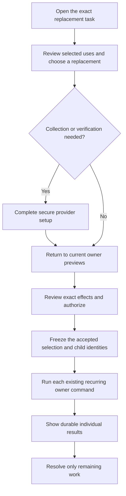

> Historical research record adopted for AL-1563. Scope and testing are ratified; earlier pending decisions and research-only workflow restrictions below preserve chronology. The [implementation specification](../../phase-25-donor-dashboard-depth.md) and its owner contracts are the implementation authority for this proposal. No historical synthetic/source check certifies target runtime behavior.

# Phase 25 R03 — Guided payment-method replacement

> **Founder accepted, 7 September2026:** After this review, Conrad said “Okay, sounds good” and directed the session to proceed. The corrected A direction and required amendments are accepted grooming requirements. The original review below is preserved; source-contract updates and implementation/release proof remain outstanding.

Founder decision and full adversarial review. **7 September 2026.** Scope: the explicitly selected **A — Guided replacement, eligible gifts preselected** journey, its UX, source/database ownership, provider boundaries and required proof.

**Final disposition: Accept with required amendments.** Keep A. The permanent solution is one clear donor workspace, a durable exact record of the reviewed request, and independently authorized recurring-giving commands. The current wallet is a prototype; the required recurring/credential journals are planned contracts, not implemented source. This record distinguishes those facts throughout.

This is a completed grooming/research record with exact decision and amendment language. It is **not a PRD, formal specification, OpenSpec edit, implementation plan or ticket publication**. The founder selected A; the material qualifications below are brought back explicitly for the record rather than silently declared previously ratified. No application source, repository state, GitHub state or provider financial/configuration state was changed. Read-only provider checks and isolated synthetic database experiments are labeled separately.

## The corrected decision to record

> When a donor deliberately chooses **Replace this payment method**, Asym opens one responsive workspace showing the currently authorized candidate recurring gifts using that exact method, already selected and easy to deselect. After the donor chooses or securely adds a replacement, Asym verifies compatibility, presents the exact current effects and obtains the required group-specific authorization. One final review can cover several gifts, but each arrangement keeps its own financial instruction, execution and result. The reviewed selection is recorded durably before any recurring change starts, so the donor can leave and return without losing unfinished work or repeating completed changes. Newly discovered uses are never silently added, and incompatible selections are never silently dropped. Replacing a method does not itself charge, retry a missed gift, resume or restart giving, change a wallet default, or remove the old method. Use the exact shared shadcn base-maia/Base UI system and clear, source-truthful status throughout.

**Three material qualifications are now explicit:**

1. **Clarify the owning bulk rule.** Phase 16's staff-service text prohibits bulk binding. This donor-present journey must be expressly distinguished from staff bulk authority; each group still receives its own valid authorization and source command.
2. **Add the missing typed durable request contract.** The Phase 16 journal currently has no truthful credential/replacement primary subject. Extend its closed contract and result handling deliberately; do not use the first group as a fake primary or invent a second wallet ledger.
3. **Separate replacement from shared credential editing, removal and exposure changes.** In-place expiry edits can affect every use of a provider object. Detachment is irreversible in the documented Stripe primitive. Changing rail can change fees/mandates. Those effects cannot hide behind an apparently selective replacement.

These qualifications preserve the chosen convenience while making its financial meaning exact. The full C01–C22 wording below is ready to carry into the later authorized specification. Actual implementation, provider qualification and broader Phase 25 grooming remain separate work.

## Adversarial check

### What could go wrong with this answer?

Preselected gifts could include the wrong credential or donor; an apparently successful save could change nothing; a lost response could repeat a completed operation; or a replacement could silently charge, retry or detach. The existing wallet's local mock state and Transfer & Delete flow are concrete warning signs. We reproduced an unsafe check-then-retire race in synthetic PostgreSQL and demonstrated guards for that fixture. No hosted financial incident was tested.

### What hidden assumptions are we making?

An eligible old-card use is not automatically compatible with a newly chosen bank method. A shared last four digits, provider Customer or credential lineage does not authorize every arrangement. Saving/verification is not group-specific consent. A single review does not make provider work atomic. The available test scope has no connected account to prove actual capability. Vendor documentation and historical feedback do not establish Asym completion rates or retention.

### How does this affect the whole product?

Phase 16 keeps recurring instruction, authorization, schedule, recovery and command truth. Phase 13 keeps contribution/fee meaning; Stripe keeps its execution evidence; identity/safety owners keep current access; Phase 24 keeps the account host/binding; Phase 6/17 keep messages. The only parent-owned fact is the donor's exact replacement request and its child references. Staff gain no mass-binding capability, and missionaries gain no credential-management surface.

### How does this affect the end-user experience?

The donor sees one repair task: the old method, its selected uses, the replacement, the exact effects and a durable result. No nested modal maze, duplicated card entry where reuse is permitted, unexplained reset after verification, fake all-fixed toast or hidden deletion. Successful changes remain complete; only unresolved work asks for attention. Long names, currencies, paused status and necessary bank/authentication steps remain clear.

### Does this follow modern best practices?

Yes when it uses deliberate review, exact scope, secure collection and truthful recovery. Blackbaud's documented wallet-versus-recurring confusion supports this problem; Church Center and PayPal reinforce dependency/default distinctions. W3C's error-prevention guidance supports reviewing and correcting consequential submissions without requiring an extra generic modal after every save. Prechecked scope is not preaccepted financial consent.

### Does this fit Asym’s existing repo and product direction?

It fits the intended owners and exact Maia/Base UI, with explicit amendments to the closed Phase 16 request/subject/result contract and the ambiguous bulk wording. It does not fit the current mock wallet unchanged. The legacy nullable/unscoped identifiers and history-derived method summaries must not become payment authority during migration.

### Should we adjust the recommendation?

**Keep A and require C01–C22.** The strongest alternative is separate arrangement edits: narrower individual scope and less orchestration, but repeated work and greater risk of incomplete repair. A earns its additional coordination only by preserving exact donor intent and reliable recovery. No generic bulk engine, new financial authority or hidden default/delete behavior is justified.

## The donor journey and UI

Illustrative case, not an observed account: Sarah has two recurring gifts using one Visa and another using a bank account. The old card has not already been resolved by a provider updater. She deliberately chooses Replace on that Visa.

This diagram describes the logical journey, not a requirement for nine pages. Use one responsive page/workspace with progressive sections. Short straightforward cases stay compact; additional detail appears only when it changes the donor's decision.

<!-- prettier-ignore -->
| Stage | Donor experience | Source/data requirement |
| --- | --- | --- |
| **Enter** | Heading such as **Replace Visa ending 1234**, with relevant account context. An expiry/help link arrives at the intended task after safe sign-in. | Resolve the exact current method and identity before consequential controls. A stale alert never creates a duplicate replacement; if already fixed, show current evidence. |
| **See the affected gifts** | Sarah sees the two card-funded gifts checked. The unrelated bank-funded gift does not become a candidate. She can deselect a gift. | Complete owner-qualified use inventory, safe labels, bounded manifest and current authorization. A selected-set summary corresponds to the actual checked items, including review pages. |
| **Choose the replacement** | Select an eligible saved method or **Add another method** in the same workspace. No forced new-card entry. | Suitability is determined for the selected uses; a generic wallet default is not automatically selected as their replacement. Incompatible choices explain the actionable reason without leaking another person's data. |
| **Collect/verify if necessary** | Provider-hosted fields; clear additional authentication or bank verification. Return to the same safe task. | A durable bounded preparation/setup correlation exists before effects. Pending verification is not readiness. No local card/CVC/account-number retention. |
| **Review** | Clear old/new method, individual gifts, relevant next-use/effective dates, current paused status and any payment already in progress. | Fresh per-group owner previews, exact method/rail/authorizer, terms and fee/gross implications. Scope boxes do not substitute for the required authorization. |
| **Confirm once** | A precise action such as **Update these recurring gifts**. The donor can correct the selection before confirming. | Freeze the accepted manifest and stable child intentions atomically. Do not execute an unreviewed live query or merely launch a browser loop. |
| **See results** | Confirmed items, items being checked and any necessary next action. A durable result remains available after leaving. | Each group and required provider leg has its own evidence. Parent scope acceptance is not all-gifts success. |

### Selection behavior that stays understandable

- Initial preselection is limited to uses currently eligible to enter replacement. Final eligibility depends on the chosen method and current terms. If that changes, preserve a safe visible exception; do not silently remove a checked gift or add a newly discovered one.
- **Select all** means the disclosed, captured eligible set. It does not mean future matches, another Party's uses or an unbounded account-wide query. For larger legitimate sets, the source supplies complete bounded review/grouping; no silent first-page selection.
- A paused gift can participate if its owner permits future-method replacement, and stays paused. A canceled or ended agreement cannot be restarted through this flow.
- Deselecting all leaves no replacement to apply. Do not display replacement complete. If the method has already been saved, explain that narrower fact and offer the normal route back.
- Unselected uses keep their existing bindings. This statement concerns replacement bindings, not a separate in-place edit of shared provider metadata. Sensitive source names/counts are shown only when the reader is entitled to them.
- Do not turn one card's repair into a product for comparing payment fees, increasing gifts or migrating every arrangement to ACH. Existing fee-cover choices remain; any source-required changed total/authorization is disclosed without an upsell.

### Copy, accessibility and quiet presentation

Use shared Base UI checkbox/radio/field primitives, not clickable decorative cards with incomplete keyboard semantics. Exact base-maia and semantic color tokens apply to disabled, selected, loading and error states as well as the happy path. Show meaningful labels and amounts/currencies; wrap long names rather than making distinguishing information hover-only. Preserve native/international name and address forms required by the provider; do not split a donor name heuristically or write billing address edits into CRM/legal donor facts.

Use readable progressive sections and a restrained summary. Avoid decorative card emphasis overpowering the gift list, tiny all-caps financial labels, nested dialogs, competing scrolling regions or sticky controls obscuring focused fields. Keep DOM, visual and reading order aligned; preserve focus after validation, provider return, adding a method and local retry. Status announcements should be polite and meaningful, not repeated per poll.

Preferred messages describe actual stage: **Bank verification needed**, **Method saved; recurring gifts have not changed**, **Checking the result**, or a source-proved individual result. Do not display a blanket “No payment can occur today”: a separately scheduled authorized gift may occur while the donor repairs the method. State that **this replacement does not initiate a gift or retry a missed gift**, and separately show source-known scheduled/in-flight facts when relevant.

### Delay, cancel and partial results

<!-- prettier-ignore -->
| Situation | Required behavior |
| --- | --- |
| Provider form canceled before setup completes | Return to the task, distinguish cancellation of setup from cancellation of giving, and read the actual setup state before offering another attempt. |
| Method saved but the donor leaves before final acceptance | No recurring changes. A saved method may remain; do not claim it was discarded, delete it silently or infer future-default consent. |
| Verification takes days | Keep only bounded nonsecret preparation references and safe choices. Verification completion proves setup state only. On return, reauthorize and rebuild current previews; do not auto-apply an expired selection/financial preview. |
| Session expires or user/context changes | Require the existing authentication path, resolve current scope and reread status. Never show prior financial selections during a different context's loading state. |
| Preview changed | Explain what changed and let the donor correct/review. Fresh acceptance is required where terms or affected scope changed; no best-effort silent mutation. |
| One group/leg confirmed; another remains uncertain | Keep confirmed work. Show the unresolved owner outcome and reconcile its existing identity. No replay of successful children and no automatic reversal to the old card. |
| A child definitively cannot proceed | Show the safe affected item and exact available next action. Retry only if the owner proves nonexecution/residual scope, current permission and compatible terms; otherwise require a new review for the remaining work. |
| Donor closes the page after acceptance | The accepted request and results remain. Closing a page is not rollback or cancellation of giving. Do not offer a generic Cancel control that implies submitted effects can be undone. Existing source protective/cancel-giving actions retain their own clear scope. |
| All selected changes confirmed | Show the completed replacement and the old method/default's actual remaining state. No automatic detach, default change, future fallback permission or unsupported confirmation email. |

## Exact decision qualifications

C01–C22 are proposed corrected decision requirements, not current implementation claims or permission to publish. Material owner-contract changes are explicitly identified; ordinary safeguards preserve the selected product intent.

### C01 — Explicit task and bounded scope

For explicit Replace this method, preselect the currently owner-admitted candidate uses of the exact old credential in the current verified Tenant/environment, launch Legal Entity/account and donor/represented context. A generic Add method, default setting or single-gift edit does not widen to that set. Preselection proposes scope; it applies nothing and supplies no collection authorization.

### C02 — Exact inventory and complete review

Resolve current method references, provider-proven lineage, current authorization/executor/item uses and owner-safe labels. Never match by last four, brand, email, subscription ID alone, historical payment label or all tokens ever in a lineage. Enumerate a complete bounded review set through an indexed owner query; options/counts are authorized data. Do not equate the first page with all uses or silently include unseen future matches.

### C03 — Compatibility and selection changes

Re-prove each candidate against the chosen replacement, exact current terms and authorizer. A candidate becoming incompatible remains a visible, safe review exception until the donor changes the method or explicitly deselects it; never silently drop, substitute or add a use. Version proposed selections and invalidate affected previews/challenges. Zero selected gifts is not a completed replacement; any save-only action must state its narrower effect.

### C04 — One accessible workspace

Use one responsive replacement workspace with progressive sections for selected uses, replacement method, exact review and results. Use shared base-maia/Base UI checkboxes/radios/fields, semantic tokens, visible labels, wrapped identity text, correct focus/status/error behavior and accessible mobile reflow. Avoid nested modal chains, hover-only actions, unsupported fee nudges and generic Move Support/Transfer & Delete wording. A precise reviewed confirmation needs no second generic confirmation.

### C05 — Secure preparation and collection

Before a provider setup effect, durably correlate a bounded owner-controlled preparation context to the old-method scope, safe proposed selection and exact setup operation. It is not accepted change authority. Use provider-hosted fields and approved setup/verification; store provider references and minimal safe metadata, not raw PAN/CVC/bank credentials or client secrets in logs/URLs. Readback proves account/customer/mode/rail/status. Reuse collection only within its actually proved scope; no blind duplicate SetupIntent after an unknown response.

### C06 — Truthful final preview

The current per-group owner preview identifies selected lines, replacement mask, exact effective/next-use facts, required authorization, sibling/cohort/leg effects and in-flight non-effects. Preserve designation, cadence, dates, contribution amount and fee-cover intent. If the chosen rail/method changes source-calculated fees, gross amounts or mandate/exposure, show the exact revised terms and require the existing wider-change authorization; do not invent fee policy, keep an invalid old total or silently increase giving. Never sum unlike currencies.

### C07 — Separate collection authorization for each group

A final gesture may accept several clearly presented group-specific term sets only when the same verified actor is currently entitled to authorize every set and the provider/rail contract permits it. Selection checkboxes are not mandate acceptance. Prove Party instruction, actual financial authorizer and required collection consent independently. Predictable invalid selected terms prevent final acceptance; subsequent races are resolved by each group's current admission fence.

### C08 — Explicit bulk-rule clarification

Amend the Phase 16 owner contract explicitly: its staff bulk prohibition remains; the donor-present replacement review may compose individually authorized existing group commands but grants no staff bulk binding or blanket collection authority. A parent accepts task scope only. Do not describe this as an already-authorized bulk financial command or silently reinterpret the current closed rules.

### C09 — Typed non-executing owner request

Extend the Phase 16 journal contract with a closed, versioned, non-executing replacement-request kind and an exact typed old payment-credential-lineage primary subject, backed by a same-scope FK. Add its result projector and only the typed request-to-child links needed for recovery. The payload enumerates exact current old-method/use references and owner evidence; the primary lineage never means all historical/future tokens. The parent has zero direct provider operations, no binding ownership and no stored all-updated financial truth. Do not fake a first-group/Party primary or introduce an untyped polymorphic ID or second wallet ledger.

### C10 — Durable accepted selection before child effects

Final confirmation atomically freezes the accepted selection/version/hash, real actor/instruction context, exact owner previews/term references and stable child-intent identities before any group effect can start. A crash cannot leave an applied group disconnected from the accepted set. A same-key/different-payload request is rejected, not treated as successful replay. Accepted scope is immutable; later changes require a separately reviewed successor referring to existing work.

### C11 — Independent source commands

Execute each selected group's existing preview/apply/authorization and provider saga with its real primary subject and all required line/cohort/leg checks. Re-prove eligibility immediately before source/provider admission. Selected-set acceptance and child-intent reservation are atomic locally. Per-group financial application and provider effects remain independent; no all-or-nothing financial outcome or compensating rollback is promised. API routes remain thin; provider requests are closed, capability-qualified owner operations. Setup, detach and default commands cannot be smuggled into update_executor; any required new operation kind needs its actual owner's explicit contract.

### C12 — Current trusted identity and isolation

Derive Tenant/environment/host, actor, represented subject, Party instruction, authorizer, entity, provider account/mode and authority revisions from trusted server context. Treat caller IDs as requested references only. Authenticate/authorize preparation, preview, acceptance, every command/provider admission and result read, with CSRF protection on mutations. Bind client/server cache and generation to exact scope, reject obsolete responses and reauthorize on return. No tenant-key failure may fall back to a platform account or another donor's context.

### C13 — No charge, retry or invoice rewrite from replacement

Replacement must not initiate a gift, pay an old invoice, create proration/catch-up debt, add/reset recovery slots, advance dates or create duplicate or overlapping executor ownership for the same occurrence. Owner-planned noncharging prospective splits and their required new leg executors remain permitted only with exact authorization, cutover proof and no silent sibling changes. Already submitted payments keep their original evidence. Before changing provider bindings, the adapter proves required collection/recovery controls and exact object/method precedence so a new method cannot enable an otherwise forbidden missed-gift retry. A local flag or no-charge label is not proof. Existing authorized recovery remains separately governed and explained.

### C14 — Lifecycle, defaults and shared metadata stay distinct

Paused gifts remain paused; canceled/ended/superseded authorization is not restarted. Existing resume dates remain source-governed. Replacement changes no wallet default, fallback-method permission or old-method availability. Editing a shared method's expiry/billing metadata and automatic updater continuity are separate owner operations with potentially wider scope; deselection cannot promise isolation for an in-place provider edit. Proven token continuity does not reset attempt pressure or transfer authorization.

### C15 — Durable individual results and safe replay

Derive each group's and every required leg's result from its permanent owner command and provider evidence. Distinguish confirmed, waiting for verification/authorization, being confirmed, blocked and definitively failed; expose only permitted facts. Keep successful children; reconcile unknowns before new effects, and repair only source-admitted residual work. Provider request keys, including cached failures or expired retention, cannot replace durable semantic identity. Verify and deduplicate webhook delivery, tolerate out-of-order events and reconcile current scoped objects.

### C16 — Expiry, leaving and recovery

Keep safe proposed choices through provider redirects, cancellation, verification delay and renewed sign-in in a bounded owner preparation context. Verify current identity on return; no raw credentials or bearer grants persist in navigation state. Expired preview/challenge authorizes no new acceptance: collect current previews and renewed authorization where needed. Leaving before final confirmation changes no recurring gift; a method may already have been saved and must be described truthfully. After acceptance, leaving is not rollback; results remain recoverable. No generic Cancel button may imply it undoes applied or indeterminate work.

### C17 — Removal is a separate governed operation

R03 does not detach, delete or mark the old credential retiring automatically. A separately requested removal must have an explicit owner command/capability and serialize admission with new bindings and all current dependencies; preserve immutable historical references. Outstanding, unselected, in-flight or unknown uses prevent unsafe detachment. Do not promise provider detachment is reversible or use a stale unused count. Returning to prior bindings is never automatic compensation for a partial replacement.

### C18 — Database constraints and reachable access paths

The owning schema enforces non-null scope, same-Tenant/entity/binding/account/mode/rail references as applicable, one truthful typed primary, closed payload/state/result schemas, exact live binding/item cardinality, immutable accepted terms/selection/events, restrictive deletion and scoped semantic/provider uniqueness. Current pointer changes use owner locks/revision checks. Internal journals are default-denied; raw Data API, views, functions, RPCs, workers, Realtime and privileged paths preserve equivalent authority. Apply USING to existing-row eligibility and WITH CHECK to proposed rows where supported; read-only tables need no write policies. Scope compatibility is role-specific: old primary/before-use references match the old lineage; replacement terms, cohorts and executors match the accepted after-state. A separately authorized rail transition does not require old and new rails to match.

### C19 — Minimized evidence and governed communication

Technical traces carry minimized operation/owner/cause references, not payment credentials, client secrets, private destination labels, raw URLs or broad provider payloads. Durable accepted instructions, authorization evidence, child outcomes and security audit are separate records with their existing owners and retention/access rules. Do not infer donor consent or financial completion from a send/read event. Emit only exact Live producer-owned message contracts through Phase 6/17; Reserved meanings create no synthetic email/notification history. Provider-required mandate communications remain separately qualified and evidenced.

### C20 — Bounded work and proportionate support

Use the existing query/job/outbox stack and indexed current-use lookup, bounded review manifests and bounded provider concurrency. No per-row browser provider loop, full-history download, generic bulk engine, per-tenant wizard or custom card vault. Certify selected numeric page/selection/work/timeout/provider limits and a representative workload before activation. If a legitimate set exceeds one admitted request, explain the bounded grouping and obtain explicit reviews; never silently select the first N. Provide source-owned status/help without routine direct SQL repair.

### C21 — Safe adoption and rollback boundaries

Reconcile existing owner tickets and the explicit contract amendments before implementation. Qualify the real target schema/services, connected-account capabilities, result readers and all affected legacy routes/grants before activation. Use additive compatible schema/readers, fail closed on unknown kinds/versions, preserve historical source evidence and admit legacy mappings only with exact proof. Containment can stop new acceptance/provider effects while retaining result/reconciliation/protective paths. After source writes, roll forward through owners; never restore fake wallet logic or detach/reverse successful work as rollback.

### C22 — Required evidence and honest status

Trace R03, these exact qualifications and explicit owner amendments to later authorized glossary/ADR/OpenSpec/design/tickets and real tests/release evidence. No new general domain term or formal specification is created during grooming. Require real PostgreSQL grant/RLS/constraint/concurrency proof, exact account/provider contracts, fault/replay/migration tests and accessible authenticated donor journeys. Synthetic experiments, current source and vendor help pages cannot certify runtime safety, completion, scale or retention.

## Database and service design — one authority, exact provenance

The permanent design uses the existing source ownership. Do not repair a mock wallet by inventing a table that makes its labels authoritative.

<!-- prettier-ignore -->
| Information | Authoritative owner and required shape | What the portal must not infer |
| --- | --- | --- |
| Provider/network credential continuity | Phase 16 `payment_credential_lineages`: exact Tenant/entity/binding/account/mode/rail plus proven lineage identity | Same mask, Customer, card brand or a staff note is not continuity or permission. |
| A currently saved/usable provider method | Payment/credential setup owner and exact provider readback; current method/customer/account/mode and minimal masked metadata | A historical donation, old subscription or a collected field is not a ready saved method. |
| Collection authorization | Immutable `recurring_authorization_terms` and append-only term events for each exact group/authorizer/merchant/method/amount/currency/schedule/purpose | Setup success, login, parent selection, earlier giving or another group’s consent grants no new use. |
| Current use and executor topology | Phase 16 cohort/current terms, `recurring_executor_bindings` and `recurring_executor_line_bindings` | A subscription ordinal or every token in a lineage is not an exact selected use. |
| Proposed choices during secure setup | Bounded payment/authorization-owner preparation context with exact scope, version, expiry and stable setup correlation | A proposed set is not an accepted instruction. Its safe references must be revalidated; stored labels are not authority. |
| Accepted replacement scope | Deliberate closed extension of `commitment_commands`, typed subjects and narrow child links; real old-lineage primary and exact enumerated method/use tuples | The parent cannot own financial bindings, inherit blanket consent, write an all-updated truth or use a fake primary subject. |
| Per-group financial changes | Existing `previewRecurringChange`/`applyRecurringChange`, exact authorization and command/provider operations | One review is not one cross-group provider transaction. |
| Progress and final evidence | Existing command events/frozen confirmations plus separately evidenced provider reconciliation; parent summary derived from children | A frontend toast, request200, saved card or sent email is not completed financial application. |

### Required owner-contract amendments

**Amendment A1 — bulk authority.** Proposed text: “The staff bulk prohibition remains in force. A donor-present payment-method replacement review may present an exact selected set of individually permitted recurring changes. Each group requires its own current exact-term collection authorization and existing group command. The review/request grants no staff bulk binding, cross-Party authority or generic collection permission.” This clarifies a real conflict in Phase 16 J.3; it is not presented as wording already adopted there.

**Amendment A2 — durable non-executing request.** Extend the closed Phase 16 command kind/subject/result contract with a replacement request whose actual primary is the exact old `payment_credential_lineage`, linked by a same-scope typed FK. This requires adding the lineage subject kind/column and its exact-one-target constraint; it does not fit the existing catalog by pretending the first group is the request. The accepted payload freezes exact current method references and use tuples, selected group/line/cohort scope, owner evidence references, actor/instruction context, preview/terms references and stable child-intent identities. Add only a narrow typed request→group-command association if existing correlation cannot enforce that relationship. The parent has no direct provider operation; group/line primaries remain genuine on the children. Aggregate outcome is a projection of child evidence.

**Amendment A3 — preparation/acceptance and provider setup.** Explicitly complete the existing payment/authorization owner's bounded setup-preparation contract so provider setup, callbacks, verification and return navigation have durable exact correlation before an accepted replacement exists. Proposed choices can change by version; accepted selection cannot. Use that owner’s existing preparation/journal facilities where they fit and extend their closed schema where they do not. Do not force mutable preparation into an immutable applied command or create a generic draft/workflow product. The preparation owns only proposed scope and setup provenance, not recurring facts. Its acceptance transaction creates/freezes the source request and all child-intent references together. Setup, detach and default operations require their own proper owner kind/target contract; they are not permitted merely by labeling them `update_executor`.

These are logical owner/data requirements, not arbitrary table-name prescriptions. The target journals themselves are absent from current runtime source, so no existing implementation is being silently reused or certified. A later authorized owner amendment must include type/constraint/result-reader changes and their proof before dependent code activates.

### Constraints that carry the boundary

<!-- prettier-ignore -->
| Constraint family | Required invariant and why |
| --- | --- |
| Non-null trusted roots | Tenant, entity, binding/account/mode, actor/instruction context and exact method lineage/reference are server-resolved and required where applicable. Explicit versioned preparation fields may be pending; nullable authoritative roots must not mean any tenant/account. |
| Same-scope foreign keys | Every typed reference enforces the scope appropriate to its role: the old primary and before-use references match the old lineage/binding; replacement authorization, cohort and executor references match the accepted after-state, including its rail. A permitted rail transition does not require old and new rails to match. Tenant/entity/account/mode/Party boundaries still hold as required by their owners; JSON IDs or matching hashes alone are insufficient. |
| Exact typed subjects | Exactly one non-null typed FK matches each subject kind, and exactly one truthful primary exists per command. The new request kind admits the new lineage primary only under its closed contract. |
| Accepted immutability | Accepted selection, terms/evidence and semantic intent are immutable from acceptance, including before any child begins. Progress is append-only evidence or controlled current pointers, not editing the old instruction. A successor is separately reviewed and linked. |
| Cardinality | One source request cannot create duplicate child intent for the same reviewed group/change scope. Existing live executor/item cardinalities and every required twice-monthly leg remain enforced. A lineage does not merge agreements. |
| Semantic uniqueness | Durable request identity plus command type/scope cannot accept a different payload. Provider effects have permanent scoped business identities separate from transport retry keys. A duplicate return/webhook cannot append another acceptance/effect. |
| Valid states | Preparation, verification, scope acceptance, authorization, group application and provider confirmation are separate kind-specific states/results. Invalid success combinations are rejected by the owner finalizer. Parent accepted is not child applied. |
| Restricted deletion | Accepted terms, effects and references survive privacy/profile changes according to existing retention/legal-hold owners. Deleting a display item does not erase financial evidence. Explicit method removal protects current references and is separate from history retention. |
| Revision and locking protocol | Apply compares current group/cohort/binding/authority facts under source locks or equivalent proven revision fences. All new-use and explicit retirement paths share the credential owner's fence. Do not hold SQL locks while waiting for Stripe, a browser or a bank. |
| Indexes | Index actual complete current-use lookups and request/child recovery by their full scope and current-status predicate. Choose final indexes from the real query plan and measured workload; old donor/status indexes do not establish this performance. |

There is no new balance, contribution total, ledger posting, receipt fact or precision model in the replacement parent. Existing money uses owner-defined integer minor units, currency and exact fee/authorization semantics. A conditional rail-dependent amount change must follow the same owner rules, not a new wallet calculation.

### Database authorization and all reachable paths

Keep internal preparation/authorization/command/provider journals default-denied to browser roles. Expose purpose-scoped DTOs and commands through `packages/api`; app routes remain thin. Review actual table grants separately from RLS and test views, RPCs, workers, Data API, GraphQL/Realtime where enabled and privileged paths. A service-role or owner execution path may bypass ordinary RLS and still needs equivalent current source authority. There is no reason to grant donors direct write access to these journals.

Where row mutation is allowed, `USING` governs existing-row eligibility and `WITH CHECK` governs a proposed row when supported: INSERT uses the latter, DELETE uses the former, UPDATE generally needs both. Read-only tables need no invented mutation policy. PostgreSQL can reuse a policy's USING expression when WITH CHECK is omitted; missing spelling alone is not proof of an ownership-transfer bug. Test actual allowed/forbidden transitions and grants. FORCE RLS is not proof against a role that bypasses it.

The active Supabase changelog includes changed default API exposure. Explicit grants/schema exposure and negative access tests therefore matter; neither “all new tables are exposed” nor “not exposed means authorized” is an acceptable assumption. No Supabase schema/auth configuration was changed during this review.

### Critical atomic boundaries and races

<!-- prettier-ignore -->
| Boundary or race | Required outcome |
| --- | --- |
| Complete selected-set admission | One local acceptance transaction freezes the request and stable child intentions before any child can run. An error rolls back the admission, not unrelated completed work. |
| Another gift attaches after preview | The new use is not in the accepted set. It remains unchanged; later removal must discover and protect it. Do not silently widen scope or falsely claim every use was replaced. |
| Two replacements compete | Current revisions/owner locks determine admissibility. A stale command explains the changed state and cannot overwrite a newer accepted binding. |
| Revocation/cancellation races apply | Each source/provider admission obeys the owner’s current authoritative fence. Work admitted after revocation stops; submitted effects remain evidence to reconcile. No claim that already delivered bytes or submitted financial work can be recalled. |
| In-place provider updater changes metadata/reference | Reconcile exact continuity and current evidence; do not infer a new lineage, reset recovery pressure or reroute selected uses based on a stale mask. |
| Explicit removal races a new binding | Both paths serialize through the same credential-use admission boundary. No stale unused query; no automatic retirement performed by R03. |
| Provider success before response/persistence callback | Existing operation identity remains reserved; retrieve/reconcile. Do not create a fresh mutation because the client timed out. |
| One execution leg succeeds, another does not | The group is not fully confirmed. Preserve successful evidence and reconcile only the outstanding exact leg. |
| Preparation or selection changes | Before acceptance, version/review the changed proposal and invalidate affected challenges. After acceptance, create a reviewed successor; never edit a manifest already used by child effects. |

## Independent category review

All **22 requested categories** have an explicit material-concern result. “Yes” means a required correction, qualification or proof gate for faithful implementation—not a proven production incident. Findings F01–F24 below include all requested explanation fields. Severity is the credible impact under the stated trigger; likelihood is conditional/qualitative rather than an invented percentage.

### 1. Problem validity, necessity, and alternatives

**Material concern: No material concern with the root problem.**

The founder selected explicit replacement, and historical Blackbaud feedback documents confusion between saving a card and changing recurring gifts. Individual arrangement edits are the strongest simpler alternative; they reduce combined coordination but increase repetition and omissions. A is justified if it preserves exact review and recoverability. Preselection is a product judgment, not a measured retention result. Exact page dimensions, database names, batch size and provider transport are not gratuitously frozen.

**Findings:** F19,F21,F24. **Exact requirements:** C01–C04,C20,C22.

### 2. Brittleness

**Material concern: Yes.**

The journey cannot assume last-four identity, a complete first page, stable eligibility, a valid session forever or a provider response arriving promptly. Chosen-method compatibility is unknown until the actual instrument and terms are proved. Use typed owner states, current previews and exact reviewed manifests; no silent substitution when assumptions change.

**Findings:** F04–F07,F13–F16. **Exact requirements:** C02,C03,C05–C07,C12,C15,C16.

### 3. Technical debt

**Material concern: Yes.**

The wallet's sample state, raw credential forms, invented method labels and general portal launch are not permanent payment contracts. A second wallet ledger or fake journal primary would compound that debt. Reuse the source architecture, deliberately extend its closed request/subject/result contracts and retire affected prototype paths.

**Findings:** F01,F02,F08,F22. **Exact requirements:** C04,C05,C08–C11,C18,C21.

### 4. Edge cases

**Material concern: Yes.**

Checked zero/one/many uses, deselect all, incomplete lists, identical masks, multiple current references in one proven lineage, historical tokens, newly added uses, paused/canceled gifts, different currencies/authorizers, stale alerts, bank verification delays, redirected or expired sessions and partial twice-monthly legs. None permits silent widening, removal, retry or false completion.

**Findings:** F04–F06,F11–F18,F23. **Exact requirements:** C01–C07,C13–C17.

### 5. Footguns

**Material concern: Yes.**

The strongest footguns are Transfer & Delete, matching on masks/history, generic Set default, a source= Customer update, items[0], and a new idempotency key after timeout. Also check preselected scope boxes being mistaken for payment consent. Use exact owner inputs and deliberate independently qualified actions, not UI reassurance.

**Findings:** F01,F04,F08–F12,F15. **Exact requirements:** C02,C05,C07,C11,C13–C18.

### 6. Tenant safety

**Material concern: Yes.**

One tenant is not one authorizer. The request must remain in the current verified donor/represented context, exact Legal Entity/binding/account/mode and applicable current scope. Phase 24's one active entity/account simplifies launch but does not migrate historical objects. Current-key fallback and cache identity do not prove these boundaries.

**Findings:** F04,F06,F07,F14,F22. **Exact requirements:** C01,C02,C07,C09,C12,C18,C21.

### 7. Database, RLS, and authorization safety

**Material concern: Yes.**

Reviewed actual legacy tenancy/nullability/FKs/indexes and target immutable terms, credential lineage, typed subjects and provider identities. Target Phase 16 tables are absent from inspected migrations/API/types; do not label proposed constraints implemented. Require same-scope FKs, exact-one typed primary, closed state/payload checks, restrictive deletion, immutable accepted history, semantic uniqueness and shared lock/revision protocols. Default-deny internal journals and test every bypass/read path. Read-only tables need no artificial write policies; apply USING/WITH CHECK according to operation.

**Findings:** F02,F04,F06,F11,F14–F16,F22. **Exact requirements:** C09–C12,C17,C18.

### 8. Overengineering

**Material concern: Yes — avoidable design risk.**

A generic batch engine, recursive command graph, global card vault, copy of recurring truth, per-tenant wizard or persistent polling framework is not required. The minimal addition is a typed non-executing owner request with bounded preparation/correlation and child links. Complexity is justified only to preserve reviewed intent across crashes; the child financial owners remain unchanged.

**Findings:** F02,F03,F16,F21. **Exact requirements:** C04,C05,C08–C11,C20.

### 9. UX/UI and user friction

**Material concern: Yes.**

A should feel like one repair: visible uses, safe method choice/collection, one understandable review and durable results. Current pointer-only selection, hover actions, modal nesting, lost add-method return, tiny labels and unsupported fee claims hinder that. Long/international names must wrap without inferred name order; addresses come only from required provider collection and do not rewrite CRM/legal donor facts. Dates retain source giving-timezone meaning. Mobile/RTL/reflow/focus and slow-network continuation need real journey proof.

**Findings:** F01,F05,F13,F18,F19,F23. **Exact requirements:** C03–C06,C15,C16,C20,C22.

### 10. Source of truth, ownership, and domain invariants

**Material concern: Yes.**

Credential continuity, actual method references, collection authorization, current uses and task scope are different facts. Phase 16 owns recurring facts and source journals; the parent owns only exact selected-set provenance. Stripe owns its scoped execution evidence; Phase 13 owns fee/money calculations, 24 host/account context, 6/17 messages. Parent acceptance is neither per-group application nor blanket authorization. Invalid cross-scope combinations and duplicate live bindings require constraints/finalizers, not naming convention.

**Findings:** F02–F04,F09,F10,F12,F16,F18,F20. **Exact requirements:** C02,C06–C11,C13,C14,C18,C19.

### 11. Hidden coupling

**Material concern: Yes.**

Replacement is coupled to subscription/invoice method precedence, recovery, authorization, current source scope and provider callbacks—not merely the wallet form. Shared metadata edits can affect deselected uses. Default-setting, removal, lifecycle and messages must remain separate effects. A home alert, staff request link and donor detail must resolve the same owner status without gaining broader authority.

**Findings:** F03,F07,F09–F13,F17,F20. **Exact requirements:** C01,C05,C11–C17,C19.

### 12. Failure modes

**Material concern: Yes.**

Reviewed setup saved but response lost, known failure, unknown provider success, one group or leg confirmed while another stalls, callback outage, invalid envelope, authorization failure and browser loss. Durability begins before an effect can become orphaned. Read existing results before retry; no automatic rollback, fresh duplicate, all-fixed claim or raw-provider fallback. A valid change survives notification failure.

**Findings:** F02,F13,F15,F16,F20,F23. **Exact requirements:** C05,C10,C11,C15,C16,C19,C21.

### 13. Lifecycle, temporal correctness, concurrency, and idempotency

**Material concern: Yes.**

Proposed selection, setup readiness, reviewed acceptance, per-group source application and provider confirmation have different timelines. Selection acceptance must be atomic locally; provider effects are not cross-group atomic. Races with revocation, new uses, other replacement, default edits, auto-updater and submitted occurrences need exact owner fences. Stable business identities outlive provider request retention. Stale verification/preview cannot authorize execution.

**Findings:** F11,F13–F17,F23. **Exact requirements:** C03,C05,C07,C10–C18.

### 14. Data integrity risks

**Material concern: Yes.**

Existing fabricated IDs/history labels cannot be backfilled into authority. Guard against wrong lineage, duplicate children, incomplete accepted sets, conflicting live bindings, orphaned setup results and rewritten term/history evidence. Typed same-scope relationships, frozen manifests, permanent operation IDs and source reconciliation prevent these errors.

**Findings:** F01,F02,F04,F14–F16,F22. **Exact requirements:** C02,C05,C09–C11,C15,C18,C21.

### 15. Security and privacy risks

**Material concern: Yes.**

Checked actual authorizer versus donor login, tenant/entity/provider scope, sensitive ministry labels/counts, raw payment fields, ephemeral client secrets, redirects/referrers, cache isolation, audit and retained authorization evidence. Store no raw credentials or unnecessary bank data. Existing retention/legal-hold/anonymization owners govern evidence; account closure is not permission to erase financial history or silently stop recurring giving. R03 adds no export or profiling feature.

**Findings:** F06–F08,F12,F13,F20,F22. **Exact requirements:** C05,C07,C12,C16,C18,C19,C21.

### 16. Scalability and performance risks

**Material concern: Yes — target capacity unproved.**

No current source proof establishes complete low-cost usage enumeration or large-set repair. Bound manifests and provider workers; index actual scoped current-use and result queries. Certify actual selected numeric limits and production-shaped cardinalities before activation, including a large donor/tenant alongside others. Do not hide truncation or invent a universal large-donor threshold.

**Findings:** F04,F21,F24. **Exact requirements:** C02,C10,C15,C20–C22.

### 17. Operational burden

**Material concern: Yes.**

Without durable per-group status, staff will be asked to guess whether a card saved, which gifts changed and whether retry is safe. Reuse source status/help and reconcile exact residual work. No routine direct database repair, manual provider-dashboard toggling, tenant-specific fee copy or duplicate success messages should be required to operate the flow.

**Findings:** F01,F02,F07,F15,F20–F23. **Exact requirements:** C04,C11,C15,C19–C21.

### 18. Observability and auditability gaps

**Material concern: Yes.**

Technical retries, accepted donor instruction, collection authorization, source application and provider confirmation need distinct evidence. Minimize logs without hiding the owner/cause/operation references needed to investigate. Do not infer email delivery, reading or success from the parent. Monitor only named invariant signals/thresholds/responses after real proof.

**Findings:** F02,F15,F16,F20,F24. **Exact requirements:** C09,C10,C15,C19,C22.

### 19. Dependency and integration risks

**Material concern: Yes.**

The pinned SDK supports necessary primitives but cannot prove exact connected-account permission, setup, rail, retry or control behavior. The available test scope has no connected account; #799's empty mutation allowlist is a real gate. Provider keys expire from retention and webhooks can duplicate/reorder. Current vendor help informs UX but does not authorize Asym operations or a new global wallet.

**Findings:** F07–F13,F15,F20,F24. **Exact requirements:** C05,C07,C11–C15,C19,C21,C22.

### 20. Migration, rollout, and upgrade risks

**Material concern: Yes.**

The new command/subject/result types require explicit owner refinement and compatible rollout. Unsafe legacy nullable/unscoped rows cannot be guessed into new authority; current card references need exact provenance. Mixed readers/workers must reject unsupported versions before effects while preserving accepted results. Rollback is containment plus forward repair, not reattaching a detached method or recreating old fan-out logic.

**Findings:** F02,F03,F07,F11,F22. **Exact requirements:** C08–C11,C17,C18,C21.

### 21. Testability, traceability, and proof

**Material concern: Yes.**

The complete trace must include R03 selection, material owner amendments, exact corrected clauses, later authorized formal artifacts, existing predecessor tickets and actual proof. The 26 passing synthetic SQL assertions prove only their stated counterexamples/guards. Require real-schema adversarial/concurrency/provider/replay/migration tests plus accessible authenticated donor tasks and measured capacity. No unrun acceptance test is counted as passed.

**Findings:** F24; all findings require mapped evidence. **Exact requirements:** C22 and T01–T16.

### 22. Other development hazards

**Material concern: No additional material concern after scoped checks.**

Checked accidental expansion into contribution issuance, receipts/statements, refund/recovery policy, generic staff bulk rights, card cloning across merchants, marketing consent and account deletion. Those are either explicitly excluded or covered by named owner gates above. There is no justification for an additional generalized framework, provider upgrade or new business-truth store.

**Findings:** F03,F09,F17,F20,F22 (covered above). **Exact requirements:** C08,C11,C13,C14,C19–C22.

## Concern register — consequence, evidence and permanent prevention

### F01 — Prototype wallet and invented identity

**What could go wrong:** Local arrays, fabricated method metadata and history-derived labels can be treated as real instruments or completed changes.

**Why it matters:** A donor may believe gifts were repaired while nothing changed, or the wrong uses may be selected.

**Severity:** High; Critical if promoted into real financial identity

**Likelihood:** Deterministic in current mock handlers; harmful real effects conditional on reuse.

**Evidence and reasoning:** S01 wallet1255–1256,1340–1437; S02 model413–441.

**Effect on the answer:** A stands; the prototype cannot be its authority.

**Permanent prevention:** Replace the data/mutation path through exact credential and recurring owners; retain only reusable UI structure.

**Exact change:** C01,C02,C04,C18,C21

### F02 — Missing typed durable request

**What could go wrong:** A browser loop starts several commands without a durable exact accepted set, or uses a fake first-group primary in the journal.

**Why it matters:** Refresh/crash can lose residual work, misattribute intent or recreate completed effects.

**Severity:** High

**Likelihood:** Likely under a naive combined-save implementation; closed-subject gap is observed.

**Evidence and reasoning:** S05 PRD 1508–1528; S09 issue795; E01 accepted-set/partial-progress checks.

**Effect on the answer:** Requires an explicit owner schema/command/result refinement.

**Permanent prevention:** Add a non-executing typed lineage-primary request and minimal child links in the owning journal; freeze acceptance before effects.

**Exact change:** C09,C10,C15,C16

### F03 — Conflict with bulk-binding language

**What could go wrong:** The new presentation is called a bulk financial command or extends staff powers despite Phase 16's prohibition.

**Why it matters:** A convenience flow becomes unintended authority over multiple donors or agreements.

**Severity:** Critical for unauthorized widening; otherwise High contract ambiguity

**Likelihood:** Material textual conflict; misuse conditional on interpretation.

**Evidence and reasoning:** S05 PRD 1050–1075 and each group's authorization1484–1500.

**Effect on the answer:** Requires an explicit governing clarification; not silent ratification of new financial power.

**Permanent prevention:** Permit only donor-present composition of separately authorized group commands; preserve the staff bulk ban and parent zero authority.

**Exact change:** C07–C11

### F04 — Overbroad or incomplete usage discovery

**What could go wrong:** Matching masks/lineage history or only one page selects the wrong gifts or misses actual uses.

**Why it matters:** Selection, removal and donor explanations become untrustworthy.

**Severity:** Critical for scope mistakes; High for omissions

**Likelihood:** Mask aliasing reproduced synthetically; current history-based identity observed.

**Evidence and reasoning:** S02 model413–441; S05 PRD 1478–1506; E01 mask versus exact identity.

**Effect on the answer:** Narrows the meaning of eligible; A remains.

**Permanent prevention:** Enumerate exact current owner-proved use tuples with complete bounded coverage and protected labels/counts.

**Exact change:** C01–C03,C18,C20

### F05 — Eligibility changes after choosing a replacement

**What could go wrong:** A use preselected for card replacement later proves incompatible with the chosen bank/rail/authorization and is silently dropped or replaced.

**Why it matters:** The donor confirms a different set from the one they intended.

**Severity:** High

**Likelihood:** Realistic conditional case; compatibility depends on chosen instrument and exact terms.

**Evidence and reasoning:** S05 PRD 347–364,611,1484–1506; S09 issue812.

**Effect on the answer:** Adds a visible re-review requirement.

**Permanent prevention:** Keep safe changed-scope exceptions visible, require explicit correction/deselection and invalidate stale previews/challenges.

**Exact change:** C03,C06,C07

### F06 — Current actor or authorizer scope is not proved

**What could go wrong:** A valid donor login/profile or cached view is treated as authority for a represented Party, payment authorizer or every same-tenant gift.

**Why it matters:** Private giving can leak or financial terms can be changed without the actual authorizer.

**Severity:** Critical

**Likelihood:** Conditional on broader use; existing resolver/cache lacks target proof.

**Evidence and reasoning:** S03 service166–191 and donor-portal hook109–170; S05 PRD 1050–1058.

**Effect on the answer:** Requires current owner checks; no new delegation system.

**Permanent prevention:** Derive exact context server-side and re-prove at every preparation/read/acceptance/effect boundary; reject late old-context data.

**Exact change:** C07,C12,C18

### F07 — Wrong provider account or fallback client

**What could go wrong:** Tenant-key fallback, a provider Customer or a matching physical card is used as the financial scope.

**Why it matters:** A setup or update can happen in the wrong merchant/account/mode, or unrelated authorization is reused.

**Severity:** Critical

**Likelihood:** Observed fallback path; target misuse conditional on configuration/data.

**Evidence and reasoning:** S04 tenant-client42–46,64–73 and billing17–42; S06 Phase 24 one account; P04 Connect.

**Effect on the answer:** Narrows launch to the verified owning context.

**Permanent prevention:** Resolve exact binding/account/mode/application/control; fail closed without provider effects; preserve historical bindings without ambient migration.

**Exact change:** C01,C05,C11,C12,C21

### F08 — Unsafe collection and overcollection

**What could go wrong:** Raw card/bank fields, client secrets in logs/URLs or unnecessary bank data permissions are retained for convenience.

**Why it matters:** Payment credentials and private banking data are exposed beyond their necessary boundary.

**Severity:** Critical

**Likelihood:** Raw credential state is observed prototype behavior; actual exposure not tested.

**Evidence and reasoning:** S01 wallet100–107,435–485,515–576; P01 Setup/ACH documentation.

**Effect on the answer:** Requires complete collection replacement, not cosmetic hardening.

**Permanent prevention:** Provider-hosted collection, minimum permissions, ephemeral purpose-scoped client handling and secure source references only.

**Exact change:** C05,C12,C16,C19

### F09 — Method save silently changes collection/recovery

**What could go wrong:** Legacy Customer source updates, default inheritance, generic subscription edits or native retries charge an old invoice or create overlapping executor ownership for the same occurrence.

**Why it matters:** An ordinary repair can take money unexpectedly or duplicate recovery.

**Severity:** Critical

**Likelihood:** Provider behavior documented; actual account controls unproved.

**Evidence and reasoning:** P02 Customer update; P03 retries; P07 subscriptions/invoices; S05 PRD 611–621,665–677.

**Effect on the answer:** Core acceptance condition; A cannot ship on label-only reassurance.

**Permanent prevention:** Exact provider operation allowlist, collection-control/readback proofs, source occurrence/credential fencing and no generic price/date mutation payload.

**Exact change:** C06,C11,C13,C15

### F10 — A global default silently reaches existing gifts

**What could go wrong:** Setting a preferred method or automatic save-default behavior changes existing fallback consumers or bypasses scoped replacement.

**Why it matters:** Unselected gifts may use the new method despite the reviewed set.

**Severity:** Critical when unauthorized; High otherwise

**Likelihood:** Documented provider precedence; conditional on actual defaults/settings.

**Evidence and reasoning:** P03 precedence; SDK 22.2.0 Subscriptions168–174,2013–2015; S05 exact command requirement.

**Effect on the answer:** Keep defaults outside replacement.

**Permanent prevention:** No implicit customer/subscription/default reassignment beyond exact selected owner bindings; audit inherited consumers before any separately authorized default command.

**Exact change:** C01,C13,C14,C17

### F11 — Premature irreversible removal

**What could go wrong:** Transfer-and-delete or a stale no-uses check detaches the old method while a new or unresolved use exists.

**Why it matters:** Remaining gifts can fail, and detachment cannot simply be undone.

**Severity:** Critical

**Likelihood:** Current coupling observed; race reproduced; provider irreversibility documented.

**Evidence and reasoning:** S01 wallet1122–1245,1407–1418; S07 delta139–153; P05 detach; E01 races.

**Effect on the answer:** Replacement remains; automatic removal is rejected.

**Permanent prevention:** Separate removal authority with shared new-use/removal serialization and exact reference proof; no automatic retirement or compensation.

**Exact change:** C14,C17,C18,C21

### F12 — Shared metadata edits defeat deselection

**What could go wrong:** An expiry/billing-detail edit mutates one shared provider object while UI promises unselected gifts are unchanged.

**Why it matters:** The selected-set promise is false even when bindings are unchanged.

**Severity:** High

**Likelihood:** Conditional on in-place edit; provider object sharing is inherent, exact effect requires contract proof.

**Evidence and reasoning:** S01 shared edit/swap prototype; P05 PaymentMethod object/attach/detach; S05 lineage/use distinctions.

**Effect on the answer:** Define replacement as use rebinding, not interchangeable metadata editing.

**Permanent prevention:** Give in-place metadata edits their separately proved impact/authorization scope; do not infer isolation from deselection.

**Exact change:** C02,C14

### F13 — Setup success or late verification auto-applies stale intent

**What could go wrong:** Bank verification or an auth redirect returns after the preview expires, yet callback marks gifts updated or applies old terms.

**Why it matters:** A saved instrument is confused with current financial permission; changed schedules/rights are ignored.

**Severity:** Critical for stale authorization; High UX impact

**Likelihood:** Realistic provider-delayed setup; actual target flow absent.

**Evidence and reasoning:** P01 ACH/Setup statuses; P06 Setup cancellation; S05 PRD 1530+ challenges; S01 add-inside-swap loses context.

**Effect on the answer:** Requires resumable setup and fresh acceptance.

**Permanent prevention:** Separate preparation/readiness from group changes, re-read current scoped setup and obtain fresh owner previews/authorization after delay.

**Exact change:** C05–C07,C12,C16

### F14 — Concurrent replacements/new uses overwrite newer intent

**What could go wrong:** Two valid previews race, a late response restores the old choice, or newly discovered uses silently join accepted work.

**Why it matters:** The method used can differ from the donor's last authorized instruction.

**Severity:** Critical for wrong scope; High integrity

**Likelihood:** Revision overwrite hazard and lock solution demonstrated synthetically; target proof missing.

**Evidence and reasoning:** S05 PRD 611,1500–1528; E01 competing-CAS checks.

**Effect on the answer:** Adds exact fences and immutable selection.

**Permanent prevention:** Use shared owner locks/revisions and complete current proof; no dynamic broadening, stale apply or token-rotation reset.

**Exact change:** C02,C03,C10,C12,C14,C18

### F15 — Unknown or duplicate provider events create repeat effects

**What could go wrong:** A timeout/500 is treated as failure, an old key is retried after provider retention, or out-of-order events overwrite newer evidence.

**Why it matters:** Duplicate mutations or false success can survive transport-level idempotency.

**Severity:** Critical for duplicate financial effect; High integrity

**Likelihood:** Official provider semantics documented; conditional under ordinary failures.

**Evidence and reasoning:** P08 idempotency; P09 webhooks; S05 PRD 1520–1528; E01 durable effect uniqueness.

**Effect on the answer:** Requires permanent business-effect identity and reconciliation.

**Permanent prevention:** Keep stable child/provider identity; classify known-not-executed versus indeterminate; deduplicate delivery and reconcile exact scoped current objects.

**Exact change:** C10,C11,C15

### F16 — Preparation and accepted intent are conflated

**What could go wrong:** A mutable draft is treated as authorization or accepted selection is edited after some groups run.

**Why it matters:** The audit can no longer explain which exact terms caused each effect.

**Severity:** High

**Likelihood:** Conditional if durability is implemented as one mutable browser/server blob.

**Evidence and reasoning:** S05 immutable terms1488, command1512, challenge1534; E01 immutable selection/atomic admission.

**Effect on the answer:** Requires separate preparation and immutable acceptance semantics.

**Permanent prevention:** Store only bounded nonsecret preparation under the owner; freeze exact reviewed version before effects and link separately reviewed successors.

**Exact change:** C05,C09,C10,C16,C18

### F17 — Lifecycle and submitted payment meaning changes

**What could go wrong:** Replacement resumes a pause, restarts canceled authorization, moves a date or rewrites an in-flight payment's credential evidence.

**Why it matters:** The donor's original giving instruction and payment history are corrupted.

**Severity:** Critical if extra collection; High history impact

**Likelihood:** Explicitly forbidden by Phase 16; naive general subscription update risk.

**Evidence and reasoning:** S05 PRD 520–524,542–611,665–677; S09 issues813/816; P07 subscription update.

**Effect on the answer:** No change to A's scope; preserve existing lifecycle.

**Permanent prevention:** Method-only intent through owner planner; existing occurrence evidence and lifecycle/recovery fences remain intact.

**Exact change:** C06,C13,C14

### F18 — Rail-dependent fees or currency totals become misleading

**What could go wrong:** Changing card/bank rail silently changes gross giving or the UI keeps a stale total/adds unlike currencies.

**Why it matters:** Financial review becomes incorrect and may widen exposure without consent.

**Severity:** High

**Likelihood:** Source policy explicitly method-dependent; conditional on selected alternative.

**Evidence and reasoning:** S08 Phase 13 PRD 1308–1315; S05 exact authorization amount/currency1486–1488.

**Effect on the answer:** Qualifies alternative-instrument handling; not new fee policy.

**Permanent prevention:** Preserve fee-cover choice, recalculate through owner, disclose exact compatible-group effects and obtain required wider-change authorization.

**Exact change:** C06,C07

### F19 — The journey becomes a modal maze or inaccessible selector

**What could go wrong:** Pointer-only cards, hidden actions, broken return paths, tiny labels or unbounded lists make preselection hard to understand/correct.

**Why it matters:** Donors make avoidable mistakes or cannot finish without help.

**Severity:** High

**Likelihood:** Observed current UI issues; target usability not tested.

**Evidence and reasoning:** S01 wallet315–318,838–847,1532–1535; S10 Maia/frontend rules; P10 WCAG3.3.4.

**Effect on the answer:** Strengthen execution; A's convenience is earned by clear review.

**Permanent prevention:** One responsive workspace, native/shared selection semantics, stable context, precise CTA, no unnecessary extra confirmation or upsell.

**Exact change:** C03,C04,C16,C20

### F20 — Logs, notifications or audit claim more than happened

**What could go wrong:** Private data leaks into diagnostics, a send is inferred, or a Reserved message contract is invoked after a change.

**Why it matters:** Support has unreliable evidence while privacy and communication ownership are weakened.

**Severity:** High

**Likelihood:** Phase 16 explicitly forbids Reserved-message effects; diagnostics gap is conditional.

**Evidence and reasoning:** S05 PRD 522–524,1526–1534; Phase 6/17 owners; current prototype toast success.

**Effect on the answer:** Requires minimized evidence and exact message gating.

**Permanent prevention:** Separate durable domain/security/technical evidence; emit only Live producer contracts; never invent email delivery or use a notification as financial proof.

**Exact change:** C15,C19

### F21 — Aggregation or provider fan-out is operationally unbounded

**What could go wrong:** Every use launches a browser/API loop, provider calls grow unchecked, or a capped first page pretends to cover all gifts.

**Why it matters:** Slow networks, large donors or one large tenant exhaust resources and produce incomplete repair.

**Severity:** High

**Likelihood:** Conditional at scale; existing history-derived inventory lacks target indexed query/capacity proof.

**Evidence and reasoning:** S02 current mapper; S05 scoped target indexes; P09 provider delivery/limits are not business batch control.

**Effect on the answer:** Needs measured bounded implementation, not speculative infrastructure.

**Permanent prevention:** Indexed current-use service, explicit finite manifests and controlled workers; certify actual numeric limits and complete larger-set behavior before activation.

**Exact change:** C02,C04,C20,C22

### F22 — Unsafe legacy mapping or mixed-version rollout

**What could go wrong:** Old nullable/unscoped rows are backfilled by guesses, new request types hit old readers, or rollback revives fake wallet and global fan-out.

**Why it matters:** Historical authority drifts and accepted work becomes orphaned or replayed.

**Severity:** Critical for guessed financial scope; High operability

**Likelihood:** Legacy schema and absent target substrate observed.

**Evidence and reasoning:** S11 foundation migration340–355; S05 target schema; S09 old709 and #799 empty allowlist.

**Effect on the answer:** Requires owner-first adoption and explicit gate sequencing.

**Permanent prevention:** Additive typed migrations and deny-by-default grants, evidence-based mappings, compatible status readers, no-effect old-version rejection and roll-forward recovery.

**Exact change:** C08,C09,C18,C21

### F23 — Cancel/leave and partial failure promise an undo that does not exist

**What could go wrong:** Closing setup deletes an already saved method or Cancel after acceptance implies applied/indeterminate changes were reversed.

**Why it matters:** The donor loses control through misleading language and unsafe compensation.

**Severity:** High

**Likelihood:** Provider cancel is state-limited and detach irreversible; flow-specific risk is foreseeable.

**Evidence and reasoning:** P05 detach; P06 cancel SetupIntent; S05 partial outcomes; S01 transfer/delete.

**Effect on the answer:** Clarifies completion/cancellation states; no new general cancellation engine.

**Permanent prevention:** Before acceptance, leave without recurring effects; after acceptance preserve status/results and existing protective commands. Never auto-revert successful children or retry unknown ones.

**Exact change:** C15–C17,C21

### F24 — Research or synthetic checks are mistaken for release proof

**What could go wrong:** Vendor help, inspected code or fixture SQL is reported as proving the real account, schema, UI or financial behavior.

**Why it matters:** The feature could launch despite missing governing substrate and capability admission.

**Severity:** High

**Likelihood:** Actual target tables absent; exact test connected-account proof unavailable.

**Evidence and reasoning:** S05 build-target schema; S09 #799; E01 explicitly synthetic; provider probe P00.

**Effect on the answer:** Does not reject A; forbids premature readiness claims.

**Permanent prevention:** Map exact requirements/amendments to actual schema, provider and accessible journey tests, with current account/mode and verified results before activation.

**Exact change:** C21,C22

## Patterns classified before reuse

<!-- prettier-ignore -->
| Pattern | Classification | Reason |
| --- | --- | --- |
| Source-owned financial commands, exact group authorization, permanent effect identities and frozen confirmations | **Durable pattern** | Intentional architecture that preserves money, authority and history across failures. |
| Shared Maia/Base UI primitives and semantic tokens | **Durable pattern** | Common product language with accessible composition; a theme label alone is not visual/a11y proof. |
| Scoped provider SetupIntent/Elements and masked methods | **Useful precedent** | Necessary provider primitives, still requiring actual account/mode/rail/authorization qualification. |
| Existing legacy portal model and hosted billing-session route | **Temporary bridge** | Useful consumer inventory; not complete credential/usage or recurring command authority. |
| Local mock mutations, invented metadata, lost nested-dialog task, misleading success | **Implementation accident** | Existing code supplies no reason to preserve these behaviors. |
| Transfer & Delete, raw credentials, global-default rebinding and fake first-group primary | **Conflict with first principles** | They mix distinct effects or create false scope/authority. |
| A combined donor review over separately authorized source commands | **Useful precedent / deliberate product choice** | Fits the selected task when made durable and exact; requires the identified owner amendments rather than pretending a bulk API already exists. |

## Source register and research evidence

**Authority checkpoints:** current develop was refreshed unchanged at `7abd2c11ffd4ed70c6775c4fd6f51c996e4350dd`. Phase 24 remains an active founder-ratified planning snapshot at `ab1a1703a725be454376990a7fe68aef2e048026`, not implementation proof. Earlier Phase 25 research already inspected CONTEXT, OpenSpec, ADR-0001, the ownership matrix, roadmap/phase map/parity matrix and predecessor decisions through Phase 24, including PR465/872/1340/1558 and their parents. This review follows the relevant owner/detail dependencies rather than restarting unrelated research.

### Repository evidence

<!-- prettier-ignore -->
| ID | Source and anchor | What was verified |
| --- | --- | --- |
| S00 | [ADR-0001](https://github.com/Asymmetric-al/core/blob/7abd2c11ffd4ed70c6775c4fd6f51c996e4350dd/docs/adr/0001-asym-postgres-owns-crm-truth-twenty-retired.md), [ownership matrix](https://github.com/Asymmetric-al/core/blob/7abd2c11ffd4ed70c6775c4fd6f51c996e4350dd/docs/prds/sitestacker-parity/phase-01-source-of-truth-ownership-matrix.md), [protected actions ADR0025](https://github.com/Asymmetric-al/core/blob/7abd2c11ffd4ed70c6775c4fd6f51c996e4350dd/docs/adr/0025-producer-owned-protected-actions.md) | Intentional source/platform boundaries. A projection or provider event cannot become a new business owner. |
| S01 | [Wallet client](https://github.com/Asymmetric-al/core/blob/7abd2c11ffd4ed70c6775c4fd6f51c996e4350dd/apps/donor/app/%28dashboard%29/donor-dashboard/wallet/page-client.tsx#L1254) | Local mock methods/pledges1255–1256; local mutations1340–1437; raw credential fields100–107,435–485,515–576; pointer-only selection315–318; hover action838–847; Transfer & Delete1122–1245; lost return1532–1535. Source observations, not tested real payment behavior. |
| S02 | [Donor model413–441](https://github.com/Asymmetric-al/core/blob/7abd2c11ffd4ed70c6775c4fd6f51c996e4350dd/packages/api/src/donor-portal/model.ts#L413) | Methods synthesized from subscription/history labels, not a current credential inventory. |
| S03 | [Donor service166–191](https://github.com/Asymmetric-al/core/blob/7abd2c11ffd4ed70c6775c4fd6f51c996e4350dd/packages/api/src/donor-portal/service.ts#L166), [portal hook109–170](https://github.com/Asymmetric-al/core/blob/7abd2c11ffd4ed70c6775c4fd6f51c996e4350dd/packages/database/hooks/donor-portal.ts#L109), [session clearing](https://github.com/Asymmetric-al/core/blob/7abd2c11ffd4ed70c6775c4fd6f51c996e4350dd/packages/auth/client-session.ts#L64) | Current profile/tenant/donor lookup and global query identity lack target authorizer/same-user-context proof. User-switch clearing is a valid positive control; no cache leak was executed. |
| S04 | [Billing route](https://github.com/Asymmetric-al/core/blob/7abd2c11ffd4ed70c6775c4fd6f51c996e4350dd/packages/api/src/donor-portal/billing.ts#L17), [tenant Stripe client](https://github.com/Asymmetric-al/core/blob/7abd2c11ffd4ed70c6775c4fd6f51c996e4350dd/packages/api/src/stripe/tenant-client.ts#L42) | General portal session and possible environment-key fallback. Exact connected-account financial scope is not established by this route. |
| S05 | [Phase 16 PRD](https://github.com/Asymmetric-al/core/blob/7abd2c11ffd4ed70c6775c4fd6f51c996e4350dd/docs/prds/sitestacker-parity/phase-16-pledges-recurring-commitments.md#L603) | Planner/preview611–613; source recovery621,665–677; immutable confirmation522–524; staff authority1050–1075; target schema1311–1355; lineage/terms/bindings1478–1506; journals1508–1528; challenges1530 onward; command recovery1998. Governing intent; target tables were not found in inspected migrations/API/types. |
| S06 | [Phase 24 account constraint435–445](https://github.com/Asymmetric-al/core/blob/ab1a1703a725be454376990a7fe68aef2e048026/docs/prds/sitestacker-parity/phase-24-multi-site-management.md#L435), [ADR0185](https://github.com/Asymmetric-al/core/blob/ab1a1703a725be454376990a7fe68aef2e048026/docs/adr/0185-tenant-owned-donor-portal-host.md) | One active Giving Legal Entity/current tenant connected account per environment; no platform fallback or Site-selected account. Active planning evidence. |
| S07 | [Donor self-service delta139–153](https://github.com/Asymmetric-al/core/blob/7abd2c11ffd4ed70c6775c4fd6f51c996e4350dd/openspec/changes/add-donor-self-service/specs/donation-lifecycle/spec.md#L139) | In-use removal requires compatible replacement for every affected active line. Its existence does not mean a detach command is implemented. |
| S08 | [Phase 13 fee-cover1308–1315](https://github.com/Asymmetric-al/core/blob/7abd2c11ffd4ed70c6775c4fd6f51c996e4350dd/docs/prds/sitestacker-parity/phase-13-campaign-designation-contribution-ledger-giving-cart.md#L1308) | Method-dependent server-calculated fees/gross amount and disclosure; no silent recurring increases. |
| S09 | [795](https://github.com/Asymmetric-al/core/issues/795), [799](https://github.com/Asymmetric-al/core/issues/799), [811](https://github.com/Asymmetric-al/core/issues/811), [812](https://github.com/Asymmetric-al/core/issues/812), [813](https://github.com/Asymmetric-al/core/issues/813), [815](https://github.com/Asymmetric-al/core/issues/815), [816](https://github.com/Asymmetric-al/core/issues/816), [615](https://github.com/Asymmetric-al/core/issues/615), [709](https://github.com/Asymmetric-al/core/issues/709) | Actual bodies/current open-blocked status inspected. Journal/result, capability, detail, preview/apply, lifecycle, credential and recovery ownership. #615 is a read-only staff instrument panel/inert donor-update socket. #709's older blanket within-group fan-out needs reconciliation through [A6](https://github.com/Asymmetric-al/core/blob/7abd2c11ffd4ed70c6775c4fd6f51c996e4350dd/docs/prds/sitestacker-parity/phase-16-cross-prd-congruence-2026-07-13.md#L175). |
| S10 | [UI instructions](https://github.com/Asymmetric-al/core/blob/7abd2c11ffd4ed70c6775c4fd6f51c996e4350dd/packages/ui/AGENTS.md), [components configuration](https://github.com/Asymmetric-al/core/blob/7abd2c11ffd4ed70c6775c4fd6f51c996e4350dd/packages/ui/components.json), [frontend rules](https://github.com/Asymmetric-al/core/blob/7abd2c11ffd4ed70c6775c4fd6f51c996e4350dd/docs/ai/rules/frontend.md), [testing rules](https://github.com/Asymmetric-al/core/blob/7abd2c11ffd4ed70c6775c4fd6f51c996e4350dd/docs/ai/rules/testing.md) | Exact base-maia/Base UI, semantic shared components and full accessible journey proof. No browser/visual certification occurred. |
| S11 | [Foundation migration340–355](https://github.com/Asymmetric-al/core/blob/7abd2c11ffd4ed70c6775c4fd6f51c996e4350dd/supabase/migrations/20260214090000_foundation_1_schema.sql#L340), [June RLS migration](https://github.com/Asymmetric-al/core/blob/7abd2c11ffd4ed70c6775c4fd6f51c996e4350dd/supabase/migrations/20260625002117_canonical_tanstack_db_realtime_rls.sql#L157) | Legacy nullable tenancy/unscoped provider text references; existing restrictive read policies are real positive controls but not target credential/authorizer policy. |
| S12 | [Stripe pin](https://github.com/Asymmetric-al/core/blob/7abd2c11ffd4ed70c6775c4fd6f51c996e4350dd/packages/api/src/stripe/api-version.ts#L13), [API package](https://github.com/Asymmetric-al/core/blob/7abd2c11ffd4ed70c6775c4fd6f51c996e4350dd/packages/api/package.json#L192) | stripe 22.2.0 and API 2026-05-27.dahlia. Installed SDK declarations independently confirm method precedence, setup usage, detach irreversibility, invoice controls and update/proration fields. SDK support is not account capability. |

The dependency review also refreshed **798,800,802,809,810 and814**; all listed owner issues remained open and `status:blocked`. #799 begins with an empty mutating command allowlist. Do not create duplicate Phase 25 implementations for these source responsibilities or treat phase numbers/body checklists as shipped proof. No GitHub state was changed.

### Provider, database and UX primary sources

Sources were accessed on 7 September 2026, except where the immediately preceding R03 question research is explicitly carried forward. Public documentation proves documented primitives, not actual provider execution or legal/authorization qualification in the selected environment.

<!-- prettier-ignore -->
| ID | Source | Consequence / limit |
| --- | --- | --- |
| P00 | Existing Stripe CLI 1.50.5, read-only `/v1/account` and `/v1/accounts` with API 2026-05-27.dahlia | Fresh default/test scope returned standard/US, charges and payouts disabled, details not submitted, empty capabilities and zero connected accounts/no further page. No live flag, financial mutation or credential disclosure. Other accounts/live state are unknown. |
| P01 | [Save without payment](https://docs.stripe.com/payments/save-and-reuse?payment-ui=elements), [ACH setup](https://docs.stripe.com/payments/ach-direct-debit/set-up-payment?payment-ui=elements) | Setup collection/verification is separate from payment and recurring binding. Required authorizer/mandate terms and additional action must be proved. Examples do not justify collecting bank balances or unrelated financial data. |
| P02 | [Update Customer](https://docs.stripe.com/api/customers/update) | Legacy `source` changes can retry eligible past-due invoices. This does not mean every default-field update immediately charges. |
| P03 | [Subscription methods](https://docs.stripe.com/billing/subscriptions/payment-methods-setting), [Smart Retries](https://docs.stripe.com/billing/revenue-recovery/smart-retries) | Subscription defaults outrank customer defaults; new method availability can affect scheduled retry execution. Exact current binding and collection controls matter. Do not import provider retry policy into Phase 16. |
| P04 | [Connect method sharing](https://docs.stripe.com/connect/direct-charges-multiple-accounts) | Eligible clones are independent objects, not globally synchronized credentials. R03 does not select a cross-account cloning architecture. |
| P05 | [Detach method](https://docs.stripe.com/api/payment_methods/detach), [attach method](https://docs.stripe.com/api/payment_methods/attach), [update method](https://docs.stripe.com/api/payment_methods/update) | Documented detach prevents future use/reattachment; attach alone is not recommended future-use setup. Updating one shared provider object is distinct from selective use rebinding—its exact downstream scope must be proved. |
| P06 | [Cancel SetupIntent](https://docs.stripe.com/api/setup_intents/cancel) | Cancellation is state-limited; it is not a universal undo for a saved method or applied recurring change. |
| P07 | [Update subscription](https://docs.stripe.com/api/subscriptions/update), [update invoice](https://docs.stripe.com/api/invoices/update) | Price/quantity/cadence changes can have financial effects; do not say a method-only update necessarily prorates. Invoice automatic-advancement controls affect collection, reminders and other behavior; use only the exact owner-qualified plan. |
| P08 | [Idempotent requests](https://docs.stripe.com/api/idempotent_requests) | Same-key results can include500; keys may be pruned after at least 24 hours and reused keys can create new requests afterward. Durable business identity must outlive that provider cache. This is a verified provider threshold, not a recommended Asym retention period. |
| P09 | [Webhooks](https://docs.stripe.com/webhooks) | Duplicates and unordered delivery require verified ingestion, event/effect deduplication and current scoped reconciliation. Event timestamps alone are not ordering or identity. |
| P10 | [W3C error prevention3.3.4](https://www.w3.org/WAI/WCAG22/Understanding/error-prevention-legal-financial-data.html), updated September 2025 | Reviewing/correcting consequential submissions is an accepted error-prevention approach. It does not require an extra generic confirmation after every save or prove this exact design accessible. |
| P11 | [PostgreSQL 17 locking](https://www.postgresql.org/docs/17/explicit-locking.html), [transaction isolation](https://www.postgresql.org/docs/17/transaction-iso.html), [row security](https://www.postgresql.org/docs/17/ddl-rowsecurity.html) | Shared locking/isolation and actual policy semantics support the database analysis. The experiment used the cached17.10 image; no claim that it is the latest patch or target production version. |
| P12 | [Supabase changelog](https://supabase.com/changelog), [changed default Data API exposure](https://supabase.com/changelog/45329-breaking-change-tables-not-exposed-to-data-and-graphql-api-automatically) | Current exposure/grants must be explicitly tested. Changelog markdown was retrieved directly after the web reader rejected its content type. No config/migration changes were made. |

Current [Blackbaud Portal Features](https://webfiles-sc1.blackbaud.com/files/support/helpfiles/rex/content/bb-feature-configuration.html) documents optional application of saved methods to recurring gifts; its [2023 discussion/2024 product response](https://community.blackbaud.com/discussion/64784/donor-portal-updating-recurring-gifts) records historical donor confusion and the later feature. This supports the root problem without estimating prevalence. [Church Center's September 2026 guide](https://help.planningcenter.com/en/141286-add-and-manage-payment-methods.html) distinguishes verification and blocks premature deletion. [PayPal](https://www.paypal.com/us/cshelp/article/how-do-i-set-a-card-as-a-preferred-payment-method-help821) separates wallet preference from automatic agreements. These are useful precedents; none proves that preselection is universally best.

The immediately preceding R03 research also checked Fundraise Up, Givebutter and Netflix. Fundraise Up's apply-to-all contact-info control was not misreported as bulk method replacement; Givebutter's retry/lifecycle limits were not adopted; Netflix's automatic fallback methods were rejected as an Asym inference. Pushpay's current text refresh was unavailable, so no new conclusion depends on it. No provider retention percentages, fee-savings percentages or unmeasured support/retention gains justify this decision.

## Tests actually performed

**E01: 26 assertions passed in isolated synthetic PostgreSQL 17.10.** A newly created network-disabled container used invented methods, uses, groups, requests and roles, no ports, temporary data storage and no Core/provider credentials or data. The exact container identity/label was checked and it was removed. Existing containers were untouched.

<!-- prettier-ignore -->
| Experiment family | Observed result | Evidence limit |
| --- | --- | --- |
| Mask identity versus exact method scope | Same-mask query selected 2 uses; exact method selected 1 | Demonstrates a concrete aliasing counterexample, not Core lineage implementation. |
| Same-scope FK and historical reference protection | Poisoned reference rejected; in-use referenced method could not be physically deleted | Fixture constraints only; actual Core schema still needs qualification. |
| Naive unused-check then retire | A concurrent new binding left 1 live reference to a retired method | Demonstrates why a prior no-uses check is insufficient. |
| Shared binding/removal fence, retirement first | The binding waited, then was rejected;0 new uses remained | Two actual concurrent database connections; no provider detach was called. |
| Shared fence, new binding first | Retirement waited, then was rejected | Both orderings protect the fixture invariant. |
| Two competing replacement revisions | First update succeeded; stale second update affected0 rows; money/currency unchanged | Actual row-lock wait and revision comparison; not a Core command test. |
| Atomic accepted-set admission | Simulated mid-admission failure left 0 partial header/children | Database rollback of the fixture admission. |
| Recovery after partial progress | Fresh session saw group1 confirmed and group2 accepted | Durable selected set survives that simulated interruption; no real provider crash test. |
| Request/effect replay and immutable acceptance | Same request/set reused; changed set rejected; one effect remained; accepted selection could not be edited | Demonstrates durable semantics beyond browser state; target source semantics must still be tested. |
| Role/grant boundaries | Other-tenant rows hidden; internal journal SELECT and direct binding UPDATE privileges absent | Static fixture role/policy proof, not current Supabase membership or privileged worker proof. |

The [exact results and experiment limits](phase25-r03-postgres-evidence.md) and [reproducible synthetic runner](phase25-r03-postgres-experiments.py) accompany this report. These were research experiments, not a migration or implementation. No real provider mutation, hosted SQL inspection, actual Core RLS/concurrency suite, donor browser journey, accessibility/visual test, load test or production validation was performed. “Passed26” must never be promoted into release-ready payment safety.

## Required target proof and traceability

Use real owner schema/services and a correctly qualified sandbox account before activation. The following outcomes are precise acceptance obligations, not tests already run:

<!-- prettier-ignore -->
| ID | Test family | Required falsifiable outcome |
| --- | --- | --- |
| T01 — Exact identity and complete discovery | Same last4/different methods, same provider Customer/different authorization, two current references in one proven lineage, historical token, later new use, more than one review page | Only the exact current reviewed uses participate. All admitted uses are reachable; no first-page truncation, broad lineage expansion or unauthorized label/count disclosure. C01–C03. |
| T02 — Full scope/authorizer matrix | Tenant/entity/binding/account/mode/rail, personal/represented Party, actual authorizer, limited line rights, revoked/expired grants, wrong host and fallback configuration | Zero unauthorized preparation/content/setup/acceptance/command/provider effects. Client IDs cannot select authority. C07,C12,C18. |
| T03 — Selected subset and topology | Two card-funded gifts plus unrelated bank gift; deselect one line in a shared cohort; ordinary and two-leg schedules | Only selected uses change through the exact owner plan; no sibling/default/amount/date/resume/retry side effects. Every required leg must reconcile before group confirmation. C03,C06,C11,C14. |
| T04 — Secure collection/callbacks | Existing valid method, new card/SCA, bank pending/rejected verification, wrong-customer/mode SetupIntent, duplicate/out-of-order callback, setup accepted before response lost | Correctly scoped setup readback; no raw credential persistence; one setup identity; no callback-based financial apply without current preview/authorization. C05,C12,C16. |
| T05 — Terms, fee and rail changes | Same-rail replacement; a successfully authorized card-to-bank transition where the exact provider/owner supports it; an alternative changing fees/gross/mandate; mixed currencies; canceled/expired authority | Fee-cover intent preserved, exact new owner totals shown, required wider-change acceptance enforced, no hidden increase or mixed-currency sum. No implicit card-to-bank permission. C06,C07,C13. |
| T06 — Durable request integrity | Crash before admission, during accepted-set write, before first child, after first child and before response; duplicate same key; same key/different set | One immutable accepted manifest and stable child intentions, no orphan applied effect, payload mismatch rejected, successful work never recreated. Parent has zero provider effects and no fake primary. C09,C10,C15,C18. |
| T07 — Real concurrency | Two actual owner DB connections coordinate competing replacements, new use, removal, revocation, cancellation, default change and source revision drift | The actual source fence/commit boundary is documented. No late overwrite, hidden selection expansion or admission after revocation; removal/new-use protocol holds in both orderings. C10–C18. |
| T08 — No-charge/no-retry provider contract | Expired card, soft/hard failed invoice, already scheduled recovery, in-flight card/ACH, inherited customer/subscription defaults, generic update defaults and prospective split | No replacement-created payment/proration/retry/slot or duplicate/overlapping executor ownership for the same occurrence. Source-planned noncharging prospective splits may create their required leg executors only under exact authorization and cutover proof, without silent sibling changes. Existing accepted work keeps exact evidence. Readback proves relevant provider controls and permitted operation payloads for the pinned account/mode; mocks alone fail this gate. C11,C13,C14. |
| T09 — Partial/unknown/transport semantics | One group or leg confirmed; another429/timeout/500/unknown; provider key beyond retention; duplicate event IDs and distinct events for same effect | Preserve one durable semantic effect identity, distinguish nonexecution from unknown, reconcile before new effect, never replay successful legs or compensate by reverting them. C15,C21. |
| T10 — Leave, expiry and return | Cancel provider setup, close before acceptance, leave after acceptance, bank verification days later, session expiry, another user/Party opens return URL, browser Back | No canceled-giving inference; saved-only state truthful; current reauthorization/repreview; no expired financial acceptance or prior-context flash; same accepted work remains readable. C05,C12,C16. |
| T11 — Removal and metadata isolation | Unselected/pending/in-flight/new references, update expiry on shared object, documented irreversible detach and stale removal admission | Replacement itself makes 0 detach/retire/default calls. Separate owner removal rejects unsafe references; metadata edits do not pretend deselection isolates shared objects. C14,C17. |
| T12 — Actual schema and all access paths | Composite FKs/non-null/checks/unique/one-primary constraints, accepted history mutation/deletion, browser grants/RLS, views/RPCs/Realtime/GraphQL where enabled, service role and worker paths | Forbidden reference/state/write/read attempts fail; valid exact operations succeed, including a qualified card-to-bank after-state with properly distinct old/new rail references. No direct browser journal access or reliance on a bypassed policy. C09,C18. |
| T13 — Accessible donor journey | Keyboard and supported screen-reader/browser/mobile combinations;320 CSS-pixel reflow, zoom, RTL/long names, touch, reduced motion, weak connection, add-and-return, preview correction, partial results | Critical tasks can be completed without coaching; required labels/amounts readable, no focus trap/obscured fields, logical order, clear selection/current result and no duplicate submission. Fix observed task failures and retest; no retention inference. C04,C16. |
| T14 — Capacity and operational repair | Certified maximum manifest/page size, realistic current-use/history cardinality, multiple tenants, cold/warm cache, slow provider, queue/reconciliation limits | Before activation publish the exact numeric config/workload and applicable existing budgets; meet them with bounded SQL, bytes and provider concurrency. Larger sets have explicit complete review behavior. Source staff can diagnose/resume without routine direct SQL. C20. |
| T15 — Evidence and messages | Inspect accepted request/group/provider/audit trace, Reserved and Live contract cases, failed communication, logs/referrers/callback URLs | No private payment/authorization content in diagnostics; no invented delivery/financial success; Reserved creates 0 communication state; valid domain changes survive send failure. C19. |
| T16 — Adoption and release evidence | Legacy poisoned/unresolved rows, additive new type rollout, old reader/new state and old worker/new command, incomplete mapping, feature containment and source-preserving recovery | No guess-based financial activation; unsupported versions have 0 new effects; accepted work/results/protective paths remain usable; no old-wallet/fan-out rollback. Map R03→amendment/clauses→later authorized artifacts→existing owner tickets→tests→verified release. C21,C22. |

Specific request/page/worker time and size limits are implementation qualification choices within existing platform budgets, not permission to defer boundedness. They must have actual numbers, units and boundary tests before activation. No invented universal p95, batch count or bank verification time is recorded as a product fact here.

## Ruthless synthesis and dependency order

**Before treating the full corrected answer as ratified:** retain founder-selected A, surface A1–A3 and C01–C22 explicitly, and record the distinction between task scope and per-group financial authority. The bulk-language clarification and truthful typed primary are material owner amendments, not minor UI polishing. This report supplies their exact intended meaning; no formal ADR/OpenSpec edit is made during grooming.

**For the later authorized specification/design:** capture the single workspace, explicit entry semantics, exact candidate/selection rules, secure setup/return, current per-group review, durable acceptance, source-derived results and leave/recovery behavior. Keep old-method removal/default change separate and explain actual remaining state. Use the existing domain glossary; add only narrowly necessary replacement-request terminology/owner amendments when formal work is authorized. Do not reopen settled recurring lifecycle, recovery or money policy.

**For implementation, in dependency order:**

1. Complete/reconcile the exact credential, authorization, journal, provider-capability and current-use owners (#795/#798/#799/#800/#802/#809/#810/#811–816) and the bounded A1–A3 extensions. Reconcile #615/#709; do not duplicate their stale commands. No dependent wallet mutation activates on a guessed mapping or empty allowlist.
2. Implement and prove the source boundaries: same-scope references, complete current-use query, secure setup/preparation correlation, typed non-executing request, per-group owner previews/commands and permanent effect/reconciliation identities. These prevent a beautiful screen from masking incorrect money behavior.
3. Compose the donor workspace using exact Maia/Base UI and source DTOs. Preserve context across setup and errors, show only necessary consequences and make successful/remaining work clear. The UI does not own a bulk financial API or a copied instrument store.
4. Run T01–T16 against the actual target, including provider capability/readback, adverse concurrency, multi-leg partial outcomes, migration and accessible donor tasks. An unproved release gate blocks activation, not research or the recorded product choice.
5. Activate a complete qualified cohort with compatible readers/workers and old-path retirement. Preserve immutable accepted work during containment; roll forward via owners after durable effects. No financial compensation or detachment is an automatic rollback.

**Only after proof, monitor defined invariants through existing operations:**

<!-- prettier-ignore -->
| Signal | Threshold | Responsible owner | Required response |
| --- | --- | --- | --- |
| Unauthorized or unselected recurring use changed; cross-scope setup/read/effect | **1 confirmed occurrence** | Phase 16/Payments owner with Phase 10/12 security owner | Immediately stop affected new acceptance/provider admission, preserve restricted evidence and reconcile through source owners. Do not blindly reverse successful work or hide result history. |
| Replacement-created charge, retry, default change, detach or lifecycle effect outside accepted scope | **1 confirmed occurrence** | Payments/Phase 16 recovery owner | Contain the affected adapter command, inspect exact provider/occurrence evidence, use existing financial/protective correction paths and requalify before reactivation. |
| Applied child lacks an accepted manifest reference, duplicate semantic effect, or accepted payload mismatch | **1 confirmed invariant violation** | Phase 16 journal/reconciliation owner | Fence further children/effects for that request, recover exact identities and repair; never reconstruct intent from current live uses. |
| UI/parent reports complete while any required child/leg is not source-confirmed | **1 confirmed occurrence** | Donor Portal owner with Phase 16 result owner | Suppress the false completion, show source status, investigate projection/version mismatch and rerun result-contract proof. |
| Raw credentials, client secret, private authorization body or forbidden labels appear in diagnostics | **1 confirmed occurrence** | Security/privacy owner and logging producer | Stop that emission, restrict the affected evidence and follow the established incident/data-handling process; repair and recheck. |
| Accepted work disappears on refresh or an old-context financial response renders after a completed context change | **1 confirmed occurrence** | Donor Portal/identity owner with journal owner | Contain the affected flow, restore source result access and repair context/result isolation before reuse. |

Latency, provider rate use and reconciliation-age monitoring must use the actual numerical source SLOs/limits certified in T14. If a relevant owner budget is absent, define and pass it before activation; do not hide that gap in an unspecified monitor-later item. No new monitoring platform or donor behavior-tracking dataset is required.

## Final disposition

**Accept with required amendments.** A is the right product direction. The corrected journey removes repeated donor work while preserving individual financial authority, exact source truth and reliable recovery. The material additions are explicit owner-contract refinements and necessary provenance, not an excuse for a new payment or bulk-workflow platform.

All 22 categories have independent verdicts; all 24 findings include consequence, severity, likelihood, evidence, answer effect, prevention and exact requirements. The journey, data responsibilities, transitions, proof obligations, adoption order and monitoring ownership are documented. The current implementation/provider readiness gaps remain plainly identified; none is presented as already tested or fixed. The broader Phase 25 session is not declared specification- or release-complete.
