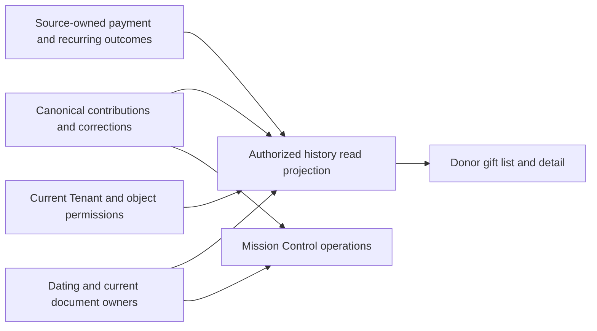

> Historical research record adopted for AL-1563. Scope and testing are ratified; earlier pending decisions and research-only workflow restrictions below preserve chronology. The [implementation specification](../../phase-25-donor-dashboard-depth.md) and its owner contracts are the implementation authority for this proposal. No historical synthetic/source check certifies target runtime behavior.

# Question 05 — Giving history: keep each gift together

> **Explicitly founder-ratified, 7 September2026.** Conrad accepted the corrected Question05 decision and reviewed execution requirements C01–C20. This completed review retains its historical disposition and original ratification question below. They are answered; do not re-ask them. Actual implementation/release proof remains required, and expressly proposed period/control details are not silently fixed.

**Full adversarial review · Phase 25 Donor Dashboard Depth · 7 September 2026**

**Disposition: Accept with required amendments.** Preserve Conrad's selected direction. The amendments below make its meaning precise and remove unsafe implementation assumptions; they do not add a new financial/history authority, donor permission, refund action or document-import capability.

Conrad chose: “My choice is keep each gift together,” and requested deep UX/UI, CRM/database and all-category review. That choice is recorded as selected. This review's corrected wording and execution qualifications are presented for ratification; they are not silently promoted into accepted code or merged contracts.

Every grill question will use a stable number and descriptive title. This remains **Question 05 (R05)**, including its review/ratification. The next distinct product decision will be Question 06. Earlier R01–R04 decisions remain settled.

This is a finished research/adversarial-review record, **not a PRD, formal specification, implementation ticket set or release-readiness certification**. No `/to-prd` or `/to-issues` was invoked. Source, GitHub and live providers were not changed. The existing five-file Supabase setup patch was preserved. Scratch experiments used synthetic records and disposable local containers only.

## The corrected decision to record

> Within the donor's current authorized giving context, Giving history keeps each source-owned gift, its permitted allocations and material later changes together. It shows the recognizable original gift, truthful current outcome and available current documents without making the donor reconstruct one gift from unrelated-looking transactions.
>
> Recorded payments that are processing, failed or unresolved remain understandable through their existing intake/payment/recurring source. They do not create placeholder contributions, received totals, tax dates or receipts. When a contribution is actually posted, exact source correlation keeps its history connected without duplicate entries or money.
>
> Separate charge, issuer, Party, currency and recurring-occurrence boundaries remain intact. Amounts, dates, refunds/returns, corrections, legal credit and document availability come from their existing owners. Mission Control and the Donor Portal use the same financial meanings through different authorized projections.
>
> Important outcomes are visible on the list; details, existing documents and safe help are easy to reach. Recent changes to older gifts remain findable. Filters, continuation, totals, exports, caches and deep links preserve current scope and honest coverage. The interface uses exact Maia/Base UI/shared tokens and works on mobile, with assistive technology and on slow connections.
>
> This decision creates no second ledger, raw provider-event feed, unread tracker, new authorization, implicit payment retry, refund initiation, receipt generation, historical artifact import or expansion of future-phase products. Source-owned security/access audit remains permitted and required where its existing contract calls for it.

**What changed from the short answer:** “one gift together” now expressly covers source-linked pre-posting outcomes, separate real payment groups, original/current facts, partial permissions, current document access and stable retrieval. These are necessary qualifications of the selected experience. No new business authority is recommended. The one-time pre-posting correlation, source history continuation and complete document paths are **owner completion/activation requirements**, not evidence that the portal may invent them.

## Adversarial check

### What could go wrong with this answer?

Grouping can hide a new refund, merge independent payments, double-count splits or imply a receipt exists. The current code also mislabels refunds, drops currency and generates receipt text from current data. Keep grouping, but require source-owned relationships and truth at every layer.

### What hidden assumptions are we making?

Not every visible payment has a contribution yet; not every contribution is cash, deductible, wholly visible or receiptable; not every historical import includes trusted documents. Current profile ownership is not the complete target representative model. Unknown facts must remain explicit.

### How does this affect the whole product?

Asym Postgres remains the CRM authority under ADR-0001. Mission Control retains staff correction/operations, the Donor Portal provides permitted self-service, and missionary/public projections retain their stricter exposure rules. History does not synchronize a new external CRM or create an alternative accounting or communication truth.

### How does this affect the end-user experience?

A donor recognizes a gift once, sees its meaningful state, opens its allocations/changes and retrieves a genuine existing document. A failed query is visibly retryable; a missing record has a useful help path. Necessary complexity stays in the source services and does not become a noisy dashboard.

### Does this follow modern best practices?

Fundraise Up and Blackbaud document grouping split gifts; Church Center documents separate history/document jobs and filters. These are **Useful precedents**, not measured Asym usability. Native semantics, clear state and proportionate progressive detail are **Durable patterns**. Current primary PostgreSQL, Stripe and accessibility references qualify technical details below.

### Does this fit Asym’s existing repo and product direction?

Yes. Source ownership, scoped projections, original money/currency, current artifacts and source-owned recurring lifecycles are inherited requirements. Some current implementations and older ticket bodies conflict with later accepted contracts; those defects must be reconciled rather than preserved for consistency.

### Should we adjust the recommendation?

Keep the selected direction and adopt C01–C20. No new source-of-truth amendment is needed for grouping. A proposal that changes financial identity, authority, historical artifact intake or retention would require a separate explicit amendment; this review does not make one.

## The donor journey, worked through

The following is an illustrative scenario, not an observation of a real donor. A donor gives **USD100 on August5**, allocated **USD60 to a missionary and USD40 to a water project**. A **USD20 refund** is subsequently confirmed by the owning service.

### Recognize the gift without reading a financial report

The ordinary list presents a compact, readable entry with the owner-qualified date, permitted original amount/currency, safe purpose label and current meaningful status. Example content:

<!-- prettier-ignore -->
| Gift | Current outcome | Access |
| --- | --- | --- |
| August5 · USD100 · Two permitted designations | Partially refunded · USD20 | View gift · Available receipt |

“Available receipt” appears only when the document owner supplies actual current availability and the viewer has access. If no issued receipt exists, show its honest state or omit the download and retain help; never manufacture a URL. A meaningful refund/return/processing state is visible without opening a menu.

On mobile, the same information can stack into a labeled item. Do not require horizontal scrolling to connect the amount to the status. Do not render duplicate focusable mobile/desktop controls. Use ordinary links/buttons and the existing shared components; clicking a whole row is not the only accessible route to detail. No confirmation or success toast is needed for ordinary browsing.

### Open one stable gift-detail destination

The detail page provides the same recognition anchor, the permitted allocation breakdown, safe payment facts, material dated changes, authorized current documents and contextual help. Browser refresh, copied navigation links, authentication return and Back all work. A list disclosure can support scanning, but is not the only way to reach detail.

The example retains the original USD100 and shows the source's USD60/USD40 allocation facts. The USD20 refund has its actual stage/date and allocation effect only if the source knows it. Do not infer proportional allocation, replace the original amount with USD80, or label USD80 deductible. If the donor covered fees, show source-owned paid/designated/fee-cover facts with distinct labels; actual processor fees do not become a donor-chosen amount.

A source-authorized related recurring arrangement is a link to its existing owning journey. History does not add route-level Stripe calls or invent a Retry control from a Failed label. A list/detail read or document download has zero charge, refund, recurring-lifecycle, consent, issuance or message-send effect.

### Keep later changes findable without building another feed

An old gift's new refund/correction must remain easy to find. The recommended simple mechanism is an optional **Recently changed** ordering or equivalent qualified change filter over the same grouped entries. It uses donor-visible source changes, excludes private staff notes and does not change the giving/tax date. The exact control is a design recommendation; the required outcome is discoverability. A reliable existing source notice/deep link may supplement it but cannot be the only path when that notice is unavailable.

Do not create unread counts, activity ranking or a second event store. Do not move the donor's reading position unexpectedly. If truth changes while the detail is open, update it coherently or clearly request refresh; stable layout does not justify preserving a false actionable state.

### Filter and continue with honest scope

Keep period, ministry and status controls understandable and based on authorized source data. A filter to the USD60 ministry must distinguish the matching allocation from the entire USD100 gift. Reveal the parent total/sibling count only if independently permitted. Existing represented-context boundaries apply to filters, summaries, search hints and exports as well as rows.

Recommend a bounded first page across available history to avoid an apparently empty January and arbitrary five-year exclusions. **This remains a presentation recommendation, not a founder-ratified default.** The selected answer does not settle date windows, page size, table versus stacked layout or an additional activity tab. Exact totals must have the same declared measure/scope or be clearly labeled otherwise. An annual operational summary is not an official statement. No unlike-currency grand total is shown.

Continuation has a deterministic source order and tie-breaker. A correction that changes membership/order either preserves the documented traversal or produces a clear refresh/restart preserving filters. Current authorization is checked on each request. A cursor is not permission and a long-lived database snapshot cannot freeze access across scrolling.

### Make slow, empty and failed states understandable

Initial loading uses local skeletons within the correct brand/context, not zero totals. Empty filters offer reset. Unlinked identity, known incomplete history, no admitted records, denied access, transport failure and source updating have different explanations. A continuation failure preserves already loaded authorized entries and retries the failed boundary; it is not the end of history.

After a context switch, old rows must not remain under the new donor heading. A late response is rejected. Expired sign-in returns to the intended permitted gift; revoked access removes protected content and offers a safe destination. Help uses permitted source references and existing organization channels rather than requiring sensitive screenshots or raw Stripe IDs. Phase19's existing document-help intent families remain authoritative.

### Keep the visual system and accessibility exact

Use shared `@asym/ui`, **base-maia**, Base UI and semantic CSS-variable tokens. Prefer the simplest table/list, disclosure, filter and feedback components. The repo pins Base UI1.5.0 while current public docs describe1.8.0; verify APIs against installed wrappers rather than silently upgrading.

Use visible labels and text status, comfortable touch controls, proper focus/Back restoration, screen-reader result announcements and localized dates/amounts. Test320-CSS-pixel reflow/400% zoom, long names, text spacing, large type, supported RTL/locales and reduced motion. Core's44px touch target is a product guideline; WCAG2.2 AA Target Size Minimum specifies24px with exceptions. A static gift table does not require ARIA-grid keyboard complexity. [W3C table guidance](https://www.w3.org/WAI/ARIA/apg/patterns/table/), [Reflow](https://www.w3.org/WAI/WCAG22/Understanding/reflow.html), [Target Size Minimum](https://www.w3.org/WAI/WCAG22/Understanding/target-size-minimum.html).

## How this fits CRM and the database

### One financial truth, purpose-specific views

ADR-0001 makes Asym Postgres the system of record for CRM; Twenty is retired. The permanent design therefore does not require donor-to-external-CRM synchronization. Phase13 owns contribution headers, allocation lines and effective append-only money corrections; Phase16 owns recurring intent/occurrences/attempt relationships and recovery; Stripe owns its processor execution evidence. Phases7/18/19 own dating/receipt facts, generated artifacts/access and statement operations. Phases3/10/12 own projections, exposure and current permissions. Phases6/17 own communications. Phase24 supplies the unified receiving organization host/brand and Site context.

The diagram shows read composition, not a proposed new database table. Mission Control and the donor view use common financial meanings; the donor never receives the staff record wholesale. Current staff shared row derivations and root-first hydration are **Useful precedents**. Their legacy `donations`/staging schema and staff capabilities are not the complete Phase13 target or donor authorization contract.

### Information the existing owners must supply

<!-- prettier-ignore -->
| Source responsibility | Required read information | Forbidden shortcut |
| --- | --- | --- |
| Intake/payment/Phase16 before posting | Typed scoped source reference, known outcome/time, exact relationship to an eventual contribution | Placeholder header; cart/email/amount matching; one new gift for each retry |
| Phase13 money | Canonical header/line identity, exact same-scope relationships, original/current facts and effective correction version | Portal-local ledger, browser refund math, charge ID as donor identity |
| Phase7 dating/receipt facts | Exact issuer-qualified dating and eligibility/current facts where authorized | Browser timezone as tax-year authority; profile edits rewriting an issued receipt |
| Phase18/19 documents | Exact current availability, artifact/access and correction/help state | Success-count receipt, synthesized historical text, foreign artifact migration |
| Phases3/10/12 scope | Current row/object/action and field-safe projection, including filters/totals | Relationship or stored URL as access; staff DTO passthrough |
| Phase24 context | Current verified host/brand and retained historical Site/issuer/binding provenance | Current Site/payment defaults rewriting old gifts |

The exact general one-time pre-posting reference/link contract needs completion by its owner before activation. The review identifies the required outcome and existing owner dependencies; it does not invent a Phase25 root ID or final schema. A rebuildable SQL view/index/materialized read projection is allowed when justified by measured queries. It must be disposable, scope-safe and derived; rebuilding it cannot change money, dates, receipts or authorization.

### Database invariants and query discipline

- **Same-scope references:** composite Tenant and applicable entity/source keys guard parent/child links. Different actor, legal donor, representative, payer and document recipient roles remain distinct; do not impose false equality across legitimate roles.
- **Source cardinality:** one canonical contribution header has its admitted allocation set; source-defined amounts conserve its total. Attempts, refunds, corrections, documents and recognition roles have their own cardinalities. Independent child joins never multiply totals or gift counts.
- **Money and absence:** checked integer/numeric source types preserve currency/exponent/range. Null/unknown/unvalued/redacted is not zero or a guessed currency/date. Noncash descriptions/quantities remain distinct from cash and internal valuation.
- **Historical integrity:** original/issued facts and durable corrections use owner-qualified immutable/versioned forms. Application service-role access is not an exemption. Delete/retention/hold behavior remains source-owned; a convenient cascade is not permission to erase required financial/document evidence.
- **Authority:** donor history grants no financial INSERT/UPDATE/DELETE. Actual source commands derive Tenant/actor/role/attribution from trusted context. SQL policies, views/functions, service paths, exports and storage must enforce equivalent scope. Existing browser-write revocations are real controls worth preserving.
- **Effective policy proof:** test the actual role/owner/grant/policy combination. PostgreSQL reuses UPDATE/ALL `USING` as `WITH CHECK` when omitted; the absence of those words alone is not a vulnerability. `SECURITY DEFINER` runs as its owner; bypass depends on privileges/ownership/FORCE. Current authorization must not remain frozen in a historical snapshot. [PostgreSQL17 CREATE POLICY](https://www.postgresql.org/docs/17/sql-createpolicy.html), [row security](https://www.postgresql.org/docs/17/ddl-rowsecurity.html).
- **Coherent reads:** root membership, allocation/effect folds and matching totals need a qualified consistent version. A single statement or bounded consistent read is preferable where practical; an explicit version mismatch can require retry. Do not hold a transaction while a donor reads pages. Keyset paging needs stable order, current scope and relevant-change handling, not merely an ID token. [PostgreSQL17 isolation](https://www.postgresql.org/docs/17/transaction-iso.html), [LIMIT/OFFSET](https://www.postgresql.org/docs/17/queries-limit.html).

## Current behavior versus intended behavior

The actual donor path is page → hook → route-backed collection → `/api/donor/portal` → donor service → legacy donations/model. It is **not an all-mock screen**; its test mode returns seeds, while ordinary execution fetches the route. That real wiring is a **Temporary bridge**, not proof of complete self-service.

<!-- prettier-ignore -->
| Current observed behavior | Permanent direction | Evidence level |
| --- | --- | --- |
| Portal fetch stops at250 rows; local five-year filter and page sums claim completeness | Owner-filtered bounded continuation, declared coverage and summaries independent of loaded pages | Source; exact caps/config verified |
| Currency drops at the browser boundary; JPY100 becomes1; USD+EUR combines | End-to-end checked currency/exponent and per-currency measures | Source plus pure-model reproduction |
| Refunded becomes Failed; refund/effect details absent | Same qualified financial/correction semantics as CRM, with safe donor projection | Source plus model reproduction |
| Every donation receives a receipt URL; direct GET returns text for failed/processing records | Existing exact current artifact and source-approved unavailable/help states | Actual-source mocked-route reproduction |
| Receipt text uses current profile/designation values | Immutable issued facts/content and qualified succession through document owners | Source; no hosted document inspected |
| Details/Manage Recurring controls are inert; failed history load looks empty | Working stable destinations and distinct errors/recovery | Source; browser journey not run |
| Legacy FK references donor ID without Tenant; receipt service writer has UPDATE/DELETE and no user trigger | Target same-scope constraints and privileged-writer historical integrity | Actual post-migration catalog observations |
| Signout/user-change clears QueryClient; fixed-user represented-context safety not proved | Preserve existing clearing and add exact current-context/late-response proof | Source mitigation plus conditional target risk |

The full concern register below assigns severity, likelihood, evidence, effect on the decision, prevention and exact C01–C20 language. It does not describe any unobserved hosted incident as verified.

## Individual category review

All22 requested categories are evaluated independently below. Nineteen have material implementation/dependency concerns; three have no additional material concern under the chosen bounded design. Findings F01–F20 supply the complete concern record and exact C01–C20 language. A category may reference the same root finding as another category; that is deliberate deduplication, not an omitted review.

Likelihood describes the inspected trigger or conditional design risk, not an invented incident probability. Critical/High indicate potential confidentiality or money/document harm; Medium indicates substantial usability, reliability or operational harm. Current-source defects, hypothetical hazards and live incidents are never conflated.

### 01. Problem validity, necessity, and alternatives

**Material concern: No material concern with the chosen organizing principle.** A donor needs to recognize a gift, understand its outcome and retrieve its existing document. Keeping that source-linked information together solves this task directly. The strongest alternative is dated financial activity for bank reconciliation; it requires more mental joining. Annual summaries can accompany either and are not a competing choice. Asym-specific task frequency/usability has not been measured. Exact widgets/default period are not frozen by the answer.

### 02. Brittleness

**Material concern: Yes.** Header-only reads fail before posting; three-state models cannot survive refunds/returns; unknown dates and mutable sort keys break ordinary assumptions. Replace assumptions with typed source facts, explicit absence and a tested continuation contract.

**Complete concern records:** F01, F02, F06, F08. Each includes severity, likelihood, evidence, disposition, permanent prevention and exact required language.

### 03. Technical debt

**Material concern: Yes.** The live donor DTO, money formatting and text documents duplicate shallower logic than staff/source services. A second history ledger would deepen that debt. Reuse qualified owner logic through a donor-specific projection and retire conflicting paths.

**Complete concern records:** F03, F04, F12, F17. Each includes severity, likelihood, evidence, disposition, permanent prevention and exact required language.

### 04. Edge cases

**Material concern: Yes.** Reviewed partial/full refunds, pending/failed/unknown payments, late ACH returns, split gifts, multiple charges, identical same-day gifts, offline drafts, imports, noncash, anonymous gifts, DAF/matches, date corrections, old Sites, restricted ministries and representative scope. Required outcomes and proof cases appear below; none may become a fabricated gift/amount/document.

**Complete concern records:** F01, F02, F05, F06, F09, F13. Each includes severity, likelihood, evidence, disposition, permanent prevention and exact required language.

### 05. Footguns

**Material concern: Yes.** Success-count receipts, client totals, automatic retry from a Failed label, broad DTO reuse and old route fallbacks make harmful mistakes easy. Prevent them at owner types/commands/grants and remove deceptive controls rather than relying on staff discipline.

**Complete concern records:** F03, F04, F10, F12, F15, F17. Each includes severity, likelihood, evidence, disposition, permanent prevention and exact required language.

### 06. Tenant safety

**Material concern: Yes.** Tenant, represented Party, issuer and Site are different boundaries. Current source filters and signout cache clearing are real safeguards, but not proof of the full target. Composite relations, trusted context, field filtering and stale-response fences must cover rows and every aggregate/export/detail channel.

**Complete concern records:** F05, F09, F10, F11. Each includes severity, likelihood, evidence, disposition, permanent prevention and exact required language.

### 07. Database, RLS, and authorization safety

**Material concern: Yes.** Reviewed actual migration sequence, independent legacy FKs, role grants/RLS, privileged receipt mutability, effective USING/WITH CHECK, source-attributed writes, view/function ownership, immutable history and separate storage access. SQL proof explicitly tests omitted-WITH-CHECK semantics instead of flagging syntax alone. Actual target row/concurrency proof remains required.

**Complete concern records:** F03, F08, F09, F10, F12. Each includes severity, likelihood, evidence, disposition, permanent prevention and exact required language.

### 08. Overengineering

**Material concern: No material need for additional architecture inherent in the answer.** An authorized source projection and one detail destination suffice. Rebuildable indexes/materialized read projections remain permissible where measured. A new financial root, event bus, read/unread ledger, global snapshot service, configurable dashboard engine, donor layout switcher or second UI library is unjustified. The safeguards prevent those additions rather than require them.

### 09. UX/UI and user friction

**Material concern: Yes.** Current inert actions, unlabeled menus, empty-on-error states, caps and money labels block effortless self-service. The proposed list/detail journey keeps status visible, makes documents direct, preserves Back/filter context and supports mobile, localization, keyboard and screen reader without a staff-style console.

**Complete concern records:** F04, F06, F07, F12, F14, F15. Each includes severity, likelihood, evidence, disposition, permanent prevention and exact required language.

### 10. Source of truth, ownership, and domain invariants

**Material concern: Yes.** CRM parity means common financial semantics with different permissions. Contributions, attempts, dating, receipt facts, artifacts, statement operations and communications retain separate owners. Visual grouping cannot create authority, conservation changes or cross-owner atomic completion.

**Complete concern records:** F01, F02, F03, F05, F12, F13, F16. Each includes severity, likelihood, evidence, disposition, permanent prevention and exact required language.

### 11. Hidden coupling

**Material concern: Yes.** History currently depends on a broad portal snapshot and assumes live donor/profile/designation values for receipts. Reusing staff DTOs or provider response shapes would bind donor UX to unrelated domains. Keep surface adapters thin and compose only qualified source projections; isolate optional section failures.

**Complete concern records:** F01, F11, F12, F17, F18. Each includes severity, likelihood, evidence, disposition, permanent prevention and exact required language.

### 12. Failure modes

**Material concern: Yes.** Read errors, partial pages, stale projections, document delays and ambiguous external outcomes need distinct states. Current async normalization defect is reproduced. Reads retry safely; source changes, artifact work and delivery reconcile independently without pretending all-or-nothing success.

**Complete concern records:** F02, F07, F08, F12, F15, F16. Each includes severity, likelihood, evidence, disposition, permanent prevention and exact required language.

### 13. Lifecycle, temporal correctness, concurrency, and idempotency

**Material concern: Yes.** Reviewed pre-posting to contribution linkage, repeated attempts, duplicate/out-of-order success, refunds/returns/disputes, date corrections, current grant revocation, list/detail coherence and mutable pagination. Browser transport dedupe is insufficient; owner semantic effect identities and source versions govern business outcomes.

**Complete concern records:** F01, F02, F06, F08, F15, F16. Each includes severity, likelihood, evidence, disposition, permanent prevention and exact required language.

### 14. Data integrity risks

**Material concern: Yes.** The principal risks are fanout totals, lost currency, wrong dates, duplicate imported/phone gifts, invalid cross-tenant relations and stale-read mixtures. Each has a source constraint, admission boundary, projection rule or explicit counterexample/proof requirement rather than a cleanup-only remedy.

**Complete concern records:** F03, F04, F05, F06, F08, F10, F13. Each includes severity, likelihood, evidence, disposition, permanent prevention and exact required language.

### 15. Security and privacy risks

**Material concern: Yes.** Reviewed authentication context, narrow representative grants, sensitive ministry labels, direct document access, URLs/caches, raw provider payloads, exports, logs, retention and backup restoration. No deployed exploit is alleged. Minimize projected data and require current authorization at each enumeration/byte boundary.

**Complete concern records:** F09, F10, F11, F12, F19. Each includes severity, likelihood, evidence, disposition, permanent prevention and exact required language.

### 16. Scalability and performance risks

**Material concern: Yes.** Current250/1000 caps are verified source/config facts, not capacity. Root-grain bounded queries, indexes, scoped continuation and non-page totals require measured workload proof. Applicable Phase16 budgets must not be misrepresented as a global history SLA. No per-gift live provider fanout or unbounded export is acceptable.

**Complete concern records:** F03, F07, F08, F18. Each includes severity, likelihood, evidence, disposition, permanent prevention and exact required language.

### 17. Operational burden

**Material concern: Yes.** Missing records and delayed documents otherwise require developer intervention or direct DB repair. Reuse source reconciliation, exact contextual help and owner recovery; preserve known coverage without creating a second support/correction system.

**Complete concern records:** F12, F13, F15, F17, F18, F19. Each includes severity, likelihood, evidence, disposition, permanent prevention and exact required language.

### 18. Observability and auditability gaps

**Material concern: Yes.** Technical request failures/lag, security egress and immutable business history must remain distinct. Trace safe source IDs/versions and normalized reasons without accumulating sensitive content or claiming a download/view proves issuance, delivery, acknowledgment or consent.

**Complete concern records:** F08, F15, F18, F19. Each includes severity, likelihood, evidence, disposition, permanent prevention and exact required language.

### 19. Dependency and integration risks

**Material concern: Yes.** Current Stripe documentation, pinned API/SDK, Base UI version difference, source PR states and actual issue blockers were checked. Provider delivery is asynchronous and not ordered; active specs and old tickets disagree. The portal must consume reconciled source contracts and pinned supported components.

**Complete concern records:** F14, F16, F17, F20. Each includes severity, likelihood, evidence, disposition, permanent prevention and exact required language.

### 20. Migration, rollout, and upgrade risks

**Material concern: Yes.** Legacy and new sources can run side by side, backfills can guess identity, and rollback can revive synthetic receipts. Admit source slices only after proof, use truthful unavailable states during containment and preserve source history. Actual forward migration verification is separately reported with its limits.

**Complete concern records:** F10, F12, F13, F17, F18, F20. Each includes severity, likelihood, evidence, disposition, permanent prevention and exact required language.

### 21. Testability, traceability, and proof

**Material concern: Yes.** Existing seed/mocked/source-regex tests do not prove actual donor journeys or current RLS. This review supplies falsifiable target outcomes, exact source references and executed counterexamples with limits. Map the numbered decision and clauses to owner contracts/issues/tests only at the authorized publication stage.

**Complete concern records:** F01, F07, F08, F10, F12, F14, F16, F20. Each includes severity, likelihood, evidence, disposition, permanent prevention and exact required language.

### 22. Other development hazards

**Material concern: No additional material concern beyond those explicitly recorded.** Checked accidental permission expansion, route renaming, provider changes, new retention obligations, placeholder future products, feature-flag fallbacks, delete cascades and missing rollback paths. Those risks are already assigned to specific findings/owners. No speculative framework, new product scope or extra implementation ticket is justified by this category.

## Concern register and exact required amendments

The following clauses are reviewed grooming requirements to carry into the later authorized specification, not newly issued formal contracts. They preserve the source owners named above.

### F01 — A processing payment cannot be a placeholder contribution

**What could go wrong:** A header-only list loses processing/failed giving; a placeholder contribution invents received financial identity; grouping by amount, date, customer or cart can combine independent gifts.

**Why it matters:** A donor can lose track of a payment or see it twice after settlement, while the CRM and portal disagree about actual giving.

**Severity:** High. **Likelihood:** The source seam is observed; a harmful implementation is conditional. Processing and retries are normal supported states.

**Evidence/reasoning:** P13:981–989; DL:44–81,83–147; P16:1454; CONTEXT:222–234. Current general one-time origin-to-header read contract is not fully named in the inspected sections.

**Effect on the answer:** Qualifies the chosen presentation; does not change gift identity or authorize a new history root.

**Best permanent prevention:** Complete the existing intake/payment/occurrence owner's typed, scoped origin-to-contribution correlation and use a disposable read projection. Preserve independent legal/entity/charge/occurrence boundaries.

**Exact language to add:**

> C01 — Before posting, display the currently authorized recorded payment/intake/occurrence outcome from its owner. On posting, link the exact contribution and preserve one understandable entry through source-proved correlation. Do not invent a header, tax date, receipt, completed gift or second authority. Never group by similarity or count retries/allocations as separate gifts.

### F02 — One status label hides independent financial and document outcomes

**What could go wrong:** Refunds become Failed, processing becomes received, requested refunds appear completed, or late ACH returns erase earlier history. A corrected gift can disagree temporarily with its document.

**Why it matters:** Donors can misunderstand whether money was collected/returned and act on a false recovery or receipt claim.

**Severity:** High. **Likelihood:** Refund-to-Failed is reproduced in current Core. Late and partial outcomes are supported cases; their live frequency is unknown.

**Evidence/reasoning:** model.ts:6,302–306; model experiment M01; P13:983–1002; DL:217–264; Stripe Refund object and webhook documentation.

**Effect on the answer:** Requires explicit source-derived state composition, without reopening source lifecycle rules.

**Best permanent prevention:** Project separate payment, contribution/correction and document meanings into concise donor language; expose only current source-authorized actions. Keep a dated material-change explanation inside the gift.

**Exact language to add:**

> C02 — Preserve original gift evidence and distinguish processing, failed, unknown, attention-needed, confirmed collection, partial/full refund, returned and dispute outcomes as admitted by the owner. Pending refund is not completed refund; returned is not refunded. A read, filter, method save or document download never retries a payment, cancels giving or creates a gift.

### F03 — Totals can multiply across allocations and refund rows

**What could go wrong:** Joining headers, lines and refunds then summing repeats the header and refund amounts. Subtracting a refund in both the owner fold and browser double-counts it.

**Why it matters:** The portal can show a plausible but wrong amount and disagree with Mission Control.

**Severity:** High. **Likelihood:** Synthetic SQL reproduced a $100 header summed as $600 and $20 confirmed refunds summed as $40. This proves the query hazard, not a current Core join defect.

**Evidence/reasoning:** SQL experiments E01–E03; P13 header/line conservation and append-only fold; DL:254–264.

**Effect on the answer:** Adds a mandatory aggregation safeguard; does not narrow the gift-centered experience.

**Best permanent prevention:** Choose/authorize parent membership independently of child aggregation. Aggregate each child family at its own grain, consume the owner's effective monetary fold and serialize one exact result per source gift.

**Exact language to add:**

> C03 — Compute every amount/count at its declared source grain. Multiple allocations, refunds, attempts, documents and recognition roles must not multiply a gift or its effects. The portal must not recalculate an already-folded refund or manufacture a net/deductible amount. Compare list, detail and Mission Control on the same source version.

### F04 — Currency and minor-unit assumptions corrupt amounts

**What could go wrong:** Currency is dropped, USD formatting is applied to all entries, non-USD minor units are divided by100, and unlike currencies are added into one summary.

**Why it matters:** A visually polished page can misstate the donor's giving by orders of magnitude or present a meaningless total.

**Severity:** High. **Likelihood:** USD+EUR blending and JPY100 displayed as1 were reproduced in current Core. Production exposure is not verified.

**Evidence/reasoning:** collection:143–159; packages/lib/utils.ts:10–14; model.ts:348–363,391–393; M03/M04; SQL E06–E08; #1511.

**Effect on the answer:** Mandatory correction to implementation assumptions; original-currency requirement is inherited.

**Best permanent prevention:** Carry checked amount/currency/exponent through every layer and use source-owned per-currency measures. Reject invalid money before rendering; never silently round large integers or fall back to USD.

**Exact language to add:**

> C04 — Preserve each source's exact currency, checked minor-unit amount and exponent through API, browser, formatting and export. Summaries partition currencies and declare scope. No unexplained FX total, fixed cents divisor, unsafe JavaScript integer conversion or default currency for unknown data is permitted.

### F05 — Filtering and credit semantics can overstate giving or reveal hidden siblings

**What could go wrong:** Filtering a $100 gift to its $60 ministry allocation attributes the full $100 to that ministry; recognition/pledges/matching expectations/noncash valuations are mixed with legal cash giving; parent totals reveal a restricted allocation.

**Why it matters:** Donors, missionaries and finance receive different meanings for the same numbers, and partial grants can expose private information.

**Severity:** High. **Likelihood:** Foreseeable with the current one-recipient shape and local totals; specific target exposure has not been tested live.

**Evidence/reasoning:** P14:325,340–347,432–477; P13:1177–1196; P16:1008–1013; current collection lacks split/credit distinctions; SQL E05.

**Effect on the answer:** Preserves existing financial and permission boundaries; new recognition browsing remains out of this decision.

**Best permanent prevention:** Define whether a filter measures whole gifts or matched allocation amounts; show both only if independently allowed. Reuse Legal/Recognition folds and separate noncash descriptions from authorized cash/valuation measures.

**Exact language to add:**

> C05 — A ministry-filtered result must distinguish matched allocation from whole-gift amount and reveal only admitted parent/sibling facts. Legal giving, recognition, commitments, expectations, deductible amounts, fees and noncash values retain their source meanings and separate totals. Unknown/redacted value is not zero. Recognition alone grants no donor/representative detail or receipt access.

### F06 — Dates and old-gift changes can become misleading or undiscoverable

**What could go wrong:** Unknown dates become1970, browser timezones change tax-year buckets, imported/recorded dates replace giving dates, or a new refund on an old gift disappears in the list.

**Why it matters:** Donors cannot find the record or reconcile dates and documents; engineering may silently rewrite historical meaning for sorting convenience.

**Severity:** High for financial dates; Medium for finding friction. **Likelihood:** Epoch fallback reproduced; browser-year behavior observed. Older corrections are foreseeable supported cases.

**Evidence/reasoning:** model.ts:323–329; M06; history page:83–93,541–556; P7:320–322; P13:1428,1457,1481; P15:905,1558.

**Effect on the answer:** Qualifies execution and makes later changes discoverable; does not change source dating policy.

**Best permanent prevention:** Use authoritative dating facts and clearly distinguish payment/change/recording timestamps. Preserve the original gift and provide a simple source-backed recently-changed path with the same gift grouping.

**Exact language to add:**

> C06 — Keep giving/tax date, payment/change time and recording/import time distinct. Unknown dates stay unknown. A changed-date ordering never changes the giving date. Recent donor-visible changes to older gifts must be findable without scanning all history; use qualified change metadata, with no unread ledger or second activity product. Default period and exact control remain presentation proposals.

### F07 — Loaded-page totals and fixed caps masquerade as complete history

**What could go wrong:** The250-row snapshot, five-year options and client-side filtering silently omit older gifts; annual statement reads can hit the committed1000-row API cap; an export or summary represents only the loaded slice.

**Why it matters:** Donors can make financial/document decisions from incomplete data without knowing it.

**Severity:** High. **Likelihood:** Caps and missing continuation are observed in source; actual affected donor volume is unknown. The1000 maximum is repository configuration, not confirmed hosted configuration.

**Evidence/reasoning:** service.ts:205–215,285–300; supabase/config.toml:18; history page:83–93,541–584; P16/#811 pagination requirement.

**Effect on the answer:** Requires complete query-scope retrieval and honest coverage; no permission to promise universally complete imports.

**Best permanent prevention:** Filter at the owner query before bounded continuation; calculate summaries over the declared authorized set; return explicit continuation/coverage/error metadata. Govern exports independently from browser rows.

**Exact language to add:**

> C07 — Pagination, search, filters, totals and exports must cover their declared authorized source scope. A loaded page is not the full result. Do not hard-code a five-year horizon, suppress truncation, invent an exact count or claim complete/lifetime/deductible history without evidence. Missing-source coverage must remain distinct from end-of-results and no matching gifts.

### F08 — Pagination and snapshot shortcuts fail when history changes

**What could go wrong:** Offset paging repeats entries after insertion; keyset paging alone misses records whose sort key changes; separate reads combine a header with a newer refund; a long snapshot retains revoked permissions.

**Why it matters:** The donor sees duplicate/missing gifts, contradictory amounts or stale access while the page still appears reliable.

**Severity:** High. **Likelihood:** All four counterexamples were reproduced in synthetic PostgreSQL17.10. Their presence in future Core queries depends on implementation.

**Evidence/reasoning:** SQL E14–E24; PostgreSQL17 transaction isolation/LIMIT documentation; P12 current authorization; #811 source cursor/scope requirements.

**Effect on the answer:** Adds precise continuation and coherence requirements, without introducing a new financial sequence or long-lived snapshot store.

**Best permanent prevention:** Use source-owned stable keys, a total order and query/scope/version-bound continuation. Build coherent responses with bounded consistent reads. Detect relevant membership/order changes and explicitly restart stale continuation while preserving the user's filters; authorize anew for every request and artifact access.

**Exact language to add:**

> C08 — A cursor binds Tenant, viewer/represented scope, normalized query and supported source ordering/version. Each response and download obtains current authorization. Relevant changes must either preserve the documented traversal or return a typed refresh/restart; never silently lose or duplicate entries. Do not hold a database transaction or freeze permission snapshots across page requests, and do not treat max(sequence)/timestamp alone as committed-order proof.

### F09 — Tenant, Party, Site and issuer context can be conflated

**What could go wrong:** Client selectors, shared email, household membership, a representative relationship or current Site/account configuration are treated as access to all giving or as authority to relabel old gifts.

**Why it matters:** This risks cross-tenant or cross-person disclosure and changes the historical legal/merchant context.

**Severity:** Critical if unauthorized data is disclosed. **Likelihood:** Conditional target risk; no live cross-tenant exploit was demonstrated. Current portal resolver is narrower than the complete target relationship model.

**Evidence/reasoning:** ADR0001/Phase1 matrix; P4/P9/P10/P12; R04; P24:347–353,434–448; P16/#811 current scope.

**Effect on the answer:** Preserves settled access and brand boundaries; no new grants.

**Best permanent prevention:** Derive actor/Tenant from trusted session/host and resolve Party/object/action scope at the source. Preserve historical issuer/Site/currency/binding facts independently of current navigation context.

**Exact language to add:**

> C09 — Every list, detail, count, filter option, export, document and help context is independently scoped to the current authenticated human and admitted giving context. Neither household/shared email/recognition nor a URL creates authority. Site/host/account changes do not transfer old gifts or erase provenance. Denied identifiers use the existing safe not-found/access contract without metadata leakage.

### F10 — RLS, grants and privileged paths must enforce the same authority

**What could go wrong:** A broad service-role query or view bypasses row/field policy; a scoped foreign key points across tenants; a writable row can change its ownership/actor fields into an unauthorized state.

**Why it matters:** Application filtering alone cannot establish a safe permanent data boundary, particularly for financial and sensitive-ministry history.

**Severity:** Critical if bypass reaches protected data. **Likelihood:** Current schema/catalog gaps were verified after actual migrations in isolated PostgreSQL; exploitable target/deployed row exposure remains conditional and unproven.

**Evidence/reasoning:** ADR0001 composite keys/RLS; runtime migration audit; PostgreSQL17 RLS/CREATE POLICY; SQL E09–E13. Actual native verifier applied76 forward migrations on PostgreSQL17.10: authenticated role lacked direct INSERT/UPDATE/DELETE privileges on public.donations; donation→donor FK is donor_id-only; service_role has receipt UPDATE/DELETE and BYPASSRLS; receipt table has no user trigger.

**Effect on the answer:** Mandatory database/adoption proof; absence of literal WITH CHECK alone is not a finding.

**Best permanent prevention:** Use composite tenant-aware references, correct grants/owners/RLS and allowlisted privileged queries. Keep donor history read-only; trusted source commands own financial writes. Verify effective USING and post-update WITH CHECK, views/functions and storage separately.

**Exact language to add:**

> C10 — Database constraints and source commands preserve tenant/entity/Party/source references and immutable financial history. Donors receive no history-money INSERT/UPDATE/DELETE authority. Derive attribution and scope server-side. Test effective grants, RLS USING/WITH CHECK, views, function ownership/search_path, BYPASSRLS/service paths and storage access. Omitted UPDATE WITH CHECK inherits USING in PostgreSQL; SECURITY DEFINER behavior depends on owner privileges, so syntax alone is not proof.

### F11 — Cached responses and metadata can cross a context change

**What could go wrong:** A global query key, late response, restored tab, cached total or filter suggestion appears under a new donor context; private names or document URLs leak through logs, referrers, analytics or support payloads.

**Why it matters:** Even a correctly authorized original response becomes unsafe when reused for another context or purpose.

**Severity:** High to Critical depending on exposure. **Likelihood:** Current collection key lacks context dimensions; an exploitable switch race is not proven in the current narrower UI. The target R04 switch makes correct fencing necessary.

**Evidence/reasoning:** collection:163–177; R02/R04 current-context safeguards; P10/P12; current minimal history wire shape and privacy requirements.

**Effect on the answer:** Adds all-channel context/minimization safeguards, not a new session or consent system.

**Best permanent prevention:** Scope query/cache identity and response acceptance to current viewer/context/permissions/query; cancel/discard obsolete requests and clear protected state on logout/revocation. Serialize safe fields, not staff DTOs.

**Exact language to add:**

> C11 — Cached rows, summaries, filters, documents and help data must retain their exact authorized context and freshness basis. Never display an old response under a new context/filter heading. Minimize URLs/logs/analytics to permitted opaque references and reason codes; exclude private ministry identities, raw financial/provider payloads, credentials and protected byte URLs. Restoring an old tab is not renewed permission.

### F12 — Receipts and statements are currently generated from the wrong truth

**What could go wrong:** A donation URL is presented as a receipt without issuance proof; GET builds text from mutable donation/profile data, including unsettled/failed rows; annual statements use current query sums; imported records are assumed to have downloadable artifacts.

**Why it matters:** The portal can fabricate or misstate an official-looking document and bypass correction/currentness policy.

**Severity:** High. **Likelihood:** Constructed URLs/count assumptions reproduced. Actual-source receipt-route control flow with mocked dependencies also returned200 receipt text for failed, refunded and processing donations. No hosted document was accessed.

**Evidence/reasoning:** receipts.ts:45–81; statements.ts:56–75; model.ts:348–363; M02/M05; P7/P18/P19; #1023.

**Effect on the answer:** Requires owner-backed document access and legacy renderer retirement. It does not authorize regeneration or foreign artifact intake.

**Best permanent prevention:** Use Phase7 facts, Phase18 exact current artifact/access and Phase19 statement operations. List only owner-authorized available documents or honest unavailable/updating/help states; keep access reauthorization at bytes/ranges.

**Exact language to add:**

> C12 — Payment success and a constructed URL do not prove document existence, eligibility or current access. History downloads retrieve the exact authorized current artifact through its owner; they do not create/reissue/send documents. A financial correction may precede its document correction. Never serve a stale artifact as fallback, render live profile facts as historical receipt truth, or bypass Phase18 D17’s ban on foreign/legacy artifact conversion, import, backfill or compatibility aliases. Issued facts/content remain immutable against the application’s privileged writer; corrections use owner-qualified succession.

### F13 — Offline/imported breadth can duplicate money or expose drafts

**What could go wrong:** A batch tracking row and its online payment are counted twice; incomplete/ambiguous imports become received gifts; source counters create history; guessed donor matches or old provider IDs create access/control.

**Why it matters:** Broad history becomes unreliable and can disclose or replay records that were never admitted by the owning source.

**Severity:** High. **Likelihood:** Conditional target risk reinforced by concrete stale #711/#704 body guidance.

**Evidence/reasoning:** P15:1937–1975,2153–2170; P13:920,1010–1025,1080,1476; P18:11,84,129,139; #711.

**Effect on the answer:** Qualifies inclusion with existing source admission/provenance. No new import, merge or provider-adoption product.

**Best permanent prevention:** Preserve immutable source-qualified import identity and exact post-commit links; expose only admitted records. Reconcile stale tickets with current receipt/adoption policies before activation.

**Exact language to add:**

> C13 — Include qualified online/offline/imported records across permitted Sites with truthful provenance and coverage. Unsubmitted carts, staff drafts, uncommitted batch rows, ambiguous matches and unverified counters are not received giving. Import/claim/merge remains with its owner. Historical money grants no receipt bytes, provider executor control, accounting export or current personal access by itself.

### F14 — A polished table can still be unusable or silently fail

**What could go wrong:** Inert details links, unlabeled overflow buttons, hover-only actions, USD-only labels, dense mobile tables and empty-on-error states make routine tasks difficult or misleading.

**Why it matters:** Donors contact staff because the basic journey is incomplete, despite the screen looking finished.

**Severity:** Medium, High where failure implies false financial absence. **Likelihood:** Inert actions, missing control name and empty-on-error behavior are observed; full browser/a11y outcomes remain untested.

**Evidence/reasoning:** history columns:191–227; page-content:193–240,456–491,586–634; UX source audit; W3C Table/Reflow/Target Size; Core base-maia rules.

**Effect on the answer:** Strengthens execution without changing the chosen organizing principle.

**Best permanent prevention:** Provide a stable detail destination, direct available-document access, a small labeled filter set and predictable continuation/back behavior. Use shared semantic components with mobile readability, keyboard/focus support and distinct truthful states.

**Exact language to add:**

> C14 — The list visibly connects the owner-qualified date/timestamp and permitted amount/currency (or explicit unknown, unvalued or redacted state), permitted purpose and current status to a working gift-detail link. Important actions are touch/keyboard accessible and not hover-only. Preserve list scope/position on return. Distinguish loading, no matches, no linked history, incomplete coverage, denied access and failed load. Use exact base-maia/Base UI/shared tokens; validate actual pinned APIs and do not add a second component system.

### F15 — Read failure and recovery must not create financial side effects

**What could go wrong:** An async rejection escapes error normalization, timeout becomes Failed, unknown payment prompts a second gift, or browser retry invokes a write/action it did not mean to request.

**Why it matters:** An unclear failure can cause duplicate giving, unnecessary support or loss of confidence.

**Severity:** High for duplicate financial effects; Medium for broken recovery. **Likelihood:** Actual-source mocked execution reproduced a missing-owned-gift promise rejection escaping normalized404 response. No duplicate live financial action is alleged.

**Evidence/reasoning:** route-helpers.ts:32–34; current auth-ownership test scope; DL/P16 recovery; Stripe unknown/async outcome rules.

**Effect on the answer:** Requires normalized, safe retry and source-owned recovery; no donor refund/retry permission is added.

**Best permanent prevention:** Await owned async work within normalization; expose typed safe errors and retry the same read/request identity. Link only to currently admitted recovery commands and show their exact effect before consequential action.

**Exact language to add:**

> C15 — A timeout/unavailable source is not payment failure, empty history or completed work. Normalize asynchronous errors without losing safe not-found/denied semantics. Read retries preserve current context and source identity, duplicate neither entries nor business effects, and never issue a new charge, refund, receipt or email. Unknown money outcomes lead to source readback/help, not an unqualified Give again prompt.

### F16 — Provider delivery is not financial ordering or business identity

**What could go wrong:** Duplicate/out-of-order events duplicate gifts or regress status; deduplication by object/type alone drops legitimate later changes; platform and connected-account evidence is mixed.

**Why it matters:** The donor, CRM and documents can diverge even while every webhook request succeeds.

**Severity:** High. **Likelihood:** Provider documents establish duplicate/unordered delivery. Exact Core connected-account behavior was not financially tested.

**Evidence/reasoning:** Stripe webhooks ordering/duplicates; Refund statuses; pinned Stripe22.2.0/API2026-05-27.dahlia; P13/P16 ownership.

**Effect on the answer:** Requires provider-contract proof within existing owners; history never becomes a provider executor.

**Best permanent prevention:** Use provider-account/mode/object-scoped immutable observations plus owner semantic effect identity/version and reconciliation. Preserve multiple partial refunds and source-qualified late returns; no per-row live Stripe read-through.

**Exact language to add:**

> C16 — Provider events are execution evidence, not donor identity, contribution identity or arrival-ordered truth. Existing payment owners validate signature/account/mode, deduplicate deliveries and durable business effects, retain legitimate later observations and reconcile missing/contradictory outcomes. History consumes their qualified projection; it never drives provider recovery or infers payment truth from webhook arrival time alone.

### F17 — Stale tickets and mixed-version cutovers can restore obsolete ownership

**What could go wrong:** Older issues put receipt/export status on contribution headers, treat date corrections as money postings, prescribe one subscription per line or assume imported receipts. A portal rollout can keep both old and new readers/renderers active.

**Why it matters:** The implementation recreates exactly the dual truth and unsafe prototypes this phase must remove.

**Severity:** High. **Likelihood:** Concrete body conflicts are verified. Harm is conditional on implementing them without reconciliation.

**Evidence/reasoning:** #695/#697/#704/#711/#762/#811/#1023/#1511 current bodies versus P13/P16/P18; owner dependency register; current legacy paths.

**Effect on the answer:** Requires owner-ticket and migration reconciliation; no GitHub mutation is authorized in this session.

**Best permanent prevention:** Resolve authoritative predecessor contracts and single-reader activation first; use source-proof migration/backfill, bounded comparison and explicit feature admission. Contain a bad new reader without reviving fabricated legacy documents or replaying money.

**Exact language to add:**

> C17 — Before activation, reconcile existing owner tickets with current accepted source contracts and native/body blockers. Cut over once to the qualified history/document path; do not retain legacy financial/receipt fallbacks. Backfill only owner-admitted financial relationships/read projections from trustworthy sources; preserve validated source correlation/current permissions and quarantine unresolved mappings. This permits no foreign/legacy artifact backfill or compatibility alias. Document cutover must satisfy Phase18 D17’s pre-production environment gate; production or irreplaceable reliance stops destructive cleanup for explicit re-grooming. Rollback contains reads without undoing source money or restoring unsafe artifacts.

### F18 — Capacity and operational proof are missing

**What could go wrong:** Unbounded joins/exports, per-row provider calls, exact count scans or stale projections make history slow; a generic large/fast claim hides the lack of a tested workload or supportable recovery.

**Why it matters:** Donors lose reliable self-service and staff inherit manual repair and repeated missing-history complaints.

**Severity:** Medium to High. **Likelihood:** Current caps show a completeness shortcut; target performance is unknown and must be measured, not guessed.

**Evidence/reasoning:** Current250/1000 caps; #811 permits indexes/read projections; P16:2336–2346 budgets apply to its detail slice, not global history; no dedicated all-source history SLO found.

**Effect on the answer:** Adds a release qualification gate, not a claim that this review proved production capacity.

**Best permanent prevention:** Use bounded owner queries and measured indexes/read projections; explicitly define representative cardinalities, concurrency, payload and latency/freshness budgets before activation. Use owner rebuild/reconciliation/help instead of direct DB repair.

**Exact language to add:**

> C18 — Qualify history list/detail/filter/summary/export against a published source-owned workload and latency/freshness budget, including over-cap and dense-split histories. Reuse applicable source-slice SLOs only within their scope. Do not claim a production capacity number from synthetic assertions. A stale/missing owner projection exposes honest updating/help and recoverable owner work; it is never repaired by donor-route money writes.

### F19 — Diagnostics, exports and audits can be either insufficient or excessive

**What could go wrong:** Staff cannot trace a missing record, export exposes hidden fields/formulas, or detailed telemetry creates a second store of sensitive donor/ministry information. A view log is mistaken for donor acknowledgment or document issuance.

**Why it matters:** Problems become hard to diagnose safely and exported/copied data can outlive corrected permissions.

**Severity:** High for private exports; Medium for diagnostic gaps. **Likelihood:** Conditional; target governed export and diagnostic contracts are not wired/proven by current UI.

**Evidence/reasoning:** Phase3/10/12 export policy; Phase7/18/19 audit ownership; current complete/export UI claims; R01/R02 no invented read ledger.

**Effect on the answer:** Requires scoped export and purpose-limited diagnostics; no new donor tracking product.

**Best permanent prevention:** Use explicit export admission/scope, spreadsheet-safe serialization and current byte-access checks. Record technical trace/source-version/coverage and security egress evidence separately from durable owner business history, with owner retention/hold policy.

**Exact language to add:**

> C19 — CSV/download/help uses the current governed projection, explicit scope/coverage and safe serialization; client filters alone grant no export authority. Diagnostics contain only permitted correlation IDs, version/lag and reason codes. Access/security audit is distinct from a gift/correction/issuance/delivery event and never proves reading, acknowledgment or consent. Apply existing retention, holds and restore restrictions; browsing creates no new archival obligation.

### F20 — Green mocks can certify the wrong product

**What could go wrong:** Seed-returning test paths and current unit expectations endorse fabricated receipt URLs, USD-only assumptions and superficially working controls, while the actual owner/authorization path is absent.

**Why it matters:** The feature can be declared done without trustworthy history, accessible journeys or real tenant/concurrency evidence.

**Severity:** High. **Likelihood:** The current test-only seed path and missing cases are observed. This review's experiments deliberately expose their limits.

**Evidence/reasoning:** collection:170–175; tests/unit/packages/api/donor-portal/model.test.ts; auth-ownership.test.ts; real harness version mismatch PG15 CI versus configured17; M01–M06/E01–E24.

**Effect on the answer:** Requires falsifiable source-to-UI release evidence; no change to the founder's organizing choice.

**Best permanent prevention:** Trace Q05 clauses to owner specs/issues/tests when publication is authorized. Require real PostgreSQL grants/RLS/concurrency/migrations, exact provider-contract fixtures/sandbox proof where relevant and accessible authenticated browser journeys.

**Exact language to add:**

> C20 — Completion requires actual owner-backed list/detail/export/document journeys, real PostgreSQL authorization/concurrency and migration evidence, provider-contract tests for consumed lifecycle semantics, and task-based mobile/assistive-technology proof. Mocks, seeded collections, pure-model observations, structural checks and synthetic SQL remain explicitly limited evidence. No unresolved source or permission dependency may be marked ready by presentation approval.

## Executed verification

[Full evidence, inputs, results and limits](phase25-r05-proof-evidence.md).

- Six current-Core pure-model observations reproduced wrong refund/currency/date/receipt assumptions.
- Four actual-source receipt-route cases with mocked dependencies reproduced false receipt generation and escaped async error normalization.
- Twenty-four isolated synthetic PostgreSQL assertions exercised aggregation, currency, tenant constraints, effective policy, pagination and snapshot/revocation counterexamples.
- The actual Core verifier applied76 forward migrations successfully in fresh PostgreSQL17.10; post-migration catalog checks verified that the authenticated role lacked direct INSERT/UPDATE/DELETE privileges on public.donations and identified legacy FK/privileged-immutability gaps. Five rollback scripts were intentionally excluded by the native verifier.

These are different evidence levels, not a single green donor-feature suite. No hosted donor, live financial action, complete target RLS, full browser journey or production capacity was certified. Both containers were removed; the existing local database was untouched.

## Synthesis: what should actually happen

### Before recording the answer as fully ratified

Record the selected gift-centered direction now, with the short corrected decision and C01–C20 presented openly. Clarify that all-history default and a particular Recently changed control are recommendations, not silently accepted product choices. No new source owner, financial identity, permission, import capability or document authority is proposed.

The material findings are the current receipt-generation bypass, wrong money/status/date assumptions, incomplete history and the unproved pre-posting-to-contribution read seam. They strengthen execution of the selected answer. They do not require the founder to choose database keys or retry algorithms.

### Required future specification/design content

When `/to-prd` is explicitly invoked, carry forward the exact source lineage, financial meanings, permissions, list/detail/document/help journeys, error states, migration/cutover and proof obligations from this review. Preserve pending/failed visibility and the separate received-money/date/document meanings. Describe what counts as a gift versus an attempt, what amount a ministry filter measures, and how an old gift's new change remains findable.

Define the owner-supplied history read contract before choosing physical storage. It must include typed source identity/correlation, current scope, safe fields, monetary/date meaning, source versions/coverage and supported continuation. Existing source owners complete their contracts; Phase25 composes them. A replacement projection/index is allowed if derived/rebuildable; a second gift/event ledger is not.

No new glossary term or ADR is needed for the presentation choice. Existing Gift/Contribution, Party, Payment Finality, Contribution Correction and Receipt Identity Snapshot language remains authoritative. If later work truly changes one of those meanings or accepted architecture, surface an explicit owner amendment instead of quietly changing a DTO.

### Required implementation sequence after authorization

1. **Reconcile predecessors first.** Resolve current owner contracts and the stale issue-body/native-blocker conflicts below. Complete pre-posting origin correlation, canonical money/date/status folds and current document access. Do not build a temporary new authority to unblock the UI.
2. **Prove source boundaries.** Apply/validate same-scope constraints, owner admission/immutability and current permissions on the actual schema. Resolve legacy malformed references without guessing ownership. Test rows and field/aggregate metadata, including privileged routes and artifact bytes.
3. **Build the bounded read path.** Query authorized source roots before child hydration, aggregate each family once and bind queries/continuation to scope and supported source versions. Use a short coherent read, not an open transaction across pages. Required source unavailable means honest unavailable/updating, never legacy invented totals or documents.
4. **Complete one full donor journey.** List → recognizable gift → permitted allocations/changes → current document/help → Back, using exact shared Maia components. Preserve R04 context and normal link/sign-in return. Include processing-to-posted transition, refund/return, old changes and partial visibility from the beginning.
5. **Complete governed retrieval and resilience.** Filters, multi-currency measures, all admitted history, protected export, retries, errors, slow networks and safe diagnostics must work end to end. Reuse owner recovery and existing help rather than add a correction/workflow engine to the portal.
6. **Cut over once with proof.** Run the gates below; activate only qualified source slices with truthful coverage. Retire the conflicting receipt/statement generation and capped donor model. Financial/read-projection backfills must not become document migration. Phase18 D17's pre-production gate governs document cutover; production or irreplaceable reliance stops destructive cleanup for explicit re-grooming. Roll forward/contain reads without undoing money or restoring unsafe legacy artifacts.

This order reduces future refactors: source identity/authority is settled before a layout relies on it, one projection supports list/detail/export semantics, and the existing UI system supports responsive presentation. It does not require a monolithic release of future phases.

### Whole-product and future-phase seams

<!-- prettier-ignore -->
| Surface/phase | Consequence of Question05 |
| --- | --- |
| Donor Portal / Phase25 | Owns clear self-service presentation and navigation over authorized sources; no new financial write power. |
| Mission Control / finance / CRM | Retains correction, review, source data health and staff recovery. Common values/definitions do not mean common visible payloads. |
| Missionary Workspace / Phase28 | Uses source-owned support-health/credit meanings and sensitive projections. Donor history does not expose private Field Account balances or infer a missionary's health from missing portal rows. |
| Public Website / Phases22–24 | Retains public giving/content ownership and stricter audience rules; a historical gift does not reopen a restricted identity. Ministry Updates remains the single existing feed under R01/R02. |
| Support Hub / Phase26 | Receives a safe contextual handoff when available. Phase25 still needs functional organization help now, without creating another case system. |
| Imports / Phase30 | Supplies qualified provenance/correlation through owners. History neither matches donors nor imports historical artifacts or adopts payment executors. |
| Newsletter sync / Phase32 | No implicit consent, follow, email or engagement state changes from viewing history. |
| Reporting / Phase33 | Can consume the same financial semantics; analytical currency conversion or broader reports do not redefine portal original-currency totals. |
| My Campaigns / Phase36 | Remains reserved; no misleading placeholders, campaign administration or P2P credit authority follows from gift grouping. |

## Existing dependencies and conflicts

These are existing owner tasks, not proposed new tickets. All eight issues below were freshly read on7September and are OPEN with `status:blocked`. A body dependency and a native GitHub edge are different evidence; an empty native list is not readiness.

<!-- prettier-ignore -->
| Existing issue | Owner work/body dependencies | Native blockers observed | Required reconciliation |
| --- | --- | --- | --- |
| [#695](https://github.com/Asymmetric-al/core/issues/695) | Contribution core/cutover; #692 and identity/permission predecessors | #1511 | Body treats date corrections as money postings; current P13 delegates dating facts to Phase7. Coordinate substrate overlap with #762. |
| [#697](https://github.com/Asymmetric-al/core/issues/697) | Lifecycle substrate; #695/#694 and owner foundations | None | Body puts receipt/export axes on header; current P13 owns its three axes and separate downstream contracts. |
| [#704](https://github.com/Asymmetric-al/core/issues/704) | Giving cart/saga; #692/#695/#694/#697/#702 plus foundations | #1511 | Old one-subscription-per-line topology is superseded. Complete exact one-time source correlation through current owners. |
| [#711](https://github.com/Asymmetric-al/core/issues/711) | Import/adoption; #692/#695/#706 and foundations | None | Old receipt carryover/flags do not override P7/P18/P16's narrower evidence and adoption contracts. |
| [#762](https://github.com/Asymmetric-al/core/issues/762) | Minimal Phase13 posting substrate for Phase15; #489/#665 | None | Preserve staged predecessor ownership instead of duplicating ledger work in Phase25. |
| [#811](https://github.com/Asymmetric-al/core/issues/811) | Donor recurring detail/history; #805–#810 | None | Reuse exact source scope/history and allowed read-index support; no separate recurring ledger. |
| [#1023](https://github.com/Asymmetric-al/core/issues/1023) | Exact-current donor statement access; #997/#950 | #997, #950 | Adopt owner document availability/bytes; do not duplicate portal statement operations. |
| [#1511](https://github.com/Asymmetric-al/core/issues/1511) | Checked Money tracer; #1510/#480 | #1510, #480 | Carry checked minor units/currency/exponent through the portal boundary. |

Older #709 is recurring-management work, not authority for the global history layout. Current staff helpers/CSV are useful examples but still contain legacy constraints/caps; do not copy their full payloads, denomination assumptions or vendor-on-GET rendering into the donor portal.

### Source snapshots

`develop` remained **7abd2c11ffd4ed70c6775c4fd6f51c996e4350dd** in the live GitHub read. Relevant local runtime files were compared against that revision. Exact source heads, checked7September:

<!-- prettier-ignore -->
| PR | State | Exact source branch / head |
| --- | --- | --- |
| [465](https://github.com/Asymmetric-al/core/pull/465) | MERGED | `docs/sitestacker-parity-phase-0` / `9a44396d6c6b57f12ebb7144ed9c99f0fa73d85a` |
| [872](https://github.com/Asymmetric-al/core/pull/872) | MERGED | `codex/docs-sitestacker-phase-17` / `b886c2eb2fe4c98cc8723a232d860138c86b10c2` |
| [1323](https://github.com/Asymmetric-al/core/pull/1323) | OPEN | `codex/phase-22-public-ministry-pages-grill` / `70c50e8c97556c43be5543332fb0993b468b90ab` |
| [1340](https://github.com/Asymmetric-al/core/pull/1340) | OPEN | `codex/phase-23-web-studio-cms-spec` / `9069dcad67f9630323474ca5ee8bcc85ca7bf0f6` |
| [1558](https://github.com/Asymmetric-al/core/pull/1558) | OPEN, draft | `codex/phase-24-multi-site-management-spec` / `ab1a1703a725be454376990a7fe68aef2e048026` |

Merged contracts, founder-ratified direction, current implementation and verified deployed behavior remain separate. Open source heads are not deployed proof. No state/label/branch/blocker was changed.

## Required proof before implementation acceptance

Each row is a prospective release obligation. The executed research evidence in the next section covers only its explicitly stated seam.

<!-- prettier-ignore -->
| Proof ID | Falsifiable outcome | Clauses/owners |
| --- | --- | --- |
| T01 — Gift recognition | A donor finds a recent and older split gift, explains the original amount/refund, retrieves the correct available document and returns to the same list on mobile/desktop/keyboard/screen reader. Include clear processing and failed outcomes. Record task results and comprehension mistakes rather than claim vendor uplift. | C01/C02/C06/C12/C14; Phase25 plus source owners |
| T02 — Origin continuity | One-time and recurring ACH processing/failure create zero contribution/dating/receipt facts. Confirmed success creates one source contribution and one linked visible entry. Repeated/out-of-order events and multiple attempts do not duplicate it; ambiguous correlation is denied. | C01/C02/C16; Phases13/16 |
| T03 — Group conservation | Multi-line gifts, separately disclosed payment groups, two identical same-day gifts, multiple partial refunds and recognition roles preserve header/line/effect identity and totals. No fanout/double subtraction. | C03/C05; Phases13/14 |
| T04 — Exact money | USD/EUR cannot become one unexplained total; zero- and three-decimal currencies retain exact units; large checked values cannot lose integer precision. Fee cover, processor expense, noncash valuation, expectations and deductible amounts remain distinct. | C04/C05; money/receipt owners |
| T05 — Real authorization | On actual PostgreSQL schema, non-owner roles cannot read/write another Tenant/Party or elevate a permitted row. Partial representative/allocation rights constrain parent totals, counts, filters, search, export and documents. Test every privileged bypass path separately. | C09–C11; Phases3/4/9/10/12 |
| T06 — Revocation and cache races | A denied/revoked context cannot obtain a new authorized page/detail/export/byte response. Delayed A response after B selection never renders under B. Existing signout clearing and actual TanStack collection behavior are exercised, not mocked as a function-call assertion. | C08/C09/C11; auth/projection owners |
| T07 — Stable retrieval | Fixtures at250/251 and1000/1001 records cross existing caps; ties, new gifts, changed dates, changed ministry membership, partial hidden lines and corrections between pages preserve documented traversal or explicit refresh. Filters apply before pagination and totals remain scope-correct. | C06–C08; source history query |
| T08 — Dates | January1 civil date, December mailed gift/January deposit, delayed ACH, late import, unknown date and owner date correction retain proper giving/tax-year meaning in every supported timezone/locale. Old changes are findable without redefining those dates. | C06/C08; Phase7 dating/source owners |
| T09 — Document independence | No receipt for an unissued/ineligible gift; current artifact access respects correction/version/revocation/range policies. Delayed document correction shows truth without stale fallback. Reads do not generate/reissue/send artifacts. Historical imports do not import foreign PDFs. | C12/C17; Phases7/18/19 |
| T10 — Admission/provenance | Uncommitted batch/phone tracking rows, import retries, ambiguous identities, noncash and source counters cannot become duplicate money. Source-qualified history keeps safe provenance and known gaps. | C01/C05/C13; Phases4/13/15/16/30 |
| T11 — Failure/recovery | Initial failure, continuation failure, stale source, unknown payment, expired session and safe404 return distinguish absence from error, preserve context and produce zero financial/document/send side effects. Test exported async route responses. | C02/C07/C11/C15 |
| T12 — Provider contract | Consumed Stripe cases include duplicate/unordered deliveries, several partial refunds, pending/failed refund, later ACH return/dispute and missing readback. Verify pinned API payloads and exact account/mode/capability sandbox where meaningful. No portal-direct executor is introduced. | C02/C16; existing Stripe owners |
| T13 — Migration and capacity | Actual forward migrations, catalog/row-policy/concurrency and read-contract mixed-version tests pass on the supported deployment version. Backfill/quarantine/rebuild/cutover/containment preserve history and current access. Publish combined-history workload and measured latency/freshness budgets before activation. | C08/C10/C17/C18; source/DB/platform owners |
| T14 — Egress and traceability | Governed CSV includes the declared authorized scope with exact currencies and spreadsheet-safe cells. Downloads/audits distinguish access from issuance/delivery; diagnostics contain no forbidden data. Map Q05/C01–C20 to owner contracts, tickets and actual proof when publication is authorized. | C19/C20; projection/security/document owners |

**Capacity precision:** P16 S.5:2336–2346 defines its recurring donor/staff detail p95≤500ms and p99≤1.5s. Its100k-authorized-line aggregate benchmark is for missionary views, not donor history. Its cash/occurrence freshness is normal p95≤2minutes, with Updating after5minutes or the applicable source SLA. Phase24's public-host/copy-source budgets do not define this history endpoint. No dedicated all-source donor-history cardinality/latency SLO was found. Publishing and measuring that workload/budget is a mandatory activation gate, not a monitor-only risk. The250/251 and1000/1001 cases are correctness boundaries, not production-capacity claims.

### Monitoring after the required gates pass

The current bugs and missing owner contracts are **not** assigned to monitoring. These residual signals supplement, never replace, release proof:

<!-- prettier-ignore -->
| Signal | Threshold | Accountable owner | Response |
| --- | --- | --- | --- |
| Unauthorized row/field/aggregate/artifact returned by an isolation canary or confirmed incident | Any1 confirmed disclosure | Security on-call with projection/document owner | Contain the affected read/export/artifact path, preserve minimal evidence and follow the existing incident/remediation process before re-enabling. |
| Portal-versus-owner amount/count/currentness parity at the same declared source version | Any nonzero unexplained mismatch | Contribution/document source owner | Suppress the affected misleading measure/action, show truthful unavailable/updating state and reconcile/rebuild the derived projection; never patch source money from the portal. |
| Source projection freshness exceeds its published source deadline | Any owner-SLA breach; for the already specified Phase16 slice, its5-minute Updating rule applies | Owning projection/reconciliation operator | Show the source-qualified Updating state, run bounded owner recovery and surface its unresolved work. A source without an admitted deadline cannot activate under a guessed default. |

No claim is made that these monitors are currently installed. Names identify existing domain responsibilities; actual on-call routing must be bound during implementation activation.

## Evidence, provenance and limitations

### Repository reference key

Unless noted otherwise, all source shorthand in findings refers to the immutable develop SHA above. Line references describe inspected files, not deployed behavior.

- **ADR0001 / Phase1:** [Asym Postgres owns CRM truth](https://github.com/Asymmetric-al/core/blob/7abd2c11ffd4ed70c6775c4fd6f51c996e4350dd/docs/adr/0001-asym-postgres-owns-crm-truth-twenty-retired.md), [ownership matrix](https://github.com/Asymmetric-al/core/blob/7abd2c11ffd4ed70c6775c4fd6f51c996e4350dd/docs/prds/sitestacker-parity/phase-01-source-of-truth-ownership-matrix.md).
- **DL / CO:** [donation lifecycle](https://github.com/Asymmetric-al/core/blob/7abd2c11ffd4ed70c6775c4fd6f51c996e4350dd/openspec/specs/donation-lifecycle/spec.md), [contribution operations](https://github.com/Asymmetric-al/core/blob/7abd2c11ffd4ed70c6775c4fd6f51c996e4350dd/openspec/specs/contribution-operations/spec.md).
- **P13:** [contribution/giving owner](https://github.com/Asymmetric-al/core/blob/7abd2c11ffd4ed70c6775c4fd6f51c996e4350dd/docs/prds/sitestacker-parity/phase-13-campaign-designation-contribution-ledger-giving-cart.md); key clauses981–989,1010–1025,1177–1196,1428–1481.
- **P14/P15/P16:** [credit operations](https://github.com/Asymmetric-al/core/blob/7abd2c11ffd4ed70c6775c4fd6f51c996e4350dd/docs/prds/sitestacker-parity/phase-14-donor-credit-operations.md), [offline admission](https://github.com/Asymmetric-al/core/blob/7abd2c11ffd4ed70c6775c4fd6f51c996e4350dd/docs/prds/sitestacker-parity/phase-15-offline-gift-batch-entry.md), [recurring owner](https://github.com/Asymmetric-al/core/blob/7abd2c11ffd4ed70c6775c4fd6f51c996e4350dd/docs/prds/sitestacker-parity/phase-16-pledges-recurring-commitments.md).
- **P7/P18/P19:** [dating/receipt/credit facts](https://github.com/Asymmetric-al/core/blob/7abd2c11ffd4ed70c6775c4fd6f51c996e4350dd/docs/prds/sitestacker-parity/phase-07-receipt-statement-compliance-and-donor-credit.md), [artifact/template owner](https://github.com/Asymmetric-al/core/blob/7abd2c11ffd4ed70c6775c4fd6f51c996e4350dd/docs/prds/sitestacker-parity/phase-18-receipt-pdf-template-system.md), [statement operations](https://github.com/Asymmetric-al/core/blob/7abd2c11ffd4ed70c6775c4fd6f51c996e4350dd/docs/prds/sitestacker-parity/phase-19-year-end-statement-operations.md).
- **P12/P24:** [permissions](https://github.com/Asymmetric-al/core/blob/7abd2c11ffd4ed70c6775c4fd6f51c996e4350dd/docs/prds/sitestacker-parity/phase-12-full-role-permission-configuration.md), [Phase24 active branch context](https://github.com/Asymmetric-al/core/blob/ab1a1703a725be454376990a7fe68aef2e048026/docs/prds/sitestacker-parity/phase-24-multi-site-management.md).
- **model/service/receipt/statement/route helpers:** [donor-portal source directory](https://github.com/Asymmetric-al/core/tree/7abd2c11ffd4ed70c6775c4fd6f51c996e4350dd/packages/api/src/donor-portal); [history collection](https://github.com/Asymmetric-al/core/blob/7abd2c11ffd4ed70c6775c4fd6f51c996e4350dd/packages/database/collections/donor-history.ts); [history UI](https://github.com/Asymmetric-al/core/tree/7abd2c11ffd4ed70c6775c4fd6f51c996e4350dd/apps/donor/app/%28dashboard%29/donor-dashboard/history).
- **Current CRM/shared derivation:** [CRM detail](https://github.com/Asymmetric-al/core/tree/7abd2c11ffd4ed70c6775c4fd6f51c996e4350dd/packages/api/src/admin/crm/detail), [contribution row inputs](https://github.com/Asymmetric-al/core/blob/7abd2c11ffd4ed70c6775c4fd6f51c996e4350dd/packages/api/src/admin/contribution-shared/row-inputs.ts), [contribution row contract](https://github.com/Asymmetric-al/core/blob/7abd2c11ffd4ed70c6775c4fd6f51c996e4350dd/packages/api/src/admin/contribution-shared/row-contract.ts).
- **Database proof:** [forward migration verifier](https://github.com/Asymmetric-al/core/blob/7abd2c11ffd4ed70c6775c4fd6f51c996e4350dd/scripts/verify/supabase-migrations.mjs), [migration directory](https://github.com/Asymmetric-al/core/tree/7abd2c11ffd4ed70c6775c4fd6f51c996e4350dd/supabase/migrations), [Supabase config](https://github.com/Asymmetric-al/core/blob/7abd2c11ffd4ed70c6775c4fd6f51c996e4350dd/supabase/config.toml).

### Current primary external evidence

Accessed7September2026. The vendor records establish documented journeys; they are not measured donor feedback or live vendor/browser verification. No retention statistic or conversion uplift is used.

<!-- prettier-ignore -->
| Source | Supported finding | Classification/limit |
| --- | --- | --- |
| [Fundraise Up supporter experience](https://fundraiseup.com/docs/donor-portal-experience/) | Grouped multiple-designation payments with expandable allocation detail | **Useful precedent**. Its pause/reactivation/receipt practices are not imported into Asym. |
| [Blackbaud portal FAQs](https://webfiles-sc1.blackbaud.com/files/support/helpfiles/rex/content/bb-portal-faqs.html) | Split gift in one row; missing records can have source/batch/identity causes | **Useful precedent** for recognition; preserve actual Asym admission/access rules. |
| [Church Center giving](https://help.planningcenter.com/en/140951-manage-your-giving-information.html), published3September2026 | History filters/export and separate statements/help | **Useful precedent**; does not establish default period or Asym authorization. |
| [Givebutter profile history](https://help.givebutter.com/en/articles/3670204-how-to-manage-your-personal-user-profile) | Some one-time/guest payments are omitted from its documented profile history | **Useful precedent** for coverage disclosure; vendor omissions are not accepted Asym scope. |
| [Fundraise Up external donations](https://fundraiseup.com/docs/offline-donations/) | Historical imported records share a list and may have missing supplied fields/documents | **Useful precedent** for honest coverage. Do not copy email matching, currency conversion, flattened recurring meaning or foreign artifact intake. |
| [PayPal refunds](https://www.paypal.com/us/cshelp/article/where-is-my-refund-help130) | Distinct refund stages and finding paths | **Durable pattern** of truthful status; enhanced tracker/timing limitations are provider-specific. |
| [Stripe Refund object](https://docs.stripe.com/api/refunds/object), [refund guide](https://docs.stripe.com/refunds), [PaymentIntent](https://docs.stripe.com/api/payment_intents/object), [webhooks](https://docs.stripe.com/webhooks) | Separate provider objects/statuses; duplicate and unordered delivery require source reconciliation | **Durable pattern** for evidence separation. CLI1.50.5 fetched current docs; pinned Core SDK22.2.0/API2026-05-27.dahlia checked. No live/sandbox financial operation or connected-account capability claim is made. |
| [Supabase RLS](https://supabase.com/docs/guides/database/postgres/row-level-security) and [PostgreSQL17 policies](https://www.postgresql.org/docs/17/sql-createpolicy.html) | Grants, actual policy/role behavior and current scope need real proof | **Durable pattern**; primary PostgreSQL semantics correct overbroad skill wording. |
| [Base UI Collapsible](https://base-ui.com/react/components/collapsible), [Select](https://base-ui.com/react/components/select), [shadcn Base pagination](https://ui.shadcn.com/docs/components/base/pagination) | Accessible ordinary disclosure/selection/continuation primitives | **Useful precedent**; public docs are newer than Core's Base UI1.5.0 pin. Existing wrappers/types and Maia ownership govern implementation. |

### Research stopping rule and remaining unknowns

The review stopped after independent owner, runtime/database and UX lanes converged; primary technical claims were checked; actual-source counterexamples and disposable PostgreSQL proof were run; and identified conflicts were reconciled into exact clauses. Additional generic vendor examples would not resolve the remaining implementation-dependent facts.

Precisely unverified: the complete target Phase13/Party/schema implementation; real target current-row/field/representative RLS and concurrent revocation; full authenticated browser/assistive-technology journeys; actual supported connected-account provider contracts; combined-history measured capacity; admitted historical coverage for a specific tenant; and actual production document/cutover state. Each is assigned to a named owner and acceptance gate above. None is being described as complete or relegated to monitoring.

The review itself is complete. Phase25 as a whole remains in grooming, and these implementation/release proofs cannot be completed by writing a review or running mocked/synthetic fixtures. No formal specification, issue publication or implementation is implied by ratifying Question05.

## Question 05 — Ratification of the reviewed decision

Recommended disposition: retain gift-centered history with the corrected wording and C01–C20. These safeguards preserve the selected product direction and existing authority. Exact layout/default controls remain proposals to validate, while source identity, correct money, current permissions and genuine document access are mandatory.

**Do you ratify Question05 with these source-preserving execution requirements?**
