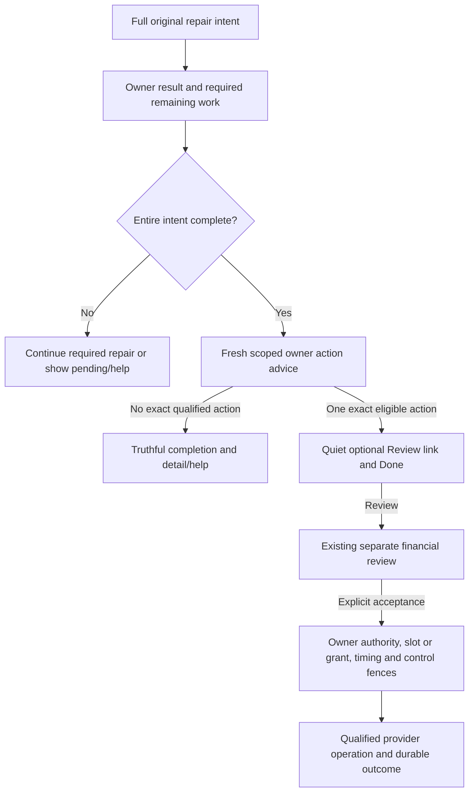

> Historical research record adopted for AL-1563. Scope and testing are ratified; earlier pending decisions and research-only workflow restrictions below preserve chronology. The [implementation specification](../../phase-25-donor-dashboard-depth.md) and its owner contracts are the implementation authority for this proposal. No historical synthetic/source check certifies target runtime behavior.

# Question 06 — The next step after a payment repair

> **Ratified 7 September 2026.** Conrad explicitly ratified Question 06’s corrected decision and C01–C20. The review and proof obligations below remain authoritative grooming evidence; historical requests for ratification are now answered. Implementation and provider qualification remain separate.

**Full adversarial review · Phase 25 Donor Dashboard Depth · 7 September 2026**

**Disposition: Accept with required amendments.** Keep the quiet optional next step. Narrow the completion claim and require an exact, provider-qualified positive case before activating it. This is an optional handoff to the existing financial review, not a new retry system or an automatic action after every Save.

Conrad selected “Offer a quiet optional next step” and explicitly requested the Stripe best-practices skill, current research and every adversarial category. Question 06 is selected; the corrected wording and C01–C20 below are presented for ratification. Questions 01–05 remain ratified. No PRD, formal specification, implementation, issue publication, GitHub mutation or live-provider modification is authorized by this review.

## The corrected decision to record

> After the full original source-defined repair intent has completed, a failure-led confirmation may show one quiet optional link to review the exact related failed scheduled gift, but only when the owning service currently admits that recovery after that exact repair kind.
>
> The confirmation names what actually completed. Saving/preparing a method, finishing bank linkage or returning from authentication does not by itself mean future giving is repaired. Required unfinished binding, authorization or reconciliation work stays visible and primary. Do not redefine a requested replacement as a completed save merely to make the offer possible.
>
> The completed repair result remains truthful historical evidence. Retry availability and the earlier payment's present state are separately current. Opening Review, returning, refreshing and choosing Done perform no financial admission. A retry requires the existing separate, explicit, currently authorized source review/command and its own durable result.
>
> Keep card D7 slots, timing and pressure, ACH's independent exact one-use grant, original occurrence/cohort/amount, source control and current Party/account/mode rights intact. A full replacement/split may close old recovery; payment authentication may already collect the gift. In either case, no invalid retry offer appears. Generic wallet maintenance and unrelated repaired arrangements receive no catch-up solicitation or preselected payment set.
>
> Before activation, prove at least one named fully completed repair kind whose original intent and exact owner/provider contract leave the related old occurrence eligible. If none qualifies, retain normal truthful completion/detail/help and omit the offer. No new financial exception, old-invoice resurrection, source authority or silent charge is permitted to manufacture a positive case.

**Material correction to the earlier example:** “payment details saved” and “future giving fixed” cannot be interchangeable. The current evidence does not yet establish a production-qualified completed-repair-to-eligible-retry journey. This gate is explicit; the report does not disguise an assumed positive fixture as verified support.

## Adversarial check

### What could go wrong with this answer?

A save might trigger or enable unadmitted collection, a stale button might invite a second attempt, or a completed substep might hide unfinished future-binding work. Current Core also has a mock wallet, a generic portal return and legacy status/replay gaps. The selected UI is safe only over qualified owner operations and current action advice.

### What hidden assumptions are we making?

The old occurrence may no longer be recoverable after the repair. Completing payment authentication may itself pay it. A successful SetupIntent proves neither current future binding nor authorization for every historical gift. No real positive connected-account repair/recovery tracer is established by this session's credential scope.

### How does this affect the whole product?

Phase 16 owns recurring intent, repair/recovery authorization, slot/grant/control and lifecycle. Phase 13 owns contribution truth; Stripe owns execution evidence; Phases 3/4/9/10/12 govern current actor/context/visibility; Phases 6/17 own messages; Phases 7/18/19 own receipt/document outcomes. Mission Control keeps operational recovery. Q06 adds a source-qualified navigation opportunity, not another domain owner.

### How does this affect the end-user experience?

The donor sees a precise completed result, any remaining required work and—only when appropriate—one relevant optional review. Done is a valid exit. Existing automatic retries are explained; Done does not mean Stop. There is no debt banner, forced modal, payment preselection or loss of independently authorized history/documents/Ministry Updates.

### Does this follow modern best practices?

Secure setup, truthful asynchronous status and separate financial review are sound patterns. Modern products differ on debt collection: Apple explicitly documents autocharging a newly added method for unpaid purchases. That is disconfirming evidence against copying a generic subscription-repair flow into voluntary giving. The chosen Asym behavior is intentional and must be enforced by its provider adapter. [Apple billing-problem guidance](https://support.apple.com/en-gb/118284).

### Does this fit Asym’s existing repo and product direction?

Yes, when it preserves the accepted ownership and current recovery rules. The durable result and current action descriptor already belong to the planned Phase 16 donor detail. Their current runtime is incomplete; neither a local wallet update nor a Stripe portal return is a substitute.

### Should we adjust the recommendation?

Keep it with the full-intent completion rule, separate live eligibility, exact provider qualification and C01–C20. No exception to old-cohort closure, retry timing, pressure, ACH authorization or source permissions is recommended. The positive-case and execution proofs below are activation requirements, not items to monitor after launch.

## What the repair should feel like

The examples are illustrative content meanings, not measured donor behavior or a verified provider journey. Final localized copy must follow the actual source result.

### Enter through the real problem

The donor follows an admitted failure-led link and reaches the exact currently authorized giving context. The page explains which scheduled gift had a problem and what this step will do. A forwarded alert, generic portal return, referrer or `from=failure` flag is not permission or proof of original intent. Reserved communication catalog entries cannot be dispatched merely to provide Q06 an entry point.

The existing source setup/repair owns the sensitive collection and required authorization. Use qualified Stripe-hosted fields within the Asym shell; do not reuse the prototype's ordinary card-number/CVC/bank inputs. Maia governs surrounding layout, labels, help, focus, state and supported provider appearance settings. No extra general-purpose component library is needed.

### Say exactly what has and has not finished

<!-- prettier-ignore -->
| Actual source state | Understandable result | Optional retry offer |
| --- | --- | --- |
| Method information collected but bank verification remains | Bank verification is still needed; explain the existing next step and safe return | No |
| Method is ready, but the requested recurring replacement still needs binding/authorization/reconciliation | The new method is ready; the recurring change is still being completed or needs the named action | No. The original repair is incomplete; keep its remaining required work visible and primary. |
| Entire original repair complete; one exact old occurrence still admitted after a qualified repair kind | The specific repair is complete; show the earlier gift's actual current state | Quiet link to its existing review, with a valid Done exit |
| Entire future replacement complete but source closes old recovery | Confirm the actual future change and the old occurrence's qualified outcome | No retry offer; do not resurrect the invoice |
| Authentication of the old payment completes collection | Show the owner's payment/result state and current document availability when separately qualified | No duplicate retry |
| Repair/result or old payment remains indeterminate | Checking the result; preserve the original request and give safe status/help | No new attempt |
| Recovery stopped, terminal, expired, already paid, unsupported or unauthorized | Normal truthful result and permitted detail/help | No invalid offer |

“Repair complete” must describe the full original task. A source-defined save-only repair can be complete as a save; it cannot stand in for a promised future replacement. The owner must qualify the exact full-intent positive case. Same-object billing/expiry correction and save/preparation-with-corrected-authorization are candidates to examine, not declarations of supported provider behavior.

### Make the eligible next step small and clear

When every prerequisite is actually met, the content can read:

> **Your [specific repair] is complete.**
>
> The August 1 gift of **USD 50** has not been received. You can review whether to try that scheduled gift again.
>
> **Review this scheduled gift** · **Done**

The current source may instead say an automatic retry is scheduled or that payment is already processing; use that exact state. Do not show the example's unreceived statement as frozen copy. The link opens the existing review, not a new charge. Keep the completed result visually dominant, avoid auto-focus on payment or automatic modal opening, and do not use overdue/debt/guilt language.

The review names the exact occurrence, permitted designation/cohort facts, amount/currency/fee effects, method, remaining schedule and what acceptance will do. Financial acceptance is explicit and separate. Step-up identity checks are different from payment authentication; if a payment challenge follows accepted financial instruction, it continues the same operation rather than creating another retry.

Done, Back, closing and ignoring the offer are navigation. They do not suppress an existing authorized automatic retry. The existing **Stop retries for this missed gift** action remains distinct and neutrally explained. It affects unstarted recovery according to its owner; it does not pause/cancel future giving. No payment-failure condition invents a new lock on otherwise authorized donor history, documents or Ministry Updates.

### Keep zero, one and multiple outcomes predictable

Zero currently eligible related actions means no Q06 direct-review offer. One exact source-correlated admitted occurrence permits the small link. Ambiguous origin also means no direct offer; existing source-qualified detail navigation remains available. Do not build a Q06 chooser or widen to all historical failures.

R03 may repair several recurring uses, but those selections are not payment consent or a recovery set. Do not sum them into a catch-up balance, preselect old gifts or infer scope from a shared method/customer/mask. One source-owned cohort may contain several lines; its financial authorization and permitted display still have to cover the exact required action.

### Make failure and return effortless

The durable repair result is bookmarkable and reloadable. A separately fetched current next-action section can update or disappear without rewriting that result. If the optional lookup fails, preserve completed repair and show restrained checking/unavailable/detail help. Never turn a timeout into payment failure or an invitation to try a fresh gift.

Authentication/provider returns preserve the intended safe destination and original source correlation. Recheck current access on return. Delayed responses from an older Tenant/represented-Party context cannot render beneath a new heading. A browser Back/forward cache or old bookmark cannot restore financial permission. Do not put client secrets, private ministry names or raw provider payloads in navigation URLs, analytics or support tickets.

For bank verification, use the source's actual pending stage, instructions and authorized return path; do not promise universal instant readiness or a made-up deadline. For 3D Secure, explain that the bank is checking the particular setup/payment action, allow the normal cancel/back behavior and reconcile the actual result afterward. Canceling an authentication screen is not necessarily canceling the gift, mandate or recurring agreement.

### Preserve Maia and accessible interaction

Use exact `base-maia`, Base UI, shared semantic tokens and existing `@asym/ui` wrappers. Core pins Base UI **1.5.0** while current public docs describe **1.8.0**; verify APIs against installed wrappers. An AlertDialog action closing a primitive is not async command success. The optional handoff usually needs an ordinary link, not a new dialog.

Use visible labels, plain text states, predictable focus, readable original-currency amounts and an understandable current giving context. Test long names/translations, supported RTL/locales, date/timezone wording, low bandwidth, reflow, keyboard and screen reader. Reserve space for status changes without announcing every polling tick or moving the donor unexpectedly. Financial review must make errors correctable before submission; do not promise charge reversibility as the accessibility mechanism. [W3C status messages](https://www.w3.org/WAI/WCAG22/Understanding/status-messages.html), [financial error prevention](https://www.w3.org/WAI/WCAG22/Understanding/error-prevention-legal-financial-data.html).

## Stripe: what is compatible, what conflicts and what remains unproved

### Current evidence versus the invoked skill

The explicitly invoked Stripe best-practices skill and its payments, billing, security and Connect references were read. Its secure setup/collection and secret-handling principles are useful. Several generic or dated prescriptions require reconciliation with current primary docs and the accepted existing integration.

<!-- prettier-ignore -->
| Subject | Verified evidence on 7 September 2026 | Decision for Q06 |
| --- | --- | --- |
| API/SDK versions | Skill header says API2026-07-29.dahlia / Node22.4.0. Current official versioning page says **2026-08-26.dahlia**; latest stripe-node release is **22.6.1**, published September 1. Core pins **22.2.0 / 2026-05-27.dahlia**. | The skill header is not current authority. Compare changelog, actual SDK types, webhook versions and provider contracts before a separately authorized upgrade. No pin was changed during grooming. |
| Accounts v2 | Skill says always v2. Current official Connect docs still require v1 for OAuth and list other v2 limitations. | Do not migrate accounts merely to add Q06. Verify the existing binding/namespace and its capabilities; never confuse an organization merchant account with the donor customer or with that organization being billed platform fees. |
| Dynamic methods | Official docs recommend dynamic methods and configuration/exclusions. Core's installed SetupIntent types support `payment_method_configuration`, exclusions and explicit method types. | Prefer modern configuration where it satisfies the exact owner-qualified operation, rail, mandate, account and currency. Dashboard/provider availability is not Asym admission. Do not expose unqualified bank/local methods to maximize conversion. |
| Hosted Customer Portal | Stripe documents method/subscription flows and targeted deep links/return behavior. | Those capabilities are real. The current generic Core session still lacks exact repair/occurrence/result qualification. Preserve custom Asym source-owned repair/confirmation; do not claim a portal redirect proves completion or invent an unsupported claim that hosted portals can never perform an action. |
| Billing defaults | Generic guides favor automatic renewal/recovery. | ADR0014/P16 own bounded product recovery; provider defaults must fit that policy and exclusive execution. No additional renewal loop or default Smart Retry policy is introduced. |
| Tax, fees and secrets | Generic skill adds Stripe Tax/debt/fee guidance and recommends restricted keys. | Q06 introduces no sales-tax, `automatic_tax`, fee or debt rule. Contribution/receipt eligibility remains with its owner; no tax-exemption conclusion is inferred. Preserve secure platform injection and least privilege; no credential/config/hook changes are part of this review. |

Sources: [Stripe versioning](https://docs.stripe.com/api/versioning), [stripe-node 22.6.1](https://github.com/stripe/stripe-node/releases/tag/v22.6.1), [Accounts v2 limitations](https://docs.stripe.com/connect/accounts-v2), [dynamic methods](https://docs.stripe.com/payments/payment-methods/dynamic-payment-methods), [portal deep links](https://docs.stripe.com/customer-management/portal-deep-links).

This is **Useful precedent** where the general guidance improves a qualified integration, **Temporary bridge** where current Core runtime is incomplete, and **Conflict with first principles** if a generic default overrides donor authority, current source ownership or the no-save-charge promise. No SDK/account migration is justified by the small UI handoff itself.

### Provider operation and side-effect matrix

<!-- prettier-ignore -->
| Operation or evidence | What current primary documentation establishes | Permanent rule |
| --- | --- | --- |
| SetupIntent create/confirm | Saves/prepares payment details for later use; can require authentication or bank verification | A qualified noncharging collection building block. Success does not update every future binding or pay the old occurrence. |
| PaymentMethod update | Updates an attached method's supported billing/card metadata; the installed pin includes billing details and expiry fields | Candidate metadata repair only. API field support alone does not prove full owner intent, no broader credential effect or surviving old recovery. |
| Customer `source` update | A new valid card source can retry the latest open automatically collected invoice for past-due subscriptions; this is additional to ordinary retry scheduling | Exclude this side effect from save-only repair. A generic update call is not safe merely because its endpoint is not named Pay. |
| Defaults / Smart Retries | Subscription-level method precedence can override customer defaults; hard-decline retries may remain scheduled and execute after a new method is detected | Qualify the exact effective binding and already authorized work. An incrementing provider attempt counter need not be a new network Charge or product slot. |
| Subscription update | Some changes/proration/interval/trial operations can invoice/charge or alter dates | Only the owning noncharging change plan may use it; it may close old recovery. Q06 cannot amend an old invoice/authorization to fit a new cohort. |
| Invoice `auto_advance=false` | Stops named Billing automatic finalization, reattempt, reminders and automatic reconciliation | One control with a defined scope. It is not proof against explicit payment, already-started work or every external/provider effect. |
| Invoice pay / PaymentIntent confirm | Can perform financial collection | Only the exact existing accepted source financial operation may invoke its qualified primitive. No fresh PaymentIntent disguised as recovery; no paid-out-of-band/forgive shortcut. |
| SDK/browser/provider return | May finish setup, authorization, payment or simply navigation | Reconcile the exact object and source outcome. Payment success eliminates another retry; setup success does not prove payment. |
| Webhook / network retry / idempotency | Delivery can duplicate or arrive out of order; network uncertainty requires careful reuse/readback; Stripe keys may be pruned after at least 24 hours | Keep durable Core business identity and provider-child evidence. Unknown is not failure/no-effect and does not release a slot for a new command. |

Sources: [save and reuse](https://docs.stripe.com/payments/save-and-reuse?payment-ui=elements), [SetupIntent confirmation](https://docs.stripe.com/api/setup_intents/confirm), [PaymentMethod update](https://docs.stripe.com/api/payment_methods/update), [Customer update](https://docs.stripe.com/api/customers/update), [Smart Retries](https://docs.stripe.com/billing/revenue-recovery/smart-retries), [subscription update](https://docs.stripe.com/api/subscriptions/update), [invoice update](https://docs.stripe.com/api/invoices/update), [invoice pay](https://docs.stripe.com/api/invoices/pay), [idempotency](https://docs.stripe.com/api/idempotent_requests), [low-level errors](https://docs.stripe.com/error-low-level), [webhooks](https://docs.stripe.com/webhooks).

### Exact account/proof limitation

The existing Stripe CLI 1.50.5 read current docs and inspected only its established default/test scope, using the pinned API version and no live flag. It returned a standard US account with `charges_enabled=false`, `payouts_enabled=false`, `details_submitted=false`, empty capabilities and zero connected accounts (`has_more=false`). No credentials were printed and no provider object or financial action was created/changed.

Those v1 flags are a limited observation of the current credential scope, not a complete v2 readiness certificate or a conclusion about production. No exact connected-account repair/old-invoice/no-save-charge positive tracer could be certified from that scope. The rollout gate must use the actual namespace/binding, account/mode, supported capabilities, API/webhook versions and owner adapter. No fabricated sandbox qualification or silent migration substitutes for that proof.

## CRM, source ownership and database design

The simplest permanent architecture composes **the existing durable repair result plus a separately current source action descriptor**. The donor UI owns presentation; `packages/api` owns business access/commands; app routes remain thin. ADR0001 keeps CRM truth in Asym Postgres; ADR0014/P16 keep recurring recovery product-owned and rail-isolated. Stripe owns actual execution evidence, not donor identity, cohort authority or retry entitlement.

This diagram is a meaning model, not a proposed new workflow engine/table. Current source completion, qualification and authorization still govern every arrow.

### What the owners must supply

- **Original intent and scope:** exact repair purpose, target(s), actor/authorizer, Tenant/giving context, entity/account/mode and admitted failure-origin reference. A repair result must not silently shrink the accepted task.
- **Durable repair result:** original accepted facts remain immutable with owner-defined advancing evidence. Setup/preparation and replacement command/results retain their existing separate ownership from R03. No new Q06 result journal is necessary.
- **Current related action:** one exact occurrence/cohort, current source advice/versions, authorized safe display, applicable card slot or ACH grant, current timing/control and the existing review destination. Never store a portal Boolean or treat the repair's old permission snapshot as current authority.
- **Separate financial acceptance:** exact terms and permanent business identity, authorized origin/CSRF/step-up, current revision and exclusive owner admission. The recovery operation has its own existing command/result; it is not appended as a new effect under the earlier noncharging replacement authorization.
- **Source/provider proof:** the existing lane readiness/closed mutation allowlist admits only qualified operations. A new narrow typed correlation in a closed preparation/result contract must be explicit owner work, not an arbitrary route field. There is no new financial command kind merely for displaying the link.

### Invariants to enforce and prove

Same-scope composite references must preserve applicable Tenant/entity/account/mode/Party/credential/occurrence identities; legitimate roles such as payer, representative and legal donor are not forced equal. Closed subjects and payloads, non-null required scope, exact checked amount/currency, restrictive history handling and durable semantic uniqueness belong to the owner schema/command. Actor and audit attribution come from trusted context, not caller fields.

Donor browser roles gain no direct financial-journal mutation. Test the actual grants, role/owner/RLS policies, privileged queries, views/RPCs and relevant storage/egress; Q05's tested donation-table privileges are not proof of absent Phase 16 tables. PostgreSQL may inherit UPDATE `WITH CHECK` from `USING`, and `SECURITY DEFINER` uses its owner's privileges; inspect effective behavior instead of flagging keywords alone.

Card D7 acceptance substitutes the earliest admitted remaining slot and serializes with applicable automation/credential pressure. ACH instead claims its independent exact one-use grant. Looking at the offer or review reserves neither. Stop, policy narrowing, paid/closed/unknown state, current rights and time/control changes are rechecked at the owning admission/execution boundaries. Already-submitted effects are reconciled; no UX claims to recall them.

Unknown provider outcomes retain the same operation/slot or grant evidence until resolved. A subsequent source-proved success may resolve a failure episode under its owner; it does not delete historical attempts, restore terminal missed gifts or wipe rolling/network evidence. A raw webhook processing flag is not an occurrence-level financial lock or permanent idempotency record.

Use bounded existing queries/indexes/projections for the one result/action. Current auth/context and late-response fencing outrank a convenient display cache. No open database transaction while the donor reads, per-row Stripe polling, unbounded history scan or second recovery coordinator is needed.

## Individual category review

All 22 requested categories are evaluated independently. Twenty have material implementation or dependency concerns; two have no additional material concern under this bounded design. Shared root concerns are deduplicated into F01–F20 below, each with the complete severity, likelihood, evidence, disposition, prevention and exact C01–C20 language.

Likelihood describes an observed trigger or conditional design risk, not an invented incident rate. Critical/High mean potential confidentiality or financial harm; Medium means significant usability, reliability or operational harm. Source defects, hypothetical hazards and verified live incidents are distinct.

### 01. Problem validity, necessity, and alternatives

**Material concern: Yes — a positive supported case must be proved.** The optional handoff can save navigation in a failure-led visit, but it has value only when the entire original repair completes and recovery still survives. Existing detail already provides the recovery action. The strongest alternative is truthful completion plus detail access. Do not build a speculative offer or redefine a partial save as complete to create demand.

**Complete concern records:** F01, F15, F20. The referenced records give every requested concern attribute and exact required language.

### 02. Brittleness

**Material concern: Yes.** Save, provider return, SetupIntent success, future binding and old-payment success are different states. A fixed confirmation cannot predict later eligibility. Replace those assumptions with exact typed outcomes and current source advice.

**Complete concern records:** F01, F02, F04, F09. The referenced records give every requested concern attribute and exact required language.

### 03. Technical debt

**Material concern: Yes.** The local wallet prototype, generic billing portal and legacy pledge counters do not supply the target owner seams. Adding a CTA around them would preserve duplicated/incomplete truth and bypasses. Complete existing owners and retire conflicting paths rather than create another repair/recovery system.

**Complete concern records:** F03, F10, F11, F17. The referenced records give every requested concern attribute and exact required language.

### 04. Edge cases

**Material concern: Yes.** Reviewed incomplete save/binding, canceled authentication, delayed bank verification, repair that settles the old payment, closed/split/terminal incidents, zero/many outcomes, stopped/automatic/unknown work, forwarded links, representatives, old accounts, same-card updater continuity, timing/pressure and ACH returns. The decision/state table and proof gates below give exact safe outcomes.

**Complete concern records:** F01, F02, F06, F07, F08, F15. The referenced records give every requested concern attribute and exact required language.

### 05. Footguns

**Material concern: Yes.** Legacy Customer.source can trigger collection, current action labels can be mistaken for authority, and raw prototype fields can be mistaken for provider collection. Separate review from execution and allow only qualified source/provider primitives.

**Complete concern records:** F03, F05, F06, F13, F14. The referenced records give every requested concern attribute and exact required language.

### 06. Tenant safety

**Material concern: Yes.** Current personal-donor filters are real controls, but provider account/mode, represented Party, actual authorizer and original occurrence must remain exact through redirects, caches and child commands. Repair rights or shared credentials never grant broader financial scope.

**Complete concern records:** F08, F09, F12, F15. The referenced records give every requested concern attribute and exact required language.

### 07. Database, RLS, and authorization safety

**Material concern: Yes.** Target command/slot/grant tables and current authorization/CAS are unimplemented. Require same-scope keys, immutable intent/results, exact operation uniqueness, current source commands and effective grants/policies/privileged-path tests. Reused Q05 migration/catalog facts apply only to the exact tested legacy objects, not target recovery.

**Complete concern records:** F06, F08, F10, F11, F12. The referenced records give every requested concern attribute and exact required language.

### 08. Overengineering

**Material concern: No additional architecture is justified by the selected handoff.** A current source action descriptor beside the existing durable result is enough. No new ledger, generic workflow, retry manager, task, notification, unread marker, debt balance, UI library or frozen global snapshot is needed. Existing derived indexes/caches remain possible under current-scope/freshness rules.

### 09. UX/UI and user friction

**Material concern: Yes.** Unclear completion, forced continuation, debt wording, hidden scheduled retries and unresolved bank/auth returns can make a small convenience harmful. Keep completed scope clear, required remaining work primary, optional review restrained and exits valid. Use exact Maia/Base UI with tested mobile, localization and accessible behavior.

**Complete concern records:** F01, F02, F04, F13, F14, F15. The referenced records give every requested concern attribute and exact required language.

### 10. Source of truth, ownership, and domain invariants

**Material concern: Yes.** Repair result, current retry advice, accepted financial instruction, provider attempt, future arrangement, gift/history/documents and messages remain different facts. Preserve Phase 16 recovery and source admission, Stripe execution evidence and Q05 gift truth; a repair card cannot own any of them.

**Complete concern records:** F01, F03, F04, F05, F06, F10, F11. The referenced records give every requested concern attribute and exact required language.

### 11. Hidden coupling

**Material concern: Yes.** A method change interacts with invoice defaults, native recovery, old-cohort closure and account/mandate scope. The UI also depends on complete auth-return and source correlation, not merely a success URL. Keep these dependencies explicit and qualified rather than hidden inside a wallet save.

**Complete concern records:** F01, F02, F03, F07, F09, F16. The referenced records give every requested concern attribute and exact required language.

### 12. Failure modes

**Material concern: Yes.** Repair may succeed while next-action lookup fails; auth may cancel or complete collection; provider responses may be unknown; product writes may precede lost acknowledgments. Preserve completed evidence, show truthful pending/unavailable states and reconcile exact existing operations without another charge.

**Complete concern records:** F02, F04, F10, F11, F18. The referenced records give every requested concern attribute and exact required language.

### 13. Lifecycle, temporal correctness, concurrency, and idempotency

**Material concern: Yes.** Review/acceptance/worker/provider stages race automation, Stop, cancellation, policy narrowing and shared credential pressure. Source windows, slots/grants, semantic identity and unknown-state reservation govern. Synthetic claims demonstrate mechanisms only; current legacy source interleavings are separately reproduced.

**Complete concern records:** F04, F05, F06, F07, F10, F11. The referenced records give every requested concern attribute and exact required language.

### 14. Data integrity risks

**Material concern: Yes.** Current invoice replay can increment twice or overwrite a paused/canceled projection. Mislinked origins, wrong scope and stale eligibility can corrupt the next-action meaning. Use exact source relationships, immutable accepted intent, current version checks and business-effect idempotency.

**Complete concern records:** F08, F09, F10, F11, F12. The referenced records give every requested concern attribute and exact required language.

### 15. Security and privacy risks

**Material concern: Yes.** Reviewed separate repair/retry authority, provider-client capabilities, raw fields, CSRF/origin, redirects/scanners, partial visibility, current grants/caches, logs/exports and retention. No live exploit or credential exposure is alleged. Each action needs its actual source grant and qualified provider capability.

**Complete concern records:** F05, F08, F09, F12, F13, F19. The referenced records give every requested concern attribute and exact required language.

### 16. Scalability and performance risks

**Material concern: Yes.** A single optional offer should not cause per-row provider fanout, history scans or unlimited polling. Use bounded current projections and existing owner reconciliation, with measured workload/SLO. No production capacity or latency claim follows from the synthetic fixture.

**Complete concern records:** F04, F15, F18, F20. The referenced records give every requested concern attribute and exact required language.

### 17. Operational burden

**Material concern: Yes.** Unqualified provider controls, stale owner tickets and ambiguous completion would send routine donors to staff or require DB repair. Keep source readiness gates, exact pending/unknown results and existing operator recovery/help; the portal must not become an operational retry console.

**Complete concern records:** F02, F03, F17, F18, F19. The referenced records give every requested concern attribute and exact required language.

### 18. Observability and auditability gaps

**Material concern: Yes.** Repair acceptance/result, current advice, actual retry acceptance, provider execution and message delivery need distinct correlation. Clicks and Done cannot be audit evidence of consent, Stop or payment. Minimize sensitive payloads and measure actual source-state/command outcomes.

**Complete concern records:** F04, F10, F19, F20. The referenced records give every requested concern attribute and exact required language.

### 19. Dependency and integration risks

**Material concern: Yes.** Checked current official Stripe docs, actual pinned SDK types, latest version evidence, account-scope limitations, generic hosted portal behavior and live owner dependencies. Skill defaults are not proof of provider constraints or permission to migrate architecture/rails.

**Complete concern records:** F03, F07, F09, F16, F17, F20. The referenced records give every requested concern attribute and exact required language.

### 20. Migration, rollout, and upgrade risks

**Material concern: Yes.** A partial rollout can leave raw/generic paths active or allow old readers to treat new result/eligibility state incorrectly. Admit only exact qualified lanes; preserve unknown/accepted operations and historical results during containment. Upgrades and financial backfills cannot manufacture eligibility or hidden financial effects.

**Complete concern records:** F10, F12, F16, F17, F20. The referenced records give every requested concern attribute and exact required language.

### 21. Testability, traceability, and proof

**Material concern: Yes.** The offer needs a real positive full-intent provider/source case, not only a diagram with qualified=true. Record exact negative, race, migration, authorization, provider and accessible journey outcomes. Current mocked/source and prior migration results remain limited, traceable evidence.

**Complete concern records:** F01, F05, F06, F07, F08, F10, F20. The referenced records give every requested concern attribute and exact required language.

### 22. Other development hazards

**Material concern: No additional material concern beyond the assigned findings.** Checked speculative taxation/fee changes, account migrations, extra product surfaces, permanent browser capabilities, source counter resets, unsafe fallback/replay and new notification/debt workflows. Relevant risks are already assigned; this category justifies no extra framework or product scope.

## Concern register and exact required amendments

These are reviewed grooming requirements to carry into the later explicitly authorized specification, not newly issued formal contracts. Material refinements are presented for founder ratification.

### F01 — Completed collection is not necessarily completed repair

**What could go wrong:** The UI treats a saved method, successful SetupIntent or completed substep as completion of a promised future-binding replacement, then offers an old-gift retry even though required work remains or the replacement closed that path.

**Why it matters:** The donor can leave believing future giving is fixed, or be invited to a recovery the owner forbids.

**Severity:** High. **Likelihood:** A concrete owner-contract ambiguity in the original example; harmful target behavior is conditional. No exact complete positive provider tracer was verified.

**Evidence/reasoning:** P16:667,677,2169; #812:29–30; #816:27; R03 A3; Stripe save-and-reuse; SQL E01–E04.

**Effect on the answer:** Materially narrows the completion claim and requires positive qualification; preserves the selected optional handoff.

**Best permanent prevention:** Keep the full original repair intent explicit and prove its complete result separately from current old-occurrence eligibility. Qualify a named full repair kind before enabling the offer; do not redefine the task to manufacture a positive case.

**Exact language to add:**

> C01 — The offer is permitted only after the full original source-defined repair intent is complete and fresh source proof admits the exact related failed occurrence. Saved/prepared is not future-binding complete. Required unfinished work remains visible and primary. Before activation, prove a named completed repair kind that preserves recovery under the exact owner/provider contract. If none qualifies, omit the offer; never relax closure rules or claim the feature executable from a hypothetical fixture.

### F02 — Provider returns and authentication have different outcomes

**What could go wrong:** A return URL or SDK callback is treated as success; bank verification is still pending; authentication of an existing PaymentIntent already collected the gift but the UI offers another retry.

**Why it matters:** False completion and duplicate-action prompts undermine both money safety and confidence.

**Severity:** High. **Likelihood:** Current generic portal return lacks source reconciliation. Stripe documents asynchronous/required-action states; no hosted failure was tested.

**Evidence/reasoning:** billing.ts generic session; Stripe SetupIntent confirm/save-and-reuse/ACH setup/3DS flow; #812/#818; actual source R07–R10.

**Effect on the answer:** Requires precise outcome labels and reconciliation, without changing the financial policy.

**Best permanent prevention:** Reconcile exact provider object/account and source state after return. Distinguish method ready, binding applied, authorization complete, payment processing/received and unresolved state. Preserve leave/return paths for pending work.

**Exact language to add:**

> C02 — Browser return, closed modal, bank linkage and client success parameters are not source completion. Read back the exact intended setup/payment result through its owner. Show pending verification/authentication/reconciliation honestly. SetupIntent success does not prove an existing recurring binding or old payment changed; payment authentication that completes collection removes the retry offer. Initial bank activation is not ordinary ACH recurring recovery.

### F03 — A seemingly harmless Stripe update can collect an old invoice

**What could go wrong:** Repair uses legacy Customer.source update, changes a default that unblocks native retry, or assumes an invoice-control flag stops every possible payer/worker path.

**Why it matters:** A save can initiate or enable collection outside the reviewed Phase 16 slot/authorization, contradicting the donor promise.

**Severity:** Critical if an unadmitted collection occurs. **Likelihood:** The legacy source-update side effect and hard-decline/new-method behavior are documented provider facts. Current Core calls that primitive were not found; adaptation risk is conditional.

**Evidence/reasoning:** Stripe Customer update, Smart Retries, invoice update; R03 C13; ADR0014; pinned API references.

**Effect on the answer:** Requires exact primitive/effect qualification, not a blanket claim that Stripe is incompatible.

**Best permanent prevention:** Use an owner-admitted save/setup/metadata/binding primitive with proved behavior and current exclusive collection control. Keep already authorized independent work explicit. Never use a broad Customer/portal mutation as a shortcut.

**Exact language to add:**

> C03 — A save-only repair must initiate no collection, invoice pay/finalization, proration or new retry. Exclude legacy Customer.source-triggered collection and other unqualified side effects. Prove exact method precedence and native recovery controls, including existing/in-flight work, before enabling the operation. auto_advance=false controls named Billing automation; it is not a universal guarantee against explicit pay, already-started work or every reconciler. Do not disable or alter authorized recovery from UI navigation.

### F04 — Frozen confirmation can carry stale retry permission

**What could go wrong:** A bookmarked repair result retains a cached payable flag or not-received message after payment succeeds, access changes, a slot expires or the incident closes.

**Why it matters:** The original repair stays valid while its proposed next action becomes false or unauthorized.

**Severity:** High. **Likelihood:** Foreseeable normal state changes; target next-action projection is not implemented. Synthetic SQL demonstrates the required separation.

**Evidence/reasoning:** P16:1510–1534,2047–2050,2169; #811/#812; current fixed query keys; SQL E24–E27.

**Effect on the answer:** Qualifies result composition; does not add a new result/history store.

**Best permanent prevention:** Render immutable repair facts and separately current action descriptors from existing owners. Scope and discard stale responses without rewriting the accepted repair.

**Exact language to add:**

> C04 — Historical repair intent/result and advancing owner evidence remain distinct from current related-action availability. Never persist portal-local missedGiftPayable as authority. On each view/review/acceptance, resolve current scope and eligibility; the offer may disappear or change without undoing the repair. A stale read yields checking/unavailable, not a cached financial action.

### F05 — Opening the offer must not admit a financial attempt

**What could go wrong:** GET, prefetch, link scanning, returning from auth or opening Review reserves a slot, creates an invoice/PaymentIntent or submits payment.

**Why it matters:** Donors can cause a consequential effect before giving the explicit financial instruction.

**Severity:** Critical if money or scarce authority is consumed. **Likelihood:** Conditional target risk; current generic billing POST is not the future financial-command boundary.

**Evidence/reasoning:** P16:667–669; #816; current billing/withOperation trace; SQL E05; Stripe invoice-pay reference.

**Effect on the answer:** Preserves the separate review/acceptance choice selected by the founder.

**Best permanent prevention:** Use navigation/read-only preview for the optional action, then the existing protected source command for deliberate acceptance with exact immutable terms and result.

**Exact language to add:**

> C05 — Offer display, Review, GET/prefetch/scanners, Back, reload and auth return perform zero financial admission or slot/grant reservation. Only separate explicit acceptance enters the existing source financial command with current authority, exact occurrence/amount/currency/method/fee effects, origin/CSRF and required step-up, current revisions and durable identity. Never attach invoice.pay or a new PaymentIntent to a navigation callback.

### F06 — Retry races, windows and pressure limits are not UI rules

**What could go wrong:** A donor and automation both act on the same eligible view, a new tab uses another key, Try now waives timing limits, or a repaired credential resets shared attempt pressure.

**Why it matters:** Individually plausible actions can jointly create excess attempts or close charges.

**Severity:** Critical for duplicate/unqualified collection. **Likelihood:** Normal concurrency is foreseeable; synthetic SQL reproduced duplicate naïve claims and guarded serialization. Complete provider/owner proof remains missing.

**Evidence/reasoning:** P16:638–710; #816/#817; SQL E08–E19,E22–E23; ADR0014.

**Effect on the answer:** Requires existing source fences; adds no new retry schedule or budget.

**Best permanent prevention:** Atomic card D7 source admission substitutes the earliest eligible remaining slot, fences competing automation and enforces incident/credential headroom and current time at the required execution boundaries.

**Exact language to add:**

> C06 — Card D7 admission substitutes the earliest remaining owner-admitted slot without adding capacity or resetting historical cycles/pressure. Subsequent source-proved outcomes may resolve the episode under D8; historical attempts and rolling evidence remain. ACH follows C07. Re-prove exact donor-present not-before/expiry, the 48-hour collision cutoff and required 24-hour control proof; the label Now grants no exception. Resolve any before-queued-slot ambiguity in the owner trigger contract. Separate unattended product ceilings from manual/network limits and preserve ordinary-gift priority.

### F07 — ACH recovery is not card recovery with new wording

**What could go wrong:** New bank verification/mandate, initial activation repair or a hard/revoked return is treated as permission to repeat an old debit, possibly for only selected lines.

**Why it matters:** A donor-facing convenience can bypass exact bank authorization and return restrictions.

**Severity:** Critical. **Likelihood:** Conditional target risk; no real ACH recovery or provider/ODFI proof was run.

**Evidence/reasoning:** P16:768–801; #818/#819; Stripe ACH setup/verification docs.

**Effect on the answer:** Preserves the narrow existing ACH owner contract; no new bank recovery permission.

**Best permanent prevention:** Require the dedicated exact-cohort one-use grant, eligible established return, valid mandate/timing and current provider/ODFI evidence. Keep future authorization separate.

**Exact language to add:**

> C07 — ACH uses only its owner-qualified established-return recovery lane and exact original cohort/amount/allocations. Initial activation, new future authorization, R08/revocation/R11 and unsupported cases create no old-occurrence entitlement. No partial-line retry, generic invoice-pay substitution or hidden new-gift fallback. Preserve one-use grant, normal-date runway and stricter current rules; no card-policy inference is permitted.

### F08 — Repair rights do not imply retry authority

**What could go wrong:** A representative, contact or shared-email user who can see/repair a method is allowed to charge a different Party's gift, or the right method is used in the wrong Tenant/account/mode.

**Why it matters:** This risks unauthorized collection and sensitive identity/amount disclosure.

**Severity:** Critical. **Likelihood:** Conditional; current personal donor filters exist, but complete target Party/authorizer and connected-account scope are unimplemented/unverified.

**Evidence/reasoning:** P16:1008–1013,1052–1058,2245–2259; #810; R04; current generic portal request lacking explicit connected-account options and source-binding/mode proof; source R06/R07.

**Effect on the answer:** Keeps existing independent grants and issuer/account boundaries.

**Best permanent prevention:** Derive trusted session/host and current giving context, then independently authorize each exact read/review/acceptance/provider subject. Match customer/method/issuer/account/mode through source references.

**Exact language to add:**

> C08 — Viewing, repair, representation and financial authorization remain independent. Alert/result possession, a saved method, shared email, relationship or URL grants no retry. Resolve current actor/Party/occurrence/issuer/account/mode and permitted cohort facts at each boundary. Do not leak hidden sibling amounts/counts or turn partial visibility into partial collection. Current revocation fences new admission; already-submitted effects require reconciliation, not a false recall claim.

### F09 — Failure-led context and safe return can be lost or forged

**What could go wrong:** A generic portal return, referrer or failed=true flag is treated as evidence of an exact completed repair; authentication drops the source-qualified destination; a Reserved message is presented as a Live alert.

**Why it matters:** The wrong gift is offered or a donor must rediscover the task; a presentation feature can quietly create messaging/workflow scope.

**Severity:** High. **Likelihood:** Current auth return loses safe next and generic session lacks exact correlation; source experiments reproduced both. Alert activation remains gated.

**Evidence/reasoning:** auth/callback.ts:35–41; billing.ts; P16:730,2700–2702; #811/#812/#832; source R07–R10.

**Effect on the answer:** Requires bounded origin correlation and normal return preservation; no new alert/task.

**Best permanent prevention:** Use admitted typed origin-to-repair-to-occurrence references in existing source preparation/result contracts, sanitize same-host destinations and reauthorize on return. Reconcile Live/Reserved communication dependencies.

**Exact language to add:**

> C09 — Preserve the actual admitted failure-led context through login/provider return to the same authorized result. Caller flags/referrers and generic wallet returns establish neither completion nor scope. Add only an explicitly owner-admitted typed correlation where missing; do not smuggle fields into closed payloads or create a portal recovery journal. Q06 creates no alert/task/send and cannot activate Reserved catalog entries. Generic maintenance remains excluded.

### F10 — Transport deduplication is weaker than business idempotency

**What could go wrong:** A lost response or raw-event replay repeats a product write/attempt; a fresh idempotency key after expiry creates a second effect; an unknown provider response releases the reserved opportunity.

**Why it matters:** Counters and apparent recovery success can drift, or another attempt can start while the first result is unknown.

**Severity:** High to Critical depending on the effect. **Likelihood:** Current helper replay increments twice in controlled source execution. Actual duplicate charges are not demonstrated. Stripe retention/error semantics establish the transport limitation.

**Evidence/reasoning:** stripe/recurring.ts invoice helper; webhooks:532–552; stripe-event-processing:96–122; source R04; Stripe idempotency/low-level errors; SQL E17–E21.

**Effect on the answer:** Requires durable source business identity and reconciliation, not another idempotency subsystem in the portal.

**Best permanent prevention:** Persist immutable semantic operation intent and provider-child identity before effects. Reuse exact operations/parameters; handle unknown/500 outcomes through readback and bounded owner recovery.

**Exact language to add:**

> C10 — Raw event IDs, processing flags, SDK retries and short-lived Stripe idempotency records are not the durable business effect identity. The same accepted intent cannot produce another slot/charge after replay or lost acknowledgment. Unknown reserves the existing source operation/headroom until evidence resolves it. Same request with changed terms is a conflict; expired transport retention is never permission for a blind new financial request.

### F11 — Legacy webhook folds can overwrite paused or cancelled pledge status

**What could go wrong:** A paid invoice makes a paused pledge projection active; separately, a subscription-update handler overwrites a cancellation introduced after lookup. If reused for Q06, those projections could wrongly determine the next action.

**Why it matters:** Historical collection can incorrectly change future intent or apparent recovery eligibility.

**Severity:** High. **Likelihood:** invoice.paid paused-to-active and a separate subscription-update stale-read cancellation overwrite were reproduced with actual source and controlled mocks. No database race or provider subscription resumption was tested.

**Evidence/reasoning:** stripe/recurring.ts; source R01–R06; current separate read/update; P16 ownership/lifecycle fences.

**Effect on the answer:** Requires source-owner reconciliation before adoption; does not change the selected handoff.

**Best permanent prevention:** Keep occurrence payment evidence separate from future arrangement intent; use source transactions/CAS and immutable occurrence/effect folds. Preserve observed guards while replacing incomplete legacy semantics.

**Exact language to add:**

> C11 — Repair/recovery payment evidence cannot resume, restart, unpause, rebind or cancel future giving unless a separate owner command authorizes that effect. Fold repeated/late observations exactly once against current lifecycle/epoch; no stale snapshot overwrite or payment counter supplies permission. Existing cancellation checks are useful controls, not proof of complete concurrent safety.

### F12 — Target database and privileged authority are not present merely because RLS exists

**What could go wrong:** Legacy nullable/independent references, raw service-role updates or misleading policy summaries are treated as the complete target command/slot/grant schema.

**Why it matters:** Cross-scope data or state changes can bypass the intended admission and immutable history.

**Severity:** High to Critical. **Likelihood:** Target Phase 16 journals/fences are absent in inspected source. Q05 catalog facts are limited to their exact tested tables; target failure remains conditional.

**Evidence/reasoning:** ADR0001/0014; current migration/apply sequence; reused Q05 catalog proof; SQL E06–E07/E27; runtime database section.

**Effect on the answer:** Adds exact schema/role/concurrency proof, with no donor direct-write grant.

**Best permanent prevention:** Use existing owners' typed subjects/closed commands, same-scope FKs and immutable accepted results; trusted server attribution; current role/grant checks on all privileged APIs/views/RPCs and storage.

**Exact language to add:**

> C12 — Enforce relevant Tenant/entity/account/mode/Party/credential/occurrence relationships and semantic uniqueness in owning schemas/commands. Derive actor/authorizer/audit scope server-side. Donors receive no direct financial-journal mutation authority. Test effective grants, USING/WITH CHECK, privileged owner/BYPASSRLS paths and update transformations on the actual target schema. Omitted UPDATE WITH CHECK can inherit USING; syntax alone is not a bypass finding.

### F13 — A polished repair form can expose raw payment data or overstate consent

**What could go wrong:** The mock PAN/CVC/bank fields become production inputs, client secrets leak through URLs/logs, or SetupIntent/redisplay consent is treated as authorization for every old/future gift.

**Why it matters:** This creates payment-data exposure and unauthorized use despite reassuring UI copy.

**Severity:** Critical for exposed credentials/payment data; High for authority conflation. **Likelihood:** Raw field state exists in the current local prototype; real data transmission is not claimed. Future reuse risk is concrete.

**Evidence/reasoning:** wallet/page-client.tsx:100–107,452–484,605–608; Stripe SetupIntent, security and allow_redisplay references; R03.

**Effect on the answer:** Requires provider-hosted collection and precise consent/current intent handling; no raw-card adoption.

**Best permanent prevention:** Use source-qualified hosted collection within the Asym shell, bounded client-secret delivery/return cleanup and explicit separate authorizations. Minimize scope and use current CSP/security guidance.

**Exact language to add:**

> C13 — Card/CVC/bank account collection stays in qualified provider-hosted fields; Maia styles the surrounding Asym experience and supported provider appearance only. Keep secret keys in existing secure injection and never expose/log them. Client secrets are bounded resource capabilities for the intended actor/context, not navigation IDs or audit payloads. Saving, redisplay consent, future authorization and an exact old-occurrence financial grant remain distinct.

### F14 — Optionality can become a payment demand or a misleading finish

**What could go wrong:** An automatic modal, highlighted debt banner, ambiguous Try again button or hidden unfinished repair pressures payment; Done is confused with Stop retries; failed giving locks unrelated donor services.

**Why it matters:** Donors lose clarity/control and may believe their gift is owed or their maintenance task incomplete until they pay.

**Severity:** Medium to High. **Likelihood:** Foreseeable UX failure; no Asym usability study was run. Apple provides a documented debt-model counterexample that must not be copied.

**Evidence/reasoning:** UX primary sources; P16:671,2160–2169; user self-service/quietness choice; current wallet fee-saving prompt.

**Effect on the answer:** Strengthens the selected quiet offer; does not create a cancellation/recovery policy.

**Best permanent prevention:** Keep exact completed result dominant, necessary remaining work clear, and one restrained optional review link with a valid exit. Explain current scheduled/in-flight work. Use neutral localized copy and existing accessible primitives.

**Exact language to add:**

> C14 — Never imply debt, require a reason/payment to finish, auto-open financial review or preselect collection. Done/Back/closing is navigation and changes no existing authorized retry; Stop retries is its separate owner action. Preserve independently authorized history/documents/Ministry Updates without a new payment-debt lock. Use exact Maia/Base UI, visible labels/text states, proper focus/reflow/touch targets, and truthful pending/error/return behavior.

### F15 — Several repaired methods or gifts can silently widen the offer

**What could go wrong:** R03's preselected method-use set becomes a retry set, matching uses last-four/amount/customer, or a page turns several failures into an aggregate catch-up balance.

**Why it matters:** The donor can be steered into unrelated or insufficiently authorized payments and see hidden sibling information.

**Severity:** High. **Likelihood:** Conditional, especially with one credential serving several arrangements. R03 explicitly forbids this widening.

**Evidence/reasoning:** R03 selected-set/lineage/child constraints; P16 exact incident/cohort; current model groups apparent methods by subscription/display label.

**Effect on the answer:** Keeps Q06's exact originating context narrow; no bulk recovery feature.

**Best permanent prevention:** Show only the source-correlated related eligible occurrence/action. Resolve ambiguity through existing detail rather than guessing; preserve independent results and original allocations.

**Exact language to add:**

> C15 — No eligibility or selection is inferred from the repaired method-use set, masked number, customer, similar amount/date or household. Q06 does not create a cross-arrangement retry batch or catch-up total. Zero eligible related actions or ambiguous origin means no Q06 direct-review offer. Existing source-qualified detail navigation remains available; the offer requires one exact currently admitted occurrence.

### F16 — Generic Stripe skill defaults conflict with this existing integration

**What could go wrong:** Stale latest-version numbers, unconditional Accounts-v2-only advice, hosted portal defaults, unrestricted dynamic methods or generic subscription/debt/tax patterns override Core's accepted owner rules.

**Why it matters:** A best-practice update can accidentally change payment rails, identity, execution authority, versions or donor obligations.

**Severity:** High. **Likelihood:** The skill/document discrepancies are verified; harmful implementation is conditional. No versions/provider configuration were changed.

**Evidence/reasoning:** Invoked skill/ref files; current Stripe API versioning and stripe-node release; Accounts-v2 OAuth limitation; dynamic-method docs; Core pin and accepted architecture.

**Effect on the answer:** Requires explicit evidence-based reconciliation, not automatic provider migration or rejection of modern APIs.

**Best permanent prevention:** Prefer current secure setup/collection principles while retaining source-qualified rails and exact existing bindings. Treat architecture/version/account migration as separate owner work with compatibility proof.

**Exact language to add:**

> C16 — Current official Stripe docs and Core's accepted source contracts qualify generic skill advice. Compare the actual pinned SDK/API and webhook/account namespace before changing them. Dynamic methods must stay within the exact source-qualified operation/rail/account configuration. Hosted portal capabilities are real but an unqualified session/return cannot replace Asym's owner journey. Do not conflate donor customers with connected accounts billed for platform fees, and do not add tax/fee/debt behavior to this repair flow.

### F17 — Legacy portal/retry/alert paths can bypass a correct new link

**What could go wrong:** A new optional card is added while raw wallet state, generic portal redirects, old Smart Retry tickets or unqualified alert dispatch remain active as alternate paths.

**Why it matters:** The UI appears fixed while a bypass still violates save-only, scope or source recovery rules.

**Severity:** High. **Likelihood:** Current prototypes/generic portal and stale issue guidance are verified. Target activation remains blocked by owner prerequisites.

**Evidence/reasoning:** billing.ts; wallet prototype; #707/#832 versus ADR0014/P16; #794/#799/#801 readiness gates; #812/#816/#818 bodies/native blockers.

**Effect on the answer:** Requires source-owned cutover and explicit activation gates; no implementation authorized in grooming.

**Best permanent prevention:** Complete/reconcile existing owner work, qualify exact repair/recovery lane and replace conflicting paths before enabling. Keep rollback nonfinancial and safe, preserve accepted/unknown operations and current permissions.

**Exact language to add:**

> C17 — Activate Q06 only behind existing source/provider/communication qualification with the full original repair intent and current recovery predicate proved. Retire or safely exclude conflicting prototype/generic paths and reconcile stale tickets; empty native blockers are not readiness. UI-only containment hides the offer without altering independent authorized work. Existing source safety controls still fence new admissions when proof fails, while preserving accepted/in-flight reconciliation and protective actions. Neither route resurrects invoices or restores unsafe fallbacks. Backfills never manufacture repair completion, failure-led provenance or eligibility.

### F18 — Current-action refresh can become slow, stale or a second coordinator

**What could go wrong:** Each view polls Stripe per gift/method, scans unlimited history, freezes stale eligibility for speed or creates an unnecessary workflow engine to keep the card up to date.

**Why it matters:** A small optional feature becomes slow, operationally expensive or unsafe under load and poor connections.

**Severity:** Medium to High. **Likelihood:** Target performance is unknown; no production-shaped Q06 workload or provider benchmark was run.

**Evidence/reasoning:** Current broad portal snapshot/fixed keys; #811 current action descriptor; P16:2336–2346 detail budgets; owner read-projection architecture.

**Effect on the answer:** Requires bounded current source reads and measured qualification, without a new service.

**Best permanent prevention:** Compose existing durable result/current-action projections with scoped bounded caching and owner reconciliation. Keep optional failures local; no per-row provider fanout or unbounded polling.

**Exact language to add:**

> C18 — Fetch the exact result and related current action through bounded source queries. A failed/slow optional read does not erase completed repair, invent eligibility or spin forever. Preserve current authorization and revalidate before financial admission regardless of display cache. Reuse applicable owner SLOs and publish/measure the actual Q06 workload before activation; a synthetic fixture is not capacity proof.

### F19 — Audit and diagnostics can misstate the donor's instruction

**What could go wrong:** A view/click/Done is recorded as payment consent, source completion or Stop; logs expose financial/identity secrets; staff cannot distinguish setup success from binding, payment or delivery outcomes.

**Why it matters:** Investigation, consent evidence and safe support become unreliable or privacy-invasive.

**Severity:** High for false authority/private data; Medium for diagnosis. **Likelihood:** Conditional target risk; current result/eligibility/audit chain is not implemented.

**Evidence/reasoning:** P16 command/actual-authorizer evidence; Phases6/17 messages; R03/R05 evidence separation; Stripe secret-handling docs.

**Effect on the answer:** Requires precise existing owner evidence and minimal telemetry, not a read/unread or communication product.

**Best permanent prevention:** Correlate exact repair intent/result, origin, advice revision and separate accepted recovery operation; keep security/access audit separate from business events and use owner retention/hold rules.

**Exact language to add:**

> C19 — Record only actual source instructions/effects as business history. Offer views, navigation, Done and analytics create no financial authorization, completion, stop or delivery fact. Use minimized permitted IDs/reason/version/control/lag signals, not PAN/CVC/client secrets/raw provider payloads/private ministry names. Existing retention, holds, restore and egress rules govern evidence; no new perpetual telemetry ledger is justified.

### F20 — Conditional diagrams and passing mocks do not prove an executable repair

**What could go wrong:** The selected UX, current source tests, a true qualified Boolean in synthetic SQL or prior Q05 migrations are presented as a provider-qualified successful Q06 journey.

**Why it matters:** The feature can ship with no supported positive repair kind, no safe current eligibility or no real concurrent authorization proof.

**Severity:** High. **Likelihood:** The target seams and positive connected-account tracer are currently unproved; that limitation is observed, not theoretical.

**Evidence/reasoning:** Ten actual-source synthetic observations; SQL E01–E27; default/test capability snapshot; target #811/#812/#816/#818; Q05 exact prior catalog limits.

**Effect on the answer:** Requires explicit falsifiable activation proof; preserves the selected direction as a conditional contract.

**Best permanent prevention:** Trace Q06 clauses into existing owners at the authorized publication stage and require real PostgreSQL/current-role races, exact provider/advice qualification and accessible end-to-end donor tasks.

**Exact language to add:**

> C20 — Acceptance requires a named full-intent positive repair/provider tracer, negative closed/incomplete/unknown/unauthorized cases, exact financial command and automation/Stop races, real target-schema grants/RLS/constraints, supported provider/SDK/account/mode/rail evidence and accessible browser journeys. Keep current source/mock, synthetic SQL, reused migration and live proof levels separate. Until the positive gate passes, retain truthful completion/detail/help with no unqualified offer.

## Executed evidence, without inflated claims

**Ten actual-source observations** ran with synthetic mocked dependencies in isolated Node execution. They reproduced existing positive guards, a paused-to-active invoice projection, duplicate helper counters, a cancellation interleaving, generic portal behavior and lost targeted authentication return. They made no real database, auth-session, browser or Stripe call. Two created portal sessions were two mock calls, not two charges.

**Twenty-seven assertions** passed in a simplified PostgreSQL 17.10 fixture in a disposable networkless container. They demonstrated why current screen eligibility is insufficient, how concurrent claims can be serialized, and why unknown outcomes, original scope and durable result evidence matter. The fixture's `qualified=true` is an assumption; it does not prove a supported repair kind, complete Phase 16 algorithm, target RLS or provider behavior.

**Prior Q05 evidence reused:** the native Core verifier applied 76 forward migrations in a different fresh PostgreSQL 17.10 container. Only its exact donation/receipt catalog observations are reused. The migrations were not rerun for Q06, and neither donor-pledge authorization nor absent target recovery tables were certified by that evidence.

**Read-only Stripe inspection:** the established default/test scope exposes no connected accounts or enabled payment capabilities. No provider object/financial mutation occurred. The exact positive full-intent repair/recovery journey remains unverified and is a mandatory activation gate.

[Full executed evidence and limits](phase25-r06-proof-evidence.md) · [Historical bundle inventory: phase25-r06-proof-bundle.zip](README.md#historical-verification-bundles).

## Current implementation: useful controls and gaps

All paths below refer to current develop **7abd2c11ffd4ed70c6775c4fd6f51c996e4350dd**. Source evidence is not a deployed incident report.

<!-- prettier-ignore -->
| Actual path/control | What was established | Q06 consequence |
| --- | --- | --- |
| Wallet `page-client.tsx:1254–1269,1340–1437` | Unconditional MOCK_METHODS/MOCK_PLEDGES and React-only save/default/swap/move-delete; raw payment fields also bind to local state | **Implementation accident / conflicting production foundation.** No durable provider/source repair exists here. No exfiltration or actual transmission was observed. |
| Real pledges page and billing hook | Reads donor snapshot, POSTs to billing-portal and redirects to its returned URL | **Temporary bridge.** Useful route-backed integration, not exact occurrence recovery or repair completion. |
| `donor-portal/billing.ts:8–50` | Donor-role/owned-donor checks; missing customer returns409; session payload only customer and wallet return URL | Preserve actual ownership/error controls. No explicit connected-account options, source-binding/mode, flow/configuration or result correlation was shown. It still runs under the resolved key's account, not “no account.” |
| `shared/with-operation.ts:128–177` | Auth/role checks and awaited error normalization | **Useful precedent.** Do not attribute Q05's separate route-helpers return-without-await defect to this wrapper. A financial command still needs its required origin/CSRF/preview/current-revision/idempotency envelope. |
| `stripe/tenant-client.ts:36–80` | Missing Tenant is rejected; an existing Tenant without a key may use environment fallback | Current legacy behavior is not proof of the exact target connected-account binding. Missing authority cannot be supplied by fallback. |
| `auth/callback.ts:14–47` and safeNextParam | External/loop destinations are rejected, but recognized role home wins over safe next | Preserve open-redirect defenses and repair the exact intended return. Controlled execution reproduced loss of the confirmation destination. |
| Signed webhook intake / raw-event claim | Raw-body signature, immutable event/hash and work claim before processing | **Durable/Useful patterns** for evidence intake. They do not make separately written product effects idempotent or serialize different events for one occurrence. |
| `stripe/recurring.ts:124–195,216–288` | Observed cancellation guard exists; paid invoice changes other statuses to active; counters are read/incremented/written | **Legacy projection gap.** Actual-source mocks reproduced paused→active, repeated count and a subscription-update cancellation interleaving. No provider subscription was resumed by these experiments. |
| Existing one-time donation saga | Product outbox/claim and namespaced PaymentIntent creation; browser confirmation is separate | **Useful infrastructure precedent.** A new one-time PaymentIntent is not a substitute for the original recurring occurrence's recovery. |
| Fixed donor query keys / session clearing | Existing signout/user-change clearing is present; full same-user represented-context/late-response behavior is unproved | Preserve existing mitigation and require actual scope/return/cache tests. Never cache financial entitlement as a portal flag. |

Bounded searches of current packages/apps/migrations found no implemented target SetupIntent repair, invoice-pay recovery, Phase 16 command/incident/slot/grant or current next-action chain. Existing read APIs, cron names, source tests and provider event replay helpers do not make those planned seams executable. A source-string test requiring a generic billing portal is not a no-charge provider contract test.

## Existing owner rules and dependencies

The accepted source rules remain authoritative; Q06 introduces no new timing or recovery policy.

- **Card D7:** an exact original occurrence/incident retains frozen amount/allocations/binding and candidate identities. Deliberate donor acceptance substitutes its earliest remaining admitted slot and fences competing automation. The queued time is not a blanket donor timing exception; qualify the exact donor not-before/expiry predicate with the owner.
- **Temporal collision:** the source's48-hour old-occurrence cutoff and24-hour paid/voided/safely-parked proof protect the next ordinary gift. Unknown work is not assumed absent. DST/civil schedule and elapsed duration semantics must remain distinct.
- **Pressure:** the source's15-in-rolling-30×24-hour figure is a v1 unattended product-attempt ceiling, not a universal manual/network rule. Stricter live provider/network/acquirer/mandate/risk limits win. Successful source outcomes may resolve the applicable failure episode without deleting historical/rolling evidence or reviving terminal misses.
- **ACH:** only the established return cases and exact one-use grant admitted by Phase 16 apply, with written provider/ODFI and mandate/control proof. Initial activation repair and a new future mandate are not old-gift recovery. The existing normal-date runway is not reset by recovery success.
- **Communication:** Live/Reserved meanings and source qualification govern alerts. A truthful confirmation can exist without a sent message. Neither Q06 nor a source link creates a new notification, email campaign or operational task.

These are repository rules, not newly asserted network/legal limits. The exact current provider/ODFI qualification remains necessary before real financial execution.

### Live owner tickets

The following bodies and native dependencies were refreshed read-only on 7 September. They are OPEN with `status:blocked`. Native `blocked_by` lists returned empty for the freshly checked issues below despite substantial body predecessors; this discrepancy is not readiness.

<!-- prettier-ignore -->
| Issue | Owning slice / body predecessors | Why it matters |
| --- | --- | --- |
| [#811](https://github.com/Asymmetric-al/core/issues/811) | Donor detail, durable results and current action descriptors | Owns the planned result/action seam; its body explicitly distinguishes existing versus future modules. |
| [#812](https://github.com/Asymmetric-al/core/issues/812) | Future changes/confirmation; #798,#799,#809,#810,#811 | Defines full repair result, exact binding/authorization and safe command boundary. |
| [#816](https://github.com/Asymmetric-al/core/issues/816) | One-occurrence card D7; #795,#800,#801,#802,#805,#811,#813 | Save-only, current recovery advice, exact slot substitution and closure. |
| [#817](https://github.com/Asymmetric-al/core/issues/817) | Credential pressure/later cycles; #816 | Prevents repair/token changes from creating fresh pressure. |
| [#818](https://github.com/Asymmetric-al/core/issues/818) | Qualified ACH recovery; #808,#809,#815 | Independent exact grant/return/mandate/provider proof. |
| [#819](https://github.com/Asymmetric-al/core/issues/819) | ACH normal-date runway; #808,#818 | Keeps recovery success distinct from continuing normal-date limits. |
| [#815](https://github.com/Asymmetric-al/core/issues/815) | Actual-authorizer widening; #799,#812,#814 | Repair permission and collection authorization are separate. |
| [#799](https://github.com/Asymmetric-al/core/issues/799), [#801](https://github.com/Asymmetric-al/core/issues/801), [#802](https://github.com/Asymmetric-al/core/issues/802) | Provider qualification, default-disabled executors and first executable card tracer | A new link cannot qualify an empty mutation allowlist or bypass readiness. |
| [#813](https://github.com/Asymmetric-al/core/issues/813), [#810](https://github.com/Asymmetric-al/core/issues/810) | Lifecycle fences and independent Party/authorizer rights | Stop/cancel/permission changes remain source decisions at admission. |
| [#832](https://github.com/Asymmetric-al/core/issues/832) | Governed communication; #811,#813,#817,#818,#819,#828 | Older direct-intent/unconditional-event wording must be reconciled with current Live/Reserved contracts. |
| [#794](https://github.com/Asymmetric-al/core/issues/794) | Exact predecessor/lane readiness | Missing/stale/contradictory proof disables the relevant source lane. |
| [#707](https://github.com/Asymmetric-al/core/issues/707) | Older dunning work | Approximate Smart Retry counts, provider-status transitions and old send fallbacks are superseded by ADR0014/P16. Do not implement it literally. |

PR465 and PR872 remain merged; source heads `9a44396d6c6b57f12ebb7144ed9c99f0fa73d85a` and `b886c2eb2fe4c98cc8723a232d860138c86b10c2` are historical foundations. The current develop SHA and its later accepted recovery amendments govern Q06. Q05's Phase22/23/24 head inventory remains a separately dated7September checkpoint; it is not reinterpreted as runtime proof.

## Synthesis and required order

### Before ratifying the reviewed answer

Retain the selected quiet offer, but explicitly accept the narrowed completion/qualification rule: the entire original repair must be complete, and an exact old-occurrence action must still be admitted after that repair. No positive connected-account tracer has been proved here. Do not equate a saved method with repaired future giving or change the original intent to make the example work.

The other qualifications preserve existing owners: current action availability, explicit separate financial acceptance, no navigation effects, exact scope, existing card/ACH rules and secure collection. No new source-of-truth or financial-policy amendment is proposed. Relaxing closure, timing, amount/mandate scope, permission or capacity would require a separate deliberate owner amendment and is not recommended.

### Content that must enter the future authorized specification/design

Carry Q06 and C01–C20 into the eventual `/to-prd` work, including the full original repair intent, state/copy taxonomy, exact origin correlation, frozen-result/current-action distinction, optionality, all relevant closures/races, provider primitive qualification and real proof gates. Preserve the existing glossary meanings instead of making “repair” a new financial authority or “missed” a waiver of terminal state.

No new ADR is needed merely for the link. If a narrow typed origin reference is missing from an existing closed preparation/result contract, document that owner extension explicitly. Do not invent a portal table/flag, generic workflow or new payment operation to avoid the existing seam. Do not ask the founder to choose table names or retry clocks already governed by Phase 16.

### Implementation sequence after authorization

1. **Qualify a real positive kind first.** Name the original repair intent and exact operation/account/mode/rail/provider/authorization contract. Prove full completion, save-only effects and surviving old-occurrence eligibility, including its exact donor-present timing predicate. Pair it with closing/incomplete/paid/unknown cases. If no kind qualifies, retain the ordinary completed result and no Q06 offer.
2. **Complete/reconcile existing owners.** Resolve #811/#812/#816/#818 and their real blockers, current Live/Reserved context and provider-control allowlists. Replace legacy status/counter assumptions, optional-scope paths and duplicate-effect windows where these owners require it.
3. **Prove the source data/command boundaries.** Actual target-schema same-scope constraints, immutable accepted intents/results, current actor/authorizer grants, card slot/credential or ACH grant concurrency, semantic idempotency and provider unknown-result handling must hold independently of the UI.
4. **Compose the smallest UI.** Existing result + separately current one-occurrence action descriptor + one ordinary optional review link. Keep required unfinished work primary, proper safe return, exact Maia and valid Done/Back. Generic maintenance has no solicitation; ambiguous origin has no direct offer.
5. **Complete failure/recovery and release proof.** Test stale contexts, redirects/authentication, bank verification, expired/revoked eligibility, automation/Stop races, provider readback and low-bandwidth/accessibility. Then activate only the qualified source slice and retire or exclude conflicting prototype/generic entry paths.
6. **Contain safely when evidence changes.** UI-only containment hides the offer without changing independent authorized work. Existing source safety controls still fence new admission when proof fails, while preserving accepted/in-flight reconciliation and protective actions. Do not resurrect an invoice, reset an episode, undo source money or restore an unsafe legacy fallback.

This is the permanent path within the accepted architecture. It avoids speculative new systems and preserves a complete no-offer outcome where the requested recovery is not available. These are research conclusions and future proof obligations; no implementation or provider state was changed.

### Whole-product effects

Mission Control remains the place for staff operational recovery and qualified support. The donor portal offers an easy, permitted next step. Missionary support health consumes the same source outcomes; a repair click does not prove received giving, erase an at-risk condition or publish a terminal-miss event. Public giving and Ministry Updates retain their own source/visibility contracts. Q05 history displays the eventual same gift/outcome; documents and messages advance only under their owners.

Support Hub26 may receive a safe contextual handoff but is not implemented here. Imports30 cannot create repair provenance or payment authority. Newsletter sync32 gains no consent or engagement event from this flow. Reporting33 must distinguish attempts, repair completions and received money. My Campaigns36 gains no placeholder or new capability. Sharing deployment does not merge any of these responsibilities.

## Required proof before activation

The table defines falsifiable outcomes; it is not a claim those journeys were run. Proof IDs remain distinct from the research experiments in the evidence appendix.

<!-- prettier-ignore -->
| Proof | Required observable outcome | Clauses/owners |
| --- | --- | --- |
| T01 — Positive full-intent qualification | One named original repair intent completes in the exact authorized provider/account/mode/rail while the original failed occurrence remains eligible. No surprise collection, task shrinking, closed-cohort exception or false future-binding claim. If none passes, the offer does not activate. | C01–C03,C16,C20; repair/recovery/provider owners |
| T02 — Complete versus prepared | Secure save, bank-linked, method-ready, full replacement, provider-pending and payment-authentication outcomes produce different truthful results. Incomplete required work stays primary; a payment that already succeeds receives no retry offer. | C01/C02/C14 |
| T03 — Passive navigation | Offer/Review/GET/prefetch/scanner/Back/reload/Done/auth return produces zero financial admission, retry-slot/grant reservation, default/removal/lifecycle/consent/send effect. Bounded existing security audit remains distinct. | C05/C09/C14/C19 |
| T04 — Exact review and scope | Actual human/Party/representative authority, original occurrence/cohort, amount/currency/fee/method, account/mode and current terms are re-proved. Partial rights cannot expose or collect hidden siblings. | C05/C08/C12/C15 |
| T05 — Card donor/automation collision | Two tabs, history versus confirmation, donor versus scheduler and same credential across incidents can claim only the permitted existing card slot/pressure. Stop/narrowing/closed lifecycle fences stale acceptance. | C06/C10/C11 |
| T06 — Temporal boundaries | Exact equality before/at/after source not-before/expiry,48-hour cutoff,24-hour control check, DST and delayed worker obey the owner trigger predicate. No UI “Now” waiver; ordinary gift priority holds. | C06; Phase 16 D7/D8 |
| T07 — ACH | A fully qualified established-return exact-cohort one-use grant works once; initial activation/new future mandate/hard or revoked return/partial-line/consumed or unknown cases cannot create another debit. Normal-date limits remain independent. | C07; #818/#819 |
| T08 — Provider contract | Test exact default/method precedence, legacy source-update exclusion, native retry controls and already-started work. Keep old invoice intent/amount intact; no fresh PaymentIntent/forgive/paid-out-of-band shortcut. Validate supported API/webhook/account namespace. | C03/C05/C16 |
| T09 — Unknown and replay | Lost provider/DB acknowledgment, network retries, duplicate/unordered events and expired Stripe idempotency retention retain one permanent source operation. Unknown keeps reservation; safe retry/readback does not create another financial effect. | C10/C11 |
| T10 — Current result/action | Old bookmarks, another device paying/stopping, eligibility expiry and revoked permission never keep a stale offer or falsely change the original repair result. Actual TanStack/auth lifecycle delays A until after B context and tests visible behavior. | C04/C08/C09/C18 |
| T11 — Real database authority | Actual target PostgreSQL grants/RLS/USING/WITH CHECK, constraints, function/view/service roles, semantic uniqueness and concurrent source transitions pass positive/negative/transform cases. Prior donation-table catalog checks do not substitute. | C08/C10–C12 |
| T12 — Entry/return and communication | Exact admitted failure context survives auth/provider return safely; generic wallet/forged/referrer/forwarded/obsolete/Reserved alert cases cannot create scope or messaging. Existing source result remains independently readable where allowed. | C09/C17 |
| T13 — Accessible comprehension | On mobile/desktop/keyboard/screen reader/zoom/long translations, donors can explain what finished, what remains, why Review does not charge, what acceptance does and why Done differs from Stop. Secure provider fields and challenges remain usable without raw-data fallback. | C02/C13/C14 |
| T14 — Migration and containment | Mixed-version/old route/result states, provider-proof expiry and backfill/rebuild do not invent provenance or revive source work. Offer can be contained while accepted/unknown operations reconcile through owners. Protective source fences remain available. | C12/C16/C17 |
| T15 — Capacity, diagnostics and egress | Publish the actual bounded result/action workload, query/payload/latency/freshness budget and operational routing; measure it. No provider fanout or endless polling. Trace exact safe result/advice/acceptance/effect IDs without secrets or fabricated consent/delivery events. | C18/C19/C20 |

Phase 16's existing recurring-detail budget is p95≤500ms/p99≤1.5s; its normal cash/occurrence freshness is p95≤2minutes, with Updating after5minutes or the applicable source SLA. These are source-specific targets, not results measured here and not permission to use a five-minute-old financial authorization. Q06's combined result/action workload still needs actual measurement; fresh admission/control checks remain mandatory regardless of display SLO.

## Monitoring after mandatory gates pass

Current defects, absent owner seams and the missing positive provider case are **not** monitor-only items. The following residual signals supplement release proof:

<!-- prettier-ignore -->
| Signal | Threshold | Accountable owner | Response |
| --- | --- | --- | --- |
| Offer advertised for incomplete original intent, closed/paid/unknown origin or stale/unqualified source proof | Any 1 confirmed invalid descriptor | Donor projection and Phase 16 owner | Hide the affected offer path, preserve truthful result/help and investigate its exact source/advice revision; source safety controls independently fence admission. |
| Unadmitted/duplicate provider operation or amount/account/slot/grant mismatch | Any 1 confirmed invariant breach | Payments on-call / owning source operator | Use existing source protective controls, preserve provider/request evidence and reconcile accepted/unknown work; no portal rollback or blind new payment. |
| Accepted/unknown operation past its owner-recorded reconciliation deadline | Any deadline breach | Source reconciliation operator | Surface the exact existing work, perform bounded owner readback/recovery and maintain reservation/control until resolved. A missing deadline/routing contract blocks activation. |
| Optional result/action read exceeds published source freshness budget | Any owner-SLA breach | Projection/operator owner | Preserve completed result, show checking/unavailable and recover the projection. Never serve stale financial permission to meet a latency target. |

No claim is made that these monitors already exist. They use existing source responsibilities; implementation must bind actual on-call routing and owner deadline/workload contracts before activation. No new generic task/notification product is introduced.

## Source references and evidence limits

### Repository source key

All unqualified code/P16 references use immutable develop SHA **7abd2c11ffd4ed70c6775c4fd6f51c996e4350dd**. The named issue bodies/states were read separately and can change later.

- [ADR0001: CRM ownership](https://github.com/Asymmetric-al/core/blob/7abd2c11ffd4ed70c6775c4fd6f51c996e4350dd/docs/adr/0001-asym-postgres-owns-crm-truth-twenty-retired.md); [ADR0014: product-owned rail-isolated recovery](https://github.com/Asymmetric-al/core/blob/7abd2c11ffd4ed70c6775c4fd6f51c996e4350dd/docs/adr/0014-product-owned-rail-isolated-recurring-recovery.md).
- **P16:** [recurring commitments owner](https://github.com/Asymmetric-al/core/blob/7abd2c11ffd4ed70c6775c4fd6f51c996e4350dd/docs/prds/sitestacker-parity/phase-16-pledges-recurring-commitments.md), particularly623–710,730,768–801,1008–1058,1510–1534,2047–2050,2160–2169,2245–2259,2336–2346 and2700–2702.
- [Donor-self-service active delta](https://github.com/Asymmetric-al/core/blob/7abd2c11ffd4ed70c6775c4fd6f51c996e4350dd/openspec/changes/add-donor-self-service/specs/donation-lifecycle/spec.md); [canonical donation lifecycle](https://github.com/Asymmetric-al/core/blob/7abd2c11ffd4ed70c6775c4fd6f51c996e4350dd/openspec/specs/donation-lifecycle/spec.md). An active delta does not silently override merged intent.
- [Current wallet prototype](https://github.com/Asymmetric-al/core/blob/7abd2c11ffd4ed70c6775c4fd6f51c996e4350dd/apps/donor/app/%28dashboard%29/donor-dashboard/wallet/page-client.tsx); [current pledges page](https://github.com/Asymmetric-al/core/blob/7abd2c11ffd4ed70c6775c4fd6f51c996e4350dd/apps/donor/app/%28dashboard%29/donor-dashboard/pledges/page-client.tsx).
- [Billing session](https://github.com/Asymmetric-al/core/blob/7abd2c11ffd4ed70c6775c4fd6f51c996e4350dd/packages/api/src/donor-portal/billing.ts); [operation wrapper](https://github.com/Asymmetric-al/core/blob/7abd2c11ffd4ed70c6775c4fd6f51c996e4350dd/packages/api/src/shared/with-operation.ts); [donor context service](https://github.com/Asymmetric-al/core/blob/7abd2c11ffd4ed70c6775c4fd6f51c996e4350dd/packages/api/src/donor-portal/service.ts); [browser hooks](https://github.com/Asymmetric-al/core/blob/7abd2c11ffd4ed70c6775c4fd6f51c996e4350dd/packages/database/hooks/donor-portal.ts).
- [Auth callback](https://github.com/Asymmetric-al/core/blob/7abd2c11ffd4ed70c6775c4fd6f51c996e4350dd/packages/api/src/auth/callback.ts); [safe navigation helper](https://github.com/Asymmetric-al/core/blob/7abd2c11ffd4ed70c6775c4fd6f51c996e4350dd/packages/auth/demo-login.ts); [session clearing](https://github.com/Asymmetric-al/core/blob/7abd2c11ffd4ed70c6775c4fd6f51c996e4350dd/packages/auth/client-session.ts).
- [Legacy recurring folds](https://github.com/Asymmetric-al/core/blob/7abd2c11ffd4ed70c6775c4fd6f51c996e4350dd/packages/api/src/stripe/recurring.ts); [Stripe Tenant resolver](https://github.com/Asymmetric-al/core/blob/7abd2c11ffd4ed70c6775c4fd6f51c996e4350dd/packages/api/src/stripe/tenant-client.ts); [API pin](https://github.com/Asymmetric-al/core/blob/7abd2c11ffd4ed70c6775c4fd6f51c996e4350dd/packages/api/src/stripe/api-version.ts).
- [Webhook processor](https://github.com/Asymmetric-al/core/blob/7abd2c11ffd4ed70c6775c4fd6f51c996e4350dd/packages/api/src/stripe/webhooks.ts); [event store](https://github.com/Asymmetric-al/core/blob/7abd2c11ffd4ed70c6775c4fd6f51c996e4350dd/packages/api/src/stripe/event-store.ts); [event-processing worker](https://github.com/Asymmetric-al/core/blob/7abd2c11ffd4ed70c6775c4fd6f51c996e4350dd/packages/api/src/workflows/functions/stripe-event-processing.ts).

### Primary product/UX sources

Accessed7September2026; these establish documented behavior, not tested accounts or measured Asym retention.

<!-- prettier-ignore -->
| Source | Useful evidence and limit |
| --- | --- |
| [Church Center recurring donations](https://help.planningcenter.com/en/138387-recurring-donations.html), published September 3 | Separates future payment repair from the earlier failed gift. Its separate-new-gift approach does not replace an eligible Asym recovery. |
| [Church Center payment methods](https://help.planningcenter.com/en/141286-add-and-manage-payment-methods.html) | A saved bank account can remain unverified and require later action; saved is not ready. |
| [Fundraise Up recurring plans](https://fundraiseup.com/docs/recurring-plans/) and [portal redesign](https://fundraiseup.com/docs/changelog/donor-portal-redesigned/) | Repair/retry controls can be reachable together. Exact donor-save charge timing is not proved by these pages; no retention uplift is inferred. |
| [Givebutter recurring guide](https://help.givebutter.com/en/articles/4529176-how-to-edit-and-manage-your-recurring-donation) and [ACH guide](https://help.givebutter.com/en/articles/4552121-how-to-accept-ach-payments) | Recovery schedules/limits differ by documented flow; do not assert one universal schedule or save trigger. |
| [Netflix payment problem](https://help.netflix.com/en/node/2065) | Repair, explicit retry and automatic recovery can coexist; subscription-access pressure is not voluntary donor policy. |
| [Apple previous-purchase problem](https://support.apple.com/en-gb/118284), published August 27 | Explicit autocharge/debt/access-limitation behavior is a counterexample to copying generic modern billing repair. |
| [Shopify billing methods](https://help.shopify.com/en/manual/your-account/manage-billing/paying-your-bills/making-payments/payment-methods-for-bills) | Resume incomplete authentication and verify actual payment status; this is merchant billing, not donor finance. |
| [W3C financial error prevention](https://www.w3.org/WAI/WCAG22/Understanding/error-prevention-legal-financial-data.html), [status messages](https://www.w3.org/WAI/WCAG22/Understanding/status-messages.html) | Support review/correction and perceivable state without unnecessary interruption. |

### Research completeness and remaining proof

The explicitly invoked skill/references, current primary Stripe variants/API pages, actual installed SDK types, owner contracts/issues, current code/migrations/tests and relevant UX counterexamples were reconciled. Three independent research lanes reviewed ownership, runtime/evidence and UX. Consequential assumptions were tested in isolated current-source and PostgreSQL fixtures. The full category/findings register gives the exact remaining gates; further generic product examples would not prove the missing provider/source path.

Precisely unverified: one named complete original repair plus surviving exact connected-account recovery; the final owner donor-present trigger-window predicate where wording needs clarification; target Phase 16 schema/commands/slot/grant/current-role races; actual provider controls and no-extra-attempt behavior under the supported account/mode/rail; real auth/Stripe/browser/accessible journey; and production-shaped workload/operational deadlines. These are mandatory owner activation gates, not asserted successes or monitor-only risks.

The review is complete. Implementation readiness is not claimed. The user-authorized scope remains research/grooming: no `/to-prd`, `/to-issues`, repository/provider mutation, new financial authority or production action was performed. Existing five setup-change files and the local database were preserved. Source indexes, scratch scripts and the deliverables are research artifacts only.

## Question 06 — Review ratification

The recommendation is to accept this corrected rule and C01–C20. The alternative is to identify a particular requirement for reconsideration; the original choice to offer a quiet optional step is not being re-asked.

**Do you ratify the quiet optional handoff with the full-original-repair completion rule, current exact recovery eligibility and mandatory Stripe/source qualification described here?**
