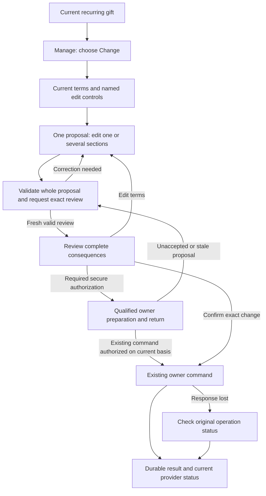

> Historical research record adopted for AL-1563. Scope and testing are ratified; earlier pending decisions and research-only workflow restrictions below preserve chronology. The [implementation specification](../../phase-25-donor-dashboard-depth.md) and its owner contracts are the implementation authority for this proposal. No historical synthetic/source check certifies target runtime behavior.

# Question 09 — Focused recurring edits that expand clearly

> **Explicitly founder-ratified, 7 September2026.** Conrad accepted Question09's corrected execution, mapped J01–J12 journey and C01–C22. Historical proposal/ratification wording below is answered; do not re-ask it. Implementation and release proof remain separate.

**Phase25 grooming review · 7 September2026 · Disposition: Accept with required amendments.**

Conrad selected **A — Focused editing, expand as needed**. Keep A. This completed review maps the donor journey, tests relevant assumptions and evaluates all22 requested categories. The corrected execution below is proposed for ratification; selecting A did not silently approve every interaction detail. Questions01–08 remain ratified. The next decision remains **Question09 — Review ratification**, not Question10.

This is a research/decision record, not a PRD, formal specification, ticket set or implementation. No Core source, GitHub state, hosted database or live provider was changed. The five preexisting setup-change files remain preserved. New experiments used synthetic values with actual installed libraries/source, and a new networkless disposable PostgreSQL instance that was removed. None certifies the unimplemented target editor.

## The corrected decision to record

> Inside the existing **Manage → Change this recurring gift** journey, use one readable workspace showing the currently authorized gift and named term sections. Current values and proposed changes remain understandable. Donors reveal only the inputs they need, and can keep several sections open. Generic entry does not force a preliminary questionnaire, choose an amount increase for the donor or start a long wizard.
>
> All compatible requested changes belong to one coherent proposal and one source-owned review. Opening or closing a section is presentation only. Closing preserves its input and shows any proposed change or error; an explicit **Undo [field] change** removes that requested edit. There is no per-field financial autosave. Untouched fields are not resent as stale instructions, and optional-value removal remains distinct from omission.
>
> Validate the entire requested proposal independently of which inputs are mounted or expanded. Make errors visible and reachable, preserve safe input through ordinary edit/review/error navigation, and reopen the appropriate section from an error or review link. Material consequences—including future schedule, amount/fee/charge grouping, affected lines, in-flight work and required authorization—are visible in the exact review, not hidden in optional sections.
>
> The existing recurring owner evaluates the complete change, authorizes its exact scope and accepts one versioned idempotent command. Compatible amount/date edits need no separate saves. A reduced amount does not make a combined earlier/more frequent/longer commitment automatically safe. No convenient subset of one reviewed change is silently applied. Ordinary save creates no hidden charge, proration, catch-up, duplicate executor, resume or retry.
>
> Draft, preview, secure payment preparation, accepted command and result remain distinct. A provider return alone is not proof the recurring gift changed. Use qualified payment-owner preparation before real setup effects and recover the exact owner state on return. Unaccepted input needs a current full review; an existing command whose exact authorization was deliberately completed continues through its owner without a redundant acceptance. Do not introduce generic cross-device draft sync or promise recovery of every unsubmitted keystroke after a browser crash. Accepted/pending operations remain durably recoverable under their existing owners.
>
> Use exact **base-maia, Base UI and shared semantic tokens** with readable labels, keyboard/touch operation, coherent focus, local feedback and stable mobile layout. Preserve separate direct Skip/Pause/Cancel and other qualified protective actions. Mission Control, Donor Portal and missionary projections consume the same owned facts; the editor creates no new schedule, wallet, consent, document or communication authority.

The concrete refinements for ratification are the workspace/reveal/undo behavior, complete proposal validation, explicit proposal-versus-result boundaries and C01–C22 below. Most enforce existing owner contracts. Qualified secure-return preparation is a required owner completion where effects occur, reusing accepted R03 refinements only where their exact scope fits; this review does not invent a broad financial draft service or silently extend replacement authority to every wallet operation.

## Adversarial check

### What could go wrong with this answer?

Hidden inputs can retain invalid values while losing their validators; a donor can mistake collapse for undo or a saved payment method for an applied recurring change. The current view also invents monthly/active defaults and uses unsafe money-unit assumptions. A good reveal animation cannot fix these. Preserve the focused experience while enforcing the full proposal and truthful source outcomes.

### What hidden assumptions are we making?

Not every field combination is supported for every selected line, rail, authority or state. Next recurring date re-anchors future giving, not just one payment. A smaller amount combined with other changes may still widen exposure. No comparative donor study proves focused editing universally best; the recommendation is a product judgment with specific usability proof required.

### How does this affect the whole product?

ADR0001 keeps CRM/application truth in Asym Postgres. Phase16 owns recurring terms, calendars, authorization, commands and recovery; Phase13 owns posted money; payment owners/Stripe own their respective credential and execution facts. The UI proposes edits. Staff cannot take over a donor-bound preview as authorization, and missionaries gain no editing or payment access.

### How does this affect the end-user experience?

Donors see the existing gift, edit the relevant terms, add another compatible change without starting over and review the whole result once. Proposed changes remain obvious when sections close. Errors lead directly to the right input. A lost response offers status recovery, and leaving the editor never pretends to cancel accepted work.

### Does this follow modern best practices?

Yes, with an important qualification: current GOV.UK guidance warns against hiding required content or turning a questionnaire into accordions. Use named editable summaries, not a generic accordion maze. W3C disclosure and financial error-prevention guidance supports clear states, keyboard semantics and review/correction; it does not prove this UI implemented or require redundant confirmation dialogs.

### Does this fit Asym’s existing repo and product direction?

Yes. #812 explicitly supports combined amount/date changes, while Phase16 already fixes the outer Manage actions, exact review, scope and durable confirmation. The actual current page instead opens a generic Billing Portal and has no target Change service. Preserve real ownership/error protections but replace the incomplete presentation/command path through the existing owners.

### Should we adjust the recommendation?

Keep A with the corrected execution. Do not require one save per section, expand optional choices into a new configuration system, or hide material consequences for visual simplicity. A full bounded form remains a credible alternative if actual task evidence later disproves this focused composition; building B is not a release prerequisite.

## Research, pattern classification and limits

<!-- prettier-ignore -->
| Source/pattern | Classification and what it supports | What is not adopted |
| --- | --- | --- |
| [W3C disclosure pattern](https://www.w3.org/WAI/ARIA/apg/patterns/disclosure/) | **Durable pattern:** an operable named button exposes expanded state and controls the associated region | A chevron alone is not a clear task label or validation strategy. |
| [GOV.UK accordion guidance](https://design-system.service.gov.uk/components/accordion/) | **Useful precedent and disconfirming evidence:** hiding universally needed content and nested/questionnaire accordions is discouraged | No claim that GOV.UK endorses a hidden multi-step financial form. The proposed workspace edits known current terms. |
| [GOV.UK check answers](https://design-system.service.gov.uk/patterns/check-answers/), [error summary](https://design-system.service.gov.uk/components/error-summary/) | **Useful precedents:** review, change links and linked errors help correction without starting over | No separate save per field, loss of answers, or automatic acceptance on Return. |
| [W3C financial error prevention](https://www.w3.org/WAI/WCAG22/Understanding/error-prevention-legal-financial-data.html) | **Durable pattern:** important submissions need appropriate checking, correction/review or reversibility | It does not mandate a confirmation for every toggle or make financial reversal a safe substitute for Core's required review. |
| [Donorbox amount editing](https://donorbox.zendesk.com/hc/en-us/articles/360020560251-How-do-I-edit-my-recurring-donation-amount-as-a-donor) | **Useful precedent:** a recognizable amount-specific action | Its immediate field acceptance/password/provider rules are not Core's shared draft/review. |
| [Church Center recurring editing](https://help.planningcenter.com/en/140951-manage-your-giving-information.html), [Givebutter recurring editor](https://help.givebutter.com/en/articles/4529176-how-to-edit-and-manage-your-recurring-donation) | **Useful precedents for strongest B:** common editors support several recurring terms | Their lifecycle/status, date-through-pause, receipt and access rules do not govern Asym. |
| Existing Phase16 preview/apply/current-result contract | **Durable pattern:** one owner compares exact intended terms, accepts the command and reports truthful downstream outcomes | No second amendment engine or direct route-level provider mutation. |
| Installed BaseUI/TanStack defaults | **Useful primitives with implementation hazards:** tested unmount/value/validator behavior must be accounted for | Unmount is not undo; component availability is not a complete accessible form. |
| Current flat pledge/Billing Portal path | **Incomplete predecessor / Implementation accident for this target:** useful source and guard evidence | It does not implement this Change journey or prove provider capability. |

Primary references were checked on7 September2026. Current Core and remote develop remain `7abd2c11ffd4ed70c6775c4fd6f51c996e4350dd`. Installed BaseUI1.5.0 and TanStack React Form1.28.6 were inspected/tested; current library documentation is not permission to upgrade. No new UI framework or primitive base is introduced.

Five current Stripe documentation pages were fetched via `stripe docs`: [prorations](https://docs.stripe.com/billing/subscriptions/prorations), [billing cycle](https://docs.stripe.com/billing/subscriptions/billing-cycle), [save/reuse routing](https://docs.stripe.com/payments/save-and-reuse), [SetupIntents](https://docs.stripe.com/api/setup_intents) and [idempotent requests](https://docs.stripe.com/api/idempotent_requests). Core remains on SDK22.2.0/API2026-05-27.dahlia. Generic SDK-upgrade, hosted-portal, provider-retry or SaaS tax suggestions cannot override Core's custom donor surface and qualified recurring contracts. No tax/provider configuration is proposed.

The refreshed existing CLI default/test scope again lists zero connected accounts and a platform account without enabled charges/payouts/capabilities. No financial/provider mutation or execution test ran, and unseen production capability is not inferred. Stripe's setup may save a method without a payment; that is a real setup effect, not acceptance of this recurring proposal. Disabling proration alone does not prove every anchor/interval/method change free of immediate billing or retry effects; the exact owner adapter must qualify the complete operation.

## Complete donor journey

The following is a proposed execution map for ratification, using illustrative donors and source-qualified examples, not a report of observed real donor behavior.

The diagram shows logical responsibilities, not an instruction to ask for authorization twice. Existing source semantics decide whether the exact command/preparation is recorded before its required challenge; after return, resume that same operation and re-prove its exact basis rather than creating another acceptance. No provider setup is hidden inside a pure preview.

### J01 — Enter the right gift with enough context

Ada has USD40 monthly for Maya's ministry and another USD20 line for a different ministry. She enters Maya's current line detail, then Manage → Change. The approved safe ministry label, per-gift amount/currency, cadence, relevant next date and current personal/represented context identify what she is changing. A scope summary is visible throughout; it does not expose restricted siblings to provide reassurance.

Generic Change opens the same readable workspace, not a forced “pick one task” screen followed by a wizard. Show current term summaries with named controls such as **Edit amount**, **Edit schedule**, **Edit designation** and **Change payment method** where the owner currently permits them. An exact permitted field-targeted entry may open that section directly. Do not automatically open an increase/upsell field or populate a new amount.

Current values are read-only source facts until the donor proposes a change. Unknown cadence, method, currency or next-date information is not replaced with friendly guesses. If the source cannot safely describe the current arrangement, show its qualified unavailable/help/protective path instead of an editable fake baseline.

### J02 — Expand a section without starting a business operation

Ada chooses Edit amount. The relevant labelled amount input appears next to its context. Schedule and other summaries remain visible. She can open Schedule without closing Amount; no exclusive accordion forces comparison from memory. Use one ordinary parent form/proposal controller, not independent state or submit handlers owned by each collapsing panel.

Expansion alone never creates a preview command, saves a term, starts provider setup, changes selection, writes consent or sends a notification. Network loading of necessary read-only options is distinct from a financial/setup effect. Lazy-load expensive controls only when needed, with truthful local loading; don't hide the user's existing proposal when that load fails.

Keyboard users activate the named control with standard button behavior and can reach the revealed fields predictably. Ordinary disclosure retains logical focus; error/review links deliberately focus their exact target after revealing it. On mobile, avoid unexpected keyboard opening or animated scrolling simply because a region becomes visible. No nested click targets or Undo button inside a disclosure button.

### J03 — Make the proposed change visible, even when collapsed

Ada enters50. The section shows that **USD40 → USD50 per gift** is proposed. A concise page-level explanation establishes that changes are applied only after review and confirmation; repeat warnings are unnecessary. Collapsing Amount retains50 and shows the changed summary. It must not look like an applied change or revert to displaying only40.

An explicit **Undo amount change** removes that field's proposed edit. It does not reverse a previously accepted change, detach a saved method, reset other fields or write the old40 over a newer source value. The server will use the current source for any omitted field when re-previewing. **Leave unchanged**, an explicit0/false where legal, and **Remove end date** are different meanings; empty text is never silently zero or null.

If all requested changes are undone or normalize to no change, say **No changes to review** and keep a clear way back. Do not create an amendment or show a success message for doing nothing. Opening/collapsing unchanged sections does not make the form financially dirty.

### J04 — Add a schedule change without restarting

Ada also wants the next eligible gift on the20th. She opens Schedule and edits within the same proposal. Amount50 remains visible and intact. Amount/date changes can share one source preview/apply, as #812 already requires. No field is saved before the donor sees their combined result.

Core's Next recurring donation date **re-anchors the continuing schedule**. Explain that consequence near the date input; the exact review shows the next three source-calculated dates. Do not imply it moves only one payment or implement it through a pause shortcut. If Ada only wants to miss one occurrence, the existing Skip action has that different meaning. Do not silently convert her edit into Skip or Pause.

Cadence, next date and end boundary are related. Changing one must not silently clear another. Keep a source-permitted **Set an end date** quiet and optional; after it is selected, its inclusive final-date meaning and removal action are clear. An end before the proposed first continuing date produces a linked correction, not a guessed valid replacement. Twice-monthly retains the exact1st/15th model and full amount per gift; monthly31st/short-month behavior and the arrangement's frozen giving timezone come from the source kernel.

### J05 — Add another compatible term without widening scope

Explicitly changing Designation, fee cover or an eligible method adds only that requested supported term to the proposal; merely opening the section changes nothing. A group total is not writable authority, and the UI cannot distribute a new total among lines. Only source-certified selected-line shapes are offered. If selected lines have mixed values, show that honestly and require exact intended values; never prefill every line from the first one.

All affected and unchanged consequences needed for consent appear in review. A changed designation's safe name, payment group/charge count, method/rail, fees and terms may affect authorization even when the base amount is unchanged. A currency change or entity switch is not casually added to this form; existing source rules govern any separate freshly authorized arrangement.

### J06 — Validate everything, including hidden edits

While typing, do not show errors for every incomplete keystroke or aggressively reformat values under the cursor. Validate locally at appropriate interaction points and validate the full proposal on Review changes. Locale-aware amount entry must resolve unambiguously to the source currency's exact minor units; reject ambiguous/unsupported values rather than rounding or assuming USD. The server repeats authoritative validation.

If a section is closed with invalid proposed data, its heading/summary exposes the problem. On attempted review, use one linked error summary and matching inline errors. The error link opens the relevant section and focuses the exact input after it exists. Dependent errors explain the relation, for example the proposed end date is before the new continuing date. Do not discard one valid field to clear an error elsewhere.

The installed-library experiment demonstrated why field-level validators alone are insufficient: an unmounted invalid field's value can remain while its validator no longer runs. Form-level/whole-proposal validation and source validation must cover every intended field regardless of disclosure state. Keeping selected components mounted may help, but is not a substitute for this invariant. Hidden content must also leave the browser focus order correctly.

### J07 — Review the complete effect once

Review changes requests the owner preview for the entire intended change against current source revisions. This is not financial acceptance. Show a readable Current → Proposed comparison and the material effective outcome: exact line(s), per-gift amount/currency and fee cover, continuing schedule/next dates, end truth, charge grouping and existing in-flight payments that cannot be changed.

All material consequences are visible without expanding extra panels. Secondary technical details do not belong here. Source-owned authority checks classify the whole proposal: USD40→30 plus a more frequent schedule or removed end date is not automatically a reduction. If additional exact-term authorization is required, explain who must complete it and what happens next. Do not apply only the reduction and leave the other proposed fields waiting.

The review has meaningful Change links back to the relevant section. Return preserves the whole safe draft, opens the selected section, and requires a fresh preview after a material edit. Cosmetic expansion/collapse does not invalidate a still-current preview; relevant term/scope/source/authorization/provider changes do. Never silently merge concurrent staff changes or reuse authorization for materially changed terms.

### J08 — Handle payment preparation and authentication honestly

Opening Payment method can show currently qualified masked choices. **Add a payment method** deliberately enters the existing provider-hosted collection/verification path. Before real setup effects, the payment/authorization owner must supply bounded scope/version/expiry and correlation. No raw card/bank data, CVC, client secret or bearer material goes into the draft, URL, browser storage, logs or support payload.

A provider may already have saved a method before the recurring change is accepted. On return, re-prove the same actor/scope, exact account/mode/rail/credential readiness and the full proposed terms. A callback flag cannot mean “gift updated.” If the donor removes the proposed method change or discards the recurring draft, explain any independently saved method where relevant; do not silently delete it or make it default. Pending bank verification or unknown setup has its own truthful state and same-operation readback.

Amount/date-only edits need none of that setup machinery. Where reauthentication or a secure redirect is necessary, preserve qualified safe context through the existing bounded owner handoff. For an unaccepted setup/authentication return, restore and re-prove the proposal for review; return alone never applies. Where deliberate verified acceptance of exact authorization terms completes an existing command, resume that same owner operation without another acceptance or challenge unless its basis became stale. If that exact facility is not implemented, it is a completion blocker for that subpath, not permission to put terms/secrets in a return URL or promise unsupported resume.

### J09 — Confirm deliberately; preserve exact result identity

Only the existing source-owned acceptance control submits the reviewed command. Editing-page Enter triggers review/validation, not an unreviewed financial apply; disclosure/undo buttons are ordinary non-submit buttons. During acceptance, show a calm waiting state and prevent repeated ambiguous submissions. Exact duplicate transport submissions still resolve to the same durable operation server-side.

An ordinary change has no hidden charge. A today-date choice that the owner treats as an immediately eligible gift follows its separately named exact amount/date financial authorization before any attempt. “One review” does not erase that requirement, nor justify an extra generic modal when the required review already provides it.

If the response is lost, show **Check change status** for the original operation. Do not say the change failed or create a new idempotency key and retry blindly. A partial provider result is **being confirmed/reconciled** or the owner's safe repair state, not a fully changed gift. One atomic domain command can still require several externally reconciled operations.

### J10 — Finish on a durable confirmation

The accepted result shows frozen effective terms, dates and in-flight non-effects plus advancing provider evidence. Refresh reads that result; it does not repeat the command or rewrite the original confirmation from today's live arrangement. A later separate change can be linked as current state without altering the historical result.

Amount/designation/method-only changes produce the appropriate term version; calendar-bearing changes produce the matching new schedule epoch. The editor does not invent an epoch merely because a section was edited. Reserved `recurring_schedule_changed_v1` produces no email, notification or delivery claim. The donor still gets the complete source confirmation in the portal.

### J11 — Leave, return, expire or lose the browser

Preserve safe input across section changes, validation, review and same-session Back navigation. Intercept an intentional in-app departure only when meaningful unaccepted edits would be lost, with clear Stay/Discard edits language. Discard edits is not Cancel recurring gift. Normal clean navigation needs no ceremony.

Unsubmitted ordinary values remain a bounded edit-session proposal, not a promised cross-device saved draft. Do not write them to general localStorage, analytics or another person's session. Browser unload warnings are best effort, especially on mobile; they are not durable-save proof. On a full reload/crash where no retained qualified proposal exists, recover current source and any already-started operation first, then truthfully explain whether edits need re-entry. Never assert “nothing changed” until unresolved owner operations are ruled out. [Browser unload limitations](https://developer.mozilla.org/en-US/docs/Web/API/Window/beforeunload_event)

An accepted or prepared owner operation retains its required durable recovery; losing a browser never authorizes a duplicate or inverse action. Login as another user, represented-context change or revoked permission clears unsafe old content and requires current authorization. Staff may use their own authorized service workflow, but cannot reuse a donor's preview/challenge or infer Party instruction from an unsubmitted draft.

### J12 — Keep urgent protective actions reachable

Skip, pause, cancellation and eligible stop-retry actions remain separate current-owner operations. An invalid or abandoned Change proposal must not make the donor complete it before requesting a stop. Preserve relevant unsaved-edit disclosure without a retention obstacle. An already accepted indeterminate change cannot be undone by closing the page; the owner serializes and reconciles any later protective request.

An edit cannot rewrite an in-flight payment, auto-resume a pause, resurrect a cancelled authorization or consume another recovery opportunity. Q06's optional old-gift repair offer is not automatically attached to this editor's completion: its full-original-intent and surviving-eligibility rules still apply. The donor sees exact current stop/provider confirmation rather than a false promise of immediate external cancellation.

## Evidence actually obtained

- **9 installed-library observations:** actual BaseUI1.5.0 SSR and TanStack React Form1.28.6 behavior with synthetic strings. Closed default Collapsible omitted input markup; keepMounted retained it. Unregister preserved value/touched state but cleared field error metadata; field-only validation then allowed retained invalid input to reach a submit callback; a form-level validator blocked it. Remount preserved touched input; explicit deleteField removed it. Node24.15.0 results were also reproduced under Bun1.3.14, not double-counted. No browser focus/accessibility or target editor was tested.
- **13 actual-source observations:** current portal model/view/patch/Billing Portal handler with real operation wrapper and ownership service, synthetic auth/database/provider boundaries. Findings include invented monthly/active defaults, precedence between contradictory dates, zero-decimal-currency display error and malformed-currency USD fallback. Positive checks preserve original/end dates, date-only formatting and explicit null/false/omission; real wrapper paths normalize404/409/403/503 before mocked provider calls. A supplied edit-shaped body still only creates a mocked generic customer session, not a saved recurring change. No target preview/apply or real Stripe session was exercised.
- **76 native migrations and 12 actual legacy-table observations:** new networkless PostgreSQL17.10; anon saw no inserted private pledge, authenticated owner saw its normal row, unrelated subject saw none, direct authenticated writes were denied, and negative money was rejected. Owner-inserted null/cross-Tenant relationships and arbitrary cadence/status/contradictory dates were accepted. The authenticated linked donor could read a deliberately poisoned cross-Tenant row. This proves a conditional structural/RLS weakness when privileged data is already inconsistent, not that donors can create that row or that hosted data is exposed. The container was removed.
- **Current documentation/read-only scope:** source/ADRs/OpenSpec, installed packages, five Stripe pages and sanitized default/test account reads. No live financial action, provider setup, hosted role check, donor browser task, target SQL concurrency or production qualification ran.

The first database assertion incorrectly expected anon table permission denial. Actual grants allow SELECT but RLS returned zero rows. That failed assumption is retained; the harness was corrected, not the migrations, and a fresh complete run verified the populated-row boundary. A preliminary library run lacked the WSL node PATH and ran no assertions; a shell quoting error also ran no Stripe research until its script was corrected. These are documented setup limits, not product test failures.

See the [evidence record](phase25-r09-proof-evidence.md) and [Historical bundle inventory: phase25-r09-proof-bundle.zip](README.md#historical-verification-bundles) for source hashes, SQL/catalog/roles, libraries, observations and precise unrun proof.

## Full category review

Severity describes the consequence if the concern occurs, not a claimed deployed incident. **High** covers financial/authorization integrity or an essential failed journey; **Moderate** covers substantial confusion, friction or maintainability. Likelihood is observed or conditional, with unknown incidence stated. Every C-number below is proposed exact execution language for the later specification, not a formal specification issued in this turn.

### 01 — Problem validity, necessity, and alternatives

**Material concern: Yes — focused editing can add steps without reducing effort.**

**What/why:** A compulsory task chooser, one-field wizard or many nested panels can make a small edit harder than B's compact form. **Severity:** Moderate. **Likelihood:** Conditional design risk; no comparative Asym user study. **Evidence:** documented common donor editors, GOV.UK disclosure cautions and existing #812 compound change. **Effect on A:** narrows its execution, does not reject it.

**Permanent prevention — C01:** “Generic Change opens one current-term workspace with clear named edit controls and no preliminary wizard. Allow several relevant sections open and compatible changes in one proposal. Preserve the same exact source review and result; do not require per-field saves or another implementation to validate the chosen design.”

**Acceptance evidence:** Donors complete amount-only and amount-plus-date tasks, identify their selected gift and explain when changes apply. Measure actual comprehension and friction; do not use a claimed industry conversion gain as proof.

### 02 — Brittleness

**Material concern: Yes — disclosure lifecycle can silently change the proposal.**

**What/why:** Unmount/remount, local component state or regenerated defaults can lose inputs, errors or provider setup, making a collapsed section mean something different. **Severity:** High for wrong accepted terms, Moderate for lost input. **Likelihood:** Installed-library value/error behavior is executed; target implementation risk remains conditional. **Evidence:** U01–U09 and shared wrappers. **Effect:** requires independent presentation and proposal state.

**Permanent prevention — C02:** “Maintain the complete proposal independently of expanded sections and component mount state. Collapse changes presentation only; summaries retain proposed values/errors. Undo removes only its explicit requested edit and is separate from collapse. Remount or source refresh cannot silently replace touched input with defaults. Manage hosted-field mounting through its qualified owner lifecycle.”

**Acceptance evidence:** Open/edit/collapse/reopen, rapid changes, multiple open sections, remount and explicit Undo retain exactly the intended values; undoing one edit preserves others. No collapse triggers a command, preparation or hidden default change.

### 03 — Technical debt

**Material concern: Yes — per-panel handlers and prototype routes can create duplicate mutation logic.**

**What/why:** Independent Save handlers, separate draft stores or generic Billing Portal/profile endpoints can diverge from the recurring owner. **Severity:** High. **Likelihood:** Current generic route/prototype views exist; target reuse hazard is conditional. **Evidence:** source B03, strict profile schema M07–M08, absent target module and #811/#812. **Effect:** requires shared source completion.

**Permanent prevention — C03:** “Use one scoped proposal controller and the owner-specified recurring preview/apply/result services in packages/api. UI sections compose inputs, not independent business commands. Do not use profile patch, legacy pledge UPDATE, generic customer portal session, route-level Stripe calls or a second amendment aggregate as Change.”

**Acceptance evidence:** Trace every edit entry through one qualified service. Architecture checks and public-seam tests reject direct financial mutation, per-field autosave and old-route fallback. Reuse current error/ownership guards where sound without calling them complete target authority.

### 04 — Edge cases

**Material concern: Yes — apparently simple input can change a different financial/calendar meaning.**

**What/why:** Zero/blank, locale separators, end removal, mixed selected values, monthly31st, twice-monthly or a date that becomes past can be misinterpreted. **Severity:** High. **Likelihood:** Ordinary supported boundaries; actual incidence unmeasured. **Evidence:** P16 B7/B8/C6, source M01–M06 and exact minor-unit error. **Effect:** makes scope and temporal meaning explicit.

**Permanent prevention — C04:** “Use source currency/minor units and civil-date rules; distinguish omitted, explicit empty/invalid, legal zero/false and null removal. Next recurring date re-anchors future dates, not one payment. Preserve optional inclusive end-date meaning, exact cadence and original history. Mixed current values require deliberate owner-supported values; no first-line or group-total inference.”

**Acceptance evidence:** Currency0/2/3-decimal fixtures where supported; ambiguous localized input, fullwidth/IME entry, no-op equivalence, null versus omission, end before/equal first occurrence, daylight/timezone/midnight/short-month boundaries and heterogeneous selection. No unsupported date/currency is silently repaired by the client.

### 05 — Footguns

**Material concern: Yes — controls can accidentally submit, clear or partially apply edits.**

**What/why:** Enter, disclosure buttons defaulting to submit, “Done” implying save, collapse-as-delete and blind full-record PATCH can create unintended outcomes. **Severity:** High. **Likelihood:** Concrete form-composition risks; target not built. **Evidence:** installed form behavior, M07–M08 and existing preview/apply boundary. **Effect:** strengthens interaction semantics.

**Permanent prevention — C05:** “Editing affects an unaccepted proposal only. Non-submit edit/disclosure/Undo controls never apply. Editing-page Enter reaches validation/review, not final acceptance. Changed-field intent preserves untouched terms. Undo is omission of that request, not writing an old baseline. One reviewed compound change cannot silently apply a safe subset or become a series of independently accepted field saves.”

**Acceptance evidence:** Keyboard submissions, rapid clicks, collapse/Undo/discard, invalid hidden values and stale baseline do not create financial effects. Complete no-op creates no fake amendment or success. All actual acceptance uses the current exact owner preview.

### 06 — Tenant safety

**Material concern: Yes — draft/cache reuse can cross a donor or represented context.**

**What/why:** A hidden proposal, late response or prepared method can reappear under another account, Tenant, entity, Party or line. **Severity:** High privacy/financial impact. **Likelihood:** Conditional target race; tested normal legacy ownership is positive, poisoned-row case exposes structural limits. **Evidence:** real PG role observations, P16 security invariants, R04 and current auth/cache source. **Effect:** requires full-context boundaries.

**Permanent prevention — C06:** “Derive current Tenant/environment/entity/actor/Party/line scope from trusted server context. Bind proposal/preview/setup/results and late-response handling to that exact scope. Clear unsafe old data on context loss; changing represented context is not transferring a draft or authority. Every selectable label, affected-line summary and method is currently permitted; unknown IDs/provider metadata cannot select scope.”

**Acceptance evidence:** Two Tenants/entities, same person in distinct roles, logout/login, revoked representation, late response and provider return to wrong context yield zero unauthorized values or effects. Separate document/financial/collection rights are not merged for convenience.

### 07 — Database, RLS, and authorization safety

**Material concern: Yes — legacy pledge constraints are not the target recurring model.**

**What/why:** Effective read policies protect normal ownership but do not repair poisoned cross-Tenant relationships; loose cadence/status/dates cannot enforce compound changes. **Severity:** High. **Likelihood:** Exact fixture behavior observed; hosted incidence and target behavior unverified. **Evidence:** 76 migrations plus12 observations, final catalog and P16 journal/subject/provider-operation contracts. **Effect:** prevents adopting legacy rows as authority.

**Permanent prevention — C07:** “Complete the existing owner aggregates with required non-null scope, composite same-Tenant/entity and binding/account/mode references, kind-correct subjects, closed versioned terms, exact money types, append-only accepted history and restrictive lifecycle/deletion rules. Use one current term/calendar head with expected-revision/CAS/uniqueness; one durable semantic command effect and exact child operations. Trusted context supplies actor/authority/audit fields. Review effective schema/table/function grants, RLS USING/resulting-row checks, views, security-definer/search-path and privileged roles; no browser grant or caller-controlled ownership update is an editor fix.”

**Acceptance evidence:** Real target PostgreSQL positive and negative role tests, forbidden row transformations, scope-poison FKs, stale revisions, concurrent command/promotion/stop and replay. Current fixture service_role has BYPASSRLS but no table grants; owner observations are not service-role execution proof. RLS is enabled now despite stale original-migration claims. Missing explicit WITH CHECK alone is not a finding: PostgreSQL can reuse USING; this table's current policy is SELECT-only.

### 08 — Overengineering

**Material concern: No additional architecture is needed by focused expansion.**

Checked a single parent proposal, shared field components, source validation and existing owner commands against alternatives. A global draft ledger, collaborative editor, custom accordion library, distributed form event bus or another wallet/commitment domain would make the task harder to support. Required payment preparation and durable accepted results remain necessary owner work, not optional complexity.

**Scope guard — C08:** “Compose the existing UI and domain owners. Add no generic persistent/cross-device draft system, field-level command journal, rule engine, new provider orchestration platform, bespoke motion framework or parallel full-form implementation through Q09.”

### 09 — UX/UI and user friction

**Material concern: Yes — hidden changes and errors can defeat an otherwise attractive editor.**

**What/why:** Users may not discover fields, know which changes remain, reach a hidden error or distinguish review from apply. Sticky mobile actions can obscure focus. **Severity:** High if task is blocked; otherwise Moderate. **Likelihood:** Conditional UI risk supported by actual unmount validation behavior. **Evidence:** U01–U09, W3C disclosure/focus guidance, GOV.UK errors/check-answers and installed Maia wrappers. **Effect:** defines the expansion experience.

**Permanent prevention — C09:** “Keep current/proposed term summaries and material review consequences visible. Use named accessible disclosure controls, semantic headings/field labels, several open sections, no nested interactive triggers and no forced wizard. Validate all proposed values at form and server level even when inputs are unmounted; show linked summary plus inline errors and reveal/focus the target. Use exact Maia/BaseUI, appropriate nonintrusive status, stable keyboard/touch/reflow and reduced-motion behavior.”

**Acceptance evidence:** Real mobile/desktop, NVDA/Chrome and VoiceOver/Safari journeys with keyboard/virtual keyboard, 320CSS-pixel reflow, 200/400% zoom, text spacing/forced colors and long translations. Closed content is absent from focus order. Every proposed change and error remains discoverable; no screen-reader alert per keystroke or focus jump on normal disclosure. [Focus not obscured](https://www.w3.org/WAI/WCAG22/Understanding/focus-not-obscured-minimum.html)

### 10 — Source of truth, ownership, and domain invariants

**Material concern: Yes — display state can be mistaken for schedule or authorization truth.**

**What/why:** “Monthly,” next-date precedence, provider session success or a saved method can be treated as authoritative input/acceptance. **Severity:** High. **Likelihood:** Current mapping/session behavior is observed; target misuse conditional. **Evidence:** M01–M05/B03, ADR0001, P16 and active donor-self-service OpenSpec18–31. **Effect:** keeps UI as a proposer.

**Permanent prevention — C10:** “Phase16 owns exact recurring intent, term versions, calendars, commands and provider reconciliation; Phase13 owns posted money; credential and communication owners keep their facts. UI summaries/drafts are not authority. Non-calendar edits append appropriate term versions without fake schedule epochs; calendar-bearing edits append the matching epoch. Preserve original anchors, historical occurrences and immutable accepted confirmations.”

**Acceptance evidence:** Amount-only versus amount+calendar changes yield the correct owner records; neither changes past gifts or original anchors. Rebuilding display/projection state creates no authority or money. Late provider evidence advances status without rewriting accepted terms.

### 11 — Hidden coupling

**Material concern: Yes — field dependencies can silently widen exposure or erase an existing restriction.**

**What/why:** A lower amount with higher frequency, fee cover, a new rail, earlier date or removed end can be incorrectly treated as harmless. Changing cadence can silently reset next/end fields. **Severity:** High. **Likelihood:** Supported compound edits make this a foreseeable case. **Evidence:** P16 D15 full before/after classification, B8 and #812 combined example. **Effect:** requires whole-change classification.

**Permanent prevention — C11:** “The owner evaluates the entire proposed exposure and affected scope, including fees, cadence, dates, horizon, method/rail and designation. UI dependencies explain invalid combinations and preserve input; they do not silently reset terms, auto-select a compatible substitute or apply a convenient subset. Required collection authorization belongs to the actual authorizer and exact terms, not a saved method or generic checkbox.”

**Acceptance evidence:** Mixed increases/decreases, fee-only change, changed rail, removing end and representative-without-collection-authority cases return correct owner lanes. Safe permitted narrowing stays easy; do not add a universal reauthentication or staff-approval ceremony.

### 12 — Failure modes

**Material concern: Yes — timeout, lost response and secure return have different outcomes.**

**What/why:** Showing “failed” after an accepted write or “updated” after method setup can cause repeated effects or donor confusion. **Severity:** High. **Likelihood:** Expected network/provider failures; no target outcome proof. **Evidence:** P16 durable command/result contract, R03/Q06 and positively normalized current wrapper errors. **Effect:** requires explicit recovery states.

**Permanent prevention — C12:** “Distinguish loading, invalid proposal, preview unavailable/stale, authorization needed, preparing/verification, submitting, accepted/provider pending, indeterminate and final failure. Preserve safe input before acceptance. After possible acceptance, recover the original durable operation rather than issuing a new command or inverse. Method setup success is not recurring apply success; unresolved provider legs cannot produce a complete claim.”

**Acceptance evidence:** Fail every boundary before/after durable writes and secondary effects. No blind resubmit, false unchanged claim, duplicate method/command or misleading toast. Retry/status/help resolves the actual failed stage; other valid protective actions remain available under their own owner.

### 13 — Lifecycle, temporal correctness, concurrency, and idempotency

**Material concern: Yes — a once-valid review can become stale before acceptance.**

**What/why:** Two tabs, staff changes, midnight, an occurrence claim or terms/mandate revocation can invalidate the proposed result. Provider effects may arrive out of order. **Severity:** High. **Likelihood:** Normal concurrency conditions; target race proof unrun. **Evidence:** P16 C6/journal/authorization challenge/child operations and #812/#813. **Effect:** preserves exact acceptance boundaries.

**Permanent prevention — C13:** “Bind preview/challenge to full proposal, current actor/authority/scope/source revisions, calendar/occurrence and provider basis/expiry. Relevant edits invalidate prior review/authorization; mere disclosure state does not. Locked apply re-proves the basis and records one versioned semantic operation. Changed payload cannot reuse an immutable acceptance; exact replay resolves its same result. Provider operations use stable child identities and monotonic reconciliation. No stale auto-rebase or last-write-wins financial update.”

**Acceptance evidence:** Real target two-session races for amount/date changes, stop versus change, claimed occurrences, expiry, provider control and duplicate acceptance; changed-payload key conflicts; late/out-of-order events cannot create a second epoch, charge or contradictory confirmation. Provider idempotency is not a substitute for durable business uniqueness.

### 14 — Data integrity risks

**Material concern: Yes — whole-record form submissions can overwrite untouched concurrent terms.**

**What/why:** A stale baseline may clear end dates, normalize unknowns, rewrite siblings or replace current values after Undo. **Severity:** High. **Likelihood:** Common form-design risk; exact legacy null/false/default behavior tested. **Evidence:** M01/M02/M07/M08, owner O01 and current loose legacy schema. **Effect:** narrows payload and merge semantics.

**Permanent prevention — C14:** “Represent exact intended changed fields and owner-certified selected-line values, preserving omission versus explicit removal. Validate the full resulting proposal against one current source basis. Undo removes intent, not current truth. Do not submit a blind stale full snapshot or let default values, decimal rounding, duplicate date columns or first-line copies author a change. Source-approved facts and provider bindings remain typed and scoped.”

**Acceptance evidence:** Concurrent source changes to untouched fields, explicit null/false/zero where legal, field reopen/remount, no-op normalization, mixed selection and malformed money/date inputs preserve correct accepted terms or require fresh review. Repair/import paths cannot synthesize missing historical authorization.

### 15 — Security and privacy risks

**Material concern: Yes — recovery can leak credentials or transfer authority between actors.**

**What/why:** Persisting raw form/provider values in URLs/storage/logs, trusting a callback or letting staff adopt a donor token can expose financial data or authorize the wrong terms. **Severity:** High. **Likelihood:** Conditional implementation hazard; no credentials or live provider flow was exercised. **Evidence:** P16 auth/preparation/role rules, ADR0037/P24 and R03. **Effect:** constrains retention and handoffs.

**Permanent prevention — C15:** “Keep raw payment data exclusively in provider-owned collection. Use bounded qualified owner preparation before setup effects, with exact scope/version/expiry and safe correlation. No PAN/CVC/bank account, client secret or bearer grant in application drafts, URLs, logs, analytics or replay/support messages. A callback supplies correlation, not proof; the owner verifies the exact provider/authorization result and current authority, then resumes the correct proposal or existing-command state. Staff uses its own capabilities/instruction/collection authority, never donor-bound previews or unsubmitted draft intent.”

**Acceptance evidence:** Wrong-user/provider return, expired setup, revoked representative, forwarded/protected action, scanner GET, tampered scope and support handoff tests; no sensitive payloads/cache exposure. A method saved before draft abandonment is reported truthfully and is not auto-detached/defaulted or rebound.

### 16 — Scalability and performance risks

**Material concern: Yes — disclosure can hide expensive work rather than avoid it.**

**What/why:** Rendering every payment element, querying all methods/lines or sending a server/provider preview on each keystroke can make mobile use slow and burden tenants. **Severity:** Moderate, High during overload. **Likelihood:** Conditional; no target benchmark run. **Evidence:** current source shape, installed mounting behavior and P16 bounded source services. **Effect:** requires proportional work.

**Permanent prevention — C16:** “Perform local input checks without per-keystroke financial/provider work. Request complete owner preview at meaningful explicit boundaries, suppress stale responses, and bound selections/options/payloads under owner limits. Load expensive controls only when needed while preserving proposal/validation state. No unbounded lookup, speculative provider setup for hidden sections or form-specific backend service.”

**Acceptance evidence:** Production-shaped line/method counts, slow mobile network, rapid edits, repeated reveal and concurrent tenants; measured query/payload/latency budgets and declared units. Preserve P16's existing performance contracts; do not invent a stronger arbitrary form SLO or sacrifice current authorization for speed.

### 17 — Operational burden

**Material concern: Yes — a false draft-resume promise can create confusing support cases.**

**What/why:** Staff may not know whether the donor merely typed, saved a method, authorized terms or applied a change. Unsupported cross-device recovery adds privacy and coordination work. **Severity:** Moderate to High. **Likelihood:** Expected interruption/support scenarios; incidence unmeasured. **Evidence:** P16 prepared/accepted-case distinction, R03 exact preparation and MDN unload limits. **Effect:** makes resumption promises precise.

**Permanent prevention — C17:** “Preserve bounded safe proposal state through ordinary same-session edit/review/errors. Use existing qualified owner recovery for started setup/authorization/accepted operations. Do not promise universal cross-session/cross-device autosaved drafts or treat an unsubmitted draft as staff instruction. On lost local input, first resolve any existing operation, then state clearly what needs re-entry. Source-owned help diagnoses the stage without direct database repair.”

**Acceptance evidence:** Edit/review Back, reload, browser close, expired session, secure redirect and staff assistance distinguish all stages. Dirty departure warning is proportional and best effort, never the durable recovery mechanism or an obstacle to a protective request.

### 18 — Observability and auditability gaps

**Material concern: Yes — field interaction can be confused with accepted intent or messaging.**

**What/why:** Auditing every expansion as a change, logging raw values or claiming confirmation email after a Reserved message creates noise and false history. **Severity:** High for incorrect business evidence, Moderate for diagnostic burden. **Likelihood:** Conditional; stale #812 send text is verified. **Evidence:** P16 frozen result/journal and Reserved-message rule at524. **Effect:** keeps evidence minimal and source-owned.

**Permanent prevention — C18:** “Technical traces identify safe stage/correlation and failures; durable command history records trusted actor, exact scope/before-after basis, acceptance and provider outcomes. Disclosure/typing does not create an accepted amendment, staff task, donor-read fact or missionary notification. Reserved schedule-change keys create no message/plan/intent/event/delivery claim; future Live activation remains prospective.”

**Acceptance evidence:** Valid change has one exact durable history and correct provider status, no unqualified communication. Operators distinguish validation, stale review, setup uncertainty, accepted pending and repair failure without raw credentials or sensitive draft logging. Monitoring has explicit owners/thresholds/responses below.

### 19 — Dependency and integration risks

**Material concern: Yes — provider defaults and library behavior differ from Asym's intended semantics.**

**What/why:** Stripe prorations/billing-anchor changes, retry behavior, finite request-idempotency retention and setup lifecycle can violate an assumed no-charge Save. New library examples may differ from installed wrappers. **Severity:** High. **Likelihood:** Documented defaults plus verified missing target integration; exact account execution unproved. **Evidence:** current Stripe CLI documentation/pins/read-only scope, U01–U09, #811/#812/#813. **Effect:** requires exact owner qualification.

**Permanent prevention — C19:** “Complete the existing owner adapter and secure preparation/return contracts for each supported account/mode/rail/command before activating the dependent control. A provider preview/pending-update setting, successful setup, generic portal session or proration=none alone is not proof of Asym's full effect. Use current supported installed UI/form APIs; no unrequested upgrade, new renderer/provider or generic SDK best-practice override of accepted architecture.”

**Acceptance evidence:** Exact provider-contract tests and authorized sandbox tracers for no unintended charge/retry, correct item/leg/scope, today-charge separation and setup recovery. The inspected default/test account cannot supply those positive connected-account proofs. Absence of proof must not disable separately qualified safe controls indiscriminately.

### 20 — Migration, rollout, and upgrade risks

**Material concern: Yes — a polished editor can be released over incompatible legacy truth.**

**What/why:** Old clients/Billing Portal/pledge writes can bypass review or recreate different terms during a mixed rollout. Rollback can restore an unsafe executor path. **Severity:** High. **Likelihood:** Conditional cutover risk supported by existing incomplete routes/mappings and target absence. **Evidence:** source trace, P16 clean adoption, #811–#813. **Effect:** requires complete owner cutover.

**Permanent prevention — C20:** “Inventory all recurring-edit entrances/callers and source data; apply the existing owner qualification/adoption plan. Do not fabricate historical mandate/calendar facts or keep indefinite dual writes. Sequence compatible schemas/owner commands/read models/UI and qualify exact supported controls before activation. Rollback/containment preserves accepted operations and protective stop paths, and never re-enables unreviewed legacy/provider writes.”

**Acceptance evidence:** Clean install and source-approved legacy adoption, mixed versions, open old tabs, stale previews, data with missing authority, rollback after accepted work and recovery drills. A disabled widening path still reports current status and qualified protective options. No implementation or migration is authorized in this grooming turn.

### 21 — Testability, traceability, and proof

**Material concern: Yes — component snapshots and simulated source success can overstate completeness.**

**What/why:** SSR markup does not prove hidden focus; a form callback is not domain apply; legacy SQL is not the target concurrent owner model. **Severity:** High for false readiness. **Likelihood:** Present evidence scopes make the distinction concrete. **Evidence:** 9 library/13 source/12 legacy DB observations and unimplemented target services. **Effect:** requires falsifiable end-to-end proof.

**Permanent prevention — C21:** “Trace the selected answer and C01–C22 through local terms, later authorized OpenSpec/design/tasks, exact predecessor issues, implementation and release evidence. Require real target PostgreSQL authorization/concurrency, provider contracts and accessible donor journeys, not mocks alone. Label executed, source-inspected, synthetic, inferred, unqualified and unrun results separately; do not count repeated runtimes as independent assertions.”

**Acceptance evidence:** Complete P01–P14 below at public owner/UI seams, including hidden invalid values, compound authorization, same-operation recovery and human comprehension of amount/date/currentness. Build no second option just to satisfy a research comparison. Any critical wrong-scope or misunderstood financial outcome blocks release.

### 22 — Other development hazards

**Material concern: No additional independent concern after the preceding safeguards.**

Checked accidental coupling to receipts/consent/Ministry Updates, missionary editing, fixed pledges, restart/cancellation, household grants, optional fields, unsupported channels, new draft persistence and unrelated environment/provider upgrades. These are explicitly bounded above. No additional framework, permission tier or generic risk program improves the selected job.

**Scope guard — C22:** “Keep Q09 inside the existing recurring Change experience. Preserve direct separate protective/lifecycle actions, prior wallet/repair decisions and future-phase boundaries. New heterogeneous/cross-group edits, actor takeover, general draft sync, fee/delivery policy or financial authority require an explicit owner amendment and founder decision, not an ‘expand’ implementation shortcut.”

## Database and service design: minimum permanent shape

The editor does not need a second recurring table. Its local view distinguishes **current owner snapshot**, **explicit proposed changed fields**, **open sections**, **validation state**, **preview identity/basis**, **qualified preparation reference where needed**, and **accepted command/result reference**. Only the existing owner records are business truth. Open-section state never becomes financial state or part of accepted terms.

Use existing `previewRecurringChange`/`applyRecurringChange` contracts: exact current actor/Party and authorized line set; complete typed desired delta; canonical before/after/effective dates/authorization/topology; opaque current preview; one durable accepted command with typed subjects and exact provider child operations. These are specified seams whose target runtime is not present, not newly invented APIs. No raw provider identifier becomes a line key. Source-authored current terms and unsupported states are not inferred from legacy screen defaults.

At the write boundary, compare current revisions/occurrence claims/authority, enforce same-scope references and term/calendar uniqueness, append the proper term or schedule change and outbox atomically, then perform provider operations outside the database transaction. Retain permanent business dedupe and frozen confirmation; finite provider request-key retention is only an execution aid. Never keep a transaction open while the donor edits or performs a provider challenge.

Actual legacy `donor_pledges` now has RLS enabled and normal owner/staff read policy; direct authenticated writes are revoked. Anon retains SELECT privilege but no applicable policy, so the tested private row is filtered. The fixture service_role has BYPASSRLS but lacks table grants. Privileged owner insertion can still create an inconsistent Tenant/donor reference which the linked-donor policy reads; nullable scope and unqualified cadence/date fields remain. These precise facts reject both “RLS is absent” and “the target model is already safe.” Complete the governing source/constraint path rather than simply adding stronger UI validation.

## Required proof matrix

These are release obligations for the implementation, not claims that the target was tested during grooming.

<!-- prettier-ignore -->
| ID | Falsifiable outcome | Required seam |
| --- | --- | --- |
| P01 | Amount-only and combined amount/date tasks use one workspace/proposal/review without unwanted sibling changes | Real donor UI plus current owner detail/preview/apply |
| P02 | Collapse/reopen preserves values; Undo removes only its request; proposed changes stay visible; no-op creates no command | Actual form/disclosure composition and command-effect assertions |
| P03 | Hidden invalid/mixed/dependent values cannot pass review; links reveal/focus correct fields and preserve other input | Real browser plus whole-form and server schema/semantic validation |
| P04 | Exact money/cadence/next/end semantics survive locale, timezone, short-month, leap, midnight and per-occurrence boundaries | Source schedule/term kernel and UI comprehension fixtures |
| P05 | Compound exposure gets correct instruction/collection authority; no silent safe subset | Real owner authorization and current Party/representative/rail contracts |
| P06 | Cross-Tenant/entity/Party/account/mode/line references and forbidden row transformations are rejected | Real target PostgreSQL grants/RLS/FKs/functions/privileged paths |
| P07 | Concurrent preview/apply/staff/stop/claim operations produce one valid current term/calendar chain | Two-session target PostgreSQL and actual owner command races |
| P08 | Duplicate/lost response resolves original command; changed payload conflicts; frozen result remains stable | Actual journal/outbox/provider-operation public seams |
| P09 | Secure setup survives its qualified redirect/verification path and never silently applies recurring/default/retry effects | Provider-contract tests and exact authorized sandbox qualification |
| P10 | Ordinary Save causes no hidden charge/proration/catch-up; today-charge authorization and leg/item reconciliation are exact | Exact connected-account/mode/rail adapter tracers, including partial/unknown outcomes |
| P11 | Unaccepted draft, prepared setup and accepted result recover truthfully across Back, reload, auth expiry and support | Actual auth/owner handoff/browser flow; no unsafe storage or actor transfer |
| P12 | Direct protective actions remain accessible despite unfinished/invalid Change; no paused/cancelled authorization is revived | Existing lifecycle owner with overlap/in-flight/provider-loss cases |
| P13 | Keyboard/screen-reader/mobile/reflow/zoom/IME/reduced-motion/focus and financial comprehension succeed | Actual supported browser/device/assistive journeys, not SSR alone |
| P14 | Migration/old-client/rollback, declared workload bounds, safe diagnostics and Reserved-message zero-effects hold | Native target migrations, staged rollout/load evidence and communication assertions |

The UI acceptance outcome is comprehension as well as completion: donors can say what changes, what remains, whether anything charges today, what happens on later dates and whether the result is applied or still being confirmed. No invented task-success percentage, retention gain or pixel/timing target substitutes for evidence. Existing Phase16 operating budgets still apply; target tests must record the measured supported envelope and any stricter justified limits.

## Dependency and conflict register

<!-- prettier-ignore -->
| Finding | Resolution |
| --- | --- |
| A chosen; exact expansion/Undo/validation/recovery behavior not yet ratified | Present this corrected decision and C01–C22 for Q09 execution ratification. Do not re-ask A/B. |
| Current #812 supports one line's amount+date together | Preserve compound drafting and one owner review. Do not force per-field saves or infer a new heterogeneous cross-group command. |
| Current term versus schedule epoch | Active donor-self-service OpenSpec18–31 is explicit: non-calendar changes use term version, calendar-bearing changes matching epoch. Read P16 B7 shorthand within schedule amendments. |
| Next-date versus Skip/Pause | P16 B7 and ADR0017 re-anchor future giving. Keep distinct labels/consequences; do not copy vendor date-through-pause behavior. |
| Field validators disappear on unmount | Require complete proposal/form and server validation independent of presentation; keep hidden errors visible. No library upgrade or generic framework required. |
| Provider setup can precede recurring apply | Complete qualified bounded owner preparation/correlation before effects; return re-proves full proposal. Reuse R03 only where exact scope fits. Amount/date-only path has no unnecessary setup dependency. |
| #812 older send wording versus Reserved schedule-change key | Current P16:524/Phase17 controls: no plan/intent/event/notification/email claim while Reserved; future activation is prospective. |
| #813 restart-via-change shorthand | Cancelled giving requires a fresh linked authorized successor under current contract; this editor cannot revive old authorization. |
| Old token-query examples versus protected-action protocol | Follow ADR0037 and active P24 D57 qualified portal origin/protocol, not raw-token query shortcuts. |
| Native blocker arrays empty | #811/#812/#813 are OPEN/status:blocked. Bodies still name dependencies:811→805–810;812→798/799/809/810/811;813→800/809/811. Empty native arrays do not establish readiness; no graph was changed. |
| Legacy pledge/Billing Portal source | Complete existing owner adoption/removal and exact target services; do not call a generic session a preview or successful Change. |
| Ordinary draft persistence | Same-session proposal retention is required; universal cross-device/crash autosave is not promised. Qualified setup/accepted operations keep required durable recovery. A broader persistence promise needs explicit owner design/ratification. |

## Ruthless synthesis and ordering

1. **Before recording the reviewed execution as ratified:** accept or adjust the exact workspace/disclosure/Undo/full-validation and recovery boundaries above. The original A direction stands. No new source-of-truth or authority model is needed; broader draft sync/actor takeover/cross-group edits were evaluated and excluded.
2. **Capture in later authorized specification/design:** the J01–J12 journey, visible proposed changes/errors, whole-change review, current/proposed/prepared/accepted distinctions, exact money/calendar/scope and plain failure/help states. Keep all governing references and C01–C22 traceable. This review does not invoke `/to-prd`.
3. **Complete owner services before activating the editor:** current qualified detail/actions, exact compound preview/apply/authorization, scoped term/calendar persistence, child provider operations, durable confirmation and narrow secure setup/return. Reconcile actual prerequisites and stale issue text; do not build another ledger or release an attractive shell over legacy writes.
4. **Implement and prove the selected composition:** shared parent proposal, disclosure-independent validation, current context and stale-response fencing, accessible focus/error/navigation, truthful accepted-state recovery. Run P01–P14 against real target services/SQL/provider contracts and donor journeys. Preserve qualified protective operations during containment.
5. **Monitor regressions only after correctness gates pass:** use bounded safe signals below. Monitoring cannot replace validation, access, no-charge or concurrency proof. No per-keystroke analytics or donor engagement scoring is required.

<!-- prettier-ignore -->
| Monitored signal | Threshold | Owner | Response |
| --- | --- | --- | --- |
| Unexpected charge/retry, wrong scope, duplicate accepted effect or incorrect accepted terms | One confirmed event | Phase16 payment/domain owner and security/on-call as applicable | Contain affected widening path, preserve exact operation/evidence, reconcile through owners and requalify; keep valid stop/status paths |
| Invalid hidden proposal reaches acceptance or collapse/Undo loses unrelated input | One confirmed case | Phase25 donor experience + shared UI/form owner | Stop rollout of affected editor path, fix composition/validation and add real journey regression |
| Same operation remains indeterminate beyond its governing recovery deadline | One deadline breach under existing Phase16 SLO | Phase16 operations/on-call | Inspect child/provider evidence and current authority, reconcile original operation; do not issue a new request key |
| Supported donor journey blocked by keyboard/focus/mobile/error recovery | One confirmed blocking regression | Shared UI + Phase25 donor experience owner | Correct and verify affected supported journey before broadening rollout |

These are proposed response thresholds and responsibility roles, not newly measured failure rates or a new universal SLO. Release evidence must map roles to the actual responsible team/on-call and retain the existing domain deadlines.

## Coverage and final disposition

All22 categories were evaluated individually:20 material execution concerns and2 with no additional independent concern. The record provides exact C01–C22, a12-stage journey,14 target proof groups, source/dependency reconciliation, rollout and monitoring. Current evidence is explicitly separated from unrun implementation proof.

**Final disposition: Accept with required amendments.** Keep focused editing, with clear visible proposals, explicit Undo, whole-proposal validation and one exact owner review. The research/review is complete. Target product and release readiness remain unproved until the named owner integration and acceptance evidence exist.

**Do you ratify Question09's corrected execution requirements, including the expansion journey and C01–C22?**

## Source anchors

Source paths below pin inspected develop; lane reports in the proof bundle provide detailed line anchors and exact current issue evidence.

- [ADR0001](https://github.com/Asymmetric-al/core/blob/7abd2c11ffd4ed70c6775c4fd6f51c996e4350dd/docs/adr/0001-asym-postgres-owns-crm-truth-twenty-retired.md), [ownership matrix](https://github.com/Asymmetric-al/core/blob/7abd2c11ffd4ed70c6775c4fd6f51c996e4350dd/docs/prds/sitestacker-parity/phase-01-source-of-truth-ownership-matrix.md), [CONTEXT](https://github.com/Asymmetric-al/core/blob/7abd2c11ffd4ed70c6775c4fd6f51c996e4350dd/CONTEXT.md).
- [Phase16 PRD](https://github.com/Asymmetric-al/core/blob/7abd2c11ffd4ed70c6775c4fd6f51c996e4350dd/docs/prds/sitestacker-parity/phase-16-pledges-recurring-commitments.md):503–534,555–613,1052–1085,1490–1534,2007–2008,2169,2229–2252; [donor self-service OpenSpec](https://github.com/Asymmetric-al/core/blob/7abd2c11ffd4ed70c6775c4fd6f51c996e4350dd/openspec/changes/add-donor-self-service/specs/donation-lifecycle/spec.md):18–39; [#811](https://github.com/Asymmetric-al/core/issues/811), [#812](https://github.com/Asymmetric-al/core/issues/812), [#813](https://github.com/Asymmetric-al/core/issues/813).
- [Current pledge view](https://github.com/Asymmetric-al/core/blob/7abd2c11ffd4ed70c6775c4fd6f51c996e4350dd/packages/api/src/donor-portal/pledge-view.ts), [portal model](https://github.com/Asymmetric-al/core/blob/7abd2c11ffd4ed70c6775c4fd6f51c996e4350dd/packages/api/src/donor-portal/model.ts), [Billing Portal handler](https://github.com/Asymmetric-al/core/blob/7abd2c11ffd4ed70c6775c4fd6f51c996e4350dd/packages/api/src/donor-portal/billing.ts), [operation wrapper](https://github.com/Asymmetric-al/core/blob/7abd2c11ffd4ed70c6775c4fd6f51c996e4350dd/packages/api/src/shared/with-operation.ts).
- [Current read-policy migration](https://github.com/Asymmetric-al/core/blob/7abd2c11ffd4ed70c6775c4fd6f51c996e4350dd/supabase/migrations/20260625002117_canonical_tanstack_db_realtime_rls.sql), [foundation schema](https://github.com/Asymmetric-al/core/blob/7abd2c11ffd4ed70c6775c4fd6f51c996e4350dd/supabase/migrations/20260214090000_foundation_1_schema.sql), [shared Collapsible](https://github.com/Asymmetric-al/core/blob/7abd2c11ffd4ed70c6775c4fd6f51c996e4350dd/packages/ui/components/shadcn/collapsible.tsx), [shared Accordion](https://github.com/Asymmetric-al/core/blob/7abd2c11ffd4ed70c6775c4fd6f51c996e4350dd/packages/ui/components/shadcn/accordion.tsx).
