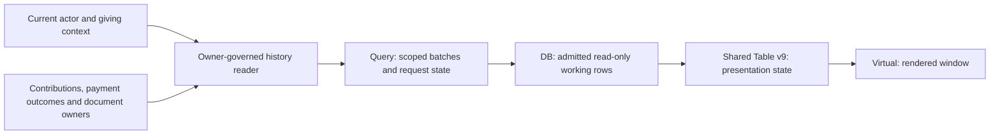

> Historical research record adopted for AL-1563. Scope and testing are ratified; earlier pending decisions and research-only workflow restrictions below preserve chronology. The [implementation specification](../../phase-25-donor-dashboard-depth.md) and its owner contracts are the implementation authority for this proposal. No historical synthetic/source check certifies target runtime behavior.

# Question 10 — All available history, effortless scrolling and clear filters

> **Explicitly founder-ratified, 7 September 2026.** Conrad accepted Question 10's corrected execution, J01–J12 and C01–C22 with the reviewed additions. Historical proposal/ratification questions below are answered; do not re-ask them. Target implementation and release proof remain separate.

**Phase 25 · Finished grooming and adversarial-review record · 7 September 2026**

**Disposition: Accept with required amendments.** Keep Conrad's selected **A — All available history** and requested TanStack Virtual scrolling without numbered pagination, clear filters, TanStack DB/Query/Table v9+, and exact shadcn Base UI Maia. The corrected execution below is proposed for explicit ratification. Questions 01–09 remain ratified. This is not a PRD, formal specification, implementation issue set or a claim that the target experience has shipped.

The important findings are concrete. The current History reader caps gifts at 250 and filters those loaded rows. Actual shared-component rendering shows that hiding pagination controls still displays only 10 of 25 supplied records unless the processing mode changes. The card branch renders all supplied cards and does not inherit virtual continuation. Installed Query/DB observations show that page eviction, full-snapshot replacement and collection cleanup need deliberate handling. These findings strengthen the selected direction; they do not justify giving donors numbered pages again.

## The corrected decision to record

> Giving history opens to all currently available authorized history, newest first, unless a qualified link or the donor's current browsing context specifies otherwise. It preserves Q05's recognizable gift, permitted split details, material later changes and source-owned documents. It does not promise complete lifetime records or fetch the whole history at once.
>
> Donors browse naturally by scrolling. TanStack Virtual limits rendered rows for long results; source-owned bounded continuation limits network and browser working data. There are no numbered page controls or hidden ten-row processing cap. The same journey works on mobile, by keyboard and with supported screen readers. A clear More gifts/Retry action supports continuation without becoming a second history product. Help and navigation remain reachable without traversing all records.
>
> Date, Fund and Gift amount are easy to find. Date includes All available, This year so far (YTD), Last year, a specific available year, Last 12 months and a custom range. Fund searches authorized missionary/project/designation facts. Gift amount means the source-owned original amount for ministries and projects, excluding separately recorded fee cover and before refunds, in one explicit original currency; selecting a fund does not change it to that allocation subtotal. Other useful source-qualified filters are secondary. Applied filters remain visible and easy to remove.
>
> Server filtering, ordering, continuation, allowed options and any summaries/export scope share the existing source and current authorization rules. A browser working set cannot decide full-history membership, totals, tax dates or permissions. Query coordinates retrieval; DB provides the scoped read-only materialization; shared Table v9 manages presentation state; Virtual manages rendering. No direct browser financial-table subscription, second ledger or separate fetch engine is introduced.
>
> Preserve the gift and reading position through detail/Back, including bounded recovery when cached data has expired. Superseded responses cannot overwrite current filters or contexts. Revoked data is removed; loading, partial coverage, no matches, actual exhaustion and errors are distinct. Upgrade the early Table v9 beta only through a reviewed, compatible shared-boundary migration to a supported stable v9+ release before target activation, with the version-specific decision amended explicitly.

**Material refinements requiring ratification:** the exact filter meanings, especially original Gift amount versus matched fund allocation; accessible manual continuation supporting automatic scroll; bounded backward/anchor recovery; and stable Table v9 qualification through the shared boundary. These are visible here rather than disguised as minor hardening. Exact component pixels, batch sizes, endpoint names and database table names are not founder decisions being frozen by this review.

## Adversarial check

### What could go wrong with this answer?

An attractive scroll can conceal missing gifts, repeat or skip records, trap a keyboard user, lose the reading position, or filter only the first 250 records. Fund and amount combinations can also imply the wrong money or leak a hidden allocation. The proposed execution requires complete source filtering and independent data/render windows, with accessible continuation and precise monetary meaning.

### What hidden assumptions are we making?

Virtualization does not fetch records or bound cached data. TanStack Query does not implement browser restoration. A fund label is not authorization, an empty loaded window is not the end, and not every imported/pre-posting record has a known gift date or amount. The actual source must supply those facts. The illustrative donor journeys are product reasoning, not observed ministry behavior or measured conversion data.

### How does this affect the whole product?

ADR-0001 preserves Asym Postgres as CRM truth. Mission Control retains financial operations; the portal reads authorized projections. P13/P16 retain contribution and payment/recurring semantics, P7/18/19 retain documents, P3/10/12 retain exposure, and P24 retains unified host/Site context. Shared UI improvements may benefit other screens, but this does not authorize a general CRM filter builder, whole-repo table replacement or new financial writes.

### How does this affect the end-user experience?

A donor sees recent gifts immediately, narrows them with familiar controls, scrolls without page numbers and returns from detail to the same recognizable place. A split gift remains understandable. The interface preserves input during errors, provides inline retry and states the actual result scope. No floating forest of filters, spreadsheet controls, repetitive success toasts or loading announcements for every row is needed.

### Does this follow modern best practices?

Yes, with qualifications. Official donor products document chronological history and year/fund filters. TanStack supplies appropriate headless tools; W3C explains the requirements for partial-DOM tables, keyboard access and status announcements. None proves that an untested infinite list is accessible or that a particular scrolling design reduces donor support. Their patterns are evidence to apply, not a substitute for Asym's proof.

### Does this fit Asym’s existing repo and product direction?

The stack and shared ownership fit. The current capped reader, eager transition collection, early-beta boundary, cosmetic pagination toggle, desktop-only continuation and estimate-only row sizing are incomplete paths. Reuse the intentional source/package boundaries, but complete the demonstrated gaps before activation. Do not preserve weak behavior because it is already shared.

### Should we adjust the recommendation?

Keep A and continuous scrolling. Require the execution below. The strongest alternative is manual continuation for every batch, which is simpler to qualify but adds repeated steps. A manual boundary action remains a useful support path within the selected scroll journey. Do not silently replace automatic scrolling or broaden amount authority if qualification fails; bring that material conflict back.

## The donor journey — J01–J12

<!-- prettier-ignore -->
| Stage | Donor experience | Exact execution consequence |
| --- | --- | --- |
| J01 — Arrive | Maria opens History in January and recognizes December's gift. | All available is the neutral default. Honor an authorized targeted link, chosen filter or Back context. Render a stable local skeleton while loading; never show zero giving before the source answers. |
| J02 — Scan | Date, safe fund/name, recognizable amount/currency and meaningful state are easy to scan. | Q05's gift grain and original/current distinctions remain. Desktop table and mobile stacked rows use the same admitted records. Full details are a real link, not hover-only or click-anywhere without a keyboard equivalent. |
| J03 — Choose a period | Maria chooses This year so far, an earlier year or a custom range. | Show the actual range. Specific past years cover the full civil year; YTD ends at the source-qualified current date. Resolve relative periods when the query starts and keep that resolved range consistent through its traversal. Opening a picker changes nothing. |
| J04 — Choose a fund | She searches for a ministry or project she recognizes. | Search current-authorized designation options across the history scope, not just loaded rows or the staff directory. Permit several selections with OR within Fund; other filter groups combine with AND. Preserve safe historical/archived designations where the source admits them. |
| J05 — Narrow the amount | She enters USD 100, or a From/To range. | Label Gift amount and its stable basis. For several currencies require an explicit choice; when exactly one authorized known currency is available, prefill it visibly. No exchange conversion. Blank bounds mean unbounded, not zero. Exact input is convenient; range inputs need no spreadsheet operator language. |
| J06 — Apply and understand | Active filters appear plainly, with Remove and Clear filters. | Discrete choices may apply on selection; multi-select and related range inputs use one compact Apply action. Invalid input is retained and explained. Clear filters restores All available within the same giving context. A new applied predicate starts a new traversal. |
| J07 — Read and scroll | Older gifts arrive as she approaches the loaded boundary. | One coordinated continuation request at a time. Virtualized DOM and retained data are separately bounded. Normal appends do not move focus or create page-number chrome. Short results can render normally; changing rendering mode must preserve the anchor. |
| J08 — Open a gift | A split gift shows the complete permitted gift and which allocation matched. | A USD 100 gift with USD 40 to the selected ministry remains a USD 100 gift; the matched USD 40 is clearly separate. Show neither a hidden sibling nor a hidden parent total. Existing receipt/help links retain their owning access paths. |
| J09 — Return | Back returns to the same filters and recognizable gift position. | Retain a logical source key plus within-item position, query identity and bounded window context. Restore after necessary current-authority reads and measurement. If the anchor no longer exists/is allowed, keep filters and explain the nearest safe restart. No unlimited page replay or universal crash-recovery promise. |
| J10 — Handle interruption | A slow boundary says Loading more; a failed one offers Retry. | Keep already loaded records only within still-current authority. Error is not exhaustion. Retry the same qualified boundary; after authorization/query expiry, restart safely with preserved filters. No endless sentinel retry loop or stale cross-context rows. |
| J11 — Use mobile or assistive technology | The same gifts and controls are reachable without a mouse, with readable text and ordinary scrolling. | Materialize offscreen destinations before focusing them; preserve active items through window changes. Expose correct list/table semantics, not fake grid rows. More gifts supports keyboard/assistive continuation. No AT sniffing, inaccessible virtual-only dead end, horizontal page overflow or tiny nested mobile scroll box. |
| J12 — Finish or broaden | “You've reached the end of these results,” no matches, incomplete history and temporarily unavailable are distinguishable. | Exhaustion comes from the owner, not row count. Keep filters, navigation and help reachable. Older-gift corrections remain discoverable under Q05. A filter does not trigger an export, message, receipt generation or financial action. |

## Filters — complete enough to be useful, small enough to understand

The first visible controls are **Date**, **Fund** and **Gift amount**. On a narrow screen, use readable wrapping or a named Filters sheet with active values remaining visible; do not cram controls into horizontally clipped icon buttons. Secondary controls stay under **More filters**. This is a proposed composition, not a new design system.

<!-- prettier-ignore -->
| Filter | Proposed meaning and behavior | Boundary/edge handling |
| --- | --- | --- |
| Date | All available; This year so far (YTD); Last year; a specific available year; Last 12 months; custom start/end. Use plain labels and a visible resolved range. | One YTD control, not duplicated competing “This year” presets. Owner-defined dates/zone and precision, not browser tax-year arithmetic. A custom inclusive end is translated correctly by the owner. Leap days, month ends and daylight-saving boundaries must be tested. |
| Unknown dates | All available includes admitted undated records in the owner's explicit deterministic unknown-date position/group. | Date-bounded results cannot pretend undated records match. Explain relevant incomplete dating without inventing dates/counts; provide All available access. Pre-posting records retain their source-qualified activity date and type, never a fabricated contribution/tax date. |
| Fund | Searchable allowed missionary, project and other donor-facing designation identifiers; several selections allowed. | Fund selects gifts with at least one permitted matching allocation, not duplicates per line. OR within this filter; AND with Date/Amount/etc. Retired labels, duplicate names, restricted workers and merges need safe source identities/current display rules. No financial or follow/subscription effect. |
| Gift amount | Source-owned original supported-gift amount, excluding separate fee cover and before refunds, in one original currency; exact or inclusive minimum/maximum. | It never becomes net, deductible, actual charged total or selected-allocation amount. Show the relevant charged/fee facts separately where authorized. A noncash/unknown-value record has no made-up amount. Where the complete supported-gift amount is not authorized, it is not filterable or inferable. |
| Status / outcome | Plain donor states from Q05 owners, including received, processing, failed/unresolved and source-qualified refund/return/correction states. | Do not fabricate one universal lifecycle enum or make “refunded” hide a still-partially-received gift. Filtering derives from admitted source meaning; donor copy can differ from backend codes. |
| Giving type | One-time versus recurring payment/occurrence where known. | This is a history classification, not active/paused commitment status. Unknown imported classification stays unknown rather than “One-time.” |
| Giving source | Online versus offline/imported provenance where admitted and trustworthy. | Separate provenance from payment method and success. Imports are not automatically offline and may lack verified provenance; do not force a binary answer. |
| Site and currency | Quiet secondary narrowing when the source has meaningful authorized alternatives. | Same receiving organization across Sites, no cross-tenant switch hidden in a filter. Current Site defaults cannot rewrite original context. Currency stays independently meaningful even without amount bounds. |
| Find a gift | A named optional search for source-approved visible ministry/designation wording and donor-facing reference. | Server-defined allowlist and bounded search, not arbitrary CRM notes, raw provider IDs, private location or first-page-only browser Find. Do not claim browser Find searches virtual/unloaded rows. |

No new general AND/OR builder, saved views, tenant-configurable default, column manager, cell editing, bulk action, unread tracker or impact metric is required. Preserve existing sort decisions; any offered chronological sort applies at the server boundary. Do not offer a cross-currency amount sort or a partial-client sort as if it ordered all results.

**Money example that must stay understandable:** Maria gave USD 100 split USD 40 to Ministry A and USD 60 to Project B, plus USD 3 fee cover. Fund A returns the recognizable gift once; “USD 40 to Ministry A” explains the match. Gift amount USD 100 matches; USD 40 and USD 103 do not. Show the actual charged USD 103 and fee cover separately where relevant and authorized. Selecting Fund A cannot retitle USD 100 as the amount given to A. If current rights hide the parent amount or a sibling, no label, filter, total, count or detail may reveal it. This supported-gift comparison is a proposed product meaning being brought back for ratification, not an unspoken consequence of “amount.”

The precise comparison comes from P13's existing **gross supported gift** measure: the owner-projected sum of original positive non-fee-cover designation lines. Do not sum hidden lines in the browser or substitute `contribution_headers.total_minor`, which includes fee cover. Processor costs and later refunds do not alter this original comparison. For a recorded processing/failed payment or recurring occurrence, the same basis is available only from its owner's frozen original requested non-fee-cover lines; label it **Requested amount**, not received giving. Current recurring terms or a current cart cannot substitute. If that comparable value is unavailable or forbidden, keep the record truthful and exclude it from numeric matching; do not invent zero or reveal excluded counts. An unavailable/forbidden filter capability is rejected through the uniform owner contract rather than silently broadened. This does not remove such records from unfiltered history.

## How the stack and database should fit

This is responsibility flow, not a new database schema. `packages/api` remains the canonical business reader; app API routes are thin. `packages/database` owns the approved hooks and collection/projection adapter. `packages/ui` owns shared behavior and the single Table engine boundary. The portal does not read raw financial tables or Stripe on scroll.

The recommended minimal adapter is one Query-owned cursor traversal feeding one scoped DB materialization of the currently retained, admitted rows. An on-demand Query Collection may implement the same contract if its exact installed APIs correctly preserve the owner's opaque continuation and envelope. Do not run an independent DB infinite loader alongside Query fetching. DB is a disposable browser working set, not another canonical ledger, server filter authority or client-generated total. Its loader-owned internal writes are not donor business mutations.

The reader must apply current row/object/field access before filter/sort/facet/window operations. Use a closed set of typed predicates; reject unsupported or forbidden fields. Compound Tenant/root/line relationships, exact current-grant context and source identities are enforced in source schema/commands as required by their owning phases. Do not add final table names, duplicate grant tables or a portal snapshot ledger solely to implement a date picker.

Bounded continuation requires deterministic root-level order and tie-breaker, bound query/scope/date-range/version, and explicit exhaustion or refresh-required outcomes. Keyset traversal is the suitable precedent; offsets alone can skip/repeat when records change. A corrected ordering/membership fact must produce the owner-defined stable traversal or a visible refresh preserving filters. Do not hold an old database transaction open across donor scrolling to freeze access.

Bound browser memory **without sacrificing backward navigation**. Retain a measured window plus safe continuation/anchor context; the owner must support bounded retrieval around/behind that context before eviction is enabled. Query `maxPages` alone is not this policy. Donors must be able to scroll back to previously seen gifts, and detail/Back must not require downloading every earlier page. If source continuation expires, preserve filters and offer a truthful restart; do not turn failure into a false end or arbitrary hidden retention cutoff.

Query keys, DB instances/materialization ownership, row keys, cursor identity and any server cache partition include the current authorized Tenant/actor/giving context and response-affecting predicates/versions. Source-approved equivalent requests may share state only within that boundary. On logout/context change/revocation, abort superseded work, clear protected Query and DB materialization and reject late responses. The existing Query logout cleanup is a useful safeguard, but the new installed-library observation shows it does not prove DB cleanup.

The history read path needs no donor SQL writes. Verify actual grants and policies separately; `USING` restricts rows and `WITH CHECK` constrains new states where writes exist. Absence of an explicit `WITH CHECK` alone is not proof of an unsafe policy: PostgreSQL can reuse `USING`. Service-role bypass/owner functions require their own current authorization proof; RLS labels alone do not validate nested labels or aggregate inference. [PostgreSQL row security](https://www.postgresql.org/docs/current/ddl-rowsecurity.html).

**Version finding:** Core is already on Table `9.0.0-beta.9`; current stable is `9.2.4`, and v9 was announced stable on 4 August 2026. The shared beta boundary passes row-model factories differently from current stable. Preserve that boundary and amend its version-specific accepted decision in the later migration. Do not paste current examples into old APIs or silently change a version string. DB/React DB/Query Collection are currently `0.6.4/0.1.82/1.0.35`, Query `5.99.0`, Virtual `3.13.23`, Base UI `1.5.0`; these independent products do not all need a “v9” version. Current Virtual examples include APIs absent from the installed version. [Table v9 announcement](https://tanstack.com/blog/announcing-tanstack-table-v9), [React migration guide](https://tanstack.com/table/latest/docs/framework/react/guide/migrating).

## Patterns classified before reuse

<!-- prettier-ignore -->
| Pattern | Classification | Why |
| --- | --- | --- |
| ADR-0001, source-owned projections/current access, shared packages, exact Maia/Base UI | Durable pattern | Keeps financial truth and exposure consistent across surfaces. |
| Root-first gift selection, bounded continuation, stable record identity | Durable pattern | Avoids split duplication and accidental dependence on loaded row positions. |
| Staff Query cursor pages plus DB read projection | Useful precedent | Responsibility split fits; staff permissions, summaries, forward-only eviction and placeholders do not transfer automatically. |
| Donor route-backed transition collection | Temporary bridge | Deliberately retains server redaction; its capped/static/simplified contract must be replaced at the qualified reader boundary. |
| Existing responsive table/virtual hook | Useful precedent | Shared building blocks exist; mobile continuation, dynamic measurement and semantic/focus behavior need completion. |
| Current five-year picker, browser year, cap-derived totals, hidden pagination and mobile gaps | Implementation accident | These are observable implementation limits rather than product authority. |
| Filtering only loaded rows, unbounded fetch, copying a staff builder or direct financial subscription | Conflict with first principles | Produces false answers, unnecessary complexity or broader exposure. |
| Donor-product history/filter examples; customer-dashboard recent windows | Useful precedent | Comparable journeys, without proof of Asym's exact default, scroll behavior or measured advantage. |

## All-category adversarial review

Each category below has an independent disposition. Severity describes consequence if the concern is allowed into the target; likelihood distinguishes observed code/library mechanisms from conditional future risk. It is not a claimed production incident rate. C01–C22 are exact proposed execution requirements, not a formal implementation specification.

### 01. Problem validity, necessity, and alternatives

**Material concern:** No material concern with the selected product need after the stated boundaries.

**What could go wrong / why it matters:** All available history is a credible neutral record-finding default. A year-limited view and manual continuation were compared fairly; they can work, but add steps for January or occasional-giving retrieval. There is no evidence that donor need requires a spreadsheet, every backend filter or an endless download.

**Severity:** Not applicable to the accepted need; misuse of all available as fetch-all is assessed under scalability. **Likelihood:** No measured donor usage or retention benefit is claimed.

**Evidence:** Q05 deliberately left the period open; Q10 A is now selected. Q08 separately serves annual documents. Church Center documents year/fund filters; FRU documents date-ordered history.

**Effect on the answer:** Accept A. Do not re-ask the default or substitute numbered pagination.

**Best permanent prevention:** Keep the record-finding job, common controls and existing owners; test realistic infrequent-giving examples rather than invent a ministry workflow.

> **C01 — On neutral entry show all currently available authorized history newest first, with no default date cutoff or numbered page controls. Preserve qualified targeted links and current browse context. All available is neither a lifetime-completeness claim nor an unbounded fetch.**

### 02. Brittleness

**Material concern:** Yes — array positions, cached windows and UI mode are fragile restoration assumptions.

**What could go wrong / why it matters:** After an append, filter, dynamic row resize or page eviction, the same index/pixel offset can identify a different gift. Changing virtual mode resets measurement/offset state. Back may return to the top or wrong record; a donor may act on a different row.

**Severity:** High for wrong-target/confusing financial presentation; moderate for lost place. **Likelihood:** Conditional target risk; installed Virtual/Query behaviors are directly observed.

**Evidence:** L05–L08; shared virtual foundation documents enabled-state reset. Query maxPages removes earlier pages. Current keyboard targeting uses mounted refs.

**Effect on the answer:** Strengthen execution; continuous scrolling remains selected.

**Best permanent prevention:** Use stable source IDs, query identity, measured logical anchors and bounded backward retrieval; preserve active row/action identity independently of DOM positions.

> **C02 — Restore and navigate by the qualified source record key and within-item position, bound to scope and query, never by recycled index alone. Preserve anchors across append, resize, render-mode and retained-window changes. Eviction requires qualified backward/anchor retrieval; an expired or unavailable anchor yields a truthful filter-preserving restart.**

### 03. Technical debt

**Material concern:** Yes — an early-beta adapter and duplicated local derivations cannot be treated as permanent foundations.

**What could go wrong / why it matters:** Copying current stable examples into beta APIs can silently omit row processing. A donor-local table fork or another date/money mapper would multiply upgrade and correctness work across surfaces.

**Severity:** High for silent processing errors; moderate for maintenance cost. **Likelihood:** Version/API difference and duplicated prototype derivations are source-confirmed; regression remains conditional.

**Evidence:** Table installed 9.0.0-beta.9 versus stable 9.2.4; tanstack.ts uses separate rowModels; stable docs put factories in features. History/model currently perform local date/money derivations.

**Effect on the answer:** Preserve the requested stack, require a reviewed shared migration and retire obsolete paths after qualified cutover.

**Best permanent prevention:** Keep one engine boundary, compatible shared types/devtools and owner-derived history rows. Amend the version-specific Table decision, rather than silently overriding its exact pin.

> **C03 — Use a supported stable Table v9+ release qualified through the existing shared engine boundary, with the beta-specific decision and compatible consumers/tests updated in the later authorized migration. Do not add an app-local engine or blindly upgrade all TanStack packages. Retire superseded History mappings only after equivalent source/permission behavior is proved.**

### 04. Edge cases

**Material concern:** Yes — date, input and sparse-history edge cases materially affect retrieval.

**What could go wrong / why it matters:** YTD can mean a different period across browser timezones; a December gift can move years when parsed as a timestamp. Undated imports, leap days, ambiguous decimal input, swapped range bounds, cleared filters or a custom end date can be silently excluded or altered.

**Severity:** High for wrong financial/date answers; moderate for input frustration. **Likelihood:** Realistic conditions; legacy browser-year/fallback-date behavior is source-confirmed.

**Evidence:** History page83–92/541–557; donor model date fallback; Q05 C06 date distinctions and current source qualification.

**Effect on the answer:** Specify readable filters and exact source meaning, without making History the tax-date authority.

**Best permanent prevention:** Separate drafted from applied range inputs; resolve relative ranges once per traversal; use qualified civil-date/minor-unit parsing; keep unknowns truthful.

> **C04 — Offer the reviewed common date controls and valid exact/range amount inputs. Show resolved ranges and use the source-approved date basis, inclusive bounds and currency precision. Preserve invalid input with actionable errors; opening/canceling a picker has no effect. Undated/unknown records remain accessible under All available without fabricated dates, amounts, classification or provenance.**

### 05. Footguns

**Material concern:** Yes — hiding pagination and silently changing money meaning are concrete traps.

**What could go wrong / why it matters:** A developer may disable the page footer but leave the engine displaying ten records. A Fund filter may multiply a split gift or silently reinterpret Amount as that fund subtotal, causing misleading results and attribution.

**Severity:** High. **Likelihood:** Hidden pagination is verified by actual shared rendering; split/amount mistakes are conditional without an exact contract.

**Evidence:** L01–L03; Q05 C05 distinguishes matched allocation from whole gift; native D07–D09 prove loaded-window completeness failure.

**Effect on the answer:** Require explicit processing modes and the proposed stable Gift amount semantics. Do not overturn gift-centered history.

**Best permanent prevention:** Server-controlled complete predicates with no local page slice; label original gift and matched allocation separately; reject unauthorized filtering.

> **C05 — Disabling numbered pagination also disables client page slicing over the supplied window. Fund matches permitted allocations and returns each gift once. Gift amount compares the owner-projected original positive non-fee-cover designation total, before refunds, in one explicit currency; fee cover, processor costs and selected-fund subtotals do not change it. Pre-posting comparisons require frozen original requested lines and a Requested amount label; show matching allocation amounts separately. No hidden parent/line value may influence a visible match or count.**

### 06. Tenant safety

**Material concern:** Yes — every row, option, cursor and cache is a potential cross-context boundary.

**What could go wrong / why it matters:** Switching organization or represented giving while old requests complete can show a previous donor’s rows, names, amounts or filter options under the new heading. A copied cursor may carry broader scope. Site filtering must not mix receiving organizations.

**Severity:** Critical for sensitive cross-context disclosure. **Likelihood:** Conditional target risk; current static collection/key and independent DB retention make it a required proof seam, not a proven deployed incident.

**Evidence:** L09/L11; current donor-history collection163–177; auth client-session56–82 clears Query on logout/user switch; R04/P24 boundaries.

**Effect on the answer:** Strengthen isolation without granting new personal/representative rights.

**Best permanent prevention:** Bind server context and all response-affecting cache/materialization identity; clear and fence old scopes, including late completion and backward reads.

> **C06 — Derive Tenant, actor and authorized personal/represented giving context server-side. Bind queries, continuations, materializations, row identities and allowed filter options to that context and its current authority. Cross-Site history stays within the receiving organization. Context changes remove protected prior data before the new heading/results appear and reject late responses.**

### 07. Database, RLS, and authorization safety

**Material concern:** Yes — legacy relational/RLS protections are real but incomplete for the target.

**What could go wrong / why it matters:** A privileged writer can create a donation with a donor from another Tenant because independent FKs allow it; the legacy owner policy can then expose that pre-poisoned row. A new direct-table path, broad view or service function could bypass the current API’s explicit Tenant constraint or expose nested facts.

**Severity:** Critical if introduced into a reachable target path. **Likelihood:** Privileged poisoning and subsequent policy-only read reproduced locally; ordinary donor writes are denied. No remote exploit or live leak is claimed.

**Evidence:** D01–D06/D10–D14 and exact native catalog; current service166–213 explicitly scopes Tenant/donor; P12 permission floor. RLS=true/FORCE=false in the legacy table, with role grants separately inspected.

**Effect on the answer:** Requires qualified owner schema/read boundary; does not authorize a portal schema replacement or direct financial mutation.

**Best permanent prevention:** Use owner composite Tenant relationships/constraints and trusted attribution; enforce permission floors before query operations and inside service paths. Evaluate actual grants, policies, views/functions and new-state checks separately.

> **C07 — The target owner reader proves current row, field, nested and relationship authorization before filtering, ordering, facets, hydration and windowing. Preserve owner-required Tenant-aware keys/FKs, nullability, money/date checks, indexes and audit/delete semantics. History has no donor financial write grants; any owning mutation derives identity/audit fields from trusted context and constrains both old and new permitted states. No service/view/RPC bypass shortcut is allowed.**

### 08. Overengineering

**Material concern:** Yes — the named stack can encourage redundant state and unnecessary product scope.

**What could go wrong / why it matters:** A generic filter language, persistent client financial mirror, saved views, second sync engine or staff-style grid would increase support and security surface while adding little to donor record finding.

**Severity:** Moderate, with high downstream authorization cost if arbitrary filters are added. **Likelihood:** Conditional design risk; shared staff builders and powerful library APIs exist.

**Evidence:** Current CRM advanced-filter precedent; frontend rules permit simple filters; Q10 asks common filters and effortless browsing, not staff reporting.

**Effect on the answer:** Narrow execution to the donor job while retaining all requested technologies in their appropriate roles.

**Best permanent prevention:** Use a small closed filter vocabulary, one retrieval adapter and read-only list/table composition; keep extra library capabilities unexposed.

> **C08 — Implement only the reviewed donor filters and source-qualified secondary controls. Do not add generic nested AND/OR, saved views, column customization, cell editing, bulk money actions, permanent browser storage or a general sync/workflow system. Short lists may render normally; long ones use shared Virtual without a separate product mode.**

### 09. UX/UI and user friction

**Material concern:** Yes — virtual accessibility, mobile continuation and dynamic heights are not delivered by the library name.

**What could go wrong / why it matters:** Keyboard or screen-reader navigation can stop at unmounted rows, spacers can be announced as gifts, active focus can disappear, long names can clip, and mobile cards can stop loading. Automatic append can also make footer/help unreachable.

**Severity:** High; routine donor needs become inaccessible. **Likelihood:** Missing source wiring is observed; exact browser/assistive behavior requires target tests.

**Evidence:** Shared responsive card branch336–349, chrome roles/spacers/keyboard refs; L03/L04. W3C table properties and keyboard/focus/status guidance.

**Effect on the answer:** Keep scrolling with required accessible execution, not a forced page-number fallback.

**Best permanent prevention:** Complete shared semantics/measurement/focus/continuation; use ordinary readable controls and genuine links, and provide accessible More gifts/Retry through the same loader.

> **C09 — Deliver the same continuous journey on desktop/mobile, keyboard and supported screen readers. Use proper read-only list/table semantics with truthful logical positions/unknown totals; spacers are not records. Mount offscreen destinations before focus, protect the active item. Screen-reader browse mode must reach every matching gift across rendered and retained-window boundaries; its cursor is not assumed to follow DOM focus, and overscan/row attributes/More gifts alone are not proof. Measure variable heights, preserve Back and allow leaving/reaching help. Automatic loading never steals focus; explicit More gifts/Retry remains operable without AT detection. Preserve exact Maia/Base UI, 320px reflow, zoom, reduced motion and readable touch controls.**

### 10. Source of truth, ownership, and domain invariants

**Material concern:** Yes — a local working set must not become business truth.

**What could go wrong / why it matters:** A loaded subset can define a false total, create a receipt count, change attribution or look complete. A separate History model can drift from CRM financial/recurring/document facts.

**Severity:** High. **Likelihood:** Current prototype derives values from its loaded subset; target risk is preventable.

**Evidence:** D09; history541–584; ADR-0001; Q05/Q08; P3/13/16/7/18/19 ownership.

**Effect on the answer:** Strengthen existing owners, not a competing history store.

**Best permanent prevention:** Use typed source references, source-certified facts and read-only disposable projections. Keep exact measures/grains and correction/document lineage.

> **C10 — History reads authoritative contribution/payment/recurring/document facts through their existing owners. DB/Table/Virtual are derived presentation state. One gift remains one source root with permitted allocations and changes; received giving, commitments, recognition, deductible amounts, currencies and documents are not conflated. Rebuilding/evicting a projection cannot create or change any business fact.**

### 11. Hidden coupling

**Material concern:** Yes — fetching, rendering, page retention, documents and summaries can become implicitly linked.

**What could go wrong / why it matters:** Two independent page loaders race; a collection regards a page as its entire state; a chart reads only mounted rows; a History filter suppresses annual documents. Upgrading one shared wrapper can break all consumers.

**Severity:** High for missing/wrong records; moderate for maintenance. **Likelihood:** Full-snapshot replacement is observed; other risks are conditional.

**Evidence:** L10; current admin Query+DB patterns; Q08 document independence; shared v9 boundary.

**Effect on the answer:** Keep explicit responsibilities and compatible shared APIs.

**Best permanent prevention:** One source traversal and one materialization lifecycle; controls express requested predicates, not business logic; document paths remain independent.

> **C11 — Query owns coordinated request/continuation state, DB the admitted retained rows, Table view state and Virtual the rendered range. No second automatic fetch owner or arbitrary cursor-page replacement of a full-state collection. Any summary/export uses the owner’s complete declared scope, never DOM/retained rows; History filters do not control document availability.**

### 12. Failure modes

**Material concern:** Yes — failed/ambiguous continuation can masquerade as the end or loop forever.

**What could go wrong / why it matters:** Slow requests leave old rows under new filters; underfilled pages imply false exhaustion; an end sentinel repeatedly retries; a latched boundary never retries after failure. Partial data may be described as an exact complete result.

**Severity:** High. **Likelihood:** Current incomplete loading/error composition is source-observed; failures are ordinary expected conditions.

**Evidence:** Responsive chrome221–295/504–508; Query request guidance; current model lacks a complete continuation envelope.

**Effect on the answer:** Require truthful states and recoverable reads, not more financial workflow.

**Best permanent prevention:** Separate initial/update/continuation errors and current-result identity; preserve valid loaded data only in current scope; retry known read boundaries safely.

> **C12 — Distinguish initial loading, updating filters, loading more, no matches, known incomplete coverage, actual exhaustion, authorization loss and failure. A short or empty batch is terminal only when the source says so. Retry the intended current boundary; stop automatic retry loops and reset stale latches. Never label stale differently filtered rows as current results.**

### 13. Lifecycle, temporal correctness, concurrency, and idempotency

**Material concern:** Yes — reads have query/window lifecycles and race with source changes.

**What could go wrong / why it matters:** Rapid filter changes, simultaneous background refresh/next fetch or backdated corrections can repeat/omit a gift or combine inconsistent generations. A long snapshot can retain revoked permissions; a delayed old response can resurrect data.

**Severity:** High, potentially critical for permission revival. **Likelihood:** Realistic concurrency; previous Q05 SQL counterexamples already established offset/sort-key and long-snapshot risks. New L07/L08 establish current page retention behavior.

**Evidence:** Q05 historical proof retained as historical; P3/P12 source rules; current Query guide; D14 shows new-statement current-owner evaluation.

**Effect on the answer:** Strengthen traversal/version/retry semantics; filtering stays read-only.

**Best permanent prevention:** Bind resolved predicate/date window and source basis; serialize/coalesce identical continuations; fence superseded generations; recheck authority per request.

> **C13 — Maintain explicit draft/applied query, loading/ready/more/error/exhausted/refresh-required and disposed-scope states. One coordinated fetch per current continuation; retries are bound to its same source effect/read basis. Reject superseded responses and duplicate roots. Source changes invalidating traversal trigger the owner’s safe refresh contract with preserved filters, never silent omissions or an old authorization snapshot.**

### 14. Data integrity risks

**Material concern:** Yes — normalization can discard currency, fabricate dates or corrupt grouping.

**What could go wrong / why it matters:** An id-only deduplication can merge different roots; rounding money or defaulting USD changes filter meaning; a current fund name/date can overwrite historical facts; a split join can inflate records and aggregates.

**Severity:** High. **Likelihood:** Currency dropping and divided-by100 legacy projection are source-confirmed; target grouping mistakes are conditional.

**Evidence:** donor-history schema/model; Q05 money/correlation findings; D10 actual nonnegative check; owner P13 invariants.

**Effect on the answer:** Require typed exact projected facts and source validation, not browser repair.

**Best permanent prevention:** Preserve typed scope/source keys, exact integer minor units and known currency exponent, source date/provenance and lineage. Do not enrich unknowns from guesses.

> **C14 — Validate the history read envelope and typed source keys; retain exact source money/date/currency/provenance and permitted correction relationships. Amount comparisons use safe exact minor-unit arithmetic, never floats or a universal divisor. Distinct owner-defined gift roots never merge by similarity. Multiple attempts/provider charge observations retain separate evidence under their exact source-correlated gift or occurrence and do not create duplicate gift entries. No cross-issuer/Party/currency/root aggregation is inferred. Unknown fields remain unknown and invalid rows produce qualified unavailable/help behavior, not synthetic financial facts.**

### 15. Security and privacy risks

**Material concern:** Yes — filtering, persistence and diagnostics can reveal data even when visible rows look safe.

**What could go wrong / why it matters:** Fund suggestions/counts or yes/no amount matches can disclose hidden ministries or totals. Raw filters/labels in URLs, analytics, cache snapshots, replay tools or exports can retain sensitive financial/ministry context. Sign-in redirects may replay unsafe parameters.

**Severity:** Critical for restricted ministry or cross-person exposure. **Likelihood:** Conditional; fields and secondary outputs are established sensitive surfaces.

**Evidence:** P3/P10/P12; Q05 current-field permissions; current DB retention observation L11; no hosted incident claimed.

**Effect on the answer:** Apply the same security floor to every derived answer and preserve minimization.

**Best permanent prevention:** Closed server predicates with permission checks before matching; secure scoped ephemeral browser state; safe return targets and redacted telemetry; governed exports.

> **C15 — Filter options, matches, counts, summaries, exports and errors obey the same current field/entity floor as rows and reveal no forbidden fact by inference. No raw financial rows, private ministry labels or credentials in persistent browser storage, logs, analytics or shareable URLs. URL state follows an approved non-sensitive allowlist; private retrieval uses safe scoped state and current reauthorization. No raw financial postgres_changes subscription.**

### 16. Scalability and performance risks

**Material concern:** Yes — Virtual bounds DOM, not data, query work or retained pages.

**What could go wrong / why it matters:** Loading all records still consumes network/memory; broad facets or sorts scan huge tables; a summary per row creates N+1 work; page eviction without readback strands donors; row measurement/animations cause jank.

**Severity:** High at large workloads. **Likelihood:** Mechanism directly observed in L04/L07 and D07–D09; production frequency/size unknown.

**Evidence:** 10,000 synthetic input rows remained allocated while Virtual returned12 render items; native 320-row cap counterexample; source indexes/queries.

**Effect on the answer:** Retain Virtual but require bounded server and client work with real workload proof.

**Best permanent prevention:** Root-grain set-based filtered query with measured indexes/plans, bounded hydration/options, bounded cache with backward recovery and stable rendering; no guessed scale statistics.

> **C16 — Bound request batch, query cost, hydrated children/options and retained browser working rows separately from rendered rows. Use measured source indexes/set-based reads and no per-row provider fetch. Define and pass a production-shaped workload/device/network envelope and numeric performance budgets before activation; preserve backward/Back access when evicting. No arbitrary lifetime/year cutoff or upstream benchmark used as Asym capacity proof.**

### 17. Operational burden

**Material concern:** Yes — a read view can create recurring staff work if unavailable states and repair paths are vague.

**What could go wrong / why it matters:** Donors report missing gifts caused by filters, duplicates or data lag; staff receive raw screenshots or need SQL repairs because the UI offers no bounded context. A general repair console in the portal would expand scope.

**Severity:** Moderate, high if it causes unsafe financial correction. **Likelihood:** Conditional but plausible without clear scope/error/help.

**Evidence:** Q05 incomplete-history help; P19 contextual document help; current missing coverage/continuation envelope.

**Effect on the answer:** Require clear self-service recovery and existing help, not new support software.

**Best permanent prevention:** Explain selected scope, use safe owner references/correlation, surface operator diagnostics separately, route actual source repairs to Mission Control owners.

> **C17 — Most empty/filter/load problems have an immediate donor action: broaden filters, retry or sign in safely. Remaining source/document problems use existing qualified organization help with minimal permitted context. Operators can identify the query class and failure reason without donor screenshots/raw payment IDs or direct database repair. Do not build Support Hub, a new repair workflow or staff powers in History.**

### 18. Observability and auditability gaps

**Material concern:** Yes — visually plausible partial results can fail silently.

**What could go wrong / why it matters:** A 250-row cutoff, repeated cursor, stale projection, wrong scope or inaccessible keyboard boundary may look successful in HTTP logs. Conversely, logging every filter/row becomes a privacy burden and fake business history.

**Severity:** High for undetected completeness/privacy defects; moderate for excess logging. **Likelihood:** Conditional; current cap demonstrates a success-shaped incomplete response.

**Evidence:** D07–D09; current snapshot lacks explicit coverage; Q05/P3 audit owners.

**Effect on the answer:** Require measurable safe signals, not donor activity surveillance.

**Best permanent prevention:** Separate technical query traces, existing security access audit and source business history. Include privacy-safe status/correlation and named response thresholds.

> **C18 — Instrument bounded query/continuation timing, terminal reasons, repeated/no-progress cursors, rejected stale responses, projection coverage/lag and scope denials using redacted identifiers. Preserve existing required security audit; scrolling/filtering does not create a gift, human-read claim or CRM business activity. Assign monitor owners, thresholds and responses as recorded below.**

### 19. Dependency and integration risks

**Material concern:** Yes — library APIs and source contracts are separate dependencies.

**What could go wrong / why it matters:** Current docs include APIs absent from installed Virtual/DB/Base UI; a wrapper upgrade can change semantics. Reactivity or direct provider fetching can bypass the source’s financial/data boundaries. An unimplemented owner cursor cannot be replaced with an offset demo.

**Severity:** High for correctness/security, moderate for integration churn. **Likelihood:** Installed/current API divergence is verified; target failure conditional.

**Evidence:** Version matrix; takeSnapshot absent in installed Virtual; shared stable migration; P3/12/13/24 contracts and current open tickets.

**Effect on the answer:** Requires exact compatibility/provider-boundary qualification; does not justify financial provider actions during grooming.

**Best permanent prevention:** Pin compatible supported versions and exercise public seams; use source read outcomes/continuations; keep provider execution under owning services.

> **C19 — Qualify the exact shared Table/Virtual/DB/Query/Base UI integration and the existing owner read/authorization/document contracts. Latest snippets or library examples are not installed behavior. History scrolling has no direct Stripe/CRM-provider fetch or mutation. Source delays/contradictions retain owner reconciliation meaning; do not invent a portal ledger or retry financial execution.**

### 20. Migration, rollout, and upgrade risks

**Material concern:** Yes — mixed readers/versions can silently preserve old caps or lose privacy.

**What could go wrong / why it matters:** New UI against old API claims full history while receiving250; old client ignores new scope/version fields; shared beta migration breaks other tables; backfill invents dates/amounts; rollback re-exposes unsafe cache behavior.

**Severity:** High. **Likelihood:** Conditional migration risk with real current contract differences.

**Evidence:** Current source250 snapshot/schema; exact v9 beta adapter; owner-first platform contract.

**Effect on the answer:** Require bounded staged activation and safe read rollback, not a speculative new migration system.

**Best permanent prevention:** Ship owner query/access schema contracts first, then compatible adapters/shared UI and gated donor activation. Validate old/new contract combinations and derive-only rebuilds.

> **C20 — Activate only when reader capability/version, current authorization, compatible shared libraries and donor journeys are proved. Test mixed-version behavior and fail truthfully on unsupported contracts. Backfills/rebuilds preserve source facts/unknowns; no historical financial rewrite. A kill switch stops the new read experience without restoring an unsafe fallback or changing gifts/documents; roll-forward/rollback and cache disposal are rehearsed.**

### 21. Testability, traceability, and proof

**Material concern:** Yes — mocks, SSR and library names cannot certify the end-to-end promise.

**What could go wrong / why it matters:** Tests may exercise seeds instead of the real endpoint, only the first page, desktop-only rendering or synthetic RLS. A green unit test then becomes an unsupported claim of all-history or accessible scrolling.

**Severity:** High. **Likelihood:** Current NODE_ENV=test seed bypass and target absence are verified.

**Evidence:** donor-history collection170–174; L/D proof boundaries below; Q05 target proof requirements.

**Effect on the answer:** Keep selected direction, make acceptance falsifiable and retain missing proof as release dependencies.

**Best permanent prevention:** Trace C requirements to owner docs/design/tasks after authorized conversion; require actual PostgreSQL and browser/assistive journeys, exact contract tests, boundary failures and production-shaped data.

> **C21 — Prove P01–P14 below through real target PostgreSQL authorization/concurrency, source/adapter contracts and accessible donor E2E across multiple data/render windows. Include negative, boundary, migration and performance cases. Seed mocks and current-library observations stay separately labeled; no unresolved material owner or usability failure may be called implementation-ready or released.**

### 22. Other development hazards

**Material concern:** No additional unique material concern found after the preceding categories; scope/authority hazards were explicitly checked.

**What could go wrong / why it matters:** Checked accidental financial action, receipt regeneration, newsletter effects, generic browser persistence, extra CRM product scope, hidden environment changes and unsafe fallback. These are prevented by the existing ownership and grooming boundaries plus C10/C15/C17/C20; no separate speculative system is needed.

**Severity:** Not applicable to a new unique concern; prohibited side effects would be high impact. **Likelihood:** No such action occurred in this review.

**Evidence:** Repository diff preserved; isolated container removed; no provider/GitHub mutation; prior ratifications and current stage boundary.

**Effect on the answer:** Preserve scope and selected answer. This does not declare the rest of Phase25 complete.

**Best permanent prevention:** Keep the read experience purpose-specific and record exact downstream seams without implementation or issue publication.

> **C22 — Q10 changes history retrieval/presentation only. It creates no payment, retry, cancellation, receipt/statement issuance, export, subscription, notification, persistent read ledger or new access grant merely by browsing/filtering. Preserve future-phase boundaries and grooming stage; formal specification and tickets require their explicit later invocations.**

## What was actually verified

This review ran two bounded evidence exercises using synthetic data. It did not implement the target History reader or donor journey.

**Installed-library and actual shared-component evidence — 11 observations (L01–L11).** The shared table rendered 10 of 25 supplied records when pagination chrome alone was disabled, and all 25 with manual processing. Its configured card mode rendered all 25 despite virtual configuration; this is server rendering, not a mobile browser test. Virtualizer selected 12 rendered items from 10,000 supplied records for a synthetic 500px viewport; the input array still held all 10,000. Stable keys retained identity after a prepend, but this is not scroll-position proof. Query's two-page bound evicted the earlier page; a supplied previous-page function could retrieve it. A Query-backed DB collection replaced its previous two records with the new one-record full result. Clearing Query left that one DB record immediately materialized. These observations explain the needed adapter/window/lifecycle safeguards; they do not prove an application account leak.

The first card assertion failed because the fixture used a `label` field without supplying `mobileCardConfig.primaryField`. The fixture was corrected, the failed attempt retained, and the complete 11-observation run passed. No shared source was changed. This is not concealed as an application defect or a failing target test.

**Real PostgreSQL, current native schema — 76 migrations and 14 assertions (D01–D14).** The repository's native verifier applied all 76 forward migrations in a unique networkless PostgreSQL 17.10 container. With 320 synthetic donations, the current donor could read its scope; unrelated and anonymous actors could not. Authenticated direct insert/update/delete was denied. Filtering an amount after the 250-row snapshot missed the older matching gift; filtering before the limit found it. The true scoped count was 320, not 250. Negative amount was rejected. A privileged writer could insert a cross-Tenant donor reference; the legacy owner policy then admitted that pre-poisoned row, while the explicit Tenant predicate excluded it. Removing the owner relation caused the next independent read statement to return no records. The container had no published ports, only read-only migration/tool mounts, and was removed after completion.

The SQL evidence is **current legacy-table behavior**, not target P13/P12 schema, view/field authorization, API, provider, hosted state, performance or concurrency certification. It shows both real defenses and a conditional integrity weakness. It does not show that an ordinary donor can create the poisoned record. This turn did not rerun Q05's synthetic concurrency tests; those remain historical evidence for the offset/sort-key/long-snapshot reasoning. No Stripe financial action, live provider change or production data read was needed.

[Proof record](phase25-r10-proof-evidence.md) · [Historical bundle inventory: phase25-r10-proof-bundle.zip](README.md#historical-verification-bundles).

## Required target acceptance evidence — P01–P14

These are falsifiable implementation/release requirements, **not unrun tests described as passing**. Proof must exercise the actual authorized reader, normal and privileged roles and public browser seams. The local current-library/current-schema experiments above cannot replace them.

<!-- prettier-ignore -->
| ID | Required proof and expected outcome |
| --- | --- |
| P01 — Entry/context | January and an 18-month-gap donor see the latest available record without changing period. Personal/represented/host and qualified deep-link contexts survive sign-in correctly. A source match beyond row 250 remains discoverable; no five-year exclusion or fetch-all occurs. |
| P02 — Filter completeness/date | All prescribed date modes and Fund combinations search the full admitted set before windowing. Test leap days, month/year boundaries, date-only versus timestamp, owner zones, unknown dates, repeated/retired/restricted fund labels and a match outside the first page. The active range/basis is truthful; unsupported/forbidden input is rejected rather than broadened. |
| P03 — Money and partial visibility | Test USD 100 split 40/60 plus fee cover, partial refund, repeated same-fund lines, 0/2/3-exponent currencies, exact large integers, decimal ambiguity, noncash/unvalued imports and processing requested amounts. Fund+Amount keeps its declared original non-fee-cover basis, one root and no hidden-total inference. A restricted-field counterfactual changes no visible match/count/option. |
| P04 — Source correlation | Same-day/same-amount independent gifts remain distinct; retries and source-certified pre-posting-to-posted transitions stay connected without duplicate roots. Refund, return, correction, allocation and document relationships do not create extra gifts or change original facts. |
| P05 — Continuation | Traverse several backend and rendered windows with equal dates, sparse matches, empty batches with continuation, duplicate requests, changed-filter cursor replay, expired/invalid cursor and exact exhaustion. No gaps/duplicates; one coordinated continuation; no ten-row hidden cap. |
| P06 — Real concurrency | Independent real PostgreSQL sessions test late commit after earlier sequence allocation, source date/order/membership correction, source-root correlation, projection rebuild and grant revocation during read admission. Prove the owner's traversal/current-access contract; no max-ID timestamp shortcut or long browsing transaction. |
| P07 — Database/authorization | Inspect target constraints/indexes/grants/RLS and reachable view/RPC/service paths; test Tenant/entity poison, null scope, field/role restrictions, direct writes and trusted actor/owner attribution. Filters/facets/windows enforce the set-based current floor. Negative and resulting-row tests are required where owning writes exist. |
| P08 — Cache lifecycle | Logout/user switch, same-user represented/Tenant switch, expiry/revocation, two tabs, bfcache, offline restore and late responses remove or isolate protected Query and DB data. Query-key strings alone are insufficient; inspect actual rendered data and materializations. |
| P09 — Actual continuous UI | Desktop and mobile use the same complete source traversal. Long/wrapping/expanded rows, large fonts, breakpoint changes and window eviction preserve identity/position; active actions never target recycled rows. No numbered controls, clipped filters, inaccessible footer or desktop-only continuation. |
| P10 — Accessibility | Real keyboard and screen-reader browse/focus modes cross both rendered and retained-window boundaries, open detail, return and leave the region. Test supported NVDA/Chrome and VoiceOver/Safari including iOS, plus axe/accessibility-tree checks. Correct logical rows, unknown totals, non-record spacers and concise status announcements; DOM focus is not a screen-reader browse-cursor proxy. |
| P11 — Back/readback | Warm and expired caches, changed heights, evicted windows, missing/restricted anchor and refresh-required source states restore the recognizable record when valid or give an honest filter-preserving recovery. Prove bounded backward reads; do not silently replay every page from the beginning. |
| P12 — Failure/recovery | Slow/offline/boundary error, multiple retry clicks, cancelled filter request, superseded late response, API authorization denial, throttled source and same-length result replacement have correct input/status/focus behavior. Error is never empty/end; no load latch dead-end or automatic retry storm. |
| P13 — Whole-product seams | History cannot issue/send/regenerate receipts or trigger giving/consent effects. Existing gift/doc/help links reauthorize at their owners. Any governed CSV export uses full authorized declared scope, safe serialization and source measures rather than loaded rows; no hidden data or formula injection. Older-gift changes remain findable under Q05. |
| P14 — Migration/performance | Test old/new reader capability combinations, shared supported-v9 migration, owner projections/backfill, feature activation and safe containment/roll-forward. Record data shape, Tenant skew, page/child/facet sizes, device/network and memory/query/interaction results against approved numeric budgets and repo perf gates. A native 320-row fixture or upstream million-row benchmark is not production capacity proof. |

Before activation, the engineering design must supply the exact owner filter/cursor/readback schemas, date-kind mapping, admitted money projection, query/index plans and performance budget configuration; those details are not invented here. Their responsibilities and required outcomes are resolved. The target remains unimplemented, so this review does not declare Phase25 implementation-ready. A material source inability or failed assistive journey must be resolved by its owner or an explicit founder amendment, never dropped from acceptance.

## Dependency and conflict register

<!-- prettier-ignore -->
| Item | Current evidence | Required disposition |
| --- | --- | --- |
| Projection/field floor | #493 depends by body on #491; #495 on #491/#493; #496 on #493. P3 applies entity/field authority before filters/aggregates/exports. | Complete/reuse these owners. A DB collection is not a replacement permission system. |
| Current authorization/egress | #670 body→#667/#668/#669; #675→#670/#672/#676; #677→#667/#669/#670; #678→#677. P12 retains external #489/#493/#604/#628/#645. | Read admission, expiry/revocation, predicates and bounded egress are real prerequisites. Empty native blocker arrays do not remove body blockers. |
| Money/source roots | #695 remains open/blocked with native #1511; #1511 native→#1510/#480. Q05's old dating/body conflict reconciliation remains required. | Source original supported-gift/fee-cover/root/correction facts, with exact currencies. No use of legacy simplified amounts as final contract. |
| Recurring history | #811 remains open/blocked; body→#805–#810. | Source occurrence/attempt correlation, requested/received facts and history continuation remain P16 completion. No new portal executor. |
| Documents | #1023 open/blocked, body/native→#997/#950. Q08 ratified destination and current retrieval rules. | Reuse owning document access; History filters do not decide current availability or issuance. |
| Shared CRM precedent | #611 body→#606; keyset/server filtering/facets described there. | Reuse qualified mechanics, not staff capabilities/saved views or every CRM dependency as donor scope. |
| Site/host/content context | PR1558 (P24) remains OPEN at `ab1a1703a725be454376990a7fe68aef2e048026`; P22 PR1323 OPEN at `70c50e8c97556c43be5543332fb0993b468b90ab`; P23 PR1340 OPEN at `9069dcad67f9630323474ca5ee8bcc85ca7bf0f6`. | Active intent is not shipped behavior. Preserve unified host/current relationship and original Site/currency context; no content-provider reads needed for History filtering. |
| Earlier merged foundation | PR872 remains MERGED; inspected head `b886c2eb2fe4c98cc8723a232d860138c86b10c2`. Develop remains `7abd2c11ffd4ed70c6775c4fd6f51c996e4350dd`. | Separate merged intent from target implementation and proof. Old unmerged-gate wording does not revive a closed PR gate. |
| Table version guidance | Repo says v9 beta and claims tanstack.com serves v8; current upstream is stable v9. | Preserve exact pin during grooming. Later controlled migration explicitly updates version-specific decisions/docs and shared tests; no silent reinterpretation or package churn now. |
| Scroll/window/amount additions | New reviewed execution, not already ratified by A. | Present C01–C22/J01–J12 and concrete amount example for ratification before the next grill question. |

Current issue links: [#493](https://github.com/Asymmetric-al/core/issues/493), [#495](https://github.com/Asymmetric-al/core/issues/495), [#496](https://github.com/Asymmetric-al/core/issues/496), [#611](https://github.com/Asymmetric-al/core/issues/611), [#670](https://github.com/Asymmetric-al/core/issues/670), [#675](https://github.com/Asymmetric-al/core/issues/675), [#677](https://github.com/Asymmetric-al/core/issues/677), [#678](https://github.com/Asymmetric-al/core/issues/678), [#695](https://github.com/Asymmetric-al/core/issues/695), [#811](https://github.com/Asymmetric-al/core/issues/811), [#1023](https://github.com/Asymmetric-al/core/issues/1023), [#1511](https://github.com/Asymmetric-al/core/issues/1511). They were read, not changed or duplicated.

## Synthesis — the permanent path, in order

1. **Before recording corrected execution as ratified:** accept the specific original supported-gift amount/fee-cover distinction, complete filter vocabulary, accessible continuation and bounded Back/readback behavior, and controlled stable-v9 qualification. A itself stays selected. This is the single review decision at the end.
2. **Capture in the later authorized specification/design:** J01–J12, C01–C22, source ownership, current filter/field authority, typed dates/money and exact traversal/refresh/readback outcomes; map dependencies and glossary. Do not invent a new financial or permission ledger.
3. **Complete the owner reader first:** source-admitted gift roots/allocations/outcomes, bounded set-based filters/options and current authorization. Prove query completeness/correlation/concurrency and source dates/money in real target PostgreSQL. Avoid front-end work against a guessed capped response.
4. **Qualify the adapter/shared UI next:** compatible stable Table boundary, coordinated Query+DB lifecycle, bounded reversible data windows and real dynamic virtual rows. Complete mobile, semantics, focus, retry and Back once in shared composition. Do not introduce a donor-local fork.
5. **Prove the complete donor journey and activate narrowly:** P01–P14, realistic browser/assistive/workload evidence and mixed-version/containment checks. A working-looking screen, successful SSR or current-schema role test is not release evidence. Remove incompatible legacy fallback only when the owner path is ready.
6. **Monitor residual operational failures:** use the signals below after the correctness gates pass. Monitoring is not an alternative to privacy, money or accessibility requirements. No new automation was created by this review.

<!-- prettier-ignore -->
| Residual signal | Threshold | Owner | Response |
| --- | --- | --- | --- |
| Successful continuation makes no progress or repeats its token/root boundary | First detected protocol violation; block a further identical automatic request | History API owner + donor frontend owner | Stop looping, preserve safe filters, return refresh/retry outcome and inspect redacted correlation. Treat a reproducible omission/duplicate as a correctness defect. |
| Query/DB scope canary mismatch or unauthorized field/facet response | Any one detected mismatch | Security/authorization owner and on-call | Stop affected reader activation, clear controlled cache/materialization and investigate as an incident; no unsafe legacy fallback. |
| Source-declared projection lag/budget or reader contract expiry | Exceeds the owning contract's declared bound; that numeric contract is a prerequisite, not invented by P25 | Source projection/API owner | Return truthful unavailable/refresh state, repair/rebuild through the owner and requalify before claiming current coverage. |
| Repeated continuation transport failures | Five consecutive failures of the same qualified endpoint class within 15 minutes, excluding expected permission/validation denials; proposed initial alert setting, to tune from observed traffic | API operations owner | Investigate provider/network/service health and retry behavior; preserve donor retry. This alert is not a claimed SLA or traffic forecast. |
| Keyboard/browse-mode/Back canary regression | Any failing required release/canary journey | Shared UI/donor QA owner | Hold or contain affected rollout, reproduce on that browser/assistive pairing and fix shared behavior. Do not substitute an inaccessible mode. |
| Performance regression | Any required repo perf gate failure or breach of the approved P14 workload budget | Frontend/platform performance owner | Profile source query, adapter retention and render work; adjust measured indexes/window/measurement, not history scope or access. |

## Compact coverage status

- **Confirmed:** Q10 A selected; continuous scrolling/no numbered pagination; requested TanStack stack; exact Maia. Q01–Q09 ratified and preserved.
- **Proposed for this ratification:** corrected J01–J12 and C01–C22, including original supported Gift amount, filter behavior, accessible continuation, bounded readback and stable-v9 qualification.
- **Verified this turn:** current source/primary documentation and live dependency reads; 11 installed/shared observations; 76 native migrations and 14 legacy donation assertions; isolated container removed; existing five setup changes preserved.
- **Not verified/required for release:** actual target reader/RLS/field/concurrency contracts, responsive donor/browser/screen-reader journeys, scale budgets and compatibility migration. No provider execution qualification is supplied by this History review.
- **Future seams preserved:** P26 support, P28 missionary views, P30 imports, P32 newsletter synchronization, P33 reporting and P36 campaigns retain their owners. History does not build those products or show inactive placeholders.

## Primary external sources and attribution limits

The recommendations are Asym product judgments informed by these sources. No retention/conversion statistic, universal infinite-scroll superiority or donor study is asserted.

- [Church Center giving information](https://help.planningcenter.com/en/140951-manage-your-giving-information.html): donor history and year/fund filtering; does not prove its initial period or Virtual-like implementation.
- [Fundraise Up donor portal](https://fundraiseup.com/docs/donor-portal-experience/): recognizable date-ordered donor history and document/recurring journeys; not proof of Asym's cursor/permissions or a quantified UX gain.
- [Blackbaud portal history](https://webfiles-sc1.blackbaud.com/files/support/helpfiles/rex/content/ptl-feature-giving-and-history.html): history access; does not justify complete imported-data claims.
- [TanStack Table v9](https://tanstack.com/blog/announcing-tanstack-table-v9) and [migration](https://tanstack.com/table/latest/docs/framework/react/guide/migrating): stable major and explicit feature/state model; exact installed beta remains a different API.
- [TanStack Virtual](https://tanstack.com/virtual/latest/docs/api/virtualizer): render-window, key, measurement and scrolling primitives; not data retrieval or accessibility certification.
- [TanStack Query infinite queries](https://tanstack.com/query/latest/docs/framework/react/guides/infinite-queries) and [restoration](https://tanstack.com/query/latest/docs/framework/react/guides/scroll-restoration): continuation/cache tools; navigation geometry remains application/router work. Local observations independently verified eviction and query-key behavior.
- [TanStack DB Query Collection](https://tanstack.com/db/latest/docs/collections/query-collection): complete-result versus scoped subset semantics; not permission to send raw financial tables to a browser. Local observations independently verified replacement and cleanup behavior.
- [shadcn Base Data Table](https://ui.shadcn.com/docs/components/base/data-table), [Base UI Select](https://base-ui.com/react/components/select) and [Combobox](https://base-ui.com/react/components/combobox): headless/composable building blocks. Use actual shared Maia wrappers and installed APIs rather than a copied tutorial/preset.
- [W3C table properties](https://www.w3.org/WAI/ARIA/apg/practices/grid-and-table-properties/), [keyboard](https://www.w3.org/WAI/WCAG22/Understanding/keyboard.html), [status messages](https://www.w3.org/WAI/WCAG22/Understanding/status-messages.html), [on input](https://www.w3.org/WAI/WCAG22/Understanding/on-input.html), [reflow](https://www.w3.org/WAI/WCAG22/Understanding/reflow.html) and [focus visibility](https://www.w3.org/WAI/WCAG22/Understanding/focus-not-obscured-minimum.html): semantic/interaction requirements and rationale. ARIA attributes alone cannot prove assistive navigation through unloaded content.
- [W3C feed example](https://www.w3.org/WAI/ARIA/apg/patterns/feed/examples/feed/): useful warning about complex reading/loading coordination; not a production template or reason to give financial history an ARIA feed role.
- [PostgreSQL 17 RLS](https://www.postgresql.org/docs/17/ddl-rowsecurity.html), [CREATE POLICY](https://www.postgresql.org/docs/17/sql-createpolicy.html), [isolation](https://www.postgresql.org/docs/17/transaction-iso.html) and [LIMIT/OFFSET](https://www.postgresql.org/docs/17/queries-limit.html): database semantics; no current Core security/capacity certification.

**Question 10 — Do you ratify this corrected scrolling-and-filtering execution, including J01–J12 and C01–C22?**
