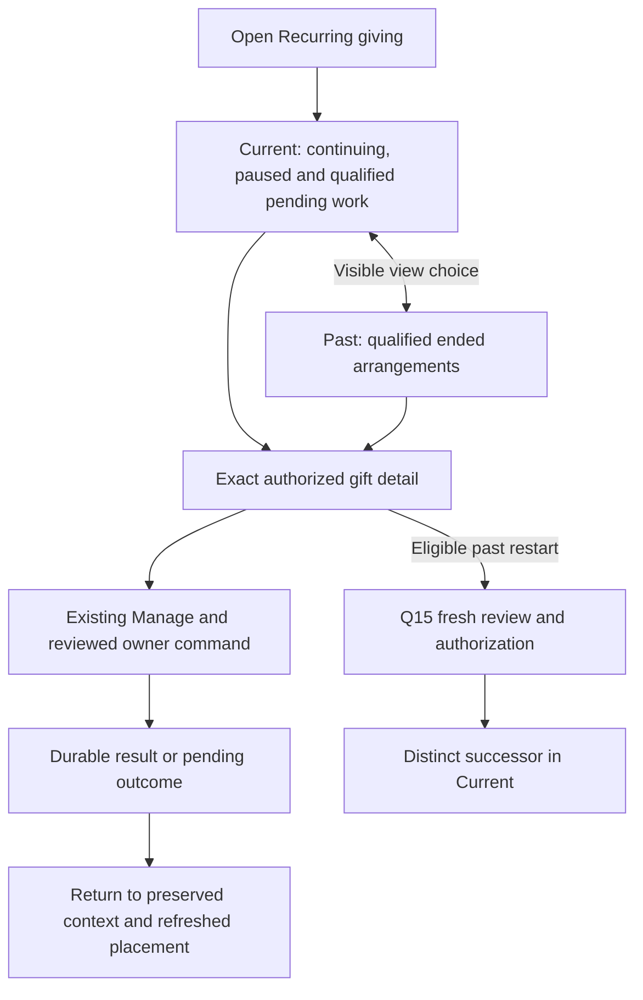

> Historical research record adopted for AL-1563. Scope and testing are ratified; earlier pending decisions and research-only workflow restrictions below preserve chronology. The [implementation specification](../../phase-25-donor-dashboard-depth.md) and its owner contracts are the implementation authority for this proposal. No historical synthetic/source check certifies target runtime behavior.

> **Fully ratified, 8 September 2026:** Conrad accepted Question22 A1–A4/J01–J16/V01–V12/C01–C22 and reviewed Maia defaults, including two-line previews, stable arrangement ordering, authorized membership and exact historical/pending safeguards. T01–T18 remain required target proof. Earlier provisional wording below is historical; ratification does not certify implementation or live behavior.

# Question 22 — Current recurring giving, with clear access to the past

8 September 2026. **Disposition: Accept with required amendments.** Conrad selected A. The corrected execution below **awaits ratification**; the choice is not being reopened. This is a completed grooming review and proposed execution contract, not a claim that the target implementation exists. Questions 01–21 retain their ratifications. No canonical ADR/OpenSpec, GitHub, provider or financial record is changed.

## Exact corrected decision to record

> On ordinary entry, Recurring giving opens **Current**, with a permanently visible **Past** choice. Current includes the viewer's permitted continuing and paused arrangements and source-qualified pending or unresolved current work. Past contains permitted arrangements whose visible lines are terminal and whose relevant current obligations are positively resolved. Unknown is never silently classified as Past.
>
> Derive membership from the complete authorized group/line projection before filtering, summaries and continuation. Preserve each real group and its independently manageable lines; hidden siblings cannot affect membership, ordering, labels, counts or actions. A group containing both current and ended visible lines appears once, in Current, with each line's meaning intact.
>
> Use a calm, consistent list with truthful ministry labels, per-gift amount/currency, cadence and the next meaningful status/date. Keep normal pauses neutral, distinguish submission from received money, and preserve ended intent when a payment or stop outcome remains pending. Give historical arrangements direct detail access and the existing, separately authorized fresh-restart journey.
>
> Current/Past is navigation over the existing recurring owner, not a new status, archive flag, financial aggregate or permission system. Use the shared Maia presentation and existing API/data boundaries, replace incompatible legacy recurring reads when adopting the view, and require actual source, authorization, lifecycle, traversal and accessible-browser proof before activation.

### A1 — Membership comes from permitted source facts

P16 owns group identity, independently authorized lines, intent, schedules, payment occurrences, control and reconciliation. Filter to current viewer authority first, then evaluate complete authorized membership. A hidden ongoing line cannot make an otherwise terminal-only visible group appear Current. Past requires affirmative evidence; neither a provider `canceled` flag nor an absent next date proves it. The precise residual cases below prevent an unread message, old failure or new successor from keeping an old arrangement current forever.

### A2 — A calm entrance with complete, understandable access

Show Current and Past together, without counts or an initial chooser. Keep paused giving in Current and retain exact links, current context and Back position. Use the same list/detail pattern in both views. Historical amounts are explicitly former arrangements, never implied future charges. No current arrangements has a distinct empty state with obvious Past access. Searches name their scope and never secretly broaden it.

### A3 — One qualified read path; no shadow lifecycle

Extend the existing recurring read owner only as necessary for authorized membership, stable traversal, safe group/line summaries and availability. No persisted current/past boolean, new status rollup, browser-wide replica or separate permission engine. Client Query/DB/Table/Store/Virtual layers consume one bounded projection with one filter/query state owner. List navigation is read-only; actions still use their existing exact owner previews, commands and durable outcomes.

### A4 — Complete adoption and proof, including predecessor paths

The current capped legacy snapshot, inferred Active/monthly defaults, invented fallback currency/date and generic billing-portal handoff are not target authority. Do not put a client Current filter on that predecessor and declare the feature complete. Activate the qualified read/UI together; constrain or retire reached incompatible readers/links, preserve unrelated valid features, and use a read-surface kill switch that never changes recurring schedules or stops reconciliation. Required target proof remains explicit below.

## The seven Grill with Docs checks

### What could go wrong with this answer?

An Active-only filter hides paused gifts; a canceled flag hides an unconfirmed stop; hidden group members influence visible placement; a capped first page looks like a complete result; or a successful cancel simply makes the row vanish. A beautiful list can still misstate amount, date, access or whether another charge remains possible. The corrected rules address these concrete failures.

### What hidden assumptions are we making?

The ordinary job is likely checking or managing arrangements still in place, but no Asym task-frequency study proves that distribution. Historical rediscovery remains valuable. Current/Past membership is new presentation work over existing owner facts, not an existing reliable predicate. Group sizes, donor device conditions and import volumes require production-shaped proof. The example names and amounts are scenarios, not ministry research findings.

### How does this affect the whole product?

Home current actions, Notifications, recurring detail, CRM views and History must agree on exact owner facts while serving different jobs. A paused gift is findable without becoming a Home task. A financial correction belongs in History and the affected detail; it does not automatically revive an old arrangement. Existing P16, money, identity and document owners remain authoritative. CMS does not control this private operational list.

### How does this affect the end-user experience?

The donor can immediately understand continuing, paused and pending giving, find past arrangements in one visible step, and return from an edit without losing their place. Donors with only past arrangements see an honest empty Current view and direct Past access. Status language explains what is happening and whether action is needed; it does not turn every delay into an alarm.

### Does this follow modern best practices?

Current nonprofit documentation supports both current emphasis and combined historical access. Clear named views, exact status, direct management, stable navigation and accessible activation are transferable lessons. No vendor proves an optimal Asym default. Provider pause limits, account-linking shortcuts, reactivation semantics and incomplete history are not imported merely because their UI looks polished.

### Does this fit Asym’s existing repo and product direction?

Yes with amendments. P16/#811 already require a quiet summary list, explicit groups, independent lines and visible paused giving. Q09/Q15/Q18 define the destination journeys. Q10's complete payment History remains separate. ADR-0001, P12's sole PDP/coarse Tenant RLS and the shared exact base-maia system prevent a second CRM, client-owned lifecycle or permission engine.

### Should we adjust the recommendation?

Keep A. The strongest alternative remains all arrangements together, which helps people who remember a ministry without remembering its status. Preserve that benefit with conspicuous Past access, source-wide search within the selected view and direct historical links. Do not add an all-first default or category wizard after the founder chose current-first.

## Evidence: existing behavior, accepted intent and permanent path

Source checkpoint: `7abd2c11ffd4ed70c6775c4fd6f51c996e4350dd`. Current source, governing documents, prior ratifications, existing issue bodies and primary documentation were checked. Agent notes and verification records are included in the review bundle. Assertions below are scoped to the checked-in source, not an uninspected hosted database.

<!-- prettier-ignore -->
| Evidence | Verified finding | Classification and consequence |
| --- | --- | --- |
| [ADR-0001](https://github.com/Asymmetric-al/core/blob/7abd2c11ffd4ed70c6775c4fd6f51c996e4350dd/docs/adr/0001-asym-postgres-owns-crm-truth-twenty-retired.md); platform boundaries; API/data guide | Core Postgres owns CRM/domain truth; business reads and commands belong to shared owners. | Durable authority. The list is a projection, not a provider or browser source of truth. |
| P16 PRD:539–562,1385–1402,2155–2169 | Independent state axes; explicit group identity without a universal status/total; source-qualified donor detail. | Durable intent. Current/Past must not collapse those facts or invent group-wide financial actions. |
| [#811](https://github.com/Asymmetric-al/core/issues/811), fresh body, OPEN | Quiet summary list, bookmarkable line detail, paused lines visible, scoped cursor traversal and conditional Other commitments. | Existing implementation owner. Body dependencies #805–#810 remain; no readiness or native edge claim is inferred. |
| [#813](https://github.com/Asymmetric-al/core/issues/813), fresh body, OPEN; Q15/Q18 ratifications | Exact skip/pause/resume/cancel and fresh restart; intent and unsettled effects can differ. | Preserve prior refinements. Restart creates a successor; it does not reactivate the old authorization or make that predecessor Current by association. |
| P12 PRD:167–185,223; identity/OpenSpec boundaries | One current PDP, trusted request context, coarse Tenant RLS rather than duplicated capability/identity logic. | Governing architecture. Evaluate admission set-wise before any group projection or derived metadata. |
| `packages/api/src/donor-portal/service.ts:216–224` | Legacy `donor_pledges`, created descending, capped100; no complete current/past read. | Incomplete predecessor. Loaded rows cannot certify membership, counts, no results or all available access. |
| Donor `pledges/page-client.tsx:42–50,96–99,144–159,199–229` | Cards from all supplied rows, Active/Paused color treatment, unconditional Next charge, generic billing portal and No recurring pledges yet. | Mixed legacy presentation. A pause need not be amber; absent date cannot retain Next charge copy; empty source results need qualification. |
| `model.ts:366–385`; `pledge-view.ts:64–139` | Missing status/frequency become active/monthly; absent amount becomes 0; legacy cents/100; invalid currency falls to USD; date-only input rolls through Date.UTC. | Reached legacy risks, also identified by earlier questions. Target currency/calendar/state validation must not inherit them. |
| `20260625002117_canonical_tanstack_db_realtime_rls.sql:234–259`; `20260226113000_authz_memberships_foundation.sql:130–155` | Pledge SELECT policy includes super-admin/staff/donor/missionary branches; current Tenant helper uses JWT app_metadata. | Checked-in predecessor differs from P12's unified trusted Tenant source and coarse RLS. Complete its owner boundary before exposing the new projection; no fresh hosted policy test was performed. |
| `packages/database/hooks/donor-portal.ts:129–176` | Snapshot uses a common query key, fetch consumes no AbortSignal, PATCH replaces that entire cached snapshot. | Useful old transport, insufficient exact-context/currentness handling for Q22. Do not inherit it unchanged. |
| Read-only shadcn info/docs and installed shared Tabs | Confirms base-maia/Base UI, Figtree/Zinc, configured ReUI registry; installed Tabs passes Base UI props and supports manual activation with `activateOnFocus` default false. | Actual component capability, not a browser accessibility pass. Use supported Base UI rather than an outdated Radix `activationMode` example. |
| Narrow current-source execution | Four existing Vitest files: **23 tests passed**. Direct formatting probe: `2026-02-31` becomes Mar 3; empty/malformed currency displays `$50.00`. | Evidence of current behavior, including weak expectations. These tests do not implement or prove Current/Past, real PDP/RLS, source pagination, a browser or payment outcome. |

The permanent path is P16-owned group/line read completion, then shared typed client projection and donor list/detail adoption. Existing accepted scope and financial commands stay intact. This review adds execution language to the developing notebook; canonical contracts and owner tickets must receive the traceable amendments during the explicitly authorized formal-spec/publication stage.

## Membership, lifecycle and invariants

Evaluate the entire set of lines the current actor may see in the exact Tenant/entity/personal-or-represented context. A group with no admitted lines is absent. Its absence discloses nothing about hidden existence.

An authorized line has a **current inclusion reason** when authoritative facts show continuing/paused future intent, accepted pending activation, an unresolved accepted change or stop affecting that arrangement, or an exact current payment/control/reconciliation condition that the recurring owner requires donors to see there. These are read reasons over existing states. They are not a writable status enumeration or an excuse to treat every old failed payment as current.

A group is **Current** if at least one admitted line has such a reason. It is **Past** only when every admitted line is terminal and the owner positively establishes no such reason. If the read cannot determine this, return qualified unavailability or Status updating for known permitted records; never use `not current` as proof of Past. Retain last-known placement only with truthful stale/unknown treatment and current access validation. A source outage must not fabricate active intent or move every historical record into Current.

Before certifying future intent, apply Q18 A5's inclusive final-horizon rule across ongoing, paused and pending-activation states, preserving cancellation/supersession precedence. An old ongoing pointer beyond that horizon cannot promise future giving. The owner returns current ended meaning plus independent residual evidence, or qualified updating; the list GET does not mutate the lifecycle to repair its filter.

<!-- prettier-ignore -->
| Source case | Placement/presentation | Forbidden inference |
| --- | --- | --- |
| Continuing intent with a normal future schedule | Current; exact per-line amount/currency, cadence and next scheduled gift date. | Provider Active alone is sufficient. |
| Bounded pause | Current; Paused, pause-end information and the separately qualified first scheduled gift after the pause. | Pause end always equals next charge. |
| Indefinite pause | Current; Paused until you resume. | Missing next date means canceled or broken. |
| An accepted recurring line has initial payment or required activation proof pending | Current; accepted submission/verification/processing truth with the exact next step, if any. Standalone Wallet setup and unaccepted checkout preparation create no Current arrangement. | Zero received money means nothing was arranged; processing means gift received. |
| Cancellation requested, external stop not confirmed | Current; cancellation/stop pending with truthful in-flight qualification. | A canceled intent flag proves no further collection is possible. |
| End horizon reached while exact payment/control outcome remains pending | Current while the owner requires visibility; intent still Ended. | Late finality reopens intent or extends the horizon. |
| All admitted lines terminal and relevant outcomes resolved | Past; Ended/Canceled and qualified historical dates/former terms. | Past means deleted, refunded or never authorized. |
| Mixed visible continuing/paused/ended lines | One real group in Current; independent line states remain visible/reachable. | Move ended lines into a fake separate group or offer Manage all. |
| Only terminal lines admitted; hidden sibling continuing | Past if admitted lines satisfy Past evidence. | Hidden sibling can alter membership or hint text. |
| Owner classification unavailable | Local unavailable/status-updating treatment; retain safe route/context. | Unknown becomes Past, Active or an empty array. |
| Historical failed/missed/refunded occurrence, no current owner action | Past remains Past. | Any non-success event keeps it Current forever. |
| Receipt correction, unread notification, delivery retry, draft or fresh successor | No placement change by itself. | Secondary work or successor relation revives predecessor. |

Classification is per current authorized projection. Different viewers may legitimately see the same real group in different views because their permitted lines differ; no hidden-state hint explains that difference. Permission changes invalidate the projection and continuation. Search is applied after membership and matches authorized group/line labels; it must not shrink the member set used to classify a mixed group.

Only confirmed source transitions change classification. A terminal arrangement can return to Current presentation when a new exact owner-qualified residual requires it, while terminal intent remains intact. That is not financial reactivation. A new fresh-giving successor has its own identity. Client view selection, opened/closed cards and notification read state have no authority over any transition.

## Mapped donor journey J01–J16

Illustrative Maria: USD50 monthly to School project, USD30 monthly to Water project paused until December, and an older canceled USD20 Food relief arrangement. Real labels, amounts and dates always come from her admitted source projection.

<!-- prettier-ignore -->
| ID | Moment | Required donor-visible behavior and source consequence |
| --- | --- | --- |
| J01 | Ordinary entry | Recurring giving opens Current in Q04's resolved context. Current and Past remain visible. No preliminary category choice or automatic financial action. Exact links and an active return journey override the neutral default. |
| J02 | Load | Show a recognizable shell and bounded matching skeletons. Resolve the qualified list; ready regions remain useful when an independent region fails. Never flash demo gifts, empty success or stale records from another context. |
| J03 | Understand continuing giving | School shows safe identity, USD50 per monthly gift and exact next meaningful date. One line detail/Manage doorway leads to Q09; no lifetime/monthly grand total or edit-in-place amount. |
| J04 | Understand paused giving | Water remains Current. Neutral Paused copy distinguishes when the pause ends from when giving is scheduled next. Indefinite pauses plainly say until you resume; no red overdue styling or automatic task. |
| J05 | Bank processing or activation pending | Affirm the accepted arrangement/submission, state what is processing and whether Maria must verify anything. A known accepted operation blocks duplicate setup encouragement; success of submission is not received money. |
| J06 | Ended intent with unsettled work | Explain Ended/Canceled separately from the exact payment/stop outcome still being confirmed. Keep required visibility until the owner resolves it. No broad Retry/Resume offer from a list badge. |
| J07 | Multiple destinations | Preserve one real group, preview up to two relevant permitted lines, and offer View all gifts in this arrangement when more permitted members exist. Source-qualified material facts outside the preview remain summarized with exact navigation. Each line keeps its own detail/Manage; no group-total/status authority. |
| J08 | Find past giving | Select Past in one visible step. Its heading/description explains ended recurring arrangements. Food relief shows former terms and real historical state. The detail opens directly; Give again/Restart is available only through Q15 eligibility. |
| J09 | Only past, none or unavailable | Distinguish No current recurring gifts, no available arrangements, no matches, denied scope and unavailable data. Keep Past accessible even when Current is empty. Do not claim never gave, ask for a new gift to unlock history or fabricate a donor row. |
| J10 | Search | A compact Search recurring gifts field searches the entire authorized selected view through the owner, not just loaded rows. Preserve the query visibly on view switch. No matches in Current offers a deliberate Search Past action using the same query. No silent cross-view fallback or hidden count. |
| J11 | Manage and return | Open exact line detail, then its existing action. Back restores view/query/position where still safe. Canceling an unaccepted edit changes nothing; accepted/pending owner work remains recoverable independently of page lifetime. |
| J12 | Cancellation moves a group | Keep the durable exact result visible. Offer View in Past only after the whole permitted group qualifies Past; Back can restore Current with a brief explanation and safe focus. A group remains Current if another admitted line or residual qualifies. No optimistic disappearance or fake Undo. |
| J13 | Restart past giving | Q15 reviews current eligibility and editable historical suggestions, then creates a freshly authorized successor. The old record stays historical; the accepted successor appears in Current when its owner says so. No inferred lineage by same ministry/amount. |
| J14 | Exact old link or authentication | Resolve current context and grant, preserve the safe target through Q14 sign-in, and open its detail directly. An unavailable/denied target does not dump the donor into another person's data or an invented substitute. |
| J15 | Many arrangements and mobile use | Bounded source continuation and accessible scrolling preserve identity and position. An explicit Load more control is available when automatic continuation cannot serve keyboard/AT needs. Long labels, RTL, zoom and narrow screens retain core meaning. |
| J16 | Updates, errors and changed access | Never let an older response replace a newer view/query/context. Explain recoverable list failure with Retry. Revalidate commands at their owner. Access loss purges unsafe display/cache; ordinary background updates do not remove the focused row without a controlled transition. |

## Reviewed Maia presentation defaults V01–V12

These are proposed execution defaults for ratification, not measured universal optima. Use exact shared base-maia/Base UI/Zinc semantic tokens. ReUI remains the reference for actual grids, not a mandate to turn every list into a staff data table.

<!-- prettier-ignore -->
| ID | Default | Why and limit |
| --- | --- | --- |
| V01 | Recurring giving heading; adjacent Current and Past views without numeric badges. Explain Past as ended recurring arrangements and retain a separate Giving history route. | No ambiguity with installments or an initial chooser. Tab counts add no necessary task value and must not be inferred from loaded rows. |
| V02 | A single readable list rhythm, reflowing to stacked summaries on mobile; reuse shared Card/Item/Separator and real headings. | Avoid a masonry dashboard and dense staff columns. A semantic list is sufficient; don't add ARIA grid keyboard duties merely for alignment. |
| V03 | Lead with safe ministry/group recognition, then per-gift currency/amount and cadence, followed by the relevant status/date. | Do not show a grand monthly amount across pauses, cadences/currencies or hidden lines. Missing/invalid values are unavailable, never USD0/monthly/Active. |
| V04 | Paused and completed states use neutral text and semantic badges. Reserve warning emphasis for a real donor action or material uncertainty. | Color never carries meaning alone. Routine bank processing can be reassuring without claiming settlement. |
| V05 | One permitted line shows directly. Multi-line groups preview up to two relevant permitted lines, with View all gifts in this arrangement when more exist; each has its exact line detail/Manage doorway. | Two is a proposed compactness default, not measured optimum. Required material current facts outside the preview remain safely summarized with exact navigation. No group total, Manage-all mutation or hidden-sibling hint; full reader uses bounded normal-page continuation. |
| V06 | Both views use the source's immutable group-creation ordering key newest first, with stable source ID tie-break; show next dates per line. | Deliberate stable default, supported by the existing index rather than dictated by legacy UX. No browser/provider-arrival timestamp substitution. An import's record-created time must not be labeled the donor's original setup date; omit unproved dates or label the real basis. |
| V07 | One compact source-wide search within the selected view; clear its text and scope visibly. No initial date/amount/status filter wall or saved-view builder. | History already owns its rich financial filters. No results offers explicit cross-view search; manual typing must not create a history entry per keypress or leak text to analytics. |
| V08 | Standard keyboard semantics for chosen view control. For network-loaded tabs, explicit activation rather than fetching on arrow focus; touch/click activates normally. | Use Base UI's supported API and WAI APG behavior. A navigation-link implementation instead uses links/aria-current; do not mix roles. |
| V09 | Stable focus/scroll through detail, Back, cancellation and source refresh. Use inline status plus durable result links; polite announcements for result changes. | No disappearing focused element, unrequested page jump, spinner-only outcome or toast as the sole confirmation. |
| V10 | Touch-friendly labeled controls, wrap long names, allow browser zoom, reflow at 320 CSS pixels and support RTL. | Target 44 CSS pixels for primary touch hit areas as product guidance; WCAG 2.2 AA minimum target rule is 24 CSS pixels with exceptions. Neither pixels nor theme alone certify accessibility. |
| V11 | Bounded skeletons/local retries and no dependency on imagery, hover or animation to understand a gift. Respect reduced motion. | Low-bandwidth and mobile field conditions retain the same outcome. Past's list is fetched on demand; no unbounded prefetch for instant tabs. |
| V12 | Current/Past/query belong to the active navigation journey; neutral entry remains Current. Avoid a new cross-device preference. | Restore the current journey where authorized; clear it on context loss. Source refresh may re-evaluate placement, but not accept an action or replay an old command. |

### Group recognition without a wall of gifts

The ordinary preview selects relevant permitted Current lines first for a Current group, then uses the owner's stable line order; Past previews use the stable permitted line order. No amount, private donor value or inferred urgency score ranks them. A header uses permitted source group context and genuine setup/addition date only when qualified, with the previewed safe ministry names providing recognition. Do not fabricate a friendly group title or raw-ID label.

The source qualifies whether more admitted members exist and any material current condition outside the two ordinary previews. Show that condition's concise permitted meaning and exact detail route once; do not use the worst line as a universal group badge or multiply one shared incident. The focused group reader composes existing group/line facts and bookmarkable details. It has no group-wide command, hidden-member disclosure or nested independently scrolling virtual list. If a search matches a permitted member outside the preview, make the matching member directly reachable in that reader; query matches never select it for a financial action.

For a mixed group, ended members remain reachable through this reader even when Current previews emphasize continuing/paused lines. Past is explained as fully ended arrangements; the page must not suggest every ended line exists as a separate Past card. Proposed copy: “Past shows arrangements that have ended. Ended recurring gifts within a current arrangement remain in that arrangement’s details. Individual payments are in Giving history.” Show this guidance where needed, not as a permanent warning banner.

### A simple donor example

<!-- prettier-ignore -->
| Current | What Maria reads | Action |
| --- | --- | --- |
| School project | USD50 monthly · Next gift: the qualified date | Manage this gift |
| Water project | USD30 monthly · Paused until the qualified date; next gift separately when known | Manage this gift |

Past remains beside Current. Selecting it shows Food relief with **Canceled** and its **previous USD20 monthly arrangement**, followed by View details. There is no Next charge line, current monthly grand total, cancellation warning color or automatic restart. This is a content illustration, not a rendered/tested prototype.

## Source, database, authorization and client execution

### Source of truth and trusted scope

Core's recurring domain owns immutable group/line identities, terms and lifecycle facts; its command/result owners supply accepted-operation and currentness evidence. Posted money remains with its financial owner, payment/control facts with their qualified owner/provider reconciliation, safe names/access with identity/content owners, and receipts/statements with their document owner. The list stores none of those facts independently. CRM and donor surfaces consume the same authoritative references and permissible projections.

Resolve current session, actor, Tenant, environment, legal entity/Party and purpose/grant from trusted server context. Caller-supplied view, query and cursor are proposals to validate, never identities or permissions. P12's single PDP produces set-based admission; coarse Tenant RLS provides its intended defense in depth. Browser collections cannot bypass that admission by querying all Tenant lines and filtering in React.

### Read pipeline and structural invariants

1. Resolve trusted context and current authorization generation; validate a versioned allowlisted request.
2. Apply the PDP's set-based floor to group/line facts and safe lookup labels.
3. Evaluate complete authorized member evidence and Current/Past classification in one consistent source read basis; qualify unavailable inputs explicitly.
4. Apply selected-view search to admitted labels without changing the classification/member/action scope.
5. Order by immutable arrangement creation and stable identity; traverse with an opaque context/query/view/order-bound cursor. Revalidate current admission on every continuation.
6. Return bounded group headers and bounded line data, exact currentness/availability and continuation metadata. A group shell does not authorize unbounded child fanout. Headers and children share qualified identity/basis; a large group needs its own bounded source continuation.

Use existing tenant-aware group/line composite relationships and restrictive historical delete behavior. Group membership, legal donor/entity/currency and source links cannot be reassigned by a view PATCH. Money remains exact source minor units/numeric representation; currency exponent and calendar/civil-date validation happen before display. No floating-point aggregate, inferred zero, automatic currency conversion, or mass deletion/anonymization policy is introduced here.

No new preference table or Current/Past column is necessary. If owner completion needs a SQL view/function, its exposure/grants and invocation role must preserve the same boundary; `security_invoker` is useful where supported but does not replace the PDP. Inspect definer ownership, fixed search path and EXECUTE grants rather than adding privilege to make a failed query work. A service role has no exemption from trusted scope and the application PDP.

For every reached mutation, inspect effective old-row USING and new-row WITH CHECK behavior plus immutable key constraints. PostgreSQL inherits USING when WITH CHECK is omitted for applicable UPDATE/ALL policies; omission alone is not proof of a vulnerability. Explicit clauses may aid review, but the actual invariant is that a permitted update cannot transform a row into a forbidden scope/state. Browser UPDATE/DELETE is unnecessary for this read-only navigation.

### Traversal, concurrency and failure meaning

An ordinary list is not a permanent point-in-time snapshot. New groups, changed membership and revoked grants can occur between requests. Stable identity and cursor order prevent accidental duplicate appends; they do not by themselves guarantee an unchanged complete historical snapshot. On basis change, preserve a safe anchor and offer/perform a controlled refresh rather than silently declaring the rest absent. Access contraction blocks further disclosure under P12; when revocation is known, the client removes affected content and rejects late results. Already delivered bytes cannot be recalled. Layout stability never overrides known access loss.

GETs and retries perform no financial mutation. Switching tabs is idempotent navigation. Every actual action delegates to Q09/Q15/Q18's current preview, exact scope, semantic idempotency, accepted operation and durable result. Lost responses reconcile that same operation. A provider return, successful request transport or disappearing row never proves cancel/resume/restart finished. Notification and CRM secondary delivery cannot decide membership, and list reads create no new business events.

### Client ownership, performance and privacy

Use Query for requests/continuation/retry/current invalidation, the established DB collection/read adapter for bounded normalized projection, Table for any genuine grid view state, Store only for appropriate transient navigation/interaction state, and Virtual only for rendering a proven long list. These responsibilities do not authorize five copies of the data or five competing filter stores. Install/upgrade only through the repository's approved versioned adoption path; a newer upstream prerelease is not automatic production authority.

Cache keys and response admission include the exact server-resolved context and query/view basis. Cancel/discard late results from old context, log-out, lost grants or changed search. Do not persist sensitive donor financial rows to local storage or a shared public Next/CDN cache. Avoid exposing search text, financial values, private ministry names, tokens or payment-method identifiers in URLs/logs/telemetry; navigation state uses the approved safe route representation. Realtime is an invalidation hint, never a replacement authority.

Use set-based query plans and existing P16 group creation/identity and line tenant/group indexes as the starting point; verify actual index definitions and EXPLAIN ANALYZE at the target source. Do not promise O(1) complexity. View classification/search may require work beyond returned rows, especially with large tenants or groups. Record source page/child limits, statement timeout, payload/memory/query budgets and workload fixtures in the owner acceptance evidence before activation; no unbounded default or speculative new index platform is approved by Q22.

The workload proof must include 1 and many groups, a group larger than its child page, records beyond the legacy 100 cap, sparse authorized matches, mixed permissions and a planned largest-tenant fixture. Test minimum/maximum supported page limits and invalid cursors. Rendering virtualization alone proves none of the database, network or client-memory bounds.

## Individual adversarial category review

Likelihood is a qualitative engineering estimate if the identified shortcut is adopted, not measured production incident frequency. Critical severity refers to potential unauthorized disclosure; no hosted incident is alleged. Each C identifier is required execution language and remains linked to the target proof table.

### C01 — Problem validity, necessity, and alternatives

**Material concern: Yes.** A donor may arrive to find an ended arrangement; current-first can look like lost history. The strong alternative is all arrangements together, not a deliberately cluttered straw man.

**Severity:** Medium. **Likelihood:** Plausible; task-frequency evidence is unavailable. **Evidence/reasoning:** Givebutter documents combined active/canceled access, Fundraise Up current emphasis; Q15 already requires deliberate historical restart. **Effect:** Accept A with explicit historical access, not a new dashboard or archive feature.

**Permanent prevention:** Preserve the strongest historical-discovery path without adding another initial decision.

**Required language:** “Recurring giving SHALL open Current on neutral entry and expose Past at the same navigation level. Exact historical links SHALL open directly. A known empty Current view SHALL offer Past and SHALL NOT imply the donor never gave. View selection SHALL NOT change historical availability.”

### C02 — Brittleness

**Material concern: Yes.** `active`, absent next date, first visible line or stale pre-horizon intent can misclassify a group when pauses, pending bank work or final dates occur.

**Severity:** High. **Likelihood:** Likely with legacy mapper reuse. **Evidence/reasoning:** Current defaults and P16's independent axes; Q18's final-horizon amendment differs from the older narrow transition wording. **Effect:** Changes classification implementation, preserves A.

**Permanent prevention:** Extend the existing pure source evaluator with explicit clock/basis and complete admitted membership; GET does not advance lifecycle.

**Required language:** “Membership SHALL derive from current owner-qualified intent and the finite residual contract after Q18 horizon precedence. Unknown SHALL remain qualified unavailable/updating. Provider status, paid amount, missing date, child preview and `NOT Current` SHALL NOT establish Past.”

### C03 — Technical debt

**Material concern: Yes.** A new filter over the legacy snapshot duplicates unfinished recurring ownership and preserves its caps/defaults/provider handoff.

**Severity:** High. **Likelihood:** Directly suggested by the existing page and collection shape. **Evidence/reasoning:** Capped `donor_pledges` read and missing target `commitments/recurring/projections.ts`; #811 is still forward work. **Effect:** Requires owner-first adoption.

**Permanent prevention:** One qualified recurring read contract and one shared client adapter, with explicit legacy retirement.

**Required language:** “Q22 SHALL consume the P16/#811 projection through packages/api and shared data hooks. It SHALL NOT certify completeness by filtering the legacy 100-row snapshot, create a new recurring service in the app, or fall back to raw provider/pledge status when the target owner is unavailable.”

### C04 — Edge cases

**Material concern: Yes.** Terminal intent can coexist with bank processing or unconfirmed stopping; unrelated old failures or receipt work can also keep a naive Current list permanently crowded.

**Severity:** High. **Likelihood:** Routine asynchronous cases are realistic; broad-residual mistakes are plausible. **Evidence/reasoning:** P16 occurrence/control separation, Q18 A5, Q15 successor identity. **Effect:** Narrows residual inclusion rather than hiding uncertainty.

**Permanent prevention:** Admit only exact current payment/execution, stop/control/reconciliation and unresolved accepted-operation reasons on the old arrangement.

**Required language:** “Terminal arrangements SHALL remain visibly terminal while a qualifying own residual appears in Current. Unread notifications, closed failures, document corrections, return-exposure windows, unaccepted drafts and successor activity alone SHALL NOT qualify. Other commitments SHALL retain their separate owned semantics.”

### C05 — Footguns

**Material concern: Yes.** A clickable card, query match or Current badge can accidentally select all lines, imply Resume, or offer a false Undo after cancellation.

**Severity:** High. **Likelihood:** Plausible UI composition mistake. **Evidence/reasoning:** #811 line detail and Q09/Q15/Q18 exact financial command scope. **Effect:** Strengthens interaction boundaries.

**Permanent prevention:** Read-only navigation and exact independent line actions with existing reviews.

**Required language:** “Tab/search/expand/Back operations SHALL be read-only. A search match or group membership SHALL NOT become mutation scope. Manage SHALL target the exact permitted line; completed cancel SHALL offer truthful detail/Past navigation, not an inverse Undo. No financial effect SHALL run on render or focus.”

### C06 — Tenant safety

**Material concern: Yes.** A hidden sibling can leak through the parent's Current placement, query match or summary even when its row is never rendered. Cross-context caches can expose a different legal donor.

**Severity:** Critical. **Likelihood:** Plausible with grouping and partial grants. **Evidence/reasoning:** P12 set-based admission, P16 authorized line composition and current generic cache precedent. **Effect:** Requires authorization before all derived egress.

**Permanent prevention:** Compute the visible group projection entirely within current trusted scope and reject late old-scope results.

**Required language:** “No hidden line/fact SHALL influence disclosed membership, label, amount, ordering, match, count, continuation or action. Tenant/actor/entity/Party/grant context SHALL be server-derived and revalidated. Context loss SHALL invalidate both cache layers and forbid stale disclosure.”

### C07 — Database, RLS, and authorization safety

**Material concern: Yes.** The reached migration policies still contain super-admin/staff/donor identity branches, and coarse Tenant checks alone cannot prevent a within-Tenant line reassignment through a privileged writer.

**Severity:** Critical. **Likelihood:** Checked-in target mismatch; hosted exposure unverified. **Evidence/reasoning:** June pledge SELECT policy, JWT-based tenant helper, P12's sole PDP/trusted Tenant contract; PostgreSQL effective policy semantics. **Effect:** Requires completion of existing authorization owners, not a second RLS permission engine.

**Permanent prevention:** Verify grants, actual execution role, composite scope keys, immutable assignments and effective old/new row checks on the migrated target.

**Required language:** “All reached paths SHALL preserve the sole PDP and coarse trusted-Tenant RLS, including invoker/definer views/functions, default EXECUTE and service roles. Navigation requires no write grant. Effective USING/WITH CHECK plus constraints SHALL reject every forbidden scope/state transformation; omitted WITH CHECK alone SHALL NOT be reported as proof of a hole.”

### C08 — Overengineering

**Material concern: Yes.** Two views can grow into an archive workflow, universal commitment state machine, saved-search product or full browser replica with competing libraries.

**Severity:** Medium. **Likelihood:** Plausible given the requested stack and varied examples. **Evidence/reasoning:** The actual product choice is a neutral-list default; all financial and permission owners already exist. **Effect:** Narrows implementation scope.

**Permanent prevention:** Fixed product-owned view composition, one compact search and existing exact actions; no new generic platform.

**Required language:** “Q22 SHALL add no writable Current/Past/archive status, retention rule, workflow builder, global amount editor, ranking service or cross-device preference. Query/DB/Table/Store/Virtual SHALL have distinct bounded responsibilities rather than independently fetching, filtering or authorizing the same dataset.”

### C09 — UX/UI and user friction

**Material concern: Yes.** Past can be hard to discover; paused can look delinquent; large split gifts can become a wall; slow auto-activating tabs and disappearing focused rows can make the page frustrating or inaccessible.

**Severity:** High. **Likelihood:** Plausible; current amber pause and unconditional date copy show relevant precedents. **Evidence/reasoning:** Current nonprofit journeys, WAI tab guidance, shared component source and V01–V12. **Effect:** Requires concrete presentation defaults and actual interaction proof.

**Permanent prevention:** Stable named views, compact truthful summaries, exact line actions, bounded group detail and purposeful status/focus behavior.

**Required language:** “The list SHALL implement V01–V12, keep Past plainly visible, preserve paused visibility and use text as well as color. Long/translated labels, mobile reflow, manual keyboard tab activation when network-bound, Back/return and post-cancel focus SHALL be proven on the target interface.”

### C10 — Source of truth, ownership, and domain invariants

**Material concern: Yes.** A convenient group status, preview total or cached membership can become mutation authority and erase the difference between donor intent and payment/control facts.

**Severity:** High. **Likelihood:** Plausible schema/adapter shortcut. **Evidence/reasoning:** P16 explicitly stores no universal group status or total; ADR-0001 and Q18 retain separate source axes. **Effect:** Requires a replaceable read projection.

**Permanent prevention:** Preserve immutable group/line/source identities and source-owned financial commands; classify complete permitted members.

**Required language:** “One real group SHALL occur once in the refreshed viewer-qualified partition. Mixed admitted groups SHALL remain Current with independent ended lines reachable. Past/current projections, summaries and caches SHALL never authorize money, alter intent, merge successors, rewrite history or become a second source of truth.”

### C11 — Hidden coupling

**Material concern: Yes.** The full legacy snapshot couples the recurring list to donation-history/feed-preference availability; CMS labels, documents or notification state may accidentally decide whether arrangements appear.

**Severity:** High. **Likelihood:** Source-confirmed coupling and plausible extension errors. **Evidence/reasoning:** `service.ts:205–242`, ADR boundaries and Q12/Q17 separate surfaces. **Effect:** Requires an independent qualified recurring read.

**Permanent prevention:** Fixed source adapters with local availability and safe identity labels; secondary effects remain outside membership.

**Required language:** “Recurring list availability SHALL NOT depend on unrelated History, receipt generation, feed preferences or notification reads. Safe missing-label fallback SHALL preserve permitted financial identity without revealing a restricted ministry. Other commitments SHALL remain independently available and type-aware.”

### C12 — Failure modes

**Material concern: Yes.** Failed/partial reads can become no results; a lost cancel response can provoke a duplicate action; a late Current response can overwrite Past after the donor switches.

**Severity:** High. **Likelihood:** Ordinary network/provider uncertainty. **Evidence/reasoning:** Q09/Q18 durable outcome contracts and asynchronous list requests. **Effect:** Strengthens explicit states and recovery.

**Permanent prevention:** Separate load/error/empty/currentness states, generation-check late responses, and use existing exact durable operation recovery.

**Required language:** “A failed/partial/unqualified read SHALL NOT certify empty or Past. List retries SHALL be side-effect-free. After possible command acceptance, recover the same owner operation; never infer success from redirect, toast or row disappearance. Preserve independently safe content and exact Retry/help routes.”

### C13 — Lifecycle, temporal correctness, concurrency, and idempotency

**Material concern: Yes.** Final horizons, cancellation completion, permission changes and late bank evidence can invalidate membership while pages are in flight; stable cursor ordering alone does not freeze the dataset.

**Severity:** High. **Likelihood:** Routine lifecycle change with concurrent browsing. **Evidence/reasoning:** P16/Q18 clocks and source versions; ordinary keyset semantics. **Effect:** Requires coherent re-evaluation, not new snapshot infrastructure.

**Permanent prevention:** Explicit source basis and controlled refresh, current permission checks, immutable sort keys and existing command idempotency.

**Required language:** “Apply final-horizon/cancellation/supersession precedence before certifying membership. Continued pages SHALL use a compatible source basis or require explicit safe refresh. Access contraction overrides scroll stability. Navigation SHALL never end/reactivate a line; existing commands retain semantic idempotency and replay/correction ownership.”

### C14 — Data integrity risks

**Material concern: Yes.** Joins can duplicate groups, partial pages can truncate known children, and legacy display helpers fabricate currency/calendar facts.

**Severity:** High. **Likelihood:** Concrete helper behavior and plausible relational fanout. **Evidence/reasoning:** Runtime invalid-date/USD probes, legacy cents conversion and group-versus-line query grain. **Effect:** Requires source-level integrity and truthful formatting.

**Permanent prevention:** Distinct logical group selection, versioned partial materialization and validated source money/date types.

**Required language:** “Pagination SHALL select each group identity once; partial child/page replacement SHALL NOT erase other retained valid records or certify completeness. Invalid date/currency/amount/cadence SHALL be unavailable, never normalized into a different financial fact. Original currency precision, reference integrity and history SHALL remain unchanged.”

### C15 — Security and privacy risks

**Material concern: Yes.** Search suggestions, cached labels, public prefetching, method metadata or telemetry can reveal private giving and sensitive ministry relationships even when the main list is scoped.

**Severity:** High to critical depending on disclosure. **Likelihood:** Plausible; SSR/global-key precedents exist. **Evidence/reasoning:** Private donor/account context, P12 governed fields/predicates, missionary sensitivity and current client cache shape. **Effect:** Narrows egress and cache handling.

**Permanent prevention:** Apply permission to every derivative, avoid persistent/public private caches, and minimize diagnostics.

**Required language:** “Lists, child readers, search, count/error signals, method labels and direct destinations SHALL obey current field/purpose admission. No private rows SHALL enter shared public cache or unsolicited export. Logs/URLs/analytics SHALL omit sensitive labels, search text, financial details and credentials; source retention/anonymization owners remain unchanged.”

### C16 — Scalability and performance risks

**Material concern: Yes.** A virtualized page can still scan every Tenant row, retain every result in memory or expand one group into an unbounded response.

**Severity:** High at concentrated scale. **Likelihood:** Unknown until measured; naive joins/adapters make it plausible. **Evidence/reasoning:** Current 100 cap, complete-member classification, partial-grant selectivity and Virtual's rendering-only role. **Effect:** Requires measured source/network/cache/DOM bounds.

**Permanent prevention:** Set-based admission, indexed group-first traversal, bounded children/cache and source-shaped workload tests.

**Required language:** “Before activation, record and enforce group/child request limits, byte/memory/query budgets and timeout behavior through the existing owner contract. Prove first/deep pages, N/N+1,100/101, sparse matches and large groups at rollout capacity. No O(1), constant-time summary or virtualization-as-database-proof claim is permitted.”

### C17 — Operational burden

**Material concern: Yes.** An incorrectly stuck Current arrangement can become recurring staff cleanup, and a hidden missing gift can drive direct database repairs.

**Severity:** Medium to high. **Likelihood:** Plausible without diagnosable currentness. **Evidence/reasoning:** Multi-owner asynchronous finality and the predecessor's incomplete read. **Effect:** Requires source-owned diagnosis/rebuild rather than manual bucket editing.

**Permanent prevention:** Expose authorized reason/basis and correlation to support; reuse existing reconciler and exact detail/help.

**Required language:** “There SHALL be no staff-editable Current/Past override. Support SHALL trace permitted group/line/currentness reason to source evidence and reconcile/rebuild through its owner. A read-surface incident SHALL not require direct financial SQL, donor re-giving or a new support workflow platform.”

### C18 — Observability and auditability gaps

**Material concern: Yes.** An ordinary log cannot explain who canceled what, while recording every view as business history creates noise and private data retention.

**Severity:** High for false financial explanations. **Likelihood:** Plausible without an explicit distinction. **Evidence/reasoning:** Existing durable command/confirmation ownership, P12 audit and the new replaceable projection. **Effect:** Separates technical diagnostics from durable business evidence.

**Permanent prevention:** Minimal technical reason/version/trace telemetry, established access audit and linked immutable command history.

**Required language:** “Technical traces SHALL identify authorized source basis, projection version, view/query shape, continuation/retry outcome and opaque correlations without sensitive payloads. Business history and actor attribution SHALL remain with the source command/evidence owner. Ordinary list reads SHALL not manufacture financial or notification history.”

### C19 — Dependency and integration risks

**Material concern: Yes.** Current upstream APIs differ from installed TanStack versions; default client filtering/full replacement and incomplete cleanup can break source semantics. Direct Stripe listing would bypass Core's model.

**Severity:** High correctness/privacy, medium maintenance. **Likelihood:** Version gap is verified; failures depend on adoption. **Evidence/reasoning:** Installed metadata versus current registry, Query/DB contracts and manual Table filtering. **Effect:** Requires the already-ratified shared version migration and adapter proof.

**Permanent prevention:** Pin a compatible approved stack, preserve one request/metadata owner, explicitly invalidate both data layers and use the recurring provider abstraction.

**Required language:** “Use current qualified TanStack releases through shared adoption, not guessed latest APIs against installed beta/older packages. Preserve cursor/currentness envelopes, manual source filtering and bounded materialization. Abort plus late-generation rejection and exact cache retirement SHALL cover context changes. No per-row provider calls or new provider synchronization authority.”

### C20 — Migration, rollout, and upgrade risks

**Material concern: Yes.** New UI with old source/schema or an old client with new semantics can hide records or bypass admission; rollback can accidentally restore the unsafe bridge.

**Severity:** High. **Likelihood:** Plausible during partial deployment. **Evidence/reasoning:** Target projection missing, P12/legacy policy gap and versioned UI/data stack. **Effect:** Requires source-first gated adoption.

**Permanent prevention:** Compatible read-contract rollout, qualified provenance/backfill, legacy route/cache retirement and nonfinancial kill-switch behavior.

**Required language:** “Activate only after target schema/PDP/source projection and client adapter agree on the supported contract. Missing legacy provenance SHALL be resolved or shown unavailable, never guessed/backfilled Active. Mixed-version, rebuild and rollback proof SHALL preserve immutable history and qualified detail/help; rollback SHALL not restore unsafe fallback or alter schedules/reconciliation.”

### C21 — Testability, traceability, and proof

**Material concern: Yes.** A passing legacy test can preserve a weak assumption; an attractive mockup can be mistaken for proof of authorization or payment correctness.

**Severity:** High. **Likelihood:** Directly evidenced by tests accepting malformed-currency USD fallback. **Evidence/reasoning:** 23 source tests passed while the target reader is absent; source/docs/hosted behavior remain distinct. **Effect:** Requires outcome-based target acceptance and exact traceability.

**Permanent prevention:** Map this answer to owners and independently test actual target public seams; record artifact/version/workload evidence.

**Required language:** “A1–A4, J01–J16, V01–V12 and C01–C22 SHALL trace through glossary/owner requirements/design/tasks/tests/release evidence at the authorized publication stage. T01–T18 are required target tests, not tests run during grooming. Existing mocked tests SHALL not certify target SQL, authorization, browser, provider or performance behavior.”

### C22 — Other development hazards

**Material concern: No additional material concern found beyond C01–C21.** Checked whether this layout requires another auth flow, CMS-editable operational state, notification taxonomy, tax/receipt rule, payment rail or provider operation. It does not. These existing owners and unresolved gates remain unchanged; this is a scoped review, not repository-wide certification.

**Severity:** None additional. **Likelihood:** Not applicable. **Evidence/reasoning:** The selected decision changes neutral navigation and source projection only; Q04/Q08/Q14/Q16 and platform boundaries continue to govern. **Effect:** Accept within the reviewed scope.

**Permanent prevention:** Keep the accepted boundary explicit and require separate evidence for any future expansion.

**Required language:** “Q22 SHALL NOT waive Q14 G01, grant new identity/payment authority, change receipt/tax eligibility, or turn the private recurring list into a CMS-configurable business workflow. Unrelated risk acceptance is not implied by this ratification.”

## Acceptance and release proof T01–T18

These are **required target tests, not tests run during grooming**. Use real migrated PostgreSQL, shared API/PDP boundaries and the actual donor browser where applicable. Synthetic source mocks alone cannot prove them. An implementation slice does not activate until its affected proofs pass; the full journey is not certified by partial owner completion.

<!-- prettier-ignore -->
| ID | Falsifiable outcome | Main trace |
| --- | --- | --- |
| T01 | Ongoing, bounded/indefinite pause, accepted pending activation and owner-qualified terminal residuals appear Current; positively closed arrangements appear Past. Drafts and unread messages alone create no arrangement. | A1, J03–J06, C02/C04 |
| T02 | Mixed authorized lines yield one Current group; all ended siblings remain reachable. Hidden continuing siblings cannot affect placement/metadata when only terminal lines are admitted; no admitted lines yields no shell. | A1, J07, C06/C10 |
| T03 | Final horizon across ongoing/paused/pending follows Q18; stop/supersession precedence holds; late settlement leaves intent terminal. Closed failures/receipts/successors do not hold old groups Current. | A1, C02/C04/C13 |
| T04 | Current-empty/Past-present, truly none, denied, unavailable, partial and search-no-match render distinct truthful states; older current record beyond 100 newer past records is found. | J08–J10, C01/C03/C12 |
| T05 | Matching an ended line in a mixed Current group returns that real Current group without shrinking mutation scope; query across pages finds all admitted matches; deliberate Search Past preserves query. | J10, C05/C06/C14 |
| T06 | Group page N/N+1 and child page N/N+1, tied creation keys and join fanout show each group once. Reject cursor scope/view/query/order changes and malformed/unsupported filters safely. | A3, C07/C14/C16 |
| T07 | Membership changes between pages trigger compatible re-evaluation or explicit anchored refresh. No silent incompatible page append, missing-end claim, duplicate identity or permanent stale membership. | J15/J16, C12/C13 |
| T08 | Cross-Tenant/entity/Party, represented-only, partial grants and revocation before read/egress/detail reject disallowed fields and metadata through normal, RPC/view and service paths. | A1/A3, C06/C07/C15 |
| T09 | Catalog/SQL tests verify target grants/RLS, trusted Tenant source, invoker/definer/default EXECUTE, composite keys, immutable scope/attribution and effective USING/WITH CHECK on every reached mutation. | C07/C10/C20 |
| T10 | View/search/context changes with delayed or signal-ignoring responses, logout/hydration, unloaded cache subsets and cache eviction never repaint old private/current state or leak it into public/persistent storage. | A3, J16, C06/C12/C15/C19 |
| T11 | Navigation/expand/Back/retry produces zero financial mutations. Cancel, resume and change keep exact owner scope/idempotency; lost responses recover original durable outcome, not a second command. | J11/J12, C05/C12/C13 |
| T12 | Cancel movement retains result and safe focus; other admitted current lines keep group Current. Q15 restart creates a distinct successor and preserves old lineage/authorization boundaries. | J12/J13, C04/C05/C10 |
| T13 | Source money/currency/civil date/time zone cases include supported zero-decimal currencies, invalid calendar dates, absent/contradictory values and long translated names. No fabricated default financial fact or unqualified sum. | V03/V04, C09/C14 |
| T14 | Keyboard, screen reader and touch users switch views, search, read split gifts, continue lists and return from detail at 320px/zoom/RTL/reduced motion without lost focus or concealed essential information. Exercise 1/2/3 admitted lines, a material fact/search match beyond the two-preview boundary and no hidden-member hint. Axe is supplementary. | V01–V12, C09 |
| T15 | A first/deep-page and large-child workload records source plans/buffers, scope selectivity, request sizes, memory/DOM bounds and declared owner limits. Exceeding a limit gives a useful bounded recovery state, never false completeness. | A3, C16/C19 |
| T16 | Mixed-version clients/schema, target adoption, backfill provenance, rebuild and read kill-switch/rollback preserve History/receipts/commands and never re-enable unsafe raw pledge/provider fallback. | A4, C03/C07/C20 |
| T17 | Support can trace an authorized disputed placement to source reason/version and durable command evidence without private payload logs or direct SQL repair. Ordinary reading creates no financial/notification history. | C11/C17/C18/C22 |
| T18 | Moderated donor/representative tasks prove they can find paused and past giving, understand former versus next amount/date, locate a line in a split group and explain pending bank/stop meaning. Any observed belief that Past deletes history, Paused is failure or Processing is received money requires correction and re-test. | A2, J01–J16, C01/C09/C21 |

## Ruthless synthesis: what happens in what order

### Resolve before recording the answer as final

The central design conflicts are resolved in this review: authorization precedes group classification; Current is broader than Active but has a finite residual rule; terminal intent remains terminal; Past requires positive evidence; historical members of mixed groups remain with their real group; manual/fixed Other retains its own owner. Keep A and return this exact corrected execution for founder ratification. No second product-default question is needed.

### Capture in the developing spec/design

1. Record A1–A4, the membership matrix, J01–J16 and V01–V12 in the notebook/terms now; identify proposed defaults as such until ratified.
2. At authorized formal-spec publication, reconcile P16/#811 read/detail requirements and Q18 A5's horizon amendment, the donor OpenSpec change and the glossary. Link Q09/Q15/Q18 action owners instead of creating parallel financial work. ADR-0001/0012/P12 remain governing; this reversible view choice does not warrant another ADR by itself.
3. Carry C01–C22 into design/tasks with T01–T18 acceptance mappings and source evidence. GitHub owner tickets receive complete amendment text only when issue publication is authorized. No ticket/check/release record is falsely marked complete by this grooming result.

### Implementation safeguards required before activation

Complete trusted context/PDP/structural source prerequisites first, then the qualified group read and bounded child summaries/continuation, then the shared client adapter and UI. Prove permission/membership and negative paths before broad browsing tests. Cut over all reached readers/routes with a version-compatible contract; remove unsafe fallback. Then run actual browser/accessibility/comprehension and production-shaped query/cache tests. Activate with the existing capability flag and observe the signals below. These are required dependency/order safeguards, not completed implementation claims.

The source reader, current schema/policies and target browser are not yet qualified; their exact work is captured rather than hidden under a polish task. No new database schema or runtime behavior was built solely to test a speculative duplicate model. Existing source tests/probes support the findings; target proof must exercise the real implementation once authorized.

### Post-gate monitoring only

Monitoring is for regressions after required proof, not a substitute for authorization or correctness gates. Roles below are accountable owners; assign the actual roster at release.

<!-- prettier-ignore -->
| Signal | Threshold | Owner | Required response |
| --- | --- | --- | --- |
| Wrong-scope row, metadata, search hint or late cached disclosure | Any confirmed occurrence | Identity/P12 owner and security on-call | Disable affected read capability, purge relevant cache generations, investigate scope/evidence and restore only after negative proof passes. Do not stop gifts as a UI containment measure. |
| Known eligible Current arrangement absent, falsely Past, or duplicate real group after a completed refresh | Any reproducible case with a fixed admitted source basis | Recurring/P16 owner | Trace admission/membership/continuation, suspend affected listing path if misleading, reconcile/rebuild and prove the exact regression before restore. |
| Accepted action lost or history appears deleted after movement | Any verified donor/support report | Donor experience owner with recurring owner | Recover exact durable result, correct navigation/focus/copy, verify no command duplication and re-test the reported journey. |
| Bounded traversal/payload/cache/DB budget exceeded | Any hard-limit breach; performance regression beyond the recorded release workload budget | API/data owner and frontend owner | Bound/stop continuation safely, inspect plans/bytes/memory, fix the bottleneck and repeat the failing production-shaped workload. Release cannot omit the numeric owner budget. |
| Web Vitals for this route | Per-device 75th percentile LCP > 2.5s, INP > 200ms or CLS > 0.1 over a rolling 7-day window with at least 100 valid samples for that metric/device segment | Donor frontend owner | Investigate component/network changes and correct or roll back the read UI regression. Insufficient field samples remain unknown; use lab evidence separately, never as a substituted field percentile. |
| Misunderstood pause/Past/processing meaning or unreachable past gift in observed tasks | Any confirmed task failure attributable to the design | Donor product/UX owner | Review the exact case, revise copy/access/focus without weakening source rules, and re-test the affected task before wider rollout. |

Web Vitals thresholds use established metric guidance; the 7-day/100-valid-sample operating window is a proposed monitoring default, not a statistically proven minimum or promised conversion lift. INP samples require qualifying interactions, so 100 visits need not produce 100 INP samples. No new financial/ACH pending timeout, expiration, retry policy or retention clock follows from Q22.

## Primary research, conflicts and evidence limits

<!-- prettier-ignore -->
| Source | Verified lesson used | Boundary respected |
| --- | --- | --- |
| [Fundraise Up donor experience](https://fundraiseup.com/docs/donor-portal-experience/) | Main section emphasizes active recurring plans; detail supplies management/history. | A useful comparison, not an Active-only rule. Its canceled-plan reactivation and pause policy do not override Q15/Q18. |
| [Givebutter personal profile](https://help.givebutter.com/en/articles/3670204-how-to-manage-your-personal-user-profile) | Active and canceled recurring gifts appear together. | Strong alternative evidence. Its account/history coverage does not narrow Core access. |
| [Shopify subscription customer experience](https://help.shopify.com/en/manual/products/purchase-options/subscriptions/shopify-subscriptions/customer-experience) | Direct subscription management and past-order access in detail. | Transfer task clarity, not commerce entitlements, fulfillment or financial stop semantics. |
| [Church Center giving guide](https://help.planningcenter.com/en/140951-manage-your-giving-information.html) | History and planned-giving management are distinct tasks. | Does not select this list default or replace Core's separate fixed/recurring aggregates. |
| [WAI tabs pattern](https://www.w3.org/WAI/ARIA/apg/patterns/tabs/), [WCAG 2.2](https://www.w3.org/TR/WCAG22/) | Appropriate activation, focus, labels, reflow and target-size requirements. | Shared components and axe alone are not conformance evidence. |
| [Base UI Tabs](https://base-ui.com/react/components/tabs), [shadcn Base Tabs](https://ui.shadcn.com/docs/components/base/tabs), [Item](https://ui.shadcn.com/docs/components/base/item) | Supported primitive props and shared grouped-item composition for a compact list. | Preserve installed/current qualified APIs, real headings/list structure and exact Maia; do not copy another primitive system. |
| [PostgreSQL CREATE POLICY](https://www.postgresql.org/docs/17/sql-createpolicy.html), [CREATE VIEW](https://www.postgresql.org/docs/17/sql-createview.html), [LIMIT/OFFSET](https://www.postgresql.org/docs/17/queries-limit.html) | Effective old/new checks, actual invocation privileges and deterministic traversal. | Corrects blanket skill claims about omitted WITH CHECK, every view bypass and O(1) paging. P12 still governs Core's authorization placement. |
| [Supabase RLS](https://supabase.com/docs/guides/database/postgres/row-level-security), [changelog](https://supabase.com/changelog) | RLS/grants/current product guidance checked; CLI 2.115.0 help/version inspected. | No hosted SQL/catalog/provider call was made; checked-in gaps are not proof of a live leak. |
| [TanStack Query keys](https://tanstack.com/query/latest/docs/framework/react/guides/query-keys), [cancellation](https://tanstack.com/query/latest/docs/framework/react/guides/query-cancellation), [DB Query Collection](https://tanstack.com/db/latest/docs/collections/query-collection) | Query identity/cancellation and collection/envelope ownership need explicit source context. | A partial page is not full state; abort/collection cleanup alone does not revoke all old keys or responses. |
| [Table manual filtering](https://tanstack.com/table/latest/docs/framework/react/guide/column-filtering), [Store](https://tanstack.com/store/latest/docs/framework/react/quick-start), [Virtualizer](https://tanstack.com/virtual/latest/docs/api/virtualizer) | Separate presentation state, manual source filtering and bounded rendered elements. | No client-only filtering of capped data, module-global private SSR state or virtualization-as-pagination claim. |
| [Web Vitals](https://web.dev/articles/vitals) | LCP/INP/CLS guidance supports post-release performance diagnosis. | No measured Core route performance, donor study or conversion advantage is claimed. |

Current registry metadata was independently rechecked on 8 September 2026: Table/core 9.2.4; DB 0.8.7/React DB 0.3.7/Query Collection 1.2.12; React Query 5.102.8; Store/React Store 0.11.1; React Virtual 3.14.11 and virtual-core 3.17.9. Installed metadata still shows Table 9.0.0-beta.9, DB 0.6.4/React DB 0.1.82/adapter 1.0.35, Query 5.99.0, Store 0.11.0 with Form's separate 0.9.3, and Virtual 3.13.23. The already-ratified shared adoption needs compatibility proof; it is not complete merely because a stable release exists. Do not force unrelated transitive versions to match. Registry evidence is in the bundle; no packages were installed or upgraded.

The primary material supports patterns and technical constraints, not an Asym donor-behavior dataset. No donor/representative was contacted, no usability study was fabricated, and no live payment/access test was attempted. **Q14 G01 remains an unresolved native contract**. Documentary completeness, current-source execution and required target release proof are deliberately distinct.
