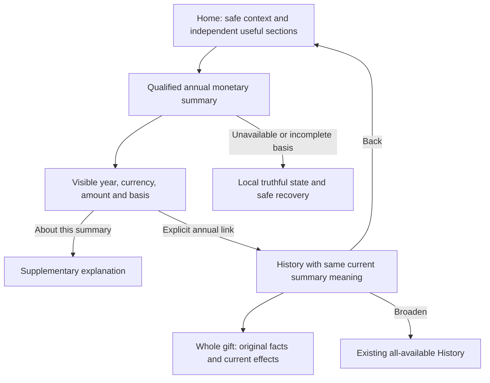

> Historical research record adopted for AL-1563. Scope and testing are ratified; earlier pending decisions and research-only workflow restrictions below preserve chronology. The [implementation specification](../../phase-25-donor-dashboard-depth.md) and its owner contracts are the implementation authority for this proposal. No historical synthetic/source check certifies target runtime behavior.

> **Fully ratified, 8 September 2026:** Conrad accepted Question23 A1–A4/J01–J16/V01–V12/C01–C22, including the monetary definition, issuer-based calendar periods, three-row Maia default and narrow US credit-card dating clarification. T01–T18 remain required target proof. Earlier provisional wording below is historical; ratification does not certify implementation, live behavior or general tax compliance.

# Question 23 — Giving this year so far

8 September 2026. **Disposition: Accept with required amendments.** Conrad selected A. The corrected execution below **awaits ratification**; the annual emphasis is retained. This is a completed grooming review, not a formal specification, implementation authorization or certification of live behavior. Questions 01–22 remain ratified. No source, canonical ADR/OpenSpec, GitHub, provider or financial record was changed.

## Exact corrected decision to record

> Home presents one modest current-calendar-year giving summary, using each receiving organization's verified source dating and currently authorized monetary-giving facts. The visible amount means current effective posted monetary contributions, including the donor's charitable fee cover, after finalized refunds, returns and applicable corrections. Processor expenses are not subtracted. Noncash internal valuations, soft credit, promises and unposted processing attempts are excluded.
>
> Keep legal-donor context, receiving organization, original currency and actual year/range explicit. Resolve each issuer's current year/today from its existing verified Phase 7 timezone at one server as-of instant; use the authoritative effective gift-date DATE without reinterpreting it. A correction restates its original gift-date cohort, not the year in which the correction happened. Do not manufacture a date, currency, zero, complete total or tax deduction.
>
> The normal one-period heading is Your giving in 2026, with the actual year supplied by the source. If admitted issuers are in different local years, use Your giving this year and label each row's actual year/range. Show up to three complete admitted receiving-organization/currency rows and a clear route to all relevant yearly giving in History. Keep the monetary basis and active coverage limitation readable beside the amount; supplementary detail belongs under About this summary.
>
> Summary and targeted History use the same authorized population, amount definition, period and source-currentness meaning. Q10's original Gift amount filter and neutral All available History remain unchanged. January zero, fully refunded zero, pending bank gifts, noncash-only records and unavailable data are distinct states, not new-donor signals. The summary is a read-only source projection, never a stored donor balance, source of financial authority or trigger for another gift.

### A1 — Give the headline one precise monetary meaning

The chosen period did not previously settle the amount formula. Adopt the current effective posted **monetary hard-tender contribution** measure for this informational Home summary. Include actual charitable fee-cover contributions; apply the source's finalized inverse/delta effects; retain gross monetary gift value before processor cost and any tax/benefit deductions. This is an explicit proposed Home measure binding for ratification, grounded in P13 rather than a new money calculation owned by Home.

Exclude internal noncash valuation, soft/recognition credit, a DAF advisor's or employee's attributed share of another legal donor's gift, unpaid promises, drafts and unposted processing attempts. A contribution to the legal donor being represented can appear only under that separately authorized context. Source-posted offline monetary gifts and processor-confirmed, posted ACH can qualify under the private donor measure even while return-exposed; a raw ACH processing event never qualifies. The summary is not a claim of irreversible settlement, bank balance, ministry funds available or deductibility.

### A2 — Bind the annual period to existing gift-date authority

At one server instant T, each admitted legal issuer supplies its verified Phase 7 timezone/policy. Derive its calendar year and civil today, and include effective gift-date DATE values from January 1 through today, inclusive. Future dates are outside this year's-so-far cohort. P2's recurring-only `giving_timezone`, browser locale/year, import time, posting time and provider payout date are not substitutes.

The stored effective gift date remains the Phase 7 fact. A current issuer-timezone configuration change does not reinterpret old dates as timestamps; any source dating correction follows Phase 7's append-only successor authority. `tax_year` is not a substitute for calendar year where jurisdictional periods differ. This is a new presentation binding to existing verified date authority, not a new timezone setting.

Resolve the reached US credit-card wording ambiguity explicitly: Phase 7/13's old settlement shorthand must mean the qualified date the contribution is actually charged for the gift-date rule, not processor payout, balance availability or a later donor card-bill payment. Source finality and gift date are separate. Update that owner wording and its field-evidence tests before activation; do not install a local Home interpretation. Unsupported/ambiguous date evidence yields qualified unavailability rather than a guessed year.

Debit/prepaid/other card funding follows its independently qualified issuer/tender dating contract. Do not infer credit-card treatment from the generic card tender or unknown funding classification. A shared year heading is valid only when the rows share that year; a shared date range is valid only when their actual bounds also match. Issuers can have the same year but different civil today cutoffs.

### A3 — Make the modest summary explainable

Use a shared Maia summary with readable year/range, original currency, amount and concise basis such as **Monetary gifts, including fee cover, after refunds and returns.** Up to three complete admitted issuer/currency rows is a proposed Home compactness default, not a measured optimal number or server query cap. Additional yearly rows and their explanatory records remain accessible in existing History without a new issuer chooser or dashboard builder.

The exact annual link carries the source's matching summary descriptor. Its History view shows the same current-effective summary meaning and original/effect details; summing Q10's original non-fee-cover Gift amount column is not falsely presented as reconciliation. Generic History still opens All available. No amount refresh, period change or link creates a charge, retry, receipt, message or donor classification.

### A4 — Complete the existing source/read owners and prove adoption

Build the qualified summary through the existing P13 money/P7 dating/P3-P12 projection boundary, with coherent amount, period, coverage and current authorization. Do not sum loaded History rows, reuse the whole-Tenant staff summary RPC, trust donor counters or copy the legacy created-at adjustment overlay as the target fold. Complete and reconcile the reached owner contracts/tickets, then adopt a typed shared read and UI, retire incompatible summary fallbacks and require actual target proof. Keep independent Home regions usable when this read fails.

## The seven Grill with Docs checks

### What could go wrong with this answer?

The annual label can conceal the wrong date, incomplete records, a mixed-currency sum or a tax-looking amount. A zero can misclassify a longstanding donor, and a pending bank gift can either be counted prematurely or appear to have disappeared. A summary-to-History link can also show a different population/amount basis, eroding trust even when both figures are individually valid.

### What hidden assumptions are we making?

We have no Asym donor task-frequency or comprehension study proving annual emphasis is preferred. Up to three rows is a presentation judgment. The proposed current-effective monetary measure and issuer calendar binding are explicit additions requiring ratification. Target money/dating/query implementations are not complete merely because their PRDs or similarly named functions exist. Historical availability is not lifetime completeness.

### How does this affect the whole product?

Home, the linked History summary, CRM's qualified donor view and official documents must consume the same authoritative money/date facts while retaining different purposes. Home does not become a ledger, tax engine, contact-merge authority or reporting balance. Q04 scope, Q05/Q10 whole-gift history, Q08 documents, Q12 current actions, Q16 successful ACH submission, Q19 qualified empty Home and Q22 recurring arrangements retain their boundaries.

### How does this affect the end-user experience?

The donor sees a small useful yearly reference with a clear explanation path. An occasional donor is not treated as new every January. A donor who gave property or through a DAF is not shown an invented personal monetary amount. Several organizations/currencies remain understandable without a wall of totals or forced selection step. Current actions and ministry connection stay prominent.

### Does this follow modern best practices?

Planning Center and Tithely provide current annual-summary precedents, but Tithely's pending-inclusive total and comparative metrics are not adopted. Refund/import documentation from other providers demonstrates why a display total cannot be copied across systems. Named periods, meaningful amounts, explicit record coverage, progressive supplementary explanation and accessible direct links are transferable. No source proves an Asym retention or usability uplift.

### Does this fit Asym’s existing repo and product direction?

Yes with the required measure/date/source amendments. The roadmap requires currency-partitioned cumulative totals without fixing Home's measure. P13 separates hard tender, fee cover, expenses, benefits and recognition; P7 owns delivery dates and issuer policy; P12 owns current permission. The current YTD tile and staff summary RPC are incomplete predecessors, not authoritative examples. Exact base-maia and shared boundaries remain.

### Should we adjust the recommendation?

Keep A. All-available giving remains a strong relationship-oriented alternative and recent-gift-first remains a lighter option. Obvious History access and truthful empty-period context preserve their value without adding several equally large cards. The amendments make the selected annual summary usable and financially coherent; they do not reopen the period choice.

## Verified evidence and current-versus-target distinction

Source checkpoint: `7abd2c11ffd4ed70c6775c4fd6f51c996e4350dd`. Governing documentation, active source contracts, existing issue bodies, current code, primary research and synthetic probes of actual source functions were inspected. This is not a hosted policy or production incident report.

<!-- prettier-ignore -->
| Evidence | Verified finding | Consequence |
| --- | --- | --- |
| ADR-0001; platform boundaries; shared API/data guide | Asym Postgres owns application/CRM truth; apps compose shared owners. | No Home-owned monetary balance or provider-summed source. |
| P13 PRD:781–824,1428–1481 | Lines/postings own money; SQL effective fold uses per-header sequence; dates have separate immutable linear authority; integer original currencies and tenant-aware links. | Amount and annual membership need both coherent money and dating revisions. No direct base SUM or created-at overlay. |
| P13:1176–1196 | Noncash internal FMV/value is internal and structurally separated from donor receipt value. | A broad posted-numeric SUM can expose confidential/inappropriate valuation. Explicit monetary-tender admission is required. |
| P13 D12:1315–1322 | Fee cover is a distinct charitable ledger contribution; refunds include its source-covered share; processor costs remain separate. | Include charitable fee cover in this proposed monetary headline; do not subtract payment processor expenses. Preserve source lineage and inverse calculations. |
| P13:979–989; P15 monetary intake | Source-posted success can count in private finance while return-exposed; processing does not. | Explicitly apply the private donor monetary measure, not a public/missionary settled-only flag. Posted offline/provisional facts retain their qualified status. |
| P2 PRD:419–424 | `giving_timezone` is for recurring schedule intent only, separate from P7's timezone. | The initially tempting shared-calendar shortcut conflicts with governing ownership. Use verified issuer dating configuration, not a new shared setting. |
| P7 PRD:246–265,305–322; P13:1070,1088,1457 | Exact issuer/no default, current delivery-date authority; some older card settlement shorthand is ambiguous. | Clarify US credit-card charged-date meaning and qualifying provider evidence in the existing owner; a summary must not decide locally. |
| P12 PRD:167–185,214–223 | Single PDP, set-based row/field/purpose admission, trusted Tenant source and coarse RLS. | Authorize amount/metadata before aggregation; destination-name admission and aggregate-amount admission remain distinct. |
| Home `donor-dashboard-main-body.tsx:35–45,80–102`; model:346–361,388–399,471–487 | YTD from loaded successful aliases/UTC-derived year, generic /100, zero fallback; lifetime counters/subsets and unrelated Impact labels. | No claim this current tile has correct scope, measure, period, precision or availability. |
| Donor `service.ts:205–242` | Gifts capped 250 and pledges 100; broad snapshot couples financial and preference failures. | A donor with more records gets a different aggregate from the loaded subset. New summary must be independent and complete for its declared population. |
| Admin `contributions/service.ts:553–578`; `20260408224500_admin_contributions_summary.sql:1–23` | `_params` ignored; Tenant-only raw successful sum, no donor/period/currency/current effects, BIGINT cast then Number coercion. | Moving the aggregate server-side is insufficient if this staff RPC is reused unchanged. |
| Current adjustment overlay and migration | Created-at ordered JSON replacement values exist; target header/posting/dating definitions were not found in the inspected migration files. | Useful predecessor, not the required P13 sequence-based fold. No target SQL or hosted absence claim beyond this source search. |
| Actual current-source verification | Four existing Vitest files: **14 tests passed**. Eight direct model probes documented mixed currency, future-date inclusion, cap sensitivity and other behavior. | Passing predecessor tests do not prove the target annual measure, SQL/PDP, browser or finality. |

Fresh owner issue bodies remain existing work, not new dispatch authority: **#573** is OPEN and still describes stale Tenant/default dating columns/shorthand; **#695** is OPEN and still places date correction in money postings/omits current dating co-commit; **#762** is OPEN and must share the same minimal P13 ledger substrate. The corrected current P7/P13 contracts supersede those older body details. At authorized publication, update the reached bodies/acceptance rather than implement their obsolete instructions or create another ledger. Native dependency edges/readiness were not inferred from body text.

### What the actual probes established

<!-- prettier-ignore -->
| Probe | Actual current result | Target requirement it motivates |
| --- | --- | --- |
| USD 100 plus JPY 10,000 in the same year | One `yearToDateCents=20000`; current Home's /100 path yields 200. | Separate original-currency amounts and exponent-aware formatting; no scalar mixed-money total. |
| Received USD 100 plus processing USD 50 | YTD 10000 minor; states Succeeded/Processing. | Preserve this useful exclusion of processing; qualify source posting rather than legacy string aliases. |
| Legacy status refunded | Display Failed and YTD 0. | Keep refund/return/correction meaning, original gift and current effective value distinct. |
| Missing gift date; import/creation in 2026 | Creation timestamp becomes displayed date and enters2026. | Do not invent annual membership from a fallback. |
| Gift dated 31 December 2026, as-of 8 September2026 | Included in YTD. | Bound by issuer-local today, not merely matching a year number. |
|251 USD1 records versus first250 |25100 versus25000 minor. | Full declared population aggregate independent of page cap. |
| UTC New Year, input 31 December date | Model year follows UTC; no issuer-timezone input exists. | Existing source lacks the target issuer-period qualification; this probe is not a live dating verdict. |
| Addition beyond JS safe integer range | Result9007199254740992 instead of exact9007199254740993. | Exact integer/numeric transport; no unchecked Number conversion. This is a boundary probe, not a typical donor-volume claim. |

## Exact monetary measure, period and domain invariants

The proposed measure is a source-owned read contract, with an explicit identity/version shared by Home and its matching History summary. It must not be implemented independently in each UI.

For each admitted legal-donor/issuer/original-currency partition at a qualified source basis:

1. Select source-posted **monetary hard-tender contributions** admitted to this exact actor/purpose/amount scope. A sensitive or aliased ministry label does not by itself exclude an amount the donor may legitimately see. Conversely, visible child identity does not grant the parent total or hidden fee line.
2. Fold current monetary amounts using canonical line amounts folded from postings ordered by the owning header's monotonic seq and finalized compensating effects. Include actual fee-cover gift value. Never add header totals to the same lines or multiply amounts through receipt/credit joins.
3. Resolve each contribution's effective Phase7 gift-date fact. Select dates in its issuer's January 1–today range at the response's one as-of instant. Do not select by adjustment-created time, posting batch, import arrival, payout availability or a stale `tax_year` shortcut.
4. Sum once at the admitted monetary grain in original currency. A complete authorized whole-contribution amount may be used when that precise aggregate is admitted; do not reconstruct a forbidden total from visible pieces. Any limited projection must have an owner-approved measure/label and no hidden-existence inference; otherwise return the qualified unavailable state.
5. Return exact value, period, coverage/currentness, zero/record-presence meaning and safe History descriptor coherently. Numeric zero alone never establishes absence. A valid cohort is nonnegative under P13's remaining-effective-amount constraints; negative output is an invariant failure, not debt or a value to clamp.

### Inclusions and exclusions

<!-- prettier-ignore -->
| Fact | Treatment |
| --- | --- |
| Posted ordinary card/cash/qualified monetary contribution | Include its current effective admitted amount under its effective gift date. |
| Actual charitable fee cover | Include, keeping its own source line and disclosure; no estimated/unaccepted cover. |
| Actual processor/platform expense | Exclude from the calculation; it does not reduce donor giving. |
| Finalized partial refund/return/void/correction | Apply source inverse/delta to the original gift's current effective value/cohort, including affected fee cover. |
| Requested refund or unclear external result | Do not subtract a requested amount before its source posting; preserve exact pending status in its existing owner surface. |
| ACH processing, future installments, unpaid promises, checkout drafts | Exclude from the monetary amount; keep legitimate current status elsewhere. |
| Processor-confirmed succeeded and source-posted ACH | Include under the private donor measure even while return-exposed; later return applies the owner inverse. No new waiting period. |
| Source-posted offline monetary/check gift with provisional qualification | Include only under the owner-qualified private monetary rule and keep clearing/provisional meaning accessible. No assertion of irreversible bank settlement. |
| Noncash internal valuation, stock/property/vehicle appraisal, sale proceeds attached to such a gift | Exclude from this monetary headline. Preserve the separate qualified noncash records/document treatment; no value disclosure by arithmetic. |
| Soft credit, matching recognition, DAF-advisor attribution, household relation | Exclude from this person's hard-donor monetary amount. Separately authorized legal-donor context and recognition records retain their source behavior. |
| Benefits/deductible amount or tax carryovers | Do not deduct or add them to this informational monetary measure; official document/tax owners remain separate. |
| Migration duplicate, out-of-order unqualified event or unsupported date/tender evidence | Do not fabricate an amount/date or silently certify completeness. Quarantine/resolve through the source owner and return accurate availability. |

**Example:** Maria's posted gift is USD 100 to a ministry plus USD 3 charitable fee cover. Her monetary summary includes USD 103 before processor costs. A finalized source refund of USD 25 principal plus USD 0.75 fee cover makes that gift's current contribution USD 77.25. If its effective gift date is in 2025, the change belongs to the 2025 giving cohort even when processed in 2026. This is a source-rule illustration, not a Home refund-allocation formula or tax advice; the posting owner supplies the exact amounts.

### Temporal correctness and the reached date conflict

Use one T for response evaluation. For each receiving organization, compute civil today/year in the existing verified issuer timezone; preserve that configuration/version in the read basis. Compare authoritative DATE values directly. A normal single year can appear in the shared heading. If organizations span2025 and2026 at the same instant, each row carries its correct year/range under the neutral heading Your giving this year. No same-currency cross-year total is created.

P7's effective dating correction can move a gift between years without a money posting. Invalidation must cover dating as well as monetary revisions. An older gift's finalized refund changes the older current-effective cohort. Original issued documents are not rewritten by Home; P7/P18/P19 issue any lawful correction separately. This summary is not the organization's current-year cash-flow report or a deductible-tax-year statement.

The official [IRS Publication 526](https://www.irs.gov/publications/p526) currently states the US credit-card contribution year follows when the charge is made. That exposes ambiguity in the repository's older settlement wording. Required owner correction: qualify the actual charged-date evidence for the US credit-card dating rule; explicitly exclude processor payout/available-on dates and mere authorization/preparation timestamps unless the source proves they represent the actual charge. Other tender/jurisdiction policies remain their own rules. Do not use this US rule globally, introduce a Home date column or claim the summary establishes deductibility. This is an exact source-contract clarification to capture before activation, not a new legal disclaimer flow.

## Mapped donor journey J01–J16

<!-- prettier-ignore -->
| ID | Donor moment | Required experience and consequence |
| --- | --- | --- |
| J01 | Opens Home | Preserve Q04's actual context, Q12 current actions and Q19 welcome/Updates. Load the small independent summary without fake zero, Impact or donor classification. |
| J02 | Reads a normal amount | Show source year/range, currency and current monetary amount, with visible fee-cover/refund basis. A normal single-organization context need not repeat redundant organization text. |
| J03 | Needs to understand the number | About this summary explains current monetary records, processor costs, date/correction meaning and the separate document destination. Material basis/coverage is already visible without opening it. |
| J04 | Has several issuers/currencies | Show distinct safe rows, up to three on Home, and clear full yearly History access. No combined scalar, ranking by amount or initial issuer chooser. |
| J05 | Opens View 2026 giving | Carry the explicit current personal/represented context, issuer/currency and exact period/monetary summary descriptor. Show the same basis in History, with source-owned original/effective details. |
| J06 | Examines one gift | Preserve the whole gift and permitted allocations, original Gift amount, fee cover and later effects. Do not change Q10's original-amount filter to make the headline seem to match. |
| J07 | Broadens the History view | Existing filters and neutral All available remain. Clearly distinguish a deliberately filtered summary from the Home annual basis. No hidden saved default or tax-document generation. |
| J08 | Uses Back | Restore safe reading context/position and revalidate as necessary. The annual Home default stays source-resolved; no replayed financial action or restored revoked value. |
| J09 | Returns in January with prior giving | Clearly name the new year and provide ordinary historical access. No giant zero scoreboard, first-gift onboarding, lapsed label, catch-up prompt or loss of current arrangements/documents. |
| J10 | Returns after ACH submission | Preserve successful-submission gratitude and exact Processing/verification status under Q16. Do not count unposted processing as monetary giving or request another donation because the summary excludes it. |
| J11 | Gift is refunded or corrected | Show the current effective value and accurate source explanation. Zero after applicable effects is a record-bearing state; never say no gifts solely from the amount. Old-year changes remain in that cohort. |
| J12 | Only noncash/recognition records exist | Preserve these separately authorized records and their History/document paths. State the limited monetary basis; do not invent valuation or infer the account is financially empty. |
| J13 | Records or dates are incomplete | Qualified known limited coverage is visible. Unresolved amount/date/coherence failure is updating/unavailable, not zero or a guessed current-year subtotal. Independently safe records remain reachable. |
| J14 | One service fails or network is slow | Local skeleton/retry/unavailable treatment leaves independently qualified Home utility intact. A read retry never invokes ingestion, reconciliation mutation or payment execution. |
| J15 | Uses mobile/keyboard/AT | Read amounts, periods, organization names and limitations without hover or horizontal clipping. Operate links/disclosure with stable focus, logical headings and touch-friendly targets. |
| J16 | Year, issuer policy, money/date source or permission changes | Refresh the entire result basis coherently. Reject late old-context responses and never relabel an old cached amount with a new year. Known access loss removes unsafe content; delivered bytes cannot be recalled. |

## Reviewed Maia presentation defaults V01–V12

These are proposed execution defaults for ratification, not empirical design optima. Preserve exact shared base-maia/Base UI, Figtree and Zinc semantic tokens. ReUI remains the reference for actual grids in History; this small summary is not a grid.

<!-- prettier-ignore -->
| ID | Default | Reason and limit |
| --- | --- | --- |
| V01 | One modest Card/Item section in normal Home flow. | No large hero metric, chart, carousel, goal or competing annual/all-time/latest-gift KPI wall. |
| V02 | Actual year in ordinary heading, range adjacent; mixed-period issuers get a neutral heading and exact per-row periods. | No unexplained YTD, fiscal-year claim or inconsistent global year. |
| V03 | Exact amount/currency together, normal readable type hierarchy, no animated counting or K/M rounding. | Preserve original exponent and precision; amount is informational, not an emotional score. |
| V04 | Visible monetary basis and active coverage qualification; supplementary About this summary initially closed. | Important meaning must not require hover or opening help. Use Base UI Collapsible, not a modal or tiny tooltip. |
| V05 | One clear matching annual History link for the normal row/section. | A link performs navigation; document retrieval remains its own route. Mixed periods have row-specific labels and a clearly broader History link where necessary. |
| V06 | Up to three complete admitted issuer/currency rows, then View all yearly giving. | Three limits Home presentation only. Source computes every displayed row completely and certifies further permitted rows; no fetched-row subtotal or invented remaining count. |
| V07 | Stable source-defined issuer order and currency-code order, never amount ranking or locale-selected currency. | Safe labels wrap; known unavailability is not silently skipped to fill three attractive amounts. |
| V08 | Real heading and coherent list/definition semantics using shared components. | Installed CardTitle/ItemTitle are divs; visual grouping does not automatically provide accessible structure. |
| V09 | Native links and named disclosure controls with at least 44px primary touch hit areas under Core's convention. | WCAG 2.2 AA minimum is 24 CSS pixels with exceptions; 44 is a product target, not a claim of universal AA size. No nested interactive whole-card link. |
| V10 | Local matching skeleton and explicit recovery states; no assertive whole-summary live region. | Preserve reading/focus. Announce user-requested result/error messages appropriately without repeatedly announcing every amount refresh. |
| V11 | Reflow at 320 CSS pixels, supported zoom/RTL/CJK, long translated names and light/dark contrast; reduced motion. | No clipped currency/year/basis, horizontal carousel or screenshot-only accessibility proof. |
| V12 | No new period preference, issuer picker, preferred-currency setting, notification or CMS-configured metric. | Use the existing product-owned composition and contextual History navigation. |

Normal illustration: **Your giving in 2026 · January 1–September 8 · USD 413.00**. Below it: **Monetary gifts, including fee cover, after refunds and returns.** Then **View 2026 giving** and **About this summary**. This is an illustrative content model, not a rendered or tested interface.

### Zero, missing and unusual states

<!-- prettier-ignore -->
| Source-qualified state | Presentation |
| --- | --- |
| No monetary records in this period, earlier records known | Calm no-current-period wording with History access; the account is not new. No inference from zero alone. |
| Posted gifts net to zero after finalized effects | Show the exact zero with the true applicable explanation and records link. Do not invent a refund if the reason is another correction. |
| Negative current-effective monetary output | Local unavailable/source diagnosis. No negative-giving debt, absolute value or clamp-to-zero. |
| First accepted bank gift still processing | Its existing successful-submission/status remains visible. Any summary helper says it is processing without promising inclusion in this year before its date/finality is known. |
| Noncash/recognition records but no monetary contribution | Explain the monetary scope and expose other admitted records via History; no hidden internal valuation. |
| Complete result for currently available records, known external-history limitation | Display the qualified amount with an accurate records-available-here explanation; do not promise all gifts ever made. |
| Known participating amount/date unresolved or inconsistent source basis | Updating/unavailable for the affected row; do not silently total only the easy records and imply completeness. A coherent explicitly admitted limited result requires its own source-approved label. |
| No financial records under Q19's complete absence condition | Preserve the ratified welcome/connection Home and omit an empty scoreboard. The annual numeric value cannot establish this condition. |
| Different local years across issuers at one T | Correct per-row years/ranges under Your giving this year; no cross-period scalar. |

## Source, database, concurrency and adoption architecture

### Authoritative ownership and the logical read pipeline

P13 owns money postings/effective contribution values; P7 owns immutable dating and current issuer dating policy; P4/P14 own frozen legal donor/recognition identity; P3/P12 govern admitted projection; document owners retain official evidence and delivery. Home owns presentation and safe navigation only. No counter on the donor, provider Customer, calendar-year job or browser collection becomes monetary authority.

The required read dependencies are logical, not an assertion about SQL optimizer evaluation order:

1. Resolve actual actor, trusted Tenant, giving subject, legal-donor/entity/issuer ceiling and current purpose/field capabilities through the sole PDP. Caller-supplied period/filter/descriptor is validated input, never authority.
2. Obtain the complete admitted monetary population and current effective amount/dating facts. A safe ministry alias can coexist with an admitted whole-gift amount; a visible child must not reveal a forbidden parent total. Admission governs bucket existence, amount, coverage, counts, sort and drill-through as well as records.
3. Resolve all per-issuer periods at one T and apply stored DATE bounds. Fold once at canonical contribution/line grain before repeating receipt/credit/reference joins. Handle coverage/provenance and unresolved inputs explicitly.
4. Produce a coherent source result: amount definition/version, admitted scope, monetary and dating/currentness basis, period/range, original-currency value, availability/presence and relevant History destination. No raw credentials, internal valuations or unrestricted source payloads reach the browser.
5. Limit Home presentation to three complete source rows plus qualified further-access information. Do not limit gifts before SUM or require all matching financial records in the browser. The full owner-backed yearly History summary handles further rows.

### Database and authorization invariants

Use the existing tenant-aware header/line/posting/dating composite keys and immutable legal issuer/tender/legal-donor facts. Tenant is required with no fallback default; same-Tenant/exact-issuer references prevent cross-scope relationships. Per-header posting sequence and dating predecessor/revision uniqueness/CAS protect linear history. Posted money is immutable by structural trigger/constraint, including privileged writes; RLS/REVOKE alone cannot enforce append-only behavior against a bypassing owner/service role.

P12 remains the sole current permission decision point. RLS is its intended coarse trusted-Tenant backstop, not a parallel donor/household/issuer engine. Verify actual grants, exposed schemas, views/RPCs, function execution owner/search path, default PUBLIC EXECUTE, table-owner/BYPASSRLS/FORCE behavior and every service-role route. `security_invoker` is useful where appropriate; it is not a substitute for the PDP or permission to expose underlying base money. Browser access needs no new UPDATE/DELETE grant for this summary.

For reached mutations, inspect effective old-row USING and new-row WITH CHECK plus immutable assignments. PostgreSQL may inherit USING when WITH CHECK is omitted for UPDATE/ALL; omission alone is not a proven hole. A Tenant-only predicate may still allow forbidden within-Tenant reassignment without source constraints. Audit both actual transformed-row state and the trusted application boundary rather than adding generic role policies.

### Coherent money, dates, coverage and time

A date correction can move a gift between years without any new money delta. A refund can change its amount without changing its date. A completed import can change coverage and population. A grant change can change visibility without any financial effect. The result must bind all of these relevant dimensions; `max(seq)` across unrelated per-header sequences is not a valid global revision.

Use one bounded consistent source statement, an appropriate short consistent read transaction, or explicit matching owner revisions. Successive READ COMMITTED SELECTs do not automatically provide one coherent snapshot. Do not introduce Serializable everywhere, a distributed Home transaction or a database transaction held while the donor browses History. The source supplies the currentness contract; Home does not mint another financial journal.

Canonical ingestion/posting/dating idempotency and transactional outbox continue to own repeated and out-of-order events. A summary GET, retry, focus or navigation writes no financial correction and sends no provider request. It never repairs a source discrepancy by changing money/dates. Ambiguous posting/finality stays with the source; the summary reports the resulting qualified availability. A newly committed effect invalidates relevant source views even when a notification/document delivery fails afterward.

The summary is current-effective information at a stated basis, not an immutable tax document or snapshot export. History opened later can legitimately reflect a new correction/date revision or new permission. When that happens, explain the refreshed basis and current difference rather than freezing obsolete rights or forcing equality through a stale snapshot. Q20's explicit export snapshot is a separate operation.

### Numeric precision, performance and privacy

Keep exact source minor-unit integers/numeric values and validated currency exponent end to end. PostgreSQL SUM(bigint) returns numeric; do not cast it into a smaller type or pass it through unchecked JavaScript Number. Use the existing checked exact/string money transport and formatter. No hardcoded /100, locale-as-currency, default USD, rounding to make a figure plausible, absolute value or negative-to-zero clamp.

Start query qualification from actual Tenant/issuer/legal-donor/date-range and canonical posting/dating references. Verify the migrated index definitions and EXPLAIN ANALYZE/buffers for supported workloads; no universal index recipe or O(1) claim is made. Range predicates over stored dates avoid a needless extract-year filter, but joins, permission selectivity and source currentness still determine cost. P12's logical governed-read budget of at most one governance-row SELECT plus one ledger UPDATE, with its documented carve-out, is not a one-business-data-query limit.

Record and enforce numeric API/DB timeout, concurrency, payload and memory budgets in the existing owner release evidence. Measure 250/251 gifts, many splits/effects, sparse grants, a long current year, many currencies/issuers and the largest rollout tenant fixture. Three Home rows is not proof of bounded aggregate work. Precomputed support is justified only after measured need, remains replaceable/rebuildable and is source-currentness qualified; no writable annual donor balance is introduced.

Use a small Query-owned shared summary read. It does not need a new TanStack DB collection, Table or Virtual instance. Those existing libraries retain their approved roles for the detailed History view; loaded History rows never feed the annual headline. Preserve typed auth/availability errors and bounded retries. The current common snapshot key, missing AbortSignal and broad PATCH cache replacement are not the target adapter.

Cache identity/admission must account for trusted context, giving subject/issuer ceiling, monetary measure, source/currentness and resolved period/policy. Do not key only by YTD, email or the device year. Source invalidation prompts re-read, never client arithmetic from webhook payloads. Abort old reads and reject obsolete generations independently; retire affected Query/DB materialization across context loss, including retained subsets. StaleTime is a fetch heuristic, not authority/finality proof. No financial rows or search text in public/shared caches or unsolicited persistent browser storage.

At year rollover or resume from sleep, refresh the entire heading/period/value/basis coherently. An old-year response arriving after midnight remains visibly old-year until replaced; the client never relabels it as this year. Use the source-known next boundary and existing lifecycle refresh hooks, not a new annual reset job or financial counter mutation. Known access contraction blocks further disclosure and removes affected client content; previously delivered bytes cannot be recalled.

### Migration and rollout

First reconcile current P7/P13/P12 owner contracts and the stale #573/#695/#762 bodies at the authorized documentation/publication stage. Implement the one existing money/dating substrate and qualified annual read, with source migration/provenance. Then adopt the shared summary/History descriptor and the Maia section. Retire or constrain reached incompatible Home summary fields, counters and adapters; unrelated valid staff/profile features remain outside this slice.

Test old/new source/client contracts, projection rebuild, historical imports with unknown dates, rollback and the read-capability kill switch. Do not backfill issuer/date/currency using guessed defaults to activate the UI. If the summary must be contained, disable that read surface and preserve independently safe History/docs/recurring/status/Updates. Rollback changes no gift, date, payment retry or recurring schedule and never restores an unsafe legacy summary as a convenience fallback.

## Individual adversarial category review

Likelihood is a qualitative engineering judgment if the shortcut is adopted, not an observed incident rate. A critical severity describes possible unauthorized financial disclosure, not a claim that production has leaked data. Each C record includes the exact required execution language.

### C01 — Problem validity, necessity, and alternatives

**Material concern: Yes.** Annual emphasis can be unhelpful for an occasional donor in January and can turn Home into a financial scoreboard. All-available or recent-gift-first remains a credible alternative.

**Severity:** Medium. **Likelihood:** Plausible; donor task distribution is unmeasured. **Evidence/reasoning:** Current platform precedents support differing purposes, and Q19 forbids empty scoreboards. **Effect:** Keep A with restrained presentation and clear historical access.

**Permanent prevention:** One useful yearly section, not a wall of competing metrics or behavior pressure.

**Required language:** “Home SHALL emphasize the qualified current calendar-year summary without rankings, comparison pressure or duplicate headline metrics. Prior giving remains accessible; zero in the period SHALL NOT imply no available records or new-donor status.”

### C02 — Brittleness

**Material concern: Yes.** Matching a UTC year, missing-date fallback or recurring timezone works only for simple cases; future-dated gifts and year-boundary issuers break it.

**Severity:** High. **Likelihood:** Current source defects are demonstrated; boundary scenarios are predictable. **Evidence/reasoning:** Direct future-date/UTC probes, P2 recurring-only timezone and P7 issuer dates. **Effect:** Changes the period implementation, not the chosen annual emphasis.

**Permanent prevention:** Explicit issuer-local current period over authoritative DATE values with no guessed defaults.

**Required language:** “Each row SHALL use its verified issuer calendar year/today at one server instant and effective gift-date DATE within January 1–today. Unknown dates/timezones SHALL be qualified unavailable; raw UTC year, created_at, schedule timezone and fallback timestamps SHALL NOT determine membership.”

### C03 — Technical debt

**Material concern: Yes.** Reusing the 250-row snapshot, a donor counter, Tenant-only staff RPC or created-at adjustment overlay preserves competing monetary authorities.

**Severity:** High. **Likelihood:** All are tempting existing code paths. **Evidence/reasoning:** Inspected service/model/RPC/overlay and target P13 cutover contract. **Effect:** Requires owner-first implementation and adoption.

**Permanent prevention:** One canonical money/date projection and shared annual descriptor, with reached legacy retirement.

**Required language:** “Q23 SHALL use the completed P13/P7 qualified read through packages/api. It SHALL NOT certify a total from loaded rows, donor.total_given, the unmodified admin summary RPC or a Home copy of the legacy overlay. Adopt and retire incompatible reached fields/readers together.”

### C04 — Edge cases

**Material concern: Yes.** January, prior-year refunds, zero after adjustments, pending ACH, noncash-only giving and issuer-local year differences can produce misleading absence or amount copy.

**Severity:** High. **Likelihood:** Routine cases, with rare multi-issuer boundaries. **Evidence/reasoning:** P7/P13/Q16/Q19 and the reviewed state matrix. **Effect:** Narrows the amount/absence meaning.

**Permanent prevention:** Derive record-presence/effect states separately from the scalar and preserve other financial/contextual utility.

**Required language:** “Numeric zero SHALL NOT establish no records. Finalized effects remain in the original effective gift-date cohort. Pending, noncash/recognition-only, refunded-zero, unavailable and genuinely empty states SHALL use distinct source-qualified treatment; no duplicate-gift or catch-up prompt follows.”

### C05 — Footguns

**Material concern: Yes.** A total link can silently change History's amount semantics, leak broad context or trigger a receipt/export/action merely to show details.

**Severity:** High. **Likelihood:** Plausible routing/summary integration shortcut. **Evidence/reasoning:** Q10 original non-fee-cover amount filter and Q08/Q20 separate document/export operations. **Effect:** Requires explicit informational navigation.

**Permanent prevention:** Source-provided safe descriptor with exact purpose/period and existing action boundaries.

**Required language:** “Summary links and disclosure SHALL be read-only. The targeted History view SHALL state the same monetary basis and exact scope while preserving original Gift amount/filter meaning and neutral All available entry. Viewing SHALL not create a financial command, document, export or communication.”

### C06 — Tenant safety

**Material concern: Yes.** A total, currency row or coverage hint can reveal hidden money even when the underlying gifts are never rendered; personal/represented contexts can be mixed.

**Severity:** Critical. **Likelihood:** Plausible aggregate/fanout mistake. **Evidence/reasoning:** P12 governed row/field/purpose admission and the real whole-Tenant staff RPC. **Effect:** Requires authorization before every disclosed derivative.

**Permanent prevention:** Exact trusted giving context and explicit amount-level admission, with safe cache/result generations.

**Required language:** “Admit actor/Tenant/subject/issuer/amount fields before aggregation. Hidden facts SHALL affect no disclosed amount, bucket, label, count, order, limitation or drill-through. Safe aliasing does not remove separately authorized amount access; visible children do not grant forbidden parent totals.”

### C07 — Database, RLS, and authorization safety

**Material concern: Yes.** Views, definer RPCs and service roles can bypass intended application admission, while RLS alone cannot freeze posted records or prevent within-Tenant reparenting.

**Severity:** Critical. **Likelihood:** Checked-in predecessor gaps; hosted exposure not tested. **Evidence/reasoning:** Current grants/policy/helper lineage versus P12, P13 structural immutability and PostgreSQL policy semantics. **Effect:** Requires existing owner completion, not another permission engine.

**Permanent prevention:** Actual migrated catalog/SQL proof of grants, trusted Tenant, invoker/definer behavior, immutable facts and composite relationships.

**Required language:** “Preserve the sole PDP and coarse trusted-Tenant RLS on every reached path. Effective USING/WITH CHECK plus immutable/composite constraints SHALL prevent forbidden scope/state transformation; inspect actual execution privileges and default EXECUTE. Navigation requires no write grants; omitted WITH CHECK alone is not a proven hole.”

### C08 — Overengineering

**Material concern: Yes.** A modest card can create a new annual balance service, global reporting timezone, issuer chooser, summary customization system or unnecessary client data stack.

**Severity:** Medium. **Likelihood:** Plausible scope expansion. **Evidence/reasoning:** Existing money/date/read owners already provide the required concepts. **Effect:** Narrows architecture and presentation.

**Permanent prevention:** One small source read and fixed product-owned composition; optimize only on measured need.

**Required language:** “No writable annual donor balance, new global financial timezone, annual reset job, dashboard builder, currency preference, ranking or full-history browser replica SHALL be introduced. A summary read need not instantiate DB/Table/Virtual merely because those libraries serve History.”

### C09 — UX/UI and user friction

**Material concern: Yes.** A visually attractive number can hide its monetary/fee/refund basis, overwhelm with several organizations, mislabel different years or force a tax-document detour.

**Severity:** High. **Likelihood:** Plausible; current generic YTD/zero layout shows the risk. **Evidence/reasoning:** Current donor examples, installed Maia semantic limits and V01–V12. **Effect:** Requires visible basis and mapped accessible journeys.

**Permanent prevention:** Modest exact-period summary, up to three complete rows, direct matching History and supplementary disclosure.

**Required language:** “Implement V01–V12 with actual year/range, currency and monetary basis visible; active limitations cannot hide in a tooltip. Multi-issuer/currency rows SHALL remain distinct and complete. Test zero-period comprehension, matching History, Back, keyboard/AT, mobile reflow and mixed-year labels.”

### C10 — Source of truth, ownership, and domain invariants

**Material concern: Yes.** Gross gift, designated support, fee cover, expense, benefit, deductible amount and recognition can be collapsed into one convenient but false Giving total.

**Severity:** High. **Likelihood:** Concrete source shortcuts and common integration ambiguity. **Evidence/reasoning:** P13 D3/D12, noncash boundary and Q10's distinct original-amount filter. **Effect:** Adds the explicit monetary measure for ratification.

**Permanent prevention:** One source-owned versioned measure, exact inclusion/exclusion table and canonical current fold.

**Required language:** “The headline SHALL mean current effective posted monetary hard-tender giving, including actual charitable fee cover and finalized effects, before processor costs/tax-benefit deductions. Exclude noncash internal value, soft credit and promises. No read model, provider field or UI sum becomes financial authority.”

### C11 — Hidden coupling

**Material concern: Yes.** The card can depend on preferences/recurring reads, receipt availability, current CMS labels or an entire History page; one unrelated failure then removes Home utility or changes the total.

**Severity:** High. **Likelihood:** Existing broad snapshot coupling is confirmed. **Evidence/reasoning:** `service.ts:205–242` and independent owner/surface boundaries. **Effect:** Requires independent qualified reading.

**Permanent prevention:** Small summary projection with local failure and source-safe labels; existing documents/content remain independent.

**Required language:** “The annual amount SHALL not depend on loaded History rows, receipt generation, notification state, preference saves or a public-page publication. A local summary failure SHALL not block independently admitted welcome, Updates, documents, recurring status or help.”

### C12 — Failure modes

**Material concern: Yes.** Missing/error responses can become zero, a partial aggregate can be labeled complete, or a successful payment response can be mistaken for posted monetary truth.

**Severity:** High. **Likelihood:** Ordinary network/source uncertainty and current fallback precedent. **Evidence/reasoning:** Model/Home zero fallback, async posting and Q16 submission/finality separation. **Effect:** Requires explicit availability and read-only recovery.

**Permanent prevention:** Discriminated coherent source result, local retry and durable status through existing owners.

**Required language:** “A failed, inconsistent or unqualified result SHALL not produce a numeric success. Known limited coverage requires an explicit source-approved label. Retry only the read; never request duplicate giving or mutate money/dates to populate the card. Preserve accepted payment status independently.”

### C13 — Lifecycle, temporal correctness, concurrency, and idempotency

**Material concern: Yes.** Money/date corrections and year rollover can mix old amounts with new periods; repeated/out-of-order events can double count or assign effects to the wrong year.

**Severity:** High. **Likelihood:** Expected source concurrency and predictable annual boundary. **Evidence/reasoning:** Independent money/dating revisions, per-header seq and READ COMMITTED snapshots. **Effect:** Requires coherent source basis and inherited idempotency.

**Permanent prevention:** Short consistent owner read or explicit compatible revisions; typed invalidation for money/date/coverage/auth and source-known boundary refresh.

**Required language:** “Bind amount, effective dating, coverage, permissions and period coherently. A correction's posting date SHALL not replace gift date. Do not use max per-header seq as a global revision or relabel cached values at midnight. Source ingestion owns idempotency; summary reads create no postings or reset operations.”

### C14 — Data integrity risks

**Material concern: Yes.** Currency mixing, unsafe numeric conversion, join fanout, invalid date fallback and page truncation silently change financial values.

**Severity:** High. **Likelihood:** Several current behaviors are directly reproduced. **Evidence/reasoning:** Eight probes and current RPC cast/Number path. **Effect:** Requires exact representation and complete canonical grain.

**Permanent prevention:** Exact typed money transport, original currencies, deduplicated current contribution/effect fold and source date validation.

**Required language:** “Preserve exact minor/numeric values and source exponent; no unchecked Number, /100, default USD or invented date. Aggregate each admitted financial fact once across the complete declared population. Negative invalid output SHALL be unavailable, never clamped; zero remains distinct from no records.”

### C15 — Security and privacy risks

**Material concern: Yes.** Internal property valuation, attributed DAF/employee giving, private ministry relationships or prior-context totals can leak through summary metadata, URLs, logs or caches.

**Severity:** Critical for protected financial/identity disclosure. **Likelihood:** Plausible with broad numeric projections and unscoped cache. **Evidence/reasoning:** P13 noncash internal-only boundary, legal-donor separation and current snapshot adapter. **Effect:** Narrows egress and data retention.

**Permanent prevention:** Amount/field/purpose admission, minimized safe metadata and exact context retirement across read layers.

**Required language:** “No internal FMV, protected attribution, secret, private amount or unrestricted label SHALL be exposed by summary/descriptor/error/telemetry. No public or unsolicited persistent private-data cache. Known revocation blocks new disclosure and removes affected content; previously delivered bytes cannot be recalled.”

### C16 — Scalability and performance risks

**Material concern: Yes.** A three-row card can hide an unbounded yearly scan, per-gift policy calls, expensive effect joins or a global hot counter; LIMIT does not make its sum correct.

**Severity:** High at concentrated scale. **Likelihood:** Unmeasured target cost; naive implementations are risky. **Evidence/reasoning:** Complete yearly population, source folds and current cap/staff-RPC shortcuts. **Effect:** Requires measured owner budgets, not a speculative reporting service.

**Permanent prevention:** Set-based admission and indexed range/effect access, bounded response, declared workload/budget proof and source-owned optimization if needed.

**Required language:** “Record numeric query/concurrency/timeout/payload/memory budgets before activation and prove 250/251, sparse grants, dense joins and rollout capacity. No truncation before SUM, per-gift provider/PDP waterfall, all-history browser fetch or O(1) assertion. Derived acceleration remains rebuildable and never writable financial authority.”

### C17 — Operational burden

**Material concern: Yes.** Staff can be left explaining mismatched totals or repairing dates/counters manually when the source basis and reconciliation route are missing.

**Severity:** Medium to high. **Likelihood:** Plausible given predecessor gaps. **Evidence/reasoning:** Current source counters/default dating and separate financial owners. **Effect:** Requires explainable source evidence and scoped repair ownership.

**Permanent prevention:** Support-readable authorized descriptor and existing source correction/reconciliation tools, not a summary override.

**Required language:** “Support SHALL trace a disputed amount to admitted measure/period/source revisions and exact contributing records. No editable Home total or direct financial SQL repair is permitted. Resolve through the money/dating owner; a summary incident does not require donor re-giving or a new support platform.”

### C18 — Observability and auditability gaps

**Material concern: Yes.** A number can change without an explainable financial/date/coverage/access reason, while logging full contributing data creates unnecessary privacy and retention burden.

**Severity:** High. **Likelihood:** Plausible without explicit diagnostic design. **Evidence/reasoning:** Several legitimate independent causes can change the same displayed scalar. **Effect:** Separates technical trace from durable source history.

**Permanent prevention:** Minimal reason/version/correlation telemetry plus existing immutable posting/dating/command/access audit.

**Required language:** “Technical diagnostics SHALL identify basis, safe query shape, latency/availability and opaque source correlations without sensitive payloads. Financial/date/access reasons remain with their durable owners. Ordinary reads/refreshes SHALL not create a financial adjustment, generosity event or notification history.”

### C19 — Dependency and integration risks

**Material concern: Yes.** Provider refund/import totals can use different meanings; old component/query APIs can mishandle caching or precision; raw provider success can bypass source finality.

**Severity:** High correctness, medium maintenance. **Likelihood:** Verified semantic/version differences. **Evidence/reasoning:** Stripe delayed finality, provider CRM refund modes, installed shared APIs and earlier same-day package checks. **Effect:** Requires qualified adapters and selective external transfer.

**Permanent prevention:** Existing owner ingestion and current approved shared-library migration; no new provider polling or duplicated stack.

**Required language:** “Use Core's source ingestion/fold and qualified shared Query/formatting/History adapters. Provider totals, import conversion, comparative scores and frontend success flags SHALL not define this amount. Preserve typed errors, consumed cancellation and late-generation rejection; document installed versus qualified target versions.”

### C20 — Migration, rollout, and upgrade risks

**Material concern: Yes.** Old dating/ledger ticket bodies, guessed backfills and mixed source/UI versions can activate a plausible wrong total; rollback can restore the defective fallback.

**Severity:** High. **Likelihood:** Source-confirmed stale contracts and missing target substrate. **Evidence/reasoning:** #573/#695/#762 body conflicts and current migration search. **Effect:** Requires explicit owner reconciliation and version-compatible adoption.

**Permanent prevention:** Source-first rollout, real provenance, same-measure History adoption, reached-reader retirement and isolated read containment.

**Required language:** “Reconcile reached P7/P13 contracts/issues before implementation, including charged-date wording and dating co-commit/correction ownership. Unknown legacy evidence SHALL not be backfilled as verified. Mixed-version/rebuild/rollback tests must preserve history and safe features without restoring unsafe sums/defaults or changing financial operations.”

### C21 — Testability, traceability, and proof

**Material concern: Yes.** Existing tests can pass while future dates and mixed currency remain wrong; a polished mockup can be mistaken for proof of real aggregate access or dating.

**Severity:** High. **Likelihood:** Demonstrated by current probes with 14 passing tests. **Evidence/reasoning:** Target source/date/SQL/card is not implemented by this research. **Effect:** Requires falsifiable target proof and explicit traceability.

**Permanent prevention:** Test real owner/database/API/browser seams and link the exact accepted measure and date rules through formal artifacts.

**Required language:** “A1–A4/J01–J16/V01–V12/C01–C22 SHALL trace through glossary, owner requirements, design/tasks, tests and release evidence when publication is authorized. T01–T18 are required target tests, not tests run during grooming. Existing mocked/pure-source tests SHALL not certify target SQL, browser, provider or donor comprehension.”

### C22 — Other development hazards

**Material concern: No additional material concern found beyond C01–C21.** Checked whether the annual summary requires a new payment rail, newsletter workflow, dashboard CMS authority, identity-linking exception, legal declaration or automatic financial year-close. It requires none.

**Severity:** None additional. **Likelihood:** Not applicable. **Evidence/reasoning:** The selected scope is informational source projection and navigation; financial/date clarification is already captured above. **Effect:** Accept within the explicit existing boundaries.

**Permanent prevention:** Preserve those boundaries and carry unrelated unresolved gates forward honestly.

**Required language:** “Q23 SHALL not waive Q14 G01 or other owner release gates, change tax-document eligibility, introduce a payment/communication side effect or turn a private financial summary into a CMS-editable metric. This scoped review is not repository-wide or legal-compliance certification.”

## Acceptance and release proof T01–T18

These are **required target tests, not tests run during grooming**. Exercise actual migrated PostgreSQL, shared financial/dating/PDP APIs and the real donor UI. This is not permission to run live donor financial operations during grooming.

<!-- prettier-ignore -->
| ID | Falsifiable outcome | Trace |
| --- | --- | --- |
| T01 | Normal posted monetary gifts, actual fee cover, finalized effects and processor costs yield the precise A1 measure; pending/unaccepted/future promises and unrelated recognition/noncash value do not. | A1, C04/C10/C14 |
| T02 | Partial/full refund, return, correction and re-designation preserve original records, use exact source inverse amounts and keep original effective gift-date-year attribution. Zero records/effects remain distinguishable; invalid negative output fails safely. | A1/A2, J11, C04/C13/C14 |
| T03 | Processor-confirmed posted ACH and qualified offline provisional monetary intake follow private-summary admission; processing alone does not. A late return updates the source once without new receipt/recurrence action from Home. | J10, C04/C12/C19 |
| T04 | DAF/employer/household/soft-credit/noncash records, restricted label with admitted amount, and child-only visibility enforce the exact legal-donor/amount capability. No internal FMV or forbidden parent total leaks. | A1/A4, C06/C07/C15 |
| T05 | Each issuer's January 1–today bounds exclude tomorrow/future same-year dates, handle leap/date-only values and reject unknown/bad date evidence without fallback. | A2, C02/C14 |
| T06 | US credit-card charge versus payout/available-on/authorization chronology and source proof use the clarified owner dating contract; debit/prepaid/unknown card funding, checks/mailing and other tender/jurisdiction rules remain independently qualified. No Home date authority. | A2, C02/C20 |
| T07 | At one T, issuers on opposite sides of New Year produce correctly labeled separate years; same-year issuers with different civil today cutoffs retain exact ranges. Delayed old responses, browser sleep and issuer policy changes refresh value/label/range together without relabeling old money. | A2, J16, C09/C13 |
| T08 | Concurrent money posting, dating-only successor, coverage import and grant contraction produce one coherent old/new admitted basis or retry, never a hybrid. Per-header sequence is not misused as global generation. | A4, C06/C12/C13 |
| T09 |0/1/250/251 gifts, multiple designations/adjustments/receipts and repeated imports/events contribute once at canonical grain. No page-cap or join-fanout under/overcount. | C03/C14/C16 |
| T10 | SQL numeric/BigInt transport and currency exponents remain exact at and beyond safe JS-number boundaries; no overflow/default currency/rounding/clamp or mixed-currency scalar. | C14/C16/C19 |
| T11 | Real catalog/SQL tests prove trusted Tenant/PDP application, table/view/RPC/service grants, invoker/definer/default EXECUTE, effective USING/WITH CHECK, composite keys and append-only mutation rejection. | C06/C07/C20 |
| T12 | Zero new year, fully-refunded zero, noncash-only, known limited history, unknown date, denied and source-failed states are distinct; no false Q19 empty account or duplicate-donation invitation. | J09–J14, C01/C04/C12 |
| T13 | Home-to-History preserves exact monetary measure/population/period/issuer/currency and source-current explanation; original Gift amount/filter and neutral All available stay unchanged. New corrections after click are explained, not frozen. | A3, J05–J08, C05/C10 |
| T14 |1/3/4 admitted summary rows prove the preview boundary, full yearly access, safe labels/periods, same-issuer multiple currencies and local unavailability without hidden hints or misleading subtotal. | V06/V07, C06/C09/C16 |
| T15 | Context changes, logout, revoked fields, old Query/DB subsets, signal-ignoring requests and SSR/cache hydration never expose previous financial data or seed a certified value from partial rows/zero. | J16, C06/C12/C15/C19 |
| T16 | Actual keyboard/AT/touch, long names, 320px/zoom/RTL/CJK, light/dark contrast and reduced motion preserve amount/basis reading, disclosure and links. User tasks explain fee cover/refunds/year/Past/noncash distinctions correctly. | J01–J16, V01–V12, C09/C21 |
| T17 | Source plans/buffers, complete-scope yearly workloads, declared numeric limits and first-load/cache payload/memory meet recorded rollout budgets. Limit/freshness failure is truthful local unavailability, never truncation presented as total. | A4, C16 |
| T18 | Mixed-version adoption, stale-ticket correction, provenance/backfill, rebuild, read kill switch and rollback preserve source history/safe features. Support traces a dispute to authorized source basis without editable totals or direct SQL repair. | A4, C03/C17/C18/C20/C22 |

## Ruthless synthesis: the permanent path and sequence

### Resolve before recording the corrected answer as final

The substantive design choices are resolved here for ratification: current-effective posted monetary giving including charitable fee cover; finalized effects assigned to the source gift-date cohort; private-summary provisional admission; original issuer/currency partitions; issuer-based current calendar bounds; matching History meaning; and the narrow US credit-card date-wording correction. These replace vague “Total Given YTD” assumptions. No new gross-versus-net questionnaire is needed to discover repository facts, and the new Home measure/calendar binding is not disguised as already ratified.

### Capture in the developing spec and design

Record A1–A4, the measure/period/state matrices, J01–J16, V01–V12 and C01–C22 in the notebook/terms now, explicitly proposed until ratified. At the authorized formal stage, reconcile P7/P13/P12/OpenSpec with the reached #573/#695/#762 owner work, the Home reader and the same-basis History descriptor. Preserve Q10/Q19/Q22 instead of editing their meanings to fit the card. Trace exact requirement IDs into tasks, SQL/API/browser tests and release evidence. This reversible presentation does not need a new ADR; update governing date/measure wording where the existing owners require it.

### Implementation safeguards required

Complete the existing ledger/dating/current-permission prerequisites before activating a numeric summary. Qualify the bounded coherent aggregate and matching History view; prove negative financial/authorization cases early. Adopt shared exact-money/Query/Maia composition with compatible versioned responses, then retire the reached wrong readers/defaults. Run real database, browser, comprehension and workload proofs before release. An unavailable row is the honest state during an incident, not the proposed permanent architecture or a substitute for completing these owners.

No source code or migration was written just to simulate a target that does not yet exist. Four existing source test files and actual function probes provide concrete predecessor evidence; they do not close T01–T18. Native provider field/date and posting/PDP behavior remain implementation proof requirements with named owners, not unanswered product choices or claims of tested production readiness.

### Monitoring after the release gates

Assign actual people to these accountable roles at release. Monitoring never substitutes for financial or authorization proof.

<!-- prettier-ignore -->
| Signal | Threshold | Owner | Response |
| --- | --- | --- | --- |
| Wrong-scope amount, bucket, label, descriptor or cached disclosure | Any confirmed occurrence | P12/identity owner and security on-call | Contain the affected summary read, retire cache generations, trace egress and restore only after exact negative regression proof. Do not stop gifts as UI containment. |
| Summary differs from a re-derived same-basis authorized source total | Any nonzero exact-minor-unit difference | P13 money owner with API owner | Disable misleading amount, reconcile fold/population/date basis, correct and re-prove. Different legitimate revisions are compared only after basis alignment. |
| Wrong year/date range, negative invariant output or falsely complete/zero result | Any reproducible case | P7 dating and P13 projection owners | Contain affected partition, inspect source/provenance/clock, repair through the owner and test both boundary/race orders. Never patch the UI number. |
| Matching annual link lands in unexplained different scope/measure, or records disappear from the donor journey | Any confirmed case | Donor experience owner | Recover the exact permitted target, correct descriptor/copy/Back, and re-test without changing Q10 original filters or freezing obsolete permission. |
| Hard API/DB/payload/memory limit breached or rollout workload budget exceeded | Any hard-limit breach; any reproducible budget regression | API/data and frontend owners | Fail the affected read safely, inspect query plans/bytes/memory, correct and rerun the declared workload before restoring. Numeric owner budgets are required before activation. |
| Route Web Vitals | Per-device 75th percentile LCP > 2.5s, INP > 200ms or CLS > 0.1 over 7 days, with at least 100 valid samples for that metric/device segment | Donor frontend owner | Diagnose and correct or roll back the read UI regression. Insufficient field samples remain unknown; lab evidence is separate. |
| Donor misreads summary as tax deduction, debt, complete lifetime, pending settlement or no giving | Any confirmed comprehension failure attributable to the design | Donor product/UX owner | Correct amount/basis/period/absence communication and re-test the exact task before widening rollout. Do not average away a financially consequential misunderstanding. |

Metric thresholds come from established Web Vitals guidance; the 7-day/100-valid-sample window follows the reviewed session operating convention and is not statistical proof. No new gift-posting deadline, ACH hold period, receipt expiry, donor retention rule or year-close job is added.

## Current research, explicit conflicts and proof limits

- **Annual UX:** [Planning Center's My Giving redesign](https://www.planningcenter.com/changelog/giving/improved-refreshed-my-giving-experience-in-church-center) and [Tithely's January 2026 tracker](https://help.tithe.ly/hc/en-us/articles/34331741096343-Year-to-Date-Giving-Tracker-for-Donors) support annual orientation. Tithely's pending-inclusive total and comparisons do not transfer. The sources are examples, not measured Asym outcomes.
- **Records and integrations:** [Fundraise Up external-record update](https://fundraiseup.com/docs/changelog/import-external-donations-from-your-crm/) and [refund integration update](https://fundraiseup.com/docs/changelog/choose-how-refunds-appear-in-your-crm/) show why coverage/refund representation matters. Their conversion, selectable CRM presentation and migration behaviors do not redefine Core money.
- **Dating:** [IRS Publication 526](https://www.irs.gov/publications/p526), current 2025 edition, supplies the narrow US charged-year evidence. This review does not claim tax deductibility or global legal equivalence; the existing jurisdiction/tender resolver remains responsible.
- **Payment state:** Official [Stripe ACH documentation](https://docs.stripe.com/payments/ach-direct-debit), checked through its documentation connector, distinguishes processing/success and possible later failure. Home consumes Core's qualified posting/current effects, not raw provider status or a newly invented return-wait window. Unrelated/nonpublic connector search hits were not used.
- **Database:** [PostgreSQL isolation](https://www.postgresql.org/docs/17/transaction-iso.html), [aggregate types/null behavior](https://www.postgresql.org/docs/17/functions-aggregate.html), [CREATE POLICY](https://www.postgresql.org/docs/17/sql-createpolicy.html) and [view semantics](https://www.postgresql.org/docs/17/sql-createview.html) support coherent reads, exact numeric handling and effective privilege review. Generic omitted-WITH-CHECK, blanket bypass and constant-time-query claims are corrected, not imported.
- **UX/accessibility:** [GOV.UK Details](https://design-system.service.gov.uk/components/details/), [WAI status messages](https://www.w3.org/WAI/WCAG22/Understanding/status-messages.html), [reflow](https://www.w3.org/WAI/WCAG22/Understanding/reflow.html) and [target size](https://www.w3.org/WAI/WCAG22/Understanding/target-size-minimum.html) support visible essentials and accessible secondary explanation. [Shared shadcn Base Card](https://ui.shadcn.com/docs/components/base/card) and [Collapsible](https://ui.shadcn.com/docs/components/base/collapsible) capabilities were checked with read-only CLI/docs and installed source. Their appearance is not accessibility certification.
- **Client/performance:** [Query keys](https://tanstack.com/query/latest/docs/framework/react/guides/query-keys), [initial data](https://tanstack.com/query/latest/docs/framework/react/guides/initial-query-data), [cancellation](https://tanstack.com/query/latest/docs/framework/react/guides/query-cancellation) and [Web Vitals](https://web.dev/articles/vitals) support scoped reads and measured performance. Earlier same-day Q22 installed/registry and Supabase CLI 2.115.0 help evidence was reused and is labeled as such; no upgrade or hosted SQL/status inspection occurred here.

The ACS page redirected to an unsupported-browser page in this pass; its previously indexed content is not a new live-runtime verification. WeGive's earlier404 remains qualified and is not relied on. No donor or tenant staff was contacted and no usability study was invented. Current-source tests/probes, documentary completeness and required target proof remain distinct. **Q14 G01 remains an unresolved native contract**, unaffected by this decision.
