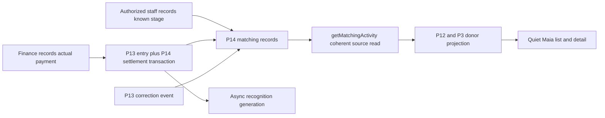

> Historical research record adopted for AL-1563. Scope and testing are ratified; earlier pending decisions and research-only workflow restrictions below preserve chronology. The [implementation specification](../../phase-25-donor-dashboard-depth.md) and its owner contracts are the implementation authority for this proposal. No historical synthetic/source check certifies target runtime behavior.

> **Fully ratified, 9 September 2026:** Conrad accepted Q28 A1–A5/J01–J18/V01–V14/C01–C22, reviewed Maia defaults and all source safeguards. Earlier proposed/unanswered wording below is historical. T01–T20 and source activation remain required proof; this ratification does not certify implementation or a live employer integration.

# Q28 — Known employer-match progress and received matches

9 September 2026. **Disposition: Accept with required amendments.** Conrad selected A. The corrected execution below is ready for ratification; Q01–Q27 remain ratified. This is a completed decision review, not a claim that the matching service or donor view has been implemented.

**Feasibility verdict:** yes, as a read-only view of the organization's own matching records. It needs no employer database, matching vendor subscription or live employer integration. Authorized staff record known stages; actual posted matching payments and corrections supply money facts. Core already specifies those owners, but the inspected source does not implement the required matching models/read service. The permanent path is to complete that source and its protected donor projection before adding the interface.

The [evidence companion](phase25-r28-evidence.md) contains pinned source references, current technical/vendor research, actual checks and proof limits. Every requirement below is proposed controlling language. Illustrative donor scenarios are not observed ministry research. Severity/likelihood are credible implementation risks, not production incident rates.

## What actually makes the feature work

An illustrative ordinary path is Maria's $100 gift and a separate employer-match request. Staff learn from existing correspondence that she filed it and record the filed stage under P14. The portal can then say **Request recorded as submitted**. It cannot say the employer approved it, scheduled payment or owes Maria a balance.

Later, finance records the actual employer/intermediary payment using P13's normal entry transaction with P14 settlement links. The donor projection can show **Match funds received — USD100**, under its own exact amount permission. This is not another $100 of Maria's legal giving, and it does not give her the payer's receipt or other employees' details. If only USD50 arrives, it shows USD50 received without calling the possible match complete. A subsequent posted correction changes the effective received amount through its source owner.

Here, a matching settlement is the source link between a match record and a posted contribution line; it is not a guarantee of irreversible bank clearing. Any provisional tender admission and later return remain governed by P13/P14, without a new waiting period or raw payment-status shortcut.

This is the target architecture. The final arrow to the donor is read-only; the portal neither records employer submission nor processes money. Recognition generation is a separate eventual result, not a gate that can delay a coherent received-match view.

The strongest alternative is received-outcomes-only: fewer interim states and less freshness burden, but no view of already recorded requests during the wait. A is retained because that information can be useful without adding donor chores. This is a product judgment; no Asym support-reduction or retention statistic has been measured. External documentation supports the recorded-versus-external distinction, not guaranteed employer telemetry. [Double the Donation status definitions](https://support.doublethedonation.com/knowledge/what-do-donor-the-different-donor-statuses-mean), [manual status updates](https://support.doublethedonation.com/knowledge/how-to-update-the-status-of-a-donor).

## Corrected decision to record

### A1 — Native source facts, with precise recorded meaning

Phase25 SHALL expose known progress and received/corrected outcomes for source-qualified employer-match records through **getMatchingActivity**, the sole P14 consumer interface. Complete P14's existing staff tracker and P13 settlement/correction substrate; do not create a second tracker, writable portal projection, status webhook shortcut or browser money fold. P14/ADR0006's rung-2 vendor-independent boundary remains binding. A future certified producer may enter through P14/P31's typed socket; no connector or live external coverage is promised or required for this staff-recorded release.

Staff record an identified possible match through P14's existing capture, and a submitted stage only when they have a legitimate basis that a claim was filed. Their authorized source transaction and existing polymorphic audit event record who changed the stage and when; an existing source evidence reference may support the basis. No compulsory upload, new proof inbox, employer login or second approval ceremony is added. A staff note, employer-name collection or employment edge alone cannot claim a request was submitted. The donor view receives safe recorded facts and relevant source timestamps, never raw correspondence, notes, staff names, file attachments or provider payloads.

State-recorded time is distinct from external filing time and read time. A transition recorded today for a claim filed earlier does not imply it was filed today. Display an external date only if its independently qualified source fact exists. Editing program notes, refreshing the page, replaying a job or importing an unchanged record cannot make a status appear newly checked with the employer. No new `employer_verified`, approved, processing or completed domain state is created.

P14's six states remain: identified, submitted, received, reversed, closed and superseded. Identified is an organization's recorded possibility, not the donor's submitted request, a request to pay or a task. Received requires actual effective settled money; the first installment is not full program completion. A staff-set deadline does not automatically expire or close a record. A closed or reversed record can receive later real money; a superseded duplicate cannot reopen. Only the source owners may make those transitions.

### A2 — A deliberately authorized own-employee projection

**Explicit donor-exposure amendment:** P14 SHALL declare a narrow read-only own-employee matching capability/projection, and P12 SHALL enforce it with the existing P3/P10 field and sensitive-person floor. Policy/census widening uses the existing classifyChange/maker-checker activation path. That is a configuration/release safeguard, not approval for every donor read. It grants no finance:manage_matching_gifts, contribution-posting, request-editing or employer-verification power.

Resolve current Tenant, human Auth identity, stable Person/claim binding and exact employee-party scope server-side. No email match, surname, household membership, employer/org-contact role, source gift ownership or presence of an async matched_employee credit substitutes for this permission. Q04's represented giving remains distinct: this view concerns the signed-in person's own admitted matching records. It must remain usable when the person has no local legal-origin gift, without manufacturing a donor/financial record.

Admit record existence, employer-program label, stage, status time, received amount partitions, payment detail and origin/successor links independently. Employment links are sensitive; restricted records are omitted according to the controlling floor, without aliases, hidden-row counts, search hints or parent-payment totals. A record capability is not permission to read the payer's whole batch, another employee, a receipt or staff funnels. The credited_party_visible convention does not automatically authorize pre-receipt pipeline records; the new own-employee projection is independently qualified.

For amount display, the source must prove a complete permitted aggregate for that match/receiving-Legal-Entity-or-issuer/currency partition under the declared projection. If it cannot, omit the amount and use a safe limited result; do not sum a visible subset and call it the match total. Source-qualified payment presence and an amount are distinct permissions. Origin links require independent current gift access; null, pre-platform, DAF-paid, hidden or no-longer-accessible origin is valid and creates no fake history row. No church_member, general DAF/household recognition, tribute wall or payroll-giving expansion is included.

### A3 — Coherent status and money, with the source contradictions resolved

getMatchingActivity SHALL assemble each result from one coherent basis: expectancy identity/state revision, settlement membership, each contributing header's effective_seq and the currently applicable projection. Use one database statement or a bounded transaction with an appropriate repeatable snapshot; several Read Committed queries are not one snapshot. A financial snapshot is not lasting authorization: current egress permission must still be enforced. The source emits an opaque coherent basis descriptor; raw internal header/employee identifiers and audit bodies do not leak to the client.

If P13 has committed a correction while P14's event consumer has not reconciled the stage/membership basis, return a scoped **Updating match information** result or separately proved safe facts. Do not pair a stale received state with a newly zero amount, infer denial from lag, or manufacture a transition in GET. Recognition may lag independently: a coherent settlement/state result must remain visible even when credit generation is paused. Fix a stalled owner consumer through the existing P8 data-health path, not a donor refresh loop or new money calculation.

**Required P14 execution clarifications:**

- Actual received amounts derive only from effective settlement-linked lines, with original currency and exponent. The junction stores no copied amount. Partition by source-certified receiving Legal Entity/issuer and actual currency, with independently admitted partition scope, using integer minor units and safe transport/display types; never sum unlike currencies or use JavaScript floating-point arithmetic for the fold. Expected amount/currency is advisory and cannot constrain or substitute for actual settlement currency. Canonicalize the advisory field name as expected_currency, paired with expected_amount_minor when an advisory amount exists; the G.1 generic currency name and model name must be reconciled.
- Received means at least one positive effective currency partition. Reversed requires prior actual receipt and every actual issuer/currency partition fully unwound to zero; a negative partition is an invalid source result requiring repair, not a refund obligation for the donor. A positive partition prevents an ordinary identified/submitted/closed transition from concealing received funds. Partial reversals remain received with adjusted facts. These are source invariants, not new states.
- Protect INSERT and both OLD/NEW UPDATE state combinations, settlement insert/update/delete/repoint and the owning commands. A trigger that checks only a new assignment to received/reversed leaves direct insert and received→closed escapes. Use the established locked function/role boundary, P13 contribution lock and deterministically ordered expectancy locks, with current capability checks and lock timeout. The donor gets no mutation grant. A caller-controlled flag or state field is not privileged-function proof.
- Staff-entered received work remains one ordinary P13 transaction: header, lines, settlements, state and audit. No staff saga or provider gate is added. Credit generation remains the existing idempotent asynchronous path. At-least-once P13 events re-fold current truth; a stale/double event cannot reapply an inverse, remove a newer receipt or generate duplicate credit/message effects.
- Enforce composite Tenant/header/line/expectancy/Party relationships, one expectancy per settlement line, and no hidden header-wide attribution. Keep all valid multiple installments/lines. Supersede-merges must have the same Tenant, source-proved real employee (including only approved identity repair), and source-certified employer-program meaning; be cycle-free, audited and atomic for settlement reassignment/current read lineage; and never match by similar amount/name/date. Prior actual receipt and all zero-effective historical settlement links survive in the canonical lineage. Merging a fully reversed record into an identified duplicate must preserve the received/reversed history and coherent zero outcome, rather than relabeling it as a never-funded possibility. No portal everReceived flag or history copy is added. A successor is linked only when independently admitted.
- Resolve conflicting matching import identities to the logical pair **(Tenant, external_source, external_ref)**, with both external fields present together or absent, and uniqueness for complete pairs. The source namespace is the stable qualified P30/producer identity, never a fresh upload filename or transport-attempt ID. This narrow P14 matching clarification reconciles G.1 with later single-reference shorthand; it does not change every credit/tribute table or introduce a vendor. Reimports and producer retries resolve one business identity and preserve source provenance. Historic imports generate no new credit, thank-you, receipt or donor notification merely because the portal now reads them.

P14's protected mutation/query contract, grants, ENABLE/FORCE RLS, API/RPC views and service-role paths need actual SQL proof. P12 remains the sole fine-grained PDP. USING checks existing rows and WITH CHECK checks new/result rows where applicable; PostgreSQL can inherit USING as WITH CHECK, so omission alone is not a vulnerability. Neither RLS nor FORCE RLS eliminates privileged-role risks: structural constraints, grants and current server authorization remain necessary.

### A4 — One quiet complete donor route, including records with no origin gift

Use **Giving history → Employer matches** as a conditional secondary link in personal context, opening one small full-page list and exact detail route. This is an explicit navigation addition within the existing giving area, not another top-level menu, a row in legal giving, or a mandatory Home module. A source-admitted exact origin-gift detail may link to the same match record. Do not require that route as the only entrance: legitimate matches can have no visible local origin.

No admitted records means no ordinary Employer matches link/card/icon/count/placeholder/spacer or promotion. Presence is source-qualified, not a stored hasMatches flag, recognition-counter test or capped personal-gift query. Unknown presence omits unproved optional chrome without storing or claiming none. An explicitly opened matching route can show its truthful empty, denied or unavailable result with existing safe help; that task response is not feature promotion.

Default list: all available source-admitted canonical matching records, newest immutable creation order with a stable ID tie-breaker, **twenty records per source page** and accessible Load more only when continuation exists. No default filters, global amount/count, percentage, chart or staff pipeline grid. Filter/admit/canonicalize before paging. Include closed/reversed history and material corrections; superseded duplicates resolve through the same authorized canonical record rather than appearing twice. Stable order avoids moving an old match to the top on note edits or background updates. This is a proposed product default, not a measured optimum.

Each row shows its safe employer-program label, plain-language recorded stage, a qualified status-recorded date when available, and admitted received facts only. Detail shows the same current facts, concise meaning, permitted payment entries and optional authorized original-gift link. A received amount is labelled **Match funds received**, separate from **Your gift**. If multiple receiving-issuer/currency partitions exist, present separate independently admitted labelled rows, never a combined total. Payment-detail continuation is independently bounded and authorized; the current aggregate is never a sum of the loaded page. No donor receipt button for the payer's gift, report export, expected amount, ratio or guarantee is added.

A quiet **About employer matches** disclosure explains that the page reflects the organization's recorded information, request submission is not approval, and received installments do not certify completion. It includes P14 G.14's exact required sentence once: **“Many programs exclude gifts to religious organizations — a match is never guaranteed.”** No repeated red warning or default double-your-donation banner. This explains program eligibility; it does not cast doubt on a source-proved payment already received.

Keep matching information out of Q12's current-action section and Q17's notification catalog by default. This view creates no new email, bell key, task or acknowledgment occurrence. Existing P14 thank-you eligibility and P17/P6/Email Studio delivery remain separately owned; merely viewing, importing, correcting the display or enabling Q28 sends nothing. No Resend call or automatic donor request submission belongs in the read path.

A portal read is not a new credit-freeze trigger or acknowledgment release. Existing required access audit and minimized security diagnostics remain separate from matching state; they do not justify a raw donor-facing audit timeline.

### A5 — Bounded implementation, adoption and proof

Use the shared packages/api business seam and a minimal protected server read model through approved hooks/TanStack Query. Tables/DB collections do not become raw browser access to employment or finance. Keep UI state local; this small list does not require a Table/Virtual/Store dependency migration, a persisted client database or a generic matching service bus. ReUI remains inspiration for actual grids elsewhere. Shared exact base-maia/Base UI/Zinc semantic tokens remain the product system.

Add the necessary **(Tenant, employee Party, immutable creation order, ID)** access path as an explicit Q28 consumer amendment to P14's fixed v1 index inventory; the staff employer/open index does not serve the donor query. Prove parent and settlement-detail queries with realistic cardinality. Do not fetch every employer payment, personal gift or audit event to hide most of it in the browser.

Read state SHALL be partitioned by authenticated context, Tenant, Person, view/record, cursor and projection/basis versions. Clear private state on sign-out/context change; cancel and fence late responses. No URL contains employment details, raw provider IDs or private filters; opaque route IDs grant nothing. No persistent offline cache, localStorage mirror, public SSR/CDN cache, analytics/session replay content, platform search/AI indexing or new donor export exists. Do not imply a revoked user can be made to forget data previously returned. Current authorization is enforced on each new read.

Revalidate on navigation, explicit retry, context change, relevant owner invalidation and return to the foreground. No continuous polling or employer-like live indicator is needed. Until revalidation finishes, any retained same-context snapshot must be clearly prior data and never shown under a different context. Current Core defaults disable focus refetch; the qualified matching hook must not inherit that blindly. Use the existing query client, not a second client or global configuration change.

Q28 creates no new raw narrative, audit ledger or retention regime. Its transient projections expire under the scoped client/server cache lifecycle; source matching/financial/audit records stay with P14/P13 and their qualified purpose schedules. P14 has not established a blanket employment-record retention period: classify those source records before activation rather than importing Q27's postal24h/365d timers or assuming indefinite storage. Required source history, privacy/holds, donor access and physical disposal remain different facts; retired credentials or portal access never authorize record destruction.

Adopt the canonical owners before the donor UI. Reconcile the exact P14 state-wall, currency, external-identity, donor-exposure, basis and employee-index amendments; imported received/reversed or other prior-receipt claims require qualified settlement-linked ledger and correction provenance. Source-proved pre-receipt records need exact employee/program/stage provenance and remain valid without any fabricated financial record. Activate the donor read path only after source and real authorization/correction tests pass. A kill switch withdraws only the donor projection/navigation, leaving native staff operations, ledger facts, source corrections and separately qualified thank-you behavior intact. Old code may not overwrite the target model during mixed-version rollout. No runtime implementation or publication is authorized by this grooming review. Q14 G01 remains unresolved independently.

## Donor-visible state language

These are presentation labels for existing source facts, not extra lifecycle states. Do not show a six-step progress bar: the source can move backward, close, reopen on late money or merge duplicates.

<!-- prettier-ignore -->
| Source condition | Primary wording | Meaning and limits |
| --- | --- | --- |
| identified, admitted | Possible match recorded | The organization recorded a possibility. Nothing has been recorded as filed; no donor task or expected dollars. |
| submitted, admitted/coherent | Request recorded as submitted | Filing is recorded by the organization. It does not prove employer approval, payment processing or a scheduled arrival. |
| received, coherent positive settled partition | Match funds received | Show only admitted effective currency amounts. At least one payment arrived; not necessarily the entire possible match. |
| received after partial correction | Match funds received | Current amount plus a concise admitted adjustment explanation; no duplicate gift or silent original-value overwrite. |
| reversed, prior receipt and all effective partitions zero | Match payment reversed | Source-recorded received funds were fully unwound. This does not reverse Maria's own original gift or claim she owes money. |
| closed | Tracking closed | Default explanation: [Organization] closed this match record. Optional Recorded as declined or a source-recorded deadline explanation requires that precise donor-safe fact. Generic denied/expired does not prove an employer decision or actual program deadline. No staff free text. |
| superseded | Record combined | Exact direct-link recovery to an admitted canonical successor. No extra counted/listed match or permission inherited through the link. |
| mixed/stale financial basis | Updating match information | Source outcome is not yet coherent; show independently proved facts only. No fabricated zero, denied state or endless simulated progress. |

Status date means the source recorded that stage/change. A separate **Information checked** timestamp, if displayed for read refresh, must be explicitly distinct and must never imply the employer was checked.

## Mapped donor journey

<!-- prettier-ignore -->
| ID | Situation | Required outcome |
| --- | --- | --- |
| J01 | Enter personal Giving history | Existing legal-gift list and filters remain unchanged. Qualify optional match presence independently of gift rows and personal totals. |
| J02 | No admitted match | No ordinary match UI artifact. Exact-route empty state says no match records are available here, not that the donor never filed with an employer. |
| J03 | Unknown presence | Omit unproved optional chrome; diagnose source failure internally. An opened matching route offers a local retry rather than a fabricated empty result. |
| J04 | Open Employer matches | Show a real heading, one short source-meaning sentence and the bounded read list. No new top-level navigation or onboarding task. |
| J05 | Identified possibility | Say Possible match recorded. Do not turn a staff entry into “You submitted” or “Action required.” |
| J06 | Recorded submission | Show Request recorded as submitted and supported record time. No approval checkmark, progress percentage, outstanding amount or estimated payment date. |
| J07 | No new source updates | Keep the truthful recorded stage/date. No aging red badge, countdown, auto-close, notification or repeated instruction to contact staff. |
| J08 | First actual payment | Show the coherent admitted received amount immediately, even if recognition generation is paused. Preserve separate original-gift and payer-document rights. |
| J09 | Installments/splits/multiple currencies | Show effective amounts per admitted receiving-issuer/currency partition; detail lists admitted payments with bounded continuation. Never equate first receipt with completion or sum unlike units. |
| J10 | Partial/full reversal | Reflect source correction and safe explanation; partial remains received, full unwind reversed. Do not reverse the origin gift, create donor debt or keep a stale received celebration. |
| J11 | Tracking closed then late funds | Human closure has safe wording. Actual later settlement re-enters received through source, without erasing the earlier recorded history or claiming an automated employer approval. |
| J12 | Duplicate merged | Canonical list shows one admitted record. A prior exact link resolves safely to current record or gives the ordinary unavailable outcome without exposing the successor. |
| J13 | Open from original gift | Use the same match detail; Back restores the original gift/history context. Match permission does not confer new origin access. |
| J14 | Null/hidden/pre-platform origin | Independent list/detail remains usable. Omit unavailable origin link and sensitive reasons; do not create a fake gift or ask for duplicate personal data. |
| J15 | Query/correction reconciliation failure | Preserve only qualified prior/safe facts, distinguish Updating from error/absence, and give one Retry action. A retry reads; it cannot mutate state or resend acknowledgment. |
| J16 | Need explanation or correction | About explains limits and eligibility; existing organization help is available in detail. No new donor dispute/request inbox, employer portal login or status editor. |
| J17 | Context switch/access change | Clear private list/detail state, reauthorize and fence late responses. Represented organization context does not expose coworkers or switch the employee subject. |
| J18 | Mobile/keyboard/return visit | Stable order, full meaningful text, visible focus, accessible continuation and restored position. Revalidate source on return without a live-tracking animation or routine donor notification. |

## Maia presentation defaults

These are product defaults for ratification. Current shared component code and browser proof still need verification; names such as CardTitle or ItemDescription do not themselves guarantee heading semantics or unclipped material facts.

<!-- prettier-ignore -->
| ID | Default |
| --- | --- |
| V01 | One conditional secondary Employer matches link in personal Giving history; no bell badge, amount count, new top-level tab or Home status card. |
| V02 | Full-page simple list/detail, with an accessible Back link preserving the original context. No modal tracker or fake original gift. |
| V03 | Twenty source roots per page; explicit Load more only with continuation. Stable immutable creation ordering, no auto-resort on state/note changes. |
| V04 | One safe employer-program label, plain stage and qualified recorded time. No company logos fetched from an external domain or inferred employer branding. |
| V05 | Match funds received is the monetary label. Separate receiving-issuer/currency rows with independent permission; unknown/withheld is not0. No expected-dollar, ratio, completion bar or personal-giving total. |
| V06 | Current status first; concise material explanation and admitted payment records in detail. No raw staff audit timeline or correspondence dump. |
| V07 | Long employer/ministry text and material correction wording wrap fully; do not inherit the shared Item two-line clamp for essential meaning. |
| V08 | Real headings/lists/links, shared Maia tokens, Base UI disclosures and shared Button. No alternate primitive base, app-local component fork or dense staff grid. |
| V09 | Neutral labels for identified/submitted/closed; color never carries meaning alone. No red aging state or animated success for a source read. |
| V10 | About employer matches disclosure contains source-knowledge limits and P14's exact religious-exclusion/no-guarantee sentence once. Normal received facts remain affirmative. |
| V11 | Safe generic loading/error feedback is allowed on an explicitly requested matching route before admission resolves; private content requires admission. No optional placeholder advertised to a donor with no known record. |
| V12 | One polite announcement for meaningful refreshed results; no live-region announcement per row, surprise focus movement or reading-position reset. |
| V13 | Responsive at320 CSS px/400% zoom, international currency/date formatting, RTL/CJK names and mobile keyboard/assistive navigation. UTC storage timestamps are localized as record times, never recast as gift tax dates. |
| V14 | Shared touch targets/focus/contrast/reduced-motion rules; no nested interactive whole-row controls. Test with keyboard, screen reader and actual mobile layout, not axe alone. |

## Independent adversarial review

### C01 — Problem validity, necessity, and alternatives

**Material concern: Yes. Severity: Moderate. Likelihood: Plausible.** A new tracker could solve an invented donor task or duplicate staff work. P14 J.4 explicitly reserves donor match progress and the selected A values visibility during the waiting period, but no Asym demand study proves a broad matching product is needed. Received-only is the strongest simpler alternative. **Effect:** retain A as a narrow read, not an integration or new task workflow. **Required language:** “Expose source-recorded own-employee progress through the existing owner; create no donor submission, promotion, reminder or matching operations product” (A1/A4). **Proof:** T01/T16/T20; the donor can explain the recorded stage without believing a new action or guaranteed match exists.

### C02 — Brittleness

**Material concern: Yes. Severity: High. Likelihood: Likely if generic pending/complete labels are copied.** A form click, staff note or first installment can be misread as filed/approved/fully paid. Source G.2 and detailed vendor documentation distinguish these facts. **Effect:** changes semantics and freshness, not the selected direction. **Required language:** “Map only the six source states; record time is not external filing/approval time, and received is not program completion” (A1/state table). **Proof:** T02/T03/T09 with identified, recorded filing, partial receipt, note-only edit and stale submitted fixtures. No elapsed timer or lack of update may invent another state.

### C03 — Technical debt

**Material concern: Yes. Severity: High. Likelihood: Likely if a card is added over legacy donor data.** No target matching source/service exists in the scoped source; copying arbitrary metadata or recognition credits into a mutable portal tracker creates duplicate authority. **Effect:** requires owner-first completion, not a prototype shortcut. **Required language:** “getMatchingActivity owns the result; the portal consumes a finite protected read projection and persists no matching status, balance or credit copy” (A1/A5). **Proof:** T01/T17/T20 and source-boundary checks. Complete existing P14/P13 tasks before activation; source absence does not justify a fallback derived from donations.employer text or legacy gift arrays.

### C04 — Edge cases

**Material concern: Yes. Severity: High. Likelihood: Likely across real batch/installment use.** Null origin, employer intermediaries, split payments, pre-platform gifts, quarterly installments, late money after closure and reversed-then-merged records break an origin-row-only or one-payment model. They are explicitly supported source cases, not speculative ministry workflows. **Effect:** broadens exact journey/proof while keeping the interface small. **Required language:** “Provide an independent matching route; preserve admitted canonical lineage, installments, historical zero-effective links and separate payer/origin facts” (A3/A4/J09–J14). **Proof:** T03–T06; a legitimate match without a local origin is reachable and the same payment cannot become two matches.

### C05 — Footguns

**Material concern: Yes. Severity: High. Likelihood: Plausible.** A donor-facing stage selector, receipt button or double-your-gift total can mutate staff truth, expose the payer's document or inflate personal giving. Current third-party controls are not Core permissions. **Effect:** forbids unintended authority and effects. **Required language:** “The match view is read-only; recognized/requested matching grants no origin/payer receipt access, personal money increase, donor deadline or automatic message” (A2/A4). **Proof:** T07/T11/T14 assert denied mutation routes and no receipt/credit/mail creation on view, refresh, import or UI activation. Corrective help is existing organization assistance, not a hidden finance command.

### C06 — Tenant safety

**Material concern: Yes. Severity: Critical. Likelihood: Plausible without exact scoping.** A shared login, reused cursor or employer-wide query could disclose coworkers or another Tenant. Sensitive relationship existence itself is data. **Effect:** requires layered exact own-person scope. **Required language:** “Resolve Tenant/Person/employee scope server-side; independently authorize roots, partitions, links and continuation; cancel and fence old-context results” (A2/A5). **Proof:** T07/T08/T13 with same email in two Tenants, represented organization context, same employer coworkers, old cursor and revoked grants. No list count or alias leaks an omitted restricted record. M1 tolerates zero actual cross-scope disclosures.

### C07 — Database, RLS, and authorization safety

**Material concern: Yes. Severity: Critical. Likelihood: Plausible given the incomplete target guards.** G.2's UPDATE-only wording leaves insert and received→closed escapes; weak settlement FKs/reparenting or permissive privileged paths can misattribute funds. FORCE RLS is not a service-role guarantee. **Effect:** explicitly strengthens P14 execution before any donor read launches. **Required language:** “Guard INSERT and OLD/NEW transitions, all settlement mutations and resulting aggregate invariants with tenant-aware keys, restricted execution and current P12 checks; enforce one line per expectancy link and prohibit unsafe reassignment” (A3). **Proof:** T04/T07/T08 use actual SQL roles, grants, USING/WITH CHECK, definer search_path/execute rights, direct service-role attempts, malformed values and denied foreign links. Omitted WITH CHECK alone is not a defect.

### C08 — Overengineering

**Material concern: No additional material concern in the corrected design.** Checked a vendor purchase, employer database, autosubmission, raw-event archive, generic tracker, state machine expansion, proposal queue, grid and additional message family. None is needed for this read-only product. The small employee projection, safe access path and source consistency amendments close actual gaps. **Effect:** accept the lean source-consumer architecture. **Required language:** “Preserve ADR0006 rung2 and the no-overengineering rider; do not introduce another tracker, source table or connector to display known facts” (A1/A5). **Proof:** T17/T20 dependency and ownership review; optional enhancements need their own evidenced scope.

### C09 — UX/UI and user friction

**Material concern: Yes. Severity: Moderate. Likelihood: Likely without a full journey.** A universal Matches card, red old-request badge, buried null-origin record or six-stage progress bar creates noise and incorrect expectations. Existing shared components may clamp material text or lack heading semantics. **Effect:** requires the conditional secondary route, state copy and Maia defaults. **Required language:** “Use one small list/detail, no artifacts for ordinary no-record contexts, full meaningful text and no donor chores; an explicitly requested route has safe truthful recovery” (J01–J18/V01–V14). **Proof:** T15/T16 cover mobile, keyboard, screen reader, low bandwidth, no-origin and recorded-not-approved comprehension. No claim of perfect usability is made without donor task evidence.

### C10 — Source of truth, ownership, and domain invariants

**Material concern: Yes. Severity: High. Likelihood: Likely if expected, settled and recognized amounts are combined.** Expectancy is not money, settlement links carry no amount, recognition is async and the actual payer may be an intermediary. Mixing them creates false giving, duplicated money and incorrect receipts. **Effect:** requires independent owner facts and coherent read basis. **Required language:** “P14 owns matching state/linkage, P13 effective lines own received money, P7/P18 own legal documents, and async credits remain separate; no portal fold or new authoritative counter” (A1–A3). **Proof:** T03/T05/T11 compare per-issuer/currency source results, partial partitions and current documents without relying on a browser sum or recognition availability.

### C11 — Hidden coupling

**Material concern: Yes. Severity: High. Likelihood: Plausible.** Requiring a recognized-credit row, visible local origin or external employer connection before showing a valid received outcome hides real progress. Joining through a payer header can expose its entire batch. **Effect:** removes those dependencies. **Required language:** “Own-employee admission and coherent settlement facts do not wait for credit generation or origin visibility; the donor view has no employer/provider round trip and no header-wide grant” (A2–A4). **Proof:** T01/T06/T10 with credit generator paused, null/hidden origin, multiple employees and absent connector credentials. Existing acknowledgment may run independently; reading cannot retry it.

### C12 — Failure modes

**Material concern: Yes. Severity: High. Likelihood: Plausible.** Payment correction can commit before the matching consumer catches up, or a page can display half of two snapshots. A misleading zero or stale received label matters more than a short scoped unavailable state. **Effect:** requires coherence detection and truthful recovery. **Required language:** “Bind state, membership and each contributing header version to one coherent result; mismatch returns Updating/safe facts and owner diagnosis, never a fabricated transition or zero” (A3/J15). **Proof:** T09/T10 inject lost/out-of-order events, source read failure, stopped consumers and correction during query. Same-page Retry is read-only; owner recovery re-folds current durable truth.

### C13 — Lifecycle, temporal correctness, concurrency, and idempotency

**Material concern: Yes. Severity: High. Likelihood: Plausible.** Staff close may race with payment; two clerks may link one line twice; old correction events may undo later receipts; merge may drop prior fully reversed receipt history. P14's constraints and deterministic locks address part but require the A3 clarifications. **Effect:** strengthens existing transitions, not new donor lifecycle. **Required language:** “Positive effective money cannot be hidden by close; zero reversal requires prior receipt across canonical lineage; duplicate events/merges preserve one effect and re-fold current state under the owner guard” (A3). **Proof:** T04/T05/T09 enumerate both race orderings, multi-header version changes and reversed A merged into identified B. Recorded timestamps do not become gift tax dates or employer clocks.

### C14 — Data integrity risks

**Material concern: Yes. Severity: High. Likelihood: Plausible.** Conflicting external-key definitions allow collisions; advisory currency can be mistaken for actual currency; reimports can duplicate requests or issue acknowledgments; naïve merges can transfer another employee's money. **Effect:** requires matching-specific source contract reconciliation. **Required language:** “Use complete namespaced external identity pairs, exact Tenant/real-employee/program merge semantics, expected_currency naming and actual receiving-issuer/currency folds; preserve source-qualified historical links” (A3). **Proof:** T03/T05/T12 with equal external_ref across sources, half-filled identity pair, same-name employees, mixed currencies, DAF origins and repeated historic import. No schema field or imported status alone establishes received money.

### C15 — Security and privacy risks

**Material concern: Yes. Severity: Critical for restricted people. Likelihood: Plausible.** Employment can be leaked by presence/counts, staff notes, cache reuse, external logos, telemetry or search/AI. A global nonprofit knowledge table or public URL would widen disclosure without purpose. **Effect:** requires minimized own-employee projection and no new durable copy. **Required language:** “Honor P14 sensitive/census/search exclusions, P10 floors and current P12 egress; never expose staff bodies, coworker detail or raw provider material; qualify source retention separately from donor access” (A2/A5). **Proof:** T07/T13/T18 checks API, cache, rendered DOM, diagnostics, export/search/AI and source disposal/hold behavior. A portal read is not consent to publish employment or permission to keep it forever.

### C16 — Scalability and performance risks

**Material concern: Yes. Severity: Moderate to High. Likelihood: Plausible with staff-oriented indexes or unbounded joins.** Fetching all employer payments/audit records to select one donor scales poorly; paging legal gifts first loses null-origin matches. P14's fixed staff index inventory lacks the new employee-order path. **Effect:** adds one justified consumer index and bounded query contract. **Required language:** “Admit/filter/canonicalize roots before twenty-record paging, use employee-first access and bounded settlement continuation, and return complete source aggregates independent of loaded detail pages” (A4/A5). **Proof:** T19 at the explicit workload below; compare plans and query counts, not just UI responsiveness. Do not freeze an implementation into endless page scans or claim virtualization solves database cost.

### C17 — Operational burden

**Material concern: Yes. Severity: Moderate. Likelihood: Likely if recorded status is sold as live tracking.** Staff would be expected to keep an employer telemetry dashboard current without a feed; donors might chase healthy long-running requests. P14 assigns one age-bucketed worklist to development staff, not per-row reminders. **Effect:** makes knowledge limits and ownership explicit. **Required language:** “Staff maintain their existing tracker; the portal exposes recorded time, never a freshness promise, payment SLA or new donor action. Source lag and human follow-up are different signals” (A1/A4/A5). **Proof:** T02/T16 plus M2/M4; an old submitted date alone creates no alert or state change in the portal. Existing staff worklists handle review without SQL repair or a new support inbox.

### C18 — Observability and auditability gaps

**Material concern: Yes. Severity: High. Likelihood: Plausible.** A generic updated_at could imply employer verification, while sparse event diagnostics can conceal failed corrections or duplicate imports. Copying audit bodies into the donor view adds privacy risk. **Effect:** requires owner audit attribution and separate safe presentation metadata. **Required language:** “Use meaningful source stage/settlement evidence, exact coherent basis and safe operation/cursor correlation; never use notes/page-read timestamps as status provenance or return raw audit history” (A1/A3). **Proof:** T02/T09/T18 verify business evidence survives retries and timestamps remain truthful. M1–M5 name signals, thresholds, accountable roles and responses; monitoring never substitutes for release proof.

### C19 — Dependency and integration risks

**Material concern: Yes. Severity: High. Likelihood: Likely if vendor examples are treated as native capability.** DTD/Benevity can know different submission/payment facts through different contracts. Their manual Complete control and automations do not fit P14's settlement-only received wall. **Effect:** preserves vendor independence and source semantics. **Required language:** “No vendor subscription/feed is required or implied; typed future ingress remains P14/P31-owned, with trusted registration tenancy, dedupe and no synchronous match/no-match echo” (A1/A3). **Proof:** T11/T12/T17 confirm operation with no connector, malformed future producer quarantine and no ad hoc raw Stripe match-state mutation. Revalidate adapters only when later actual integration scope is authorized.

### C20 — Migration, rollout, and upgrade risks

**Material concern: Yes. Severity: High. Likelihood: Likely if enabling presentation before the source.** Current models are absent; creating status-only historical received rows, broadening old grants or rolling back to a legacy reader can fabricate matches and leak data. **Effect:** requires source/permission/coherence-first activation. **Required language:** “Migrate qualified identity/stage provenance for every record and ledger/settlement lineage for any present/prior-receipt claim; resolve ambiguity before exposure; keep old writers/readers from becoming fallback authority. Disable only the new view on rollback” (A5). **Proof:** T12/T17 exercise interrupted imports, mixed code/schema, new source after UI disable and permission narrowing. Existing received thank-you and money processing retain their independent controls; no broad dependency upgrade accompanies this grooming decision.

### C21 — Testability, traceability, and proof

**Material concern: Yes. Severity: High. Likelihood: Likely if ‘possible’ is equated with shipped.** Named forward interfaces and vendor screenshots can be mistaken for a working donor journey. Source contradictions can remain hidden across issue bodies, PRDs, OpenSpec and tests. **Effect:** makes exact amendments and evidence gates mandatory. **Required language:** “Trace A1–A5/J01–J18/V01–V14/C01–C22 to owner contracts, glossary, OpenSpec, future work and T01–T20 release evidence; distinguish intended, implemented and observed behavior” (A5). **Proof:** T20 validates the complete chain, with real SQL/race and manual accessibility evidence for the actual target. No nonexistent implementation, unrelated unit tests or external product behavior can close those gates. Q14 G01 remains unresolved.

### C22 — Other development hazards

**Material concern: No additional material concern after this scoped review.** Checked payroll/volunteer/tribute/DAF scope creep, employer-program eligibility assumptions, accidental donor submission/resubmission, raw communications, legal receipts and premature implementation/publication. Their actual risks are assigned concrete source, privacy or UI controls above; no extra generic safety subsystem is justified. **Effect:** accept only the corrected exposure scope. **Required language:** “Q28 adds a donor read view and the identified source prerequisites; it does not expand other recognition programs or authorize live provider/financial actions.” **Proof:** T11/T17/T20, plus final source and artifact preservation checks. This verdict does not certify unbuilt code.

## Target acceptance and release proof

No target test is claimed here. The following are falsifiable test families for the actual implemented owner and donor seam, using synthetic fixtures and the repository's real harness.

<!-- prettier-ignore -->
| ID | Required outcome |
| --- | --- |
| T01 | Native staff capture→record submitted→P13 received entry→protected donor read works with no employer connector; current source APIs/migrations actually exist and are invoked. |
| T02 | Identified is not submitted/approved; stage-recorded time survives note edits, refresh, reimport and delayed recording; a staff basis does not imply employer telemetry. |
| T03 | Positive/zero/invalid negative folds by actual receiving issuer/currency, JPY/BHD exponents, integer precision beyond JavaScript safe range, partial amount admission and no expected-money/FX/personal-total contamination. |
| T04 | Real SQL guards: INSERT received/reversed, received→closed/identified, direct settlement mutation/repoint, wrong Tenant/header/line/employee, same-line duplicate, unsupported type/default and unauthorized definer execution all fail appropriately. |
| T05 | Two concurrent clerks, close-versus-payment, duplicate merge race, cycles, same-name different employees/programs, reversed A→identified B merge, zero-effective history retained and canonical successor late receipt. No double-count or lost receipt history. |
| T06 | Null, hidden, pre-platform and DAF origin; mixed payer/intermediary batch, multiple employees/lines/installments; correct independent read route and no payer receipt/coworker/header leak. |
| T07 | Current P12/P3/P10 own-employee grant versus household/employer/represented role, field/amount/issuer partitions, root/list/one-record scope, revocation, signed-in/no-financial-record person and restricted employment floors. |
| T08 | Grants, ENABLE/FORCE RLS, USING/WITH CHECK, views/RPCs/storage and service-role/definer bypass paths on the actual schema; no raw browser mutation or caller-controlled actor/Tenant/proof. |
| T09 | Lost/duplicate/out-of-order P13 correction events, multiple headers with independently advancing effective_seq, new settlement during read, async state lag and origin reversal; coherent result or safe Updating, never stale received+$0 or wrong close. |
| T10 | Credit generator stopped/lagging/disabled while coherent settlement data exists; received view stays correct and no portal credit generation/retry is triggered. Reconciliation failure remains visible to owner. |
| T11 | Read/refresh/navigation/presence/import activation creates zero donor messages, tasks, credits, receipts or money operations; independent P14 acknowledgments remain unaffected. No request editor/resubmit/provider control. |
| T12 | Namespace/reference pair validity, same external reference from two sources, duplicate import, unsupported historical received/reversed claims rejected, valid pre-receipt imports without invented money, source-qualified settled imports, interrupted/replayed migration and no imported sends/credits. |
| T13 | Account/Tenant/Person switch, late fetch and late cursor response, permission change while reading, public/SSR cache, localStorage/session replay/search/AI/export exclusions and safe source-retention access changes. |
| T14 | Presence/list/direct links/unknown/denied/empty all distinct; no ordinary zero-record artifacts, no parent/hidden counts, no fake origin, and authorized successor resolution only. |
| T15 | Axe plus manual keyboard, screen-reader stage/amount/date, focus and Back/continuation,320px/400% reflow, long labels, RTL/CJK, currency/date formatting, reduced motion and shared touch targets. |
| T16 | Representative donor tasks: explain possible/submitted/received/partial/reversed/closed; find null-origin record; distinguish own gift from match/payer receipt. No critical approval/guarantee/debt misunderstanding; fix and repeat failed tasks before general release. |
| T17 | Source-first activation, mixed-version failure, existing index amendment, rollback of view only, old writer blocked, no broad library/vendor upgrade, and compatible restored source safely reauthorized. |
| T18 | Exact audit subject/attribution, source time versus fetch time, no donor raw audit/notes, masked diagnosis, source-specific retention/holds/disposal and no new shadow record/retention timer. |
| T19 | Proposed workload:1million matching records across100,000 people in one Tenant;1,000 admitted records for one person;10,000 linked lines on a large match;50 concurrent mixed list/detail requests. Measure list and detail separately: each p95 server response≤500ms, excluding client network, with bounded query count and cold/warm plans. Record the exact50-concurrent request mix and test the10,000-line detail cohort separately so fast list requests cannot hide slow detail. This is an unmeasured engineering target, not current capacity. No long transaction across user reading. |
| T20 | Cross-artifact traceability and exact conflict resolutions for donor exposure, state wall, currency partitions, merge history, external identity and index; real test evidence and activation owners recorded. Q14 G01 and canonical source gaps remain visible, not silently closed. |

## Synthesis and required sequence

1. **Before recording this corrected answer:** adopt the own-employee read scope; recorded-fact wording; nullable-origin route; partial/issuer/currency meaning; coherence and source-wall fixes; no new vendor/mutation/message scope. These are resolved in the proposed language above and await founder ratification, not another cosmetic question.
2. **Capture in the authorized canonical spec/design stage:** amend P14/P12/P3 census/exposure, P14 source guards/basis/merge/import/index rules and relevant P13 correction contracts. Record the finite donor projection and temporal vocabulary in the glossary/OpenSpec. Reconcile existing #734/#735 and their owner predecessors rather than creating duplicate work now. Retain ADR0003/0006 and P14's no-overengineering rider.
3. **Complete and prove native source operations first:** P14 S1/S2/S3 and necessary source dependencies, actual ledger/settlement integrity, staff stage audit and current correction consumption. The donor view does not require a future matching-vendor contract. Prove the received amount independently of async recognition, and prove privileged-path isolation before display.
4. **Add the protected bounded read and employee index:** current source basis, exact per-record/partition/link authorization, deterministic continuation, safe direct routes and failure states. No raw table sync or convenience cache may become authority.
5. **Compose and validate Maia:** one conditional History link and complete list/detail journey, then actual accessibility/comprehension/load proof. Activate gradually with a view-only kill switch and the existing source owners' runbooks. A polished screenshot is not release evidence.

Only the following residual operational signals are assigned to monitoring. Safety and money invariants remain pre-release blockers; they are not risks accepted merely because monitoring exists. Assign named maintainers to these accountable roles before activation.

<!-- prettier-ignore -->
| ID | Signal and threshold | Accountable owner | Response |
| --- | --- | --- | --- |
| M1 | Any confirmed cross-scope employment/money disclosure, unauthorized mutation, phantom received amount or duplicate personal-giving inclusion | Core Security/Finance integrity on-call | Disable affected projection/route, contain under existing incident process, preserve minimized evidence and require regression proof before re-enable. Zero tolerance. |
| M2 | Oldest committed relevant P13 correction awaiting coherent P14 application exceeds five elapsed minutes | P14 data-health on-call | Alert, inspect exact source basis and replay/re-fold through owner tooling; keep affected donor facts Updating/unavailable. Never ask the donor to repair or resubmit. Threshold is proposed operational detection, not a payment deadline. |
| M3 | For each list/detail endpoint, use non-overlapping15-minute windows with at least100 requests each. Alert on p95>500ms in two consecutive qualified windows, or server-error rate>1% in a qualified window; insufficient samples are unknown, not healthy | Core API on-call | Investigate scoped query plans/locks without PII, narrow rollout and fix/retest source access. Do not introduce client history scans to mask it. |
| M4 | Existing P14 matching-expectancy-aging-stall or fulfillment/recognition drift signal fires under its qualified owner rules; default aging highlight remains180days, tenant-configurable | Development staff for human follow-up; P14 data owner for processing drift | Work the existing grouped queue or replay failed consumer as appropriate. Do not auto-close, create donor debt, send new reminders or equate old human records with five-minute processing lag. |
| M5 | Any verified donor misunderstanding of approval/guarantee/own-giving/debt, or three distinct recorded-status usability complaints within30days | Donor product/design owner | Review minimized task evidence, correct copy/placement, rerun affected comprehension cases; restrict the affected presentation if materially misleading. No automatic feature expansion. |

**The corrected decision is complete and ready for ratification.** Architecture and source feasibility are established; the required implementation and target evidence have not been represented as completed. Q28 adds useful recorded information while keeping the donor experience calm and the source of truth explicit.
