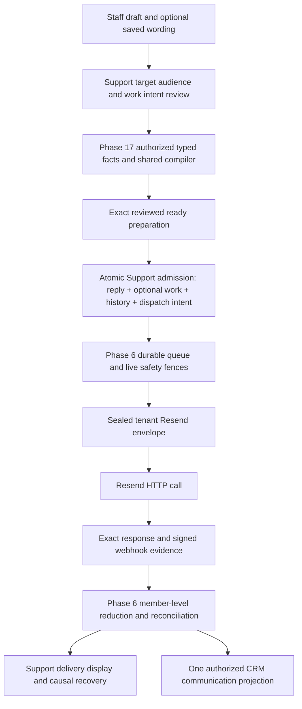

# Phase26 Part A — Detailed normative acceptance and qualification registry

This registry is an inseparable published part of the implementation specification. Each REQ identifier is a normative acceptance contract, not a citation-only suggestion. Proof matrices define required outcomes; operational tables define exact signal, threshold, owner and response. Numeric qualification workloads and operational triggers are test/release contracts with their stated units and evidence limits, not claims of measured ministry demand or customer SLAs. Earlier historical alternatives and source-only experiments do not override these rules.

The complete D1–D40 specification’s explicit later qualifications govern their stated scope. In particular: D13 qualifies D1’s previously unselected automatic confirmation; D18 owns the saved-reply library; D23 qualifies signatures and governed Tiptap authoring; D24 adds curated reply-and-work shortcuts beside D4’s named send action; D31 defines follow-up quick choices and authoritative time; D14 owns optional internal First/Next reply targets and reporting, not a public SLA promise; D37–D38 govern private Reply/Note drafts; D39 governs personal reading; D40 qualifies all-Unwanted resulting components and held-input continuation. Do not duplicate controls or reinterpret one purpose’s clock as another’s.

## D01 — Normative acceptance detail

### REQ26-D01-R01 — Ordinary conversation

**Acceptance:** US26-D01-01-AC01.

A legitimate requester can ask for ordinary help
and read and reply to the tenant's ordinary answer using email, without creating
an Asym account, signing in, completing a CRM link, entering a ticket number, or
passing through mandatory self-service. Required qualified Help entry points retain
permitted context. No requester My messages archive is included in Phase 26.

### REQ26-D01-R02 — Tenant identity and working reply route

**Acceptance:** US26-D01-01-AC02.

An ordinary reply clearly
identifies the tenant and carries a verified, activated, monitored return route
prepared under the Phase 17/6 sender contract. The answer is readable in the email.
Ordinary Reply and a new message to the visible support address reach recoverable
intake. Website domain, outgoing sender authentication, receiving mail routing,
and monitoring responsibility are distinct. Existing root MX records are not
replaced as a setup shortcut.

### REQ26-D01-R03 — Accepted-input responsibility

**Acceptance:** US26-D01-01-AC03.

Every accepted input has a durable source
identity and exactly one recoverable disposition. An acknowledgment means the
accepting owner can recover the promised work, not that downstream work is complete.
Unknown or ambiguous tenant ownership fails closed with separately authorized
platform recovery; it is never guessed or exposed to candidate tenants. A fetched
empty body differs from retrieval failure. Legitimate attachment-only inputs remain
visible/actionable under policy; unhydrated placeholders are not complete messages.

### REQ26-D01-R04 — Correlation without authority

**Acceptance:** US26-D01-01-AC04.

Thread references and opaque route tokens
correlate mail within trusted tenant scope; they never authenticate a person, grant
CRM/financial authority, add external recipients, or authorize prior-history
disclosure. Conflicting references or destinations do not select an arbitrary
first match. Sender plus subject alone does not merge independent requests.
Unmatched mail remains serviceable through safe staff resolution.

### REQ26-D01-R05 — Actor and authorization

**Acceptance:** US26-D01-02-AC01.

The server derives tenant and acting active staff
identity from authenticated context and records it immutably. Caller input cannot
select author or audit identity; an unresolved actor does not become System.
Assignee and approved presentation signature remain separate from actor. Every
read, link, mutation, retry, download, export and send re-proves its owner's current
authority. Database grants/policies cannot bypass those commands or transform a
permitted row into forbidden authorship, privacy, provider state, or tenant scope.

### REQ26-D01-R06 — Private collaboration and recipients

**Acceptance:** US26-D01-02-AC02.

Internal notes and system-only
events cannot enter the public-reply pipeline or appear in requester-visible
email, history or exports, including through direct data access, workers or
macros. Authorized internal display/export remains subject to note-access and
audit policy. External delivery accepts an
explicit public-reply command with its reviewed content and exact recipients,
never a mixed timeline. Linking CRM records, assigning staff, mentions and macro
expansion do not silently add recipients. Note/reply mode, sender, To/CC and
attachments are visible and accessible before send.

### REQ26-D01-R07 — One durable send decision

**Acceptance:** US26-D01-02-AC03.

Creating a send intent is atomic with current
authorization, exact content/recipient approval, a reviewed conversation version,
permanent semantic deduplication, and required local history/dispatch evidence.
Relevant unseen updates block stale sending and preserve the draft for explicit
review. Replays under the same durable send-intent identity return the existing
effect; conflicting immutable input under that identity is rejected. A new
deliberate reply receives a new intent identity. Phase 17 prepares the bounded human-authored reply and Phase 6
dispatches/records each admitted recipient copy once, without duplicate hook/seam
capture. A human reply is not forced into a fixed system-message template merely
to reuse preparation. Ambiguous external outcomes reconcile before retry; no recall or
exactly-once external delivery is promised.

### REQ26-D01-R08 — CRM and protected owner actions

**Acceptance:** US26-D01-02-AC04.

Support retains observed sender endpoints
and explicit authorized links to Core Parties/records, including an unlinked or
ambiguous state. No automatic Party creation, preferred-email overwrite, duplicate
CRM store, or Support↔CRM sync is permitted. The qualified no-Party reply-authority
branch supports ordinary unlinked correspondence. Protected disclosures and
consequential actions use the owner's least-friction qualified flow with permitted
context and an explanation of any verification. Support resolution never proves
that owner action completed.

### REQ26-D01-R09 — Honest work and delivery state

**Acceptance:** US26-D01-03-AC01.

Conversation lifecycle, assignment, read
state, timers, drafts, send intent, provider acceptance, delivery evidence, and
domain-action completion are separate facts. Pending is not Sent; provider
acceptance is not Read. Failed or uncertain delivery remains visible and actionable.
Incoming replies create visible owed work under the chosen lifecycle. An automatic
acknowledgment, saved draft or failed reply cannot silently count as a substantive
human answer. Advertised response commitments require their real staffed policy.

### REQ26-D01-R10 — Content and attachment custody

**Acceptance:** US26-D01-03-AC02.

Use owner-governed content rendering,
context-aware variable escaping, permitted link schemes, safe message display and
bounded untrusted MIME/file processing. Attachments have independent truthful
readiness/failure states. Available means an authorized, policy-compliant retrieval
path exists; a count, `local:` reference, or expired provider URL is insufficient.
Preserve text on attachment failure. Never make private material public to bypass
a channel limit. Protected owner artifacts retain their existing access contract.

### REQ26-D01-R11 — Coherent context and interface

**Acceptance:** US26-D01-03-AC03.

Support Hub and authorized CRM surfaces
use the same owner-filtered facts and history. Staff can inspect permitted context,
initiate an owner action, and return to their conversation, draft and queue position
without unnecessary re-entry. Draft and cached content are scoped to current actor,
tenant and permitted conversation; boundary changes clear or deny old private
state. Search authorization and filtering precede counts and page limits. Use
Core's exact shared base-maia/Base UI design system, accessible status/error
feedback, keyboard operation, responsive reflow and supported locale behavior.

### REQ26-D01-R12 — History, recovery and records

**Acceptance:** US26-D01-04-AC01.

Authoritative support state, required audit
and related local effects commit atomically or leave durable repair evidence for
every missing effect. Single/bulk/retry entry points enforce the same invariants.
Recovery proves completion of required evidence, not just existence of a row.
Business and security history are distinct from diagnostic logs. Ordinary staff
cannot edit/delete audit history; governed redaction, holds and disposal preserve
necessary evidence without retaining sensitive bodies forever. Already delivered
external copies cannot be recalled.

### REQ26-D01-R13 — Shared capabilities and bounded scope

**Acceptance:** US26-D01-04-AC02.

Support owns support work only.
Use Phase 23 form occurrences, Phase 17 preparation, Phase 6 dispatch/history,
Core identity/CRM/authorization, and qualified document/records boundaries.
Phase 34 remains the configurable rules owner. D1 adds no generic CRM, workflow,
knowledge, reporting, AI, or omnichannel platform. Safety, classification and
current recipient authority precede any automatic send; this decision grants
no new auto-acknowledgment or autonomous-reply authority.

**Later ratified qualification:** The absence of automatic-confirmation authority in this original D1 boundary is superseded only by D13’s qualified New request confirmation; other automatic purposes require their separately ratified owner contracts.

### REQ26-D01-R14 — Single-writer migration and safe activation

**Acceptance:** US26-D01-04-AC03.

Inventory actual legacy
records and preserve their identities/history with verified mappings or explicit
read-only provenance. Backfill never sends old messages or repeats business
effects. Expand, reconcile, validate and fence old writers before new real inbox
activation. Mixed versions cannot bypass new controls. Kill switches pause
unstarted sending while preserving accepted intake, evidence and reconciliation;
rollback does not delete new mail or revive competing writers.

### REQ26-D01-R15 — Falsifiable readiness

**Acceptance:** US26-D01-04-AC04.

Before activation, prove ordinary account-free
email contact/reply, scoped CRM continuity, authorization negatives, notes and
recipient safety, concurrent/replayed commands, body/attachment recovery, provider
ambiguity, migration and accessible mobile/keyboard journeys against actual owner
seams. Record supported workload and provider/client capability limits from
measurements. Any safety-critical recipient/mode confusion, lost accepted input,
duplicate logical effect, forbidden disclosure or missing required audit blocks
activation. Helper tests, screenshots and vendor documentation alone do not
constitute this evidence.

### REQ26-D01-PROOF30 — Required outcome proof — Proof matrix

<!-- prettier-ignore -->
| ID | Proof obligation | Required outcome |
| --- | --- | --- |
| REQ26-D01-P01 | Guest ordinary contact and reply | Useful tenant answer in email; normal Reply continues; no Asym authentication or forced self-service |
| REQ26-D01-P02 | Qualified Help and CRM handoff | Permitted source context reused; owner action enforced; return restores draft/queue; no duplicate authoritative fact |
| REQ26-D01-P03 | PostgreSQL 17 roles/grants/RLS | Anon/donor/missionary/staff/admin/disabled/multi-tenant cases; both mutation predicates; direct-write, FK, delete and privacy negatives |
| REQ26-D01-P04 | Actor and signature | Forged author rejected/normalized to real actor; assignee changes do not impersonate staff; missing actor is a recoverable error |
| REQ26-D01-P05 | Collision and dedupe | Two staff, multiple tabs, double-click, lost response, concurrent donor reply, revocation, retry and replay yield one permitted effect |
| REQ26-D01-P06 | Fault recovery | Failure between every local write; move/audit partial result; replay repairs missing effects without duplication |
| REQ26-D01-P07 | Thread identity | Shared addresses, forwards, changed subject/address, contradictory headers, copied tokens and inbox moves remain isolated and recoverable |
| REQ26-D01-P08 | MIME and attachments | Plain text/HTML/Unicode; empty retrieved body versus missing retrieval; inline/missing/expired/oversized/rejected files; no public fallback |
| REQ26-D01-P09 | HTML and variables | Text/HTML/link context remains safe after substitution; owner renderer rejects unsupported URLs/content |
| REQ26-D01-P10 | Delivery and loops | Verified webhook, duplicates, out-of-order events, bounce, complaint, automation/own-address loops, ambiguous send and endpoint outage |
| REQ26-D01-P11 | Search and cache | More than 2,000 records, matching old rows, correct authorized counts/pages, account/tenant change and in-flight results |
| REQ26-D01-P12 | Records and migration | Mapping/coverage totals, no historical sends, redaction/hold, mixed-version compatibility, safe dispatch pause/rollback |
| REQ26-D01-P13 | UI and accessibility | Keyboard/focus, non-color mode/recipient feedback, error recovery, 320 CSS-pixel reflow where applicable, zoom, real mail clients, mobile/low-bandwidth |
| REQ26-D01-P14 | Pure helper baseline | Existing serializer, merge-variable, timeline and business-hours suites |
| REQ26-D01-P15 | Human usability | Intended users perform ordinary contact/reply and safe CRM handoff; any safety-critical disclosure/mode confusion blocks activation |

### REQ26-D01-OPS31 — Operational controls — Residual monitoring after safeguards pass

<!-- prettier-ignore -->
| ID | Signal | Threshold | Accountable owner | Required response |
| --- | --- | --- | --- | --- |
| REQ26-D01-O01 | Accepted input without durable disposition; duplicate logical effect; missing required audit | Any one verified occurrence | Platform operations and owning Support engineer | Preserve evidence, stop affected unsafe transition, reconcile and repair; block further activation until corrected |
| REQ26-D01-O02 | Current delivery is failed or indeterminate | Any unresolved item | Tenant administrator's named support owner; platform operations for provider faults | Keep visible work, reconcile original attempt before retry, choose an already authorized recovery path; no false completed outcome |
| REQ26-D01-O03 | Activated return route or connection validation fails | Any failed validation/drift check | Named tenant inbox administrator with platform operations | Pause new use of the unsafe route, preserve accepted inbound/reconciliation, repair and requalify |
| REQ26-D01-O04 | Item misses its actual promised response/follow-up deadline | Any breached stored deadline | Named support owner/team | Surface overdue work and reassign/escalate under policy; D1 invents no universal SLA number |
| REQ26-D01-O05 | Provider reports throttling or retry exhaustion | Any 429 or exhausted attempt | Platform operations / communication owner | Honor provider backoff and exact team/connection budget; prevent starvation; route exhausted work to durable recovery |
| REQ26-D01-O06 | Avoidable login/re-entry demand or wrong-tenant/sender/mode confusion in the required journey | Any verified occurrence | Product/UX owner; security owner for disclosure | Fix and retest the affected journey; safety-critical occurrences block activation |

## D02 — Normative acceptance detail

### REQ26-D02-R01 — Two scopes, one small preference

**Acceptance:** US26-D02-01-AC01.

The product default is Reply all. A signed-in staff member may persist Reply all or Reply to sender for their own work within one tenant, across devices. A per-email change applies only to that draft. No automatic learning, per-conversation memory, assignee inheritance, or tenant/inbox/team override hierarchy is introduced. This setting applies to ordinary human Support replies only, not internal notes, forwarding, automated acknowledgments, bulk messages, marketing consent, AI actions or owner-domain transactional mail.

### REQ26-D02-R02 — Initialization and error states

**Acceptance:** US26-D02-01-AC02.

For an existing draft, restore its saved target and audience. For a new draft, an explicit Reply/Reply-all action takes precedence over the resolved personal preference; a confirmed absent preference uses Reply all. Loading, failed, invalid or stale unverified preference state is not absence. Resolve the current personal setting when initializing a new draft; do not silently use an unverified cache as a cross-device authority. While unavailable, staff can write and explicitly choose the audience mode for this draft. Late preference responses never overwrite an initialized or edited audience. A successful preference save affects subsequently initialized drafts, never existing drafts or sends.

Preference resolution is not an access grant and is unnecessary once a draft has an explicit qualified audience. No preference-service outage should make an otherwise safe existing draft unusable.

### REQ26-D02-R03 — Target and eligible audience

**Acceptance:** US26-D02-02-AC01.

"Each reply identifies the specific admitted external message being answered. Ordinary entry selects the latest eligible external message at draft initialization; an explicit per-message reply selects that message. Reply to sender uses its parsed and policy-qualified response endpoint, including a valid admitted incoming Reply-To where appropriate. Reply all adds that same message's eligible visible To/Cc endpoints. Preserve visible To/Cc roles through the qualified mail contract, with deterministic deduplication. Exclude proved tenant receiving/forwarding/self-route aliases and BCC; do not add endpoints merely from historical participation, CRM relationships, internal following, assignment, mentions or quoted text. A staff member who is actually an admitted sender or visible recipient is evaluated as a message participant, not categorically removed because of their role. Never use the conversation's mutable CRM/contact email as a replacement source."

Display the actual response address when Reply-To differs from From. Ambiguous, malformed, multiple or rejected endpoint evidence requires audience selection/review; do not substitute a guessed address. Own-route exclusions use proved tenant configuration, never a blanket same-domain rule. Preserve source address spelling/provenance and use the approved mail parser; do not invent global dot/plus/local-part identity equivalence. With no eligible destination, retain the draft and require a valid audience before send. Reply/Reply all producing the same one-recipient audience is ordinary, not an error.

An outgoing-message follow-up, if supported, uses an explicitly reviewed external audience from that message; it must not reply to the staff sender. This clause does not expand D2 into new forwarding or campaign functionality. Email format and BCC cautions are supported by RFC 5322; local-part versus domain semantics by RFC 5321. Neither RFC mandates this particular UI.

### REQ26-D02-R04 — Stable drafts and intentional edits

**Acceptance:** US26-D02-02-AC02.

Retain the draft's target, current explicit recipients, reply action/provenance, content, attachment selections, owner and revision across supported save/restore, navigation and temporary failures. A new incoming message, reassignment, Party merge, changed email or preference update cannot silently retarget or readdress it. An explicit target change preserves work and presents changed audience/quoted context for review. Reply and internal-note drafts remain structurally separate. Assignment alone neither reveals nor transfers another worker's private draft.

An ordinary preset switch updates the exact recipients and preserves text and attachments. If switching discards manual edits or reintroduces removed recipients, show the concrete added/removed addresses in a compact inline review before applying, with Undo. Keep one current recipient set; do not cache hidden recipient sets per mode. Manually edited recipients display a truthful Custom recipients state when they differ from a preset. Changing a mode or recipient does not change the personal default, support status, CRM data or assignment.

### REQ26-D02-R05 — Quiet, explicit interface

**Acceptance:** US26-D02-02-AC03.

Use Core's existing shared components and semantic tokens. Keep one text-labelled audience control near the From/To/Cc fields: Reply all, Reply to sender, or Custom recipients. Its menu offers the two actions and a separated My reply preference link. Preserve a clear, separate internal-note mode. Populated recipient fields show actual addresses and a truthful total; every recipient is inspectable/editable without hover or leaving the draft. Expanded disclosure or unreviewed audience changes must not be hidden behind a misleading one-person summary. Empty optional fields may stay collapsed.

Personal settings offer one Default email reply field with two choices and the helper: ‘Applies to new replies for you in [tenant]. You can change any reply before sending.’ A confirmed successful save shows a quiet Saved status. A definite rejection explains the rejected change; an ambiguous save says ‘Couldn't confirm your preference was saved. Your current draft is unchanged.’ A revision conflict reports that the preference changed elsewhere. Read back the authoritative value before retrying an uncertain save; do not claim the previous value is unchanged when the write may have committed or another device may have saved. Opening settings preserves the draft and return focus. No persistent Remember this choice checkbox, redundant preference toolbar, or confirmation modal on every normal reply.

When only one recipient is eligible, retain a consistent control with an honest one-recipient display; neither a redundant warning nor a change to the stored preference is warranted. The familiar Send button and keyboard shortcut always act on the same displayed draft. Keyboard submission must respect IME composition and current validation; changing a menu value must not submit.

### REQ26-D02-R06 — Self-owned, tenant-safe storage

**Acceptance:** US26-D02-01-AC03.

Support owns one narrowly typed personal reply preference keyed by validated tenant and authenticated user. The canonical self-preference command derives both from trusted server context, checks current Support access, and cannot select another agent, assignee, user or tenant from caller input. It uses non-null owner keys, tenant/user relationships, a constrained two-value mode, timestamps and a small concurrency revision. Persist atomically on the natural key; stale writes cannot silently replace a newer acknowledged value. Return the canonical saved value/revision and expose errors honestly.

Enable RLS with default deny for anonymous/authenticated roles and use server-only access through that command, revoking their direct table privileges; privileged service-role code must perform the same self/tenant checks. If any direct reads or writes are later admitted, add narrowly scoped grants and old-row USING/new-row WITH CHECK policies, with immutable owner keys; no broad permissive policy may remain as an alternate path. Deleting or resetting a preference cannot cascade into drafts, messages or send evidence. Deactivated membership denies use regardless of a retained preference.

Scope preference/draft queries, caches and local recovery by tenant, authenticated actor and relevant draft identity. Account/tenant changes and revoked access make previous context inaccessible; late old-context responses cannot overwrite a new one.

Reuse Core's self-settings pattern and UI controls, not the team-editable notification preference API or CRM table-settings storage. The existing agent key is tenant-unique; its user/profile linkage is nullable and its `(tenant_id,user_id)` index is nonunique, while current actor resolution uses email/ID matching. That linkage is not the personal preference identity. This is one small Support record, not a global preference platform. Existing tenant-aware FKs and both RLS mutation predicates were checked and are not falsely reported absent. PostgreSQL 17 RLS and INSERT/ON CONFLICT explain why an additional permissive policy or an upsert on the wrong key does not provide the required protection.

### REQ26-D02-R07 — Disclosure and owner boundaries

**Acceptance:** US26-D02-02-AC04.

An email participant, actual sender, authenticated user, linked CRM Party, represented organization, assigned support worker and CRM owner remain distinct. Support reads only authorized CRM context and initiates changes through the owning domain's authorized command. A matching address, recipient selection, assignment or support resolution grants no additional CRM, giving, document or care authority. The default never creates/merges Parties or synchronizes a copied CRM customer record.

An audience change revalidates authorized content/attachments and any prior disclosure approval. Do not append the mixed conversation timeline, private notes, prior confidential exchanges or protected documents merely because the audience includes someone. Positively identified blind-copy intake requires a concise audience review before a broader reply reveals private participation; absence of the Support address from To/Cc alone is insufficient evidence because forwarding can look the same. Ordinary admitted group continuation has no extra blanket modal. Free-form staff text cannot be guaranteed confidential by a CRM ACL; clear audience display and targeted disclosure safeguards remain necessary.

Party relinking, merges, archival or deletion do not silently rewrite original message observations or admitted recipients. Redaction, retention, exports and audit access follow their owners and D1. An authorized internal export is distinct from requester-visible delivery. A contact mention, macro, suggestion or AI output may not add an external recipient.

### REQ26-D02-R08 — One authoritative send and durable identity

**Acceptance:** US26-D02-03-AC01.

One canonical admission command binds the trusted actor, current conversation/inbox/tenant rights, selected target, reviewed conversation revision, exact audience with To/Cc roles, body/attachment revision and recipient/content authority to a durable reply approval. Required send intents and audit/history references are captured atomically with authoritative state under D1. The preference is initialization provenance, not dispatch authority. The server must not silently correct or widen the displayed audience; it rejects a mismatch and preserves the draft.

Retries of the same identity use the same immutable approval and return/reconcile its outcome. Changed audience/content cannot reuse that approval identity; a genuinely new deliberate reply has a new identity even if its text is identical. A lost response is reconciled, not automatically turned into another send. Accepted work keeps its prepared sender, return route, connection and audience. Later edits form another draft; old saves/send completions cannot clear newer work. Current revocation/classification fences stop definitely unsubmitted affected work and reconcile possibly submitted work without pretending to recall mail.

A settings change alone does not constitute a conversation collision. A newly arrived relevant message does invalidate stale send review under D1, while retaining the draft and its original target for deliberate resolution.

### REQ26-D02-R09 — Group delivery without false history

**Acceptance:** US26-D02-03-AC02.

Before group-email activation, Phase 6/17 must admit an explicit grouped provider-submission/member relationship. One reviewed visible To/Cc group may have one native provider submission, while each admitted recipient copy retains its own authority, semantic identity, immutable preparation membership and communication history. The owner contract records which members a submission represents and which members each provider result actually proves. Shared transport does not combine recipient authority or erase member outcomes. The visible audience is itself part of the approved disclosure. Common content, attachments, sender, connection and return route must be pinned and suitable for every visible member; incompatible individually personalized or protected payloads cannot be opportunistically combined. Phase 6 owns the exact submission/member mapping, including a shared provider message ID where qualified; signed evidence resolves only the proved member subset.

Never submit the complete group once per member; that duplicates deliveries. Never present private single-recipient fanout as normal visible group continuation. Preserve qualified native To/Cc headers and reply-threading behavior without arbitrary header overrides. Map delivery, bounce and failure evidence only to provably affected members; aggregate or ambiguous evidence remains indeterminate for unproven members. Partial recovery must not resend to successful or possibly successful recipients. Reconcile ambiguity before any retry; a partial retry is permitted only by a qualified remaining-member transport contract preserving truthful visible recipients and no duplicate external effect.

Where the current per-recipient owner contract cannot express this relationship, explicitly amend that contract during authorized specification work before egress. Support must not create an alternate sender, silently weaken per-recipient history, or assume a provider email ID equals one person. The normal group-email requirement is retained; qualification failure blocks group activation until the owner/provider path satisfies it.

### REQ26-D02-R10 — Bounds and truthful recovery

**Acceptance:** US26-D02-03-AC03.

Validate recipient count, header size, syntax, attachment limits and transport capabilities before approval against the qualified owner/provider contract. Reject excess with an actionable error and preserved draft; never truncate, silently split a group into a campaign or claim success before acceptance. Provider receipt, mail-server acceptance, bounce, indeterminate submission and human reading are different facts. Display member-specific failures and a truthful group summary. Keep diagnostic logs minimized; durable authorized business history carries the exact approved audience and evidence lineage.

D2 sets no invented volume/SLA/cap. Resend documents a maximum of 50 for the To parameter; that does not establish an Asym combined To+Cc+Bcc limit. Qualification must establish relevant total and byte bounds and test boundary/excess cases. Provider request idempotency expires after 24 hours; Core's durable effect identity and ambiguity handling cannot expire merely because that transport window does.

### REQ26-D02-R11 — Migration and activation

**Acceptance:** US26-D02-04-AC01.

Introduce preference and explicit-draft contracts compatibly before enabling the new default. Existing drafts keep their known audiences; insufficient historical target/audience evidence requires visible selection before sending, never a backfill from today's preference or CRM data. Existing queued/sent approvals remain immutable. Old clients unable to preserve exact audiences cannot send through a legacy bypass. Stop new unsafe sends with an owner-controlled feature fence while preserving accepted-effect reconciliation and staff read/recovery access. Roll forward corrected owner contracts rather than rewriting historical headers.

The existing parallel `support` module must not remain an unguarded alternate sender during consolidation. D2 does not authorize unrelated refactoring, new statuses, SLA machinery, portal archives, workflow engines, knowledge systems or autonomous AI. Required broader Phase 26 work remains tracked separately.

### REQ26-D02-R12 — Proof, traceability and operation

**Acceptance:** US26-D02-04-AC02.

Trace D2 and D2-R01–R12 from the grill record and resolved glossary into the relevant owner ADR/OpenSpec reconciliation, design/tasks/tickets, implementation, outcome tests and release evidence through the authorized delivery stages. Do not treat a mocked UI test, model experiment, helper suite, vendor article or green unrelated CI as proof of runtime delivery, authorization or usability. Satisfy the proof matrix and activation gates below. Monitoring never replaces the prevention requirements.

### REQ26-D02-MODEL18 — Ownership and invariant map

<!-- prettier-ignore -->
| Fact | Authority | Derived/display role and invariant |
| --- | --- | --- |
| Personal reply default | Support self-preference command for tenant + authenticated user | Two values; current draft is not subscribed to future changes; not donor consent or access authority. |
| Actual sender and visible recipient observations | Admitted inbound/outbound message evidence under messaging custody | Keep provenance; a display name or timeline owner does not establish identity. No later CRM update rewrites original observations. |
| Draft target, audience, content and attachments | Authorized staff-owned Support draft | One current audience; explicit edits and revisions; no hidden per-mode recipient lists; private notes remain separate. |
| Approved reply and recipient authorities | Canonical Support admission with P17 preparation and owner checks | Exact immutable approved content/audience; no mutable preference or CRM lookup changes it during dispatch. |
| Provider submission and recipient-member evidence | Phase 6/17 transport/communication owners | A group submission may represent multiple authorized members only through a qualified mapping; unknown is not delivered. |
| Party identities and relationships | CRM/Party and identity owners | Context is permission-aware; email similarity and Support membership never create representation or record access. |
| Giving changes, receipts, protected documents, care | Respective owner commands and access policies | Support may initiate an authorized handoff and show its outcome; resolution is independent of owner completion. |
| CRM/support interaction history | Owner facts and Phase 6 projections | One event per admitted recipient copy and effect; related views do not independently create a duplicate authoritative event. |

No money schema is added. No CRM synchronization or support-side customer master is introduced. Preference rows are mutable personalization; admitted send evidence retains historical integrity subject to owner-governed redaction. A preference revision and a conversation send-review revision serve different purposes and must not cause each other's conflicts.

### REQ26-D02-MODEL19 — Restrained interaction example

Illustrative fixture, not a claimed ministry workflow: Sarah emails Support and copies James. Maria opens a reply with no saved preference. The composer shows **Reply all**, Sarah's address in To and James's in Cc. Maria writes normally and sends without an additional generic confirmation.

For this particular email Maria chooses **Reply to sender**. James disappears from the shown audience; the text and attachments remain. Her next new reply still uses Reply all. If she chooses **My reply preference…** and saves Reply to sender, future new replies for Maria in this tenant start that way. Elena's preference is unchanged. Maria's existing drafts retain their audiences.

If Maria manually removes James then later selects Reply all, the interface shows that James would be added before applying the preset. It does not silently resurrect him. If James later writes only to Support, that new message does not readdress Maria's existing draft; a new reply targeting James's message addresses James's permitted message audience.

The personal setting is separate from email consent/preferences belonging to donors. Support conversation and CRM context links preserve the staff member's place and draft, while each destination rechecks access. A staff member authorized to answer email may still be unauthorized to view a gift, attach a receipt or change a recurring donation.

### REQ26-D02-PROOF20 — Required outcome proof — Proof required and experiments performed

<!-- prettier-ignore -->
| ID | Proof group | Required positive, negative and boundary outcomes | Owner / release evidence |
| --- | --- | --- | --- |
| REQ26-D02-P01 | P01 — Defaults and scopes | Unset→all; saved sender→sender; explicit action wins; per-email switch never writes preference; coworker/other tenant unaffected; both modes with one recipient remain coherent. | Support product/engineering; interaction and API outcome tests |
| REQ26-D02-P02 | P02 — Async preferences | Slow/error/invalid load never broadens; explicit audience permits composition/send; late response cannot overwrite draft; saved preference works on next new draft across devices after authoritative resolution; failure never reports Saved. | Support client/API; controlled network and multi-tab tests |
| REQ26-D02-P03 | P03 — Self ownership | Deny same-tenant other user, other tenant, body/path owner substitution, agent fallback, owner-key mutation and direct table access; test service-role route checks and any admitted RLS USING/WITH CHECK paths independently. | Identity/database owners; real isolated PostgreSQL 17 and authenticated API evidence |
| REQ26-D02-P04 | P04 — Save races | Simultaneous first save yields one natural-key row; stale revision does not clobber newer choice; lost response readback reconciles; response to old actor/tenant cannot apply. | Support API/database; transactional concurrency tests |
| REQ26-D02-P05 | P05 — Draft continuity | Reopen/refresh/navigation/settings/Reply→Note→Reply retain the correct private draft and recipients; old save/send response cannot clear new revision; reassignment does not expose private drafts. | Support client; browser reload/offline/ordering journeys |
| REQ26-D02-P06 | P06 — Manual audience edits | Remove CC, switch modes, restore, retarget older message: no invisible reinstatement; exact delta before discarding edits; truthful Custom recipients state; body and attachments retained. | Support UX; observable recipient assertions and staff task review |
| REQ26-D02-P07 | P07 — Email endpoints | Different/ambiguous Reply-To, duplicate To/Cc, shared addresses, own aliases and legitimate same-domain people, international/RTL names, zero/one/many recipients, blind-copy evidence versus ordinary forwarding. | Messaging intake/preparation; parser fixtures plus qualified mail-client journeys |
| REQ26-D02-P08 | P08 — CRM and disclosure | Sender's exact-email link confers no representation; restricted CRM/gift/care remains inaccessible; owner action obeys its own authorization; link/merge/email change does not readdress; no auto Party; one interaction history per copy. | CRM/identity/giving/document owners with Support; end-to-end authorized and denied journeys |
| REQ26-D02-P09 | P09 — Notes, content and attachments | Notes never enter external reply, quote, transport or requester export; authorized internal export remains governed; mention never adds CC; newly admitted recipient cannot receive unauthorized artifact or earlier private history. | Support/messaging/security; serialization and disclosure outcome tests |
| REQ26-D02-P10 | P10 — Atomic send and collision | Two staff compose then one sends; second is stopped with draft intact. Duplicate click/retry yields one effect. Same key with changed audience fails. New deliberate identical text is not suppressed. Revocation before dispatch blocks safely. | Support/P17/P6; transaction, outbox and race tests |
| REQ26-D02-P11 | P11 — Native group delivery | Actual permitted visible To/Cc preserved in ordinary mail clients; replies continue correctly; exactly one intended copy per recipient. Mixed To/Cc success/bounce, duplicate/out-of-order/missing events and one provider ID map truthfully. Unknown mapping remains unknown. | P17/P6/provider owners; controlled authorized provider qualification before activation |
| REQ26-D02-P12 | P12 — Partial/ambiguous recovery | Lost acceptance response, timeout after provider success, delayed bounce and failed member retry do not resend successful/possibly successful members or alter audience. No scalar status overclaim. | Messaging operations; fault injection and reconciliation evidence |
| REQ26-D02-P13 | P13 — Limits/security | Exact qualified count/byte limit accepted; excess rejected with draft retained; malformed/CRLF addresses, unsafe content and unuploaded attachment references fail before egress; no silent truncation/split. | Messaging/API/security; qualified boundary and adversarial fixtures |
| REQ26-D02-P14 | P14 — Accessible, mobile context | Keyboard/menu/focus/screen-reader operation; accessible status announcements; no color-only mode; touch without hover; 320 CSS-pixel reflow, 200% text zoom, RTL/email direction, long names/lists; IME does not accidentally send; navigate CRM/settings and return without losing context. | Support UX/accessibility; browser assistive-tech and representative staff task evidence |
| REQ26-D02-P15 | P15 — Migration and rollback | New contracts before activation; old draft with unknown audience requires review; old client cannot bypass; sent history unchanged; disabled writer does not disable accepted-send reconciliation; parallel support writer fenced. | Support/messaging release owner; production-shaped migration and mixed-version rehearsal |

### REQ26-D02-OPS21 — Operational controls — Ruthless synthesis and order

<!-- prettier-ignore -->
| ID | Signal | Threshold | Accountable owner | Required response |
| --- | --- | --- | --- | --- |
| REQ26-D02-O01 | Wrong recipient, internal-note egress, cross-tenant/user draft or preference access | One confirmed event | Messaging/platform on-call plus security owner | Fence affected writer/surface immediately, preserve authorized evidence, investigate scope and correct through owner lineage before re-enable. |
| REQ26-D02-O02 | Duplicate externally delivered copy for one admitted recipient effect | One confirmed duplicate | P6/P17 messaging owner | Fence implicated retry/group path, reconcile provider evidence, repair idempotency/mapping and prove regression before resuming. |
| REQ26-D02-O03 | Unexplained draft audience mutation or old response clearing newer work | One confirmed invariant violation | Support engineering owner | Disable affected draft transition, preserve recoverable draft, correct revision/context handling and rerun ordering tests. |
| REQ26-D02-O04 | Preference-save failure, conflict or unavailable initialization | Each failed/conflicting operation | Support API owner; staff receive the immediate UI state | Never claim Saved without confirmation; retain the draft, read back the authoritative preference after ambiguity/conflict, and offer explicit current-email selection plus safe retry. Repeated failures route through existing platform incident/error-budget handling. No invented availability SLO is asserted. |
| REQ26-D02-O05 | Provider result cannot be attributed to the qualified recipient members | First such event | Messaging integration owner | Keep affected members indeterminate, quarantine unsupported evidence for reconciliation, stop any unsafe automatic retry; update qualification fixtures before admitting that mapping. |
| REQ26-D02-O06 | Recipient/header limit exceeded | Every attempted excess | Support/messaging API owner | Reject before approval with retained draft and actionable bound; inspect repeated patterns before changing the qualified limit. Never silently split. |

## D03 — Normative acceptance detail

### REQ26-D03-R01 — Four mutually exclusive meanings and mixed waits

**Acceptance:** US26-D03-01-AC01.

A conversation has exactly one authoritative current work meaning. Open means Support currently owes a substantive next step or a due review/follow-up, including reviewing new input. Waiting for requester means requested information/action from admitted people seeking support is the remaining active blocker. Waiting on our side means a necessary input already sought from a colleague, owning-domain process or outside party is outstanding and Support retains responsibility for obtaining it. Resolved is an explicit completion of the Support obligation, not simply read, out of the inbox or no immediate response needed.

If Support currently owes a substantive next step or a due review/follow-up, use Open. Merely being able to send an optional progress update does not end a genuine wait. Otherwise, if an active our-side blocker remains, use Waiting on our side, including mixed requester/our-side waits. Use Waiting for requester only when the remaining active blocker is requester-side. Preserve additional context in existing notes or permitted owner references; do not introduce a fifth Mixed status, mandatory blocker taxonomy or dependency graph. Hypothetical future tasks are not active blockers. An inability to determine the correct wait calls for staff review, not inferred resolution or a fifth normal state.

### REQ26-D03-R02 — Intent and causal evidence, never message direction

**Acceptance:** US26-D03-01-AC02.

A staff progress update, note, read action, assignment, CRM link or queued email does not itself choose Waiting or Resolved. Work changes follow explicit authorized staff intent or a qualified causal event under this contract. A required requester question can support Waiting for requester; an ‘I am investigating’ update leaves the obligation with Support. Delivery is shown separately: queued, retrying, failed, suppressed or indeterminate mail is not proof that anyone received a question.

Requester-side input may come from a legitimately admitted participant other than the original requester or CRM-linked address. Matching email, quoted headers or a conversation reference alone do not establish that admission or protected-action authority. A waiting label does not add recipients, subscribe anyone, create a Party or change the D2 draft audience. Sending a progress update while genuinely awaiting another input is allowed; sending alone does not change the wait.

### REQ26-D03-R03 — One authorized and conditional transition boundary

**Acceptance:** US26-D03-03-AC01.

All menu, keyboard, board, bulk, macro, system-event and reminder transitions use the same canonical Support command in the governed data layer. The server derives tenant, authenticated user and actual actor profile from trusted context, validates the current conversation/resource policy and reviewed work/conversation revisions, and admits only a typed allowed cause. A request cannot choose its tenant, impersonate an assignee, manufacture actor attribution or bypass a stale-review check.

State/revision changes, before/after evidence, reminder changes and required dispatch/recovery intents commit atomically. A stale mutation preserves the draft, returns the canonical current state or a qualified conflict, and cannot silently hide a newly admitted reply. Same-identity retries reconcile/return the same admitted result for the same immutable input; changed input under the same identity conflicts. A genuinely new deliberate command uses a new identity. Check current access before disclosing prior command results. Distinguish the original admitted operation outcome from current conversation state; an old successful result cannot replace a higher-revision current snapshot. Return or refresh current authorized state separately.

Use the existing Core transaction/conditional-update and workflow mechanisms; a distributed lock service is not needed. Work-review concurrency must remain compatible with D1/D2 send review. Personal preference updates are not conversation collisions. UI disabling is feedback, not the idempotency boundary.

### REQ26-D03-R04 — Database enforcement and trustworthy actor fields

**Acceptance:** US26-D03-03-AC02.

Preserve tenant-aware keys and relationships for conversation, inbox, assignment, transition and reminder facts. Enforce a non-null canonical work value. If Waiting is stored with a separate side discriminator, require exactly one valid side when Waiting and none in contradictory states. Revisions/generations are monotonic integers; actual scheduled reminders require a finite due instant and identity. Derive human profile identity from the authenticated profile field, not an assumed equality with auth user ID.

Keep RLS enabled, use least-privilege grants and revoke direct client mutations that bypass lifecycle, timer or history invariants. Approved reads obey actual tenant/resource and owner-sensitive access rules. If any client mutation remains admitted, both old-row USING and new-row WITH CHECK must enforce its allowed scope and immutable ownership; an additional permissive policy must not leave the old bypass available. Service-role code independently performs the same authorization. RPC execution privileges, safe search path and any client-exposed view policy must preserve those boundaries.

System causes are explicitly system-attributed with an appropriate nullable human actor and causal source. Do not insert a workflow's nil-UUID convention into a Support profile foreign key or borrow the assignee's identity. Do not fabricate an agent when work is unassigned. Routine archive/delete operations cannot cascade away required transition or message evidence; retention/redaction is an explicit owner-governed operation.

No money fields or precision changes are introduced. A schedule command validates future time against trusted server time. A database constraint requiring an accepted reminder to remain later than the current time is inappropriate because valid reminders naturally become due; store and constrain the finite accepted instant independently of that new-admission check.

### REQ26-D03-R05 — Current state and durable history

**Acceptance:** US26-D03-01-AC03.

Maintain a current work snapshot plus append-only authoritative transition evidence. Each actual change records prior/new meaning, cause, trusted human/system actor, server admission/order, command/event identity and permitted causal reference in the same transaction. Source occurrence time, where useful, is separate from server admission order. Reopen preserves the prior resolution episode; repeat Resolve against already resolved work does not create a new completion or replace its timestamp.

Current-state counts, time in a waiting episode, elapsed unresolved time and completed resolution episodes are distinct measures. A message, progress update, CRM edit or inbox move cannot reset a wait period merely because it changed `updated_at`. A requester-to-our-side change records the old episode's end and new side's start. Historical corrections append lineage; they do not silently rewrite earlier history. Work-status changes do not themselves emit duplicate external communication events into Phase 6.

Use current snapshot plus transition evidence, not wholesale event sourcing. Existing mutable `resolved_at` may remain a projection if needed for compatibility; it cannot be the sole historical authority. Redaction and retention still follow D1 and their owners, not a blanket promise to retain every body forever.

### REQ26-D03-R06 — Separate reminders with exact preservation rules

**Acceptance:** US26-D03-02-AC01.

One current shared follow-up reminder may defer attention for a conversation without changing its work meaning. It has a durable identity, generation, finite due instant, purpose and originating actor/cause. Scheduling and replacement preserve work status; changing only between Waiting for requester and Waiting on our side preserves the current valid reminder and due time. When the current valid reminder is processed at or after its due instant, it clears its deferral and returns work to Open for follow-up, recording the actual previous work reason and displaying Follow-up due. This means review/follow-up is due, not that the awaited input arrived.

Explicit Open clears an active deferral even when work already says Open. Resolve cancels the current reminder atomically. Explicit cancel/reschedule and qualified incoming/owner events invalidate obsolete reminder execution. A new reminder on resolved work must be an explicit authorized Reopen-and-remind action, or follow an explicit reopen; no hidden timer remains on completed work. A current waiting-side-only change does not silently cancel a promised follow-up.

Reminder expiry checks the exact current tenant, conversation, generation, due instant and eligible work state atomically. An early callback makes no work transition, leaves this generation pending and preserves/reschedules its durable due attempt; it does not mark the reminder applied. Cancelled, replaced, already-applied or resolved-cycle callbacks are idempotent no-ops. An expired worker claim is not a generation fence. Shared workflow attempts and recovery scans derive authority from product-owned reminder facts and identifier-only envelopes. A process crash between commit and dispatch cannot lose a scheduled reminder.

### REQ26-D03-R07 — Calendar correctness and timing honesty

**Acceptance:** US26-D03-02-AC02.

Display the actual follow-up date, time and relevant time zone before committing. Resolve calendar expressions such as Tomorrow morning using the displayed shared time-zone context and an explicit visible wall-clock time; a duration must be named as a duration. Store the resulting UTC instant with enough zone/input provenance to explain it. Changing a viewer's zone changes display, not the scheduled instant. Repeated/nonexistent DST wall times require explicit unambiguous handling and visible adjustment before commitment.

Due is evaluated at or after the accepted instant, including equality. Scheduling rejects invalid/nonfinite inputs and unintended past instants while retaining the chosen form values. Existing legitimately overdue reminders are recovered as due work, not silently moved into the future. Distinguish the intended due instant from actual execution time so outage delay is visible. Do not promise exact real-time execution on an unqualified worker service.

No new morning hour, default delay, mandatory reminder for every wait, calendar library or personal preference hierarchy is selected. Staff can always choose an explicit date/time using the shared controls. SLA/business-hours accounting is a separate owner policy; neither a wait nor snooze implicitly pauses a promise.

**Later ratified qualification:** D31 supplies the later ratified quick choices, Custom interaction and authoritative-time rules; this clause supplies temporal integrity and does not prohibit those selected defaults.

### REQ26-D03-R08 — New input, failures and resolution eligibility

**Acceptance:** US26-D03-01-AC04.

A first-time admitted relevant human reply returns the conversation to Open for review and invalidates its obsolete deferral, even if the sender's timestamp predates a prior resolution. Durable intake/effect identity prevents duplicate delivery from reopening work again. Automated, quarantined, malicious, unrelated or already-applied intake is not a human work transition. A newly available result for the current awaited authorized owner action also creates review work; stale/superseded references do not blindly change status.

Fresh adverse evidence requiring staff investigation—such as a relevant unresolved delivery failure or ambiguous outcome—creates Open review work through the same causal boundary, including after a prior resolution. Preserve the prior resolution as history; this does not declare it dishonest retrospectively. Do not reopen for every duplicate callback or an already-reviewed/provably superseded result. When relevance cannot safely be established, retain visible qualified review work rather than silently discard the evidence. Provider/member evidence remains under D1/D2.

Resolve is deliberate and cannot hide a known outstanding Support obligation, promised follow-up or required unreviewed recovery action. It does not certify receipt/read status or complete a giving/CRM/document/care action. Pending automated delivery remains separately visible and recoverable; a later failure may create new review work. No required donor courtesy acknowledgement is added after an otherwise complete answer. Reading, adding a note or completing an owner UI is never implicit resolution.

No arbitrary no-response timeout, irreversible Closed stage, automatic closure email, SLA pause or default Send-and-resolve behavior is selected by D3. An explicit future Send-and-status convenience must expose both effects and satisfy the same approval, transaction and recovery contracts. User-selected work intent must not be replaced by text classification or AI guessing.

**Later ratified qualification:** D5, D12 and D14 supply the later ratified ending/disposition qualifications; D4/D24 supply explicit combined reply/work intent. These additions do not weaken current-obligation or recovery guards.

### REQ26-D03-R09 — One clear status control and restrained visual design

**Acceptance:** US26-D03-04-AC01.

Present one primary text-labelled work-status picker in the conversation header, near assignment and separate from reply audience. Its four items use stable sentence-case labels, a programmatically selected current value, a restrained icon and short descriptions within the menu. Avoid duplicate raw-status breadcrumbs, four permanent competing buttons, tiny uppercase instructional chrome, mandatory reason forms or a new status customization system.

Use the existing shared Base UI/base-maia components, geometry, typography, spacing and semantic tokens. Keep most chrome quiet; use text and icon together so color is supplementary. Waiting variants share a visual family and differ clearly in words/icons; ordinary waiting is not an error. Reserve strong attention treatment for actual recovery/due conditions. Existing touch targets, focus styles, reduced-motion behavior and light/dark tokens remain shared. No new palette, primitive base, animation scale or app-local fork is introduced.

A separate labelled reminder control shows the scheduled time only when present. Keep the subject, participant identity, status and active recovery feedback prominent; move less frequent tools into the existing secondary menu. In the list, show one consistent work label and only relevant reminder/failure details. Provide an All unfinished view and status filters for both waits without requiring four permanent board columns or a redesigned Mission Control navigation.

The UX blueprint gives exact menu copy, layout priorities, feedback and mobile behavior. Beauty here is disciplined hierarchy and predictable interaction—not additional decoration. No rendered interface or usability study is falsely claimed complete.

### REQ26-D03-R10 — Preserve context, recover honestly and correct safely

**Acceptance:** US26-D03-04-AC02.

An ordinary status edit keeps the selected conversation, draft, scroll context and focus. Update queue membership and counts truthfully from confirmed state; a filtered-out conversation can remain open in the detail pane with a quiet moved-view indication. It must not be presented as still matching the filter. Next/previous is explicit and uses stable IDs/anchors rather than an index that can change beneath a click. Permission loss closes restricted content according to shared policy; preserving context does not preserve revoked access.

Show pending work at the changed control without freezing unrelated reading/composition or shrinking layout. Do not announce success or remove work from the queue as completed before durable acceptance. Known rejection exposes the canonical state and a local recovery path. A lost response says the update could not be confirmed and is read back by command identity before retry. A stale conflict explains what changed without replacing the draft. A delayed response for the same conversation cannot replace a newer canonical snapshot with its older operation result; caches and UI reject lower-revision updates. Important error details remain available after a toast disappears.

An offered Undo/correction is a new authorized conditional command with an appended event, not historical rollback. It cannot overwrite later input or revoke an external effect. Offer exact Undo only while the affected work/reminder state is still safely reversible. A cancelled prior reminder restored by eligible Undo receives a new generation; if its time is now due, reopen for follow-up with an explicit due explanation. No old callback is resurrected. A later change makes stale Undo unavailable and offers current-state review instead.

An account or tenant switch invalidates old-context responses and inaccessible drafts under D2. Reminder creation by a departing staff member does not erase the team's work; current assignment policy retains an eligible owner or exposes unassigned work without fabricated attribution.

### REQ26-D03-R11 — Consistent bulk and alternate entry points

**Acceptance:** US26-D03-03-AC03.

Menu, keyboard, nondrag board actions, bulk and macros apply the same authorization, semantics, versions and evidence. Freeze the exact selected conversation IDs and reviewed scope for a bulk request; do not silently include newly matching rows. Return a durable per-item outcome correlated to each permitted item: applied, unchanged, stale, denied, failed or indeterminate. Preserve enough identity to review/retry only unresolved eligible items without revealing restricted record details.

A batch is not falsely all-or-nothing when individual commands commit separately. Stop prevents unstarted work; it does not reverse completed effects. Retry reconciles indeterminate items and does not repeat successful effects. Any bulk correction follows per-item current authorization/revision checks; no blanket Undo promise. Business rules must not change solely because selection came from a different page size, view or interaction method.

### REQ26-D03-R12 — Permission-aware CRM and owner continuity

**Acceptance:** US26-D03-04-AC03.

Support work status owns only Support's obligation. Requester, actual message participant, authenticated user, CRM Party, represented organization, assigned support worker and CRM record owner remain distinct. Read relevant context through its actual owner permissions and preserve the selected conversation/draft/queue when navigating to and from it. A status, reminder, assignment, email match or link confers no new record access, representation, giving or care authority.

A required owner action is authorized, validated, approved, executed and audited by that domain. Support may retain a stable same-tenant admitted reference and an authorized projection of outcome; it creates no copied financial status, second CRM or circular synchronization. An owner result can request Support review but does not silently send a message or resolve the conversation. Missing Support source attribution/reference capture is a narrow owner-contract integration requirement, not permission to disguise the source or invent a generic handoff registry.

Relinking, merges, archival, deletion or permission changes must not rewrite original support observations or convert a restricted/missing owner target into completed work. Display a safe unavailable/restricted indication without leaking target names, sensitive reasons, monetary details or care context through status, counts, logs, notifications or exports. Broader CRM knowledge does not flow into requester email automatically. Support status changes do not double-write the communication timeline.

### REQ26-D03-R13 — Complete queues and honest reporting

**Acceptance:** US26-D03-04-AC04.

Apply the full authorized status/wait-side/assignment/due/recovery/search predicate before pagination, and compute counts from that same predicate. All unfinished conversations remain discoverable—including old, snoozed, unassigned or moved work and items beyond one page. A snooze may defer immediate attention, not erase shared ownership or suppress all unfinished/unassigned discovery. Active recovery remains discoverable through a visible recovery/due entry or indicator independent of the current filter. Filtered views continue to contain only matching conversations.

Use deterministic ordering with stable tie-breakers and bounded pages/scans. Choose indexes against actual tenant/status/due queries; qualify large-tenant/skew and oldest-match behavior. Do not call a truncated 2,000-row array a complete count. Current-state counts derive from current state; historical waiting/resolution reports derive from transition evidence. Label calendar versus business-hours measures truthfully and do not claim an SLA/calendar calculation until its owner policy is implemented and proved.

No speculative sharding, search engine, global cache or new reporting platform is warranted. The current status indexes are a starting point, not a measured capacity claim. The existing 2,000 cap supplies a concrete 2,001-row negative fixture, not a chosen product limit.

### REQ26-D03-R14 — Migration, mixed versions and recovery-first rollout

**Acceptance:** US26-D03-05-AC01.

Introduce compatible work/history/reminder contracts before enabling the four new labels. Inventory and fence legacy status writers, including the parallel support module, old clients, macros and direct DML. Preserve known facts; never backfill requester/our-side waiting from last-message direction or current CRM data. Ambiguous old Pending/Snoozed records retain original status/timer evidence and receive the valid current projection Open for migration review. Review visibility is not suppressed by any retained deferral. Staff can classify them through the new command; that temporary review marker is not a fifth normal work status.

Preserve valid existing due instants and make overdue work actionable; do not silently restart timers or manufacture past wait episodes. Unknown/timeless legacy snooze requires review rather than disappearing. Deploy new readers/writers in a tested compatible sequence. A writer kill switch must preserve accepted-message reconciliation, due-work discovery and immutable history. Roll forward a correction rather than reverting to a bypassing old writer or rewriting admitted evidence.

Later execution must qualify rollback after new data exists, not assume reverting a UI also reverts facts.

### REQ26-D03-R15 — Traceability and proof before activation

**Acceptance:** US26-D03-05-AC02.

Trace D3 and D3-R01–R15 consistently through the glossary, feature ADR, governing OpenSpec/owner reconciliation, design/tasks/tickets, implementation, outcome tests and release evidence. The completed review is not runtime readiness. Require the proof matrix below, including real isolated PostgreSQL authorization/transactions, duplicate and stale-event orderings, actual browser accessibility/UX, complete queues, owner-domain journeys and production-shaped migration/recovery.

Monitoring supplements prevention. Any monitor-only residual has the named signal, threshold, accountable role and response below. An unresolved correctness, privacy, history or recovery invariant is an activation gate, not a monitoring exception. Do not claim a helper test, query spy, vendor article, design sketch or abstract model proves the actual system.

### REQ26-D03-MODEL19 — Deterministic transition map

<!-- prettier-ignore -->
| Trigger | Admitted behavior | Preserved fact / prohibited shortcut |
| --- | --- | --- |
| New admitted human request/reply | Open for review; invalidate obsolete deferral; record source identity once | No draft retarget, duplicate intake reopen, or sender-timestamp veto of first admission |
| Support owes a substantive next step or due follow-up | Explicit Open; clear deferral even when already Open | Does not mean unread, assigned or sent |
| Requester input is the remaining blocker | Waiting for requester | No inference from outbound direction, queued mail or one historical CRM contact |
| Our-side blocker, or both sides blocked without actionable Support work | Waiting on our side | Support remains accountable; extra context does not become a task graph |
| Switch between the two waiting sides | Change work meaning with history; preserve valid current reminder | No silent loss of promised follow-up |
| Create/replace a reminder | Preserve status; establish a new scheduled identity/generation and exact due instant | No hidden reminder on resolved work, no raw-duration “tomorrow” |
| Current valid reminder reaches due instant | Clear deferral; Open for follow-up once; record prior wait and due cause | Does not imply input arrived; old/superseded callbacks no-op |
| Explicit Resolve | Complete eligible Support obligation; append one episode; cancel current reminder | Does not certify financial action/delivery or hide required recovery |
| Repeat Resolve / identical admitted command retry | Return/reconcile prior result or unchanged | No new completion timestamp or duplicate evidence |
| Current awaited owner result or fresh actionable adverse evidence | Open for causal review through qualified owner boundary | No automatic external reply/refund/closure; duplicate/superseded evidence does not thrash work |
| Inbox move / assignment change | Preserve work meaning and reminder instant under authorized move policy | No implicit reset/resolve or manufactured owner |
| Correct/Undo eligible status-only operation | New conditional audited correction; safe new reminder generation if restored | No history erasure, mail recall, money reversal or stale overwrite |

### REQ26-D03-MODEL22 — Ownership and invariant map

<!-- prettier-ignore -->
| Fact | Owner and invariant |
| --- | --- |
| Current Support work status | Support canonical command; one current meaning; no hidden caller/alternate writer |
| Work transition / resolution episode | Support durable business evidence; before/after, causal identity and actor; append-only correction under retention policy |
| Follow-up reminder | Support business identity/generation/instant; shared workflow delivers attempts; one current generation controls eligibility |
| Assignment and unassigned responsibility | Existing Support ownership policy; independent of waiting, reminder creator and CRM owner; unassigned remains visible |
| Read/unread and selected detail | Separate attention/navigation facts; cannot resolve work or prove anyone received external mail |
| Draft audience and approved reply | D2 draft and immutable admission/Phase17 preparation; status never readdresses or sends |
| Delivery/member evidence | Phase 6/17 and qualified provider mapping; current work labels do not invent delivery facts |
| CRM identity, giving/document/care action | Owning domain; permitted references/projections only; status does not create permission or completion |
| Queue counts and reports | Derived authorized views; cannot mutate work or claim historical truth from incomplete current snapshots |

### REQ26-D03-PROOF23 — Required outcome proof — Proof performed and proof required

<!-- prettier-ignore -->
| ID | Falsifiable acceptance requirement | Responsible proof owner |
| --- | --- | --- |
| REQ26-D03-P01 (P01) | Staff distinguish actionable work, requester-only wait, our-side wait, mixed blocked input and actual completion using the concrete examples without inventing a task graph. Progress mail does not imply requester wait. | Support product/UX and domain engineering |
| REQ26-D03-P02 (P02) | Each legitimate status transition succeeds through the same command; forged actor/tenant, unauthorized current resource, direct DML and relevant USING/WITH CHECK transformation attempts fail without partial effects. | Identity/database and Support API |
| REQ26-D03-P03 (P03) | State/history/reminder/recovery intent all commit or all remain unchanged; readback after a lost response distinguishes the original effect from current state; a lower-revision response cannot overwrite newer Open work; changed input under one identity conflicts. | Support API/database transaction tests |
| REQ26-D03-P04 (P04) | Resolve versus new reply in both orders leaves newly admitted work visible; repeated Resolve adds no new episode; first-time late intake opens but duplicate intake does not. | Support/intake integration and real concurrency tests |
| REQ26-D03-P05 (P05) | Schedule preserves work; an early callback retains its pending durable due attempt; exact due opens once; waiting-side change preserves due; explicit Open clears even same-state; Resolve cancels; old reschedule/cancel/expired-lease callbacks cannot act. | Workflow/Support integration and fault injection |
| REQ26-D03-P06 (P06) | Calendar versus duration inputs work around midnight, DST folds/gaps, multiple zones and equality; displayed instant matches stored instant; old overdue timers are recovered visibly, not postponed. | Shared time/UI and workflow owners |
| REQ26-D03-P07 (P07) | Creator departure, assignment removal and inbox move preserve follow-up responsibility/time safely; unassigned unfinished work stays discoverable; changed tenant/resource scope denies stale effects. | Support ownership/identity |
| REQ26-D03-P08 (P08) | Current authorized owner result requests review only; unrelated/superseded result cannot resolve/send; Support-authorized but refund/receipt-restricted worker cannot bypass the owner command or see forbidden context. | CRM/contribution/document/care owners and Support |
| REQ26-D03-P09 (P09) | Relevant new bounce/uncertainty after resolution creates causal review while preserving previous history; duplicate/already-reviewed/provably superseded evidence does not repeatedly reopen. Per-recipient facts remain accurate. | Messaging/P6/P17 and Support |
| REQ26-D03-P10 (P10) | Menu, keyboard and nondrag board use identical rules; typing/IME shortcuts do not accidentally change state; status changes never send, alter recipients or clear another private draft. | Support client/API and accessibility |
| REQ26-D03-P11 (P11) | Filtered-out selected conversation remains open with truthful membership; pending click and keyboard navigation remain bound to intended ID; draft/focus/scroll survive status edit, CRM navigation, refresh and qualified recovery. | Support UI/browser testing |
| REQ26-D03-P12 (P12) | Pending, definite rejection, ambiguous commit and stale conflict each have distinct visible states; safe Undo cannot overwrite later work; restoring an eligible reminder uses a new generation and handles an elapsed due time openly. | Support client/API |
| REQ26-D03-P13 (P13) | A batch with successes, conflicts, denied and ambiguous items returns correlated permitted outcomes; retry only reconciles/retries eligible unresolved items; Stop and correction never claim committed work was rolled back. | Support bulk/API integration |
| REQ26-D03-P14 (P14) | 2,001+ fixtures with oldest matching waits, snoozed unassigned records, identical timestamps and tenant skew produce complete authorized filters/counts across pages. Resolution→reopen→resolution preserves two historical episodes; business-hours labels require true calendars. | Query/report/database owners |
| REQ26-D03-P15 (P15) | Shared controls work by keyboard, screen reader and touch; selection is announced; errors persist beyond toast; long translations/RTL, 320 CSS-pixel reflow, 200% text zoom, both themes, reduced motion and sticky-composer focus remain usable. | Support UX/accessibility; automated plus manual evidence |
| REQ26-D03-P16 (P16) | Ambiguous Pending/timeless Snoozed migration, old macro/client/direct writer, compatibility sequence and writer fence preserve evidence, due work and accepted-message recovery. Undo/rollback after new facts exists is rehearsed. | Support/platform release owner |

### REQ26-D03-OPS24 — Operational controls — Ruthless synthesis and sequence

<!-- prettier-ignore -->
| ID | Signal | Threshold | Accountable owner | Response |
| --- | --- | --- | --- | --- |
| REQ26-D03-O01 | Missing/duplicate authoritative transition effect, state/history mismatch, or stale callback changing newer work | One confirmed invariant violation | Support/platform engineering | Fence implicated writer/worker, preserve evidence, reconcile through owner lineage and prove the corrected ordering before re-enable. |
| REQ26-D03-O02 | Cross-tenant access, forged attribution or restricted owner-context disclosure | One confirmed event | Security/identity with Support and affected domain owner | Stop affected path, preserve scoped evidence, assess exposure and repair the shared boundary; do not merely hide the control. |
| REQ26-D03-O03 | Due reminder has no current durable dispatch/recovery intent, or is absent from all due-work discovery | One confirmed stranded due item | Workflow operations and Support API | Reconcile from the product reminder under its existing identity/generation, repair lost intent and retain original due time for delay evidence. |
| REQ26-D03-O04 | Qualified due attempt reaches terminal failure or exhausts its configured recovery policy | First terminal/exhausted current-generation attempt | Workflow operations | Surface the item in durable recovery, retain due-work visibility and reconcile/retry through the same identity. An ordinary harmless retry is not a new incident by itself. |
| REQ26-D03-O05 | Lifecycle update fails, conflicts or cannot be confirmed | Each affected operation | Support API/client owner; immediate staff-visible state | Preserve draft/context, show the qualified result, reconcile ambiguity before retry and never claim unconfirmed success. |
| REQ26-D03-O06 | Queue/count claims completeness but disagrees with the full authorized predicate | One verified omission/mismatch | Support query/report owner | Stop claiming completeness for the affected view, expose the qualified read/recovery path, correct predicate/pagination and reprove oldest-record fixtures. |
| REQ26-D03-O07 | Status action loses a draft, selects the wrong conversation or moves focus to unrelated content | One confirmed reproduction | Support frontend/accessibility owner | Disable the affected advance/transition behavior, preserve recoverable draft and repair stable-ID/focus handling before restoration. |
| REQ26-D03-O08 | Support status falsely claims an owner action completed or initiates an unauthorized owner mutation | One confirmed event | Affected domain owner with Support/security | Fence the bridge, reconcile authoritative owner facts and history, correct source attribution and capability checks. |

### REQ26-D03-UX02 — The experience

Staff should understand the conversation's next responsibility at a glance, change it in one familiar control, and continue working without losing their place. The visual hierarchy puts the request and people first, then work status/assignment, then follow-up time and other tools. The design uses Core's existing base-maia/Base UI system and semantic tokens; it adds no visual system or navigation product.

The ordinary interaction is **open the status picker → choose one of four meanings**. There is no required reason form, extra save button or confirmation modal on every change. Server confirmation, pending/conflict feedback and safe correction make this small interaction dependable. A status edit never sends an email or changes reply recipients.

### REQ26-D03-UX03 — Four labels, one selection

<!-- prettier-ignore -->
| Label | Short description inside the menu | Everyday example |
| --- | --- | --- |
| **Open** | Ready for the next support step | Maria needs to investigate or review Sarah's new reply. |
| **Waiting for requester** | Need input from the people asking for help | Sarah or an admitted participant needs to identify the gift. |
| **Waiting on our side** | Waiting for a colleague, team or outside party | Maria has requested a Finance check and awaits its result. |
| **Resolved** | Support work is complete | Maria has completed the support obligation without hiding promised follow-up. |

Our side” describes who is responsible for obtaining the next input; an outside party is not thereby a tenant member. Optional progress updates remain possible while waiting. Open takes precedence when a substantive next step or due follow-up is owed; otherwise an active our-side blocker takes precedence over simultaneous requester input. Existing notes and authorized owner links explain extra context without a fifth Mixed label.

Use stable sentence case, readable shared typography, a small familiar icon and an explicit selection indicator. The selected option is exposed programmatically using the shared menu's radio/selection semantics, not only a drawn checkmark. Descriptions appear in the menu, not as permanent instructions around the conversation.

### REQ26-D03-UX04 — Desktop composition

This schematic shows information order; spacing, typography, surfaces and control geometry come from Core's shared system. It is not a pixel specification or an interactive prototype.

<!-- prettier-ignore -->
```text
Receipt question                                           [More …] [Close detail]
Sarah Chen · sarah@example.invalid

[ Waiting on our side ▾ ]  [ Assigned to Maria ▾ ]  [ Follow up 11 Sep, 09:00 ▾ ]
                                                    Time zone: Asia/Bangkok
─────────────────────────────────────────────────────────────────────────────
Conversation                                         Relevant CRM context
                                                     (authorized information)
Sarah: I have identified the gift.                    View related record ↗
Maria: I am checking with our finance team.

Work history: Maria changed status to Waiting on our side.
─────────────────────────────────────────────────────────────────────────────
[ Reply all ▾ ]       To: Sarah <sarah@example.invalid>
                     Cc: James <james@example.invalid>

Draft text stays here when status, views or authorized CRM context change.
                                                          [Send]
```

The date/time is an illustrative explicit staff selection, not an adopted 09:00 preset. The large-screen arrangement may place CRM context beside the conversation using existing surfaces. A narrow viewport puts secondary context behind an accessible disclosure and returns to the same conversation/draft. It does not hide the current status or external audience.

The header has one primary work picker. Replace repeated raw-status breadcrumbs and competing status representations with this single visible current value. Close detail remains clearly labelled navigation. Keep less-used macros, labels and administrative actions in the existing secondary tools. D4/D24 define the combined reply/work workflow; those actions must clearly name and qualify both effects.

### REQ26-D03-UX05 — Visual craft

- **Hierarchy:** a readable subject and participant identity, one compact row of work controls, then conversation content. Avoid uppercase microtext as the main status label, repeated badges and nested card borders around every fact.
- **Color:** use existing semantic tokens in both themes. Most interface chrome remains quiet. Both Waiting states belong to the same calm family; their text/icons distinguish them. Ordinary waiting is not a warning or error. Stronger attention styling belongs to actual due/recovery conditions and still includes text.
- **Shape and spacing:** preserve base-maia radii, spacing, density variants and shared button/menu geometry. Do not shrink touch targets to make longer labels fit. Allow descriptions and translations to wrap rather than inventing cryptic abbreviations.
- **Motion:** routine high-frequency status selection stays immediate. Any shared popup/feedback motion uses Core tokens and reduced-motion handling. Do not animate rows away, bounce badges or move the next target beneath a pointer to make the interface appear lively.
- **Stability:** reserve enough control space for pending feedback and use existing tabular-number treatment for changing counts. Preserve subject/draft layout while an update is in flight. Do not replace failed data with a confident Open or a zero count.

Core's global coarse-pointer rules already provide a 44px minimum height; local h-8 classes alone do not prove touch-height failure. Effective width, spacing, overlap and browser behavior still require measurement. Core's recommended larger touch token may be appropriate where available space permits. No new hardcoded palette or global sizing changes are proposed.

### REQ26-D03-UX06 — Queue behavior

The inbox row shows the same work label as detail. Assignment/unread indicators retain their separate existing purposes. Show a scheduled follow-up or actual failure cue only when relevant; do not surround every row with empty metadata badges.

Provide discoverable **All unfinished** and status-filtered views, including both waiting meanings. Unassigned and due/recovery entry points remain visible and use complete authorized data. This does not require four permanent board columns, a new dashboard or a replacement for Mission Control navigation.

Changing a selected item's status updates filtered membership and counts after confirmation. The detail pane stays on the same conversation with its draft and focus intact. If it no longer belongs in the list, a quiet message can say **“Now in Waiting on our side”**, with a link to that view. The row is not falsely left as a matching result, and another person's conversation does not suddenly replace the open draft.

**Next** is explicit. It uses a stable queue anchor and conversation ID, not a mutable array index. Incoming rows, another worker's status update or background refresh cannot retarget a pending click. Active recovery remains discoverable through a visible recovery/due entry or indicator independent of the selected filter; nonmatching recovery items are not injected into a filtered Waiting list.

### REQ26-D03-UX07 — Follow-up interaction

Keep **Remind…** separate from work status. If a reminder exists, the control shows its actual local date/time; accessible detail exposes the zone and exact instant. Choose an explicit time through shared date/time controls. Relative-duration actions say “In 1 hour”; calendar actions resolve a displayed wall-clock value rather than adding a fixed number of hours.

Scheduling preserves the current status. A waiting-side-only change preserves the reminder. Explicit Open clears deferral, including Open→Open; Resolve cancels the active reminder. On resolved work, the action is explicitly **Reopen and remind**, or staff reopen before scheduling—there is no hidden future timer on a supposedly finished request.

When the current reminder is processed at or after its due instant, the conversation becomes **Open** with **Follow-up due** context and the prior waiting reason in history. This means staff should review/follow up. It does not say Sarah replied or Finance finished. Preserve the original scheduled due time and expose any actual processing delay. A reminder that fires early remains durably pending for its actual due instant; obsolete callbacks do not change the screen or create another notification.

D31 supplies the settled follow-up quick choices, Custom interaction and authoritative-time rules. A wait does not automatically require a reminder, and no public SLA or implicit SLA-pause policy is introduced. D14 governs the separate optional internal reply targets.

### REQ26-D03-UX08 — Feedback and correction

<!-- prettier-ignore -->
| Situation | Visible behavior and copy |
| --- | --- |
| Status change in flight | Show the chosen action as pending at the control, for example **“Changing status…”**. Keep reading/composition available; prevent competing status submissions locally while the server still enforces idempotency. Do not remove the row as completed before acceptance. |
| Confirmed success | Show the canonical value and a concise accessible confirmation, e.g. **“Waiting on our side”**. Keep focus on the status control; no navigation or full-pane reload. |
| Definite rejection | Show **“Status wasn’t changed”** with the qualified reason and current authorized state. Retain the draft and provide a nearby retry/review action. |
| Ambiguous response | Show **“Couldn’t confirm the status change. Checking…”** and reconcile the original command. Do not promise that the old value is unchanged if the update may have committed. |
| Newer work conflicts | Show **“This conversation changed. Review the latest update.”** Preserve the draft and display the current higher-revision state. A successful old operation result is not the current state. |
| Access revoked | Follow shared access handling, remove restricted content and offer a safe return path. No leaked title, person or owner-action detail appears in the error. |
| Safe status correction | Offer **Undo** only for a still-reversible status/reminder operation. Apply a new authorized conditional correction with history. Never erase events, recall mail or reverse financial work. |
| Undo encounters later work | Keep the newer state and say it changed; offer current review. Do not overwrite a new reply, timer wake, classification or owner result. |
| Undo restores a prior reminder | Re-arm with a new generation if still future. If now due, open for follow-up and explain that the reminder is due. Do not resurrect an obsolete callback. |

Important errors and correction access remain available after transient feedback disappears. A toast alone is insufficient. Lower-revision same-conversation responses and old-tenant responses cannot overwrite a newer UI/cache snapshot. A refresh fetches current authorized state separately from the original command receipt.

### REQ26-D03-UX09 — Bulk and alternate controls

Existing bulk, keyboard and board entry points retain the same work rules and side-effect boundaries. A drag action has a visible nondrag alternative. Shortcuts are scoped to the active surface and inactive while typing/composing/using IME as appropriate; a shortcut named “Open reminder picker” opens the picker rather than silently selecting a day.

Bulk feedback uses exact selected IDs and per-item outcomes. For a synthetic four-item example: **“2 updated · 1 changed since selection · 1 unavailable”**, with permitted details and targeted recovery. Do not expose forbidden record names, retry successful items or pretend Stop reverses completed work. The existing partial-success counts are useful; add correlated identities for the unresolved items rather than replacing them with an all-or-nothing claim.

Ordinary single-record status edits need no blanket confirmation. Existing consequential move/private-content disclosures remain governed by D1/D2 and their applicable flow; D3 does not remove those safeguards.

### REQ26-D03-UX10 — CRM continuity and privacy

The support worker can see permitted context beside the request and follow an authorized link without losing the selected conversation, filter or draft. The owner surface authorizes each action. The Support label does not make a receipt accessible, authorize a refund, verify a represented organization or grant care access.

The currently awaited owner action can supply a safe result signal that opens Support review; it does not complete Support automatically. If the target becomes restricted, unlinked, deleted or merged, retain permitted historical linkage and a safe unavailable indication instead of claiming completion. Avoid sensitive team/missionary/care details in general waiting descriptions or notifications. Optional internal notes follow the conversation's actual access policy and are never added to the external reply.

### REQ26-D03-UX11 — Accessibility and resilience acceptance

- The shared picker exposes its name, expanded state and selected value. Enter/Space, arrow navigation and Escape behave consistently; focus returns to the initiating control. The current option is not conveyed only through color or a decorative checkmark.
- Screen readers announce meaningful confirmation/failure without repeatedly reading every live queue-count change. Inline error relationships remain available; status messages use the appropriate shared live feedback.
- At 320 CSS-pixel reflow and 200% text zoom, the header wraps without covering the subject, status, recipient controls or keyboard focus. Long translations and right-to-left names do not scramble left-to-right email addresses.
- Touch can inspect/change status, reminders and authorized context without hover; targets respect existing shared coarse-pointer sizing and do not overlap. Opening a status menu does not summon the mobile keyboard unnecessarily.
- Sticky composer/header elements do not obscure focused controls. Focus remains stable when the item leaves a filter, a menu closes or the worker returns from CRM.
- Both themes retain text/nontext contrast. Reduced motion disables unnecessary transition effects. The UI stays usable during slow/offline recovery, loading, empty, forbidden and partial-failure states.
- Data that is unavailable does not appear as a made-up status or complete zero count. A pending operation cannot mutate another tenant's cached conversation.

Actual browser, assistive-technology and representative staff task tests are required to prove these outcomes. Automated axe checks alone cannot establish usability, semantic clarity, focus quality or complete WCAG conformance.

## D04 — Normative acceptance detail

### REQ26-D04-R01 — Keep work means no work mutation

**Acceptance:** US26-D04-01-AC01.

Plain Send reply carries explicit keep-work intent. Successful local admission creates no work transition or resolution episode and preserves the existing valid reminder identity, due instant and generation. It does not write back an old work snapshot, choose Open, infer Waiting from message direction, clear deferral, resolve work or assign the sender. Message/conversation revisions may advance without a work transition. An already independently cancelled, fired or replaced reminder is not restored.

All D1/D2 collision rules and current authorization remain in force. Newly admitted relevant input or a material change after review blocks sending until reviewed; keep-work is not a permission to bypass collision detection. D3 causal transitions remain independent. A retry returns the original command outcome separately from current authorized conversation state; a late response cannot overwrite newer state.

### REQ26-D04-R02 — One clear primary action and explicit alternatives

**Acceptance:** US26-D04-01-AC02.

Show Send reply as the default primary action and a separate adjacent control named After sending. Its single-select choices are Keep current status; Open; Waiting for requester; Waiting on our side; Resolved, each with a brief meaning and the current choice exposed. Keep current status maps to Send reply; the others map to the fully named primary actions Send and open; Send and wait for requester; Send and wait on our side; Send and resolve. Selecting an item stages that named action visibly and does not send immediately. Activating the primary button executes the visible choice. The choice belongs to this draft, survives its restoration, and does not change future drafts or a personal default.

The standalone header status control remains immediate and separately labelled; it is not an unsaved Send option. Keyboard send follows the visible staged action through the same guarded command. In the body plain Enter continues text entry; within the open selector Enter/Space selects without sending. IME composition, key repeats, an active insertion/selection popup or an in-flight admission cannot trigger an accidental send. Internal-note mode uses Add note and never inherits an external-send action or audience. After successful admission a new reply begins with Send reply. Preserve the selected conversation, draft recovery and truthful queue membership; do not jump to another conversation implicitly.

No new personal send-status preference, custom status platform, Send later feature or reminder preset policy is accepted here. D2's personal audience default remains separate.

**Later ratified qualification:** D24 adds its coherent shortcut plan and With this reply summary beside D4’s exact status-specific send action. Preserve D4’s ordinary controls, default keep-work, draft-local visible intent, guarded keyboard semantics and distinct Note behavior; use one current plan without duplicate or hidden work authority.

### REQ26-D04-R03 — Atomic local admission, honest asynchronous outcome

**Acceptance:** US26-D04-01-AC03.

Use one server-authorized Support admission boundary for the reviewed reply and optional work action. It derives scope and actor from authenticated context, verifies exact target/audience/content and relevant revisions, validates the selected D3 transition, and commits the immutable command identity/hash, Support message intent, work/history/reminder effects and durable dispatch/recovery intent atomically. Validation or a stale review before admission creates neither the reply nor the combined work effect. No sequence of independent browser requests may implement Send and resolve.

Before local admission, the exact human-reply candidate is fully server-validated and compiled under pinned dependencies, matches the reviewed digest and has durable ready preparation. Preparation may be staged before the local transaction, but unadmitted artifacts have no dispatch authority. Admission atomically claims that exact ready preparation and records the reply, any work effect, history and dispatch intent. No unresolved variable, first-time rendering or unqualified template choice is deferred until after Send-and-resolve has committed. Actual dispatch still checks live authorization and safety fences. There is no database transaction around Resend I/O. A failure after local admission remains an admitted message with visible recovery evidence; it cannot pretend the chosen work transition never happened. A fresh actionable execution/safety/delivery problem creates D3 Open review causally, without replaying old work intent.

Ordinary preflight problems are identified before admission when knowable. Local success is labelled Queued, not delivered. A lost response first reconciles the durable command identity, preserving the draft as pending recovery; it does not mint a new send because the browser timed out.

### REQ26-D04-R04 — Reusable content without hidden actions

**Acceptance:** US26-D04-01-AC04.

Support offers a compact Use template entry into the authorized Email Studio content library, filtered to content qualified for a human Support reply. The staff-facing insertion result is editable reply text/structure. A Saved reply means reusable wording; a presentation layout means shared framing; a macro means a separately disclosed work-changing operation. They are not interchangeable. Insertion alone does not send, change status/reminders/assignment/recipients/subject/thread identity, create a Party or update CRM.

Use immutable source revision/provenance and copy-on-insert semantics for reusable reply content. Preserve an existing draft: insertion at the current selection/caret is the default; replacing all content requires a distinct explicit action with recoverable Undo. Library edits do not rewrite already inserted content, restored drafts or prepared messages. Unknown, retired, unqualified or inaccessible assets do not become eligible merely because their IDs or cached HTML are supplied. Apply the governing new-preparation and revocation policy rather than inventing a universal permanent right to use copied content.

A macro that also changes work must expose its effects and use the same authorized transition/send boundaries. It may not resolve the conversation merely while placing unsent text in the editor. Existing macro and canned-response paths must be reconciled; no new parallel template engine or rules vocabulary is introduced.

**Later ratified qualification:** D18 supplies the later reusable-content naming, management and insertion interaction. D23 qualifies shared Tiptap authoring and managed signatures. D24 governs work shortcuts; content insertion still performs no hidden action.

### REQ26-D04-R05 — Qualify the Phase 17 seam without expanding the catalog

**Acceptance:** US26-D04-02-AC01.

Human Support replies, whether typed or based on reusable wording, remain outside the finite system-message catalog. Phase 26 owns human reply content and send intent. Phase 17 owns the qualified bounded document/variable/presentation preparation capability it consumes. Qualify compact Service-message-compatible presentation and a bounded editable human-reply slot through that owner seam; do not assume the current catalog or layout implementation already supports it. Do not add a Personal correspondence or Support reply Layout Role, duplicate Brand Kit, arbitrary custom template key or second compiler merely to support this decision.

Email Studio full templates are eligible only after conversion/qualification into this bounded reply content and compatible presentation contract. A campaign, protected-action notice, receipt or contribution-correction template does not become a Support template because it renders. Automated notices, if later groomed, require their own real finite producer/catalog contracts. A human reply need not be published as a system template; reusable library and presentation publication rights remain distinct from permission to compose and send.

### REQ26-D04-R06 — Owner-authorized facts and safe rendering

**Acceptance:** US26-D04-02-AC02.

The server resolves only allow-listed typed values from the exact authorized tenant, conversation, admitted audience and permitted owner records. Rendering helpers receive already authorized values; caller-provided tenant, sender, actor, CRM association, sample merge values or unrestricted property maps are not authority. Display permission does not by itself authorize disclosure to every email recipient. Matching email never proves identity, representation, ownership or protected-action access. Unlinked requesters can receive ordinary replies through D1's qualified no-Party path; do not create junk CRM records to satisfy a renderer.

Unknown or disallowed structural fields/nodes, missing required values, unsafe links, unqualified content and incompatible presentations fail before local admission with precise repair guidance. There are no sample-data substitutions, unresolved executable template nodes or fabricated financial facts in live mail. Harmless literal brace text in quoted correspondence is ordinary text, not an unresolved template field. Optional fallback text is explicit in the content contract; staff may remove an optional personalized phrase. Encode values for their output context, validate the structured document, links and attachments with the shared compiler, produce HTML and real plain text, and never recursively interpret substituted message/CRM text as executable merge syntax.

CRM/giving/care updates use their owner's authorized action and audit path. A reusable reply cannot fill a blank CRM property as a side effect of personalization. Restricted documents/actions use the qualified owner flow, not a pasted link bypass or status claim. Do not expose missionary location, giving amounts or protected context just because the generic merge registry contains a similarly named token.

### REQ26-D04-R07 — Preview and preparation agree

**Acceptance:** US26-D04-02-AC03.

The ordinary composer previews the actual bounded reply with the shared presentation. A full-email preview remains available without making a modal preview a mandatory step for every reply. Preview and send use the same server-qualified compiler/contract and exact audience context. Shared Email Studio authoring previews use synthetic fixtures only; real recipient context is confined to the authorized Support draft review. A fixture preview is conspicuously a test and cannot authorize a live message. Required missing values appear where staff can fix them.

Approval binds the reviewed subject, reply target, visible audience, staged keep-work/Send-and-work action, body/attachments and approved presentation/source revisions or their exact preparation digest. A material change after review requires refresh and renewed approval; no changed action, background template update, CRM relink, branding switch or recipient personalization may silently change the approved send. A new template revision does not automatically invalidate an unchanged pinned draft; actual retirement/revocation/compatibility fences decide whether new preparation remains allowed. After preparation the content and dependencies never rerender on retry.

Protected-action facts and links obey their owner's lifetime and revalidation contract. If a safety fence invalidates a prepared message, stop it under the governed no-send/recovery path; do not secretly substitute newer facts, a new link or another template into the same approved intent.

### REQ26-D04-R08 — One shared body for a visible group

**Acceptance:** US26-D04-03-AC01.

D2's exact To/Cc review and native visible-group requirement remain in force. A visible group receives one common approved body. Personalization must be valid for the entire admitted audience. Private facts and protected content require the exact owner's disclosure, audience and cardinality contract; an ordinary permission to disclose a fact cannot widen a single-recipient secret or protected action to the whole group. If incompatible, explain which content cannot be shared and allow authorized editing or a separately reviewed deliberate message; do not silently drop recipients or change group semantics.

Qualify the explicit Phase 6/17 group submission/member extension before activation. A Resend batch of independent emails is not a group email. Never send the whole group once per member. Preserve one canonical communication effect per admitted recipient copy with one shared submission relationship and evidence at its actual specificity; do not promote aggregate provider evidence to proof that each member received the mail.

### REQ26-D04-R09 — Immutable preparation and exact provider envelope

**Acceptance:** US26-D04-03-AC02.

Reuse ADR-0032's permanent occurrence slot and complete semantic/command hash checks. Same identity and same immutable input reconcile the existing effect; changed input conflicts; a genuinely new deliberate reply has a new authorized identity even when its text is identical. Freeze the approved content, complete source/presentation/compiler/locale dependencies, exact recipients and attachments, owner/connection/sender/reply revisions and preparation hashes before delivery authority.

Phase 6 seals the exact endpoint, request bytes, permitted headers, account/credential revision, ordered member relationship and one request-level Resend idempotency key before I/O. That provider key is created when the envelope is sealed, not used as the permanent business identity. Send prepared HTML and plain text; do not invoke a mutable Resend template ID/alias or re-render React/template content at dispatch. Provider-hosted templates are a legitimate external feature but introduce a second rendering/publication authority that this contract does not need.

ADR-0032's strict batch rules continue to govern independent messages. The D2 native group contract is a separately qualified shape, not an assumption that batch support proves group safety. No sealed or possibly submitted envelope is split, rechunked, rekeyed or moved to another account.

### REQ26-D04-R10 — Tenant-owned Resend and normal email continuity

**Acceptance:** US26-D04-03-AC03.

Use the tenant's proved, revisioned Resend sending connection and purpose-resolved Sender/Reply Identity under ADR-0029. No shared Asym sender fallback, caller-controlled From/Reply-To/headers or Support-only credential store is allowed. Support's qualified reply routing must preserve the selected message's safe RFC threading references and the tenant-controlled continuation destination/token contract. The adapter owns the header allow-list and encoding. A valid Sender/Reply Identity does not by itself prove inbound routing works.

The donor sees an ordinary readable reply from the tenant, with a working email Reply path, accessible content and a restrained signature/frame. A template cannot redirect replies, change the thread subject or require a portal merely to converse. Replying to the selected message remains distinct from forwarding. Provider, mailbox-client and inbound end-to-end qualification is required; subject equality alone is not a threading test.

### REQ26-D04-R11 — Bounded recovery, never blind resending

**Acceptance:** US26-D04-03-AC04.

Preserve ADR-0032's three recovery conditions: unprepared, prepared definitely unsubmitted and may have submitted. An accepted response requires a valid provider message identity and an exact envelope/member match. A malformed success, missing identity, transport ambiguity or contradictory mapping is not proof of no send. Once I/O may have happened, only the contract's specifically allowed concurrent-idempotency, typed provider-5xx or network/timeout conditions permit an identical same-key follow-up, without contradictory evidence.

The sealed envelope has at most two follow-up HTTP calls after its initial call in total, within the provider key window, frozen earliest deadline and live safety fences, with the governed jitter/Retry-After behavior. All attempts preserve exact endpoint, bytes, order, account, credential, headers and key. Mapping uncertainty, payload conflict, drift or exhausted allowance becomes reconciliation-only/Delivery outcome unknown. Do not convert a generic SDK error string into definite rejection, issue a new key on conflict, rerender an updated template or replay after the provider window.

User Undo is never mail recall. An unsubmitted cancellation, if offered by the governed contract, requires a conditional fence before I/O; if that cannot be proved, show the true outcome and retain recovery. This decision does not add a new cancellable-send product.

### REQ26-D04-R12 — Qualified webhooks and independent truth

**Acceptance:** US26-D04-03-AC05.

Verify raw-body webhook signatures against the exact registered connection secret and bind event scope through the durable provider/envelope relationship, not caller tags, an email domain guess or a claimed tenant ID. Use the qualified provider event identity for dedupe and retain immutable evidence. Duplicate ingestion must not repeat side effects. Unknown, ambiguous or contradictory events enter bounded reconciliation with body-free diagnostics.

Reduce submission, delivery, reputation/suppression and evidence health separately under Phase 6; late delivered/sent events do not clear a bounce, complaint or suppression. Per-member reduction requires evidence actually addressing that member. Capture failed/suppressed outcomes using typed provider reasons rather than labelling every suppression manual. Support projects this truth and creates only fresh D3 recovery work; it does not become provider truth authority. CRM history projects the single communication effect without a second Support emit that duplicates it.

Current Resend suppression applies across the entire team, including transactional mail. Owner contact/consent/purpose restrictions and known provider suppression independently fence unsubmitted egress. A new inbound help request, work-state change or Send click does not clear either. A send-only key cannot prove an unavailable suppression list complete; follow ADR-0029's bounded evidence and truthful readiness rather than assuming absence of a local row proves deliverability.

### REQ26-D04-R13 — Database and authorization enforcement

**Acceptance:** US26-D04-04-AC01.

All command, message, template/presentation reference, preparation, envelope/member, attachment, transition and communication relationships preserve their true tenant/platform owner and environment. Use tenant-aware keys and foreign keys, non-null required identities/revisions, permanent semantic uniqueness, immutable admitted content and lawful state checks. Do not impose global uniqueness on mutable email addresses or equate auth user IDs with profile IDs. No new money storage is introduced; amounts remain owner-supplied typed facts with their existing precision.

Enable or retain default-deny RLS on every qualified exposed-schema table, including server-only material with client grants revoked. RLS and grants must prevent direct message/status/prepared-artifact or history writes from bypassing the authorized command. Validate both USING and WITH CHECK for any remaining mutation and inspect additive permissive policies. Service-role routes, RPC execute grants/search paths, views, storage and signed asset access preserve the same tenant/resource/owner policy. Scope/actor/author/approval fields come from trusted server context. An allowed edit cannot move a row to another tenant, change an internal note into an external approved message, replace an approved audience or manufacture a publisher/approver.

Atomic version publication must replace the current mutable-row-plus-separate-version sequence for the qualified owner path. An old version's history is not overwritten by restoring a template. Link/archive/redact/merge actions obey owner retention and preserve historical send snapshots; current CRM linking never rewrites the recipient identity of already sent mail.

### REQ26-D04-R14 — Retention and attachments follow their owners

**Acceptance:** US26-D04-04-AC02.

Prepared execution material is encrypted and separately governed from Support conversation bodies, message history, Recent sent copy and generic logs. Phase 17's existing required/source-required receipt/financial-email class has a 30-day ceiling; its optional staff-email sibling of required in-product attention has a 7-day ceiling. Neither class admits ordinary external human Support replies. Extend the shared preparation material contract with a distinct human-reply class having a seven-day maximum from artifact seal, shortened by every applicable intent utility, protected-action, privacy, safety and provider-authority deadline. Update and prove the existing shared material-contract/catalog generation accordingly; this adds no human reply to the system-message catalog, no new Layout Role and no Support body-retention policy.

Seven days is a bounded ratified design choice using the shortest existing external preparation ceiling, not a measured ministry need or a promise to deliver week-old replies. Normal processing remains prompt; useful lifetime may be much shorter. This class never extends the provider's 24-hour idempotency window after possible submission. Acceptance and other authority-ending events below still trigger earlier removal and purge.

Acceptance, definitive terminal rejection/no-send, expiry of indeterminate provider authority or the frozen deadline removes execution authority under ADR-0032; purge its primary ciphertext/wrapped keys/plaintext-capable caches within 24 hours. Minimal hashes and body-free delivery evidence may remain. Unknown can remain unknown after purge. Backups, exports or Support body copies cannot resurrect adapter authority.

Only completed, authorized, tenant-scoped and safety-checked attachment versions enter preparation. Freeze their identity/content hash and bound type/count/encoded size before admission/dispatch. Do not let provider URL fetching accept arbitrary URLs or publish private storage to make attachments convenient. Removal/revocation after preparation follows the same stop/recovery rules. Private notes and restricted owner artifacts never become external attachments through template insertion.

### REQ26-D04-R15 — Capacity without folklore

**Acceptance:** US26-D04-04-AC03.

Use current qualified provider capability/connection limits and response headers, counting API requests separately from recipient quota. Coordinate the shared tenant Resend team budget through Phase 6, including other Asym sends; external applications may also consume that team budget, so 429/Retry-After feedback remains necessary. Never create an independent Support limiter that assumes exclusive ownership of an API key's quota.

As checked 10 September 2026, Resend's documentation states an initial 10 requests/second per team, shared across keys/domains, without an extra burst allowance. Earlier 5-request snapshots and the current Core default constant are not current provider proof. This refresh does not authorize changing production limits or establish a particular tenant's purchased allowance. The Send API documents up to 50 To addresses and 40 MB per email after Base64 encoding of attachments; do not infer a combined To/Cc limit or a safe raw-file limit. Qualify all actual boundaries, use bounded queues/fairness and present a repairable limit error rather than splitting the approved audience.

### REQ26-D04-R16 — Safe rollout and one production path

**Acceptance:** US26-D04-05-AC01.

Reconcile the qualified Phase 17/6 human-reply/group contract first, then compatible schema/grants/readers, then fenced writers and provider qualification, then limited activation. Inventory actual use of both support modules and queued legacy rows. Legacy queued without provider evidence is not proof of unsubmitted; classify/reconcile it before any backfill dispatch. Migration must not send mail, infer historical template provenance or manufacture a new permission.

Feature disablement stops new admission/dispatch according to explicit fences while preserving accepted-intent reconciliation, inbound safety, due follow-up and authorized history. Old binaries, direct browser writes, macro routes and test-send endpoints cannot provide a fallback production bypass. After new immutable state is written, prefer a compatible roll-forward; rollback cannot erase externally possible effects or restore secrets/content whose authority expired.

### REQ26-D04-R17 — Traceable proof and useful diagnostics

**Acceptance:** US26-D04-05-AC02.

Trace D4 and its clauses through the glossary/ADR and, the formal owner changes, design, tasks/tickets, tests and release evidence. Every production route must identify the same command, Support message, preparation, provider envelope/member and owner communication effect without logging bodies, protected URLs or raw secrets. Distinguish staff business history, actor/security audit, provider evidence and technical traces.

The release evidence must prove the P01–P18 groups below, including authorization-negative, concurrent, mixed-recipient, retry, migration, accessibility and real mailbox continuation cases. Static research and pure helper/SDK mocks do not meet those production gates. Failures must be repairable through the owning operation with typed reasons and affected-message results, not routine database edits or blind Resend dashboard resends.

### REQ26-D04-PROOF22 — Required outcome proof — Independently testable acceptance groups

<!-- prettier-ignore -->
| ID | Required proof |
| --- | --- |
| REQ26-D04-P01 (P01) | Across all four D3 work states, plain Send creates one reply intent and zero work transitions; existing valid reminder identity/time/generation survives. No Send-induced assignment or resolution episode. |
| REQ26-D04-P02 (P02) | Each named Send-and-work option is staged visibly and commits once with its correct D3 timer/history effect. Invalid transition, missing required data or stale review yields neither combined local effect. |
| REQ26-D04-P03 (P03) | Concurrent inbound/status/recipient/content changes block stale approval. Reminder firing/replacement and delayed duplicate command responses never restore older work, timers or UI snapshots. |
| REQ26-D04-P04 (P04) | Double-click, lost response and same-identity retry reconcile one permanent effect. Changed content/audience/action under that identity conflicts. A deliberate identical new reply is allowed with new authorized identity. |
| REQ26-D04-P05 (P05) | Inserting an eligible saved reply preserves audience/work/CRM and existing draft; caret insertion, explicit replacement and Undo work by keyboard/touch. Restoring a draft preserves its staged action; a new draft defaults to Send reply. |
| REQ26-D04-P06 (P06) | Old/retired/revoked/cross-tenant/unqualified template IDs and stale cached assets cannot bypass preparation policy. Ordinary send permission does not grant template publish/branding/connection administration. |
| REQ26-D04-P07 (P07) | Missing/unknown/sensitive values, unsafe structured HTML/URLs, sample data and unavailable protected links fail safely. Unicode names/plain text remain readable; substituted text is not recursively executed. |
| REQ26-D04-P08 (P08) | Full preview and approved preparation agree on content, presentation, subject, target, audience, staged work action and attachments. Late owner/template changes either preserve an allowed pin or require review/stop; they never hot-rewrite approved bytes. |
| REQ26-D04-P09 (P09) | Unlinked requester, shared email, represented organization, multiple CRM links and merged/deleted/permission-restricted records retain exact identity and owner boundaries. Personalized templates cannot mutate CRM. |
| REQ26-D04-P10 (P10) | Native To/Cc group receives one common safe body, without N-fold group sends, private-copy substitution or private per-person token leakage. Mixed delivered/bounced/suppressed/unknown members remain truthful; actual provider specificity is proved. |
| REQ26-D04-P11 (P11) | Sealed envelope bytes/account/credential/header/order/key remain identical across every admitted follow-up. Missing ID, malformed success, timeout, 409 variants, 429, 5xx and exhausted/expired authority follow typed contract paths. No new-key retry after possible I/O. |
| REQ26-D04-P12 (P12) | Signed webhook scope mismatch, forged tags, duplicate events, out-of-order delivered/bounced/complained/suppressed/failed events and unknown member mappings preserve exact evidence and create only fresh D3 review work. |
| REQ26-D04-P13 (P13) | Database-level tenant swap, forged actor, mutable approval, note-to-external conversion, direct history insertion, additive permissive policy, RPC/view/storage/service-role bypass and concurrency attacks fail. Test actual deployed-compatible grants and both RLS predicates. |
| REQ26-D04-P14 (P14) | CRM timeline shows one canonical communication event per admitted copy, with safe navigation back to the same Support context. Restricted finance/care context and protected actions remain owner-authorized; resolution proves no owner mutation. |
| REQ26-D04-P15 (P15) | The distinct human-reply material class is generated and validated without a system-message key or new Layout Role; its seven-day ceiling and all earlier fences apply. Private/unuploaded/revoked/oversized/unsupported attachments, encoded-size boundaries and unsafe remote paths fail safely. Prepared retention expiry/purge, backup restore and unknown outcome cannot resurrect send authority. |
| REQ26-D04-P16 (P16) | Mixed old/new clients, legacy queued rows and alternate macro/test/direct writers cannot bypass admission or auto-dispatch in migration. Kill switches preserve reconciliation/inbound/due work; roll-forward does not duplicate external effects. |
| REQ26-D04-P17 (P17) | Keyboard/screen-reader/touch, narrow viewport, zoom, RTL/localized long labels, Unicode, low bandwidth and offline response loss preserve draft, focus, visible action/audience and comprehensible queued/failed/unknown feedback. No color-only state. |
| REQ26-D04-P18 (P18) | With authorized fixtures in a nonproduction qualification environment, actual tenant-scoped Resend envelope, webhook mapping, inbox-client threading, reply token routing and mixed-recipient outcomes work end to end. Queue fairness/limits use measured request and recipient units; no real-domain activation without this evidence. |

### REQ26-D04-OPS23 — Operational controls — Ruthless synthesis: what to do and in what order

<!-- prettier-ignore -->
| ID | Signal | Threshold | Owner | Required response |
| --- | --- | --- | --- | --- |
| REQ26-D04-O01 | Any duplicate external effect for one semantic reply, scope mismatch or private-content disclosure | One confirmed event | Phase 6 delivery owner plus security incident owner | Fence affected connection/admission immediately, preserve body-free evidence, reconcile impact and repair the invariant before reactivation. |
| REQ26-D04-O02 | Locally admitted reply with no preparation/dispatch/recovery progress | Oldest exceeds 5 minutes, evaluated every minute while work exists | Phase 6 operations owner | Inspect durable claim/connection/queue; create visible affected-message recovery and repair/replay only the permitted identical effect. No fresh-key workaround. |
| REQ26-D04-O03 | Unknown provider outcome without reconciliation activity | No recorded reconciliation activity for 15 minutes, or remaining governed retry/decrypt authority is 15 minutes or less | Phase 6 operations owner | Prioritize bounded reconciliation before authority expires; retain Unknown if unprovable. This alert never extends authority or grants another provider call. Never relabel failure/success to clear an alert. |
| REQ26-D04-O04 | Support recovery problem without D3 visible work or an authorized recovery entry | One admitted actionable case | Support Hub owner | Repair projection/causal transition from the durable source and verify affected queues; preserve newer staff-reviewed evidence. |
| REQ26-D04-O05 | Provider throttling despite queue regulation | 429 responses on 3 consecutive admitted calls for one team | Phase 6 delivery owner | Honor Retry-After, inspect shared/external team usage and capability drift; lower dispatch pressure without changing envelope identity. |
| REQ26-D04-O06 | Prepared execution material exceeding required purge deadline | Any item beyond 24 hours after authority removal | Phase 17 preparation/security owner | Fence access, run owner purge/reconciliation and investigate caches/backups; prove no restored dispatch authority. |
| REQ26-D04-O07 | Staff repeatedly leave the wrong wait after plain Send | At least 2 independently observed misunderstandings in the first 10 moderated representative task sessions | Support product/UX owner | Review wording/action discoverability and observed root cause; test a simpler adjustment. Do not auto-change global status defaults from a small sample. |
| REQ26-D04-O08 | Template insertion causes unexpected replacement, hidden side effect or inaccessible primary action | One reproduced defect | Support product/UX owner | Disable the affected insertion/action path, preserve drafts and fix before re-enabling; keep ordinary safe typing available where qualified. |

### REQ26-D04-UX02 — The ordinary staff experience

Maria is handling Sarah's receipt question. The conversation is **Waiting on our side**, and a reminder is set for tomorrow because Finance is checking an authoritative giving record. Maria writes “Our team is checking this and I’ll update you.” Choosing **Send reply** preserves that wait and reminder. Choosing wording from Email Studio does not complete Finance's action or imply a receipt has been reissued.

Maria can also ask Sarah for needed information and explicitly choose **Send and wait for requester**, or send a completed answer with **Send and resolve**. A courtesy reply on an already resolved conversation does not invent a new resolution episode. A genuine new obligation is explicitly opened under D3. These are illustrative task fixtures, not assumptions about ministry frequency.

The intended layout is quiet and follows Core's **base-maia / Base UI / shared `@asym/ui`** system:

<!-- prettier-ignore -->
```text
Receipt question                         [Waiting on our side ▾]
Sarah — CRM context available within your permissions

… conversation history …

[Reply ▾]  To Sarah · Cc Alex                    [Edit recipients]

Hi Sarah,
Our team is checking this and I’ll update you.
│

[Use template]  [Attach]  [Preview email]       [Send reply] [▾]
                                              After sending
```

This is an information hierarchy, not a literal pixel specification or requirement for that exact control count. On narrow screens, secondary tools can move into an accessible labelled menu. The effective audience and primary action remain visible. Use existing semantic typography/spacing, neutral surfaces and restrained feedback; no competing bright status badges or hover-only information. Accessible names, sufficient contrast, keyboard focus and touch targets matter more than decorative novelty.

The current status is one fact in the header. The adjacent **After sending** selector stages the current draft's work intent:

<!-- prettier-ignore -->
| Choice in selector | Visible primary button | Effect after successful local admission |
| --- | --- | --- |
| Keep current status, initially selected | Send reply | No work mutation; valid reminder survives. |
| Open | Send and open | D3 explicit Open; clears deferral, including already-Open cases. |
| Waiting for requester | Send and wait for requester | D3 requester-wait meaning; wait-side-only changes preserve the reminder. |
| Waiting on our side | Send and wait on our side | D3 our-side meaning; wait-side-only changes preserve the reminder. |
| Resolved | Send and resolve | Explicit Support completion; cancels reminder; repeated Resolve does not fabricate an episode. |

The selector is a single-select control with the current selection exposed. Choosing an item **does not send**. The named primary button then makes the resulting action unmistakable. This consciously costs one selection step for a nondefault action but avoids a menu that unexpectedly submits mail. It is a product judgment among valid patterns, not a claim that vendors universally use it. It does not become sticky across new drafts. A restored draft keeps its explicit staged choice. Standalone header changes take effect immediately through D3 and are visually/contextually distinct.

Ctrl/Cmd+Enter uses the currently visible primary action through the same guard as clicking. It must not trigger while an IME composition or picker owns the input, on key repeat, or while an admission is already pending. Enter in the body creates text; Enter/Space within the selector chooses without sending. Note mode says **Add note** and has no external-send meaning. Focus returns predictably from pickers. A screen reader receives concise validation/status announcements without rereading the conversation.

D24 adds a coherent shortcut plan and With this reply summary beside D4’s exact status-specific send action. Retain the ordinary controls, action/intent and keyboard invariants here without competing or hidden work authority.

### REQ26-D04-UX03 — What “use an Email Studio template” means

Staff stay in Support. They open **Use template**, search the permitted reusable reply library, see a small preview and insert content at the current caret/selection. The current slash affordance can expose the same choices to frequent users. A blank draft needs no special ceremony. With existing text, insertion preserves it; **Replace reply** is an explicitly different action with Undo. The reply stays editable.

The picker shows only compatible content the current tenant/staff may use. Full campaigns, protected financial notices, arbitrary old HTML and another tenant's templates are not selectable simply because they exist in `email_templates`. Loading, empty, unavailable and permission-denied states are distinguishable. A library outage does not prevent an otherwise qualified plain reply. It also does not excuse bypassing the shared compiler or connection fences.

<!-- prettier-ignore -->
| Object | Meaning and owner | What it cannot do |
| --- | --- | --- |
| Saved reply wording | Eligible reusable structured content, copied into a Support draft with source revision/provenance | Execute work/CRM actions, send, change recipients/subject/From, rewrite future edits into this draft |
| Shared presentation | Phase 17's qualified compact Service-message-compatible frame using immutable Brand Kit/Layout dependencies | Create a new CRM or require a human reply to become a system-message catalog entry |
| Human reply | Support's bounded staff-authored content plus explicit audience/target/work intent | Claim a protected owner action happened because wording says so |
| System-message template | Finite owner/producer notification contract, separately governed | Act as a generic arbitrary-address human reply API |
| Prepared message | Exact validated and compiled material with dependency/identity/recipient/asset pins and restricted execution authority | Update itself from current template/CRM data after approval |
| Resend envelope | Phase 6's sealed exact transport request and provider key/member relationship | Own content publication, retry with new identity after ambiguity or decide Support work status |

The existing Phase 17 Service role is a compatibility direction to qualify, not a claim that a ready Support layout ships today. No new Personal correspondence layout enum, separate Support renderer or live saved-fragment graph is needed. An existing whole template must be qualified into the bounded reply structure/presentation; it is not blindly pasted as trusted provider HTML. Reusable wording does not require publishing every individual reply.

Useful precedents are searchable editable template insertion in Front, explicit Insert versus Replace in Freshdesk, and defined variable fallbacks in Help Scout. Their implementation details and limits do not become Asym policy. Front's ability to overwrite a subject on template insertion is deliberately not adopted for ordinary replies because D2's reply target and continuity must remain explicit.

### REQ26-D04-UX04 — Personalization and CRM context

The library provides safe typed fields, not a query builder for arbitrary CRM data. The server binds the exact permitted Party/relationship/source context where one exists. Unknown senders can receive an ordinary greeting without a fabricated name or Party. Missing optional names can use an expressly defined neutral greeting; a missing required receipt/action fact blocks that candidate with guidance.

All To/Cc participants see the same group body. A link that is valid only for Sarah cannot become safe for Alex merely because Maria may view Sarah's CRM record. The owner must authorize the exact audience and cardinality; otherwise Maria edits the reply or makes a separately reviewed deliberate message. No silent recipient removal or per-person group fanout. Inserting a field cannot write a value back to CRM. That last restriction consciously rejects a documented HubSpot personalization behavior.

The CRM panel exposes only authorized context and owner actions. Opening a permitted giving record preserves the Support return context and draft. Completing a refund, receipt reissue or contact update occurs through the actual owner capability, with its validation/approval/audit; Support can reference the result. The reply text and Resolved label do not prove that action succeeded. Permission changes/relinks/merges revalidate the current context without rewriting historical send identity.

Shared Email Studio authoring previews use synthetic fixtures. The Support review is the only place this draft's authorized real context is used. The ordinary editor and effective presentation constitute routine review; **Preview email** optionally shows the full HTML/plain-text output. There is no required trip to Email Studio or repeated confirmation modal for ordinary safe mail. Material changes, missing data, risky audience changes and stale conversation updates get focused repair/review in context.

### REQ26-D04-UX05 — How it runs through Core and Resend

<!-- prettier-ignore -->


1. **Build and review.** A single canonical structured draft keeps reply target, D2 audience, staged D4 work action, body, attachment references and source provenance. Typing and insertion are local editing actions, not owner mutations. Server-qualified rendering may refresh during ordinary review; stale content is not approved just because the editor is responsive.
2. **Prepare before admitting.** The shared owner resolves permitted facts, validates the document and attachments, compiles HTML/text, and pins exact content/presentation/locale/compiler/identity dependencies. The candidate must be fully ready and match the reviewed digest. A changed material fact requires review; an allowed existing source pin can remain. Staged preparation has no provider authority before admission.
3. **Admit one local operation.** The server derives tenant/actor, checks current authorization and collision revisions, and atomically claims the ready preparation while recording reply intent, the optional D3 work transition, its history/reminder effects and durable dispatch intent. Plain Send has no work mutation. A known invalid combination does not degrade to “send anyway.
4. **Dispatch through Phase 6.** Its durable worker uses the proved tenant Resend connection, live safety/consent/suppression fences and shared team budget. It seals the exact request bytes, permitted headers, account/credential/member mapping and request idempotency key. It passes prepared HTML/text to Resend. The installed SDK can serialize Reply-To, Cc, threading headers and attachments; the current Core wrapper must be qualified/extended through the shared owner rather than replaced with a new Support SDK wrapper.
5. **Record evidence, recover and project.** Local admission is Queued. A valid provider identity supports submitted/accepted evidence, not proof that a person read the message. Signed events reduce only what they prove. Missing identity or lost-response ambiguity stays Unknown with bounded reconciliation. A fresh adverse result may create D3 Open review without reapplying the old work action. Per-copy CRM projection uses the canonical communication effect exactly once.

An API transaction cannot atomically commit a final external email delivery. Asym can and must atomically commit the local intention and chosen work effects. At most two qualified identical follow-up HTTP calls are allowed by ADR-0032 after the initial call; this is not a generic retry loop. A sealed or possibly submitted request never changes content/key/account or splits members. Resend's 24-hour key window is not the permanent business identity.

Resend's hosted template API accepts published template identifiers/aliases and variables, while explicit HTML/text is a different send form. Using the hosted template form would delegate a second render/publication authority and defeat the exact prepared-content boundary chosen here. Use the prepared HTML/text send form. This is a fit decision for Core, not a claim that provider templates are generally bad.

The narrow human-reply preparation-material class has a **seven-day maximum**, with all earlier utility/action/privacy/safety/acceptance/provider-window limits. Existing Phase 17 classes describe other purposes and are not silently reused. The shared material contract/generator must explicitly qualify this extension. Encrypted retry material is separate from the Support conversation, official artifacts and body-free history; its expiry never sets conversation retention or permits week-old automated resends.

### REQ26-D04-UX06 — Visible failure and recovery states

<!-- prettier-ignore -->
| Situation | Staff sees and can do | Invariant |
| --- | --- | --- |
| Library loading/unavailable | Clear picker state; continue typing an ordinary qualified reply | No sample or cached unauthorized template fallback |
| Missing required value/incompatible group content | Inline explanation and direct edit/source action | No local reply/work admission until ready |
| New reply or material update while composing | New information to review; draft retained | No stale send or automatic old-status restoration |
| Preparing/validating | Visible progress; current draft preserved | No external I/O and no work transition yet |
| Local admission accepted | Queued reply with separate current work status | New draft resets to Send reply; old intent retained for reconciliation |
| Browser response lost | Checking send outcome, with stable recoverable draft identity | Reconcile before creating any new deliberate send |
| Provider outcome unknown | Persistent Delivery outcome unknown and recovery status | No ordinary fresh-send retry for that intent |
| Known failed/blocked member | Specific delivery issue and authorized repair path | No claim all members failed or delivered; no successful-member replay |
| Fresh actionable delivery problem after Resolve | Open for review with causal reason and earlier resolution history | Status does not conceal failed communication or erase history |
| Access removed | Protected content/commands stop; permitted minimal recovery guidance | No disclosure through cached draft, preview, signed asset or old command receipt |

No green “delivered to everyone” badge derives from one aggregate response. Do not automatically mark a first-response/service milestone from a queued draft; the eventual service policy uses qualified source evidence. No-response disposition, service commitments, reminder defaults, AI assistance and source topology are outside this D4 contract and follow only their separately ratified scope; D4 creates no personal Send-status preference. Nothing in D4 requires a knowledge base, a requester portal or a generic workflow engine.

## D05 — Normative acceptance detail

### REQ26-D05-R01 — Meaning and proportionate eligibility

**Acceptance:** US26-D05-01-AC01.

No response is the reason staff deliberately ended further Support follow-up because clearly requested needed input remains absent. It is not a count of human messages or proof of refusal, neglect, delivery, satisfaction or an achieved business outcome. Identify the current remaining need using existing authorized conversation context and references to the relevant request and latest reviewed input; do not add a generic blocker graph or require a long new form.

New relevant partial information or an acknowledgement first creates D3 review and invalidates an older ending approval. After review, staff may retain a clearly still-unanswered portion of the existing request as the basis for a later ending; another chaser email is not mandatory merely to requalify it. If the required information has arrived, the requester explicitly declined or cannot supply it, withdrew the request, or asked staff a new clarification question, do not silently treat that response as the same no-response basis. Handle the actual current work. ‘No further response’ may explain the situation in prose, but does not create a second disposition.

Use the same four D3 work meanings. Eligibility follows current reviewed obligations, not only the current Waiting for requester label: due reminders may already have made the conversation Open. An active our-side Support obligation prevents this ending; the mere existence of an unrelated linked owner-domain process does not. Ordinary completion still needs no requester courtesy acknowledgement after an otherwise complete answer.

### REQ26-D05-R02 — Delivery and input evidence without impossible certainty

**Acceptance:** US26-D05-01-AC02.

The review refers to the actual requested information and relevant admitted participants, not the original CRM contact alone or the last email's direction. Exact email matching, To/Cc participation, assignment or a tracking event does not establish verified identity, representation, authority or human understanding. A relevant answer from another legitimately admitted participant counts under D1/D2.

No response requires a clear request that was actually conveyed or whose submission may have occurred and has been honestly reviewed. A draft or definitely-unsubmitted sole request cannot establish an unanswered-request basis. This does not bar an otherwise qualified ending because an optional final courtesy reply remains queued, nor require definitive human receipt or endless waiting over reviewed irrecoverable uncertainty.

Draft, pending, failed, suppressed or indeterminate sending is not proof that a requester ignored a delivered question. Preserve any actionable or unreviewed recovery. A fully reviewed, irrecoverable historical uncertainty does not by itself require eternal waiting when no further safe Support action is owed; retain the uncertainty and honest ending rationale. No read receipt, open pixel or delivery-to-every-unrelated-CC requirement is introduced. Current quarantine or uncertain relevant intake requiring review cannot be silently ignored to clear work.

Do not automate eligibility from generic last_activity/updated_at, absence of any bytes, an AI guess or a fixed waiting period. Out-of-office/automatic/unrelated messages use existing admission/classification rules. Every newly admitted relevant human input invalidates prior review even when backdated; subsequent reviewed eligibility is a new staff judgment.

### REQ26-D05-R03 — Commitments and domain authority

**Acceptance:** US26-D05-01-AC03.

An ending cannot waive a known required Support action, promise, currently relevant owner obligation that Support must follow through on, or required unreviewed recovery. Use the existing owner-authorized status/action/reference contracts for known guards. Check necessary owner evidence under current permissions; unavailable required evidence is not success. Explain a blocked or unavailable review without exposing restricted details.

Do not scan every CRM relationship or pretend software can prove the meaning of every free-text promise. Server-enforced known facts and accountable human review serve different roles. No mandatory checkbox substitutes for owner authorization, and no new generic task/claim/approval engine is required. Authorized correction remains possible without claiming that audit alone prevents deliberate misuse.

Support owns its work status, ending record and conversation. CRM owns Parties and relationships; giving, receipts/documents, recurring gifts, refunds and member-care retain their own permissions, validation, approval, completion and audit. End follow-up does not cancel or dismiss those owner records. A support assignment, requester link or conversation membership never grants access to them. Care-classified content retains its Phase 38 boundary; No response is not a way to move it into the general inbox.

### REQ26-D05-R04 — Staff awareness in one purposeful interaction

**Acceptance:** US26-D05-02-AC01.

Expose one text-labelled **End follow-up…** entry alongside the existing completion/status controls, not a fifth work-state button or an ambiguous X. Opening it shows a compact review surface titled **End follow-up — No response**. It identifies the relevant unanswered need from permitted existing context, explains ‘No further proactive follow-up is planned. A relevant reply or new actionable information returns this request for review,’ shows the actual reminder cancellation when one exists, and states **No email will be sent** for the local-only action.

The primary action is **End follow-up**. **Write final reply** is a separately labelled optional path; opening it does not change work or send mail. Before command submission, Cancel/Escape/outside dismissal commits nothing and preserves draft, audience, selected conversation and focus. After submission, dismissal is not cancellation: pending or unknown outcomes remain discoverable and reconcile under the original identity. No default-checked send box, repeated generic ‘Are you sure?’ dialog, compulsory tutorial, new global tab or mandatory narrative is added. An optional internal note may use existing notes and remains structurally non-deliverable.

After server admission, show **Resolved · No response** with the same meaning in detail, relevant list cells and authorized history. Use one restrained compound label, not competing badges or color-only meaning. Announce concise success/failure programmatically without stealing focus. A toast may supplement the persistent result and conditional Undo; it cannot be the sole record. Preserve D3's truthful filter membership and stable selected detail; no automatic jump to another conversation. Local-only ending preserves unsent drafts. A combined send may retire only the exact admitted reply draft under D4, preserving newer edits, independent note drafts and recovery evidence.

### REQ26-D05-R05 — Requester awareness and deliberate correspondence

**Acceptance:** US26-D05-02-AC02.

Distinguish an internal ending from informing the requester. The local-only action sends no email, SMS, closing notification or satisfaction survey. Its UI explicitly says this; never mark a requester ‘notified’ merely because work ended or because a provider accepted a queued reply. Staff may choose a final human update when useful, especially when necessary to fulfil a previously made communication commitment.

A final update explains the real situation in ordinary language: the information still needed and how to continue by replying to the email. It must not claim the problem is solved, blame the requester, impose an invented deadline, require a portal/new ticket or disclose staff-only history or owner context. Suitable optional wording is: ‘We still need the gift date to check this. We’ll leave it here for now. If you’d like us to continue, reply to this email with that detail.’ Staff edit the wording and audience; this is not a mandatory exact template.

If a promised final update remains owed, ending alone cannot silently discharge it. A needed update follows the qualified owner/D4 path, while mail restrictions and delivery failures remain honest. Where that cannot safely be sent, preserve the real obligation/recovery and use an authorized owner decision; do not bypass suppression or fabricate contact. A neutral invitation to provide already-requested information later does not itself promise another proactive chase. A new specific information demand, deadline or promise creates work that must be reviewed and may make simultaneous no-response ending inappropriate.

Closing state must not implicitly enroll the requester in an automation, generic resolved notice or survey. Any future automatic notices need their own explicitly authorized Phase 6/17/34 contract and policy. No such system-message meaning is added by D5. Existing appropriate correspondence can explain continuation without a repetitive administrative footer on every message. A requester who receives no final email is not claimed to know about the internal ending.

### REQ26-D05-R06 — Optional final reply uses the same atomic intent

**Acceptance:** US26-D05-02-AC03.

Write final reply returns to the existing composer with a visible current-draft **Send and end follow-up** intent carrying the No response reason and reviewed ending basis. It neither discards/replaces an existing draft nor resolves work early. Staff can return to ordinary Send reply or another D4 action without changing their future default. Editing the final message or its audience requires the same current review; the ending intent cannot outlive its valid basis.

This is an explicit D5 qualification of D4's current-draft action contract. While staged, After sending exposes **End follow-up — No response** as the selected contextual action alongside the ordinary D4 choices. Choosing an ordinary action clears the special ending reason/review binding. Ordinary Resolved/Send and resolve never silently acquires No response, and new drafts retain D4's Send reply default.

The exact final reply must be fully validated, compiled and ready under D4 before combined admission. One authorized transaction records its immutable send identity, message/preparation/dispatch intent, the optional work transition, ending reason, audit and reminder effect. A stale review, missing required value or forbidden audience creates neither combined effect. Never implement this as Send followed by an unrelated status PATCH, or ending first and hoping the draft later sends.

After admission delivery is asynchronous. Pending/accepted/delivered/failed/unknown member evidence remains Phase 6 truth and is not converted to work success. A fresh actionable later adverse result creates D3 review without erasing the earlier ending or replaying its work intent. There is one actual communication effect per admitted recipient copy, no second automatic ending email, and no new Support sender or Resend template path.

### REQ26-D05-R07 — One authorized command and database boundary

**Acceptance:** US26-D05-03-AC01.

All single-item, keyboard, bulk, macro, API and legacy paths use the canonical conditional Support mutation boundary for any ending. The server derives tenant/environment and actual authenticated user/profile actor from trusted context, checks current conversation/resource capability and known owner guards, and binds expected reviewed conversation/input/work/reminder revisions with the ending intent and evidence references. Do not accept caller-assigned tenant, author, approver or assignee as actor authority.

The ending transition, episode/reason, before/after evidence, cancellation of the current reminder, command outcome and any required durable secondary-effect intent commit atomically. A changed input under the same permanent command identity conflicts; an identical retry reconciles the admitted operation. Current authorized state is returned separately from the original receipt. No status-only write can bypass known obligation/eligibility checks or fabricate No response. Human semantic review is recorded honestly rather than claimed machine-proved.

Enforce same-tenant parent/child relationships, required non-null semantic identities, valid work/reason combinations, unique command/effect/episode relationships and immutable admitted evidence in the database. Enable/retain RLS and least-privilege grants on qualified exposed-schema tables; revoke direct client writes to protected transitions/history. Any remaining mutation policy must check both USING and WITH CHECK, immutable ownership and allowed resulting state, including additive permissive policies. RPC execute grants/search paths, views, storage and service-role code preserve the same boundary. No new money column or precision model is introduced.

### REQ26-D05-R08 — Episodes, reopening and correction

**Acceptance:** US26-D05-01-AC04.

No response belongs to the applicable resolution episode with its actual server admission time, actor, reason and relevant review/source references. It is not a permanent label saying this person never responds. Reopening preserves the ended episode and clears that ending from the current active-work presentation; history may show it as a past event. Later new endings are separate episodes only when new work actually occurred.

Duplicate/repeated successful ending is a replay/no-op, not another end time. Applying End follow-up to an already resolved episode with a different reason does not silently reclassify it or create a fake reopen/resolve cycle. Correcting a mistaken recorded reason uses an explicit authorized correction against that episode, retains the original endedAt and original evidence, and records correction time/actor/cause. A later real answer is new work/outcome, not a correction making the earlier unanswered period look successful.

Historical reason correction checks the expected episode revision and changes only that episode's effective reason/projection with correction lineage. It does not change current work, assignment or reminders, including after a later reopening or ending. If the correction exposes an outstanding current obligation, create or reconcile Open review through D3 rather than re-closing or silently overwriting current work.

Undo is a new authorized conditional work change under D3, not deletion of history or mail recall. It cannot overwrite newer input, work or reminder decisions. If restoring a prior reminder is still appropriate, use a new generation; a past-due instant creates Open review instead of resurrecting an obsolete timer. Correction and Undo do not resend, cancel a refund or resurrect expired protected material.

### REQ26-D05-R09 — Temporal correctness and no hidden timer policy

**Acceptance:** US26-D05-01-AC05.

A due reminder returns work to Open for staff review; it never chooses No response. Eligibility remains available after that wake without an Open→Waiting→Resolved detour. Successful ending cancels the applicable reminder and fences older generations. Early, duplicated, delayed or rescheduled callbacks follow D3's existing rules. First-time late relevant intake is ordered by admission and can reopen work; old sender timestamps do not hide it.

D5 introduces no age threshold, fixed chase count, business-hours calendar, auto-close schedule, SLA pause/reset rule or irreversible Closed stage. D4's seven-day prepared-material maximum is not a response deadline. Staff may review at an appropriate point through ordinary navigation; reminder expiry is not a prerequisite that forces arbitrary waiting.

Retain UTC instants for audit and explicit display/report time-zone semantics. Distinguish endedAt from last activity, creation time, correction time and reopening time. A viewer or tenant-zone change cannot rewrite when work actually ended.

### REQ26-D05-R10 — Failure, offline use and durable recovery

**Acceptance:** US26-D05-03-AC02.

Before admission, blocked/unavailable eligibility or write failure leaves work, reason, reminder and draft unchanged. Show an actionable permitted explanation and preserve edits. Required authorization/owner checks do not fail open because a service timed out. Unrelated optional context can be unavailable without falsely blocking a command whose necessary checks succeeded.

When the response is lost, show **Checking outcome…** and reconcile the original command before another deliberate ending or send. Do not optimistically present a final ended state or discard the draft without authoritative admission. A committed ending remains discoverable even if a realtime update, projection or acknowledgment fails; durable recovery repairs the missing effect exactly once. Revalidation after reconnect must not submit a stale offline action automatically.

A late original response cannot replace newer authorized state. Fresh actionable owner/delivery/input evidence reopens under D3; duplicate, already-reviewed or provably superseded evidence does not thrash status. Fully reviewed uncertain evidence remains uncertain. Recovery must use owning commands and typed evidence, not direct DB edits, a new message key, or a generic ‘retry everything’ action.

### REQ26-D05-R11 — Honest history, reporting and attribution

**Acceptance:** US26-D05-03-AC03.

Keep operational work endings separate from confirmed problem or owner-action outcomes. No response is distinguishable from ordinary Support completion and legacy reason-not-recorded history. An ordinary Resolve also does not by itself prove a confirmed fix or satisfaction. Label totals by their actual unit: distinct ended episodes, distinct conversations or current resolved work. Do not mix these units or imply all endings are solved problems.

For the same authorized ending-episode population and time window, reason partitions must reconcile to the total, including legacy unknowns explicitly. Count each real ending episode once. Reopening does not subtract a past ending; reassignment does not silently move an earlier ending to the new worker. Preserve ending actor and assignment-at-event where that attribution is required, with current assignee displayed separately. A correction changes the effective reason with visible correction evidence, not the original event time or total number of episodes.

Use explicit half-open reporting windows and stated time-zone/cohort semantics. If a duration and count use different populations, label them separately; do not present them as the same resolution result. Complete tenant/permission/status/reason/time predicates apply before pagination or aggregation, not after capped arrays. Current mutable timestamps, sender direction or a lack of records cannot backfill an ending reason. No ranking, incentive, CSAT automation or new analytics product is introduced.

### REQ26-D05-R12 — CRM continuity, privacy and retention

**Acceptance:** US26-D05-03-AC04.

A local-only ending is a Support work-history event, not an outbound communication. Authorized CRM views may reference/project that same Support fact with navigation back to its context; they do not create another authoritative interaction or duplicate Phase 6 communication event. An optional actual reply has the existing per-copy communication effect exactly once. Reopening/relinking/unlinking/Party merging preserves historical actor/request/audience facts and does not grant protected access.

Ending alone sends no notifications to assignees, followers, requesters or CCs merely to satisfy awareness. Existing authorized staff subscriptions, if applicable, project the same event and permissions without creating a new notification product. Keep sensitive need/reason details out of generic logs, push previews, report exports and shared links; a permitted internal note is not a public resolution summary. Permission revocation applies to cached context, drafts, history, exports and owner-action links, not just the visible CRM panel.

No response ending is not deletion, redaction or a retention clock. Support bodies, attachments, official artifacts, prepared material and body-free history keep their distinct owner policies. The action adds no permanent lock to replies and does not expire routing merely because work ended. Later valid input continues the retained qualified conversation; if owner retention has lawfully removed linkage, safe intake must not resurrect redacted information or silently drop the requester. Do not promise that every historical body/token is retained forever.

### REQ26-D05-R13 — Restrained accessible UI and safe scale

**Acceptance:** US26-D05-02-AC04.

Use existing base-maia/Base UI shared components and semantic tokens. Keep one primary work-status control, one infrequent ending entry and one compact review surface. Show meaningful text and icon, adequate contrast, keyboard focus, touch targets, long-label wrapping, screen-reader descriptions and reduced-motion behavior. No app-local primitive fork, new palette, hover-only explanation or mandatory onboarding interruption is permitted.

The reviewed need, affected reminder and sending consequence remain readable at narrow widths and zoom; localized labels and international names do not truncate away their meaning. Use requester-neutral language, not donor-only identity assumptions. Preserve relevant CRM return navigation and current draft on mobile/low-bandwidth paths. Loading, blocked, no-reminder, stale-input, denied, pending-result and successful-ending states are distinct.

A new No response action is per conversation. Existing bulk/automation paths cannot manufacture this human reason from inactivity or bypass its reviewed eligibility. Any existing batch mechanism used for it must have reviewed per-conversation basis, exact IDs/versions, current authorization and per-item outcomes through the same command; selecting a page/filter is not review of unseen work. D5 does not require building a new bulk ending interface. Use bounded queries and tenant-aware access paths for required review facts; no full-CRM scan or per-message polling loop is justified.

### REQ26-D05-R14 — Migration, rollout and rollback

**Acceptance:** US26-D05-04-AC01.

Before activation, inventory both support modules, exposed collections, routes, macros, keyboard/bulk paths, notification rules, future status automations, seed behavior and reporting consumers. Add compatible reason/episode/command contracts and readers first; fence old writers before enabling the new ending action. Old generic Resolve cannot erase No response or mutate protected history. New code against old schema must stop the unsupported action rather than fall back to an unsafe status-only write.

Existing auto_resolve_after_days values, fourteen-day fixtures and older thirty-day archive ideas are migration inputs, not policy. Do not activate an executor or retain a misleading active control for a no-response automation that B excludes. Preserve historical configuration evidence where needed for migration/audit, while making current supported behavior truthful. Backfills perform no sends, endings, reminder firings, template publication or owner mutations.

Legacy endings with no trustworthy reason remain reason-not-recorded; never infer No response from duration, status, message direction or last activity. Keep required evidence through compatible roll-forward. A feature kill switch can stop new endings/combined actions while preserving inbound admission, recovery, due work, authorized history and already accepted message reconciliation. Rollback cannot undo possible external mail, erase episodes or restore expired execution authority.

### REQ26-D05-R15 — Auditing, operations and proof

**Acceptance:** US26-D05-03-AC05.

Record actual command, tenant, actor, conversation, episode, reason, source/review revisions, timer effect and any linked optional send identity without duplicating bodies or credentials in logs. Distinguish business history, security/actor audit, provider evidence and diagnostic traces. Record corrections/reopens/recovery causally so a later worker can understand what happened without guessing from current status.

Implement P01–P18 below and trace D5 clauses through the grooming ADR/glossary into later authorized owner specifications, design, tasks/tickets, implementation and release proof. Technical preflight, document checks and isolated source/model probes are not deployed database, provider or usability certification. Required invariants are release gates; only residual operational behavior is monitored under the named signals below. Routine repair uses owner operations and reviewable results, not tribal knowledge or direct database repair.

### REQ26-D05-R16 — Boundary of this decision

**Acceptance:** US26-D05-04-AC02.

D5 accepts a narrowly defined staff-ending capability and awareness behavior. It does not introduce a generic ending-reason builder, new main work status, whole-product case model, AI classifier/agent, knowledge-base workflow, portal archive, notification engine, automatic timer, SLA policy, fixed follow-up quota, minimum waiting interval or merge/split/withdrawal policy. A supplied/declined/withdrawn request is handled by its actual existing or separately groomed meaning, not forced into No response.

Preserve D1 email continuation, D2 exact audience and per-member evidence, D3 work/history/reminder/reopen semantics and D4 prepared atomic send behavior. Where the current source does not satisfy those contracts, complete the qualified shared owners; a competitor pattern, polished screen, stale ticket or generic skill recipe does not override them. Material unknown provider/member/runtime proof remains an explicit pre-activation test, not a reason to invent an alternative architecture.

### REQ26-D05-PROOF21 — Required outcome proof — Acceptance criteria and proof

<!-- prettier-ignore -->
| ID | Falsifiable required outcome |
| --- | --- |
| REQ26-D05-P01 (P01) | Missing clearly requested input with no remaining required Support commitment permits explicit No response ending; a known owed action, relevant unavailable mandatory check or unreviewed actionable recovery blocks it without changing work. |
| REQ26-D05-P02 (P02) | Due-reminder Open work can be reviewed and ended directly. No auto-ending occurs at any day count, on a reminder, a read, an assignment, a generic inactivity update or a template insertion. |
| REQ26-D05-P03 (P03) | New relevant input, including a qualified shared participant's partial answer/acknowledgement, invalidates an older approval. After review an existing still-unanswered portion may remain the basis without mandatory new chaser. Refusal/inability/withdrawal/new clarification is handled truthfully. |
| REQ26-D05-P04 (P04) | Queued/bounced/suppressed/unknown evidence never becomes delivered or requester blame through ending. Outstanding recovery remains work; reviewed irrecoverable uncertainty may remain honestly unknown after an authorized ending. |
| REQ26-D05-P05 (P05) | Staff can identify the remaining need, No response meaning, actual reminder effect and no-email consequence before committing; pre-submission Cancel/Escape commits nothing. Post-submission dismissal does not claim cancellation and retains pending reconciliation. Successful ending remains visible in detail/history after the toast disappears. |
| REQ26-D05-P06 (P06) | Write final reply only stages the existing draft/intent. Editing/closing/cancelling it does not end work. Returning to plain Send preserves D4 semantics. Existing draft/audience/context survives the optional path. |
| REQ26-D05-P07 (P07) | Qualified final reply plus ending commits as one local operation, with ready exact preparation. Stale/invalid/unauthorized/missing-input cases admit neither effect. No duplicate automatic closing/survey message is produced. |
| REQ26-D05-P08 (P08) | Missing/forged tenant, foreign request/episode/owner references, forged actor/approver, role revocation and denied CRM/care/giving access fail through API, service role, direct table, view/RPC and storage paths. Check actual grants and both RLS predicates. |
| REQ26-D05-P09 (P09) | Concurrent ending/input/reminder/owner-outcome commands cannot hide newer work; same-ID replay produces one result/episode; changed input conflicts; a late receipt cannot overwrite higher-revision state. |
| REQ26-D05-P10 (P10) | Reopen preserves previous episode/reason/time/actor. Repeated ending is no-op/replay; mistaken reason correction checks its episode revision, retains original endedAt and cannot alter current reopened work/assignment/reminders. Newly exposed current obligations create D3 review. Later real success is a new episode, not a retrospective fiction. |
| REQ26-D05-P11 (P11) | Conditional Undo does not erase history, recall mail or overwrite newer work. Restored reminder uses a new generation; already-due restoration yields review. Stale callbacks cannot resurrect the cancelled reminder. |
| REQ26-D05-P12 (P12) | Local-only ending creates no outbound communication. Optional final mail appears once per admitted recipient copy in P6/authorized CRM history. Owner actions and restricted data remain independently authorized; Support resolution completes none of them. |
| REQ26-D05-P13 (P13) | Reporting distinguishes current states, ended episodes, conversations, reasons and confirmed owner outcomes. Reopen/reassignment do not change past event existence/actor; corrections change reason with traceability; reason partitions reconcile within the same complete authorized window. |
| REQ26-D05-P14 (P14) | Old clients/macros/bulk/status writers cannot erase or manufacture No response; legacy unknowns stay unknown. Migration/rollback/seed replay sends no mail, invents no ending and activates no old inactivity policy. |
| REQ26-D05-P15 (P15) | Keyboard, screen reader, touch, narrow viewport, zoom, long localized labels, Unicode/RTL and reduced-motion checks preserve action meaning, focus, draft and persistent feedback; no IME/popup shortcut sends or ends accidentally. |
| REQ26-D05-P16 (P16) | Offline/lost-response/worker/projection failures preserve a recoverable draft and original command identity; no stale reconnect submission or false final success. Owner-required check failures stop safely; irrelevant optional-context outages do not fabricate blockers. |
| REQ26-D05-P17 (P17) | With authorized nonproduction fixtures, an optional final email uses the qualified Email Studio/P17/P6/Resend path and exact D2 audience; delivered, failed and unknown outcomes display truthfully; a later ordinary reply reopens the retained canonical thread without login/new-ticket friction. |
| REQ26-D05-P18 (P18) | No-response ending does not change retention, expire routing or disclose history. Permission changes, lawful redaction/deletion/merge and remaining or removed thread linkage yield authorized retained history or safe intake without resurrection or silent loss. |

### REQ26-D05-OPS22 — Operational controls — Final disposition and corrected path

<!-- prettier-ignore -->
| ID | Signal | Threshold | Owner | Required response |
| --- | --- | --- | --- | --- |
| REQ26-D05-O01 | Ending admitted despite a known owed commitment, cross-tenant access or disclosure | One confirmed event | Support domain owner with affected owner/security lead | Fence the affected writer, preserve evidence, restore required review through canonical commands, investigate scope and prove regression before re-enabling. |
| REQ26-D05-O02 | Local-only ending produces an email/CSAT or duplicate communication effect | One confirmed event | Phase 6 delivery owner and Support owner | Disable the implicated rule/path, reconcile affected identities and stop duplicate dispatch without new-key resending. |
| REQ26-D05-O03 | Newly admitted D5 ending missing required reason/actor/source identity or its cancelled reminder still active | One confirmed inconsistent qualified record | Support data/operations owner | Repair from authoritative command evidence and fix atomic enforcement; preserve legitimate legacy reason-not-recorded history and never invent missing facts. |
| REQ26-D05-O04 | Admitted command lacks required projection/recovery progress | No progress for 5 minutes, evaluated each minute while pending | Shared workflow operations owner | Reconcile the original intent, repair the missing projection once and keep affected work visible. |
| REQ26-D05-O05 | Reason totals do not reconcile to the same authorized episode total | Any nonzero mismatch in a deterministic reconciliation run | Support reporting owner | Stop publishing affected totals, identify query/cohort/permission mismatch, repair/recompute from episode evidence. |
| REQ26-D05-O06 | Staff mistake No response for a fixed problem or believe ending sends an email | Any participant cannot identify the sending effect in prelaunch scenario proof; after launch, at least 2 independent cases in the first 10 moderated representative tasks | Support product/UX owner | Revise the review/copy hierarchy and retest; do not solve it with more generic warning dialogs or automatic mail. |
| REQ26-D05-O07 | Authorized recorded No response endings lack a clear remaining need or conceal a promise | One substantiated case in the first 20 reviewed endings per pilot tenant | Support product owner with tenant support lead | Review the actual case, restore owed work where appropriate, improve context/guard guidance and inspect similar cases without imposing a universal chase quota. |

### REQ26-D05-UX02 — What users need to understand

Staff need to know **why follow-up is ending, what changes, whether a reminder is cancelled, and whether anyone is being emailed**. The requester needs understandable correspondence and an effortless way to continue when they choose. These are related needs, but they are not the same state change.

No response means clearly requested information still needed by Support has not arrived at the current reviewed point. It does not mean the person sent no earlier messages, did something wrong, received every email or had the problem solved. Staff may retain an unanswered part after reviewing a partial reply; there is no mandatory extra chaser to satisfy the software. An explicit refusal, inability to provide the information, withdrawal or a new clarification question is actual input to handle, not an excuse to pretend nobody answered.

Maria's example: Sarah asked about a receipt. Maria requested the gift date. A reminder returns the conversation to Open; Maria reviews it and sees that the date is still missing, no promised Support action remains and delivery recovery has been handled truthfully. She may deliberately end this follow-up. The example illustrates the interaction; it does not establish a ministry response deadline or normal workload.

### REQ26-D05-UX03 — The staff flow

The header keeps D3's single work-status control. An infrequent **End follow-up…** action sits with the existing completion tools, clearly distinct from closing the detail pane. Selecting it opens one compact review surface. It does not itself end work.

<!-- prettier-ignore -->
```text
End follow-up — No response

Still needed
Gift date for the receipt question
View the request and latest replies

No further proactive follow-up is planned.
A relevant reply or new actionable information
returns this request for review.

Reminder: Tomorrow, 9:00 AM (Bangkok) will be cancelled.
No email will be sent.

Cancel          Write final reply          End follow-up
```

The text above is a content hierarchy, not a new component system or fixed pixel specification. The requested-information summary comes from existing permitted context and explicit review, not an AI promise parser. Reference the actual message; do not require staff to paste a private email into a new notes field. If a harmless short summary is needed to disambiguate a partial request, preserve it under Support's access/retention policy. Avoid long mandatory prose and checkbox declarations that falsely imply every hidden obligation is machine-proved.

Use the existing **base-maia / Base UI / `@asym/ui`** components and semantic tokens. One quiet surface, clear text, readable spacing and a restrained status treatment are sufficient. On narrow screens the actions may wrap or stack while keeping each full label clear. No tiny uppercase instructions, repeated green success indicators, hover-only definitions, decorative animation or app-local design system.

If no reminder exists, omit the cancellation row; do not claim a timer was cancelled. If a relevant obligation or recovery blocks ending, show the permitted reason and a direct authorized path to review it. A unavailable required check says review is unavailable and keeps the action uncommitted. The dialog must not leak a private Finance/member-care record through its error wording. An unrelated optional CRM panel outage does not become a new barrier to an otherwise qualified action.

**Before submission**, Cancel, Escape or dismissal preserves the draft, audience, selected conversation, status and reminder. **After submission**, dismissing UI is not cancellation: the command may already have committed. Its pending outcome remains discoverable and reconciles under the same identity. Do not offer a misleading Cancel that only closes the window while promising to undo work.

### REQ26-D05-UX04 — Two explicit paths

<!-- prettier-ignore -->
| Path | Staff action | Actual effect |
| --- | --- | --- |
| End without email | Click **End follow-up** in the review | Atomically record the No response ending, history and applicable reminder cancellation. No external message or communication event is created. Preserve unsent drafts. |
| Send a final human update and end | Click **Write final reply**, review/edit the existing composer, then click **Send and end follow-up** | Opening the draft has no work effect. The exact ready reply and ending are admitted together under D4. Delivery then proceeds asynchronously through P6/P17/Resend. |

The optional path does not require a new template, editor, provider sender or system-message catalog key. Eligible saved wording still follows the ratified Email Studio content/preparation contract. It cannot supply recipients, run a macro, expose private notes or claim a receipt/refund action completed.

While the optional intent is staged, **After sending** explicitly shows **End follow-up — No response** as the current contextual choice alongside ordinary D4 choices. The primary button says **Send and end follow-up**. Choosing Keep current status or another ordinary D4 action clears the No response reason and incompatible review binding. Plain Send reply and ordinary Send and resolve do not silently carry it. A new draft still starts with Send reply.

Do not replace an existing composed reply with canned closing text. Preserve the draft and let staff edit it. If they add a fresh question, a new commitment or a deadline, the remaining work must be reviewed; a generic “reply later with the already requested detail” invitation does not create a fresh proactive chase promise. An unsent sole first request cannot manufacture the historical basis for No response. A previously qualified wait can, however, end while its optional final courtesy email is queued, with truthful later delivery recovery.

Before combined admission, server validation and compilation must be complete and match the reviewed draft/audience/action/dependencies. A known invalid combination admits neither work nor send. After combined admission, retire only that exact admitted reply draft; preserve newer edits, note drafts and recovery evidence. No second status-triggered closing email or survey is sent.

### REQ26-D05-UX05 — Requester awareness without administrative friction

The local-only review says **No email will be sent** because that is what actually happens. A requester who receives no message is not claimed to have been informed about the internal ending. Staff see the option to write a useful final update at the decision point. A previously promised update remains a commitment, so ending alone cannot waive it.

Suitable optional wording, to edit for the actual situation:

> We still need the gift date to check this. We’ll leave it here for now. If you’d like us to continue, reply to this email with that detail.

Avoid “Your issue has been resolved,” “You failed to respond,” an invented deadline, or instructions to create another ticket/log in. Do not add a closing notice after every ordinary Resolve, force an administrative message when nothing useful needs saying, or make the person understand the internal four-state model. A direct reply path and clear information request are the valuable user experience.

This policy is deliberate. Zoho documents independently controlled closing notifications, and HubSpot exposes configured ticket-stage emails; neither establishes a universal automatic-notice requirement. Zendesk's solved-notification recipe warns that other triggers must be adjusted to avoid duplicate emails. The design therefore makes actual sending explicit rather than trusting a hidden default. Zoho notification rules, HubSpot pipeline actions. The complete evidence contains the Zendesk source and dated qualifications.

Ending adds no permanent reply lock, token-expiry rule or deletion. A later relevant admitted reply returns the retained canonical conversation to review. Existing owner retention/privacy rules still apply: do not promise perpetual body retention or resurrect a redacted record to preserve a cosmetic thread. If lawful retention removed linkage, safe intake must still avoid silent loss or a fabricated historical association.

### REQ26-D05-UX06 — Durable awareness after the click

<!-- prettier-ignore -->
```text
Receipt question                     Resolved · No response

Maria ended follow-up — No response
10 September, 9:42 PM
Requested information: Gift date
This action sent no email.

[View history]                              [Undo, if eligible]
```

The timestamp is illustrative; the real view uses the recorded server instant and viewer display zone. Show the actual actor rather than the current assignee. If an optional reply was included, show its real pending/delivery evidence separately—for example **Reply queued · Follow-up ended**—not “requester notified” or “delivered” from a local success response.

The result persists after a toast disappears. Screen-reader feedback is concise and does not move focus unnecessarily. Detail and permitted history carry the reason; a report filter can distinguish No response endings. A filtered list should truthfully remove an item that no longer matches without destroying the selected detail or jumping to another person. Returning from permitted CRM context preserves the same conversation and draft.

If new input wins a race before ending, reject the stale command and retain the draft for review. If ending commits first and new relevant input follows, the current header is Open with a new-review explanation; history still shows the earlier ending. A late success response must not restore Resolved. A reopened conversation does not carry No response as its current label merely because an older episode had that reason.

### REQ26-D05-UX07 — Correction, uncertainty and truthful history

Undo is conditional and records a new change. It cannot erase the prior event, recall a sent message, undo a giving action or overwrite newer staff work. Restoring a reminder uses a new generation; if the previous time is already due, return to Open review. If Undo is no longer applicable, offer the current authorized work action with explanation rather than pretending the old state can be restored safely.

Correcting a mistaken reason is different from reopening. A correction targets the exact historical episode and expected revision, preserves original endedAt and actor evidence, and records who corrected it and when. It does not re-close current work or disturb a later reminder/assignment. If it reveals an outstanding obligation, create/reconcile D3 review. A real later response and completion create new history; they do not rewrite No response into a retrospectively successful outcome.

Unknown delivery remains Unknown after review when it cannot be proved. No response is never proof of successful contact or reading. A solely drafted/definitely unsubmitted request is not a qualified unanswered request; an honestly reviewed possibly submitted request need not remain open forever just because the provider cannot prove human receipt. Pending actionable recovery still remains work.

Operational reporting distinguishes ended episodes, current resolved conversations, ordinary Support completion, No response and legacy reason-not-recorded. None alone proves a confirmed fix or customer satisfaction. Reopening must not erase an earlier ending, and current-assignee reporting must not be labelled historical ending credit. A safe CRM projection references the same Support fact; a local-only ending is not another outbound communication.

### REQ26-D05-UX08 — Accessible and failure-state acceptance

<!-- prettier-ignore -->
| State or interaction | Expected experience |
| --- | --- |
| Review opening/loading | Clear title/progress, current context retained, no premature mutation |
| Missing necessary review information | Specific permitted explanation and source navigation; no fake eligible success |
| Known owed Support action | Ending blocked; direct authorized route to the real obligation |
| No reminder | No misleading cancellation message |
| Pre-submission dismissal | No effects; restore focus/context without discarding work |
| Submitted, response pending/lost | Checking outcome with durable pending identity; dismissal does not claim cancellation |
| Stale new input | New information to review, draft retained; no hidden ending |
| Ended without email | Persistent reason/history and explicit action-level no-email fact |
| Combined reply admitted | Reply queued and work ended shown separately; only exact admitted draft retired |
| Fresh adverse outcome | D3 review with causal explanation; earlier history remains honest |
| Permission revoked | Protected data/action stops across UI, cache, history and links; no stale-submit bypass |
| Keyboard/touch/IME/screen reader | Clear focus/labels/targets; picker input or composition cannot accidentally submit; concise live announcements |
| Narrow viewport, zoom, localization/RTL | Required meanings and action labels wrap/read correctly; no hidden recipient or consequence |
| Later reopening/correction | Current work and historical ending remain distinct; no stale No response badge |

Use shared dialog/popover/mobile presentation behavior rather than building custom focus handling. The review surface has one purpose; no extra generic confirmation follows it. NN/g cautions that overused confirmation dialogs create interruptions and habituation, while W3C requires appropriate programmatic exposure of status messages. These guide the design; actual accessibility and comprehension must still be tested. NN/g, W3C status messages.

The full review defines P01–P18 and named monitoring responses. This blueprint creates no new CRM, automation platform, mandatory outreach policy, fifth work state or permanent Closed stage. It supplies a complete, reviewable interaction for the one selected decision.

## D06 — Normative acceptance detail

### REQ26-D06-R01 — Product scope and honest mode meanings

**Acceptance:** US26-D06-01-AC01.

A new inbox's default first-assignment mode is Shared. No individual is assigned by that default; the responsible inbox retains visible Unassigned work. Optional Round-robin takes turns among currently eligible receiving staff. Optional Balanced chooses the eligible person with the fewest currently assigned Open Support conversations in this tenant; ties rotate. One-person automatic pools provide fixed-person behavior under the same guards. Neither rotation nor Balanced promises equal effort, equal lifetime totals, response times or donor outcomes.

These are complete supported options to qualify before activation, not disabled future controls or a temporary rationale for keeping a broken selector. Do not add weighted skills, predictive effort, donor-value scores, schedules, channel-capacity hierarchies or a new generic builder solely to support this choice. Service commitments, departure reassignment and later workflow triggers are separate decisions; this initial-intake policy cannot invent them.

**Later ratified qualification:** D7 and D8 supply separately ratified later-assignment purposes; they are not initial intake and do not consume allocator turns.

### REQ26-D06-R02 — Shared coverage and truthful custody

**Acceptance:** US26-D06-01-AC02.

Live inbox activation identifies at least one currently authorized human in an explicitly named coverage roster, directly or through a qualified Support team with actual membership. Reuse that operational association for the receiving pool where appropriate; do not create a mandatory coverage-steward role or a second team/owner system. Coverage means responsibility to review the shared queue, not an individual assignment or guaranteed attendance. Turning off automatic receipt does not silently remove shared coverage.

Unassigned means no individual worker and can coexist with a responsible team. Keep a complete authorized unfinished-Unassigned view across D3 work meanings, including deferred work; show status and reminder truth rather than hiding waiting work. Normal Shared work is not an error. If coverage later becomes empty, continue safe intake, retain discoverability and display a coverage gap to authorized operators. No arbitrary administrator, first returned agent, inbox creator or CRM owner is assigned to make the gap disappear.

Automatic work without a candidate remains visibly Unassigned with a concise reason and a pending initial-assignment obligation where applicable. Routing review, pending assignment and Shared are operational distinctions, not additional conversation work statuses. Intake/quarantine/care safety precedes general-inbox visibility; assignment never grants permission to expose rejected or care-classified content.

### REQ26-D06-R03 — Qualified people, pools and responsible teams

**Acceptance:** US26-D06-01-AC03.

Pools reference uniquely identified tenant staff principals with current permission to handle the work and explicitly configured operational inclusion. Expand qualified live Support-team membership and deduplicate one principal across direct and team inclusion. Active display-agent rows, matching emails, caller-provided profile IDs, CRM relationship roles and prototype Teams screens are not authoritative receiving rosters. Resolve ambiguous legacy identity links without deleting historical attribution.

Reuse Phase12 identity and permission truth. A Support receiving/coverage association is operational metadata, not a new ACL or access grant. It must not exclude an otherwise authorized staff member from ordinary manual handling merely because they are outside the automatic pool. A future shared authoritative operational roster can be referenced through its owner contract; do not copy or synchronize CRM/Phase21 participants into a second identity master.

Selecting a team as a membership source for the candidate pool does not silently change the conversation's responsible team. The latter changes only through an explicit default, routing result or authorized assignment action. Whenever the resulting person and responsible team are both present, validate their qualified operational relationship, including when a person-only change preserves the team. Reject an incompatible result with current context and require an explicit valid choice. This does not impose automatic-pool membership on otherwise authorized manual handling. Preserve the current effective team when no team change was requested, and record that actual team in history.

### REQ26-D06-R04 — Receiving controls with a narrow meaning

**Acceptance:** US26-D06-02-AC01.

Receive new Support assignments is an explicit per-person, per-tenant operational flag. It starts Off until that worker or an authorized administrator explicitly enables it; adding a team member or opening Asym never silently enables it. Existing known settings are preserved or explicitly migrated, not blanket-reset. Browser activity, login, account activation, time zone and a future business-hours calendar do not stand in for this flag. It persists across devices and is not a claim that the person is on duty.

Off prevents new automatic assignments across that tenant's Support pools. It does not revoke access, mute notifications, unassign existing work, stop replies on existing conversations, cancel reminders or change shared coverage. Self-control cannot add pool membership, raise a limit or edit another person's policy. Authorized delegated changes record the actual administrator and remain visible to the affected worker through current settings/history. Missing or failed reads are not silently treated as On.

Each automatic result needs a valid configured person or a nonempty qualified configured pool, but all relevant people may temporarily be Off or at their limits. Shared itself needs coverage, not an unused default automatic pool merely because a specific person rule exists. Save remains possible with a valid all-Off/full state clearly explained; work remains Unassigned until a person qualifies. Do not force staff to declare availability merely to finish settings, add daily check-in chores, or build a presence/shift service for email intake.

### REQ26-D06-R05 — Optional automatic assignment limit

**Acceptance:** US26-D06-02-AC02.

Automatic assignment limit is an optional positive integer per person for the current tenant's Support work. Unset means No limit, clearly labelled; zero, negative, fractional or out-of-range values are invalid, with Off available for stopping automatic receipt. Do not fabricate a universal cap from a vendor's sample. One authoritative value may be edited from relevant settings views; it is not an inbox-specific copy or a hierarchy of competing defaults.

Count complete, currently assigned D3 Open Support conversations across all inboxes in that tenant, once per conversation, including Open work with a future deferral. Exclude Resolved and both Waiting statuses from this defined Open count, but present Waiting responsibilities separately without claiming they consume no effort. No age cutoff, browser row limit, hidden status weighting, giving workload or cross-tenant work enters the measure. Required protected counts use an authorized operational projection; general staff do not gain access to restricted conversation details or counts merely from pool membership.

At or above a configured limit, a person is ineligible for another automatic first assignment. The same gate applies to rotation, Balanced, one-person pools and explicit automatic person rules. Balanced compares Open counts among eligible people, not percentages or spare slots. A configured limit gates new automatic admission; it is not a perpetual maximum on responsibilities.

### REQ26-D06-R06 — Real work and manual actions can exceed the automatic limit

**Acceptance:** US26-D06-02-AC03.

A legitimate reply, due reminder, owner update or recovery can make already assigned work Open above the limit. Preserve its owner and actual D3 work; show the overage and stop further automatic admission. Lowering a limit has the same future-admission effect. Never reject input, suppress reopening, remove assignment, move work to Waiting, resolve it or manufacture No response to make a count fit.

Authorized manual claim/reassignment may exceed the automatic limit or target a person not receiving automatic work, with their current operational state clearly shown before deliberate assignment. Do not require a new manager approval or repeated blanket confirmation for this advisory. Manual handling still requires current tenant/resource permissions, a valid staff target and conditional assignment guards; it cannot override a departed/revoked/inaccessible identity.

### REQ26-D06-R07 — Ordered rules and safe owner facts

**Acceptance:** US26-D06-03-AC01.

After trusted intake routing/classification and current human-control fences, explicitly ordered specific initial-assignment rules precede the inbox default. The first qualifying match supplies one typed result: leave Shared, select a qualified person, or select a qualified pool and a named supported allocator, with a responsible team only if explicit. Do not run several competing assignment writers. A matched person who is Off, invalid or full leaves this initial work visibly pending/Unassigned; do not fall through to an unintended person or arbitrary fallback chain.

Use the shared Phase34 trigger/condition/action vocabulary and applicable automation-management authority. Reuse qualified existing inbox/label/from-domain/content predicates and introduce CRM donor-tier/missionary-link conditions only through their authoritative, permitted owner-fact contract. No arbitrary SQL/JavaScript, private CRM JSON access, invented donor identity, contact creation or new Support-only rules engine is allowed. Initial elapsed-wait predicates operate only on still-pending AUTOMATIC initial intents, measured as elapsed UTC time from durable initial admission, including time paused, and unaffected by generic activity, retry or policy rebinding. Pause holds assignment; it does not stop or reset this age or introduce business-hours/SLA time. They use existing durable scheduling and cannot create a future timer for a completed Shared disposition, reassign owned work or introduce an SLA engine. Rule validation/preview must not promise ‘Shared now, automatically assign later’ through this initial-only contract.

Rule evaluation distinguishes Match, No match and Unknown. Known absence of a Party link can follow an explicit no-Party/Shared path. Missing access, ambiguous links, stale evidence or a failed owner read are Unknown, not ‘not VIP’ or ‘not care’. A consequential higher-priority Unknown cannot fall through to a broader assignment. Retain safe source custody and appropriately authorized routing review/retry. Recheck relevant current facts at commit. Known restricted classification never enters a general queue merely to make routing succeed.

Shared names the default allocator; specifically enabled rules can still assign. The UI states this plainly. Rules may read only qualified context, and their outcomes/history/explanations cannot leak protected values or become CRM mutation authority.

### REQ26-D06-R08 — One initial source, not every null assignee

**Acceptance:** US26-D06-03-AC02.

Safe new-conversation intake admits at most one durable initial-assignment source identity. Its policy binding can change before initial placement, with lineage retained. A null assignee alone is never permission to run automatic intake assignment. Shared-by-policy is an intentional completed manual disposition; it is distinct from a still-pending automatic attempt.

Successful first assignment completes that initial intent. Human claim/assignment, explicit manual unassignment, move, resolution/ending or another qualified superseding control fences it. Merely viewing, composing or sending does not claim; D4 Send remains assignment-neutral. Continuations, reopened work, moved work, previously owned work and historical Shared backlog do not become new intake. Ordinary work-status changes do not create an assignment source; pending routing must independently remain current and eligible.

Core's governing move behavior remains: preserve only a destination-eligible assignee, otherwise leave moved work Unassigned without automatic rotation. A move supersedes any old-inbox pending initial intent and does not create a destination initial-assignment source. Any separate later policy for departure/backlog/reassignment requires explicit scope rather than accidental reuse of intake.

### REQ26-D06-R09 — One conditional assignment and evidence transaction

**Acceptance:** US26-D06-03-AC03.

Assign to me claims the reviewed currently Unassigned conversation for the actual eligible authenticated principal. One concurrent claim wins; another receives current authorized state/conflict without overwriting the winner. Deliberate reassignment is a distinct authorized conditional command. Requested target is not actor attribution; derive tenant, actor/profile, execution cause and scope from trusted context.

Claim, manual and automatic assignment use one canonical owner boundary. Atomically admit the effective assignee/team, initial-intent result, policy/control checks, before/after assignment history, trusted human/system cause and any required secondary-effect intent. Relevant conversation/control and settings revisions are checked at the commit boundary. Assignment cannot succeed without its required history or advance selection evidence while rolling back the owner change.

Replay reconciles the original business effect; a lost response never authorizes another initial source or silent reassignment. The original command receipt and latest authorized state are separate, so a delayed successful receipt cannot replace newer ownership. Preserve history through name changes, departure, merges and redaction under existing owner policy; do not falsify a past assignee as the current actor.

### REQ26-D06-R10 — Fair selection and concurrent admission

**Acceptance:** US26-D06-03-AC04.

True rotation records a durable turn only on a successful qualifying automatic first assignment in the relevant allocation pool. Skips, failed attempts, duplicate events, manual assignments and pauses do not consume that turn. Use a stable qualified membership order/identity; display-name sorting, duplicate membership and routine configuration edits cannot repeatedly reset one person to first. A newly eligible person gets one place, not catch-up assignments for time absent. Balanced ties use the same rotating principle.

Guard capacity admission for a person across every Support inbox in the tenant. Concurrent automatic assignments cannot each consume the same remaining Open allowance or stale rotation turn. Serialize or otherwise prove the relevant Postgres conditional transaction; no new distributed lock service is required. Legitimate manual/reopen effects remain allowed as R06 states. If a performance projection is used, it is derived from canonical conversations, with a proven admission-consistency contract and reconciliation, never independent workload truth.

Process still-pending eligible intake in deterministic oldest-admitted order with a stable tie, while giving tenants bounded scheduling fairness. A blocked rule/item must not head-of-line block unrelated eligible work; its own visibility and recovery remain intact. Do not impose arbitrary donor-value/SLA priorities or promise equal effort. Query/aggregate at the authorized server before pagination, not over loaded browser rows.

### REQ26-D06-R11 — One understandable settings publication contract

**Acceptance:** US26-D06-04-AC01.

One authoritative Assignment settings surface edits the selected inbox's intended fields through expected-version checks. Save publishes a new policy revision and durable re-evaluation intent; it does not resend unrelated stale signature, SLA, auto-resolve or sender settings. Receiving controls and person limits keep their own properly scoped authoritative updates. Concurrent changes produce a focused conflict with edits preserved, not last-write-wins loss.

In the inbox editor, person receiving/limit cells are read-only summaries with an authorized Manage action to tenant-labelled person settings and a separate explicit Save/effect summary. The worker's own receiving toggle persists as a separate immediate command with pending/failure feedback. Inbox Pause/Resume is also a separate immediate command. Per-inbox Save/Cancel neither bundles nor undoes those changes. Roster/person changes declare their actual affected tenant/pool scope and recheck current control/eligibility without redistributing already owned work.

Before Save, show changes and their scope: new conversations plus still-pending AUTOMATIC first assignments. Preview the current affected population and distinguish pending, released-to-Shared and superseded/excluded work. This is an as-of estimate, not a frozen queue promise. New arrivals follow the published policy; staff need not approve each normal arrival. At application, recheck each intent's current control/eligibility and report actual progress/outcomes. Existing owners, historic Shared/manual/moved/reopened work are never swept.

A still-pending automatic source re-evaluates under the current published policy, retaining its original identity and old/new policy lineage. An old-policy worker cannot commit after publication without current revalidation. Do not add a separate general Apply-to-backlog engine.

Before submission, Cancel/dismissal has no server effect. After submission, dismissal is not cancellation: reconcile Saved/Failed/Unknown under the original command identity. A published settings change may be complete while its disclosed bounded pending-work re-evaluation is still in progress; show both truths. Do not claim the whole queue was updated because a settings row saved.

### REQ26-D06-R12 — Shared release, Pause and Resume

**Acceptance:** US26-D06-04-AC02.

An automatic-to-Shared default change releases still-pending intents that now resolve to the default into visible Shared responsibility and ends their automatic pursuit. A valid specific automatic rule may still govern another pending item; the preview distinguishes the two. Later enabling automatic defaults never silently reenrolls already released Shared work.

Pause automatic assignments is an immediate per-inbox fence covering every automatic assignment rule and default. It holds pending automatic work rather than releasing it and preserves admitted intake, current owners, manual handling and all D1–D5 obligations. Resume revalidates current policy, owner facts, memberships, receiving states, limits and control versions. Old rules cannot revive just because Pause ended.

Settings may change while paused. Any new evaluated Shared result releases the applicable still-pending automatic intent, including a specific rule changed from an automatic result to Shared; remaining automatic results stay held until Resume. New arrivals whose evaluated routing result is Shared remain Shared; arrivals whose result is automatic retain a held pending intent while paused. Shared default alone does not bypass specific rules or Unknown review. No user-facing second pause label for the same effect, silent reassignment or destructive rollback is added.

### REQ26-D06-R13 — Recovery that preserves human intent

**Acceptance:** US26-D06-04-AC03.

Pending initial assignment is reconsidered when required owner facts, receiving state, capacity or current configuration change, through Core's durable workflow/recovery capability. Bound attempts, use appropriate backoff and ensure missed wake-ups can be reconciled from durable intent. Do not require per-conversation browser polling, permanent hot retries while everyone is Off, or full-tenant scans per event.

Every retry checks original source identity, current policy and human-control generation plus current eligibility at commit. A workflow lease is an execution aid, not business authority. Manual claim/unassignment/move/end cannot be undone by lease expiry or a late worker. If the result is unknown, reconcile it before resubmission; if rules/rosters are invalid, retain safe actionable review. Provider email availability is not required to establish an internal assignment.

### REQ26-D06-R14 — Database, RLS and privileged-path invariants

**Acceptance:** US26-D06-05-AC01.

Model tenant-aware relationships for inboxes, coverage/pool membership, qualified staff, policy versions, conversation assignments and history. Enforce one effective current assignment, one current policy per inbox and one initial source per admitted new conversation; eliminate duplicate effective person membership. Null means explicitly permitted absence such as Unassigned/No limit, not unknown permission. Constrain enums, positive integer limits and valid intent/result combinations. Use server timestamps and trusted identity; caller input cannot transform tenant, author, owner or audit attribution into forbidden state.

Keep RLS enabled. Check both old-row USING and new-row WITH CHECK for permitted self-control, and restrict field mutation to that effect. Do not leave permissive staff grants/direct DML that bypass assignment, policy-management, capacity or append-only history. Views, RPCs, functions, storage, service-role and workflow executors preserve the same tenant/resource/owner checks, with least privilege and safe function search paths. Pool membership does not confer settings authority; applicable Phase12/automation management controls remain the authority.

Use tenant-aware uniqueness and foreign-key/delete behavior to preserve provenance, prevent orphaned live policies and prevent cross-tenant relationship reassignment. Departure/archival cannot cascade away durable assignment history. Qualify indexes for current Unassigned/pending, tenant/person/Open counts, memberships and active intent/revision lookups. No money fields, float-based workload scores or new financial mutation are needed. Physical schema choices and migration names belong to the implementation design; the invariants and bypass-proof tests are mandatory.

### REQ26-D06-R15 — CRM and platform continuity without extra authority

**Acceptance:** US26-D06-05-AC02.

Requester, email participant, authenticated staff principal, CRM Party, represented organization, Support assignee, responsible Support team and CRM record owner remain distinct. Email matching, conversation links, assignment and pool membership establish none of the others. Support routing reads only permitted owner facts; it never creates Parties, changes authoritative relationships or mirrors an owner field for two-way synchronization.

A staff member may move between a conversation and authorized CRM context without losing selection, draft or place. Each destination/action reauthorizes through its owner. Giving, receipt, refund, recurring-gift, contact-change and member-care actions keep their owning validation, assurance, approval and audit; a support assignee receives no shortcut. Resolve/No response remains separate from those outcomes. Party merge/unlink/archive/permission changes update permitted references/projections without rewriting historical assignment or transferring ownership.

Initial assignment is internal Support work history, not a customer-facing message or a second Phase6 communication event. Any already-qualified staff notification consumes the committed assignment effect once through the shared purpose/preferences/delivery capability; its failure does not roll back ownership or trigger reassignment. D6 creates no new mandatory notice, Email Studio content, Resend send, provider-hosted routing authority or default notification subscription.

### REQ26-D06-R16 — Clean staff and administrator interaction

**Acceptance:** US26-D06-04-AC04.

Use the existing Support list/detail/assignment surfaces and shared Base UI/Maia/Zinc components. Keep one visible Unassigned label, work status, relevant age/reminder, and Assign to me or Assign action. Automatic exceptions add one concise explanatory line with an accessible disclosure for more permitted detail. Do not show every routing setting in each conversation, require claiming before replying, jump to another conversation after a claim, or rely on hover/color alone.

One per-inbox settings group shows default mode, named coverage, optional responsible team, relevant pool, current receiving/limit summaries, specific-rule summary and a section-scoped Save. Progressively reveal automatic configuration when relevant; retain saved settings when inactive without claiming they currently apply. Clearly distinguish Default: Shared; specific rules active from the separate Pause automatic assignments control. Avoid duplicated toggles, disabled future fallback inputs, nested default hierarchies and a new routing dashboard.

Preserve keyboard order, focus, screen-reader announcements, reduced motion, touch targets and readable reflow. On narrow screens use one selected conversation/settings surface with explicit back navigation and retained state. Names wrap without identity-by-display-name assumptions. Persisted changes show pending/failed/unknown honestly on slow links; offline cached counts or settings never authorize assignment. Store UTC instants, display meaningful localized absolute time alongside relative ages where needed; this decision adds no schedule or local-time eligibility rule.

### REQ26-D06-R17 — Privacy, diagnostics and honest measurement

**Acceptance:** US26-D06-05-AC03.

Authorized operators can see current assignment, Shared/pending/paused/review reason, policy/rule reference and relevant change history. Store business evidence separately from technical traces and owner-security audits. Record actual actor/system cause, effective before/after team/person, initial source, policy revisions and outcome; protect bodies, addresses and sensitive CRM facts from generic routing logs and notifications.

Count units and cohorts explicitly: initial attempts, committed first assignments, still-pending automatic items, intentional Shared items and current Open load are different. Routing reason/freshness is a projection, never authority over current assignee. Queue age measures pending/unclaimed work from the appropriate admitted source, not most-recent generic update. Assignment counts are not effort, productivity, reply time, satisfaction or completed business outcomes. Retention/redaction/export/backup rules remain owner-governed; D6 does not create a new retention period or AI access/action authority.

### REQ26-D06-R18 — Compatible migration and activation

**Acceptance:** US26-D06-05-AC04.

Inventory both support modules, legacy Boolean/settings seeds, browser selectors, direct assignment endpoints, macros, imports/bulk actions, automation writers, database grants and worker versions. Establish one canonical assignment policy/command/intent contract and compatible readers, then fence every old bypass before activating new distribution. Preserve existing identity, assignment/history and current obligations. Do not map roundRobinEnabled to true rotation or Balanced merely by its name, activate previously inert settings, reset a tenant's policy through seed, or infer historical initial intent from null assignee.

Backfill only supported facts with explicit legacy unknown/review states, bounded batches and verification. Migration sends no messages, makes no new assignments, enrolls no historical backlog and changes no D3/D5 outcomes. Deploy additive compatible schema/readers before enforcing new writers; old clients must reject unsupported versioned updates rather than erase new fields. Roll-forward and assignment-writer kill switches preserve accepted mail, current owners and recovery. Do not roll back to an old writer that can no longer interpret new assignment/control evidence.

### REQ26-D06-R19 — Falsifiable proof before enabling live routing

**Acceptance:** US26-D06-05-AC05.

D6-P01–P22 below are required domain/user-outcome proof groups, not a claim that source inspection implements them. Validate real isolated Postgres/RLS, simultaneous transactions, old/new deployment behavior, browser accessibility and end-to-end Support-to-CRM journeys under representative permissions and data volumes. Six current pure-selector probes demonstrate existing semantics and a truncation counterexample only. No current runtime, provider, user study or deployed authorization proof is asserted.

Trace founder selection, ratified D6 wording, glossary, ADR, OpenSpec/design/tasks/tickets, tests and release evidence with D6 clause/proof references. Reconcile exact terms, count scope, Pause/Shared semantics and old round-robin names in one place.

### REQ26-D06-R20 — Accountable operations without speculative machinery

**Acceptance:** US26-D06-05-AC06.

Before live activation, bind the operational roles in the monitor table to real people and existing alert/recovery surfaces. Prevent security, ownership, replay and capacity-admission violations through proof; monitoring supplements those safeguards. Failed eligibility or owner lookups remain visible review/recovery, not invented permission. Do not turn staffing gaps into automatic closure, silent arbitrary reassignment, extra donor notices or a new workforce application.

Use the defined operational thresholds below as initial detection/UX research targets, not vendor benchmarks, customer SLAs or measured ministry behavior. Queue response targets and coverage hours are not guessed here. Retain the ability to pause automatic assignment while manual authorized handling and safe intake continue.

### REQ26-D06-MODEL25 — Source of truth and permitted cross-surface effects

<!-- prettier-ignore -->
| Fact | Authority / cardinality | Derived or permitted consumer; forbidden shortcut |
| --- | --- | --- |
| Tenant, staff principal, membership and access | Phase12/current canonical identity contracts | Support references/rechecks; email or receiving flag is no grant. |
| Party, contact address, relationships, CRM owner and qualified donor context | CRM and relevant owner domains | Permission-aware linking/context/rule facts; no Support copies as write authority. |
| Support coverage/receiving pool and responsible team | Qualified Support operational associations; one principal once per effective pool | Live membership projection; not prototype Teams, Phase21 Field Account Support Assignment, CRM ownership or ACL. |
| Receiving flag / automatic limit | One authoritative value per staff principal and tenant | Settings/selection read it; inbox editors do not keep duplicate values. |
| Current inbox policy | One current published revision per inbox, historical revisions retained appropriately | Preview is an as-of projection; pending source binds current policy before assignment. |
| Initial assignment obligation | At most one per admitted new-conversation source; retries preserve identity | Null assignee cannot create it; completed Shared/owned/superseded cannot be silently reenrolled. |
| Current person/team assignment and past changes | Support canonical mutation plus durable history | Lists/counts/notifications derive; old receipts cannot rewrite latest state. |
| Open work / waiting / reminder / ending reason | Ratified D3/D5 Support work contracts | Workload counts derive; router cannot mutate status to fit a limit. |
| Mail intent, preparation, delivery and templates | Ratified D1/D2/D4 and Phase17/6/provider evidence | Assignment creates no reply, recipient expansion, provider call or duplicate communication event. |
| Giving/receipt/refund/contact/member-care action | Its owning domain, permission/approval/audit | Support may navigate/initiate authorized owner flow; assignment or Resolve never proves completion. |

### REQ26-D06-MODEL26 — Lifecycle and ordering that must remain true

<!-- prettier-ignore -->
| Current fact / event | Permitted result | Forbidden effect |
| --- | --- | --- |
| New safely admitted item, Shared default, no specific rule | Visible intentional Shared/Unassigned | Fabricating a person or leaving it undiscoverable. |
| New item, automatic result, no candidate or required fact Unknown | Pending automatic/review in safe custody | Dropping, broad fallback, creating a CRM identity. |
| Candidate becomes eligible while same initial intent remains current | Re-evaluate current policy and atomically place | Replaying another initial effect or using old rights. |
| Human claim/manual unassign/move/end | Supersede old automatic control | Old lease/timer takes the work back. |
| Policy Save | Publish revision, reevaluate disclosed pending automatic scope | Reassign current owners or drain old Shared backlog. |
| Automatic default becomes Shared | Release default-result pending work; specific rules distinguished | Later auto enable reenrolls released Shared work. |
| Pause / Resume | Hold all automatic attempts / revalidate current facts | Stale worker after pause, lost work, retired rule revival. |
| Reopen/due review above limit | Existing owner and real Open work retained; new auto admission blocked | Refusal, unassignment, false Waiting/No response to satisfy count. |
| Assignment committed, response/notification lost | Reconcile same effect and latest current state | Reassign or resend as a substitute for reconciliation. |

### REQ26-D06-PROOF27 — Required outcome proof — Proof groups for later authorized implementation

<!-- prettier-ignore -->
| ID | Falsifiable domain and user outcome |
| --- | --- |
| REQ26-D06-P01 (D6-P01) | New inbox defaults Shared with explicit named coverage; direct inbound creates one canonical conversation/source; Unassigned stays visible across all unfinished D3 statuses/reminders. No auto-owner, notice, status or Party side effect. |
| REQ26-D06-P02 (D6-P02) | Every option behaves as labelled: stable equal-eligibility rotation takes turns; Balanced picks fewest tenant Open, rotating ties; one-member pool uses identical guards; manual/failed/replayed attempts do not consume turns. |
| REQ26-D06-P03 (D6-P03) | Direct+multiple-team membership gives one candidate; duplicate/ambiguous legacy principals are excluded and repairable. Pool membership does not grant reading, settings or CRM rights. Candidate team does not silently set responsible team. A person-only update must validate the preserved effective team relationship without requiring automatic-pool membership for authorized manual handling. |
| REQ26-D06-P04 (D6-P04) | Receiving starts Off until explicit authorized change, persists per tenant/device, and cannot be toggled by login/browser/pool addition. Self-control cannot change another person, own cap or pool membership. All-Off valid setup clearly explains Unassigned. |
| REQ26-D06-P05 (D6-P05) | No limit, limit 1, equality, below/above, invalid 0/negative/fraction/overflow behave correctly. Complete tenant-wide Open includes deferred Open; both waits shown separately. Restricted counts/details do not leak; other tenants excluded. |
| REQ26-D06-P06 (D6-P06) | Real reopened/owner/due work can exceed cap without loss or reassignment; next auto is blocked. Manual above-cap/Off target is deliberately allowed only with actual authorization and clear advisory. |
| REQ26-D06-P07 (D6-P07) | Two humans claim one item, human versus router, two pools' last-slot race, simultaneous policy/receiving revocation all have one valid conditional outcome; no double history/turn or stale-capacity admission. |
| REQ26-D06-P08 (D6-P08) | Ordered first-match rules produce one result; explicit Shared/person/pool semantics work; an ineligible specific target does not fall through arbitrarily. All automatic paths obey the same limit/receiving rules. Shared plus a valid person rule needs no unused default pool. Elapsed-wait rules cannot wake completed Shared or reset original elapsed UTC age through Pause, policy, retry or generic activity changes. |
| REQ26-D06-P09 (D6-P09) | Known no Party is distinct from ambiguous/stale/denied/unavailable facts. A higher-priority Unknown cannot choose a broad lower route; care custody and permitted rule explanations remain safe. CRM permission revoked before commit blocks unsafe effect. |
| REQ26-D06-P10 (D6-P10) | Intake replay, repeated job delivery, lease expiry and lost commit response reconcile one permanent source and original result. Manual unassignment/move/end prevents old attempt revival; no null-assignee backlog inference. |
| REQ26-D06-P11 (D6-P11) | Concurrent routing and unrelated settings saves preserve intended fields and reject stale policy versions. No old auto-resolve/sender/signature value is overwritten or reactivated. Unsaved Cancel has no effects; post-submit dismissal shows reconciliation. Tenant-wide person Save, self receiving and inbox Pause/Resume have separately labelled scope/persistence; inbox Cancel cannot imply they were undone. |
| REQ26-D06-P12 (D6-P12) | Save preview scope is truthful under arrivals and intervening claims/moves/end. Actual outcomes distinguish applied/pending/Shared/skipped; no worker calculated under old policy commits after publication without revalidation. |
| REQ26-D06-P13 (D6-P13) | Automatic-to-Shared releases only now-default pending items, retains specifically ruled automatic items, and later auto enable leaves released/manual backlog alone. Pause holds all automatic paths; changing policy while paused and Resume use current facts. |
| REQ26-D06-P14 (D6-P14) | Reopening, continuity and move preserve D3/D5 and governing move assignment semantics. Merely view/compose/Send does not claim, change audience, cancel reminder or change owner-domain state. |
| REQ26-D06-P15 (D6-P15) | Inject transaction/history/intent-write failure: no partial assignment/turn. Delayed receipt cannot replace newer owner. Preserved team is validated against the resulting person and correctly recorded; actor is authenticated profile/system cause, never chosen recipient. |
| REQ26-D06-P16 (D6-P16) | Real isolated PostgreSQL tests cover cross-tenant keys, SELECT/INSERT/UPDATE/DELETE, USING/WITH CHECK, principal/tenant transformations, direct DML, grants, RPC/view/function/service-role/workflow paths and nonmanager settings attempts. |
| REQ26-D06-P17 (D6-P17) | Permission-aware Support→CRM→owner action→Support journey preserves draft/place and owner approval/audit. No duplicate Party/communication event, financial shortcut or restricted detail from link, count, rule reason, export or notification. Merge/unlink/archive changes do not rewrite history. |
| REQ26-D06-P18 (D6-P18) | Missed wake, all-Off, required-fact outage, long backlog and a blocked oldest item preserve visibility/progress for other eligible work. One pending source recovers without browser polling, hot retry storm or unauthorized fallback. |
| REQ26-D06-P19 (D6-P19) | Production-shaped count/query plans cover more than 2,000 conversations, many tenants/inboxes and concurrent shared candidates. Measure actual rows scanned, lock waits and queue progress; demonstrate bounded fairness and exact results before setting evidence-based performance budgets. No fixed throughput is claimed here. |
| REQ26-D06-P20 (D6-P20) | Keyboard/screen-reader/touch/mobile/slow-network journeys can choose mode, understand Shared versus Pause, receiving versus access, cap versus responsibility, claim conflicts and Save effects. No color/hover-only meaning, lost draft/focus or deceptive offline success. |
| REQ26-D06-P21 (D6-P21) | Upgrade/backfill/old-client/new-schema and new-client/old-contract simulations preserve known settings/history, reject bypasses and activate no work/mail. Seed reruns cannot reset policy. Pause/roll-forward recovers after new data; unsafe old writer cannot resume. |
| REQ26-D06-P22 (D6-P22) | Decision→glossary→ADR→OpenSpec/design/tasks/tickets→tests→release evidence has consistent terms/state/count/scope and explicit ratification status. Six source-probe results are labelled as such; no future/live/system safety overclaim. |

### REQ26-D06-OPS28 — Operational controls — Ruthless synthesis and sequence

<!-- prettier-ignore -->
| ID | Signal | Threshold / measurement | Owner | Response |
| --- | --- | --- | --- | --- |
| REQ26-D06-O01 | Unsafe assignment: cross-tenant, denied principal/fact, overwritten human control, duplicate initial effect or revived moved/ended source | One confirmed occurrence | Support engineering owner plus security/affected owner-domain lead | Pause affected automatic path, preserve evidence, reconcile via canonical command and prove cause/fix before Resume. Never repair by changing CRM permissions. |
| REQ26-D06-O02 | Eligible pending automatic source lacks committed assignment or durable retry/review progress | More than 5 minutes, reconciler checks each minute while such work exists; exclude legitimate all-Off/cap/owner-Unknown waits | Shared workflow operations owner with Support engineering | Reconcile source/policy/control/wake, repair original pending intent; no new intake identity or unrelated backlog sweep. |
| REQ26-D06-O03 | Verified canonical Open count differs from an admission projection, or automatic race bypasses limit | One confirmed same-version/same-population count mismatch, or one proven automatic-admission bypass; permitted manual/reopen overage is excluded only from the latter | Support data/engineering owner | Stop decisions using bad projection/guard, rebuild from owner facts and prove admission consistency; preserve legitimate owned work. |
| REQ26-D06-O04 | Coverage becomes empty for an active inbox | Zero currently authorized named coverage members | Tenant inbox administrator; platform Support operations if no tenant operator is reachable through existing escalation | Show persistent coverage gap, restore qualified roster, review current Unassigned. Intake continues; do not auto-close or assign an arbitrary person. |
| REQ26-D06-O05 | Settings/Pause effect exceeds declared pending scope or reenrolls released Shared | One confirmed occurrence | Support configuration engineering owner | Pause affected automatic route, compare policy/control lineage, repair only implicated intent and test fixed publication behavior. |
| REQ26-D06-O06 | People mistake Shared for all automation stopped, or the Open gate for a cap on all responsibilities | Two independent misunderstandings in the first 10 moderated representative staff/admin tasks; any permission misunderstanding is addressed immediately | Support product/UX owner | Refine labels/placement and retest the same tasks before broader activation; do not add an unexplained hierarchy or more confirmation dialogs. |

### REQ26-D06-UX02 — The experience in plain language

A tenant's ordinary support email reaches its responsible inbox. By default, named staff share responsibility for reviewing Unassigned work. A staff member can choose **Assign to me** or explicitly assign someone else. Reading or replying does not secretly claim it. The requester continues using email without choosing a staff member, understanding routing, linking a CRM record or signing in merely to converse.

An administrator can instead choose automatic distribution for an inbox. **Round-robin** takes turns. **Balanced** chooses the eligible person with the fewest Open Support conversations in the tenant. Both respect an explicit receiving pool, each person's receiving choice and any automatic assignment limit. A pool of one person expresses “give new requests to Maria when eligible.” If nobody qualifies, the request stays visibly Unassigned; no information is lost and no arbitrary person is used as a fallback.

The interface should feel like the existing Asym workspace: restrained typography, one dominant action, clear alignment and spacing, semantic text rather than a field of badges. Use the repository's shared Base UI/Maia/Zinc primitives. This is a behavioral and information design, not a second design system or a mandate for a new dashboard.

### REQ26-D06-UX03 — Common configuration, defaults and consequences

Defaults apply to **new configuration**, not a silent reset of existing tenant settings. The mode is per inbox. Receiving choices and limits are per staff principal and tenant, with one authority even when surfaced in an inbox editor.

<!-- prettier-ignore -->
| Setting | Common options / ratified starting value | Editing authority and effect |
| --- | --- | --- |
| **Default first assignment** | **Shared**; Round-robin; Balanced | Authorized inbox routing administrator. One choice, one published revision. Applies to new and disclosed still-pending automatic first assignments; never silently takes existing work. |
| **Coverage** | Explicit named staff and/or a qualified Support team; no inferred everyone/admin default | Authorized operational configuration. At least one current authorized human before live inbox activation. Shows who is responsible for Unassigned review. A new steward role is unnecessary. |
| **Receiving pool** | All configured coverage people, or an explicitly selected subset using the same qualified people/team association | Relevant for automatic policies/rules. Direct/team overlap counts once. Current membership and actual access are rechecked. Pool membership grants no access or manual-handling monopoly. |
| **Responsible team** | None, or a deliberately chosen qualified Support team | Optional ownership default distinct from a team used merely to find candidates. Show “No team default” honestly. An explicit routing result may set a team; never infer it from the selected pool. |
| **One-person distribution** | Choose one person in an automatic pool | Summary: “Assign to Maria when eligible.” Same receiving, permission and limit checks. No fourth Fixed person algorithm or fallback-person field. |
| **Receive new Support assignments** | **Off until explicitly enabled** by the worker or an authorized administrator | Current tenant only. Read-only summary in the inbox editor; authorized Manage opens person settings with a separate Save. Self receiving is a separately labelled immediate command with pending feedback. Off changes future automatic receipt, not current work/coverage/access/notifications. |
| **Automatic assignment limit** | **No limit**, or a positive integer deliberately set per person | Read-only summary in the inbox editor; authorized Manage opens tenant-labelled person settings and its own Save. Counts assigned Open across tenant Support, including deferred Open. Zero is invalid: use receiving Off. |
| **Workload context** | Permitted Open count, with both Waiting categories separately identifiable | Display from an authorized operational projection. No unauthorized inbox/CRM count or detail disclosure. A failed read is “Unavailable,” not zero. |
| **Specific assignment rules** | None fabricated by default; qualified ordered rules may leave Shared or choose person/pool | Shared automation-management authority/vocabulary. First qualifying match precedes default. An unavailable consequential fact blocks unsafe fallthrough. Explicit rules still apply with Shared default. |
| **No eligible automatic receiver** | Retain visible Unassigned with a concise reason and the same pending initial intent | Fixed safety behavior under every automatic mode. May retry when eligibility returns; must not steal a later claim/unassignment/move/end. |
| **Pause automatic assignments** | Not paused for new configuration; Shared default with no rules still assigns nobody | Separate immediate authorized per-inbox command with pending feedback, not part of staged Save/Cancel. Stops all automatic rules/defaults at the commit fence. Holds relevant pending work; manual authorized handling remains available. |
| **Save changes** | Explicit section-scoped Save; edits alone do not change routing | Expected-version command and impact review. No stale signature/SLA/auto-close fields are resent. Show policy saved separately from any ongoing pending-work processing. |

Pool configuration and coverage may share the same people; they remain different meanings. A person can be responsible for shared review while their automatic receiving flag is Off. An authorized staff member outside the pool can still manually handle work when existing permissions allow it.

**All-Off is a valid operational state.** A nonempty qualified pool can be saved when every member is Off or full. Show: “No one is receiving new assignments right now. Requests will stay Unassigned until someone becomes eligible.” Do not force an off-duty worker to switch On just to finish setup. A missing/deleted pool is an invalid automatic configuration, while temporary all-Off is a truthful availability state. If a formerly valid pool becomes empty later, preserve intake and show a configuration/coverage issue; do not start selecting unrelated staff.

No universal numeric limit is justified. The administrator sees No limit explicitly before activating an automatic mode and may choose an appropriate positive value. A cap of8 in examples is illustrative, not an Asym default or a response-time promise.

### REQ26-D06-UX04 — One settings surface

The existing inbox settings navigation leads to **Assignment**. Avoid keeping both a “Round-robin” toggle in Inbox settings and a second Assignment form that saves stale copies of the same row.

The normal Shared configuration reads approximately:

<!-- prettier-ignore -->
```text
Assignment

Coverage             Donor Care · Maria, Daniel
Default first assignment
  ● Shared        Staff review Unassigned and choose who takes each request.
  ○ Round-robin   Take turns among eligible people.
  ○ Balanced      Assign to the eligible person with the fewest Open requests.

Responsible team     Donor Care
Specific rules       No active assignment rules     Manage rules

                                      Cancel   Save changes
```

This is a content sketch, not a pixel or exact-component prescription. When there are active rules, replace the summary with, for example, **“Default: Shared · 2 specific assignment rules active.”** The adjacent per-inbox pause action is labelled **Pause automatic assignments** and explains it stops those rules as well. Do not show an “Automation off” label beside active rules.

Choosing an automatic mode reveals the relevant pool and a compact staff table. Keep the mode explanations directly beside the choices; do not force a documentation visit to discover what Balanced means.

<!-- prettier-ignore -->
```text
Receiving pool       Donor Care

Person       Receive new   Open   Waiting   Automatic assignment limit
Maria        On             6       4       8
Daniel       Off            2       3       No limit

Open includes assigned Open conversations in every Support inbox in this tenant.
Waiting work remains a responsibility and is shown separately.
```

Only show those numbers through an authorized operational projection. Where a viewer cannot receive the count, show a permitted eligibility summary or “Workload detail unavailable” rather than leaking a hidden inbox. The actual selector's server-side authorized aggregate is separate from what each staff picker can disclose. The full distinction between Waiting for requester and Waiting on our side is available through the existing workload/detail disclosure, without three additional badges on every row.

A limit field includes **No limit** and a positive-number option. A receiving toggle controls only automatic receipt. Showing “6 Open / automatic limit 8” avoids implying the four Waiting conversations are not work or that a person cannot ever exceed 8. A person already over the configured limit remains the owner of their existing work.

The inbox table's receiving/limit values are **read-only summaries**. An authorized **Manage** action opens the existing person-settings pattern, clearly labelled with the person and tenant, with its own **Save person settings** and effect summary covering every Support inbox in that tenant. The number input and administrator receiving control live there. The worker's own receiving toggle persists separately and immediately, with pending/failure feedback. Inbox Pause/Resume also persists independently. **Cancel** on staged inbox settings does not undo a person-setting, self-toggle or Pause command; the surfaces must make this distinction visible without a blanket confirmation dialog.

The **Specific rules** link uses the existing shared declarative vocabulary and applicable management permission. A narrow example can target a qualified Support team for an owner-authorized known criterion; the editor must not offer arbitrary CRM field access or imply matching an address proves identity. A rule preview only exposes facts/results the administrator can view. More-specific Unknown facts show a safe review outcome instead of an apparently successful broad fallback.

Each automatic rule result needs a valid configured person or nonempty qualified pool. Shared with a specific person rule does not require an unused default pool. Any initial elapsed-wait predicate uses original elapsed UTC admission age of still-pending automatic work, including Pause; validation/preview cannot promise to wake completed Shared work later or reset its age on a settings edit.

### REQ26-D06-UX05 — Save, pending work and Pause

Saving configuration applies to **new plus still-pending automatic first assignments**. The review states this scope in ordinary language and shows changes and an as-of count. No checkbox ambiguously labelled “Apply to backlog” is needed.

Example:

<!-- prettier-ignore -->
```text
Change default to Balanced

New requests will use Balanced.
5 requests are still waiting for an automatic first assignment and will be
rechecked with these settings. Already assigned requests and older Shared,
manually unassigned or moved requests will keep their current handling.

                                      Cancel   Save changes
```

The number can change while the review is open. A concurrent human claim, move or ending must win its valid control guard and exclude that request; Save cannot overwrite it to match the preview. After publication the surface can truthfully say **“Settings saved · Rechecking pending assignments”**, then show current outcomes. Failure/unknown progress stays discoverable; it is not a second invisible configuration value.

For automatic-to-Shared:

- Pending items now governed by the Shared default become intentional Shared work. Later enabling automatic mode does not quietly pull them back in.
- Pending items still governed by a specific automatic rule remain eligible for that rule, with that distinction shown in the change summary.
- Existing owners, manual Shared backlog, deliberate unassignments and moved/reopened work are excluded.

**Pause** is temporary: it fences every automatic assignment attempt for that inbox and retains relevant pending intent. **Resume** rechecks current policy and current eligibility. Selecting Shared is a durable default choice, with specific rules still visible. Changing policy while paused is valid: work now resolving Shared is released, while remaining automatic work stays held until Resume. A retired rule cannot reappear because an old worker resumes.

Cancel before submission discards staged settings. After submission, closing the panel does not undo the command. Reconcile its identity and show the saved/failed/unknown outcome. A lost response must not produce a second conflicting save. Preserve unsaved edits during version conflicts and explain which setting changed, rather than clearing the whole form.

### REQ26-D06-UX06 — Daily staff experience

In the shared queue, **Unassigned** is a normal assignment state. Show the existing D3 work label, relevant received/queue age and follow-up information. Do not convert it into an extra work status or hide Waiting items under an Open-only shortcut.

**Assign to me** is one purposeful action. The server resolves the current authenticated person, current permission and reviewed assignment/control version. Two staff members choosing it simultaneously get one winner. The other sees **“Maria took this request”** with the current owner and their existing draft retained; it does not steal the request or force a refresh that loses composition.

The **Assign** picker shows permitted staff identity and relevant receiving/limit context. A manual handoff to a person who is Off or at their automatic limit can still be intentional. A restrained advisory beside that target makes it clear; selecting and committing the handoff is the deliberate act. Access loss, invalid staff identity or a forbidden destination are hard denials, not warnings an operator can override.

Validate the resulting person/responsible-team relationship even when changing only the person and preserving the team. An incompatible pair requires a clear explicit valid choice; silently changing the team is not a fix. This check does not require automatic-pool membership for otherwise authorized manual handling.

Opening, reading, composing or pressing plain Send does not assign the sender. Assignment changes do not alter recipients, internal notes, attachments, D3 status, D5 ending reason, reminders or a giving/CRM action. The selected detail and any unsent draft remain stable after an assignment. The real filter membership updates, but the UI must not unexpectedly switch the user to someone else's conversation.

When an automatic item is waiting, use one short reason such as **“No one receiving assignments”**, **“All eligible people at limit”**, **“Automatic assignments paused”** or **“Routing needs review.”** A keyboard/touch-accessible details disclosure can explain permitted pool/policy facts. Do not imply an unknown count is zero, show restricted criteria, or use a delayed explanation as authority over the current assignee. Shared-by-policy does not get an error badge.

The worker's receiving control is accessible in their Support context and useful on mobile. Text says **Receive new Support assignments** and identifies the tenant. Turning it Off gives concise confirmation of the actual effect; it does not imply logout, muted notifications or abandoned existing work. There is no check-in timer or browser-driven override. An administrator's delegated change is attributable and visible through current settings/history.

### REQ26-D06-UX07 — Concrete examples and adversarial counterexamples

These are synthetic task fixtures for design and testing, not claims about ministry workflow prevalence.

<!-- prettier-ignore -->
| Situation | Expected experience |
| --- | --- |
| Maria and Daniel cover a small Shared inbox | Both can see Unassigned. Maria chooses Assign to me. Daniel sees the new owner; neither must enter a routing workflow merely to reply. |
| The tenant wants turns | Administrator chooses Round-robin and eligible pool. Successful automatic placements rotate; retries, failed candidates and manual claims do not consume turns. |
| Maria has 6 Open and Daniel has 2; both receiving and below limits | Balanced chooses Daniel using the declared count. It does not infer Daniel has more skill or that Maria's Waiting work has no effort. |
| Only Maria handles this inbox | A one-person automatic pool selects Maria when eligible. Off/full/permission loss leaves a visible pending Unassigned item, not an administrator fallback. |
| Maria has 8 Open at limit 8; an old Waiting item receives a substantive reply | Her existing conversation becomes Open under D3, remains assigned and may make 9. New automatic assignments pause for her; the reply is not rejected. |
| Everyone is Off when the admin saves an automatic mode | Save is allowed with an explicit no-receiver message. Intake remains visible. A later eligible receiver can receive the same pending initial work. |
| Someone manually unassigns an item while a routing worker retries | The old automatic intent is fenced. The item stays intentionally Unassigned; the worker cannot reclaim it. |
| Shared is selected while 2 explicit assignment rules remain | Summary states those rules remain active. Pause automatic assignments is the control for stopping all automatic placements. |
| A Party match is absent versus unavailable | Known absence can use an explicit no-Party route. Unavailable/denied/ambiguous consequential facts show routing review and do not auto-create a contact. |
| Staff opens the linked CRM record | Owner permission is checked; navigation preserves context. Assignment creates no access to restricted giving/member-care facts or authority to change them. |

### REQ26-D06-UX08 — Accessibility, mobile and low-bandwidth acceptance

Use semantic labels, native shared controls and visible keyboard focus. Radio choices expose mode and description programmatically. Popovers/menus/drawers have predictable focus entry/return and dismissal. Status/error updates are announced without stealing focus. Color may reinforce a state but never be the only explanation.

On narrow screens, prioritize one conversation or settings surface at a time, with clear Back navigation and preserved draft/selection. Staff names wrap; neither identity nor rotation order depends on Latin names, capitalization or visual sort. Compact count labels retain their units. Touch users can inspect routing reasons without hover. Respect reduced motion; use no animated queue reshuffling as a substitute for clear ownership updates.

Slow links show pending state without pretending a local cache committed an assignment. A timeout displays reconciliation rather than a second unconditional claim. Offline clients retain permissible drafts but cannot authorize routing from stale settings/permission/counts. Server UTC instants support local time display; receiving is explicit rather than a guessed local shift.

### REQ26-D06-UX09 — Boundaries and remaining product questions

Initial-assignment policy does not own departure coverage, access loss, or reply-target timing. The separately ratified D7, D8 and D14 contracts govern those purposes; they must not be implemented as a reinterpretation of initial intake. D14 targets remain internal, not public SLA promises.

## D07 — Normative acceptance detail

### REQ26-D07-R01 — Scope, meaning and one current episode

**Acceptance:** US26-D07-01-AC01.

Coverage is an explicit temporary Support work arrangement for one actual staff principal in one tenant and a reviewed set of inbox IDs. There is at most one current episode for that principal/tenant, with a current revision and effective scope. Direct and legacy agent aliases cannot create competing episodes for the same person. Coverage is distinct from Receive new assignments, browser presence, time off in an HR system, account suspension, roster membership and a new conversation work status.

Start now is the initial supported activation. Staff may end coverage manually or deliberately choose an optional future end date/time; Until I end coverage is explicit when no end is set. Do not add scheduled future starts, recurring shifts, PTO integration, reason taxonomies or calendar synchronization for this decision. An already current episode is managed or reconciled, not duplicated by another Start.

Default the scope picker to the subject's currently qualified Support inboxes the initiating actor may manage, show the actual names and excluded/unknown scope safely, and require a nonempty reviewed scope. New inboxes or later permission grants do not silently expand it. No claim of tenant-wide or complete-person coverage is made when only a subset is configured.

### REQ26-D07-R02 — Exact work cohort and responsible destination

**Acceptance:** US26-D07-01-AC02.

While the episode is effective in an inbox, initial catch-up transfers currently assigned D3 Open conversations for the covered person, including Open conversations with a future deferral. Preserve the exact valid reminder, current Open meaning, responsible team and inbox. Unassigned is the resulting individual-assignment state, not a claim that a teammate accepted work or that the request is urgent or answered. Do not open, resolve, move, reprioritize or alter recipients merely to make a transfer.

Both quiet Waiting categories retain their current assignee until a valid D3 event creates Open review work, unless a separate deliberate authorized handoff is requested. Resolved history is not bulk transferred merely because it might reopen. Current assignee and work are determined from canonical server facts, never an incomplete display snapshot, legacy status heuristic or browser-loaded list.

The default destination is the conversation's current responsible inbox with its current qualified team, clearing only the individual as permitted. Do not choose the user's first inbox, a global default person, an administrator, CRM record owner or another tenant. Keep care-classified/private work on its permitted surface. Unknown or invalid destination/coverage evidence is a visible handoff problem, not a reason to broaden access.

### REQ26-D07-R03 — Later work includes more than email or a status-string change

**Acceptance:** US26-D07-01-AC03.

Coverage evaluates first-time relevant admitted human input, valid due reminders, current awaited owner results, fresh actionable adverse/recovery evidence and an authorized explicit Set Open command through the ratified D3 work boundary. This includes earlier Resolved/No response conversations that reopen and already-Open conversations that receive fresh review work. An explicit Set Open creates coverage evaluation unless valid Keep applies; it creates no Keep by itself and needs no extra email. Literal Waiting-to-Open transitions alone are insufficient. Do not infer new work from generic updated_at, read/view/presence, every note, an auto-reply, an open pixel or a duplicated/irrelevant provider event.

The D3 work effect and required durable coverage-evaluation intent are admitted together. A temporary inability to transfer does not suppress a relevant reply, due review or owner result. Work remains honestly Open with visible Needs coverage/recovery when the assignment effect cannot yet complete. The assignment effect preserves any reminder still valid under that particular D3 event; it does not undo D3's own legitimate cancellation or due clearing.

Missed event delivery, an interrupted initial scan, resume after Pause or restored qualified cover is reconciled against all current eligible Open work in the active scope. Recovery is not limited to items that happen to receive another email. Relevant new work is not lost merely because it arrived between preview, activation and the first batch.

### REQ26-D07-R04 — Named shared coverage and honest gaps

**Acceptance:** US26-D07-01-AC04.

Use D6's qualified named coverage roster, not a second owner or backup role. Before an automatic release, establish a current authorized shared handling path with at least one qualified human other than the covered subject. A person also under active absence coverage for that inbox cannot be counted as the independent cover merely to satisfy the number. Receiving Off alone does not disqualify someone from deliberate shared handling; automatic intake capacity is not a hard manual-coverage limit.

The setup shows ready, paused, missing-cover and unknown/forbidden scope truth. It may record an active coverage request with explicitly disclosed incomplete inboxes, while eligible scopes proceed; it must not claim those blocked transfers are done or the person is fully covered. If all selected inboxes are blocked, the primary action explicitly says Start coverage with unresolved handoffs and retains the warning/result. The new-intake eligibility restriction still has its declared effect.

Keep the current assignee when an automatic release lacks a qualified safe handling path, and expose Needs coverage through existing authorized inbox/recovery views. Restore/revalidate the named coverage path and retry the same obligation. A later gap after release does not put work back on the absent person: Unassigned remains in safe custody with a visible coverage problem. No automatic closure, arbitrary fallback person or permission grant repairs missing cover.

### REQ26-D07-R05 — Preserve the Receive preference; show effective eligibility

**Acceptance:** US26-D07-01-AC05.

Starting coverage does not change the stored per-person/per-tenant Receive new Support assignments preference. Active coverage adds an explicit restriction on new automatic assignment to that person in its covered inboxes, in addition to D6's normal permission, pool, receiving and limit checks. All automatic target paths, including specific person rules, obey that restriction. Covered work cannot cycle through new automatic assignment to the absent person.

The Start review says New automatic assignments to you are paused in these inboxes and Your Receive setting is unchanged. The stored preference remains meaningful for other inboxes and after coverage ends. A deliberate Receive change during coverage is allowed through its own D6 command, but cannot bypass the coverage restriction. Where relevant, show stored preference and the effective restriction together without describing an On preference as if it were Off.

Ending/removing scope removes only that coverage restriction; future eligibility follows the current Receive preference and all other current guards. Do not restore a prior flag or apply a hidden enable/disable. An optional scheduled end has this same effect and must explain it before scheduling. This explicitly rejects the tempting compound Start-and-set-global-Off design, which would affect unrelated inboxes and require extra authority.

### REQ26-D07-R06 — One compact, truthful activation

**Acceptance:** US26-D07-01-AC06.

Set up coverage opens an existing shared dialog/drawer pattern showing the person/tenant, selected inboxes, end choice, current Open count, both Waiting meanings and relevant follow-ups through permitted context. Explain that Open including deferred Open transfers, quiet waits stay until they need review, and a previously resolved conversation may return through coverage. Do not require opening every conversation, a long handoff essay, reason for leave or a mandatory tutorial.

The preview is an as-of view of a declared ongoing policy, not a frozen manual bulk selection. Start authorizes current and later qualifying work during the reviewed scope/period; normal new D3 activity need not be approved item by item. Existing one-off selected handoffs retain D3's exact-ID bulk contract. At each effect, recheck current state, permissions, scope and control rather than forcing results to match stale preview counts.

Start atomically records the episode/scope/current guard, trusted initiator, intended end and durable catch-up/recovery obligations. Coverage active means the policy is effective, not that all transfers completed. Show initial transfer progress and any per-inbox/per-item pending, held, skipped, denied, failed or indeterminate outcomes. Cancel before submission changes nothing; dismissal after submission does not cancel an admitted command. Reconcile a lost response by original command identity.

### REQ26-D07-R07 — A distinct coverage cause with one mutation authority

**Acceptance:** US26-D07-02-AC01.

Coverage of previously owned work is a distinct later-assignment purpose. It does not create a second initial-conversation source, advance D6 rotation, consume a new automatic-assignment turn or reenroll every Unassigned row in the intake allocator. A released item stays shared until an ordinary authorized claim/assignment; an inbox's Round-robin/Balanced default is not permission to automatically redistribute it. Any future automatic redistribution of covered work requires its own explicit scope and contract.

Use the canonical Support conditional assignment/history boundary for each actual release. Check the actual principal and tenant, current assignee/inbox/team, current coverage episode/scope/revision and effective end, assignment/control generation, current Open review state, manual-retention intent, Pause and qualified destination at commit. Atomically record resulting assignment, real effective team, before/after history, system coverage cause/initiator reference and required durable outcome/intents. History failure cannot leave an unexplained unassignment.

Product-owned coverage intent and current guards define business authority. Shared workflow dispatch, work claims and leases provide durable execution, not another source of permission or ownership. Worker retries, manual replay and recovery reconcile the same effect; changed owner/control cannot be overwritten because an old lease expired. An old command receipt and latest authorized state are returned separately.

### REQ26-D07-R08 — Manual handling can explicitly keep a conversation

**Acceptance:** US26-D07-02-AC02.

An authorized person may deliberately assign or reaffirm a conversation to the covered worker through the normal assignment control. The focused action states Keep with Maria during this coverage, with the actual person's name, and explains that this conversation stays with that worker for the current episode, including later replies/follow-ups. Do not silently assume a normal legacy assignment was such an override or block a legitimate narrow handoff by forcing all coverage to end.

Record this deliberate retention against the current coverage episode and resulting assignment/control generation, with actual actor and current rights. It is not a second assignee, arbitrary exception list, permission delegation or automatic-availability override. It survives D3 waiting/resolution/reopening within that episode while the same qualified assignment remains, and is shown contextually in detail/history. New owner, leaving the relevant scope or ending the episode invalidates it; a new episode does not inherit it.

Reaffirming the same assignee records a coverage-control decision without fabricating an assignment change, incrementing reassignment metrics or producing an assignment notification. Only assignment, move-retain or explicit Keep/removal controls carry that intent. An ordinary D3 work-state command or D4 Send neither creates Keep nor requires an assignment choice simply because its owner is covered.

A delayed coverage job cannot undo a later Keep command. Removing Keep is a deliberate current command that reconciles eligible Open work into the normal coverage path. Assignment-to-self remains quick when no coverage exception is involved; while self-coverage is active, its stronger Keep meaning must be explicit. Viewing, ordinary replies, internal notes or unsnoozing do not secretly create Keep intent.

### REQ26-D07-R09 — Moves, scope changes and manual control

**Acceptance:** US26-D07-02-AC03.

Preserve governing Move Assignee Retention and Move-Cleared Assignee Queueing. A move fences old-scope coverage work and never becomes fresh intake. If a deliberate move/assignment would leave the covered person as assignee inside the active destination scope, resolve the same explicit Keep intent or a deliberate permitted shared handoff as part of the reviewed result. Retaining an eligible assignee remains available; do not apparently retain it and silently strip it with an old job immediately afterward.

A move into an uncovered inbox preserves qualified current assignment without extending the episode there. Moving back into covered scope requires current handling intent; no old exception or source authority travels blindly. A replacement assignee's own coverage/permission state is independently qualified. No automatic handback or cross-inbox destination shortcut is introduced.

Edit coverage applies an expected-version update to its explicit scope/end. Added inboxes are reviewed and receive current-Open catch-up under the new scope revision. Removed inboxes stop future effects, invalidate their Keep exceptions and release the coverage eligibility restriction there; previously transferred work is not reclaimed. Re-adding scope requires fresh handling review; changing only the end instant does not discard valid Keep choices. Unrelated membership/permission grants never expand the saved scope. Current revocations always constrain execution even without editing the episode.

### REQ26-D07-R10 — Exact time and ending behavior

**Acceptance:** US26-D07-03-AC01.

Use trusted server admission/order for episode start and commands. Optional end is a finite future UTC instant resolved from the displayed date/time and named time zone; Until I end is explicit absence of an automatic end, not an unknown or silently invented date. Reject invalid, nonfinite, past or current-instant scheduled end choices; End coverage is the explicit stop-now action. Show ambiguous/nonexistent DST handling before commitment. Viewer-zone changes affect display, not the accepted instant. No absence-reason, travel-location or HR record is required.

Coverage is effective from admitted start inclusive until the earlier of a deliberate ended-at instant or its current scheduled end exclusive. Equality with the end means no new coverage-effect admission. Use a fresh authoritative database time after acquiring/reading the current guarded controls, not a request-start time, sender time or a long transaction's frozen start timestamp. The validated effect and its evidence commit atomically; an effect admitted under a valid current guard may finish after the wall-clock boundary, but a later worker receives no historical permission. Enforce this even if an end callback is late; a scheduler is not the clock authority. End/extension callbacks check exact current episode/generation.

Extend an episode only while it remains effective; after ending, use a new explicit Start rather than retroactively reviving old authority. An expired episode awaiting cleanup cannot block that Start: settle its expired current-control state and admit the new episode through the same guarded subject command. Retain original scheduled/actual admission evidence. Do not use a database constraint or index predicate requiring an accepted end to remain in the future as time passes.

End coverage stops future/unstarted coverage effects, invalidates its retention exceptions and leaves all already committed handoffs, work, reminders and history intact. It does not assign anything back or restore a preference. Show the current consequence for receiving new work in the ended scope. Ending is not a bulk Undo. Any later reassignment back is a separate authorized current action.

A provider/sender timestamp inside the absence does not authorize a new transfer admission after it ends. D3 still admits and exposes relevant late input using its own rules. An evaluation merely queued while coverage was effective but not admitted through the current coverage-effect guard before its end is superseded for automatic transfer; work remains visible under current assignment with an explicit unresolved handoff/review outcome if necessary. An effect admitted under a valid guard and committed atomically remains valid even if completion/response arrives later; its old receipt cannot replace newer state. A queued D3 event or claimed workflow job alone is not that coverage-effect admission.

### REQ26-D07-R11 — Pause, failures and catch-up without false success

**Acceptance:** US26-D07-03-AC02.

D6 Pause automatic assignments also fences D7's autonomous assignment releases in that inbox. Preserve current owners while paused; do not silently narrow the existing Pause promise. Coverage may remain active with Transfers held while automatic assignments are paused. The absence restriction on receiving new automatic work still applies, and authorized explicit manual handoffs remain available.

Resume rechecks current scope/time/permissions/Keep/control and catches up still-covered current Open work, including items made Open during Pause. Do not require another requester message or resume an ended/removed scope. Losing a qualified cover or required authorization/read creates held/review work with a permitted explanation; restored eligibility triggers bounded reconciliation under the same source.

Per-item outcomes preserve identity sufficiently for safe authorized review and retry. A batch is not all-or-nothing when individual transfers commit separately. Failed/indeterminate outcomes are not success; reconcile unknowns before repeating them and retry only still-eligible unresolved effects. Stop/End prevents unstarted effects without reversing completed transfers. Shared queue or recovery visibility must survive worker/provider outages, revoked display hydration or a disappearing toast.

### REQ26-D07-R12 — Actor authority, RLS and invariants across every writer

**Acceptance:** US26-D07-04-AC01.

Self coverage is a fixed Support operation for one's own qualified work scope, authorized through current Core identity and relevant Support assignment/operational rights. Managing another person's coverage requires explicit existing/developed owner-authorized administration capability, not matching email, any staff role or membership in a receiving pool. Derive actor profile, tenant, subject principal, system cause and audit attribution from trusted context; requested IDs are targets to validate, never authority.

Preserve one effective episode per tenant/principal, tenant-aware coverage/inbox/assignment/history relationships, valid state/time combinations, current revisions and unique effect identities. Principal aliases cannot duplicate coverage. Relevant keys/checks/grants prevent moving a permitted row into another tenant, changing subject/actor, impersonating a profile, creating conflicting scope or editing append-only evidence. Null/unavailable display metadata cannot mean Unassigned when the canonical assignee ID remains present.

Keep RLS enabled and enforce old-row USING and new-row WITH CHECK where direct mutations are permitted, with field restrictions appropriate to the command. Remove alternate client/direct/macro/bulk/automation paths that bypass the owner boundary. Views, RPCs, security-definer functions, service-role workers and storage must preserve actual tenant/resource/owner policy; use least privilege, explicit execution grants and safe search paths. RLS's existence alone does not prove coverage correctness.

Retain history through staff departure, alias repair and display-name changes; no cascade may delete required coverage/assignment evidence. Authorization revocation takes effect immediately and is not delayed by coverage cleanup. Permanent offboarding and inaccessible legacy work go to the existing qualified owner/operations recovery path; a temporary-coverage feature cannot grant replacement rights or claim to finish the entire offboarding product.

### REQ26-D07-R13 — Platform and automation ownership

**Acceptance:** US26-D07-04-AC02.

Coverage is one fixed Support operation using product-owned state, claims and the shared workflow dispatch ledger; the runtime consumes identifier-only envelopes and current owner facts. It does not create a general automation definition editor, second workflow engine, new queue broker or application-local scheduler that owns business truth.

The interpretation distinguishing fixed personal Support operations from configurable Mission Control automation must be recorded explicitly in the owner/OpenSpec design, consistent with D3 reminders. It is not evidence that a current self-coverage permission already exists. Anyone creating/editing actual configurable automation definitions still needs automation:manage and the governing preview/test-run/activity-log requirements. Built-in coverage cannot become a shortcut for arbitrary tenant-authored rules or privileged data writes.

Existing Core Postgres/API/Phase12 identity, shared workflow and Base UI capabilities provide the implementation path. Pull forward narrowly required owner contracts where absent. Current code is evidence to audit, not qualification; no external help-desk customer/team synchronization architecture is copied into two Asym surfaces.

### REQ26-D07-R14 — CRM, giving, care and message continuity

**Acceptance:** US26-D07-04-AC03.

Requester, participant, authenticated worker, CRM Party, represented organization, Support assignee, responsible team and CRM owner remain distinct. Coverage changes only Support handling. It does not create Parties, transfer CRM record ownership/relationships, imply representation or synchronize a second contact master. Qualified owner context may be read in Support; each CRM/giving/document/member-care action reauthorizes through its owner with its validation, approval and audit.

Support-to-CRM navigation preserves permitted conversation selection, queue position and draft context. Permission changes close inaccessible content rather than preserve revoked access. Linking/unlinking, Party merges, archival/redaction and changed contact information do not rewrite historical assignment or make email matching authority. A handoff does not prove a receipt was corrected, refund completed or internal business obligation fulfilled.

Coverage and assignment produce internal Support evidence, not a donor email, closing message, out-of-office reply, survey, copied recipient list or duplicate Phase6 communication event. An optional internal handoff note uses existing notes and is structurally non-deliverable. Existing staff notifications/recovery escalation consume qualified shared policy and committed effects once; coverage alone does not silently subscribe people or send messages.

### REQ26-D07-R15 — Private drafts and already admitted sending

**Acceptance:** US26-D07-04-AC04.

A coverage handoff does not transfer another person's private unsent draft, attachment preparation or recipient selection. Covering staff may read only authorized conversation parts and compose their own reply through D1/D2/D4. Merely replying does not claim a conversation or create a Keep exception.

An already admitted prepared reply retains its original author, audience, immutable material and delivery/recovery identity. Reassignment neither rewrites, rekeys, resends nor automatically cancels it. Show existing permitted pending/failed/indeterminate send evidence in the same conversation so the new handler does not mistake it for no reply or duplicate the message. Actual later send admission still performs current permission/collision checks; old private drafts are not exempt because a handoff occurred.

A relevant new failure may create D3 review and coverage evaluation without changing provider/owner truth. Resend availability is not required for an internal assignment handoff. Email Studio wording and shared Phase17 preparation/Phase6 dispatch remain the existing qualified path; D7 adds no template or provider call.

### REQ26-D07-R16 — Quiet staff journey with visible meaning

**Acceptance:** US26-D07-05-AC01.

Use the existing Support context and shared Base UI/base-maia/Zinc primitives. The setup has one main action, Start coverage, explicit scope/end, a short effect summary and only relevant warnings. Do not turn it into a holiday dashboard, mandatory reason form, new global navigation item or cascade of confirmations. ‘Coverage active’ and ‘handoffs complete/held/need attention’ are separate truths, shown together when necessary.

Use one compact persistent coverage summary for the worker and an authorized contextual indicator in staff/assignment surfaces. Existing conversation rows retain their real Unassigned/assignee and D3 work labels; coverage cause appears only where helpful through a concise line/details/history. Paused/failed handoffs remain assigned and labelled Needs coverage, not falsely Unassigned. Keep and End actions use specific consequence text; no color-only or hover-only meaning.

While material held, failed or indeterminate handoffs remain, retain their concise count/state on that same persistent summary after the detail panel closes, such as Coverage active · 1 needs attention. Full details stay behind Manage; do not lose the problem in a toast or add repetitive dialogs.

End review says transferred conversations stay with the team and displays what the current Receive setting means after ending. No automatic return-to-me effect is hidden. Retain selected conversation, focus, scroll and private draft through successful changes and conflicts; update actual filter membership honestly without jumping to another conversation. Failure/unknown progress remains available after transient feedback disappears.

### REQ26-D07-R17 — Accessibility, mobile, localization and privacy

**Acceptance:** US26-D07-05-AC02.

Reuse semantic controls, accessible names/descriptions, focus management, keyboard navigation, screen-reader state announcements and supported touch targets. Narrow layouts prioritize one setup/detail view with clear back navigation and retained state. Names wrap and are never identity keys; scope/zone/effective end stay readable. Respect reduced motion and shared light/dark tokens; no animated queue churn or new design system is required for beauty.

Slow or offline clients may preserve permitted local editing state but cannot authorize coverage, Keep or handoff from stale counts/permissions. Show pending/reconciling/failed without claiming local success. Tenant/account switching fences old responses and inaccessible drafts. Schedule validation shows actual localized date/time/zone and rejects ambiguous unintended choices without losing form input.

Expose only necessary operational coverage scope/status/end and actual handoff context to authorized staff. Do not collect leave reasons, health/travel details or precise location; do not show staff absence/availability to donors or public/CRM surfaces by default. Workload counts, names, blocked reasons and exports are separately permission-aware. Coverage cannot turn private care/missionary context into a general-inbox alert or log field.

### REQ26-D07-R18 — Scalability, durable evidence and measurements

**Acceptance:** US26-D07-05-AC03.

Select/count coverage using complete canonical tenant/principal/inbox/work predicates before pagination. A display hydration miss is Unknown, not proof of no assignee/team. Use indexed bounded/keyset scans and durable per-item progress for large initial/resume batches; no arbitrary newest 50, first 1,000/2,000 or browser-page cap may define complete coverage. A blocked item cannot prevent unrelated eligible work progressing.

Focus concurrency on the affected coverage/control/conversation boundaries. Do not hold a transaction over an entire portfolio or call providers while locking assignment state. Reconcile missing wakes with bounded tenant-fair scans/backoff through shared mechanisms. Exact index/locking/chunk choices are qualified with realistic data/query plans; no unmeasured throughput or instantaneous transfer guarantee is asserted.

Durable business history records actual initiator/executor, subject, scope/revision/end, per-item before/after person/team, current causal work/control and outcome. Technical traces/workflow logs and security audits remain separate with safe correlation IDs. Counts distinguish current Open, quiet Waiting, initial catch-up, transferred, held, manually kept, superseded and unresolved; none is answered requests, staff effort, attendance or customer satisfaction. Owner retention/redaction/export/backup rules apply; no new body-retention period or AI retrieval/action authority is created.

### REQ26-D07-R19 — Compatible rollout and falsifiable proof

**Acceptance:** US26-D07-05-AC04.

Qualify D6's canonical assignment/history/current identity and D3's causal work/reminder contracts before activating coverage. Add compatible coverage readers/state/effect contracts, complete predicates and permitted projections, then fence old writers and enable workers/UI in a tested sequence. Inventory both support modules, macros/bulk/imports/API routes, direct DML, worker versions and settings migrations. A UI-only absence flag is not protection.

Migration creates no active coverage, implicit Receive change, new handoff, recipient notice or retroactive absence from login/Off/past email. Preserve current assignments, reminders, prepared sends and all D1–D6 history. Old clients must reject unsupported covered-person mutation rather than bypass Keep/current-policy guards. Disabling coverage execution preserves valid records and manual recovery; roll forward instead of re-enabling an incompatible old writer.

Require D7-P01–P24 below: real isolated database/grant/RLS/current-clock/concurrency tests, production-shaped complete queries and upgrade cases, actual keyboard/mobile/screen-reader user journeys and Support-to-CRM/owner action proof. Current source extraction/probes are bounded evidence only. Trace D7 into glossary/ADR and governing OpenSpec/design/tasks/tickets/tests/release evidence without claiming those later stages already exist.

### REQ26-D07-R20 — Operational responsibilities and monitored residuals

**Acceptance:** US26-D07-05-AC05.

Before live activation, map the named roles in the monitor table to actual people and existing notification/recovery surfaces. Security, ownership, current-control and idempotency invariants require prevention/proof, not monitoring alone. Routine retries are visible operational state; dead-lettered work escalates through Core's tenant notification policy rather than a new always-page routing system.

No system can promise human follow-through merely by clearing an assignee. Keep coverage gaps, paused transfers and incomplete work understandable and actionable. The ratified monitor thresholds below are explicit initial operational/UX detection targets, not vendor benchmarks, staffing policy or a customer SLA. Improve the actual workflow when evidence warrants it without adding speculative calendars, weighted routing or a second owner.

### REQ26-D07-MODEL25 — Ownership and invariants

<!-- prettier-ignore -->
| Authoritative fact | Owner and invariant | Consumer / forbidden shortcut |
| --- | --- | --- |
| Tenant/principal/profile/access | Phase12 and current Core identity; actor acts as self | Coverage references/rechecks, no email-equality authority or delegated credentials. |
| Party/relationships/CRM owner | CRM/owning domains | Permitted context only; assignee/coverage is not CRM ownership or identity proof. |
| Coverage episode/scope/end/Keep intent | Support operational owner; one current episode per actual tenant/principal | UI and workers consume current revision; no HR/online/presence inference. |
| Stored Receive preference | D6 per-person/tenant owner | Coverage adds scoped eligibility restriction without writing/restoring preference. |
| Current individual/team assignment | Canonical Support mutation plus immutable change evidence | One effective owner; display/lease/old receipt cannot replace it. |
| Open/Waiting/Resolved and due review | D3/D5 work/history/reminder contracts | Coverage consumes qualified causes, preserves valid resulting work/reminder truth. |
| Shared coverage roster | Qualified Support association using real access | Effective cover excludes absent subject/other covered substitutes; no permission grant or attendance promise. |
| Prepared reply/audience/delivery | D1/D2/D4 plus Phase17/6/provider evidence | Handoff does not rewrite/send/cancel/duplicate another person's mail. |
| Giving/receipt/refund/care action | Respective owning domain | Support may navigate/initiate authorized action; transfer/Resolve is no completion proof. |
| Workflow dispatch/claim | Shared durable orchestration | Execution evidence, not source of coverage scope or current business outcome. |

### REQ26-D07-MODEL26 — Lifecycle and collision matrix

<!-- prettier-ignore -->
| Event | Required result | Important forbidden result |
| --- | --- | --- |
| Preview opened, then cancelled before submit | No policy, preference or assignment change | Treating preview selection as activation. |
| Start admitted; initial transfers still running | Active policy and scoped eligibility restriction; honest progress | “All covered” based only on episode row. |
| Current Open including deferred Open | Qualified release to same inbox/team, reminder preserved | False urgency or timer removal. |
| Quiet wait / resolved history at activation | Assignment retained | Transferring all quiet history under B. |
| Relevant D3 new work during episode | Durable evaluation, including already-Open/old resolved | Only listening to email or status-string transitions. |
| Explicit Keep wins before worker | Retention for current episode/control | Next callback bounces assignment back. |
| Daniel claims or move changes control first | Current valid control survives | Old job strips replacement owner. |
| Pause / missing cover | Preserve owner; Needs coverage and held obligation | Silent release despite Pause or false covered result. |
| Resume / cover restored while still effective | Catch up current eligible Open, same durable purpose | Require another email or sweep outside scope. |
| End instant reached or End wins current-control admission | Stop new coverage-effect admissions; use current Receive preference | Later callback obtains historical permission or restores old flag. |
| Transfer admitted under valid current guard and committed, completion/response arrives after End | Historical result preserved, latest state separate | Undo valid transfer from stale UI snapshot. |
| Old dated message first admitted after End | D3 work review under current assignment | Retroactive absence transfer by sender timestamp. |
| Scope removed / added | Stop there without handback / reviewed current-Open catch-up | Unreviewed global scope expansion. |

### REQ26-D07-PROOF27 — Required outcome proof — Acceptance and production proof

<!-- prettier-ignore -->
| ID | Falsifiable outcome |
| --- | --- |
| REQ26-D07-P01 (D7-P01) | Start preview clearly identifies person/tenant/inboxes and current Open/both waits, including deferral. Cancel has zero effects; post-submit dismissal reconciles original identity. No false complete-coverage state. |
| REQ26-D07-P02 (D7-P02) | One current episode per actual tenant/principal despite alias IDs/concurrent Start. Duplicate command reconciles; different payload under same identity conflicts; management of others reauthorizes. |
| REQ26-D07-P03 (D7-P03) | Current Open across the complete scoped portfolio transfers to existing inbox/team only; both quiet waits and resolved history remain assigned. Future reminder on Open survives transfer unchanged. |
| REQ26-D07-P04 (D7-P04) | First relevant human reply, due reminder, current owner result, fresh adverse evidence and authorized Set Open trigger D3+coverage; already-Open and old Resolved/No response cases work. Set Open needs no extra email and creates no Keep. Duplicates/noise/quarantine do not manufacture handoffs. |
| REQ26-D07-P05 (D7-P05) | New work during preview/start/initial scan and missed dispatch is caught durably. Work admission and coverage intent cannot partially commit; failure does not suppress the actual Support review. |
| REQ26-D07-P06 (D7-P06) | Coverage in inboxA leaves stored Receive and inboxB eligibility unchanged. On cannot override covered-scope restriction; changing Receive during coverage governs other scopes and after End. No stale preference restoration. |
| REQ26-D07-P07 (D7-P07) | Scope/end/Keep/assignment/permission revisions are checked at commit through UI/API/bulk/macros/workers/direct paths. A pending old worker cannot clear a newer assignee or consume D6 initial turns. |
| REQ26-D07-P08 (D7-P08) | Manual Keep/reaffirm on covered worker records current episode+control; later valid work stays under that intent. Same-owner Keep creates no fake reassignment metric/notice. Old clients cannot infer Keep; note/read/Send/status/unsnooze cannot create it or demand an assignment choice. Removing Keep reevaluates eligible Open. |
| REQ26-D07-P09 (D7-P09) | Keep survives D3 waits/resolution/reopen in that same episode/current assignment; new owner, relevant scope exit/removal or episode end invalidates it. Re-add/restart does not inherit it. End-only extension preserves valid Keep. Move-retain has an explicit current handling choice. |
| REQ26-D07-P10 (D7-P10) | Two workers, worker versus Keep, worker versus claim/move/end and same-event retry produce one valid current result and one history effect. History/intent fault injection rolls back assignment. |
| REQ26-D07-P11 (D7-P11) | Before/end equality/after end, delayed callback, extension, shortened future end, manual End, indefinite end and new Start behave as defined. Fresh authoritative admission time after current guards rejects an old request/transaction-start clock. Valid admitted effect completion differs from a merely queued late evaluation. Expired cleanup cannot block a new guarded Start. |
| REQ26-D07-P12 (D7-P12) | Nonexistent/ambiguous DST times and viewer-zone changes produce explicit accepted UTC meaning. Invalid/nonfinite/past end rejected; provider backdate does not restore old coverage. |
| REQ26-D07-P13 (D7-P13) | Pause preserves owners and shows held transfers; D3 work still admitted. Resume catches up work made Open while paused only if scope/time/control remain valid. End during Pause prevents later automatic handoffs. |
| REQ26-D07-P14 (D7-P14) | Missing/unknown/forbidden cover, one-person team and mutually absent coverage rosters show genuine gaps. Restored qualified cover recovers; Receiving Off alone is not absence. No arbitrary target or permission expansion. |
| REQ26-D07-P15 (D7-P15) | Initial batch partial success returns durable permitted item outcomes; unknown response reconciles before retry. End/Stop does not reverse committed transfers or repeat successful items; stale receipts do not replace latest state. |
| REQ26-D07-P16 (D7-P16) | Explicit scope add/remove, new inbox/permission grant, loss of rights and inbox archive/move preserve declared scope and safe custody. Offboarding access denial never waits for this feature. |
| REQ26-D07-P17 (D7-P17) | Real PostgreSQL tests cover tenant-aware keys, subject/actor mutation, USING/WITH CHECK, operation/column grants, definer/search-path/RPC/view/service-role/workflow bypasses and append-only history. |
| REQ26-D07-P18 (D7-P18) | Incomplete/missing/denied agent/team display hydration remains Assigned/Unknown, not Unassigned. Complete predicates work beyond the checked-in local Data API max_rows 1,000 and application request cap 2,000, with actual deployed limits qualified separately; query plans/lock waits and fair scan progress are measured. |
| REQ26-D07-P19 (D7-P19) | Covering staff navigates Support→permitted CRM→owner action→Support with context intact; denied finance/care action remains denied. No duplicate Party, relationship owner, communication event or business-success inference. |
| REQ26-D07-P20 (D7-P20) | Handoff never copies another person's private draft/audience/attachments; admitted queued reply keeps author/material/effect. New handler sees permitted pending/recovery context and passes normal send-collision checks. |
| REQ26-D07-P21 (D7-P21) | Staff/admin keyboard, screen-reader, mobile/touch, reduced-motion, long/international-name and slow-network flows correctly explain Active versus transfers, stored Receive versus restriction, Keep, optional end and no handback. |
| REQ26-D07-P22 (D7-P22) | Notifications/logs/exports/cache/absence indicators reveal only permitted operational details; no leave reason, private care count, travel data or unsolicited donor message. Current tenant switch/revocation fences stale UI. |
| REQ26-D07-P23 (D7-P23) | Additive migration and mixed-version deployment create no implicit episode/Receive change/handoff/mail. Old writers cannot bypass coverage semantics; worker disable/Pause and roll-forward keep current records/manual recovery valid. |
| REQ26-D07-P24 (D7-P24) | Founder answer→glossary→ADR→OpenSpec/design/tasks/tickets→tests→release evidence agrees on scope/time/Keep/Pause/preference semantics. Source probes remain honestly bounded; all operational signals have owners/responses. |

### REQ26-D07-OPS28 — Operational controls — Ruthless synthesis

<!-- prettier-ignore -->
| ID | Signal | Threshold | Owner | Response |
| --- | --- | --- | --- | --- |
| REQ26-D07-O01 | Cross-tenant/unauthorized release, stale control override, wrong destination or duplicated business handoff | One confirmed occurrence | Support engineering owner with security/affected owner-domain lead | Pause affected automatic paths, preserve evidence, reconcile through canonical commands and prove fix before resuming. |
| REQ26-D07-O02 | Eligible current Open under effective coverage has no completed transfer or durable progress | More than 5 minutes while no Pause, valid Keep, authorization gap or missing cover explains it; reconcile each minute while such work exists | Shared workflow operations plus Support engineering | Repair original dispatch/intent/current scan; never mint new intake or sweep unrelated work. |
| REQ26-D07-O03 | New coverage-effect admission occurs after effective end, or old scope obtains new authority after removal | One confirmed invalid admission; distinguish a valid pre-boundary admitted effect completing later | Support lifecycle engineering owner | Fence worker, examine episode/current-time/control proof, correct through authorized current action and test boundary before re-enable. |
| REQ26-D07-O04 | Coverage roster loses every independent qualified handler or transfers remain held/failed | Any zero-cover condition or first dead-letter; routine retries stay visible without paging | Tenant inbox administrator; shared operations under tenant notification policy | Show persistent incomplete coverage, restore qualified handling or arrange explicit manual handoff. No arbitrary person or access expansion. |
| REQ26-D07-O05 | Same-version/same-population canonical assignment/count differs from display/admission projection | One verified mismatch | Support data owner | Stop decisions relying on defective projection, repair from canonical IDs and requalify complete reads; preserve current ownership. |
| REQ26-D07-O06 | Staff misunderstand End as taking work back, Active as all handed off, or Receive On as bypassing coverage | Two independent misunderstandings in first 10 moderated representative tasks; any privacy/authority confusion corrected immediately | Support product/UX owner | Improve exact copy/placement and retest tasks before broader activation; no blanket modal or extra owner system. |

### REQ26-D07-UX02 — The experience to deliver

Maria deliberately starts coverage in the Support inboxes she chooses. Her Open conversations return to those same shared queues. Quiet Waiting conversations stay assigned until relevant replies, follow-ups or other qualified work require review. An old Resolved conversation reopening during coverage is included. Daniel takes a shared item with the normal Assign to me action. It remains his when Maria returns.

The interface explains three facts at the point they matter: **which inboxes are covered; which work transfers; what happens when coverage ends.** It does not ask staff to assemble separate reply, reminder and reopened-ticket automations. It also does not imply that an active setting proves every handoff succeeded or every shared item was answered.

Reuse the existing Support navigation, person controls, assignment menu, list/detail and recovery surfaces. Use the shared Base UI/base-maia components and Zinc semantic tokens. Beauty comes from aligned content, restrained typography/spacing, useful hierarchy and stable interaction. No app-local component fork, colorful status wall or holiday dashboard is needed.

### REQ26-D07-UX03 — What each control means

<!-- prettier-ignore -->
| Control / fact | Meaning | What it does not mean |
| --- | --- | --- |
| **Receive new Support assignments** | Saved per-person/tenant preference for new automatic intake | Existing-work coverage, attendance, permissions or a holiday schedule. |
| **Absence coverage** | Explicit current episode for this person and selected tenant inboxes | Every current/future inbox, a public availability notice or global Receive rewrite. |
| **Start coverage** | Activate the reviewed policy and start durable current-Open handoffs | Every transfer completed immediately, a message sent, or all quiet waits reassigned. |
| **Coverage active** | The scoped policy is effective now | All handoffs finished or someone has answered every request. |
| **Needs coverage / Transfers held** | A particular handoff remains incomplete and needs the explained recovery | The assignee is already empty or the request is resolved. |
| **Keep with Maria during coverage** | Deliberate handling of this conversation by Maria for the current episode | A second owner, a permanent exception, a permission grant or a new Receive preference. |
| **End coverage** | Stop future coverage effects and remove its new-assignment restriction | Undo transfers, reclaim Daniel's work or restore an old preference. |

The stored Receive preference stays untouched. Effective eligibility in a covered inbox includes the coverage restriction. An On preference can remain valid in other inboxes and becomes relevant again when coverage ends. A staff member changing Receive during coverage changes that saved preference, not the active coverage restriction. This avoids a hidden tenant-wide side effect from a selected-inbox operation.

### REQ26-D07-UX04 — 1. Start from the existing Support context

Place **Absence coverage** near the worker's existing Support receiving controls. An authorized administrator can reach the same operation from the relevant person-management view. The target person and tenant are visible; there is no impersonation or “do as Maria” mode.

Open **Set up coverage** in the shared modal/drawer pattern. Start is **Now**. End initially reads **Until I end coverage**, with **Set end time** revealing one date/time/zone control. Do not guess a return date or require a calendar entry. Future-start scheduling, recurring shifts and HR integration are outside this bounded capability.

The scope review shows actual selected inbox names, prefilled from the subject's qualified current Support scope the actor may manage. **Change** lets the actor narrow or explicitly extend that selection within current rights. New inboxes and later permission grants are not silently included. If the scope is partial or some information is unavailable, say so without exposing hidden names/counts.

Illustrative content, with synthetic names/counts:

<!-- prettier-ignore -->
```text
Start coverage
Maria · Northside Mission

Inboxes     Donor Care, General Enquiries       Change
Start       Now
End         Until I end coverage                Set end time

6 Open conversations will return to their shared queues.
4 Waiting for requester and 2 Waiting on our side stay with you
until they need review.                         Review work

Open conversations with a future reminder keep that reminder.
New automatic assignments to you pause in these inboxes.
Your Receive setting stays On and still applies elsewhere.
No email will be sent to requesters.

                                      Cancel   Start coverage
```

Counts are an as-of preview, not a frozen portfolio. Current control and permissions are checked again per effect. **Review work** opens the existing authorized list/detail pattern with Open, both waiting sides and follow-ups. It does not force opening every item or adding notes. A specific authorized handoff can be made there when a quiet waiting conversation needs early transfer; refresh the review rather than pretending its old count remains exact.

For an optional end, show the actual date, time and named zone. Supporting copy: **“At this time, coverage stops. New assignments then follow your current Receive setting. Conversations already transferred stay where they are.”** An ambiguous/nonexistent DST choice requires clear correction before submission. Time-zone display changes do not alter the accepted instant.

### REQ26-D07-UX05 — 2. Make gaps visible before and after activation

Show each material issue beside the affected inbox, not a global red wall of warnings:

- **Automatic assignments paused:** “Transfers are held in Donor Care while automatic assignments are paused.
- **No other qualified coverage:** “This inbox needs another authorized person to cover it.
- **Required context unavailable:** “We could not verify handoff readiness for this inbox.

The person's own roster membership does not count as independent cover. A colleague whose receiving preference is Off may still be a legitimate shared reviewer; a colleague also on active absence coverage for that inbox cannot be counted merely to make setup look ready. No automatic assignment limit or presence dot proves actual attendance.

Coverage can start with clearly disclosed incomplete inboxes while others proceed. If every selected inbox is blocked, use the specific action **Start coverage with unresolved handoffs** and preserve the warning in the result. This records the operational arrangement and its scoped new-assignment restriction without pretending the handoff succeeded. Keep blocked conversations in safe current ownership/custody with Needs coverage; provide the authorized existing manual/recovery path. Never silently grant rights, move private work to a broad queue or pick a fallback administrator.

This exceptional longer button is used only when its consequence matters. Normal setup has one ordinary Start action and no second blanket confirmation. A zero/unknown readiness count cannot silently become “Everything covered.

### REQ26-D07-UX06 — 3. Show actual progress, then stay quiet

Before server admission: **Starting coverage…**. On a lost response: **Checking whether coverage started…**. Reconcile the original command; do not manufacture another Start or reset the form as if nothing happened.

After episode admission: **Coverage active · Transferring current work**. The policy is effective, while current-work transfers may still be processing. An illustrative result is:

<!-- prettier-ignore -->
```text
Coverage active
Donor Care, General Enquiries · Until you end coverage

4 returned to shared queues
1 already reassigned
1 needs attention                       View details
```

Success means the individual assignment was cleared through the qualified boundary. It does not mean Daniel accepted or replied. **Already reassigned** is a valid intervening human result, not a failure to force back to the preview. Held, denied, failed and indeterminate outcomes remain distinguishable through permitted details. Retry acts only on unresolved eligible items after reconciling unknowns.

Closing the panel after Start is not cancellation. Coverage remains active after initial catch-up completes so later qualifying work is included. End stops future effects and does not undo the transfers already committed. The same durable outcomes remain reachable after a toast disappears.

In the ordinary Support view, use one compact persistent line: **“Absence coverage: 2 inboxes · Until you end coverage”** with **Manage**. If needed beside Receive: **“Coverage pauses new automatic assignments in 2 selected inboxes.”** Keep the stored On/Off value honest. Unrelated CRM/missionary/public surfaces do not acquire absence banners.

If material held, failed or unknown handoffs remain, the same compact line retains that fact after details close: **“Absence coverage: 2 inboxes · 1 needs attention · Manage.”** Details may stay behind Manage; the unresolved problem may not disappear into a toast. Use no additional banner or repeated dialog for the same state.

### REQ26-D07-UX07 — 4. Receiving and handling covered work

A transferred conversation shows the ordinary **Unassigned** label, its real D3 work status and any valid reminder. A permitted history entry explains, for example, **“Returned to Donor Care because Maria has absence coverage.”** Do not add several redundant badges or a donor-facing absence label. A short cause/detail disclosure is available where useful; the current owner remains authoritative even if a reason projection is delayed.

Daniel chooses **Assign to me** using the existing command. A concurrent claim has one winner; the other worker sees current ownership with their draft retained. Assignment changes no recipient, template, note visibility, work status or CRM/financial result.

If Maria had already admitted a reply that is still sending or has uncertain delivery, Daniel sees the existing permitted message/recovery state. Handoff cannot resend, cancel or change its author/material. Maria's private unsent draft remains private; Daniel composes his own authorized reply. Normal D1/D2/D4 collision and audience checks still apply.

Opening a CRM record preserves permitted conversation selection and drafting context. The CRM/owner surface independently checks Daniel's rights. Coverage does not transfer Maria's permission to view giving details, approve a refund, change a contact or handle private member-care information. Return navigation preserves place unless current access has been revoked.

### REQ26-D07-UX08 — 5. Deliberately keeping one conversation

Coverage must not force staff to end an entire absence merely to handle one known request. In the existing assignment flow, choosing the covered person reveals a focused consequence before commit:

> Maria has absence coverage. This conversation will stay with her during this coverage, including later replies and follow-ups.

Use a concrete final action such as **Assign to Maria** with that explanation, or **Keep with Maria during coverage** when she is already the current assignee. Selecting a name alone does not silently commit a complex handoff. The same-owner Keep is a coverage-control decision, not a fabricated reassignment or an assignment-notification event.

Keep is bound to the current episode and current assignment/control generation. It persists through that conversation's valid waiting/resolution/reopening while the same assignment remains. It is not a permanent skip flag. When work goes to another person, leaves the relevant covered scope or the episode ends, the exception ceases to apply. A later new coverage episode does not inherit it. Explicitly removing Keep rechecks current Open work through the normal coverage path.

The conversation detail can quietly show **“Kept with Maria during coverage”** with the permitted action to change that handling. Do not require a reason essay or build an exception-management dashboard. Ordinary reading, notes, Send, work-state edits and own unsnooze do not secretly express Keep intent or demand an assignment choice.

If moving a conversation would retain Maria inside an active covered destination, the move review resolves the same handling choice. It must not appear to retain her and then silently strip her with an old job. Moving outside coverage stops the old scope's authority without inventing new intake. Normal moves involving an uncovered eligible assignee remain unchanged.

### REQ26-D07-UX09 — 6. Manage changes, Pause and returning

**Manage coverage** shows current inbox scope, effective end and unresolved handoffs. Scope/end edits have their own expected-version Save and effect summary. Adding an inbox starts current-Open catch-up there; removing one stops future coverage effects, ends its Keep exceptions and removes its new-assignment restriction, without reclaiming work. Re-adding requires current review; changing only an end time preserves valid Keep choices. An unrelated new inbox never enrolls automatically.

Inbox **Pause automatic assignments** still holds automatic coverage releases. Coverage remains active, with a concise per-inbox held explanation and available authorized manual handoff. Resume catches up all still-eligible covered Open work, including items that became Open during Pause; another donor reply is not required. An ended episode or removed scope cannot revive on Resume.

**End coverage** uses one compact consequence review:

<!-- prettier-ignore -->
```text
End coverage

Future coverage handoffs will stop in Donor Care and General Enquiries.
Conversations already transferred will stay with their current team or person.

Receive new assignments is On.
New automatic assignments can resume where you are otherwise eligible.

                                       Cancel   End coverage
```

If Receive is currently Off, say **“New automatic assignments remain paused by your Receive setting.”** Do not copy a value from the Start snapshot, automatically turn On, or imply End takes Daniel's work back. A scheduled end has the same declared effect; its current-time guard does not wait for a punctual background callback. A late outcome response cannot replace newer assignment state.

If unresolved handoffs remain at End, show that fact and keep them in ordinary authorized review/current ownership. End does not claim they succeeded. Receiving eligibility and unresolved existing work are separate. Retaking a selected conversation later is an ordinary explicit current assignment action.

### REQ26-D07-UX10 — Scenario walkthroughs

These are synthetic test fixtures, not assertions about ministry prevalence.

<!-- prettier-ignore -->
| Situation | Expected staff/requester experience |
| --- | --- |
| Open receipt question at Start | Returns to its current shared inbox when qualified; responsible team and valid future reminder stay intact. |
| Waiting for requester, no reply while Maria is away | Keeps current assignee/status; no unnecessary transfer or chaser message. |
| Waiting on our side, reminder becomes due | D3 makes due review Open and clears its due deferral correctly; coverage then handles the resulting Open work. No requester email is needed. |
| Old Resolved/No response thread receives a relevant reply | Same canonical thread reopens under D3 and becomes eligible for active coverage; no portal/new-ticket hoop. |
| Already-Open thread receives fresh relevant input | Coverage considers the new D3 review cause even though the status string did not change. |
| Authorized staff explicitly choose Open for a retained conversation | The normal D3 command also triggers coverage evaluation unless Keep applies. It creates no Keep and requires no extra requester email. |
| Another colleague takes the work before a coverage worker runs | Current control wins; no bounce back to Unassigned and no duplicate handoff. |
| Maria explicitly keeps one case | That conversation stays with her for this episode under the visible Keep intent; ordinary cover continues elsewhere. |
| Covering team has no qualified independent handler | Coverage is visibly incomplete; current safe custody remains, no permission grant or arbitrary substitute. |
| Maria changes Receive Off while coverage is active | Stored preference changes through D6. It stays Off after coverage ends; no restoration of the earlier On value. |
| A sender's old-dated email is first admitted after coverage ends | D3 still creates relevant review, but sender time does not resurrect an expired absence policy. |
| Maria returns while Daniel is handling a transferred request | Daniel keeps it. Maria can deliberately take over through a new current assignment; there is no automatic handback. |

### REQ26-D07-UX11 — Accessibility and visual discipline

The setup/End surfaces use proper modal semantics only when modal, meaningful labels, contained keyboard focus and logical focus return. Rich review content should be navigable as content rather than announced as one enormous description. Status/progress changes are programmatically conveyed without taking focus. These behaviors follow the applicable shared controls and current accessibility guidance. W3C dialog pattern, WCAG status messages.

Use text with restrained icons; color is supplementary. Keep scope, effective end and actual result legible at narrow widths. Names wrap without becoming identifiers or fixed English-length assumptions. Date/time input displays its zone. Touch users can open explanations without hover; errors persist where they can act. Reduced motion avoids unnecessary queue movement, and background updates never automatically jump the selected detail to another request.

For slow connections, show pending/reconciling at the action, preserve form/draft state, and keep actual errors available. Cached display data does not authorize a coverage command. Account/tenant changes fence old responses and inaccessible content. No optimistic “All handed off” state is shown before durable evidence.

No visual mockup, browser journey or assistive-technology test was executed in this review. The D7-P01–P24 acceptance groups require those real outcomes later. The blueprint supplies a coherent, pressure-tested design without pretending its interface is already implemented.

## D08 — Normative acceptance detail

### REQ26-D08-R01 — Confirmed scope and independent access enforcement

**Acceptance:** US26-D08-01-AC01.

Only current authoritative identity/permission evidence that the person cannot handle the affected Support conversations admits an access-loss handoff. Qualify the real principal, tenant and resource scope through Core's owner contracts. Tenant departure, suspension and narrower inbox/resource loss may qualify; Receive Off, automatic-cap exhaustion, candidate-pool removal alone, a missing display row, a failed lookup or loss of an unrelated giving capability do not.

Authorization denial takes effect through the owner boundary independently of any Support enumeration, configuration read, reviewer, queue, Pause, coverage Keep or worker success. Reuse Phase 12's causal revocation contract; do not put per-principal portfolio fan-out in the security transaction. Durable owner evidence must survive dispatch failure and support bounded asynchronous reconciliation. Unknown authorization fails the attempted operation safely but is not fabricated evidence of a confirmed loss or permission to sweep assignments.

### REQ26-D08-R02 — One understandable inbox policy

**Acceptance:** US26-D08-02-AC01.

Each tenant inbox has one explicit access-loss handoff policy: Return to shared queue, the product default, or Review handoff first. Put it in the existing inbox Assignment settings, separate from new-intake routing, Receive and Pause. Display the actual inbox and tenant. No per-user setting, hidden inheritance, automatic successor selection, freeform rule builder or one-off departure override is introduced.

Save is a versioned section-scoped command. It changes this policy and its history only; it cannot overwrite unrelated routing, receiving, reminder or signature settings from a stale whole-form snapshot. Cancel discards only unsaved edits. Failed/unknown Save preserves the edit and reconciles the original command before retry. Copy states: Applies to new handoffs. Handoffs already started keep their current handling. Existing cases are handled by explicit reviewed item/batch commands, never an implicit backlog sweep.

### REQ26-D08-R03 — Qualified configuration and review authority

**Acceptance:** US26-D08-02-AC02.

Configure policy and review C handoffs are explicit Support administration operations authorized by the existing/developed canonical capability registry and current resource scope. A role label, assignment, coverage-roster membership or ability to remove an account is insufficient. There is no new parallel ACL or reviewer role system. Changing account access stays with its owner; changing Support handling stays with Support.

Enable Review handoff first only when a current qualified review path exists for that inbox, show who may review through permitted existing administration context, and disclose unknown/restricted coverage safely. Do not promise this proves every future loss has a replacement reviewer. If the last qualified reviewer later becomes unavailable, retain visible controlled recovery through the owning tenant/platform administration process. Never preserve revoked access, invent an admin assignee, relax restricted access or silently change C to A.

### REQ26-D08-R04 — Durable policy binding and bounded population

**Acceptance:** US26-D08-01-AC02.

At first durable Support admission, create or reconcile one current handoff pursuit for the actual tenant/person/inbox and confirmed loss cause, or a distinct later admitted work cause. Capture the inbox policy and revision once under current guards before enumerating its population; all child items inherit it. An inbox Save concurrent with admission serializes against that read. Replays and later pages keep the captured choice. An access-change preview is explicitly current/as-of information, not a policy reservation.

Use the authoritative loss identity plus canonical assignment/control and D3 work lineage to bound eligible work. A delayed original scan cannot absorb later fresh reopening work merely because the same assignee appears again. Fresh later work uses current policy unless an unresolved earlier review already governs it. Do not infer a new source from null assignee, sender date or generic updated_at. The logical pursuit may use existing product claims/dispatch structures; no generic obligation graph or historical policy engine is required.

Distinguish a genuinely later unfinished-work episode after resolution from an ordinary new message/review revision during the same pending work. Ordinary updates recheck current facts within the existing pursuit and keep its bound mode; they cannot silently start a new A handoff after a settings change. Unknown, invalid or unreadable policy is visible admission recovery, never a guessed Shared default.

A newer unrelated tenant governance epoch or another alias observation is not a new loss occurrence. Reconcile repeated evidence with the same current invalid-assignment purpose. The actual assignment-control identity prevents duplicate competing handoffs and an assignee-ID ABA race.

### REQ26-D08-R05 — All affected unfinished work, unchanged work truth

**Acceptance:** US26-D08-01-AC03.

The initial access-loss cohort includes affected Open, Waiting for requester and Waiting on our side conversations, including Open with future deferral. Preserve current work meaning, exact valid reminders, responsible inbox/team, priority, recipients and owner-domain facts. Clear no timer, reopen no quiet wait and resolve no conversation merely to make handoff convenient.

Existing historical Resolved work is not bulk reopened or rewritten. Later relevant D3 input, due/owner/recovery evidence or authorized Set Open must establish a qualified current handling path when the historical worker cannot act. Scope is only the work that current owner evidence actually disallows; rights lost in one inbox do not sweep permitted work elsewhere. Person aliases cannot duplicate the population or conceal an invalid assignment.

### REQ26-D08-R06 — Invalid handler is not ordinary Shared success

**Acceptance:** US26-D08-01-AC04.

Confirmed handling loss immediately makes the former person ineligible for protected actions and for presentation as a valid current handler. Reads distinguish confirmed unavailable from unknown display hydration. Bounded canonical repair conditionally clears the invalid individual assignment and records previous identity, cause, handoff disposition and assignment history together, preserving valid team/inbox. Until that repair commits, any retained legacy assignee reference is explicitly unavailable, never normal ownership.

No individual assignee does not by itself mean a handoff is released to ordinary Shared claiming. Pending review, paused automatic release and missing qualified cover are explicit handling conditions attached to the canonical conversation, not separate copies or D3 statuses. Guards enforce them across every assignment writer. Standard Unassigned counts remain truthful about no individual; pending subsets and their actions are distinguishable without hiding work or double-counting it as separate conversations.

### REQ26-D08-R07 — Default Shared outcome and manual path

**Acceptance:** US26-D08-03-AC01.

Under A, release to the current responsible inbox's qualified shared handling through one conditional assignment/handoff/history boundary. Preserve the qualified team. The destination must have an independent currently authorized shared coverage path; the revoked person cannot supply their own replacement coverage. Receive Off alone does not disqualify a person who may manually review shared work.

Missing, denied or unknown destination/cover holds the handoff visibly; it cannot broaden access or choose an arbitrary person. Shared release is not human acceptance, reply, delivery or completion. A qualified deliberate Assign to me or Assign to another eligible person can settle an A handoff even while automatic release is paused or independent shared cover is absent. This explicit individual path checks the actual target and work; it requires no new C-style review permission.

### REQ26-D08-R08 — Review-first outcomes without side-door approval

**Acceptance:** US26-D08-03-AC02.

Under C, ordinary claim, unassign, macro, bulk assignment, API, automation, move-retain and background jobs cannot bypass the current review requirement. The reviewer must possess current Support handoff-review and necessary assignment/resource authority. The explicit review offers Return to shared queue, Assign to an eligible person, or No handoff needed when current Support work is legitimately complete. A reviewer may choose self in that same command. Validate the exact item IDs/current versions and outcome; commit disposition, any assignment and history together.

Review grants no additional permission to read a private record or perform a business action. It is not approval of every note, reply or work-status change. Otherwise-authorized D3/D4 operations remain available and never silently approve or claim the handoff. Closing the review panel is not approval, denial, cancellation or completed handoff. An ordinary generic Unassign is not an explicit reviewed Shared release.

### REQ26-D08-R09 — Pause and coverage Keep reconciliation

**Acceptance:** US26-D08-03-AC03.

D6/D7 Pause continues to stop autonomous assignment releases, including D8's A Shared release. It does not stop owner-enforced denial, current unavailable presentation, mandatory invalid-assignment repair, durable discovery or visible Needs reassignment. A paused item says Automatic handoff paused and retains its pending purpose. Resume rechecks the same current A pursuit, scope, eligibility and disposition; it never releases C work or re-enrolls initial intake.

Authorized manual A handoff and explicit C review remain available under Pause. D7 Keep cannot make a revoked person eligible, delay security enforcement or restore stale ownership. Confirmed loss invalidates that retention authority; temporary coverage is not converted into permanent offboarding. No general exception allowing arbitrary automation to ignore Pause is introduced.

### REQ26-D08-R10 — Current control, moves and restoration

**Acceptance:** US26-D08-03-AC04.

Every effect rechecks current tenant, canonical assignee/control, work lineage, source-loss applicability, policy binding, destination, actor/reviewer and scope at the authoritative mutation boundary. Use the owner governance epoch and current guards, not cached browser state or transaction-start time as proof of current authorization. A concurrent new assignment, move, review, restored eligibility or policy admission wins according to one serialized current control; an old worker cannot overwrite it.

A move preserves an unresolved C review requirement even into an A inbox. A qualified reviewer may explicitly settle it in the same authorized move/handoff command. A pending A move fences the old destination and requalifies the new scope; changing inbox alone must not bypass a review requirement at the destination. Use a new destination pursuit where needed rather than replaying initial intake or retaining a stale release.

If the A handoff remains unresolved after the authorized move, bind the destination's current handoff policy once at that move/new-scope admission. A valid explicit eligible individual handoff in the same command may already settle A and needs no new pending pursuit. Same-inbox policy Save does not rebind existing work.

If the loss is obsolete before assignment invalidation commits, record a stale/no-longer-applicable outcome after current checks. Before invalidation, current ineligibility is required; after valid invalidation, the recorded historical cause remains valid for settling that pending handoff even if rights are restored. Current destination, scope, handling and actor checks still apply. Once a valid assignment invalidation or transfer has committed, restoring rights never automatically puts the person back or silently cancels a pending C review. A permits ordinary qualified explicit claiming, including the restored person; C retains its review path. A later loss is a fresh causal occurrence, not revival of an expired job.

### REQ26-D08-R11 — Resolution, reopening and review continuity

**Acceptance:** US26-D08-03-AC05.

An authorized Resolve while C review is pending changes Support work only. Retain the unresolved review and bound mode/provenance. While genuinely Resolved, exclude it from actionable unfinished-review counts and overdue-work escalation, but keep it reachable in all-handoff/history views with its truthful state. A relevant reopening makes the same unresolved review actionable again; Resolve/reopen cannot launder it into a newer A policy.

A reviewer may explicitly record No handoff needed after confirming current Support work is complete. A later fresh reopening after that settled disposition gets a new handoff evaluation under current policy and authority. A pending A item whose work legitimately ends before Shared release may settle as No current handoff needed under guarded system cause; this does not record human review or business success. Never erase prior decisions, actor attribution or valid future owner evidence.

### REQ26-D08-R12 — Durable effects and truthful recovery

**Acceptance:** US26-D08-03-AC06.

Use product-owned durable handoff/assignment effects and the shared workflow dispatch ledger with identifier-only envelopes, bounded claims, tenant-scoped concurrency and recoverable intent. Identity denial, Support invalidation, shared release/review disposition and notifications are distinct effects with honest completion evidence. Domain writes and their required history/dispatch intent commit atomically at their owning boundary; a failed enqueue cannot lose the work.

Duplicate delivery, expired lease, lost response or retry cannot create duplicate invalidation, assignment, review or shared task. Durable effect identity includes the business item and its current assignment/work/control lineage, not only the HTTP request or provider window. A batch reports applied, awaiting review, paused, missing cover, stale/skipped, failed and indeterminate results without claiming whole-batch atomicity. Reconcile ambiguous results before retrying unresolved still-current items. No blanket Undo restores revoked access or reclaims transferred work.

Changed semantic inputs under an existing command/effect identity conflict rather than altering the prior approval. An identical retry returns its durable receipt with current conversation/handling state separately, so old success is not presented as the latest owner or status.

### REQ26-D08-R13 — Database and authorization invariants

**Acceptance:** US26-D08-04-AC01.

Make tenant-aware principal/inbox/conversation/assignment/handoff/history references and unique current-control/effect constraints enforceable. Trusted context supplies tenant, actor, system cause and reviewer; caller IDs are validated targets. Prevent a permitted update from changing tenant, source identity, bound mode, previous actor or review evidence into a forbidden state. Nullable current assignee is legitimate; null identity/hydration is not proof of Shared completion. Validate allowed mode/state combinations and require evidence for every terminal disposition.

Apply the governing coarse tenant RLS floor with grants, USING and WITH CHECK as appropriate, while capability/resource policy remains in the single owner resolver and canonical command. Do not copy role strings into RLS or invent a second permission engine. Views/RPCs/security-definer functions/service-role jobs/storage paths preserve the same boundaries, explicit execution grants and safe search paths. Alternate direct/browser writes cannot modify protected assignment/review/actor fields.

Do not delete agent/profile/Party rows to accomplish handoff. Preserve required attribution under account deletion, name/email changes and alias repair with owner-governed tombstone/redaction behavior. Prevent cascades or nullable FKs from erasing required business history. No money field or monetary rounding rule changes here. Query indexes, migration/backfill and actual deployment grants require schema-level proof before activation.

A system executor has an explicit system cause and real initiator reference where applicable; it is not a fabricated staff member. Do not copy another audit sink's nil system-actor UUID into a Support profile foreign key that cannot represent it.

### REQ26-D08-R14 — CRM and cross-surface ownership

**Acceptance:** US26-D08-04-AC02.

A Support requester, message participant, authenticated principal, CRM Party, represented organization, Support assignee and CRM record owner remain distinct. Handoff changes Support handling only. It neither auto-creates/merges a Party, relinks a conversation by matching email, transfers relationship ownership nor proves representative authority.

Support reads only current permission-aware CRM context and follows owner-authorized links/actions with conversation/filter/selection context preserved. Refunds, receipts, recurring gifts, contact changes, finance approvals and restricted care work retain their owning domains' validation, authority and audit. A Support handoff or Resolve does not complete those actions. Link/unlink/merge/archival and permission changes requalify navigation/projections; historical sent-message identity remains accurate. Handoff history is not a new communication and must not double-emit Phase 6/CRM timeline messages.

### REQ26-D08-R15 — Draft, Email Studio and Resend continuity

**Acceptance:** US26-D08-04-AC03.

Access-loss handoff sends no donor-facing notice, adds no recipient, changes no reply default and transfers no private unsent draft. New handlers compose under their own actual identities. Existing D1/D2 collision and recipient controls, D4 Send-preserves-work and Phase 17 preparation/Email Studio safeguards remain authoritative.

Reassignment itself neither cancels nor rewrites an admitted reply. Actual author/principal access loss may independently block further provider I/O under current Phase 12/17/6 authorization. Preserve original author, approved audience, material, effect and known/unknown provider outcome; never substitute the replacement's authority, rerender/rekey or blindly resend. Expose permitted queued/blocked/uncertain recovery so another worker does not duplicate a reply. Resend remains tenant-owned delivery infrastructure, not the owner of staff assignment or revocation.

### REQ26-D08-R16 — Clear settings, impact and review experience

**Acceptance:** US26-D08-05-AC01.

Use the existing Maia/Base UI/Zinc system and Support assignment/settings/detail surfaces. Present two plainly labelled choices with one-sentence consequences; do not hide meaning behind an ambiguous switch or an unexplained A/C code. Show saved versus unsaved values, scope, Save/Cancel, conflicts and meaningful failure inline. No disabled future-feature controls or mandatory tutorial is needed.

The owning access-management flow receives a permission-aware Support impact summary and optional Review conversations link. Access removal never waits for the summary or a successful handoff. Show unknown counts as unknown, not zero. Afterward distinguish Access removed from actual Handoffs processing/results. Keep material unresolved results accessible beyond a toast. Exact departure reasons are not exposed to Support staff or donors.

In the normal inbox, show D3 work status separately from current handling. Needs reassignment has contextual reasons and a permitted next action, with previous-handler context where authorized. Review opens in context, preserves drafts/filters/selection and offers the exact authorized outcomes. Keyboard, focus return, assistive announcements, narrow screens, zoom/reflow and non-color meaning must work. Dates use unambiguous localized display and time zone without changing stored reminder instants. Use short grouped progress feedback, not an alert for every row.

### REQ26-D08-R17 — Complete reads and bounded processing

**Acceptance:** US26-D08-05-AC02.

Find affected work from canonical IDs and complete server-side predicates before pagination. Browser-loaded lists, hydrated rosters, the current first 1,000/2,000 request/response caps or newest-N snapshots cannot define loss scope, shared coverage, review counts or completion. Use indexed tenant/inbox/principal/current-control predicates with bounded stable pagination and resumable progress; test larger-than-page-limit portfolios, skewed large tenants and changes during scanning.

Keep per-tenant work bounded/fair and security-critical revocation independent of portfolio size. Query/cache keys and realtime/projections include tenant and relevant permission/control generation; invalidate or requalify after access change. A stale cached badge is not assignment authority. Do not put all message bodies, CRM context or every row in a workflow envelope, notification or client prefetch merely to render a count.

### REQ26-D08-R18 — Audit, awareness and operational recovery

**Acceptance:** US26-D08-05-AC03.

Retain durable source-loss reference, actual prior and resulting assignment/team, actor/system cause, policy revision, reviewed disposition, current-control version and per-item outcome. Distinguish technical traces, security audit, Support business history and actual human response metrics. Invalidation/shared release is not work answered, reviewer productivity or a successful business action.

Use a filtered Support handoff view over authoritative product state. When a staff task or escalation is required, use the shared Mission Control task/issue model and tenant notification policy, linked to the original cause. No second Support task engine or duplicate reminder per row is introduced. Notifications contain only permitted minimum context; current authorization is rechecked on open. Missing cover/reviewer, dead-letter or stalled valid processing has a named recovery owner and actionable response. Resolving a notification does not resolve the handoff.

### REQ26-D08-R19 — Fixed lifecycle policy and governing reconciliation

**Acceptance:** US26-D08-05-AC04.

Identity-driven assignment invalidation and the two fixed inbox handoff dispositions are Support lifecycle operations, not tenant-authored automation definitions. Their configuration/review uses qualified Support administration; their durable executor uses shared claims/dispatch. The governing OpenSpec/permission changes must state this narrow distinction explicitly. Custom Phase 34 trigger/condition/action definitions still require automation:manage, preview, test and activity-log setup. They must call the same guarded domain command and cannot bypass pending C review.

Support handoff recovery is product state with shared staff-task projections where needed, not a universal ticket model for Asym. Identity, CRM, communication, giving and care do not depend on Support to establish their facts. The existing parallel legacy support module, generic assignment paths and UI projections must converge on the qualified boundary for any enabled Phase 26 traffic; disabling only one UI while an older writer remains active is insufficient.

### REQ26-D08-R20 — Migration, activation and proof

**Acceptance:** US26-D08-05-AC05.

Introduce additive versioned policy/control/history and safe projections before enabling effects. Product default Shared is not authorization to sweep pre-existing invalid-owner backlog or reinterpret legacy status. Inventory and explicitly review/backfill that backlog with preserved attribution and current qualified scope; ambiguous legacy states remain visible for review. Do not expand production inbox ingress as part of this decision.

Activate only after current owner revocation, canonical assignment/history, D3 work lineage, complete queries and C gate across all writers pass real authorization/concurrency/recovery proof. New/old schema-reader/writer compatibility must preserve pending C cases. Feature disable or worker rollback stops autonomous effects while denial, review guards, durable history and authorized manual handling remain. Never roll back to code that ignores a live review requirement; roll forward if data has made that unsafe. Restore/backup tests must preserve bindings and cannot revive old authority.

Trace this record into the glossary/ADR/OpenSpec/design/tasks/tickets/tests/release evidence without claiming those later stages exist now. Run D8-P01–P26 and the applicable D1–D7 owner/mail/UX prerequisites before activation. Source probes or mocked tests do not substitute for database, deployed authorization, provider recovery or representative usability proof.

### REQ26-D08-MODEL26 — Ownership and lifecycle map

<!-- prettier-ignore -->
| Fact | Authoritative owner | What Support may do |
| --- | --- | --- |
| Identity, current tenant/resource capabilities and causal revocation | Core identity/permission owner | Consume confirmed cause/current evidence; never restore access as a recovery shortcut. |
| Inbox handoff policy | Support's qualified admin command | Save one revision, bind new pursuits, leave existing cases unchanged. |
| Current Support assignment, review condition and handoff outcome | Canonical Support mutation/history boundary | Invalidate, release or explicitly review under current guards. |
| Open/Waiting/Resolved and reminders | D3 Support work boundary | Preserve during handoff; react to valid later work without laundering review. |
| Party identities, relationships and business outcomes | CRM/giving/receipt/care owners | Read and initiate authorized owner actions; no ownership copy or synchronization. |
| Prepared mail, delivery effects and provider outcomes | P17 preparation, P6 communication, tenant Resend | Preserve identity/material/effect; show permitted recovery; revalidate actual authority. |
| Queue rows, counts, task badges and progress | Derived permission-aware projections | Display current state; never authorize from a cached projection. |

<!-- prettier-ignore -->
| Trigger/current condition | Correct handling outcome |
| --- | --- |
| Confirmed access loss | Owner denial independent; durable Support discovery, current unavailable presentation and conditional invalid-assignment repair. |
| A, current unfinished work, qualified shared cover, no Pause | Release to existing shared handling, one effect/history; work/reminder unchanged. |
| A, Pause or no cover | Visible pending reason; qualified explicit individual handoff remains possible. |
| C, current unfinished work | Needs reassignment; reviewer-controlled destination, ordinary claiming cannot bypass. |
| Qualified C reviewer chooses destination | Atomic current disposition and assignment/release, or truthful per-item failure. |
| Authorized Send/note/work action during pending review | Existing D3/D4 rules; no implicit assignment or review approval. |
| C becomes legitimately Resolved before review | Retain binding/provenance, dormant outside actionable unfinished count; accessible in all handoffs. |
| Dormant unresolved C reopens | Same review requirement becomes actionable; no new A escape. |
| Explicit No handoff needed, later fresh work | New current qualified evaluation; do not rewrite prior completion or revive an invalid handler. |
| Move to another inbox | Fence old destination; unresolved C follows unless explicitly reviewed; A requalifies destination and its current policy. |
| Access restored or later changed again | Current evidence may obsolete uncommitted work; no automatic handback after valid committed repair. |
| Worker crash, duplicate event or lost response | Recover original product effect/current control, not a new initial assignment or unbounded replay. |

### REQ26-D08-PROOF27 — Required outcome proof — Acceptance and production proof

<!-- prettier-ignore -->
| ID | Proof | Independently falsifiable outcome |
| --- | --- | --- |
| REQ26-D08-P01 | D8-P01 | An authorized admin sees exactly two saved per-inbox modes with Shared default, clear scope and no hidden override hierarchy; an unauthorized actor cannot configure or review through UI, API or database doors. |
| REQ26-D08-P02 | D8-P02 | Concurrent policy Save/admission binds one revision for the complete handoff population; later pages/retries retain it. Existing C does not release when the inbox changes to A. |
| REQ26-D08-P03 | D8-P03 | Cancel changes no saved state; a section Save cannot overwrite concurrent routing/signature/Receive changes. Lost Save response reconciles without duplicate history. |
| REQ26-D08-P04 | D8-P04 | Real owner revocation denies affected current access despite an existing token/session/cache and despite no worker, no reviewer, missing cover or Pause. Unaffected tenant/resource rights stay correct. |
| REQ26-D08-P05 | D8-P05 | Inactive alias, duplicate alias, null hydration, role fallback, uncertain lookup and Receive Off cannot falsely trigger or avoid a qualified handoff. Current unavailable and unknown display differently. |
| REQ26-D08-P06 | D8-P06 | Invalid assignment clear, current handoff condition and business history are atomic. Forged tenant/actor/reviewer/cause/mode and forbidden post-update states fail across all direct and privileged paths. |
| REQ26-D08-P07 | D8-P07 | Open, both Waiting categories and deferred Open survive handoff with identical valid reminders and owner facts; shared queries expose all unfinished types without relabelling them Open. |
| REQ26-D08-P08 | D8-P08 | Unresolved C cannot be bypassed through Claim, Unassign, macros, bulk, API, move-retain, automation or Resolve/reopen. Authorized existing Send/status actions still work without approving review. |
| REQ26-D08-P09 | D8-P09 | A qualified reviewer can return exact items to permitted Shared, assign an eligible person/self, or truthfully close a completed-work handoff; insufficient authority/invalid destination preserves recoverable state. |
| REQ26-D08-P10 | D8-P10 | C remains bound across a move into an A inbox unless explicitly settled by a qualified combined command. A move prevents an old worker releasing into the prior inbox or bypassing the destination's required review. |
| REQ26-D08-P11 | D8-P11 | Initial historical Resolved items are not swept; later fresh relevant work obtains qualified handling. Unreviewed dormant C reactivates C, while a settled prior review permits a fresh current-policy pursuit. A resolving before Shared release settles truthfully; a later fresh reopen under a new C setting requires review. |
| REQ26-D08-P12 | D8-P12 | RLS USING/WITH CHECK, grants, views, functions, service-role workers, storage and list/count/navigation projections preserve tenant/resource boundaries and protected control/actor fields. |
| REQ26-D08-P13 | D8-P13 | Pause blocks autonomous A release but not denial, repair/discovery or qualified manual A/C actions. Resume releases only still-current A; D7 Keep cannot retain a revoked handler or revive after loss. |
| REQ26-D08-P14 | D8-P14 | Restore before invalidation can obsolete the loss; restore after invalidation but before disposition cannot cancel C or restore the old assignment. Duplicate loss, delayed pagination, current claim/move and review races produce one current effect. An old scan excludes a later reopening episode; ordinary new content in the same unfinished episode retains its mode. Unknown policy cannot become guessed Shared. |
| REQ26-D08-P15 | D8-P15 | Duplicate delivery, lease expiry, crash after authoritative write, lost response and notification failure produce no duplicate business effect, history, owner or task. Indeterminate outcome is reconciled visibly. |
| REQ26-D08-P16 | D8-P16 | Missing cover/reviewer and partial failure remain reachable after refresh, panel close and reconnect. Access success cannot masquerade as all handoffs complete; dormant reviews and actionable counts are distinct. |
| REQ26-D08-P17 | D8-P17 | Support→CRM navigation preserves the conversation/draft/filter context; changed permissions, unknown requester, shared email, Party merge/unlink/archive cannot broaden access or create duplicate authoritative identity. |
| REQ26-D08-P18 | D8-P18 | Drafts remain private. New handler authors new replies as self. Admitted mail retains original effect/recipients/material; actual access loss can block dispatch, and accepted/uncertain outcomes never trigger silent rekey/resend. |
| REQ26-D08-P19 | D8-P19 | Every legacy/new assignment writer enforces current review/control. Old code cannot mutate live C items after mixed-version rollout; no direct route remains as an alternate bypass. |
| REQ26-D08-P20 | D8-P20 | Portfolios and coverage rosters larger than each deployed page limit, including beyond the checked-in 1,000 and application 2,000 values, are completely and stably processed with tenant fairness and accurate counts. |
| REQ26-D08-P21 | D8-P21 | Keyboard-only, screen reader, zoom/reflow, narrow touch screen, long/international names and localized dates can complete configure→review→result with visible focus and no color/hover/toast-only meaning. |
| REQ26-D08-P22 | D8-P22 | Representative staff/admin tasks distinguish access, work status, Shared release and review completion; shared Mission Control task resolution cannot complete the handoff. No mandatory donor notice or duplicate task workflow appears. |
| REQ26-D08-P23 | D8-P23 | A replacement without giving/care/representation permission cannot perform those actions; a permitted owner action keeps its own validation/approval/audit. Assignment emits no duplicate P6 communication/timeline message. |
| REQ26-D08-P24 | D8-P24 | Worker downtime/restart, permission-owner outage and complete-source reconciliation recover eligible work without synchronous revocation fan-out, direct database repair or claiming incomplete counts are zero. |
| REQ26-D08-P25 | D8-P25 | Additive migration, explicit legacy backlog review, backup/restore and mixed versions preserve evidence/bindings; activating Shared does not silently sweep historical invalid-owner data. |
| REQ26-D08-P26 | D8-P26 | Feature disable and rollback stop autonomous effects while access denial, C guards, durable recovery and authorized manual handling remain. Each R/proof/ruling has consistent later OpenSpec/design/task/test/release traceability. |

### REQ26-D08-OPS28 — Operational controls — Ruthless synthesis

<!-- prettier-ignore -->
| ID | Signal | Threshold | Owner | Response |
| --- | --- | --- | --- | --- |
| REQ26-D08-O01 | Revoked authority still succeeds; cross-tenant/restricted handoff; C bypass; stale effect overwrites current control | One confirmed occurrence | Identity/security owner plus Support engineering | Fence affected mutation/dispatch paths, preserve evidence, repair through current authorized commands, prove remediation before resuming; never restore access to aid cleanup. |
| REQ26-D08-O02 | Confirmed eligible unfinished work lacks durable discovery/repair progress | More than 5 minutes after durable owner cause; reconcile at least each minute while backlog exists | Shared workflow operations with Support engineering | Repair original intent/current scan, surface incomplete progress; do not invent another initial source or direct SQL repair workflow. |
| REQ26-D08-O03 | Current A work cannot reach Shared because paused or cover is missing | Any first held item is visible; zero qualified cover escalates immediately to permitted inbox administration; deliberate Pause alone does not page operations | Tenant inbox administrator | Arrange qualified manual handoff, restore cover or resume deliberately. Keep the reason visible and do not count release as completed. |
| REQ26-D08-O04 | Actionable C review remains untouched | 24 elapsed hours since becoming actionable without a qualified disposition; any current earlier due follow-up remains visible immediately. Reads, notes and repeated notifications do not reset this age. | Qualified Support review administrator | Review/reassign current work or restore a permitted reviewer; tenant notification policy controls channel. Never auto-approve or auto-close due to elapsed time. |
| REQ26-D08-O05 | No qualified reviewer or first dead-letter/indeterminate effect | First detected occurrence | Tenant administration for reviewer gaps; shared operations for execution failure | Route minimal authorized recovery task to existing owner process, reconcile uncertain effects, preserve C and access denial. |
| REQ26-D08-O06 | Canonical assignment/control population disagrees with same-generation display/count/history | One verified mismatch | Support data owner | Stop decisions from defective projections, repair complete reads/current history; distinguish real concurrent change from faulty projection. |
| REQ26-D08-O07 | Staff mistake Save for retroactive release, Resolve for handoff approval, or Access removed for all work handed over | Two independent misunderstandings in the first 10 moderated representative tasks; any authority/privacy misunderstanding corrected immediately | Support product/UX owner | Improve copy/context and retest before broader activation; avoid blanket warnings or a new wizard. |

### REQ26-D08-UX02 — The experience to deliver

An administrator should know what will happen without learning an offboarding subsystem. Staff should find affected work in Support, understand whether they can claim it or it requires review, and continue without losing the conversation's context. A donor continues the same email exchange. No account requirement, announcement about the departure, new ticket or change to the recipient list is added.

Three meanings stay distinct throughout: **access**, **work status**, and **handling**. Maria's access may be removed while a handoff is still processing. Her conversation may be Waiting on our side while its handling says Needs reassignment. Neither means the finance action is complete or a replacement has replied.

The surface uses Core's existing Maia/Base UI primitives, Zinc semantic tokens, typography and spacing. Preserve ordinary layout and navigation. The proposed polish comes from concise wording, a strong primary action and stable context—not another visual theme, animated dashboard, wizard or dense settings matrix.

### REQ26-D08-UX03 — 1. Configure an inbox

In **Support → Inbox settings → Assignment**, add one distinct section after new-intake handling. Its scope is the named inbox, with tenant context visible in the existing shell. There is one saved value, not a hidden tenant/person override chain.

<!-- prettier-ignore -->
```text
After a teammate loses Support access

● Return to shared queue
  Unfinished conversations return to shared handling in
  this inbox when qualified cover is available.

○ Review handoff first
  An authorized administrator decides how the affected
  conversations will be handed over.

Applies to new handoffs. Handoffs already started keep
their current handling.

Review handoffs                                  Cancel  Save
```

Use a labelled radio group or equivalent shared accessible single-choice control. Both choices and consequences are visible; a bare on/off switch would make “off” ambiguous. The choice starts as Shared for new configured inboxes. Existing legacy backlog is not swept because a new field defaults to Shared.

Save remains disabled until this section changes; successful Save confirms this inbox's policy. Preserve the draft on error and show a field/section error. If another administrator changed the policy, show the current saved value and allow a deliberate fresh choice. Do not automatically replace an administrator's unsaved selection when background data refetches. Cancel does not undo another saved control such as Pause or Receive.

If Review-first has no qualified reviewer path, explain that actual problem next to the choice/Save: **“Set up a permitted inbox administrator before enabling review-first handoffs.”** Link only to the owner-authorized existing management route. Do not silently create a role or grant broad record access. A later reviewer loss is a visible recovery condition; it cannot prevent revoking their access.

Changing back to Shared does not approve outstanding reviews. Keep **Review handoffs** directly available so the administrator can act on current work. Do not add an “Apply to all existing conversations” checkbox or a per-departure override to this setting.

### REQ26-D08-UX04 — 2. A planned or urgent access change

The existing identity/permission owner performs removal or scope restriction. Support contributes permitted impact information, not a duplicate Remove user action. A planned change may offer a link to review and deliberately reassign conversations first. An urgent change can proceed without that review, a loaded preview, a replacement or a successful background worker.

Illustrative, permission-qualified preview:

<!-- prettier-ignore -->
```text
Support work affected

Donor Care
2 Open · 1 Waiting for requester · 1 Waiting on our side
Current handling: Return to shared queue

Review conversations

Support handoff runs independently after access changes.
Actual results will show any work needing attention.
```

This is a current estimate; use **“Checking affected work…”** or **“Affected work could not be loaded”** when appropriate. Never display unknown as zero or imply the policy is reserved before durable Support admission. The result view shows the mode actually captured when the handoff starts. This handles changes initiated through other qualified owner paths as well as the UI.

An access administrator who cannot inspect Support content sees only the owner-approved projection or a link for authorized Support administrators. Counts, subject lines, private reasons and inaccessible inbox names are not automatically revealed because they can remove an account. Do not display health, leave, disciplinary or travel details in a Support handoff summary.

### REQ26-D08-UX05 — 3. Report two independent outcomes

After the owner's operation, show its real access result separately from Support processing:

<!-- prettier-ignore -->
```text
Access removed

Support handoffs
Donor Care · Return to shared queue
3 returned to shared queue · 1 needs attention

View handoffs
```

If access removal failed or is not confirmed, do not show this success example. If handoff enumeration is incomplete, say **Processing affected work** and show a truthful processed count without claiming a final denominator. A closed panel or expired toast must not erase the remaining work. Refresh and reconnect recover the same operation and current per-item results.

Use a compact persistent result and an ordinary link. Group routine progress announcements; announce meaningful completion or a new actionable error accessibly. Avoid modal confirmation for every row and repeated alerts for unchanged waiting conditions. The existing global notification policy determines escalation delivery.

### REQ26-D08-UX06 — 4. Default Shared handling

In Maria's example, all four unfinished conversations remain in Donor Care. The Open items stay Open; the two waits remain correctly labelled; Tuesday's reminder remains Tuesday. Invalid-assignment repair records the prior handler and clears that assignment with its pending handling condition. Shared release then completes the handoff to qualified shared handling; these may complete together when all checks permit. It does not create four new incoming messages or mark four successful replies.

In the ordinary shared list, staff can claim or assign a released conversation. If automatic release is paused or qualified cover is absent, show **Needs reassignment** with a concise reason. A currently permitted explicit **Assign to me** or **Assign to…** can settle an A item directly, even while automation is paused. This is a real manual handoff, not a workaround or an implicit Review-first requirement.

The list should not hide a waiting conversation merely because the default working view emphasizes Open. The established Unassigned concept continues to mean no individual handler, with pending subsets clearly identified. Never present review-held items as ordinary claimable Shared work; totals and filters must state their population rather than add overlapping badges as separate conversations.

### REQ26-D08-UX07 — 5. Review-first handling

An unfinished item displays its ordinary work status and a distinct handling state:

<!-- prettier-ignore -->
```text
Waiting on our side                  Needs reassignment
Follow up Tue, 15 Sep · 09:00 ICT
Previously handled by Maria

Review required by this inbox's handoff policy.
Review handoff
```

The date is illustrative, localized and explicit about time zone; actual reminders are not changed. Use **Previously handled by Maria** only where identity/history is permitted. The treatment is a calm contextual state, not a red error banner across every conversation.

For a qualified reviewer, **Review handoff** opens a focused existing detail panel/dialog with current subject, inbox, work state, follow-up, previous handler and permitted relevant context. The reviewer can read the conversation and open authorized CRM records without losing the handoff selection or draft. Essential context must not exist only in a hover tooltip.

The primary actions perform the actual reviewed disposition:

- **Return to shared queue** checks current qualified cover and completes that release.
- **Assign to…** lets the reviewer choose a currently eligible person, including self, and completes assignment and review together.
- **No handoff needed** appears when current Support work is genuinely complete; it records an explicit reviewed disposition without claiming a refund or other business action succeeded.

Avoid an **Approve** button followed by a separate **Assign** step. That invites partial success and makes staff wonder whether the work has actually moved. Review is not a signature ceremonial step: it chooses the next valid handling outcome.

Staff without the review capability see a short explanation and the permitted route to the inbox's qualified administrators. Ordinary Claim/Unassign cannot bypass C. Existing authorized replies, internal notes and D3 status actions continue; sending a reply never silently claims the item or approves the review. A reviewer has no automatic authority over restricted CRM/giving/care content.

### REQ26-D08-UX08 — 6. Resolution, moves and existing reviews

If authorized staff legitimately Resolve the Support work before C review, keep the unresolved review binding and history. It is no longer actionable unfinished work, so it drops out of that workload count and its overdue-work reminders. It remains accessible under all handoffs/history. The contextual explanation can say **“No unfinished Support work. The handoff review remains recorded.”** Do not require an administrator to close every dormant record merely to clear an operational badge.

If the conversation reopens before that review is settled, C becomes actionable again. An administrator changing the inbox default to Shared or staff moving the conversation cannot remove the prior review requirement. A qualified reviewer can explicitly complete the disposition alongside an authorized move. After an explicit **No handoff needed** settlement, genuinely new reopened work is evaluated under the then-current policy.

Restoring Maria's access never takes back work already handed over or automatically restores an invalidated assignment. Under A she can deliberately claim permitted work; under C the current review still governs. The interface should not offer **Undo departure** as a shortcut to restore ownership or privileges.

### REQ26-D08-UX09 — 7. Bulk work without ambiguous scope

Reuse the existing Support selection and assignment experience. Show exact selected count and relevant work types. A selection is explicit IDs/current control, not “whatever is currently on this screen” or a changing query that silently grows during processing. A mixed-inbox selection shows which destinations/modes apply; otherwise narrow the action to a coherent authorized group rather than pretend one recipient is suitable for everything.

Review and assignment may process items independently. Report each outcome and retain changed/stale/denied/blocked/failed/unknown items with a reason. A concurrent claim by Daniel must not be overwritten because an old batch selected Maria's list. Retry reconciles the original unresolved items before any new attempt. It does not repeat already successful effects or reopen resolved work.

Critical partial outcomes remain reachable after the panel closes. Do not send a notification for every successful item. An actual recovery task uses the shared Mission Control task system, linked to the underlying handoff and permission-aware on open.

### REQ26-D08-UX10 — Interaction states and proof

<!-- prettier-ignore -->
| State | Visible behavior | Required proof |
| --- | --- | --- |
| Loading policy or affected scope | Honest loading/unknown, stable layout, no guessed Shared or zero count | Async/failure tests; P02/P03/P16. |
| Unsaved setting or concurrent change | Draft preserved, explicit Save/Cancel, readable conflict | Keyboard and concurrency tests; P01–P03. |
| Current unavailable handler before repair | Explicit unavailable history/current condition; no normal ownership or Claim inference | Current auth/projection tests; P04–P06. |
| Pending A while paused | Reason plus permitted manual action; Resume applies only to current A | P09/P13. |
| C review required | Reason and reviewer action; no generic assignment bypass or extra Send approval | P08–P11. |
| Missing cover/reviewer or inaccessible destination | Persistent safe recovery; no arbitrary person or broadened visibility | P09/P12/P16/P22. |
| Partial or indeterminate batch | Per-item durable results, original retry/reconciliation | P14–P16/P24. |
| Permission changes while reviewing | Preserve permitted context, refresh/reject stale action safely; remove now-forbidden content | P04/P12/P17. |
| Mobile, long names, localization, low bandwidth | Reflow, comfortable shared-control targets, full names on accessible detail, reconnect-safe state and clear dates | P16/P21/P22. |

All controls use native semantics or established shared Base UI behavior with visible focus, correct keyboard operation and restored focus after dismissal. Follow Core touch-target tokens, WCAG reflow/contrast and contextual non-color labels. No hover-only action, color-only status or tiny aesthetic hit area. Respect the shared reduced-motion baseline; progress does not need animated rows or bouncing badges. W3C specifically supports status feedback without moving focus and cautions against excessive live announcements. W3C status messages, W3C target size.

Before activation, representative staff must complete configure→access change→find work→review/claim→continue conversation→authorized CRM action→return journeys, including a changed permission and a failed handoff. Measure understanding of Save scope, Shared versus accepted, dormant review, and access versus handoff completion. No current mockup, source test or competitor screenshot proves that outcome. The exact proof and monitored response thresholds are in the full review.

## D09 — Normative acceptance detail

### REQ26-D09-R01 — Optional peer context, one precise meaning

**Acceptance:** US26-D09-01-AC01.

A conversation may have no related CRM Party or several. Each active relevance association means only that this existing person, household or organization is relevant to this request. Parties are peers; first position, creation time, latest expansion, matching email and user-interface order confer no primary status. Do not add a primary field, role taxonomy, mandatory record-selection form or hidden default target.

Ordinary support remains possible while sender attribution or context is unlinked, ambiguous or unavailable. Adding a related record creates no Party, household membership, church contact, support relationship, CRM owner, Support assignee, recipient, consent, representation or business completion. Donor/missionary profiles and staff logins are not new copies of the Party model.

### REQ26-D09-R02 — Message attribution and context are separate evidence

**Acceptance:** US26-D09-01-AC02.

Preserve observed sender endpoints and per-message participants independently of explicit related context. Correspondence attribution uses the existing qualified identity/communication/source contract, with its original source identity, direction and historical contact/attribution evidence. Do not derive historical participation by joining today's Party email, display name, household graph or all To/Cc addresses to a conversation.

An exact address match supports only the owner's qualified attribution semantics, never proof of the human writer or authority to represent an organization. Ambiguous/missing matches remain unresolved; no match candidate is automatically a related Party. Corrections to communication attribution use the owning identity/communication correction path, not the Related records command. D9 introduces no second matching engine or fabricated participant-Party table.

Correspondence eligibility comes from genuinely admitted inbound or outbound source-message evidence. An internal note, mention, context link, view/read signal or provider open/click observation cannot make a Party a sender or recipient. A copied address without qualified source attribution is not enough.

### REQ26-D09-R03 — Narrow relational model and canonical keys

**Acceptance:** US26-D09-01-AC03.

Support owns conversation-to-Party relevance facts. Their endpoints are non-null tenant, canonical Support conversation ID and canonical Party ID, with composite tenant-aware foreign keys to both owner records. At most one active relevance association exists per tenant/conversation/resolved Party. Retain stable association/control identity, current revision and provenance plus ended/superseded evidence sufficient for audit and safe replay.

Use the existing qualified Support history/audit mechanism for immutable link, remove, correction and owner-merge outcomes. Do not store copied Party names, emails, balances, relationship claims or CRM truth as link authority. Current display data is resolved through owner projections. Do not extend the old contact_ref JSON into an arbitrary polymorphic identity store, overload crm_record_links provider mappings or represent gifts/receipts as Parties. Foreign-key delete behavior cannot cascade away required association control or owner history; use the qualified archival/redaction/tombstone lifecycle. No money field, precision or giving invariant changes.

### REQ26-D09-R04 — Joint authorization in both directions

**Acceptance:** US26-D09-01-AC04.

A context mutation requires current authority to manage the exact Support conversation's context and the target owner's permission to reference the exact Party for this staff purpose. Derive tenant, actor and audit identity from trusted server context; requested IDs are targets, not authority. Reading a linked card, reverse conversation row, search result, count, preview, action, export or audit projection independently enforces both relevant owner policies and current field/classification restrictions.

CRM access alone never reveals a restricted Support conversation; Support access alone never reveals a restricted Party. Apply policy before sorting, pagination, counting and projection. Inaccessible targets contribute no hidden-count, name, tooltip, type, cache or aggregate hint. Missing visibility is not evidence that a record does not exist. An authorized dependency failure is Unavailable/Retry, not an empty or unlinked record.

Keep the governing tenant RLS floor and required ENABLE/FORCE posture, least-privilege grants, appropriate USING and WITH CHECK, and immutable endpoint/actor protections. Browser roles cannot directly edit association control or audit. Qualified RPCs, views, security-definer/service-role/NHI paths use the same current PDP and resource scope with safe execution grants/search paths. Do not insert role-name capability logic into a second RLS authorization system.

Raw association, control and audit tables are not browser-readable: deny/revoke direct anon/authenticated SELECT as well as protected writes, or use an equivalently proven non-exposed owner boundary. Expose only currently PDP-qualified read projections/API contracts. Tenant-only RLS cannot by itself prevent hidden relationship IDs, counts or existence from leaking.

### REQ26-D09-R05 — Conditional commands, atomic history and exact retry

**Acceptance:** US26-D09-01-AC05.

Link, remove, correction and conditional Undo use one Support-owned server command boundary. Bind the exact conversation, target set, expected current association/control revisions and durable operation identity. A bounded Add-selected set commits its associations, history and required invalidation/dispatch evidence atomically, or reports a failure without a silent subset. Do not replace the entire current set from a stale client snapshot.

An identical retry returns the original durable receipt and the latest current state separately. Changed semantic input under the same identity conflicts. Old Add cannot resurrect an ended link after Remove; old Remove cannot erase a later relink; current control prevents an ID-reuse or ABA race. Retain a per-pair generation/tombstone or an equivalent proven mechanism after removal. Undo is a new currently authorized conditional action, never restoration of a whole historical snapshot.

The receipt identifies the actual changed set and unchanged/already-linked targets. Undo Add reverses only still-current generations actually created by that operation, never a pre-existing association or another worker's later relink. Undo Remove is a new link generation and occurrence, permitted only while that removal/control remains current under current canonical target authority; it never revives the old interval or an obsolete merge mapping.

### REQ26-D09-R06 — Typed owner records and no transitive discovery

**Acceptance:** US26-D09-02-AC01.

Existing D1 owner-record references such as a gift, contribution, receipt or statement retain their closed typed owner contract and actual tenant/resource validation. Staff can follow a gift to its beneficiary or legal donor through the owning domain. Do not require another Party link merely to duplicate that navigation.

The reverse Party Support list has no automatic gift→beneficiary, household→member, organization→contact, staff-owner or email-recipient graph expansion. Explicit Party relevance or independently qualified correspondence is required for that Party's membership in the list. Related owner records are not a source of new CRM relationships, a generic association platform or authority to mutate those records.

### REQ26-D09-R07 — One reverse conversation row and truthful reasons

**Acceptance:** US26-D09-02-AC02.

For a requested Party, the canonical server read model selects Support conversations justified by an active explicit relevance association OR an independently qualified actual source-message attribution to that Party. Apply joint visibility, then deduplicate by tenant and canonical conversation ID before paging/counting. Where both bases exist, retain both reasons but render one conversation.

Use concise provenance such as Related context and Correspondence. Correspondence must not mean the person was authenticated, personally wrote every message, or received the whole thread. Do not label CC/outbound-only or merely related records Contacted us. The list is a current authorized view, not a second ticket store or an assertion that all thread history belongs to the Party.

### REQ26-D09-R08 — CRM Overview and Communications placement

**Acceptance:** US26-D09-02-AC03.

Add a compact Support conversations section through the qualified Phase 9 header/Overview model. Use the existing Communications capability/socket for View conversations and its complete Support conversations view, with the same Party-scoped gate and shared read contract. Do not add another top-level CRM tab, app-local truth-fetching path or a second Support workspace. Keep the existing financial support summary and giving/commitment data distinct.

Overview shows up to three accessible unfinished conversations as a preview, with View conversations; this display limit never defines the underlying population. The Overview empty state says No unfinished Support conversations and retains View conversations. The full view visibly defaults to Unfinished, including Open and both Waiting types, and offers All for Resolved history. Preserve D3 meanings and follow-ups. Show permitted subject, current work/handling and responsible inbox/worker, last-message time and provenance; show pending/failure indicators truthfully when relevant. Do not copy message bodies or private notes into summary storage.

Default list ordering uses canonical last-message occurrence descending with stable conversation-ID tie-break; non-message link, assignment, label and refresh actions do not masquerade as new correspondence. A row without a qualifying message time shows that absence rather than substituting now. Counts describe the authorized cohort and never combine overlapping bases as extra conversations. Loading, no visible rows, partial/unavailable source and permission denial are distinct.

Last message here means the latest source-owned incoming message or external reply occurrence, excluding internal notes and system/control updates. An unsent draft is not a message occurrence; a queued/uncertain outbound effect has its own truthful indicator and cannot claim delivery or contact. Delivery-webhook updates do not move the message's occurrence time.

### REQ26-D09-R09 — Actual Communication history, no link-generated Activity

**Acceptance:** US26-D09-02-AC04.

CRM Activity uses Phase 9's one read-composed timeline and existing P6 Communication branch. Support message payloads remain in Support; P6 retains its canonical source/member lineage and body-free governed event contract. An admitted source effect is emitted once under D1/D2/P6 dedupe, including the outbound path that also crosses the send seam.

Related-context Add/Remove creates no communication_event, copied CRM note, ordinary Activity marker, backdated message, relationship_added CRM event or last-contact update. Its operation belongs to Support association audit, which may be projected through the qualified CRM Audit surface. The current related set must not modify any admitted communication's recipient or immutable intent/event relation set, nor become the relation set of every future reply.

A related-only Party can therefore show the conversation in Support conversations without showing a false email in Activity → Communication. The existing real Communication history remains independently available where its source attribution and current policies permit. There is no separate persisted crm_record_timeline_items store or background Support↔CRM history synchronization.

### REQ26-D09-R10 — Message grouping, time and delivery truth

**Acceptance:** US26-D09-02-AC05.

On one Party's CRM Communication view, genuinely shared Support message/source lineage may render as one message tile after visibility filtering and canonical event-ID deduplication. Preserve every underlying recipient-copy event, identity, timestamp and delivery outcome. Never group separate sends by matching subject, body, email address or approximate time. Bind the read group's stable identity and cursor to actual source lineage rather than whichever member happens to load first.

The query order is current visibility filtering, canonical event dedupe, proved source-message grouping, then keyset pagination of those groups. Retrieve the complete permitted member outcomes for a displayed group independently of underlying event page boundaries. Use a fixed canonical source-message occurrence and stable lineage ID, never max delivery-update time or an arbitrary representative member. If common source identity/time cannot be proved for legacy evidence, render its individual canonical events honestly. Late permitted members update the existing group; permission-scope changes requalify/restart cursor scope rather than mixing visibility generations.

When more than one authorized copy is represented, make its relevant outcomes inspectable without exposing hidden recipients, counts or statuses. Pending, blocked, failed and unknown outcomes cannot become aggregate Delivered, and provider acceptance is not reading. Count conversation rows and displayed message groups as such; do not change P6 event metrics or erase distinct genuine copies to simplify the screen.

Use the source owner's actual occurred_at semantics for Activity and message times. Linking today does not move an old message to today or newly assert contact. Link time, ingestion time, work-state time and message occurrence are distinct. Last-contact/last-touch and engagement metrics follow their qualified owner event classes; a link, alias merge or ordinary Party metadata edit is not communication.

### REQ26-D09-R11 — Remove context without promising erased correspondence

**Acceptance:** US26-D09-03-AC01.

Remove context link ends only the selected relevance association under current revision and authority. It deletes no Party, conversation, message, receipt, communication fact or relationship, and does not remove a person from To/Cc or a portal. If relevance was the sole discovery basis, withdraw the normal CRM Support row for that Party. If independent qualified correspondence remains, keep one row with that reason and explain the result.

Retain link/remove/correction evidence in the classified association audit under current joint audit permissions. Do not expose a removed erroneous association through an ordinary Party Activity marker, hidden-link count or unrestricted history. A communication-attribution mistake requires its owner's audited correction/projection path; it cannot be repaired by silently rewriting original endpoints, recipient consent/intent or actual delivery evidence. An inaccessible erroneous link has a qualified owner/admin repair path using only permitted information.

An owner-authorized attribution retraction/remap changes current correspondence discovery and Activity attribution under a new owner attribution revision, while preserving original endpoints, approved intent/consent, actual delivery and correction evidence. It creates no replacement communication event and does not retarget an actual sent email. A delayed projector using an old attribution revision cannot restore the retracted basis. Explicit Related context remains independent. Recompute derived views/metrics from corrected actual source facts without counting the correction as a new contact.

### REQ26-D09-R12 — Merge, unmerge and changing record lifecycle

**Acceptance:** US26-D09-03-AC02.

Party merge/unmerge stays owned by Phase 4/9. Register Support relevance in the qualified re-point/dedupe and replay contract: canonicalize the survivor within the tenant, deduplicate overlapping active links, retain original association origins and merge audit, and preserve later authorized edits. A merge can make several reasons resolve to one visible conversation row; it does not merge Support conversations or their messages.

Unmerge must use owner-recorded provenance and current revisions rather than reconstructing links from today's email or copying all survivor associations back. Alias repair, archived/deceased/merged records and renamed contacts use owner reference eligibility and projections. Do not automatically unlink on failed hydration or turn a tombstoned ID into a new Party. Legacy conversions require verified mappings, not guessed equivalence of donor/profile/person IDs.

### REQ26-D09-R13 — Privacy, redaction and source payload custody

**Acceptance:** US26-D09-03-AC03.

Search, cards, previews and audit expose only currently permitted fields. Related context grants no consent or unrestricted transcript visibility to other staff, donors, missionaries or members of a linked organization/household. Member-care-classified source content follows its owning surface and remains structurally excluded from the general CRM timeline under Phase 9; linking cannot bypass that boundary.

Retention, legal hold, redaction and deletion follow the source/records owners. Do not cascade Party deletion into Support messages, copy private notes/attachments/personalized subjects into the body-free spine or preserve a sensitive preview beyond its source's permitted lifetime. Historical metadata may remain when payload becomes unavailable; the UI says unavailable/redacted rather than fabricating a complete transcript. D9 chooses no new universal retention duration and does not mistake prepared-material expiry for message-body retention.

### REQ26-D09-R14 — A small, explicit Related records control

**Acceptance:** US26-D09-04-AC01.

Keep observed sender and email audience separate from Related records. Add records uses the existing qualified Party search/selector with permitted type/name/disambiguation and current link state. Stage the exact selection, then Add selected; no primary/relationship-role field, automatic select-all-matches or Create new shortcut. Ordinary support requires no association.

Use per-record More → Remove context link, a clear reversible action, with outcome-specific feedback and conditional Undo where supported. Do not use a Delete record label or ask for a mandatory reason/confirmation ceremony on every safe link edit. Copy explains: This adds the conversation to Support conversations on these records. It does not add anyone to the email or change communication history.

A source-attribution chip in the sender area is not the same control as an explicit context link. A record already visible through correspondence may still have a deliberate relevance association; do not silently conflate the two bases or let one removal delete both. Avoid automatically duplicating sender attribution into the Related records list.

### REQ26-D09-R15 — Shared navigation and authorized actions

**Acceptance:** US26-D09-04-AC02.

From a CRM row, open the same canonical Support conversation/detail experience with current Support authorization. Preserve the originating Party, view/filter/scroll/selection and the actor's permitted private draft. From a related record in Support, open the qualified shared CRM record shell/drawer/full-page route and return without re-entering context. Direct links and refresh have a safe full-page fallback; a drawer is presentation, not another source of truth.

Do not build a second reply editor, notes model, assignment control or resolve endpoint inside CRM. Reuse qualified Support capabilities, including collision protection, D4 Send behavior and D8 handoff-review controls. Owner actions such as refund, receipt, recurring gift or contact correction identify their exact target and re-prove their own authorization/validation/approval; selection or list order is not an action instruction. Support resolution is not proof the owner action completed.

### REQ26-D09-R16 — Prepared mail and owner facts remain immutable

**Acceptance:** US26-D09-04-AC03.

Linking, unlinking or changing visible context neither adds recipients nor hot-swaps template variables, prepared material, sender, audience, business target or approved relation set. D1/D2/D4/P17/P6 remain authoritative. Context is a discovery aid, not a bag of all available merge variables or approval facts.

Unrelated context edits alone do not discard draft text or force a collision modal. A genuine relied-on identity/permission/source change follows the owning current-authorization/preparation fence and explicit review. Possibly submitted mail retains its original effect and bounded reconciliation; no recall, blind rekey, duplicate send or replacement-author impersonation is introduced by CRM integration.

### REQ26-D09-R17 — Complete, permission-aware queries and caches

**Acceptance:** US26-D09-04-AC04.

Use indexed tenant/Party/conversation and active association/source-attribution predicates. Union justified discovery paths and deduplicate before keyset pagination. Reverse lookup cannot filter the browser's loaded Support rows or rely on the current application 2,000 cap, local Data API 1,000 cap, donor activity 50 or gift 100 snapshots. Qualify actual deployed limits and test beyond each page size.

Cache/query/stream/realtime state carries tenant, Party, actor/access scope or owner governance generation, filters and cursor as appropriate. Late responses cannot cross a context/tenant switch. Current permission and link/source changes invalidate or requalify both directions. A stale card is never mutation authority. No unreadable-body prefetch, unrestricted global recent-record list or per-row unbounded owner-service fan-out is needed.

### REQ26-D09-R18 — Fit the shared read model and degrade honestly

**Acceptance:** US26-D09-04-AC05.

Integrate through Phase 9's shared Party header/overview and per-tab endpoints with the common Party access helper, plus the qualified Support query contract. Keep business reads/writes in the shared business API; use established collection/read-model client patterns rather than bespoke tab-owned truth or a second CRM adapter. The UI preserves base-maia, Base UI, shared semantic tokens and current Next.js navigation/cache boundaries.

An unavailable Support projection does not turn otherwise permitted CRM data into a blank record or falsely claim there are no conversations. Show an isolated retryable section/result through the shared contract. Conversely, a missing or revoked Party/Support permission yields the owner's safe denied/not-found behavior, not a noisy disclosure of a hidden record. Source facts remain authoritative while optional projections refresh or recover.

### REQ26-D09-R19 — Audit, metrics and restrained awareness

**Acceptance:** US26-D09-05-AC01.

Record actual actor/system cause, tenant, source conversation, original/canonical target, association generation, command identity, server occurrence, outcome and merge/correction provenance in the owner audit. Protect audit mutation and viewing independently of ordinary record display. Technical logs reference safe IDs and correlation; they are not a substitute for business history and must not contain copied private message/record payloads.

Context edits send no donor notice and do not notify every related Party, owner or inbox worker. Necessary execution/repair escalation uses the shared Mission Control task/issue model and tenant notification policy, not a new link-review task engine. Counts and reporting distinguish conversations, context links, actual recipient-copy events and displayed groups. No link change manufactures engagement, response, conversion, last contact or giving activity.

### REQ26-D09-R20 — Failure and recovery contracts

**Acceptance:** US26-D09-05-AC02.

Persist the authoritative link outcome and required audit/invalidation or shared dispatch intent together. Dispatch, search-index, realtime or cache failure cannot lose the relation or duplicate it on retry. Qualified reads must recover from canonical state; derived projections cannot write back into link or CRM truth.

Before confirmation, selection is a draft; after an ambiguous response, reconcile the original command before retrying or offering a new opposing command. Distinguish applied receipt from latest state when another worker subsequently removed/merged the link. A recoverable association failure must never silently readdress email, remove another user's edit, grant broader access or require direct database editing as the normal staff workflow.

### REQ26-D09-R21 — Explicit governing reconciliations and rollout

**Acceptance:** US26-D09-05-AC03.

Follow accepted ADR0001 and the founder-ratified Asym-owned CRM direction. The stale crm-core Twenty/dedicated-datastore paragraphs require explicit correction in governing OpenSpec work; they are not permission to reintroduce Twenty or internal CRM synchronization. Phase 9's primary staff-owner rule is not a primary Party rule. Its ordinary CRUD/provider-log policy does not turn a retryable Support context command into a provider command or import the donation idempotency header into CRM.

Qualify Phase 9 Party/search/detail/timeline, Phase 6 source attribution/dedupe, Phase 12 current authorization and the Support canonical write/read contracts before activating the integrated feature. Current donor-oriented DTOs, financial support summary, generic notes pointers and static links are not proof those foundations exist.

Additive schema/read changes precede effects. Inventory legacy contact_ref and parallel support_contacts/tickets, migrate only verified typed mappings, and keep ambiguous legacy references for qualified repair. No active links are inferred from every email/CRM relationship or copied note. Fence old writers that can bypass the new association/history/visibility contract. Mixed-version rollback or feature disable preserves authoritative links, source history, permissions and safe navigation; do not deploy an older broad reader over newly restricted data.

### REQ26-D09-R22 — Proof, accessibility and traceability

**Acceptance:** US26-D09-05-AC04.

Run D9-P01–P32 and applicable D1–D8/P6/P9/P12 prerequisites before release. Prove positive, negative, cross-tenant/resource, concurrency, merge/unmerge, redaction, migration, failure and complete-query outcomes at the real boundaries. UI proof covers keyboard, focus restoration, screen reader announcements, zoom/reflow, narrow touch screens, long/international names, localization/time zones and low-bandwidth reconnect. Automated accessibility/source tests are not proof of real usability or full conformance.

Trace this founder answer, terms, ADR, exact requirements, owner contracts and proof into the governing OpenSpec/design/tasks/tickets/implementation/release evidence. Keep current behavior, ratified intent and unexecuted qualification explicit; never turn a source-only probe into production readiness.

### REQ26-D09-MODEL28 — What appears on a CRM record

<!-- prettier-ignore -->
| Source fact for this Party | Support conversations | Activity → Communication | Association audit |
| --- | --- | --- | --- |
| Explicit active related context only | One row, Related context | No invented email/message entry | Qualified Add/Remove/correction evidence |
| Qualified actual message attribution only | One row, Correspondence | Actual permitted source-owned messages/copies | Source attribution correction follows its owner; no fake context Add |
| Both | One row with both reasons | Actual permitted messages once per supported display grouping | Both actual evidence classes remain distinct |
| Context removed, valid correspondence remains | Row remains, Correspondence | Actual history remains | Removal recorded under audit policy |
| Context removed, no independent correspondence | No normal row through that Party | No synthetic historical communication | Restricted audit preserved |
| Actor cannot read either relevant owner scope | No unauthorized row, field or hidden-count hint | No bypass through CRM | Only specifically qualified audit access |
| Source dependency unavailable to an otherwise authorized request | Isolated unavailable/retry | Owner-specific partial/error behavior; no fake empty success | Durable source remains intact |

Correspondence” describes qualified endpoint/source evidence, not verified personal authorship. One linked gift or relationship is not a third automatic Party discovery path.

### REQ26-D09-MODEL29 — Logical data and lifecycle model

<!-- prettier-ignore -->
| Fact | Owner and invariant |
| --- | --- |
| Person/household/organization, subtype identity, lifecycle and merge map | Phase 4/9 Party owner; not duplicated in Support |
| Observed sender, message content and canonical thread/work history | Support/source domain; historical observation remains accurate |
| Source-qualified Party message attribution and recipient-copy event/intent lineage | Identity/communication/source owners; context edits do not rewrite it |
| Conversation relevance | One tenant-aware Support association/control per resolved Party; zero or more peers |
| Link/remove/merge/correction evidence | Classified immutable Support association audit; no ordinary Activity copy |
| CRM conversation list and optional message groups | Current permission-aware read projections, never write authority |
| Gift/receipt/finance/care action and official record | Owning domain; a context link neither authorizes nor performs the action |

<!-- prettier-ignore -->
| Transition | Correct permanent outcome |
| --- | --- |
| Draft selection → Add selected | Exact bounded targets revalidated and committed with history; no guessed Party creation |
| Same Add retried | Original effect/receipt, current state separate; no duplicate active row/audit |
| Remove → delayed old Add | Old operation cannot revive the ended association |
| Remove → deliberate new Add | New authorized generation; old Remove cannot erase it |
| Remove one of two discovery bases | Remaining independently valid basis explains the single visible row |
| Merge overlapping targets | Owner re-point/dedupe, one visible target/conversation, original evidence retained |
| Unmerge after later edits | Owner replay/current-control proof; no blanket reconstruction from current email |
| Party/source permission or classification changes | Requalify both directions, invalidate stale projections; no silent unlink or new grant |
| Real message arrives before or after linking | Canonical source history keeps its original occurrence and recipients; context creates no message |
| Party or payload redaction/archival | Owner policy, truthful unavailable content and retained allowed metadata; no destructive cascade shortcut |
| Support status/assignment changes | Same canonical row reflects current D3/D8 state; no new CRM status or email event |

### REQ26-D09-PROOF30 — Required outcome proof — Acceptance and production proof

<!-- prettier-ignore -->
| ID | Proof | Falsifiable required outcome |
| --- | --- | --- |
| REQ26-D09-P01 | D9-P01 | Zero/one/several peer Parties work without a primary designation, custom role or required linking before reply; list order confers no target authority. |
| REQ26-D09-P02 | D9-P02 | A linked gift's existing owner navigation remains usable without duplicating its beneficiary as a Party link; no transitive Party discovery or CRM relationship write occurs. |
| REQ26-D09-P03 | D9-P03 | Qualified historical sender/recipient attribution differs from Related context; unresolved/shared/changed email and raw To/Cc do not fabricate a Party or personal authorship. |
| REQ26-D09-P04 | D9-P04 | A later Party email edit, reordered matches or missing hydration cannot reattribute old messages, silently unlink context or produce a guessed primary. |
| REQ26-D09-P05 | D9-P05 | Composite tenant endpoint FKs, active uniqueness and allowed state/control checks reject cross-tenant, wrong-kind, stale and duplicate endpoint mutations. |
| REQ26-D09-P06 | D9-P06 | Inject failure between link/remove and history/invalidation: all authoritative writes commit together or not at all; actor/cause forgery and audit edits fail. |
| REQ26-D09-P07 | D9-P07 | Staged Add selected clearly commits exact targets; invalid target/permission change causes a truthful non-partial result with preserved selection, not a silent subset. |
| REQ26-D09-P08 | D9-P08 | Remove context-only withdraws its CRM row; remove where correspondence remains explains why it stays. Neither removes recipients, Party, messages or true communication history. |
| REQ26-D09-P09 | D9-P09 | Staff with CRM-only, Support-only, both and neither permission receive exactly the permitted rows/fields/counts/actions, including restricted care/financial cases and direct URL/API access. |
| REQ26-D09-P10 | D9-P10 | Explicit context and correspondence overlap yields one conversation before pagination/counting; multiple Parties resolving to one canonical record cannot duplicate rows. |
| REQ26-D09-P11 | D9-P11 | Overview preview and Communications/Support conversations use shared owner contracts, preserve financial support, include both waits and expose All history without a ninth tab or second inbox. |
| REQ26-D09-P12 | D9-P12 | Linking an old thread produces no communication_event, ordinary Activity marker, CRM note, copied subject/body or last-contact update. Real P6 messages remain at source occurrence time. |
| REQ26-D09-P13 | D9-P13 | Authorized event dedupe and proved source-message grouping precede pagination; members spanning event pages, equal timestamps, late members and visibility changes produce stable source-time/ID groups with complete permitted outcomes. Hidden members leak nothing, mixed/unknown is not Delivered, and unproved legacy groups remain individual events. |
| REQ26-D09-P14 | D9-P14 | Concurrent Add/Remove/Undo and double submission preserve current generations; identical retry returns original receipt and actual delta, changed input conflicts, and stale commands cannot resurrect/erase links. A mixed new/already-linked Add cannot authorize Undo of unchanged associations. |
| REQ26-D09-P15 | D9-P15 | Mislink and source-attribution correction use distinct owner paths. A retraction/remap updates current discovery/Activity under a new attribution revision; old projections cannot restore it. Original endpoints, intent, consent and delivery remain; no replacement event or sent-email retargeting occurs. |
| REQ26-D09-P16 | D9-P16 | Party merge with both endpoints linked re-points/dedupes correctly while preserving association origins, one reverse row and distinct real message-copy facts. |
| REQ26-D09-P17 | D9-P17 | Unmerge after intervening relink/remove respects owner provenance/current versions; no all-survivor-link copy or live-email reconstruction occurs. |
| REQ26-D09-P18 | D9-P18 | Conditional Undo touches only the original actual delta still current. It cannot remove pre-existing or later-relinked rows or restore obsolete merge mappings. Undo Remove creates a new authorized generation/time, with understandable failure and intact current state. |
| REQ26-D09-P19 | D9-P19 | Archived/deceased/merged targets, missing legacy mappings and redaction obey owner reference policy without invented identity, destructive cascades or hidden reactivation. |
| REQ26-D09-P20 | D9-P20 | Reverse lookup beyond every actual API/page cap remains complete and stable; all owner policies and dedupe apply before pages/counts; related/participant overlap cannot skip rows. |
| REQ26-D09-P21 | D9-P21 | Canonical message chronology, link time, current work state and qualified last-contact metrics stay distinct; metadata-only Party/link edits cannot count as communication. |
| REQ26-D09-P22 | D9-P22 | Add/remove/context changes cannot change To/Cc, reply target, prepared author/material/variables, immutable intent relations, refund target or approval; genuine owner invalidation follows existing fences. |
| REQ26-D09-P23 | D9-P23 | Crash/lost response after a committed association reconciles original outcome without duplicate audit, stale opposing commands or direct SQL repair. Projection failure cannot undo canonical truth. |
| REQ26-D09-P24 | D9-P24 | Support→CRM record→authorized gift/receipt/contact action→same conversation preserves draft/filter/selection; CRM→Support uses the same detail/Send/work/handoff controls and safe direct-link fallback. |
| REQ26-D09-P25 | D9-P25 | Tenant switch, logout, permission revocation, late responses, stale caches/realtime and source outage cannot leak old fields or turn unavailable data into false empty/no-link success. |
| REQ26-D09-P26 | D9-P26 | Keyboard and assistive technology complete picker/selection/Add/Remove/Undo, inspection and return with meaningful labels, announced outcomes and correct focus restoration. |
| REQ26-D09-P27 | D9-P27 | Long/international names, households/orgs, localization/time zones, zoom/reflow, mobile touch and slow/reconnecting networks preserve usability and truthful dates/state. |
| REQ26-D09-P28 | D9-P28 | Related/communication/audit views, exports, notifications and AI consumers do not expose internal notes, hidden recipients, restricted Party context or source payloads beyond current owner permissions. |
| REQ26-D09-P29 | D9-P29 | Verified legacy contact_ref/parallel-support migration creates only justified typed associations; raw emails, demo IDs, CRM notes or unknown mappings cannot silently create links/history. |
| REQ26-D09-P30 | D9-P30 | Source retention/redaction, Party deletion and backup/restore preserve owner-governed evidence without resurrecting forbidden payloads or cascading away required message history. |
| REQ26-D09-P31 | D9-P31 | Query plans/indices and bounded overview/complete views meet the actual owner performance budget at production-shaped tenant skew without per-card unbounded requests or revocation-path fan-out. |
| REQ26-D09-P32 | D9-P32 | Mixed-version activation/disable/rollback fences broad legacy readers/writers; exact D9 requirements and source conflicts map consistently into governing OpenSpec/design/tasks/tests/release evidence. |

### REQ26-D09-OPS31 — Operational controls — Ruthless synthesis

<!-- prettier-ignore -->
| ID | Signal | Threshold | Owner | Response |
| --- | --- | --- | --- | --- |
| REQ26-D09-O01 | Cross-tenant/unauthorized association, row, count, field or grouped recipient disclosure | One confirmed occurrence | CRM/Support security owners | Fence the affected projection/command, preserve minimal evidence, repair source-safe views and prove joint-policy negatives before resuming. |
| REQ26-D09-O02 | Duplicate reverse conversation/message tile from the same permitted canonical basis, or false communication caused by linking | One verified same-scope/source occurrence | CRM projection and P6/Support owners | Correct dedupe/source mapping; remove derived artifact only, preserve actual events and member outcomes; verify metrics. |
| REQ26-D09-O03 | Active committed association/current removal not reflected after qualified refresh | More than 5 minutes without a disclosed owner outage; reconcile at least each minute while affected work exists | Support data/shared operations | Repair original invalidation/read projection from canonical control; no new link or duplicate CRM event. |
| REQ26-D09-O04 | Last-contact/engagement changes solely because of a link or ordinary metadata edit | One confirmed occurrence | CRM metric owner | Stop the defective metric propagation, restore from qualified source facts, test event-class boundaries; do not rewrite raw messages. |
| REQ26-D09-O05 | First failed/indeterminate association or merge-replay repair requiring intervention | First durable unresolved failure after routine retry/reconciliation policy | Qualified Support/CRM operations owner | Show persistent actionable recovery through existing shared task policy; preserve current link/control and restrict evidence. |
| REQ26-D09-O06 | Existing CRM data becomes unavailable solely because optional Support projection fails | One confirmed regression | CRM read-model owner | Restore isolated degradation/shared contract behavior; show Support unavailable rather than an empty or blocked CRM record. |
| REQ26-D09-O07 | Staff confuse Related with recipient/representation, expect Remove to erase actual email, or lose draft/return context | Two independent misunderstandings in the first 10 representative moderated tasks; any privacy/authority misunderstanding corrected immediately | Support/CRM product and UX owner | Improve labels/feedback/context and retest before broader activation; do not add a mandatory primary or blanket confirmation flow. |

### REQ26-D09-UX02 — The experience in one sentence

Staff can retain the CRM context useful to a request, find the same conversation from those records, and return to their work without changing who was emailed, manufacturing communication history, or acquiring permissions.

The interface has three distinct concepts, explained through ordinary labels rather than a training diagram:

<!-- prettier-ignore -->
| Concept | Where staff see it | Meaning |
| --- | --- | --- |
| Sender and recipients | Message header and existing reply composer | Observed source and the exact message audience; the sender's qualified CRM attribution is separate from proof of identity or representation. |
| Related records | A compact group beside conversation details | Existing CRM people, households or organizations explicitly relevant to this request; all peers. |
| Support conversations | CRM Overview preview and existing Communications view | The same canonical conversation is discoverable because of related context, actual qualified correspondence, or both. |

No main badge, pin-as-primary, mandatory association, new requester type or automatic audience is introduced. A single record is a one-item group, not a different model. A sender record need not be duplicated in Related records to make real correspondence discoverable in CRM.

### REQ26-D09-UX03 — Support: add useful context without interrupting a reply

Maya emails about a request involving Hope Church and missionary Daniel. The header continues to identify the observed Maya endpoint and any qualified attribution. Staff can answer normally without linking anything. After reading the request, an authorized worker selects **Add records** under **Related records**.

Use the shared CRM Party selector, with current owner permissions, rather than a Support-specific address book. It searches existing people, households and organizations. Relevant authorized suggestions can appear first with their basis visible; the worker can search more widely within their authority. Similar names receive permitted disambiguation such as record type and an owner-approved location or identifier. Do not disclose giving balances, sensitive location or private relationship snippets merely to distinguish names. Unavailable results are retryable, not proof of no match.

The worker selects Hope Church and Daniel, sees the exact selected set, and chooses **Add selected**. Search selection is staging only. No record is linked by opening a search result or by a first-match shortcut. Already linked records are identified and cannot be counted as newly added. There is no Create new, main designation, relationship-role form or compulsory explanation. The same dialog can add one or several records without a second workflow.

Concise help at the point of action:

> This adds the conversation to Support conversations on these records. It does not add anyone to the email or change communication history.

The server validates the exact conversation and every selected target under current permissions and control revisions, then commits the bounded selection and evidence together. If a target becomes invalid, the set is not silently partly applied. Keep the remaining draft selection visible with safe feedback so the worker can correct it. An inaccessible target's details must disappear rather than explain a hidden permission change.

After success, show compact rows with permitted record name, type and an **Open record** affordance. A More menu supplies **Remove context link**. Use semantic tokens and the established base-maia/Base UI components, restrained borders, readable hierarchy and a comfortable action target. Avoid competing colored pills for every record. Expand a long group through an explicit accessible disclosure; visible counts include only permitted records. Exact display density follows the shared responsive component, not a new business limit on context.

This approach takes the useful related-record navigation demonstrated in support products without copying their customer models or integrations. HubSpot documents explicit record associations; Zendesk provides related-record inspection, with different behavior for different object types. Neither proves that Asym needs a primary Party or arbitrary custom relationship builder. HubSpot record associations, Zendesk related objects.

### REQ26-D09-UX04 — CRM: visible in the right places, with an honest reason

Use the qualified existing Party record shell, not the current donor-only DTO as the finished contract. Give this feature its full name, **Support conversations**: current CRM financial support/commitment summaries retain their meaning.

<!-- prettier-ignore -->
| Surface | Presentation | Does not happen |
| --- | --- | --- |
| Overview | Compact preview of up to three accessible unfinished conversations; **View conversations**. | No full transcript, extra CRM tab, or inference that three is the total population. |
| Communications → Support conversations | Complete permission-filtered list. Default **Unfinished**; **All** includes Resolved. | No filtering a capped client snapshot or silently omitting archived history that the source owner still permits. |
| Activity → Communication | Actual source-owned P6 message history with authentic timing and outcomes. | No extra email or ordinary Activity marker generated by adding/removing context. |
| Audit, where qualified | Projection of the Support association's real link/remove/correction evidence. | No unrestricted disclosure of removed, erroneous or inaccessible links. |

When Overview has no unfinished rows, say **No unfinished Support conversations** and keep **View conversations** available. Its destination visibly identifies **Unfinished** and offers **All** for resolved history. This avoids promising every conversation while initially applying an unfinished filter.

Each conversation appears once per CRM record. A subtle text reason reads **Related context**, **Correspondence**, or both when necessary. Reason help explains relevance versus actual source-message attribution. It does not say the person contacted the tenant when they were only an outbound recipient or related subject. Correspondence does not prove that a named human personally authored the message or saw the whole thread.

The row shows permitted subject, current work status, responsible inbox/worker or required handling, true last-message time, and the reason. Keep D3's **Open**, **Waiting for requester**, **Waiting on our side** and **Resolved** meanings. Keep D8's pending handoff condition distinct from status. Use an exceptional delivery indicator when required; a queued or uncertain message cannot be labeled delivered. Do not overload each row with every possible badge or action.

Sort by actual source-owned last incoming/external-reply occurrence, with a stable conversation-ID tie-break. Notes, link changes, assignment and webhook refresh do not make an old conversation look newly contacted. No qualifying timestamp means a truthful absence, not today's time. Dates follow the shared locale/time-zone display with precise detail available accessibly.

For the example:

<!-- prettier-ignore -->
| CRM record | Support conversations | Activity → Communication |
| --- | --- | --- |
| Maya, if source attribution is qualified | One row, Correspondence. If explicitly related too, the same row shows both reasons. | Only actual permitted messages attributed through the source owner. |
| Hope Church, explicitly related | One row, Related context. | No fabricated email from Maya or to Hope Church. Actual independent correspondence appears only if it exists. |
| Daniel, explicitly related | One row, Related context. | No fabricated email or copied donor-care transcript. |
| Another household member or gift beneficiary, merely reachable through a CRM relationship | No automatic row from that graph relationship. | No new communication event. |

An authorized gift or receipt may still be linked through its typed owner reference and opened normally. That reference does not fan this conversation into every beneficiary, donor, household or organization. Staff add a Party context link only when it has independent request relevance.

### REQ26-D09-UX05 — Message history without duplicates or misleading delivery

P6's source/member events remain authoritative. When several permitted recipient-copy events demonstrably belong to the same canonical Support message, CRM may render one message tile, with the actual permitted outcomes available for inspection. This is display grouping, not deletion or consolidation of the underlying events. Matching text, subject or timestamps is not enough to group.

The server qualifies visibility and event identity, groups by proven source lineage, then pages those groups. It retrieves permitted member outcomes independently of event-page boundaries. Otherwise one message can reappear on page two or look delivered because the failed copy was not loaded. Stable source occurrence and lineage identify the group; late delivery updates do not reorder history. Hidden recipients contribute no count, address or status clue. If legacy common source identity/time cannot be proved, show individual canonical events honestly.

The UI must distinguish pending, failed, unknown and mixed outcomes. A successful copy cannot label an entire mixed group Delivered. Neither provider acceptance nor an open signal proves the intended person read it. Underlying event metrics retain their real cardinality. Bloomerang documents grouping email threads for viewing while retaining individual email access; that supports the usability of grouping, not an inference about vendor storage or Asym household history. Bloomerang email history.

### REQ26-D09-UX06 — Removing a link: precise and reversible

**More → Remove context link** affects that explicit relevance fact only. Do not label it Delete record, Remove person or Remove from email. It does not delete the conversation, actual correspondence, CRM Party, gift, history or current recipients. A deliberate reversible context edit needs no routine confirmation modal or mandatory reason.

Use outcome-specific feedback:

<!-- prettier-ignore -->
| Actual outcome | Feedback |
| --- | --- |
| Context was the sole discovery basis | “Context link removed.” The normal Support row is withdrawn from that record. |
| Independent qualified correspondence remains | “Context link removed. This conversation still appears through correspondence.” |
| An original Add/Remove succeeded but a later edit changed it | Show the original receipt and current state distinctly; no second blind command. |
| Current control no longer permits Undo | “This link changed after your action.” Refresh the permitted state and offer the normal current action. |

Undo Add reverses only links that operation actually created and that remain current. It cannot remove a pre-existing link selected in the same batch. Undo Remove creates a new currently authorized link generation/time while that removal remains current; it does not restore a whole historical set, old interval, obsolete alias or another worker's overwritten work.

If correspondence itself was attributed to the wrong Party, the distinct owner-qualified correction flow repairs current attribution and projections, retaining original observed endpoints and actual delivery evidence. Removing context is not that correction. Old projectors cannot restore retracted attribution. Explain the distinction when needed, not through an always-visible warning panel.

### REQ26-D09-UX07 — Navigation and actions feel like one product

**Open record** uses the common authorized CRM shell. Use its drawer when that route supports it, otherwise its canonical full-page view with preserved return context. **Open conversation** from CRM uses the same Support detail and capabilities. Refresh and direct URLs must work through safe full-page fallback. The exact navigation component is not a second domain.

Keep the initiating Party, filters, scroll, selection and the current worker's permitted private draft across the round trip. A support worker who opens a gift acts through the giving domain's exact-target authorization, validation and approvals. A CRM owner is not a Support assignee; an assignee is not authorized to refund solely by assignment. Completing a Support conversation does not certify completion of the business action.

Do not add a parallel CRM reply editor. The canonical composer keeps D2's exact recipient controls, D4's Send-preserves-status default, preparation/Email Studio/Resend contracts and collision protection. Related record order cannot supply template variables, change a prepared audience or choose a refund target. An unrelated context edit preserves typing; genuine relied-on owner permission or source changes invoke the existing qualified fence.

### REQ26-D09-UX08 — Accessibility, mobile and graceful failure

Use explicit labels, keyboard search/selection, meaningful accessible names for repeated More controls, visible focus and focus return to the initiating control. Announce saved, removed, failed and reconciled outcomes through the shared status-message primitive without moving focus gratuitously. Color, hover and truncated text cannot be the only way to understand record type, provenance or outcome. W3C status messages.

On narrow screens the record context and CRM preview remain discoverable through ordinary responsive sections; they cannot displace the reply composer with a permanently wide side panel. Long international names wrap or reveal their full permitted form through an accessible action. Respect zoom/reflow, touch targets, localized dates and reduced motion. No motion is needed to explain an association.

Keep Loading, no visible conversations, source unavailable and owner-safe denied/not-found behavior distinct. A Support projection outage leaves other permitted CRM data usable with a local Retry action. A tenant change or revoked scope discards stale responses and cached details. A lost response after Add reconciles the original operation before inviting another action; offline typing does not become offline permission to commit links.

Context edits create no donor email or notification to everyone related. Business audit is durable; ordinary staff awareness is the changed section plus restrained feedback. Only unresolved failures needing intervention enter the existing qualified operations/task path.

## D10 — Normative acceptance detail

### REQ26-D10-R01 — Narrow purpose and explicit eligibility

**Acceptance:** US26-D10-01-AC01.

Merge is an explicit staff conclusion that two current Support work components represent the same request. The launch command joins one reviewed pair of current roots in the same tenant and current inbox. Current source classification and permissions must permit the resulting work. Use the existing authorized inbox Move first when appropriate; Merge never performs a hidden cross-inbox move. Different channels, member-care boundaries or incompatible independent obligations are not admitted merely because the worker can see both.

No AI/similarity auto-merge, bulk merge, arbitrary field-merging wizard or required CRM Party identity is added. Same-address/subject/reference ambiguity is resolved under D1, not used as semantic merge authority. Truly separate requests remain separate. General topic splitting is not part of this decision; undoing a mistaken merge is.

### REQ26-D10-R02 — Original evidence and a reversible handling relationship

**Acceptance:** US26-D10-01-AC02.

Keep each original conversation ID, its source messages, original endpoints/headers/times, attachment custody, source business references and history stable. Each original conversation belongs to exactly one current handling component. Its current root is the continuing conversation; there is no second copied ticket or mutable transcript store.

Represent active merges as a narrow rooted forest: a source root has at most one active parent; a root has no active parent; cycles and self-merge are forbidden. Merge only current distinct roots, adding one operation-owned active edge from the source root to the explicitly chosen continuing root. Ended edges remain audit evidence. A materialized root lookup is a derived acceleration, not write authority.

An old URL is resolved visibly through current handling before a new action is reviewed. Cached root IDs or permanent redirects cannot freeze that relationship after Undo; navigation requalifies current topology and access. Selecting an original already in the same component reports Already combined; it does not create another edge. Re-merging after Undo creates a new edge/generation and receipt. Original source identity and current handling identity remain distinct in every API and projection.

### REQ26-D10-R03 — Tenant keys, grants and immutable attribution

**Acceptance:** US26-D10-01-AC03.

Merge control, active edge, ended-edge history and command receipt have non-null tenant/canonical endpoints, same-tenant foreign keys, protected actor/cause, operation identity and server occurrence. Enforce one active parent per original source, no self-edge and valid active/ended state combinations with database constraints. A single authoritative transaction enforces root eligibility and acyclicity; a row CHECK is not a substitute for safe cross-row concurrency.

Source deletion cannot cascade away messages, required merge provenance or the ability to resolve retained originals. Owner archival/redaction/tombstones preserve allowed structural evidence. Ordinary callers cannot mutate tenant, original IDs, actor, source lineage, active-parent control or immutable history. Use least-privilege grants and tenant RLS, with appropriate USING/WITH CHECK and protected execution paths. Deny raw browser SELECT and writes for merge/control/audit tables; expose current owner-qualified API/projections. No money type, precision or financial invariant changes.

### REQ26-D10-R04 — Current authorization without access expansion

**Acceptance:** US26-D10-01-AC04.

A merge or Undo requires current Support capability and resource authority for the complete affected components and exact resulting work/assignment/reminder actions. Current combined handling access is qualified across constituent source conversation protection; each message, attachment, note, CRM record and field keeps its own stricter owner floor. Ability to view two items once is not authority to widen either item's audience.

Reuse Phase 12's PDP and resource-purpose contracts. No union ACL, merged-reader role, new tenant-role fallback or caller-supplied actor is introduced. Browser, RPC/view, service-role/NHI, jobs, exports and cache paths enforce the same boundaries. Same inbox is a scope simplification, not authorization proof.

Later source permission/classification loss takes effect immediately without waiting for merge repair or portfolio enumeration. Full combined reads/actions fail safely where no longer permitted; qualified owners may correct/separate the affected work. A narrower original-source inspection must not reveal inaccessible root/member names, counts, excerpts or topology. Owner-safe denial and operational recovery cannot become a hidden-content leak.

### REQ26-D10-R05 — One current conditional mutation boundary

**Acceptance:** US26-D10-01-AC05.

Preview is a current explanation, not a reservation. Commit binds exact source/destination roots, active topology/control revisions, relied-on source readiness, work/reminder/assignment and permission facts, and durable operation identity. Serialize conflicting merge, Undo, source append/effect, send admission, work, routing, link and move changes at the canonical control boundary. Lock in a consistent order, re-resolve roots after acquiring guards, and keep provider/network work outside the database transaction.

Commit topology, current work/assignment/reminder outcomes, exact original contributions, protected business history and required identifier-only dispatch/invalidation intent atomically. A known rejection applies none of the merge or Undo. Cosmetic/read/open-tracking updates do not create needless preview conflicts; a material new message/note, obligation, audience/preparation or current-authority change requires an honest refreshed review.

All writers follow current root/control semantics. An old-source mutation cannot silently become a broader root mutation using stale permission or intent. Stale requests return current safe context and preserve private draft text, rather than transparently acting on a different group.

### REQ26-D10-R06 — Durable retry, races and no resurrection

**Acceptance:** US26-D10-01-AC06.

An identical request reconciles its original receipt and reports latest current state separately. Changed semantic input under that identity conflicts. A delayed original Merge cannot recreate an edge ended by Undo; a delayed Undo cannot detach a later new merge. Already-combined and already-undone are explicit outcomes with qualified current navigation.

Concurrent A→B and B→A, multiple sources aimed at the same root, Undo against a root move, and chain edits cannot create cycles, duplicate parents, orphaned source routes or partially transferred work. Root/control validation must be proven under real database concurrency, not only a client disabled button or ordinary transaction isolation assumption.

### REQ26-D10-R07 — Source-aware future email and correlation

**Acceptance:** US26-D10-02-AC01.

Every admitted message/recovery effect retains its immutable source identity. Resolve its original thread/source from qualified owner correlation, then resolve current handling atomically with the D3 effect. If input wins before Undo, the Undo preview includes it; if Undo wins, the input creates work in the resulting current component. Replayed original effects do not open both sides.

Preserve original Message-ID, In-Reply-To, References and approved reply-route provenance. A reply to either original conversation continues in the root while merged and follows its original current component after separation. Conflicting or insufficient original-source evidence remains in the existing durable thread/route-review path; even references resolving to the same current root must not erase ambiguity needed for later correction. No arbitrary first match or current-root guess replaces source evidence.

Unrelated new email without qualified thread evidence remains new serviceable intake. A past merge does not authorize sender/subject auto-adoption. Resend transports and reports mail facts; Support owns current handling. The donor's external mailbox may retain two old threads. No promise is made to rewrite external mailbox history.

### REQ26-D10-R08 — Drafts, replies, Email Studio and admitted sends

**Acceptance:** US26-D10-02-AC02.

A reply retains its exact reviewed target-message/original-source lineage and D2 audience. Opening combined handling neither unions participants nor quotes source history into an external reply. P17/Email Studio preparation and P6/Resend effects keep their original sender, author, content, attachment authority, relation set and idempotency identity.

Preserve private draft text and ownership. A topology change invalidates unsafe stale send admission through current controls; it does not discard text, transfer a draft to the assignee or silently retarget it. After refresh, staff deliberately review the current exact message and audience. Already admitted or possibly submitted effects are reconciled under their original identity, not rekeyed, resent, reassigned or falsely recalled. Current owner revocation remains independently capable of blocking unsent provider I/O.

While merged, relevant unseen updates from any constituent source participate in the one current component's send-collision guard. Drafts opened through different original URLs cannot pass independent source-only guards and send competing replies to the same combined work.

Late delivery/adverse evidence remains attached to the original effect and opens review at current qualified handling when relevant. A merge cannot hide a queued/bounced/unknown send or claim that a successful member represents every recipient.

### REQ26-D10-R09 — One work outcome without manufactured completion

**Acceptance:** US26-D10-02-AC03.

Merge presents one resulting current D3 work plan. Open dominates when any source owes action or required review; matching waits may retain that meaning; mixed blocking waits use Waiting on our side when no immediate action is owed, as D3 already requires. Both legitimately complete sources may remain Resolved. Staff can select another currently valid plan only through the same explicit D3 authority and obligation checks.

The absorbed source becomes handled in the continuing conversation, not a newly successful resolution or No response ending. Preserve its historical work episodes and facts; no hidden legacy Resolved write may trigger closure mail, success reporting or D5 automation. New work from either original source remains visible. Merge cannot swallow an outstanding Support promise, required recovery or unreviewed owner outcome associated with a financial action. An independent owner process retains its own state and need not keep Support work Open.

### REQ26-D10-R10 — One deliberate follow-up plan

**Acceptance:** US26-D10-02-AC04.

The resulting conversation retains at most one current D3 reminder. Preserve a sole applicable reminder through current qualification. If multiple source reminders exist, review one resulting follow-up purpose and exact due instant that truthfully covers every still-owed follow-up. Equal timestamps alone do not prove equivalent promises. An earlier time may be suggested, never silently chosen as a substitute for reconciling independent obligations.

Where a single plan cannot cover the work, keep the requests separate. A conflicting reminder row requires an explicit Keep/reconcile choice before Merge; no silent cancel, min/max timestamp rule or hidden promise ledger is permitted. Record the exact source reminder identities and their reviewed supersession. The new current reminder carries resulting component membership/control scope as provenance, not a new generic obligation graph.

Use fresh generations when superseding schedules. If a retained time is due at admission, show Open with Follow-up due; do not shift it to the future. Resolve has no live reminder. Ordinary Open clears deferral unless the reviewed compound plan explicitly includes scheduling/retaining a future follow-up under D3.

### REQ26-D10-R11 — Handling, coverage and review requirements

**Acceptance:** US26-D10-02-AC05.

Propose the continuing conversation's current eligible handler/team, with a clear resulting handling summary. A transfer is a new explicitly authorized assignment, not historical owner restoration or D6 initial intake. Do not rerun round-robin or Balanced merely because work was combined/separated.

D7 coverage and Keep remain tied to their qualified episode/assignment control; they cannot be inherited by topology alone. D8 pending review, source loss evidence and bound mode remain traceable to affected source/work scopes. Neither Merge nor Undo may clear or disguise them. A qualified reviewer may explicitly settle the exact pending dispositions in the same guarded command, using D8 outcomes; otherwise the existing Review handoff action is required before an incompatible assignment can proceed. Pause still holds automatic releases, not source authorization or legitimate explicit reviewed handling.

On Undo, retain the current remaining root's qualified assignment; prefill the detached side with the currently eligible continuing handler as a NEW reviewed assignment, otherwise qualified Shared/pending handling. Never restore the old pre-merge assignee from history. Show any required Keep/review explicitly. A later move applies the existing move contract to the complete affected component with current source protection and route provenance; it is not a way to split a component or bypass privacy.

### REQ26-D10-R12 — Undo the selected relationship, including later merges

**Acceptance:** US26-D10-03-AC01.

Provide persistent Undo merge for each still-active merge relationship. Undo ends that exact edge and detaches its current source subtree. It preserves other active relationships, later independent edits and original evidence. No arbitrary time limit, page-session lifetime, one-use toast or latest-merge-only restriction makes ordinary separation unavailable.

For B→A then A→C, Undo B→A separates B and its still-attached descendants from C while A/C remain together. Undo A→C separates A and its still-attached descendants from C. A descendant previously separated does not return; a later source merged into current root C stays there. Preview names the two actual resulting components, not the obsolete pair from the original receipt. A new merge selected through an old alias uses the visible current root.

Undo is a currently authorized compensating command, not restoration of a whole old graph or record snapshot. Current source retention may remove payload while structural separation remains possible. If present authority is missing, route to the qualified existing owner/administrator recovery path without revealing protected content or requiring routine direct SQL repair.

### REQ26-D10-R13 — Undo creates two current work plans

**Acceptance:** US26-D10-03-AC02.

Use one Undo algorithm immediately and after later activity. Show two resulting work/handling/follow-up plans. The detached side defaults to Open for review; the remaining side retains its current meaning only if still valid for its remaining work. Confirmation reviews those current outcomes. An authorized user may choose a valid wait or legitimately complete state through existing D3 controls; no old Resolved episode is automatically restored or counted again.

Partition the scope of a still-active combined reminder across the resulting components. Preserve its exact due as the proposed plan for each applicable side, using fresh generations on commit. If the reminder covers both sides, show one exceptional Follow-up choice such as Keep for both or Choose separately; require an explicit decision. This is a review reminder, never duplicate outbound mail. Ordinary Open cannot silently acquire future deferral. For a result that is Open, keeping a future reminder must be the explicit compound Open-and-remind plan displayed before confirmation; a currently valid Waiting result keeps its reviewed waiting meaning and future reminder.

Expired current due creates visible Open/Follow-up due. A completed/canceled/superseded old reminder is historical evidence, not an automatically resurrected job. The user may schedule a new plan under current authority. Required current owner/recovery/handoff work partitions by its source scope; if it spans both resulting components, each retains necessary review without duplicating the external business effect. No reminder or required review is left in an inactive source.

**Later ratified qualification:** D40 qualifies the ordinary detached-side Open-for-review default: preserve each original’s current Unwanted designation through Undo; an all-Unwanted resulting component remains set aside with no fabricated Open work. Actual remaining/new obligations still restore ordinary review under D40.

### REQ26-D10-R14 — Where later messages, notes and changes remain

**Acceptance:** US26-D10-03-AC03.

Inbound mail keeps qualified original-thread affinity; a staff reply follows its explicitly selected message/source; attachment and delivery evidence follow that message. Those facts remain with their original component after Undo, regardless of which combined screen displayed them. Ambiguous new source affinity uses visible durable review, not semantic AI routing.

General internal notes and new Related records added from the combined workspace attach to its then-current continuing original conversation, unless an existing explicit source-specific action establishes otherwise. Show that default in relevant help/Undo preview. Their text mentioning another source does not silently change affinity. Work/assignment/reminder actions address reviewed current component scope; they are not copied historical actions on every source.

Undo retains all subsequent note/context edits and actual domain outcomes. It does not attempt to reverse a refund, contact change, receipt issue, permission change, sent email or viewed disclosure. Those owners retain correction authority. Staff can review preserved activity through qualified source navigation without manufacturing duplicate records.

### REQ26-D10-R15 — D9 Related records after merge and Undo

**Acceptance:** US26-D10-03-AC04.

Keep D9 relevance associations on their original conversation endpoints. The combined Related records view deduplicates current permitted contributing links by canonical Party while retaining provenance. Merge does not copy all links onto the root, create a primary Party or expand relationships through gift/household/org graphs.

A new Add from combined handling anchors to the continuing original conversation only. Remove context link targets the exact currently contributing original link identities for that displayed Party, under current forest/link revisions and full mutation authority; it ends those links atomically, not a stale whole-set snapshot or silent subset. Explain that the context link is removed from this combined work. A retained correspondence basis remains independent.

If a Party is already represented by any active relevance link in the combined Related view, Add is unchanged/already-linked and creates no hidden second root-origin association. An actual correspondence-only basis still permits deliberate new relevance under D9. Undo Add cannot later remove a pre-existing contributor.

D9 Undo context change reverses only its actual current delta under the owning original conversations. A topology change requires a fresh qualified review; it cannot recreate a merge edge. Undo merge partitions CURRENT relevance facts by origin: later removals stay removed, original detached links follow their component, and links newly added to the continuing origin remain there.

### REQ26-D10-R16 — CRM discovery and history remain truthful

**Acceptance:** US26-D10-04-AC01.

For D9 Support conversations, resolve each permitted explicit-context or correspondence source basis through current handling, then deduplicate by tenant/current root BEFORE counts/pagination. One combined work item appears once per Party; keep honest reasons and source provenance. After Undo, one row can become two when each has its own qualified basis. A Party with only B correspondence does not gain A's historical messages merely because B was handled with A.

Activity's P6 Communication branch keeps actual source attribution, occurrence, event/member identity and delivery evidence. Merge/Undo creates no email, ordinary Activity marker, CRM note, last-contact update or replacement communication event. D9 proven same-message grouping remains separate from combining two conversations; distinct genuine messages are not deduped by content. Existing qualified Audit can project merge/correction history without leaking inaccessible membership.

Old CRM/source links resolve through current permission-aware handling or a safe original-history view. Preserve record/filter/scroll/private draft return context in the existing CRM and Support shells. Current work queries depend on topology; immutable communication history does not become a root-owned write model.

### REQ26-D10-R17 — One staff timeline, source inspection and owner actions

**Acceptance:** US26-D10-04-AC02.

The continuing staff detail presents a single chronological, permission-qualified history of its current component, preserving original message IDs and occurrence times. Use restrained original-conversation provenance on source transitions/details; do not add a bright badge to every message or require constant switching between transcripts. Original-history inspection remains available. General internal notes remain structurally nondeliverable.

Use the existing canonical composer, work, assignment and CRM owner navigation rather than separate editors inside CRM or a second help-desk system. Consequential owner actions explicitly identify their target and re-prove permissions, validation, approval and audit. The continuing root is not a donor, represented organization, CRM owner or inferred template variable.

### REQ26-D10-R18 — A focused merge preview with clear consequences

**Acceptance:** US26-D10-04-AC03.

Place Merge duplicate… in the existing More menu. Use qualified search/previous conversations with source ID, permitted subject, sender observations, current work and recent date for disambiguation. Do not auto-select a matching email/name or expose inaccessible candidates. The current conversation is a visible proposed continuing destination, which staff may explicitly change; no hidden most-messages/latest-update survivor heuristic applies.

Show the exact two current components and a compact After merging summary: continuing conversation, work, handler and follow-up. Display exceptional conflicts only when present. One explicit Merge conversations confirms the reviewed result. No generic Are you sure dialog, mandatory explanatory essay, separate warning parade or all-fields enterprise wizard is needed.

Explain: Both histories stay available. No email will be sent. You can undo this merge. After durable success, navigate to current continuing work with a quiet provenance event and optional feedback. Before durable confirmation do not remove sources from the queue or announce success. Stale/unknown outcomes preserve selection and draft text and reconcile the original operation.

### REQ26-D10-R19 — Persistent, understandable Undo and accessibility

**Acceptance:** US26-D10-04-AC04.

Undo merge… is available from the specific merge event/details and optionally success feedback. Both open the same small current-result preview, immediately or later. Show which original histories form each result and where newer source messages, general notes and context links remain. Confirm with Undo merge. Cancel leaves current work intact. An ended edge says Already undone with safe current destinations; no misleading disabled action merely because new mail arrived.

Later activity is preserved, not treated as an error. Exceptional reminder/handling choices appear only when required. No promise to unsend mail or restore everything exactly is made. Denied access, changed topology, source unavailable and already undone have distinct safe messages and usable owner recovery.

Use shared base-maia/Base UI, semantic tokens, clear text labels, meaningful repeated-control names, keyboard search/selection, contained dialog focus and restored focus/return context. Announce async outcomes without gratuitous focus movement. Color, hover or a disappearing toast cannot carry essential meaning. Verify mobile touch, long/international names, zoom/reflow, localization/time zones, reduced motion and slow/reconnecting networks in real journeys; a polished diagram is not usability proof.

### REQ26-D10-R20 — Payload privacy, retention and deletion

**Acceptance:** US26-D10-04-AC05.

Messages, private notes, attachments, personalized fields, exports and AI consumers retain their source-owner access and retention/redaction rules. Merge/Undo does not broaden storage policies, regenerate public attachment URLs, copy bodies into audit/P6 or turn member-care content into general CRM history.

Retain minimal structural provenance required for current routing, authorized Undo, audit and repair independently of payload availability, subject to owner retention/legal-hold policy. A redacted body can display unavailable while its permitted structural source remains. No unlimited raw-payload retention or universal new retention period is inferred from persistent Undo. Restore/migration must reapply current tombstones/redaction and must not revive forbidden content or ended edges.

### REQ26-D10-R21 — Durable secondary effects and visible recovery

**Acceptance:** US26-D10-05-AC01.

Canonical topology and current work are committed together; search/cache/realtime/CRM refresh and operational notifications follow durable identifier-only intent. A failed refresh cannot undo authoritative work or require another Merge. Consumers re-read current topology/control rather than applying a stale root from a queued envelope.

Keep operation, original sources, current roots, route/effect IDs, actor/system cause, revisions and outcomes traceable in protected business audit. Technical logs contain safe correlation, not message payloads or broad CRM context. Merge/Undo sends no donor notice and triggers no ordinary resolution, first-assignment or mass-related-owner notification. Necessary recovery uses existing shared operations/task ownership, not a second workflow engine.

### REQ26-D10-R22 — Complete queries, performance and honest metrics

**Acceptance:** US26-D10-05-AC02.

Use indexed tenant/original/active-parent/root and source-message predicates; enforce complete current membership and policy before pagination/counts. Avoid browser snapshot merging, per-message reparenting, entire-body rewrites, per-card owner fan-out or unbounded messages inside a transaction. Choose query plans against the actual component and tenant shape.

One reviewed root pair is the command unit; previously merged roots may participate. Do not copy a vendor's 5-ticket or 100-message limit. Qualify and document any actual technical membership/depth/transaction bound before activation; above a bound, reject the whole operation clearly without losing original work or truncating its membership. Exercise that exact boundary and production-shaped skew. No numeric capacity or latency guarantee is claimed from source inspection.

Current work counts collapse merged roots and expand after Undo; original-source, communication-copy and historical work/merge metrics keep their actual populations. Merge is not a resolution success; Undo is not a new donor request or service contact. Preserve original timestamps and explicit merge/Undo occurrence separately. SLA reporting uses its qualified owner policy and cannot reset an old deadline through merge.

### REQ26-D10-R23 — Migration, activation and rollback safety

**Acceptance:** US26-D10-05-AC03.

Introduce stable original-source provenance, protected topology/control/history and current read/command contracts before enabling Merge. Never backfill semantic duplicates from subject/email/Party or treat old demo profile-merge content as evidence of an implemented conversation merge. Inventory legacy Support and all API/browser/job/macro/direct-DML writers.

Fence older writers/readers that bypass root/source/current-policy distinctions. Qualify D1 thread review and P6/P17/Phase 12 foundations first. Activation includes tested merge and Undo together, not an irreversible v1 with correction promised later. Disabling new merge admission preserves existing root resolution, source intake, current work, authorized Undo and repair. Rollback cannot deploy a broad legacy reader over merged restricted sources or lose old-route continuation.

Use accepted Asym-owned CRM direction; stale Twenty/dedicated-store text remains a formal reconciliation obligation at the authorized specification stage. No new CRM synchronization, mail provider, generic event-sourcing platform or workflow engine is warranted for this capability.

### REQ26-D10-R24 — Predictable subject, priority, labels and service history

**Acceptance:** US26-D10-05-AC04.

Keep the explicitly reviewed continuing conversation's current staff subject. Original email subjects and headers remain unchanged; staff naming does not rewrite external threads. The proposed resulting priority is the highest priority of the TWO CURRENT work components, not every dormant original row. An explicit authorized priority change may choose another valid value in the review. Undo previews both current resulting priorities, using the current combined priority as a suggestion rather than restoring historical source values.

Existing label memberships remain on original conversation endpoints. The combined view is their permitted deduplicated union; a new label Add anchors to the continuing origin and is unchanged if already effective. Combined Remove targets exact current contributors; current Undo/merge separation preserves later edits and original membership. This reuses the existing label vocabulary and the same source-aware command discipline as D9 links, not another taxonomy. Merely composing or separating effective labels fires no synthetic label-added/removed email or automation.

Keep original created/first-message/SLA timestamps and policy evidence. Current first/last-message displays derive from actual permitted source occurrences and are labeled as message times, not new case creation or SLA eligibility. Merge/Undo cannot restart a service clock, erase a prior breach, inherit a policy from the latest update or silently discard an active service obligation. The D14 optional internal First/Next reply-target and reporting contract must qualify merge/separation using retained source evidence before enforcement or reporting ships. It creates no public SLA promise.

**Later ratified qualification:** D14 supplies the later optional internal First/Next reply-target and reporting scope, with no public SLA promise. Original source evidence and its non-reset rule remain mandatory.

### REQ26-D10-R25 — Falsifiable proof and traceability

**Acceptance:** US26-D10-05-AC05.

Prove D10-P01–P39 and relevant D1–D9 owner prerequisites before activation. Tests exercise actual database commands, grants/RLS/RPC and current PDP, routing, source events, concurrency, migrations, degraded projections and complete UI journeys. Do not count a self-authored desired graph model, helper URL test or mocked provider as proof of the feature.

Trace founder C plus explicit Undo through the glossary, ADR0010, these exact requirements, governing OpenSpec/design/tasks/tickets, implementation tests and release evidence. Record current source, accepted prior intent, external behavior, product judgment and remaining execution limits separately.

### REQ26-D10-MODEL31 — Ownership and conservation

<!-- prettier-ignore -->
| Fact | Authoritative owner | What merge/Undo may do |
| --- | --- | --- |
| Original conversation, message, observed email and attachment lineage | Support source record plus admitted intake/provider evidence | Retain stable identity; qualify current view/handling. Never duplicate/recreate actual mail. |
| Active parent relationship and current continuing root | Support merge command/control | Add or end exact edge; maintain one-root forest and durable operation history. |
| Work, reminder, assignment and required handoff | Existing Support D3–D8 commands under current source/component scope | Explicit current plans and fresh control generations; no historical authority restoration. |
| Party/relationships and consequential CRM/giving/care actions | Existing owner domains | Read qualified context; initiate exact authorized owner action. No merge of Parties or business action by topology. |
| D9 relevance links and attribution corrections | Original Support link controls; identity/communication owners | Preserve origins/current edits; resolve qualified discovery through root. |
| Communication events, prepared content, audience, recipient copies and provider results | P6/P17 and actual source/provider owners | Preserve facts and effect identity; no synthetic communication, delivery claim or rekey. |
| CRM Support rows, combined timeline, counts and root lookup caches | Derived owner-qualified read models | Recompute from current topology and source facts; never write authoritative history back. |

Conservation invariants: every original message remains one original message; every actual recipient-copy effect remains one effect; every origin has one current handling root; an active edge has one source parent and no cycle; link origins and later edits survive separation; required current work has a visible qualified home; no new authority, recipient, contact or completed business action is created by merge/Undo.

### REQ26-D10-MODEL32 — Lifecycle examples and required results

<!-- prettier-ignore -->
| Situation | Required result |
| --- | --- |
| Merge B into A, then Undo before another staff action | Same Undo preview/current-plan algorithm; separate identities and evidence; no special fragile clean-rollback branch. |
| Reply referencing an original B message while B is handled in A | Store B source affinity once and create current A work under guarded topology. |
| Undo B while that reply is being admitted | Event-first appears in refreshed Undo; Undo-first causes B work. Duplicate replay does not create both. |
| New general note or Related link added in A while combined | It belongs to continuing origin A; Undo B does not move it by guessing its meaning. |
| B→A, then A→C; Undo B→A | B's current subtree separates; A/C and later independent additions to C remain. |
| Current reminder covers A and B at a future instant | Undo explicitly reviews Keep for both/Choose separately, with fresh per-result generations; ordinary Open receives no silent deferral. |
| Old pre-merge reminder was canceled by a qualified later action | Undo does not resurrect it; historical evidence remains and a new plan is explicit. |
| A source has required D8 C review or D7 Keep qualification | Preserve source scope; only a qualified explicit disposition can settle it. |
| Both source link sets contain the same Party | One visible peer card/CRM row as appropriate, with retained original bases; current Remove binds the exact contributor set. |
| Undo after a message was sent or a refund executed | Separate current work; keep actual message/refund facts and owner correction paths. No recall or reversal claim. |
| Payload later redacted but merge edge remains active | Qualified structural Undo remains possible without reconstructing the forbidden payload. |
| Client times out after Merge or Undo commits | Reconcile original receipt and current state; do not execute a new opposing action based on uncertainty. |

### REQ26-D10-PROOF33 — Required outcome proof — Acceptance and production proof

<!-- prettier-ignore -->
| ID | Independently testable outcome |
| --- | --- |
| REQ26-D10-P01 (D10-P01) | Confirmed duplicate pair can merge; distinct issues with matching email/subject/Party are never automatically merged. |
| REQ26-D10-P02 (D10-P02) | Same-inbox qualified email scope is enforced; cross-inbox first uses explicit Move; no Party merge, generic split or bulk engine is implied. |
| REQ26-D10-P03 (D10-P03) | Original conversation/message/header/attachment/actor/timestamp/P6 identities survive Merge and Undo byte-for-byte where not legitimately owner-redacted. |
| REQ26-D10-P04 (D10-P04) | Every origin resolves to one root; old URLs/current-root choices are honest; same-component merge returns Already combined without another edge. |
| REQ26-D10-P05 (D10-P05) | Real DB rejects cross-tenant/null/missing endpoints, self-edge, duplicate active parent, forbidden endpoint/actor/control transforms and destructive history cascades. |
| REQ26-D10-P06 (D10-P06) | Raw anon/authenticated table reads/writes, RLS USING/WITH CHECK, RPC/view/service/NHI and current PDP negatives preserve joint resource/field policy. |
| REQ26-D10-P07 (D10-P07) | Merge picker/preview shows exact pair, current proposed destination and outcome; no heuristic survivor, auto-match selection, hidden field override or public notification. |
| REQ26-D10-P08 (D10-P08) | Undo is persistently reachable, uses the same current preview immediately/later, preserves Cancel/return context and has no arbitrary time expiry. |
| REQ26-D10-P09 (D10-P09) | Faults before/after commit prove topology, work, reminders, assignment, history and intent are atomic; no partial source retirement. |
| REQ26-D10-P10 (D10-P10) | Concurrent A→B/B→A, source→same root, Undo/new merge and root move yield acyclic single-parent current outcomes under real locks/transactions. |
| REQ26-D10-P11 (D10-P11) | Lost response/duplicate retries return original receipt and latest state; changed input conflicts; old Merge/Undo cannot resurrect or detach a newer relationship. |
| REQ26-D10-P12 (D10-P12) | D2/P17/P6 prepared and admitted sends keep exact recipients/material/author/keys; no source rekey, impersonation, duplicate email or false recall. |
| REQ26-D10-P13 (D10-P13) | Private drafts retain ownership/text; unsafe stale send admission is blocked after topology change without discarding or retargeting the draft. Drafts from different original URLs use one component-wide collision guard covering every relevant source update. |
| REQ26-D10-P14 (D10-P14) | Merge→Undo after new inbound, reply, note, context edit, work action and owner outcome preserves all subsequent facts at their qualified origins/scopes. |
| REQ26-D10-P15 (D10-P15) | Nested/non-latest Undo detaches exactly the selected active subtree, including prior child Undo and later additions to the remaining root; old ended edge cannot act again. |
| REQ26-D10-P16 (D10-P16) | Both original reply routes continue while merged and separate correctly afterward; contradictory/missing source evidence is durable review, never first-match/root guessing. |
| REQ26-D10-P17 (D10-P17) | General post-merge notes/links stay with then-continuing origin; explicit source-bound replies/attachments stay with original source, regardless of display order. |
| REQ26-D10-P18 (D10-P18) | Source effect racing Undo is applied once at the current resulting root; duplicate webhook/job does not reopen both or lose visible work. |
| REQ26-D10-P19 (D10-P19) | Undo creates valid current result plans, detached Open review by default, no automatic prior Resolved/assignee/timer restoration and no phantom resolution history. |
| REQ26-D10-P20 (D10-P20) | Merge reconciles sole/multiple/same-time/different-purpose reminders explicitly; distinct owed actions cannot disappear behind min/max due selection. |
| REQ26-D10-P21 (D10-P21) | Undo partitions still-active reminder scope with explicit future follow-up choice, fresh generations, equality/past-due correctness and no silent deferral on ordinary Open. |
| REQ26-D10-P22 (D10-P22) | D6 initial intake never replays; D7 Keep/coverage and D8 bound review/assignment scope survive Merge/Undo/move/revocation without a bypass. |
| REQ26-D10-P23 (D10-P23) | D9 origin relevance and correspondence produce one current root row per Party before pages/counts; Undo produces only independently justified resulting rows. |
| REQ26-D10-P24 (D10-P24) | Combined Add of an already effectively related Party is unchanged with no hidden root link; actual new Add anchors to continuing origin. Remove/Undo Remove uses exact current contributor delta; later removals/relinks/topology changes cannot be overwritten or recreate a merge edge. |
| REQ26-D10-P25 (D10-P25) | CRM Activity/P6 event/member/delivery/last-contact and historical metrics remain source-owned; merge/Undo is not a new email, contact, request or successful resolution. |
| REQ26-D10-P26 (D10-P26) | Support→CRM→owner action→Support and CRM→combined/old-source→Undo preserve current permissions, actual target, private draft/filter/scroll and canonical composer behavior. |
| REQ26-D10-P27 (D10-P27) | Current source revocation/classification loss blocks improper combined handling immediately; narrow original inspection/search/counts/exports expose no hidden root/members. |
| REQ26-D10-P28 (D10-P28) | Attachment ACL/URLs, internal notes, member-care, personalized fields, retention/legal hold, source redaction and backups cannot leak or recreate forbidden payload through merge/Undo. |
| REQ26-D10-P29 (D10-P29) | Search/cache/realtime/CRM invalidation failure reconciles canonical root/state without duplicate operation or false empty/success; safe business audit explains the outcome. |
| REQ26-D10-P30 (D10-P30) | Current unavailable/denied/changed/already-undone states provide authorized recovery without normal direct SQL work or unsafe opposing commands. |
| REQ26-D10-P31 (D10-P31) | Queries remain complete beyond page caps; group/source/link multiplicity and equal timestamps neither duplicate nor skip authorized rows. |
| REQ26-D10-P32 (D10-P32) | Tenant/account switch, stale response, lower revision, logout and privilege changes cannot restore old cached component/context or act on a new group. |
| REQ26-D10-P33 (D10-P33) | Keyboard/assistive technology completes selection, preview, exceptional choices, Merge, history inspection and Undo with correct labels, focus and announcements. |
| REQ26-D10-P34 (D10-P34) | Mobile touch, long/international names, zoom/reflow, localization/time zones, reduced motion and poor/reconnecting networks preserve clear outcomes and recoverable drafts. |
| REQ26-D10-P35 (D10-P35) | Additive migration uses verified source identity and fences legacy fallback/direct writers; no email/subject/demo-data backfill manufactures merges. |
| REQ26-D10-P36 (D10-P36) | Production-shaped component/tenant skew proves indexed set plans, short lock duration and any declared technical boundary without message-body rewriting or truncated admission. |
| REQ26-D10-P37 (D10-P37) | Disable/rollback preserves existing routing, source history, current work and Undo; old broad readers/writers cannot resume over new merged data. |
| REQ26-D10-P38 (D10-P38) | Founder answer, explicit Undo, terms, ADR, 25 requirements and 39 proof groups trace consistently into later authorized spec/tasks/tests/release with current owner/provider contracts. |
| REQ26-D10-P39 (D10-P39) | Staff subject, two-current-component priority, origin-owned labels and true message/SLA history survive repeated merges/Undo; no historical priority resurrection, hidden duplicate label Add, synthetic label automation or service-clock reset occurs. |

### REQ26-D10-OPS34 — Operational controls — Ruthless synthesis

<!-- prettier-ignore -->
| ID | Signal | Threshold | Owner | Response |
| --- | --- | --- | --- | --- |
| REQ26-D10-O01 | Unauthorized tenant/source/root/recipient/attachment disclosure or mutation | One confirmed event | Support security and affected owner | Fence affected command/projection, preserve minimal evidence, repair current source-safe access and prove negative cases before resuming. |
| REQ26-D10-O02 | Cycle, multiple active parents, missing original source or duplicate admitted communication effect | One confirmed invariant violation | Support data and P6 owners | Stop new merges on affected scope, preserve source intake/recovery, reconcile authoritative controls; no destructive flattening or message replay. |
| REQ26-D10-O03 | Accepted source input has no recoverable current disposition after merge/Undo | One confirmed occurrence | Inbound and Support operations owners | Raise immediate qualified recovery, route from original source evidence, prove both event/Undo orderings before clearing. |
| REQ26-D10-O04 | Lost current follow-up, required D8 review or hidden adverse delivery due to topology change | One confirmed occurrence | Support work/identity/communication owners | Restore visible current review from durable evidence, block defective transition, repair without resurrecting obsolete effects. |
| REQ26-D10-O05 | Committed topology/current context not reflected after qualified refresh | More than 5 minutes absent a disclosed owner outage; reconcile at least each minute while affected work remains | Support data/shared operations | Repair projection from canonical edge/control state; do not create a new Merge/Undo to force refresh. |
| REQ26-D10-O06 | Undo or route repair is durably indeterminate after ordinary reconciliation | First durable unresolved failure | Qualified Support operations owner | Persistent actionable recovery in the shared task path, exact operation/source evidence and current-authorized retry; no routine direct SQL. |
| REQ26-D10-O07 | Merge/Undo changes contact/event counts or reports duplicate retirement as successful resolution | One confirmed same-source error | CRM/reporting and Support owners | Correct derived population/metric mapping while preserving actual messages/events/history; retest source/root distinction. |
| REQ26-D10-O08 | Staff select the wrong continuing item, misunderstand later activity placement or cannot find Undo | Two independent misunderstandings in the first 10 representative moderated tasks; any privacy/authority misunderstanding corrected immediately | Support/CRM product and UX owner | Revise concrete preview/copy/navigation and retest before broader activation; no extra generic confirmation or forced identity merge. |

### REQ26-D10-UX02 — The interaction model

Staff review two confirmed duplicates, choose where to continue, and merge once. They then work in one familiar conversation with both original histories available. **Undo merge…** remains reachable in the merge history and separates that particular merge using a preview of the current result. New messages and staff work are kept.

This is deliberately more useful than an irreversible merge or a toast that disappears before the mistake is noticed. It also avoids an unpredictable Undo that sometimes restores old state and sometimes fails because someone replied. One preview-and-confirm flow works immediately and later. This applies established user-control and consequence-review principles to shared Support work; it is an Asym design judgment, not a measured universally optimal interaction. NN/g user control, confirmation guidance.

### REQ26-D10-UX03 — 1. Start quietly from the conversation

Example: Maya sends two separate emails about the same missing receipt. Staff confirm they represent one request. This is an illustrative scenario, not evidence about tenant volume or donor behavior.

Use **More → Merge duplicate…** in the existing Support detail. Do not place a large Merge button beside Send, add duplicate-score badges everywhere, or infer duplication from email/subject/CRM matches. No mandatory Party link or account exists just to merge ordinary support work.

The dialog searches for one other qualified conversation. Results include permitted subject, stable reference, sender observations, current work and date, enough to distinguish similar items. An inspection action opens actual content while preserving the selection. Search results and counts never reveal protected candidates. The launch scope is two current work components in the same inbox; use normal authorized Move first when appropriate. A safe eligibility reason can say **Keep these conversations separate** without revealing hidden inbox or classification details.

Selecting a result only stages it. No email, assignment, status or database link changes yet. Existing private draft text remains the worker's own.

### REQ26-D10-UX04 — 2. Review the exact result once

Two compact cards are side by side where comfortable and stacked on narrow screens. Label the choice **Continue in**. The current conversation is visibly proposed; the worker may change it. Avoid “master,” “winning customer” or a hidden most-messages/latest-updated rule.

Conceptual layout using the shared Maia components, not a new visual system:

<!-- prettier-ignore -->
```text
Merge duplicate conversations

Continue in
(●) #1042  Missing receipt       Open · Alex
( ) #1079  Receipt question      Waiting for requester · Shared

After merge
#1042 · Open · Alex
Follow-up: Fri 18 Sep, 09:00 [displayed time zone]

Both histories stay available. No email will be sent.
You can undo this merge.

                         Cancel   Merge conversations
```

Dates and identities above are illustrative display values, not product defaults. Real previews show exact current data. Include priority when the result changes meaningfully; retain ordinary label/context detail behind a small disclosure rather than a field-by-field winner table. The staff subject follows the explicitly chosen continuing conversation; original email subjects do not change.

The **After merge** summary comes from the server-qualified result: one current work meaning, handling and follow-up. Open takes precedence for actual action/review; mixed waits follow D3. The proposed priority uses the two current work components, not dormant source values. Effective labels and Related records retain their original provenance rather than being copied to the root.

Only show extra choices when there is a real conflict:

<!-- prettier-ignore -->
| Situation | Focused interaction |
| --- | --- |
| One applicable current reminder | Show the exact retained due time. |
| Two reminders, including equal times with different purposes | Show both original purposes/dates and require one explicit shared plan. Suggesting the earlier date does not silently cancel a distinct obligation. |
| Follow-ups are actually separate commitments that one plan cannot cover | Keep the requests separate; do not offer a misleading successful merge. |
| Current handler cannot handle the result | Choose a currently eligible handler or qualified Shared handling through existing assignment controls. |
| D8 review or D7 Keep is required | Show the existing qualified action; settle it explicitly if the worker has authority, otherwise return through the ordinary review path. |
| A relied-on source/permission/work fact changed | Retain selection and say **This conversation changed. Review the updated result.** |

No typed confirmation phrase, required essay or second generic “Are you sure?” is needed. A precise preview and clear action label supply the review. Moving focus or selecting a search result never activates Merge.

### REQ26-D10-UX05 — 3. One continuing place to work

After durable success, open the continuing conversation with the existing composer, work status, reminder, assignment and CRM navigation. The source no longer occupies a second independently worked queue row. It is not relabeled as a successful resolution merely to remove it from a list.

Show a quiet system event such as **Conversation #1079 merged into this conversation**, with who/when and permitted **View original** / **Undo merge…** actions. It is internal audit/provenance, not a public reply or CRM Communication entry. An optional success message helps orientation but is not the only route to Undo.

One chronological staff history contains current permitted source messages and notes. Their original timestamps, authors, recipients and evidence remain intact. Use subtle provenance on source transitions/details rather than a bright source badge on every message. Original-history inspection remains available, including through stable links. The view must not imply that the two original email threads were always one.

The composer retains a specific target message and exact reviewed recipients. Incoming updates from either source participate in the same collision protection. Drafts opened from different original URLs cannot race through separate send guards. An admitted send remains the original effect even if a merge or Undo changes where staff now handle it.

The donor can reply normally to either original route while the work is combined. Asym resolves the qualified source and current work; it does not ask the donor to log in or select the “correct” ticket. Their email client may still display two old threads. No claim is made to retroactively combine Gmail/Outlook history.

### REQ26-D10-UX06 — 4. Undo is persistent and specific

Both **Undo merge…** in success feedback and the persistent action on the merge event open the same current-result preview. There is no arbitrary expiry, requirement to act before any new message, or latest-merge-only restriction.

The preview names the actual two resulting work items and their current content boundaries. Its primary action is **Undo merge**; Cancel leaves work unchanged. It does not say “restore everything exactly.

<!-- prettier-ignore -->
```text
Undo merge

These conversations will be handled separately.

#1042  Missing receipt
Current work: Waiting for requester · Alex

#1079  Receipt question
Current work: Open for review · Alex

New replies stay with their original email conversation.
Notes and links added to #1042 stay there.
Sent emails and completed actions are kept.

                              Cancel   Undo merge
```

The original-source names above remain illustrative. Actual cards must reflect current topology and authority. The detached side defaults to Open for review; the continuing side retains only a still-valid current plan. A current eligible handler may be proposed for the detached side as a **new** reviewed assignment; the old pre-merge assignee is never silently restored. Current coverage/review rules still apply.

If a still-active combined reminder applies to both results, add one exceptional **Follow-up** row: **Keep for both** or **Choose separately**, showing the exact due time. This choice is explicit. A Waiting result may keep its reviewed wait and reminder; an Open result with a future reminder is an intentional Open-and-remind plan, not hidden deferral. A time already due becomes Open/Follow-up due. An old canceled or completed timer is not revived.

This is one short correction flow, not a manual reconstruction form. The system knows original messages, current source membership, actual link/label origins and current reminder scope. It asks only for current work choices that cannot safely be inferred.

Apply D40’s source-specific Unwanted qualification to resulting work plans; separation does not fabricate Open work for an all-Unwanted result.

### REQ26-D10-UX07 — What happens to later activity

<!-- prettier-ignore -->
| Activity after the merge | Result of Undo |
| --- | --- |
| Maya replies to a message originally in #1079 | It stays with #1079's original thread/component. |
| Staff replies to that specific message | The reply, recipients, attachments and delivery evidence stay with that source. |
| Staff adds a general note from continuing #1042 | It stays with #1042. Text mentioning #1079 is not an instruction to move it. |
| Staff adds a new related Party or label from #1042 | It stays on #1042's original endpoint. Adding something already effective is a no-op, not a hidden root copy. |
| Staff removes a Related link contributed by #1079 | It stays removed; Undo merge does not restore the old set. |
| Staff changes current work or completes an owner-domain action | That history remains. Undo creates current work plans and cannot undo a refund or contact change. |
| A provider reports a late failure | The original send owns the fact; its current component receives qualified review work once. |
| New input races with Undo | The atomic current-state boundary determines which preview/result includes it. It cannot disappear or create duplicate work on both sides. |

If the original source cannot be established safely, the existing durable thread-review path retains the input. The system does not guess based on the current root, the message text, the newest update or matching CRM email.

Apply D40’s source-specific Unwanted qualification to resulting work plans; separation does not fabricate Open work for an all-Unwanted result.

### REQ26-D10-UX08 — Later merges remain understandable

The implementation retains narrow merge relationships, not a graph editor exposed to staff. For example, #1079 is merged into #1042, then #1042 is merged into #1100. **Undo the first merge** separates #1079 and its still-attached originals; #1042/#1100 remain combined. **Undo the second merge** separates the #1042 group from #1100.

The preview shows actual current membership. A source already separated earlier stays separate; another conversation added later to #1100 stays with #1100. Staff do not need to understand trees or database edges. A concise expanded explanation is available when a merge includes more than two original sources.

An ended merge shows **Already undone** and safe current navigation. Re-merging later is a new action; replaying an old Undo cannot reverse it. Current routes must be resolved again rather than permanently cached to an old destination.

Apply D40’s source-specific Unwanted qualification to resulting work plans; separation does not fabricate Open work for an all-Unwanted result.

### REQ26-D10-UX09 — CRM and database consequences users can trust

Original conversation IDs, messages, D9 links, label origins and actual communication events are retained. A versioned Support relationship changes current handling. Undo ends that relationship and creates current resulting work plans. There is no transcript-copy synchronization between Support and CRM.

CRM **Support conversations** resolves each qualified original relevance/correspondence basis to current handling, then deduplicates. While combined, a Party sees one row where permitted. After Undo it may see two, but only when it independently relates to both results. **Activity → Communication** continues to show genuine source-owned messages; Merge/Undo adds no email, contact metric or ordinary Activity marker.

The combined Related records view is a deduplicated current union with retained origin. Remove ends the exact current contributing links under permission and revision checks; it does not erase source correspondence. Undo a context edit remains its own exact-delta action and cannot undo or recreate a conversation merge. Existing gift/document/CRM actions always use their owning permissions and exact target.

The normal combined work view requires current qualified access across the source conversations; fields, notes, attachments and CRM records may have stricter policies. Same inbox alone proves nothing about authorization. When rights change, current protection applies immediately. A safe source-only view or owner recovery must not disclose hidden members or root metadata.

### REQ26-D10-UX10 — Errors, accessibility and visual restraint

While committing, show **Merging…** or **Undoing merge…** and prevent repeat submission. After an ambiguous response, say **Checking result…** and reconcile the original action. Do not tell the worker to retry a new opposite action before knowing whether the first committed. Leaving the UI after admission is not a server rollback.

Distinguish no eligible match, source unavailable, current denial, changed result, already combined and already undone. Keep important recovery information after transient feedback disappears. Existing allowed CRM details remain usable when an optional projection fails; stale cached data never grants authority.

Use the established base-maia/Base UI dialog, search and action components with semantic tokens. Keep a clear reading order, restrained hierarchy and comfortable targets. Preserve keyboard operation, meaningful labels, initial/contained/restored focus, safe Escape/Cancel and programmatic outcome announcements. No hover-only explanation, color-only state or decorative motion is needed. On mobile, cards stack; long international names wrap or reveal their full permitted form accessibly. Dates use the existing locale/time-zone controls. W3C error prevention, status messages.

### REQ26-D10-UX11 — Proof required before activation

Run the full D10-P01–P39 suite at real source/database/authorization/routing and UI boundaries. Include a representative worker finding the right pair, understanding Continue in, handling a reminder conflict, replying through an original route, navigating CRM, and discovering/using Undo after later activity. Verify keyboard, screen reader, narrow screen, zoom and low-bandwidth recovery manually as well as through applicable automated tests.

The full review supplies eight residual signal/threshold/owner/response entries. It requires Merge and Undo to activate together, with safe disabling of new merges that preserves existing routing and correction. This is the complete founder-ratified UX contract; physical UI implementation and real usability validation remain explicit future-stage proof obligations.

## D11 — Normative acceptance detail

### REQ26-D11-R01 — A normal path with legitimate simpler alternatives

**Acceptance:** US26-D11-01-AC01.

Provide contextual Ask for help for a bounded internal action needing accountable tracking. Keep Internal note/mention for a quick consultation, direct authorized owner actions where appropriate, and Assign/Transfer for a deliberate whole-conversation handoff. Do not create a task for every note, internal question, reply or CRM link. No new tenant routing preference hierarchy, child-ticket taxonomy, generic workflow designer, AI dispatcher, public task portal or general topic-split feature is introduced.

### REQ26-D11-R02 — Preserve current Support responsibility and independent authority

**Acceptance:** US26-D11-01-AC02.

The current authorized Support handler or responsible shared inbox remains responsible for requester communication. Creating, assigning, starting or completing internal work does not claim, transfer or restore that responsibility, change CRM record ownership, add a recipient or send a message. A shared conversation need not be claimed merely to ask for help. The initiating actor, Support handler, task assignee, responsible task queue and owner-action performer are separate facts.

A whole-conversation transfer remains explicit and requires eligibility for the complete current Support work. Task eligibility is separately checked through its owner; D6 receiving preferences, round-robin, online presence and a Finance role alone are not that eligibility.

### REQ26-D11-R03 — One existing owner work item or one shared task

**Acceptance:** US26-D11-01-AC03.

If an exact pending or completed owner operation/shared task already represents the bounded action, show it and allow authorized reuse. Do not create another task merely because another conversation needs its result. Match by qualified owner identity, purpose and scope, not a donor name, Party, email address, gift, title or similar text alone. An existing work item must remain dedicated to its original bounded meaning; reusing an ID for unrelated work is forbidden.

New tracked assistance uses the shared Mission Control task owner. Extend its closed source and link contracts narrowly for Support assistance rather than calling the contribution wrapper with invented Finance meaning or creating a parallel store. An existing owner operation can be referenced directly through a closed owner-qualified reference; a redundant wrapper task is not mandatory. Task comments, assignment, progress and due dates have one owner.

Binding existing work evaluates its current qualified result immediately, including completed, blocked or corrected work; do not wait for an event that already occurred. Serialize current-result capture and subscription/binding against owner result publication, or use that owner's equivalent durable cursor/reconciliation contract, so an outcome cannot fall between them. Reuse does not silently reopen completed work.

### REQ26-D11-R04 — A narrow Support need, not copied task state

**Acceptance:** US26-D11-01-AC04.

Persist only the Support relationship and its review evidence: stable original source, exact owner-work identity/purpose/scope, current interest generation, creation provenance, active or ended need, and the exact owner result/revision reviewed or relied upon. Task status, assignee, due date and owner business outcome are current owner projections, never independently editable Support copies.

An active need means this Support work still expects an actionable input or outcome. A historical reference means it no longer awaits that work. Ending a need requires an explicit disposition such as result reviewed or no longer needed, attributable to current staff authority; simply opening the task is not review. A new request after ending creates a new interest generation. Several original sources may have distinct needs for one real work item. One exact active source/work/purpose/scope binding is permitted; duplicate links do not create duplicate responsibilities.

The original source set, exact work target and bounded purpose/scope are immutable within an admitted generation. Expansion or correction requires a newly reviewed generation and receipt under current authority; no in-place edit may change what earlier results or staff reviews meant.

### REQ26-D11-R05 — Minimal usable brief and two-way safe context

**Acceptance:** US26-D11-01-AC05.

The specialist receives a useful task brief without requiring full Support-conversation access. Admission requires the source owner to authorize release of the explicit brief and selected references for the task purpose and destination. Staff seeing a private note does not alone authorize copying it. Do not automatically include the transcript, original email body, CC list, private notes, attachments, financial amounts or member-care information.

The brief is task-owned authored content with provenance, classification and a source-release version; it is not a live CRM duplicate. Opening original Support, CRM, giving, receipt or attachment details independently requires their normal current permissions. A safe task brief may survive ordinary loss of transcript access only under its explicit release policy; source redaction/classification restrictions must propagate as required by that policy.

Conversely, the owner may provide a minimal outcome projection authorized for Support even when the worker cannot inspect the full Finance task. An unavailable source must not be worked around by pasting restricted content. No suitable authorized brief/destination means a precise safe rejection and current Support work remains serviceable.

A source-derived brief inherits the applicable source disclosure floor. Any narrower safe summary release requires explicit source-owner permission for that purpose; selecting a broader team cannot declassify it. Free-text authorship remains subject to disclosure authority and audit. Do not claim automated detection of all sensitive prose or invent a DLP/classifier as the safety boundary.

### REQ26-D11-R06 — Separate trusted actor and selected destination

**Acceptance:** US26-D11-01-AC06.

The command derives tenant, actor and session/NHI purpose from trusted context. An authorized eligible destination is a distinct field; never substitute the specialist's ID as the actor to make the present helper assign to that specialist. System actor requires a qualified system producer, not a null user ID fallback.

A new assistance task requires a qualified responsible queue/team and optionally an eligible individual within that destination, using the shared task owner's assignment model. Show Assigned to team or Assigned to person accurately; assignment is not human acceptance or In progress. No silent Finance default. Reassignment rechecks the destination's brief/record scope and revokes ineligible access immediately. If no eligible individual remains, the task owner retains accountable qualified queue custody or exposes a safe Needs assignment exception; it must not wait invisibly on a departed person.

### REQ26-D11-R07 — Atomic admission and durable business identity

**Acceptance:** US26-D11-02-AC01.

A single authoritative command admits the new shared task where needed, exact source interests, authorized brief revision, actor/cause history, durable command receipt and required dispatch intents atomically in the shared Postgres boundary. Linking existing work does not recreate or mutate that owner's operation. Network/provider I/O is outside this transaction.

Use a stable tenant-scoped request occurrence and immutable semantic request hash covering the action/purpose, exact owner scope, selected existing work or new destination, source-scope manifest and brief version. Same occurrence and meaning reconciles the original result; changed meaning conflicts. Retry after lost response queries the receipt before any new creation. Structured owner operations retain their existing business-effect dedupe; a root ID, deployment version or random fresh transport key cannot replace it. Do not promise semantic dedupe of independent free-text tasks; surface relevant existing work and use deliberate selection.

If a referenced owner effect has independent asynchronous admission, persist and display its actual request/confirmation state under that owner's durable contract. Never show task created or business action completed from a queued request or unknown response.

### REQ26-D11-R08 — Tenant-aware relationships, constraints and history

**Acceptance:** US26-D11-02-AC02.

Use non-null tenant and source identity, stable original-conversation relationships, exact closed owner target, purpose/scope, generation and protected occurrence/actor attribution. Shared task children, queues, assignees and Support interests must enforce same-tenant relationships, with composite foreign keys where the shared Postgres owner exists. Closed owner references must validate real owner identity and current scope at admission; arbitrary record_type plus caller-controlled record_id is not sufficient.

Database constraints enforce valid active/ended combinations, required ending attribution, generation/receipt uniqueness and one exact active binding. Cross-row scope/eligibility and concurrent effect invariants use the authoritative transaction, not a CHECK that reads mutable other rows. Do not cascade-delete required task, source-interest, outcome reliance or audit evidence. Owner tombstones/redaction preserve permitted structural references. Actor history remains attributable after profile deactivation. No money, precision, conservation or financial-ledger schema change belongs to D11.

### REQ26-D11-R09 — Grants, RLS and all mutation/egress paths

**Acceptance:** US26-D11-02-AC03.

Retain the current task tables' revoked anon/authenticated raw access. Do not open direct browser table reads or writes as an integration shortcut. Qualify API, RPC, views, NHI/service-role jobs, search, notifications, caches, storage, exports and audit projections through current resource/purpose policy. RLS alone does not protect a bypassing service role.

For every permitted mutation prove both old-row USING and new-row WITH CHECK behavior, protected columns and related target validation; a permitted update cannot switch tenant/source/author, widen a brief's classification/destination or point a link at forbidden work. Prefer narrow commands and grants over generic CRUD. Derive cache keys and invalidation from current tenant, resource purpose and permission versions; no cross-tenant fallback, stale authorized snapshot or hidden record-count leak.

### REQ26-D11-R10 — Preserve D3 work and distinguish two dates

**Acceptance:** US26-D11-02-AC04.

Ask for help preserves the current conversation status and reminder by default. Offer an explicit Waiting on our side choice only when the internal step is the current blocker; validate and atomically save the complete D3 plan with admission. If the current state is Resolved but staff introduce a new Support obligation, require an explicit valid Open or Waiting plan rather than preserving an invalid Resolved state.

A task due date belongs to the task owner; a Support reminder determines when Support reviews the conversation. Label both distinctly. Never turn one into the other, silently infer Waiting from assignment, pause service metrics from task progress, or silently cancel a reminder. Routine creation/assignment/In progress/due-date edits remain source projections unless they create a real next Support action.

### REQ26-D11-R11 — Source-owned progress and an actionable return

**Acceptance:** US26-D11-03-AC01.

Use shared task statuses and owner-qualified outcomes. For new generic assistance the shared owner must support understandable Assigned/Open, In progress, a typed Needs input or Blocked update while unfinished, and a completion or dismissal with a safe result/reason. These updates belong to the shared task owner, not a second Support status machine. Existing operations keep their own state vocabulary, projected honestly.

A returned result, request for Support input, meaningful inability to continue, rejected/withdrawn promised work, missed current promised deadline requiring follow-up or adverse correction creates current D3 review. Coalesce one consequence per relevant owner occurrence and current handling root, retaining every affected original-interest contribution. Task completion/dismissal/suppression alone is not successful fulfillment. The compact card distinguishes Result ready — review, Needs your input and Work stopped from Done. Generic completion requires a useful result or exact owner evidence reference; a blank checkbox cannot certify a refund or corrected receipt.

A due occurrence is qualified against the owner's exact current due generation, unfinished work and the relevant promised Support need. Stale, early or repeated timers are no-ops. An ordinary task reminder to a specialist is not automatically a Support review or SLA breach.

### REQ26-D11-R12 — Deliberate review, resolution and correction

**Acceptance:** US26-D11-03-AC02.

Support reviews the exact owner result revision, decides whether its need is satisfied, requires more work or is no longer needed, and records that disposition. A simple Mark reviewed action may finish a satisfied need; it does not send email or resolve the conversation. Ask for more remains a qualified update/reopen for the same work or a new bounded request where the meaning changed.

Resolving Support requires D3/D5 obligation checks, including outstanding required owner-result review. A merely linked independent owner process may continue after legitimate Support completion; do not require every related task to be terminal. Staff cannot evade an actual promise by unchecking a link. A no-longer-needed disposition records why Support no longer owes that input.

After an outcome was relied upon, its owner-qualified correction/retraction or relevant reopening may create adverse Support review even if the earlier need is ended. This is a new source occurrence, not resurrection by replay. Unrelated future activity on a historically linked task does not reopen Support.

### REQ26-D11-R13 — Current recipients for attention, without noise

**Acceptance:** US26-D11-03-AC03.

Qualify named shared notification occurrences for assistance assignment, relevant return/input/blockage and custody/recovery. The generic assignment/mention slot is currently deferred in P17; activation must supply its typed producer, audience, source applicability, dedupe and end rules rather than assuming a generic bell already implements it.

The shared owner emits one canonical notification occurrence for each intended recipient/purpose; Support does not emit a second alert for the same event. Required action remains discoverable in the appropriate task queue and current Support review surface even if notification delivery fails. Current responsibility, not the original creator, determines who now owes Support review after D7/D8 or manual handoff. Shared handling gets one qualified queue work item, not an email blast to every member. That queue item is not a P6 notification recipient: actual staff notification intents separately resolve qualified current staff recipients. If none exist, preserve queue work and Needs assignment recovery without fabricating a notification to a queue.

Routine progress produces a quiet current card/history update, not repeated toasts or unread badges. Dedupe bursts belonging to the same actionable occurrence without hiding distinct requests or adverse changes. Suppress a truly duplicate or self-generated notification only under the qualified source/recipient contract. Equal assignee IDs are not evidence that the worker caused or saw a result; an overnight provider result, colleague update or fresh correction still receives required attention.

In-product attention uses P6 local availability/body-free history and P17 prepared.none@1. Any optional staff-email sibling requires the qualified shared plan, existing preferences and P17/P6/Resend preparation, retention and delivery recovery, including the applicable optional staff 7-day ceiling. No new task-notification preferences UI or arbitrary fallback email is introduced. These actual staff messages are not requester replies or donor correspondence.

**Later ratified qualification:** D15 governs optional Following attention separately from directly required assignment/mention/source attention. Follow Off/Stop cannot suppress independently required attention or enroll a mention recipient into Follow.

### REQ26-D11-R14 — Stale events, races and current handling

**Acceptance:** US26-D11-03-AC04.

Owner event/revision, work meaning and original source-interest generation identify relevance. Serialize current interest/review transitions with D3/D10 controls; resolve original sources to current continuing conversations at effect admission. Replayed or delayed outcomes cannot restore an ended need, overwrite a newer result, reapply an old reminder, route attention to a former handler or duplicate a communication effect.

Concurrent creation/reuse, result/withdrawal, completion/reopen, transfer/return and Resolve/result must leave one truthful current outcome. Fresh adverse corrections and legitimately reopened same work have new revision identity. Return processing persists receipt, source evidence, current review and required dispatch atomically, with bounded replay/reconciliation through the durable workflow ledger. No client-only disabled button, timestamp comparison or transport dedupe window is sufficient.

An owner result affecting several original interests in one current handling component produces one current review/attention consequence with all qualifying contributions. After Undo, each resulting component independently retains only its relevant review obligations; owner effect identity is never duplicated or rekeyed.

### REQ26-D11-R15 — Merge and Undo preserve one real action

**Acceptance:** US26-D11-03-AC05.

Keep immutable creation origin separate from the exact reviewed original sources whose Support work needs the result. General assistance for the current combined request binds that current reviewed member set; selected source-specific work binds its actual affected subset. Show scope without a field-merging wizard. Later merges do not automatically add consumers, task scope, recipients or access.

While merged, show one card per exact work item with its relevant current scope. Undo partitions the current source interests, so the same real work may legitimately appear on both resulting conversations. It does not copy the task, execute the operation again, restore a prior status/assignee or duplicate a result. Ending follow-up on one resulting conversation ends only its current source contributions. D10's current preview and collision controls govern topology races; private notes and CRM related links retain their already-ratified source rules.

### REQ26-D11-R16 — Stop following this work separately from canceling work

**Acceptance:** US26-D11-03-AC06.

Stop following this work ends this conversation's exact current interests, with a clear reason and durable receipt. It does not cancel work used elsewhere, erase source history, retract a result or roll back a financial effect. Keep a historical qualified reference. Re-requesting creates a new current interest; a late old completion does not restore the ended one.

Stopping this interest revalidates the complete resulting D3 work/reminder plan. Preserve Waiting only while its actual blockers remain. If withdrawing the last blocker creates a next Support step, require an explicit Open plan and any valid reminder choice; never leave Waiting on our side without its real meaning. The action alone does not Resolve or cancel a reminder; an explicitly selected D3 change applies its normal ratified effects.

When the exact shared task is cancelable and the user has owner authority, the same small review may offer an explicit optional Also dismiss this task action, showing other affected consumers and task scope only where authorized. It is not preselected. Recheck scope/revision at commit. Record each admitted effect accurately; if the owner cancellation is asynchronous, show request pending until owner confirmation. For independent financial/other operations use their existing owner cancellation control and approval rules, not a generic Support cancel. Meaningful withdrawal is visible to the task's current qualified owner, avoiding abandoned work without silent cancellation.

### REQ26-D11-R17 — CRM continuity without duplicated authority or correspondence

**Acceptance:** US26-D11-04-AC01.

Requester, email participant, authenticated user, CRM Party/relationship, represented organization, Support handler, task destination and CRM owner remain distinct. No CRM identity is required or created by asking for help. Peer related records stay optional under D9; linking an owner task does not add a Party, prove representation or associate every task reference with every conversation.

The CRM's existing Support conversations view continues to show one currently continuing conversation via qualified Related context/Correspondence bases. It may show the same safe internal-work attention summary permitted in Support; it does not expose private task detail by association. Opening Support or the actual owner task preserves CRM navigation context and private drafts and rechecks each destination's authority.

Task history stays shared-task history; owner operations remain in their owner history; actual communication remains P6 history. Do not create a donor interaction, CRM note, last-contact update or duplicate timeline event because assistance was requested, completed, linked or reviewed. Existing owner-defined CRM task/activity projections may show that one real task under their own valid relevance and permission policy; Support must not manufacture another. Refunds, receipts, recurring gifts and contact changes use their owning command/approval/audit path.

### REQ26-D11-R18 — Internal content, attachments and outward replies

**Acceptance:** US26-D11-04-AC02.

Ask for help and Return update are internal commands, visually and structurally separate from the requester reply composer. An internal task comment cannot be changed into an external reply by changing a mode flag. Do not automatically cross-post task comments, copy private attachments, add the specialist to To/CC, quote the brief into a reply or send a task completion notice to the requester.

Attachments are optional explicitly selected owner-authorized references, with current download/scan/type/size/retention policy; bare signed URLs are not permanent task evidence or permission grants. A deliberate outward reply still follows D2 audience review, D4 Send-preserves-status, collision checks, Email Studio/P17 preparation and P6/Resend immutable delivery. Sharing an internal result externally is a fresh reviewed reply using only outward-authorized facts, not an automatic transfer of private text.

### REQ26-D11-R19 — Privacy, retention and correction throughout the lifecycle

**Acceptance:** US26-D11-04-AC03.

Minimize brief/result content and classify it at the owning boundary. Current task, source and owner restrictions apply to body search, excerpts, counts, notification/email previews, mobile views, exports, audit readers and storage. Sensitive missionary location/member-care content cannot escape into a general Finance or Support queue through a title or reference.

Reuse Phase 3/6/P17 retention and owning-domain redaction rules. Retain only allowed structural task/interest/receipt/outcome provenance; do not promise permanent body snapshots for audit. Source policy changes, unlink, archival, Party merge and authorized redaction must requalify projections and invalidate caches; historical correspondence is not rewritten. Permission revocation is immediate regardless of asynchronous cleanup. Recovery cannot reconstruct erased content from old notification payloads or logs. No new AI retrieval or action authority is added.

### REQ26-D11-R20 — Bounded reads, fan-out and performance proof

**Acceptance:** US26-D11-05-AC01.

Query current task/interest/outcome summaries server-side with tenant/owner policy before counts and pagination. Use indexes for exact receipt lookup, active source/work/purpose bindings, owner-event relevance and due/current queue work. No per-conversation provider call, unbounded transcript hydration, client-side full-table filter or implicit global row-cap truncation is permitted. Paginate long internal-work lists and batch outcome fan-out with durable cursors and per-tenant fairness.

Required qualification workload, not a claim about measured ministry demand or a tenant product limit: test 1,000,000 task rows across 100 tenants, including one tenant holding 500,000, 20 concurrent authorized writes and one owner result serving 1,000 source interests. Require p95 authorized card/command responses within 1 second and p99 within 3 seconds on the documented test environment, excluding separately displayed owner/provider execution; inspect plans and report bytes/queries/lock waits. For healthy workers require p95 accepted owner-result-to-durable-Support-review within 60 seconds. If evidence needs different capacity targets, revise the explicit design budget before activation; do not silently weaken the invariant or truncate results.

### REQ26-D11-R21 — Recovery and durable observability

**Acceptance:** US26-D11-05-AC02.

A lost browser response shows Checking request and reconciles the original receipt; known rejection preserves the brief for correction. Stale source/destination/merge state refreshes a safe preview without posting to another target. A committed task remains valid if notification or read-model delivery fails; show actual task identity/state and retry only the failed projection/notification through its durable occurrence.

Keep protected business history for request, destination changes, source-scope binding/end, returned owner revision, review disposition and correction. Link these to task/owner audit and body-free P6 evidence where actual notifications occur. Technical traces carry correlation IDs, revision/receipt/outcome classes and timing, not free-text briefs, email bodies, secrets or personal payloads. Authorized recovery reconciles source truth and replays the same effect; direct SQL repair and task recreation are not normal operations.

### REQ26-D11-R22 — Additive migration, qualification and controlled activation

**Acceptance:** US26-D11-05-AC03.

Extend the shared task owner and its source contract additively. Existing contribution work retains its source, assignment and behavior; no global reinterpretation of historical task links or generic status reset. Inventory legacy generic Tasks and parallel support paths and qualify their real owner state before exposing this feature. Do not backfill active assistance from similar titles, recipient addresses, generic links or an old Support assignee.

Before activation prove typed references, tenant constraints/grants, atomic commands, minimal brief/result policy, notification producers, D3/D10 current effect handling and production-shaped tests. N/N-1 readers and workers must understand or safely decline new source kinds. Gate Ask for help by tenant and qualified destination. A kill switch stops new admission/unsafe egress while keeping current tasks, owner operations, read/review and durable recovery serviceable. Rollback cannot drop new relationships, lose owner outcomes or return to an old worker that ignores them; retain a compatible recovery version or roll forward.

### REQ26-D11-R23 — Calm, accessible interaction and clear explanations

**Acceptance:** US26-D11-04-AC04.

Use the existing Asym shell, shared controls and base-maia design language. Ask for help opens a contextual panel preserving conversation/CRM position. Show useful existing work before offering a new request; make one brief title and eligible destination the core input, with additional detail and dates disclosed only when needed. Display who retains the conversation and exactly what the specialist receives. One normal Create/Link action is enough; no second generic confirmation.

Show one compact Internal work section with plain title, team/person, owner progress and the next action. Distinguish Result ready — review from action completed or requester answered. Provide keyboard operation, named controls, status announcements without stealing focus, text labels alongside color/icons, reflow/zoom, localized dates and explicit time zones. Preserve unsent brief and reply text under stale validation/network failure, using the qualified private draft policy rather than broad local-storage persistence. Mobile panels become usable full-height views with a clear return path, not nested cramped sidebars. Acceptance is demonstrated with the tasks in the UX blueprint, not the adjective beautiful.

While the assistance panel is active, public-reply Send shortcuts cannot execute behind it. Selecting a destination does not submit; Enter in multiline Details inserts a line. Escape dismisses the innermost open control first. Closing before admission commits nothing; closing after admission does not cancel work, and the durable result remains discoverable. Reopening resumes or reconciles the same draft/occurrence under current authority.

### REQ26-D11-R24 — Traceability, evidence and stage boundary

**Acceptance:** US26-D11-05-AC04.

Carry D11-R01–R24 and D11-P01–P40 through the glossary/ADR, governing OpenSpec requirements, design, implementation tasks, tickets and release evidence without rewriting D1–D10. Record current implementation gaps separately from intended behavior.

### REQ26-D11-MODEL29 — Ownership and lifecycle map

<!-- prettier-ignore -->
| Authoritative fact | Owner and allowed projection | Must not become |
| --- | --- | --- |
| Requester exchange, current handler/status/reminder | Support; current D1–D10-qualified projection | Task assignment/status or CRM ownership |
| Task, brief, task comments, destination, progress/due | Shared Mission Control task owner | A second Support task or copied business operation |
| Finance/CRM/receipt/other action and evidence | Its existing domain; minimal authorized Support outcome | A task checkbox or Support approval |
| Source-interest scope/end and exact result review | Support; original-source provenance, current handling projection | An editable copy of task status/result |
| Party truth/relationships/identity attribution | CRM/identity owners | Auto-created requester contact or task-derived representation |
| Actual staff/requester notification intent and delivery | Qualified producer plus P17/P6; Resend external transport facts only | Fabricated donor contact or authority to mutate work |

<!-- prettier-ignore -->
| Event or staff action | Task/owner result | Support consequence |
| --- | --- | --- |
| Draft request; admission rejected | No admitted new task/interest | Preserve draft and current work |
| Create or link admitted | One owner identity; active exact interests | Preserve handler/status/reminder unless valid explicit plan selected |
| Start, routine progress, normal reassignment | Owner updates | Quiet safe card; no automatic Waiting/Open/Resolve |
| Needs input, meaningful blocked/rejected/failed work | Qualified actionable owner revision | Current relevant D3 Open review; prior deferral handled by D3 |
| Completed/dismissed/suppressed | Actual owner status, useful result/reason where qualified | Review, not proof of business success or automatic outward reply |
| Mark result reviewed | Task remains owner truth | End satisfied need against exact revision; conversation remains current state |
| Stop following this work | Owner work continues unless separate authorized cancellation | End exact current contributions; historical reference retained |
| Late old outcome after end | Recorded owner history | No resurrection; separately qualified adverse correction can still require review |
| Same bounded work reopened/corrected | New owner revision | Relevant fresh review; unrelated reused meaning is forbidden |
| D7/D8/manual handoff or D10 merge/Undo | Same task and owner effect | Resolve current handler/root and exact source interests, no copies |

### REQ26-D11-PROOF31 — Required outcome proof — Required independently testable proof

<!-- prettier-ignore -->
| ID | Falsifiable acceptance criterion | Clauses |
| --- | --- | --- |
| REQ26-D11-P01 (D11-P01) | Quick clarification stays an internal note without creating work; direct authorized action and explicit whole-conversation transfer remain available. | R01–R02 |
| REQ26-D11-P02 (D11-P02) | Shared or individually handled conversation retains responsibility after create/start/complete; specialist is never silently added to email recipients. | R02, R18 |
| REQ26-D11-P03 (D11-P03) | Reuse exact existing owner work with no additional task/effect; evaluate an already-present result immediately and race binding/result publication without losing it. Same Party/title/gift alone cannot select it. New assistance persists in the shared model. | R03–R04, R07 |
| REQ26-D11-P04 (D11-P04) | Requester actor and distinct specialist/queue are stored accurately; contribution callers retain their prior assignment behavior. | R06, R22 |
| REQ26-D11-P05 (D11-P05) | Client cannot impersonate specialist/system actor by supplied/null actor field or mutate audit attribution later. | R06, R08–R09 |
| REQ26-D11-P06 (D11-P06) | Specialist without full Support access receives permitted usable brief; cannot fetch transcript, hidden record, field, count or attachment; no valid release rejects safely. | R05, R09 |
| REQ26-D11-P07 (D11-P07) | Inject failure at task, brief, link, receipt, history and dispatch stages: admission commits all local authoritative effects or none. | R07–R08 |
| REQ26-D11-P08 (D11-P08) | Concurrent identical requests and lost response/retry return one admitted task/receipt; changed input under same occurrence conflicts. | R07, R14 |
| REQ26-D11-P09 (D11-P09) | Exact active-binding constraints reject duplicates and cross-tenant endpoints; changing original scope/target/purpose requires a new reviewed generation. Immutable history survives allowed archive/redaction. | R04, R08–R09 |
| REQ26-D11-P10 (D11-P10) | Create/link preserves every valid D3 state/reminder; explicit Waiting plan is atomic; Resolved plus new obligation requires valid explicit plan. | R10 |
| REQ26-D11-P11 (D11-P11) | Task due change and Support reminder each affect only their owner; only a qualified current missed promise creates review. Stale due generations and time zone/DST changes cannot silently shift or replay effects. | R10–R11, R23 |
| REQ26-D11-P12 (D11-P12) | Routine start/progress/assignment changes update card without false review, snooze cancellation or requester mail. | R10–R13 |
| REQ26-D11-P13 (D11-P13) | Result, Needs input, blocked promised work, dismissal and suppression produce truthful relevant review rather than success. | R11–R12 |
| REQ26-D11-P14 (D11-P14) | Task checkbox cannot claim refund/receipt/contact mutation; owning permissions/approval and exact result evidence remain required. | R11–R12, R17 |
| REQ26-D11-P15 (D11-P15) | Mark reviewed binds exact result revision; concurrent new result forces refreshed review and preserves staff draft. | R12, R14 |
| REQ26-D11-P16 (D11-P16) | Support cannot Resolve with owed result review/promise; independent owner process may continue after legitimate explicit end of Support need. | R12, R16 |
| REQ26-D11-P17 (D11-P17) | Late duplicate/out-of-order owner events do not reopen ended needs; fresh correction of relied-on result does request current review once. | R12, R14 |
| REQ26-D11-P18 (D11-P18) | Manual/D7/D8 handoff and task assignee access loss deliver attention to current qualified custody, never former creator or unqualified replacement. | R06, R13–R14 |
| REQ26-D11-P19 (D11-P19) | Merge shows one exact-work card and one result-review consequence retaining all relevant interests; Undo partitions current interests with one original task/effect; later merge adds no hidden consumers. | R14–R15 |
| REQ26-D11-P20 (D11-P20) | Race merge/Undo/source return/Resolve/link under database concurrency: no duplicate result, lost review or source-scope expansion. | R14–R15 |
| REQ26-D11-P21 (D11-P21) | Stop following this work ends only current contributions, preserves other consumers and revalidates the resulting D3 plan when the last blocker ends. Late old completion cannot restore the ended interest. | R16 |
| REQ26-D11-P22 (D11-P22) | Optional task dismissal requires current owner authority/scope; asynchronous cancellation remains pending until proof; refund is never generically rolled back. | R16 |
| REQ26-D11-P23 (D11-P23) | Unknown/shared sender and multiple/merged CRM Parties require no new contact; related context and correspondence remain separate. | R17 |
| REQ26-D11-P24 (D11-P24) | CRM and Support show consistent current conversation/task references with preserved navigation position; no duplicate authoritative state. | R17, R23 |
| REQ26-D11-P25 (D11-P25) | Internal task/note/attachment cannot enter external reply by mode flip; reviewed outward reply retains D2/P17/P6/Resend controls. | R18 |
| REQ26-D11-P26 (D11-P26) | Positive/negative tenant/role/resource-purpose tests cover API, RPC/view, service/NHI, jobs, storage, exports and caches. | R05, R08–R09 |
| REQ26-D11-P27 (D11-P27) | Test USING and WITH CHECK plus protected columns for insert/update/delete; forbidden endpoint or classification transformation fails. | R08–R09 |
| REQ26-D11-P28 (D11-P28) | Permission change between preview/commit and before subsequent read/download/send is enforced; safe brief/result policy is not full source access. | R05, R09, R19 |
| REQ26-D11-P29 (D11-P29) | Notification payload/search/title/count/log/export tests expose no protected content; one canonical alert per intended recipient/occurrence. Equal assignee IDs cannot hide fresh required updates; a queue item is not a fabricated P6 recipient. Already-authorized in-flight email retains truthful outcome. | R13, R19, R21 |
| REQ26-D11-P30 (D11-P30) | Source redaction/archive/Party merge invalidates projections as required while retaining allowed provenance and actual P6 history. | R08, R17, R19 |
| REQ26-D11-P31 (D11-P31) | N/N-1 source-kind readers/workers safely process or decline new work; original contribution/task functions remain truthful. | R22 |
| REQ26-D11-P32 (D11-P32) | No inferred active-interest backfill from legacy links/text; migration validation rejects cross-tenant/ambiguous historical relations. | R08, R22 |
| REQ26-D11-P33 (D11-P33) | Kill switch and rollback preserve existing work/result/review/recovery; no reset to old code that silently drops new outcomes. | R21–R22 |
| REQ26-D11-P34 (D11-P34) | Lose queue delivery/read-model invalidation/notification after commit: replay original effect, retain visible task and recover review without duplicate action. | R13–R14, R20–R22 |
| REQ26-D11-P35 (D11-P35) | Keyboard and screen-reader users create/reuse/review/withdraw; selection and multiline Enter do not submit, background public Send is fenced, Escape/dismissal respects admission, and status is announced without focus theft. | R23 |
| REQ26-D11-P36 (D11-P36) | Moderated staff scenarios distinguish ask/mention/transfer and task vs Support vs owner completion without facilitator explanation; unsafe confusion blocks release. | R01, R11–R12, R23 |
| REQ26-D11-P37 (D11-P37) | Mobile, 400% zoom/reflow, long/international names, RTL/localized dates, slow/disconnected network preserve usable controls and private drafts. | R23 |
| REQ26-D11-P38 (D11-P38) | Document environment and results against R20's million-row/skew/concurrency/fan-out and latency budget; no missing items from hidden limits. | R20 |
| REQ26-D11-P39 (D11-P39) | End-to-end receipt question → qualified Finance brief → actual owner check → returned safe result → Support review → deliberate reply produces one P6 reply, no fake donor interaction. | R01–R19 |
| REQ26-D11-P40 (D11-P40) | Independent trace audit maps every requirement/category/proof to glossary/ADR and later authorized specification/tickets/tests/release evidence; no unratified wording presented as accepted. | R24 |

### REQ26-D11-OPS32 — Operational controls — Ruthless synthesis and execution order

<!-- prettier-ignore -->
| ID | Signal | Threshold | Accountable owner | Required response |
| --- | --- | --- | --- | --- |
| REQ26-D11-O01 | D11-O01: unauthorized brief/result/notification disclosure | Any confirmed occurrence | Security on-call + affected source owner | Stop affected egress/admission, contain and audit scope, repair policy and invalidate projections; preserve safe recovery. |
| REQ26-D11-O02 | D11-O02: duplicate task/effect or missing committed binding/audit | Any invariant violation | Shared task engineering owner | Stop affected producer, reconcile exact receipts, repair atomically under audit; no blind recreate. |
| REQ26-D11-O03 | D11-O03: accepted owner outcome lacking durable Support review | Oldest relevant pending effect over 5 minutes, or p95 over 60 seconds for 15 minutes | Workflow on-call | Alert, inspect ledger/backlog, replay same effects with tenant fairness; maintain source-visible recovery. |
| REQ26-D11-O04 | D11-O04: actionable task/Support review without eligible queue custody | Any instance | Shared task owner or Support owner for its respective work | Surface Needs assignment/recovery immediately and establish qualified custody without widening access. |
| REQ26-D11-O05 | D11-O05: user falsely equates task completed with financial done or donor answered | Any observed unsafe interpretation in release study or confirmed production report | Support product/design owner | Block affected release or correct labels/flow promptly; audit consequential cases, repeat scenario proof. |
| REQ26-D11-O06 | D11-O06: duplicate/noisy notifications | More than one active notification for same recipient/purpose/occurrence, or new unauthorized admission/dispatch or active presentation after source applicability ended | Notification owner | Stop duplicate producer, reconcile occurrence/end rules, preserve actual task/review and truthful outcomes of already-authorized in-flight email; no recall promise. |
| REQ26-D11-O07 | D11-O07: interactive query/command latency | p95 above 1 second or p99 above 3 seconds for 15 minutes, excluding external execution | Shared task/API on-call | Inspect query plan, hot-tenant/lock/fan-out load; throttle background work fairly and repair without truncation. |
| REQ26-D11-O08 | D11-O08: owner cancellation or withdrawal recovery stuck | Any owner-declared recovery deadline exceeded; local admitted dispatch oldest over 5 minutes | Owning operation/task team | Reconcile actual owner state; show truthful pending/recovery and contact current qualified staff, never claim cancellation. |

### REQ26-D11-UX02 — What a staff member should understand

**The conversation stays with its current handler or shared inbox. The other person does the internal work. Support reviews the result and chooses what to tell the requester.**

Example only: Maya asks about a receipt. Alex already handles the conversation. Finance checks the authoritative issuance record. Alex sees the useful result, reviews it, and responds through the existing email composer. Maya continues ordinary email; she gets no new ticket, login requirement or internal-task notification.

<!-- prettier-ignore -->
| What staff want | Use | Effect |
| --- | --- | --- |
| A quick answer from someone allowed to see the conversation | **Internal note** and optional **@mention** | Consultation, without creating a task or changing handling. |
| Another person/team to perform a bounded tracked action | **Ask for help…** | Reuse exact existing work, or create one shared task and follow its result. |
| The specialist to handle the whole requester exchange | Existing **Assigned to** control | Explicitly transfer current Support responsibility to an eligible handler. |
| To perform an action they already have permission to do | Its existing owning surface/action | No compulsory task or relay. |

No extra composer tabs, task-type configuration screen or new Support ownership role is needed. The main reply composer remains visually dominant.

### REQ26-D11-UX03 — 1. Find the action without adding a toolbar

Use a secondary **Ask for help…** action in the conversation's existing context area. Once there is work, it sits beside the compact **Internal work** section heading. Mobile uses the existing context disclosure and a full-height sheet. The label is visible text, not an unexplained branching-arrow icon or hover-only action.

The current assignment display remains in its normal position. Do not add a second Coordinator field. Opening this flow does not claim a Shared conversation, change status, mark a result reviewed or copy a draft.

### REQ26-D11-UX04 — 2. Reuse work when it exists; create only what is missing

The contextual panel is titled **Ask for help**. One line explains the default: **“Track an internal action while this inbox keeps the conversation.”** If Alex is assigned, use **“Alex keeps the conversation.”** Resolve the current qualified display; never retain a departed creator's name.

Show currently relevant permitted work first, when available:

<!-- prettier-ignore -->
```text
Ask for help                                     Close
Alex keeps the conversation.

Existing work
Verify receipt issuance · Finance · In progress
View work                     Use this work

Create a new task
What needs doing?     [Check which receipt is current]
Assign to             [Finance team                   ▾]
Details               [Optional useful brief           ]

Context to share      Receipt reference · 1 permitted item
                      Review shared context
Add due date

Conversation          Open · unchanged

Internal work. No email will be sent to the requester.
Cancel                                      Create task
```

This is a content hierarchy, not a pixel or component prescription. The real implementation uses existing Asym tokens and shared controls. Long or absent names, additional work and restricted context must not break the layout.

**View work** only navigates. **Use this work** explicitly connects the current need to that exact owner item and does not change its destination, status, date or business target. Already-followed exact work is shown as present. Do not require a search step when no candidate exists, show hidden candidate names/counts, or suggest a match solely because two tasks mention the same donor/gift. A small optional existing-work search uses current owner permissions before results.

A completed owner item may already contain the answer. Using it opens its current result for review, without reopening it or presenting it as newly assigned work. A genuinely different internal action gets new qualified work.

### REQ26-D11-UX05 — 3. Keep the ordinary request short

<!-- prettier-ignore -->
| Control | Behavior |
| --- | --- |
| **What needs doing?** | Required concise action title authored by staff. No automatic transcript or full subject copy. |
| **Assign to** | Qualified accountable task team/queue, with an optional eligible person. Current task scope and brief permissions govern the choices. No self/Finance default inferred from the initiating actor. |
| **Details** | Optional if title and authorized references suffice; a specific owner-required fact gets a precise inline explanation. |
| **Context to share** | Shows exactly the permitted references/selected content included, with review on demand. No full-transcript access checkbox. |
| **Add due date** | Optional under the task owner, displayed as **Task due**. Existing owner-required deadlines remain visible. It is not Support's reminder or an SLA promise. |
| **Conversation** | Compact current state/reminder summary, unchanged by default. Staff can explicitly choose the existing valid D3 Waiting plan if this is the blocker. No new universal after-create split button. |

One **Create task** or **Use this work** commit suffices for ordinary admission. No generic second confirmation. A stale source, changed destination or incompatible new Support obligation gets a specific inline correction rather than an unexplained failure or silent retargeting. Creating new owed work from Resolved requires an explicit valid current work plan.

The confirmation result is modest: **“Task created · Finance team.”** The durable card remains after the toast disappears. Assignment does not mean Finance accepted or started work. Optional staff notification behavior remains under its shared plan; “No email to the requester” does not mean no staff notification can occur.

### REQ26-D11-UX06 — 4. Make the specialist's side usable and private

The specialist opens the actual shared task/owner surface, sees its action title, authorized brief, permitted references and accountable queue/person, and uses that owner's work controls. There is no second Support task editor.

A specialist without Support access must still receive a sufficient authorized brief. A permission-denied transcript link is not a usable handoff. If a safe brief cannot be released to the chosen destination, the original worker sees a safe, actionable explanation before creation. New destination or expanded context is requalified; a changed assignee cannot expose old private content.

References open only records the specialist may currently inspect. A neutral “Support request” origin may be shown only if that fact is authorized; disabled links must not leak hidden requester, subject, name, count or attachment metadata. Source/task field restrictions apply independently.

For more information, the specialist uses an internal update such as **Needs input** and a specific question. Support gets the question, not the entire task comment history. Free-text result/brief authoring still requires disclosure authority; the design does not pretend software can determine the sensitivity of arbitrary prose perfectly.

### REQ26-D11-UX07 — 5. One compact card, one understandable next step

<!-- prettier-ignore -->
```text
Internal work                                  Ask for help…

Check which receipt is current
Finance · Sam                                  Result ready
Receipt checked. Current issuance confirmed.
Review result                                     View work
```

The illustrated result is a safe owner-qualified summary, not invented live financial evidence. In the real flow, the source's exact result/revision supplies it.

<!-- prettier-ignore -->
| Situation | Display/action | Meaning |
| --- | --- | --- |
| Commit response lost | **Checking request…** | Reconcile the original occurrence; do not create another task. |
| Work exists | **Assigned to Finance**, then actual owner progress | A real task exists; not a guarantee of human acceptance. |
| Specialist asks a question | **Needs your input · Review request** | Current Support owes an action; no donor task is created. |
| Work blocked/rejected/withdrawn | **Work stopped · Review** or precise safe condition | No success implied; Support chooses a valid next plan. |
| Useful result returned | **Result ready · Review result** | Exact current outcome awaits Support review. |
| Result reviewed | Quiet owner state/history | No automatic requester reply or Support resolution. |
| Current source unavailable | **Update unavailable · View recovery** where authorized | Never replace unknown with Completed or Unassigned. |

Routine progress updates should not pulse, produce repeated toasts or steal focus. Keep actionable cards easy to see, group the same real work once while conversations are merged, and paginate long lists. History can collapse; the interface must clearly signal any remaining actionable items. Do not insert every task event into the email transcript or donor Activity.

### REQ26-D11-UX08 — 6. Review the result without introducing an approval ritual

**Review result** opens the safe owner result and permitted evidence in context. The normal action **Mark reviewed** acknowledges this exact result and finishes a satisfied Support need. It is not financial approval, provider confirmation, task completion or read receipt. Staff may instead ask for more or set the appropriate existing D3 work plan. If a new result arrives during review, preserve any typed response and show what changed before admission.

After review, Alex uses the normal composer if Maya needs a reply. **Send reply** preserves status under D4; explicit Resolve remains separate and only available for a legitimately completed Support obligation. A relevant new adverse correction reappears for review even if the previous result had been reviewed. Routine historical task edits do not reopen the conversation.

When Alex is away or replaced, the current handler/shared inbox receives the result review under D7/D8. The system does not email the frozen task creator as the only path. Avoid genuinely duplicate self-alerts, but do not suppress a fresh result just because the same person owns both work items: an overnight owner update may still require their attention. The queue review item and actual recipient-specific notification remain separate.

### REQ26-D11-UX09 — 7. Stop following the work without canceling someone else's action

Use the card's secondary menu **Stop following this work…**, outside the dominant happy path. Show a short reason and scope: **“This conversation will stop waiting for this work. The task will remain with Finance.”** If another current conversation relies on it, mention that only when the caller can see that fact; otherwise use an owner-approved generic scope warning.

The panel shows the resulting conversation plan as well: **“The conversation stays Open; the task continues.”** Preserve a Waiting plan only if its actual blockers remain. Stopping the last awaited input requires a valid explicit next plan under D3, usually Open for the next Support step; this action never silently resolves the conversation or changes its reminder. Its explicit D3 option applies the normal reminder rules.

Only where the shared task owner permits it, offer an unselected **Also dismiss this task** choice, with the exact effect explained. No such generic control cancels a refund, reverses a receipt or affects private work the user cannot administer. If an owner operation has its own cancellation process, open that existing process with context intact. A pending cancellation is never shown as already canceled.

The historical reference and allowed audit remain. A mistaken end is corrected by a new deliberate current follow-up generation, not by replaying the old request. This correction does not recreate the task.

### REQ26-D11-UX10 — 8. Merge, Undo and CRM stay coherent

For help concerning a merged request, display that it serves the current combined conversation; the admitted source scope is fixed to the reviewed members. A source-specific request stays specific. Later merges do not secretly broaden task work or visibility.

Undo may show the same task on both resulting conversations because both still depend on the same real action. That is one shared work item, not duplicates. The Undo preview explains the current follow-up scopes under D10; no new task or owner operation is created.

CRM keeps its ratified **Support conversations** projection and permitted navigation. It may show a quiet **Internal result to review** indicator where authorized. The donor's Activity does not gain a fake call/email/interaction when staff create or complete a task. Opening the actual task or Support conversation preserves the record's location, filters and return path without sharing hidden financial fields.

### REQ26-D11-UX11 — Visual and accessibility acceptance

Use the actual Asym shell, base-maia shared components and existing spacing/type tokens. Emphasize the request title, responsible team/person and next action; keep provenance and history secondary. Use restrained borders and surface contrast, with color plus words rather than rainbow status pills. A motion effect may explain a panel transition; it must honor reduced-motion and never animate routine task updates for attention.

Use semantic forms, labelled comboboxes/buttons, logical keyboard order, visible focus, validation beside the field and a status region for asynchronous success/failure. Preserve focus on background updates. Verify reflow at 400% zoom, mobile touch controls, screen-reader output, localized time zones, long international names and low bandwidth. Do not persist sensitive drafts in broad browser storage as an improvised offline feature.

Fence keyboard submission by the active interaction: selecting a person/team is not submission, and Enter in multiline Details adds a line. Public-reply Send shortcuts cannot run behind the help panel. Escape closes the innermost control first. Dismissing before admission commits nothing; dismissing after admission is not cancellation, and the task/result remains discoverable. Preserve or reconcile the same qualified draft/request when reopened.

Before activation, representative staff must complete six moderated scenarios without being told which control to choose: quick consultation; reuse existing work; ask for new work while retaining the conversation; specialist without transcript access; review a returned result and reply deliberately; end one of two conversations' follow-ups without canceling shared work. Record task success, mistaken transfers/disclosures/closure, lost context, time and comprehension. Any unsafe misunderstanding blocks release; observed avoidable steps require iteration. This is a proposed release study, not a claim that these screens have already been validated with ministries.

## D12 — Normative acceptance detail

### REQ26-D12-R01 — Bounded purpose and explicit source selection

**Acceptance:** US26-D12-01-AC01.

Create related conversation is an authorized staff judgment that a requester issue merits independent handling, status or follow-up. Keep one coordinated conversation when clearer; use D11 for internal substeps and D10 for genuine duplicates. The launch action creates one new conversation from one explicitly reviewed admitted incoming email, with a concise new-request description. The source message can be the initial email or a later reply; it is not edited into invented customer messages.

When launched from conversation context, visibly select/review the actual trigger rather than silently using the latest message. A merged source resolves to its current D10 handling for action authority, while the selected trigger retains its stable original source. Show relevant existing related work so staff can use Refer to conversation instead of creating duplicate work. No semantic uniqueness by trigger alone: one email may contain more than one genuinely independent issue.

### REQ26-D12-R02 — New staff-origin work, original correspondence retained once

**Acceptance:** US26-D12-01-AC02.

Create a new stable original conversation with staff-created provenance, server creation time, trigger reference and declared bounded request. Do not move/reparent original messages, change their sender/time/headers, clone attachments or rerun inbound ingestion. The new conversation starts with zero native messages and no native first/last/customer-message times or inbound direction. Its brief/source card is visibly staff context, not a customer-message bubble.

Represent absent correspondence honestly throughout schema, mappings, list sorting, APIs and UI; no now() fallback manufactures an incoming message. Keep the actual request-received basis—the selected trigger's authoritative received time and identity—separate from staff creation time and native mail counters. Existing P6 event/member cardinality remains unchanged; one received message is not necessarily one P6 event.

### REQ26-D12-R03 — Related navigation is not merge, CRM association or authority

**Acceptance:** US26-D12-01-AC03.

Use one narrow reciprocal related-work relationship between stable original conversation endpoints. No parent/main designation, implicit containment, transitive group ownership or generic arbitrary-record graph is introduced. The relation created from a trigger connects its original source to the new original; authorized current-root navigation composes the view.

Keep creation provenance, active related navigation, exact source citations and per-occurrence referral/review distinct. Removing a navigation relation does not erase creation history, valid citations, current work or independent CRM relevance. It does not cancel a task. One active unordered endpoint pair is allowed; self-relations are rejected at original identity. Each endpoint still has its own D10 current root.

### REQ26-D12-R04 — Exact context with a useful authorized brief

**Acceptance:** US26-D12-01-AC04.

The new work holds an authored minimal summary and explicit source-message/revision references. It does not copy the whole transcript, all internal notes, arbitrary selected paragraphs as received mail, old recipients or attachments. Source references are source evidence, not an alternative email store. Rendering a source excerpt/link/attachment rechecks its owner's current permissions and redaction state.

A source-derived summary retains applicable disclosure floors. A safe summary for another inbox requires explicit owner-authorized release for that destination/purpose; ordinary view permission or free-text authorship is not declassification. Staff can see a useful permitted brief without blanket source access only through that qualified release contract. No classifier is claimed to detect all sensitive prose. Invalid disclosure or unusable authorized context fails before creation, preserving source work and private draft.

### REQ26-D12-R05 — Current tenant/resource authority in every path

**Acceptance:** US26-D12-01-AC05.

Derive tenant, actor, source identity, creation provenance and cause from trusted server/NHI context. Require current create/manage authority for the source action and new destination, exact context release and every included work/assignment/reminder/Party-link operation. An external email match, related link, assignee, same inbox or historical access is not permission or proof of representation.

Apply Phase 12's current resource/purpose policy to API/RPC/views, service-role jobs, search/counts, notifications, exports, storage, cached projections and source inspection. Revocation/classification changes take effect independently of cleanup. Do not leak hidden titles, names, counts or relationship topology through disabled links or error messages. Care-classified content remains in its protected owner surface; this operation is not a way into general Support.

### REQ26-D12-R06 — Keys, constraints, grants and protected mutation

**Acceptance:** US26-D12-01-AC06.

Use non-null tenant and original endpoint identity, same-tenant foreign keys, typed trigger/citation relationships, protected occurrence/generation and actor/time fields. Enforce active unordered-pair uniqueness, no self-pair, valid active/ended relation state, staff-origin/no-native-mail consistency, and durable command/referral receipt uniqueness. Do not make trigger-message ID globally unique across new work.

Deny raw browser relation/provenance/control reads and writes; expose qualified commands and projections. Prove grants, RLS USING/WITH CHECK, protected columns and service-role/NHI enforcement. An allowed update cannot change tenant, source, author, destination protection or work meaning into a forbidden state. Cross-row eligibility/current-root/obligation checks use the canonical transaction, not mutable-table CHECK expressions. No cascade may erase required source, creation, referral, continuation or correction evidence. No money precision or financial-ledger change is introduced.

Fence legacy/generic conversation INSERT/UPDATE as well as relation writes: only the compound authorized server command may admit staff-origin work, its origin/cause, initial plans, trigger/citations and required receipt. Ordinary conversation CRUD cannot forge this kind or bypass its invariants. RLS remains coarse tenant defense under the single current PDP, not a new role system embedded in every row.

### REQ26-D12-R07 — Atomic create/referral and durable identity

**Acceptance:** US26-D12-01-AC07.

One conditional source-owned transaction admits the new conversation, brief/release, exact citations, relation, current destination/source work plans, authorized optional links/interests, audit, durable command receipt and required identifier-only dispatch/invalidation intent. A known rejection creates none. Keep provider/network I/O outside the transaction.

Use a stable tenant-scoped operation occurrence and immutable semantic hash covering trigger/revision, declared request, destination, context release and all reviewed effects. Same occurrence/meaning reconciles its original result; changed meaning conflicts. A response lost after commit cannot produce another conversation on retry. Canceled or corrected creation remains the same historical receipt, never a new live conversation by replay. Independent similar-text requests require explicit staff judgment, not title hashing or a new transport key for each attempt.

### REQ26-D12-R08 — Current work plans and an explicit continuation ending

**Acceptance:** US26-D12-02-AC01.

The new conversation starts Open because independent work now needs attention. The original keeps its current valid plan by default. Preview both outcomes. Staff may explicitly choose **Continued in another conversation** for the original only when all its remaining bounded obligation being ended is durably admitted to an authorized current destination with a valid work/custody plan and no other original promise, recovery or required review remains.

This is a narrow D3 extension: use the existing Resolved work category with a distinct continued_elsewhere ending reason/reference, displayed as Continued in another conversation. It is neither successful problem resolution nor D5 No response; it cannot inflate solved/response metrics, trigger closure mail or restore an old episode. The ending records current staff judgment and destination acceptance as durable work, not the recipient's human acceptance or eventual success. A later relevant old-route input still opens its original current work under D3.

Leaving only a historical relation is insufficient custody. Keep the original Open when its remaining obligation or destination is unresolved. A merged current root cannot be ended merely because one constituent's issue moved. No generic per-topic obligation engine is introduced; the reviewed operation records the bounded continuation, relied-on source scope and complete resulting plans.

Guard source and destination current controls together. continued_elsewhere must end into a distinct current root with valid unfinished work and qualified custody after all admitted effects. It cannot end into itself, retired work or a chain of current continuation endings with no live work. Concurrent reciprocal endings cannot both commit. Reopening an original makes its prior continuation ending historical, not an active future-routing instruction.

### REQ26-D12-R09 — Qualified assignment, not copied routing state

**Acceptance:** US26-D12-02-AC02.

Prefill the new destination with the source's current inbox and current eligible handler; Shared remains Shared. Display that as a new reviewed assignment, not inherited authority or automatic creator ownership. Allow explicit selection of another currently qualified inbox/handler when independent handling requires it and its minimal-context release is valid. Creating there does not move or widen access to the original.

No D6 automatic first-intake rule is replayed because a staff-created work ID exists. Manual assignment still checks current eligibility and D7/D8 controls; Receive is not its sole authority. Never copy Keep, absence episodes, access-loss reviews, stale snapshots, private drafts or prepared-send ownership. An invalid prefill requires an explicit valid destination or qualified Shared choice, not a silent reassignment. Responsibility must remain visible and actionable.

### REQ26-D12-R10 — Reminders and source interests follow reviewed work

**Acceptance:** US26-D12-02-AC03.

Show the original reminder and any relevant promised follow-up when reviewing the two work plans. The new Open conversation has no inherited reminder by default; an explicit Open-plus-reminder uses D3. If follow-up moves to the new work, staff review its current due meaning and new generation. Do not quietly clear the only timer or copy one reminder onto unrelated work. Waiting must still have a real blocker after continuation.

D11 task/owner work stays one real item. Where it serves new work, use D11's exact existing-work binding and new reviewed source-interest generation; never edit the old generation's scope or copy task status/effects. End original interests only when explicitly appropriate to the continued obligation. Distinct unrelated needs and D8 review holds remain where actually owed. Task deadlines, Support reminders and source service-policy evidence remain separate.

When the continued bounded work is subject to an unresolved D8 handling disposition, its authorized reviewer must explicitly settle/qualify the resulting handling or the new work retains the corresponding source-scoped assignment restriction. Creating a new original cannot shed that restriction. Unrelated original holds are not copied. Any combined reviewer action remains conditional on the actual current D8 authority and affected scope.

### REQ26-D12-R11 — Native correspondence and first-thread composition

**Acceptance:** US26-D12-03-AC01.

A staff-created conversation has no native email to reply to initially. Its primary external action is **Start email thread**, opening an explicit new composition owned by that new original conversation; its current root supplies handling and authorization only. Creation itself never sends, auto-acknowledges or prepares an unrequested provider effect. The first send starts a new email lineage with a meaningful topic subject and no old conversation In-Reply-To/References ancestry.

This is a narrow D2 extension: the reviewed trigger provides initial recipient candidates under the staff member's Reply-to-sender/Reply-all preference, initialized once and shown as recipients from the source email. Saved draft To/Cc and per-message review remain stable. The trigger is the recipient/context basis, not the new outbound's source owner or ordinary reply target. No all-history, related-Party or relationship-recipient union is permitted. Starting a new topic does not prove contactability, consent or authority to disclose protected owner facts.

Later replies to native messages use normal D2/D4 source affinity. **Reply in original conversation** navigates to that current original-source composer under its authority; it cannot generate new-conversation mail pretending to be an old-thread reply. Staff may answer coherently in the original when appropriate, but must not duplicate that send as native correspondence in the related conversation.

A saved first-thread intent retains its original conversation source and reply route if that original is later merged. Current topology may require refreshed review or offer a different native current-thread Reply as a separate explicit action; it cannot silently turn the saved intent into another root's source mail.

### REQ26-D12-R12 — Email Studio/P17/P6 preparation remains authoritative

**Acceptance:** US26-D12-03-AC02.

Use the existing human Support communication producer with a narrowly qualified new-thread composition mode. Email Studio supplies eligible published Support templates and D4's content-only saved reply wording/presentation, with the same variable allow-list, current owner facts, safe fallback/missing-variable behavior and preview. Inserting/preparing content executes no work-changing macro actions. A new conversation without a Party must not force an auto-created contact or silently choose a primary related record to satisfy a template.

Pin the approved inbox sender/reply route, audience, subject/body/material, source/actor, template publication and provider/account/credential plan at immutable admission under P17/P6. Templates do not assign work, choose hidden recipients, change status or make an internal context card deliverable. First Send email and later Send reply preserve current status under D4. Current revocation and recipient-specific failure/recovery remain enforced.

Do not reuse the current legacy Support insertion as production sending: a locally generated Message-ID, queued bubble and Re: subject are not provider delivery or qualified new-thread behavior. Do not call Resend directly from a new UI route or bypass the shared preparation/ledger.

### REQ26-D12-R13 — Real provider lineage and recovery, not guessed IDs

**Acceptance:** US26-D12-03-AC03.

Distinguish the internal message/member/intent IDs, Resend API email_id and actual RFC Message-ID. Resend's 8 July 2026 capability exposes actual message_id through email webhooks and GET email retrieval. Verify/authenticate provider evidence and persist the mapping in the qualified provider/account/tenant scope; do not use the API resource ID or a pre-generated local header as proof of the actual emitted Message-ID.

Register the new original's unguessable D1 reply-route correlation before provider I/O and pin it in the preparation. The token is a routing aid, never identity/access authority. Capture actual outbound RFC identity from verified events or bounded retrieval reconciliation; race-safe fast replies can use qualified route evidence while mappings arrive. Missing/conflicting headers/routes enter D1's visible durable correlation/review path, not arbitrary subject/sender matching or duplicated intake.

Use actual native new-lineage IDs for subsequent In-Reply-To/References. A title change cannot rewrite lineage; third-party mailbox grouping is not wholly controlled by Asym. Resend's 24-hour idempotency window does not replace permanent internal effect receipts. Reconcile possibly submitted mail under the original identity; no fresh key, re-render, resend or recall because related work was corrected. email.sent means accepted for attempted delivery, not delivered/read.

Retain ADR0032's hard provider-I/O boundary: only qualified retryable outcomes may reuse the identical sealed envelope, with at most two follow-up HTTP calls after the initial call, within its frozen utility/deadline and provider idempotency window. Once that authority ends, only allowed reconciliation/history remains; the same key after provider expiry is not permission to resubmit.

### REQ26-D12-R14 — Explicit old-route referral without message copying

**Acceptance:** US26-D12-04-AC01.

Admit old-route input to its original source/current D10 root normally. Do not redirect or fan it out by subject, AI topic inference, a related link or a prior continuation ending. Provide **Refer to conversation…** for an authorized staff judgment that an exact current source message/update matters to existing independently handled work.

The referral binds the original message/revision, a minimal permitted scope/summary, exact destination original/current root, purpose, actor and durable occurrence. It creates a source-context reference and current D3 review there, not a duplicate inbound message, new provider event, forwarded email or automatic Party link. Display Already referred for the exact fulfilled occurrence; a materially new referral has a new reviewed occurrence while retaining prior history.

Commit destination review/attention and the explicitly reviewed source work plan together. Source remains Open/current by default; Continued in another conversation requires R08 guards. A source update relevant to more than one issue can be deliberately referred to each qualified destination, without multiplying actual email evidence. If the source and target now share a D10 root, reconcile existing current review rather than creating self-referral work. Never require the requester to resend to a correct ticket/thread.

### REQ26-D12-R15 — Concurrency, collision and current-source fences

**Acceptance:** US26-D12-04-AC02.

Serialize create/referral/correction against source appends, current-root changes, work/assignment/reminder controls, D11 bindings and send admission using the canonical guarded mutation boundaries and consistent locking order. Preview is not a reservation; re-resolve current roots/permissions and material revisions at commit. Stale requests return safe current differences and preserve drafts rather than acting on another target.

The first new-thread draft depends on its reviewed trigger/context and source work snapshot; material unseen source updates before its admission require review. A referred update becomes part of the destination's relevant review/send-collision control. Do not create a global transitive collision lock across all merely related conversations: unrelated history changes are not a perpetual send block. Native later replies retain their own current work guards.

One qualified source occurrence produces one review per current destination root while retaining its exact relevant contributions. Handle source-input/referral, create/duplicate retry, continuation/cancel, result/review, merge/Undo and permission-change races without losing obligations, duplicating effects or acknowledging a newer revision accidentally.

### REQ26-D12-R16 — D10 merge/Undo composes current navigation only

**Acceptance:** US26-D12-04-AC03.

Related endpoints and citations remain bound to originals. Project each permitted endpoint through its current D10 root and deduplicate before counts/pages. A related pair whose endpoints now share one root is not shown as a self-link; do not delete its history or active identity merely to render the view. Undo can expose it again only if the original relation still exists, not if staff ended it.

Create related conversation is not Undo merge; there may be no merge edge. D10 Merge is a correction only when the current work genuinely represents the same request and all current eligibility/plan checks pass. Distinct topics cannot be merged merely to advertise Undo separation. D11 tasks and owner effects retain their one identity. Current reminders, review scopes and continuation evidence must be projected/requalified, never copied, restored from snapshots or silently broadened.

### REQ26-D12-R17 — CRM discovery and history stay truthful

**Acceptance:** US26-D12-04-AC04.

Requester endpoint, participant, authenticated user, CRM person/household/organization, represented party, Support handler, task worker and CRM owner stay distinct. No Party is mandatory or auto-created. Offer optional visible selection of relevant currently authorized source Party links under D9's ordinary Add semantics; select none automatically merely because the source had links. Staff may omit them without blocking service.

A cited old email is not native Correspondence for the new conversation. Until the new work has a deliberate D9 related-context basis or its own qualified actual correspondence, it is discoverable through permitted Support related navigation, not recursive Party propagation. When both conversations legitimately appear on the same CRM record, show distinct current work rows with their actual statuses/topics and qualified relationship indication. D10 grouping still gives one row per continuing conversation.

Keep real P6 recipient-copy/event facts under their original source identities; no second donor interaction, new contact count, copied Activity item, last-touch update or fake reply is created by organization/referral. Owner-defined task and financial histories remain with their owners. Support ending or creating work does not authorize a refund, credential reset, receipt replacement, contact change or other CRM/giving mutation.

### REQ26-D12-R18 — Quiet source and related navigation

**Acceptance:** US26-D12-04-AC05.

Show a compact **Related conversations** section only when relevant, with permitted topic, current handler/work state and a clear link; do not display a graph, parent/child tabs or duplicate full transcripts. Source context is labelled **From another conversation** with the actual original time and a permitted View original action. Authored summaries remain visibly staff context.

Opening original/related work or CRM/owner context preserves list filters, scroll and private draft ownership using the existing shell/navigation pattern; recheck destination access. On mobile use one accessible full-height detail/panel with a clear return, not stacked tiny drawers. An inaccessible related item must not leak its title, parties, excerpt or count. No automatic followers or mention recipients are inherited.

### REQ26-D12-R19 — Unlink and correct context without false rollback

**Acceptance:** US26-D12-05-AC01.

Provide current authorized **Remove relationship** and **Correct context** actions. Explain that removing related navigation does not delete conversations, erase required provenance/correspondence, undo current work or recall mail. Ending a wrong citation removes its current reference/release where permitted and leaves body-free attributable correction history; previous legitimate external effects remain factual.

Corrections requalify current work/review needs that relied on the changed context. Do not silently clear a referral obligation because its link was removed. Exact-delta correction cannot restore an old relation/source release after a later conflicting change. A persistent **Review creation…** entry shows actual current effects and eligible corrections; no transient toast or misleading universal Undo is the only recovery.

If several original pairs contribute to one displayed current-root relationship, Remove relationship binds the complete reviewed contributing active relation IDs/generations and current topology/control revision and ends precisely that set. The same current relationship view has the same meaning from either side. A new unseen contributor or topology change requires refreshed review; removal cannot arbitrarily end only one edge or sweep unrelated later edges.

### REQ26-D12-R20 — Cancel unused tracking with current obligation recovery

**Acceptance:** US26-D12-05-AC02.

Review creation may offer **Cancel unused conversation** only while the staff-created work has no subsequent independent activity, native/admitted/possibly submitted mail, external/owner effects, active merge participation, additional dependent continuation/referral or protected draft being discarded. Validate exact creation/control revisions and full current authority. Explain the actual outcome before one correction commit.

Before retiring the erroneous tracking, atomically place any still-owed request into an authorized current home—normally original Open review—with its current valid reminder/assistance plan. If the original ended Continued in another conversation, cancellation cannot leave that obligation pointing only at retired work. Do not restore old snapshots or erase later valid work.

Use the existing Resolved work category with a distinct created_in_error ending reason and a separate protected retirement/tombstone control; retain its administrative history and permitted source history, excluded from successful-resolution/intake metrics and ordinary active lists. This is not a fifth everyday work-status choice or a new donor conversation. Replayed Create returns its historical corrected receipt. Unexpected legitimate later input to a retired route remains visible in D1 recovery, without silent loss or automatic resurrection. If unused cancellation is ineligible, use truthful current work/context/relationship correction or D10 Merge only when genuinely duplicate; no general rewind promise.

### REQ26-D12-R21 — Minimal real attention and provider-independent work

**Acceptance:** US26-D12-06-AC01.

Creation/referral/current-custody changes create only the qualified source/task/Support attention required for actual current staff work. Use existing shared notification producer/presentation rules; OBL-028 generic assignment/mention must be qualified for the actual source and recipients before activation. Queue work is not a fictional P6 recipient. No second notification producer, customer split notice, all-team email blast or alert for every related-state change.

Native work/review remains discoverable if notifications or projections fail. Actual in-product notification uses P6 local available/body-free history and no provider artifact; optional staff email follows its qualified P17 plan/preferences/retention and P6/Resend recovery. Equal assignees do not suppress unseen required input. Source end prevents new unauthorized dispatch/presentation, but does not recall already-authorized in-flight email.

**Later ratified qualification:** D15 optional Following remains independent from this qualified source attention. A queue is not a fictional notification recipient; ordinary local work does not prepare an email.

### REQ26-D12-R22 — Privacy and retention across copied-context temptations

**Acceptance:** US26-D12-05-AC03.

Apply the original/source and new-work owner floors to briefs, title search, excerpts, attachments, exports, notification previews, audit readers and caches. Do not make a copied excerpt or expiring signed URL a permanent independent source authority. Attachments are explicit owner-authorized references; public sending is separately reviewed under P17/P6.

Use existing Phase 3/6/P17 owner retention/redaction rules; keep permitted structural creation/referral/review/route evidence without permanent raw bodies. Unlink, archive, Party merge/deletion, redaction and permission changes requalify current projections; they cannot manufacture correspondence or recover erased body content from logs/backups into the active product. No additional AI retrieval/action authority, public portal view or public knowledge publication is introduced.

### REQ26-D12-R23 — Temporal and reporting correctness

**Acceptance:** US26-D12-06-AC02.

Store real received/source occurrence, staff-created and current work-transition times separately. The selected trigger supplies an auditable request-received basis; additional old context does not arbitrarily backdate a new issue. A correction to that basis is an explicit attributable source correction, never editing a metric for convenience. Use absolute instants with explicit display time zones; schedules retain their owner versions.

Do not reset measured requester waiting to staff creation time, count context as native mail, or count continued_elsewhere/created-in-error as successful resolution. Preserve original service-policy evidence and distinguish an independently tracked issue from a newly received email. Phase 26's later SLA/reporting scope may choose displays/policies; it cannot reinterpret these facts or silently adopt vendor metric definitions.

### REQ26-D12-R24 — Bounded query and effect costs

**Acceptance:** US26-D12-06-AC03.

Resolve related/current-root/citation summaries server-side under current policy before counts and pagination. Index tenant-scoped endpoint, source-message/referral, receipt and current-work lookups. Use direct relationships only for this surface, no transitive graph expansion, unbounded transcript loading, per-row provider calls or client-side full-table filtering. Bounded durable fan-out uses cursor/replay and tenant fairness.

Qualification target, the ratified engineering budget rather than measured demand or tenant limit: 1,000,000 conversations and 10,000,000 messages across 100 tenants, one tenant holding half the conversations, 20 concurrent create/referral/correction/send-control operations, and a root with 100 direct related originals. Require p95 qualified card/command response within 1 second and p99 within 3 seconds on a documented environment, excluding separately displayed external execution. Inspect plans, bytes, lock waits and full paginated completeness. Healthy accepted-referral-to-durable-review p95 is at most 60 seconds. Do not silently truncate at a platform/default row limit to meet these targets.

### REQ26-D12-R25 — Exceptional, restrained interaction with proof

**Acceptance:** US26-D12-06-AC04.

Use existing Asym/base-maia shared controls. Create related conversation is a secondary contextual action distinct from Ask for help, Reply and Merge. The panel emphasizes new topic/minimal brief, source context and two concise current work summaries. Default new Open/destination and original unchanged are visible; reminder, destination, context and continuation exceptions expand only when needed. One Create admits work; it is never a hidden Create-and-send.

Start email thread plainly announces a new email subject/thread and visible audience, without exposing provider terminology. Use a helpful opening about the requester’s issue rather than ticket mechanics. Keep old-thread referral contextual and quick, with clear current destination and source outcome. Avoid modal chains, mandatory administrative fields, rainbow badges and repeated confirmation for a reversible plain edit.

Use labelled controls, visible focus, keyboard and screen-reader operation, status announcements without focus theft, 400% reflow, mobile touch usability, reduced motion, international names and explicit localized times. Scope keyboard shortcuts to the active panel: selection/multiline Enter do not submit; background public Send is fenced; Escape dismisses innermost UI first. Pre-admission close commits nothing; post-admission close is not cancellation. Preserve/reconcile qualified private drafts and receipts on slow/offline/stale responses. Representative users must demonstrate understanding of create versus send, source context versus mail, continuation versus resolution and correction scope before release.

### REQ26-D12-R26 — Additive rollout and recovery first

**Acceptance:** US26-D12-06-AC05.

Qualify the new staff-origin shape, D3 non-success ending, D2 new-thread mode, P17/P6 provider mapping, protected relations/citations/referrals, current-root controls and new notification occurrences before exposing the action. Preserve existing incoming and contribution/shared-task behavior. Do not backfill active relations/derived work from similar subjects, addresses, tags or guessed duplicates.

N/N-1 readers/workers must understand staff-origin/no-native-mail and new ending/referral semantics or safely decline; no default inbound/time hydration or false success. Feature-gate new creation/referral by tenant and qualified destination. A kill switch stops new unsafe admission/egress while preserving existing native routes, work/review, source inspection and authorized correction/replay. Rollback cannot drop new evidence or restore an old worker that ignores it; retain compatible recovery or roll forward. Do not ship creation without its supported correction path.

### REQ26-D12-R27 — Exact traceability and stage status

**Acceptance:** US26-D12-06-AC06.

Carry D12-R01–R27 and D12-P01–P45 through the selected answer, glossary/ADR, governing OpenSpec/design/tasks/tickets/tests and release evidence. D12 explicitly proposes narrow D3 continuation/administrative-ending and D2 first-new-thread composition extensions; it preserves D10 original custody and D11 immutable interest meaning.

The permanent product path above is resolved for review; actual implementation/production proof remains an activation gate.

### REQ26-D12-MODEL32 — Ownership and lifecycle map

<!-- prettier-ignore -->
| Fact | Authority | Derived presentation only |
| --- | --- | --- |
| Original received email, recipients, headers, attachments and P6 facts | Original communication/source owners | Source-context excerpt; never another received bubble |
| New independent work, staff brief and creation/control receipt | Support under current source release and destination policy | New work card/current handler/status |
| Related pair and source citations/referrals | Support's narrow protected original-scoped relations | Current-root navigation, deduplicated related list |
| Native new-thread send/received reply | New original plus P17/P6/provider facts | Sender/thread/delivery displays |
| CRM Party/relevance/correspondence | CRM/identity/P6 owners and D9 | Record's Support conversations view |
| Internal tasks and business effects | D11 shared task or owning domain | Safe progress/result; no task copy |

<!-- prettier-ignore -->
| Transition | Admitted outcome | Forbidden inference |
| --- | --- | --- |
| Create before/after response loss | One new Open work and source relation or none; reconcile exact receipt | New mail received/sent, automatic original closure |
| Explicit continued_elsewhere | Original has no remaining guarded obligation; accepted current destination owns continued work | Problem solved, No response, old timer/owner restoration |
| Start email thread | New-source native preparation/send and actual RFC mapping | Reply to old source, provider API ID as RFC identity |
| Old-route input then referral | Original input admitted once; explicit new-destination review/context | Automatic topic routing, forwarding mail or copied P6 event |
| Merge/Undo | Current-root projection and scoped review requalification | Original reparenting or copied task/action |
| Remove relation/correct citation | Exact current relation/context delta and protected history | Work cancellation or history erased |
| Cancel unused tracking | Current owed work safely housed before administrative retirement | Successful resolution, mail recall, deleting later work |
| Late replay/adverse event | Original effect receipt plus current qualified recovery/review | Resurrected canceled Create or silent dropped input |

### REQ26-D12-PROOF34 — Required outcome proof — Required proof groups

<!-- prettier-ignore -->
| ID | Falsifiable acceptance criterion | Clauses |
| --- | --- | --- |
| REQ26-D12-P01 (D12-P01) | Coherent work stays together, internal checks use D11, and independent requester work can be deliberately created without forced resubmission. | R01 |
| REQ26-D12-P02 (D12-P02) | New staff-origin work has zero native messages and genuinely absent native message times/direction; renderers never invent now/inbound. | R02/R06 |
| REQ26-D12-P03 (D12-P03) | One initial email supports two legitimate independent work creations without cloning message/P6/attachment facts or trigger-ID uniqueness rejection. | R01–R03/R07 |
| REQ26-D12-P04 (D12-P04) | Cross-tenant relation, trigger, destination, assignee, Party or citation is rejected through all allowed commands. | R05–R07 |
| REQ26-D12-P05 (D12-P05) | Safe brief works at its qualified destination without full source access; hidden transcript/field/count/attachment remains inaccessible. | R04–R05 |
| REQ26-D12-P06 (D12-P06) | Disclosure/classification/destination changes between preview and commit/read/send invalidate unsafe action and caches. | R04–R06/R22 |
| REQ26-D12-P07 (D12-P07) | Failure injection at conversation, relation, citation, plan, audit, receipt and dispatch stages commits all local effects or none. | R07 |
| REQ26-D12-P08 (D12-P08) | Concurrent identical Create and response-loss retry return one original receipt/work; changed meaning conflicts; canceled receipt cannot recreate work. | R07/R20 |
| REQ26-D12-P09 (D12-P09) | Original plan remains valid/unchanged by default; merged original with other obligations cannot end when only one topic continues elsewhere. | R08 |
| REQ26-D12-P10 (D12-P10) | continued_elsewhere requires durable valid destination custody and all original guards; neither success metrics nor closure email/No response fires. | R08/R23 |
| REQ26-D12-P11 (D12-P11) | New handler/current inbox prefill is visible/requalified; Shared remains Shared; another inbox requires real release and assignment authority. | R09 |
| REQ26-D12-P12 (D12-P12) | D6 router/Keep/coverage/private drafts are not copied; unresolved D8 restrictions follow their actual affected work until explicitly qualified, without copying unrelated holds. | R09–R10 |
| REQ26-D12-P13 (D12-P13) | Reminder continuation has explicit current source/target plans and fresh generations; no only timer is silently dropped or copied. | R10 |
| REQ26-D12-P14 (D12-P14) | Existing D11 work stays one item; new exact interests are admitted without editing old immutable scope; duplicate owner effects never execute. | R10 |
| REQ26-D12-P15 (D12-P15) | Continued-elsewhere and cancellation races cannot leave owed work only in retired/unqualified custody or create cyclic no-live-work continuations. | R08/R15/R20 |
| REQ26-D12-P16 (D12-P16) | Create sends/prepares no unsolicited mail; Start email thread owns native new-source intent with visible subject/audience and no old ancestry. | R11–R12 |
| REQ26-D12-P17 (D12-P17) | D2 preference initializes recipients once from exact trigger; later preference/context changes preserve draft; hidden/irrelevant/unauthorized recipients fail gates. | R11 |
| REQ26-D12-P18 (D12-P18) | Resource email_id and actual RFC Message-ID remain distinct; verified webhook/GET mapping supports subsequent native threading. | R13 |
| REQ26-D12-P19 (D12-P19) | Templates and eligible content-only saved replies use P17 publications/allow-list and explicit facts without executing macro work actions, requiring/creating Party or choosing a primary related record. | R12/R17 |
| REQ26-D12-P20 (D12-P20) | Already-admitted/unknown sends keep original material/envelope identity through correction, merge/Undo and reconciliation after transport dedupe windows, with no provider resubmission outside ADR0032's permitted outcomes, two-follow-up limit, frozen deadline and provider window. | R12–R13 |
| REQ26-D12-P21 (D12-P21) | Fast reply before outbound RFC mapping uses qualified D1 route evidence or visible correlation recovery; no guessed subject/sender routing. | R13 |
| REQ26-D12-P22 (D12-P22) | Missing/conflicting/forged provider/header/token evidence stays visible and safely scoped; replay after verified correlation does not duplicate input. | R13–R15 |
| REQ26-D12-P23 (D12-P23) | Old-route reply admits once to original current work; explicit referral creates destination context/review, no forwarded mail or P6 duplicate. | R14 |
| REQ26-D12-P24 (D12-P24) | Duplicate/stale referral, destination already reviewed and source/target merged race preserve one current review and exact contributions. | R14–R16 |
| REQ26-D12-P25 (D12-P25) | First-thread source/context collision blocks stale admission; merely related unrelated updates do not create a transitive send lock. | R15 |
| REQ26-D12-P26 (D12-P26) | Related endpoints project/dedupe through current roots; Remove ends the exact complete reviewed contributor set under current topology; self-display hides without deleting active relation; Undo never resurrects an ended relation. | R16 |
| REQ26-D12-P27 (D12-P27) | Remove relationship/correct context preserve actual history/work and create required review; exact delta cannot restore a later-ended release. | R19 |
| REQ26-D12-P28 (D12-P28) | Cancel unused tracking uses Resolved + created_in_error with protected retirement, requires eligibility and returns all still-owed work to valid current custody without old snapshots. | R20 |
| REQ26-D12-P29 (D12-P29) | Later mail, effects, independent work, merge, referrals or protected drafts block unused cancellation; current correction cannot pretend to undo sent mail. | R19–R20 |
| REQ26-D12-P30 (D12-P30) | B has no CRM Correspondence from a citation; optional selected D9 links and later native P6 facts drive qualified discovery with no recursive propagation. | R17 |
| REQ26-D12-P31 (D12-P31) | API/RPC/view/jobs/service role/browser/storage/search/export paths enforce positive and negative tenant/resource/purpose permissions. | R05–R06/R22 |
| REQ26-D12-P32 (D12-P32) | USING/WITH CHECK and protected-field tests prevent tenant/source/author/release transformations; correct constraint/delete behavior preserves evidence. | R06 |
| REQ26-D12-P33 (D12-P33) | Logs, audit, notifications, title/count/excerpt and download paths disclose only permitted material with current revocation. | R21–R22 |
| REQ26-D12-P34 (D12-P34) | Redaction/archive/Party merge/context correction preserve permitted structure and actual P6 history; source times and created time remain distinct. | R17/R22–R23 |
| REQ26-D12-P35 (D12-P35) | Projection/notification failure after commit leaves source work serviceable; replay same occurrence, no double alert or provider action. | R21/R26 |
| REQ26-D12-P36 (D12-P36) | N/N-1 schema/reader/worker tests retain truthful staff-origin/null-native/ending/referral behavior and original inbound semantics. | R02/R26 |
| REQ26-D12-P37 (D12-P37) | Activation gate, kill switch and rollback retain routes/review/correction/recovery; no guessed backfill or dropped live relationships. | R26 |
| REQ26-D12-P38 (D12-P38) | R24's skewed million-conversation workload meets documented latency, complete pagination and fair bounded effect processing. | R24 |
| REQ26-D12-P39 (D12-P39) | Representative staff distinguish independent request, internal task and duplicate; can create/continue/reference/correct without facilitator explanation. | R01/R18–R20/R25 |
| REQ26-D12-P40 (D12-P40) | Keyboard/screen-reader users complete the flow; selection/Enter/Escape/close obey active panel and admission semantics; background public Send cannot fire. | R25 |
| REQ26-D12-P41 (D12-P41) | Mobile/reflow/long international names/localized time/low-bandwidth tests preserve controls, privacy and current drafts. | R18/R25 |
| REQ26-D12-P42 (D12-P42) | Controlled Gmail, Outlook and Apple Mail send/reply exercises verify actual new/old route behavior and document client grouping limits. | R11–R13 |
| REQ26-D12-P43 (D12-P43) | End-to-end answered receipt → independent sign-in work → explicit new email → reply → old-thread referral retains one source fact per actual message. | R01–R23 |
| REQ26-D12-P44 (D12-P44) | CRM-to-Support-to-owner journey preserves context and permissions, produces no fake Activity/contact, and never grants account/financial action through Support. | R17–R18 |
| REQ26-D12-P45 (D12-P45) | Independent trace audit maps all clauses/categories/UX/proof/operations into later authorized artifacts and records D2/D3 extensions explicitly. | R27 |

### REQ26-D12-OPS35 — Operational controls — Ruthless synthesis and order of work

<!-- prettier-ignore -->
| ID | Signal | Threshold | Owner | Response |
| --- | --- | --- | --- | --- |
| REQ26-D12-O01 | D12-O01: unauthorized source/brief/recipient disclosure | Any confirmed event | Security on-call and source owner | Stop affected admission/egress, contain scope, invalidate access/projections, repair and audit. |
| REQ26-D12-O02 | D12-O02: duplicate native/P6/owner effect or partial creation | Any invariant violation | Support/API and affected communication owner | Pause producer, reconcile exact receipts/source facts, repair under audit; never blindly recreate. |
| REQ26-D12-O03 | D12-O03: owed continued work lacks live qualified custody | Any instance | Support operations owner | Surface recovery immediately and establish authorized current work before ending/retiring either side. |
| REQ26-D12-O04 | D12-O04: valid reply/referral awaiting correlation/review | Oldest accepted relevant effect over 5 minutes, or p95 over 60 seconds for 15 minutes | Workflow/communication on-call | Inspect authenticated mapping/ledger, replay same effect fairly; keep input visible. |
| REQ26-D12-O05 | D12-O05: ordinary staff creation counted as received mail or successful resolution | Any confirmed reporting mismatch | Support reporting owner | Stop affected projection/report, correct from authoritative provenance; preserve actual history. |
| REQ26-D12-O06 | D12-O06: UI misunderstanding causes wrong send/closure/cancellation | Any unsafe observed release-study or confirmed production case | Support product/design owner | Block release or correct affected flow promptly, audit consequences and rerun realistic journeys. |
| REQ26-D12-O07 | D12-O07: interactive latency or incomplete pagination | p95 over 1 second or p99 over 3 seconds for 15 minutes; any omitted authorized row | API/on-call | Inspect plans/locks/hot-tenant load, bound background work fairly, repair without truncation. |
| REQ26-D12-O08 | D12-O08: duplicate or inapplicable staff attention | More than one active item for exact recipient/purpose/occurrence; any new unauthorized presentation/dispatch | Notification owner | Reconcile producer/end rules; preserve actual queue work and lawful in-flight email outcomes. |
| REQ26-D12-O09 | D12-O09: repeated legitimate old-thread input cannot be handled without resubmission | Any confirmed blocked requester journey | Support product and operations owner | Route the retained input through authorized referral/recovery; repair friction rather than require donor re-entry. |

### REQ26-D12-UX02 — The experience to deliver

Maya replies to an answered receipt exchange: “Thanks, that’s sorted. I also can’t sign in.” Staff can give the sign-in request its own follow-up, without asking Maya to repeat it. The receipt email remains where it actually arrived. The new work starts with clearly labelled source context, and an independent email happens only when staff deliberately send it.

This example tests known product boundaries; it is not measured ministry demand or authorization to change Maya's account. A receipt check needed to answer the receipt question stays D11 internal work. A duplicate request stays D10 Merge. Two brief questions that one person can answer coherently may simply stay together.

<!-- prettier-ignore -->
| Staff intent | Clear action | What it does |
| --- | --- | --- |
| Give a genuinely separate request independent handling | **Create related conversation…** | Creates new work and permitted source context; sends nothing. |
| Pass a later relevant old-thread update to existing independent work | **Refer to conversation…** | Shares exact internal context and creates current review; sends nothing. |
| Respond independently about the new request | **Start email thread** | Opens a new-topic email draft with a visibly reviewed audience. |
| Correct mistaken organization | **Review creation…** | Shows current facts and only eligible correction actions. |

Existing Reply, Internal note, Ask for help, assignment and Merge remain familiar and distinct. No extra persistent toolbar or new case-management area is needed.

### REQ26-D12-UX03 — 1. Create from the actual request

Put **Create related conversation…** in the incoming message's contextual menu. Also expose it in the related-context area; that entry visibly selects the actual triggering incoming message. Do not silently choose the most recent message, act on a CRM activity or require precision text selection. Keyboard and touch users get the same action.

The panel uses one column, one primary action and two compact current-work summaries:

<!-- prettier-ignore -->
```text
Create related conversation                                  Close
Handle a separate request with its own follow-up.

Separate request       [Help signing in                         ]
Details                [Optional useful staff summary           ]

Source context         Maya's email · 11 September, 10:15
                       Review context to share

New conversation       Open · Donor care · Alex
                       Change handling
Original conversation  Open · Donor care · Alex
                       Keep current work                       ▾

Related CRM records    None selected                         Add…

No email is sent when you create this conversation.
Cancel                                      Create conversation
```

The timestamp/name are illustrative. Actual display uses current permitted names and localized time with an explicit zone available. The destination is a visibly reviewed new assignment; it is not copied authority or creator ownership. Shared remains Shared. Other eligible inboxes/handlers can be chosen without moving the original or granting its full transcript access.

Keep the mandatory input small: a meaningful new-request title and a valid destination/work plan. Details are necessary only when the topic and authorized source context are insufficient. Avoid mandatory contact, category, priority, SLA, custom type, hierarchy or workflow fields. A source brief must actually be usable and permitted for the destination; a denied deep link alone is not a useful handoff.

When relevant existing conversations are visible, show their topic/status and **View** / **Refer to this conversation…** nearby. The latter opens the referral review described below; only its final **Refer update** commits the reviewed context, destination and source work plan. Do not force an empty search wizard or display hidden candidate names. Similar subjects are a hint for staff, not automatic duplication proof. The same original email can legitimately support two independently handled requests.

### REQ26-D12-UX04 — 2. Make the source and two work plans understandable

**Review context to share** separates the original reference, staff summary and any explicitly permitted excerpt/attachment. The summary is labelled staff context. Do not copy every email, internal note, CRM link, recipient or attachment into the new conversation. A cross-inbox release must be permitted for the actual content and purpose.

The new conversation defaults to Open. The original defaults to its unchanged valid plan. No routine second confirmation is needed. Exception controls appear only when existing reminders, work/review or destination permissions require a choice.

If the remaining original obligation is now genuinely handled by the new conversation, staff can explicitly choose **Continued in another conversation**. The panel explains the consequence: **“This request will continue in ‘Help signing in’. The original conversation has no other follow-up remaining.”** This choice is unavailable while other promises, required reviews or recovery remain, and it does not mean the sign-in problem was solved.

A continuation must leave real unfinished work in a distinct qualified destination. It cannot point to itself or allow two conversations to end by pointing at each other. A required handling review follows the actual affected work; creation cannot bypass that review by inventing a new record.

If a promised reminder belongs with the new request, show where that follow-up will happen and the actual due time. Never clear the only reminder unnoticed or copy it onto unrelated work. D11 assistance can be deliberately connected through its existing-work control, retaining one task and explicit current interests. Do not present a general dependency wizard.

**Create conversation** commits the reviewed work once. Closing beforehand commits nothing. An ambiguous response says **Checking creation…** and reconciles the same receipt. After success, a modest confirmation says **“Conversation created. No email sent.”** Closing afterward does not undo creation.

### REQ26-D12-UX05 — 3. The new conversation starts with context, not a fake email

<!-- prettier-ignore -->
```text
Help signing in                       Open · Donor care · Alex

From another conversation
Maya mentioned a sign-in problem in the receipt exchange.
Source email · 11 September, 10:15                  View original

No email has been sent in this conversation.
Start email thread

Related conversations
Receipt question                     Continued in another conversation
```

Render staff context with quiet neutral treatment, distinct from actual incoming/outgoing message bubbles. Show actual native correspondence counts and dates only when it exists. The original source's received time is context/request evidence, not the new conversation's native last-message time. A new Open work item can legitimately have no native mail.

Related navigation shows only permitted current topics/work states and preserves the return path. Under D10 merges, group by current continuing conversation; hide self-links without deleting source relations. A later Undo reveals only still-valid active relationships. No graph view, parent/child grouping or recursive CRM association is introduced.

### REQ26-D12-UX06 — 4. Send a clear, deliberate new-topic email

**Start email thread** opens the usual shared composer in explicit new-thread mode. A quiet cue states **“Starts a new email thread”**, with the editable meaningful subject and visible To/Cc. Initial recipient candidates come from the exact reviewed source email using D2's saved preference once; they are not copied from all related records or all past messages. Staff review whether those recipients fit the new topic. The source selection never grants consent or private-data disclosure.

An example opening is: **“Hi Maya, I can help with the sign-in problem you mentioned.”** Avoid internal ticket mechanics or “Please submit a new request.” Do not quote the entire receipt discussion, internal notes or staff summary automatically.

Eligible Email Studio templates and D4's content-only saved reply wording/presentation use existing published versions, variables, safe facts and preview. Inserting or preparing content executes no work-changing macro actions. Missing Party data cannot force creation of a contact or silently select a “main” record. The final **Send email** uses the qualified shared preparation and delivery flow and preserves the conversation's status, just as D4 requires. Later native messages use ordinary Reply/Send reply.

Provider headers and IDs stay out of this user flow. Internally, new-thread mode establishes a genuine new lineage and reply route; changing the displayed title is insufficient. The donor's mail client may group messages differently, so do not promise to rewrite their mailbox. The first actual send/reply is what populates native correspondence, with truthful pending/delayed/failed delivery states.

If staff instead choose **Reply in original conversation**, navigate to that actual original/current composer with its normal permissions, audience and draft. Do not post a new-conversation message using the old thread's headers or count one send in both conversations.

### REQ26-D12-UX07 — 5. Handle a donor replying to the old thread without extra donor work

Maya may keep replying to whichever email is convenient. The email first arrives in its genuine original/current conversation under D1/D10. The system must not guess the topic or silently copy it into every related conversation.

Staff use **Refer to conversation…** on that update. When there is one obvious currently permitted related target, it can be offered for review; the relationship is a navigation hint, not topic-routing authority. The compact panel shows:

- The exact source update and a minimal scope/summary, with current sharing permission.
- The destination topic and qualified current handling.
- The source's remaining work plan, unchanged by default or explicitly Continued in another conversation when valid.

**Refer update** commits current destination review and the reviewed source outcome. The destination gets a **Referred update — review** context card, not an incoming-mail bubble or forwarded email. The source shows **Referred to Help signing in**. A repeated exact operation reports **Already referred** rather than creating more messages or attention.

The destination worker can review the input and reply in the new native thread when appropriate. Staff never require Maya to resend. If the new information affects both requests, each actual obligation remains serviceable; the one source message can be explicitly referenced in both without duplicating P6 facts.

### REQ26-D12-UX08 — 6. CRM remains a coherent record, not another inbox

The creation panel can offer optional **Related CRM records**, initially unselected. Staff add only relevant permitted Parties using D9's existing controls. No contact is auto-created or required. A related-conversation link does not propagate all CRM associations from the original.

If Maya's CRM record has valid context/correspondence bases for both requests, its **Support conversations** area may show:

<!-- prettier-ignore -->
| Conversation | Current work | Basis |
| --- | --- | --- |
| Receipt question | Continued in another conversation | Its actual qualified correspondence/context |
| Help signing in | Open | Explicitly added Related context, or later native qualified correspondence |

Before the new conversation has its own eligible context/correspondence, it remains available through Support related navigation; the source citation alone does not claim Maya emailed that new conversation. Clicking either row preserves CRM position and returns cleanly after authorized inspection. Hidden work cannot leak through relationship titles or counts.

CRM Activity keeps actual source-owned communication and its P6 recipient facts. Creation, referral, continuation and correction do not generate fake donor interactions, last-contact changes, financial status or account-reset authority. The same D11 task can serve both requests only through explicit qualified interests, not duplicated tasks.

### REQ26-D12-UX09 — 7. Correct the actual mistake, with persistent access

Keep **Review creation…** in the creation history/context menu, not only in a disappearing toast. It shows what exists now and offers only actions that are actually valid:

<!-- prettier-ignore -->
| Situation | Honest correction | Meaning |
| --- | --- | --- |
| Two valid conversations are incorrectly related | **Remove relationship** | Removes navigation relation, not conversations, mail or work. Required provenance/valid citations may remain. |
| Source summary/citation is wrong | **Correct context** | Corrects/retracts the exact current context and qualifies any result/work that relied upon it. |
| Erroneous creation is still entirely unused | **Cancel unused conversation** | Returns still-owed work to a current authorized home before retiring unused tracking; no snapshot restore. |
| Later messages, effects or independent work exist | Current work/context review; **Merge** only if genuinely the same request | Keeps real history. No promise to recall mail or reverse every effect. |

When a displayed relationship combines several original links after a merge, removal reviews all contributors represented by that row and changes exactly that set. New unseen links or changed topology require a refreshed review, not partial removal disguised as completion.

The unused-cancellation preview names the destination for any restored current follow-up, such as **“Continue the sign-in request in the original conversation.”** It cannot retire the only live home for an obligation. Native/admitted/possibly submitted mail, later independent work, owner effects, merge/continuation/referral dependencies or a protected draft block that shortcut. Explain the current reason without exposing inaccessible details.

The canceled record remains an administrative creation-in-error history item under the existing end-of-work category, with separate retirement control; it is not a successfully resolved donor issue or a fifth everyday status. A retry of the old Create does not resurrect it. An unexpected later legitimate reply remains visible in routing recovery rather than disappearing.

### REQ26-D12-UX10 — Visual, keyboard and mobile acceptance

Use the actual Asym shell and shared base-maia/Base UI components, semantic Zinc-oriented tokens, existing typography and spacing. Emphasize the request title, current owner/work and next action. Keep evidence and relation history secondary. Text labels accompany status color; avoid celebratory solved styling for a continuation or administrative cancellation.

No automatic notification/toast accompanies every related-state change. Required new work/referred review remains visible even if optional notification delivery fails. Background updates preserve focus; screen-reader status regions announce meaningful results. Source snippets never become public just because they render in a related context card.

Test keyboard selection, focus return, multiline Enter, Escape and pointer/touch equivalence. Public Send shortcuts cannot fire behind a creation/referral/correction panel. Closing after admission is not cancellation; lost responses preserve the same qualified private draft and reconcile the original receipt. Do not improvise a broad local-storage offline cache for sensitive content.

Test 400% reflow, narrow/mobile layouts, long international names, translated labels, explicit time zones, reduced motion and slow/interrupted connections. Use full-height mobile panels with clear returns rather than nested cramped sidebars. No hover-only context or icon-only consequential action.

### REQ26-D12-UX11 — Required realistic validation

Representative staff must complete these journeys without being told which action to choose: a quick internal check; a genuinely independent request; two topics in one initial email; an old-thread reply after new-thread sending; an inaccessible source/different destination; a mistaken unused creation; a correction after real mail; and CRM inspection/return. Record task completion, wrong transfers, mistaken sends/closures/cancellation, lost context and comprehension. Unsafe misunderstanding blocks release. Report timing and friction without inventing a performance gain.

Controlled Gmail/Outlook/Apple Mail exercises must verify actual source/reply routing and document mailbox display limits. These client, accessibility and ministry usability checks are required future proof, not results claimed by this blueprint. All detailed cases map to D12-P01–P45 in the full review.

## D13 — Normative acceptance detail

### REQ26-D13-R01 — Purpose and product boundary

**Acceptance:** US26-D13-01-AC01.

The confirmation means only that qualified intake has durably accepted a recoverable Support request. It is an informational service email, distinct from a charitable-gift acknowledgment, staff reply, resolution notice, knowledge answer, receipt of payment or task notification. Receiving it grants no identity, access or business-action authority. Use the public term **New request confirmation**, the template title **Support request received**, and staff attribution **Automatic confirmation**. Support remains one Asym surface and does not own unrelated CRM, giving, care or Mission Control workflows.

### REQ26-D13-R02 — Small explicit inbox configuration

**Acceptance:** US26-D13-01-AC02.

Expose exactly New requests (recommended), Outside service hours and Off for this purpose. A new inbox setup proposes New requests with the compatible Asym starter publication; an authorized administrator reviews and saves it as part of qualified inbox activation. Existing inboxes are not silently enabled by a deployment or backfill. Policy edit authority, Email Studio edit/publish authority and sending capability are distinct. Do not add per-staff preferences, a message-level force switch, arbitrary triggers, recipient customization or duplicate auto-reply editors. Show saved mode separately from Ready, Setup required or Paused. Missing source/sender/template qualification prevents dispatch, not preservation of accepted intake.

### REQ26-D13-R03 — Exact eligible source occurrence

**Acceptance:** US26-D13-02-AC01.

Only a receiving-owner-qualified email that creates a genuinely new original requester conversation can originate this purpose. Persist the source occurrence, verified provider account/receive identity, original conversation, trusted first-receipt time, source/safety revision and decision even if later preparation fails. Generic conversation creation, an adapter's transient `created` flag, `message_count`, status Open, subject similarity and webhook success are not authority. Intake commit includes a recoverable source decision and outbox obligation; it must not wait on Email Studio rendering or a Resend API call. Unresolved tenant or authenticity is retained in the qualified D1 recovery boundary, never guessed into a tenant. Duplicate webhooks or repeated processing return the same decision, not another occurrence.

### REQ26-D13-R04 — One service-responder recipient

**Acceptance:** US26-D13-02-AC02.

Specify this as the narrowly defined RFC 3834 service-responder use of the original RFC 5322 From mailbox. Require exactly one syntactically valid original From address and current trusted receiving/safety evidence permitting this low-content automatic response to it. Domain authentication is not proof of a person or CRM identity. A signed provider webhook alone does not authenticate the author; arbitrary Authentication-Results headers are not trusted proof. Do not use inbound Reply-To, Sender, Return-Path as a guessed author, CC/BCC, quoted forwarded text, historical participants, related Party preferred email or D2's human reply preference as a fallback. Forwarded delivery is eligible only when its qualified receiving path proves the original envelope/header provenance and safety; a manual forward cannot substitute a quoted/attached donor address. If the forwarder is themselves a qualified requester, its single outer From may qualify. Mere internal ingestion forwards, own-loop paths and ambiguous rewrites do not. Unknown recipient authority suppresses automatic confirmation while preserving ordinary Support review.

### REQ26-D13-R05 — Automation, loop and abuse prevention

**Acceptance:** US26-D13-02-AC03.

Suppress automatic response to detected automatic mail, delivery/read reports, null reverse-path, non-`no` Auto-Submitted, applicable auto-response-suppression directives, list/bulk traffic, own delivery/return addresses or routes, known loop chains and qualified spam/abuse. Missing trustworthy raw/header evidence is not a clean result. Header absence alone does not prove a human request; do not replace source qualification with English subject or `noreply` substring heuristics. Single-occurrence uniqueness, recipient courtesy limits and shared provider/account intake-abuse controls are independent defenses. Apply a code-owned maximum of one automatic confirmation per tenant and qualified mailbox in a rolling 24 hours. Atomically consume that bucket only at final provider-crossing admission, conservatively including possible-I/O; leases/preparation consume nothing and identical envelope follow-ups consume no additional slot. A contender becomes terminal **Not sent — recent confirmation**, never mail queued for tomorrow. Preserve actual mailbox identity without collapsing plus-addresses/aliases/Parties; do not share recipient buckets across tenants. This explicit product/safety judgment has a real tradeoff: another legitimate request, including another person using the shared address or another inbox in that tenant, may receive no automatic confirmation while both requests still reach staff. It is not an identity assertion or a universal help-desk standard. Exceeding an outbound confirmation limit never silently rejects a legitimate inbound request. Staff cannot clear loop/contactability evidence by changing a template or toggling the mode.

### REQ26-D13-R06 — Short absolute utility and honest time

**Acceptance:** US26-D13-02-AC04.

Freeze `confirmation_utility_ends_at = qualified_first_provider_receipt_at + 15 minutes`. Dispatch authority exists only strictly before that instant, with no intentional delay. Never use the sender's Date header, missing-time-to-now mapper, body-hydration completion or queue execution time. Missing, implausibly future or unqualified receipt evidence yields no automatic dispatch until qualified within the original window; it cannot mint a fresh window. Release from a hold can proceed only if this same original occurrence was bound to an eligible active policy and all current gates pass before expiry. Delay, outage, moves, template repair, retries, source correction and migration cannot extend the deadline. After provider I/O begins, expiry ends further sending/decryption authority but cannot recall an email or erase a later valid delivery outcome.

**Later ratified qualification:** D19 and D40 govern held intake and exact one-input Release. Release never resets the original 15-minute window or overrides independently current eligibility; an accepted request may still proceed without an expired confirmation.

### REQ26-D13-R07 — Policy, calendar and current controls

**Acceptance:** US26-D13-01-AC03.

Create a server-timed eligibility activation generation on enablement or mode change. An as-yet-unbound intake may bind only the current generation, and only if its qualified original provider receipt is at or after that generation's effective-from instant. Otherwise record **Not sent — setting changed**; do not reconstruct or reinterpret an earlier mode. Bind that original inbox generation and saved policy revision at the durable decision. Already-bound eligible decisions retain their mode except current Off/Pause/revocation/calendar invalidation. Content-only publication changes do not create a new eligibility generation. Later enabling, switching modes or publication changes do not adopt previously ineligible requests or backfill a backlog. Selecting Off or pausing this purpose revokes all definitely unsubmitted confirmations in the affected inbox and every further provider-call/decrypt authority for possibly submitted ones; those become reconciliation-only, not falsely canceled or unsent. Already-admitted external effects can still complete. Re-enabling does not resurrect canceled or reconciliation-only work. These controls do not pause D6 assignment or human correspondence. A move before dispatch cancels an unsubmitted confirmation rather than silently changing its sender, template or calendar. Outside service hours requires a qualified existing inbox calendar: evaluate the trusted original receipt instant against a pinned IANA-zone schedule with overnight ranges, holidays and half-open intervals; closed-time means outside its working intervals. Missing calendar cannot activate that mode. A calendar change affecting a pending outside-hours result invalidates it before I/O; it does not mint new eligible work. In every mode, optional calendar facts in the email require current-source reproof too. Changed hours can invalidate unsubmitted content even if the eligibility result stays the same; do not rewrite prepared bytes or extend utility. Once I/O may have begun, revoked source authority permits evidence reconciliation only, never changed-content retry. Neither presence nor a browser time zone is a service calendar.

### REQ26-D13-R08 — New qualified Phase 17 meaning

**Acceptance:** US26-D13-03-AC01.

Admit one closed key `support.request_received` and one compatible Support service-confirmation document/profile generation. The final key spelling is a manifest implementation identifier, not a new user concept. The contract declares the exact owner occurrence, no-Party recipient-authority branch, service purpose, protected received meaning, fact allow-list, locale policy, sender/return plan, automatic headers, utility, P6 step and retention. It is not RUN-020 human-authored content, OBL-032's entire deferred notification family, a financial acknowledgment or the optional staff-email profile. Its requiredness is policy-enabled optional external service email, with no new in-product sibling or financial/legal delivery obligation. Register only this meaning through the existing P17 qualification process. No `category=system`, `isSystem`, template flag or caller-provided message type can register a producer or grant dispatch rights.

### REQ26-D13-R09 — Email Studio template and content

**Acceptance:** US26-D13-03-AC02.

Provide the **Support request received** starter as an Asym-structured Email Studio document with immutable publication/dependency pins under ADR0030. Its permitted facts are approved tenant public identity, the source-owned received meaning, safe reply-subject derivation, and optional governed calendar information. No donor name, gift/receipt data, case summary, quoted request, internal classification, assigned worker, attachments, login/action token, private record link, AI output or marketing block is needed. Preserve the factual receipt and normal-email continuation meaning through protected semantic nodes; allow authorized wording/branding edits around those facts without contradicting them. The blueprint contains complete starter wording, source/variable contract, allowed customization and preview cases. Browser HTML, provider template IDs and arbitrary React code are not content authority.

### REQ26-D13-R10 — Same normal email exchange and adapter-owned headers

**Acceptance:** US26-D13-03-AC03.

Use the qualified original message's RFC Message-ID for In-Reply-To and its validated bounded References chain plus that ID. Use the existing safe reply-subject plan, normally one `Re:` prefix and the original sanitized subject, with an approved neutral fallback when absent. Untrusted subjects/header values must not inject headers or escape their typed context. Keep ordinary subject continuity; explicitly depart from RFC3834's SHOULD for an automatic subject indication in favor of clear automatic attribution in the body, sender role and headers. The checked-in adapter emits `Auto-Submitted: auto-replied` as this contract's standards-valid exception to P17's default `auto-generated`, plus `X-Auto-Response-Suppress: All` where qualified. Templates and callers cannot set raw headers. Resend resource `email_id` and actual RFC `message_id` remain separate. Persist D1's qualified opaque original-source return route before I/O; it is correlation, not authentication. A malformed/missing reference must not force a fabricated RFC identity or leak an unrelated ancestry; qualified token routing and a neutral subject may preserve recoverability without claiming universal client threading.

### REQ26-D13-R11 — Tenant-owned Resend delivery

**Acceptance:** US26-D13-03-AC04.

P17 resolves the current permitted tenant/site sender and monitored Support return identity through ADR0029; it never uses the assigned worker's personal identity or a platform/default account fallback. Freeze the exact connection, credential revision, domain, sender and return authority at preparation/submission. Use the P6 queue and qualified Resend adapter, with one recipient and one-member submission for this purpose. Reuse the product's SDK/service path; the CLI is a diagnostic tool, not a process spawned by the product and not a second sending authority. Resend Templates/Broadcasts/Contacts/Automations are not substitutes for Core Email Studio or an authoritative CRM. Changes to credentials/domains require existing owner requalification, not retries through another account. No new DNS or provider switch framework is required.

### REQ26-D13-R12 — Atomic durable occurrence and outbox

**Acceptance:** US26-D13-04-AC01.

The Support intake transaction commits the original source decision, complete immutable semantic command identity, canonical P17 occurrence slot binding or durable registration outbox, body-free history and required recovery work together. Where owners cannot share a database transaction, use the existing durable outbox and unique consumer receipt, not an unsafe dual write. The provider cannot be called before the canonical intent, exact prepared member and sealed envelope exist. Exactly one generation of automatic-confirmation intent may consume this intake purpose; webhook IDs, job IDs, template versions and mutable current roots are not substitute business identity. Same slot and same command return prior work; a mismatched command hard-conflicts. Current controls, recipient budget and dispatch crossing use one authoritative conditional mutation; two individually valid workers cannot each send.

### REQ26-D13-R13 — Database, RLS and immutable provenance

**Acceptance:** US26-D13-04-AC02.

Use existing owner tables/services where sound, adding only the narrow source decision/binding needed for this purpose. Require non-null tenant/environment/original source/purpose/generation, tenant-aware foreign keys for original conversation, received message, publication, intent and delivery, unique original-source/purpose occurrence and provider-account/receive identity, typed disposition/reason and UTC timestamptz deadlines. Store tenant-scoped keyed hashes/IDs rather than raw email addresses or globally correlatable bare address hashes in dedupe/metrics keys. Key/schema rotation must preserve the live 24-hour bucket and permanent occurrence identity; expiration/erasure follows the owning retention policy without resetting consumed effects. Actor, tenant, source kind, original owner, approval and timestamps come from trusted context; producer provenance and semantic identity are immutable. A permitted update cannot retarget another tenant, original, recipient or purpose. Direct authenticated/anonymous SELECT and mutations are revoked for protected decision, binding, budget, control and audit records. Expose only current-PDP server projections or equally authorized views; tenant RLS remains enabled/forced where supported as defense in depth, never a substitute for these checks. Direct writes are revoked for new owner tables; any remaining mutation policy must prove both USING and WITH CHECK, while service-role paths enforce the same PDP and current fences. No cascade may erase accepted source or possible provider evidence. FK/index/delete/backfill/mixed-version proof is required; D13 changes no money representation or ledger amount.

### REQ26-D13-R14 — Immutable preparation and bounded recovery

**Acceptance:** US26-D13-04-AC03.

Add a narrow `prepared.automatic_confirmation_15m@1` class: the absolute R06 deadline, not 15 minutes after a delayed seal; the earliest privacy/safety/consent/utility terminal wins. Preparation freezes the whole published message, source facts, locale/fallback, presentation, audience and composed delivery identities. ADR0032's exact envelope semantics apply unchanged: after possible I/O no rerender, fallback, account change, new slot or new idempotency key. Only its three permitted typed outcomes allow identical same-key follow-up, at most two follow-up HTTP calls after the first, total, inside both the source deadline and Resend's 24-hour key window. Unknown/contradictory/mapping/payload conflict is reconcile-only. Acceptance, terminal no-send/rejection or deadline removes decrypt authority immediately; purge primary material/keys/plaintext caches within 24 hours. Expired or possibly sent work is never bulk replayed or manually “resent” as another confirmation.

### REQ26-D13-R15 — Human reply precedence and lifecycle races

**Acceptance:** US26-D13-04-AC04.

Keep source decision, preparation/submission and provider delivery outcomes separate. Meaningful source states are awaiting qualification, eligible, skipped with a reason, preparation blocked, prepared definitely unsubmitted, submission may have begun, and known provider outcomes; these are processing states, not extra Support statuses. In the shared current-root/original-source dispatch control, a genuine public human Support reply for the same currently handled request, addressed to the exact qualified confirmation recipient, starting provider submission first suppresses the unsubmitted confirmation. A reply only to another CC/helper or a different conversation does not. A mere draft, template insertion or prepared-but-not-dispatched reply does not. Once the confirmation crossed first, do not delay a useful human reply to await its outcome. A qualifying human reply admitted later also ends any additional confirmation provider-call/decrypt authority, including an otherwise allowlisted retry of an indeterminate envelope; preserve reconciliation and already-in-flight outcomes. A staff failure afterward does not revive the confirmation; staff retain the request and normal delivery recovery. Unknown crossing cannot be retried under a new identity. A meaningful end of the request's follow-up before crossing cancels the unsubmitted confirmation; Waiting, reassignment, notes and coverage alone do not create/send/complete it.

### REQ26-D13-R16 — Publication, locale and repair

**Acceptance:** US26-D13-03-AC05.

Only compatible published P17 content is eligible. Resolve locale from qualified request context when available, otherwise the inbox's configured locale, then its published whole-message fallback policy. Do not infer a person's language from a name, email domain, message text or hidden CRM access. Missing translations never fragment-mix or silently re-render prepared content. This purpose authorizes the existing ADR0032 whole-message resolver order: the normal complete compatible publication, at most one compatible prior candidate, remaining complete candidates under the published locale policy, then one compatible protected Asym starter, otherwise a truthful stop. All candidates must retain this exact meaning, source/recipient safety, locale policy and current permission; no fragment or stale-source fallback. This fallback exists only before preparation. A held publication, removed sender, render/schema failure or source lookup error leaves recoverable processing evidence and grouped owner attention; intake remains accepted. A pre-qualification hold is not a terminal exclusion; it can qualify only within its original source/generation window. A terminal exclusion or revoked artifact cannot be revived by release. Repair may resume only same-occurrence still-useful qualified work. Saving or publishing a template does not itself trigger a confirmation, activate every inbox, or replay historical requests.

### REQ26-D13-R17 — Visible history without a generated-body archive

**Acceptance:** US26-D13-05-AC01.

Represent actual admitted automatic correspondence once through its P6 occurrence and original Support source linkage. Show Automatic confirmation with the real delivery state; a body-free processing detail records expected no-send decisions, without a fake outgoing bubble. Do not let the automatic email replace the useful requester/human preview in the ordinary inbox list or reorder owed work solely by its own send time; actual communication timestamps remain truthful and separate. Do not store another permanent generated body/subject in `support_messages` under D4's human-correspondence exception. This class's Recent sent copy is Off-only; the approved publication may be previewed with synthetic values, clearly labelled **Template used**, not the actual personalized sent message. Restricted prepared bytes are execution material and never a staff content-view API. Durable history retains safe classification, publication/dependency pins, hashes, actor type, original source and outcomes under the owner retention policy. Purge/erasure/restore and source-read authorization apply to every projection, export, cache and log.

### REQ26-D13-R18 — CRM and cross-surface continuity

**Acceptance:** US26-D13-05-AC02.

The original requester, From mailbox, authenticated user, related Party, represented organization, assigned Support worker and CRM owner remain separate. No acknowledgment creates/merges a Party, changes an email preference/CRM owner, asserts representation or performs a giving/account/care action. D9's existing Communications surface can expose the authorized conversation under its actual Related/Correspondence basis. Activity may attribute this automatic event to a Party only when the actual P6 recipient/member has qualified Party attribution, not merely because the conversation has a Related link. Project the actual event with its automated classification once. Explicit Related context does not imply correspondence to every linked Party. Joins/counts/navigation require the intersection of source and CRM authorization and preserve the return location. Acknowledgment delivery cannot increment human response/meaningful stewardship-touch metrics or complete a delegated business operation. Unlink/merge/privacy changes alter authorized projections, not original email evidence.

### REQ26-D13-R19 — D1–D12 continuity and topology

**Acceptance:** US26-D13-04-AC05.

An ordinary inbound continuation or reopened request is not another confirmation; repeated deliveries, merge/undo, internal actions, D12 new related work, first staff-origin email, referral and administrative correction are excluded triggers. A held original that qualifies within its frozen window is evaluated as that original, not a new conversation. Before merge/current-root change permits dispatch, recheck all constituents through D10's current send control: an already dispatched confirmation or genuine public human reply to the same qualified recipient in the combined current work suppresses another unsubmitted confirmation. A reply to a different participant does not. A pending confirmation follows its original identity, never a new target publication/audience; Undo cannot rearm a skipped or consumed occurrence. Related navigation alone does not deduplicate independent requests or share their audience. Qualified real replies to the automatic email enter normal D1/D3/D10 source routing and owed review; the automatic email itself is not requester input and does not reopen work.

### REQ26-D13-R20 — Purpose-qualified contactability and provider suppression

**Acceptance:** US26-D13-04-AC06.

The owner classifies this purpose as service/transactional; a caller cannot select that exemption. Enforce current address restrictions, hard bounces, complaints, manual blocks and applicable privacy restrictions through the qualified shared owner resolver, including no-Party requests. Marketing-only unsubscribe is not an automatic prohibition on requested service confirmation, but incoming mail never clears a stronger block or writes new consent. Do not use the first `donors` row matching an email as identity or consent authority; ambiguous/shared mailboxes need the owner's deterministic restriction result, without revealing records. Lookup failure is no-send while retryable within utility. Resend suppression is separate provider evidence, not Core consent authority. Preserve its actual normalized reason and scope; never flatten every provider suppression into a manual block or fresh hard bounce, automatically unsuppress, change region/account, or assume another connection is clear. The stale no-provider-suppression guide/comment must be reconciled in implementation documentation.

### REQ26-D13-R21 — Admin and Email Studio UX

**Acceptance:** US26-D13-01-AC04.

Use a compact settings section with a labelled mode control, compatible template summary, sender summary, Preview and Edit in Email Studio. The outside-hours mode alone discloses the qualified calendar link/zone and missing-calendar blocker. Explain once that this is automatic receipt confirmation and staff still reply normally. Saving shows the exact mode and operational readiness, with a persistent actionable reason if not ready. Keep staged Save/Cancel and concurrency-conflict behavior consistent with inbox settings; navigating into Email Studio preserves the inbox return context and unsaved-state handling. Preview uses synthetic source/recipient data; test sends are a separately authorized governed diagnostic with obvious sample attribution. Do not put provider IDs, schema terms or worker states in the routine settings flow.

### REQ26-D13-R22 — Donor and staff UX

**Acceptance:** US26-D13-05-AC03.

The donor receives a brief readable tenant-branded service email with no personal staff signature, compulsory link, tracking CTA, campaign footer or duplicate confirmation. Make automatic attribution visible but quiet. Staff see one calm history row and existing outcome detail, not a modal, toast or notification for every successful confirmation. Expected skips are processing details. A definite failure or unknown confirmation outcome is specific to this automatic email, not a claim that the request or later staff reply failed. Use text and icons, accessible names, visible focus, screen-reader state announcements, keyboard navigation, RTL/localization and narrow-screen layout; no color-only distinctions or motion-dependent comprehension. Admission, success, expected courtesy/expiry suppression and deliberate no-send do not change Support work. A fresh qualified delivery/contactability obstacle that requires current Support action still creates D3 review once, including after resolution when applicable. For example, a new complaint that blocks the staff's owed reply is actionable even when learned from the confirmation. An expired optional confirmation alone never reopens a completed request; systemic notice-only faults use grouped owner repair. The blueprint gives complete copy and acceptance cases.

### REQ26-D13-R23 — Bounded processing and operational ownership

**Acceptance:** US26-D13-05-AC04.

Process indexed tenant/source/state/due-time pages through shared durable delivery and repair infrastructure, not a scan of every Support conversation or a per-conversation polling timer. No browser 2,000-row export/filter can select authoritative work. Limit automatic confirmation below the qualified provider account's current rate/quota and shared service capacity; staff mail and required owner messages keep their governed priority. A code-owned budget descriptor must contain finite account/tenant ceilings before activation and cannot be absent/unlimited; derive actual capacity from qualified account evidence rather than a universal invented requests-per-second value. Logs/metrics carry safe IDs/reasons and timings, not raw bodies/addresses/credentials. Group repair by exact source/publication/connection root cause. The operational table below names the signal, threshold, owner and response for every monitored risk; these monitors supplement prevention and never replace release gates.

### REQ26-D13-R24 — Safe rollout and actual source gaps

**Acceptance:** US26-D13-05-AC05.

Qualify the P17 key/profile/material class, receiving authenticity contract, adapter/header/outcome semantics, current contactability and canonical Support writer boundaries before activation. Existing generic raw-template activity flags, local fake message IDs, permissive Support grants and separate source/history writes are not production proof. Deploy additive tables/fields and tolerant readers before new writers; legacy writers cannot create this producer. Start with no historical occurrences enabled, then explicitly activated test tenants/inboxes. Canaries must prove real Resend receipt-to-confirmation-to-requester-reply behavior and abort/recovery. A purpose-level stop prevents future/unsubmitted auto confirmations while intake, human sending, evidence and in-flight reconciliation continue. Rollback uses compatible readers/repair workers, never deletes new source/history, restores spent budgets or replays possible sends.

### REQ26-D13-R25 — Concrete template and CLI proof boundaries

**Acceptance:** US26-D13-05-AC06.

The starter below is an implementation deliverable. Historical CLI dry-run observations are evidence only; live qualified provider/compiler/mailbox proof remains required before activation, and no send is performed by specification publication.

### REQ26-D13-R26 — Traceability and release evidence

**Acceptance:** US26-D13-05-AC07.

Keep the founder's selection, every proposed amendment, glossary, exploratory ADR, source evidence, UI/template contract, proof matrix and known limits linked and consistent. D1–D12 remain preserved. On explicit later formalization, map every R clause to the applicable P17/P6/Support contract/design/task/implementation/test/release evidence; unresolved activation proof is a blocker, not “implemented because documented.” The formal artifact owners must explicitly admit the new closed message/material class and correct the identified source/provider mismatches. No extra notification family, SLA policy, automation builder, portal, AI assistant or unrelated CRM redesign is authorized by D13.

### REQ26-D13-PROOF30 — Required outcome proof — Required proof groups

<!-- prettier-ignore -->
| ID | Falsifiable acceptance outcome |
| --- | --- |
| REQ26-D13-P01 (D13-P01) | One qualified new direct requester email under active A produces one confirmation; no Party/login/ticket-number prerequisite. |
| REQ26-D13-P02 (D13-P02) | Off, ordinary continuation, reopening, replay, merge/undo, D11 work, D12 creation/referral and staff-origin first mail produce no new confirmation occurrence. |
| REQ26-D13-P03 (D13-P03) | Concurrent duplicate webhooks/jobs and retry after lost intake response produce one original decision and one outbox/intent; command conflict returns no new work. |
| REQ26-D13-P04 (D13-P04) | Intake committed before renderer/provider outage remains readable/recoverable as ordinary owed Support work; crash before commit produces no external email. |
| REQ26-D13-P05 (D13-P05) | No-Party From works under qualified authority; multiple From, spoofed Authentication-Results, ambiguous sender/forward, null reverse-path and suspect input cannot dispatch automatically. |
| REQ26-D13-P06 (D13-P06) | Human Reply-all/personal preference, Reply-To, CC/BCC, related Party email and quoted forward cannot add or replace the sole automatic recipient. |
| REQ26-D13-P07 (D13-P07) | Auto-Submitted non-no, applicable suppression directives, DSN/MDN/list traffic and own-loop paths produce no confirmation and retain correct intake/recovery dispositions. |
| REQ26-D13-P08 (D13-P08) | Concurrent requests at every recipient/account budget boundary cannot exceed the accepted ceiling; excess outbound suppression cannot erase inbound requests or create delayed catch-up mail. |
| REQ26-D13-P09 (D13-P09) | At firstReceipt+14:59 sending may qualify; at exactly +15:00 it cannot. Untrusted Date, missing/future timestamp, hydration/release/replay/move do not extend utility. |
| REQ26-D13-P10 (D13-P10) | Held release before expiry rechecks its original policy/source; release after expiry, previously Off or pre-activation records never gains a fresh occurrence. |
| REQ26-D13-P11 (D13-P11) | Outside-hours evaluation covers overnight shifts, interval edges, DST gaps/repeats, holidays, IANA zone and changed-calendar invalidation; browser zone/presence never determines eligibility. |
| REQ26-D13-P12 (D13-P12) | Off-received/On-processed and mode-changed-before-binding cases are skipped under the activation cutoff; saving A/B/C affects prospective eligibility as specified; Off/purpose Pause revoke definitely unsubmitted work atomically; re-enable does not revive canceled items. |
| REQ26-D13-P13 (D13-P13) | Staff draft or prepared-but-unsubmitted mail alone does not suppress; human dispatch crossing first suppresses the confirmation; confirmation crossing first never delays human reply. |
| REQ26-D13-P14 (D13-P14) | Human failure after crossing cannot rearm confirmation; in-flight Off/expiry can truthfully receive a later provider outcome without claiming recall. Off/Pause or later qualifying human dispatch fences any additional same-key confirmation call; unknown remains reconciliation-only. Off/Pause or later qualifying human dispatch fences any additional same-key confirmation call; unknown remains reconciliation-only. |
| REQ26-D13-P15 (D13-P15) | P17 rejects unknown key/class/profile, caller-supplied system/transactional/provenance flags, financial/staff/human profile substitution and incompatible publications. |
| REQ26-D13-P16 (D13-P16) | Email Studio editor and accessible outline compile the same starter document; preview/test/production use one qualified compiler, escaping, publication and immutable Brand Kit/Role Layout. |
| REQ26-D13-P17 (D13-P17) | Missing locale/fallback, incompatible schema, forbidden facts, hidden protected meaning, links/attachments/tracking and cross-tenant assets block publication/preparation as specified; changed optional calendar facts are rechecked in every mode. |
| REQ26-D13-P18 (D13-P18) | Publication edit/restore/fallback affects only permitted unprepared work; prepared bytes/pins/locale/recipient/account remain unchanged across retries. |
| REQ26-D13-P19 (D13-P19) | Provider canary proves four automatic/threading headers, exact safe subject, one recipient, monitored opaque return route, proper sender, no unintended tracking and actual MIME/text output. |
| REQ26-D13-P20 (D13-P20) | Resend resource ID never serves as RFC Message-ID. Signed event/GET reconciliation and fast requester reply before sent webhook route to the correct original without fabricated ancestry. |
| REQ26-D13-P21 (D13-P21) | Initial call plus no more than two allowed same-key follow-ups; all other ambiguous cases reconcile-only. 15-minute utility and 24-hour provider ceiling both fence the start of calls; already admitted requests may complete later. |
| REQ26-D13-P22 (D13-P22) | API timeout accepted externally, duplicate/delayed/out-of-order webhook, unknown event, payload conflict and mapping contradiction never cause a new key or false delivery claim. |
| REQ26-D13-P23 (D13-P23) | Cross-tenant/site/permission/source/recipient tampering fails through HTTP, RPC, direct grants, USING/WITH CHECK, service workers, cache, search, history and export paths. |
| REQ26-D13-P24 (D13-P24) | Allowed row updates cannot change provenance/tenant/source/purpose/recipient to an unauthorized state; constraints reject duplicate occurrence, broken tenant FK and invalid dispositions. |
| REQ26-D13-P25 (D13-P25) | Restriction/contactability lookup failure stops sending; shared/multiple matching donors cannot arbitrarily choose consent or identity; genuine requested service does not clear stronger restrictions. |
| REQ26-D13-P26 (D13-P26) | Provider suppression remains separate from manual Core block and bounce history; current connection/region scope and unknown reason remain explicit; no auto unsuppress or cross-account fallback. |
| REQ26-D13-P27 (D13-P27) | Current group merge/send controls suppress redundant pending confirmations; Undo/related link/move cannot clone or revive spent original occurrences. |
| REQ26-D13-P28 (D13-P28) | Automatic email and its actual reply use correct original provenance. Admission/success/expected skip do not change status/assignee/reminder/D11 outcome or receive human-first-response credit; fresh qualified adverse evidence requiring current Support work still creates D3 review once. |
| REQ26-D13-P29 (D13-P29) | Authorized Support and CRM show the same one P6 automatic event and canonical conversation; related context does not create fake correspondence or hidden-permission count leaks. |
| REQ26-D13-P30 (D13-P30) | Recent sent copy is Off-only; generated body/subject is absent from permanent Support/P6 rows, logs, searches/exports and restore; approved-design preview is clearly synthetic. |
| REQ26-D13-P31 (D13-P31) | At terminal authority loss, decrypt/read is denied immediately and primary material/key/cache purge completes within 24 hours; backup restore reapplies expiry/restrictions before access. |
| REQ26-D13-P32 (D13-P32) | Admin can understand mode, template, sender and operational readiness; staged Save/Cancel/conflict and return from Email Studio preserve context; no duplicate inline template authority. |
| REQ26-D13-P33 (D13-P33) | Staff can distinguish automatic confirmation, actual reply, internal note, expected skip, rejected mail and unknown outcome without a per-success alert or whole-request failure label. |
| REQ26-D13-P34 (D13-P34) | Keyboard/screen reader, focus, status announcements, 320-CSS-pixel narrow screen, 200% zoom, RTL, long/international names and images-disabled email retain meaning and actionable controls. |
| REQ26-D13-P35 (D13-P35) | Production-shaped tenant skew/bursts and provider throttling prove bounded pages, fairness, priority and no starvation/full-table scan; measured limits are captured before activation. |
| REQ26-D13-P36 (D13-P36) | Mixed old/new versions, zero-eligibility backfill, tenant canary, purpose stop, forward repair and compatible rollback preserve source/outcomes and cannot send historical mail. |
| REQ26-D13-P37 (D13-P37) | Grouped repair resumes only still-qualified same work; missing/suppressed/expired/accepted/unknown cases remain distinguishable and cannot be bulk replayed. |
| REQ26-D13-P38 (D13-P38) | Every R clause maps through the proposed ADR/glossary to later formal contracts/tasks/tests/release evidence; CLI dry-run/source inspection are not marked as runtime proof. |

### REQ26-D13-OPS31 — Operational controls — Ruthless synthesis and order of work

<!-- prettier-ignore -->
| ID | Signal | Threshold | Owner | Required response |
| --- | --- | --- | --- | --- |
| REQ26-D13-O01 | D13-O01: duplicate effect or unauthorized recipient/tenant | Any one confirmed violation | P6 delivery on-call + Support security owner | Stop affected confirmation dispatch scope, preserve evidence, contain exposure and repair authoritative identity/authorization before reactivation; never replay unknown work. |
| REQ26-D13-O02 | D13-O02: eligible confirmation queue age | Oldest still-eligible item exceeds 2 minutes | P6 delivery on-call | Inspect queue/provider root cause and priority; resume only before immutable utility. At 15 minutes expire no-send rather than catch up later. |
| REQ26-D13-O03 | D13-O03: source authenticity/time qualification unavailable | Any source path loses its currently required proof | Receiving/source owner | Pause automatic confirmation for that path, keep D1 intake recovery, qualify repaired provenance with canary before enablement. |
| REQ26-D13-O04 | D13-O04: publication/sender/consent dependency failure | First failure opens one grouped case; subsequent members add safe counts | P17 content owner or tenant integration owner, according to cause | Show Setup required/Paused with exact action; restore compatible/current evidence; resume only still-useful eligible work. |
| REQ26-D13-O05 | D13-O05: anti-loop or recipient/account ceiling hit | Record every hit; 10 courtesy-limit skips for one mailbox within a rolling hour, or account ceiling hits in two consecutive five-minute windows, raise one grouped case | Support abuse owner + delivery on-call | Inspect safe source/volume evidence; stop affected automatic path if a loop is confirmed. Do not drop legitimate intake or raise limits automatically. |
| REQ26-D13-O06 | D13-O06: unknown provider outcome | Any indeterminate envelope | P6 delivery owner | Bounded same-identity reconciliation under ADR0032; no new-key retry. Preserve Unknown after authority expires. |
| REQ26-D13-O07 | D13-O07: retention/purge breach | Any still-readable material after authority expiry, or primary purge later than 24 hours | Privacy/storage owner | Deny access immediately, isolate affected worker/cache/restore path, purge and prove policy before normal operation. |
| REQ26-D13-O08 | D13-O08: UX misunderstanding | Any observed user treats confirmation as human resolution, sends duplicate force confirmation or cannot find its outcome in release evaluation | Support product/design owner | Block release for the affected journey; correct copy/control hierarchy and repeat the failed task with representative users. In production route corroborated reports to the same owner. |
| REQ26-D13-O09 | D13-O09: contract/documentation drift | Any required header/identity/suppression outcome fails the pinned provider contract canary | Email integration owner | Stop the affected automatic capability, preserve ordinary intake/reconciliation, update qualified contract and evidence; no guessed fallback. |

### REQ26-D13-UX02 — The experience to deliver

Maya sends a normal email to the tenant's Support address. After qualified intake has accepted recoverable new work, Asym attempts a short automatic confirmation in the same email exchange only while the source, freshness, courtesy and staff-reply gates permit it. It does not ask her to open a portal or repeat her request. Her next reply follows D1's normal email route. Staff keep their existing Open/Waiting/Resolved and reply workflow; the confirmation does not claim a person has read it.

There are two deliberate safeguards to explain accurately: at most one new automatic confirmation is admitted to dispatch for this mailbox across the tenant's Support inboxes in a rolling 24 hours, and an old queued confirmation cannot start sending after 15 minutes from the qualified provider receipt. These are proposed Asym policy limits, not universal vendor rules. They reduce repetitive/stale mail and never discard a second legitimate request. Actual delivery order and delivery time remain outside that promise.

### REQ26-D13-UX03 — Inbox administrator journey

Reuse the existing inbox settings form and shared components. One compact section has clear hierarchy, generous spacing, quiet helper copy and one section-scoped Save/Cancel. Avoid nested cards, status badges on every line, a second content editor or “advanced automation” setup.

<!-- prettier-ignore -->
```text
New request confirmation                            Ready
Let people know their new email request reached us.

Send confirmation     New requests                  ▾
                      Recommended

Template              Support request received      ▾
                      Published · Preview · Edit in Email Studio

From                  Example Ministry Support
                      support@example.test

People can reply normally. Replies and reopened requests
do not get another confirmation. To avoid repeated emails,
we start at most one per address every 24 hours
across this organization's Support inboxes.

                                         Cancel     Save
```

The mode choices are **New requests**, **Outside service hours** and **Off**. Enabling or changing mode creates a prospective eligibility generation: an older received email not yet bound to a decision is skipped, even if processing happens after Save. Already-bound eligible work keeps its earlier mode subject to current safety, Off/Pause and other revocations. This is a blueprint of the selected policy, not another question to the founder. New requests is the proposed default in new inbox setup, never silent activation of existing inboxes. Under Off, retain a quiet summary of the last compatible template for easy future setup; make clear that no new automatic confirmations are active.

Outside service hours adds only the governed calendar summary and its existing settings link, including its zone. A missing calendar yields **Choose service hours before enabling this option**; do not silently treat missing data as always closed. The calendar determines original-intake eligibility, not a delivery schedule. An eligible out-of-hours request can receive its prompt confirmation as the office opens, within the original 15-minute window; the wording says received and optionally states ordinary hours, never “we are currently closed” from stale data.

Mode, readiness and Pause are different facts. A saved New requests preference with no qualified publication/sender displays **Setup required — Choose a published confirmation template** or the specific source/connection blocker, linking to its owner. It must not appear Ready. An operational Pause identifies this confirmation purpose; it does not silently change routing, staff Receiving or human email. Selecting Off/pausing stops unsubmitted pending confirmations and further calls for indeterminate ones, while retaining truthful reconciliation; a small save result explains **Future confirmations stopped. Email already being sent may still arrive.** No permanent warning is needed after staff understand the state.

Admin saves use current version/conflict checks. A conflict preserves their local edits and shows the current saved version for comparison; no silent last-writer overwrite. Publishing a shared template remains an Email Studio action with existing impact review. The inbox binding selects reusable qualified content; every actual message later pins its immutable publication. Displaying template names, usage counts, previews and return links checks current permissions. Inbox administration never grants publish or restricted CRM rights.

**Preview** opens the current permitted sample, with desktop/narrow-screen and HTML/plain-text views in the existing Email Studio preview experience. **Edit in Email Studio** carries return context and the settings draft using the application's established navigation/draft mechanism. Browser Back returns to the inbox and does not lose unrelated edits. A non-editor sees **View template** and any permitted alternative selection; no dead edit button or new role bypass.

Routine configuration does not expose responder classifications, message keys, raw headers, credential IDs, receipt timestamps, SMTP reverse-path or internal worker states. A short **How this works** disclosure explains skipped automated/unsafe input, the 24-hour courtesy limit, no repeated confirmation on ordinary replies and no stale catch-up mail. Detailed safety reasons remain permission-aware operations data.

### REQ26-D13-UX04 — Email Studio template to provide

**Visible name:** Support request received. **Location:** the existing Email Studio system-message library, under the qualified Support service-confirmation meaning. Do not put it among donation receipts or human saved replies. **Reusable:** one eligible publication can serve multiple permitted inbox bindings. **Channel:** email only. **Sender:** source/connection-owned tenant Support sender; **audience:** exact qualified original sender; neither is a free template field.

Complete starter body, with the public tenant name substituted by the qualified compiler:

> Thanks for contacting Example Ministry.
>
> We’ve received your message. You can reply to this email if you need to add anything.
>
> Automatic confirmation · Example Ministry

The first paragraph can use approved surrounding copy. The received fact and email continuation meaning are protected semantic content. The last line visibly identifies the automatic nature without impersonating an assigned worker. No greeting requires knowing a legal name, donor record, gender, family form or preferred language. There is no “being reviewed,” “resolved,” “within 24 hours,” “no-reply,” receipt number or fake staff signature.

**Subject:** the adapter's qualified ordinary reply-subject derivation, normally `Re: Help with my account` for that synthetic source. If no safe original subject exists, use the compatible publication's localized neutral fallback, **We received your message**. The subject derivation is protected; the template cannot prepend an arbitrary workflow/ticket identifier or inherit a different conversation's ancestry. The automatic indication is in the body/attribution/headers; preserving the ordinary subject is an explicit RFC3834 SHOULD tradeoff to support normal email continuity, requiring real client proof.

**Preheader:** “Your message has reached our support inbox.” It may be edited within the same factual meaning; it must not expose sensitive source details in mailbox previews. **Optional calendar block:** an approved public service-hours summary generated from the pinned owner calendar. It describes normal hours and zone, not a guaranteed reply deadline. It appears only in a deliberately published compatible variant that includes that permitted fact. The default starter omits it, so A does not create a calendar prerequisite.

### REQ26-D13-UX05 — Canonical content and publication contract

This is the exact proposed semantic structure; node labels describe the required existing-compiler mapping, not an assertion that these new P17 names already exist. Formalization must admit the narrow class/profile and map these nodes to the supported canonical schema rather than accepting this outline or raw HTML as a runtime program.

<!-- prettier-ignore -->
| Content / dependency | Owner and permitted behavior |
| --- | --- |
| Document kind | New closed Support service-confirmation meaning. It cannot be selected as a donation receipt, marketing appeal, human reply or work-changing macro. |
| Public organization identity | Current approved tenant/site public brand identity from the qualified source snapshot and complete Brand Kit; never internal care/missionary/site metadata. |
| Subject | Typed safe reply-subject derived from this original received message, or whole-publication fallback. No arbitrary record path or template expression. |
| Received statement | Protected source-owned semantic fact emitted only after recoverable qualified intake. Editable surrounding text cannot hide, contradict or change it to human review/resolution. |
| Reply instruction | Protected normal-email continuation meaning with no URL, protected action or mandatory login; route is composed separately by the sender owner. |
| Automatic attribution | Visible localized system identity, never the current handler's personal name/avatar. |
| Optional hours | Only the published owner-calendar summary/zone, not inferred presence, next-agent availability or freehand response-time promise. |
| Locale/direction | Qualified request locale if available, otherwise inbox locale, then explicit whole-message fallback. No AI or private CRM enrichment is introduced. |
| Presentation | Reuse the existing Service message Role Layout and complete Brand Kit. No new Role Layout family solely for this message. Freeze dependency/compiler/formatter/schema/asset versions at publication and recipient preparation. |
| Forbidden data and behavior | Donor/gift/care fields, quoted source body, custom queries/raw CSS/JS, external action links, tracking pixels/link rewriting, attachments, identity verification, workflow actions, macros, newsletters and AI-generated answers. |
| Retention | Narrow provider preparation bounded by original receipt+15 minutes; terminal purge under ADR0032. Recent sent copy Off-only. Permanent actual history remains body-free. |
| Preview / test | Synthetic example identity/request with the exact production compiler and compatible publication; real diagnostic sends are separately authorized and classified, never real requester intake. |

The standard presentation is a restrained, readable service email: ordinary text, left/start alignment (RTL-aware), comfortable line height, 16px base text, approximately 560px maximum content width, 24px desktop and 16px small-screen padding. These are design starting values, not newly frozen application tokens. Use the actual shared Brand Kit/layout tokens and preserve WCAG contrast, client-safe output and plain text. The message remains understandable with images blocked. A logo is optional existing brand presentation, never necessary to convey receipt; no banner, hero image, campaign navigation or large call-to-action is needed.

Publish/edit follows Email Studio's existing permissions, draft, review, synthetic preview, compatibility and immutable publication flow. Saving a template as “active” in legacy storage does not satisfy that contract. Optional hours content must be revalidated against current calendar facts in every mode before any provider call; a changed fact cannot rewrite prepared bytes or revive expired work. No provider-template synchronization is introduced: Resend receives the qualified compiled HTML/text through P6. The CLI `--template` facility refers to a Resend-hosted template and is deliberately not this Core content authority.

### REQ26-D13-UX06 — What staff see

<!-- prettier-ignore -->
```text
Maya · Incoming email                                10:04
[The actual requester message]

✉ Automatic confirmation · Accepted by email service  10:04
  Details

[Normal Reply / Internal note composer]
                                             Send reply
```

Use the shared outcome wording consistently: Queued before submission; Sending or Delivery outcome unknown where warranted; Accepted by email service only with that proof; Delivered only with the matching delivery evidence. An open/click is not human understanding and creates no response credit. The ordinary inbox list retains its useful requester/human preview rather than replacing every row with confirmation boilerplate; actual mail timestamps remain available separately. An automatic confirmation row is visually quieter than the actual human exchange, with no staff avatar or success confetti. Its details show the permitted recipient, source/time, **Template used**, publication version and safe outcome/reason. A template preview uses samples and clearly says it is not the personalized sent copy. D13's Off-only Recent copy is not silently bypassed by a Support body viewer.

Expected non-sends have no empty outgoing bubble. In permitted processing details, use **Not sent — recent confirmation**, **Not sent — staff reply started**, **Not sent — no longer timely**, **Not sent — inbox setting**, or an appropriately safe generic safety reason. The 24-hour bucket counts final provider-crossing admission, including uncertainty, not just known Delivered mail; helper copy must not claim the donor definitely received an earlier message. Sensitive spam/auth/contactability details are visible only to the qualified role.

A failed automatic confirmation is labelled on that occurrence. It does not mark the whole conversation “Undelivered” or mean a later substantive reply failed. Systemic failures produce one grouped owner repair case. No ordinary Force confirmation/Send again button bypasses current purpose, recipient budget or immutable provider identity. Staff can write a real helpful reply through the existing composer; that is a human response with its own reviewed content, not a disguised automatic retry.

Confirmation admission/success/expected suppression never changes D3 status/reminder, D6 handler, coverage, D8 access-loss review, D11 work outcome, business-action status or human-first-response/meaningful-contact metrics. Fresh qualified delivery/contactability evidence that actually requires current Support action still creates D3 review once; a notice-only fault goes to grouped owner repair. An expired optional confirmation alone never reopens a completed request. If a genuine human reply to this same recipient wins final dispatch first, this unsubmitted confirmation is skipped. A reply to a different CC, an internal note, presence indicator or unsent draft does not. If the confirmation crossed first, human work proceeds immediately; the UI does not promise which email arrives first.

### REQ26-D13-UX07 — CRM continuity

The same canonical original conversation and P6 automatic event appear through D9's permission-aware Communications surface. Staff can open the conversation with record/list/filter context preserved on return. An authorized Activity projection may include the actual automated event only for its qualified P6 recipient/member Party attribution, without duplicate history or a human-stewardship touch. Explicit Related Party context is a separate reason the conversation is relevant; it does not mean that Party received this confirmation. An unlinked requester can receive eligible service confirmation without creating a CRM record. No inbox rule changes Party ownership, contact data, giving state or care permissions.

### REQ26-D13-UX08 — Representative acceptance walkthroughs

<!-- prettier-ignore -->
| Walkthrough | Required visible result |
| --- | --- |
| First safe direct new email, A ready | Prompt short automatic message; one actual system outcome; ordinary work remains Open. |
| Another issue from the same mailbox within 24 hours | Both requests reach staff. The second confirmation is quietly skipped, not delayed until tomorrow and not merged into the first request. |
| Another tenant receives the same sender's request | Its qualified independent tenant bucket and sender apply; no cross-tenant address/history disclosure. |
| Human sends first to the requester | Confirmation skipped as staff reply started; no claim of delivery until actual proof. |
| Human replies only to a helper/CC | This alone does not suppress the requester's eligible confirmation. |
| During business hours under outside-hours mode | Ordinary intake and staff work, no confirmation; calendar/policy details explain why. |
| Held mail released after 15 minutes | Work reaches its qualified review path; no stale automatic confirmation. |
| Missing translation or sender proof | Setup required/grouped repair; accepted work remains visible; no fragment fallback or another account. |
| Rapid Save/Off while send is in flight | Unsubmitted mail stops; already crossed mail has a truthful eventual outcome; no false recall success. |
| CRM access revoked | Restricted record/context/recipient details disappear from every projection; unrelated Support access does not re-grant them. |
| Keyboard, screen reader, mobile/RTL, images blocked | Mode/save/preview/outcome and email meaning remain understandable without color, hover, motion, images or wide layout. |

These journeys correspond to D13-P01–P38. The local CLI dry-run verifies only synthetic request construction. Canonical compiler, actual Email Studio preview/test parity, SMTP/MIME/provider threading, DB/concurrency and representative donor/staff comprehension remain release proof, not completed tests.
