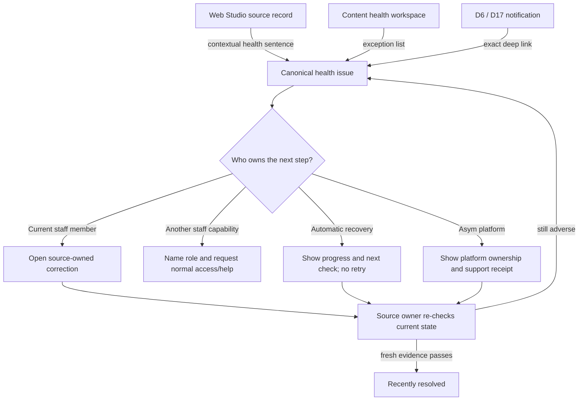

# Phase 23 D31 Content Health Staff UX Benchmark

**Status:** Complete supporting UX contract for the founder-ratified Phase 23
D31 C-prime-R decision. It defines measurable staff journeys and interface
behavior without independently expanding the ratified authority or authorizing
implementation.  
**Researched:** 2026-08-24  
**Ratified:** 2026-08-24  
**Scope:** One quiet, derived, exception-first Content Health workspace;
contextual status on affected Web Studio records; cause-owned typed recovery;
ordinary tenant staff, tenant administrators, Asym support, and platform
operators; desktop, narrow viewport, touch, keyboard, screen reader, zoom, and
low-bandwidth use.  
**Authority boundary:** This is decision evidence, not an implementation,
schema, RLS, dependency, provider, deployment, or production-access
authorization. It does not independently ratify or alter D31, create another
authority, or alter Phase 23 D1-D30.

## UX verdict

The correct D31 experience is not a second monitoring console and not a wall of
green checks. It is a calm work surface that answers a staff member's real
questions in plain language:

1. **What is affected?**
2. **Can visitors see or use it?**
3. **What happened?**
4. **Is Asym already handling it?**
5. **Who owns the next step?**
6. **What is the one useful action now?**
7. **When was this last verified, and when will it be checked again?**
8. **How will I know it is actually fixed?**

The permanent UX therefore has three connected surfaces, all showing the same
derived issue identity rather than three copies of state:

- one quiet **Content health** workspace for cross-content exceptions;
- one concise contextual health sentence on the affected Page, Navigation,
  schedule, media item, import, or Site Plan surface; and
- one canonical issue-detail page with impact, evidence freshness, recovery,
  history, and support handoff.

Healthy work remains quiet. Automatic recovery remains visible but does not
interrupt. Human notification begins only when a human can help, a promised
deadline is missed, or visitor/safety impact warrants attention. A missing or
stale health check is never rendered as healthy.

This applies the strongest parts of current CMS and operations practice without
copying their shortcomings:

- WordPress Site Health separates attention items from technical information
  and passed checks; D31 should preserve the attention-first split but avoid a
  gamified percentage score or a large default list of passed tests.
- Contentful exposes scheduled, completed, and failed work and deep-links a
  failed action back to its editor; D31 should generalize that source-owned
  return path across every content-health family.
- Sanity surfaces validation warnings in release context; D31 should surface
  readiness failures where staff are already editing, not require a separate
  monitoring visit to discover them.
- Google SRE guidance distinguishes actionable human alerts from ticket-level
  or dashboard information and recommends symptom-led notification. D31 should
  lead with visitor impact while retaining cause evidence for authorized
  diagnosis.
- Payload and Inngest expose job/run attempts, traces, backlog, replay, and raw
  errors. Those are useful engine/operator facts, not an ordinary staff
  vocabulary or a safe generic recovery API.

## Verified Core baseline

The current repository has useful presentation primitives, but no verified D31
Content Health product.

| Verified source                                                                                               | Current behavior                                                                                                                                                                    | D31 implication                                                                                                                                                                                       |
| ------------------------------------------------------------------------------------------------------------- | ----------------------------------------------------------------------------------------------------------------------------------------------------------------------------------- | ----------------------------------------------------------------------------------------------------------------------------------------------------------------------------------------------------- |
| `docs/guides/architecture/web-studio-living-spec.md:9-19`                                                     | Web Studio is a Mission Control-native shell around Payload; native list/edit chrome is custom while Payload still owns fields, validation, drafts, versions, uploads, and Lexical. | D31 belongs in the Asym-owned shell and must deep-link to source-owned Payload forms rather than recreate them.                                                                                       |
| `docs/guides/architecture/web-studio-living-spec.md:37-77`                                                    | Payload 4 remains an internal spike and several Web Studio paths remain partial. No Content Health workspace is listed as shipped.                                                  | The benchmark must not describe D31 as implemented or depend on an unqualified Payload UI.                                                                                                            |
| `apps/admin/src/cms-ui/web-studio/shell/studio-nav-rail.tsx:161-244`                                          | The navigation rail uses shared buttons/tooltips and configured collections, but is hidden below `md`.                                                                              | Content Health can join this navigation, but a nav item cannot be its only entry and a real mobile navigation path is a prerequisite.                                                                 |
| `apps/admin/src/cms-ui/web-studio/shell/studio-top-bar.tsx:35-97`                                             | The top bar shows Mission Control, Web Studio breadcrumbs, and the signed-in email. The inspected file does not show Tenant or Site context.                                        | D31 must inherit the exact D30 Tenant/Site context control; it must not invent a local selector or imply the current shell already provides one.                                                      |
| `apps/admin/src/cms-ui/web-studio/collections/shared/list-workspace/NativeCollectionListView.tsx:171-279`     | Native lists use `StudioLayout`, compact `PageShell`, `FilterBar`, a bordered card, pagination, and Payload preferences.                                                            | Reuse the shell rhythm and URL-aware list conventions, but use health-specific cards rather than exposing Payload's stock list.                                                                       |
| `apps/admin/src/cms-ui/web-studio/collections/shared/list-workspace/NativeCollectionListView.tsx:299-312`     | A no-results state provides a title and corrective text.                                                                                                                            | D31 needs distinct first-use, filtered-zero, verified-healthy, unavailable, and permission-limited empty states; one generic empty state is insufficient.                                             |
| `apps/admin/src/cms-ui/web-studio/collections/shared/document-workspace/NativeCollectionEditView.tsx:288-460` | Document chrome already distinguishes publication status from a primary editor-state badge.                                                                                         | Content health must remain a separate derived fact and cannot overload `Published`, `Draft`, `Saved`, or editor state.                                                                                |
| `apps/admin/src/cms-ui/web-studio/collections/shared/document-workspace/NativeCollectionEditView.tsx:536-671` | A semantic `Document state` section displays four compact state tiles.                                                                                                              | Use the same token rhythm, but do not add a permanent fifth tile to every healthy document. Show one compact health row only when relevant; keep healthy status in the inspector or a quiet sentence. |
| `apps/admin/app/(app)/contributions/needs-attention-panel.tsx:37-95`                                          | A current Mission Control panel is absent when there are no issues and groups attention items.                                                                                      | Quiet-on-healthy and cause grouping are good precedents. D31 still needs a deliberate all-clear state when staff open the dedicated workspace.                                                        |
| `apps/admin/features/mission-control/components/WorkflowSummariesTable.tsx:8-21`                              | A current operational table exposes `dispatching`, `processing`, `retrying`, `failed`, `dead_letter`, attempts, subject IDs, and error codes.                                       | Do not reuse this as staff Content Health. It is provider/run-shaped evidence suitable only behind D30-governed operations.                                                                           |
| `packages/ui/components/primitives/page-shell.tsx:24-119`                                                     | `PageShell` provides compact/default density and respects reduced motion and route-transition ownership.                                                                            | Use compact density and retain the reduced-motion behavior. Do not add animated health counters or pulsing status decoration.                                                                         |
| `packages/ui/components/shadcn/alert.tsx:26-34`                                                               | The shared `Alert` always renders `role="alert"`.                                                                                                                                   | Use it only for a dynamically introduced urgent condition. Static issue cards, healthy states, and routine retry status must not all become assertive announcements.                                  |
| `packages/ui/components/shadcn/empty.tsx:61-79`                                                               | `EmptyTitle` and `EmptyDescription` render generic `div` elements; `EmptyDescription` is typed as a `p` prop surface but does not render a paragraph.                               | Supply real heading/paragraph semantics around D31 empty states or repair the primitive before relying on it for that structure.                                                                      |
| `packages/ui/components/primitives/filter-bar.tsx:75-80`                                                      | The active-filter removal control in the inspected implementation is an icon-only button without an explicit accessible name.                                                       | D31 may reuse the visual pattern only after every filter removal control has a contextual name such as `Remove Site: Bangkok`.                                                                        |
| `packages/ui/components/shadcn/data-table/data-table-card-view.tsx:138-220`                                   | Mobile cards may make the whole card a `role="button"` while also rendering selection and row actions.                                                                              | D31 cards contain links and actions, so use semantic article/list structure with a normal issue-title link rather than a nested interactive whole-card target.                                        |

The repo's frontend contract remains authoritative: shared `@asym/ui` Base UI
primitives, Maia/Zinc tokens, Lucide icons, explicit property transitions, no
hover-only information, no color-only state, no app-local shadcn copies, and no
new animation grammar for routine status polling.

## People and nonprofit ministry contexts

### Communications coordinator

Publishes campaign Pages, stories, newsletters, missionary updates, and urgent
appeals. Usually needs to know whether a donor-facing change is live and whether
anything requires a content correction. They should never need to understand a
queue, run ID, cache tag, or provider retry.

### Small-organization administrator

May be the only staff member managing content, donors, media, and support. They
need a single ordered list, not separate search, schedule, redirect, cache, and
media consoles. The product must distinguish what they can fix from what Asym
must fix.

### Ministry leader or country-office reviewer

Often reviews a Page through a direct link and may have view but not publish or
repair capability. They need truthful impact and the responsible staff role,
without disabled buttons that make them guess why they cannot act.

### Multilingual editor

Needs Site, locale, source locale, and affected public path named together.
They must not mistake a healthy default locale for a healthy untranslated
locale, or an intentionally unreleased locale for a failure.

### Media steward

Needs processing, usage, and qualification outcomes in content language: which
public placement is affected, whether the original is safe, and whether to
replace metadata, replace a file, or wait. They do not need storage bucket or
image-worker terminology.

### Migration administrator

Uses D29's staged import product. Content Health may surface a migration
mismatch after import, but the repair action must return to the exact D29 run,
plan, or imported draft. D31 must not create a second migration repair wizard.

### Tenant access administrator

Needs to understand that an issue exists even when the current editor lacks the
capability to fix it. Access administration remains D12/D30-owned; Content
Health names the missing capability and links to the normal access workflow.

### Asym support specialist

Starts from a privacy-minimal issue receipt and product-owned evidence. They do
not ask staff to copy logs, raw content, tokens, database rows, or provider
screenshots.

### Platform operator

Uses D30-governed diagnostics only when product evidence is insufficient for an
incident. Provider observability and replay may support diagnosis, but the
operator invokes the cause owner's typed repair—not a staff-facing generic
replay button.

## Product vocabulary

Use one consistent vocabulary everywhere.

| Concept                   | Staff label                 | Meaning                                                                                                     | Never imply                                                                   |
| ------------------------- | --------------------------- | ----------------------------------------------------------------------------------------------------------- | ----------------------------------------------------------------------------- |
| Product area              | **Content health**          | Current, derived evidence about whether public content and its required delivery work need attention.       | A second publication authority or a complete infrastructure monitor.          |
| Active staff work         | **Needs action**            | A person or named staff capability must do something. Each item names whether the current viewer can do it. | Every viewer personally owns every item.                                      |
| Normal recovery           | **Updating automatically**  | The cause owner accepted the work, it remains within its expected window, and staff action would not help.  | Completion, success, or a promise that the visitor experience is unaffected.  |
| Product incident          | **Platform attention**      | Asym—not tenant staff—owns the next step.                                                                   | The staff member should retry, contact a vendor, or inspect provider details. |
| Unproven state            | **Health check incomplete** | Required evidence is missing, stale, conflicted, or currently unavailable.                                  | Healthy, failed, or safe by assumption.                                       |
| Closed exception          | **Resolved**                | Fresh source-owned evidence proves the adverse condition no longer applies.                                 | Acknowledged, snoozed, retried, or merely marked complete by a job provider.  |
| Shared acknowledgement    | **Reviewed**                | A named staff member has seen the issue.                                                                    | Ownership transfer, recovery, or resolution.                                  |
| Personal reminder control | **Remind me later**         | Pause that viewer's reminder until a bounded time.                                                          | Hide the issue, unblock release, or suppress another user's warning.          |

Avoid `dead letter`, `run`, `workflow`, `job`, `queue`, `payload`, `replay`,
`cache tag`, `CAS`, `projection row`, `hook`, `500`, and raw error codes in
ordinary staff copy. Technical details can contain a safe correlation code and
source-owner name, but no provider body, stack trace, or sensitive identifier.

### Status and visitor impact are separate dimensions

`Needs action` says who must act. It does not say how bad the impact is. Each
issue separately carries one plain-language impact label:

- **Immediate safety action** — restricted/private content exposure or required
  takedown containment is not proven;
- **Visitors blocked** — a live journey or complete public Page is unavailable;
- **Some visitors affected** — discovery, locale, redirect, media, or a bounded
  part of a Page is impaired;
- **No current visitor impact** — a draft, future schedule, import, or
  redundancy issue requires work before release; or
- **Impact not yet verified** — evidence is incomplete.

Color may reinforce these labels but never replace the text and icon. Do not
reduce this to `critical`, `high`, `medium`, and `low`; those labels force staff
to infer the visitor consequence.

## Information architecture

### Navigation

- Add **Content health** as one Web Studio destination.
- Show a count only for unresolved items that need tenant staff action. The
  accessible link name is, for example, `Content health, 3 items need action`.
- Do not show a green zero badge, animated dot, or total automatic-work count in
  navigation.
- Never make navigation the only entry. Affected records, notifications, import
  runs, schedule pages, and support receipts deep-link to the same issue.
- The current `StudioNavRail` is hidden on narrow viewports, so D31 launch must
  include a verified mobile Web Studio navigation path or an always-available
  Content Health link in the top-level mobile menu.

### Workspace header

Use `StudioLayout` and compact `PageShell`.

**Title:** Content health  
**Healthy description:** `No content issues need attention for [Site].`  
**Exception description:** `3 items need staff action for [Site]. Asym is
handling 2 others automatically.`

Repeat exact organization, environment where relevant, Site, and current locale
scope through the D30 context surface. Do not display raw Tenant/Site IDs. A
scope change reloads URL-bound results and announces the new result count
politely; it cannot silently carry filters or selected issues into the new
Tenant.

### Four link-native views

Use ordinary links with `aria-current="page"` and URL state, not a visually
tabbed widget whose state cannot be shared or restored.

1. **Needs action** — unresolved issues where tenant staff action is required.
   Each card says `You can fix this` or names the staff capability needed.
2. **Updating automatically** — accepted recovery within its expected window.
   It is visible for confidence but is not the landing view when action exists.
3. **Platform attention** — Asym-owned incidents or repairs. The staff action is
   normally `View details`, not `Retry`.
4. **Recently resolved** — bounded recent history with who/what resolved it and
   the verification time.

Use short counts in the link text. Counts are exact for the active scope and
must not disclose inaccessible records. On narrow screens the links wrap in DOM
order; do not require horizontal swiping.

### Default ordering

Use one code-owned order:

1. immediate safety action;
2. visitors blocked;
3. overdue publication/takedown or upcoming release blocker;
4. some visitors affected;
5. no current visitor impact;
6. within each tier, oldest unresolved adverse state first.

Staff may filter by Site, locale, content family, impact, and owner, and search
by authorized title or public path. Avoid arbitrary sort builders, customizable
severity formulas, configurable columns, and user-authored health rules in
Phase 23. D20's saved personal/Site-shared views may preserve these bounded
filters later without changing health truth.

## Quiet healthy and empty states

There are five materially different empty states; never collapse them into `No
results`.

### Verified healthy

**Heading:** `No content issues need attention`  
**Body:** `Content health was last checked at 10:42 AM ICT for Hope Thailand —
English (Thailand). Automatic checks will continue.`  
**Secondary disclosure:** `What is being checked?`

The disclosure lists covered families and freshness, not hundreds of passed
tests. It must say if any family is intentionally unavailable or out of scope.
Do not use a percentage score, celebratory confetti, or a large green gauge.

### Checks are still starting

**Heading:** `Content checks are still finishing`  
**Body:** `We have not finished checking search, redirects, and media yet. No
action is needed while these checks remain on time.`  
**Status:** `3 of 6 check families complete. Next update by 10:50 AM ICT.`

This is not healthy and must not render a green all-clear.

### Filtered zero

**Heading:** `No issues match these filters`  
**Body:** `There may still be issues elsewhere in this Site.`  
**Action:** `Clear filters`

### No access

**Heading:** `Content health is not available with your current access`  
Explain the missing capability and whether the user can request access. Do not
show counts, titles, paths, or imply whether protected issues exist.

### Health service unavailable

**Heading:** `We cannot refresh content health right now`  
Show the last known result only when its age and incompleteness are explicit.
State what happened to an attempted action, provide `Try again`, and offer a
privacy-safe `Get help` route. Preserve independent content editing if its
authoritative source is healthy; do not disable all Web Studio by association.

## First-use and migration onboarding

D29 owns the import journey and its mismatch resolution. D31 owns how ongoing
health becomes understandable after content enters Web Studio.

### First ordinary Site

Do not open a modal tour or a carousel of coach marks. The first Content Health
visit uses one compact introduction above the current real state:

> **Content health watches the public delivery work around your content.** It
> shows only items that need attention, work Asym is already handling, and
> recently resolved issues. Editing and publication remain in their normal Web
> Studio pages.

Provide `Learn how health works` as a disclosure or help link. Once dismissed,
the introduction stays dismissed per user and can be reopened from Help.

### After a D29 import

1. D29 completes or pauses with its own exact result; D31 never claims the
   imported drafts are public.
2. Content Health begins a baseline check against the imported private drafts,
   references, Site/locale mappings, and destination rules.
3. Until complete, show `Imported content checks are still finishing`, the
   covered families, and a truthful next-check time.
4. Group repeated source causes. Two hundred broken links caused by one missing
   imported Page become one cause card with `200 affected links`, not 200
   notifications.
5. The default first list is `Release blockers`, then `Needs review`, then
   informational omissions. Reuse D29's classifications rather than inventing
   new migration severity.
6. Each mismatch action returns to the exact D29 plan, mapping, or imported
   draft. The health issue remains open until the source owner verifies the
   correction.
7. Preserve source title/path as authorized secondary context. Hide source
   internal IDs and technical mappings behind a support disclosure.
8. A concise completion summary says, for example, `Imported content checks
complete: 4 release blockers, 12 items to review, 126 checks passed.` It does
   not turn passed checks into the main workspace.

### Staff migration mental-model guardrails

- `Imported` means private destination content exists; it does not mean live.
- `Content checks complete` means D31 has current evidence; it does not mean the
  content passed editorial approval.
- `No health issue` does not mean the Page is published.
- `Release blocker` is resolved only by the destination source owner and a
  fresh check, not by acknowledging it in Content Health.
- A source-system outage during validation becomes `Health check incomplete`,
  not a guessed failure or guessed pass.

## Issue-card anatomy

Render issues as semantic list items containing an `article`, a real heading,
normal links, and separate buttons. Do not make the entire card a button when it
contains actions.

Every card has this scan order:

1. **Status and visitor impact** — text labels plus restrained icon/tone.
2. **Issue title** — a specific symptom in product language.
3. **Affected content** — authorized title, Site, locale, and public path or
   content family.
4. **Visitor impact sentence** — what currently works and what may not.
5. **Current handling** — automatic recovery, staff role, or platform owner.
6. **Evidence timing** — last verified and next check, both with absolute time
   available; never relative time alone.
7. **One primary action** — the cause-owned action that can actually help.
8. **Secondary links** — open content, view issue, review acknowledgement.

Example within the normal recovery window:

> **Updating automatically · Some visitors affected**  
> **Search is still updating for Easter outreach**  
> Hope Thailand · English (Thailand) · `/easter-outreach`  
> The Page works by direct link, but it may not appear in Site search yet.  
> Asym is retrying the search update. No staff action is needed.  
> Last checked 10:20 AM ICT · Next check by 10:25 AM ICT  
> **Open Page** · View details

If the same work exceeds its promised window and the cause is platform-owned:

> **Platform attention · Some visitors affected**  
> **Easter outreach may be missing from Site search**  
> The Page is live by direct link. Asym has not yet confirmed it in search.  
> Asym support is investigating. Reference CH-7K4M.  
> Last confirmed 10:20 AM ICT  
> **View details**

Do not show `Retry 4/5`, `function failed`, `dead letter`, or an Inngest/Payload
error in either card.

### Cause grouping

One card represents one stable cause and subject generation. When a common
cause affects multiple Pages, show the count and the first few authorized
examples, with `View all 24 affected items`. Never aggregate across Tenant,
Site, environment, privacy tier, or action owner merely to reduce count.

### Card density

Use one column by default, even on desktop. Exception text and one safe action
matter more than dashboard density. A two-column masonry grid makes priority,
reading order, and keyboard scanning less predictable. Use a maximum readable
line length inside the main content column; details may use a secondary summary
column only at wide breakpoints and must reflow beneath content.

## Canonical issue-detail page

Use a full, URL-addressable page at launch. A duplicate drawer-plus-page
experience adds state and focus complexity without improving the critical
journey. The route must reauthorize Tenant, Site, issue, and capability on every
request and may return a neutral unavailable state.

### Header

- breadcrumb: `Web Studio / Content health / [plain issue title]`;
- status plus visitor-impact labels;
- exact authorized Site, locale, content title, and public path;
- one primary action; and
- `Open source content` as a secondary link.

### Main summary

Present four plain-language sections in this order:

1. **What visitors experience**
2. **What happened**
3. **What is happening now**
4. **What to do next**

If impact is unknown, say exactly which check is incomplete. Never substitute
`No data` or omit the section.

### Recovery panel

Show:

- source owner and responsible staff capability;
- the exact typed action and its consequence;
- whether it changes content, queues verification, or only navigates to a
  source correction;
- expected completion/check window;
- current authorization result; and
- action-receipt status after submission.

Only actions that are safe and meaningful in current state are enabled. If the
viewer lacks access, replace the action with `Publisher access required` and a
normal request/help route; do not show an unexplained disabled button.

### Evidence and history

Show a concise chronological history:

- issue first detected;
- material state changes;
- staff acknowledgement;
- typed recovery requested/accepted/rejected;
- source re-checks;
- resolution or recurrence.

Routine poll attempts and identical retries are collapsed into a sentence such
as `Checked 4 times while search was updating`. Dates use the Site timezone and
offer the viewer conversion where D13/D22 require it.

### Technical details

Collapsed by default and capability-aware. Ordinary staff may see:

- privacy-safe issue reference;
- source-owner family;
- evidence freshness;
- current check generation; and
- safe reason code with a copy button.

Provider names, raw job IDs, stack traces, event bodies, SQL, protected record
IDs, and replay controls remain absent. D30-governed operators may follow the
incident-bound diagnostics route from the support case, not from an ambient
tenant staff link.

## Complete user journeys

### Journey 1 — Automatic recovery succeeds

1. A Page publish completes, but its search projection is not yet visible.
2. The Page shows one subdued sentence: `Page is live. Search is updating
automatically.` The direct public link remains clear.
3. Content Health lists the issue under **Updating automatically**; the landing
   **Needs action** view remains quiet.
4. No email, push, or assertive alert fires while the work is within its
   expected window.
5. A source-owned check proves search visibility. The contextual sentence
   changes to `Search is up to date`; if the editor is present, one polite
   status message announces the change without moving focus.
6. The issue moves to **Recently resolved** with `Resolved automatically` and
   the verification time.
7. Do not notify everyone of routine success. Notify only a viewer who was
   actively watching/subscribed or a person previously notified of the issue.

### Journey 2 — Staff must correct source content

1. A Navigation item references a trashed Page.
2. The Navigation editor shows `1 link needs attention` beside the relevant
   item and links to the canonical issue.
3. The issue says `Visitors selecting “Pray” reach a missing Page`, names the
   affected Site/locale, and states `A navigation editor must choose a live Page
or remove this item.`
4. If authorized, the primary action is **Edit navigation item**. It deep-links
   to the exact source field and leaves Content Health.
5. The editor makes the correction through Payload's source-owned form and
   saves an acknowledged revision.
6. Returning to the issue shows `Checking your change` with the accepted
   revision/evidence time. The issue does not disappear optimistically.
7. Fresh reference and public-generation evidence resolves it. If validation
   still fails, the issue remains with the new specific reason and no duplicate
   card.

### Journey 3 — Typed repair can run safely

1. A transient D1 activation receipt is unresolved, but the exact candidate and
   current head remain compatible.
2. The cause owner exposes **Check and complete this publication** (or another
   domain-specific label), not a generic **Retry**.
3. The detail page states the exact current public consequence and what the
   command may change.
4. Activation sends the stable issue ID, expected issue version, exact source
   intent, and current authorization to the source-owned command.
5. The command either returns an accepted/no-op/rejected receipt. A lost browser
   response is reconciled by receipt lookup; the UI never tells the user to
   click repeatedly.
6. Rejection refreshes current truth and names the new next action. Acceptance
   moves to `Checking result`, not immediately to `Resolved`.

### Journey 4 — Asym owns the incident

1. Search reconciliation is overdue and staff content is valid.
2. The issue moves from `Updating automatically` to **Platform attention**.
3. Staff see what visitors experience, what still works, when Asym last checked,
   and a privacy-safe support reference.
4. There is no staff retry or vendor contact action. If there is a useful
   containment action such as an authorized direct-link alternative, show it
   clearly without pretending it repairs the cause.
5. Support uses product evidence first. Operators open D30 diagnostics only
   from a justified incident.
6. When fresh evidence proves recovery, previously notified staff receive one
   resolution message and the issue moves to Recently resolved.

### Journey 5 — Health evidence becomes stale

1. The health projector cannot verify current redirect state.
2. Existing green/healthy language is withdrawn immediately. The Page or
   workspace says **Health check incomplete**.
3. Show the last confirmed state and timestamp, which families are unverified,
   and whether public delivery is independently known to continue.
4. If an idempotent source-owned check can help, offer **Check again**. If not,
   show **Platform attention**.
5. Do not infer failure merely from missing evidence, but do not infer safety or
   health either.

### Journey 6 — Two staff members act concurrently

1. Maya opens issue version 7; Luis repairs the source and issue version 8 is
   generated.
2. Maya submits the old typed action.
3. Expected-version/current-state validation rejects the stale action without
   changing content.
4. The page refreshes in place and says `This issue changed while you were
viewing it. Luis corrected the Navigation at 10:32 AM.`
5. Focus moves to the updated summary only if Maya submitted an action and must
   understand the result; passive background changes use polite status without
   focus movement.

### Journey 7 — Permission changes during recovery

1. A user opens an issue while authorized, then loses Site or repair access.
2. The issue may remain visible only to the extent current read permission
   allows; the typed command reauthorizes and refuses the mutation.
3. Copy says `Your access changed before this action completed. No new change
was made.`
4. Any locally entered note remains recoverable if policy allows, but protected
   issue/source data is cleared on scope loss.
5. The next step is request access or contact the named staff role—not sign in
   to Payload or ask support to bypass policy.

### Journey 8 — Outcome acknowledgement is unknown

1. A typed repair is accepted, but the client loses its response.
2. The page says `We are confirming whether your request was accepted` and
   disables duplicate submission while checking the stable receipt.
3. A known receipt restores the correct accepted/rejected/no-op state.
4. If it remains unknown after the bounded window, keep the issue open, show a
   support reference, and state `Do not submit again yet` unless the cause owner
   proves a duplicate-safe retry.

### Journey 9 — Staff open a deleted or now-inaccessible issue link

Reauthorize before revealing title, path, locale, counts, or prior state. Show a
neutral `This content-health item is not available` response with safe return
navigation. Do not distinguish another Tenant, removed record, expired history,
or denied permission.

### Journey 10 — Content Health itself is unavailable

1. Preserve the source editor and public-site controls that can operate safely
   without the derived health projector.
2. Remove any false all-clear and show `Cannot refresh content health` with the
   last known time.
3. State whether a submitted repair was accepted, rejected, or unknown.
4. Offer retry and support. Do not recommend database access, provider replay,
   or blind republishing.

## Issue-family copy and actions

The source prompt requires every family below. Staff copy is illustrative but
the ownership and action shape are normative.

| Family                     | Plain issue title and visitor consequence                                                                                            | Default owner                                                     | Typed next action                                                                                                   |
| -------------------------- | ------------------------------------------------------------------------------------------------------------------------------------ | ----------------------------------------------------------------- | ------------------------------------------------------------------------------------------------------------------- |
| Failed publish             | **The selected Page version did not go live.** `Visitors still see the previous live version.`                                       | D1 publication owner; staff only when source validation blocks it | **Review release checks** or a source-owned **Complete publication** only when current-state fencing proves it safe |
| Overdue schedule           | **The 9:00 AM publication is overdue.** State whether the old Page remains live or the new Page is absent.                           | D13 scheduled-publication owner                                   | **Review scheduled publication**; never `Run job`                                                                   |
| Failed unpublish           | **The Page is still public after its unpublish time.** Name current containment and urgent visitor impact.                           | D13/D1 with adverse-first platform escalation                     | **Review unpublish** or an exact source-owned containment command; no generic republish/retry                       |
| Stale cache                | **Some visitors may still see the previous version.** Name affected route, last confirmed generation, and what direct origin proves. | D1 delivery/cache owner                                           | **Check published delivery** or source-owned revalidation; ordinary staff never choose cache tags or purge scope    |
| Failed redirect activation | **The old address does not yet reach the new Page.** State whether it is 404, still old, or unknown.                                 | Redirect/D1 owner                                                 | **Review redirect** if configuration is invalid; otherwise platform recovery                                        |
| Broken Page reference      | **This Page links to unavailable content.** Name the visible link/block and visitor outcome.                                         | Page editor                                                       | **Edit this link** deep-linked to the exact source field                                                            |
| Broken menu reference      | **“Pray” points to an unavailable Page.**                                                                                            | Navigation editor                                                 | **Edit navigation item**                                                                                            |
| Search index lag           | **This live Page may not appear in Site search yet.** Direct link still works.                                                       | D17 automatic recovery, then platform if overdue                  | Usually **Open Page** only; never ask staff to reindex valid content                                                |
| Failed reindex             | **Site search may be missing current content.** Name bounded Site/locale impact.                                                     | D17 platform owner                                                | **View details**; operator uses cause-owned D17 recovery, not tenant replay                                         |
| Failed media processing    | **The new image is not ready for public use.** State whether the prior rendition remains live or the placement is missing.           | D27 media owner; staff if metadata/file is invalid                | **Review media requirements**, **Replace file**, or a safe media-owned **Process again** based on proven cause      |
| Orphaned Page              | **This Page is not placed in the Site tree.** `It will not be reachable through normal Site navigation or release.`                  | Page/Site Plan editor                                             | **Choose a parent Page**, **Place in Site**, or **Move to Trash** through the owning surface                        |
| Invalid Site or locale     | **This Page has no valid destination for [locale].**                                                                                 | Site/locale-capable editor                                        | **Choose Site and language** in the source-owned configuration; no silent fallback                                  |
| Migration mismatch         | **An imported link could not be matched.** State `Private draft only; no live impact` unless independently public.                   | D29 import owner                                                  | **Open import review** at the exact mapping/plan; never a D31 mapping form                                          |

### Engine job-state translation

Payload/Inngest states are evidence, not staff state:

| Engine evidence                                     | D31 presentation                                                                            |
| --------------------------------------------------- | ------------------------------------------------------------------------------------------- |
| queued / running / retrying within bound            | **Updating automatically**, with visitor impact, owner, last check, and next expected check |
| completed                                           | Do not resolve until source-owned effect verification passes; then **Resolved**             |
| failed with a staff-correctable source cause        | **Needs action**, deep-linked to the exact source correction                                |
| failed/dead/overdue with no staff-correctable cause | **Platform attention**                                                                      |
| missing, conflicting, or stale evidence             | **Health check incomplete**                                                                 |

## Contextual status in source workspaces

Contextual status removes the need for staff to remember to visit a central
console.

### Placement

- Put the status adjacent to the action or content it qualifies: beneath Page
  publication state, beside the broken Navigation item, inside the scheduled
  publication summary, beside a media rendition, or in the D29 result.
- Use one sentence and one link. Do not duplicate the full issue card.
- A status must never obscure Payload validation or the D12 save state.
- Healthy context is a quiet text line or inspector fact, not another prominent
  green badge on every Page.
- One record with multiple issues shows `3 content health items` and leads to a
  scoped list rather than stacking three banners.

### Contextual copy ladder

1. `Content health is up to date. Last checked 10:42 AM.`
2. `Page is live. Search is updating automatically.`
3. `1 link needs attention before this Page can be released.`
4. `Asym is working on a search issue. The Page still works by direct link.`
5. `Content health could not be fully checked. Last confirmed 10:20 AM.`

Only levels 3-5 require prominent treatment. Level 2 is subdued. Level 1 may be
hidden until the user opens status/inspector detail.

## Acknowledge, reminders, and resolution

These controls are intentionally separate.

### Reviewed

- Shared, attributable receipt: `Reviewed by Maya Chen at 10:31 AM`.
- Signals awareness and can suppress duplicate reminder delivery to that same
  person.
- Does not change status, impact, ordering, release blockers, or health counts.
- Does not create assignment, due dates, comments, or a Phase 34 workflow.

### Remind me later

- Personal notification preference with bounded presets and an exact date/time.
- Does not hide the issue from Content Health, contextual status, other users,
  release checks, or platform operations.
- Cannot suppress an immediate safety alert or required deadline/takedown
  escalation.
- Shows `Your reminder is paused until…` and offers **Resume reminders**.

### Resolved

- Set only from fresh source-owned evidence.
- Records whether resolution was automatic, caused by a named content revision,
  caused by a typed repair receipt, or superseded by an authoritative state
  change.
- A recurrence creates/advances the stable cause lineage and shows prior
  resolution in history; it is not hidden as a brand-new unrelated issue.
- Recently resolved history is bounded by a product retention/window policy;
  the UI must state the visible date range rather than silently dropping items.

Do not ship manual **Mark resolved**, **Dismiss issue**, **Ignore forever**, or
**Close alert** controls.

## Notifications

Phase 6/17 owns delivery and templates. D31 supplies a privacy-minimal semantic
event; it does not send email directly.

### Notify immediately

- immediate safety action or unproven adverse containment;
- visitors blocked and a staff action can help;
- failed/overdue unpublish or a fixed publication deadline;
- a platform incident with material current visitor impact when tenant staff
  need to know; or
- permission/access change that interrupts an in-progress recovery.

### Keep in product or digest

- automatic work within its expected window;
- no-current-impact draft/reference/import work;
- routine resolved history;
- healthy checks; and
- repeated evidence from the same stable issue.

### Notification anatomy

Every notification names Site, authorized content title/family, visitor impact,
owner, and one next action; it links directly to the canonical issue. It does
not include protected body content, raw provider error, secret URL, token, or
unbounded ID. Dedupe by stable issue lineage and material state transition.

Resolution notification goes only to people who were notified, subscribed, or
actively acted on the issue. A reminder never becomes a second health record.

## Support and platform escalation

### Staff handoff

**Get help** creates or opens a support case containing only:

- stable privacy-safe issue reference;
- current authorized organization/Site/locale scope;
- source-owner family and safe reason code;
- visitor-impact class;
- first/last detected and evidence freshness;
- attempted typed action and known receipt outcome; and
- the staff member's optional plain-language question.

Do not include content bodies, media bytes, form submissions, raw event
payloads, stack traces, credentials, signed URLs, or database/provider IDs.

### Support journey

1. Read product evidence and source-owner history.
2. Use D30's audited read-only View as only when needed and within lesser
   access.
3. Resolve staff confusion or source correction without engine diagnostics
   whenever possible.
4. If product evidence is contradictory or insufficient, create a justified
   incident and request D30 Engine Diagnostics.
5. An operator may inspect provider traces/backlog/replay eligibility, but the
   repair remains a typed source-owner command with current-state fencing.
6. Close the support case only after D31 receives fresh resolution evidence or
   records an explicit still-open owner/next step.

Provider replay is never exposed as an ordinary Content Health action. Inngest's
own replay UI selects runs by time range/status and can include previously
successful runs; that is an incident-operator capability, not an editor-safe
semantic command.

## Responsive and low-bandwidth behavior

### Wide screens

- Single ordered issue column, optional narrow summary/filters column.
- Exact scope and four views remain near the page heading, not in a hidden
  dashboard panel.
- Issue detail may place evidence/history beside the main summary only when DOM
  reading order remains summary, action, evidence.
- No sticky footer or action bar may cover focused controls.

### Narrow screens and 400% zoom

- One-column order: scope, page summary, views, filters, issue list.
- View links wrap; filters expand inline below a clearly named button.
- Every card keeps title, impact, owner, timing, and primary action visible; do
  not collapse the only next step into an unlabeled overflow menu.
- Issue detail remains a full page, not a narrow side sheet.
- Long paths wrap or truncate visually with a full accessible value and copy
  action; no whole-page horizontal scrolling.
- Touch targets meet at least WCAG 2.2 minimum spacing/size and Core's stronger
  shared token conventions.
- No swipe-only action, hover-only explanation, drag-and-drop repair, or
  precision pointer target.

### Low bandwidth and reconnect

- Server-render the last authorized issue snapshot where safe, with explicit
  freshness.
- Skeletons are short-lived loading affordances, never a substitute for an
  unavailable message.
- Polling backs off and does not announce every refresh.
- A submitted recovery uses a stable receipt and survives navigation/reload.
- On reconnect, reload current truth before enabling a previously prepared
  action.

## Accessibility contract

1. One `h1` names Content health. View headings and issue titles follow a
   coherent hierarchy; generic `div` titles do not stand in for headings.
2. Use a labelled navigation landmark for the four views and `aria-current` on
   the active link.
3. Issue results are a semantic list. Each issue is an article/list item with a
   normal title link; cards containing actions are not whole-card buttons.
4. All status/impact meanings use text and, optionally, icon plus color. No
   color-only distinction.
5. Non-urgent background transitions use one polite `role="status"` region.
   Announce material state changes and result counts, not every polling tick or
   retry attempt.
6. Use `role="alert"` only for newly introduced urgent warnings or submitted
   errors requiring immediate awareness. Static issues present at page load are
   normal structured content.
7. A typed-action validation/submission failure produces a persistent error
   summary with links to affected controls and equivalent adjacent error text.
8. Submitting an action moves focus to the result summary when the user must
   respond; passive resolution never steals focus.
9. Every icon-only control has a contextual accessible name. Filter chips say
   `Remove Locale: Thai`, not merely `Remove filter`.
10. Expose expanded, pressed, selected, busy, and current state through native
    or Base UI semantics. Do not use positive `tabIndex`.
11. Modal confirmation is reserved for consequential commands. Initial focus,
    containment, Escape behavior, and restoration return to the invoking
    action. Safe navigation and idempotent checks do not need confirmation.
12. Acknowledgement and reminder controls state explicitly that they do not fix
    or hide the issue.
13. Relative time always has an absolute Site-timezone value available. Do not
    rely on `5 minutes ago` alone.
14. Text reflows at 400% zoom and 320 CSS-pixel width without two-dimensional
    scrolling for ordinary content. Tables, if used only for technical history,
    receive an accessible alternative/card layout.
15. Sticky headers, banners, and actions never fully obscure focused elements.
16. Automatic status motion is restrained and optional. Respect Core's global
    reduced-motion baseline; no pulsing red dots, progress shimmer after load,
    or motion-dependent meaning.
17. All critical tasks work with keyboard, screen reader, touch, voice input,
    narrow viewport, high zoom, and without hover.

An automated axe pass is necessary but not sufficient. Manual verification must
cover reading order, live-region frequency, focus movement/restoration, status
comprehension, zoom/reflow, touch, and low-bandwidth recovery.

## Edge-state UX matrix

| Scenario                                              | Required experience                                                                 | Prohibited shortcut                                         |
| ----------------------------------------------------- | ----------------------------------------------------------------------------------- | ----------------------------------------------------------- |
| Healthy projection but one source heartbeat is stale  | Withdraw all-clear; **Health check incomplete** with last confirmed time            | Keep green because no active issue row exists               |
| Same cause emits 500 retries                          | One issue with collapsed retry evidence                                             | 500 cards or 500 notifications                              |
| One incident affects 2,000 Pages                      | One cause card plus authorized affected count/list                                  | Render/paginate 2,000 duplicate issue cards as primary work |
| One Page has unrelated broken link and search lag     | Two cause-owned issues with different owners/actions, scoped under one Page summary | One vague `Page unhealthy` card                             |
| Viewer can read but cannot repair                     | Show issue safely, name required capability and next route                          | Disabled mystery button or hidden reason                    |
| Viewer loses issue read access                        | Neutral unavailable page; clear protected cached data                               | Reveal prior title/path/count in denial copy                |
| Tenant/Site context changes                           | Cancel selection, reload and announce exact scoped count                            | Carry issue IDs/actions across context                      |
| Current Page changed after issue opened               | Refresh current source/evidence; reject stale command                               | Run action against the old assumption                       |
| Automatic work exceeds deadline                       | Transition once to staff/platform attention based on cause; notify by policy        | Remain `Updating` forever                                   |
| Provider says completed but effect verification fails | Stay open and say verification failed/incomplete                                    | Mark resolved from provider completion                      |
| Typed action accepted, response lost                  | Receipt reconciliation and `Confirming request`                                     | Encourage repeated clicks                                   |
| Repair no longer needed                               | Source command returns no-op; verify and resolve with explanation                   | Perform redundant side effect                               |
| Repair partially succeeds                             | Name completed and remaining effects; keep issue open                               | Generic success toast                                       |
| Health projector unavailable                          | Last known snapshot with age, no all-clear, retry/support                           | Blank list interpreted as healthy                           |
| Public Page remains available during search lag       | Say direct link works and discovery may be affected                                 | `Website down` or `No impact`                               |
| Safety/takedown containment is unknown                | Immediate safety wording and operator escalation                                    | Snooze, digest, or wait for ordinary retry window           |
| Issue recurrence after resolution                     | Continue cause lineage and show prior resolution                                    | Hide history as a new unrelated issue                       |
| Reminder snoozed                                      | Keep issue/status/count visible; pause only viewer reminder                         | Remove blocker from shared workspace                        |
| Issue acknowledged                                    | Show reviewer/time; preserve issue state                                            | Treat Reviewed as Resolved                                  |
| Locale intentionally not released                     | Not an error; explain current locale release state                                  | Infer missing translation is failed publication             |
| Source item moved to D21 Trash                        | Update reference cause and recovery; no duplicate ghost item                        | Generic 404 with no owner                                   |
| D29 import stopped before writes                      | No destination content-health issue; link to D29 result                             | Create orphan/mismatch issues for nonexistent drafts        |
| D29 imported private drafts                           | `No current visitor impact`; release blockers clearly separate                      | Present drafts as public failures                           |
| Support case closes before health recovers            | Issue remains with owner/next check                                                 | Close issue because support ticket closed                   |
| User opens expired Recently resolved link             | Neutral unavailable/archived outcome per retention policy                           | Reconstruct protected history from logs in browser          |

## User research and launch proof

### Required participants

Moderated testing must include, at minimum:

- two nonprofit communications/content coordinators from small teams;
- one larger ministry digital lead managing multiple Sites/locales;
- one multilingual editor working outside the Site's default locale;
- one media steward;
- one staff reviewer without publish/repair capability;
- one tenant access administrator;
- one migration administrator with WordPress, Drupal, Contentful, Sanity,
  SiteStacker, or custom-site migration experience;
- one Asym support specialist;
- one platform operator;
- one keyboard-only participant;
- one screen-reader participant; and
- one participant using a narrow/mobile viewport and constrained connection.

Do not use only engineers, synthetic personas, or people already familiar with
Payload/Inngest terminology.

### Required tasks

1. Explain a healthy workspace and the freshness/coverage that supports it.
2. Distinguish `Updating automatically` from `Needs action` without help.
3. Determine whether visitors can still reach a Page during search lag.
4. Correct a broken Navigation reference from contextual status through fresh
   resolution proof.
5. Recognize that a platform-attention issue has no useful tenant retry.
6. Handle a stale health check without assuming healthy or failed.
7. Recover from a stale typed action caused by another editor.
8. Explain the difference between Reviewed, Remind me later, and Resolved.
9. Find the responsible role when the participant lacks repair access.
10. Move from a D29 migration mismatch to the exact import review and back.
11. Use a support receipt without exposing technical/private data.
12. Find a recently resolved issue and explain what evidence closed it.
13. Complete the same core journeys with keyboard and screen reader.
14. Complete the same core journeys at 400% zoom and on a narrow viewport.

### Launch thresholds

- **Comprehension:** At least 90% of participants correctly identify affected
  content, current visitor impact, owner, and next action within 60 seconds of
  opening an unfamiliar issue.
- **Action accuracy:** At least 90% choose the correct first action without
  moderator help; zero participants are induced to run an unsafe/generic replay.
- **End-to-end recovery:** At least 90% of authorized staff complete the broken
  reference journey and understand that `Checking your change` is not yet
  resolved.
- **No false green:** Zero participants interpret `Health check incomplete` or
  a filtered-zero state as verified healthy.
- **Control semantics:** At least 90% can explain Reviewed, Remind me later, and
  Resolved after using each once.
- **Scope safety:** Zero cross-Tenant/Site/locale disclosures or actions in
  adversarial tests; participants always identify current Site/locale before a
  consequential repair.
- **Accessibility:** Every critical task is independently completable by the
  keyboard-only and screen-reader participants, at 400% zoom, and on narrow
  viewport. Automated WCAG A/AA findings are zero at launch, with manual limits
  documented.
- **Notification quality:** No duplicate notification for identical evidence;
  every delivered notification has a useful recipient action or explicit
  platform-information reason.
- **Support readiness:** Support resolves the staged staff confusion and
  platform incident using product evidence first, without asking for raw logs,
  provider access, or database inspection from tenant staff.

### Privacy-safe product metrics

Instrument safe semantic codes and timings, not content bodies or raw search
phrases:

- time from issue open to source-owned action;
- action accepted/rejected/stale/unknown outcome;
- time from source correction to fresh resolution evidence;
- issue recurrence by cause family and catalog version;
- notification delivered/opened/actioned/deduplicated;
- repeated acknowledgements without corrective action;
- reminder resume/expiry;
- support escalation reason;
- `Health check incomplete` age and frequency;
- filtered-zero followed by filter clear; and
- abandonment after permission denial or unknown acknowledgement.

Do not optimize for closing counts or shortening resolution at the expense of
safe verification. A staff member should never be rewarded for dismissing,
snoozing, or repeatedly retrying issues.

## Visual and interaction fit with Core

### Use

- `StudioLayout` and `StudioTopBar` breadcrumb rhythm;
- compact `PageShell` for heading, description, and exact scope actions;
- shared Base UI buttons, disclosures, dialogs, tooltips, and accessible menus;
- `FilterBar` visual rhythm after accessible-name remediation;
- `Card`, restrained `Badge`, `Skeleton`, and `Empty` composition with explicit
  semantic headings/paragraphs;
- Maia/Zinc tokens and existing success/warning/destructive semantic tokens;
- Lucide icons as redundant cues; and
- ordinary Link routing so views, filters, and issue details are deep-linkable.

### Do not use without redesign

- `WorkflowSummariesTable` as the staff product;
- whole-card `role="button"` with nested actions;
- shared `Alert` for routine static status;
- a fifth permanent tile in `NativeDocumentStateStrip`;
- hardcoded Zinc/rose/blue/amber color classes from an operational prototype;
- a chart, pie, health percentage, streak, or green KPI grid;
- pulsing/animated error indicators;
- toast-only failure or success;
- hover-only diagnostics;
- provider links or raw Payload stock list as recovery; or
- a desktop-only nav path.

### Motion

No motion is required for health comprehension. Preserve `PageShell`'s existing
route/header behavior and Core's reduced-motion baseline. A newly resolved card
may update in place without layout spring/stagger. Do not animate list reordering
while a user is reading or operating controls; announce the material change and
move it on the next stable refresh or with an explicit `View resolved` link.

## Primary-source benchmark map

| Primary source                                                                                                                                                 | Verified practice                                                                                                                                                                     | D31 application                                                                                                         |
| -------------------------------------------------------------------------------------------------------------------------------------------------------------- | ------------------------------------------------------------------------------------------------------------------------------------------------------------------------------------- | ----------------------------------------------------------------------------------------------------------------------- |
| [Google SRE — Monitoring Distributed Systems](https://sre.google/sre-book/monitoring-distributed-systems/)                                                     | Dashboards summarize core signals; alerts are human notifications; symptom-led and actionable signals should interrupt while subcritical information remains in lower-noise surfaces. | Exception-first landing, visitor-impact lead, low-noise automatic work, cause detail behind the issue.                  |
| [Google SRE — Practical Alerting](https://sre.google/sre-book/practical-alerting/)                                                                             | Aggregation, minimum durations, deduplication, inhibition, and differentiated page/ticket/informational channels reduce noise.                                                        | Stable issue lineage, bounded automatic window, grouped causes, deduplicated notification, no retry spam.               |
| [WordPress Site Health](https://wordpress.org/documentation/article/site-health-screen/)                                                                       | Separates attention-oriented Status from technical Info and groups critical, recommended, and passed checks.                                                                          | One staff exception workspace plus collapsed coverage/evidence; do not default to passed checks or technical inventory. |
| [Contentful scheduled content](https://www.contentful.com/help/scheduled-publishing/scheduled-content-page/)                                                   | Scheduled, completed, and failed actions are separated; failed actions deep-link back to the entry editor; later invalid edits can cause failure.                                     | Status/history separation, source-owned repair deep link, exact current-state explanation.                              |
| [Sanity Content Releases](https://www.sanity.io/docs/user-guides/content-releases)                                                                             | Release details expose change counts and validation warnings before publication.                                                                                                      | Surface content readiness where staff work and distinguish release blocker from delivery incident.                      |
| [Payload Jobs Queue](https://payloadcms.com/docs/jobs-queue/overview) and [Tasks](https://payloadcms.com/docs/jobs-queue/tasks)                                | Jobs persist queue/retry/error state and tasks may retry or cancel. Completion/error is engine evidence, while the application still defines business meaning.                        | Never equate a job state with source-owned health; translate it through D31 and verify effects before resolution.       |
| [Inngest observability](https://www.inngest.com/docs/platform/monitor/observability-metrics)                                                                   | Provider UI exposes failure rate, volume, throughput, backlog, traces, raw event/run detail, and operator search.                                                                     | Keep these in D30-governed operator diagnosis, not ordinary staff Content Health.                                       |
| [Inngest Replay](https://www.inngest.com/docs/platform/replay)                                                                                                 | Bulk replay selects function runs by time range/status after an incident fix, including potentially successful runs.                                                                  | Replay is an operator incident tool; staff invoke only cause-owned typed repairs with current-state fencing.            |
| [GOV.UK notification banner](https://design-system.service.gov.uk/components/notification-banner/)                                                             | Use banners sparingly, avoid multiple banners, place directly relevant information in page content, and do not use banners for validation errors.                                     | One contextual status sentence, one highest-priority global notice, persistent inline issue/error content.              |
| [GOV.UK error summary](https://design-system.service.gov.uk/components/error-summary/)                                                                         | Validation errors need a top summary, matching adjacent messages, links, and deliberate focus.                                                                                        | Typed recovery errors remain persistent, actionable, and keyboard/screen-reader discoverable.                           |
| [GOV.UK service unavailable pages](https://design-system.service.gov.uk/patterns/service-unavailable-pages/)                                                   | State availability, timing, what happened to submitted work, alternatives, and contact information; avoid vague language.                                                             | Health outage and unknown-acknowledgement states say what happened, what was saved/accepted, and the next route.        |
| [Atlassian empty state](https://atlassian.design/components/empty-state/examples)                                                                              | An empty state explains why no data appears and what the user can do next.                                                                                                            | Distinct healthy, filtered-zero, initializing, no-access, and unavailable states.                                       |
| [Atlassian lozenge](https://atlassian.design/components/lozenge/)                                                                                              | Compact labels communicate attributes that change how people understand, prioritize, or act on an object.                                                                             | Use restrained text labels for status and impact, not decorative badge collections.                                     |
| [W3C APG Alert Pattern](https://www.w3.org/WAI/ARIA/apg/patterns/alert/)                                                                                       | Alerts are brief, important, do not move focus, should not disappear too quickly, and become harmful when frequent.                                                                   | Reserve assertive alert semantics for rare urgent transitions; never announce polling/retries repeatedly.               |
| [WCAG Status Messages](https://www.w3.org/WAI/WCAG22/Understanding/status-messages.html)                                                                       | Dynamic success, waiting, progress, and error status must be programmatically available without unnecessary focus change.                                                             | One polite status region for result/progress changes and deliberate alert/error treatment.                              |
| [WCAG Focus Not Obscured](https://www.w3.org/WAI/WCAG22/Understanding/focus-not-obscured-minimum.html)                                                         | Sticky author content must not hide focused controls.                                                                                                                                 | Avoid sticky health bars/actions that cover issue controls at zoom or narrow viewport.                                  |
| [WCAG Target Size](https://www.w3.org/WAI/WCAG22/Understanding/target-size-minimum.html) and [Reflow](https://www.w3.org/WAI/WCAG22/Understanding/reflow.html) | Pointer targets need minimum usable size/spacing, and ordinary content must reflow without two-dimensional scrolling at narrow equivalent widths.                                     | Touch-safe controls, wrapping views/paths, full-page detail, and no desktop table dependency.                           |
| [IBM dynamic updates accessibility guidance](https://www.ibm.com/able/toolkit/develop/dynamic-updates/)                                                        | Choose alert versus status according to urgency and minimize interruptions.                                                                                                           | Separate routine automatic progress, urgent error, and static issue content semantically.                               |

## Ruthless UX synthesis

### Must be fixed in the D31 contract before implementation

1. Define the six staff-visible semantic states and separate visitor impact
   from action owner.
2. Make missing/stale evidence explicitly non-healthy.
3. Establish one stable issue identity and one canonical detail URL shared by
   contextual status, workspace, notifications, and support.
4. Require every issue to show content/scope, visitor impact, owner, current
   handling, evidence timing, and one next action.
5. Require cause grouping and notification deduplication so migrations and
   outages cannot flood staff.
6. Require cause-owned typed recovery with current-state/expected-version
   rejection and receipt reconciliation; prohibit generic staff replay/retry.
7. Keep Reviewed, Remind me later, and Resolved semantically distinct.
8. Preserve D29, D30, D1, D13, D17, D21, D22, D25, and D27 ownership; D31
   navigates to owners and derives status rather than copying authority.
9. Add a real narrow-screen Web Studio navigation route because the inspected
   studio rail disappears below `md`.
10. Enforce the accessibility, permission, unknown-outcome, and no-false-green
    behavior as launch gates, not post-launch polish.

### Should be implemented with the first complete tracer

1. One high-value family end to end—prefer broken Navigation/Page reference—
   from source signal to contextual status, central issue, typed source edit,
   fresh verification, resolved history, and safe support receipt.
2. One automatic family—prefer D17 search lag—proving quiet on-time recovery,
   overdue transition, platform ownership, and no staff replay.
3. Healthy, initializing, filtered-zero, no-access, and unavailable states.
4. URL-bound views/filters, responsive cards, and the full issue route.
5. Keyboard, screen-reader, zoom, mobile, and low-bandwidth tests alongside the
   first family, not after all families are integrated.

### Monitor after launch without adding speculative machinery

- which issue explanations still trigger support;
- causes with repeated recurrence after apparent resolution;
- automatic work that frequently breaches its expected window;
- notification deduplication and reminder behavior;
- issue grouping that hides materially different owners/impacts;
- filter/view comprehension across small and large ministries; and
- whether measured scale justifies virtualization or another presentation
  optimization.

Do not pre-build customizable health rules, tenant severity formulas, bulk
repair, manual assignment, comments, escalation workflows, charts, AI diagnosis,
or a provider-neutral observability platform. They solve different phases or
hypothetical needs and would make the core exception journey harder to trust.

The finished D31 UX should feel almost uneventful when the system is healthy,
immediately comprehensible when it is not, and uncompromisingly honest when the
system cannot yet prove the answer.
