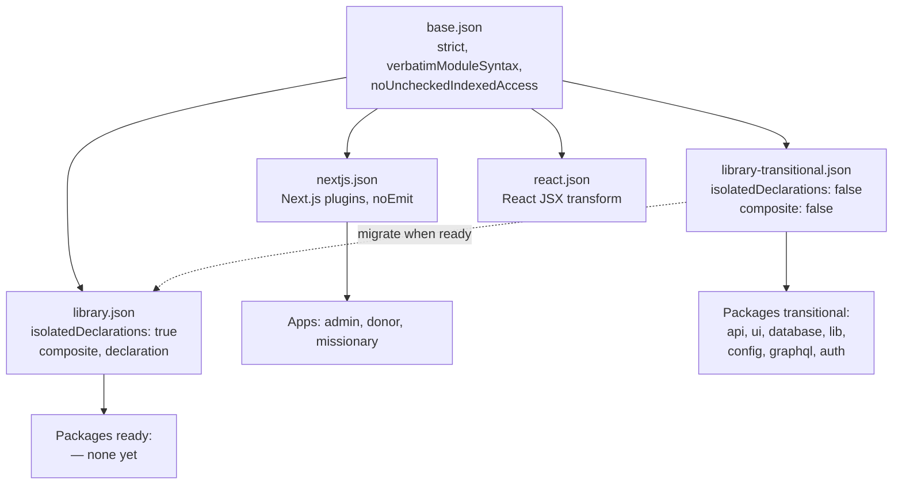

# TypeScript Config Hierarchy

This package provides shared TypeScript config presets for the monorepo.

**TypeScript 6 / 7 prep (no compiler bump here):** See `docs/guides/typescript-6-readiness.md` and `docs/ai/rules/typescript-future-proofing.md`. Run `bun run tsconfig:future-audit` for a quick local scan (non-blocking).

## Configs

- `base.json`
  - Monorepo strict baseline.
  - Enforces `strict`, `verbatimModuleSyntax`, and `noUncheckedIndexedAccess`.
  - Sets **`libReplacement`: true** and **`noUncheckedSideEffectImports`: false** explicitly so behavior stays aligned with TypeScript 5.9 until a deliberate upgrade adopts TypeScript 6.0 defaults (see [Announcing TypeScript 6.0](https://devblogs.microsoft.com/typescript/announcing-typescript-6-0/)).
  - Uses **`moduleResolution`: `Bundler`** and **`module`: `ESNext`** — the recommended combination for Next.js and Bun-bundled code; avoid legacy `node` / `node10` resolution (removed in TypeScript 7).
- `nextjs.json`
  - App-focused preset for Next.js workspaces.
  - Extends `base.json` and keeps `noEmit` for app typechecking.
- `library.json`
  - Package-focused preset for shared libraries.
  - Extends `base.json` and enables `isolatedDeclarations` for stricter, tooling-friendly declaration emit (see [TypeScript 5.5 release notes — isolatedDeclarations](https://www.typescriptlang.org/docs/handbook/release-notes/typescript-5-5.html#isolated-declarations)).
  - Sets `composite`, `declaration`, and `declarationMap`.
- `library-transitional.json`
  - Transitional preset for packages not yet ready for `isolatedDeclarations`.
  - Extends `base.json` directly.
  - Sets `composite: false`, `declaration: false`, and `declarationMap: false`.
  - Does not set `isolatedDeclarations` (inherits `false` from `base.json`).
- `react.json`
  - React library preset where `isolatedDeclarations` is not required.
  - Extends `base.json` and sets React JSX/library defaults.

## When To Use Which

| Scenario                                              | Config                                              |
| ----------------------------------------------------- | --------------------------------------------------- |
| Apps (`apps/*`)                                       | `@asym/typescript-config/nextjs.json`               |
| Packages ready for `isolatedDeclarations`             | `@asym/typescript-config/library.json`              |
| Packages **not yet** ready for `isolatedDeclarations` | `@asym/typescript-config/library-transitional.json` |
| Legacy/edge React scenarios                           | `@asym/typescript-config/react.json`                |

## Staged `isolatedDeclarations` Rollout

- `isolatedDeclarations` is enabled only in `library.json`.
- `base.json` sets `isolatedModules: true` but does **not** set `isolatedDeclarations` (remains off for consumers that do not extend `library.json`).
- This keeps app ergonomics unchanged while enforcing stronger declaration safety in shared packages that opt into `library.json`.

## Path aliases (`paths`) without `baseUrl`

Per the [TSConfig `paths` reference](https://www.typescriptlang.org/tsconfig#paths), **`paths` does not require `baseUrl`**. App and package tsconfigs in this repo use `paths` only (for example `@/*` → `./*`). Do not add `baseUrl` for new work — TypeScript 7 removes `baseUrl` ([progress update](https://devblogs.microsoft.com/typescript/progress-on-typescript-7-december-2025/)).

Related readiness context:

- TypeScript 6.0 announcement (defaults, deprecations): https://devblogs.microsoft.com/typescript/announcing-typescript-6-0/
- TypeScript 7 progress: https://devblogs.microsoft.com/typescript/progress-on-typescript-7-december-2025/
- TSConfig reference: https://www.typescriptlang.org/tsconfig

## Migration Examples

App:

```json
{
  "extends": "@asym/typescript-config/nextjs.json"
}
```

Package:

```json
{
  "extends": "@asym/typescript-config/library.json"
}
```

## Migration: Transitional -> Library

1. Run `bun run typecheck` and note any `isolatedDeclarations`-related errors (typically missing explicit return types on exported functions).
2. Add explicit return types to all exported functions flagged by the compiler.
3. Once zero errors remain, change the package `extends` from `library-transitional.json` to `library.json`.
4. Remove any redundant `lib` override if it matches `library.json` defaults.
5. Run `bun run typecheck` again to confirm.

## Configuration Hierarchy


